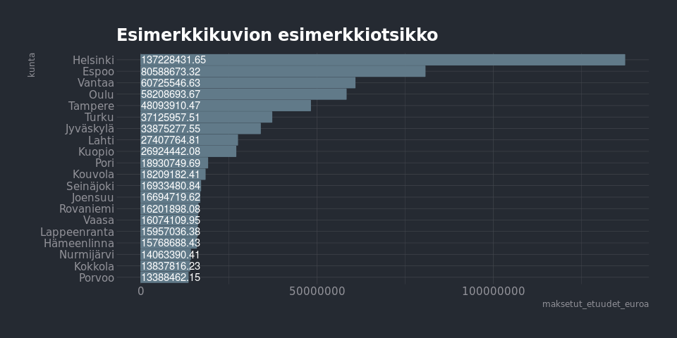

<table>
<thead>
<tr class="header">
<th>pvm</th>
<th>data</th>
<th>tekijä</th>
</tr>
</thead>
<tbody>
<tr class="odd">
<td>2019-02-19</td>
<td><a href="https://beta.avoindata.fi/data/fi/dataset/kelan-etuudet-ja-saajat">Kelan etuuksien saajat ja etuusmäärät</a></td>
<td>Markus Kainu</td>
</tr>
</tbody>
</table>

Käyttöesimerkkejä: Kelan etuuksien saajat ja etuusmäärät
========================================================

    library(dplyr)
    library(ggplot2)
    library(jsonlite)
    library(ckanr)
    library(readr)
    library(knitr)

Resurssien lataaminen
---------------------

    ckanr_setup(url = "https://beta.avoindata.fi/data/fi/")
    x <- package_search(q = "Kansaneläkelaitos", fq = "title:etuuksien")
    resources <- x$results[[1]]$resources
    dat <- read_csv2(resources[[1]]$url) # Lataa data
    meta <- fromJSON(txt = resources[[2]]$url) # Lataa metadata

Datan ja metadatan kuvailu
--------------------------

**Datan kuvaustieto**

    meta$description %>% cat()

Raportti sisältää kaikki Kelan maksamat keskeisimmät etuudet sekä tiedot
etuuksien saajista, maksetuista etuuksista ja keskimääräiset etuudet
(euroa/saaja). Eräistä etuuksista, esimerkiksi eläkkeet ja asumistuet,
ei ole tietoa vuoden aikana etuutta saaneista eikä keskimääräisistä
etuuksista. Niistä on vain poikkileikkaustiedot kuukausittain.

**Datan muuttujatieto**

    meta$resources$schema$fields[[1]] %>% kable(format = "markdown")

<table>
<thead>
<tr class="header">
<th align="left">name</th>
<th align="left">type</th>
<th align="left">format</th>
</tr>
</thead>
<tbody>
<tr class="odd">
<td align="left">vuosi</td>
<td align="left">integer</td>
<td align="left">default</td>
</tr>
<tr class="even">
<td align="left">etuus</td>
<td align="left">string</td>
<td align="left">default</td>
</tr>
<tr class="odd">
<td align="left">saajat</td>
<td align="left">string</td>
<td align="left">default</td>
</tr>
<tr class="even">
<td align="left">euroa_saaja</td>
<td align="left">string</td>
<td align="left">default</td>
</tr>
<tr class="odd">
<td align="left">kunta</td>
<td align="left">string</td>
<td align="left">default</td>
</tr>
</tbody>
</table>

**Datan ensimmäiset rivit**

    head(dat)  %>% kable(format = "markdown")

<table>
<thead>
<tr class="header">
<th align="right">vuosi</th>
<th align="left">etuus</th>
<th align="right">saajat</th>
<th align="right">euroa_saaja</th>
<th align="left">kunta</th>
</tr>
</thead>
<tbody>
<tr class="odd">
<td align="right">2018</td>
<td align="left">Elatustuki</td>
<td align="right">NA</td>
<td align="right">NA</td>
<td align="left">Akaa</td>
</tr>
<tr class="even">
<td align="right">2018</td>
<td align="left">Eläke-etuudet (pl. takuueläke)</td>
<td align="right">NA</td>
<td align="right">NA</td>
<td align="left">Akaa</td>
</tr>
<tr class="odd">
<td align="right">2018</td>
<td align="left">Eläketuki</td>
<td align="right">NA</td>
<td align="right">NA</td>
<td align="left">Akaa</td>
</tr>
<tr class="even">
<td align="right">2018</td>
<td align="left">Eläkkeensaajan asumistuki</td>
<td align="right">NA</td>
<td align="right">NA</td>
<td align="left">Akaa</td>
</tr>
<tr class="odd">
<td align="right">2018</td>
<td align="left">Erityishoitoraha</td>
<td align="right">22</td>
<td align="right">2.380646e+16</td>
<td align="left">Akaa</td>
</tr>
<tr class="even">
<td align="right">2018</td>
<td align="left">Koulumatkatuki</td>
<td align="right">434</td>
<td align="right">7.226750e+16</td>
<td align="left">Akaa</td>
</tr>
</tbody>
</table>

Kuvio
-----

    dat %>% 
      filter(vuosi == 2018,
             etuus == "Lapsilisä") %>% 
      arrange(desc(saajat)) %>% 
      slice(1:20) %>% 
      mutate(kunta = forcats::fct_reorder(kunta, saajat)) %>% 
      ggplot(aes(x = kunta, y = saajat, label = saajat)) + 
      geom_col() + 
      coord_flip() + 
      theme_minimal() +
      geom_text(aes(y = 0), hjust = 0, color = "white") +
      labs(title = "Esimerkkikuvion esimerkkiotsikko")

Datastore-api
-------------

Jos et tarvitse koko aineistoa, voit suodattaa siitä osio SQL:llä
käyttäen CKAN:n DataStore-rajapintaa.

Alla olevassa esimerkissä tehdään rajaus `kunta`-muuttujasta ja siis
etsitään vaan kuntaa *Veteli* koskevat tiedot.

    kunta <- "Veteli"
    res <- ckanr::ds_search_sql(sql = glue("SELECT * from \"{resources[[1]]$id}\" WHERE kunta LIKE '{kunta}'"), as = "table")
    res$records %>% 
      select(-`_full_text`, -`_id`) %>% 
      kable(format = "markdown")

<table>
<thead>
<tr class="header">
<th align="left">kunta</th>
<th align="left">saajat</th>
<th align="left">vuosi</th>
<th align="left">euroa_saaja</th>
<th align="left">etuus</th>
</tr>
</thead>
<tbody>
<tr class="odd">
<td align="left">Veteli</td>
<td align="left">NA</td>
<td align="left">2018</td>
<td align="left">NA</td>
<td align="left">Eläketuki</td>
</tr>
<tr class="even">
<td align="left">Veteli</td>
<td align="left">NA</td>
<td align="left">2018</td>
<td align="left">NA</td>
<td align="left">Elatustuki</td>
</tr>
<tr class="odd">
<td align="left">Veteli</td>
<td align="left">NA</td>
<td align="left">2018</td>
<td align="left">NA</td>
<td align="left">Eläke-etuudet (pl. takuueläke)</td>
</tr>
<tr class="even">
<td align="left">Veteli</td>
<td align="left">NA</td>
<td align="left">2018</td>
<td align="left">NA</td>
<td align="left">Eläkkeensaajan asumistuki</td>
</tr>
<tr class="odd">
<td align="left">Veteli</td>
<td align="left">6</td>
<td align="left">2018</td>
<td align="left">720.42169999999999</td>
<td align="left">Erityishoitoraha</td>
</tr>
<tr class="even">
<td align="left">Veteli</td>
<td align="left">78</td>
<td align="left">2018</td>
<td align="left">1169.4549999999999</td>
<td align="left">Koulumatkatuki</td>
</tr>
<tr class="odd">
<td align="left">Veteli</td>
<td align="left">69</td>
<td align="left">2018</td>
<td align="left">4396.6304</td>
<td align="left">Kuntoutus</td>
</tr>
<tr class="even">
<td align="left">Veteli</td>
<td align="left">15</td>
<td align="left">2018</td>
<td align="left">1742.3827000000001</td>
<td align="left">Kuntoutusraha</td>
</tr>
<tr class="odd">
<td align="left">Veteli</td>
<td align="left">286</td>
<td align="left">2018</td>
<td align="left">2737.9693000000002</td>
<td align="left">Lapsilisä</td>
</tr>
<tr class="even">
<td align="left">Veteli</td>
<td align="left">56</td>
<td align="left">2018</td>
<td align="left">2688.1235999999999</td>
<td align="left">Lastenhoidon tuet</td>
</tr>
<tr class="odd">
<td align="left">Veteli</td>
<td align="left">NA</td>
<td align="left">2018</td>
<td align="left">NA</td>
<td align="left">Opintolainahyvitys</td>
</tr>
<tr class="even">
<td align="left">Veteli</td>
<td align="left">NA</td>
<td align="left">2018</td>
<td align="left">NA</td>
<td align="left">Opintolainavähennys</td>
</tr>
<tr class="odd">
<td align="left">Veteli</td>
<td align="left">105</td>
<td align="left">2018</td>
<td align="left">3668.8578000000002</td>
<td align="left">Opintotuki</td>
</tr>
<tr class="even">
<td align="left">Veteli</td>
<td align="left">10</td>
<td align="left">2018</td>
<td align="left">2500</td>
<td align="left">Perhevapaakorvaus</td>
</tr>
<tr class="odd">
<td align="left">Veteli</td>
<td align="left">NA</td>
<td align="left">2018</td>
<td align="left">NA</td>
<td align="left">Perustoimeentulotuki</td>
</tr>
<tr class="even">
<td align="left">Veteli</td>
<td align="left">2107</td>
<td align="left">2018</td>
<td align="left">569.60789999999997</td>
<td align="left">Sairaanhoitokorvaukset</td>
</tr>
<tr class="odd">
<td align="left">Veteli</td>
<td align="left">188</td>
<td align="left">2018</td>
<td align="left">2715.9276</td>
<td align="left">Sairauspäivärahat</td>
</tr>
<tr class="even">
<td align="left">Veteli</td>
<td align="left">NA</td>
<td align="left">2018</td>
<td align="left">NA</td>
<td align="left">Sotilasavustus</td>
</tr>
<tr class="odd">
<td align="left">Veteli</td>
<td align="left">NA</td>
<td align="left">2018</td>
<td align="left">NA</td>
<td align="left">Takuueläke</td>
</tr>
<tr class="even">
<td align="left">Veteli</td>
<td align="left">109</td>
<td align="left">2018</td>
<td align="left">5008.3770000000004</td>
<td align="left">Työttömyysturva</td>
</tr>
<tr class="odd">
<td align="left">Veteli</td>
<td align="left">NA</td>
<td align="left">2018</td>
<td align="left">NA</td>
<td align="left">Vammaisetuudet</td>
</tr>
<tr class="even">
<td align="left">Veteli</td>
<td align="left">68</td>
<td align="left">2018</td>
<td align="left">6475.2489999999998</td>
<td align="left">Vanhempainpäiväraha</td>
</tr>
<tr class="odd">
<td align="left">Veteli</td>
<td align="left">13</td>
<td align="left">2018</td>
<td align="left">1426.2923000000001</td>
<td align="left">Vuosilomakustannuskorvaus</td>
</tr>
<tr class="even">
<td align="left">Veteli</td>
<td align="left">NA</td>
<td align="left">2018</td>
<td align="left">NA</td>
<td align="left">Yleinen asumistuki</td>
</tr>
<tr class="odd">
<td align="left">Veteli</td>
<td align="left">18</td>
<td align="left">2018</td>
<td align="left">202.3989</td>
<td align="left">Äitiysavustus</td>
</tr>
<tr class="even">
<td align="left">Veteli</td>
<td align="left">NA</td>
<td align="left">2017</td>
<td align="left">NA</td>
<td align="left">Elatustuki</td>
</tr>
<tr class="odd">
<td align="left">Veteli</td>
<td align="left">NA</td>
<td align="left">2017</td>
<td align="left">NA</td>
<td align="left">Eläke-etuudet (pl. takuueläke)</td>
</tr>
<tr class="even">
<td align="left">Veteli</td>
<td align="left">NA</td>
<td align="left">2017</td>
<td align="left">NA</td>
<td align="left">Eläketuki</td>
</tr>
<tr class="odd">
<td align="left">Veteli</td>
<td align="left">NA</td>
<td align="left">2017</td>
<td align="left">NA</td>
<td align="left">Eläkkeensaajan asumistuki</td>
</tr>
<tr class="even">
<td align="left">Veteli</td>
<td align="left">NA</td>
<td align="left">2017</td>
<td align="left">NA</td>
<td align="left">Erityishoitoraha</td>
</tr>
<tr class="odd">
<td align="left">Veteli</td>
<td align="left">81</td>
<td align="left">2017</td>
<td align="left">991.23419999999999</td>
<td align="left">Koulumatkatuki</td>
</tr>
<tr class="even">
<td align="left">Veteli</td>
<td align="left">63</td>
<td align="left">2017</td>
<td align="left">3663.261</td>
<td align="left">Kuntoutus</td>
</tr>
<tr class="odd">
<td align="left">Veteli</td>
<td align="left">23</td>
<td align="left">2017</td>
<td align="left">872.12909999999999</td>
<td align="left">Kuntoutusraha</td>
</tr>
<tr class="even">
<td align="left">Veteli</td>
<td align="left">293</td>
<td align="left">2017</td>
<td align="left">2745.0531000000001</td>
<td align="left">Lapsilisä</td>
</tr>
<tr class="odd">
<td align="left">Veteli</td>
<td align="left">65</td>
<td align="left">2017</td>
<td align="left">2388.8056999999999</td>
<td align="left">Lastenhoidon tuet</td>
</tr>
<tr class="even">
<td align="left">Veteli</td>
<td align="left">NA</td>
<td align="left">2017</td>
<td align="left">NA</td>
<td align="left">Opintolainavähennys</td>
</tr>
<tr class="odd">
<td align="left">Veteli</td>
<td align="left">112</td>
<td align="left">2017</td>
<td align="left">3318.0358000000001</td>
<td align="left">Opintotuki</td>
</tr>
<tr class="even">
<td align="left">Veteli</td>
<td align="left">4</td>
<td align="left">2017</td>
<td align="left">2500</td>
<td align="left">Perhevapaakorvaus</td>
</tr>
<tr class="odd">
<td align="left">Veteli</td>
<td align="left">NA</td>
<td align="left">2017</td>
<td align="left">NA</td>
<td align="left">Perustoimeentulotuki</td>
</tr>
<tr class="even">
<td align="left">Veteli</td>
<td align="left">2143</td>
<td align="left">2017</td>
<td align="left">581.09299999999996</td>
<td align="left">Sairaanhoitokorvaukset</td>
</tr>
<tr class="odd">
<td align="left">Veteli</td>
<td align="left">181</td>
<td align="left">2017</td>
<td align="left">2716.7817</td>
<td align="left">Sairauspäivärahat</td>
</tr>
<tr class="even">
<td align="left">Veteli</td>
<td align="left">7</td>
<td align="left">2017</td>
<td align="left">2326.6329000000001</td>
<td align="left">Sotilasavustus</td>
</tr>
<tr class="odd">
<td align="left">Veteli</td>
<td align="left">NA</td>
<td align="left">2017</td>
<td align="left">NA</td>
<td align="left">Takuueläke</td>
</tr>
<tr class="even">
<td align="left">Veteli</td>
<td align="left">122</td>
<td align="left">2017</td>
<td align="left">5731.9712</td>
<td align="left">Työttömyysturva</td>
</tr>
<tr class="odd">
<td align="left">Veteli</td>
<td align="left">NA</td>
<td align="left">2017</td>
<td align="left">NA</td>
<td align="left">Vammaisetuudet</td>
</tr>
<tr class="even">
<td align="left">Veteli</td>
<td align="left">65</td>
<td align="left">2017</td>
<td align="left">6983.9569000000001</td>
<td align="left">Vanhempainpäiväraha</td>
</tr>
<tr class="odd">
<td align="left">Veteli</td>
<td align="left">11</td>
<td align="left">2017</td>
<td align="left">1250.1909000000001</td>
<td align="left">Vuosilomakustannuskorvaus</td>
</tr>
<tr class="even">
<td align="left">Veteli</td>
<td align="left">NA</td>
<td align="left">2017</td>
<td align="left">NA</td>
<td align="left">Yleinen asumistuki</td>
</tr>
<tr class="odd">
<td align="left">Veteli</td>
<td align="left">28</td>
<td align="left">2017</td>
<td align="left">200.26859999999999</td>
<td align="left">Äitiysavustus</td>
</tr>
</tbody>
</table>
