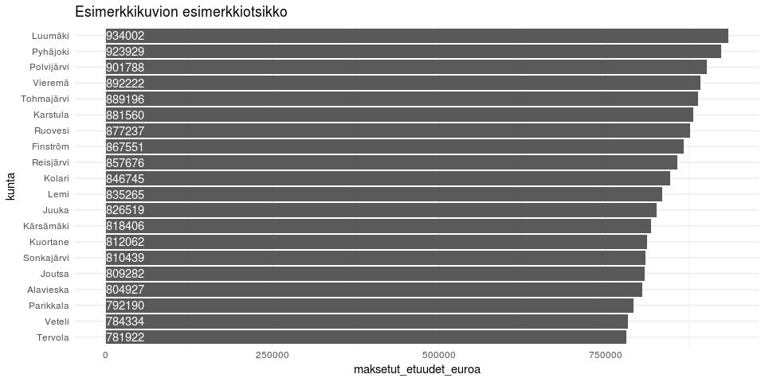
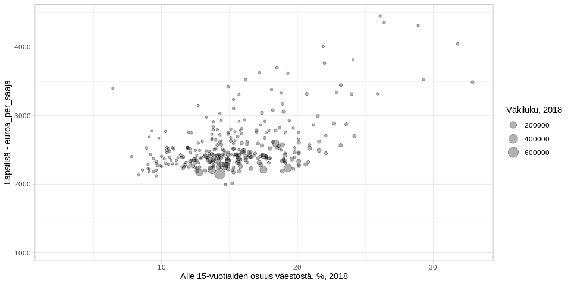

<table>
<thead>
<tr class="header">
<th style="text-align: left;">data</th>
<th style="text-align: left;">julkaistu</th>
<th style="text-align: left;">ylläpitäjä</th>
</tr>
</thead>
<tbody>
<tr class="odd">
<td style="text-align: left;"><a href='https://beta.avoindata.fi/data/fi/dataset/kelan-etuudet-ja-saajat'>Kelan etuuksien saajat ja maksetut etuudet</a></td>
<td style="text-align: left;">2019-02-19</td>
<td style="text-align: left;"><a href='mailto:markus.kainu@kela.fi'>Markus Kainu</a></td>
</tr>
</tbody>
</table>

    library(dplyr)
    library(ggplot2)
    library(jsonlite)
    library(ckanr)
    library(readr)
    library(knitr)
    library(glue)
    library(pxweb)

Resurssien lataaminen
---------------------

    ckanr_setup(url = "https://beta.avoindata.fi/data/fi/")
    x <- package_search(q = "Kansaneläkelaitos", fq = "title:etuuksien")
    resources <- x$results[[1]]$resources
    dat <- read_csv2(resources[[1]]$url) # Lataa data
    meta <- fromJSON(txt = resources[[2]]$url) # Lataa metadata

Datan ja metadatan kuvailu
--------------------------

**Datan kuvaustieto**

    meta$description %>% cat()

Aineisto sisältää tiedot Kelan maksamien etuuksien saajista, maksetuista
etuuksista ja keskimääräisistä etuuksista (euroa/saaja). Raportti kattaa
valtaosan Kelan maksamista etuuksista. Maksetuista etuuksista kuitenkin
puuttuvat työnantajien järjestämästä työterveyshuollosta, yrittäjien
työterveyshuollosta ja opiskelijoiden terveydenhuollosta maksetut
korvaukset. Eläkkeistä, vammaisetuuksista, asumistuista ja elatustuesta
ei tilastoida vuoden aikana etuutta saaneita henkilöitä eikä
keskimääräisiä etuuksia. Näistä etuuksista tilastoidaan ainoastaan
poikkileikkaushetken tiedot kuukausittain. Yleisen asumistuen
tilastoinnissa saajien tilastoyksikkö on asumistuen ruokakunta, ja
keskimääräinen etuus tilastoidaan asumistuen ruokakuntaa kohti.
Opintolainavähennys on verovähennys, joten maksettua etuutta ei ole.
Perustoimeentulotuen tilastoinnissa saajien tilastoyksikkö on
toimeentulotuen kotitalous, ja keskimääräinen etuus tilastoidaan
toimeentulotuen kotitaloutta kohti.

**Datan muuttujatieto**

    meta$resources$schema$fields[[1]] %>% kable(format = "markdown")

<table>
<colgroup>
<col style="width: 3%" />
<col style="width: 1%" />
<col style="width: 1%" />
<col style="width: 3%" />
<col style="width: 90%" />
</colgroup>
<thead>
<tr class="header">
<th style="text-align: left;">name</th>
<th style="text-align: left;">type</th>
<th style="text-align: left;">format</th>
<th style="text-align: left;">title</th>
<th style="text-align: left;">description</th>
</tr>
</thead>
<tbody>
<tr class="odd">
<td style="text-align: left;">kuntanumero</td>
<td style="text-align: left;">integer</td>
<td style="text-align: left;">default</td>
<td style="text-align: left;">Kuntanumero</td>
<td style="text-align: left;">Vuoden 2019 kuntajakoa vastaava kuntanumero</td>
</tr>
<tr class="even">
<td style="text-align: left;">kunta</td>
<td style="text-align: left;">string</td>
<td style="text-align: left;">default</td>
<td style="text-align: left;">Kuntanimi</td>
<td style="text-align: left;">Vuoden 2019 kuntajakoa vastaava kuntanimi suomeksi</td>
</tr>
<tr class="odd">
<td style="text-align: left;">vuosi</td>
<td style="text-align: left;">integer</td>
<td style="text-align: left;">default</td>
<td style="text-align: left;">Vuosi</td>
<td style="text-align: left;">Vuosi</td>
</tr>
<tr class="even">
<td style="text-align: left;">etuus</td>
<td style="text-align: left;">string</td>
<td style="text-align: left;">default</td>
<td style="text-align: left;">Etuus</td>
<td style="text-align: left;">Etuus, yksi seuravista: Elatustuki, Eläke-etuudet (ei sisällä takuueläkettä), Eläkkeensaajan asumistuki, Erityishoitoraha, Koulumatkatuki, Kuntoutus, Kuntoutusraha, Lapsilisä, Lastenhoidon tuet, Maahanmuuttajan erityistuki, Opintolainahyvitys, Opintolainan korkoavustus, Opintolainavähennys, Opintotuki (opintoraha, asumislisä, lainatakaus), Perustoimeentulotuki, Sairaanhoitokorvaukset, Sairauspäivärahat, Sotilasavustus, Takuueläke, Työttömyysturva, Vammaisetuudet, Vanhempainpäiväraha, Vuosilomakustannuskorvaukset työnantajille, Yleinen asumistuki, Äitiysavustus</td>
</tr>
<tr class="odd">
<td style="text-align: left;">saajat</td>
<td style="text-align: left;">integer</td>
<td style="text-align: left;">default</td>
<td style="text-align: left;">Saajat</td>
<td style="text-align: left;">Etuutta saaneiden määrä</td>
</tr>
<tr class="even">
<td style="text-align: left;">maksetut_etuudet_euroa</td>
<td style="text-align: left;">number</td>
<td style="text-align: left;">default</td>
<td style="text-align: left;">Maksetut etuudet Euroa</td>
<td style="text-align: left;">Etuuden kuntatason summa</td>
</tr>
<tr class="odd">
<td style="text-align: left;">euroa_per_saaja</td>
<td style="text-align: left;">number</td>
<td style="text-align: left;">default</td>
<td style="text-align: left;">Euroa/saaja</td>
<td style="text-align: left;">Etuuden saajakohtainen kuntatason keskiarvo</td>
</tr>
</tbody>
</table>

**Datan ensimmäiset rivit**

    head(dat)  %>% kable(format = "markdown")

<table>
<thead>
<tr class="header">
<th style="text-align: right;">kuntanumero</th>
<th style="text-align: left;">kunta</th>
<th style="text-align: right;">vuosi</th>
<th style="text-align: left;">etuus</th>
<th style="text-align: right;">saajat</th>
<th style="text-align: right;">maksetut_etuudet_euroa</th>
<th style="text-align: right;">euroa_per_saaja</th>
</tr>
</thead>
<tbody>
<tr class="odd">
<td style="text-align: right;">5</td>
<td style="text-align: left;">Alajärvi</td>
<td style="text-align: right;">2007</td>
<td style="text-align: left;">Kuntoutus</td>
<td style="text-align: right;">210</td>
<td style="text-align: right;">495806.5</td>
<td style="text-align: right;">2360.983</td>
</tr>
<tr class="even">
<td style="text-align: right;">9</td>
<td style="text-align: left;">Alavieska</td>
<td style="text-align: right;">2007</td>
<td style="text-align: left;">Kuntoutus</td>
<td style="text-align: right;">41</td>
<td style="text-align: right;">143525.1</td>
<td style="text-align: right;">3500.613</td>
</tr>
<tr class="odd">
<td style="text-align: right;">10</td>
<td style="text-align: left;">Alavus</td>
<td style="text-align: right;">2007</td>
<td style="text-align: left;">Kuntoutus</td>
<td style="text-align: right;">240</td>
<td style="text-align: right;">612924.3</td>
<td style="text-align: right;">2553.851</td>
</tr>
<tr class="even">
<td style="text-align: right;">16</td>
<td style="text-align: left;">Asikkala</td>
<td style="text-align: right;">2007</td>
<td style="text-align: left;">Kuntoutus</td>
<td style="text-align: right;">119</td>
<td style="text-align: right;">299270.7</td>
<td style="text-align: right;">2514.880</td>
</tr>
<tr class="odd">
<td style="text-align: right;">18</td>
<td style="text-align: left;">Askola</td>
<td style="text-align: right;">2007</td>
<td style="text-align: left;">Kuntoutus</td>
<td style="text-align: right;">52</td>
<td style="text-align: right;">175090.1</td>
<td style="text-align: right;">3367.118</td>
</tr>
<tr class="even">
<td style="text-align: right;">19</td>
<td style="text-align: left;">Aura</td>
<td style="text-align: right;">2007</td>
<td style="text-align: left;">Kuntoutus</td>
<td style="text-align: right;">76</td>
<td style="text-align: right;">205351.0</td>
<td style="text-align: right;">2701.987</td>
</tr>
</tbody>
</table>

Kuvio
-----

    dat %>% 
      filter(vuosi == 2018,
             etuus == "Lapsilisä") %>% 
      arrange(desc(maksetut_etuudet_euroa)) %>% 
      slice(1:20) %>% 
      mutate(kunta = forcats::fct_reorder(kunta, maksetut_etuudet_euroa)) %>% 
      ggplot(aes(x = kunta, y = maksetut_etuudet_euroa, label = maksetut_etuudet_euroa)) + 
      geom_col() + 
      coord_flip() + 
      theme_minimal() +
      geom_text(aes(y = 0), hjust = 0, color = "white") +
      labs(title = "Esimerkkikuvion esimerkkiotsikko")

Datan yhdistäminen Tilastokeskuksen kuntien avainlukuihin
---------------------------------------------------------

    tk_avainluvut <- 
      get_pxweb_data(url = "http://pxnet2.stat.fi/PXWeb/api/v1/fi/Kuntien_avainluvut/2018/kuntien_avainluvut_2018_viimeisin.px",
                     dims = list("Alue 2018" = c('*'),
                                 Tiedot = c('*')),
                     clean = FALSE)
    df <- left_join(dat, tk_avainluvut, by = c("kunta" = "Alue 2018"))
    # Piirretään hajontakuvio
    df2 <- df %>% 
      filter(vuosi == 2016,
             etuus == "Lapsilisä")

    ggplot(df2, aes(x = `Alle 15-vuotiaiden osuus väestöstä, %, 2017`, y = euroa_per_saaja, size = `Väkiluku, 2017`)) + 
      geom_point(alpha = .3) +
      labs(y = "Lapsilisä - euroa_per_saaja") + 
      theme_light()

Datastore-api
-------------

Jos et tarvitse koko aineistoa, voit suodattaa siitä osio SQL:llä
käyttäen CKAN:n DataStore-rajapintaa.

Alla olevassa esimerkissä tehdään rajaus `kunta`-muuttujasta ja siis
etsitään vaan kuntaa *Veteli* koskevat tiedot.

    kunta <- "Veteli"
    res <- ckanr::ds_search_sql(sql = glue("SELECT * from \"{resources[[1]]$id}\" WHERE kunta LIKE '{kunta}'"), as = "table")
    res$records %>% 
      select(-`_full_text`, -`_id`) %>% 
      kable(format = "markdown")

<table>
<thead>
<tr class="header">
<th style="text-align: left;">kunta</th>
<th style="text-align: left;">kuntanumero</th>
<th style="text-align: left;">vuosi</th>
<th style="text-align: left;">euroa_per_saaja</th>
<th style="text-align: left;">saajat</th>
<th style="text-align: left;">maksetut_etuudet_euroa</th>
<th style="text-align: left;">etuus</th>
</tr>
</thead>
<tbody>
<tr class="odd">
<td style="text-align: left;">Veteli</td>
<td style="text-align: left;">924</td>
<td style="text-align: left;">2007</td>
<td style="text-align: left;">2465,9658</td>
<td style="text-align: left;">74</td>
<td style="text-align: left;">182481,47</td>
<td style="text-align: left;">Kuntoutus</td>
</tr>
<tr class="even">
<td style="text-align: left;">Veteli</td>
<td style="text-align: left;">924</td>
<td style="text-align: left;">2007</td>
<td style="text-align: left;">NA</td>
<td style="text-align: left;">NA</td>
<td style="text-align: left;">NA</td>
<td style="text-align: left;">Opintolainan korkoavustus</td>
</tr>
<tr class="odd">
<td style="text-align: left;">Veteli</td>
<td style="text-align: left;">924</td>
<td style="text-align: left;">2007</td>
<td style="text-align: left;">NA</td>
<td style="text-align: left;">NA</td>
<td style="text-align: left;">48832,92</td>
<td style="text-align: left;">Yleinen asumistuki</td>
</tr>
<tr class="even">
<td style="text-align: left;">Veteli</td>
<td style="text-align: left;">924</td>
<td style="text-align: left;">2008</td>
<td style="text-align: left;">NA</td>
<td style="text-align: left;">NA</td>
<td style="text-align: left;">3137176,63</td>
<td style="text-align: left;">Eläke-etuudet (pl. takuueläke)</td>
</tr>
<tr class="odd">
<td style="text-align: left;">Veteli</td>
<td style="text-align: left;">924</td>
<td style="text-align: left;">2008</td>
<td style="text-align: left;">NA</td>
<td style="text-align: left;">NA</td>
<td style="text-align: left;">23217,44</td>
<td style="text-align: left;">Eläketuki</td>
</tr>
<tr class="even">
<td style="text-align: left;">Veteli</td>
<td style="text-align: left;">924</td>
<td style="text-align: left;">2008</td>
<td style="text-align: left;">NA</td>
<td style="text-align: left;">NA</td>
<td style="text-align: left;">194678,78</td>
<td style="text-align: left;">Eläkkeensaajan asumistuki</td>
</tr>
<tr class="odd">
<td style="text-align: left;">Veteli</td>
<td style="text-align: left;">924</td>
<td style="text-align: left;">2008</td>
<td style="text-align: left;">145,5850</td>
<td style="text-align: left;">4</td>
<td style="text-align: left;">582,34</td>
<td style="text-align: left;">Erityishoitoraha</td>
</tr>
<tr class="even">
<td style="text-align: left;">Veteli</td>
<td style="text-align: left;">924</td>
<td style="text-align: left;">2008</td>
<td style="text-align: left;">839,5539</td>
<td style="text-align: left;">99</td>
<td style="text-align: left;">83115,84</td>
<td style="text-align: left;">Koulumatkatuki</td>
</tr>
<tr class="odd">
<td style="text-align: left;">Veteli</td>
<td style="text-align: left;">924</td>
<td style="text-align: left;">2008</td>
<td style="text-align: left;">594,8900</td>
<td style="text-align: left;">61</td>
<td style="text-align: left;">36288,29</td>
<td style="text-align: left;">Kuntoutusraha</td>
</tr>
<tr class="even">
<td style="text-align: left;">Veteli</td>
<td style="text-align: left;">924</td>
<td style="text-align: left;">2008</td>
<td style="text-align: left;">3026,2486</td>
<td style="text-align: left;">79</td>
<td style="text-align: left;">239073,64</td>
<td style="text-align: left;">Kuntoutus</td>
</tr>
<tr class="odd">
<td style="text-align: left;">Veteli</td>
<td style="text-align: left;">924</td>
<td style="text-align: left;">2008</td>
<td style="text-align: left;">2385,1152</td>
<td style="text-align: left;">362</td>
<td style="text-align: left;">864188,30</td>
<td style="text-align: left;">Lapsilisä</td>
</tr>
<tr class="even">
<td style="text-align: left;">Veteli</td>
<td style="text-align: left;">924</td>
<td style="text-align: left;">2008</td>
<td style="text-align: left;">2602,6499</td>
<td style="text-align: left;">74</td>
<td style="text-align: left;">192596,09</td>
<td style="text-align: left;">Lastenhoidon tuet</td>
</tr>
<tr class="odd">
<td style="text-align: left;">Veteli</td>
<td style="text-align: left;">924</td>
<td style="text-align: left;">2008</td>
<td style="text-align: left;">NA</td>
<td style="text-align: left;">NA</td>
<td style="text-align: left;">6701,52</td>
<td style="text-align: left;">Maahanmuuttajan erityistuki</td>
</tr>
<tr class="even">
<td style="text-align: left;">Veteli</td>
<td style="text-align: left;">924</td>
<td style="text-align: left;">2008</td>
<td style="text-align: left;">NA</td>
<td style="text-align: left;">NA</td>
<td style="text-align: left;">NA</td>
<td style="text-align: left;">Opintolainan korkoavustus</td>
</tr>
<tr class="odd">
<td style="text-align: left;">Veteli</td>
<td style="text-align: left;">924</td>
<td style="text-align: left;">2008</td>
<td style="text-align: left;">2341,8724</td>
<td style="text-align: left;">195</td>
<td style="text-align: left;">386452,58</td>
<td style="text-align: left;">Opintotuki</td>
</tr>
<tr class="even">
<td style="text-align: left;">Veteli</td>
<td style="text-align: left;">924</td>
<td style="text-align: left;">2008</td>
<td style="text-align: left;">491,8733</td>
<td style="text-align: left;">2621</td>
<td style="text-align: left;">1289200,02</td>
<td style="text-align: left;">Sairaanhoitokorvaukset</td>
</tr>
<tr class="odd">
<td style="text-align: left;">Veteli</td>
<td style="text-align: left;">924</td>
<td style="text-align: left;">2008</td>
<td style="text-align: left;">2702,0146</td>
<td style="text-align: left;">231</td>
<td style="text-align: left;">624165,37</td>
<td style="text-align: left;">Sairauspäivärahat</td>
</tr>
<tr class="even">
<td style="text-align: left;">Veteli</td>
<td style="text-align: left;">924</td>
<td style="text-align: left;">2008</td>
<td style="text-align: left;">NA</td>
<td style="text-align: left;">NA</td>
<td style="text-align: left;">NA</td>
<td style="text-align: left;">Sotilasavustus</td>
</tr>
<tr class="odd">
<td style="text-align: left;">Veteli</td>
<td style="text-align: left;">924</td>
<td style="text-align: left;">2008</td>
<td style="text-align: left;">2794,1483</td>
<td style="text-align: left;">118</td>
<td style="text-align: left;">329709,50</td>
<td style="text-align: left;">Työttömyysturva</td>
</tr>
<tr class="even">
<td style="text-align: left;">Veteli</td>
<td style="text-align: left;">924</td>
<td style="text-align: left;">2008</td>
<td style="text-align: left;">NA</td>
<td style="text-align: left;">NA</td>
<td style="text-align: left;">443213,00</td>
<td style="text-align: left;">Vammaisetuudet</td>
</tr>
<tr class="odd">
<td style="text-align: left;">Veteli</td>
<td style="text-align: left;">924</td>
<td style="text-align: left;">2008</td>
<td style="text-align: left;">5505,8662</td>
<td style="text-align: left;">102</td>
<td style="text-align: left;">561598,35</td>
<td style="text-align: left;">Vanhempainpäiväraha</td>
</tr>
<tr class="even">
<td style="text-align: left;">Veteli</td>
<td style="text-align: left;">924</td>
<td style="text-align: left;">2008</td>
<td style="text-align: left;">1897,3291</td>
<td style="text-align: left;">11</td>
<td style="text-align: left;">20870,62</td>
<td style="text-align: left;">Vuosilomakustannuskorvaus</td>
</tr>
<tr class="odd">
<td style="text-align: left;">Veteli</td>
<td style="text-align: left;">924</td>
<td style="text-align: left;">2008</td>
<td style="text-align: left;">NA</td>
<td style="text-align: left;">NA</td>
<td style="text-align: left;">48041,03</td>
<td style="text-align: left;">Yleinen asumistuki</td>
</tr>
<tr class="even">
<td style="text-align: left;">Veteli</td>
<td style="text-align: left;">924</td>
<td style="text-align: left;">2008</td>
<td style="text-align: left;">167,5538</td>
<td style="text-align: left;">45</td>
<td style="text-align: left;">7539,92</td>
<td style="text-align: left;">Äitiysavustus</td>
</tr>
<tr class="odd">
<td style="text-align: left;">Veteli</td>
<td style="text-align: left;">924</td>
<td style="text-align: left;">2009</td>
<td style="text-align: left;">NA</td>
<td style="text-align: left;">NA</td>
<td style="text-align: left;">32501,23</td>
<td style="text-align: left;">Elatustuki</td>
</tr>
<tr class="even">
<td style="text-align: left;">Veteli</td>
<td style="text-align: left;">924</td>
<td style="text-align: left;">2009</td>
<td style="text-align: left;">NA</td>
<td style="text-align: left;">NA</td>
<td style="text-align: left;">3169924,79</td>
<td style="text-align: left;">Eläke-etuudet (pl. takuueläke)</td>
</tr>
<tr class="odd">
<td style="text-align: left;">Veteli</td>
<td style="text-align: left;">924</td>
<td style="text-align: left;">2009</td>
<td style="text-align: left;">NA</td>
<td style="text-align: left;">NA</td>
<td style="text-align: left;">3334,30</td>
<td style="text-align: left;">Eläketuki</td>
</tr>
<tr class="even">
<td style="text-align: left;">Veteli</td>
<td style="text-align: left;">924</td>
<td style="text-align: left;">2009</td>
<td style="text-align: left;">NA</td>
<td style="text-align: left;">NA</td>
<td style="text-align: left;">188081,81</td>
<td style="text-align: left;">Eläkkeensaajan asumistuki</td>
</tr>
<tr class="odd">
<td style="text-align: left;">Veteli</td>
<td style="text-align: left;">924</td>
<td style="text-align: left;">2009</td>
<td style="text-align: left;">NA</td>
<td style="text-align: left;">NA</td>
<td style="text-align: left;">13466,19</td>
<td style="text-align: left;">Erityishoitoraha</td>
</tr>
<tr class="even">
<td style="text-align: left;">Veteli</td>
<td style="text-align: left;">924</td>
<td style="text-align: left;">2009</td>
<td style="text-align: left;">NA</td>
<td style="text-align: left;">NA</td>
<td style="text-align: left;">74764,81</td>
<td style="text-align: left;">Koulumatkatuki</td>
</tr>
<tr class="odd">
<td style="text-align: left;">Veteli</td>
<td style="text-align: left;">924</td>
<td style="text-align: left;">2009</td>
<td style="text-align: left;">NA</td>
<td style="text-align: left;">NA</td>
<td style="text-align: left;">167476,60</td>
<td style="text-align: left;">Kuntoutus</td>
</tr>
<tr class="even">
<td style="text-align: left;">Veteli</td>
<td style="text-align: left;">924</td>
<td style="text-align: left;">2009</td>
<td style="text-align: left;">NA</td>
<td style="text-align: left;">NA</td>
<td style="text-align: left;">30979,49</td>
<td style="text-align: left;">Kuntoutusraha</td>
</tr>
<tr class="odd">
<td style="text-align: left;">Veteli</td>
<td style="text-align: left;">924</td>
<td style="text-align: left;">2009</td>
<td style="text-align: left;">NA</td>
<td style="text-align: left;">NA</td>
<td style="text-align: left;">872723,10</td>
<td style="text-align: left;">Lapsilisä</td>
</tr>
<tr class="even">
<td style="text-align: left;">Veteli</td>
<td style="text-align: left;">924</td>
<td style="text-align: left;">2009</td>
<td style="text-align: left;">NA</td>
<td style="text-align: left;">NA</td>
<td style="text-align: left;">210712,82</td>
<td style="text-align: left;">Lastenhoidon tuet</td>
</tr>
<tr class="odd">
<td style="text-align: left;">Veteli</td>
<td style="text-align: left;">924</td>
<td style="text-align: left;">2009</td>
<td style="text-align: left;">NA</td>
<td style="text-align: left;">NA</td>
<td style="text-align: left;">7009,56</td>
<td style="text-align: left;">Maahanmuuttajan erityistuki</td>
</tr>
<tr class="even">
<td style="text-align: left;">Veteli</td>
<td style="text-align: left;">924</td>
<td style="text-align: left;">2009</td>
<td style="text-align: left;">NA</td>
<td style="text-align: left;">NA</td>
<td style="text-align: left;">NA</td>
<td style="text-align: left;">Opintolainan korkoavustus</td>
</tr>
<tr class="odd">
<td style="text-align: left;">Veteli</td>
<td style="text-align: left;">924</td>
<td style="text-align: left;">2009</td>
<td style="text-align: left;">NA</td>
<td style="text-align: left;">NA</td>
<td style="text-align: left;">445657,11</td>
<td style="text-align: left;">Opintotuki</td>
</tr>
<tr class="even">
<td style="text-align: left;">Veteli</td>
<td style="text-align: left;">924</td>
<td style="text-align: left;">2009</td>
<td style="text-align: left;">NA</td>
<td style="text-align: left;">NA</td>
<td style="text-align: left;">1154894,24</td>
<td style="text-align: left;">Sairaanhoitokorvaukset</td>
</tr>
<tr class="odd">
<td style="text-align: left;">Veteli</td>
<td style="text-align: left;">924</td>
<td style="text-align: left;">2009</td>
<td style="text-align: left;">NA</td>
<td style="text-align: left;">NA</td>
<td style="text-align: left;">557225,94</td>
<td style="text-align: left;">Sairauspäivärahat</td>
</tr>
<tr class="even">
<td style="text-align: left;">Veteli</td>
<td style="text-align: left;">924</td>
<td style="text-align: left;">2009</td>
<td style="text-align: left;">NA</td>
<td style="text-align: left;">NA</td>
<td style="text-align: left;">NA</td>
<td style="text-align: left;">Sotilasavustus</td>
</tr>
<tr class="odd">
<td style="text-align: left;">Veteli</td>
<td style="text-align: left;">924</td>
<td style="text-align: left;">2009</td>
<td style="text-align: left;">NA</td>
<td style="text-align: left;">NA</td>
<td style="text-align: left;">450213,48</td>
<td style="text-align: left;">Työttömyysturva</td>
</tr>
<tr class="even">
<td style="text-align: left;">Veteli</td>
<td style="text-align: left;">924</td>
<td style="text-align: left;">2009</td>
<td style="text-align: left;">NA</td>
<td style="text-align: left;">NA</td>
<td style="text-align: left;">475638,00</td>
<td style="text-align: left;">Vammaisetuudet</td>
</tr>
<tr class="odd">
<td style="text-align: left;">Veteli</td>
<td style="text-align: left;">924</td>
<td style="text-align: left;">2009</td>
<td style="text-align: left;">NA</td>
<td style="text-align: left;">NA</td>
<td style="text-align: left;">717482,57</td>
<td style="text-align: left;">Vanhempainpäiväraha</td>
</tr>
<tr class="even">
<td style="text-align: left;">Veteli</td>
<td style="text-align: left;">924</td>
<td style="text-align: left;">2009</td>
<td style="text-align: left;">NA</td>
<td style="text-align: left;">NA</td>
<td style="text-align: left;">31663,45</td>
<td style="text-align: left;">Vuosilomakustannuskorvaus</td>
</tr>
<tr class="odd">
<td style="text-align: left;">Veteli</td>
<td style="text-align: left;">924</td>
<td style="text-align: left;">2009</td>
<td style="text-align: left;">NA</td>
<td style="text-align: left;">NA</td>
<td style="text-align: left;">64164,95</td>
<td style="text-align: left;">Yleinen asumistuki</td>
</tr>
<tr class="even">
<td style="text-align: left;">Veteli</td>
<td style="text-align: left;">924</td>
<td style="text-align: left;">2009</td>
<td style="text-align: left;">NA</td>
<td style="text-align: left;">NA</td>
<td style="text-align: left;">9291,66</td>
<td style="text-align: left;">Äitiysavustus</td>
</tr>
<tr class="odd">
<td style="text-align: left;">Veteli</td>
<td style="text-align: left;">924</td>
<td style="text-align: left;">2010</td>
<td style="text-align: left;">NA</td>
<td style="text-align: left;">NA</td>
<td style="text-align: left;">53067,58</td>
<td style="text-align: left;">Elatustuki</td>
</tr>
<tr class="even">
<td style="text-align: left;">Veteli</td>
<td style="text-align: left;">924</td>
<td style="text-align: left;">2010</td>
<td style="text-align: left;">NA</td>
<td style="text-align: left;">NA</td>
<td style="text-align: left;">3032383,92</td>
<td style="text-align: left;">Eläke-etuudet (pl. takuueläke)</td>
</tr>
<tr class="odd">
<td style="text-align: left;">Veteli</td>
<td style="text-align: left;">924</td>
<td style="text-align: left;">2010</td>
<td style="text-align: left;">NA</td>
<td style="text-align: left;">NA</td>
<td style="text-align: left;">194003,85</td>
<td style="text-align: left;">Eläkkeensaajan asumistuki</td>
</tr>
<tr class="even">
<td style="text-align: left;">Veteli</td>
<td style="text-align: left;">924</td>
<td style="text-align: left;">2010</td>
<td style="text-align: left;">NA</td>
<td style="text-align: left;">NA</td>
<td style="text-align: left;">NA</td>
<td style="text-align: left;">Erityishoitoraha</td>
</tr>
<tr class="odd">
<td style="text-align: left;">Veteli</td>
<td style="text-align: left;">924</td>
<td style="text-align: left;">2010</td>
<td style="text-align: left;">677,7432</td>
<td style="text-align: left;">97</td>
<td style="text-align: left;">65741,09</td>
<td style="text-align: left;">Koulumatkatuki</td>
</tr>
<tr class="even">
<td style="text-align: left;">Veteli</td>
<td style="text-align: left;">924</td>
<td style="text-align: left;">2010</td>
<td style="text-align: left;">2576,9737</td>
<td style="text-align: left;">67</td>
<td style="text-align: left;">172657,24</td>
<td style="text-align: left;">Kuntoutus</td>
</tr>
<tr class="odd">
<td style="text-align: left;">Veteli</td>
<td style="text-align: left;">924</td>
<td style="text-align: left;">2010</td>
<td style="text-align: left;">585,4067</td>
<td style="text-align: left;">45</td>
<td style="text-align: left;">26343,30</td>
<td style="text-align: left;">Kuntoutusraha</td>
</tr>
<tr class="even">
<td style="text-align: left;">Veteli</td>
<td style="text-align: left;">924</td>
<td style="text-align: left;">2010</td>
<td style="text-align: left;">2517,2427</td>
<td style="text-align: left;">354</td>
<td style="text-align: left;">893548,00</td>
<td style="text-align: left;">Lapsilisä</td>
</tr>
<tr class="odd">
<td style="text-align: left;">Veteli</td>
<td style="text-align: left;">924</td>
<td style="text-align: left;">2010</td>
<td style="text-align: left;">2561,0422</td>
<td style="text-align: left;">100</td>
<td style="text-align: left;">256104,22</td>
<td style="text-align: left;">Lastenhoidon tuet</td>
</tr>
<tr class="even">
<td style="text-align: left;">Veteli</td>
<td style="text-align: left;">924</td>
<td style="text-align: left;">2010</td>
<td style="text-align: left;">NA</td>
<td style="text-align: left;">NA</td>
<td style="text-align: left;">7009,56</td>
<td style="text-align: left;">Maahanmuuttajan erityistuki</td>
</tr>
<tr class="odd">
<td style="text-align: left;">Veteli</td>
<td style="text-align: left;">924</td>
<td style="text-align: left;">2010</td>
<td style="text-align: left;">NA</td>
<td style="text-align: left;">NA</td>
<td style="text-align: left;">NA</td>
<td style="text-align: left;">Opintolainavähennys</td>
</tr>
<tr class="even">
<td style="text-align: left;">Veteli</td>
<td style="text-align: left;">924</td>
<td style="text-align: left;">2010</td>
<td style="text-align: left;">2967,6209</td>
<td style="text-align: left;">184</td>
<td style="text-align: left;">437075,51</td>
<td style="text-align: left;">Opintotuki</td>
</tr>
<tr class="odd">
<td style="text-align: left;">Veteli</td>
<td style="text-align: left;">924</td>
<td style="text-align: left;">2010</td>
<td style="text-align: left;">454,4704</td>
<td style="text-align: left;">2579</td>
<td style="text-align: left;">1172079,11</td>
<td style="text-align: left;">Sairaanhoitokorvaukset</td>
</tr>
<tr class="even">
<td style="text-align: left;">Veteli</td>
<td style="text-align: left;">924</td>
<td style="text-align: left;">2010</td>
<td style="text-align: left;">3229,7191</td>
<td style="text-align: left;">197</td>
<td style="text-align: left;">636254,67</td>
<td style="text-align: left;">Sairauspäivärahat</td>
</tr>
<tr class="odd">
<td style="text-align: left;">Veteli</td>
<td style="text-align: left;">924</td>
<td style="text-align: left;">2010</td>
<td style="text-align: left;">NA</td>
<td style="text-align: left;">NA</td>
<td style="text-align: left;">NA</td>
<td style="text-align: left;">Sotilasavustus</td>
</tr>
<tr class="even">
<td style="text-align: left;">Veteli</td>
<td style="text-align: left;">924</td>
<td style="text-align: left;">2010</td>
<td style="text-align: left;">3545,5389</td>
<td style="text-align: left;">135</td>
<td style="text-align: left;">478647,75</td>
<td style="text-align: left;">Työttömyysturva</td>
</tr>
<tr class="odd">
<td style="text-align: left;">Veteli</td>
<td style="text-align: left;">924</td>
<td style="text-align: left;">2010</td>
<td style="text-align: left;">NA</td>
<td style="text-align: left;">NA</td>
<td style="text-align: left;">522900,00</td>
<td style="text-align: left;">Vammaisetuudet</td>
</tr>
<tr class="even">
<td style="text-align: left;">Veteli</td>
<td style="text-align: left;">924</td>
<td style="text-align: left;">2010</td>
<td style="text-align: left;">5885,1740</td>
<td style="text-align: left;">102</td>
<td style="text-align: left;">600287,75</td>
<td style="text-align: left;">Vanhempainpäiväraha</td>
</tr>
<tr class="odd">
<td style="text-align: left;">Veteli</td>
<td style="text-align: left;">924</td>
<td style="text-align: left;">2010</td>
<td style="text-align: left;">2206,9100</td>
<td style="text-align: left;">17</td>
<td style="text-align: left;">37517,47</td>
<td style="text-align: left;">Vuosilomakustannuskorvaus</td>
</tr>
<tr class="even">
<td style="text-align: left;">Veteli</td>
<td style="text-align: left;">924</td>
<td style="text-align: left;">2010</td>
<td style="text-align: left;">NA</td>
<td style="text-align: left;">NA</td>
<td style="text-align: left;">63389,88</td>
<td style="text-align: left;">Yleinen asumistuki</td>
</tr>
<tr class="odd">
<td style="text-align: left;">Veteli</td>
<td style="text-align: left;">924</td>
<td style="text-align: left;">2010</td>
<td style="text-align: left;">165,5544</td>
<td style="text-align: left;">36</td>
<td style="text-align: left;">5959,96</td>
<td style="text-align: left;">Äitiysavustus</td>
</tr>
<tr class="even">
<td style="text-align: left;">Veteli</td>
<td style="text-align: left;">924</td>
<td style="text-align: left;">2011</td>
<td style="text-align: left;">NA</td>
<td style="text-align: left;">NA</td>
<td style="text-align: left;">55121,53</td>
<td style="text-align: left;">Elatustuki</td>
</tr>
<tr class="odd">
<td style="text-align: left;">Veteli</td>
<td style="text-align: left;">924</td>
<td style="text-align: left;">2011</td>
<td style="text-align: left;">NA</td>
<td style="text-align: left;">NA</td>
<td style="text-align: left;">2933946,89</td>
<td style="text-align: left;">Eläke-etuudet (pl. takuueläke)</td>
</tr>
<tr class="even">
<td style="text-align: left;">Veteli</td>
<td style="text-align: left;">924</td>
<td style="text-align: left;">2011</td>
<td style="text-align: left;">NA</td>
<td style="text-align: left;">NA</td>
<td style="text-align: left;">201775,24</td>
<td style="text-align: left;">Eläkkeensaajan asumistuki</td>
</tr>
<tr class="odd">
<td style="text-align: left;">Veteli</td>
<td style="text-align: left;">924</td>
<td style="text-align: left;">2011</td>
<td style="text-align: left;">NA</td>
<td style="text-align: left;">NA</td>
<td style="text-align: left;">NA</td>
<td style="text-align: left;">Erityishoitoraha</td>
</tr>
<tr class="even">
<td style="text-align: left;">Veteli</td>
<td style="text-align: left;">924</td>
<td style="text-align: left;">2011</td>
<td style="text-align: left;">770,2730</td>
<td style="text-align: left;">96</td>
<td style="text-align: left;">73946,21</td>
<td style="text-align: left;">Koulumatkatuki</td>
</tr>
<tr class="odd">
<td style="text-align: left;">Veteli</td>
<td style="text-align: left;">924</td>
<td style="text-align: left;">2011</td>
<td style="text-align: left;">2796,1289</td>
<td style="text-align: left;">72</td>
<td style="text-align: left;">201321,28</td>
<td style="text-align: left;">Kuntoutus</td>
</tr>
<tr class="even">
<td style="text-align: left;">Veteli</td>
<td style="text-align: left;">924</td>
<td style="text-align: left;">2011</td>
<td style="text-align: left;">836,4235</td>
<td style="text-align: left;">48</td>
<td style="text-align: left;">40148,33</td>
<td style="text-align: left;">Kuntoutusraha</td>
</tr>
<tr class="odd">
<td style="text-align: left;">Veteli</td>
<td style="text-align: left;">924</td>
<td style="text-align: left;">2011</td>
<td style="text-align: left;">2557,0232</td>
<td style="text-align: left;">344</td>
<td style="text-align: left;">881858,84</td>
<td style="text-align: left;">Lapsilisä</td>
</tr>
<tr class="even">
<td style="text-align: left;">Veteli</td>
<td style="text-align: left;">924</td>
<td style="text-align: left;">2011</td>
<td style="text-align: left;">2788,3607</td>
<td style="text-align: left;">89</td>
<td style="text-align: left;">248164,10</td>
<td style="text-align: left;">Lastenhoidon tuet</td>
</tr>
<tr class="odd">
<td style="text-align: left;">Veteli</td>
<td style="text-align: left;">924</td>
<td style="text-align: left;">2011</td>
<td style="text-align: left;">NA</td>
<td style="text-align: left;">NA</td>
<td style="text-align: left;">1172,92</td>
<td style="text-align: left;">Maahanmuuttajan erityistuki</td>
</tr>
<tr class="even">
<td style="text-align: left;">Veteli</td>
<td style="text-align: left;">924</td>
<td style="text-align: left;">2011</td>
<td style="text-align: left;">NA</td>
<td style="text-align: left;">NA</td>
<td style="text-align: left;">NA</td>
<td style="text-align: left;">Opintolainavähennys</td>
</tr>
<tr class="odd">
<td style="text-align: left;">Veteli</td>
<td style="text-align: left;">924</td>
<td style="text-align: left;">2011</td>
<td style="text-align: left;">3199,5279</td>
<td style="text-align: left;">166</td>
<td style="text-align: left;">376079,23</td>
<td style="text-align: left;">Opintotuki</td>
</tr>
<tr class="even">
<td style="text-align: left;">Veteli</td>
<td style="text-align: left;">924</td>
<td style="text-align: left;">2011</td>
<td style="text-align: left;">474,2872</td>
<td style="text-align: left;">2597</td>
<td style="text-align: left;">1231723,77</td>
<td style="text-align: left;">Sairaanhoitokorvaukset</td>
</tr>
<tr class="odd">
<td style="text-align: left;">Veteli</td>
<td style="text-align: left;">924</td>
<td style="text-align: left;">2011</td>
<td style="text-align: left;">3120,8282</td>
<td style="text-align: left;">193</td>
<td style="text-align: left;">602319,85</td>
<td style="text-align: left;">Sairauspäivärahat</td>
</tr>
<tr class="even">
<td style="text-align: left;">Veteli</td>
<td style="text-align: left;">924</td>
<td style="text-align: left;">2011</td>
<td style="text-align: left;">NA</td>
<td style="text-align: left;">NA</td>
<td style="text-align: left;">NA</td>
<td style="text-align: left;">Sotilasavustus</td>
</tr>
<tr class="odd">
<td style="text-align: left;">Veteli</td>
<td style="text-align: left;">924</td>
<td style="text-align: left;">2011</td>
<td style="text-align: left;">NA</td>
<td style="text-align: left;">NA</td>
<td style="text-align: left;">84207,00</td>
<td style="text-align: left;">Takuueläke</td>
</tr>
<tr class="even">
<td style="text-align: left;">Veteli</td>
<td style="text-align: left;">924</td>
<td style="text-align: left;">2011</td>
<td style="text-align: left;">3915,3760</td>
<td style="text-align: left;">115</td>
<td style="text-align: left;">450268,24</td>
<td style="text-align: left;">Työttömyysturva</td>
</tr>
<tr class="odd">
<td style="text-align: left;">Veteli</td>
<td style="text-align: left;">924</td>
<td style="text-align: left;">2011</td>
<td style="text-align: left;">NA</td>
<td style="text-align: left;">NA</td>
<td style="text-align: left;">532851,00</td>
<td style="text-align: left;">Vammaisetuudet</td>
</tr>
<tr class="even">
<td style="text-align: left;">Veteli</td>
<td style="text-align: left;">924</td>
<td style="text-align: left;">2011</td>
<td style="text-align: left;">4850,2512</td>
<td style="text-align: left;">98</td>
<td style="text-align: left;">475324,62</td>
<td style="text-align: left;">Vanhempainpäiväraha</td>
</tr>
<tr class="odd">
<td style="text-align: left;">Veteli</td>
<td style="text-align: left;">924</td>
<td style="text-align: left;">2011</td>
<td style="text-align: left;">1985,9000</td>
<td style="text-align: left;">10</td>
<td style="text-align: left;">19859,00</td>
<td style="text-align: left;">Vuosilomakustannuskorvaus</td>
</tr>
<tr class="even">
<td style="text-align: left;">Veteli</td>
<td style="text-align: left;">924</td>
<td style="text-align: left;">2011</td>
<td style="text-align: left;">NA</td>
<td style="text-align: left;">NA</td>
<td style="text-align: left;">63874,29</td>
<td style="text-align: left;">Yleinen asumistuki</td>
</tr>
<tr class="odd">
<td style="text-align: left;">Veteli</td>
<td style="text-align: left;">924</td>
<td style="text-align: left;">2011</td>
<td style="text-align: left;">169,9367</td>
<td style="text-align: left;">36</td>
<td style="text-align: left;">6117,72</td>
<td style="text-align: left;">Äitiysavustus</td>
</tr>
<tr class="even">
<td style="text-align: left;">Veteli</td>
<td style="text-align: left;">924</td>
<td style="text-align: left;">2012</td>
<td style="text-align: left;">NA</td>
<td style="text-align: left;">NA</td>
<td style="text-align: left;">60917,19</td>
<td style="text-align: left;">Elatustuki</td>
</tr>
<tr class="odd">
<td style="text-align: left;">Veteli</td>
<td style="text-align: left;">924</td>
<td style="text-align: left;">2012</td>
<td style="text-align: left;">NA</td>
<td style="text-align: left;">NA</td>
<td style="text-align: left;">2918677,23</td>
<td style="text-align: left;">Eläke-etuudet (pl. takuueläke)</td>
</tr>
<tr class="even">
<td style="text-align: left;">Veteli</td>
<td style="text-align: left;">924</td>
<td style="text-align: left;">2012</td>
<td style="text-align: left;">NA</td>
<td style="text-align: left;">NA</td>
<td style="text-align: left;">198573,02</td>
<td style="text-align: left;">Eläkkeensaajan asumistuki</td>
</tr>
<tr class="odd">
<td style="text-align: left;">Veteli</td>
<td style="text-align: left;">924</td>
<td style="text-align: left;">2012</td>
<td style="text-align: left;">118,2500</td>
<td style="text-align: left;">7</td>
<td style="text-align: left;">827,75</td>
<td style="text-align: left;">Erityishoitoraha</td>
</tr>
<tr class="even">
<td style="text-align: left;">Veteli</td>
<td style="text-align: left;">924</td>
<td style="text-align: left;">2012</td>
<td style="text-align: left;">865,0768</td>
<td style="text-align: left;">97</td>
<td style="text-align: left;">83912,45</td>
<td style="text-align: left;">Koulumatkatuki</td>
</tr>
<tr class="odd">
<td style="text-align: left;">Veteli</td>
<td style="text-align: left;">924</td>
<td style="text-align: left;">2012</td>
<td style="text-align: left;">3004,2849</td>
<td style="text-align: left;">74</td>
<td style="text-align: left;">222317,08</td>
<td style="text-align: left;">Kuntoutus</td>
</tr>
<tr class="even">
<td style="text-align: left;">Veteli</td>
<td style="text-align: left;">924</td>
<td style="text-align: left;">2012</td>
<td style="text-align: left;">1077,1951</td>
<td style="text-align: left;">53</td>
<td style="text-align: left;">57091,34</td>
<td style="text-align: left;">Kuntoutusraha</td>
</tr>
<tr class="odd">
<td style="text-align: left;">Veteli</td>
<td style="text-align: left;">924</td>
<td style="text-align: left;">2012</td>
<td style="text-align: left;">2709,6454</td>
<td style="text-align: left;">327</td>
<td style="text-align: left;">886345,33</td>
<td style="text-align: left;">Lapsilisä</td>
</tr>
<tr class="even">
<td style="text-align: left;">Veteli</td>
<td style="text-align: left;">924</td>
<td style="text-align: left;">2012</td>
<td style="text-align: left;">2401,9948</td>
<td style="text-align: left;">91</td>
<td style="text-align: left;">218581,53</td>
<td style="text-align: left;">Lastenhoidon tuet</td>
</tr>
<tr class="odd">
<td style="text-align: left;">Veteli</td>
<td style="text-align: left;">924</td>
<td style="text-align: left;">2012</td>
<td style="text-align: left;">NA</td>
<td style="text-align: left;">NA</td>
<td style="text-align: left;">NA</td>
<td style="text-align: left;">Opintolainan korkoavustus</td>
</tr>
<tr class="even">
<td style="text-align: left;">Veteli</td>
<td style="text-align: left;">924</td>
<td style="text-align: left;">2012</td>
<td style="text-align: left;">NA</td>
<td style="text-align: left;">NA</td>
<td style="text-align: left;">NA</td>
<td style="text-align: left;">Opintolainavähennys</td>
</tr>
<tr class="odd">
<td style="text-align: left;">Veteli</td>
<td style="text-align: left;">924</td>
<td style="text-align: left;">2012</td>
<td style="text-align: left;">3044,6836</td>
<td style="text-align: left;">152</td>
<td style="text-align: left;">289027,82</td>
<td style="text-align: left;">Opintotuki</td>
</tr>
<tr class="even">
<td style="text-align: left;">Veteli</td>
<td style="text-align: left;">924</td>
<td style="text-align: left;">2012</td>
<td style="text-align: left;">508,7893</td>
<td style="text-align: left;">2614</td>
<td style="text-align: left;">1329975,22</td>
<td style="text-align: left;">Sairaanhoitokorvaukset</td>
</tr>
<tr class="odd">
<td style="text-align: left;">Veteli</td>
<td style="text-align: left;">924</td>
<td style="text-align: left;">2012</td>
<td style="text-align: left;">2698,1422</td>
<td style="text-align: left;">195</td>
<td style="text-align: left;">526137,72</td>
<td style="text-align: left;">Sairauspäivärahat</td>
</tr>
<tr class="even">
<td style="text-align: left;">Veteli</td>
<td style="text-align: left;">924</td>
<td style="text-align: left;">2012</td>
<td style="text-align: left;">2882,5725</td>
<td style="text-align: left;">4</td>
<td style="text-align: left;">11530,29</td>
<td style="text-align: left;">Sotilasavustus</td>
</tr>
<tr class="odd">
<td style="text-align: left;">Veteli</td>
<td style="text-align: left;">924</td>
<td style="text-align: left;">2012</td>
<td style="text-align: left;">NA</td>
<td style="text-align: left;">NA</td>
<td style="text-align: left;">107558,00</td>
<td style="text-align: left;">Takuueläke</td>
</tr>
<tr class="even">
<td style="text-align: left;">Veteli</td>
<td style="text-align: left;">924</td>
<td style="text-align: left;">2012</td>
<td style="text-align: left;">4963,7211</td>
<td style="text-align: left;">113</td>
<td style="text-align: left;">560900,48</td>
<td style="text-align: left;">Työttömyysturva</td>
</tr>
<tr class="odd">
<td style="text-align: left;">Veteli</td>
<td style="text-align: left;">924</td>
<td style="text-align: left;">2012</td>
<td style="text-align: left;">NA</td>
<td style="text-align: left;">NA</td>
<td style="text-align: left;">560771,00</td>
<td style="text-align: left;">Vammaisetuudet</td>
</tr>
<tr class="even">
<td style="text-align: left;">Veteli</td>
<td style="text-align: left;">924</td>
<td style="text-align: left;">2012</td>
<td style="text-align: left;">6498,5461</td>
<td style="text-align: left;">99</td>
<td style="text-align: left;">643356,06</td>
<td style="text-align: left;">Vanhempainpäiväraha</td>
</tr>
<tr class="odd">
<td style="text-align: left;">Veteli</td>
<td style="text-align: left;">924</td>
<td style="text-align: left;">2012</td>
<td style="text-align: left;">2058,4643</td>
<td style="text-align: left;">14</td>
<td style="text-align: left;">28818,50</td>
<td style="text-align: left;">Vuosilomakustannuskorvaus</td>
</tr>
<tr class="even">
<td style="text-align: left;">Veteli</td>
<td style="text-align: left;">924</td>
<td style="text-align: left;">2012</td>
<td style="text-align: left;">NA</td>
<td style="text-align: left;">NA</td>
<td style="text-align: left;">53855,76</td>
<td style="text-align: left;">Yleinen asumistuki</td>
</tr>
<tr class="odd">
<td style="text-align: left;">Veteli</td>
<td style="text-align: left;">924</td>
<td style="text-align: left;">2012</td>
<td style="text-align: left;">185,4406</td>
<td style="text-align: left;">31</td>
<td style="text-align: left;">5748,66</td>
<td style="text-align: left;">Äitiysavustus</td>
</tr>
<tr class="even">
<td style="text-align: left;">Veteli</td>
<td style="text-align: left;">924</td>
<td style="text-align: left;">2013</td>
<td style="text-align: left;">NA</td>
<td style="text-align: left;">NA</td>
<td style="text-align: left;">54040,42</td>
<td style="text-align: left;">Elatustuki</td>
</tr>
<tr class="odd">
<td style="text-align: left;">Veteli</td>
<td style="text-align: left;">924</td>
<td style="text-align: left;">2013</td>
<td style="text-align: left;">NA</td>
<td style="text-align: left;">NA</td>
<td style="text-align: left;">2877025,42</td>
<td style="text-align: left;">Eläke-etuudet (pl. takuueläke)</td>
</tr>
<tr class="even">
<td style="text-align: left;">Veteli</td>
<td style="text-align: left;">924</td>
<td style="text-align: left;">2013</td>
<td style="text-align: left;">NA</td>
<td style="text-align: left;">NA</td>
<td style="text-align: left;">195763,61</td>
<td style="text-align: left;">Eläkkeensaajan asumistuki</td>
</tr>
<tr class="odd">
<td style="text-align: left;">Veteli</td>
<td style="text-align: left;">924</td>
<td style="text-align: left;">2013</td>
<td style="text-align: left;">NA</td>
<td style="text-align: left;">NA</td>
<td style="text-align: left;">NA</td>
<td style="text-align: left;">Erityishoitoraha</td>
</tr>
<tr class="even">
<td style="text-align: left;">Veteli</td>
<td style="text-align: left;">924</td>
<td style="text-align: left;">2013</td>
<td style="text-align: left;">906,0100</td>
<td style="text-align: left;">84</td>
<td style="text-align: left;">76104,84</td>
<td style="text-align: left;">Koulumatkatuki</td>
</tr>
<tr class="odd">
<td style="text-align: left;">Veteli</td>
<td style="text-align: left;">924</td>
<td style="text-align: left;">2013</td>
<td style="text-align: left;">2880,2371</td>
<td style="text-align: left;">75</td>
<td style="text-align: left;">216017,78</td>
<td style="text-align: left;">Kuntoutus</td>
</tr>
<tr class="even">
<td style="text-align: left;">Veteli</td>
<td style="text-align: left;">924</td>
<td style="text-align: left;">2013</td>
<td style="text-align: left;">928,0751</td>
<td style="text-align: left;">49</td>
<td style="text-align: left;">45475,68</td>
<td style="text-align: left;">Kuntoutusraha</td>
</tr>
<tr class="odd">
<td style="text-align: left;">Veteli</td>
<td style="text-align: left;">924</td>
<td style="text-align: left;">2013</td>
<td style="text-align: left;">2739,7082</td>
<td style="text-align: left;">316</td>
<td style="text-align: left;">867338,17</td>
<td style="text-align: left;">Lapsilisä</td>
</tr>
<tr class="even">
<td style="text-align: left;">Veteli</td>
<td style="text-align: left;">924</td>
<td style="text-align: left;">2013</td>
<td style="text-align: left;">2576,1721</td>
<td style="text-align: left;">78</td>
<td style="text-align: left;">200941,42</td>
<td style="text-align: left;">Lastenhoidon tuet</td>
</tr>
<tr class="odd">
<td style="text-align: left;">Veteli</td>
<td style="text-align: left;">924</td>
<td style="text-align: left;">2013</td>
<td style="text-align: left;">NA</td>
<td style="text-align: left;">NA</td>
<td style="text-align: left;">NA</td>
<td style="text-align: left;">Opintolainavähennys</td>
</tr>
<tr class="even">
<td style="text-align: left;">Veteli</td>
<td style="text-align: left;">924</td>
<td style="text-align: left;">2013</td>
<td style="text-align: left;">3437,2283</td>
<td style="text-align: left;">126</td>
<td style="text-align: left;">268640,22</td>
<td style="text-align: left;">Opintotuki</td>
</tr>
<tr class="odd">
<td style="text-align: left;">Veteli</td>
<td style="text-align: left;">924</td>
<td style="text-align: left;">2013</td>
<td style="text-align: left;">501,7933</td>
<td style="text-align: left;">2564</td>
<td style="text-align: left;">1286598,01</td>
<td style="text-align: left;">Sairaanhoitokorvaukset</td>
</tr>
<tr class="even">
<td style="text-align: left;">Veteli</td>
<td style="text-align: left;">924</td>
<td style="text-align: left;">2013</td>
<td style="text-align: left;">2641,9741</td>
<td style="text-align: left;">190</td>
<td style="text-align: left;">501975,08</td>
<td style="text-align: left;">Sairauspäivärahat</td>
</tr>
<tr class="odd">
<td style="text-align: left;">Veteli</td>
<td style="text-align: left;">924</td>
<td style="text-align: left;">2013</td>
<td style="text-align: left;">1463,4500</td>
<td style="text-align: left;">4</td>
<td style="text-align: left;">5853,80</td>
<td style="text-align: left;">Sotilasavustus</td>
</tr>
<tr class="even">
<td style="text-align: left;">Veteli</td>
<td style="text-align: left;">924</td>
<td style="text-align: left;">2013</td>
<td style="text-align: left;">NA</td>
<td style="text-align: left;">NA</td>
<td style="text-align: left;">103927,00</td>
<td style="text-align: left;">Takuueläke</td>
</tr>
<tr class="odd">
<td style="text-align: left;">Veteli</td>
<td style="text-align: left;">924</td>
<td style="text-align: left;">2013</td>
<td style="text-align: left;">5180,9319</td>
<td style="text-align: left;">106</td>
<td style="text-align: left;">549178,78</td>
<td style="text-align: left;">Työttömyysturva</td>
</tr>
<tr class="even">
<td style="text-align: left;">Veteli</td>
<td style="text-align: left;">924</td>
<td style="text-align: left;">2013</td>
<td style="text-align: left;">NA</td>
<td style="text-align: left;">NA</td>
<td style="text-align: left;">584026,00</td>
<td style="text-align: left;">Vammaisetuudet</td>
</tr>
<tr class="odd">
<td style="text-align: left;">Veteli</td>
<td style="text-align: left;">924</td>
<td style="text-align: left;">2013</td>
<td style="text-align: left;">6098,3886</td>
<td style="text-align: left;">91</td>
<td style="text-align: left;">554953,36</td>
<td style="text-align: left;">Vanhempainpäiväraha</td>
</tr>
<tr class="even">
<td style="text-align: left;">Veteli</td>
<td style="text-align: left;">924</td>
<td style="text-align: left;">2013</td>
<td style="text-align: left;">2800,9250</td>
<td style="text-align: left;">16</td>
<td style="text-align: left;">44814,80</td>
<td style="text-align: left;">Vuosilomakustannuskorvaus</td>
</tr>
<tr class="odd">
<td style="text-align: left;">Veteli</td>
<td style="text-align: left;">924</td>
<td style="text-align: left;">2013</td>
<td style="text-align: left;">NA</td>
<td style="text-align: left;">NA</td>
<td style="text-align: left;">68907,81</td>
<td style="text-align: left;">Yleinen asumistuki</td>
</tr>
<tr class="even">
<td style="text-align: left;">Veteli</td>
<td style="text-align: left;">924</td>
<td style="text-align: left;">2013</td>
<td style="text-align: left;">178,8035</td>
<td style="text-align: left;">37</td>
<td style="text-align: left;">6615,73</td>
<td style="text-align: left;">Äitiysavustus</td>
</tr>
<tr class="odd">
<td style="text-align: left;">Veteli</td>
<td style="text-align: left;">924</td>
<td style="text-align: left;">2014</td>
<td style="text-align: left;">NA</td>
<td style="text-align: left;">NA</td>
<td style="text-align: left;">47095,53</td>
<td style="text-align: left;">Elatustuki</td>
</tr>
<tr class="even">
<td style="text-align: left;">Veteli</td>
<td style="text-align: left;">924</td>
<td style="text-align: left;">2014</td>
<td style="text-align: left;">NA</td>
<td style="text-align: left;">NA</td>
<td style="text-align: left;">2778897,00</td>
<td style="text-align: left;">Eläke-etuudet (pl. takuueläke)</td>
</tr>
<tr class="odd">
<td style="text-align: left;">Veteli</td>
<td style="text-align: left;">924</td>
<td style="text-align: left;">2014</td>
<td style="text-align: left;">NA</td>
<td style="text-align: left;">NA</td>
<td style="text-align: left;">180436,16</td>
<td style="text-align: left;">Eläkkeensaajan asumistuki</td>
</tr>
<tr class="even">
<td style="text-align: left;">Veteli</td>
<td style="text-align: left;">924</td>
<td style="text-align: left;">2014</td>
<td style="text-align: left;">2824,4788</td>
<td style="text-align: left;">74</td>
<td style="text-align: left;">209011,43</td>
<td style="text-align: left;">Kuntoutus</td>
</tr>
<tr class="odd">
<td style="text-align: left;">Veteli</td>
<td style="text-align: left;">924</td>
<td style="text-align: left;">2014</td>
<td style="text-align: left;">456,4089</td>
<td style="text-align: left;">9</td>
<td style="text-align: left;">4107,68</td>
<td style="text-align: left;">Erityishoitoraha</td>
</tr>
<tr class="even">
<td style="text-align: left;">Veteli</td>
<td style="text-align: left;">924</td>
<td style="text-align: left;">2014</td>
<td style="text-align: left;">987,8914</td>
<td style="text-align: left;">84</td>
<td style="text-align: left;">82982,88</td>
<td style="text-align: left;">Koulumatkatuki</td>
</tr>
<tr class="odd">
<td style="text-align: left;">Veteli</td>
<td style="text-align: left;">924</td>
<td style="text-align: left;">2014</td>
<td style="text-align: left;">1229,6629</td>
<td style="text-align: left;">52</td>
<td style="text-align: left;">63942,47</td>
<td style="text-align: left;">Kuntoutusraha</td>
</tr>
<tr class="even">
<td style="text-align: left;">Veteli</td>
<td style="text-align: left;">924</td>
<td style="text-align: left;">2014</td>
<td style="text-align: left;">2824,8386</td>
<td style="text-align: left;">313</td>
<td style="text-align: left;">886882,75</td>
<td style="text-align: left;">Lapsilisä</td>
</tr>
<tr class="odd">
<td style="text-align: left;">Veteli</td>
<td style="text-align: left;">924</td>
<td style="text-align: left;">2014</td>
<td style="text-align: left;">2693,5445</td>
<td style="text-align: left;">80</td>
<td style="text-align: left;">215483,56</td>
<td style="text-align: left;">Lastenhoidon tuet</td>
</tr>
<tr class="even">
<td style="text-align: left;">Veteli</td>
<td style="text-align: left;">924</td>
<td style="text-align: left;">2014</td>
<td style="text-align: left;">NA</td>
<td style="text-align: left;">NA</td>
<td style="text-align: left;">NA</td>
<td style="text-align: left;">Opintolainan korkoavustus</td>
</tr>
<tr class="odd">
<td style="text-align: left;">Veteli</td>
<td style="text-align: left;">924</td>
<td style="text-align: left;">2014</td>
<td style="text-align: left;">NA</td>
<td style="text-align: left;">NA</td>
<td style="text-align: left;">NA</td>
<td style="text-align: left;">Opintolainavähennys</td>
</tr>
<tr class="even">
<td style="text-align: left;">Veteli</td>
<td style="text-align: left;">924</td>
<td style="text-align: left;">2014</td>
<td style="text-align: left;">3078,4521</td>
<td style="text-align: left;">118</td>
<td style="text-align: left;">221142,58</td>
<td style="text-align: left;">Opintotuki</td>
</tr>
<tr class="odd">
<td style="text-align: left;">Veteli</td>
<td style="text-align: left;">924</td>
<td style="text-align: left;">2014</td>
<td style="text-align: left;">503,2608</td>
<td style="text-align: left;">2502</td>
<td style="text-align: left;">1259158,62</td>
<td style="text-align: left;">Sairaanhoitokorvaukset</td>
</tr>
<tr class="even">
<td style="text-align: left;">Veteli</td>
<td style="text-align: left;">924</td>
<td style="text-align: left;">2014</td>
<td style="text-align: left;">2731,9062</td>
<td style="text-align: left;">198</td>
<td style="text-align: left;">540917,43</td>
<td style="text-align: left;">Sairauspäivärahat</td>
</tr>
<tr class="odd">
<td style="text-align: left;">Veteli</td>
<td style="text-align: left;">924</td>
<td style="text-align: left;">2014</td>
<td style="text-align: left;">1454,2060</td>
<td style="text-align: left;">5</td>
<td style="text-align: left;">7271,03</td>
<td style="text-align: left;">Sotilasavustus</td>
</tr>
<tr class="even">
<td style="text-align: left;">Veteli</td>
<td style="text-align: left;">924</td>
<td style="text-align: left;">2014</td>
<td style="text-align: left;">NA</td>
<td style="text-align: left;">NA</td>
<td style="text-align: left;">101027,00</td>
<td style="text-align: left;">Takuueläke</td>
</tr>
<tr class="odd">
<td style="text-align: left;">Veteli</td>
<td style="text-align: left;">924</td>
<td style="text-align: left;">2014</td>
<td style="text-align: left;">5565,9106</td>
<td style="text-align: left;">112</td>
<td style="text-align: left;">623381,99</td>
<td style="text-align: left;">Työttömyysturva</td>
</tr>
<tr class="even">
<td style="text-align: left;">Veteli</td>
<td style="text-align: left;">924</td>
<td style="text-align: left;">2014</td>
<td style="text-align: left;">NA</td>
<td style="text-align: left;">NA</td>
<td style="text-align: left;">635466,00</td>
<td style="text-align: left;">Vammaisetuudet</td>
</tr>
<tr class="odd">
<td style="text-align: left;">Veteli</td>
<td style="text-align: left;">924</td>
<td style="text-align: left;">2014</td>
<td style="text-align: left;">5989,1944</td>
<td style="text-align: left;">96</td>
<td style="text-align: left;">574962,66</td>
<td style="text-align: left;">Vanhempainpäiväraha</td>
</tr>
<tr class="even">
<td style="text-align: left;">Veteli</td>
<td style="text-align: left;">924</td>
<td style="text-align: left;">2014</td>
<td style="text-align: left;">2191,7982</td>
<td style="text-align: left;">17</td>
<td style="text-align: left;">37260,57</td>
<td style="text-align: left;">Vuosilomakustannuskorvaus</td>
</tr>
<tr class="odd">
<td style="text-align: left;">Veteli</td>
<td style="text-align: left;">924</td>
<td style="text-align: left;">2014</td>
<td style="text-align: left;">NA</td>
<td style="text-align: left;">NA</td>
<td style="text-align: left;">59991,47</td>
<td style="text-align: left;">Yleinen asumistuki</td>
</tr>
<tr class="even">
<td style="text-align: left;">Veteli</td>
<td style="text-align: left;">924</td>
<td style="text-align: left;">2014</td>
<td style="text-align: left;">180,5403</td>
<td style="text-align: left;">30</td>
<td style="text-align: left;">5416,21</td>
<td style="text-align: left;">Äitiysavustus</td>
</tr>
<tr class="odd">
<td style="text-align: left;">Veteli</td>
<td style="text-align: left;">924</td>
<td style="text-align: left;">2015</td>
<td style="text-align: left;">NA</td>
<td style="text-align: left;">NA</td>
<td style="text-align: left;">49949,69</td>
<td style="text-align: left;">Elatustuki</td>
</tr>
<tr class="even">
<td style="text-align: left;">Veteli</td>
<td style="text-align: left;">924</td>
<td style="text-align: left;">2015</td>
<td style="text-align: left;">NA</td>
<td style="text-align: left;">NA</td>
<td style="text-align: left;">2733475,91</td>
<td style="text-align: left;">Eläke-etuudet (pl. takuueläke)</td>
</tr>
<tr class="odd">
<td style="text-align: left;">Veteli</td>
<td style="text-align: left;">924</td>
<td style="text-align: left;">2015</td>
<td style="text-align: left;">NA</td>
<td style="text-align: left;">NA</td>
<td style="text-align: left;">219419,73</td>
<td style="text-align: left;">Eläkkeensaajan asumistuki</td>
</tr>
<tr class="even">
<td style="text-align: left;">Veteli</td>
<td style="text-align: left;">924</td>
<td style="text-align: left;">2015</td>
<td style="text-align: left;">751,9633</td>
<td style="text-align: left;">6</td>
<td style="text-align: left;">4511,78</td>
<td style="text-align: left;">Erityishoitoraha</td>
</tr>
<tr class="odd">
<td style="text-align: left;">Veteli</td>
<td style="text-align: left;">924</td>
<td style="text-align: left;">2015</td>
<td style="text-align: left;">1056,4752</td>
<td style="text-align: left;">81</td>
<td style="text-align: left;">85574,49</td>
<td style="text-align: left;">Koulumatkatuki</td>
</tr>
<tr class="even">
<td style="text-align: left;">Veteli</td>
<td style="text-align: left;">924</td>
<td style="text-align: left;">2015</td>
<td style="text-align: left;">2763,8820</td>
<td style="text-align: left;">69</td>
<td style="text-align: left;">190707,86</td>
<td style="text-align: left;">Kuntoutus</td>
</tr>
<tr class="odd">
<td style="text-align: left;">Veteli</td>
<td style="text-align: left;">924</td>
<td style="text-align: left;">2015</td>
<td style="text-align: left;">1704,5434</td>
<td style="text-align: left;">41</td>
<td style="text-align: left;">69886,28</td>
<td style="text-align: left;">Kuntoutusraha</td>
</tr>
<tr class="even">
<td style="text-align: left;">Veteli</td>
<td style="text-align: left;">924</td>
<td style="text-align: left;">2015</td>
<td style="text-align: left;">2629,6723</td>
<td style="text-align: left;">310</td>
<td style="text-align: left;">817831,39</td>
<td style="text-align: left;">Lapsilisä</td>
</tr>
<tr class="odd">
<td style="text-align: left;">Veteli</td>
<td style="text-align: left;">924</td>
<td style="text-align: left;">2015</td>
<td style="text-align: left;">2502,7949</td>
<td style="text-align: left;">71</td>
<td style="text-align: left;">177698,44</td>
<td style="text-align: left;">Lastenhoidon tuet</td>
</tr>
<tr class="even">
<td style="text-align: left;">Veteli</td>
<td style="text-align: left;">924</td>
<td style="text-align: left;">2015</td>
<td style="text-align: left;">NA</td>
<td style="text-align: left;">NA</td>
<td style="text-align: left;">NA</td>
<td style="text-align: left;">Opintolainavähennys</td>
</tr>
<tr class="odd">
<td style="text-align: left;">Veteli</td>
<td style="text-align: left;">924</td>
<td style="text-align: left;">2015</td>
<td style="text-align: left;">3471,5003</td>
<td style="text-align: left;">108</td>
<td style="text-align: left;">219354,18</td>
<td style="text-align: left;">Opintotuki</td>
</tr>
<tr class="even">
<td style="text-align: left;">Veteli</td>
<td style="text-align: left;">924</td>
<td style="text-align: left;">2015</td>
<td style="text-align: left;">521,7245</td>
<td style="text-align: left;">2521</td>
<td style="text-align: left;">1315267,39</td>
<td style="text-align: left;">Sairaanhoitokorvaukset</td>
</tr>
<tr class="odd">
<td style="text-align: left;">Veteli</td>
<td style="text-align: left;">924</td>
<td style="text-align: left;">2015</td>
<td style="text-align: left;">2801,1763</td>
<td style="text-align: left;">194</td>
<td style="text-align: left;">543428,21</td>
<td style="text-align: left;">Sairauspäivärahat</td>
</tr>
<tr class="even">
<td style="text-align: left;">Veteli</td>
<td style="text-align: left;">924</td>
<td style="text-align: left;">2015</td>
<td style="text-align: left;">NA</td>
<td style="text-align: left;">NA</td>
<td style="text-align: left;">101277,00</td>
<td style="text-align: left;">Takuueläke</td>
</tr>
<tr class="odd">
<td style="text-align: left;">Veteli</td>
<td style="text-align: left;">924</td>
<td style="text-align: left;">2015</td>
<td style="text-align: left;">6021,9818</td>
<td style="text-align: left;">118</td>
<td style="text-align: left;">710593,85</td>
<td style="text-align: left;">Työttömyysturva</td>
</tr>
<tr class="even">
<td style="text-align: left;">Veteli</td>
<td style="text-align: left;">924</td>
<td style="text-align: left;">2015</td>
<td style="text-align: left;">NA</td>
<td style="text-align: left;">NA</td>
<td style="text-align: left;">659229,00</td>
<td style="text-align: left;">Vammaisetuudet</td>
</tr>
<tr class="odd">
<td style="text-align: left;">Veteli</td>
<td style="text-align: left;">924</td>
<td style="text-align: left;">2015</td>
<td style="text-align: left;">5884,9957</td>
<td style="text-align: left;">92</td>
<td style="text-align: left;">541419,60</td>
<td style="text-align: left;">Vanhempainpäiväraha</td>
</tr>
<tr class="even">
<td style="text-align: left;">Veteli</td>
<td style="text-align: left;">924</td>
<td style="text-align: left;">2015</td>
<td style="text-align: left;">2548,1844</td>
<td style="text-align: left;">18</td>
<td style="text-align: left;">45867,32</td>
<td style="text-align: left;">Vuosilomakustannuskorvaus</td>
</tr>
<tr class="odd">
<td style="text-align: left;">Veteli</td>
<td style="text-align: left;">924</td>
<td style="text-align: left;">2015</td>
<td style="text-align: left;">NA</td>
<td style="text-align: left;">NA</td>
<td style="text-align: left;">84384,91</td>
<td style="text-align: left;">Yleinen asumistuki</td>
</tr>
<tr class="even">
<td style="text-align: left;">Veteli</td>
<td style="text-align: left;">924</td>
<td style="text-align: left;">2015</td>
<td style="text-align: left;">168,2400</td>
<td style="text-align: left;">25</td>
<td style="text-align: left;">4206,00</td>
<td style="text-align: left;">Äitiysavustus</td>
</tr>
<tr class="odd">
<td style="text-align: left;">Veteli</td>
<td style="text-align: left;">924</td>
<td style="text-align: left;">2016</td>
<td style="text-align: left;">NA</td>
<td style="text-align: left;">NA</td>
<td style="text-align: left;">45631,97</td>
<td style="text-align: left;">Elatustuki</td>
</tr>
<tr class="even">
<td style="text-align: left;">Veteli</td>
<td style="text-align: left;">924</td>
<td style="text-align: left;">2016</td>
<td style="text-align: left;">NA</td>
<td style="text-align: left;">NA</td>
<td style="text-align: left;">2642658,45</td>
<td style="text-align: left;">Eläke-etuudet (pl. takuueläke)</td>
</tr>
<tr class="odd">
<td style="text-align: left;">Veteli</td>
<td style="text-align: left;">924</td>
<td style="text-align: left;">2016</td>
<td style="text-align: left;">NA</td>
<td style="text-align: left;">NA</td>
<td style="text-align: left;">259558,31</td>
<td style="text-align: left;">Eläkkeensaajan asumistuki</td>
</tr>
<tr class="even">
<td style="text-align: left;">Veteli</td>
<td style="text-align: left;">924</td>
<td style="text-align: left;">2016</td>
<td style="text-align: left;">293,9186</td>
<td style="text-align: left;">7</td>
<td style="text-align: left;">2057,43</td>
<td style="text-align: left;">Erityishoitoraha</td>
</tr>
<tr class="odd">
<td style="text-align: left;">Veteli</td>
<td style="text-align: left;">924</td>
<td style="text-align: left;">2016</td>
<td style="text-align: left;">1113,2565</td>
<td style="text-align: left;">71</td>
<td style="text-align: left;">79041,21</td>
<td style="text-align: left;">Koulumatkatuki</td>
</tr>
<tr class="even">
<td style="text-align: left;">Veteli</td>
<td style="text-align: left;">924</td>
<td style="text-align: left;">2016</td>
<td style="text-align: left;">3230,8569</td>
<td style="text-align: left;">68</td>
<td style="text-align: left;">219698,27</td>
<td style="text-align: left;">Kuntoutus</td>
</tr>
<tr class="odd">
<td style="text-align: left;">Veteli</td>
<td style="text-align: left;">924</td>
<td style="text-align: left;">2016</td>
<td style="text-align: left;">1365,8526</td>
<td style="text-align: left;">35</td>
<td style="text-align: left;">47804,84</td>
<td style="text-align: left;">Kuntoutusraha</td>
</tr>
<tr class="even">
<td style="text-align: left;">Veteli</td>
<td style="text-align: left;">924</td>
<td style="text-align: left;">2016</td>
<td style="text-align: left;">2618,1273</td>
<td style="text-align: left;">304</td>
<td style="text-align: left;">799879,39</td>
<td style="text-align: left;">Lapsilisä</td>
</tr>
<tr class="odd">
<td style="text-align: left;">Veteli</td>
<td style="text-align: left;">924</td>
<td style="text-align: left;">2016</td>
<td style="text-align: left;">3131,0172</td>
<td style="text-align: left;">64</td>
<td style="text-align: left;">200385,10</td>
<td style="text-align: left;">Lastenhoidon tuet</td>
</tr>
<tr class="even">
<td style="text-align: left;">Veteli</td>
<td style="text-align: left;">924</td>
<td style="text-align: left;">2016</td>
<td style="text-align: left;">NA</td>
<td style="text-align: left;">4</td>
<td style="text-align: left;">NA</td>
<td style="text-align: left;">Opintolainavähennys</td>
</tr>
<tr class="odd">
<td style="text-align: left;">Veteli</td>
<td style="text-align: left;">924</td>
<td style="text-align: left;">2016</td>
<td style="text-align: left;">3439,2971</td>
<td style="text-align: left;">110</td>
<td style="text-align: left;">211221,23</td>
<td style="text-align: left;">Opintotuki</td>
</tr>
<tr class="even">
<td style="text-align: left;">Veteli</td>
<td style="text-align: left;">924</td>
<td style="text-align: left;">2016</td>
<td style="text-align: left;">580,3188</td>
<td style="text-align: left;">2245</td>
<td style="text-align: left;">1302815,61</td>
<td style="text-align: left;">Sairaanhoitokorvaukset</td>
</tr>
<tr class="odd">
<td style="text-align: left;">Veteli</td>
<td style="text-align: left;">924</td>
<td style="text-align: left;">2016</td>
<td style="text-align: left;">2734,0300</td>
<td style="text-align: left;">4</td>
<td style="text-align: left;">10936,12</td>
<td style="text-align: left;">Sotilasavustus</td>
</tr>
<tr class="even">
<td style="text-align: left;">Veteli</td>
<td style="text-align: left;">924</td>
<td style="text-align: left;">2016</td>
<td style="text-align: left;">2739,4833</td>
<td style="text-align: left;">215</td>
<td style="text-align: left;">588988,91</td>
<td style="text-align: left;">Sairauspäivärahat</td>
</tr>
<tr class="odd">
<td style="text-align: left;">Veteli</td>
<td style="text-align: left;">924</td>
<td style="text-align: left;">2016</td>
<td style="text-align: left;">NA</td>
<td style="text-align: left;">NA</td>
<td style="text-align: left;">119752,00</td>
<td style="text-align: left;">Takuueläke</td>
</tr>
<tr class="even">
<td style="text-align: left;">Veteli</td>
<td style="text-align: left;">924</td>
<td style="text-align: left;">2016</td>
<td style="text-align: left;">5743,3234</td>
<td style="text-align: left;">133</td>
<td style="text-align: left;">763862,01</td>
<td style="text-align: left;">Työttömyysturva</td>
</tr>
<tr class="odd">
<td style="text-align: left;">Veteli</td>
<td style="text-align: left;">924</td>
<td style="text-align: left;">2016</td>
<td style="text-align: left;">NA</td>
<td style="text-align: left;">NA</td>
<td style="text-align: left;">651401,00</td>
<td style="text-align: left;">Vammaisetuudet</td>
</tr>
<tr class="even">
<td style="text-align: left;">Veteli</td>
<td style="text-align: left;">924</td>
<td style="text-align: left;">2016</td>
<td style="text-align: left;">6027,5814</td>
<td style="text-align: left;">58</td>
<td style="text-align: left;">349599,72</td>
<td style="text-align: left;">Vanhempainpäiväraha</td>
</tr>
<tr class="odd">
<td style="text-align: left;">Veteli</td>
<td style="text-align: left;">924</td>
<td style="text-align: left;">2016</td>
<td style="text-align: left;">1891,0125</td>
<td style="text-align: left;">12</td>
<td style="text-align: left;">22692,15</td>
<td style="text-align: left;">Vuosilomakustannuskorvaus</td>
</tr>
<tr class="even">
<td style="text-align: left;">Veteli</td>
<td style="text-align: left;">924</td>
<td style="text-align: left;">2016</td>
<td style="text-align: left;">NA</td>
<td style="text-align: left;">NA</td>
<td style="text-align: left;">124306,15</td>
<td style="text-align: left;">Yleinen asumistuki</td>
</tr>
<tr class="odd">
<td style="text-align: left;">Veteli</td>
<td style="text-align: left;">924</td>
<td style="text-align: left;">2016</td>
<td style="text-align: left;">175,6276</td>
<td style="text-align: left;">25</td>
<td style="text-align: left;">4390,69</td>
<td style="text-align: left;">Äitiysavustus</td>
</tr>
<tr class="even">
<td style="text-align: left;">Veteli</td>
<td style="text-align: left;">924</td>
<td style="text-align: left;">2017</td>
<td style="text-align: left;">NA</td>
<td style="text-align: left;">NA</td>
<td style="text-align: left;">55104,01</td>
<td style="text-align: left;">Elatustuki</td>
</tr>
<tr class="odd">
<td style="text-align: left;">Veteli</td>
<td style="text-align: left;">924</td>
<td style="text-align: left;">2017</td>
<td style="text-align: left;">NA</td>
<td style="text-align: left;">NA</td>
<td style="text-align: left;">2548143,65</td>
<td style="text-align: left;">Eläke-etuudet (pl. takuueläke)</td>
</tr>
<tr class="even">
<td style="text-align: left;">Veteli</td>
<td style="text-align: left;">924</td>
<td style="text-align: left;">2017</td>
<td style="text-align: left;">NA</td>
<td style="text-align: left;">NA</td>
<td style="text-align: left;">16725,72</td>
<td style="text-align: left;">Eläketuki</td>
</tr>
<tr class="odd">
<td style="text-align: left;">Veteli</td>
<td style="text-align: left;">924</td>
<td style="text-align: left;">2017</td>
<td style="text-align: left;">NA</td>
<td style="text-align: left;">NA</td>
<td style="text-align: left;">295175,26</td>
<td style="text-align: left;">Eläkkeensaajan asumistuki</td>
</tr>
<tr class="even">
<td style="text-align: left;">Veteli</td>
<td style="text-align: left;">924</td>
<td style="text-align: left;">2017</td>
<td style="text-align: left;">NA</td>
<td style="text-align: left;">NA</td>
<td style="text-align: left;">NA</td>
<td style="text-align: left;">Erityishoitoraha</td>
</tr>
<tr class="odd">
<td style="text-align: left;">Veteli</td>
<td style="text-align: left;">924</td>
<td style="text-align: left;">2017</td>
<td style="text-align: left;">NA</td>
<td style="text-align: left;">NA</td>
<td style="text-align: left;">80289,97</td>
<td style="text-align: left;">Koulumatkatuki</td>
</tr>
<tr class="even">
<td style="text-align: left;">Veteli</td>
<td style="text-align: left;">924</td>
<td style="text-align: left;">2017</td>
<td style="text-align: left;">NA</td>
<td style="text-align: left;">NA</td>
<td style="text-align: left;">230785,44</td>
<td style="text-align: left;">Kuntoutus</td>
</tr>
<tr class="odd">
<td style="text-align: left;">Veteli</td>
<td style="text-align: left;">924</td>
<td style="text-align: left;">2017</td>
<td style="text-align: left;">NA</td>
<td style="text-align: left;">NA</td>
<td style="text-align: left;">20058,97</td>
<td style="text-align: left;">Kuntoutusraha</td>
</tr>
<tr class="even">
<td style="text-align: left;">Veteli</td>
<td style="text-align: left;">924</td>
<td style="text-align: left;">2017</td>
<td style="text-align: left;">NA</td>
<td style="text-align: left;">NA</td>
<td style="text-align: left;">806506,20</td>
<td style="text-align: left;">Lapsilisä</td>
</tr>
<tr class="odd">
<td style="text-align: left;">Veteli</td>
<td style="text-align: left;">924</td>
<td style="text-align: left;">2017</td>
<td style="text-align: left;">NA</td>
<td style="text-align: left;">NA</td>
<td style="text-align: left;">155272,37</td>
<td style="text-align: left;">Lastenhoidon tuet</td>
</tr>
<tr class="even">
<td style="text-align: left;">Veteli</td>
<td style="text-align: left;">924</td>
<td style="text-align: left;">2017</td>
<td style="text-align: left;">NA</td>
<td style="text-align: left;">NA</td>
<td style="text-align: left;">NA</td>
<td style="text-align: left;">Opintolainavähennys</td>
</tr>
<tr class="odd">
<td style="text-align: left;">Veteli</td>
<td style="text-align: left;">924</td>
<td style="text-align: left;">2017</td>
<td style="text-align: left;">NA</td>
<td style="text-align: left;">NA</td>
<td style="text-align: left;">169205,44</td>
<td style="text-align: left;">Opintotuki</td>
</tr>
<tr class="even">
<td style="text-align: left;">Veteli</td>
<td style="text-align: left;">924</td>
<td style="text-align: left;">2017</td>
<td style="text-align: left;">NA</td>
<td style="text-align: left;">NA</td>
<td style="text-align: left;">10000,00</td>
<td style="text-align: left;">Perhevapaakorvaus</td>
</tr>
<tr class="odd">
<td style="text-align: left;">Veteli</td>
<td style="text-align: left;">924</td>
<td style="text-align: left;">2017</td>
<td style="text-align: left;">NA</td>
<td style="text-align: left;">NA</td>
<td style="text-align: left;">128467,22</td>
<td style="text-align: left;">Perustoimeentulotuki</td>
</tr>
<tr class="even">
<td style="text-align: left;">Veteli</td>
<td style="text-align: left;">924</td>
<td style="text-align: left;">2017</td>
<td style="text-align: left;">NA</td>
<td style="text-align: left;">NA</td>
<td style="text-align: left;">1245282,36</td>
<td style="text-align: left;">Sairaanhoitokorvaukset</td>
</tr>
<tr class="odd">
<td style="text-align: left;">Veteli</td>
<td style="text-align: left;">924</td>
<td style="text-align: left;">2017</td>
<td style="text-align: left;">NA</td>
<td style="text-align: left;">NA</td>
<td style="text-align: left;">491737,49</td>
<td style="text-align: left;">Sairauspäivärahat</td>
</tr>
<tr class="even">
<td style="text-align: left;">Veteli</td>
<td style="text-align: left;">924</td>
<td style="text-align: left;">2017</td>
<td style="text-align: left;">NA</td>
<td style="text-align: left;">NA</td>
<td style="text-align: left;">16286,43</td>
<td style="text-align: left;">Sotilasavustus</td>
</tr>
<tr class="odd">
<td style="text-align: left;">Veteli</td>
<td style="text-align: left;">924</td>
<td style="text-align: left;">2017</td>
<td style="text-align: left;">NA</td>
<td style="text-align: left;">NA</td>
<td style="text-align: left;">122915,00</td>
<td style="text-align: left;">Takuueläke</td>
</tr>
<tr class="even">
<td style="text-align: left;">Veteli</td>
<td style="text-align: left;">924</td>
<td style="text-align: left;">2017</td>
<td style="text-align: left;">NA</td>
<td style="text-align: left;">NA</td>
<td style="text-align: left;">699300,49</td>
<td style="text-align: left;">Työttömyysturva</td>
</tr>
<tr class="odd">
<td style="text-align: left;">Veteli</td>
<td style="text-align: left;">924</td>
<td style="text-align: left;">2017</td>
<td style="text-align: left;">NA</td>
<td style="text-align: left;">NA</td>
<td style="text-align: left;">582809,00</td>
<td style="text-align: left;">Vammaisetuudet</td>
</tr>
<tr class="even">
<td style="text-align: left;">Veteli</td>
<td style="text-align: left;">924</td>
<td style="text-align: left;">2017</td>
<td style="text-align: left;">NA</td>
<td style="text-align: left;">NA</td>
<td style="text-align: left;">453957,20</td>
<td style="text-align: left;">Vanhempainpäiväraha</td>
</tr>
<tr class="odd">
<td style="text-align: left;">Veteli</td>
<td style="text-align: left;">924</td>
<td style="text-align: left;">2017</td>
<td style="text-align: left;">NA</td>
<td style="text-align: left;">NA</td>
<td style="text-align: left;">13752,10</td>
<td style="text-align: left;">Vuosilomakustannuskorvaus</td>
</tr>
<tr class="even">
<td style="text-align: left;">Veteli</td>
<td style="text-align: left;">924</td>
<td style="text-align: left;">2017</td>
<td style="text-align: left;">NA</td>
<td style="text-align: left;">NA</td>
<td style="text-align: left;">159126,19</td>
<td style="text-align: left;">Yleinen asumistuki</td>
</tr>
<tr class="odd">
<td style="text-align: left;">Veteli</td>
<td style="text-align: left;">924</td>
<td style="text-align: left;">2017</td>
<td style="text-align: left;">NA</td>
<td style="text-align: left;">NA</td>
<td style="text-align: left;">5607,52</td>
<td style="text-align: left;">Äitiysavustus</td>
</tr>
<tr class="even">
<td style="text-align: left;">Veteli</td>
<td style="text-align: left;">924</td>
<td style="text-align: left;">2018</td>
<td style="text-align: left;">NA</td>
<td style="text-align: left;">NA</td>
<td style="text-align: left;">52584,48</td>
<td style="text-align: left;">Elatustuki</td>
</tr>
<tr class="odd">
<td style="text-align: left;">Veteli</td>
<td style="text-align: left;">924</td>
<td style="text-align: left;">2018</td>
<td style="text-align: left;">NA</td>
<td style="text-align: left;">NA</td>
<td style="text-align: left;">2493481,86</td>
<td style="text-align: left;">Eläke-etuudet (pl. takuueläke)</td>
</tr>
<tr class="even">
<td style="text-align: left;">Veteli</td>
<td style="text-align: left;">924</td>
<td style="text-align: left;">2018</td>
<td style="text-align: left;">NA</td>
<td style="text-align: left;">NA</td>
<td style="text-align: left;">37212,96</td>
<td style="text-align: left;">Eläketuki</td>
</tr>
<tr class="odd">
<td style="text-align: left;">Veteli</td>
<td style="text-align: left;">924</td>
<td style="text-align: left;">2018</td>
<td style="text-align: left;">NA</td>
<td style="text-align: left;">NA</td>
<td style="text-align: left;">277606,24</td>
<td style="text-align: left;">Eläkkeensaajan asumistuki</td>
</tr>
<tr class="even">
<td style="text-align: left;">Veteli</td>
<td style="text-align: left;">924</td>
<td style="text-align: left;">2018</td>
<td style="text-align: left;">NA</td>
<td style="text-align: left;">NA</td>
<td style="text-align: left;">4322,53</td>
<td style="text-align: left;">Erityishoitoraha</td>
</tr>
<tr class="odd">
<td style="text-align: left;">Veteli</td>
<td style="text-align: left;">924</td>
<td style="text-align: left;">2018</td>
<td style="text-align: left;">NA</td>
<td style="text-align: left;">NA</td>
<td style="text-align: left;">91217,49</td>
<td style="text-align: left;">Koulumatkatuki</td>
</tr>
<tr class="even">
<td style="text-align: left;">Veteli</td>
<td style="text-align: left;">924</td>
<td style="text-align: left;">2018</td>
<td style="text-align: left;">NA</td>
<td style="text-align: left;">NA</td>
<td style="text-align: left;">303367,50</td>
<td style="text-align: left;">Kuntoutus</td>
</tr>
<tr class="odd">
<td style="text-align: left;">Veteli</td>
<td style="text-align: left;">924</td>
<td style="text-align: left;">2018</td>
<td style="text-align: left;">NA</td>
<td style="text-align: left;">NA</td>
<td style="text-align: left;">26135,74</td>
<td style="text-align: left;">Kuntoutusraha</td>
</tr>
<tr class="even">
<td style="text-align: left;">Veteli</td>
<td style="text-align: left;">924</td>
<td style="text-align: left;">2018</td>
<td style="text-align: left;">NA</td>
<td style="text-align: left;">NA</td>
<td style="text-align: left;">784334,46</td>
<td style="text-align: left;">Lapsilisä</td>
</tr>
<tr class="odd">
<td style="text-align: left;">Veteli</td>
<td style="text-align: left;">924</td>
<td style="text-align: left;">2018</td>
<td style="text-align: left;">NA</td>
<td style="text-align: left;">NA</td>
<td style="text-align: left;">150534,92</td>
<td style="text-align: left;">Lastenhoidon tuet</td>
</tr>
<tr class="even">
<td style="text-align: left;">Veteli</td>
<td style="text-align: left;">924</td>
<td style="text-align: left;">2018</td>
<td style="text-align: left;">NA</td>
<td style="text-align: left;">NA</td>
<td style="text-align: left;">NA</td>
<td style="text-align: left;">Opintolainahyvitys</td>
</tr>
<tr class="odd">
<td style="text-align: left;">Veteli</td>
<td style="text-align: left;">924</td>
<td style="text-align: left;">2018</td>
<td style="text-align: left;">NA</td>
<td style="text-align: left;">NA</td>
<td style="text-align: left;">NA</td>
<td style="text-align: left;">Opintolainavähennys</td>
</tr>
<tr class="even">
<td style="text-align: left;">Veteli</td>
<td style="text-align: left;">924</td>
<td style="text-align: left;">2018</td>
<td style="text-align: left;">NA</td>
<td style="text-align: left;">NA</td>
<td style="text-align: left;">124905,60</td>
<td style="text-align: left;">Opintotuki</td>
</tr>
<tr class="odd">
<td style="text-align: left;">Veteli</td>
<td style="text-align: left;">924</td>
<td style="text-align: left;">2018</td>
<td style="text-align: left;">NA</td>
<td style="text-align: left;">NA</td>
<td style="text-align: left;">25000,00</td>
<td style="text-align: left;">Perhevapaakorvaus</td>
</tr>
<tr class="even">
<td style="text-align: left;">Veteli</td>
<td style="text-align: left;">924</td>
<td style="text-align: left;">2018</td>
<td style="text-align: left;">NA</td>
<td style="text-align: left;">NA</td>
<td style="text-align: left;">91462,76</td>
<td style="text-align: left;">Perustoimeentulotuki</td>
</tr>
<tr class="odd">
<td style="text-align: left;">Veteli</td>
<td style="text-align: left;">924</td>
<td style="text-align: left;">2018</td>
<td style="text-align: left;">NA</td>
<td style="text-align: left;">NA</td>
<td style="text-align: left;">1200163,87</td>
<td style="text-align: left;">Sairaanhoitokorvaukset</td>
</tr>
<tr class="even">
<td style="text-align: left;">Veteli</td>
<td style="text-align: left;">924</td>
<td style="text-align: left;">2018</td>
<td style="text-align: left;">NA</td>
<td style="text-align: left;">NA</td>
<td style="text-align: left;">510594,38</td>
<td style="text-align: left;">Sairauspäivärahat</td>
</tr>
<tr class="odd">
<td style="text-align: left;">Veteli</td>
<td style="text-align: left;">924</td>
<td style="text-align: left;">2018</td>
<td style="text-align: left;">NA</td>
<td style="text-align: left;">NA</td>
<td style="text-align: left;">NA</td>
<td style="text-align: left;">Sotilasavustus</td>
</tr>
<tr class="even">
<td style="text-align: left;">Veteli</td>
<td style="text-align: left;">924</td>
<td style="text-align: left;">2018</td>
<td style="text-align: left;">NA</td>
<td style="text-align: left;">NA</td>
<td style="text-align: left;">134003,00</td>
<td style="text-align: left;">Takuueläke</td>
</tr>
<tr class="odd">
<td style="text-align: left;">Veteli</td>
<td style="text-align: left;">924</td>
<td style="text-align: left;">2018</td>
<td style="text-align: left;">NA</td>
<td style="text-align: left;">NA</td>
<td style="text-align: left;">545913,09</td>
<td style="text-align: left;">Työttömyysturva</td>
</tr>
<tr class="even">
<td style="text-align: left;">Veteli</td>
<td style="text-align: left;">924</td>
<td style="text-align: left;">2018</td>
<td style="text-align: left;">NA</td>
<td style="text-align: left;">NA</td>
<td style="text-align: left;">592545,00</td>
<td style="text-align: left;">Vammaisetuudet</td>
</tr>
<tr class="odd">
<td style="text-align: left;">Veteli</td>
<td style="text-align: left;">924</td>
<td style="text-align: left;">2018</td>
<td style="text-align: left;">NA</td>
<td style="text-align: left;">NA</td>
<td style="text-align: left;">440316,93</td>
<td style="text-align: left;">Vanhempainpäiväraha</td>
</tr>
<tr class="even">
<td style="text-align: left;">Veteli</td>
<td style="text-align: left;">924</td>
<td style="text-align: left;">2018</td>
<td style="text-align: left;">NA</td>
<td style="text-align: left;">NA</td>
<td style="text-align: left;">18541,80</td>
<td style="text-align: left;">Vuosilomakustannuskorvaus</td>
</tr>
<tr class="odd">
<td style="text-align: left;">Veteli</td>
<td style="text-align: left;">924</td>
<td style="text-align: left;">2018</td>
<td style="text-align: left;">NA</td>
<td style="text-align: left;">NA</td>
<td style="text-align: left;">143072,45</td>
<td style="text-align: left;">Yleinen asumistuki</td>
</tr>
<tr class="even">
<td style="text-align: left;">Veteli</td>
<td style="text-align: left;">924</td>
<td style="text-align: left;">2018</td>
<td style="text-align: left;">NA</td>
<td style="text-align: left;">NA</td>
<td style="text-align: left;">3643,18</td>
<td style="text-align: left;">Äitiysavustus</td>
</tr>
</tbody>
</table>
