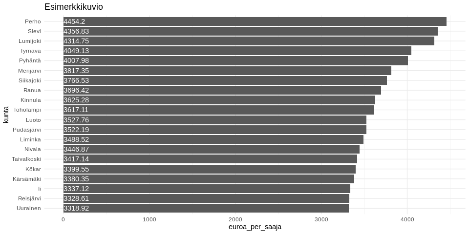

<table>
<thead>
<tr class="header">
<th style="text-align: left;">data</th>
<th style="text-align: left;">julkaistu</th>
<th style="text-align: left;">ylläpitäjä</th>
</tr>
</thead>
<tbody>
<tr class="odd">
<td style="text-align: left;"><a href='https://beta.avoindata.fi/data/fi/dataset/kelan-etuudet-ja-saajat'>Kelan etuuksien saajat ja maksetut etuudet</a></td>
<td style="text-align: left;">2019-02-19</td>
<td style="text-align: left;"><a href='mailto:markus.kainu@kela.fi'>Markus Kainu</a></td>
</tr>
</tbody>
</table>

    library(dplyr)
    library(ggplot2)
    library(jsonlite)
    library(ckanr)
    library(readr)
    library(knitr)
    library(glue)
    library(tidyr)
    library(pxweb)

Resurssien lataaminen
---------------------

    ckanr_setup(url = "https://beta.avoindata.fi/data/fi/")
    x <- package_search(q = "Kansaneläkelaitos", fq = "title:etuuksien")
    resources <- x$results[[1]]$resources
    dat <- read_csv2(resources[[1]]$url) # Lataa data
    meta <- fromJSON(txt = resources[[2]]$url) # Lataa metadata

Datan ja metadatan kuvailu
--------------------------

**Datan kuvaustieto**

    meta$description %>% cat()

Aineisto sisältää tiedot Kelan maksamien etuuksien saajista, maksetuista
etuuksista ja keskimääräisistä etuuksista (euroa/saaja). Raportti kattaa
valtaosan Kelan maksamista etuuksista. Maksetuista etuuksista kuitenkin
puuttuvat työnantajien järjestämästä työterveyshuollosta, yrittäjien
työterveyshuollosta ja opiskelijoiden terveydenhuollosta maksetut
korvaukset. Eläkkeistä, vammaisetuuksista, asumistuista ja elatustuesta
ei tilastoida vuoden aikana etuutta saaneita henkilöitä eikä
keskimääräisiä etuuksia. Näistä etuuksista tilastoidaan ainoastaan
poikkileikkaushetken tiedot kuukausittain. Yleisen asumistuen
tilastoinnissa saajien tilastoyksikkö on asumistuen ruokakunta, ja
keskimääräinen etuus tilastoidaan asumistuen ruokakuntaa kohti.
Opintolainavähennys on verovähennys, joten maksettua etuutta ei ole.
Perustoimeentulotuen tilastoinnissa saajien tilastoyksikkö on
toimeentulotuen kotitalous, ja keskimääräinen etuus tilastoidaan
toimeentulotuen kotitaloutta kohti.

**Datan muuttujatieto**

    meta$resources$schema$fields[[1]] %>% kable(format = "markdown")

<table>
<thead>
<tr class="header">
<th style="text-align: left;">name</th>
<th style="text-align: left;">type</th>
<th style="text-align: left;">format</th>
</tr>
</thead>
<tbody>
<tr class="odd">
<td style="text-align: left;">kuntanumero</td>
<td style="text-align: left;">integer</td>
<td style="text-align: left;">default</td>
</tr>
<tr class="even">
<td style="text-align: left;">kunta</td>
<td style="text-align: left;">string</td>
<td style="text-align: left;">default</td>
</tr>
<tr class="odd">
<td style="text-align: left;">aikajakso</td>
<td style="text-align: left;">string</td>
<td style="text-align: left;">default</td>
</tr>
<tr class="even">
<td style="text-align: left;">aika</td>
<td style="text-align: left;">integer</td>
<td style="text-align: left;">default</td>
</tr>
<tr class="odd">
<td style="text-align: left;">etuus</td>
<td style="text-align: left;">string</td>
<td style="text-align: left;">default</td>
</tr>
<tr class="even">
<td style="text-align: left;">saajat</td>
<td style="text-align: left;">integer</td>
<td style="text-align: left;">default</td>
</tr>
<tr class="odd">
<td style="text-align: left;">maksetut_etuudet_euroa</td>
<td style="text-align: left;">integer</td>
<td style="text-align: left;">default</td>
</tr>
<tr class="even">
<td style="text-align: left;">euroa_per_saaja</td>
<td style="text-align: left;">number</td>
<td style="text-align: left;">default</td>
</tr>
</tbody>
</table>

**Datan ensimmäiset rivit**

    head(dat)  %>% kable(format = "markdown")

<table>
<colgroup>
<col style="width: 12%" />
<col style="width: 10%" />
<col style="width: 10%" />
<col style="width: 5%" />
<col style="width: 10%" />
<col style="width: 7%" />
<col style="width: 24%" />
<col style="width: 17%" />
</colgroup>
<thead>
<tr class="header">
<th style="text-align: right;">kuntanumero</th>
<th style="text-align: left;">kunta</th>
<th style="text-align: left;">aikajakso</th>
<th style="text-align: right;">aika</th>
<th style="text-align: left;">etuus</th>
<th style="text-align: right;">saajat</th>
<th style="text-align: right;">maksetut_etuudet_euroa</th>
<th style="text-align: right;">euroa_per_saaja</th>
</tr>
</thead>
<tbody>
<tr class="odd">
<td style="text-align: right;">5</td>
<td style="text-align: left;">Alajärvi</td>
<td style="text-align: left;">vuosi</td>
<td style="text-align: right;">2007</td>
<td style="text-align: left;">Kuntoutus</td>
<td style="text-align: right;">210</td>
<td style="text-align: right;">495806</td>
<td style="text-align: right;">2360.98</td>
</tr>
<tr class="even">
<td style="text-align: right;">9</td>
<td style="text-align: left;">Alavieska</td>
<td style="text-align: left;">vuosi</td>
<td style="text-align: right;">2007</td>
<td style="text-align: left;">Kuntoutus</td>
<td style="text-align: right;">41</td>
<td style="text-align: right;">143525</td>
<td style="text-align: right;">3500.61</td>
</tr>
<tr class="odd">
<td style="text-align: right;">10</td>
<td style="text-align: left;">Alavus</td>
<td style="text-align: left;">vuosi</td>
<td style="text-align: right;">2007</td>
<td style="text-align: left;">Kuntoutus</td>
<td style="text-align: right;">240</td>
<td style="text-align: right;">612924</td>
<td style="text-align: right;">2553.85</td>
</tr>
<tr class="even">
<td style="text-align: right;">16</td>
<td style="text-align: left;">Asikkala</td>
<td style="text-align: left;">vuosi</td>
<td style="text-align: right;">2007</td>
<td style="text-align: left;">Kuntoutus</td>
<td style="text-align: right;">119</td>
<td style="text-align: right;">299271</td>
<td style="text-align: right;">2514.88</td>
</tr>
<tr class="odd">
<td style="text-align: right;">18</td>
<td style="text-align: left;">Askola</td>
<td style="text-align: left;">vuosi</td>
<td style="text-align: right;">2007</td>
<td style="text-align: left;">Kuntoutus</td>
<td style="text-align: right;">52</td>
<td style="text-align: right;">175090</td>
<td style="text-align: right;">3367.12</td>
</tr>
<tr class="even">
<td style="text-align: right;">19</td>
<td style="text-align: left;">Aura</td>
<td style="text-align: left;">vuosi</td>
<td style="text-align: right;">2007</td>
<td style="text-align: left;">Kuntoutus</td>
<td style="text-align: right;">76</td>
<td style="text-align: right;">205351</td>
<td style="text-align: right;">2701.99</td>
</tr>
</tbody>
</table>

Kuvio
-----

    dat %>% 
      filter(aika == 2018,
             etuus == "Lapsilisä") %>% 
      arrange(desc(maksetut_etuudet_euroa)) %>% 
      slice(1:20) %>% 
      mutate(kunta = forcats::fct_reorder(kunta, maksetut_etuudet_euroa)) %>% 
      ggplot(aes(x = kunta, y = maksetut_etuudet_euroa, label = maksetut_etuudet_euroa)) + 
      geom_col() + 
      coord_flip() + 
      theme_minimal() +
      geom_text(aes(y = 0), hjust = 0, color = "white") +
      labs(title = "Esimerkkikuvion esimerkkiotsikko")

Datan yhdistäminen Tilastokeskuksen kuntien avainlukuihin
---------------------------------------------------------

    # PXWEB query 
    pxweb_query_list <- 
      list("Alue 2018"=c("SSS","020","005","009","010","016","018","019","035","043","046","047","049","050","051","052","060","061","062","065","069","071","072","074","075","076","077","078","079","081","082","086","111","090","091","097","098","099","102","103","105","106","108","109","139","140","142","143","145","146","153","148","149","151","152","165","167","169","170","171","172","176","177","178","179","181","182","186","202","204","205","208","211","213","214","216","217","218","224","226","230","231","232","233","235","236","239","240","320","241","322","244","245","249","250","256","257","260","261","263","265","271","272","273","275","276","280","284","285","286","287","288","290","291","295","297","300","301","304","305","312","316","317","318","398","399","400","407","402","403","405","408","410","416","417","418","420","421","422","423","425","426","444","430","433","434","435","436","438","440","441","475","478","480","481","483","484","489","491","494","495","498","499","500","503","504","505","508","507","529","531","535","536","538","541","543","545","560","561","562","563","564","309","576","577","578","445","580","581","599","583","854","584","588","592","593","595","598","601","604","607","608","609","611","638","614","615","616","619","620","623","624","625","626","630","631","635","636","678","710","680","681","683","684","686","687","689","691","694","697","698","700","702","704","707","729","732","734","736","790","738","739","740","742","743","746","747","748","791","749","751","753","755","758","759","761","762","765","766","768","771","777","778","781","783","831","832","833","834","837","844","845","846","848","849","850","851","853","857","858","859","886","887","889","890","892","893","895","785","905","908","911","092","915","918","921","922","924","925","927","931","934","935","936","941","946","976","977","980","981","989","992","MK01","MK02","MK04","MK05","MK06","MK07","MK08","MK09","MK10","MK11","MK12","MK13","MK14","MK15","MK16","MK17","MK18","MK19","MK21","SK011","SK014","SK015","SK016","SK021","SK022","SK023","SK024","SK025","SK041","SK043","SK044","SK051","SK052","SK053","SK061","SK063","SK064","SK068","SK069","SK071","SK081","SK082","SK091","SK093","SK101","SK103","SK105","SK111","SK112","SK113","SK114","SK115","SK122","SK124","SK125","SK131","SK132","SK133","SK134","SK135","SK138","SK141","SK142","SK144","SK146","SK151","SK152","SK153","SK154","SK161","SK162","SK171","SK173","SK174","SK175","SK176","SK177","SK178","SK181","SK182","SK191","SK192","SK193","SK194","SK196","SK197","SK211","SK212","SK213","2020MK01","2020MK02","2020MK04","2020MK05","2020MK06","2020MK07","2020MK08","2020MK09","2020MK10","2020MK11","2020MK12","2020MK13","2020MK14","2020MK15","2020MK16","2020MK17","2020MK18","2020MK19","2020MK21","2020SK011","2020SK014","2020SK015","2020SK016","2020SK021","2020SK022","2020SK023","2020SK024","2020SK025","2020SK041","2020SK043","2020SK044","2020SK051","2020SK052","2020SK053","2020SK061","2020SK063","2020SK064","2020SK068","2020SK069","2020SK071","2020SK081","2020SK082","2020SK091","2020SK093","2020SK101","2020SK103","2020SK105","2020SK111","2020SK112","2020SK113","2020SK114","2020SK115","2020SK122","2020SK124","2020SK125","2020SK131","2020SK132","2020SK133","2020SK134","2020SK135","2020SK138","2020SK141","2020SK142","2020SK144","2020SK146","2020SK151","2020SK152","2020SK153","2020SK154","2020SK161","2020SK162","2020SK171","2020SK173","2020SK174","2020SK175","2020SK176","2020SK177","2020SK178","2020SK181","2020SK182","2020SK191","2020SK192","2020SK193","2020SK194","2020SK196","2020SK197","2020SK211","2020SK212","2020SK213"),
           "Tiedot"=c("M408","M411","M476","M391","M421","M478","M404","M410","M303","M297","M302","M44","M62","M70","M488","M486","M137","M140","M130","M162","M78","M485","M152","M72","M84","M106","M499","M496","M495","M497","M498"))

    # Download data 
    tk_lst <- 
      pxweb_get(url = "http://pxnet2.stat.fi/PXWeb/api/v1/fi/Kuntien_avainluvut/2018/kuntien_avainluvut_2018_viimeisin.px",
                query = pxweb_query_list)
    tk_avainluvut <- as.data.frame(tk_lst, column.name.type = "text", variable.value.type = "text") %>% 
      # levitetään data
      spread(key = Tiedot, value = `Kuntien avainluvut`)

    df <- left_join(dat, tk_avainluvut, by = c("kunta" = "Alue 2018"))

    # Piirretään hajontakuvio
    df2 <- df %>% 
      filter(aika == 2016,
             etuus == "Lapsilisä")

    ggplot(df2, 
           aes(x = `Alle 15-vuotiaiden osuus väestöstä, %, 2017`, 
               y = euroa_per_saaja, 
               size = `Väkiluku, 2017`)) + 
      geom_point(alpha = .3) +
      labs(y = "Lapsilisä - euroa_per_saaja") + 
      theme_light()

Datastore-api
-------------

Jos et tarvitse koko aineistoa, voit suodattaa siitä osio SQL:llä
käyttäen CKAN:n DataStore-rajapintaa.

Alla olevassa esimerkissä tehdään rajaus `kunta`-muuttujasta ja siis
etsitään vaan kuntaa *Veteli* koskevat tiedot.

    kunta <- "Veteli"
    res <- ckanr::ds_search_sql(sql = glue("SELECT * from \"{resources[[1]]$id}\" WHERE kunta LIKE '{kunta}'"), as = "table")
    res$records %>% 
      select(-`_full_text`, -`_id`) %>% 
      kable(format = "markdown")

<table>
<thead>
<tr class="header">
<th style="text-align: left;">kunta</th>
<th style="text-align: left;">kuntanumero</th>
<th style="text-align: left;">vuosi</th>
<th style="text-align: left;">euroa_per_saaja</th>
<th style="text-align: left;">saajat</th>
<th style="text-align: left;">maksetut_etuudet_euroa</th>
<th style="text-align: left;">etuus</th>
</tr>
</thead>
<tbody>
<tr class="odd">
<td style="text-align: left;">Veteli</td>
<td style="text-align: left;">924</td>
<td style="text-align: left;">2007</td>
<td style="text-align: left;">NA</td>
<td style="text-align: left;">74</td>
<td style="text-align: left;">NA</td>
<td style="text-align: left;">Kuntoutus</td>
</tr>
<tr class="even">
<td style="text-align: left;">Veteli</td>
<td style="text-align: left;">924</td>
<td style="text-align: left;">2007</td>
<td style="text-align: left;">NA</td>
<td style="text-align: left;">NA</td>
<td style="text-align: left;">NA</td>
<td style="text-align: left;">Opintolainan korkoavustus</td>
</tr>
<tr class="odd">
<td style="text-align: left;">Veteli</td>
<td style="text-align: left;">924</td>
<td style="text-align: left;">2007</td>
<td style="text-align: left;">NA</td>
<td style="text-align: left;">NA</td>
<td style="text-align: left;">NA</td>
<td style="text-align: left;">Yleinen asumistuki</td>
</tr>
<tr class="even">
<td style="text-align: left;">Veteli</td>
<td style="text-align: left;">924</td>
<td style="text-align: left;">2008</td>
<td style="text-align: left;">NA</td>
<td style="text-align: left;">NA</td>
<td style="text-align: left;">NA</td>
<td style="text-align: left;">Eläke-etuudet (pl. takuueläke)</td>
</tr>
<tr class="odd">
<td style="text-align: left;">Veteli</td>
<td style="text-align: left;">924</td>
<td style="text-align: left;">2008</td>
<td style="text-align: left;">NA</td>
<td style="text-align: left;">NA</td>
<td style="text-align: left;">NA</td>
<td style="text-align: left;">Eläketuki</td>
</tr>
<tr class="even">
<td style="text-align: left;">Veteli</td>
<td style="text-align: left;">924</td>
<td style="text-align: left;">2008</td>
<td style="text-align: left;">NA</td>
<td style="text-align: left;">NA</td>
<td style="text-align: left;">NA</td>
<td style="text-align: left;">Eläkkeensaajan asumistuki</td>
</tr>
<tr class="odd">
<td style="text-align: left;">Veteli</td>
<td style="text-align: left;">924</td>
<td style="text-align: left;">2008</td>
<td style="text-align: left;">NA</td>
<td style="text-align: left;">4</td>
<td style="text-align: left;">582</td>
<td style="text-align: left;">Erityishoitoraha</td>
</tr>
<tr class="even">
<td style="text-align: left;">Veteli</td>
<td style="text-align: left;">924</td>
<td style="text-align: left;">2008</td>
<td style="text-align: left;">NA</td>
<td style="text-align: left;">99</td>
<td style="text-align: left;">NA</td>
<td style="text-align: left;">Koulumatkatuki</td>
</tr>
<tr class="odd">
<td style="text-align: left;">Veteli</td>
<td style="text-align: left;">924</td>
<td style="text-align: left;">2008</td>
<td style="text-align: left;">NA</td>
<td style="text-align: left;">79</td>
<td style="text-align: left;">NA</td>
<td style="text-align: left;">Kuntoutus</td>
</tr>
<tr class="even">
<td style="text-align: left;">Veteli</td>
<td style="text-align: left;">924</td>
<td style="text-align: left;">2008</td>
<td style="text-align: left;">NA</td>
<td style="text-align: left;">61</td>
<td style="text-align: left;">NA</td>
<td style="text-align: left;">Kuntoutusraha</td>
</tr>
<tr class="odd">
<td style="text-align: left;">Veteli</td>
<td style="text-align: left;">924</td>
<td style="text-align: left;">2008</td>
<td style="text-align: left;">NA</td>
<td style="text-align: left;">362</td>
<td style="text-align: left;">NA</td>
<td style="text-align: left;">Lapsilisä</td>
</tr>
<tr class="even">
<td style="text-align: left;">Veteli</td>
<td style="text-align: left;">924</td>
<td style="text-align: left;">2008</td>
<td style="text-align: left;">NA</td>
<td style="text-align: left;">74</td>
<td style="text-align: left;">NA</td>
<td style="text-align: left;">Lastenhoidon tuet</td>
</tr>
<tr class="odd">
<td style="text-align: left;">Veteli</td>
<td style="text-align: left;">924</td>
<td style="text-align: left;">2008</td>
<td style="text-align: left;">NA</td>
<td style="text-align: left;">NA</td>
<td style="text-align: left;">NA</td>
<td style="text-align: left;">Maahanmuuttajan erityistuki</td>
</tr>
<tr class="even">
<td style="text-align: left;">Veteli</td>
<td style="text-align: left;">924</td>
<td style="text-align: left;">2008</td>
<td style="text-align: left;">NA</td>
<td style="text-align: left;">NA</td>
<td style="text-align: left;">NA</td>
<td style="text-align: left;">Opintolainan korkoavustus</td>
</tr>
<tr class="odd">
<td style="text-align: left;">Veteli</td>
<td style="text-align: left;">924</td>
<td style="text-align: left;">2008</td>
<td style="text-align: left;">NA</td>
<td style="text-align: left;">195</td>
<td style="text-align: left;">NA</td>
<td style="text-align: left;">Opintotuki</td>
</tr>
<tr class="even">
<td style="text-align: left;">Veteli</td>
<td style="text-align: left;">924</td>
<td style="text-align: left;">2008</td>
<td style="text-align: left;">NA</td>
<td style="text-align: left;">NA</td>
<td style="text-align: left;">NA</td>
<td style="text-align: left;">Sairaanhoitokorvaukset</td>
</tr>
<tr class="odd">
<td style="text-align: left;">Veteli</td>
<td style="text-align: left;">924</td>
<td style="text-align: left;">2008</td>
<td style="text-align: left;">NA</td>
<td style="text-align: left;">231</td>
<td style="text-align: left;">NA</td>
<td style="text-align: left;">Sairauspäivärahat</td>
</tr>
<tr class="even">
<td style="text-align: left;">Veteli</td>
<td style="text-align: left;">924</td>
<td style="text-align: left;">2008</td>
<td style="text-align: left;">NA</td>
<td style="text-align: left;">NA</td>
<td style="text-align: left;">NA</td>
<td style="text-align: left;">Sotilasavustus</td>
</tr>
<tr class="odd">
<td style="text-align: left;">Veteli</td>
<td style="text-align: left;">924</td>
<td style="text-align: left;">2008</td>
<td style="text-align: left;">NA</td>
<td style="text-align: left;">118</td>
<td style="text-align: left;">NA</td>
<td style="text-align: left;">Työttömyysturva</td>
</tr>
<tr class="even">
<td style="text-align: left;">Veteli</td>
<td style="text-align: left;">924</td>
<td style="text-align: left;">2008</td>
<td style="text-align: left;">NA</td>
<td style="text-align: left;">NA</td>
<td style="text-align: left;">NA</td>
<td style="text-align: left;">Vammaisetuudet</td>
</tr>
<tr class="odd">
<td style="text-align: left;">Veteli</td>
<td style="text-align: left;">924</td>
<td style="text-align: left;">2008</td>
<td style="text-align: left;">NA</td>
<td style="text-align: left;">102</td>
<td style="text-align: left;">NA</td>
<td style="text-align: left;">Vanhempainpäiväraha</td>
</tr>
<tr class="even">
<td style="text-align: left;">Veteli</td>
<td style="text-align: left;">924</td>
<td style="text-align: left;">2008</td>
<td style="text-align: left;">NA</td>
<td style="text-align: left;">11</td>
<td style="text-align: left;">NA</td>
<td style="text-align: left;">Vuosilomakustannuskorvaus</td>
</tr>
<tr class="odd">
<td style="text-align: left;">Veteli</td>
<td style="text-align: left;">924</td>
<td style="text-align: left;">2008</td>
<td style="text-align: left;">NA</td>
<td style="text-align: left;">NA</td>
<td style="text-align: left;">NA</td>
<td style="text-align: left;">Yleinen asumistuki</td>
</tr>
<tr class="even">
<td style="text-align: left;">Veteli</td>
<td style="text-align: left;">924</td>
<td style="text-align: left;">2008</td>
<td style="text-align: left;">NA</td>
<td style="text-align: left;">45</td>
<td style="text-align: left;">NA</td>
<td style="text-align: left;">Äitiysavustus</td>
</tr>
<tr class="odd">
<td style="text-align: left;">Veteli</td>
<td style="text-align: left;">924</td>
<td style="text-align: left;">2009</td>
<td style="text-align: left;">NA</td>
<td style="text-align: left;">NA</td>
<td style="text-align: left;">NA</td>
<td style="text-align: left;">Elatustuki</td>
</tr>
<tr class="even">
<td style="text-align: left;">Veteli</td>
<td style="text-align: left;">924</td>
<td style="text-align: left;">2009</td>
<td style="text-align: left;">NA</td>
<td style="text-align: left;">NA</td>
<td style="text-align: left;">NA</td>
<td style="text-align: left;">Eläke-etuudet (pl. takuueläke)</td>
</tr>
<tr class="odd">
<td style="text-align: left;">Veteli</td>
<td style="text-align: left;">924</td>
<td style="text-align: left;">2009</td>
<td style="text-align: left;">NA</td>
<td style="text-align: left;">NA</td>
<td style="text-align: left;">NA</td>
<td style="text-align: left;">Eläketuki</td>
</tr>
<tr class="even">
<td style="text-align: left;">Veteli</td>
<td style="text-align: left;">924</td>
<td style="text-align: left;">2009</td>
<td style="text-align: left;">NA</td>
<td style="text-align: left;">NA</td>
<td style="text-align: left;">NA</td>
<td style="text-align: left;">Eläkkeensaajan asumistuki</td>
</tr>
<tr class="odd">
<td style="text-align: left;">Veteli</td>
<td style="text-align: left;">924</td>
<td style="text-align: left;">2009</td>
<td style="text-align: left;">NA</td>
<td style="text-align: left;">5</td>
<td style="text-align: left;">NA</td>
<td style="text-align: left;">Erityishoitoraha</td>
</tr>
<tr class="even">
<td style="text-align: left;">Veteli</td>
<td style="text-align: left;">924</td>
<td style="text-align: left;">2009</td>
<td style="text-align: left;">NA</td>
<td style="text-align: left;">97</td>
<td style="text-align: left;">NA</td>
<td style="text-align: left;">Koulumatkatuki</td>
</tr>
<tr class="odd">
<td style="text-align: left;">Veteli</td>
<td style="text-align: left;">924</td>
<td style="text-align: left;">2009</td>
<td style="text-align: left;">NA</td>
<td style="text-align: left;">66</td>
<td style="text-align: left;">NA</td>
<td style="text-align: left;">Kuntoutus</td>
</tr>
<tr class="even">
<td style="text-align: left;">Veteli</td>
<td style="text-align: left;">924</td>
<td style="text-align: left;">2009</td>
<td style="text-align: left;">NA</td>
<td style="text-align: left;">43</td>
<td style="text-align: left;">NA</td>
<td style="text-align: left;">Kuntoutusraha</td>
</tr>
<tr class="odd">
<td style="text-align: left;">Veteli</td>
<td style="text-align: left;">924</td>
<td style="text-align: left;">2009</td>
<td style="text-align: left;">NA</td>
<td style="text-align: left;">361</td>
<td style="text-align: left;">NA</td>
<td style="text-align: left;">Lapsilisä</td>
</tr>
<tr class="even">
<td style="text-align: left;">Veteli</td>
<td style="text-align: left;">924</td>
<td style="text-align: left;">2009</td>
<td style="text-align: left;">NA</td>
<td style="text-align: left;">91</td>
<td style="text-align: left;">NA</td>
<td style="text-align: left;">Lastenhoidon tuet</td>
</tr>
<tr class="odd">
<td style="text-align: left;">Veteli</td>
<td style="text-align: left;">924</td>
<td style="text-align: left;">2009</td>
<td style="text-align: left;">NA</td>
<td style="text-align: left;">NA</td>
<td style="text-align: left;">NA</td>
<td style="text-align: left;">Maahanmuuttajan erityistuki</td>
</tr>
<tr class="even">
<td style="text-align: left;">Veteli</td>
<td style="text-align: left;">924</td>
<td style="text-align: left;">2009</td>
<td style="text-align: left;">NA</td>
<td style="text-align: left;">NA</td>
<td style="text-align: left;">NA</td>
<td style="text-align: left;">Opintolainan korkoavustus</td>
</tr>
<tr class="odd">
<td style="text-align: left;">Veteli</td>
<td style="text-align: left;">924</td>
<td style="text-align: left;">2009</td>
<td style="text-align: left;">NA</td>
<td style="text-align: left;">194</td>
<td style="text-align: left;">NA</td>
<td style="text-align: left;">Opintotuki</td>
</tr>
<tr class="even">
<td style="text-align: left;">Veteli</td>
<td style="text-align: left;">924</td>
<td style="text-align: left;">2009</td>
<td style="text-align: left;">NA</td>
<td style="text-align: left;">NA</td>
<td style="text-align: left;">NA</td>
<td style="text-align: left;">Sairaanhoitokorvaukset</td>
</tr>
<tr class="odd">
<td style="text-align: left;">Veteli</td>
<td style="text-align: left;">924</td>
<td style="text-align: left;">2009</td>
<td style="text-align: left;">NA</td>
<td style="text-align: left;">215</td>
<td style="text-align: left;">NA</td>
<td style="text-align: left;">Sairauspäivärahat</td>
</tr>
<tr class="even">
<td style="text-align: left;">Veteli</td>
<td style="text-align: left;">924</td>
<td style="text-align: left;">2009</td>
<td style="text-align: left;">NA</td>
<td style="text-align: left;">NA</td>
<td style="text-align: left;">NA</td>
<td style="text-align: left;">Sotilasavustus</td>
</tr>
<tr class="odd">
<td style="text-align: left;">Veteli</td>
<td style="text-align: left;">924</td>
<td style="text-align: left;">2009</td>
<td style="text-align: left;">NA</td>
<td style="text-align: left;">145</td>
<td style="text-align: left;">NA</td>
<td style="text-align: left;">Työttömyysturva</td>
</tr>
<tr class="even">
<td style="text-align: left;">Veteli</td>
<td style="text-align: left;">924</td>
<td style="text-align: left;">2009</td>
<td style="text-align: left;">NA</td>
<td style="text-align: left;">NA</td>
<td style="text-align: left;">NA</td>
<td style="text-align: left;">Vammaisetuudet</td>
</tr>
<tr class="odd">
<td style="text-align: left;">Veteli</td>
<td style="text-align: left;">924</td>
<td style="text-align: left;">2009</td>
<td style="text-align: left;">NA</td>
<td style="text-align: left;">133</td>
<td style="text-align: left;">NA</td>
<td style="text-align: left;">Vanhempainpäiväraha</td>
</tr>
<tr class="even">
<td style="text-align: left;">Veteli</td>
<td style="text-align: left;">924</td>
<td style="text-align: left;">2009</td>
<td style="text-align: left;">NA</td>
<td style="text-align: left;">16</td>
<td style="text-align: left;">NA</td>
<td style="text-align: left;">Vuosilomakustannuskorvaus</td>
</tr>
<tr class="odd">
<td style="text-align: left;">Veteli</td>
<td style="text-align: left;">924</td>
<td style="text-align: left;">2009</td>
<td style="text-align: left;">NA</td>
<td style="text-align: left;">NA</td>
<td style="text-align: left;">NA</td>
<td style="text-align: left;">Yleinen asumistuki</td>
</tr>
<tr class="even">
<td style="text-align: left;">Veteli</td>
<td style="text-align: left;">924</td>
<td style="text-align: left;">2009</td>
<td style="text-align: left;">NA</td>
<td style="text-align: left;">49</td>
<td style="text-align: left;">NA</td>
<td style="text-align: left;">Äitiysavustus</td>
</tr>
<tr class="odd">
<td style="text-align: left;">Veteli</td>
<td style="text-align: left;">924</td>
<td style="text-align: left;">2010</td>
<td style="text-align: left;">NA</td>
<td style="text-align: left;">NA</td>
<td style="text-align: left;">NA</td>
<td style="text-align: left;">Elatustuki</td>
</tr>
<tr class="even">
<td style="text-align: left;">Veteli</td>
<td style="text-align: left;">924</td>
<td style="text-align: left;">2010</td>
<td style="text-align: left;">NA</td>
<td style="text-align: left;">NA</td>
<td style="text-align: left;">NA</td>
<td style="text-align: left;">Eläke-etuudet (pl. takuueläke)</td>
</tr>
<tr class="odd">
<td style="text-align: left;">Veteli</td>
<td style="text-align: left;">924</td>
<td style="text-align: left;">2010</td>
<td style="text-align: left;">NA</td>
<td style="text-align: left;">NA</td>
<td style="text-align: left;">NA</td>
<td style="text-align: left;">Eläkkeensaajan asumistuki</td>
</tr>
<tr class="even">
<td style="text-align: left;">Veteli</td>
<td style="text-align: left;">924</td>
<td style="text-align: left;">2010</td>
<td style="text-align: left;">NA</td>
<td style="text-align: left;">NA</td>
<td style="text-align: left;">NA</td>
<td style="text-align: left;">Erityishoitoraha</td>
</tr>
<tr class="odd">
<td style="text-align: left;">Veteli</td>
<td style="text-align: left;">924</td>
<td style="text-align: left;">2010</td>
<td style="text-align: left;">NA</td>
<td style="text-align: left;">97</td>
<td style="text-align: left;">NA</td>
<td style="text-align: left;">Koulumatkatuki</td>
</tr>
<tr class="even">
<td style="text-align: left;">Veteli</td>
<td style="text-align: left;">924</td>
<td style="text-align: left;">2010</td>
<td style="text-align: left;">NA</td>
<td style="text-align: left;">67</td>
<td style="text-align: left;">NA</td>
<td style="text-align: left;">Kuntoutus</td>
</tr>
<tr class="odd">
<td style="text-align: left;">Veteli</td>
<td style="text-align: left;">924</td>
<td style="text-align: left;">2010</td>
<td style="text-align: left;">NA</td>
<td style="text-align: left;">45</td>
<td style="text-align: left;">NA</td>
<td style="text-align: left;">Kuntoutusraha</td>
</tr>
<tr class="even">
<td style="text-align: left;">Veteli</td>
<td style="text-align: left;">924</td>
<td style="text-align: left;">2010</td>
<td style="text-align: left;">NA</td>
<td style="text-align: left;">354</td>
<td style="text-align: left;">NA</td>
<td style="text-align: left;">Lapsilisä</td>
</tr>
<tr class="odd">
<td style="text-align: left;">Veteli</td>
<td style="text-align: left;">924</td>
<td style="text-align: left;">2010</td>
<td style="text-align: left;">NA</td>
<td style="text-align: left;">100</td>
<td style="text-align: left;">NA</td>
<td style="text-align: left;">Lastenhoidon tuet</td>
</tr>
<tr class="even">
<td style="text-align: left;">Veteli</td>
<td style="text-align: left;">924</td>
<td style="text-align: left;">2010</td>
<td style="text-align: left;">NA</td>
<td style="text-align: left;">NA</td>
<td style="text-align: left;">NA</td>
<td style="text-align: left;">Maahanmuuttajan erityistuki</td>
</tr>
<tr class="odd">
<td style="text-align: left;">Veteli</td>
<td style="text-align: left;">924</td>
<td style="text-align: left;">2010</td>
<td style="text-align: left;">NA</td>
<td style="text-align: left;">NA</td>
<td style="text-align: left;">NA</td>
<td style="text-align: left;">Opintolainavähennys</td>
</tr>
<tr class="even">
<td style="text-align: left;">Veteli</td>
<td style="text-align: left;">924</td>
<td style="text-align: left;">2010</td>
<td style="text-align: left;">NA</td>
<td style="text-align: left;">184</td>
<td style="text-align: left;">NA</td>
<td style="text-align: left;">Opintotuki</td>
</tr>
<tr class="odd">
<td style="text-align: left;">Veteli</td>
<td style="text-align: left;">924</td>
<td style="text-align: left;">2010</td>
<td style="text-align: left;">NA</td>
<td style="text-align: left;">NA</td>
<td style="text-align: left;">NA</td>
<td style="text-align: left;">Sairaanhoitokorvaukset</td>
</tr>
<tr class="even">
<td style="text-align: left;">Veteli</td>
<td style="text-align: left;">924</td>
<td style="text-align: left;">2010</td>
<td style="text-align: left;">NA</td>
<td style="text-align: left;">197</td>
<td style="text-align: left;">NA</td>
<td style="text-align: left;">Sairauspäivärahat</td>
</tr>
<tr class="odd">
<td style="text-align: left;">Veteli</td>
<td style="text-align: left;">924</td>
<td style="text-align: left;">2010</td>
<td style="text-align: left;">NA</td>
<td style="text-align: left;">NA</td>
<td style="text-align: left;">NA</td>
<td style="text-align: left;">Sotilasavustus</td>
</tr>
<tr class="even">
<td style="text-align: left;">Veteli</td>
<td style="text-align: left;">924</td>
<td style="text-align: left;">2010</td>
<td style="text-align: left;">NA</td>
<td style="text-align: left;">135</td>
<td style="text-align: left;">NA</td>
<td style="text-align: left;">Työttömyysturva</td>
</tr>
<tr class="odd">
<td style="text-align: left;">Veteli</td>
<td style="text-align: left;">924</td>
<td style="text-align: left;">2010</td>
<td style="text-align: left;">NA</td>
<td style="text-align: left;">NA</td>
<td style="text-align: left;">NA</td>
<td style="text-align: left;">Vammaisetuudet</td>
</tr>
<tr class="even">
<td style="text-align: left;">Veteli</td>
<td style="text-align: left;">924</td>
<td style="text-align: left;">2010</td>
<td style="text-align: left;">NA</td>
<td style="text-align: left;">102</td>
<td style="text-align: left;">NA</td>
<td style="text-align: left;">Vanhempainpäiväraha</td>
</tr>
<tr class="odd">
<td style="text-align: left;">Veteli</td>
<td style="text-align: left;">924</td>
<td style="text-align: left;">2010</td>
<td style="text-align: left;">NA</td>
<td style="text-align: left;">17</td>
<td style="text-align: left;">NA</td>
<td style="text-align: left;">Vuosilomakustannuskorvaus</td>
</tr>
<tr class="even">
<td style="text-align: left;">Veteli</td>
<td style="text-align: left;">924</td>
<td style="text-align: left;">2010</td>
<td style="text-align: left;">NA</td>
<td style="text-align: left;">NA</td>
<td style="text-align: left;">NA</td>
<td style="text-align: left;">Yleinen asumistuki</td>
</tr>
<tr class="odd">
<td style="text-align: left;">Veteli</td>
<td style="text-align: left;">924</td>
<td style="text-align: left;">2010</td>
<td style="text-align: left;">NA</td>
<td style="text-align: left;">36</td>
<td style="text-align: left;">NA</td>
<td style="text-align: left;">Äitiysavustus</td>
</tr>
<tr class="even">
<td style="text-align: left;">Veteli</td>
<td style="text-align: left;">924</td>
<td style="text-align: left;">2011</td>
<td style="text-align: left;">NA</td>
<td style="text-align: left;">NA</td>
<td style="text-align: left;">NA</td>
<td style="text-align: left;">Elatustuki</td>
</tr>
<tr class="odd">
<td style="text-align: left;">Veteli</td>
<td style="text-align: left;">924</td>
<td style="text-align: left;">2011</td>
<td style="text-align: left;">NA</td>
<td style="text-align: left;">NA</td>
<td style="text-align: left;">NA</td>
<td style="text-align: left;">Eläke-etuudet (pl. takuueläke)</td>
</tr>
<tr class="even">
<td style="text-align: left;">Veteli</td>
<td style="text-align: left;">924</td>
<td style="text-align: left;">2011</td>
<td style="text-align: left;">NA</td>
<td style="text-align: left;">NA</td>
<td style="text-align: left;">NA</td>
<td style="text-align: left;">Eläkkeensaajan asumistuki</td>
</tr>
<tr class="odd">
<td style="text-align: left;">Veteli</td>
<td style="text-align: left;">924</td>
<td style="text-align: left;">2011</td>
<td style="text-align: left;">NA</td>
<td style="text-align: left;">NA</td>
<td style="text-align: left;">NA</td>
<td style="text-align: left;">Erityishoitoraha</td>
</tr>
<tr class="even">
<td style="text-align: left;">Veteli</td>
<td style="text-align: left;">924</td>
<td style="text-align: left;">2011</td>
<td style="text-align: left;">NA</td>
<td style="text-align: left;">96</td>
<td style="text-align: left;">NA</td>
<td style="text-align: left;">Koulumatkatuki</td>
</tr>
<tr class="odd">
<td style="text-align: left;">Veteli</td>
<td style="text-align: left;">924</td>
<td style="text-align: left;">2011</td>
<td style="text-align: left;">NA</td>
<td style="text-align: left;">72</td>
<td style="text-align: left;">NA</td>
<td style="text-align: left;">Kuntoutus</td>
</tr>
<tr class="even">
<td style="text-align: left;">Veteli</td>
<td style="text-align: left;">924</td>
<td style="text-align: left;">2011</td>
<td style="text-align: left;">NA</td>
<td style="text-align: left;">48</td>
<td style="text-align: left;">NA</td>
<td style="text-align: left;">Kuntoutusraha</td>
</tr>
<tr class="odd">
<td style="text-align: left;">Veteli</td>
<td style="text-align: left;">924</td>
<td style="text-align: left;">2011</td>
<td style="text-align: left;">NA</td>
<td style="text-align: left;">344</td>
<td style="text-align: left;">NA</td>
<td style="text-align: left;">Lapsilisä</td>
</tr>
<tr class="even">
<td style="text-align: left;">Veteli</td>
<td style="text-align: left;">924</td>
<td style="text-align: left;">2011</td>
<td style="text-align: left;">NA</td>
<td style="text-align: left;">89</td>
<td style="text-align: left;">NA</td>
<td style="text-align: left;">Lastenhoidon tuet</td>
</tr>
<tr class="odd">
<td style="text-align: left;">Veteli</td>
<td style="text-align: left;">924</td>
<td style="text-align: left;">2011</td>
<td style="text-align: left;">NA</td>
<td style="text-align: left;">NA</td>
<td style="text-align: left;">NA</td>
<td style="text-align: left;">Maahanmuuttajan erityistuki</td>
</tr>
<tr class="even">
<td style="text-align: left;">Veteli</td>
<td style="text-align: left;">924</td>
<td style="text-align: left;">2011</td>
<td style="text-align: left;">NA</td>
<td style="text-align: left;">NA</td>
<td style="text-align: left;">NA</td>
<td style="text-align: left;">Opintolainavähennys</td>
</tr>
<tr class="odd">
<td style="text-align: left;">Veteli</td>
<td style="text-align: left;">924</td>
<td style="text-align: left;">2011</td>
<td style="text-align: left;">NA</td>
<td style="text-align: left;">166</td>
<td style="text-align: left;">NA</td>
<td style="text-align: left;">Opintotuki</td>
</tr>
<tr class="even">
<td style="text-align: left;">Veteli</td>
<td style="text-align: left;">924</td>
<td style="text-align: left;">2011</td>
<td style="text-align: left;">NA</td>
<td style="text-align: left;">NA</td>
<td style="text-align: left;">NA</td>
<td style="text-align: left;">Sairaanhoitokorvaukset</td>
</tr>
<tr class="odd">
<td style="text-align: left;">Veteli</td>
<td style="text-align: left;">924</td>
<td style="text-align: left;">2011</td>
<td style="text-align: left;">NA</td>
<td style="text-align: left;">193</td>
<td style="text-align: left;">NA</td>
<td style="text-align: left;">Sairauspäivärahat</td>
</tr>
<tr class="even">
<td style="text-align: left;">Veteli</td>
<td style="text-align: left;">924</td>
<td style="text-align: left;">2011</td>
<td style="text-align: left;">NA</td>
<td style="text-align: left;">NA</td>
<td style="text-align: left;">NA</td>
<td style="text-align: left;">Sotilasavustus</td>
</tr>
<tr class="odd">
<td style="text-align: left;">Veteli</td>
<td style="text-align: left;">924</td>
<td style="text-align: left;">2011</td>
<td style="text-align: left;">NA</td>
<td style="text-align: left;">NA</td>
<td style="text-align: left;">NA</td>
<td style="text-align: left;">Takuueläke</td>
</tr>
<tr class="even">
<td style="text-align: left;">Veteli</td>
<td style="text-align: left;">924</td>
<td style="text-align: left;">2011</td>
<td style="text-align: left;">NA</td>
<td style="text-align: left;">115</td>
<td style="text-align: left;">NA</td>
<td style="text-align: left;">Työttömyysturva</td>
</tr>
<tr class="odd">
<td style="text-align: left;">Veteli</td>
<td style="text-align: left;">924</td>
<td style="text-align: left;">2011</td>
<td style="text-align: left;">NA</td>
<td style="text-align: left;">NA</td>
<td style="text-align: left;">NA</td>
<td style="text-align: left;">Vammaisetuudet</td>
</tr>
<tr class="even">
<td style="text-align: left;">Veteli</td>
<td style="text-align: left;">924</td>
<td style="text-align: left;">2011</td>
<td style="text-align: left;">NA</td>
<td style="text-align: left;">98</td>
<td style="text-align: left;">NA</td>
<td style="text-align: left;">Vanhempainpäiväraha</td>
</tr>
<tr class="odd">
<td style="text-align: left;">Veteli</td>
<td style="text-align: left;">924</td>
<td style="text-align: left;">2011</td>
<td style="text-align: left;">NA</td>
<td style="text-align: left;">10</td>
<td style="text-align: left;">NA</td>
<td style="text-align: left;">Vuosilomakustannuskorvaus</td>
</tr>
<tr class="even">
<td style="text-align: left;">Veteli</td>
<td style="text-align: left;">924</td>
<td style="text-align: left;">2011</td>
<td style="text-align: left;">NA</td>
<td style="text-align: left;">NA</td>
<td style="text-align: left;">NA</td>
<td style="text-align: left;">Yleinen asumistuki</td>
</tr>
<tr class="odd">
<td style="text-align: left;">Veteli</td>
<td style="text-align: left;">924</td>
<td style="text-align: left;">2011</td>
<td style="text-align: left;">NA</td>
<td style="text-align: left;">36</td>
<td style="text-align: left;">NA</td>
<td style="text-align: left;">Äitiysavustus</td>
</tr>
<tr class="even">
<td style="text-align: left;">Veteli</td>
<td style="text-align: left;">924</td>
<td style="text-align: left;">2012</td>
<td style="text-align: left;">NA</td>
<td style="text-align: left;">NA</td>
<td style="text-align: left;">NA</td>
<td style="text-align: left;">Elatustuki</td>
</tr>
<tr class="odd">
<td style="text-align: left;">Veteli</td>
<td style="text-align: left;">924</td>
<td style="text-align: left;">2012</td>
<td style="text-align: left;">NA</td>
<td style="text-align: left;">NA</td>
<td style="text-align: left;">NA</td>
<td style="text-align: left;">Eläke-etuudet (pl. takuueläke)</td>
</tr>
<tr class="even">
<td style="text-align: left;">Veteli</td>
<td style="text-align: left;">924</td>
<td style="text-align: left;">2012</td>
<td style="text-align: left;">NA</td>
<td style="text-align: left;">NA</td>
<td style="text-align: left;">NA</td>
<td style="text-align: left;">Eläkkeensaajan asumistuki</td>
</tr>
<tr class="odd">
<td style="text-align: left;">Veteli</td>
<td style="text-align: left;">924</td>
<td style="text-align: left;">2012</td>
<td style="text-align: left;">NA</td>
<td style="text-align: left;">7</td>
<td style="text-align: left;">828</td>
<td style="text-align: left;">Erityishoitoraha</td>
</tr>
<tr class="even">
<td style="text-align: left;">Veteli</td>
<td style="text-align: left;">924</td>
<td style="text-align: left;">2012</td>
<td style="text-align: left;">NA</td>
<td style="text-align: left;">97</td>
<td style="text-align: left;">NA</td>
<td style="text-align: left;">Koulumatkatuki</td>
</tr>
<tr class="odd">
<td style="text-align: left;">Veteli</td>
<td style="text-align: left;">924</td>
<td style="text-align: left;">2012</td>
<td style="text-align: left;">NA</td>
<td style="text-align: left;">74</td>
<td style="text-align: left;">NA</td>
<td style="text-align: left;">Kuntoutus</td>
</tr>
<tr class="even">
<td style="text-align: left;">Veteli</td>
<td style="text-align: left;">924</td>
<td style="text-align: left;">2012</td>
<td style="text-align: left;">NA</td>
<td style="text-align: left;">53</td>
<td style="text-align: left;">NA</td>
<td style="text-align: left;">Kuntoutusraha</td>
</tr>
<tr class="odd">
<td style="text-align: left;">Veteli</td>
<td style="text-align: left;">924</td>
<td style="text-align: left;">2012</td>
<td style="text-align: left;">NA</td>
<td style="text-align: left;">327</td>
<td style="text-align: left;">NA</td>
<td style="text-align: left;">Lapsilisä</td>
</tr>
<tr class="even">
<td style="text-align: left;">Veteli</td>
<td style="text-align: left;">924</td>
<td style="text-align: left;">2012</td>
<td style="text-align: left;">NA</td>
<td style="text-align: left;">91</td>
<td style="text-align: left;">NA</td>
<td style="text-align: left;">Lastenhoidon tuet</td>
</tr>
<tr class="odd">
<td style="text-align: left;">Veteli</td>
<td style="text-align: left;">924</td>
<td style="text-align: left;">2012</td>
<td style="text-align: left;">NA</td>
<td style="text-align: left;">NA</td>
<td style="text-align: left;">NA</td>
<td style="text-align: left;">Opintolainan korkoavustus</td>
</tr>
<tr class="even">
<td style="text-align: left;">Veteli</td>
<td style="text-align: left;">924</td>
<td style="text-align: left;">2012</td>
<td style="text-align: left;">NA</td>
<td style="text-align: left;">NA</td>
<td style="text-align: left;">NA</td>
<td style="text-align: left;">Opintolainavähennys</td>
</tr>
<tr class="odd">
<td style="text-align: left;">Veteli</td>
<td style="text-align: left;">924</td>
<td style="text-align: left;">2012</td>
<td style="text-align: left;">NA</td>
<td style="text-align: left;">152</td>
<td style="text-align: left;">NA</td>
<td style="text-align: left;">Opintotuki</td>
</tr>
<tr class="even">
<td style="text-align: left;">Veteli</td>
<td style="text-align: left;">924</td>
<td style="text-align: left;">2012</td>
<td style="text-align: left;">NA</td>
<td style="text-align: left;">NA</td>
<td style="text-align: left;">NA</td>
<td style="text-align: left;">Sairaanhoitokorvaukset</td>
</tr>
<tr class="odd">
<td style="text-align: left;">Veteli</td>
<td style="text-align: left;">924</td>
<td style="text-align: left;">2012</td>
<td style="text-align: left;">NA</td>
<td style="text-align: left;">195</td>
<td style="text-align: left;">NA</td>
<td style="text-align: left;">Sairauspäivärahat</td>
</tr>
<tr class="even">
<td style="text-align: left;">Veteli</td>
<td style="text-align: left;">924</td>
<td style="text-align: left;">2012</td>
<td style="text-align: left;">NA</td>
<td style="text-align: left;">4</td>
<td style="text-align: left;">NA</td>
<td style="text-align: left;">Sotilasavustus</td>
</tr>
<tr class="odd">
<td style="text-align: left;">Veteli</td>
<td style="text-align: left;">924</td>
<td style="text-align: left;">2012</td>
<td style="text-align: left;">NA</td>
<td style="text-align: left;">NA</td>
<td style="text-align: left;">NA</td>
<td style="text-align: left;">Takuueläke</td>
</tr>
<tr class="even">
<td style="text-align: left;">Veteli</td>
<td style="text-align: left;">924</td>
<td style="text-align: left;">2012</td>
<td style="text-align: left;">NA</td>
<td style="text-align: left;">113</td>
<td style="text-align: left;">NA</td>
<td style="text-align: left;">Työttömyysturva</td>
</tr>
<tr class="odd">
<td style="text-align: left;">Veteli</td>
<td style="text-align: left;">924</td>
<td style="text-align: left;">2012</td>
<td style="text-align: left;">NA</td>
<td style="text-align: left;">NA</td>
<td style="text-align: left;">NA</td>
<td style="text-align: left;">Vammaisetuudet</td>
</tr>
<tr class="even">
<td style="text-align: left;">Veteli</td>
<td style="text-align: left;">924</td>
<td style="text-align: left;">2012</td>
<td style="text-align: left;">NA</td>
<td style="text-align: left;">99</td>
<td style="text-align: left;">NA</td>
<td style="text-align: left;">Vanhempainpäiväraha</td>
</tr>
<tr class="odd">
<td style="text-align: left;">Veteli</td>
<td style="text-align: left;">924</td>
<td style="text-align: left;">2012</td>
<td style="text-align: left;">NA</td>
<td style="text-align: left;">14</td>
<td style="text-align: left;">NA</td>
<td style="text-align: left;">Vuosilomakustannuskorvaus</td>
</tr>
<tr class="even">
<td style="text-align: left;">Veteli</td>
<td style="text-align: left;">924</td>
<td style="text-align: left;">2012</td>
<td style="text-align: left;">NA</td>
<td style="text-align: left;">NA</td>
<td style="text-align: left;">NA</td>
<td style="text-align: left;">Yleinen asumistuki</td>
</tr>
<tr class="odd">
<td style="text-align: left;">Veteli</td>
<td style="text-align: left;">924</td>
<td style="text-align: left;">2012</td>
<td style="text-align: left;">NA</td>
<td style="text-align: left;">31</td>
<td style="text-align: left;">NA</td>
<td style="text-align: left;">Äitiysavustus</td>
</tr>
<tr class="even">
<td style="text-align: left;">Veteli</td>
<td style="text-align: left;">924</td>
<td style="text-align: left;">2013</td>
<td style="text-align: left;">NA</td>
<td style="text-align: left;">NA</td>
<td style="text-align: left;">NA</td>
<td style="text-align: left;">Elatustuki</td>
</tr>
<tr class="odd">
<td style="text-align: left;">Veteli</td>
<td style="text-align: left;">924</td>
<td style="text-align: left;">2013</td>
<td style="text-align: left;">NA</td>
<td style="text-align: left;">NA</td>
<td style="text-align: left;">NA</td>
<td style="text-align: left;">Eläke-etuudet (pl. takuueläke)</td>
</tr>
<tr class="even">
<td style="text-align: left;">Veteli</td>
<td style="text-align: left;">924</td>
<td style="text-align: left;">2013</td>
<td style="text-align: left;">NA</td>
<td style="text-align: left;">NA</td>
<td style="text-align: left;">NA</td>
<td style="text-align: left;">Eläkkeensaajan asumistuki</td>
</tr>
<tr class="odd">
<td style="text-align: left;">Veteli</td>
<td style="text-align: left;">924</td>
<td style="text-align: left;">2013</td>
<td style="text-align: left;">NA</td>
<td style="text-align: left;">NA</td>
<td style="text-align: left;">NA</td>
<td style="text-align: left;">Erityishoitoraha</td>
</tr>
<tr class="even">
<td style="text-align: left;">Veteli</td>
<td style="text-align: left;">924</td>
<td style="text-align: left;">2013</td>
<td style="text-align: left;">NA</td>
<td style="text-align: left;">84</td>
<td style="text-align: left;">NA</td>
<td style="text-align: left;">Koulumatkatuki</td>
</tr>
<tr class="odd">
<td style="text-align: left;">Veteli</td>
<td style="text-align: left;">924</td>
<td style="text-align: left;">2013</td>
<td style="text-align: left;">NA</td>
<td style="text-align: left;">75</td>
<td style="text-align: left;">NA</td>
<td style="text-align: left;">Kuntoutus</td>
</tr>
<tr class="even">
<td style="text-align: left;">Veteli</td>
<td style="text-align: left;">924</td>
<td style="text-align: left;">2013</td>
<td style="text-align: left;">NA</td>
<td style="text-align: left;">49</td>
<td style="text-align: left;">NA</td>
<td style="text-align: left;">Kuntoutusraha</td>
</tr>
<tr class="odd">
<td style="text-align: left;">Veteli</td>
<td style="text-align: left;">924</td>
<td style="text-align: left;">2013</td>
<td style="text-align: left;">NA</td>
<td style="text-align: left;">316</td>
<td style="text-align: left;">NA</td>
<td style="text-align: left;">Lapsilisä</td>
</tr>
<tr class="even">
<td style="text-align: left;">Veteli</td>
<td style="text-align: left;">924</td>
<td style="text-align: left;">2013</td>
<td style="text-align: left;">NA</td>
<td style="text-align: left;">78</td>
<td style="text-align: left;">NA</td>
<td style="text-align: left;">Lastenhoidon tuet</td>
</tr>
<tr class="odd">
<td style="text-align: left;">Veteli</td>
<td style="text-align: left;">924</td>
<td style="text-align: left;">2013</td>
<td style="text-align: left;">NA</td>
<td style="text-align: left;">NA</td>
<td style="text-align: left;">NA</td>
<td style="text-align: left;">Opintolainavähennys</td>
</tr>
<tr class="even">
<td style="text-align: left;">Veteli</td>
<td style="text-align: left;">924</td>
<td style="text-align: left;">2013</td>
<td style="text-align: left;">NA</td>
<td style="text-align: left;">126</td>
<td style="text-align: left;">NA</td>
<td style="text-align: left;">Opintotuki</td>
</tr>
<tr class="odd">
<td style="text-align: left;">Veteli</td>
<td style="text-align: left;">924</td>
<td style="text-align: left;">2013</td>
<td style="text-align: left;">NA</td>
<td style="text-align: left;">NA</td>
<td style="text-align: left;">NA</td>
<td style="text-align: left;">Sairaanhoitokorvaukset</td>
</tr>
<tr class="even">
<td style="text-align: left;">Veteli</td>
<td style="text-align: left;">924</td>
<td style="text-align: left;">2013</td>
<td style="text-align: left;">NA</td>
<td style="text-align: left;">190</td>
<td style="text-align: left;">NA</td>
<td style="text-align: left;">Sairauspäivärahat</td>
</tr>
<tr class="odd">
<td style="text-align: left;">Veteli</td>
<td style="text-align: left;">924</td>
<td style="text-align: left;">2013</td>
<td style="text-align: left;">NA</td>
<td style="text-align: left;">4</td>
<td style="text-align: left;">NA</td>
<td style="text-align: left;">Sotilasavustus</td>
</tr>
<tr class="even">
<td style="text-align: left;">Veteli</td>
<td style="text-align: left;">924</td>
<td style="text-align: left;">2013</td>
<td style="text-align: left;">NA</td>
<td style="text-align: left;">NA</td>
<td style="text-align: left;">NA</td>
<td style="text-align: left;">Takuueläke</td>
</tr>
<tr class="odd">
<td style="text-align: left;">Veteli</td>
<td style="text-align: left;">924</td>
<td style="text-align: left;">2013</td>
<td style="text-align: left;">NA</td>
<td style="text-align: left;">106</td>
<td style="text-align: left;">NA</td>
<td style="text-align: left;">Työttömyysturva</td>
</tr>
<tr class="even">
<td style="text-align: left;">Veteli</td>
<td style="text-align: left;">924</td>
<td style="text-align: left;">2013</td>
<td style="text-align: left;">NA</td>
<td style="text-align: left;">NA</td>
<td style="text-align: left;">NA</td>
<td style="text-align: left;">Vammaisetuudet</td>
</tr>
<tr class="odd">
<td style="text-align: left;">Veteli</td>
<td style="text-align: left;">924</td>
<td style="text-align: left;">2013</td>
<td style="text-align: left;">NA</td>
<td style="text-align: left;">91</td>
<td style="text-align: left;">NA</td>
<td style="text-align: left;">Vanhempainpäiväraha</td>
</tr>
<tr class="even">
<td style="text-align: left;">Veteli</td>
<td style="text-align: left;">924</td>
<td style="text-align: left;">2013</td>
<td style="text-align: left;">NA</td>
<td style="text-align: left;">16</td>
<td style="text-align: left;">NA</td>
<td style="text-align: left;">Vuosilomakustannuskorvaus</td>
</tr>
<tr class="odd">
<td style="text-align: left;">Veteli</td>
<td style="text-align: left;">924</td>
<td style="text-align: left;">2013</td>
<td style="text-align: left;">NA</td>
<td style="text-align: left;">NA</td>
<td style="text-align: left;">NA</td>
<td style="text-align: left;">Yleinen asumistuki</td>
</tr>
<tr class="even">
<td style="text-align: left;">Veteli</td>
<td style="text-align: left;">924</td>
<td style="text-align: left;">2013</td>
<td style="text-align: left;">NA</td>
<td style="text-align: left;">37</td>
<td style="text-align: left;">NA</td>
<td style="text-align: left;">Äitiysavustus</td>
</tr>
<tr class="odd">
<td style="text-align: left;">Veteli</td>
<td style="text-align: left;">924</td>
<td style="text-align: left;">2014</td>
<td style="text-align: left;">NA</td>
<td style="text-align: left;">NA</td>
<td style="text-align: left;">NA</td>
<td style="text-align: left;">Elatustuki</td>
</tr>
<tr class="even">
<td style="text-align: left;">Veteli</td>
<td style="text-align: left;">924</td>
<td style="text-align: left;">2014</td>
<td style="text-align: left;">NA</td>
<td style="text-align: left;">NA</td>
<td style="text-align: left;">NA</td>
<td style="text-align: left;">Eläke-etuudet (pl. takuueläke)</td>
</tr>
<tr class="odd">
<td style="text-align: left;">Veteli</td>
<td style="text-align: left;">924</td>
<td style="text-align: left;">2014</td>
<td style="text-align: left;">NA</td>
<td style="text-align: left;">NA</td>
<td style="text-align: left;">NA</td>
<td style="text-align: left;">Eläkkeensaajan asumistuki</td>
</tr>
<tr class="even">
<td style="text-align: left;">Veteli</td>
<td style="text-align: left;">924</td>
<td style="text-align: left;">2014</td>
<td style="text-align: left;">NA</td>
<td style="text-align: left;">9</td>
<td style="text-align: left;">NA</td>
<td style="text-align: left;">Erityishoitoraha</td>
</tr>
<tr class="odd">
<td style="text-align: left;">Veteli</td>
<td style="text-align: left;">924</td>
<td style="text-align: left;">2014</td>
<td style="text-align: left;">NA</td>
<td style="text-align: left;">84</td>
<td style="text-align: left;">NA</td>
<td style="text-align: left;">Koulumatkatuki</td>
</tr>
<tr class="even">
<td style="text-align: left;">Veteli</td>
<td style="text-align: left;">924</td>
<td style="text-align: left;">2014</td>
<td style="text-align: left;">NA</td>
<td style="text-align: left;">74</td>
<td style="text-align: left;">NA</td>
<td style="text-align: left;">Kuntoutus</td>
</tr>
<tr class="odd">
<td style="text-align: left;">Veteli</td>
<td style="text-align: left;">924</td>
<td style="text-align: left;">2014</td>
<td style="text-align: left;">NA</td>
<td style="text-align: left;">52</td>
<td style="text-align: left;">NA</td>
<td style="text-align: left;">Kuntoutusraha</td>
</tr>
<tr class="even">
<td style="text-align: left;">Veteli</td>
<td style="text-align: left;">924</td>
<td style="text-align: left;">2014</td>
<td style="text-align: left;">NA</td>
<td style="text-align: left;">313</td>
<td style="text-align: left;">NA</td>
<td style="text-align: left;">Lapsilisä</td>
</tr>
<tr class="odd">
<td style="text-align: left;">Veteli</td>
<td style="text-align: left;">924</td>
<td style="text-align: left;">2014</td>
<td style="text-align: left;">NA</td>
<td style="text-align: left;">80</td>
<td style="text-align: left;">NA</td>
<td style="text-align: left;">Lastenhoidon tuet</td>
</tr>
<tr class="even">
<td style="text-align: left;">Veteli</td>
<td style="text-align: left;">924</td>
<td style="text-align: left;">2014</td>
<td style="text-align: left;">NA</td>
<td style="text-align: left;">NA</td>
<td style="text-align: left;">NA</td>
<td style="text-align: left;">Opintolainan korkoavustus</td>
</tr>
<tr class="odd">
<td style="text-align: left;">Veteli</td>
<td style="text-align: left;">924</td>
<td style="text-align: left;">2014</td>
<td style="text-align: left;">NA</td>
<td style="text-align: left;">NA</td>
<td style="text-align: left;">NA</td>
<td style="text-align: left;">Opintolainavähennys</td>
</tr>
<tr class="even">
<td style="text-align: left;">Veteli</td>
<td style="text-align: left;">924</td>
<td style="text-align: left;">2014</td>
<td style="text-align: left;">NA</td>
<td style="text-align: left;">NA</td>
<td style="text-align: left;">NA</td>
<td style="text-align: left;">Sairaanhoitokorvaukset</td>
</tr>
<tr class="odd">
<td style="text-align: left;">Veteli</td>
<td style="text-align: left;">924</td>
<td style="text-align: left;">2014</td>
<td style="text-align: left;">NA</td>
<td style="text-align: left;">118</td>
<td style="text-align: left;">NA</td>
<td style="text-align: left;">Opintotuki</td>
</tr>
<tr class="even">
<td style="text-align: left;">Veteli</td>
<td style="text-align: left;">924</td>
<td style="text-align: left;">2014</td>
<td style="text-align: left;">NA</td>
<td style="text-align: left;">198</td>
<td style="text-align: left;">NA</td>
<td style="text-align: left;">Sairauspäivärahat</td>
</tr>
<tr class="odd">
<td style="text-align: left;">Veteli</td>
<td style="text-align: left;">924</td>
<td style="text-align: left;">2014</td>
<td style="text-align: left;">NA</td>
<td style="text-align: left;">5</td>
<td style="text-align: left;">NA</td>
<td style="text-align: left;">Sotilasavustus</td>
</tr>
<tr class="even">
<td style="text-align: left;">Veteli</td>
<td style="text-align: left;">924</td>
<td style="text-align: left;">2014</td>
<td style="text-align: left;">NA</td>
<td style="text-align: left;">NA</td>
<td style="text-align: left;">NA</td>
<td style="text-align: left;">Takuueläke</td>
</tr>
<tr class="odd">
<td style="text-align: left;">Veteli</td>
<td style="text-align: left;">924</td>
<td style="text-align: left;">2014</td>
<td style="text-align: left;">NA</td>
<td style="text-align: left;">112</td>
<td style="text-align: left;">NA</td>
<td style="text-align: left;">Työttömyysturva</td>
</tr>
<tr class="even">
<td style="text-align: left;">Veteli</td>
<td style="text-align: left;">924</td>
<td style="text-align: left;">2014</td>
<td style="text-align: left;">NA</td>
<td style="text-align: left;">NA</td>
<td style="text-align: left;">NA</td>
<td style="text-align: left;">Vammaisetuudet</td>
</tr>
<tr class="odd">
<td style="text-align: left;">Veteli</td>
<td style="text-align: left;">924</td>
<td style="text-align: left;">2014</td>
<td style="text-align: left;">NA</td>
<td style="text-align: left;">96</td>
<td style="text-align: left;">NA</td>
<td style="text-align: left;">Vanhempainpäiväraha</td>
</tr>
<tr class="even">
<td style="text-align: left;">Veteli</td>
<td style="text-align: left;">924</td>
<td style="text-align: left;">2014</td>
<td style="text-align: left;">NA</td>
<td style="text-align: left;">17</td>
<td style="text-align: left;">NA</td>
<td style="text-align: left;">Vuosilomakustannuskorvaus</td>
</tr>
<tr class="odd">
<td style="text-align: left;">Veteli</td>
<td style="text-align: left;">924</td>
<td style="text-align: left;">2014</td>
<td style="text-align: left;">NA</td>
<td style="text-align: left;">NA</td>
<td style="text-align: left;">NA</td>
<td style="text-align: left;">Yleinen asumistuki</td>
</tr>
<tr class="even">
<td style="text-align: left;">Veteli</td>
<td style="text-align: left;">924</td>
<td style="text-align: left;">2014</td>
<td style="text-align: left;">NA</td>
<td style="text-align: left;">30</td>
<td style="text-align: left;">NA</td>
<td style="text-align: left;">Äitiysavustus</td>
</tr>
<tr class="odd">
<td style="text-align: left;">Veteli</td>
<td style="text-align: left;">924</td>
<td style="text-align: left;">2015</td>
<td style="text-align: left;">NA</td>
<td style="text-align: left;">NA</td>
<td style="text-align: left;">NA</td>
<td style="text-align: left;">Elatustuki</td>
</tr>
<tr class="even">
<td style="text-align: left;">Veteli</td>
<td style="text-align: left;">924</td>
<td style="text-align: left;">2015</td>
<td style="text-align: left;">NA</td>
<td style="text-align: left;">NA</td>
<td style="text-align: left;">NA</td>
<td style="text-align: left;">Eläke-etuudet (pl. takuueläke)</td>
</tr>
<tr class="odd">
<td style="text-align: left;">Veteli</td>
<td style="text-align: left;">924</td>
<td style="text-align: left;">2015</td>
<td style="text-align: left;">NA</td>
<td style="text-align: left;">NA</td>
<td style="text-align: left;">NA</td>
<td style="text-align: left;">Eläkkeensaajan asumistuki</td>
</tr>
<tr class="even">
<td style="text-align: left;">Veteli</td>
<td style="text-align: left;">924</td>
<td style="text-align: left;">2015</td>
<td style="text-align: left;">NA</td>
<td style="text-align: left;">6</td>
<td style="text-align: left;">NA</td>
<td style="text-align: left;">Erityishoitoraha</td>
</tr>
<tr class="odd">
<td style="text-align: left;">Veteli</td>
<td style="text-align: left;">924</td>
<td style="text-align: left;">2015</td>
<td style="text-align: left;">NA</td>
<td style="text-align: left;">81</td>
<td style="text-align: left;">NA</td>
<td style="text-align: left;">Koulumatkatuki</td>
</tr>
<tr class="even">
<td style="text-align: left;">Veteli</td>
<td style="text-align: left;">924</td>
<td style="text-align: left;">2015</td>
<td style="text-align: left;">NA</td>
<td style="text-align: left;">69</td>
<td style="text-align: left;">NA</td>
<td style="text-align: left;">Kuntoutus</td>
</tr>
<tr class="odd">
<td style="text-align: left;">Veteli</td>
<td style="text-align: left;">924</td>
<td style="text-align: left;">2015</td>
<td style="text-align: left;">NA</td>
<td style="text-align: left;">41</td>
<td style="text-align: left;">NA</td>
<td style="text-align: left;">Kuntoutusraha</td>
</tr>
<tr class="even">
<td style="text-align: left;">Veteli</td>
<td style="text-align: left;">924</td>
<td style="text-align: left;">2015</td>
<td style="text-align: left;">NA</td>
<td style="text-align: left;">310</td>
<td style="text-align: left;">NA</td>
<td style="text-align: left;">Lapsilisä</td>
</tr>
<tr class="odd">
<td style="text-align: left;">Veteli</td>
<td style="text-align: left;">924</td>
<td style="text-align: left;">2015</td>
<td style="text-align: left;">NA</td>
<td style="text-align: left;">71</td>
<td style="text-align: left;">NA</td>
<td style="text-align: left;">Lastenhoidon tuet</td>
</tr>
<tr class="even">
<td style="text-align: left;">Veteli</td>
<td style="text-align: left;">924</td>
<td style="text-align: left;">2015</td>
<td style="text-align: left;">NA</td>
<td style="text-align: left;">NA</td>
<td style="text-align: left;">NA</td>
<td style="text-align: left;">Opintolainavähennys</td>
</tr>
<tr class="odd">
<td style="text-align: left;">Veteli</td>
<td style="text-align: left;">924</td>
<td style="text-align: left;">2015</td>
<td style="text-align: left;">NA</td>
<td style="text-align: left;">108</td>
<td style="text-align: left;">NA</td>
<td style="text-align: left;">Opintotuki</td>
</tr>
<tr class="even">
<td style="text-align: left;">Veteli</td>
<td style="text-align: left;">924</td>
<td style="text-align: left;">2015</td>
<td style="text-align: left;">NA</td>
<td style="text-align: left;">NA</td>
<td style="text-align: left;">NA</td>
<td style="text-align: left;">Sairaanhoitokorvaukset</td>
</tr>
<tr class="odd">
<td style="text-align: left;">Veteli</td>
<td style="text-align: left;">924</td>
<td style="text-align: left;">2015</td>
<td style="text-align: left;">NA</td>
<td style="text-align: left;">194</td>
<td style="text-align: left;">NA</td>
<td style="text-align: left;">Sairauspäivärahat</td>
</tr>
<tr class="even">
<td style="text-align: left;">Veteli</td>
<td style="text-align: left;">924</td>
<td style="text-align: left;">2015</td>
<td style="text-align: left;">NA</td>
<td style="text-align: left;">NA</td>
<td style="text-align: left;">NA</td>
<td style="text-align: left;">Takuueläke</td>
</tr>
<tr class="odd">
<td style="text-align: left;">Veteli</td>
<td style="text-align: left;">924</td>
<td style="text-align: left;">2015</td>
<td style="text-align: left;">NA</td>
<td style="text-align: left;">118</td>
<td style="text-align: left;">NA</td>
<td style="text-align: left;">Työttömyysturva</td>
</tr>
<tr class="even">
<td style="text-align: left;">Veteli</td>
<td style="text-align: left;">924</td>
<td style="text-align: left;">2015</td>
<td style="text-align: left;">NA</td>
<td style="text-align: left;">NA</td>
<td style="text-align: left;">NA</td>
<td style="text-align: left;">Vammaisetuudet</td>
</tr>
<tr class="odd">
<td style="text-align: left;">Veteli</td>
<td style="text-align: left;">924</td>
<td style="text-align: left;">2015</td>
<td style="text-align: left;">NA</td>
<td style="text-align: left;">92</td>
<td style="text-align: left;">NA</td>
<td style="text-align: left;">Vanhempainpäiväraha</td>
</tr>
<tr class="even">
<td style="text-align: left;">Veteli</td>
<td style="text-align: left;">924</td>
<td style="text-align: left;">2015</td>
<td style="text-align: left;">NA</td>
<td style="text-align: left;">18</td>
<td style="text-align: left;">NA</td>
<td style="text-align: left;">Vuosilomakustannuskorvaus</td>
</tr>
<tr class="odd">
<td style="text-align: left;">Veteli</td>
<td style="text-align: left;">924</td>
<td style="text-align: left;">2015</td>
<td style="text-align: left;">NA</td>
<td style="text-align: left;">NA</td>
<td style="text-align: left;">NA</td>
<td style="text-align: left;">Yleinen asumistuki</td>
</tr>
<tr class="even">
<td style="text-align: left;">Veteli</td>
<td style="text-align: left;">924</td>
<td style="text-align: left;">2015</td>
<td style="text-align: left;">NA</td>
<td style="text-align: left;">25</td>
<td style="text-align: left;">NA</td>
<td style="text-align: left;">Äitiysavustus</td>
</tr>
<tr class="odd">
<td style="text-align: left;">Veteli</td>
<td style="text-align: left;">924</td>
<td style="text-align: left;">2016</td>
<td style="text-align: left;">NA</td>
<td style="text-align: left;">NA</td>
<td style="text-align: left;">NA</td>
<td style="text-align: left;">Elatustuki</td>
</tr>
<tr class="even">
<td style="text-align: left;">Veteli</td>
<td style="text-align: left;">924</td>
<td style="text-align: left;">2016</td>
<td style="text-align: left;">NA</td>
<td style="text-align: left;">NA</td>
<td style="text-align: left;">NA</td>
<td style="text-align: left;">Eläke-etuudet (pl. takuueläke)</td>
</tr>
<tr class="odd">
<td style="text-align: left;">Veteli</td>
<td style="text-align: left;">924</td>
<td style="text-align: left;">2016</td>
<td style="text-align: left;">NA</td>
<td style="text-align: left;">NA</td>
<td style="text-align: left;">NA</td>
<td style="text-align: left;">Eläkkeensaajan asumistuki</td>
</tr>
<tr class="even">
<td style="text-align: left;">Veteli</td>
<td style="text-align: left;">924</td>
<td style="text-align: left;">2016</td>
<td style="text-align: left;">NA</td>
<td style="text-align: left;">7</td>
<td style="text-align: left;">NA</td>
<td style="text-align: left;">Erityishoitoraha</td>
</tr>
<tr class="odd">
<td style="text-align: left;">Veteli</td>
<td style="text-align: left;">924</td>
<td style="text-align: left;">2016</td>
<td style="text-align: left;">NA</td>
<td style="text-align: left;">71</td>
<td style="text-align: left;">NA</td>
<td style="text-align: left;">Koulumatkatuki</td>
</tr>
<tr class="even">
<td style="text-align: left;">Veteli</td>
<td style="text-align: left;">924</td>
<td style="text-align: left;">2016</td>
<td style="text-align: left;">NA</td>
<td style="text-align: left;">68</td>
<td style="text-align: left;">NA</td>
<td style="text-align: left;">Kuntoutus</td>
</tr>
<tr class="odd">
<td style="text-align: left;">Veteli</td>
<td style="text-align: left;">924</td>
<td style="text-align: left;">2016</td>
<td style="text-align: left;">NA</td>
<td style="text-align: left;">35</td>
<td style="text-align: left;">NA</td>
<td style="text-align: left;">Kuntoutusraha</td>
</tr>
<tr class="even">
<td style="text-align: left;">Veteli</td>
<td style="text-align: left;">924</td>
<td style="text-align: left;">2016</td>
<td style="text-align: left;">NA</td>
<td style="text-align: left;">304</td>
<td style="text-align: left;">NA</td>
<td style="text-align: left;">Lapsilisä</td>
</tr>
<tr class="odd">
<td style="text-align: left;">Veteli</td>
<td style="text-align: left;">924</td>
<td style="text-align: left;">2016</td>
<td style="text-align: left;">NA</td>
<td style="text-align: left;">64</td>
<td style="text-align: left;">NA</td>
<td style="text-align: left;">Lastenhoidon tuet</td>
</tr>
<tr class="even">
<td style="text-align: left;">Veteli</td>
<td style="text-align: left;">924</td>
<td style="text-align: left;">2016</td>
<td style="text-align: left;">NA</td>
<td style="text-align: left;">4</td>
<td style="text-align: left;">0</td>
<td style="text-align: left;">Opintolainavähennys</td>
</tr>
<tr class="odd">
<td style="text-align: left;">Veteli</td>
<td style="text-align: left;">924</td>
<td style="text-align: left;">2016</td>
<td style="text-align: left;">NA</td>
<td style="text-align: left;">110</td>
<td style="text-align: left;">NA</td>
<td style="text-align: left;">Opintotuki</td>
</tr>
<tr class="even">
<td style="text-align: left;">Veteli</td>
<td style="text-align: left;">924</td>
<td style="text-align: left;">2016</td>
<td style="text-align: left;">NA</td>
<td style="text-align: left;">NA</td>
<td style="text-align: left;">NA</td>
<td style="text-align: left;">Sairaanhoitokorvaukset</td>
</tr>
<tr class="odd">
<td style="text-align: left;">Veteli</td>
<td style="text-align: left;">924</td>
<td style="text-align: left;">2016</td>
<td style="text-align: left;">NA</td>
<td style="text-align: left;">215</td>
<td style="text-align: left;">NA</td>
<td style="text-align: left;">Sairauspäivärahat</td>
</tr>
<tr class="even">
<td style="text-align: left;">Veteli</td>
<td style="text-align: left;">924</td>
<td style="text-align: left;">2016</td>
<td style="text-align: left;">NA</td>
<td style="text-align: left;">4</td>
<td style="text-align: left;">NA</td>
<td style="text-align: left;">Sotilasavustus</td>
</tr>
<tr class="odd">
<td style="text-align: left;">Veteli</td>
<td style="text-align: left;">924</td>
<td style="text-align: left;">2016</td>
<td style="text-align: left;">NA</td>
<td style="text-align: left;">NA</td>
<td style="text-align: left;">NA</td>
<td style="text-align: left;">Takuueläke</td>
</tr>
<tr class="even">
<td style="text-align: left;">Veteli</td>
<td style="text-align: left;">924</td>
<td style="text-align: left;">2016</td>
<td style="text-align: left;">NA</td>
<td style="text-align: left;">NA</td>
<td style="text-align: left;">NA</td>
<td style="text-align: left;">Vammaisetuudet</td>
</tr>
<tr class="odd">
<td style="text-align: left;">Veteli</td>
<td style="text-align: left;">924</td>
<td style="text-align: left;">2016</td>
<td style="text-align: left;">NA</td>
<td style="text-align: left;">133</td>
<td style="text-align: left;">NA</td>
<td style="text-align: left;">Työttömyysturva</td>
</tr>
<tr class="even">
<td style="text-align: left;">Veteli</td>
<td style="text-align: left;">924</td>
<td style="text-align: left;">2016</td>
<td style="text-align: left;">NA</td>
<td style="text-align: left;">58</td>
<td style="text-align: left;">NA</td>
<td style="text-align: left;">Vanhempainpäiväraha</td>
</tr>
<tr class="odd">
<td style="text-align: left;">Veteli</td>
<td style="text-align: left;">924</td>
<td style="text-align: left;">2016</td>
<td style="text-align: left;">NA</td>
<td style="text-align: left;">12</td>
<td style="text-align: left;">NA</td>
<td style="text-align: left;">Vuosilomakustannuskorvaus</td>
</tr>
<tr class="even">
<td style="text-align: left;">Veteli</td>
<td style="text-align: left;">924</td>
<td style="text-align: left;">2016</td>
<td style="text-align: left;">NA</td>
<td style="text-align: left;">NA</td>
<td style="text-align: left;">NA</td>
<td style="text-align: left;">Yleinen asumistuki</td>
</tr>
<tr class="odd">
<td style="text-align: left;">Veteli</td>
<td style="text-align: left;">924</td>
<td style="text-align: left;">2016</td>
<td style="text-align: left;">NA</td>
<td style="text-align: left;">25</td>
<td style="text-align: left;">NA</td>
<td style="text-align: left;">Äitiysavustus</td>
</tr>
<tr class="even">
<td style="text-align: left;">Veteli</td>
<td style="text-align: left;">924</td>
<td style="text-align: left;">2017</td>
<td style="text-align: left;">NA</td>
<td style="text-align: left;">NA</td>
<td style="text-align: left;">NA</td>
<td style="text-align: left;">Elatustuki</td>
</tr>
<tr class="odd">
<td style="text-align: left;">Veteli</td>
<td style="text-align: left;">924</td>
<td style="text-align: left;">2017</td>
<td style="text-align: left;">NA</td>
<td style="text-align: left;">NA</td>
<td style="text-align: left;">NA</td>
<td style="text-align: left;">Eläke-etuudet (pl. takuueläke)</td>
</tr>
<tr class="even">
<td style="text-align: left;">Veteli</td>
<td style="text-align: left;">924</td>
<td style="text-align: left;">2017</td>
<td style="text-align: left;">NA</td>
<td style="text-align: left;">NA</td>
<td style="text-align: left;">NA</td>
<td style="text-align: left;">Eläketuki</td>
</tr>
<tr class="odd">
<td style="text-align: left;">Veteli</td>
<td style="text-align: left;">924</td>
<td style="text-align: left;">2017</td>
<td style="text-align: left;">NA</td>
<td style="text-align: left;">NA</td>
<td style="text-align: left;">NA</td>
<td style="text-align: left;">Eläkkeensaajan asumistuki</td>
</tr>
<tr class="even">
<td style="text-align: left;">Veteli</td>
<td style="text-align: left;">924</td>
<td style="text-align: left;">2017</td>
<td style="text-align: left;">NA</td>
<td style="text-align: left;">NA</td>
<td style="text-align: left;">NA</td>
<td style="text-align: left;">Erityishoitoraha</td>
</tr>
<tr class="odd">
<td style="text-align: left;">Veteli</td>
<td style="text-align: left;">924</td>
<td style="text-align: left;">2017</td>
<td style="text-align: left;">NA</td>
<td style="text-align: left;">81</td>
<td style="text-align: left;">NA</td>
<td style="text-align: left;">Koulumatkatuki</td>
</tr>
<tr class="even">
<td style="text-align: left;">Veteli</td>
<td style="text-align: left;">924</td>
<td style="text-align: left;">2017</td>
<td style="text-align: left;">NA</td>
<td style="text-align: left;">63</td>
<td style="text-align: left;">NA</td>
<td style="text-align: left;">Kuntoutus</td>
</tr>
<tr class="odd">
<td style="text-align: left;">Veteli</td>
<td style="text-align: left;">924</td>
<td style="text-align: left;">2017</td>
<td style="text-align: left;">NA</td>
<td style="text-align: left;">23</td>
<td style="text-align: left;">NA</td>
<td style="text-align: left;">Kuntoutusraha</td>
</tr>
<tr class="even">
<td style="text-align: left;">Veteli</td>
<td style="text-align: left;">924</td>
<td style="text-align: left;">2017</td>
<td style="text-align: left;">NA</td>
<td style="text-align: left;">293</td>
<td style="text-align: left;">NA</td>
<td style="text-align: left;">Lapsilisä</td>
</tr>
<tr class="odd">
<td style="text-align: left;">Veteli</td>
<td style="text-align: left;">924</td>
<td style="text-align: left;">2017</td>
<td style="text-align: left;">NA</td>
<td style="text-align: left;">65</td>
<td style="text-align: left;">NA</td>
<td style="text-align: left;">Lastenhoidon tuet</td>
</tr>
<tr class="even">
<td style="text-align: left;">Veteli</td>
<td style="text-align: left;">924</td>
<td style="text-align: left;">2017</td>
<td style="text-align: left;">NA</td>
<td style="text-align: left;">NA</td>
<td style="text-align: left;">NA</td>
<td style="text-align: left;">Opintolainavähennys</td>
</tr>
<tr class="odd">
<td style="text-align: left;">Veteli</td>
<td style="text-align: left;">924</td>
<td style="text-align: left;">2017</td>
<td style="text-align: left;">NA</td>
<td style="text-align: left;">112</td>
<td style="text-align: left;">NA</td>
<td style="text-align: left;">Opintotuki</td>
</tr>
<tr class="even">
<td style="text-align: left;">Veteli</td>
<td style="text-align: left;">924</td>
<td style="text-align: left;">2017</td>
<td style="text-align: left;">NA</td>
<td style="text-align: left;">4</td>
<td style="text-align: left;">NA</td>
<td style="text-align: left;">Perhevapaakorvaus</td>
</tr>
<tr class="odd">
<td style="text-align: left;">Veteli</td>
<td style="text-align: left;">924</td>
<td style="text-align: left;">2017</td>
<td style="text-align: left;">NA</td>
<td style="text-align: left;">NA</td>
<td style="text-align: left;">NA</td>
<td style="text-align: left;">Perustoimeentulotuki</td>
</tr>
<tr class="even">
<td style="text-align: left;">Veteli</td>
<td style="text-align: left;">924</td>
<td style="text-align: left;">2017</td>
<td style="text-align: left;">NA</td>
<td style="text-align: left;">NA</td>
<td style="text-align: left;">NA</td>
<td style="text-align: left;">Sairaanhoitokorvaukset</td>
</tr>
<tr class="odd">
<td style="text-align: left;">Veteli</td>
<td style="text-align: left;">924</td>
<td style="text-align: left;">2017</td>
<td style="text-align: left;">NA</td>
<td style="text-align: left;">181</td>
<td style="text-align: left;">NA</td>
<td style="text-align: left;">Sairauspäivärahat</td>
</tr>
<tr class="even">
<td style="text-align: left;">Veteli</td>
<td style="text-align: left;">924</td>
<td style="text-align: left;">2017</td>
<td style="text-align: left;">NA</td>
<td style="text-align: left;">7</td>
<td style="text-align: left;">NA</td>
<td style="text-align: left;">Sotilasavustus</td>
</tr>
<tr class="odd">
<td style="text-align: left;">Veteli</td>
<td style="text-align: left;">924</td>
<td style="text-align: left;">2017</td>
<td style="text-align: left;">NA</td>
<td style="text-align: left;">NA</td>
<td style="text-align: left;">NA</td>
<td style="text-align: left;">Takuueläke</td>
</tr>
<tr class="even">
<td style="text-align: left;">Veteli</td>
<td style="text-align: left;">924</td>
<td style="text-align: left;">2017</td>
<td style="text-align: left;">NA</td>
<td style="text-align: left;">122</td>
<td style="text-align: left;">NA</td>
<td style="text-align: left;">Työttömyysturva</td>
</tr>
<tr class="odd">
<td style="text-align: left;">Veteli</td>
<td style="text-align: left;">924</td>
<td style="text-align: left;">2017</td>
<td style="text-align: left;">NA</td>
<td style="text-align: left;">NA</td>
<td style="text-align: left;">NA</td>
<td style="text-align: left;">Vammaisetuudet</td>
</tr>
<tr class="even">
<td style="text-align: left;">Veteli</td>
<td style="text-align: left;">924</td>
<td style="text-align: left;">2017</td>
<td style="text-align: left;">NA</td>
<td style="text-align: left;">65</td>
<td style="text-align: left;">NA</td>
<td style="text-align: left;">Vanhempainpäiväraha</td>
</tr>
<tr class="odd">
<td style="text-align: left;">Veteli</td>
<td style="text-align: left;">924</td>
<td style="text-align: left;">2017</td>
<td style="text-align: left;">NA</td>
<td style="text-align: left;">11</td>
<td style="text-align: left;">NA</td>
<td style="text-align: left;">Vuosilomakustannuskorvaus</td>
</tr>
<tr class="even">
<td style="text-align: left;">Veteli</td>
<td style="text-align: left;">924</td>
<td style="text-align: left;">2017</td>
<td style="text-align: left;">NA</td>
<td style="text-align: left;">NA</td>
<td style="text-align: left;">NA</td>
<td style="text-align: left;">Yleinen asumistuki</td>
</tr>
<tr class="odd">
<td style="text-align: left;">Veteli</td>
<td style="text-align: left;">924</td>
<td style="text-align: left;">2017</td>
<td style="text-align: left;">NA</td>
<td style="text-align: left;">28</td>
<td style="text-align: left;">NA</td>
<td style="text-align: left;">Äitiysavustus</td>
</tr>
<tr class="even">
<td style="text-align: left;">Veteli</td>
<td style="text-align: left;">924</td>
<td style="text-align: left;">2018</td>
<td style="text-align: left;">NA</td>
<td style="text-align: left;">NA</td>
<td style="text-align: left;">NA</td>
<td style="text-align: left;">Elatustuki</td>
</tr>
<tr class="odd">
<td style="text-align: left;">Veteli</td>
<td style="text-align: left;">924</td>
<td style="text-align: left;">2018</td>
<td style="text-align: left;">NA</td>
<td style="text-align: left;">NA</td>
<td style="text-align: left;">NA</td>
<td style="text-align: left;">Eläke-etuudet (pl. takuueläke)</td>
</tr>
<tr class="even">
<td style="text-align: left;">Veteli</td>
<td style="text-align: left;">924</td>
<td style="text-align: left;">2018</td>
<td style="text-align: left;">NA</td>
<td style="text-align: left;">NA</td>
<td style="text-align: left;">NA</td>
<td style="text-align: left;">Eläketuki</td>
</tr>
<tr class="odd">
<td style="text-align: left;">Veteli</td>
<td style="text-align: left;">924</td>
<td style="text-align: left;">2018</td>
<td style="text-align: left;">NA</td>
<td style="text-align: left;">NA</td>
<td style="text-align: left;">NA</td>
<td style="text-align: left;">Eläkkeensaajan asumistuki</td>
</tr>
<tr class="even">
<td style="text-align: left;">Veteli</td>
<td style="text-align: left;">924</td>
<td style="text-align: left;">2018</td>
<td style="text-align: left;">NA</td>
<td style="text-align: left;">6</td>
<td style="text-align: left;">NA</td>
<td style="text-align: left;">Erityishoitoraha</td>
</tr>
<tr class="odd">
<td style="text-align: left;">Veteli</td>
<td style="text-align: left;">924</td>
<td style="text-align: left;">2018</td>
<td style="text-align: left;">NA</td>
<td style="text-align: left;">78</td>
<td style="text-align: left;">NA</td>
<td style="text-align: left;">Koulumatkatuki</td>
</tr>
<tr class="even">
<td style="text-align: left;">Veteli</td>
<td style="text-align: left;">924</td>
<td style="text-align: left;">2018</td>
<td style="text-align: left;">NA</td>
<td style="text-align: left;">69</td>
<td style="text-align: left;">NA</td>
<td style="text-align: left;">Kuntoutus</td>
</tr>
<tr class="odd">
<td style="text-align: left;">Veteli</td>
<td style="text-align: left;">924</td>
<td style="text-align: left;">2018</td>
<td style="text-align: left;">NA</td>
<td style="text-align: left;">15</td>
<td style="text-align: left;">NA</td>
<td style="text-align: left;">Kuntoutusraha</td>
</tr>
<tr class="even">
<td style="text-align: left;">Veteli</td>
<td style="text-align: left;">924</td>
<td style="text-align: left;">2018</td>
<td style="text-align: left;">NA</td>
<td style="text-align: left;">286</td>
<td style="text-align: left;">NA</td>
<td style="text-align: left;">Lapsilisä</td>
</tr>
<tr class="odd">
<td style="text-align: left;">Veteli</td>
<td style="text-align: left;">924</td>
<td style="text-align: left;">2018</td>
<td style="text-align: left;">NA</td>
<td style="text-align: left;">56</td>
<td style="text-align: left;">NA</td>
<td style="text-align: left;">Lastenhoidon tuet</td>
</tr>
<tr class="even">
<td style="text-align: left;">Veteli</td>
<td style="text-align: left;">924</td>
<td style="text-align: left;">2018</td>
<td style="text-align: left;">NA</td>
<td style="text-align: left;">NA</td>
<td style="text-align: left;">NA</td>
<td style="text-align: left;">Opintolainahyvitys</td>
</tr>
<tr class="odd">
<td style="text-align: left;">Veteli</td>
<td style="text-align: left;">924</td>
<td style="text-align: left;">2018</td>
<td style="text-align: left;">NA</td>
<td style="text-align: left;">NA</td>
<td style="text-align: left;">NA</td>
<td style="text-align: left;">Opintolainavähennys</td>
</tr>
<tr class="even">
<td style="text-align: left;">Veteli</td>
<td style="text-align: left;">924</td>
<td style="text-align: left;">2018</td>
<td style="text-align: left;">NA</td>
<td style="text-align: left;">105</td>
<td style="text-align: left;">NA</td>
<td style="text-align: left;">Opintotuki</td>
</tr>
<tr class="odd">
<td style="text-align: left;">Veteli</td>
<td style="text-align: left;">924</td>
<td style="text-align: left;">2018</td>
<td style="text-align: left;">NA</td>
<td style="text-align: left;">10</td>
<td style="text-align: left;">NA</td>
<td style="text-align: left;">Perhevapaakorvaus</td>
</tr>
<tr class="even">
<td style="text-align: left;">Veteli</td>
<td style="text-align: left;">924</td>
<td style="text-align: left;">2018</td>
<td style="text-align: left;">NA</td>
<td style="text-align: left;">NA</td>
<td style="text-align: left;">NA</td>
<td style="text-align: left;">Perustoimeentulotuki</td>
</tr>
<tr class="odd">
<td style="text-align: left;">Veteli</td>
<td style="text-align: left;">924</td>
<td style="text-align: left;">2018</td>
<td style="text-align: left;">NA</td>
<td style="text-align: left;">NA</td>
<td style="text-align: left;">NA</td>
<td style="text-align: left;">Sairaanhoitokorvaukset</td>
</tr>
<tr class="even">
<td style="text-align: left;">Veteli</td>
<td style="text-align: left;">924</td>
<td style="text-align: left;">2018</td>
<td style="text-align: left;">NA</td>
<td style="text-align: left;">188</td>
<td style="text-align: left;">NA</td>
<td style="text-align: left;">Sairauspäivärahat</td>
</tr>
<tr class="odd">
<td style="text-align: left;">Veteli</td>
<td style="text-align: left;">924</td>
<td style="text-align: left;">2018</td>
<td style="text-align: left;">NA</td>
<td style="text-align: left;">NA</td>
<td style="text-align: left;">NA</td>
<td style="text-align: left;">Sotilasavustus</td>
</tr>
<tr class="even">
<td style="text-align: left;">Veteli</td>
<td style="text-align: left;">924</td>
<td style="text-align: left;">2018</td>
<td style="text-align: left;">NA</td>
<td style="text-align: left;">NA</td>
<td style="text-align: left;">NA</td>
<td style="text-align: left;">Takuueläke</td>
</tr>
<tr class="odd">
<td style="text-align: left;">Veteli</td>
<td style="text-align: left;">924</td>
<td style="text-align: left;">2018</td>
<td style="text-align: left;">NA</td>
<td style="text-align: left;">109</td>
<td style="text-align: left;">NA</td>
<td style="text-align: left;">Työttömyysturva</td>
</tr>
<tr class="even">
<td style="text-align: left;">Veteli</td>
<td style="text-align: left;">924</td>
<td style="text-align: left;">2018</td>
<td style="text-align: left;">NA</td>
<td style="text-align: left;">NA</td>
<td style="text-align: left;">NA</td>
<td style="text-align: left;">Vammaisetuudet</td>
</tr>
<tr class="odd">
<td style="text-align: left;">Veteli</td>
<td style="text-align: left;">924</td>
<td style="text-align: left;">2018</td>
<td style="text-align: left;">NA</td>
<td style="text-align: left;">68</td>
<td style="text-align: left;">NA</td>
<td style="text-align: left;">Vanhempainpäiväraha</td>
</tr>
<tr class="even">
<td style="text-align: left;">Veteli</td>
<td style="text-align: left;">924</td>
<td style="text-align: left;">2018</td>
<td style="text-align: left;">NA</td>
<td style="text-align: left;">13</td>
<td style="text-align: left;">NA</td>
<td style="text-align: left;">Vuosilomakustannuskorvaus</td>
</tr>
<tr class="odd">
<td style="text-align: left;">Veteli</td>
<td style="text-align: left;">924</td>
<td style="text-align: left;">2018</td>
<td style="text-align: left;">NA</td>
<td style="text-align: left;">NA</td>
<td style="text-align: left;">NA</td>
<td style="text-align: left;">Yleinen asumistuki</td>
</tr>
<tr class="even">
<td style="text-align: left;">Veteli</td>
<td style="text-align: left;">924</td>
<td style="text-align: left;">2018</td>
<td style="text-align: left;">NA</td>
<td style="text-align: left;">18</td>
<td style="text-align: left;">NA</td>
<td style="text-align: left;">Äitiysavustus</td>
</tr>
</tbody>
</table>
