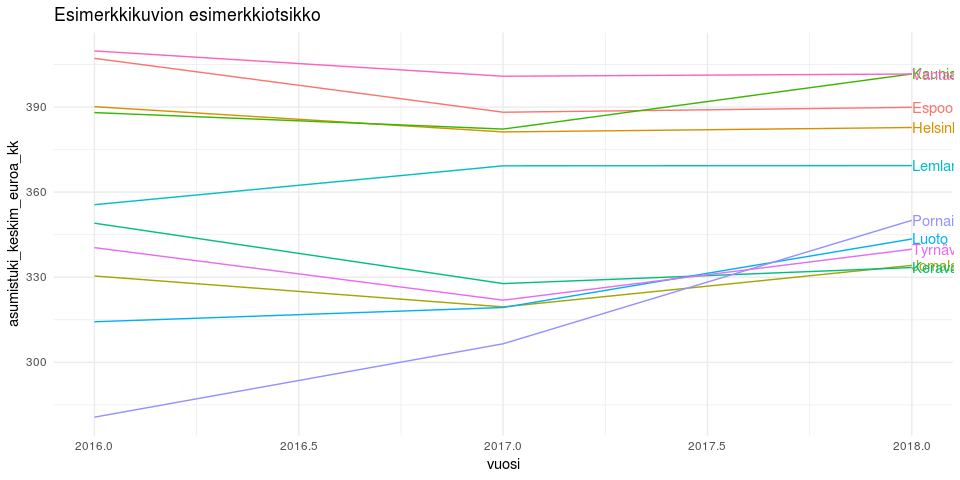

<table style="width:38%;">
<colgroup>
<col width="13%" />
<col width="11%" />
<col width="12%" />
</colgroup>
<thead>
<tr class="header">
<th>pvm</th>
<th>data</th>
<th>tekijä</th>
</tr>
</thead>
<tbody>
<tr class="odd">
<td>2019-02-19</td>
<td><a href="https://beta.avoindata.fi/data/fi/dataset/kelan-yleisen-asumistuen-saajat">Yleisen asumistuen saajaruokakunnat, keskimääräiset tuet, asumismenot ja ruokakunnan tulot</a></td>
<td>Markus Kainu</td>
</tr>
</tbody>
</table>

Käyttöesimerkkejä: Yleisen asumistuen saajaruokakunnat, keskimääräiset tuet, asumismenot ja ruokakunnan tulot
=============================================================================================================

    # CRAN-paketit
    library(tidyverse)
    library(jsonlite)
    library(ckanr)

Datan ja metadatan lataaminen
=============================

    ckanr_setup(url = "https://beta.avoindata.fi/data/fi/")
    x <- package_search(q = "Kansaneläkelaitos", fq = "title:yleisen")
    resources <- x$results[[1]]$resources
    # resources[[1]]$name
    # resources[[2]]$name

    dat <- readr::read_csv2(resources[[1]]$url)
    meta <- fromJSON(txt = resources[[2]]$url)

Datan ja metadatan kuvailu
==========================

    # Datan muuttujatieto
    meta$resources$schema$fields[[1]] %>% kable(format = "markdown")

<table>
<colgroup>
<col width="40%" />
<col width="40%" />
<col width="9%" />
<col width="9%" />
</colgroup>
<thead>
<tr class="header">
<th align="left">name</th>
<th align="left">title</th>
<th align="left">type</th>
<th align="left">format</th>
</tr>
</thead>
<tbody>
<tr class="odd">
<td align="left">kunta</td>
<td align="left">Kunnan nimi suomeksi</td>
<td align="left">string</td>
<td align="left">default</td>
</tr>
<tr class="even">
<td align="left">vuosi</td>
<td align="left">vuosi</td>
<td align="left">integer</td>
<td align="left">default</td>
</tr>
<tr class="odd">
<td align="left">ruokakuntatyyppi</td>
<td align="left">Ruokakuntatyyppi</td>
<td align="left">string</td>
<td align="left">default</td>
</tr>
<tr class="even">
<td align="left">saajaruokakunnat</td>
<td align="left">Saajaruokakunnat</td>
<td align="left">number</td>
<td align="left">default</td>
</tr>
<tr class="odd">
<td align="left">asumistuki_keskim_euroa_kk</td>
<td align="left">Keskimääräinen asumistuki e/kk</td>
<td align="left">integer</td>
<td align="left">default</td>
</tr>
<tr class="even">
<td align="left">asumismenot_keskim_euroa_kk</td>
<td align="left">Keskim. asumismenot e/kk</td>
<td align="left">integer</td>
<td align="left">default</td>
</tr>
<tr class="odd">
<td align="left">asumistukitulo_keskim_euroa_kk</td>
<td align="left">Keskim. asumistukitulo e/kk</td>
<td align="left">integer</td>
<td align="left">default</td>
</tr>
<tr class="even">
<td align="left">asumismenot_ennen_asumistukea_pros</td>
<td align="left">Asumismenot ennen asumistukea %</td>
<td align="left">integer</td>
<td align="left">default</td>
</tr>
<tr class="odd">
<td align="left">asumismenot_asumistuen_jalkeen_pros</td>
<td align="left">Asumismenot asumistuen jälkeen %</td>
<td align="left">integer</td>
<td align="left">default</td>
</tr>
<tr class="even">
<td align="left">asumismenot_keskim_e_m2_kk</td>
<td align="left">Keskim. asumismenot e/m2/kk</td>
<td align="left">number</td>
<td align="left">default</td>
</tr>
<tr class="odd">
<td align="left">asunnon_keskim_pintaala_m2_asunto</td>
<td align="left">Asunnon keskim. pinta-ala m2/asunto</td>
<td align="left">number</td>
<td align="left">default</td>
</tr>
</tbody>
</table>

    # Datan ensimmäiset rivit 
    head(dat) %>% kable(format = "markdown")

<table>
<colgroup>
<col width="2%" />
<col width="2%" />
<col width="9%" />
<col width="6%" />
<col width="9%" />
<col width="10%" />
<col width="11%" />
<col width="12%" />
<col width="13%" />
<col width="9%" />
<col width="12%" />
</colgroup>
<thead>
<tr class="header">
<th align="left">kunta</th>
<th align="right">vuosi</th>
<th align="left">ruokakuntatyyppi</th>
<th align="right">saajaruokakunnat</th>
<th align="right">asumistuki_keskim_euroa_kk</th>
<th align="right">asumismenot_keskim_euroa_kk</th>
<th align="right">asumistukitulo_keskim_euroa_kk</th>
<th align="right">asumismenot_ennen_asumistukea_pros</th>
<th align="right">asumismenot_asumistuen_jalkeen_pros</th>
<th align="right">asumismenot_keskim_e_m2_kk</th>
<th align="right">asunnon_keskim_pintaala_m2_asunto</th>
</tr>
</thead>
<tbody>
<tr class="odd">
<td align="left">Akaa</td>
<td align="right">2018</td>
<td align="left">Yhteensä</td>
<td align="right">60400</td>
<td align="right">2796358</td>
<td align="right">5415889</td>
<td align="right">9667248</td>
<td align="right">56023</td>
<td align="right">27097</td>
<td align="right">91049</td>
<td align="right">59483</td>
</tr>
<tr class="even">
<td align="left">Akaa</td>
<td align="right">2018</td>
<td align="left">Yksin asuvat</td>
<td align="right">37900</td>
<td align="right">2337341</td>
<td align="right">4500426</td>
<td align="right">6716300</td>
<td align="right">67008</td>
<td align="right">32207</td>
<td align="right">94712</td>
<td align="right">47517</td>
</tr>
<tr class="odd">
<td align="left">Akaa</td>
<td align="right">2018</td>
<td align="left">Lapsettomat parit</td>
<td align="right">2700</td>
<td align="right">2688667</td>
<td align="right">6000330</td>
<td align="right">12090970</td>
<td align="right">49627</td>
<td align="right">27390</td>
<td align="right">95468</td>
<td align="right">62852</td>
</tr>
<tr class="even">
<td align="left">Akaa</td>
<td align="right">2018</td>
<td align="left">Lapsiperheet yhteensä</td>
<td align="right">18400</td>
<td align="right">3784205</td>
<td align="right">7194155</td>
<td align="right">15167695</td>
<td align="right">47431</td>
<td align="right">22482</td>
<td align="right">86399</td>
<td align="right">83266</td>
</tr>
<tr class="odd">
<td align="left">Akaa</td>
<td align="right">2018</td>
<td align="left">Kahden huoltajan perheet</td>
<td align="right">3800</td>
<td align="right">3875579</td>
<td align="right">8512903</td>
<td align="right">23076629</td>
<td align="right">36890</td>
<td align="right">20095</td>
<td align="right">87905</td>
<td align="right">96842</td>
</tr>
<tr class="even">
<td align="left">Akaa</td>
<td align="right">2018</td>
<td align="left">Yhden huoltajan perheet</td>
<td align="right">14600</td>
<td align="right">3760423</td>
<td align="right">6850919</td>
<td align="right">13109205</td>
<td align="right">52260</td>
<td align="right">23575</td>
<td align="right">85916</td>
<td align="right">79740</td>
</tr>
</tbody>
</table>

Kuvio
=====

    library(ggplot2)
    # valitaan ensin top 10 kuntaa, joissa korkeimmat keskimääräiset asumistukimenot
    dat %>% 
      filter(ruokakuntatyyppi == "Yhteensä",
             vuosi == 2018) %>% 
      arrange(desc(asumistuki_keskim_euroa_kk)) %>% 
      slice(1:10) %>% pull(kunta) -> kunnat

    dat %>% 
      filter(ruokakuntatyyppi == "Yhteensä",
             kunta %in% kunnat) %>% 
      ggplot(aes(x = vuosi, y = asumistuki_keskim_euroa_kk, label = kunta,color = kunta)) + 
      geom_line() + 
      theme_minimal() +
      geom_text(data = dat %>% 
                  filter(ruokakuntatyyppi == "Yhteensä",
                         kunta %in% kunnat,
                         vuosi == 2018), hjust = 0) +
      theme(legend.position = "none") +
      labs(title = "Esimerkkikuvion esimerkkiotsikko")

