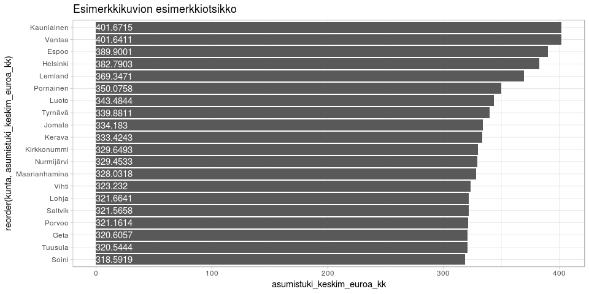
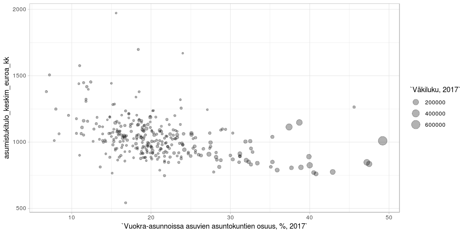

<table>
<thead>
<tr class="header">
<th style="text-align: left;">data</th>
<th style="text-align: left;">julkaistu</th>
<th style="text-align: left;">ylläpitäjä</th>
</tr>
</thead>
<tbody>
<tr class="odd">
<td style="text-align: left;"><a href='https://beta.avoindata.fi/data/fi/dataset/kelan-yleisen-asumistuen-saajat'>Yleisen asumistuen saajat</a></td>
<td style="text-align: left;">2019-02-19</td>
<td style="text-align: left;"><a href='mailto:markus.kainu@kela.fi'>Markus Kainu</a></td>
</tr>
</tbody>
</table>

    # CRAN-paketit
    library(dplyr)
    library(ggplot2)
    library(jsonlite)
    library(ckanr)
    library(readr)
    library(knitr)
    library(glue)
    library(pxweb)
    library(tidyr)

Resurssien lataaminen
---------------------

    ckanr_setup(url = "https://beta.avoindata.fi/data/fi/")
    x <- package_search(q = "Kansaneläkelaitos", fq = "title:yleisen")
    resources <- x$results[[1]]$resources

    dat <- readr::read_csv2(resources[[1]]$url) # data
    meta <- fromJSON(txt = resources[[2]]$url) # metadata

Resurssien kuvailu
==================

**Datan kuvaustieto**

    meta$description %>% cat()

Yleistä asumistukea saaneet ruokakunnat tilastointikuukauden aikana sekä
heidän keskimääräinen asumistuki, asumismenot ja asumistukitulot
kuukaudessa. Raportille on laskettu ruokakunnan asumismenojen osuus
asumistukeen vaikuttaneista tuloista ennen asumistukea sekä asumistuen
jälkeen. Lisäksi raportilla on tiedot yleisen asumistuen saajien
keskimääräisestä asunnon pinta-alasta ja asumismenoista pinta-alaneliötä
kohden. Ruokakunnan elämäntilanne on päätelty vuoden 2015 tiedoista
alkaen ruokakunnan tulojen mukaan ja yksi ruokakunta tilastoituu aina
yhteen elämäntilanneluokkaan. Vuosien 2007–2014 tiedoissa ruokakunnan
elämäntilanne on päätelty erikseen hakijan ja puolison tulojen mukaan,
ja sama ruokakunta voi tilastoitua kahteen eri elämäntilanneluokkaan.

**Datan muuttujatieto**

    meta$resources$schema$fields[[1]] %>% kable(format = "markdown")

<table>
<thead>
<tr class="header">
<th style="text-align: left;">name</th>
<th style="text-align: left;">type</th>
<th style="text-align: left;">format</th>
</tr>
</thead>
<tbody>
<tr class="odd">
<td style="text-align: left;">kuntanumero</td>
<td style="text-align: left;">integer</td>
<td style="text-align: left;">default</td>
</tr>
<tr class="even">
<td style="text-align: left;">kunta</td>
<td style="text-align: left;">string</td>
<td style="text-align: left;">default</td>
</tr>
<tr class="odd">
<td style="text-align: left;">aikajakso</td>
<td style="text-align: left;">string</td>
<td style="text-align: left;">default</td>
</tr>
<tr class="even">
<td style="text-align: left;">aika</td>
<td style="text-align: left;">string</td>
<td style="text-align: left;">default</td>
</tr>
<tr class="odd">
<td style="text-align: left;">ruokakuntatyyppi</td>
<td style="text-align: left;">string</td>
<td style="text-align: left;">default</td>
</tr>
<tr class="even">
<td style="text-align: left;">saajaruokakunnat</td>
<td style="text-align: left;">integer</td>
<td style="text-align: left;">default</td>
</tr>
<tr class="odd">
<td style="text-align: left;">asumistuki_keskim_euroa_kk</td>
<td style="text-align: left;">number</td>
<td style="text-align: left;">default</td>
</tr>
<tr class="even">
<td style="text-align: left;">asumismenot_keskim_euroa_kk</td>
<td style="text-align: left;">number</td>
<td style="text-align: left;">default</td>
</tr>
<tr class="odd">
<td style="text-align: left;">asumistukitulo_keskim_euroa_kk</td>
<td style="text-align: left;">number</td>
<td style="text-align: left;">default</td>
</tr>
<tr class="even">
<td style="text-align: left;">asumismenot_ennen_asumistukea_pros</td>
<td style="text-align: left;">number</td>
<td style="text-align: left;">default</td>
</tr>
<tr class="odd">
<td style="text-align: left;">asumismenot_asumistuen_jalkeen_pros</td>
<td style="text-align: left;">number</td>
<td style="text-align: left;">default</td>
</tr>
<tr class="even">
<td style="text-align: left;">asumismenot_keskim_e_m2_kk</td>
<td style="text-align: left;">number</td>
<td style="text-align: left;">default</td>
</tr>
<tr class="odd">
<td style="text-align: left;">asunnon_keskim_pintaala_m2_asunto</td>
<td style="text-align: left;">number</td>
<td style="text-align: left;">default</td>
</tr>
</tbody>
</table>

**Datan ensimmäiset rivit**

    head(dat) %>% kable(format = "markdown")

<table>
<colgroup>
<col style="width: 4%" />
<col style="width: 3%" />
<col style="width: 3%" />
<col style="width: 4%" />
<col style="width: 5%" />
<col style="width: 5%" />
<col style="width: 9%" />
<col style="width: 9%" />
<col style="width: 10%" />
<col style="width: 11%" />
<col style="width: 12%" />
<col style="width: 9%" />
<col style="width: 11%" />
</colgroup>
<thead>
<tr class="header">
<th style="text-align: right;">kuntanumero</th>
<th style="text-align: left;">kunta</th>
<th style="text-align: left;">aikajakso</th>
<th style="text-align: left;">aika</th>
<th style="text-align: left;">ruokakuntatyyppi</th>
<th style="text-align: right;">saajaruokakunnat</th>
<th style="text-align: right;">asumistuki_keskim_euroa_kk</th>
<th style="text-align: right;">asumismenot_keskim_euroa_kk</th>
<th style="text-align: right;">asumistukitulo_keskim_euroa_kk</th>
<th style="text-align: right;">asumismenot_ennen_asumistukea_pros</th>
<th style="text-align: right;">asumismenot_asumistuen_jalkeen_pros</th>
<th style="text-align: right;">asumismenot_keskim_e_m2_kk</th>
<th style="text-align: right;">asunnon_keskim_pintaala_m2_asunto</th>
</tr>
</thead>
<tbody>
<tr class="odd">
<td style="text-align: right;">5</td>
<td style="text-align: left;">Alajärvi</td>
<td style="text-align: left;">vuosi</td>
<td style="text-align: left;">2007 (31.12.)</td>
<td style="text-align: left;">Yhteensä</td>
<td style="text-align: right;">131</td>
<td style="text-align: right;">204.65</td>
<td style="text-align: right;">401.81</td>
<td style="text-align: right;">789.32</td>
<td style="text-align: right;">50.9</td>
<td style="text-align: right;">25.0</td>
<td style="text-align: right;">5.4</td>
<td style="text-align: right;">74.1</td>
</tr>
<tr class="even">
<td style="text-align: right;">9</td>
<td style="text-align: left;">Alavieska</td>
<td style="text-align: left;">vuosi</td>
<td style="text-align: left;">2007 (31.12.)</td>
<td style="text-align: left;">Yhteensä</td>
<td style="text-align: right;">34</td>
<td style="text-align: right;">168.84</td>
<td style="text-align: right;">389.82</td>
<td style="text-align: right;">826.00</td>
<td style="text-align: right;">47.2</td>
<td style="text-align: right;">26.8</td>
<td style="text-align: right;">5.9</td>
<td style="text-align: right;">65.8</td>
</tr>
<tr class="odd">
<td style="text-align: right;">10</td>
<td style="text-align: left;">Alavus</td>
<td style="text-align: left;">vuosi</td>
<td style="text-align: left;">2007 (31.12.)</td>
<td style="text-align: left;">Yhteensä</td>
<td style="text-align: right;">163</td>
<td style="text-align: right;">203.18</td>
<td style="text-align: right;">407.83</td>
<td style="text-align: right;">799.71</td>
<td style="text-align: right;">51.0</td>
<td style="text-align: right;">25.6</td>
<td style="text-align: right;">6.2</td>
<td style="text-align: right;">66.0</td>
</tr>
<tr class="even">
<td style="text-align: right;">16</td>
<td style="text-align: left;">Asikkala</td>
<td style="text-align: left;">vuosi</td>
<td style="text-align: left;">2007 (31.12.)</td>
<td style="text-align: left;">Yhteensä</td>
<td style="text-align: right;">103</td>
<td style="text-align: right;">210.84</td>
<td style="text-align: right;">399.29</td>
<td style="text-align: right;">699.76</td>
<td style="text-align: right;">57.1</td>
<td style="text-align: right;">26.9</td>
<td style="text-align: right;">6.7</td>
<td style="text-align: right;">59.5</td>
</tr>
<tr class="odd">
<td style="text-align: right;">18</td>
<td style="text-align: left;">Askola</td>
<td style="text-align: left;">vuosi</td>
<td style="text-align: left;">2007 (31.12.)</td>
<td style="text-align: left;">Yhteensä</td>
<td style="text-align: right;">18</td>
<td style="text-align: right;">205.24</td>
<td style="text-align: right;">406.06</td>
<td style="text-align: right;">671.67</td>
<td style="text-align: right;">60.5</td>
<td style="text-align: right;">29.9</td>
<td style="text-align: right;">5.5</td>
<td style="text-align: right;">73.6</td>
</tr>
<tr class="even">
<td style="text-align: right;">19</td>
<td style="text-align: left;">Aura</td>
<td style="text-align: left;">vuosi</td>
<td style="text-align: left;">2007 (31.12.)</td>
<td style="text-align: left;">Yhteensä</td>
<td style="text-align: right;">32</td>
<td style="text-align: right;">229.26</td>
<td style="text-align: right;">460.31</td>
<td style="text-align: right;">764.94</td>
<td style="text-align: right;">60.2</td>
<td style="text-align: right;">30.2</td>
<td style="text-align: right;">7.4</td>
<td style="text-align: right;">62.5</td>
</tr>
</tbody>
</table>

Kuvio
-----

    # valitaan ensin top 10 kuntaa, joissa korkeimmat keskimääräiset asumistukimenot
    dat_plot <- dat %>% 
      filter(aikajakso == "vuosi",
             aika == "2015 (31.12.)",
             ruokakuntatyyppi == "Yhteensä"
             ) %>% 
      arrange(desc(asumistuki_keskim_euroa_kk)) %>% 
      slice(1:20)

    # Piirretään kuva
    ggplot(dat_plot, 
           aes(x = reorder(kunta, asumistuki_keskim_euroa_kk), 
               y = asumistuki_keskim_euroa_kk, 
               label = asumistuki_keskim_euroa_kk)) + 
      geom_col() + 
      coord_flip() + 
      geom_text(aes(y = 0), hjust = 0, color = "white") +
      labs(title = "Esimerkkikuvion esimerkkiotsikko") +
      theme_light()

Datan yhdistäminen Tilastokeskuksen kuntien avainlukuihin
---------------------------------------------------------

    # PXWEB query 
    pxweb_query_list <- 
      list("Alue 2018"=c("SSS","020","005","009","010","016","018","019","035","043","046","047","049","050","051","052","060","061","062","065","069","071","072","074","075","076","077","078","079","081","082","086","111","090","091","097","098","099","102","103","105","106","108","109","139","140","142","143","145","146","153","148","149","151","152","165","167","169","170","171","172","176","177","178","179","181","182","186","202","204","205","208","211","213","214","216","217","218","224","226","230","231","232","233","235","236","239","240","320","241","322","244","245","249","250","256","257","260","261","263","265","271","272","273","275","276","280","284","285","286","287","288","290","291","295","297","300","301","304","305","312","316","317","318","398","399","400","407","402","403","405","408","410","416","417","418","420","421","422","423","425","426","444","430","433","434","435","436","438","440","441","475","478","480","481","483","484","489","491","494","495","498","499","500","503","504","505","508","507","529","531","535","536","538","541","543","545","560","561","562","563","564","309","576","577","578","445","580","581","599","583","854","584","588","592","593","595","598","601","604","607","608","609","611","638","614","615","616","619","620","623","624","625","626","630","631","635","636","678","710","680","681","683","684","686","687","689","691","694","697","698","700","702","704","707","729","732","734","736","790","738","739","740","742","743","746","747","748","791","749","751","753","755","758","759","761","762","765","766","768","771","777","778","781","783","831","832","833","834","837","844","845","846","848","849","850","851","853","857","858","859","886","887","889","890","892","893","895","785","905","908","911","092","915","918","921","922","924","925","927","931","934","935","936","941","946","976","977","980","981","989","992","MK01","MK02","MK04","MK05","MK06","MK07","MK08","MK09","MK10","MK11","MK12","MK13","MK14","MK15","MK16","MK17","MK18","MK19","MK21","SK011","SK014","SK015","SK016","SK021","SK022","SK023","SK024","SK025","SK041","SK043","SK044","SK051","SK052","SK053","SK061","SK063","SK064","SK068","SK069","SK071","SK081","SK082","SK091","SK093","SK101","SK103","SK105","SK111","SK112","SK113","SK114","SK115","SK122","SK124","SK125","SK131","SK132","SK133","SK134","SK135","SK138","SK141","SK142","SK144","SK146","SK151","SK152","SK153","SK154","SK161","SK162","SK171","SK173","SK174","SK175","SK176","SK177","SK178","SK181","SK182","SK191","SK192","SK193","SK194","SK196","SK197","SK211","SK212","SK213","2020MK01","2020MK02","2020MK04","2020MK05","2020MK06","2020MK07","2020MK08","2020MK09","2020MK10","2020MK11","2020MK12","2020MK13","2020MK14","2020MK15","2020MK16","2020MK17","2020MK18","2020MK19","2020MK21","2020SK011","2020SK014","2020SK015","2020SK016","2020SK021","2020SK022","2020SK023","2020SK024","2020SK025","2020SK041","2020SK043","2020SK044","2020SK051","2020SK052","2020SK053","2020SK061","2020SK063","2020SK064","2020SK068","2020SK069","2020SK071","2020SK081","2020SK082","2020SK091","2020SK093","2020SK101","2020SK103","2020SK105","2020SK111","2020SK112","2020SK113","2020SK114","2020SK115","2020SK122","2020SK124","2020SK125","2020SK131","2020SK132","2020SK133","2020SK134","2020SK135","2020SK138","2020SK141","2020SK142","2020SK144","2020SK146","2020SK151","2020SK152","2020SK153","2020SK154","2020SK161","2020SK162","2020SK171","2020SK173","2020SK174","2020SK175","2020SK176","2020SK177","2020SK178","2020SK181","2020SK182","2020SK191","2020SK192","2020SK193","2020SK194","2020SK196","2020SK197","2020SK211","2020SK212","2020SK213"),
           "Tiedot"=c("M408","M411","M476","M391","M421","M478","M404","M410","M303","M297","M302","M44","M62","M70","M488","M486","M137","M140","M130","M162","M78","M485","M152","M72","M84","M106","M499","M496","M495","M497","M498"))

    # Download data 
    tk_lst <- 
      pxweb_get(url = "http://pxnet2.stat.fi/PXWeb/api/v1/fi/Kuntien_avainluvut/2018/kuntien_avainluvut_2018_viimeisin.px",
                query = pxweb_query_list)
    tk_avainluvut <- as.data.frame(tk_lst, column.name.type = "text", variable.value.type = "text") %>% 
      # levitetään data
      spread(key = Tiedot, value = `Kuntien avainluvut`)

    df <- left_join(dat, tk_avainluvut, by = c("kunta" = "Alue 2018"))

    # Piirretään hajontakuvio
    df2 <- df %>% 
      filter(aikajakso == "vuosi",
             aika == "2015 (31.12.)",
             ruokakuntatyyppi == "Yhteensä"
      )

    ggplot(df2, 
           aes(x = `Vuokra-asunnoissa asuvien asuntokuntien osuus, %, 2017`, 
               y = asumistukitulo_keskim_euroa_kk, 
               size = `Väkiluku, 2017`)) + 
      geom_point(alpha = .3) +
      labs(y = "asumistukitulo_keskim_euroa_kk") + 
      theme_light()

Datastore-api
-------------

Jos et tarvitse koko aineistoa, voit suodattaa siitä osio SQL:llä
käyttäen CKAN:n DataStore-rajapintaa.

Alla olevassa esimerkissä tehdään rajaus `kunta`-muuttujasta ja siis
etsitään vaan kuntaa *Veteli* koskevat tiedot.

    kunta <- "Veteli"
    res <- ckanr::ds_search_sql(sql = glue("SELECT * from \"{resources[[1]]$id}\" WHERE kunta LIKE '{kunta}'"), as = "table")
    res$records %>% 
      select(-`_full_text`, -`_id`) %>% 
      kable(format = "markdown")

<table style="width:100%;">
<colgroup>
<col style="width: 7%" />
<col style="width: 1%" />
<col style="width: 5%" />
<col style="width: 3%" />
<col style="width: 5%" />
<col style="width: 3%" />
<col style="width: 7%" />
<col style="width: 1%" />
<col style="width: 9%" />
<col style="width: 9%" />
<col style="width: 4%" />
<col style="width: 8%" />
<col style="width: 9%" />
<col style="width: 7%" />
<col style="width: 7%" />
<col style="width: 7%" />
</colgroup>
<thead>
<tr class="header">
<th style="text-align: left;">asumismenot_keskim_euroa_kk</th>
<th style="text-align: left;">kunta</th>
<th style="text-align: left;">asunnon_hallintamuoto</th>
<th style="text-align: left;">kuntanumero</th>
<th style="text-align: left;">asunnon_rahoitusmuoto</th>
<th style="text-align: left;">jaettu_asunto</th>
<th style="text-align: left;">asumismenot_keskim_e_m2_kk</th>
<th style="text-align: left;">vuosi</th>
<th style="text-align: left;">asunnon_keskim_pintaala_m2_asunto</th>
<th style="text-align: left;">asumismenot_ennen_asumistukea_pros</th>
<th style="text-align: left;">saajaruokakunnat</th>
<th style="text-align: left;">asumistukitulo_keskim_euroa_kk</th>
<th style="text-align: left;">asumismenot_asumistuen_jalkeen_pros</th>
<th style="text-align: left;">Ruokakuntatyyppi</th>
<th style="text-align: left;">asumistuki_keskim_euroa_kk</th>
<th style="text-align: left;">ruokakunnan_elamantilanne</th>
</tr>
</thead>
<tbody>
<tr class="odd">
<td style="text-align: left;">NA</td>
<td style="text-align: left;">Veteli</td>
<td style="text-align: left;">Yhteensä</td>
<td style="text-align: left;">924</td>
<td style="text-align: left;">Yhteensä</td>
<td style="text-align: left;">Yhteensä</td>
<td style="text-align: left;">NA</td>
<td style="text-align: left;">2018</td>
<td style="text-align: left;">NA</td>
<td style="text-align: left;">NA</td>
<td style="text-align: left;">NA</td>
<td style="text-align: left;">NA</td>
<td style="text-align: left;">NA</td>
<td style="text-align: left;">Muut</td>
<td style="text-align: left;">NA</td>
<td style="text-align: left;">Yhteensä</td>
</tr>
<tr class="even">
<td style="text-align: left;">439,4826</td>
<td style="text-align: left;">Veteli</td>
<td style="text-align: left;">Yhteensä</td>
<td style="text-align: left;">924</td>
<td style="text-align: left;">Yhteensä</td>
<td style="text-align: left;">Yhteensä</td>
<td style="text-align: left;">6,6979</td>
<td style="text-align: left;">2018</td>
<td style="text-align: left;">65,615</td>
<td style="text-align: left;">51,289</td>
<td style="text-align: left;">39</td>
<td style="text-align: left;">856,8792</td>
<td style="text-align: left;">19,228</td>
<td style="text-align: left;">Yhteensä</td>
<td style="text-align: left;">274,7210</td>
<td style="text-align: left;">Yhteensä</td>
</tr>
<tr class="odd">
<td style="text-align: left;">350,3112</td>
<td style="text-align: left;">Veteli</td>
<td style="text-align: left;">Yhteensä</td>
<td style="text-align: left;">924</td>
<td style="text-align: left;">Yhteensä</td>
<td style="text-align: left;">Yhteensä</td>
<td style="text-align: left;">6,3167</td>
<td style="text-align: left;">2018</td>
<td style="text-align: left;">55,458</td>
<td style="text-align: left;">49,534</td>
<td style="text-align: left;">24</td>
<td style="text-align: left;">707,2175</td>
<td style="text-align: left;">20,689</td>
<td style="text-align: left;">Yksin asuvat</td>
<td style="text-align: left;">203,9958</td>
<td style="text-align: left;">Yhteensä</td>
</tr>
<tr class="even">
<td style="text-align: left;">NA</td>
<td style="text-align: left;">Veteli</td>
<td style="text-align: left;">Yhteensä</td>
<td style="text-align: left;">924</td>
<td style="text-align: left;">Yhteensä</td>
<td style="text-align: left;">Yhteensä</td>
<td style="text-align: left;">NA</td>
<td style="text-align: left;">2018</td>
<td style="text-align: left;">NA</td>
<td style="text-align: left;">NA</td>
<td style="text-align: left;">NA</td>
<td style="text-align: left;">NA</td>
<td style="text-align: left;">NA</td>
<td style="text-align: left;">Lapsettomat parit</td>
<td style="text-align: left;">NA</td>
<td style="text-align: left;">Yhteensä</td>
</tr>
<tr class="odd">
<td style="text-align: left;">608,5755</td>
<td style="text-align: left;">Veteli</td>
<td style="text-align: left;">Yhteensä</td>
<td style="text-align: left;">924</td>
<td style="text-align: left;">Yhteensä</td>
<td style="text-align: left;">Yhteensä</td>
<td style="text-align: left;">7,0171</td>
<td style="text-align: left;">2018</td>
<td style="text-align: left;">86,727</td>
<td style="text-align: left;">45,060</td>
<td style="text-align: left;">11</td>
<td style="text-align: left;">1350,5882</td>
<td style="text-align: left;">13,315</td>
<td style="text-align: left;">Lapsiperheet yhteensä</td>
<td style="text-align: left;">428,7482</td>
<td style="text-align: left;">Yhteensä</td>
</tr>
<tr class="even">
<td style="text-align: left;">NA</td>
<td style="text-align: left;">Veteli</td>
<td style="text-align: left;">Yhteensä</td>
<td style="text-align: left;">924</td>
<td style="text-align: left;">Yhteensä</td>
<td style="text-align: left;">Yhteensä</td>
<td style="text-align: left;">NA</td>
<td style="text-align: left;">2018</td>
<td style="text-align: left;">NA</td>
<td style="text-align: left;">NA</td>
<td style="text-align: left;">NA</td>
<td style="text-align: left;">NA</td>
<td style="text-align: left;">NA</td>
<td style="text-align: left;">-Kahden huoltajan perheet</td>
<td style="text-align: left;">NA</td>
<td style="text-align: left;">Yhteensä</td>
</tr>
<tr class="odd">
<td style="text-align: left;">549,8144</td>
<td style="text-align: left;">Veteli</td>
<td style="text-align: left;">Yhteensä</td>
<td style="text-align: left;">924</td>
<td style="text-align: left;">Yhteensä</td>
<td style="text-align: left;">Yhteensä</td>
<td style="text-align: left;">6,9304</td>
<td style="text-align: left;">2018</td>
<td style="text-align: left;">79,333</td>
<td style="text-align: left;">41,518</td>
<td style="text-align: left;">9</td>
<td style="text-align: left;">1324,2844</td>
<td style="text-align: left;">13,123</td>
<td style="text-align: left;">-Yhden huoltajan perheet</td>
<td style="text-align: left;">376,0311</td>
<td style="text-align: left;">Yhteensä</td>
</tr>
<tr class="even">
<td style="text-align: left;">447,9392</td>
<td style="text-align: left;">Veteli</td>
<td style="text-align: left;">Yhteensä</td>
<td style="text-align: left;">924</td>
<td style="text-align: left;">Yhteensä</td>
<td style="text-align: left;">Yhteensä</td>
<td style="text-align: left;">6,8914</td>
<td style="text-align: left;">2017</td>
<td style="text-align: left;">65,000</td>
<td style="text-align: left;">42,946</td>
<td style="text-align: left;">52</td>
<td style="text-align: left;">1043,0344</td>
<td style="text-align: left;">18,799</td>
<td style="text-align: left;">Yhteensä</td>
<td style="text-align: left;">251,8548</td>
<td style="text-align: left;">Yhteensä</td>
</tr>
<tr class="odd">
<td style="text-align: left;">357,3679</td>
<td style="text-align: left;">Veteli</td>
<td style="text-align: left;">Yhteensä</td>
<td style="text-align: left;">924</td>
<td style="text-align: left;">Yhteensä</td>
<td style="text-align: left;">Yhteensä</td>
<td style="text-align: left;">6,3775</td>
<td style="text-align: left;">2017</td>
<td style="text-align: left;">56,036</td>
<td style="text-align: left;">51,577</td>
<td style="text-align: left;">28</td>
<td style="text-align: left;">692,8789</td>
<td style="text-align: left;">22,537</td>
<td style="text-align: left;">Yksin asuvat</td>
<td style="text-align: left;">201,2125</td>
<td style="text-align: left;">Yhteensä</td>
</tr>
<tr class="even">
<td style="text-align: left;">NA</td>
<td style="text-align: left;">Veteli</td>
<td style="text-align: left;">Yhteensä</td>
<td style="text-align: left;">924</td>
<td style="text-align: left;">Yhteensä</td>
<td style="text-align: left;">Yhteensä</td>
<td style="text-align: left;">NA</td>
<td style="text-align: left;">2017</td>
<td style="text-align: left;">NA</td>
<td style="text-align: left;">NA</td>
<td style="text-align: left;">NA</td>
<td style="text-align: left;">NA</td>
<td style="text-align: left;">NA</td>
<td style="text-align: left;">Lapsettomat parit</td>
<td style="text-align: left;">NA</td>
<td style="text-align: left;">Yhteensä</td>
</tr>
<tr class="odd">
<td style="text-align: left;">583,4906</td>
<td style="text-align: left;">Veteli</td>
<td style="text-align: left;">Yhteensä</td>
<td style="text-align: left;">924</td>
<td style="text-align: left;">Yhteensä</td>
<td style="text-align: left;">Yhteensä</td>
<td style="text-align: left;">7,3704</td>
<td style="text-align: left;">2017</td>
<td style="text-align: left;">79,167</td>
<td style="text-align: left;">37,411</td>
<td style="text-align: left;">18</td>
<td style="text-align: left;">1559,6767</td>
<td style="text-align: left;">15,456</td>
<td style="text-align: left;">Lapsiperheet yhteensä</td>
<td style="text-align: left;">342,4228</td>
<td style="text-align: left;">Yhteensä</td>
</tr>
<tr class="even">
<td style="text-align: left;">716,1500</td>
<td style="text-align: left;">Veteli</td>
<td style="text-align: left;">Yhteensä</td>
<td style="text-align: left;">924</td>
<td style="text-align: left;">Yhteensä</td>
<td style="text-align: left;">Yhteensä</td>
<td style="text-align: left;">7,5384</td>
<td style="text-align: left;">2017</td>
<td style="text-align: left;">95,000</td>
<td style="text-align: left;">41,960</td>
<td style="text-align: left;">6</td>
<td style="text-align: left;">1706,7617</td>
<td style="text-align: left;">16,536</td>
<td style="text-align: left;">-Kahden huoltajan perheet</td>
<td style="text-align: left;">433,9167</td>
<td style="text-align: left;">Yhteensä</td>
</tr>
<tr class="odd">
<td style="text-align: left;">517,1608</td>
<td style="text-align: left;">Veteli</td>
<td style="text-align: left;">Yhteensä</td>
<td style="text-align: left;">924</td>
<td style="text-align: left;">Yhteensä</td>
<td style="text-align: left;">Yhteensä</td>
<td style="text-align: left;">7,2499</td>
<td style="text-align: left;">2017</td>
<td style="text-align: left;">71,333</td>
<td style="text-align: left;">34,799</td>
<td style="text-align: left;">12</td>
<td style="text-align: left;">1486,1342</td>
<td style="text-align: left;">14,836</td>
<td style="text-align: left;">-Yhden huoltajan perheet</td>
<td style="text-align: left;">296,6758</td>
<td style="text-align: left;">Yhteensä</td>
</tr>
<tr class="even">
<td style="text-align: left;">NA</td>
<td style="text-align: left;">Veteli</td>
<td style="text-align: left;">Yhteensä</td>
<td style="text-align: left;">924</td>
<td style="text-align: left;">Yhteensä</td>
<td style="text-align: left;">Yhteensä</td>
<td style="text-align: left;">NA</td>
<td style="text-align: left;">2017</td>
<td style="text-align: left;">NA</td>
<td style="text-align: left;">NA</td>
<td style="text-align: left;">NA</td>
<td style="text-align: left;">NA</td>
<td style="text-align: left;">NA</td>
<td style="text-align: left;">Muut</td>
<td style="text-align: left;">NA</td>
<td style="text-align: left;">Yhteensä</td>
</tr>
<tr class="odd">
<td style="text-align: left;">423,4747</td>
<td style="text-align: left;">Veteli</td>
<td style="text-align: left;">Yhteensä</td>
<td style="text-align: left;">924</td>
<td style="text-align: left;">Yhteensä</td>
<td style="text-align: left;">Yhteensä</td>
<td style="text-align: left;">6,4390</td>
<td style="text-align: left;">2016</td>
<td style="text-align: left;">65,767</td>
<td style="text-align: left;">35,753</td>
<td style="text-align: left;">43</td>
<td style="text-align: left;">1184,4426</td>
<td style="text-align: left;">16,060</td>
<td style="text-align: left;">Yhteensä</td>
<td style="text-align: left;">233,2491</td>
<td style="text-align: left;">Yhteensä</td>
</tr>
<tr class="even">
<td style="text-align: left;">334,7079</td>
<td style="text-align: left;">Veteli</td>
<td style="text-align: left;">Yhteensä</td>
<td style="text-align: left;">924</td>
<td style="text-align: left;">Yhteensä</td>
<td style="text-align: left;">Yhteensä</td>
<td style="text-align: left;">5,8721</td>
<td style="text-align: left;">2016</td>
<td style="text-align: left;">57,000</td>
<td style="text-align: left;">44,965</td>
<td style="text-align: left;">19</td>
<td style="text-align: left;">744,3674</td>
<td style="text-align: left;">18,686</td>
<td style="text-align: left;">Yksin asuvat</td>
<td style="text-align: left;">195,6126</td>
<td style="text-align: left;">Yhteensä</td>
</tr>
<tr class="odd">
<td style="text-align: left;">NA</td>
<td style="text-align: left;">Veteli</td>
<td style="text-align: left;">Yhteensä</td>
<td style="text-align: left;">924</td>
<td style="text-align: left;">Yhteensä</td>
<td style="text-align: left;">Yhteensä</td>
<td style="text-align: left;">NA</td>
<td style="text-align: left;">2016</td>
<td style="text-align: left;">NA</td>
<td style="text-align: left;">NA</td>
<td style="text-align: left;">NA</td>
<td style="text-align: left;">NA</td>
<td style="text-align: left;">NA</td>
<td style="text-align: left;">Lapsettomat parit</td>
<td style="text-align: left;">NA</td>
<td style="text-align: left;">Yhteensä</td>
</tr>
<tr class="even">
<td style="text-align: left;">529,8811</td>
<td style="text-align: left;">Veteli</td>
<td style="text-align: left;">Yhteensä</td>
<td style="text-align: left;">924</td>
<td style="text-align: left;">Yhteensä</td>
<td style="text-align: left;">Yhteensä</td>
<td style="text-align: left;">6,8302</td>
<td style="text-align: left;">2016</td>
<td style="text-align: left;">77,579</td>
<td style="text-align: left;">31,234</td>
<td style="text-align: left;">19</td>
<td style="text-align: left;">1696,4737</td>
<td style="text-align: left;">14,563</td>
<td style="text-align: left;">Lapsiperheet yhteensä</td>
<td style="text-align: left;">282,8316</td>
<td style="text-align: left;">Yhteensä</td>
</tr>
<tr class="odd">
<td style="text-align: left;">558,7633</td>
<td style="text-align: left;">Veteli</td>
<td style="text-align: left;">Yhteensä</td>
<td style="text-align: left;">924</td>
<td style="text-align: left;">Yhteensä</td>
<td style="text-align: left;">Yhteensä</td>
<td style="text-align: left;">6,7456</td>
<td style="text-align: left;">2016</td>
<td style="text-align: left;">82,833</td>
<td style="text-align: left;">35,754</td>
<td style="text-align: left;">6</td>
<td style="text-align: left;">1562,7967</td>
<td style="text-align: left;">16,514</td>
<td style="text-align: left;">-Kahden huoltajan perheet</td>
<td style="text-align: left;">300,6833</td>
<td style="text-align: left;">Yhteensä</td>
</tr>
<tr class="even">
<td style="text-align: left;">516,5508</td>
<td style="text-align: left;">Veteli</td>
<td style="text-align: left;">Yhteensä</td>
<td style="text-align: left;">924</td>
<td style="text-align: left;">Yhteensä</td>
<td style="text-align: left;">Yhteensä</td>
<td style="text-align: left;">6,8732</td>
<td style="text-align: left;">2016</td>
<td style="text-align: left;">75,154</td>
<td style="text-align: left;">29,380</td>
<td style="text-align: left;">13</td>
<td style="text-align: left;">1758,1708</td>
<td style="text-align: left;">13,762</td>
<td style="text-align: left;">-Yhden huoltajan perheet</td>
<td style="text-align: left;">274,5923</td>
<td style="text-align: left;">Yhteensä</td>
</tr>
<tr class="odd">
<td style="text-align: left;">331,5550</td>
<td style="text-align: left;">Veteli</td>
<td style="text-align: left;">Yhteensä</td>
<td style="text-align: left;">924</td>
<td style="text-align: left;">Yhteensä</td>
<td style="text-align: left;">Yhteensä</td>
<td style="text-align: left;">6,2558</td>
<td style="text-align: left;">2016</td>
<td style="text-align: left;">53,000</td>
<td style="text-align: left;">42,310</td>
<td style="text-align: left;">4</td>
<td style="text-align: left;">783,6325</td>
<td style="text-align: left;">17,530</td>
<td style="text-align: left;">Muut</td>
<td style="text-align: left;">194,1850</td>
<td style="text-align: left;">Yhteensä</td>
</tr>
<tr class="even">
<td style="text-align: left;">401,8642</td>
<td style="text-align: left;">Veteli</td>
<td style="text-align: left;">Yhteensä</td>
<td style="text-align: left;">924</td>
<td style="text-align: left;">Yhteensä</td>
<td style="text-align: left;">Yhteensä</td>
<td style="text-align: left;">6,5258</td>
<td style="text-align: left;">2015</td>
<td style="text-align: left;">61,581</td>
<td style="text-align: left;">40,748</td>
<td style="text-align: left;">31</td>
<td style="text-align: left;">986,2239</td>
<td style="text-align: left;">15,813</td>
<td style="text-align: left;">Yhteensä</td>
<td style="text-align: left;">245,9129</td>
<td style="text-align: left;">Yhteensä</td>
</tr>
<tr class="odd">
<td style="text-align: left;">344,9800</td>
<td style="text-align: left;">Veteli</td>
<td style="text-align: left;">Yhteensä</td>
<td style="text-align: left;">924</td>
<td style="text-align: left;">Yhteensä</td>
<td style="text-align: left;">Yhteensä</td>
<td style="text-align: left;">7,0151</td>
<td style="text-align: left;">2015</td>
<td style="text-align: left;">49,176</td>
<td style="text-align: left;">43,764</td>
<td style="text-align: left;">17</td>
<td style="text-align: left;">788,2800</td>
<td style="text-align: left;">18,427</td>
<td style="text-align: left;">Yksin asuvat</td>
<td style="text-align: left;">199,7218</td>
<td style="text-align: left;">Yhteensä</td>
</tr>
<tr class="even">
<td style="text-align: left;">470,7275</td>
<td style="text-align: left;">Veteli</td>
<td style="text-align: left;">Yhteensä</td>
<td style="text-align: left;">924</td>
<td style="text-align: left;">Yhteensä</td>
<td style="text-align: left;">Yhteensä</td>
<td style="text-align: left;">6,9225</td>
<td style="text-align: left;">2015</td>
<td style="text-align: left;">68,000</td>
<td style="text-align: left;">51,564</td>
<td style="text-align: left;">4</td>
<td style="text-align: left;">912,9025</td>
<td style="text-align: left;">16,749</td>
<td style="text-align: left;">Lapsettomat parit</td>
<td style="text-align: left;">317,8300</td>
<td style="text-align: left;">Yhteensä</td>
</tr>
<tr class="odd">
<td style="text-align: left;">461,0244</td>
<td style="text-align: left;">Veteli</td>
<td style="text-align: left;">Yhteensä</td>
<td style="text-align: left;">924</td>
<td style="text-align: left;">Yhteensä</td>
<td style="text-align: left;">Yhteensä</td>
<td style="text-align: left;">5,7548</td>
<td style="text-align: left;">2015</td>
<td style="text-align: left;">80,111</td>
<td style="text-align: left;">32,377</td>
<td style="text-align: left;">9</td>
<td style="text-align: left;">1423,9300</td>
<td style="text-align: left;">12,807</td>
<td style="text-align: left;">Lapsiperheet yhteensä</td>
<td style="text-align: left;">278,6567</td>
<td style="text-align: left;">Yhteensä</td>
</tr>
<tr class="even">
<td style="text-align: left;">NA</td>
<td style="text-align: left;">Veteli</td>
<td style="text-align: left;">Yhteensä</td>
<td style="text-align: left;">924</td>
<td style="text-align: left;">Yhteensä</td>
<td style="text-align: left;">Yhteensä</td>
<td style="text-align: left;">NA</td>
<td style="text-align: left;">2015</td>
<td style="text-align: left;">NA</td>
<td style="text-align: left;">NA</td>
<td style="text-align: left;">NA</td>
<td style="text-align: left;">NA</td>
<td style="text-align: left;">NA</td>
<td style="text-align: left;">-Kahden huoltajan perheet</td>
<td style="text-align: left;">NA</td>
<td style="text-align: left;">Yhteensä</td>
</tr>
<tr class="odd">
<td style="text-align: left;">430,8886</td>
<td style="text-align: left;">Veteli</td>
<td style="text-align: left;">Yhteensä</td>
<td style="text-align: left;">924</td>
<td style="text-align: left;">Yhteensä</td>
<td style="text-align: left;">Yhteensä</td>
<td style="text-align: left;">5,8341</td>
<td style="text-align: left;">2015</td>
<td style="text-align: left;">73,857</td>
<td style="text-align: left;">31,790</td>
<td style="text-align: left;">7</td>
<td style="text-align: left;">1355,4286</td>
<td style="text-align: left;">13,592</td>
<td style="text-align: left;">-Yhden huoltajan perheet</td>
<td style="text-align: left;">246,6614</td>
<td style="text-align: left;">Yhteensä</td>
</tr>
</tbody>
</table>
