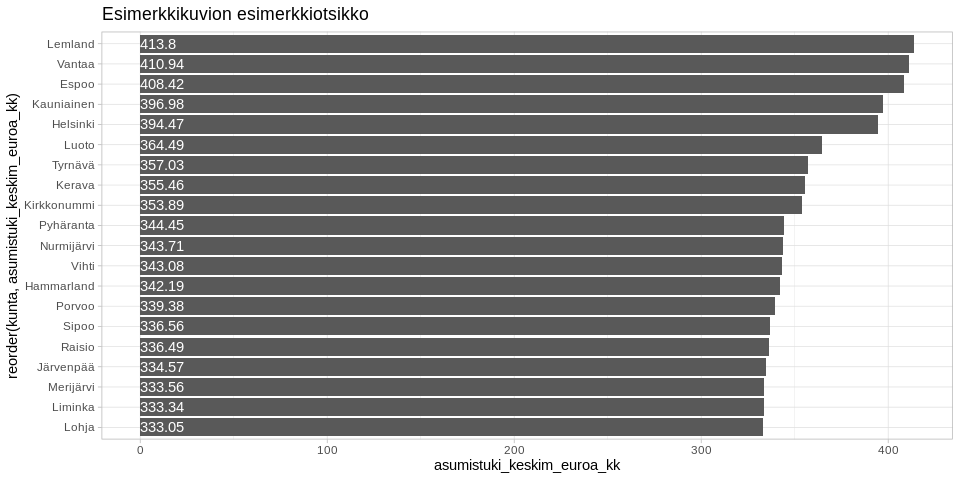
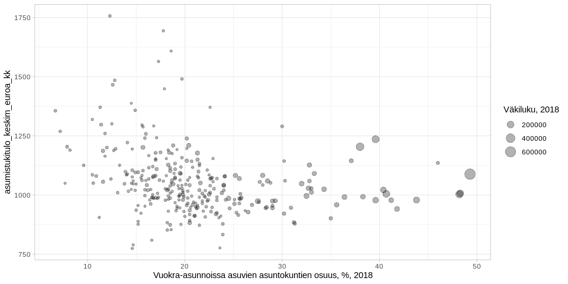

<table>
<thead>
<tr class="header">
<th style="text-align: left;">data</th>
<th style="text-align: left;">julkaistu</th>
<th style="text-align: left;">ylläpitäjä</th>
</tr>
</thead>
<tbody>
<tr class="odd">
<td style="text-align: left;"><a href='https://beta.avoindata.fi/data/fi/dataset/kelan-yleisen-asumistuen-saajat'>Yleisen asumistuen saajat</a></td>
<td style="text-align: left;">2019-02-19</td>
<td style="text-align: left;"><a href='mailto:markus.kainu@kela.fi'>Markus Kainu</a></td>
</tr>
</tbody>
</table>

    # CRAN-paketit
    library(dplyr)
    library(ggplot2)
    library(jsonlite)
    library(ckanr)
    library(readr)
    library(knitr)
    library(glue)
    library(pxweb)
    library(tidyr)

Resurssien lataaminen
---------------------

    ckanr_setup(url = "https://beta.avoindata.fi/data/fi/")
    x <- package_search(q = "Kansaneläkelaitos", fq = "title:yleisen")
    resources <- x$results[[1]]$resources

    dat <- read.table(resources[[1]]$url, header = TRUE, sep = ";", dec = ",", stringsAsFactors = FALSE) # Lataa data
    meta <- fromJSON(txt = resources[[2]]$url) # metadata

Resurssien kuvailu
==================

**Datan kuvaustieto**

    meta$description %>% cat()

Yleistä asumistukea saaneet ruokakunnat tilastointikuukauden aikana sekä
heidän keskimääräinen asumistuki, asumismenot ja asumistukitulot
kuukaudessa. Raportille on laskettu ruokakunnan asumismenojen osuus
asumistukeen vaikuttaneista tuloista ennen asumistukea sekä asumistuen
jälkeen. Lisäksi raportilla on tiedot yleisen asumistuen saajien
keskimääräisestä asunnon pinta-alasta ja asumismenoista pinta-alaneliötä
kohden. Ruokakunnan elämäntilanne on päätelty vuoden 2015 tiedoista
alkaen ruokakunnan tulojen mukaan ja yksi ruokakunta tilastoituu aina
yhteen elämäntilanneluokkaan. Vuosien 2007–2014 tiedoissa ruokakunnan
elämäntilanne on päätelty erikseen hakijan ja puolison tulojen mukaan,
ja sama ruokakunta voi tilastoitua kahteen eri elämäntilanneluokkaan.

**Datan muuttujatieto**

    meta$resources$schema$fields[[1]] %>%
      select(-values) %>% 
      kable(format = "markdown")

<table>
<thead>
<tr class="header">
<th style="text-align: left;">name</th>
<th style="text-align: left;">type</th>
<th style="text-align: left;">format</th>
</tr>
</thead>
<tbody>
<tr class="odd">
<td style="text-align: left;">kuntanumero</td>
<td style="text-align: left;">integer</td>
<td style="text-align: left;">default</td>
</tr>
<tr class="even">
<td style="text-align: left;">kunta</td>
<td style="text-align: left;">string</td>
<td style="text-align: left;">default</td>
</tr>
<tr class="odd">
<td style="text-align: left;">aikajakso</td>
<td style="text-align: left;">string</td>
<td style="text-align: left;">default</td>
</tr>
<tr class="even">
<td style="text-align: left;">ruokakuntatyyppi</td>
<td style="text-align: left;">string</td>
<td style="text-align: left;">default</td>
</tr>
<tr class="odd">
<td style="text-align: left;">saajaruokakunnat</td>
<td style="text-align: left;">number</td>
<td style="text-align: left;">default</td>
</tr>
<tr class="even">
<td style="text-align: left;">asumistuki_keskim_euroa_kk</td>
<td style="text-align: left;">number</td>
<td style="text-align: left;">default</td>
</tr>
<tr class="odd">
<td style="text-align: left;">asumismenot_keskim_euroa_kk</td>
<td style="text-align: left;">number</td>
<td style="text-align: left;">default</td>
</tr>
<tr class="even">
<td style="text-align: left;">asumistukitulo_keskim_euroa_kk</td>
<td style="text-align: left;">number</td>
<td style="text-align: left;">default</td>
</tr>
<tr class="odd">
<td style="text-align: left;">asumismenot_ennen_asumistukea_pros</td>
<td style="text-align: left;">number</td>
<td style="text-align: left;">default</td>
</tr>
<tr class="even">
<td style="text-align: left;">asumismenot_asumistuen_jalkeen_pros</td>
<td style="text-align: left;">number</td>
<td style="text-align: left;">default</td>
</tr>
<tr class="odd">
<td style="text-align: left;">asumismenot_keskim_e_m2_kk</td>
<td style="text-align: left;">number</td>
<td style="text-align: left;">default</td>
</tr>
<tr class="even">
<td style="text-align: left;">asunnon_keskim_pintaala_m2_asunto</td>
<td style="text-align: left;">number</td>
<td style="text-align: left;">default</td>
</tr>
<tr class="odd">
<td style="text-align: left;">vuosi</td>
<td style="text-align: left;">integer</td>
<td style="text-align: left;">default</td>
</tr>
<tr class="even">
<td style="text-align: left;">kuukausi</td>
<td style="text-align: left;">integer</td>
<td style="text-align: left;">default</td>
</tr>
</tbody>
</table>

**Datan ensimmäiset rivit**

    head(dat) %>% kable(format = "markdown")

<table style="width:100%;">
<colgroup>
<col style="width: 4%" />
<col style="width: 3%" />
<col style="width: 3%" />
<col style="width: 5%" />
<col style="width: 5%" />
<col style="width: 9%" />
<col style="width: 9%" />
<col style="width: 10%" />
<col style="width: 11%" />
<col style="width: 12%" />
<col style="width: 9%" />
<col style="width: 11%" />
<col style="width: 2%" />
<col style="width: 3%" />
</colgroup>
<thead>
<tr class="header">
<th style="text-align: right;">kuntanumero</th>
<th style="text-align: left;">kunta</th>
<th style="text-align: left;">aikajakso</th>
<th style="text-align: left;">ruokakuntatyyppi</th>
<th style="text-align: right;">saajaruokakunnat</th>
<th style="text-align: right;">asumistuki_keskim_euroa_kk</th>
<th style="text-align: right;">asumismenot_keskim_euroa_kk</th>
<th style="text-align: right;">asumistukitulo_keskim_euroa_kk</th>
<th style="text-align: right;">asumismenot_ennen_asumistukea_pros</th>
<th style="text-align: right;">asumismenot_asumistuen_jalkeen_pros</th>
<th style="text-align: right;">asumismenot_keskim_e_m2_kk</th>
<th style="text-align: right;">asunnon_keskim_pintaala_m2_asunto</th>
<th style="text-align: right;">vuosi</th>
<th style="text-align: right;">kuukausi</th>
</tr>
</thead>
<tbody>
<tr class="odd">
<td style="text-align: right;">5</td>
<td style="text-align: left;">Alajärvi</td>
<td style="text-align: left;">vuosi</td>
<td style="text-align: left;">Yhteensä</td>
<td style="text-align: right;">131</td>
<td style="text-align: right;">204.65</td>
<td style="text-align: right;">401.81</td>
<td style="text-align: right;">789.32</td>
<td style="text-align: right;">50.9</td>
<td style="text-align: right;">25.0</td>
<td style="text-align: right;">5.4</td>
<td style="text-align: right;">74.1</td>
<td style="text-align: right;">2007</td>
<td style="text-align: right;">NA</td>
</tr>
<tr class="even">
<td style="text-align: right;">9</td>
<td style="text-align: left;">Alavieska</td>
<td style="text-align: left;">vuosi</td>
<td style="text-align: left;">Yhteensä</td>
<td style="text-align: right;">34</td>
<td style="text-align: right;">168.84</td>
<td style="text-align: right;">389.82</td>
<td style="text-align: right;">826.00</td>
<td style="text-align: right;">47.2</td>
<td style="text-align: right;">26.8</td>
<td style="text-align: right;">5.9</td>
<td style="text-align: right;">65.8</td>
<td style="text-align: right;">2007</td>
<td style="text-align: right;">NA</td>
</tr>
<tr class="odd">
<td style="text-align: right;">10</td>
<td style="text-align: left;">Alavus</td>
<td style="text-align: left;">vuosi</td>
<td style="text-align: left;">Yhteensä</td>
<td style="text-align: right;">163</td>
<td style="text-align: right;">203.18</td>
<td style="text-align: right;">407.83</td>
<td style="text-align: right;">799.71</td>
<td style="text-align: right;">51.0</td>
<td style="text-align: right;">25.6</td>
<td style="text-align: right;">6.2</td>
<td style="text-align: right;">66.0</td>
<td style="text-align: right;">2007</td>
<td style="text-align: right;">NA</td>
</tr>
<tr class="even">
<td style="text-align: right;">16</td>
<td style="text-align: left;">Asikkala</td>
<td style="text-align: left;">vuosi</td>
<td style="text-align: left;">Yhteensä</td>
<td style="text-align: right;">103</td>
<td style="text-align: right;">210.84</td>
<td style="text-align: right;">399.29</td>
<td style="text-align: right;">699.76</td>
<td style="text-align: right;">57.1</td>
<td style="text-align: right;">26.9</td>
<td style="text-align: right;">6.7</td>
<td style="text-align: right;">59.5</td>
<td style="text-align: right;">2007</td>
<td style="text-align: right;">NA</td>
</tr>
<tr class="odd">
<td style="text-align: right;">18</td>
<td style="text-align: left;">Askola</td>
<td style="text-align: left;">vuosi</td>
<td style="text-align: left;">Yhteensä</td>
<td style="text-align: right;">18</td>
<td style="text-align: right;">205.24</td>
<td style="text-align: right;">406.06</td>
<td style="text-align: right;">671.67</td>
<td style="text-align: right;">60.5</td>
<td style="text-align: right;">29.9</td>
<td style="text-align: right;">5.5</td>
<td style="text-align: right;">73.6</td>
<td style="text-align: right;">2007</td>
<td style="text-align: right;">NA</td>
</tr>
<tr class="even">
<td style="text-align: right;">19</td>
<td style="text-align: left;">Aura</td>
<td style="text-align: left;">vuosi</td>
<td style="text-align: left;">Yhteensä</td>
<td style="text-align: right;">32</td>
<td style="text-align: right;">229.26</td>
<td style="text-align: right;">460.31</td>
<td style="text-align: right;">764.94</td>
<td style="text-align: right;">60.2</td>
<td style="text-align: right;">30.2</td>
<td style="text-align: right;">7.4</td>
<td style="text-align: right;">62.5</td>
<td style="text-align: right;">2007</td>
<td style="text-align: right;">NA</td>
</tr>
</tbody>
</table>

Kuvio
-----

    # valitaan ensin top 10 kuntaa, joissa korkeimmat keskimääräiset asumistukimenot
    dat_plot <- dat %>% 
      filter(aikajakso == "vuosi",
             vuosi == "2015",
             ruokakuntatyyppi == "Yhteensä"
             ) %>% 
      arrange(desc(asumistuki_keskim_euroa_kk)) %>% 
      slice(1:20)

    # Piirretään kuva
    ggplot(dat_plot, 
           aes(x = reorder(kunta, asumistuki_keskim_euroa_kk), 
               y = asumistuki_keskim_euroa_kk, 
               label = asumistuki_keskim_euroa_kk)) + 
      geom_col() + 
      coord_flip() + 
      geom_text(aes(y = 0), hjust = 0, color = "white") +
      labs(title = "Esimerkkikuvion esimerkkiotsikko") +
      theme_light()

Datan yhdistäminen Tilastokeskuksen kuntien avainlukuihin
---------------------------------------------------------

    # PXWEB query 
    pxweb_query_list <- 
      list("Alue 2018"=c("SSS","020","005","009","010","016","018","019","035","043","046","047","049","050","051","052","060","061","062","065","069","071","072","074","075","076","077","078","079","081","082","086","111","090","091","097","098","099","102","103","105","106","108","109","139","140","142","143","145","146","153","148","149","151","152","165","167","169","170","171","172","176","177","178","179","181","182","186","202","204","205","208","211","213","214","216","217","218","224","226","230","231","232","233","235","236","239","240","320","241","322","244","245","249","250","256","257","260","261","263","265","271","272","273","275","276","280","284","285","286","287","288","290","291","295","297","300","301","304","305","312","316","317","318","398","399","400","407","402","403","405","408","410","416","417","418","420","421","422","423","425","426","444","430","433","434","435","436","438","440","441","475","478","480","481","483","484","489","491","494","495","498","499","500","503","504","505","508","507","529","531","535","536","538","541","543","545","560","561","562","563","564","309","576","577","578","445","580","581","599","583","854","584","588","592","593","595","598","601","604","607","608","609","611","638","614","615","616","619","620","623","624","625","626","630","631","635","636","678","710","680","681","683","684","686","687","689","691","694","697","698","700","702","704","707","729","732","734","736","790","738","739","740","742","743","746","747","748","791","749","751","753","755","758","759","761","762","765","766","768","771","777","778","781","783","831","832","833","834","837","844","845","846","848","849","850","851","853","857","858","859","886","887","889","890","892","893","895","785","905","908","911","092","915","918","921","922","924","925","927","931","934","935","936","941","946","976","977","980","981","989","992","MK01","MK02","MK04","MK05","MK06","MK07","MK08","MK09","MK10","MK11","MK12","MK13","MK14","MK15","MK16","MK17","MK18","MK19","MK21","SK011","SK014","SK015","SK016","SK021","SK022","SK023","SK024","SK025","SK041","SK043","SK044","SK051","SK052","SK053","SK061","SK063","SK064","SK068","SK069","SK071","SK081","SK082","SK091","SK093","SK101","SK103","SK105","SK111","SK112","SK113","SK114","SK115","SK122","SK124","SK125","SK131","SK132","SK133","SK134","SK135","SK138","SK141","SK142","SK144","SK146","SK151","SK152","SK153","SK154","SK161","SK162","SK171","SK173","SK174","SK175","SK176","SK177","SK178","SK181","SK182","SK191","SK192","SK193","SK194","SK196","SK197","SK211","SK212","SK213","2020MK01","2020MK02","2020MK04","2020MK05","2020MK06","2020MK07","2020MK08","2020MK09","2020MK10","2020MK11","2020MK12","2020MK13","2020MK14","2020MK15","2020MK16","2020MK17","2020MK18","2020MK19","2020MK21","2020SK011","2020SK014","2020SK015","2020SK016","2020SK021","2020SK022","2020SK023","2020SK024","2020SK025","2020SK041","2020SK043","2020SK044","2020SK051","2020SK052","2020SK053","2020SK061","2020SK063","2020SK064","2020SK068","2020SK069","2020SK071","2020SK081","2020SK082","2020SK091","2020SK093","2020SK101","2020SK103","2020SK105","2020SK111","2020SK112","2020SK113","2020SK114","2020SK115","2020SK122","2020SK124","2020SK125","2020SK131","2020SK132","2020SK133","2020SK134","2020SK135","2020SK138","2020SK141","2020SK142","2020SK144","2020SK146","2020SK151","2020SK152","2020SK153","2020SK154","2020SK161","2020SK162","2020SK171","2020SK173","2020SK174","2020SK175","2020SK176","2020SK177","2020SK178","2020SK181","2020SK182","2020SK191","2020SK192","2020SK193","2020SK194","2020SK196","2020SK197","2020SK211","2020SK212","2020SK213"),
           "Tiedot"=c("M408","M411","M476","M391","M421","M478","M404","M410","M303","M297","M302","M44","M62","M70","M488","M486","M137","M140","M130","M162","M78","M485","M152","M72","M84","M106","M499","M496","M495","M497","M498"))

    # Download data 
    tk_lst <- 
      pxweb_get(url = "http://pxnet2.stat.fi/PXWeb/api/v1/fi/Kuntien_avainluvut/2018/kuntien_avainluvut_2018_viimeisin.px",
                query = pxweb_query_list)
    tk_avainluvut <- as.data.frame(tk_lst, column.name.type = "text", variable.value.type = "text") %>% 
      # levitetään data
      spread(key = Tiedot, value = `Kuntien avainluvut`)

    df <- left_join(dat, tk_avainluvut, by = c("kunta" = "Alue 2018"))

    # Piirretään hajontakuvio
    df2 <- df %>% 
      filter(aikajakso == "vuosi",
             vuosi == "2015",
             ruokakuntatyyppi == "Yhteensä"
      )

    ggplot(df2, 
           aes(x = `Vuokra-asunnoissa asuvien asuntokuntien osuus, %, 2017`, 
               y = asumistukitulo_keskim_euroa_kk, 
               size = `Väkiluku, 2017`)) + 
      geom_point(alpha = .3) +
      labs(y = "asumistukitulo_keskim_euroa_kk") + 
      theme_light()

Datastore-api
-------------

Jos et tarvitse koko aineistoa, voit suodattaa siitä osio SQL:llä
käyttäen CKAN:n DataStore-rajapintaa.

Alla olevassa esimerkissä tehdään rajaus `kunta`-muuttujasta ja siis
etsitään vaan kuntaa *Veteli* koskevat tiedot.

    kunta <- "Veteli"
    res <- ckanr::ds_search_sql(sql = glue("SELECT * from \"{resources[[1]]$id}\" WHERE kunta LIKE '{kunta}'"), as = "table")
    res$records %>% 
      select(-`_full_text`, -`_id`) %>% 
      kable(format = "markdown")

<table>
<colgroup>
<col style="width: 2%" />
<col style="width: 11%" />
<col style="width: 3%" />
<col style="width: 8%" />
<col style="width: 9%" />
<col style="width: 2%" />
<col style="width: 11%" />
<col style="width: 11%" />
<col style="width: 5%" />
<col style="width: 3%" />
<col style="width: 10%" />
<col style="width: 8%" />
<col style="width: 8%" />
<col style="width: 1%" />
</colgroup>
<thead>
<tr class="header">
<th style="text-align: left;">kunta</th>
<th style="text-align: left;">asumismenot_asumistuen_jalkeen_pros</th>
<th style="text-align: left;">kuntanumero</th>
<th style="text-align: left;">asumismenot_keskim_e_m2_kk</th>
<th style="text-align: left;">asumismenot_keskim_euroa_kk</th>
<th style="text-align: left;">kuukausi</th>
<th style="text-align: left;">asunnon_keskim_pintaala_m2_asunto</th>
<th style="text-align: left;">asumismenot_ennen_asumistukea_pros</th>
<th style="text-align: left;">saajaruokakunnat</th>
<th style="text-align: left;">aikajakso</th>
<th style="text-align: left;">asumistukitulo_keskim_euroa_kk</th>
<th style="text-align: left;">ruokakuntatyyppi</th>
<th style="text-align: left;">asumistuki_keskim_euroa_kk</th>
<th style="text-align: left;">vuosi</th>
</tr>
</thead>
<tbody>
<tr class="odd">
<td style="text-align: left;">Veteli</td>
<td style="text-align: left;">24,1</td>
<td style="text-align: left;">924</td>
<td style="text-align: left;">5,3</td>
<td style="text-align: left;">333,91</td>
<td style="text-align: left;">NA</td>
<td style="text-align: left;">62,5</td>
<td style="text-align: left;">43,6</td>
<td style="text-align: left;">25</td>
<td style="text-align: left;">vuosi</td>
<td style="text-align: left;">766,44</td>
<td style="text-align: left;">Yhteensä</td>
<td style="text-align: left;">148,85</td>
<td style="text-align: left;">2007</td>
</tr>
<tr class="even">
<td style="text-align: left;">Veteli</td>
<td style="text-align: left;">26,3</td>
<td style="text-align: left;">924</td>
<td style="text-align: left;">5,1</td>
<td style="text-align: left;">270,66</td>
<td style="text-align: left;">NA</td>
<td style="text-align: left;">52,9</td>
<td style="text-align: left;">47,7</td>
<td style="text-align: left;">14</td>
<td style="text-align: left;">vuosi</td>
<td style="text-align: left;">566,93</td>
<td style="text-align: left;">Yksin asuvat</td>
<td style="text-align: left;">121,76</td>
<td style="text-align: left;">2007</td>
</tr>
<tr class="odd">
<td style="text-align: left;">Veteli</td>
<td style="text-align: left;">NA</td>
<td style="text-align: left;">924</td>
<td style="text-align: left;">NA</td>
<td style="text-align: left;">NA</td>
<td style="text-align: left;">NA</td>
<td style="text-align: left;">NA</td>
<td style="text-align: left;">NA</td>
<td style="text-align: left;">NA</td>
<td style="text-align: left;">vuosi</td>
<td style="text-align: left;">NA</td>
<td style="text-align: left;">Lapsettomat parit</td>
<td style="text-align: left;">NA</td>
<td style="text-align: left;">2007</td>
</tr>
<tr class="even">
<td style="text-align: left;">Veteli</td>
<td style="text-align: left;">20,9</td>
<td style="text-align: left;">924</td>
<td style="text-align: left;">5,6</td>
<td style="text-align: left;">438,59</td>
<td style="text-align: left;">NA</td>
<td style="text-align: left;">78,3</td>
<td style="text-align: left;">40,4</td>
<td style="text-align: left;">7</td>
<td style="text-align: left;">vuosi</td>
<td style="text-align: left;">1085,43</td>
<td style="text-align: left;">Lapsiperheet yhteensä</td>
<td style="text-align: left;">211,73</td>
<td style="text-align: left;">2007</td>
</tr>
<tr class="odd">
<td style="text-align: left;">Veteli</td>
<td style="text-align: left;">20,9</td>
<td style="text-align: left;">924</td>
<td style="text-align: left;">5,6</td>
<td style="text-align: left;">438,59</td>
<td style="text-align: left;">NA</td>
<td style="text-align: left;">78,3</td>
<td style="text-align: left;">40,4</td>
<td style="text-align: left;">7</td>
<td style="text-align: left;">vuosi</td>
<td style="text-align: left;">1085,43</td>
<td style="text-align: left;">Yhden huoltajan perheet</td>
<td style="text-align: left;">211,73</td>
<td style="text-align: left;">2007</td>
</tr>
<tr class="even">
<td style="text-align: left;">Veteli</td>
<td style="text-align: left;">NA</td>
<td style="text-align: left;">924</td>
<td style="text-align: left;">NA</td>
<td style="text-align: left;">NA</td>
<td style="text-align: left;">NA</td>
<td style="text-align: left;">NA</td>
<td style="text-align: left;">NA</td>
<td style="text-align: left;">NA</td>
<td style="text-align: left;">vuosi</td>
<td style="text-align: left;">NA</td>
<td style="text-align: left;">Muut</td>
<td style="text-align: left;">NA</td>
<td style="text-align: left;">2007</td>
</tr>
<tr class="odd">
<td style="text-align: left;">Veteli</td>
<td style="text-align: left;">25,5</td>
<td style="text-align: left;">924</td>
<td style="text-align: left;">5,7</td>
<td style="text-align: left;">380,62</td>
<td style="text-align: left;">NA</td>
<td style="text-align: left;">67,1</td>
<td style="text-align: left;">43,7</td>
<td style="text-align: left;">23</td>
<td style="text-align: left;">vuosi</td>
<td style="text-align: left;">870,83</td>
<td style="text-align: left;">Yhteensä</td>
<td style="text-align: left;">158,44</td>
<td style="text-align: left;">2008</td>
</tr>
<tr class="even">
<td style="text-align: left;">Veteli</td>
<td style="text-align: left;">23,0</td>
<td style="text-align: left;">924</td>
<td style="text-align: left;">6,0</td>
<td style="text-align: left;">264,31</td>
<td style="text-align: left;">NA</td>
<td style="text-align: left;">43,9</td>
<td style="text-align: left;">40,8</td>
<td style="text-align: left;">9</td>
<td style="text-align: left;">vuosi</td>
<td style="text-align: left;">648,33</td>
<td style="text-align: left;">Yksin asuvat</td>
<td style="text-align: left;">115,07</td>
<td style="text-align: left;">2008</td>
</tr>
<tr class="odd">
<td style="text-align: left;">Veteli</td>
<td style="text-align: left;">NA</td>
<td style="text-align: left;">924</td>
<td style="text-align: left;">NA</td>
<td style="text-align: left;">NA</td>
<td style="text-align: left;">NA</td>
<td style="text-align: left;">NA</td>
<td style="text-align: left;">NA</td>
<td style="text-align: left;">NA</td>
<td style="text-align: left;">vuosi</td>
<td style="text-align: left;">NA</td>
<td style="text-align: left;">Lapsettomat parit</td>
<td style="text-align: left;">NA</td>
<td style="text-align: left;">2008</td>
</tr>
<tr class="even">
<td style="text-align: left;">Veteli</td>
<td style="text-align: left;">26,7</td>
<td style="text-align: left;">924</td>
<td style="text-align: left;">5,6</td>
<td style="text-align: left;">485,75</td>
<td style="text-align: left;">NA</td>
<td style="text-align: left;">86,8</td>
<td style="text-align: left;">42,8</td>
<td style="text-align: left;">11</td>
<td style="text-align: left;">vuosi</td>
<td style="text-align: left;">1136,00</td>
<td style="text-align: left;">Lapsiperheet yhteensä</td>
<td style="text-align: left;">182,84</td>
<td style="text-align: left;">2008</td>
</tr>
<tr class="odd">
<td style="text-align: left;">Veteli</td>
<td style="text-align: left;">NA</td>
<td style="text-align: left;">924</td>
<td style="text-align: left;">NA</td>
<td style="text-align: left;">NA</td>
<td style="text-align: left;">NA</td>
<td style="text-align: left;">NA</td>
<td style="text-align: left;">NA</td>
<td style="text-align: left;">NA</td>
<td style="text-align: left;">vuosi</td>
<td style="text-align: left;">NA</td>
<td style="text-align: left;">Kahden huoltajan perheet</td>
<td style="text-align: left;">NA</td>
<td style="text-align: left;">2008</td>
</tr>
<tr class="even">
<td style="text-align: left;">Veteli</td>
<td style="text-align: left;">25,0</td>
<td style="text-align: left;">924</td>
<td style="text-align: left;">5,6</td>
<td style="text-align: left;">446,55</td>
<td style="text-align: left;">NA</td>
<td style="text-align: left;">79,4</td>
<td style="text-align: left;">40,6</td>
<td style="text-align: left;">10</td>
<td style="text-align: left;">vuosi</td>
<td style="text-align: left;">1100,40</td>
<td style="text-align: left;">Yhden huoltajan perheet</td>
<td style="text-align: left;">171,04</td>
<td style="text-align: left;">2008</td>
</tr>
<tr class="odd">
<td style="text-align: left;">Veteli</td>
<td style="text-align: left;">NA</td>
<td style="text-align: left;">924</td>
<td style="text-align: left;">NA</td>
<td style="text-align: left;">NA</td>
<td style="text-align: left;">NA</td>
<td style="text-align: left;">NA</td>
<td style="text-align: left;">NA</td>
<td style="text-align: left;">NA</td>
<td style="text-align: left;">vuosi</td>
<td style="text-align: left;">NA</td>
<td style="text-align: left;">Muut</td>
<td style="text-align: left;">NA</td>
<td style="text-align: left;">2008</td>
</tr>
<tr class="even">
<td style="text-align: left;">Veteli</td>
<td style="text-align: left;">23,1</td>
<td style="text-align: left;">924</td>
<td style="text-align: left;">5,2</td>
<td style="text-align: left;">354,63</td>
<td style="text-align: left;">NA</td>
<td style="text-align: left;">68,5</td>
<td style="text-align: left;">46,1</td>
<td style="text-align: left;">29</td>
<td style="text-align: left;">vuosi</td>
<td style="text-align: left;">769,00</td>
<td style="text-align: left;">Yhteensä</td>
<td style="text-align: left;">176,75</td>
<td style="text-align: left;">2009</td>
</tr>
<tr class="odd">
<td style="text-align: left;">Veteli</td>
<td style="text-align: left;">15,7</td>
<td style="text-align: left;">924</td>
<td style="text-align: left;">5,6</td>
<td style="text-align: left;">236,51</td>
<td style="text-align: left;">NA</td>
<td style="text-align: left;">42,4</td>
<td style="text-align: left;">44,9</td>
<td style="text-align: left;">14</td>
<td style="text-align: left;">vuosi</td>
<td style="text-align: left;">526,71</td>
<td style="text-align: left;">Yksin asuvat</td>
<td style="text-align: left;">154,08</td>
<td style="text-align: left;">2009</td>
</tr>
<tr class="even">
<td style="text-align: left;">Veteli</td>
<td style="text-align: left;">NA</td>
<td style="text-align: left;">924</td>
<td style="text-align: left;">NA</td>
<td style="text-align: left;">NA</td>
<td style="text-align: left;">NA</td>
<td style="text-align: left;">NA</td>
<td style="text-align: left;">NA</td>
<td style="text-align: left;">NA</td>
<td style="text-align: left;">vuosi</td>
<td style="text-align: left;">NA</td>
<td style="text-align: left;">Lapsettomat parit</td>
<td style="text-align: left;">NA</td>
<td style="text-align: left;">2009</td>
</tr>
<tr class="odd">
<td style="text-align: left;">Veteli</td>
<td style="text-align: left;">27,2</td>
<td style="text-align: left;">924</td>
<td style="text-align: left;">4,9</td>
<td style="text-align: left;">494,40</td>
<td style="text-align: left;">NA</td>
<td style="text-align: left;">100,0</td>
<td style="text-align: left;">44,8</td>
<td style="text-align: left;">12</td>
<td style="text-align: left;">vuosi</td>
<td style="text-align: left;">1103,92</td>
<td style="text-align: left;">Lapsiperheet yhteensä</td>
<td style="text-align: left;">193,70</td>
<td style="text-align: left;">2009</td>
</tr>
<tr class="even">
<td style="text-align: left;">Veteli</td>
<td style="text-align: left;">25,1</td>
<td style="text-align: left;">924</td>
<td style="text-align: left;">5,3</td>
<td style="text-align: left;">538,58</td>
<td style="text-align: left;">NA</td>
<td style="text-align: left;">102,2</td>
<td style="text-align: left;">44,2</td>
<td style="text-align: left;">5</td>
<td style="text-align: left;">vuosi</td>
<td style="text-align: left;">1219,00</td>
<td style="text-align: left;">Kahden huoltajan perheet</td>
<td style="text-align: left;">232,51</td>
<td style="text-align: left;">2009</td>
</tr>
<tr class="odd">
<td style="text-align: left;">Veteli</td>
<td style="text-align: left;">29,1</td>
<td style="text-align: left;">924</td>
<td style="text-align: left;">4,7</td>
<td style="text-align: left;">462,85</td>
<td style="text-align: left;">NA</td>
<td style="text-align: left;">98,4</td>
<td style="text-align: left;">45,3</td>
<td style="text-align: left;">7</td>
<td style="text-align: left;">vuosi</td>
<td style="text-align: left;">1021,71</td>
<td style="text-align: left;">Yhden huoltajan perheet</td>
<td style="text-align: left;">165,98</td>
<td style="text-align: left;">2009</td>
</tr>
<tr class="even">
<td style="text-align: left;">Veteli</td>
<td style="text-align: left;">NA</td>
<td style="text-align: left;">924</td>
<td style="text-align: left;">NA</td>
<td style="text-align: left;">NA</td>
<td style="text-align: left;">NA</td>
<td style="text-align: left;">NA</td>
<td style="text-align: left;">NA</td>
<td style="text-align: left;">NA</td>
<td style="text-align: left;">vuosi</td>
<td style="text-align: left;">NA</td>
<td style="text-align: left;">Muut</td>
<td style="text-align: left;">NA</td>
<td style="text-align: left;">2009</td>
</tr>
<tr class="odd">
<td style="text-align: left;">Veteli</td>
<td style="text-align: left;">23,7</td>
<td style="text-align: left;">924</td>
<td style="text-align: left;">6,0</td>
<td style="text-align: left;">379,83</td>
<td style="text-align: left;">NA</td>
<td style="text-align: left;">63,1</td>
<td style="text-align: left;">52,5</td>
<td style="text-align: left;">24</td>
<td style="text-align: left;">vuosi</td>
<td style="text-align: left;">724,17</td>
<td style="text-align: left;">Yhteensä</td>
<td style="text-align: left;">207,88</td>
<td style="text-align: left;">2010</td>
</tr>
<tr class="even">
<td style="text-align: left;">Veteli</td>
<td style="text-align: left;">24,1</td>
<td style="text-align: left;">924</td>
<td style="text-align: left;">6,3</td>
<td style="text-align: left;">263,43</td>
<td style="text-align: left;">NA</td>
<td style="text-align: left;">42,1</td>
<td style="text-align: left;">51,9</td>
<td style="text-align: left;">11</td>
<td style="text-align: left;">vuosi</td>
<td style="text-align: left;">507,64</td>
<td style="text-align: left;">Yksin asuvat</td>
<td style="text-align: left;">140,93</td>
<td style="text-align: left;">2010</td>
</tr>
<tr class="odd">
<td style="text-align: left;">Veteli</td>
<td style="text-align: left;">NA</td>
<td style="text-align: left;">924</td>
<td style="text-align: left;">NA</td>
<td style="text-align: left;">NA</td>
<td style="text-align: left;">NA</td>
<td style="text-align: left;">NA</td>
<td style="text-align: left;">NA</td>
<td style="text-align: left;">NA</td>
<td style="text-align: left;">vuosi</td>
<td style="text-align: left;">NA</td>
<td style="text-align: left;">Lapsettomat parit</td>
<td style="text-align: left;">NA</td>
<td style="text-align: left;">2010</td>
</tr>
<tr class="even">
<td style="text-align: left;">Veteli</td>
<td style="text-align: left;">24,1</td>
<td style="text-align: left;">924</td>
<td style="text-align: left;">6,0</td>
<td style="text-align: left;">523,29</td>
<td style="text-align: left;">NA</td>
<td style="text-align: left;">87,7</td>
<td style="text-align: left;">54,3</td>
<td style="text-align: left;">10</td>
<td style="text-align: left;">vuosi</td>
<td style="text-align: left;">963,30</td>
<td style="text-align: left;">Lapsiperheet yhteensä</td>
<td style="text-align: left;">290,71</td>
<td style="text-align: left;">2010</td>
</tr>
<tr class="odd">
<td style="text-align: left;">Veteli</td>
<td style="text-align: left;">21,7</td>
<td style="text-align: left;">924</td>
<td style="text-align: left;">5,5</td>
<td style="text-align: left;">534,23</td>
<td style="text-align: left;">NA</td>
<td style="text-align: left;">98,0</td>
<td style="text-align: left;">41,4</td>
<td style="text-align: left;">4</td>
<td style="text-align: left;">vuosi</td>
<td style="text-align: left;">1289,25</td>
<td style="text-align: left;">Kahden huoltajan perheet</td>
<td style="text-align: left;">254,70</td>
<td style="text-align: left;">2010</td>
</tr>
<tr class="even">
<td style="text-align: left;">Veteli</td>
<td style="text-align: left;">27,0</td>
<td style="text-align: left;">924</td>
<td style="text-align: left;">6,4</td>
<td style="text-align: left;">516,00</td>
<td style="text-align: left;">NA</td>
<td style="text-align: left;">80,8</td>
<td style="text-align: left;">69,2</td>
<td style="text-align: left;">6</td>
<td style="text-align: left;">vuosi</td>
<td style="text-align: left;">746,00</td>
<td style="text-align: left;">Yhden huoltajan perheet</td>
<td style="text-align: left;">314,72</td>
<td style="text-align: left;">2010</td>
</tr>
<tr class="odd">
<td style="text-align: left;">Veteli</td>
<td style="text-align: left;">NA</td>
<td style="text-align: left;">924</td>
<td style="text-align: left;">NA</td>
<td style="text-align: left;">NA</td>
<td style="text-align: left;">NA</td>
<td style="text-align: left;">NA</td>
<td style="text-align: left;">NA</td>
<td style="text-align: left;">NA</td>
<td style="text-align: left;">vuosi</td>
<td style="text-align: left;">NA</td>
<td style="text-align: left;">Muut</td>
<td style="text-align: left;">NA</td>
<td style="text-align: left;">2010</td>
</tr>
<tr class="even">
<td style="text-align: left;">Veteli</td>
<td style="text-align: left;">24,0</td>
<td style="text-align: left;">924</td>
<td style="text-align: left;">6,0</td>
<td style="text-align: left;">357,08</td>
<td style="text-align: left;">NA</td>
<td style="text-align: left;">59,4</td>
<td style="text-align: left;">57,9</td>
<td style="text-align: left;">21</td>
<td style="text-align: left;">vuosi</td>
<td style="text-align: left;">616,81</td>
<td style="text-align: left;">Yhteensä</td>
<td style="text-align: left;">208,79</td>
<td style="text-align: left;">2011</td>
</tr>
<tr class="odd">
<td style="text-align: left;">Veteli</td>
<td style="text-align: left;">25,8</td>
<td style="text-align: left;">924</td>
<td style="text-align: left;">6,9</td>
<td style="text-align: left;">291,98</td>
<td style="text-align: left;">NA</td>
<td style="text-align: left;">42,1</td>
<td style="text-align: left;">60,0</td>
<td style="text-align: left;">12</td>
<td style="text-align: left;">vuosi</td>
<td style="text-align: left;">486,33</td>
<td style="text-align: left;">Yksin asuvat</td>
<td style="text-align: left;">166,68</td>
<td style="text-align: left;">2011</td>
</tr>
<tr class="even">
<td style="text-align: left;">Veteli</td>
<td style="text-align: left;">NA</td>
<td style="text-align: left;">924</td>
<td style="text-align: left;">NA</td>
<td style="text-align: left;">NA</td>
<td style="text-align: left;">NA</td>
<td style="text-align: left;">NA</td>
<td style="text-align: left;">NA</td>
<td style="text-align: left;">NA</td>
<td style="text-align: left;">vuosi</td>
<td style="text-align: left;">NA</td>
<td style="text-align: left;">Lapsettomat parit</td>
<td style="text-align: left;">NA</td>
<td style="text-align: left;">2011</td>
</tr>
<tr class="odd">
<td style="text-align: left;">Veteli</td>
<td style="text-align: left;">23,7</td>
<td style="text-align: left;">924</td>
<td style="text-align: left;">5,4</td>
<td style="text-align: left;">485,81</td>
<td style="text-align: left;">NA</td>
<td style="text-align: left;">90,0</td>
<td style="text-align: left;">56,6</td>
<td style="text-align: left;">7</td>
<td style="text-align: left;">vuosi</td>
<td style="text-align: left;">858,71</td>
<td style="text-align: left;">Lapsiperheet yhteensä</td>
<td style="text-align: left;">281,97</td>
<td style="text-align: left;">2011</td>
</tr>
<tr class="even">
<td style="text-align: left;">Veteli</td>
<td style="text-align: left;">NA</td>
<td style="text-align: left;">924</td>
<td style="text-align: left;">NA</td>
<td style="text-align: left;">NA</td>
<td style="text-align: left;">NA</td>
<td style="text-align: left;">NA</td>
<td style="text-align: left;">NA</td>
<td style="text-align: left;">NA</td>
<td style="text-align: left;">vuosi</td>
<td style="text-align: left;">NA</td>
<td style="text-align: left;">Kahden huoltajan perheet</td>
<td style="text-align: left;">NA</td>
<td style="text-align: left;">2011</td>
</tr>
<tr class="odd">
<td style="text-align: left;">Veteli</td>
<td style="text-align: left;">26,4</td>
<td style="text-align: left;">924</td>
<td style="text-align: left;">5,8</td>
<td style="text-align: left;">475,54</td>
<td style="text-align: left;">NA</td>
<td style="text-align: left;">82,2</td>
<td style="text-align: left;">67,1</td>
<td style="text-align: left;">5</td>
<td style="text-align: left;">vuosi</td>
<td style="text-align: left;">708,80</td>
<td style="text-align: left;">Yhden huoltajan perheet</td>
<td style="text-align: left;">288,37</td>
<td style="text-align: left;">2011</td>
</tr>
<tr class="even">
<td style="text-align: left;">Veteli</td>
<td style="text-align: left;">NA</td>
<td style="text-align: left;">924</td>
<td style="text-align: left;">NA</td>
<td style="text-align: left;">NA</td>
<td style="text-align: left;">NA</td>
<td style="text-align: left;">NA</td>
<td style="text-align: left;">NA</td>
<td style="text-align: left;">NA</td>
<td style="text-align: left;">vuosi</td>
<td style="text-align: left;">NA</td>
<td style="text-align: left;">Muut</td>
<td style="text-align: left;">NA</td>
<td style="text-align: left;">2011</td>
</tr>
<tr class="odd">
<td style="text-align: left;">Veteli</td>
<td style="text-align: left;">20,7</td>
<td style="text-align: left;">924</td>
<td style="text-align: left;">6,2</td>
<td style="text-align: left;">381,53</td>
<td style="text-align: left;">NA</td>
<td style="text-align: left;">61,8</td>
<td style="text-align: left;">44,1</td>
<td style="text-align: left;">25</td>
<td style="text-align: left;">vuosi</td>
<td style="text-align: left;">864,96</td>
<td style="text-align: left;">Yhteensä</td>
<td style="text-align: left;">202,23</td>
<td style="text-align: left;">2012</td>
</tr>
<tr class="even">
<td style="text-align: left;">Veteli</td>
<td style="text-align: left;">19,9</td>
<td style="text-align: left;">924</td>
<td style="text-align: left;">6,4</td>
<td style="text-align: left;">295,66</td>
<td style="text-align: left;">NA</td>
<td style="text-align: left;">46,4</td>
<td style="text-align: left;">45,7</td>
<td style="text-align: left;">13</td>
<td style="text-align: left;">vuosi</td>
<td style="text-align: left;">647,62</td>
<td style="text-align: left;">Yksin asuvat</td>
<td style="text-align: left;">166,65</td>
<td style="text-align: left;">2012</td>
</tr>
<tr class="odd">
<td style="text-align: left;">Veteli</td>
<td style="text-align: left;">NA</td>
<td style="text-align: left;">924</td>
<td style="text-align: left;">NA</td>
<td style="text-align: left;">NA</td>
<td style="text-align: left;">NA</td>
<td style="text-align: left;">NA</td>
<td style="text-align: left;">NA</td>
<td style="text-align: left;">NA</td>
<td style="text-align: left;">vuosi</td>
<td style="text-align: left;">NA</td>
<td style="text-align: left;">Lapsettomat parit</td>
<td style="text-align: left;">NA</td>
<td style="text-align: left;">2012</td>
</tr>
<tr class="even">
<td style="text-align: left;">Veteli</td>
<td style="text-align: left;">21,7</td>
<td style="text-align: left;">924</td>
<td style="text-align: left;">6,0</td>
<td style="text-align: left;">509,68</td>
<td style="text-align: left;">NA</td>
<td style="text-align: left;">85,1</td>
<td style="text-align: left;">42,4</td>
<td style="text-align: left;">9</td>
<td style="text-align: left;">vuosi</td>
<td style="text-align: left;">1201,78</td>
<td style="text-align: left;">Lapsiperheet yhteensä</td>
<td style="text-align: left;">248,64</td>
<td style="text-align: left;">2012</td>
</tr>
<tr class="odd">
<td style="text-align: left;">Veteli</td>
<td style="text-align: left;">NA</td>
<td style="text-align: left;">924</td>
<td style="text-align: left;">NA</td>
<td style="text-align: left;">NA</td>
<td style="text-align: left;">NA</td>
<td style="text-align: left;">NA</td>
<td style="text-align: left;">NA</td>
<td style="text-align: left;">NA</td>
<td style="text-align: left;">vuosi</td>
<td style="text-align: left;">NA</td>
<td style="text-align: left;">Muut</td>
<td style="text-align: left;">NA</td>
<td style="text-align: left;">2012</td>
</tr>
<tr class="even">
<td style="text-align: left;">Veteli</td>
<td style="text-align: left;">NA</td>
<td style="text-align: left;">924</td>
<td style="text-align: left;">NA</td>
<td style="text-align: left;">NA</td>
<td style="text-align: left;">NA</td>
<td style="text-align: left;">NA</td>
<td style="text-align: left;">NA</td>
<td style="text-align: left;">NA</td>
<td style="text-align: left;">vuosi</td>
<td style="text-align: left;">NA</td>
<td style="text-align: left;">Kahden huoltajan perheet</td>
<td style="text-align: left;">NA</td>
<td style="text-align: left;">2012</td>
</tr>
<tr class="odd">
<td style="text-align: left;">Veteli</td>
<td style="text-align: left;">NA</td>
<td style="text-align: left;">924</td>
<td style="text-align: left;">NA</td>
<td style="text-align: left;">NA</td>
<td style="text-align: left;">NA</td>
<td style="text-align: left;">NA</td>
<td style="text-align: left;">NA</td>
<td style="text-align: left;">NA</td>
<td style="text-align: left;">vuosi</td>
<td style="text-align: left;">NA</td>
<td style="text-align: left;">Lapsettomat parit</td>
<td style="text-align: left;">NA</td>
<td style="text-align: left;">2013</td>
</tr>
<tr class="even">
<td style="text-align: left;">Veteli</td>
<td style="text-align: left;">23,5</td>
<td style="text-align: left;">924</td>
<td style="text-align: left;">6,2</td>
<td style="text-align: left;">513,59</td>
<td style="text-align: left;">NA</td>
<td style="text-align: left;">82,8</td>
<td style="text-align: left;">50,9</td>
<td style="text-align: left;">6</td>
<td style="text-align: left;">vuosi</td>
<td style="text-align: left;">1009,83</td>
<td style="text-align: left;">Yhden huoltajan perheet</td>
<td style="text-align: left;">276,25</td>
<td style="text-align: left;">2012</td>
</tr>
<tr class="odd">
<td style="text-align: left;">Veteli</td>
<td style="text-align: left;">21,4</td>
<td style="text-align: left;">924</td>
<td style="text-align: left;">6,4</td>
<td style="text-align: left;">391,79</td>
<td style="text-align: left;">NA</td>
<td style="text-align: left;">60,8</td>
<td style="text-align: left;">42,7</td>
<td style="text-align: left;">22</td>
<td style="text-align: left;">vuosi</td>
<td style="text-align: left;">917,91</td>
<td style="text-align: left;">Yhteensä</td>
<td style="text-align: left;">195,67</td>
<td style="text-align: left;">2013</td>
</tr>
<tr class="even">
<td style="text-align: left;">Veteli</td>
<td style="text-align: left;">21,0</td>
<td style="text-align: left;">924</td>
<td style="text-align: left;">6,6</td>
<td style="text-align: left;">292,45</td>
<td style="text-align: left;">NA</td>
<td style="text-align: left;">44,2</td>
<td style="text-align: left;">45,2</td>
<td style="text-align: left;">12</td>
<td style="text-align: left;">vuosi</td>
<td style="text-align: left;">646,58</td>
<td style="text-align: left;">Yksin asuvat</td>
<td style="text-align: left;">156,90</td>
<td style="text-align: left;">2013</td>
</tr>
<tr class="odd">
<td style="text-align: left;">Veteli</td>
<td style="text-align: left;">21,7</td>
<td style="text-align: left;">924</td>
<td style="text-align: left;">6,3</td>
<td style="text-align: left;">525,53</td>
<td style="text-align: left;">NA</td>
<td style="text-align: left;">83,2</td>
<td style="text-align: left;">42,8</td>
<td style="text-align: left;">9</td>
<td style="text-align: left;">vuosi</td>
<td style="text-align: left;">1226,56</td>
<td style="text-align: left;">Lapsiperheet yhteensä</td>
<td style="text-align: left;">259,94</td>
<td style="text-align: left;">2013</td>
</tr>
<tr class="even">
<td style="text-align: left;">Veteli</td>
<td style="text-align: left;">NA</td>
<td style="text-align: left;">924</td>
<td style="text-align: left;">NA</td>
<td style="text-align: left;">NA</td>
<td style="text-align: left;">NA</td>
<td style="text-align: left;">NA</td>
<td style="text-align: left;">NA</td>
<td style="text-align: left;">NA</td>
<td style="text-align: left;">vuosi</td>
<td style="text-align: left;">NA</td>
<td style="text-align: left;">Kahden huoltajan perheet</td>
<td style="text-align: left;">NA</td>
<td style="text-align: left;">2013</td>
</tr>
<tr class="odd">
<td style="text-align: left;">Veteli</td>
<td style="text-align: left;">24,1</td>
<td style="text-align: left;">924</td>
<td style="text-align: left;">6,8</td>
<td style="text-align: left;">550,49</td>
<td style="text-align: left;">NA</td>
<td style="text-align: left;">80,7</td>
<td style="text-align: left;">46,5</td>
<td style="text-align: left;">7</td>
<td style="text-align: left;">vuosi</td>
<td style="text-align: left;">1184,14</td>
<td style="text-align: left;">Yhden huoltajan perheet</td>
<td style="text-align: left;">265,53</td>
<td style="text-align: left;">2013</td>
</tr>
<tr class="even">
<td style="text-align: left;">Veteli</td>
<td style="text-align: left;">24,1</td>
<td style="text-align: left;">924</td>
<td style="text-align: left;">6,6</td>
<td style="text-align: left;">389,20</td>
<td style="text-align: left;">NA</td>
<td style="text-align: left;">59,4</td>
<td style="text-align: left;">46,9</td>
<td style="text-align: left;">23</td>
<td style="text-align: left;">vuosi</td>
<td style="text-align: left;">829,74</td>
<td style="text-align: left;">Yhteensä</td>
<td style="text-align: left;">188,82</td>
<td style="text-align: left;">2014</td>
</tr>
<tr class="odd">
<td style="text-align: left;">Veteli</td>
<td style="text-align: left;">26,3</td>
<td style="text-align: left;">924</td>
<td style="text-align: left;">6,4</td>
<td style="text-align: left;">305,38</td>
<td style="text-align: left;">NA</td>
<td style="text-align: left;">48,1</td>
<td style="text-align: left;">48,2</td>
<td style="text-align: left;">14</td>
<td style="text-align: left;">vuosi</td>
<td style="text-align: left;">634,14</td>
<td style="text-align: left;">Yksin asuvat</td>
<td style="text-align: left;">138,88</td>
<td style="text-align: left;">2014</td>
</tr>
<tr class="even">
<td style="text-align: left;">Veteli</td>
<td style="text-align: left;">NA</td>
<td style="text-align: left;">924</td>
<td style="text-align: left;">NA</td>
<td style="text-align: left;">NA</td>
<td style="text-align: left;">NA</td>
<td style="text-align: left;">NA</td>
<td style="text-align: left;">NA</td>
<td style="text-align: left;">NA</td>
<td style="text-align: left;">vuosi</td>
<td style="text-align: left;">NA</td>
<td style="text-align: left;">Lapsettomat parit</td>
<td style="text-align: left;">NA</td>
<td style="text-align: left;">2014</td>
</tr>
<tr class="odd">
<td style="text-align: left;">Veteli</td>
<td style="text-align: left;">21,0</td>
<td style="text-align: left;">924</td>
<td style="text-align: left;">6,6</td>
<td style="text-align: left;">517,52</td>
<td style="text-align: left;">NA</td>
<td style="text-align: left;">78,9</td>
<td style="text-align: left;">41,6</td>
<td style="text-align: left;">7</td>
<td style="text-align: left;">vuosi</td>
<td style="text-align: left;">1245,43</td>
<td style="text-align: left;">Lapsiperheet yhteensä</td>
<td style="text-align: left;">256,26</td>
<td style="text-align: left;">2014</td>
</tr>
<tr class="even">
<td style="text-align: left;">Veteli</td>
<td style="text-align: left;">NA</td>
<td style="text-align: left;">924</td>
<td style="text-align: left;">NA</td>
<td style="text-align: left;">NA</td>
<td style="text-align: left;">NA</td>
<td style="text-align: left;">NA</td>
<td style="text-align: left;">NA</td>
<td style="text-align: left;">NA</td>
<td style="text-align: left;">vuosi</td>
<td style="text-align: left;">NA</td>
<td style="text-align: left;">Kahden huoltajan perheet</td>
<td style="text-align: left;">NA</td>
<td style="text-align: left;">2014</td>
</tr>
<tr class="odd">
<td style="text-align: left;">Veteli</td>
<td style="text-align: left;">23,8</td>
<td style="text-align: left;">924</td>
<td style="text-align: left;">7,5</td>
<td style="text-align: left;">508,36</td>
<td style="text-align: left;">NA</td>
<td style="text-align: left;">68,0</td>
<td style="text-align: left;">42,6</td>
<td style="text-align: left;">5</td>
<td style="text-align: left;">vuosi</td>
<td style="text-align: left;">1192,40</td>
<td style="text-align: left;">Yhden huoltajan perheet</td>
<td style="text-align: left;">224,14</td>
<td style="text-align: left;">2014</td>
</tr>
<tr class="even">
<td style="text-align: left;">Veteli</td>
<td style="text-align: left;">NA</td>
<td style="text-align: left;">924</td>
<td style="text-align: left;">NA</td>
<td style="text-align: left;">NA</td>
<td style="text-align: left;">NA</td>
<td style="text-align: left;">NA</td>
<td style="text-align: left;">NA</td>
<td style="text-align: left;">NA</td>
<td style="text-align: left;">vuosi</td>
<td style="text-align: left;">NA</td>
<td style="text-align: left;">Muut</td>
<td style="text-align: left;">NA</td>
<td style="text-align: left;">2014</td>
</tr>
<tr class="odd">
<td style="text-align: left;">Veteli</td>
<td style="text-align: left;">15,8</td>
<td style="text-align: left;">924</td>
<td style="text-align: left;">6,5</td>
<td style="text-align: left;">401,86</td>
<td style="text-align: left;">NA</td>
<td style="text-align: left;">61,6</td>
<td style="text-align: left;">40,7</td>
<td style="text-align: left;">31</td>
<td style="text-align: left;">vuosi</td>
<td style="text-align: left;">986,22</td>
<td style="text-align: left;">Yhteensä</td>
<td style="text-align: left;">245,91</td>
<td style="text-align: left;">2015</td>
</tr>
<tr class="even">
<td style="text-align: left;">Veteli</td>
<td style="text-align: left;">18,4</td>
<td style="text-align: left;">924</td>
<td style="text-align: left;">7,0</td>
<td style="text-align: left;">344,98</td>
<td style="text-align: left;">NA</td>
<td style="text-align: left;">49,2</td>
<td style="text-align: left;">43,8</td>
<td style="text-align: left;">17</td>
<td style="text-align: left;">vuosi</td>
<td style="text-align: left;">788,28</td>
<td style="text-align: left;">Yksin asuvat</td>
<td style="text-align: left;">199,72</td>
<td style="text-align: left;">2015</td>
</tr>
<tr class="odd">
<td style="text-align: left;">Veteli</td>
<td style="text-align: left;">16,7</td>
<td style="text-align: left;">924</td>
<td style="text-align: left;">6,9</td>
<td style="text-align: left;">470,73</td>
<td style="text-align: left;">NA</td>
<td style="text-align: left;">68,0</td>
<td style="text-align: left;">51,6</td>
<td style="text-align: left;">4</td>
<td style="text-align: left;">vuosi</td>
<td style="text-align: left;">912,90</td>
<td style="text-align: left;">Lapsettomat parit</td>
<td style="text-align: left;">317,83</td>
<td style="text-align: left;">2015</td>
</tr>
<tr class="even">
<td style="text-align: left;">Veteli</td>
<td style="text-align: left;">12,8</td>
<td style="text-align: left;">924</td>
<td style="text-align: left;">5,8</td>
<td style="text-align: left;">461,02</td>
<td style="text-align: left;">NA</td>
<td style="text-align: left;">80,1</td>
<td style="text-align: left;">32,4</td>
<td style="text-align: left;">9</td>
<td style="text-align: left;">vuosi</td>
<td style="text-align: left;">1423,93</td>
<td style="text-align: left;">Lapsiperheet yhteensä</td>
<td style="text-align: left;">278,66</td>
<td style="text-align: left;">2015</td>
</tr>
<tr class="odd">
<td style="text-align: left;">Veteli</td>
<td style="text-align: left;">NA</td>
<td style="text-align: left;">924</td>
<td style="text-align: left;">NA</td>
<td style="text-align: left;">NA</td>
<td style="text-align: left;">NA</td>
<td style="text-align: left;">NA</td>
<td style="text-align: left;">NA</td>
<td style="text-align: left;">NA</td>
<td style="text-align: left;">vuosi</td>
<td style="text-align: left;">NA</td>
<td style="text-align: left;">Kahden huoltajan perheet</td>
<td style="text-align: left;">NA</td>
<td style="text-align: left;">2015</td>
</tr>
<tr class="even">
<td style="text-align: left;">Veteli</td>
<td style="text-align: left;">13,6</td>
<td style="text-align: left;">924</td>
<td style="text-align: left;">5,8</td>
<td style="text-align: left;">430,89</td>
<td style="text-align: left;">NA</td>
<td style="text-align: left;">73,9</td>
<td style="text-align: left;">31,8</td>
<td style="text-align: left;">7</td>
<td style="text-align: left;">vuosi</td>
<td style="text-align: left;">1355,43</td>
<td style="text-align: left;">Yhden huoltajan perheet</td>
<td style="text-align: left;">246,66</td>
<td style="text-align: left;">2015</td>
</tr>
<tr class="odd">
<td style="text-align: left;">Veteli</td>
<td style="text-align: left;">NA</td>
<td style="text-align: left;">924</td>
<td style="text-align: left;">NA</td>
<td style="text-align: left;">NA</td>
<td style="text-align: left;">NA</td>
<td style="text-align: left;">NA</td>
<td style="text-align: left;">NA</td>
<td style="text-align: left;">NA</td>
<td style="text-align: left;">vuosi</td>
<td style="text-align: left;">NA</td>
<td style="text-align: left;">Muut</td>
<td style="text-align: left;">NA</td>
<td style="text-align: left;">2015</td>
</tr>
<tr class="even">
<td style="text-align: left;">Veteli</td>
<td style="text-align: left;">16,1</td>
<td style="text-align: left;">924</td>
<td style="text-align: left;">6,4</td>
<td style="text-align: left;">423,47</td>
<td style="text-align: left;">NA</td>
<td style="text-align: left;">65,8</td>
<td style="text-align: left;">35,8</td>
<td style="text-align: left;">43</td>
<td style="text-align: left;">vuosi</td>
<td style="text-align: left;">1184,44</td>
<td style="text-align: left;">Yhteensä</td>
<td style="text-align: left;">233,25</td>
<td style="text-align: left;">2016</td>
</tr>
<tr class="odd">
<td style="text-align: left;">Veteli</td>
<td style="text-align: left;">NA</td>
<td style="text-align: left;">924</td>
<td style="text-align: left;">NA</td>
<td style="text-align: left;">NA</td>
<td style="text-align: left;">3</td>
<td style="text-align: left;">NA</td>
<td style="text-align: left;">NA</td>
<td style="text-align: left;">NA</td>
<td style="text-align: left;">kuukausi</td>
<td style="text-align: left;">NA</td>
<td style="text-align: left;">Lapsettomat parit</td>
<td style="text-align: left;">NA</td>
<td style="text-align: left;">2018</td>
</tr>
<tr class="even">
<td style="text-align: left;">Veteli</td>
<td style="text-align: left;">18,7</td>
<td style="text-align: left;">924</td>
<td style="text-align: left;">5,9</td>
<td style="text-align: left;">334,71</td>
<td style="text-align: left;">NA</td>
<td style="text-align: left;">57,0</td>
<td style="text-align: left;">45,0</td>
<td style="text-align: left;">19</td>
<td style="text-align: left;">vuosi</td>
<td style="text-align: left;">744,37</td>
<td style="text-align: left;">Yksin asuvat</td>
<td style="text-align: left;">195,61</td>
<td style="text-align: left;">2016</td>
</tr>
<tr class="odd">
<td style="text-align: left;">Veteli</td>
<td style="text-align: left;">NA</td>
<td style="text-align: left;">924</td>
<td style="text-align: left;">NA</td>
<td style="text-align: left;">NA</td>
<td style="text-align: left;">NA</td>
<td style="text-align: left;">NA</td>
<td style="text-align: left;">NA</td>
<td style="text-align: left;">NA</td>
<td style="text-align: left;">vuosi</td>
<td style="text-align: left;">NA</td>
<td style="text-align: left;">Lapsettomat parit</td>
<td style="text-align: left;">NA</td>
<td style="text-align: left;">2016</td>
</tr>
<tr class="even">
<td style="text-align: left;">Veteli</td>
<td style="text-align: left;">14,6</td>
<td style="text-align: left;">924</td>
<td style="text-align: left;">6,8</td>
<td style="text-align: left;">529,88</td>
<td style="text-align: left;">NA</td>
<td style="text-align: left;">77,6</td>
<td style="text-align: left;">31,2</td>
<td style="text-align: left;">19</td>
<td style="text-align: left;">vuosi</td>
<td style="text-align: left;">1696,47</td>
<td style="text-align: left;">Lapsiperheet yhteensä</td>
<td style="text-align: left;">282,83</td>
<td style="text-align: left;">2016</td>
</tr>
<tr class="odd">
<td style="text-align: left;">Veteli</td>
<td style="text-align: left;">16,5</td>
<td style="text-align: left;">924</td>
<td style="text-align: left;">6,7</td>
<td style="text-align: left;">558,76</td>
<td style="text-align: left;">NA</td>
<td style="text-align: left;">82,8</td>
<td style="text-align: left;">35,8</td>
<td style="text-align: left;">6</td>
<td style="text-align: left;">vuosi</td>
<td style="text-align: left;">1562,80</td>
<td style="text-align: left;">Kahden huoltajan perheet</td>
<td style="text-align: left;">300,68</td>
<td style="text-align: left;">2016</td>
</tr>
<tr class="even">
<td style="text-align: left;">Veteli</td>
<td style="text-align: left;">13,8</td>
<td style="text-align: left;">924</td>
<td style="text-align: left;">6,9</td>
<td style="text-align: left;">516,55</td>
<td style="text-align: left;">NA</td>
<td style="text-align: left;">75,2</td>
<td style="text-align: left;">29,4</td>
<td style="text-align: left;">13</td>
<td style="text-align: left;">vuosi</td>
<td style="text-align: left;">1758,17</td>
<td style="text-align: left;">Yhden huoltajan perheet</td>
<td style="text-align: left;">274,59</td>
<td style="text-align: left;">2016</td>
</tr>
<tr class="odd">
<td style="text-align: left;">Veteli</td>
<td style="text-align: left;">17,5</td>
<td style="text-align: left;">924</td>
<td style="text-align: left;">6,3</td>
<td style="text-align: left;">331,56</td>
<td style="text-align: left;">NA</td>
<td style="text-align: left;">53,0</td>
<td style="text-align: left;">42,3</td>
<td style="text-align: left;">4</td>
<td style="text-align: left;">vuosi</td>
<td style="text-align: left;">783,63</td>
<td style="text-align: left;">Muut</td>
<td style="text-align: left;">194,19</td>
<td style="text-align: left;">2016</td>
</tr>
<tr class="even">
<td style="text-align: left;">Veteli</td>
<td style="text-align: left;">18,8</td>
<td style="text-align: left;">924</td>
<td style="text-align: left;">6,9</td>
<td style="text-align: left;">447,94</td>
<td style="text-align: left;">NA</td>
<td style="text-align: left;">65,0</td>
<td style="text-align: left;">42,9</td>
<td style="text-align: left;">52</td>
<td style="text-align: left;">vuosi</td>
<td style="text-align: left;">1043,03</td>
<td style="text-align: left;">Yhteensä</td>
<td style="text-align: left;">251,85</td>
<td style="text-align: left;">2017</td>
</tr>
<tr class="odd">
<td style="text-align: left;">Veteli</td>
<td style="text-align: left;">22,5</td>
<td style="text-align: left;">924</td>
<td style="text-align: left;">6,4</td>
<td style="text-align: left;">357,37</td>
<td style="text-align: left;">NA</td>
<td style="text-align: left;">56,0</td>
<td style="text-align: left;">51,6</td>
<td style="text-align: left;">28</td>
<td style="text-align: left;">vuosi</td>
<td style="text-align: left;">692,88</td>
<td style="text-align: left;">Yksin asuvat</td>
<td style="text-align: left;">201,21</td>
<td style="text-align: left;">2017</td>
</tr>
<tr class="even">
<td style="text-align: left;">Veteli</td>
<td style="text-align: left;">NA</td>
<td style="text-align: left;">924</td>
<td style="text-align: left;">NA</td>
<td style="text-align: left;">NA</td>
<td style="text-align: left;">NA</td>
<td style="text-align: left;">NA</td>
<td style="text-align: left;">NA</td>
<td style="text-align: left;">NA</td>
<td style="text-align: left;">vuosi</td>
<td style="text-align: left;">NA</td>
<td style="text-align: left;">Lapsettomat parit</td>
<td style="text-align: left;">NA</td>
<td style="text-align: left;">2017</td>
</tr>
<tr class="odd">
<td style="text-align: left;">Veteli</td>
<td style="text-align: left;">15,5</td>
<td style="text-align: left;">924</td>
<td style="text-align: left;">7,4</td>
<td style="text-align: left;">583,49</td>
<td style="text-align: left;">NA</td>
<td style="text-align: left;">79,2</td>
<td style="text-align: left;">37,4</td>
<td style="text-align: left;">18</td>
<td style="text-align: left;">vuosi</td>
<td style="text-align: left;">1559,68</td>
<td style="text-align: left;">Lapsiperheet yhteensä</td>
<td style="text-align: left;">342,42</td>
<td style="text-align: left;">2017</td>
</tr>
<tr class="even">
<td style="text-align: left;">Veteli</td>
<td style="text-align: left;">16,5</td>
<td style="text-align: left;">924</td>
<td style="text-align: left;">7,5</td>
<td style="text-align: left;">716,15</td>
<td style="text-align: left;">NA</td>
<td style="text-align: left;">95,0</td>
<td style="text-align: left;">42,0</td>
<td style="text-align: left;">6</td>
<td style="text-align: left;">vuosi</td>
<td style="text-align: left;">1706,76</td>
<td style="text-align: left;">Kahden huoltajan perheet</td>
<td style="text-align: left;">433,92</td>
<td style="text-align: left;">2017</td>
</tr>
<tr class="odd">
<td style="text-align: left;">Veteli</td>
<td style="text-align: left;">NA</td>
<td style="text-align: left;">924</td>
<td style="text-align: left;">NA</td>
<td style="text-align: left;">NA</td>
<td style="text-align: left;">NA</td>
<td style="text-align: left;">NA</td>
<td style="text-align: left;">NA</td>
<td style="text-align: left;">NA</td>
<td style="text-align: left;">vuosi</td>
<td style="text-align: left;">NA</td>
<td style="text-align: left;">Muut</td>
<td style="text-align: left;">NA</td>
<td style="text-align: left;">2017</td>
</tr>
<tr class="even">
<td style="text-align: left;">Veteli</td>
<td style="text-align: left;">14,8</td>
<td style="text-align: left;">924</td>
<td style="text-align: left;">7,2</td>
<td style="text-align: left;">517,16</td>
<td style="text-align: left;">NA</td>
<td style="text-align: left;">71,3</td>
<td style="text-align: left;">34,8</td>
<td style="text-align: left;">12</td>
<td style="text-align: left;">vuosi</td>
<td style="text-align: left;">1486,13</td>
<td style="text-align: left;">Yhden huoltajan perheet</td>
<td style="text-align: left;">296,68</td>
<td style="text-align: left;">2017</td>
</tr>
<tr class="odd">
<td style="text-align: left;">Veteli</td>
<td style="text-align: left;">19,2</td>
<td style="text-align: left;">924</td>
<td style="text-align: left;">6,7</td>
<td style="text-align: left;">439,48</td>
<td style="text-align: left;">NA</td>
<td style="text-align: left;">65,6</td>
<td style="text-align: left;">51,3</td>
<td style="text-align: left;">39</td>
<td style="text-align: left;">vuosi</td>
<td style="text-align: left;">856,88</td>
<td style="text-align: left;">Yhteensä</td>
<td style="text-align: left;">274,72</td>
<td style="text-align: left;">2018</td>
</tr>
<tr class="even">
<td style="text-align: left;">Veteli</td>
<td style="text-align: left;">20,7</td>
<td style="text-align: left;">924</td>
<td style="text-align: left;">6,3</td>
<td style="text-align: left;">350,31</td>
<td style="text-align: left;">NA</td>
<td style="text-align: left;">55,5</td>
<td style="text-align: left;">49,5</td>
<td style="text-align: left;">24</td>
<td style="text-align: left;">vuosi</td>
<td style="text-align: left;">707,22</td>
<td style="text-align: left;">Yksin asuvat</td>
<td style="text-align: left;">204,00</td>
<td style="text-align: left;">2018</td>
</tr>
<tr class="odd">
<td style="text-align: left;">Veteli</td>
<td style="text-align: left;">NA</td>
<td style="text-align: left;">924</td>
<td style="text-align: left;">NA</td>
<td style="text-align: left;">NA</td>
<td style="text-align: left;">NA</td>
<td style="text-align: left;">NA</td>
<td style="text-align: left;">NA</td>
<td style="text-align: left;">NA</td>
<td style="text-align: left;">vuosi</td>
<td style="text-align: left;">NA</td>
<td style="text-align: left;">Lapsettomat parit</td>
<td style="text-align: left;">NA</td>
<td style="text-align: left;">2018</td>
</tr>
<tr class="even">
<td style="text-align: left;">Veteli</td>
<td style="text-align: left;">13,3</td>
<td style="text-align: left;">924</td>
<td style="text-align: left;">7,0</td>
<td style="text-align: left;">608,58</td>
<td style="text-align: left;">NA</td>
<td style="text-align: left;">86,7</td>
<td style="text-align: left;">45,1</td>
<td style="text-align: left;">11</td>
<td style="text-align: left;">vuosi</td>
<td style="text-align: left;">1350,59</td>
<td style="text-align: left;">Lapsiperheet yhteensä</td>
<td style="text-align: left;">428,75</td>
<td style="text-align: left;">2018</td>
</tr>
<tr class="odd">
<td style="text-align: left;">Veteli</td>
<td style="text-align: left;">NA</td>
<td style="text-align: left;">924</td>
<td style="text-align: left;">NA</td>
<td style="text-align: left;">NA</td>
<td style="text-align: left;">NA</td>
<td style="text-align: left;">NA</td>
<td style="text-align: left;">NA</td>
<td style="text-align: left;">NA</td>
<td style="text-align: left;">vuosi</td>
<td style="text-align: left;">NA</td>
<td style="text-align: left;">Kahden huoltajan perheet</td>
<td style="text-align: left;">NA</td>
<td style="text-align: left;">2018</td>
</tr>
<tr class="even">
<td style="text-align: left;">Veteli</td>
<td style="text-align: left;">13,1</td>
<td style="text-align: left;">924</td>
<td style="text-align: left;">6,9</td>
<td style="text-align: left;">549,81</td>
<td style="text-align: left;">NA</td>
<td style="text-align: left;">79,3</td>
<td style="text-align: left;">41,5</td>
<td style="text-align: left;">9</td>
<td style="text-align: left;">vuosi</td>
<td style="text-align: left;">1324,28</td>
<td style="text-align: left;">Yhden huoltajan perheet</td>
<td style="text-align: left;">376,03</td>
<td style="text-align: left;">2018</td>
</tr>
<tr class="odd">
<td style="text-align: left;">Veteli</td>
<td style="text-align: left;">NA</td>
<td style="text-align: left;">924</td>
<td style="text-align: left;">NA</td>
<td style="text-align: left;">NA</td>
<td style="text-align: left;">NA</td>
<td style="text-align: left;">NA</td>
<td style="text-align: left;">NA</td>
<td style="text-align: left;">NA</td>
<td style="text-align: left;">vuosi</td>
<td style="text-align: left;">NA</td>
<td style="text-align: left;">Muut</td>
<td style="text-align: left;">NA</td>
<td style="text-align: left;">2018</td>
</tr>
<tr class="even">
<td style="text-align: left;">Veteli</td>
<td style="text-align: left;">15,4</td>
<td style="text-align: left;">924</td>
<td style="text-align: left;">6,1</td>
<td style="text-align: left;">394,98</td>
<td style="text-align: left;">1</td>
<td style="text-align: left;">64,5</td>
<td style="text-align: left;">39,5</td>
<td style="text-align: left;">34</td>
<td style="text-align: left;">kuukausi</td>
<td style="text-align: left;">1001,09</td>
<td style="text-align: left;">Yhteensä</td>
<td style="text-align: left;">241,01</td>
<td style="text-align: left;">2016</td>
</tr>
<tr class="odd">
<td style="text-align: left;">Veteli</td>
<td style="text-align: left;">18,7</td>
<td style="text-align: left;">924</td>
<td style="text-align: left;">6,9</td>
<td style="text-align: left;">353,66</td>
<td style="text-align: left;">1</td>
<td style="text-align: left;">51,2</td>
<td style="text-align: left;">45,0</td>
<td style="text-align: left;">19</td>
<td style="text-align: left;">kuukausi</td>
<td style="text-align: left;">785,56</td>
<td style="text-align: left;">Yksin asuvat</td>
<td style="text-align: left;">207,05</td>
<td style="text-align: left;">2016</td>
</tr>
<tr class="even">
<td style="text-align: left;">Veteli</td>
<td style="text-align: left;">NA</td>
<td style="text-align: left;">924</td>
<td style="text-align: left;">NA</td>
<td style="text-align: left;">NA</td>
<td style="text-align: left;">1</td>
<td style="text-align: left;">NA</td>
<td style="text-align: left;">NA</td>
<td style="text-align: left;">NA</td>
<td style="text-align: left;">kuukausi</td>
<td style="text-align: left;">NA</td>
<td style="text-align: left;">Lapsettomat parit</td>
<td style="text-align: left;">NA</td>
<td style="text-align: left;">2016</td>
</tr>
<tr class="odd">
<td style="text-align: left;">Veteli</td>
<td style="text-align: left;">12,1</td>
<td style="text-align: left;">924</td>
<td style="text-align: left;">5,1</td>
<td style="text-align: left;">438,60</td>
<td style="text-align: left;">1</td>
<td style="text-align: left;">85,3</td>
<td style="text-align: left;">31,3</td>
<td style="text-align: left;">11</td>
<td style="text-align: left;">kuukausi</td>
<td style="text-align: left;">1403,29</td>
<td style="text-align: left;">Lapsiperheet yhteensä</td>
<td style="text-align: left;">269,26</td>
<td style="text-align: left;">2016</td>
</tr>
<tr class="even">
<td style="text-align: left;">Veteli</td>
<td style="text-align: left;">NA</td>
<td style="text-align: left;">924</td>
<td style="text-align: left;">NA</td>
<td style="text-align: left;">NA</td>
<td style="text-align: left;">1</td>
<td style="text-align: left;">NA</td>
<td style="text-align: left;">NA</td>
<td style="text-align: left;">NA</td>
<td style="text-align: left;">kuukausi</td>
<td style="text-align: left;">NA</td>
<td style="text-align: left;">Kahden huoltajan perheet</td>
<td style="text-align: left;">NA</td>
<td style="text-align: left;">2016</td>
</tr>
<tr class="odd">
<td style="text-align: left;">Veteli</td>
<td style="text-align: left;">12,5</td>
<td style="text-align: left;">924</td>
<td style="text-align: left;">5,0</td>
<td style="text-align: left;">410,18</td>
<td style="text-align: left;">1</td>
<td style="text-align: left;">81,6</td>
<td style="text-align: left;">30,5</td>
<td style="text-align: left;">9</td>
<td style="text-align: left;">kuukausi</td>
<td style="text-align: left;">1345,42</td>
<td style="text-align: left;">Yhden huoltajan perheet</td>
<td style="text-align: left;">242,29</td>
<td style="text-align: left;">2016</td>
</tr>
<tr class="even">
<td style="text-align: left;">Veteli</td>
<td style="text-align: left;">NA</td>
<td style="text-align: left;">924</td>
<td style="text-align: left;">NA</td>
<td style="text-align: left;">NA</td>
<td style="text-align: left;">1</td>
<td style="text-align: left;">NA</td>
<td style="text-align: left;">NA</td>
<td style="text-align: left;">NA</td>
<td style="text-align: left;">kuukausi</td>
<td style="text-align: left;">NA</td>
<td style="text-align: left;">Muut</td>
<td style="text-align: left;">NA</td>
<td style="text-align: left;">2016</td>
</tr>
<tr class="odd">
<td style="text-align: left;">Veteli</td>
<td style="text-align: left;">15,2</td>
<td style="text-align: left;">924</td>
<td style="text-align: left;">6,1</td>
<td style="text-align: left;">407,01</td>
<td style="text-align: left;">2</td>
<td style="text-align: left;">66,9</td>
<td style="text-align: left;">35,6</td>
<td style="text-align: left;">35</td>
<td style="text-align: left;">kuukausi</td>
<td style="text-align: left;">1143,51</td>
<td style="text-align: left;">Yhteensä</td>
<td style="text-align: left;">232,78</td>
<td style="text-align: left;">2016</td>
</tr>
<tr class="even">
<td style="text-align: left;">Veteli</td>
<td style="text-align: left;">17,4</td>
<td style="text-align: left;">924</td>
<td style="text-align: left;">6,8</td>
<td style="text-align: left;">343,49</td>
<td style="text-align: left;">2</td>
<td style="text-align: left;">50,6</td>
<td style="text-align: left;">40,8</td>
<td style="text-align: left;">17</td>
<td style="text-align: left;">kuukausi</td>
<td style="text-align: left;">842,48</td>
<td style="text-align: left;">Yksin asuvat</td>
<td style="text-align: left;">197,21</td>
<td style="text-align: left;">2016</td>
</tr>
<tr class="odd">
<td style="text-align: left;">Veteli</td>
<td style="text-align: left;">NA</td>
<td style="text-align: left;">924</td>
<td style="text-align: left;">NA</td>
<td style="text-align: left;">NA</td>
<td style="text-align: left;">2</td>
<td style="text-align: left;">NA</td>
<td style="text-align: left;">NA</td>
<td style="text-align: left;">NA</td>
<td style="text-align: left;">kuukausi</td>
<td style="text-align: left;">NA</td>
<td style="text-align: left;">Lapsettomat parit</td>
<td style="text-align: left;">NA</td>
<td style="text-align: left;">2016</td>
</tr>
<tr class="even">
<td style="text-align: left;">Veteli</td>
<td style="text-align: left;">13,2</td>
<td style="text-align: left;">924</td>
<td style="text-align: left;">5,4</td>
<td style="text-align: left;">470,06</td>
<td style="text-align: left;">2</td>
<td style="text-align: left;">87,0</td>
<td style="text-align: left;">31,1</td>
<td style="text-align: left;">14</td>
<td style="text-align: left;">kuukausi</td>
<td style="text-align: left;">1510,46</td>
<td style="text-align: left;">Lapsiperheet yhteensä</td>
<td style="text-align: left;">270,03</td>
<td style="text-align: left;">2016</td>
</tr>
<tr class="odd">
<td style="text-align: left;">Veteli</td>
<td style="text-align: left;">13,9</td>
<td style="text-align: left;">924</td>
<td style="text-align: left;">6,0</td>
<td style="text-align: left;">551,33</td>
<td style="text-align: left;">2</td>
<td style="text-align: left;">92,5</td>
<td style="text-align: left;">33,5</td>
<td style="text-align: left;">6</td>
<td style="text-align: left;">kuukausi</td>
<td style="text-align: left;">1643,49</td>
<td style="text-align: left;">Kahden huoltajan perheet</td>
<td style="text-align: left;">322,85</td>
<td style="text-align: left;">2016</td>
</tr>
<tr class="even">
<td style="text-align: left;">Veteli</td>
<td style="text-align: left;">12,7</td>
<td style="text-align: left;">924</td>
<td style="text-align: left;">4,9</td>
<td style="text-align: left;">409,11</td>
<td style="text-align: left;">2</td>
<td style="text-align: left;">82,9</td>
<td style="text-align: left;">29,0</td>
<td style="text-align: left;">8</td>
<td style="text-align: left;">kuukausi</td>
<td style="text-align: left;">1410,68</td>
<td style="text-align: left;">Yhden huoltajan perheet</td>
<td style="text-align: left;">230,41</td>
<td style="text-align: left;">2016</td>
</tr>
<tr class="odd">
<td style="text-align: left;">Veteli</td>
<td style="text-align: left;">NA</td>
<td style="text-align: left;">924</td>
<td style="text-align: left;">NA</td>
<td style="text-align: left;">NA</td>
<td style="text-align: left;">2</td>
<td style="text-align: left;">NA</td>
<td style="text-align: left;">NA</td>
<td style="text-align: left;">NA</td>
<td style="text-align: left;">kuukausi</td>
<td style="text-align: left;">NA</td>
<td style="text-align: left;">Muut</td>
<td style="text-align: left;">NA</td>
<td style="text-align: left;">2016</td>
</tr>
<tr class="even">
<td style="text-align: left;">Veteli</td>
<td style="text-align: left;">15,6</td>
<td style="text-align: left;">924</td>
<td style="text-align: left;">6,2</td>
<td style="text-align: left;">414,01</td>
<td style="text-align: left;">3</td>
<td style="text-align: left;">67,1</td>
<td style="text-align: left;">37,0</td>
<td style="text-align: left;">39</td>
<td style="text-align: left;">kuukausi</td>
<td style="text-align: left;">1120,19</td>
<td style="text-align: left;">Yhteensä</td>
<td style="text-align: left;">238,73</td>
<td style="text-align: left;">2016</td>
</tr>
<tr class="odd">
<td style="text-align: left;">Veteli</td>
<td style="text-align: left;">18,2</td>
<td style="text-align: left;">924</td>
<td style="text-align: left;">6,6</td>
<td style="text-align: left;">347,66</td>
<td style="text-align: left;">3</td>
<td style="text-align: left;">52,3</td>
<td style="text-align: left;">44,0</td>
<td style="text-align: left;">18</td>
<td style="text-align: left;">kuukausi</td>
<td style="text-align: left;">789,57</td>
<td style="text-align: left;">Yksin asuvat</td>
<td style="text-align: left;">203,81</td>
<td style="text-align: left;">2016</td>
</tr>
<tr class="even">
<td style="text-align: left;">Veteli</td>
<td style="text-align: left;">17,8</td>
<td style="text-align: left;">924</td>
<td style="text-align: left;">6,8</td>
<td style="text-align: left;">452,29</td>
<td style="text-align: left;">3</td>
<td style="text-align: left;">66,3</td>
<td style="text-align: left;">36,2</td>
<td style="text-align: left;">4</td>
<td style="text-align: left;">kuukausi</td>
<td style="text-align: left;">1250,07</td>
<td style="text-align: left;">Lapsettomat parit</td>
<td style="text-align: left;">229,86</td>
<td style="text-align: left;">2016</td>
</tr>
<tr class="odd">
<td style="text-align: left;">Veteli</td>
<td style="text-align: left;">13,3</td>
<td style="text-align: left;">924</td>
<td style="text-align: left;">5,7</td>
<td style="text-align: left;">470,07</td>
<td style="text-align: left;">3</td>
<td style="text-align: left;">83,1</td>
<td style="text-align: left;">32,6</td>
<td style="text-align: left;">16</td>
<td style="text-align: left;">kuukausi</td>
<td style="text-align: left;">1441,85</td>
<td style="text-align: left;">Lapsiperheet yhteensä</td>
<td style="text-align: left;">277,79</td>
<td style="text-align: left;">2016</td>
</tr>
<tr class="even">
<td style="text-align: left;">Veteli</td>
<td style="text-align: left;">14,4</td>
<td style="text-align: left;">924</td>
<td style="text-align: left;">6,0</td>
<td style="text-align: left;">551,07</td>
<td style="text-align: left;">3</td>
<td style="text-align: left;">91,7</td>
<td style="text-align: left;">32,7</td>
<td style="text-align: left;">6</td>
<td style="text-align: left;">kuukausi</td>
<td style="text-align: left;">1683,48</td>
<td style="text-align: left;">Kahden huoltajan perheet</td>
<td style="text-align: left;">308,90</td>
<td style="text-align: left;">2016</td>
</tr>
<tr class="odd">
<td style="text-align: left;">Veteli</td>
<td style="text-align: left;">12,5</td>
<td style="text-align: left;">924</td>
<td style="text-align: left;">5,4</td>
<td style="text-align: left;">421,48</td>
<td style="text-align: left;">3</td>
<td style="text-align: left;">78,0</td>
<td style="text-align: left;">32,5</td>
<td style="text-align: left;">10</td>
<td style="text-align: left;">kuukausi</td>
<td style="text-align: left;">1296,87</td>
<td style="text-align: left;">Yhden huoltajan perheet</td>
<td style="text-align: left;">259,13</td>
<td style="text-align: left;">2016</td>
</tr>
<tr class="even">
<td style="text-align: left;">Veteli</td>
<td style="text-align: left;">NA</td>
<td style="text-align: left;">924</td>
<td style="text-align: left;">NA</td>
<td style="text-align: left;">NA</td>
<td style="text-align: left;">3</td>
<td style="text-align: left;">NA</td>
<td style="text-align: left;">NA</td>
<td style="text-align: left;">NA</td>
<td style="text-align: left;">kuukausi</td>
<td style="text-align: left;">NA</td>
<td style="text-align: left;">Muut</td>
<td style="text-align: left;">NA</td>
<td style="text-align: left;">2016</td>
</tr>
<tr class="odd">
<td style="text-align: left;">Veteli</td>
<td style="text-align: left;">15,8</td>
<td style="text-align: left;">924</td>
<td style="text-align: left;">6,2</td>
<td style="text-align: left;">409,89</td>
<td style="text-align: left;">4</td>
<td style="text-align: left;">66,2</td>
<td style="text-align: left;">37,9</td>
<td style="text-align: left;">43</td>
<td style="text-align: left;">kuukausi</td>
<td style="text-align: left;">1081,96</td>
<td style="text-align: left;">Yhteensä</td>
<td style="text-align: left;">239,22</td>
<td style="text-align: left;">2016</td>
</tr>
<tr class="even">
<td style="text-align: left;">Veteli</td>
<td style="text-align: left;">17,0</td>
<td style="text-align: left;">924</td>
<td style="text-align: left;">6,6</td>
<td style="text-align: left;">338,52</td>
<td style="text-align: left;">4</td>
<td style="text-align: left;">51,6</td>
<td style="text-align: left;">43,0</td>
<td style="text-align: left;">20</td>
<td style="text-align: left;">kuukausi</td>
<td style="text-align: left;">786,95</td>
<td style="text-align: left;">Yksin asuvat</td>
<td style="text-align: left;">204,94</td>
<td style="text-align: left;">2016</td>
</tr>
<tr class="odd">
<td style="text-align: left;">Veteli</td>
<td style="text-align: left;">18,2</td>
<td style="text-align: left;">924</td>
<td style="text-align: left;">7,0</td>
<td style="text-align: left;">428,12</td>
<td style="text-align: left;">4</td>
<td style="text-align: left;">61,5</td>
<td style="text-align: left;">36,9</td>
<td style="text-align: left;">4</td>
<td style="text-align: left;">kuukausi</td>
<td style="text-align: left;">1160,69</td>
<td style="text-align: left;">Lapsettomat parit</td>
<td style="text-align: left;">216,50</td>
<td style="text-align: left;">2016</td>
</tr>
<tr class="even">
<td style="text-align: left;">Veteli</td>
<td style="text-align: left;">13,1</td>
<td style="text-align: left;">924</td>
<td style="text-align: left;">5,9</td>
<td style="text-align: left;">477,14</td>
<td style="text-align: left;">4</td>
<td style="text-align: left;">80,7</td>
<td style="text-align: left;">32,8</td>
<td style="text-align: left;">17</td>
<td style="text-align: left;">kuukausi</td>
<td style="text-align: left;">1455,15</td>
<td style="text-align: left;">Lapsiperheet yhteensä</td>
<td style="text-align: left;">286,42</td>
<td style="text-align: left;">2016</td>
</tr>
<tr class="odd">
<td style="text-align: left;">Veteli</td>
<td style="text-align: left;">14,0</td>
<td style="text-align: left;">924</td>
<td style="text-align: left;">6,6</td>
<td style="text-align: left;">565,24</td>
<td style="text-align: left;">4</td>
<td style="text-align: left;">85,8</td>
<td style="text-align: left;">32,8</td>
<td style="text-align: left;">6</td>
<td style="text-align: left;">kuukausi</td>
<td style="text-align: left;">1721,26</td>
<td style="text-align: left;">Kahden huoltajan perheet</td>
<td style="text-align: left;">324,32</td>
<td style="text-align: left;">2016</td>
</tr>
<tr class="even">
<td style="text-align: left;">Veteli</td>
<td style="text-align: left;">12,5</td>
<td style="text-align: left;">924</td>
<td style="text-align: left;">5,5</td>
<td style="text-align: left;">429,09</td>
<td style="text-align: left;">4</td>
<td style="text-align: left;">77,9</td>
<td style="text-align: left;">32,8</td>
<td style="text-align: left;">11</td>
<td style="text-align: left;">kuukausi</td>
<td style="text-align: left;">1310,00</td>
<td style="text-align: left;">Yhden huoltajan perheet</td>
<td style="text-align: left;">265,75</td>
<td style="text-align: left;">2016</td>
</tr>
<tr class="odd">
<td style="text-align: left;">Veteli</td>
<td style="text-align: left;">NA</td>
<td style="text-align: left;">924</td>
<td style="text-align: left;">NA</td>
<td style="text-align: left;">NA</td>
<td style="text-align: left;">4</td>
<td style="text-align: left;">NA</td>
<td style="text-align: left;">NA</td>
<td style="text-align: left;">NA</td>
<td style="text-align: left;">kuukausi</td>
<td style="text-align: left;">NA</td>
<td style="text-align: left;">Muut</td>
<td style="text-align: left;">NA</td>
<td style="text-align: left;">2016</td>
</tr>
<tr class="even">
<td style="text-align: left;">Veteli</td>
<td style="text-align: left;">16,3</td>
<td style="text-align: left;">924</td>
<td style="text-align: left;">6,6</td>
<td style="text-align: left;">426,08</td>
<td style="text-align: left;">5</td>
<td style="text-align: left;">64,6</td>
<td style="text-align: left;">37,5</td>
<td style="text-align: left;">41</td>
<td style="text-align: left;">kuukausi</td>
<td style="text-align: left;">1136,96</td>
<td style="text-align: left;">Yhteensä</td>
<td style="text-align: left;">240,46</td>
<td style="text-align: left;">2016</td>
</tr>
<tr class="odd">
<td style="text-align: left;">Veteli</td>
<td style="text-align: left;">18,3</td>
<td style="text-align: left;">924</td>
<td style="text-align: left;">6,6</td>
<td style="text-align: left;">350,56</td>
<td style="text-align: left;">5</td>
<td style="text-align: left;">53,3</td>
<td style="text-align: left;">43,2</td>
<td style="text-align: left;">19</td>
<td style="text-align: left;">kuukausi</td>
<td style="text-align: left;">811,63</td>
<td style="text-align: left;">Yksin asuvat</td>
<td style="text-align: left;">201,95</td>
<td style="text-align: left;">2016</td>
</tr>
<tr class="even">
<td style="text-align: left;">Veteli</td>
<td style="text-align: left;">19,9</td>
<td style="text-align: left;">924</td>
<td style="text-align: left;">6,9</td>
<td style="text-align: left;">447,87</td>
<td style="text-align: left;">5</td>
<td style="text-align: left;">65,0</td>
<td style="text-align: left;">33,5</td>
<td style="text-align: left;">4</td>
<td style="text-align: left;">kuukausi</td>
<td style="text-align: left;">1335,70</td>
<td style="text-align: left;">Lapsettomat parit</td>
<td style="text-align: left;">181,74</td>
<td style="text-align: left;">2016</td>
</tr>
<tr class="odd">
<td style="text-align: left;">Veteli</td>
<td style="text-align: left;">14,1</td>
<td style="text-align: left;">924</td>
<td style="text-align: left;">6,5</td>
<td style="text-align: left;">497,60</td>
<td style="text-align: left;">5</td>
<td style="text-align: left;">76,2</td>
<td style="text-align: left;">34,6</td>
<td style="text-align: left;">17</td>
<td style="text-align: left;">kuukausi</td>
<td style="text-align: left;">1438,02</td>
<td style="text-align: left;">Lapsiperheet yhteensä</td>
<td style="text-align: left;">295,12</td>
<td style="text-align: left;">2016</td>
</tr>
<tr class="even">
<td style="text-align: left;">Veteli</td>
<td style="text-align: left;">15,2</td>
<td style="text-align: left;">924</td>
<td style="text-align: left;">6,7</td>
<td style="text-align: left;">568,28</td>
<td style="text-align: left;">5</td>
<td style="text-align: left;">85,3</td>
<td style="text-align: left;">34,4</td>
<td style="text-align: left;">6</td>
<td style="text-align: left;">kuukausi</td>
<td style="text-align: left;">1653,36</td>
<td style="text-align: left;">Kahden huoltajan perheet</td>
<td style="text-align: left;">316,81</td>
<td style="text-align: left;">2016</td>
</tr>
<tr class="odd">
<td style="text-align: left;">Veteli</td>
<td style="text-align: left;">13,3</td>
<td style="text-align: left;">924</td>
<td style="text-align: left;">6,4</td>
<td style="text-align: left;">459,04</td>
<td style="text-align: left;">5</td>
<td style="text-align: left;">71,3</td>
<td style="text-align: left;">34,8</td>
<td style="text-align: left;">11</td>
<td style="text-align: left;">kuukausi</td>
<td style="text-align: left;">1320,57</td>
<td style="text-align: left;">Yhden huoltajan perheet</td>
<td style="text-align: left;">283,29</td>
<td style="text-align: left;">2016</td>
</tr>
<tr class="even">
<td style="text-align: left;">Veteli</td>
<td style="text-align: left;">NA</td>
<td style="text-align: left;">924</td>
<td style="text-align: left;">NA</td>
<td style="text-align: left;">NA</td>
<td style="text-align: left;">5</td>
<td style="text-align: left;">NA</td>
<td style="text-align: left;">NA</td>
<td style="text-align: left;">NA</td>
<td style="text-align: left;">kuukausi</td>
<td style="text-align: left;">NA</td>
<td style="text-align: left;">Muut</td>
<td style="text-align: left;">NA</td>
<td style="text-align: left;">2016</td>
</tr>
<tr class="odd">
<td style="text-align: left;">Veteli</td>
<td style="text-align: left;">15,9</td>
<td style="text-align: left;">924</td>
<td style="text-align: left;">6,5</td>
<td style="text-align: left;">426,25</td>
<td style="text-align: left;">6</td>
<td style="text-align: left;">66,0</td>
<td style="text-align: left;">35,5</td>
<td style="text-align: left;">41</td>
<td style="text-align: left;">kuukausi</td>
<td style="text-align: left;">1202,31</td>
<td style="text-align: left;">Yhteensä</td>
<td style="text-align: left;">234,94</td>
<td style="text-align: left;">2016</td>
</tr>
<tr class="even">
<td style="text-align: left;">Veteli</td>
<td style="text-align: left;">17,1</td>
<td style="text-align: left;">924</td>
<td style="text-align: left;">6,5</td>
<td style="text-align: left;">342,10</td>
<td style="text-align: left;">6</td>
<td style="text-align: left;">52,4</td>
<td style="text-align: left;">39,5</td>
<td style="text-align: left;">18</td>
<td style="text-align: left;">kuukausi</td>
<td style="text-align: left;">865,19</td>
<td style="text-align: left;">Yksin asuvat</td>
<td style="text-align: left;">193,89</td>
<td style="text-align: left;">2016</td>
</tr>
<tr class="odd">
<td style="text-align: left;">Veteli</td>
<td style="text-align: left;">NA</td>
<td style="text-align: left;">924</td>
<td style="text-align: left;">NA</td>
<td style="text-align: left;">NA</td>
<td style="text-align: left;">6</td>
<td style="text-align: left;">NA</td>
<td style="text-align: left;">NA</td>
<td style="text-align: left;">NA</td>
<td style="text-align: left;">kuukausi</td>
<td style="text-align: left;">NA</td>
<td style="text-align: left;">Lapsettomat parit</td>
<td style="text-align: left;">NA</td>
<td style="text-align: left;">2016</td>
</tr>
<tr class="even">
<td style="text-align: left;">Veteli</td>
<td style="text-align: left;">14,6</td>
<td style="text-align: left;">924</td>
<td style="text-align: left;">6,3</td>
<td style="text-align: left;">499,27</td>
<td style="text-align: left;">6</td>
<td style="text-align: left;">78,8</td>
<td style="text-align: left;">33,4</td>
<td style="text-align: left;">19</td>
<td style="text-align: left;">kuukausi</td>
<td style="text-align: left;">1493,59</td>
<td style="text-align: left;">Lapsiperheet yhteensä</td>
<td style="text-align: left;">281,53</td>
<td style="text-align: left;">2016</td>
</tr>
<tr class="odd">
<td style="text-align: left;">Veteli</td>
<td style="text-align: left;">15,6</td>
<td style="text-align: left;">924</td>
<td style="text-align: left;">6,2</td>
<td style="text-align: left;">554,67</td>
<td style="text-align: left;">6</td>
<td style="text-align: left;">89,6</td>
<td style="text-align: left;">33,6</td>
<td style="text-align: left;">7</td>
<td style="text-align: left;">kuukausi</td>
<td style="text-align: left;">1650,29</td>
<td style="text-align: left;">Kahden huoltajan perheet</td>
<td style="text-align: left;">296,52</td>
<td style="text-align: left;">2016</td>
</tr>
<tr class="even">
<td style="text-align: left;">Veteli</td>
<td style="text-align: left;">13,8</td>
<td style="text-align: left;">924</td>
<td style="text-align: left;">6,4</td>
<td style="text-align: left;">466,96</td>
<td style="text-align: left;">6</td>
<td style="text-align: left;">72,6</td>
<td style="text-align: left;">33,3</td>
<td style="text-align: left;">12</td>
<td style="text-align: left;">kuukausi</td>
<td style="text-align: left;">1402,19</td>
<td style="text-align: left;">Yhden huoltajan perheet</td>
<td style="text-align: left;">272,78</td>
<td style="text-align: left;">2016</td>
</tr>
<tr class="odd">
<td style="text-align: left;">Veteli</td>
<td style="text-align: left;">NA</td>
<td style="text-align: left;">924</td>
<td style="text-align: left;">NA</td>
<td style="text-align: left;">NA</td>
<td style="text-align: left;">6</td>
<td style="text-align: left;">NA</td>
<td style="text-align: left;">NA</td>
<td style="text-align: left;">NA</td>
<td style="text-align: left;">kuukausi</td>
<td style="text-align: left;">NA</td>
<td style="text-align: left;">Muut</td>
<td style="text-align: left;">NA</td>
<td style="text-align: left;">2016</td>
</tr>
<tr class="even">
<td style="text-align: left;">Veteli</td>
<td style="text-align: left;">16,2</td>
<td style="text-align: left;">924</td>
<td style="text-align: left;">6,4</td>
<td style="text-align: left;">417,32</td>
<td style="text-align: left;">7</td>
<td style="text-align: left;">65,3</td>
<td style="text-align: left;">35,2</td>
<td style="text-align: left;">38</td>
<td style="text-align: left;">kuukausi</td>
<td style="text-align: left;">1186,69</td>
<td style="text-align: left;">Yhteensä</td>
<td style="text-align: left;">225,60</td>
<td style="text-align: left;">2016</td>
</tr>
<tr class="odd">
<td style="text-align: left;">Veteli</td>
<td style="text-align: left;">16,8</td>
<td style="text-align: left;">924</td>
<td style="text-align: left;">6,6</td>
<td style="text-align: left;">334,87</td>
<td style="text-align: left;">7</td>
<td style="text-align: left;">51,1</td>
<td style="text-align: left;">39,9</td>
<td style="text-align: left;">17</td>
<td style="text-align: left;">kuukausi</td>
<td style="text-align: left;">839,13</td>
<td style="text-align: left;">Yksin asuvat</td>
<td style="text-align: left;">194,23</td>
<td style="text-align: left;">2016</td>
</tr>
<tr class="even">
<td style="text-align: left;">Veteli</td>
<td style="text-align: left;">19,3</td>
<td style="text-align: left;">924</td>
<td style="text-align: left;">7,0</td>
<td style="text-align: left;">443,17</td>
<td style="text-align: left;">7</td>
<td style="text-align: left;">63,8</td>
<td style="text-align: left;">34,6</td>
<td style="text-align: left;">4</td>
<td style="text-align: left;">kuukausi</td>
<td style="text-align: left;">1280,02</td>
<td style="text-align: left;">Lapsettomat parit</td>
<td style="text-align: left;">196,63</td>
<td style="text-align: left;">2016</td>
</tr>
<tr class="odd">
<td style="text-align: left;">Veteli</td>
<td style="text-align: left;">14,9</td>
<td style="text-align: left;">924</td>
<td style="text-align: left;">6,1</td>
<td style="text-align: left;">489,68</td>
<td style="text-align: left;">7</td>
<td style="text-align: left;">79,9</td>
<td style="text-align: left;">32,2</td>
<td style="text-align: left;">16</td>
<td style="text-align: left;">kuukausi</td>
<td style="text-align: left;">1518,99</td>
<td style="text-align: left;">Lapsiperheet yhteensä</td>
<td style="text-align: left;">262,93</td>
<td style="text-align: left;">2016</td>
</tr>
<tr class="even">
<td style="text-align: left;">Veteli</td>
<td style="text-align: left;">16,8</td>
<td style="text-align: left;">924</td>
<td style="text-align: left;">5,9</td>
<td style="text-align: left;">541,57</td>
<td style="text-align: left;">7</td>
<td style="text-align: left;">91,7</td>
<td style="text-align: left;">33,4</td>
<td style="text-align: left;">6</td>
<td style="text-align: left;">kuukausi</td>
<td style="text-align: left;">1619,61</td>
<td style="text-align: left;">Kahden huoltajan perheet</td>
<td style="text-align: left;">269,29</td>
<td style="text-align: left;">2016</td>
</tr>
<tr class="odd">
<td style="text-align: left;">Veteli</td>
<td style="text-align: left;">13,7</td>
<td style="text-align: left;">924</td>
<td style="text-align: left;">6,3</td>
<td style="text-align: left;">458,55</td>
<td style="text-align: left;">7</td>
<td style="text-align: left;">72,9</td>
<td style="text-align: left;">31,4</td>
<td style="text-align: left;">10</td>
<td style="text-align: left;">kuukausi</td>
<td style="text-align: left;">1458,63</td>
<td style="text-align: left;">Yhden huoltajan perheet</td>
<td style="text-align: left;">259,12</td>
<td style="text-align: left;">2016</td>
</tr>
<tr class="even">
<td style="text-align: left;">Veteli</td>
<td style="text-align: left;">NA</td>
<td style="text-align: left;">924</td>
<td style="text-align: left;">NA</td>
<td style="text-align: left;">NA</td>
<td style="text-align: left;">7</td>
<td style="text-align: left;">NA</td>
<td style="text-align: left;">NA</td>
<td style="text-align: left;">NA</td>
<td style="text-align: left;">kuukausi</td>
<td style="text-align: left;">NA</td>
<td style="text-align: left;">Muut</td>
<td style="text-align: left;">NA</td>
<td style="text-align: left;">2016</td>
</tr>
<tr class="odd">
<td style="text-align: left;">Veteli</td>
<td style="text-align: left;">15,9</td>
<td style="text-align: left;">924</td>
<td style="text-align: left;">6,4</td>
<td style="text-align: left;">419,60</td>
<td style="text-align: left;">8</td>
<td style="text-align: left;">65,2</td>
<td style="text-align: left;">35,6</td>
<td style="text-align: left;">40</td>
<td style="text-align: left;">kuukausi</td>
<td style="text-align: left;">1178,63</td>
<td style="text-align: left;">Yhteensä</td>
<td style="text-align: left;">232,53</td>
<td style="text-align: left;">2016</td>
</tr>
<tr class="even">
<td style="text-align: left;">Veteli</td>
<td style="text-align: left;">16,5</td>
<td style="text-align: left;">924</td>
<td style="text-align: left;">6,6</td>
<td style="text-align: left;">331,82</td>
<td style="text-align: left;">8</td>
<td style="text-align: left;">50,1</td>
<td style="text-align: left;">39,6</td>
<td style="text-align: left;">17</td>
<td style="text-align: left;">kuukausi</td>
<td style="text-align: left;">838,10</td>
<td style="text-align: left;">Yksin asuvat</td>
<td style="text-align: left;">193,89</td>
<td style="text-align: left;">2016</td>
</tr>
<tr class="odd">
<td style="text-align: left;">Veteli</td>
<td style="text-align: left;">19,3</td>
<td style="text-align: left;">924</td>
<td style="text-align: left;">7,0</td>
<td style="text-align: left;">443,17</td>
<td style="text-align: left;">8</td>
<td style="text-align: left;">63,8</td>
<td style="text-align: left;">34,6</td>
<td style="text-align: left;">4</td>
<td style="text-align: left;">kuukausi</td>
<td style="text-align: left;">1280,02</td>
<td style="text-align: left;">Lapsettomat parit</td>
<td style="text-align: left;">196,63</td>
<td style="text-align: left;">2016</td>
</tr>
<tr class="even">
<td style="text-align: left;">Veteli</td>
<td style="text-align: left;">15,0</td>
<td style="text-align: left;">924</td>
<td style="text-align: left;">6,6</td>
<td style="text-align: left;">511,55</td>
<td style="text-align: left;">8</td>
<td style="text-align: left;">77,8</td>
<td style="text-align: left;">33,9</td>
<td style="text-align: left;">17</td>
<td style="text-align: left;">kuukausi</td>
<td style="text-align: left;">1507,25</td>
<td style="text-align: left;">Lapsiperheet yhteensä</td>
<td style="text-align: left;">285,17</td>
<td style="text-align: left;">2016</td>
</tr>
<tr class="odd">
<td style="text-align: left;">Veteli</td>
<td style="text-align: left;">16,7</td>
<td style="text-align: left;">924</td>
<td style="text-align: left;">6,2</td>
<td style="text-align: left;">548,31</td>
<td style="text-align: left;">8</td>
<td style="text-align: left;">88,7</td>
<td style="text-align: left;">35,0</td>
<td style="text-align: left;">7</td>
<td style="text-align: left;">kuukausi</td>
<td style="text-align: left;">1566,54</td>
<td style="text-align: left;">Kahden huoltajan perheet</td>
<td style="text-align: left;">287,45</td>
<td style="text-align: left;">2016</td>
</tr>
<tr class="even">
<td style="text-align: left;">Veteli</td>
<td style="text-align: left;">13,8</td>
<td style="text-align: left;">924</td>
<td style="text-align: left;">6,9</td>
<td style="text-align: left;">485,82</td>
<td style="text-align: left;">8</td>
<td style="text-align: left;">70,1</td>
<td style="text-align: left;">33,1</td>
<td style="text-align: left;">10</td>
<td style="text-align: left;">kuukausi</td>
<td style="text-align: left;">1465,76</td>
<td style="text-align: left;">Yhden huoltajan perheet</td>
<td style="text-align: left;">283,58</td>
<td style="text-align: left;">2016</td>
</tr>
<tr class="odd">
<td style="text-align: left;">Veteli</td>
<td style="text-align: left;">NA</td>
<td style="text-align: left;">924</td>
<td style="text-align: left;">NA</td>
<td style="text-align: left;">NA</td>
<td style="text-align: left;">8</td>
<td style="text-align: left;">NA</td>
<td style="text-align: left;">NA</td>
<td style="text-align: left;">NA</td>
<td style="text-align: left;">kuukausi</td>
<td style="text-align: left;">NA</td>
<td style="text-align: left;">Muut</td>
<td style="text-align: left;">NA</td>
<td style="text-align: left;">2016</td>
</tr>
<tr class="even">
<td style="text-align: left;">Veteli</td>
<td style="text-align: left;">15,3</td>
<td style="text-align: left;">924</td>
<td style="text-align: left;">6,3</td>
<td style="text-align: left;">405,16</td>
<td style="text-align: left;">9</td>
<td style="text-align: left;">64,1</td>
<td style="text-align: left;">34,9</td>
<td style="text-align: left;">40</td>
<td style="text-align: left;">kuukausi</td>
<td style="text-align: left;">1162,04</td>
<td style="text-align: left;">Yhteensä</td>
<td style="text-align: left;">227,73</td>
<td style="text-align: left;">2016</td>
</tr>
<tr class="odd">
<td style="text-align: left;">Veteli</td>
<td style="text-align: left;">15,3</td>
<td style="text-align: left;">924</td>
<td style="text-align: left;">6,2</td>
<td style="text-align: left;">325,84</td>
<td style="text-align: left;">9</td>
<td style="text-align: left;">52,8</td>
<td style="text-align: left;">40,1</td>
<td style="text-align: left;">20</td>
<td style="text-align: left;">kuukausi</td>
<td style="text-align: left;">812,58</td>
<td style="text-align: left;">Yksin asuvat</td>
<td style="text-align: left;">201,17</td>
<td style="text-align: left;">2016</td>
</tr>
<tr class="even">
<td style="text-align: left;">Veteli</td>
<td style="text-align: left;">19,3</td>
<td style="text-align: left;">924</td>
<td style="text-align: left;">7,0</td>
<td style="text-align: left;">443,17</td>
<td style="text-align: left;">9</td>
<td style="text-align: left;">63,8</td>
<td style="text-align: left;">34,6</td>
<td style="text-align: left;">4</td>
<td style="text-align: left;">kuukausi</td>
<td style="text-align: left;">1280,02</td>
<td style="text-align: left;">Lapsettomat parit</td>
<td style="text-align: left;">196,63</td>
<td style="text-align: left;">2016</td>
</tr>
<tr class="odd">
<td style="text-align: left;">Veteli</td>
<td style="text-align: left;">13,2</td>
<td style="text-align: left;">924</td>
<td style="text-align: left;">6,6</td>
<td style="text-align: left;">506,65</td>
<td style="text-align: left;">9</td>
<td style="text-align: left;">76,8</td>
<td style="text-align: left;">29,6</td>
<td style="text-align: left;">14</td>
<td style="text-align: left;">kuukausi</td>
<td style="text-align: left;">1711,23</td>
<td style="text-align: left;">Lapsiperheet yhteensä</td>
<td style="text-align: left;">280,01</td>
<td style="text-align: left;">2016</td>
</tr>
<tr class="even">
<td style="text-align: left;">Veteli</td>
<td style="text-align: left;">15,8</td>
<td style="text-align: left;">924</td>
<td style="text-align: left;">6,6</td>
<td style="text-align: left;">565,03</td>
<td style="text-align: left;">9</td>
<td style="text-align: left;">85,2</td>
<td style="text-align: left;">37,4</td>
<td style="text-align: left;">5</td>
<td style="text-align: left;">kuukausi</td>
<td style="text-align: left;">1509,85</td>
<td style="text-align: left;">Kahden huoltajan perheet</td>
<td style="text-align: left;">326,90</td>
<td style="text-align: left;">2016</td>
</tr>
<tr class="odd">
<td style="text-align: left;">Veteli</td>
<td style="text-align: left;">12,1</td>
<td style="text-align: left;">924</td>
<td style="text-align: left;">6,6</td>
<td style="text-align: left;">474,22</td>
<td style="text-align: left;">9</td>
<td style="text-align: left;">72,1</td>
<td style="text-align: left;">26,0</td>
<td style="text-align: left;">9</td>
<td style="text-align: left;">kuukausi</td>
<td style="text-align: left;">1823,12</td>
<td style="text-align: left;">Yhden huoltajan perheet</td>
<td style="text-align: left;">253,95</td>
<td style="text-align: left;">2016</td>
</tr>
<tr class="even">
<td style="text-align: left;">Veteli</td>
<td style="text-align: left;">NA</td>
<td style="text-align: left;">924</td>
<td style="text-align: left;">NA</td>
<td style="text-align: left;">NA</td>
<td style="text-align: left;">9</td>
<td style="text-align: left;">NA</td>
<td style="text-align: left;">NA</td>
<td style="text-align: left;">NA</td>
<td style="text-align: left;">kuukausi</td>
<td style="text-align: left;">NA</td>
<td style="text-align: left;">Muut</td>
<td style="text-align: left;">NA</td>
<td style="text-align: left;">2016</td>
</tr>
<tr class="odd">
<td style="text-align: left;">Veteli</td>
<td style="text-align: left;">14,9</td>
<td style="text-align: left;">924</td>
<td style="text-align: left;">6,4</td>
<td style="text-align: left;">409,35</td>
<td style="text-align: left;">10</td>
<td style="text-align: left;">63,5</td>
<td style="text-align: left;">33,6</td>
<td style="text-align: left;">36</td>
<td style="text-align: left;">kuukausi</td>
<td style="text-align: left;">1218,15</td>
<td style="text-align: left;">Yhteensä</td>
<td style="text-align: left;">227,86</td>
<td style="text-align: left;">2016</td>
</tr>
<tr class="even">
<td style="text-align: left;">Veteli</td>
<td style="text-align: left;">16,5</td>
<td style="text-align: left;">924</td>
<td style="text-align: left;">6,2</td>
<td style="text-align: left;">338,64</td>
<td style="text-align: left;">10</td>
<td style="text-align: left;">54,3</td>
<td style="text-align: left;">41,0</td>
<td style="text-align: left;">18</td>
<td style="text-align: left;">kuukausi</td>
<td style="text-align: left;">825,89</td>
<td style="text-align: left;">Yksin asuvat</td>
<td style="text-align: left;">202,00</td>
<td style="text-align: left;">2016</td>
</tr>
<tr class="odd">
<td style="text-align: left;">Veteli</td>
<td style="text-align: left;">NA</td>
<td style="text-align: left;">924</td>
<td style="text-align: left;">NA</td>
<td style="text-align: left;">NA</td>
<td style="text-align: left;">10</td>
<td style="text-align: left;">NA</td>
<td style="text-align: left;">NA</td>
<td style="text-align: left;">NA</td>
<td style="text-align: left;">kuukausi</td>
<td style="text-align: left;">NA</td>
<td style="text-align: left;">Lapsettomat parit</td>
<td style="text-align: left;">NA</td>
<td style="text-align: left;">2016</td>
</tr>
<tr class="even">
<td style="text-align: left;">Veteli</td>
<td style="text-align: left;">13,5</td>
<td style="text-align: left;">924</td>
<td style="text-align: left;">6,6</td>
<td style="text-align: left;">506,44</td>
<td style="text-align: left;">10</td>
<td style="text-align: left;">76,8</td>
<td style="text-align: left;">29,2</td>
<td style="text-align: left;">14</td>
<td style="text-align: left;">kuukausi</td>
<td style="text-align: left;">1736,18</td>
<td style="text-align: left;">Lapsiperheet yhteensä</td>
<td style="text-align: left;">272,66</td>
<td style="text-align: left;">2016</td>
</tr>
<tr class="odd">
<td style="text-align: left;">Veteli</td>
<td style="text-align: left;">16,3</td>
<td style="text-align: left;">924</td>
<td style="text-align: left;">6,6</td>
<td style="text-align: left;">564,43</td>
<td style="text-align: left;">10</td>
<td style="text-align: left;">85,2</td>
<td style="text-align: left;">35,7</td>
<td style="text-align: left;">5</td>
<td style="text-align: left;">kuukausi</td>
<td style="text-align: left;">1579,71</td>
<td style="text-align: left;">Kahden huoltajan perheet</td>
<td style="text-align: left;">306,33</td>
<td style="text-align: left;">2016</td>
</tr>
<tr class="even">
<td style="text-align: left;">Veteli</td>
<td style="text-align: left;">12,1</td>
<td style="text-align: left;">924</td>
<td style="text-align: left;">6,6</td>
<td style="text-align: left;">474,22</td>
<td style="text-align: left;">10</td>
<td style="text-align: left;">72,1</td>
<td style="text-align: left;">26,0</td>
<td style="text-align: left;">9</td>
<td style="text-align: left;">kuukausi</td>
<td style="text-align: left;">1823,12</td>
<td style="text-align: left;">Yhden huoltajan perheet</td>
<td style="text-align: left;">253,95</td>
<td style="text-align: left;">2016</td>
</tr>
<tr class="odd">
<td style="text-align: left;">Veteli</td>
<td style="text-align: left;">NA</td>
<td style="text-align: left;">924</td>
<td style="text-align: left;">NA</td>
<td style="text-align: left;">NA</td>
<td style="text-align: left;">10</td>
<td style="text-align: left;">NA</td>
<td style="text-align: left;">NA</td>
<td style="text-align: left;">NA</td>
<td style="text-align: left;">kuukausi</td>
<td style="text-align: left;">NA</td>
<td style="text-align: left;">Muut</td>
<td style="text-align: left;">NA</td>
<td style="text-align: left;">2016</td>
</tr>
<tr class="even">
<td style="text-align: left;">Veteli</td>
<td style="text-align: left;">15,4</td>
<td style="text-align: left;">924</td>
<td style="text-align: left;">6,6</td>
<td style="text-align: left;">438,43</td>
<td style="text-align: left;">11</td>
<td style="text-align: left;">66,2</td>
<td style="text-align: left;">34,0</td>
<td style="text-align: left;">39</td>
<td style="text-align: left;">kuukausi</td>
<td style="text-align: left;">1289,02</td>
<td style="text-align: left;">Yhteensä</td>
<td style="text-align: left;">239,39</td>
<td style="text-align: left;">2016</td>
</tr>
<tr class="odd">
<td style="text-align: left;">Veteli</td>
<td style="text-align: left;">17,0</td>
<td style="text-align: left;">924</td>
<td style="text-align: left;">6,3</td>
<td style="text-align: left;">342,36</td>
<td style="text-align: left;">11</td>
<td style="text-align: left;">54,7</td>
<td style="text-align: left;">41,0</td>
<td style="text-align: left;">16</td>
<td style="text-align: left;">kuukausi</td>
<td style="text-align: left;">834,88</td>
<td style="text-align: left;">Yksin asuvat</td>
<td style="text-align: left;">200,50</td>
<td style="text-align: left;">2016</td>
</tr>
<tr class="even">
<td style="text-align: left;">Veteli</td>
<td style="text-align: left;">NA</td>
<td style="text-align: left;">924</td>
<td style="text-align: left;">NA</td>
<td style="text-align: left;">NA</td>
<td style="text-align: left;">11</td>
<td style="text-align: left;">NA</td>
<td style="text-align: left;">NA</td>
<td style="text-align: left;">NA</td>
<td style="text-align: left;">kuukausi</td>
<td style="text-align: left;">NA</td>
<td style="text-align: left;">Lapsettomat parit</td>
<td style="text-align: left;">NA</td>
<td style="text-align: left;">2016</td>
</tr>
<tr class="odd">
<td style="text-align: left;">Veteli</td>
<td style="text-align: left;">14,6</td>
<td style="text-align: left;">924</td>
<td style="text-align: left;">6,8</td>
<td style="text-align: left;">529,69</td>
<td style="text-align: left;">11</td>
<td style="text-align: left;">77,6</td>
<td style="text-align: left;">31,2</td>
<td style="text-align: left;">19</td>
<td style="text-align: left;">kuukausi</td>
<td style="text-align: left;">1696,47</td>
<td style="text-align: left;">Lapsiperheet yhteensä</td>
<td style="text-align: left;">282,83</td>
<td style="text-align: left;">2016</td>
</tr>
<tr class="even">
<td style="text-align: left;">Veteli</td>
<td style="text-align: left;">16,5</td>
<td style="text-align: left;">924</td>
<td style="text-align: left;">6,7</td>
<td style="text-align: left;">558,76</td>
<td style="text-align: left;">11</td>
<td style="text-align: left;">82,8</td>
<td style="text-align: left;">35,8</td>
<td style="text-align: left;">6</td>
<td style="text-align: left;">kuukausi</td>
<td style="text-align: left;">1562,80</td>
<td style="text-align: left;">Kahden huoltajan perheet</td>
<td style="text-align: left;">300,68</td>
<td style="text-align: left;">2016</td>
</tr>
<tr class="odd">
<td style="text-align: left;">Veteli</td>
<td style="text-align: left;">NA</td>
<td style="text-align: left;">924</td>
<td style="text-align: left;">NA</td>
<td style="text-align: left;">NA</td>
<td style="text-align: left;">11</td>
<td style="text-align: left;">NA</td>
<td style="text-align: left;">NA</td>
<td style="text-align: left;">NA</td>
<td style="text-align: left;">kuukausi</td>
<td style="text-align: left;">NA</td>
<td style="text-align: left;">Muut</td>
<td style="text-align: left;">NA</td>
<td style="text-align: left;">2016</td>
</tr>
<tr class="even">
<td style="text-align: left;">Veteli</td>
<td style="text-align: left;">13,7</td>
<td style="text-align: left;">924</td>
<td style="text-align: left;">6,9</td>
<td style="text-align: left;">516,27</td>
<td style="text-align: left;">11</td>
<td style="text-align: left;">75,2</td>
<td style="text-align: left;">29,4</td>
<td style="text-align: left;">13</td>
<td style="text-align: left;">kuukausi</td>
<td style="text-align: left;">1758,17</td>
<td style="text-align: left;">Yhden huoltajan perheet</td>
<td style="text-align: left;">274,59</td>
<td style="text-align: left;">2016</td>
</tr>
<tr class="odd">
<td style="text-align: left;">Veteli</td>
<td style="text-align: left;">16,1</td>
<td style="text-align: left;">924</td>
<td style="text-align: left;">6,4</td>
<td style="text-align: left;">423,47</td>
<td style="text-align: left;">12</td>
<td style="text-align: left;">65,8</td>
<td style="text-align: left;">35,8</td>
<td style="text-align: left;">43</td>
<td style="text-align: left;">kuukausi</td>
<td style="text-align: left;">1184,44</td>
<td style="text-align: left;">Yhteensä</td>
<td style="text-align: left;">233,25</td>
<td style="text-align: left;">2016</td>
</tr>
<tr class="even">
<td style="text-align: left;">Veteli</td>
<td style="text-align: left;">18,7</td>
<td style="text-align: left;">924</td>
<td style="text-align: left;">5,9</td>
<td style="text-align: left;">334,71</td>
<td style="text-align: left;">12</td>
<td style="text-align: left;">57,0</td>
<td style="text-align: left;">45,0</td>
<td style="text-align: left;">19</td>
<td style="text-align: left;">kuukausi</td>
<td style="text-align: left;">744,37</td>
<td style="text-align: left;">Yksin asuvat</td>
<td style="text-align: left;">195,61</td>
<td style="text-align: left;">2016</td>
</tr>
<tr class="odd">
<td style="text-align: left;">Veteli</td>
<td style="text-align: left;">NA</td>
<td style="text-align: left;">924</td>
<td style="text-align: left;">NA</td>
<td style="text-align: left;">NA</td>
<td style="text-align: left;">12</td>
<td style="text-align: left;">NA</td>
<td style="text-align: left;">NA</td>
<td style="text-align: left;">NA</td>
<td style="text-align: left;">kuukausi</td>
<td style="text-align: left;">NA</td>
<td style="text-align: left;">Lapsettomat parit</td>
<td style="text-align: left;">NA</td>
<td style="text-align: left;">2016</td>
</tr>
<tr class="even">
<td style="text-align: left;">Veteli</td>
<td style="text-align: left;">14,6</td>
<td style="text-align: left;">924</td>
<td style="text-align: left;">6,8</td>
<td style="text-align: left;">529,88</td>
<td style="text-align: left;">12</td>
<td style="text-align: left;">77,6</td>
<td style="text-align: left;">31,2</td>
<td style="text-align: left;">19</td>
<td style="text-align: left;">kuukausi</td>
<td style="text-align: left;">1696,47</td>
<td style="text-align: left;">Lapsiperheet yhteensä</td>
<td style="text-align: left;">282,83</td>
<td style="text-align: left;">2016</td>
</tr>
<tr class="odd">
<td style="text-align: left;">Veteli</td>
<td style="text-align: left;">16,5</td>
<td style="text-align: left;">924</td>
<td style="text-align: left;">6,7</td>
<td style="text-align: left;">558,76</td>
<td style="text-align: left;">12</td>
<td style="text-align: left;">82,8</td>
<td style="text-align: left;">35,8</td>
<td style="text-align: left;">6</td>
<td style="text-align: left;">kuukausi</td>
<td style="text-align: left;">1562,80</td>
<td style="text-align: left;">Kahden huoltajan perheet</td>
<td style="text-align: left;">300,68</td>
<td style="text-align: left;">2016</td>
</tr>
<tr class="even">
<td style="text-align: left;">Veteli</td>
<td style="text-align: left;">13,8</td>
<td style="text-align: left;">924</td>
<td style="text-align: left;">6,9</td>
<td style="text-align: left;">516,55</td>
<td style="text-align: left;">12</td>
<td style="text-align: left;">75,2</td>
<td style="text-align: left;">29,4</td>
<td style="text-align: left;">13</td>
<td style="text-align: left;">kuukausi</td>
<td style="text-align: left;">1758,17</td>
<td style="text-align: left;">Yhden huoltajan perheet</td>
<td style="text-align: left;">274,59</td>
<td style="text-align: left;">2016</td>
</tr>
<tr class="odd">
<td style="text-align: left;">Veteli</td>
<td style="text-align: left;">17,5</td>
<td style="text-align: left;">924</td>
<td style="text-align: left;">6,3</td>
<td style="text-align: left;">331,56</td>
<td style="text-align: left;">12</td>
<td style="text-align: left;">53,0</td>
<td style="text-align: left;">42,3</td>
<td style="text-align: left;">4</td>
<td style="text-align: left;">kuukausi</td>
<td style="text-align: left;">783,63</td>
<td style="text-align: left;">Muut</td>
<td style="text-align: left;">194,19</td>
<td style="text-align: left;">2016</td>
</tr>
<tr class="even">
<td style="text-align: left;">Veteli</td>
<td style="text-align: left;">15,4</td>
<td style="text-align: left;">924</td>
<td style="text-align: left;">6,5</td>
<td style="text-align: left;">432,21</td>
<td style="text-align: left;">1</td>
<td style="text-align: left;">66,9</td>
<td style="text-align: left;">34,8</td>
<td style="text-align: left;">43</td>
<td style="text-align: left;">kuukausi</td>
<td style="text-align: left;">1240,84</td>
<td style="text-align: left;">Yhteensä</td>
<td style="text-align: left;">241,64</td>
<td style="text-align: left;">2017</td>
</tr>
<tr class="odd">
<td style="text-align: left;">Veteli</td>
<td style="text-align: left;">16,2</td>
<td style="text-align: left;">924</td>
<td style="text-align: left;">5,9</td>
<td style="text-align: left;">332,03</td>
<td style="text-align: left;">1</td>
<td style="text-align: left;">56,2</td>
<td style="text-align: left;">41,6</td>
<td style="text-align: left;">19</td>
<td style="text-align: left;">kuukausi</td>
<td style="text-align: left;">797,51</td>
<td style="text-align: left;">Yksin asuvat</td>
<td style="text-align: left;">203,18</td>
<td style="text-align: left;">2017</td>
</tr>
<tr class="even">
<td style="text-align: left;">Veteli</td>
<td style="text-align: left;">NA</td>
<td style="text-align: left;">924</td>
<td style="text-align: left;">NA</td>
<td style="text-align: left;">NA</td>
<td style="text-align: left;">1</td>
<td style="text-align: left;">NA</td>
<td style="text-align: left;">NA</td>
<td style="text-align: left;">NA</td>
<td style="text-align: left;">kuukausi</td>
<td style="text-align: left;">NA</td>
<td style="text-align: left;">Lapsettomat parit</td>
<td style="text-align: left;">NA</td>
<td style="text-align: left;">2017</td>
</tr>
<tr class="odd">
<td style="text-align: left;">Veteli</td>
<td style="text-align: left;">14,7</td>
<td style="text-align: left;">924</td>
<td style="text-align: left;">6,8</td>
<td style="text-align: left;">535,21</td>
<td style="text-align: left;">1</td>
<td style="text-align: left;">78,5</td>
<td style="text-align: left;">31,8</td>
<td style="text-align: left;">20</td>
<td style="text-align: left;">kuukausi</td>
<td style="text-align: left;">1682,43</td>
<td style="text-align: left;">Lapsiperheet yhteensä</td>
<td style="text-align: left;">287,94</td>
<td style="text-align: left;">2017</td>
</tr>
<tr class="even">
<td style="text-align: left;">Veteli</td>
<td style="text-align: left;">16,5</td>
<td style="text-align: left;">924</td>
<td style="text-align: left;">6,7</td>
<td style="text-align: left;">577,08</td>
<td style="text-align: left;">1</td>
<td style="text-align: left;">86,7</td>
<td style="text-align: left;">35,5</td>
<td style="text-align: left;">7</td>
<td style="text-align: left;">kuukausi</td>
<td style="text-align: left;">1626,24</td>
<td style="text-align: left;">Kahden huoltajan perheet</td>
<td style="text-align: left;">309,27</td>
<td style="text-align: left;">2017</td>
</tr>
<tr class="odd">
<td style="text-align: left;">Veteli</td>
<td style="text-align: left;">13,8</td>
<td style="text-align: left;">924</td>
<td style="text-align: left;">6,9</td>
<td style="text-align: left;">512,67</td>
<td style="text-align: left;">1</td>
<td style="text-align: left;">74,0</td>
<td style="text-align: left;">29,9</td>
<td style="text-align: left;">13</td>
<td style="text-align: left;">kuukausi</td>
<td style="text-align: left;">1712,68</td>
<td style="text-align: left;">Yhden huoltajan perheet</td>
<td style="text-align: left;">276,45</td>
<td style="text-align: left;">2017</td>
</tr>
<tr class="even">
<td style="text-align: left;">Veteli</td>
<td style="text-align: left;">NA</td>
<td style="text-align: left;">924</td>
<td style="text-align: left;">NA</td>
<td style="text-align: left;">NA</td>
<td style="text-align: left;">1</td>
<td style="text-align: left;">NA</td>
<td style="text-align: left;">NA</td>
<td style="text-align: left;">NA</td>
<td style="text-align: left;">kuukausi</td>
<td style="text-align: left;">NA</td>
<td style="text-align: left;">Muut</td>
<td style="text-align: left;">NA</td>
<td style="text-align: left;">2017</td>
</tr>
<tr class="odd">
<td style="text-align: left;">Veteli</td>
<td style="text-align: left;">15,4</td>
<td style="text-align: left;">924</td>
<td style="text-align: left;">6,3</td>
<td style="text-align: left;">422,78</td>
<td style="text-align: left;">2</td>
<td style="text-align: left;">67,1</td>
<td style="text-align: left;">35,4</td>
<td style="text-align: left;">46</td>
<td style="text-align: left;">kuukausi</td>
<td style="text-align: left;">1193,29</td>
<td style="text-align: left;">Yhteensä</td>
<td style="text-align: left;">238,56</td>
<td style="text-align: left;">2017</td>
</tr>
<tr class="even">
<td style="text-align: left;">Veteli</td>
<td style="text-align: left;">16,5</td>
<td style="text-align: left;">924</td>
<td style="text-align: left;">6,0</td>
<td style="text-align: left;">333,67</td>
<td style="text-align: left;">2</td>
<td style="text-align: left;">55,7</td>
<td style="text-align: left;">40,0</td>
<td style="text-align: left;">22</td>
<td style="text-align: left;">kuukausi</td>
<td style="text-align: left;">835,18</td>
<td style="text-align: left;">Yksin asuvat</td>
<td style="text-align: left;">196,02</td>
<td style="text-align: left;">2017</td>
</tr>
<tr class="odd">
<td style="text-align: left;">Veteli</td>
<td style="text-align: left;">NA</td>
<td style="text-align: left;">924</td>
<td style="text-align: left;">NA</td>
<td style="text-align: left;">NA</td>
<td style="text-align: left;">2</td>
<td style="text-align: left;">NA</td>
<td style="text-align: left;">NA</td>
<td style="text-align: left;">NA</td>
<td style="text-align: left;">kuukausi</td>
<td style="text-align: left;">NA</td>
<td style="text-align: left;">Lapsettomat parit</td>
<td style="text-align: left;">NA</td>
<td style="text-align: left;">2017</td>
</tr>
<tr class="even">
<td style="text-align: left;">Veteli</td>
<td style="text-align: left;">14,3</td>
<td style="text-align: left;">924</td>
<td style="text-align: left;">6,4</td>
<td style="text-align: left;">525,50</td>
<td style="text-align: left;">2</td>
<td style="text-align: left;">81,6</td>
<td style="text-align: left;">32,8</td>
<td style="text-align: left;">19</td>
<td style="text-align: left;">kuukausi</td>
<td style="text-align: left;">1603,79</td>
<td style="text-align: left;">Lapsiperheet yhteensä</td>
<td style="text-align: left;">295,63</td>
<td style="text-align: left;">2017</td>
</tr>
<tr class="odd">
<td style="text-align: left;">Veteli</td>
<td style="text-align: left;">16,3</td>
<td style="text-align: left;">924</td>
<td style="text-align: left;">5,2</td>
<td style="text-align: left;">580,19</td>
<td style="text-align: left;">2</td>
<td style="text-align: left;">111,0</td>
<td style="text-align: left;">31,9</td>
<td style="text-align: left;">4</td>
<td style="text-align: left;">kuukausi</td>
<td style="text-align: left;">1817,29</td>
<td style="text-align: left;">Kahden huoltajan perheet</td>
<td style="text-align: left;">284,48</td>
<td style="text-align: left;">2017</td>
</tr>
<tr class="even">
<td style="text-align: left;">Veteli</td>
<td style="text-align: left;">13,7</td>
<td style="text-align: left;">924</td>
<td style="text-align: left;">6,9</td>
<td style="text-align: left;">510,92</td>
<td style="text-align: left;">2</td>
<td style="text-align: left;">73,7</td>
<td style="text-align: left;">33,0</td>
<td style="text-align: left;">15</td>
<td style="text-align: left;">kuukausi</td>
<td style="text-align: left;">1546,86</td>
<td style="text-align: left;">Yhden huoltajan perheet</td>
<td style="text-align: left;">298,61</td>
<td style="text-align: left;">2017</td>
</tr>
<tr class="odd">
<td style="text-align: left;">Veteli</td>
<td style="text-align: left;">16,8</td>
<td style="text-align: left;">924</td>
<td style="text-align: left;">6,5</td>
<td style="text-align: left;">411,66</td>
<td style="text-align: left;">2</td>
<td style="text-align: left;">63,3</td>
<td style="text-align: left;">35,4</td>
<td style="text-align: left;">4</td>
<td style="text-align: left;">kuukausi</td>
<td style="text-align: left;">1163,34</td>
<td style="text-align: left;">Muut</td>
<td style="text-align: left;">216,01</td>
<td style="text-align: left;">2017</td>
</tr>
<tr class="even">
<td style="text-align: left;">Veteli</td>
<td style="text-align: left;">15,8</td>
<td style="text-align: left;">924</td>
<td style="text-align: left;">6,5</td>
<td style="text-align: left;">439,47</td>
<td style="text-align: left;">3</td>
<td style="text-align: left;">67,9</td>
<td style="text-align: left;">36,2</td>
<td style="text-align: left;">44</td>
<td style="text-align: left;">kuukausi</td>
<td style="text-align: left;">1214,19</td>
<td style="text-align: left;">Yhteensä</td>
<td style="text-align: left;">248,18</td>
<td style="text-align: left;">2017</td>
</tr>
<tr class="odd">
<td style="text-align: left;">Veteli</td>
<td style="text-align: left;">17,2</td>
<td style="text-align: left;">924</td>
<td style="text-align: left;">6,0</td>
<td style="text-align: left;">338,59</td>
<td style="text-align: left;">3</td>
<td style="text-align: left;">56,1</td>
<td style="text-align: left;">40,8</td>
<td style="text-align: left;">19</td>
<td style="text-align: left;">kuukausi</td>
<td style="text-align: left;">830,03</td>
<td style="text-align: left;">Yksin asuvat</td>
<td style="text-align: left;">195,76</td>
<td style="text-align: left;">2017</td>
</tr>
<tr class="even">
<td style="text-align: left;">Veteli</td>
<td style="text-align: left;">NA</td>
<td style="text-align: left;">924</td>
<td style="text-align: left;">NA</td>
<td style="text-align: left;">NA</td>
<td style="text-align: left;">3</td>
<td style="text-align: left;">NA</td>
<td style="text-align: left;">NA</td>
<td style="text-align: left;">NA</td>
<td style="text-align: left;">kuukausi</td>
<td style="text-align: left;">NA</td>
<td style="text-align: left;">Lapsettomat parit</td>
<td style="text-align: left;">NA</td>
<td style="text-align: left;">2017</td>
</tr>
<tr class="odd">
<td style="text-align: left;">Veteli</td>
<td style="text-align: left;">14,1</td>
<td style="text-align: left;">924</td>
<td style="text-align: left;">6,7</td>
<td style="text-align: left;">528,74</td>
<td style="text-align: left;">3</td>
<td style="text-align: left;">79,4</td>
<td style="text-align: left;">34,1</td>
<td style="text-align: left;">20</td>
<td style="text-align: left;">kuukausi</td>
<td style="text-align: left;">1552,70</td>
<td style="text-align: left;">Lapsiperheet yhteensä</td>
<td style="text-align: left;">309,61</td>
<td style="text-align: left;">2017</td>
</tr>
<tr class="even">
<td style="text-align: left;">Veteli</td>
<td style="text-align: left;">14,7</td>
<td style="text-align: left;">924</td>
<td style="text-align: left;">5,9</td>
<td style="text-align: left;">601,44</td>
<td style="text-align: left;">3</td>
<td style="text-align: left;">101,3</td>
<td style="text-align: left;">36,6</td>
<td style="text-align: left;">4</td>
<td style="text-align: left;">kuukausi</td>
<td style="text-align: left;">1643,94</td>
<td style="text-align: left;">Kahden huoltajan perheet</td>
<td style="text-align: left;">359,77</td>
<td style="text-align: left;">2017</td>
</tr>
<tr class="odd">
<td style="text-align: left;">Veteli</td>
<td style="text-align: left;">14,0</td>
<td style="text-align: left;">924</td>
<td style="text-align: left;">6,9</td>
<td style="text-align: left;">510,56</td>
<td style="text-align: left;">3</td>
<td style="text-align: left;">73,9</td>
<td style="text-align: left;">33,4</td>
<td style="text-align: left;">16</td>
<td style="text-align: left;">kuukausi</td>
<td style="text-align: left;">1529,89</td>
<td style="text-align: left;">Yhden huoltajan perheet</td>
<td style="text-align: left;">297,08</td>
<td style="text-align: left;">2017</td>
</tr>
<tr class="even">
<td style="text-align: left;">Veteli</td>
<td style="text-align: left;">NA</td>
<td style="text-align: left;">924</td>
<td style="text-align: left;">NA</td>
<td style="text-align: left;">NA</td>
<td style="text-align: left;">3</td>
<td style="text-align: left;">NA</td>
<td style="text-align: left;">NA</td>
<td style="text-align: left;">NA</td>
<td style="text-align: left;">kuukausi</td>
<td style="text-align: left;">NA</td>
<td style="text-align: left;">Muut</td>
<td style="text-align: left;">NA</td>
<td style="text-align: left;">2017</td>
</tr>
<tr class="odd">
<td style="text-align: left;">Veteli</td>
<td style="text-align: left;">15,3</td>
<td style="text-align: left;">924</td>
<td style="text-align: left;">6,5</td>
<td style="text-align: left;">426,66</td>
<td style="text-align: left;">4</td>
<td style="text-align: left;">65,5</td>
<td style="text-align: left;">35,6</td>
<td style="text-align: left;">48</td>
<td style="text-align: left;">kuukausi</td>
<td style="text-align: left;">1199,07</td>
<td style="text-align: left;">Yhteensä</td>
<td style="text-align: left;">242,81</td>
<td style="text-align: left;">2017</td>
</tr>
<tr class="even">
<td style="text-align: left;">Veteli</td>
<td style="text-align: left;">15,5</td>
<td style="text-align: left;">924</td>
<td style="text-align: left;">6,1</td>
<td style="text-align: left;">321,31</td>
<td style="text-align: left;">4</td>
<td style="text-align: left;">52,5</td>
<td style="text-align: left;">38,8</td>
<td style="text-align: left;">22</td>
<td style="text-align: left;">kuukausi</td>
<td style="text-align: left;">828,49</td>
<td style="text-align: left;">Yksin asuvat</td>
<td style="text-align: left;">192,93</td>
<td style="text-align: left;">2017</td>
</tr>
<tr class="odd">
<td style="text-align: left;">Veteli</td>
<td style="text-align: left;">NA</td>
<td style="text-align: left;">924</td>
<td style="text-align: left;">NA</td>
<td style="text-align: left;">NA</td>
<td style="text-align: left;">4</td>
<td style="text-align: left;">NA</td>
<td style="text-align: left;">NA</td>
<td style="text-align: left;">NA</td>
<td style="text-align: left;">kuukausi</td>
<td style="text-align: left;">NA</td>
<td style="text-align: left;">Lapsettomat parit</td>
<td style="text-align: left;">NA</td>
<td style="text-align: left;">2017</td>
</tr>
<tr class="even">
<td style="text-align: left;">Veteli</td>
<td style="text-align: left;">14,1</td>
<td style="text-align: left;">924</td>
<td style="text-align: left;">6,6</td>
<td style="text-align: left;">531,72</td>
<td style="text-align: left;">4</td>
<td style="text-align: left;">80,2</td>
<td style="text-align: left;">34,2</td>
<td style="text-align: left;">20</td>
<td style="text-align: left;">kuukausi</td>
<td style="text-align: left;">1554,06</td>
<td style="text-align: left;">Lapsiperheet yhteensä</td>
<td style="text-align: left;">312,00</td>
<td style="text-align: left;">2017</td>
</tr>
<tr class="odd">
<td style="text-align: left;">Veteli</td>
<td style="text-align: left;">14,7</td>
<td style="text-align: left;">924</td>
<td style="text-align: left;">5,9</td>
<td style="text-align: left;">601,44</td>
<td style="text-align: left;">4</td>
<td style="text-align: left;">101,3</td>
<td style="text-align: left;">36,6</td>
<td style="text-align: left;">4</td>
<td style="text-align: left;">kuukausi</td>
<td style="text-align: left;">1643,94</td>
<td style="text-align: left;">Kahden huoltajan perheet</td>
<td style="text-align: left;">359,77</td>
<td style="text-align: left;">2017</td>
</tr>
<tr class="even">
<td style="text-align: left;">Veteli</td>
<td style="text-align: left;">14,0</td>
<td style="text-align: left;">924</td>
<td style="text-align: left;">6,9</td>
<td style="text-align: left;">514,29</td>
<td style="text-align: left;">4</td>
<td style="text-align: left;">74,9</td>
<td style="text-align: left;">33,6</td>
<td style="text-align: left;">16</td>
<td style="text-align: left;">kuukausi</td>
<td style="text-align: left;">1531,59</td>
<td style="text-align: left;">Yhden huoltajan perheet</td>
<td style="text-align: left;">300,06</td>
<td style="text-align: left;">2017</td>
</tr>
<tr class="odd">
<td style="text-align: left;">Veteli</td>
<td style="text-align: left;">NA</td>
<td style="text-align: left;">924</td>
<td style="text-align: left;">NA</td>
<td style="text-align: left;">NA</td>
<td style="text-align: left;">4</td>
<td style="text-align: left;">NA</td>
<td style="text-align: left;">NA</td>
<td style="text-align: left;">NA</td>
<td style="text-align: left;">kuukausi</td>
<td style="text-align: left;">NA</td>
<td style="text-align: left;">Muut</td>
<td style="text-align: left;">NA</td>
<td style="text-align: left;">2017</td>
</tr>
<tr class="even">
<td style="text-align: left;">Veteli</td>
<td style="text-align: left;">15,4</td>
<td style="text-align: left;">924</td>
<td style="text-align: left;">6,7</td>
<td style="text-align: left;">446,52</td>
<td style="text-align: left;">5</td>
<td style="text-align: left;">66,8</td>
<td style="text-align: left;">37,1</td>
<td style="text-align: left;">46</td>
<td style="text-align: left;">kuukausi</td>
<td style="text-align: left;">1204,23</td>
<td style="text-align: left;">Yhteensä</td>
<td style="text-align: left;">260,86</td>
<td style="text-align: left;">2017</td>
</tr>
<tr class="odd">
<td style="text-align: left;">Veteli</td>
<td style="text-align: left;">16,2</td>
<td style="text-align: left;">924</td>
<td style="text-align: left;">6,1</td>
<td style="text-align: left;">333,10</td>
<td style="text-align: left;">5</td>
<td style="text-align: left;">54,4</td>
<td style="text-align: left;">39,7</td>
<td style="text-align: left;">20</td>
<td style="text-align: left;">kuukausi</td>
<td style="text-align: left;">839,26</td>
<td style="text-align: left;">Yksin asuvat</td>
<td style="text-align: left;">197,17</td>
<td style="text-align: left;">2017</td>
</tr>
<tr class="even">
<td style="text-align: left;">Veteli</td>
<td style="text-align: left;">NA</td>
<td style="text-align: left;">924</td>
<td style="text-align: left;">NA</td>
<td style="text-align: left;">NA</td>
<td style="text-align: left;">5</td>
<td style="text-align: left;">NA</td>
<td style="text-align: left;">NA</td>
<td style="text-align: left;">NA</td>
<td style="text-align: left;">kuukausi</td>
<td style="text-align: left;">NA</td>
<td style="text-align: left;">Lapsettomat parit</td>
<td style="text-align: left;">NA</td>
<td style="text-align: left;">2017</td>
</tr>
<tr class="odd">
<td style="text-align: left;">Veteli</td>
<td style="text-align: left;">14,2</td>
<td style="text-align: left;">924</td>
<td style="text-align: left;">7,0</td>
<td style="text-align: left;">544,70</td>
<td style="text-align: left;">5</td>
<td style="text-align: left;">78,1</td>
<td style="text-align: left;">36,6</td>
<td style="text-align: left;">22</td>
<td style="text-align: left;">kuukausi</td>
<td style="text-align: left;">1489,59</td>
<td style="text-align: left;">Lapsiperheet yhteensä</td>
<td style="text-align: left;">332,69</td>
<td style="text-align: left;">2017</td>
</tr>
<tr class="even">
<td style="text-align: left;">Veteli</td>
<td style="text-align: left;">16,1</td>
<td style="text-align: left;">924</td>
<td style="text-align: left;">7,4</td>
<td style="text-align: left;">718,75</td>
<td style="text-align: left;">5</td>
<td style="text-align: left;">97,0</td>
<td style="text-align: left;">48,0</td>
<td style="text-align: left;">5</td>
<td style="text-align: left;">kuukausi</td>
<td style="text-align: left;">1497,04</td>
<td style="text-align: left;">Kahden huoltajan perheet</td>
<td style="text-align: left;">477,90</td>
<td style="text-align: left;">2017</td>
</tr>
<tr class="odd">
<td style="text-align: left;">Veteli</td>
<td style="text-align: left;">13,7</td>
<td style="text-align: left;">924</td>
<td style="text-align: left;">6,8</td>
<td style="text-align: left;">493,51</td>
<td style="text-align: left;">5</td>
<td style="text-align: left;">72,6</td>
<td style="text-align: left;">33,2</td>
<td style="text-align: left;">17</td>
<td style="text-align: left;">kuukausi</td>
<td style="text-align: left;">1487,40</td>
<td style="text-align: left;">Yhden huoltajan perheet</td>
<td style="text-align: left;">289,98</td>
<td style="text-align: left;">2017</td>
</tr>
<tr class="even">
<td style="text-align: left;">Veteli</td>
<td style="text-align: left;">NA</td>
<td style="text-align: left;">924</td>
<td style="text-align: left;">NA</td>
<td style="text-align: left;">NA</td>
<td style="text-align: left;">5</td>
<td style="text-align: left;">NA</td>
<td style="text-align: left;">NA</td>
<td style="text-align: left;">NA</td>
<td style="text-align: left;">kuukausi</td>
<td style="text-align: left;">NA</td>
<td style="text-align: left;">Muut</td>
<td style="text-align: left;">NA</td>
<td style="text-align: left;">2017</td>
</tr>
<tr class="odd">
<td style="text-align: left;">Veteli</td>
<td style="text-align: left;">15,9</td>
<td style="text-align: left;">924</td>
<td style="text-align: left;">6,8</td>
<td style="text-align: left;">448,47</td>
<td style="text-align: left;">6</td>
<td style="text-align: left;">66,0</td>
<td style="text-align: left;">38,0</td>
<td style="text-align: left;">49</td>
<td style="text-align: left;">kuukausi</td>
<td style="text-align: left;">1179,95</td>
<td style="text-align: left;">Yhteensä</td>
<td style="text-align: left;">260,62</td>
<td style="text-align: left;">2017</td>
</tr>
<tr class="even">
<td style="text-align: left;">Veteli</td>
<td style="text-align: left;">17,6</td>
<td style="text-align: left;">924</td>
<td style="text-align: left;">6,5</td>
<td style="text-align: left;">356,90</td>
<td style="text-align: left;">6</td>
<td style="text-align: left;">55,0</td>
<td style="text-align: left;">43,5</td>
<td style="text-align: left;">24</td>
<td style="text-align: left;">kuukausi</td>
<td style="text-align: left;">820,90</td>
<td style="text-align: left;">Yksin asuvat</td>
<td style="text-align: left;">212,04</td>
<td style="text-align: left;">2017</td>
</tr>
<tr class="odd">
<td style="text-align: left;">Veteli</td>
<td style="text-align: left;">NA</td>
<td style="text-align: left;">924</td>
<td style="text-align: left;">NA</td>
<td style="text-align: left;">NA</td>
<td style="text-align: left;">6</td>
<td style="text-align: left;">NA</td>
<td style="text-align: left;">NA</td>
<td style="text-align: left;">NA</td>
<td style="text-align: left;">kuukausi</td>
<td style="text-align: left;">NA</td>
<td style="text-align: left;">Lapsettomat parit</td>
<td style="text-align: left;">NA</td>
<td style="text-align: left;">2017</td>
</tr>
<tr class="even">
<td style="text-align: left;">Veteli</td>
<td style="text-align: left;">14,2</td>
<td style="text-align: left;">924</td>
<td style="text-align: left;">7,0</td>
<td style="text-align: left;">548,32</td>
<td style="text-align: left;">6</td>
<td style="text-align: left;">78,4</td>
<td style="text-align: left;">35,7</td>
<td style="text-align: left;">21</td>
<td style="text-align: left;">kuukausi</td>
<td style="text-align: left;">1537,03</td>
<td style="text-align: left;">Lapsiperheet yhteensä</td>
<td style="text-align: left;">330,68</td>
<td style="text-align: left;">2017</td>
</tr>
<tr class="odd">
<td style="text-align: left;">Veteli</td>
<td style="text-align: left;">16,1</td>
<td style="text-align: left;">924</td>
<td style="text-align: left;">7,4</td>
<td style="text-align: left;">718,75</td>
<td style="text-align: left;">6</td>
<td style="text-align: left;">97,0</td>
<td style="text-align: left;">48,0</td>
<td style="text-align: left;">5</td>
<td style="text-align: left;">kuukausi</td>
<td style="text-align: left;">1497,04</td>
<td style="text-align: left;">Kahden huoltajan perheet</td>
<td style="text-align: left;">477,90</td>
<td style="text-align: left;">2017</td>
</tr>
<tr class="even">
<td style="text-align: left;">Veteli</td>
<td style="text-align: left;">13,6</td>
<td style="text-align: left;">924</td>
<td style="text-align: left;">6,8</td>
<td style="text-align: left;">495,06</td>
<td style="text-align: left;">6</td>
<td style="text-align: left;">72,6</td>
<td style="text-align: left;">31,9</td>
<td style="text-align: left;">16</td>
<td style="text-align: left;">kuukausi</td>
<td style="text-align: left;">1549,53</td>
<td style="text-align: left;">Yhden huoltajan perheet</td>
<td style="text-align: left;">284,67</td>
<td style="text-align: left;">2017</td>
</tr>
<tr class="odd">
<td style="text-align: left;">Veteli</td>
<td style="text-align: left;">NA</td>
<td style="text-align: left;">924</td>
<td style="text-align: left;">NA</td>
<td style="text-align: left;">NA</td>
<td style="text-align: left;">6</td>
<td style="text-align: left;">NA</td>
<td style="text-align: left;">NA</td>
<td style="text-align: left;">NA</td>
<td style="text-align: left;">kuukausi</td>
<td style="text-align: left;">NA</td>
<td style="text-align: left;">Muut</td>
<td style="text-align: left;">NA</td>
<td style="text-align: left;">2017</td>
</tr>
<tr class="even">
<td style="text-align: left;">Veteli</td>
<td style="text-align: left;">16,5</td>
<td style="text-align: left;">924</td>
<td style="text-align: left;">6,8</td>
<td style="text-align: left;">449,14</td>
<td style="text-align: left;">7</td>
<td style="text-align: left;">65,6</td>
<td style="text-align: left;">36,4</td>
<td style="text-align: left;">49</td>
<td style="text-align: left;">kuukausi</td>
<td style="text-align: left;">1233,36</td>
<td style="text-align: left;">Yhteensä</td>
<td style="text-align: left;">245,66</td>
<td style="text-align: left;">2017</td>
</tr>
<tr class="odd">
<td style="text-align: left;">Veteli</td>
<td style="text-align: left;">18,6</td>
<td style="text-align: left;">924</td>
<td style="text-align: left;">6,6</td>
<td style="text-align: left;">364,24</td>
<td style="text-align: left;">7</td>
<td style="text-align: left;">55,3</td>
<td style="text-align: left;">43,4</td>
<td style="text-align: left;">25</td>
<td style="text-align: left;">kuukausi</td>
<td style="text-align: left;">839,31</td>
<td style="text-align: left;">Yksin asuvat</td>
<td style="text-align: left;">208,50</td>
<td style="text-align: left;">2017</td>
</tr>
<tr class="even">
<td style="text-align: left;">Veteli</td>
<td style="text-align: left;">NA</td>
<td style="text-align: left;">924</td>
<td style="text-align: left;">NA</td>
<td style="text-align: left;">NA</td>
<td style="text-align: left;">7</td>
<td style="text-align: left;">NA</td>
<td style="text-align: left;">NA</td>
<td style="text-align: left;">NA</td>
<td style="text-align: left;">kuukausi</td>
<td style="text-align: left;">NA</td>
<td style="text-align: left;">Lapsettomat parit</td>
<td style="text-align: left;">NA</td>
<td style="text-align: left;">2017</td>
</tr>
<tr class="odd">
<td style="text-align: left;">Veteli</td>
<td style="text-align: left;">14,6</td>
<td style="text-align: left;">924</td>
<td style="text-align: left;">7,0</td>
<td style="text-align: left;">550,36</td>
<td style="text-align: left;">7</td>
<td style="text-align: left;">78,2</td>
<td style="text-align: left;">32,7</td>
<td style="text-align: left;">20</td>
<td style="text-align: left;">kuukausi</td>
<td style="text-align: left;">1680,70</td>
<td style="text-align: left;">Lapsiperheet yhteensä</td>
<td style="text-align: left;">304,38</td>
<td style="text-align: left;">2017</td>
</tr>
<tr class="even">
<td style="text-align: left;">Veteli</td>
<td style="text-align: left;">17,2</td>
<td style="text-align: left;">924</td>
<td style="text-align: left;">7,4</td>
<td style="text-align: left;">692,11</td>
<td style="text-align: left;">7</td>
<td style="text-align: left;">93,7</td>
<td style="text-align: left;">39,7</td>
<td style="text-align: left;">6</td>
<td style="text-align: left;">kuukausi</td>
<td style="text-align: left;">1742,77</td>
<td style="text-align: left;">Kahden huoltajan perheet</td>
<td style="text-align: left;">393,02</td>
<td style="text-align: left;">2017</td>
</tr>
<tr class="odd">
<td style="text-align: left;">Veteli</td>
<td style="text-align: left;">13,5</td>
<td style="text-align: left;">924</td>
<td style="text-align: left;">6,8</td>
<td style="text-align: left;">489,61</td>
<td style="text-align: left;">7</td>
<td style="text-align: left;">71,6</td>
<td style="text-align: left;">29,6</td>
<td style="text-align: left;">14</td>
<td style="text-align: left;">kuukausi</td>
<td style="text-align: left;">1654,09</td>
<td style="text-align: left;">Yhden huoltajan perheet</td>
<td style="text-align: left;">266,39</td>
<td style="text-align: left;">2017</td>
</tr>
<tr class="even">
<td style="text-align: left;">Veteli</td>
<td style="text-align: left;">NA</td>
<td style="text-align: left;">924</td>
<td style="text-align: left;">NA</td>
<td style="text-align: left;">NA</td>
<td style="text-align: left;">7</td>
<td style="text-align: left;">NA</td>
<td style="text-align: left;">NA</td>
<td style="text-align: left;">NA</td>
<td style="text-align: left;">kuukausi</td>
<td style="text-align: left;">NA</td>
<td style="text-align: left;">Muut</td>
<td style="text-align: left;">NA</td>
<td style="text-align: left;">2017</td>
</tr>
<tr class="odd">
<td style="text-align: left;">Veteli</td>
<td style="text-align: left;">18,1</td>
<td style="text-align: left;">924</td>
<td style="text-align: left;">7,2</td>
<td style="text-align: left;">465,21</td>
<td style="text-align: left;">8</td>
<td style="text-align: left;">64,4</td>
<td style="text-align: left;">41,4</td>
<td style="text-align: left;">51</td>
<td style="text-align: left;">kuukausi</td>
<td style="text-align: left;">1122,34</td>
<td style="text-align: left;">Yhteensä</td>
<td style="text-align: left;">262,42</td>
<td style="text-align: left;">2017</td>
</tr>
<tr class="even">
<td style="text-align: left;">Veteli</td>
<td style="text-align: left;">23,3</td>
<td style="text-align: left;">924</td>
<td style="text-align: left;">7,1</td>
<td style="text-align: left;">377,65</td>
<td style="text-align: left;">8</td>
<td style="text-align: left;">53,4</td>
<td style="text-align: left;">53,8</td>
<td style="text-align: left;">25</td>
<td style="text-align: left;">kuukausi</td>
<td style="text-align: left;">702,35</td>
<td style="text-align: left;">Yksin asuvat</td>
<td style="text-align: left;">214,18</td>
<td style="text-align: left;">2017</td>
</tr>
<tr class="odd">
<td style="text-align: left;">Veteli</td>
<td style="text-align: left;">NA</td>
<td style="text-align: left;">924</td>
<td style="text-align: left;">NA</td>
<td style="text-align: left;">NA</td>
<td style="text-align: left;">8</td>
<td style="text-align: left;">NA</td>
<td style="text-align: left;">NA</td>
<td style="text-align: left;">NA</td>
<td style="text-align: left;">kuukausi</td>
<td style="text-align: left;">NA</td>
<td style="text-align: left;">Lapsettomat parit</td>
<td style="text-align: left;">NA</td>
<td style="text-align: left;">2017</td>
</tr>
<tr class="even">
<td style="text-align: left;">Veteli</td>
<td style="text-align: left;">15,4</td>
<td style="text-align: left;">924</td>
<td style="text-align: left;">7,3</td>
<td style="text-align: left;">567,48</td>
<td style="text-align: left;">8</td>
<td style="text-align: left;">77,3</td>
<td style="text-align: left;">36,1</td>
<td style="text-align: left;">22</td>
<td style="text-align: left;">kuukausi</td>
<td style="text-align: left;">1570,51</td>
<td style="text-align: left;">Lapsiperheet yhteensä</td>
<td style="text-align: left;">325,21</td>
<td style="text-align: left;">2017</td>
</tr>
<tr class="odd">
<td style="text-align: left;">Veteli</td>
<td style="text-align: left;">16,4</td>
<td style="text-align: left;">924</td>
<td style="text-align: left;">7,5</td>
<td style="text-align: left;">686,09</td>
<td style="text-align: left;">8</td>
<td style="text-align: left;">91,6</td>
<td style="text-align: left;">38,7</td>
<td style="text-align: left;">7</td>
<td style="text-align: left;">kuukausi</td>
<td style="text-align: left;">1773,22</td>
<td style="text-align: left;">Kahden huoltajan perheet</td>
<td style="text-align: left;">394,98</td>
<td style="text-align: left;">2017</td>
</tr>
<tr class="even">
<td style="text-align: left;">Veteli</td>
<td style="text-align: left;">14,9</td>
<td style="text-align: left;">924</td>
<td style="text-align: left;">7,2</td>
<td style="text-align: left;">512,13</td>
<td style="text-align: left;">8</td>
<td style="text-align: left;">70,7</td>
<td style="text-align: left;">34,7</td>
<td style="text-align: left;">15</td>
<td style="text-align: left;">kuukausi</td>
<td style="text-align: left;">1475,92</td>
<td style="text-align: left;">Yhden huoltajan perheet</td>
<td style="text-align: left;">292,65</td>
<td style="text-align: left;">2017</td>
</tr>
<tr class="odd">
<td style="text-align: left;">Veteli</td>
<td style="text-align: left;">NA</td>
<td style="text-align: left;">924</td>
<td style="text-align: left;">NA</td>
<td style="text-align: left;">NA</td>
<td style="text-align: left;">8</td>
<td style="text-align: left;">NA</td>
<td style="text-align: left;">NA</td>
<td style="text-align: left;">NA</td>
<td style="text-align: left;">kuukausi</td>
<td style="text-align: left;">NA</td>
<td style="text-align: left;">Muut</td>
<td style="text-align: left;">NA</td>
<td style="text-align: left;">2017</td>
</tr>
<tr class="even">
<td style="text-align: left;">Veteli</td>
<td style="text-align: left;">17,7</td>
<td style="text-align: left;">924</td>
<td style="text-align: left;">7,2</td>
<td style="text-align: left;">453,37</td>
<td style="text-align: left;">9</td>
<td style="text-align: left;">62,8</td>
<td style="text-align: left;">43,8</td>
<td style="text-align: left;">46</td>
<td style="text-align: left;">kuukausi</td>
<td style="text-align: left;">1035,76</td>
<td style="text-align: left;">Yhteensä</td>
<td style="text-align: left;">269,92</td>
<td style="text-align: left;">2017</td>
</tr>
<tr class="odd">
<td style="text-align: left;">Veteli</td>
<td style="text-align: left;">22,3</td>
<td style="text-align: left;">924</td>
<td style="text-align: left;">6,9</td>
<td style="text-align: left;">373,08</td>
<td style="text-align: left;">9</td>
<td style="text-align: left;">54,0</td>
<td style="text-align: left;">54,2</td>
<td style="text-align: left;">25</td>
<td style="text-align: left;">kuukausi</td>
<td style="text-align: left;">688,96</td>
<td style="text-align: left;">Yksin asuvat</td>
<td style="text-align: left;">219,38</td>
<td style="text-align: left;">2017</td>
</tr>
<tr class="even">
<td style="text-align: left;">Veteli</td>
<td style="text-align: left;">NA</td>
<td style="text-align: left;">924</td>
<td style="text-align: left;">NA</td>
<td style="text-align: left;">NA</td>
<td style="text-align: left;">9</td>
<td style="text-align: left;">NA</td>
<td style="text-align: left;">NA</td>
<td style="text-align: left;">NA</td>
<td style="text-align: left;">kuukausi</td>
<td style="text-align: left;">NA</td>
<td style="text-align: left;">Lapsettomat parit</td>
<td style="text-align: left;">NA</td>
<td style="text-align: left;">2017</td>
</tr>
<tr class="odd">
<td style="text-align: left;">Veteli</td>
<td style="text-align: left;">14,2</td>
<td style="text-align: left;">924</td>
<td style="text-align: left;">7,4</td>
<td style="text-align: left;">573,14</td>
<td style="text-align: left;">9</td>
<td style="text-align: left;">77,3</td>
<td style="text-align: left;">37,0</td>
<td style="text-align: left;">16</td>
<td style="text-align: left;">kuukausi</td>
<td style="text-align: left;">1549,44</td>
<td style="text-align: left;">Lapsiperheet yhteensä</td>
<td style="text-align: left;">353,56</td>
<td style="text-align: left;">2017</td>
</tr>
<tr class="even">
<td style="text-align: left;">Veteli</td>
<td style="text-align: left;">15,2</td>
<td style="text-align: left;">924</td>
<td style="text-align: left;">7,6</td>
<td style="text-align: left;">712,63</td>
<td style="text-align: left;">9</td>
<td style="text-align: left;">94,0</td>
<td style="text-align: left;">42,2</td>
<td style="text-align: left;">6</td>
<td style="text-align: left;">kuukausi</td>
<td style="text-align: left;">1689,50</td>
<td style="text-align: left;">Kahden huoltajan perheet</td>
<td style="text-align: left;">456,02</td>
<td style="text-align: left;">2017</td>
</tr>
<tr class="odd">
<td style="text-align: left;">Veteli</td>
<td style="text-align: left;">13,5</td>
<td style="text-align: left;">924</td>
<td style="text-align: left;">7,3</td>
<td style="text-align: left;">489,45</td>
<td style="text-align: left;">9</td>
<td style="text-align: left;">67,3</td>
<td style="text-align: left;">33,4</td>
<td style="text-align: left;">10</td>
<td style="text-align: left;">kuukausi</td>
<td style="text-align: left;">1465,40</td>
<td style="text-align: left;">Yhden huoltajan perheet</td>
<td style="text-align: left;">292,08</td>
<td style="text-align: left;">2017</td>
</tr>
<tr class="even">
<td style="text-align: left;">Veteli</td>
<td style="text-align: left;">NA</td>
<td style="text-align: left;">924</td>
<td style="text-align: left;">NA</td>
<td style="text-align: left;">NA</td>
<td style="text-align: left;">9</td>
<td style="text-align: left;">NA</td>
<td style="text-align: left;">NA</td>
<td style="text-align: left;">NA</td>
<td style="text-align: left;">kuukausi</td>
<td style="text-align: left;">NA</td>
<td style="text-align: left;">Muut</td>
<td style="text-align: left;">NA</td>
<td style="text-align: left;">2017</td>
</tr>
<tr class="odd">
<td style="text-align: left;">Veteli</td>
<td style="text-align: left;">18,2</td>
<td style="text-align: left;">924</td>
<td style="text-align: left;">7,2</td>
<td style="text-align: left;">455,51</td>
<td style="text-align: left;">10</td>
<td style="text-align: left;">63,4</td>
<td style="text-align: left;">43,4</td>
<td style="text-align: left;">50</td>
<td style="text-align: left;">kuukausi</td>
<td style="text-align: left;">1049,61</td>
<td style="text-align: left;">Yhteensä</td>
<td style="text-align: left;">264,60</td>
<td style="text-align: left;">2017</td>
</tr>
<tr class="even">
<td style="text-align: left;">Veteli</td>
<td style="text-align: left;">23,3</td>
<td style="text-align: left;">924</td>
<td style="text-align: left;">6,8</td>
<td style="text-align: left;">373,06</td>
<td style="text-align: left;">10</td>
<td style="text-align: left;">55,2</td>
<td style="text-align: left;">51,4</td>
<td style="text-align: left;">26</td>
<td style="text-align: left;">kuukausi</td>
<td style="text-align: left;">725,86</td>
<td style="text-align: left;">Yksin asuvat</td>
<td style="text-align: left;">204,16</td>
<td style="text-align: left;">2017</td>
</tr>
<tr class="odd">
<td style="text-align: left;">Veteli</td>
<td style="text-align: left;">NA</td>
<td style="text-align: left;">924</td>
<td style="text-align: left;">NA</td>
<td style="text-align: left;">NA</td>
<td style="text-align: left;">10</td>
<td style="text-align: left;">NA</td>
<td style="text-align: left;">NA</td>
<td style="text-align: left;">NA</td>
<td style="text-align: left;">kuukausi</td>
<td style="text-align: left;">NA</td>
<td style="text-align: left;">Lapsettomat parit</td>
<td style="text-align: left;">NA</td>
<td style="text-align: left;">2017</td>
</tr>
<tr class="even">
<td style="text-align: left;">Veteli</td>
<td style="text-align: left;">14,6</td>
<td style="text-align: left;">924</td>
<td style="text-align: left;">7,5</td>
<td style="text-align: left;">564,11</td>
<td style="text-align: left;">10</td>
<td style="text-align: left;">75,5</td>
<td style="text-align: left;">38,6</td>
<td style="text-align: left;">19</td>
<td style="text-align: left;">kuukausi</td>
<td style="text-align: left;">1462,88</td>
<td style="text-align: left;">Lapsiperheet yhteensä</td>
<td style="text-align: left;">349,83</td>
<td style="text-align: left;">2017</td>
</tr>
<tr class="odd">
<td style="text-align: left;">Veteli</td>
<td style="text-align: left;">16,5</td>
<td style="text-align: left;">924</td>
<td style="text-align: left;">7,6</td>
<td style="text-align: left;">664,15</td>
<td style="text-align: left;">10</td>
<td style="text-align: left;">87,5</td>
<td style="text-align: left;">37,7</td>
<td style="text-align: left;">8</td>
<td style="text-align: left;">kuukausi</td>
<td style="text-align: left;">1759,56</td>
<td style="text-align: left;">Kahden huoltajan perheet</td>
<td style="text-align: left;">374,15</td>
<td style="text-align: left;">2017</td>
</tr>
<tr class="even">
<td style="text-align: left;">Veteli</td>
<td style="text-align: left;">12,8</td>
<td style="text-align: left;">924</td>
<td style="text-align: left;">7,4</td>
<td style="text-align: left;">491,36</td>
<td style="text-align: left;">10</td>
<td style="text-align: left;">66,7</td>
<td style="text-align: left;">39,4</td>
<td style="text-align: left;">11</td>
<td style="text-align: left;">kuukausi</td>
<td style="text-align: left;">1247,12</td>
<td style="text-align: left;">Yhden huoltajan perheet</td>
<td style="text-align: left;">332,14</td>
<td style="text-align: left;">2017</td>
</tr>
<tr class="odd">
<td style="text-align: left;">Veteli</td>
<td style="text-align: left;">NA</td>
<td style="text-align: left;">924</td>
<td style="text-align: left;">NA</td>
<td style="text-align: left;">NA</td>
<td style="text-align: left;">10</td>
<td style="text-align: left;">NA</td>
<td style="text-align: left;">NA</td>
<td style="text-align: left;">NA</td>
<td style="text-align: left;">kuukausi</td>
<td style="text-align: left;">NA</td>
<td style="text-align: left;">Muut</td>
<td style="text-align: left;">NA</td>
<td style="text-align: left;">2017</td>
</tr>
<tr class="even">
<td style="text-align: left;">Veteli</td>
<td style="text-align: left;">18,0</td>
<td style="text-align: left;">924</td>
<td style="text-align: left;">7,1</td>
<td style="text-align: left;">456,30</td>
<td style="text-align: left;">11</td>
<td style="text-align: left;">64,3</td>
<td style="text-align: left;">40,5</td>
<td style="text-align: left;">49</td>
<td style="text-align: left;">kuukausi</td>
<td style="text-align: left;">1127,31</td>
<td style="text-align: left;">Yhteensä</td>
<td style="text-align: left;">253,55</td>
<td style="text-align: left;">2017</td>
</tr>
<tr class="odd">
<td style="text-align: left;">Veteli</td>
<td style="text-align: left;">21,7</td>
<td style="text-align: left;">924</td>
<td style="text-align: left;">6,7</td>
<td style="text-align: left;">364,10</td>
<td style="text-align: left;">11</td>
<td style="text-align: left;">54,6</td>
<td style="text-align: left;">47,4</td>
<td style="text-align: left;">25</td>
<td style="text-align: left;">kuukausi</td>
<td style="text-align: left;">767,91</td>
<td style="text-align: left;">Yksin asuvat</td>
<td style="text-align: left;">197,17</td>
<td style="text-align: left;">2017</td>
</tr>
<tr class="even">
<td style="text-align: left;">Veteli</td>
<td style="text-align: left;">NA</td>
<td style="text-align: left;">924</td>
<td style="text-align: left;">NA</td>
<td style="text-align: left;">NA</td>
<td style="text-align: left;">11</td>
<td style="text-align: left;">NA</td>
<td style="text-align: left;">NA</td>
<td style="text-align: left;">NA</td>
<td style="text-align: left;">kuukausi</td>
<td style="text-align: left;">NA</td>
<td style="text-align: left;">Lapsettomat parit</td>
<td style="text-align: left;">NA</td>
<td style="text-align: left;">2017</td>
</tr>
<tr class="odd">
<td style="text-align: left;">Veteli</td>
<td style="text-align: left;">15,5</td>
<td style="text-align: left;">924</td>
<td style="text-align: left;">7,3</td>
<td style="text-align: left;">573,60</td>
<td style="text-align: left;">11</td>
<td style="text-align: left;">78,2</td>
<td style="text-align: left;">36,1</td>
<td style="text-align: left;">19</td>
<td style="text-align: left;">kuukausi</td>
<td style="text-align: left;">1590,91</td>
<td style="text-align: left;">Lapsiperheet yhteensä</td>
<td style="text-align: left;">327,37</td>
<td style="text-align: left;">2017</td>
</tr>
<tr class="even">
<td style="text-align: left;">Veteli</td>
<td style="text-align: left;">16,6</td>
<td style="text-align: left;">924</td>
<td style="text-align: left;">7,5</td>
<td style="text-align: left;">670,35</td>
<td style="text-align: left;">11</td>
<td style="text-align: left;">89,9</td>
<td style="text-align: left;">37,8</td>
<td style="text-align: left;">7</td>
<td style="text-align: left;">kuukausi</td>
<td style="text-align: left;">1771,96</td>
<td style="text-align: left;">Kahden huoltajan perheet</td>
<td style="text-align: left;">377,01</td>
<td style="text-align: left;">2017</td>
</tr>
<tr class="odd">
<td style="text-align: left;">Veteli</td>
<td style="text-align: left;">14,7</td>
<td style="text-align: left;">924</td>
<td style="text-align: left;">7,2</td>
<td style="text-align: left;">517,16</td>
<td style="text-align: left;">11</td>
<td style="text-align: left;">71,3</td>
<td style="text-align: left;">34,8</td>
<td style="text-align: left;">12</td>
<td style="text-align: left;">kuukausi</td>
<td style="text-align: left;">1485,29</td>
<td style="text-align: left;">Yhden huoltajan perheet</td>
<td style="text-align: left;">298,41</td>
<td style="text-align: left;">2017</td>
</tr>
<tr class="even">
<td style="text-align: left;">Veteli</td>
<td style="text-align: left;">NA</td>
<td style="text-align: left;">924</td>
<td style="text-align: left;">NA</td>
<td style="text-align: left;">NA</td>
<td style="text-align: left;">11</td>
<td style="text-align: left;">NA</td>
<td style="text-align: left;">NA</td>
<td style="text-align: left;">NA</td>
<td style="text-align: left;">kuukausi</td>
<td style="text-align: left;">NA</td>
<td style="text-align: left;">Muut</td>
<td style="text-align: left;">NA</td>
<td style="text-align: left;">2017</td>
</tr>
<tr class="odd">
<td style="text-align: left;">Veteli</td>
<td style="text-align: left;">18,8</td>
<td style="text-align: left;">924</td>
<td style="text-align: left;">6,9</td>
<td style="text-align: left;">447,94</td>
<td style="text-align: left;">12</td>
<td style="text-align: left;">65,0</td>
<td style="text-align: left;">42,9</td>
<td style="text-align: left;">52</td>
<td style="text-align: left;">kuukausi</td>
<td style="text-align: left;">1043,03</td>
<td style="text-align: left;">Yhteensä</td>
<td style="text-align: left;">251,85</td>
<td style="text-align: left;">2017</td>
</tr>
<tr class="even">
<td style="text-align: left;">Veteli</td>
<td style="text-align: left;">22,5</td>
<td style="text-align: left;">924</td>
<td style="text-align: left;">6,4</td>
<td style="text-align: left;">357,37</td>
<td style="text-align: left;">12</td>
<td style="text-align: left;">56,0</td>
<td style="text-align: left;">51,6</td>
<td style="text-align: left;">28</td>
<td style="text-align: left;">kuukausi</td>
<td style="text-align: left;">692,88</td>
<td style="text-align: left;">Yksin asuvat</td>
<td style="text-align: left;">201,21</td>
<td style="text-align: left;">2017</td>
</tr>
<tr class="odd">
<td style="text-align: left;">Veteli</td>
<td style="text-align: left;">NA</td>
<td style="text-align: left;">924</td>
<td style="text-align: left;">NA</td>
<td style="text-align: left;">NA</td>
<td style="text-align: left;">12</td>
<td style="text-align: left;">NA</td>
<td style="text-align: left;">NA</td>
<td style="text-align: left;">NA</td>
<td style="text-align: left;">kuukausi</td>
<td style="text-align: left;">NA</td>
<td style="text-align: left;">Lapsettomat parit</td>
<td style="text-align: left;">NA</td>
<td style="text-align: left;">2017</td>
</tr>
<tr class="even">
<td style="text-align: left;">Veteli</td>
<td style="text-align: left;">15,5</td>
<td style="text-align: left;">924</td>
<td style="text-align: left;">7,4</td>
<td style="text-align: left;">583,49</td>
<td style="text-align: left;">12</td>
<td style="text-align: left;">79,2</td>
<td style="text-align: left;">37,4</td>
<td style="text-align: left;">18</td>
<td style="text-align: left;">kuukausi</td>
<td style="text-align: left;">1559,68</td>
<td style="text-align: left;">Lapsiperheet yhteensä</td>
<td style="text-align: left;">342,42</td>
<td style="text-align: left;">2017</td>
</tr>
<tr class="odd">
<td style="text-align: left;">Veteli</td>
<td style="text-align: left;">16,5</td>
<td style="text-align: left;">924</td>
<td style="text-align: left;">7,5</td>
<td style="text-align: left;">716,15</td>
<td style="text-align: left;">12</td>
<td style="text-align: left;">95,0</td>
<td style="text-align: left;">42,0</td>
<td style="text-align: left;">6</td>
<td style="text-align: left;">kuukausi</td>
<td style="text-align: left;">1706,76</td>
<td style="text-align: left;">Kahden huoltajan perheet</td>
<td style="text-align: left;">433,92</td>
<td style="text-align: left;">2017</td>
</tr>
<tr class="even">
<td style="text-align: left;">Veteli</td>
<td style="text-align: left;">14,8</td>
<td style="text-align: left;">924</td>
<td style="text-align: left;">7,2</td>
<td style="text-align: left;">517,16</td>
<td style="text-align: left;">12</td>
<td style="text-align: left;">71,3</td>
<td style="text-align: left;">34,8</td>
<td style="text-align: left;">12</td>
<td style="text-align: left;">kuukausi</td>
<td style="text-align: left;">1486,13</td>
<td style="text-align: left;">Yhden huoltajan perheet</td>
<td style="text-align: left;">296,68</td>
<td style="text-align: left;">2017</td>
</tr>
<tr class="odd">
<td style="text-align: left;">Veteli</td>
<td style="text-align: left;">NA</td>
<td style="text-align: left;">924</td>
<td style="text-align: left;">NA</td>
<td style="text-align: left;">NA</td>
<td style="text-align: left;">12</td>
<td style="text-align: left;">NA</td>
<td style="text-align: left;">NA</td>
<td style="text-align: left;">NA</td>
<td style="text-align: left;">kuukausi</td>
<td style="text-align: left;">NA</td>
<td style="text-align: left;">Muut</td>
<td style="text-align: left;">NA</td>
<td style="text-align: left;">2017</td>
</tr>
<tr class="even">
<td style="text-align: left;">Veteli</td>
<td style="text-align: left;">NA</td>
<td style="text-align: left;">924</td>
<td style="text-align: left;">NA</td>
<td style="text-align: left;">NA</td>
<td style="text-align: left;">1</td>
<td style="text-align: left;">NA</td>
<td style="text-align: left;">NA</td>
<td style="text-align: left;">NA</td>
<td style="text-align: left;">kuukausi</td>
<td style="text-align: left;">NA</td>
<td style="text-align: left;">Lapsettomat parit</td>
<td style="text-align: left;">NA</td>
<td style="text-align: left;">2018</td>
</tr>
<tr class="odd">
<td style="text-align: left;">Veteli</td>
<td style="text-align: left;">17,5</td>
<td style="text-align: left;">924</td>
<td style="text-align: left;">7,0</td>
<td style="text-align: left;">457,61</td>
<td style="text-align: left;">1</td>
<td style="text-align: left;">65,3</td>
<td style="text-align: left;">41,6</td>
<td style="text-align: left;">46</td>
<td style="text-align: left;">kuukausi</td>
<td style="text-align: left;">1101,21</td>
<td style="text-align: left;">Yhteensä</td>
<td style="text-align: left;">264,90</td>
<td style="text-align: left;">2018</td>
</tr>
<tr class="even">
<td style="text-align: left;">Veteli</td>
<td style="text-align: left;">20,8</td>
<td style="text-align: left;">924</td>
<td style="text-align: left;">6,4</td>
<td style="text-align: left;">359,02</td>
<td style="text-align: left;">1</td>
<td style="text-align: left;">55,7</td>
<td style="text-align: left;">51,3</td>
<td style="text-align: left;">24</td>
<td style="text-align: left;">kuukausi</td>
<td style="text-align: left;">699,34</td>
<td style="text-align: left;">Yksin asuvat</td>
<td style="text-align: left;">213,34</td>
<td style="text-align: left;">2018</td>
</tr>
<tr class="odd">
<td style="text-align: left;">Veteli</td>
<td style="text-align: left;">15,7</td>
<td style="text-align: left;">924</td>
<td style="text-align: left;">7,6</td>
<td style="text-align: left;">587,59</td>
<td style="text-align: left;">1</td>
<td style="text-align: left;">77,6</td>
<td style="text-align: left;">36,8</td>
<td style="text-align: left;">18</td>
<td style="text-align: left;">kuukausi</td>
<td style="text-align: left;">1597,51</td>
<td style="text-align: left;">Lapsiperheet yhteensä</td>
<td style="text-align: left;">337,34</td>
<td style="text-align: left;">2018</td>
</tr>
<tr class="even">
<td style="text-align: left;">Veteli</td>
<td style="text-align: left;">16,9</td>
<td style="text-align: left;">924</td>
<td style="text-align: left;">7,9</td>
<td style="text-align: left;">690,33</td>
<td style="text-align: left;">1</td>
<td style="text-align: left;">87,6</td>
<td style="text-align: left;">41,4</td>
<td style="text-align: left;">8</td>
<td style="text-align: left;">kuukausi</td>
<td style="text-align: left;">1667,09</td>
<td style="text-align: left;">Kahden huoltajan perheet</td>
<td style="text-align: left;">408,62</td>
<td style="text-align: left;">2018</td>
</tr>
<tr class="odd">
<td style="text-align: left;">Veteli</td>
<td style="text-align: left;">14,6</td>
<td style="text-align: left;">924</td>
<td style="text-align: left;">7,3</td>
<td style="text-align: left;">505,39</td>
<td style="text-align: left;">1</td>
<td style="text-align: left;">69,6</td>
<td style="text-align: left;">32,8</td>
<td style="text-align: left;">10</td>
<td style="text-align: left;">kuukausi</td>
<td style="text-align: left;">1541,85</td>
<td style="text-align: left;">Yhden huoltajan perheet</td>
<td style="text-align: left;">280,31</td>
<td style="text-align: left;">2018</td>
</tr>
<tr class="even">
<td style="text-align: left;">Veteli</td>
<td style="text-align: left;">19,9</td>
<td style="text-align: left;">924</td>
<td style="text-align: left;">6,4</td>
<td style="text-align: left;">351,08</td>
<td style="text-align: left;">2</td>
<td style="text-align: left;">54,7</td>
<td style="text-align: left;">49,5</td>
<td style="text-align: left;">25</td>
<td style="text-align: left;">kuukausi</td>
<td style="text-align: left;">709,95</td>
<td style="text-align: left;">Yksin asuvat</td>
<td style="text-align: left;">209,95</td>
<td style="text-align: left;">2018</td>
</tr>
<tr class="odd">
<td style="text-align: left;">Veteli</td>
<td style="text-align: left;">NA</td>
<td style="text-align: left;">924</td>
<td style="text-align: left;">NA</td>
<td style="text-align: left;">NA</td>
<td style="text-align: left;">1</td>
<td style="text-align: left;">NA</td>
<td style="text-align: left;">NA</td>
<td style="text-align: left;">NA</td>
<td style="text-align: left;">kuukausi</td>
<td style="text-align: left;">NA</td>
<td style="text-align: left;">Muut</td>
<td style="text-align: left;">NA</td>
<td style="text-align: left;">2018</td>
</tr>
<tr class="even">
<td style="text-align: left;">Veteli</td>
<td style="text-align: left;">17,7</td>
<td style="text-align: left;">924</td>
<td style="text-align: left;">7,0</td>
<td style="text-align: left;">450,64</td>
<td style="text-align: left;">2</td>
<td style="text-align: left;">64,4</td>
<td style="text-align: left;">40,1</td>
<td style="text-align: left;">45</td>
<td style="text-align: left;">kuukausi</td>
<td style="text-align: left;">1122,50</td>
<td style="text-align: left;">Yhteensä</td>
<td style="text-align: left;">252,20</td>
<td style="text-align: left;">2018</td>
</tr>
<tr class="odd">
<td style="text-align: left;">Veteli</td>
<td style="text-align: left;">NA</td>
<td style="text-align: left;">924</td>
<td style="text-align: left;">NA</td>
<td style="text-align: left;">NA</td>
<td style="text-align: left;">2</td>
<td style="text-align: left;">NA</td>
<td style="text-align: left;">NA</td>
<td style="text-align: left;">NA</td>
<td style="text-align: left;">kuukausi</td>
<td style="text-align: left;">NA</td>
<td style="text-align: left;">Lapsettomat parit</td>
<td style="text-align: left;">NA</td>
<td style="text-align: left;">2018</td>
</tr>
<tr class="even">
<td style="text-align: left;">Veteli</td>
<td style="text-align: left;">16,6</td>
<td style="text-align: left;">924</td>
<td style="text-align: left;">7,7</td>
<td style="text-align: left;">598,53</td>
<td style="text-align: left;">2</td>
<td style="text-align: left;">78,1</td>
<td style="text-align: left;">35,0</td>
<td style="text-align: left;">17</td>
<td style="text-align: left;">kuukausi</td>
<td style="text-align: left;">1708,27</td>
<td style="text-align: left;">Lapsiperheet yhteensä</td>
<td style="text-align: left;">315,44</td>
<td style="text-align: left;">2018</td>
</tr>
<tr class="odd">
<td style="text-align: left;">Veteli</td>
<td style="text-align: left;">18,6</td>
<td style="text-align: left;">924</td>
<td style="text-align: left;">8,0</td>
<td style="text-align: left;">704,18</td>
<td style="text-align: left;">2</td>
<td style="text-align: left;">88,0</td>
<td style="text-align: left;">38,9</td>
<td style="text-align: left;">8</td>
<td style="text-align: left;">kuukausi</td>
<td style="text-align: left;">1809,00</td>
<td style="text-align: left;">Kahden huoltajan perheet</td>
<td style="text-align: left;">368,59</td>
<td style="text-align: left;">2018</td>
</tr>
<tr class="even">
<td style="text-align: left;">Veteli</td>
<td style="text-align: left;">14,6</td>
<td style="text-align: left;">924</td>
<td style="text-align: left;">7,3</td>
<td style="text-align: left;">504,61</td>
<td style="text-align: left;">2</td>
<td style="text-align: left;">69,4</td>
<td style="text-align: left;">31,2</td>
<td style="text-align: left;">9</td>
<td style="text-align: left;">kuukausi</td>
<td style="text-align: left;">1618,72</td>
<td style="text-align: left;">Yhden huoltajan perheet</td>
<td style="text-align: left;">268,20</td>
<td style="text-align: left;">2018</td>
</tr>
<tr class="odd">
<td style="text-align: left;">Veteli</td>
<td style="text-align: left;">NA</td>
<td style="text-align: left;">924</td>
<td style="text-align: left;">NA</td>
<td style="text-align: left;">NA</td>
<td style="text-align: left;">2</td>
<td style="text-align: left;">NA</td>
<td style="text-align: left;">NA</td>
<td style="text-align: left;">NA</td>
<td style="text-align: left;">kuukausi</td>
<td style="text-align: left;">NA</td>
<td style="text-align: left;">Muut</td>
<td style="text-align: left;">NA</td>
<td style="text-align: left;">2018</td>
</tr>
<tr class="even">
<td style="text-align: left;">Veteli</td>
<td style="text-align: left;">17,3</td>
<td style="text-align: left;">924</td>
<td style="text-align: left;">7,1</td>
<td style="text-align: left;">461,13</td>
<td style="text-align: left;">3</td>
<td style="text-align: left;">64,9</td>
<td style="text-align: left;">40,7</td>
<td style="text-align: left;">45</td>
<td style="text-align: left;">kuukausi</td>
<td style="text-align: left;">1132,21</td>
<td style="text-align: left;">Yhteensä</td>
<td style="text-align: left;">265,24</td>
<td style="text-align: left;">2018</td>
</tr>
<tr class="odd">
<td style="text-align: left;">Veteli</td>
<td style="text-align: left;">19,7</td>
<td style="text-align: left;">924</td>
<td style="text-align: left;">6,4</td>
<td style="text-align: left;">344,59</td>
<td style="text-align: left;">3</td>
<td style="text-align: left;">53,8</td>
<td style="text-align: left;">49,3</td>
<td style="text-align: left;">24</td>
<td style="text-align: left;">kuukausi</td>
<td style="text-align: left;">698,87</td>
<td style="text-align: left;">Yksin asuvat</td>
<td style="text-align: left;">206,86</td>
<td style="text-align: left;">2018</td>
</tr>
<tr class="even">
<td style="text-align: left;">Veteli</td>
<td style="text-align: left;">16,3</td>
<td style="text-align: left;">924</td>
<td style="text-align: left;">7,7</td>
<td style="text-align: left;">606,86</td>
<td style="text-align: left;">3</td>
<td style="text-align: left;">78,5</td>
<td style="text-align: left;">36,2</td>
<td style="text-align: left;">19</td>
<td style="text-align: left;">kuukausi</td>
<td style="text-align: left;">1676,13</td>
<td style="text-align: left;">Lapsiperheet yhteensä</td>
<td style="text-align: left;">333,34</td>
<td style="text-align: left;">2018</td>
</tr>
<tr class="odd">
<td style="text-align: left;">Veteli</td>
<td style="text-align: left;">17,8</td>
<td style="text-align: left;">924</td>
<td style="text-align: left;">8,0</td>
<td style="text-align: left;">698,16</td>
<td style="text-align: left;">3</td>
<td style="text-align: left;">87,0</td>
<td style="text-align: left;">38,2</td>
<td style="text-align: left;">9</td>
<td style="text-align: left;">kuukausi</td>
<td style="text-align: left;">1829,39</td>
<td style="text-align: left;">Kahden huoltajan perheet</td>
<td style="text-align: left;">372,83</td>
<td style="text-align: left;">2018</td>
</tr>
<tr class="even">
<td style="text-align: left;">Veteli</td>
<td style="text-align: left;">NA</td>
<td style="text-align: left;">924</td>
<td style="text-align: left;">NA</td>
<td style="text-align: left;">NA</td>
<td style="text-align: left;">3</td>
<td style="text-align: left;">NA</td>
<td style="text-align: left;">NA</td>
<td style="text-align: left;">NA</td>
<td style="text-align: left;">kuukausi</td>
<td style="text-align: left;">NA</td>
<td style="text-align: left;">Muut</td>
<td style="text-align: left;">NA</td>
<td style="text-align: left;">2018</td>
</tr>
<tr class="odd">
<td style="text-align: left;">Veteli</td>
<td style="text-align: left;">14,7</td>
<td style="text-align: left;">924</td>
<td style="text-align: left;">7,4</td>
<td style="text-align: left;">524,68</td>
<td style="text-align: left;">3</td>
<td style="text-align: left;">70,9</td>
<td style="text-align: left;">34,1</td>
<td style="text-align: left;">10</td>
<td style="text-align: left;">kuukausi</td>
<td style="text-align: left;">1538,20</td>
<td style="text-align: left;">Yhden huoltajan perheet</td>
<td style="text-align: left;">297,80</td>
<td style="text-align: left;">2018</td>
</tr>
<tr class="even">
<td style="text-align: left;">Veteli</td>
<td style="text-align: left;">16,9</td>
<td style="text-align: left;">924</td>
<td style="text-align: left;">7,0</td>
<td style="text-align: left;">458,48</td>
<td style="text-align: left;">4</td>
<td style="text-align: left;">65,6</td>
<td style="text-align: left;">38,2</td>
<td style="text-align: left;">46</td>
<td style="text-align: left;">kuukausi</td>
<td style="text-align: left;">1199,60</td>
<td style="text-align: left;">Yhteensä</td>
<td style="text-align: left;">256,15</td>
<td style="text-align: left;">2018</td>
</tr>
<tr class="odd">
<td style="text-align: left;">Veteli</td>
<td style="text-align: left;">17,8</td>
<td style="text-align: left;">924</td>
<td style="text-align: left;">6,1</td>
<td style="text-align: left;">334,88</td>
<td style="text-align: left;">4</td>
<td style="text-align: left;">54,6</td>
<td style="text-align: left;">43,9</td>
<td style="text-align: left;">23</td>
<td style="text-align: left;">kuukausi</td>
<td style="text-align: left;">763,46</td>
<td style="text-align: left;">Yksin asuvat</td>
<td style="text-align: left;">198,71</td>
<td style="text-align: left;">2018</td>
</tr>
<tr class="even">
<td style="text-align: left;">Veteli</td>
<td style="text-align: left;">NA</td>
<td style="text-align: left;">924</td>
<td style="text-align: left;">NA</td>
<td style="text-align: left;">NA</td>
<td style="text-align: left;">4</td>
<td style="text-align: left;">NA</td>
<td style="text-align: left;">NA</td>
<td style="text-align: left;">NA</td>
<td style="text-align: left;">kuukausi</td>
<td style="text-align: left;">NA</td>
<td style="text-align: left;">Lapsettomat parit</td>
<td style="text-align: left;">NA</td>
<td style="text-align: left;">2018</td>
</tr>
<tr class="odd">
<td style="text-align: left;">Veteli</td>
<td style="text-align: left;">16,2</td>
<td style="text-align: left;">924</td>
<td style="text-align: left;">7,7</td>
<td style="text-align: left;">606,86</td>
<td style="text-align: left;">4</td>
<td style="text-align: left;">78,5</td>
<td style="text-align: left;">36,5</td>
<td style="text-align: left;">19</td>
<td style="text-align: left;">kuukausi</td>
<td style="text-align: left;">1661,77</td>
<td style="text-align: left;">Lapsiperheet yhteensä</td>
<td style="text-align: left;">338,45</td>
<td style="text-align: left;">2018</td>
</tr>
<tr class="even">
<td style="text-align: left;">Veteli</td>
<td style="text-align: left;">17,8</td>
<td style="text-align: left;">924</td>
<td style="text-align: left;">8,0</td>
<td style="text-align: left;">698,16</td>
<td style="text-align: left;">4</td>
<td style="text-align: left;">87,0</td>
<td style="text-align: left;">38,2</td>
<td style="text-align: left;">9</td>
<td style="text-align: left;">kuukausi</td>
<td style="text-align: left;">1829,39</td>
<td style="text-align: left;">Kahden huoltajan perheet</td>
<td style="text-align: left;">372,83</td>
<td style="text-align: left;">2018</td>
</tr>
<tr class="odd">
<td style="text-align: left;">Veteli</td>
<td style="text-align: left;">14,4</td>
<td style="text-align: left;">924</td>
<td style="text-align: left;">7,4</td>
<td style="text-align: left;">524,68</td>
<td style="text-align: left;">4</td>
<td style="text-align: left;">70,9</td>
<td style="text-align: left;">34,7</td>
<td style="text-align: left;">10</td>
<td style="text-align: left;">kuukausi</td>
<td style="text-align: left;">1510,91</td>
<td style="text-align: left;">Yhden huoltajan perheet</td>
<td style="text-align: left;">307,51</td>
<td style="text-align: left;">2018</td>
</tr>
<tr class="even">
<td style="text-align: left;">Veteli</td>
<td style="text-align: left;">NA</td>
<td style="text-align: left;">924</td>
<td style="text-align: left;">NA</td>
<td style="text-align: left;">NA</td>
<td style="text-align: left;">4</td>
<td style="text-align: left;">NA</td>
<td style="text-align: left;">NA</td>
<td style="text-align: left;">NA</td>
<td style="text-align: left;">kuukausi</td>
<td style="text-align: left;">NA</td>
<td style="text-align: left;">Muut</td>
<td style="text-align: left;">NA</td>
<td style="text-align: left;">2018</td>
</tr>
<tr class="odd">
<td style="text-align: left;">Veteli</td>
<td style="text-align: left;">16,6</td>
<td style="text-align: left;">924</td>
<td style="text-align: left;">6,8</td>
<td style="text-align: left;">456,25</td>
<td style="text-align: left;">5</td>
<td style="text-align: left;">67,3</td>
<td style="text-align: left;">38,0</td>
<td style="text-align: left;">46</td>
<td style="text-align: left;">kuukausi</td>
<td style="text-align: left;">1201,20</td>
<td style="text-align: left;">Yhteensä</td>
<td style="text-align: left;">256,43</td>
<td style="text-align: left;">2018</td>
</tr>
<tr class="even">
<td style="text-align: left;">Veteli</td>
<td style="text-align: left;">17,6</td>
<td style="text-align: left;">924</td>
<td style="text-align: left;">6,1</td>
<td style="text-align: left;">335,97</td>
<td style="text-align: left;">5</td>
<td style="text-align: left;">54,7</td>
<td style="text-align: left;">44,2</td>
<td style="text-align: left;">24</td>
<td style="text-align: left;">kuukausi</td>
<td style="text-align: left;">760,22</td>
<td style="text-align: left;">Yksin asuvat</td>
<td style="text-align: left;">201,90</td>
<td style="text-align: left;">2018</td>
</tr>
<tr class="odd">
<td style="text-align: left;">Veteli</td>
<td style="text-align: left;">NA</td>
<td style="text-align: left;">924</td>
<td style="text-align: left;">NA</td>
<td style="text-align: left;">NA</td>
<td style="text-align: left;">5</td>
<td style="text-align: left;">NA</td>
<td style="text-align: left;">NA</td>
<td style="text-align: left;">NA</td>
<td style="text-align: left;">kuukausi</td>
<td style="text-align: left;">NA</td>
<td style="text-align: left;">Lapsettomat parit</td>
<td style="text-align: left;">NA</td>
<td style="text-align: left;">2018</td>
</tr>
<tr class="even">
<td style="text-align: left;">Veteli</td>
<td style="text-align: left;">16,0</td>
<td style="text-align: left;">924</td>
<td style="text-align: left;">7,3</td>
<td style="text-align: left;">615,83</td>
<td style="text-align: left;">5</td>
<td style="text-align: left;">83,9</td>
<td style="text-align: left;">35,3</td>
<td style="text-align: left;">18</td>
<td style="text-align: left;">kuukausi</td>
<td style="text-align: left;">1745,01</td>
<td style="text-align: left;">Lapsiperheet yhteensä</td>
<td style="text-align: left;">337,46</td>
<td style="text-align: left;">2018</td>
</tr>
<tr class="odd">
<td style="text-align: left;">Veteli</td>
<td style="text-align: left;">17,1</td>
<td style="text-align: left;">924</td>
<td style="text-align: left;">7,3</td>
<td style="text-align: left;">698,16</td>
<td style="text-align: left;">5</td>
<td style="text-align: left;">95,9</td>
<td style="text-align: left;">36,8</td>
<td style="text-align: left;">9</td>
<td style="text-align: left;">kuukausi</td>
<td style="text-align: left;">1898,42</td>
<td style="text-align: left;">Kahden huoltajan perheet</td>
<td style="text-align: left;">372,83</td>
<td style="text-align: left;">2018</td>
</tr>
<tr class="even">
<td style="text-align: left;">Veteli</td>
<td style="text-align: left;">14,5</td>
<td style="text-align: left;">924</td>
<td style="text-align: left;">7,4</td>
<td style="text-align: left;">533,50</td>
<td style="text-align: left;">5</td>
<td style="text-align: left;">72,0</td>
<td style="text-align: left;">33,5</td>
<td style="text-align: left;">9</td>
<td style="text-align: left;">kuukausi</td>
<td style="text-align: left;">1591,60</td>
<td style="text-align: left;">Yhden huoltajan perheet</td>
<td style="text-align: left;">302,10</td>
<td style="text-align: left;">2018</td>
</tr>
<tr class="odd">
<td style="text-align: left;">Veteli</td>
<td style="text-align: left;">NA</td>
<td style="text-align: left;">924</td>
<td style="text-align: left;">NA</td>
<td style="text-align: left;">NA</td>
<td style="text-align: left;">5</td>
<td style="text-align: left;">NA</td>
<td style="text-align: left;">NA</td>
<td style="text-align: left;">NA</td>
<td style="text-align: left;">kuukausi</td>
<td style="text-align: left;">NA</td>
<td style="text-align: left;">Muut</td>
<td style="text-align: left;">NA</td>
<td style="text-align: left;">2018</td>
</tr>
<tr class="even">
<td style="text-align: left;">Veteli</td>
<td style="text-align: left;">16,5</td>
<td style="text-align: left;">924</td>
<td style="text-align: left;">6,7</td>
<td style="text-align: left;">455,54</td>
<td style="text-align: left;">6</td>
<td style="text-align: left;">67,7</td>
<td style="text-align: left;">38,7</td>
<td style="text-align: left;">45</td>
<td style="text-align: left;">kuukausi</td>
<td style="text-align: left;">1177,16</td>
<td style="text-align: left;">Yhteensä</td>
<td style="text-align: left;">261,12</td>
<td style="text-align: left;">2018</td>
</tr>
<tr class="odd">
<td style="text-align: left;">Veteli</td>
<td style="text-align: left;">17,8</td>
<td style="text-align: left;">924</td>
<td style="text-align: left;">6,0</td>
<td style="text-align: left;">334,29</td>
<td style="text-align: left;">6</td>
<td style="text-align: left;">55,6</td>
<td style="text-align: left;">43,8</td>
<td style="text-align: left;">23</td>
<td style="text-align: left;">kuukausi</td>
<td style="text-align: left;">762,62</td>
<td style="text-align: left;">Yksin asuvat</td>
<td style="text-align: left;">198,71</td>
<td style="text-align: left;">2018</td>
</tr>
<tr class="even">
<td style="text-align: left;">Veteli</td>
<td style="text-align: left;">NA</td>
<td style="text-align: left;">924</td>
<td style="text-align: left;">NA</td>
<td style="text-align: left;">NA</td>
<td style="text-align: left;">6</td>
<td style="text-align: left;">NA</td>
<td style="text-align: left;">NA</td>
<td style="text-align: left;">NA</td>
<td style="text-align: left;">kuukausi</td>
<td style="text-align: left;">NA</td>
<td style="text-align: left;">Lapsettomat parit</td>
<td style="text-align: left;">NA</td>
<td style="text-align: left;">2018</td>
</tr>
<tr class="odd">
<td style="text-align: left;">Veteli</td>
<td style="text-align: left;">15,6</td>
<td style="text-align: left;">924</td>
<td style="text-align: left;">7,3</td>
<td style="text-align: left;">609,52</td>
<td style="text-align: left;">6</td>
<td style="text-align: left;">83,1</td>
<td style="text-align: left;">36,8</td>
<td style="text-align: left;">18</td>
<td style="text-align: left;">kuukausi</td>
<td style="text-align: left;">1657,35</td>
<td style="text-align: left;">Lapsiperheet yhteensä</td>
<td style="text-align: left;">350,22</td>
<td style="text-align: left;">2018</td>
</tr>
<tr class="even">
<td style="text-align: left;">Veteli</td>
<td style="text-align: left;">16,7</td>
<td style="text-align: left;">924</td>
<td style="text-align: left;">7,3</td>
<td style="text-align: left;">715,57</td>
<td style="text-align: left;">6</td>
<td style="text-align: left;">98,3</td>
<td style="text-align: left;">38,5</td>
<td style="text-align: left;">8</td>
<td style="text-align: left;">kuukausi</td>
<td style="text-align: left;">1859,39</td>
<td style="text-align: left;">Kahden huoltajan perheet</td>
<td style="text-align: left;">405,20</td>
<td style="text-align: left;">2018</td>
</tr>
<tr class="odd">
<td style="text-align: left;">Veteli</td>
<td style="text-align: left;">14,6</td>
<td style="text-align: left;">924</td>
<td style="text-align: left;">7,4</td>
<td style="text-align: left;">524,68</td>
<td style="text-align: left;">6</td>
<td style="text-align: left;">70,9</td>
<td style="text-align: left;">35,1</td>
<td style="text-align: left;">10</td>
<td style="text-align: left;">kuukausi</td>
<td style="text-align: left;">1495,71</td>
<td style="text-align: left;">Yhden huoltajan perheet</td>
<td style="text-align: left;">306,24</td>
<td style="text-align: left;">2018</td>
</tr>
<tr class="even">
<td style="text-align: left;">Veteli</td>
<td style="text-align: left;">NA</td>
<td style="text-align: left;">924</td>
<td style="text-align: left;">NA</td>
<td style="text-align: left;">NA</td>
<td style="text-align: left;">6</td>
<td style="text-align: left;">NA</td>
<td style="text-align: left;">NA</td>
<td style="text-align: left;">NA</td>
<td style="text-align: left;">kuukausi</td>
<td style="text-align: left;">NA</td>
<td style="text-align: left;">Muut</td>
<td style="text-align: left;">NA</td>
<td style="text-align: left;">2018</td>
</tr>
<tr class="odd">
<td style="text-align: left;">Veteli</td>
<td style="text-align: left;">17,5</td>
<td style="text-align: left;">924</td>
<td style="text-align: left;">6,8</td>
<td style="text-align: left;">462,05</td>
<td style="text-align: left;">7</td>
<td style="text-align: left;">67,9</td>
<td style="text-align: left;">40,5</td>
<td style="text-align: left;">45</td>
<td style="text-align: left;">kuukausi</td>
<td style="text-align: left;">1141,91</td>
<td style="text-align: left;">Yhteensä</td>
<td style="text-align: left;">262,45</td>
<td style="text-align: left;">2018</td>
</tr>
<tr class="even">
<td style="text-align: left;">Veteli</td>
<td style="text-align: left;">19,0</td>
<td style="text-align: left;">924</td>
<td style="text-align: left;">6,3</td>
<td style="text-align: left;">347,50</td>
<td style="text-align: left;">7</td>
<td style="text-align: left;">55,2</td>
<td style="text-align: left;">44,3</td>
<td style="text-align: left;">23</td>
<td style="text-align: left;">kuukausi</td>
<td style="text-align: left;">784,28</td>
<td style="text-align: left;">Yksin asuvat</td>
<td style="text-align: left;">198,60</td>
<td style="text-align: left;">2018</td>
</tr>
<tr class="odd">
<td style="text-align: left;">Veteli</td>
<td style="text-align: left;">NA</td>
<td style="text-align: left;">924</td>
<td style="text-align: left;">NA</td>
<td style="text-align: left;">NA</td>
<td style="text-align: left;">7</td>
<td style="text-align: left;">NA</td>
<td style="text-align: left;">NA</td>
<td style="text-align: left;">NA</td>
<td style="text-align: left;">kuukausi</td>
<td style="text-align: left;">NA</td>
<td style="text-align: left;">Lapsettomat parit</td>
<td style="text-align: left;">NA</td>
<td style="text-align: left;">2018</td>
</tr>
<tr class="even">
<td style="text-align: left;">Veteli</td>
<td style="text-align: left;">15,7</td>
<td style="text-align: left;">924</td>
<td style="text-align: left;">7,2</td>
<td style="text-align: left;">606,49</td>
<td style="text-align: left;">7</td>
<td style="text-align: left;">84,5</td>
<td style="text-align: left;">37,2</td>
<td style="text-align: left;">17</td>
<td style="text-align: left;">kuukausi</td>
<td style="text-align: left;">1632,23</td>
<td style="text-align: left;">Lapsiperheet yhteensä</td>
<td style="text-align: left;">350,57</td>
<td style="text-align: left;">2018</td>
</tr>
<tr class="odd">
<td style="text-align: left;">Veteli</td>
<td style="text-align: left;">17,3</td>
<td style="text-align: left;">924</td>
<td style="text-align: left;">6,9</td>
<td style="text-align: left;">744,93</td>
<td style="text-align: left;">7</td>
<td style="text-align: left;">107,8</td>
<td style="text-align: left;">42,9</td>
<td style="text-align: left;">6</td>
<td style="text-align: left;">kuukausi</td>
<td style="text-align: left;">1734,53</td>
<td style="text-align: left;">Kahden huoltajan perheet</td>
<td style="text-align: left;">444,35</td>
<td style="text-align: left;">2018</td>
</tr>
<tr class="even">
<td style="text-align: left;">Veteli</td>
<td style="text-align: left;">NA</td>
<td style="text-align: left;">924</td>
<td style="text-align: left;">NA</td>
<td style="text-align: left;">NA</td>
<td style="text-align: left;">7</td>
<td style="text-align: left;">NA</td>
<td style="text-align: left;">NA</td>
<td style="text-align: left;">NA</td>
<td style="text-align: left;">kuukausi</td>
<td style="text-align: left;">NA</td>
<td style="text-align: left;">Muut</td>
<td style="text-align: left;">NA</td>
<td style="text-align: left;">2018</td>
</tr>
<tr class="odd">
<td style="text-align: left;">Veteli</td>
<td style="text-align: left;">14,7</td>
<td style="text-align: left;">924</td>
<td style="text-align: left;">7,4</td>
<td style="text-align: left;">530,98</td>
<td style="text-align: left;">7</td>
<td style="text-align: left;">71,7</td>
<td style="text-align: left;">33,7</td>
<td style="text-align: left;">11</td>
<td style="text-align: left;">kuukausi</td>
<td style="text-align: left;">1576,42</td>
<td style="text-align: left;">Yhden huoltajan perheet</td>
<td style="text-align: left;">299,42</td>
<td style="text-align: left;">2018</td>
</tr>
<tr class="even">
<td style="text-align: left;">Veteli</td>
<td style="text-align: left;">17,2</td>
<td style="text-align: left;">924</td>
<td style="text-align: left;">6,8</td>
<td style="text-align: left;">457,61</td>
<td style="text-align: left;">8</td>
<td style="text-align: left;">67,5</td>
<td style="text-align: left;">38,5</td>
<td style="text-align: left;">44</td>
<td style="text-align: left;">kuukausi</td>
<td style="text-align: left;">1189,46</td>
<td style="text-align: left;">Yhteensä</td>
<td style="text-align: left;">253,52</td>
<td style="text-align: left;">2018</td>
</tr>
<tr class="odd">
<td style="text-align: left;">Veteli</td>
<td style="text-align: left;">18,9</td>
<td style="text-align: left;">924</td>
<td style="text-align: left;">6,3</td>
<td style="text-align: left;">350,80</td>
<td style="text-align: left;">8</td>
<td style="text-align: left;">55,4</td>
<td style="text-align: left;">47,4</td>
<td style="text-align: left;">24</td>
<td style="text-align: left;">kuukausi</td>
<td style="text-align: left;">740,82</td>
<td style="text-align: left;">Yksin asuvat</td>
<td style="text-align: left;">210,54</td>
<td style="text-align: left;">2018</td>
</tr>
<tr class="even">
<td style="text-align: left;">Veteli</td>
<td style="text-align: left;">NA</td>
<td style="text-align: left;">924</td>
<td style="text-align: left;">NA</td>
<td style="text-align: left;">NA</td>
<td style="text-align: left;">8</td>
<td style="text-align: left;">NA</td>
<td style="text-align: left;">NA</td>
<td style="text-align: left;">NA</td>
<td style="text-align: left;">kuukausi</td>
<td style="text-align: left;">NA</td>
<td style="text-align: left;">Lapsettomat parit</td>
<td style="text-align: left;">NA</td>
<td style="text-align: left;">2018</td>
</tr>
<tr class="odd">
<td style="text-align: left;">Veteli</td>
<td style="text-align: left;">16,0</td>
<td style="text-align: left;">924</td>
<td style="text-align: left;">7,2</td>
<td style="text-align: left;">617,27</td>
<td style="text-align: left;">8</td>
<td style="text-align: left;">85,4</td>
<td style="text-align: left;">34,1</td>
<td style="text-align: left;">16</td>
<td style="text-align: left;">kuukausi</td>
<td style="text-align: left;">1809,02</td>
<td style="text-align: left;">Lapsiperheet yhteensä</td>
<td style="text-align: left;">328,66</td>
<td style="text-align: left;">2018</td>
</tr>
<tr class="even">
<td style="text-align: left;">Veteli</td>
<td style="text-align: left;">NA</td>
<td style="text-align: left;">924</td>
<td style="text-align: left;">NA</td>
<td style="text-align: left;">NA</td>
<td style="text-align: left;">10</td>
<td style="text-align: left;">NA</td>
<td style="text-align: left;">NA</td>
<td style="text-align: left;">NA</td>
<td style="text-align: left;">kuukausi</td>
<td style="text-align: left;">NA</td>
<td style="text-align: left;">Muut</td>
<td style="text-align: left;">NA</td>
<td style="text-align: left;">2018</td>
</tr>
<tr class="odd">
<td style="text-align: left;">Veteli</td>
<td style="text-align: left;">17,5</td>
<td style="text-align: left;">924</td>
<td style="text-align: left;">7,0</td>
<td style="text-align: left;">720,92</td>
<td style="text-align: left;">8</td>
<td style="text-align: left;">103,4</td>
<td style="text-align: left;">38,8</td>
<td style="text-align: left;">7</td>
<td style="text-align: left;">kuukausi</td>
<td style="text-align: left;">1856,76</td>
<td style="text-align: left;">Kahden huoltajan perheet</td>
<td style="text-align: left;">396,26</td>
<td style="text-align: left;">2018</td>
</tr>
<tr class="even">
<td style="text-align: left;">Veteli</td>
<td style="text-align: left;">14,7</td>
<td style="text-align: left;">924</td>
<td style="text-align: left;">7,5</td>
<td style="text-align: left;">536,65</td>
<td style="text-align: left;">8</td>
<td style="text-align: left;">71,6</td>
<td style="text-align: left;">30,3</td>
<td style="text-align: left;">9</td>
<td style="text-align: left;">kuukausi</td>
<td style="text-align: left;">1771,90</td>
<td style="text-align: left;">Yhden huoltajan perheet</td>
<td style="text-align: left;">276,09</td>
<td style="text-align: left;">2018</td>
</tr>
<tr class="odd">
<td style="text-align: left;">Veteli</td>
<td style="text-align: left;">NA</td>
<td style="text-align: left;">924</td>
<td style="text-align: left;">NA</td>
<td style="text-align: left;">NA</td>
<td style="text-align: left;">8</td>
<td style="text-align: left;">NA</td>
<td style="text-align: left;">NA</td>
<td style="text-align: left;">NA</td>
<td style="text-align: left;">kuukausi</td>
<td style="text-align: left;">NA</td>
<td style="text-align: left;">Muut</td>
<td style="text-align: left;">NA</td>
<td style="text-align: left;">2018</td>
</tr>
<tr class="even">
<td style="text-align: left;">Veteli</td>
<td style="text-align: left;">17,3</td>
<td style="text-align: left;">924</td>
<td style="text-align: left;">7,0</td>
<td style="text-align: left;">453,78</td>
<td style="text-align: left;">9</td>
<td style="text-align: left;">64,9</td>
<td style="text-align: left;">40,0</td>
<td style="text-align: left;">41</td>
<td style="text-align: left;">kuukausi</td>
<td style="text-align: left;">1134,94</td>
<td style="text-align: left;">Yhteensä</td>
<td style="text-align: left;">257,31</td>
<td style="text-align: left;">2018</td>
</tr>
<tr class="odd">
<td style="text-align: left;">Veteli</td>
<td style="text-align: left;">19,6</td>
<td style="text-align: left;">924</td>
<td style="text-align: left;">6,8</td>
<td style="text-align: left;">361,91</td>
<td style="text-align: left;">9</td>
<td style="text-align: left;">53,6</td>
<td style="text-align: left;">48,3</td>
<td style="text-align: left;">23</td>
<td style="text-align: left;">kuukausi</td>
<td style="text-align: left;">749,72</td>
<td style="text-align: left;">Yksin asuvat</td>
<td style="text-align: left;">214,79</td>
<td style="text-align: left;">2018</td>
</tr>
<tr class="even">
<td style="text-align: left;">Veteli</td>
<td style="text-align: left;">19,0</td>
<td style="text-align: left;">924</td>
<td style="text-align: left;">6,8</td>
<td style="text-align: left;">459,64</td>
<td style="text-align: left;">9</td>
<td style="text-align: left;">67,8</td>
<td style="text-align: left;">30,1</td>
<td style="text-align: left;">4</td>
<td style="text-align: left;">kuukausi</td>
<td style="text-align: left;">1528,32</td>
<td style="text-align: left;">Lapsettomat parit</td>
<td style="text-align: left;">168,61</td>
<td style="text-align: left;">2018</td>
</tr>
<tr class="odd">
<td style="text-align: left;">Veteli</td>
<td style="text-align: left;">15,2</td>
<td style="text-align: left;">924</td>
<td style="text-align: left;">7,3</td>
<td style="text-align: left;">615,18</td>
<td style="text-align: left;">9</td>
<td style="text-align: left;">84,4</td>
<td style="text-align: left;">35,9</td>
<td style="text-align: left;">13</td>
<td style="text-align: left;">kuukausi</td>
<td style="text-align: left;">1714,14</td>
<td style="text-align: left;">Lapsiperheet yhteensä</td>
<td style="text-align: left;">354,71</td>
<td style="text-align: left;">2018</td>
</tr>
<tr class="even">
<td style="text-align: left;">Veteli</td>
<td style="text-align: left;">18,1</td>
<td style="text-align: left;">924</td>
<td style="text-align: left;">7,1</td>
<td style="text-align: left;">726,58</td>
<td style="text-align: left;">9</td>
<td style="text-align: left;">102,3</td>
<td style="text-align: left;">38,8</td>
<td style="text-align: left;">6</td>
<td style="text-align: left;">kuukausi</td>
<td style="text-align: left;">1871,02</td>
<td style="text-align: left;">Kahden huoltajan perheet</td>
<td style="text-align: left;">388,23</td>
<td style="text-align: left;">2018</td>
</tr>
<tr class="odd">
<td style="text-align: left;">Veteli</td>
<td style="text-align: left;">12,3</td>
<td style="text-align: left;">924</td>
<td style="text-align: left;">7,5</td>
<td style="text-align: left;">519,69</td>
<td style="text-align: left;">9</td>
<td style="text-align: left;">69,0</td>
<td style="text-align: left;">32,9</td>
<td style="text-align: left;">7</td>
<td style="text-align: left;">kuukausi</td>
<td style="text-align: left;">1579,68</td>
<td style="text-align: left;">Yhden huoltajan perheet</td>
<td style="text-align: left;">325,98</td>
<td style="text-align: left;">2018</td>
</tr>
<tr class="even">
<td style="text-align: left;">Veteli</td>
<td style="text-align: left;">NA</td>
<td style="text-align: left;">924</td>
<td style="text-align: left;">NA</td>
<td style="text-align: left;">NA</td>
<td style="text-align: left;">9</td>
<td style="text-align: left;">NA</td>
<td style="text-align: left;">NA</td>
<td style="text-align: left;">NA</td>
<td style="text-align: left;">kuukausi</td>
<td style="text-align: left;">NA</td>
<td style="text-align: left;">Muut</td>
<td style="text-align: left;">NA</td>
<td style="text-align: left;">2018</td>
</tr>
<tr class="odd">
<td style="text-align: left;">Veteli</td>
<td style="text-align: left;">17,3</td>
<td style="text-align: left;">924</td>
<td style="text-align: left;">7,0</td>
<td style="text-align: left;">460,40</td>
<td style="text-align: left;">10</td>
<td style="text-align: left;">65,7</td>
<td style="text-align: left;">40,0</td>
<td style="text-align: left;">39</td>
<td style="text-align: left;">kuukausi</td>
<td style="text-align: left;">1150,76</td>
<td style="text-align: left;">Yhteensä</td>
<td style="text-align: left;">261,13</td>
<td style="text-align: left;">2018</td>
</tr>
<tr class="even">
<td style="text-align: left;">Veteli</td>
<td style="text-align: left;">18,8</td>
<td style="text-align: left;">924</td>
<td style="text-align: left;">6,7</td>
<td style="text-align: left;">355,66</td>
<td style="text-align: left;">10</td>
<td style="text-align: left;">53,0</td>
<td style="text-align: left;">45,6</td>
<td style="text-align: left;">21</td>
<td style="text-align: left;">kuukausi</td>
<td style="text-align: left;">780,18</td>
<td style="text-align: left;">Yksin asuvat</td>
<td style="text-align: left;">209,06</td>
<td style="text-align: left;">2018</td>
</tr>
<tr class="odd">
<td style="text-align: left;">Veteli</td>
<td style="text-align: left;">NA</td>
<td style="text-align: left;">924</td>
<td style="text-align: left;">NA</td>
<td style="text-align: left;">NA</td>
<td style="text-align: left;">10</td>
<td style="text-align: left;">NA</td>
<td style="text-align: left;">NA</td>
<td style="text-align: left;">NA</td>
<td style="text-align: left;">kuukausi</td>
<td style="text-align: left;">NA</td>
<td style="text-align: left;">Lapsettomat parit</td>
<td style="text-align: left;">NA</td>
<td style="text-align: left;">2018</td>
</tr>
<tr class="even">
<td style="text-align: left;">Veteli</td>
<td style="text-align: left;">15,6</td>
<td style="text-align: left;">924</td>
<td style="text-align: left;">7,4</td>
<td style="text-align: left;">617,66</td>
<td style="text-align: left;">10</td>
<td style="text-align: left;">84,0</td>
<td style="text-align: left;">34,5</td>
<td style="text-align: left;">14</td>
<td style="text-align: left;">kuukausi</td>
<td style="text-align: left;">1787,91</td>
<td style="text-align: left;">Lapsiperheet yhteensä</td>
<td style="text-align: left;">339,26</td>
<td style="text-align: left;">2018</td>
</tr>
<tr class="odd">
<td style="text-align: left;">Veteli</td>
<td style="text-align: left;">18,2</td>
<td style="text-align: left;">924</td>
<td style="text-align: left;">7,2</td>
<td style="text-align: left;">715,64</td>
<td style="text-align: left;">10</td>
<td style="text-align: left;">99,0</td>
<td style="text-align: left;">35,9</td>
<td style="text-align: left;">7</td>
<td style="text-align: left;">kuukausi</td>
<td style="text-align: left;">1996,15</td>
<td style="text-align: left;">Kahden huoltajan perheet</td>
<td style="text-align: left;">352,54</td>
<td style="text-align: left;">2018</td>
</tr>
<tr class="even">
<td style="text-align: left;">Veteli</td>
<td style="text-align: left;">NA</td>
<td style="text-align: left;">924</td>
<td style="text-align: left;">NA</td>
<td style="text-align: left;">NA</td>
<td style="text-align: left;">1</td>
<td style="text-align: left;">NA</td>
<td style="text-align: left;">NA</td>
<td style="text-align: left;">NA</td>
<td style="text-align: left;">kuukausi</td>
<td style="text-align: left;">NA</td>
<td style="text-align: left;">Lapsettomat parit</td>
<td style="text-align: left;">NA</td>
<td style="text-align: left;">2019</td>
</tr>
<tr class="odd">
<td style="text-align: left;">Veteli</td>
<td style="text-align: left;">12,3</td>
<td style="text-align: left;">924</td>
<td style="text-align: left;">7,5</td>
<td style="text-align: left;">519,69</td>
<td style="text-align: left;">10</td>
<td style="text-align: left;">69,0</td>
<td style="text-align: left;">32,9</td>
<td style="text-align: left;">7</td>
<td style="text-align: left;">kuukausi</td>
<td style="text-align: left;">1579,68</td>
<td style="text-align: left;">Yhden huoltajan perheet</td>
<td style="text-align: left;">325,98</td>
<td style="text-align: left;">2018</td>
</tr>
<tr class="even">
<td style="text-align: left;">Veteli</td>
<td style="text-align: left;">17,4</td>
<td style="text-align: left;">924</td>
<td style="text-align: left;">7,0</td>
<td style="text-align: left;">450,46</td>
<td style="text-align: left;">11</td>
<td style="text-align: left;">64,4</td>
<td style="text-align: left;">40,1</td>
<td style="text-align: left;">40</td>
<td style="text-align: left;">kuukausi</td>
<td style="text-align: left;">1123,43</td>
<td style="text-align: left;">Yhteensä</td>
<td style="text-align: left;">255,20</td>
<td style="text-align: left;">2018</td>
</tr>
<tr class="odd">
<td style="text-align: left;">Veteli</td>
<td style="text-align: left;">19,9</td>
<td style="text-align: left;">924</td>
<td style="text-align: left;">6,8</td>
<td style="text-align: left;">362,90</td>
<td style="text-align: left;">11</td>
<td style="text-align: left;">53,3</td>
<td style="text-align: left;">47,3</td>
<td style="text-align: left;">25</td>
<td style="text-align: left;">kuukausi</td>
<td style="text-align: left;">767,65</td>
<td style="text-align: left;">Yksin asuvat</td>
<td style="text-align: left;">210,08</td>
<td style="text-align: left;">2018</td>
</tr>
<tr class="even">
<td style="text-align: left;">Veteli</td>
<td style="text-align: left;">NA</td>
<td style="text-align: left;">924</td>
<td style="text-align: left;">NA</td>
<td style="text-align: left;">NA</td>
<td style="text-align: left;">11</td>
<td style="text-align: left;">NA</td>
<td style="text-align: left;">NA</td>
<td style="text-align: left;">NA</td>
<td style="text-align: left;">kuukausi</td>
<td style="text-align: left;">NA</td>
<td style="text-align: left;">Lapsettomat parit</td>
<td style="text-align: left;">NA</td>
<td style="text-align: left;">2018</td>
</tr>
<tr class="odd">
<td style="text-align: left;">Veteli</td>
<td style="text-align: left;">15,7</td>
<td style="text-align: left;">924</td>
<td style="text-align: left;">7,3</td>
<td style="text-align: left;">624,94</td>
<td style="text-align: left;">11</td>
<td style="text-align: left;">86,1</td>
<td style="text-align: left;">33,6</td>
<td style="text-align: left;">13</td>
<td style="text-align: left;">kuukausi</td>
<td style="text-align: left;">1858,25</td>
<td style="text-align: left;">Lapsiperheet yhteensä</td>
<td style="text-align: left;">333,17</td>
<td style="text-align: left;">2018</td>
</tr>
<tr class="even">
<td style="text-align: left;">Veteli</td>
<td style="text-align: left;">18,1</td>
<td style="text-align: left;">924</td>
<td style="text-align: left;">7,1</td>
<td style="text-align: left;">731,45</td>
<td style="text-align: left;">11</td>
<td style="text-align: left;">103,7</td>
<td style="text-align: left;">32,9</td>
<td style="text-align: left;">6</td>
<td style="text-align: left;">kuukausi</td>
<td style="text-align: left;">2225,39</td>
<td style="text-align: left;">Kahden huoltajan perheet</td>
<td style="text-align: left;">328,53</td>
<td style="text-align: left;">2018</td>
</tr>
<tr class="odd">
<td style="text-align: left;">Veteli</td>
<td style="text-align: left;">12,7</td>
<td style="text-align: left;">924</td>
<td style="text-align: left;">7,5</td>
<td style="text-align: left;">533,65</td>
<td style="text-align: left;">11</td>
<td style="text-align: left;">71,0</td>
<td style="text-align: left;">34,6</td>
<td style="text-align: left;">7</td>
<td style="text-align: left;">kuukausi</td>
<td style="text-align: left;">1543,55</td>
<td style="text-align: left;">Yhden huoltajan perheet</td>
<td style="text-align: left;">337,14</td>
<td style="text-align: left;">2018</td>
</tr>
<tr class="even">
<td style="text-align: left;">Veteli</td>
<td style="text-align: left;">NA</td>
<td style="text-align: left;">924</td>
<td style="text-align: left;">NA</td>
<td style="text-align: left;">NA</td>
<td style="text-align: left;">11</td>
<td style="text-align: left;">NA</td>
<td style="text-align: left;">NA</td>
<td style="text-align: left;">NA</td>
<td style="text-align: left;">kuukausi</td>
<td style="text-align: left;">NA</td>
<td style="text-align: left;">Muut</td>
<td style="text-align: left;">NA</td>
<td style="text-align: left;">2018</td>
</tr>
<tr class="odd">
<td style="text-align: left;">Veteli</td>
<td style="text-align: left;">19,2</td>
<td style="text-align: left;">924</td>
<td style="text-align: left;">6,7</td>
<td style="text-align: left;">439,48</td>
<td style="text-align: left;">12</td>
<td style="text-align: left;">65,6</td>
<td style="text-align: left;">51,3</td>
<td style="text-align: left;">39</td>
<td style="text-align: left;">kuukausi</td>
<td style="text-align: left;">856,88</td>
<td style="text-align: left;">Yhteensä</td>
<td style="text-align: left;">274,72</td>
<td style="text-align: left;">2018</td>
</tr>
<tr class="even">
<td style="text-align: left;">Veteli</td>
<td style="text-align: left;">20,7</td>
<td style="text-align: left;">924</td>
<td style="text-align: left;">6,3</td>
<td style="text-align: left;">350,31</td>
<td style="text-align: left;">12</td>
<td style="text-align: left;">55,5</td>
<td style="text-align: left;">49,5</td>
<td style="text-align: left;">24</td>
<td style="text-align: left;">kuukausi</td>
<td style="text-align: left;">707,22</td>
<td style="text-align: left;">Yksin asuvat</td>
<td style="text-align: left;">204,00</td>
<td style="text-align: left;">2018</td>
</tr>
<tr class="odd">
<td style="text-align: left;">Veteli</td>
<td style="text-align: left;">NA</td>
<td style="text-align: left;">924</td>
<td style="text-align: left;">NA</td>
<td style="text-align: left;">NA</td>
<td style="text-align: left;">12</td>
<td style="text-align: left;">NA</td>
<td style="text-align: left;">NA</td>
<td style="text-align: left;">NA</td>
<td style="text-align: left;">kuukausi</td>
<td style="text-align: left;">NA</td>
<td style="text-align: left;">Lapsettomat parit</td>
<td style="text-align: left;">NA</td>
<td style="text-align: left;">2018</td>
</tr>
<tr class="even">
<td style="text-align: left;">Veteli</td>
<td style="text-align: left;">13,3</td>
<td style="text-align: left;">924</td>
<td style="text-align: left;">7,0</td>
<td style="text-align: left;">608,58</td>
<td style="text-align: left;">12</td>
<td style="text-align: left;">86,7</td>
<td style="text-align: left;">45,1</td>
<td style="text-align: left;">11</td>
<td style="text-align: left;">kuukausi</td>
<td style="text-align: left;">1350,59</td>
<td style="text-align: left;">Lapsiperheet yhteensä</td>
<td style="text-align: left;">428,75</td>
<td style="text-align: left;">2018</td>
</tr>
<tr class="odd">
<td style="text-align: left;">Veteli</td>
<td style="text-align: left;">NA</td>
<td style="text-align: left;">924</td>
<td style="text-align: left;">NA</td>
<td style="text-align: left;">NA</td>
<td style="text-align: left;">12</td>
<td style="text-align: left;">NA</td>
<td style="text-align: left;">NA</td>
<td style="text-align: left;">NA</td>
<td style="text-align: left;">kuukausi</td>
<td style="text-align: left;">NA</td>
<td style="text-align: left;">Kahden huoltajan perheet</td>
<td style="text-align: left;">NA</td>
<td style="text-align: left;">2018</td>
</tr>
<tr class="even">
<td style="text-align: left;">Veteli</td>
<td style="text-align: left;">13,1</td>
<td style="text-align: left;">924</td>
<td style="text-align: left;">6,9</td>
<td style="text-align: left;">549,81</td>
<td style="text-align: left;">12</td>
<td style="text-align: left;">79,3</td>
<td style="text-align: left;">41,5</td>
<td style="text-align: left;">9</td>
<td style="text-align: left;">kuukausi</td>
<td style="text-align: left;">1324,28</td>
<td style="text-align: left;">Yhden huoltajan perheet</td>
<td style="text-align: left;">376,03</td>
<td style="text-align: left;">2018</td>
</tr>
<tr class="odd">
<td style="text-align: left;">Veteli</td>
<td style="text-align: left;">NA</td>
<td style="text-align: left;">924</td>
<td style="text-align: left;">NA</td>
<td style="text-align: left;">NA</td>
<td style="text-align: left;">12</td>
<td style="text-align: left;">NA</td>
<td style="text-align: left;">NA</td>
<td style="text-align: left;">NA</td>
<td style="text-align: left;">kuukausi</td>
<td style="text-align: left;">NA</td>
<td style="text-align: left;">Muut</td>
<td style="text-align: left;">NA</td>
<td style="text-align: left;">2018</td>
</tr>
<tr class="even">
<td style="text-align: left;">Veteli</td>
<td style="text-align: left;">17,0</td>
<td style="text-align: left;">924</td>
<td style="text-align: left;">6,3</td>
<td style="text-align: left;">428,78</td>
<td style="text-align: left;">1</td>
<td style="text-align: left;">67,8</td>
<td style="text-align: left;">46,9</td>
<td style="text-align: left;">40</td>
<td style="text-align: left;">kuukausi</td>
<td style="text-align: left;">915,21</td>
<td style="text-align: left;">Yhteensä</td>
<td style="text-align: left;">273,54</td>
<td style="text-align: left;">2019</td>
</tr>
<tr class="odd">
<td style="text-align: left;">Veteli</td>
<td style="text-align: left;">17,1</td>
<td style="text-align: left;">924</td>
<td style="text-align: left;">5,9</td>
<td style="text-align: left;">332,57</td>
<td style="text-align: left;">1</td>
<td style="text-align: left;">56,5</td>
<td style="text-align: left;">46,0</td>
<td style="text-align: left;">25</td>
<td style="text-align: left;">kuukausi</td>
<td style="text-align: left;">723,72</td>
<td style="text-align: left;">Yksin asuvat</td>
<td style="text-align: left;">208,55</td>
<td style="text-align: left;">2019</td>
</tr>
<tr class="even">
<td style="text-align: left;">Veteli</td>
<td style="text-align: left;">14,2</td>
<td style="text-align: left;">924</td>
<td style="text-align: left;">6,7</td>
<td style="text-align: left;">613,78</td>
<td style="text-align: left;">1</td>
<td style="text-align: left;">91,5</td>
<td style="text-align: left;">43,5</td>
<td style="text-align: left;">12</td>
<td style="text-align: left;">kuukausi</td>
<td style="text-align: left;">1410,58</td>
<td style="text-align: left;">Lapsiperheet yhteensä</td>
<td style="text-align: left;">413,73</td>
<td style="text-align: left;">2019</td>
</tr>
<tr class="odd">
<td style="text-align: left;">Veteli</td>
<td style="text-align: left;">NA</td>
<td style="text-align: left;">924</td>
<td style="text-align: left;">NA</td>
<td style="text-align: left;">NA</td>
<td style="text-align: left;">1</td>
<td style="text-align: left;">NA</td>
<td style="text-align: left;">NA</td>
<td style="text-align: left;">NA</td>
<td style="text-align: left;">kuukausi</td>
<td style="text-align: left;">NA</td>
<td style="text-align: left;">Kahden huoltajan perheet</td>
<td style="text-align: left;">NA</td>
<td style="text-align: left;">2019</td>
</tr>
<tr class="even">
<td style="text-align: left;">Veteli</td>
<td style="text-align: left;">13,2</td>
<td style="text-align: left;">924</td>
<td style="text-align: left;">7,0</td>
<td style="text-align: left;">551,59</td>
<td style="text-align: left;">1</td>
<td style="text-align: left;">79,3</td>
<td style="text-align: left;">41,6</td>
<td style="text-align: left;">9</td>
<td style="text-align: left;">kuukausi</td>
<td style="text-align: left;">1325,77</td>
<td style="text-align: left;">Yhden huoltajan perheet</td>
<td style="text-align: left;">376,03</td>
<td style="text-align: left;">2019</td>
</tr>
<tr class="odd">
<td style="text-align: left;">Veteli</td>
<td style="text-align: left;">NA</td>
<td style="text-align: left;">924</td>
<td style="text-align: left;">NA</td>
<td style="text-align: left;">NA</td>
<td style="text-align: left;">1</td>
<td style="text-align: left;">NA</td>
<td style="text-align: left;">NA</td>
<td style="text-align: left;">NA</td>
<td style="text-align: left;">kuukausi</td>
<td style="text-align: left;">NA</td>
<td style="text-align: left;">Muut</td>
<td style="text-align: left;">NA</td>
<td style="text-align: left;">2019</td>
</tr>
<tr class="even">
<td style="text-align: left;">Veteli</td>
<td style="text-align: left;">16,4</td>
<td style="text-align: left;">924</td>
<td style="text-align: left;">6,5</td>
<td style="text-align: left;">441,49</td>
<td style="text-align: left;">2</td>
<td style="text-align: left;">68,2</td>
<td style="text-align: left;">45,4</td>
<td style="text-align: left;">44</td>
<td style="text-align: left;">kuukausi</td>
<td style="text-align: left;">972,19</td>
<td style="text-align: left;">Yhteensä</td>
<td style="text-align: left;">281,62</td>
<td style="text-align: left;">2019</td>
</tr>
<tr class="odd">
<td style="text-align: left;">Veteli</td>
<td style="text-align: left;">17,9</td>
<td style="text-align: left;">924</td>
<td style="text-align: left;">5,9</td>
<td style="text-align: left;">337,58</td>
<td style="text-align: left;">2</td>
<td style="text-align: left;">57,3</td>
<td style="text-align: left;">48,8</td>
<td style="text-align: left;">27</td>
<td style="text-align: left;">kuukausi</td>
<td style="text-align: left;">691,18</td>
<td style="text-align: left;">Yksin asuvat</td>
<td style="text-align: left;">213,64</td>
<td style="text-align: left;">2019</td>
</tr>
<tr class="even">
<td style="text-align: left;">Veteli</td>
<td style="text-align: left;">NA</td>
<td style="text-align: left;">924</td>
<td style="text-align: left;">NA</td>
<td style="text-align: left;">NA</td>
<td style="text-align: left;">2</td>
<td style="text-align: left;">NA</td>
<td style="text-align: left;">NA</td>
<td style="text-align: left;">NA</td>
<td style="text-align: left;">kuukausi</td>
<td style="text-align: left;">NA</td>
<td style="text-align: left;">Lapsettomat parit</td>
<td style="text-align: left;">NA</td>
<td style="text-align: left;">2019</td>
</tr>
<tr class="odd">
<td style="text-align: left;">Veteli</td>
<td style="text-align: left;">15,5</td>
<td style="text-align: left;">924</td>
<td style="text-align: left;">7,1</td>
<td style="text-align: left;">632,63</td>
<td style="text-align: left;">2</td>
<td style="text-align: left;">88,6</td>
<td style="text-align: left;">42,1</td>
<td style="text-align: left;">15</td>
<td style="text-align: left;">kuukausi</td>
<td style="text-align: left;">1501,73</td>
<td style="text-align: left;">Lapsiperheet yhteensä</td>
<td style="text-align: left;">399,90</td>
<td style="text-align: left;">2019</td>
</tr>
<tr class="even">
<td style="text-align: left;">Veteli</td>
<td style="text-align: left;">17,8</td>
<td style="text-align: left;">924</td>
<td style="text-align: left;">7,2</td>
<td style="text-align: left;">768,24</td>
<td style="text-align: left;">2</td>
<td style="text-align: left;">107,4</td>
<td style="text-align: left;">38,8</td>
<td style="text-align: left;">5</td>
<td style="text-align: left;">kuukausi</td>
<td style="text-align: left;">1978,56</td>
<td style="text-align: left;">Kahden huoltajan perheet</td>
<td style="text-align: left;">415,82</td>
<td style="text-align: left;">2019</td>
</tr>
<tr class="odd">
<td style="text-align: left;">Veteli</td>
<td style="text-align: left;">13,7</td>
<td style="text-align: left;">924</td>
<td style="text-align: left;">7,1</td>
<td style="text-align: left;">564,82</td>
<td style="text-align: left;">2</td>
<td style="text-align: left;">79,2</td>
<td style="text-align: left;">44,7</td>
<td style="text-align: left;">10</td>
<td style="text-align: left;">kuukausi</td>
<td style="text-align: left;">1263,31</td>
<td style="text-align: left;">Yhden huoltajan perheet</td>
<td style="text-align: left;">391,94</td>
<td style="text-align: left;">2019</td>
</tr>
<tr class="even">
<td style="text-align: left;">Veteli</td>
<td style="text-align: left;">NA</td>
<td style="text-align: left;">924</td>
<td style="text-align: left;">NA</td>
<td style="text-align: left;">NA</td>
<td style="text-align: left;">2</td>
<td style="text-align: left;">NA</td>
<td style="text-align: left;">NA</td>
<td style="text-align: left;">NA</td>
<td style="text-align: left;">kuukausi</td>
<td style="text-align: left;">NA</td>
<td style="text-align: left;">Muut</td>
<td style="text-align: left;">NA</td>
<td style="text-align: left;">2019</td>
</tr>
<tr class="odd">
<td style="text-align: left;">Veteli</td>
<td style="text-align: left;">18,1</td>
<td style="text-align: left;">924</td>
<td style="text-align: left;">6,6</td>
<td style="text-align: left;">460,22</td>
<td style="text-align: left;">3</td>
<td style="text-align: left;">69,6</td>
<td style="text-align: left;">45,6</td>
<td style="text-align: left;">37</td>
<td style="text-align: left;">kuukausi</td>
<td style="text-align: left;">1009,04</td>
<td style="text-align: left;">Yhteensä</td>
<td style="text-align: left;">277,21</td>
<td style="text-align: left;">2019</td>
</tr>
<tr class="even">
<td style="text-align: left;">Veteli</td>
<td style="text-align: left;">21,1</td>
<td style="text-align: left;">924</td>
<td style="text-align: left;">6,2</td>
<td style="text-align: left;">361,81</td>
<td style="text-align: left;">3</td>
<td style="text-align: left;">58,3</td>
<td style="text-align: left;">52,8</td>
<td style="text-align: left;">23</td>
<td style="text-align: left;">kuukausi</td>
<td style="text-align: left;">684,69</td>
<td style="text-align: left;">Yksin asuvat</td>
<td style="text-align: left;">217,39</td>
<td style="text-align: left;">2019</td>
</tr>
<tr class="odd">
<td style="text-align: left;">Veteli</td>
<td style="text-align: left;">NA</td>
<td style="text-align: left;">924</td>
<td style="text-align: left;">NA</td>
<td style="text-align: left;">NA</td>
<td style="text-align: left;">3</td>
<td style="text-align: left;">NA</td>
<td style="text-align: left;">NA</td>
<td style="text-align: left;">NA</td>
<td style="text-align: left;">kuukausi</td>
<td style="text-align: left;">NA</td>
<td style="text-align: left;">Lapsettomat parit</td>
<td style="text-align: left;">NA</td>
<td style="text-align: left;">2019</td>
</tr>
<tr class="even">
<td style="text-align: left;">Veteli</td>
<td style="text-align: left;">16,3</td>
<td style="text-align: left;">924</td>
<td style="text-align: left;">7,1</td>
<td style="text-align: left;">657,07</td>
<td style="text-align: left;">3</td>
<td style="text-align: left;">92,6</td>
<td style="text-align: left;">39,4</td>
<td style="text-align: left;">12</td>
<td style="text-align: left;">kuukausi</td>
<td style="text-align: left;">1666,49</td>
<td style="text-align: left;">Lapsiperheet yhteensä</td>
<td style="text-align: left;">386,01</td>
<td style="text-align: left;">2019</td>
</tr>
<tr class="odd">
<td style="text-align: left;">Veteli</td>
<td style="text-align: left;">17,8</td>
<td style="text-align: left;">924</td>
<td style="text-align: left;">7,2</td>
<td style="text-align: left;">768,24</td>
<td style="text-align: left;">3</td>
<td style="text-align: left;">107,4</td>
<td style="text-align: left;">38,8</td>
<td style="text-align: left;">5</td>
<td style="text-align: left;">kuukausi</td>
<td style="text-align: left;">1978,56</td>
<td style="text-align: left;">Kahden huoltajan perheet</td>
<td style="text-align: left;">415,82</td>
<td style="text-align: left;">2019</td>
</tr>
<tr class="even">
<td style="text-align: left;">Veteli</td>
<td style="text-align: left;">14,8</td>
<td style="text-align: left;">924</td>
<td style="text-align: left;">7,0</td>
<td style="text-align: left;">577,66</td>
<td style="text-align: left;">3</td>
<td style="text-align: left;">82,0</td>
<td style="text-align: left;">40,0</td>
<td style="text-align: left;">7</td>
<td style="text-align: left;">kuukausi</td>
<td style="text-align: left;">1443,59</td>
<td style="text-align: left;">Yhden huoltajan perheet</td>
<td style="text-align: left;">364,71</td>
<td style="text-align: left;">2019</td>
</tr>
<tr class="odd">
<td style="text-align: left;">Veteli</td>
<td style="text-align: left;">NA</td>
<td style="text-align: left;">924</td>
<td style="text-align: left;">NA</td>
<td style="text-align: left;">NA</td>
<td style="text-align: left;">3</td>
<td style="text-align: left;">NA</td>
<td style="text-align: left;">NA</td>
<td style="text-align: left;">NA</td>
<td style="text-align: left;">kuukausi</td>
<td style="text-align: left;">NA</td>
<td style="text-align: left;">Muut</td>
<td style="text-align: left;">NA</td>
<td style="text-align: left;">2019</td>
</tr>
</tbody>
</table>
