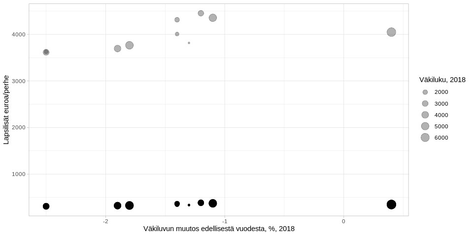

<table>
<thead>
<tr class="header">
<th style="text-align: left;">data</th>
<th style="text-align: left;">julkaistu</th>
<th style="text-align: left;">ylläpitäjä</th>
</tr>
</thead>
<tbody>
<tr class="odd">
<td style="text-align: left;"><a href='https://beta.avoindata.fi/data/fi/dataset/lapsilisan-saajat-ja-maksetut-lapsilisat'>Lapsilisän saajat ja maksetut lapsilisät</a></td>
<td style="text-align: left;">2019-02-27</td>
<td style="text-align: left;"><a href='mailto:markus.kainu@kela.fi'>Markus Kainu</a></td>
</tr>
</tbody>
</table>

    # CRAN-paketit
    library(dplyr)
    library(ggplot2)
    library(jsonlite)
    library(ckanr)
    library(readr)
    library(knitr)
    library(glue)
    library(tidyr)
    library(pxweb)

Resurssien lataaminen
---------------------

    ckanr_setup(url = "https://beta.avoindata.fi/data/fi/")
    x <- package_search(q = "Kansaneläkelaitos", fq = "title:lapsilisän saajat")
    resources <- x$results[[1]]$resources

    dat <- read.table(resources[[1]]$url, header = TRUE, sep = ";", dec = ",", stringsAsFactors = FALSE) # Lataa data
    meta <- fromJSON(txt = resources[[2]]$url) # metadata

Resurssien kuvailu
==================

**Datan kuvaustieto**

    meta$description %>% cat()

Raportilla on tiedot lapsilisää saaneiden perheiden ja lasten määrästä
sekä maksetuista lapsilisistä. Tiedot saadaan muun muassa perhetyypin ja
perheen lapsiluvun mukaan. Tieto yksinhuoltajuudesta perustuu siihen,
onko saajalle maksettu yksinhuoltajakorotus. Lapsilisä on yksi
lakisääteisistä etuuksista, joilla yhteiskunta pyrkii tasaamaan lapsen
perheille aiheuttamia kustannuksia. Lapsilisää maksetaan jokaisesta
Suomessa asuvasta alle 17-vuotiaasta lapsesta. Se maksetaan lapsen
vanhemmalle tai huoltajalle.

**Datan muuttujatieto**

    meta$resources$schema$fields[[1]] %>%
      select(-values) %>% 
      kable(format = "markdown")

<table>
<thead>
<tr class="header">
<th style="text-align: left;">name</th>
<th style="text-align: left;">type</th>
<th style="text-align: left;">format</th>
</tr>
</thead>
<tbody>
<tr class="odd">
<td style="text-align: left;">kuntanumero</td>
<td style="text-align: left;">integer</td>
<td style="text-align: left;">default</td>
</tr>
<tr class="even">
<td style="text-align: left;">kunta</td>
<td style="text-align: left;">string</td>
<td style="text-align: left;">default</td>
</tr>
<tr class="odd">
<td style="text-align: left;">aikajakso</td>
<td style="text-align: left;">string</td>
<td style="text-align: left;">default</td>
</tr>
<tr class="even">
<td style="text-align: left;">sukupuoli</td>
<td style="text-align: left;">string</td>
<td style="text-align: left;">default</td>
</tr>
<tr class="odd">
<td style="text-align: left;">perhetyyppi</td>
<td style="text-align: left;">string</td>
<td style="text-align: left;">default</td>
</tr>
<tr class="even">
<td style="text-align: left;">saajat</td>
<td style="text-align: left;">number</td>
<td style="text-align: left;">default</td>
</tr>
<tr class="odd">
<td style="text-align: left;">lapset</td>
<td style="text-align: left;">number</td>
<td style="text-align: left;">default</td>
</tr>
<tr class="even">
<td style="text-align: left;">maksetut_etuudet_euroa</td>
<td style="text-align: left;">number</td>
<td style="text-align: left;">default</td>
</tr>
<tr class="odd">
<td style="text-align: left;">lapsilisat_euroa_perhe</td>
<td style="text-align: left;">number</td>
<td style="text-align: left;">default</td>
</tr>
<tr class="even">
<td style="text-align: left;">lapsilisat_euroa_lapsi</td>
<td style="text-align: left;">number</td>
<td style="text-align: left;">default</td>
</tr>
<tr class="odd">
<td style="text-align: left;">vuosi</td>
<td style="text-align: left;">integer</td>
<td style="text-align: left;">default</td>
</tr>
<tr class="even">
<td style="text-align: left;">kuukausi</td>
<td style="text-align: left;">integer</td>
<td style="text-align: left;">default</td>
</tr>
</tbody>
</table>

**Datan ensimmäiset rivit**

    head(dat) %>% kable(format = "markdown")

<table>
<colgroup>
<col style="width: 7%" />
<col style="width: 5%" />
<col style="width: 6%" />
<col style="width: 6%" />
<col style="width: 15%" />
<col style="width: 4%" />
<col style="width: 4%" />
<col style="width: 14%" />
<col style="width: 14%" />
<col style="width: 14%" />
<col style="width: 3%" />
<col style="width: 5%" />
</colgroup>
<thead>
<tr class="header">
<th style="text-align: right;">kuntanumero</th>
<th style="text-align: left;">kunta</th>
<th style="text-align: left;">aikajakso</th>
<th style="text-align: left;">sukupuoli</th>
<th style="text-align: left;">perhetyyppi</th>
<th style="text-align: right;">saajat</th>
<th style="text-align: right;">lapset</th>
<th style="text-align: right;">maksetut_etuudet_euroa</th>
<th style="text-align: right;">lapsilisat_euroa_perhe</th>
<th style="text-align: right;">lapsilisat_euroa_lapsi</th>
<th style="text-align: right;">vuosi</th>
<th style="text-align: right;">kuukausi</th>
</tr>
</thead>
<tbody>
<tr class="odd">
<td style="text-align: right;">5</td>
<td style="text-align: left;">Alajärvi</td>
<td style="text-align: left;">vuosi</td>
<td style="text-align: left;">Yhteensä</td>
<td style="text-align: left;">Yhteensä</td>
<td style="text-align: right;">1115</td>
<td style="text-align: right;">2466</td>
<td style="text-align: right;">1115</td>
<td style="text-align: right;">2965.57</td>
<td style="text-align: right;">1340.11</td>
<td style="text-align: right;">2008</td>
<td style="text-align: right;">NA</td>
</tr>
<tr class="even">
<td style="text-align: right;">5</td>
<td style="text-align: left;">Alajärvi</td>
<td style="text-align: left;">vuosi</td>
<td style="text-align: left;">Yhteensä</td>
<td style="text-align: left;">Yhden vanhemman perheet</td>
<td style="text-align: right;">137</td>
<td style="text-align: right;">221</td>
<td style="text-align: right;">137</td>
<td style="text-align: right;">2420.01</td>
<td style="text-align: right;">1502.84</td>
<td style="text-align: right;">2008</td>
<td style="text-align: right;">NA</td>
</tr>
<tr class="odd">
<td style="text-align: right;">5</td>
<td style="text-align: left;">Alajärvi</td>
<td style="text-align: left;">vuosi</td>
<td style="text-align: left;">Yhteensä</td>
<td style="text-align: left;">Kahden vanhemman perheet</td>
<td style="text-align: right;">1002</td>
<td style="text-align: right;">2292</td>
<td style="text-align: right;">1002</td>
<td style="text-align: right;">2968.59</td>
<td style="text-align: right;">1297.63</td>
<td style="text-align: right;">2008</td>
<td style="text-align: right;">NA</td>
</tr>
<tr class="even">
<td style="text-align: right;">5</td>
<td style="text-align: left;">Alajärvi</td>
<td style="text-align: left;">vuosi</td>
<td style="text-align: left;">Miehet</td>
<td style="text-align: left;">Yhteensä</td>
<td style="text-align: right;">48</td>
<td style="text-align: right;">85</td>
<td style="text-align: right;">48</td>
<td style="text-align: right;">2281.46</td>
<td style="text-align: right;">1307.66</td>
<td style="text-align: right;">2008</td>
<td style="text-align: right;">NA</td>
</tr>
<tr class="odd">
<td style="text-align: right;">5</td>
<td style="text-align: left;">Alajärvi</td>
<td style="text-align: left;">vuosi</td>
<td style="text-align: left;">Miehet</td>
<td style="text-align: left;">Yhden vanhemman perheet</td>
<td style="text-align: right;">29</td>
<td style="text-align: right;">40</td>
<td style="text-align: right;">29</td>
<td style="text-align: right;">1810.41</td>
<td style="text-align: right;">1346.21</td>
<td style="text-align: right;">2008</td>
<td style="text-align: right;">NA</td>
</tr>
<tr class="even">
<td style="text-align: right;">5</td>
<td style="text-align: left;">Alajärvi</td>
<td style="text-align: left;">vuosi</td>
<td style="text-align: left;">Miehet</td>
<td style="text-align: left;">Kahden vanhemman perheet</td>
<td style="text-align: right;">22</td>
<td style="text-align: right;">50</td>
<td style="text-align: right;">22</td>
<td style="text-align: right;">2606.02</td>
<td style="text-align: right;">1140.14</td>
<td style="text-align: right;">2008</td>
<td style="text-align: right;">NA</td>
</tr>
</tbody>
</table>

Kuvio
-----

    # valitaan ensin top 10 kuntaa, joissa korkeimmat keskimääräiset asumistukimenot
    dat %>% 
      filter(aikajakso == "vuosi",
             vuosi == 2018,
             perhetyyppi == "Yhteensä",
             sukupuoli == "Yhteensä") %>% 
      arrange(desc(lapsilisat_euroa_perhe)) %>% 
      slice(1:10) %>% pull(kunta) -> kunnat

    # Piirretään kuva
    dat %>% 
      filter(kunta %in% kunnat,
             vuosi == 2018,
             perhetyyppi == "Yhteensä",
             sukupuoli == "Yhteensä") %>% 
      ggplot(aes(x = reorder(kunta, lapsilisat_euroa_perhe), 
                 y = lapsilisat_euroa_perhe, 
                 label = round(lapsilisat_euroa_perhe))) + 
      geom_col() + 
      theme_minimal() +
      theme(legend.position = "none") +
      labs(title = "Esimerkkikuvion esimerkkiotsikko")

Datan yhdistäminen Tilastokeskuksen kuntien avainlukuihin
---------------------------------------------------------

    # PXWEB query 
    pxweb_query_list <- 
      list("Alue 2018"=c("SSS","020","005","009","010","016","018","019","035","043","046","047","049","050","051","052","060","061","062","065","069","071","072","074","075","076","077","078","079","081","082","086","111","090","091","097","098","099","102","103","105","106","108","109","139","140","142","143","145","146","153","148","149","151","152","165","167","169","170","171","172","176","177","178","179","181","182","186","202","204","205","208","211","213","214","216","217","218","224","226","230","231","232","233","235","236","239","240","320","241","322","244","245","249","250","256","257","260","261","263","265","271","272","273","275","276","280","284","285","286","287","288","290","291","295","297","300","301","304","305","312","316","317","318","398","399","400","407","402","403","405","408","410","416","417","418","420","421","422","423","425","426","444","430","433","434","435","436","438","440","441","475","478","480","481","483","484","489","491","494","495","498","499","500","503","504","505","508","507","529","531","535","536","538","541","543","545","560","561","562","563","564","309","576","577","578","445","580","581","599","583","854","584","588","592","593","595","598","601","604","607","608","609","611","638","614","615","616","619","620","623","624","625","626","630","631","635","636","678","710","680","681","683","684","686","687","689","691","694","697","698","700","702","704","707","729","732","734","736","790","738","739","740","742","743","746","747","748","791","749","751","753","755","758","759","761","762","765","766","768","771","777","778","781","783","831","832","833","834","837","844","845","846","848","849","850","851","853","857","858","859","886","887","889","890","892","893","895","785","905","908","911","092","915","918","921","922","924","925","927","931","934","935","936","941","946","976","977","980","981","989","992","MK01","MK02","MK04","MK05","MK06","MK07","MK08","MK09","MK10","MK11","MK12","MK13","MK14","MK15","MK16","MK17","MK18","MK19","MK21","SK011","SK014","SK015","SK016","SK021","SK022","SK023","SK024","SK025","SK041","SK043","SK044","SK051","SK052","SK053","SK061","SK063","SK064","SK068","SK069","SK071","SK081","SK082","SK091","SK093","SK101","SK103","SK105","SK111","SK112","SK113","SK114","SK115","SK122","SK124","SK125","SK131","SK132","SK133","SK134","SK135","SK138","SK141","SK142","SK144","SK146","SK151","SK152","SK153","SK154","SK161","SK162","SK171","SK173","SK174","SK175","SK176","SK177","SK178","SK181","SK182","SK191","SK192","SK193","SK194","SK196","SK197","SK211","SK212","SK213","2020MK01","2020MK02","2020MK04","2020MK05","2020MK06","2020MK07","2020MK08","2020MK09","2020MK10","2020MK11","2020MK12","2020MK13","2020MK14","2020MK15","2020MK16","2020MK17","2020MK18","2020MK19","2020MK21","2020SK011","2020SK014","2020SK015","2020SK016","2020SK021","2020SK022","2020SK023","2020SK024","2020SK025","2020SK041","2020SK043","2020SK044","2020SK051","2020SK052","2020SK053","2020SK061","2020SK063","2020SK064","2020SK068","2020SK069","2020SK071","2020SK081","2020SK082","2020SK091","2020SK093","2020SK101","2020SK103","2020SK105","2020SK111","2020SK112","2020SK113","2020SK114","2020SK115","2020SK122","2020SK124","2020SK125","2020SK131","2020SK132","2020SK133","2020SK134","2020SK135","2020SK138","2020SK141","2020SK142","2020SK144","2020SK146","2020SK151","2020SK152","2020SK153","2020SK154","2020SK161","2020SK162","2020SK171","2020SK173","2020SK174","2020SK175","2020SK176","2020SK177","2020SK178","2020SK181","2020SK182","2020SK191","2020SK192","2020SK193","2020SK194","2020SK196","2020SK197","2020SK211","2020SK212","2020SK213"),
           "Tiedot"=c("M408","M411","M476","M391","M421","M478","M404","M410","M303","M297","M302","M44","M62","M70","M488","M486","M137","M140","M130","M162","M78","M485","M152","M72","M84","M106","M499","M496","M495","M497","M498"))

    # Download data 
    tk_lst <- 
      pxweb_get(url = "http://pxnet2.stat.fi/PXWeb/api/v1/fi/Kuntien_avainluvut/2018/kuntien_avainluvut_2018_viimeisin.px",
                query = pxweb_query_list)
    tk_avainluvut <- as.data.frame(tk_lst, column.name.type = "text", variable.value.type = "text") %>% 
      # levitetään data
      spread(key = Tiedot, value = `Kuntien avainluvut`)

    df <- left_join(dat, tk_avainluvut, by = c("kunta" = "Alue 2018"))
    # Piirretään hajontakuvio
    df2 <- df %>% 
      filter(kunta %in% kunnat,
             vuosi == 2018,
             perhetyyppi == "Yhteensä",
             sukupuoli == "Yhteensä") 

    ggplot(df2, aes(x = `Väkiluvun muutos edellisestä vuodesta, %, 2017`, 
                    y = lapsilisat_euroa_perhe, 
                    size = `Väkiluku, 2017`)) + 
      geom_point(alpha = .3) +
      labs(y = "Lapsilisät euroa/perhe") + 
      theme_light()

Datastore-api
-------------

Jos et tarvitse koko aineistoa, voit suodattaa siitä osio SQL:llä
käyttäen CKAN:n DataStore-rajapintaa.

Alla olevassa esimerkissä tehdään rajaus `kunta`-muuttujasta ja siis
etsitään vaan kuntaa *Veteli* koskevat tiedot.

    kunta <- "Veteli"
    res <- ckanr::ds_search_sql(sql = glue("SELECT * from \"{resources[[1]]$id}\" WHERE kunta LIKE '{kunta}'"), as = "table")
    res$records %>% 
      # select(-`_full_text`, -`_id`) %>% 
      kable(format = "markdown")

<table style="width:100%;">
<colgroup>
<col style="width: 2%" />
<col style="width: 1%" />
<col style="width: 3%" />
<col style="width: 3%" />
<col style="width: 7%" />
<col style="width: 47%" />
<col style="width: 2%" />
<col style="width: 3%" />
<col style="width: 7%" />
<col style="width: 2%" />
<col style="width: 7%" />
<col style="width: 2%" />
<col style="width: 7%" />
<col style="width: 2%" />
</colgroup>
<thead>
<tr class="header">
<th style="text-align: left;">kunta</th>
<th style="text-align: left;">vuosi</th>
<th style="text-align: left;">kuntanumero</th>
<th style="text-align: left;">sukupuoli</th>
<th style="text-align: left;">lapsilisat_euroa_lapsi</th>
<th style="text-align: left;">_full_text</th>
<th style="text-align: left;">kuukausi</th>
<th style="text-align: left;">aikajakso</th>
<th style="text-align: left;">perhetyyppi</th>
<th style="text-align: left;">saajat</th>
<th style="text-align: left;">maksetut_etuudet_euroa</th>
<th style="text-align: right;">_id</th>
<th style="text-align: left;">lapsilisat_euroa_perhe</th>
<th style="text-align: left;">lapset</th>
</tr>
</thead>
<tbody>
<tr class="odd">
<td style="text-align: left;">Veteli</td>
<td style="text-align: left;">2008</td>
<td style="text-align: left;">924</td>
<td style="text-align: left;">Yhteensä</td>
<td style="text-align: left;">1258,81</td>
<td style="text-align: left;">‘12’:10 ‘1258’:11 ‘2008’:13 ‘2385’:9 ‘362’:6,8 ‘685’:7 ‘81’:12 ‘924’:1 ‘na’:14 ‘veteli’:2 ‘vuosi’:3 ‘yhteensä’:4,5</td>
<td style="text-align: left;">NA</td>
<td style="text-align: left;">vuosi</td>
<td style="text-align: left;">Yhteensä</td>
<td style="text-align: left;">362</td>
<td style="text-align: left;">362</td>
<td style="text-align: right;">2664</td>
<td style="text-align: left;">2385,12</td>
<td style="text-align: left;">685</td>
</tr>
<tr class="even">
<td style="text-align: left;">Veteli</td>
<td style="text-align: left;">2008</td>
<td style="text-align: left;">924</td>
<td style="text-align: left;">Yhteensä</td>
<td style="text-align: left;">1427,01</td>
<td style="text-align: left;">‘01’:14 ‘1427’:13 ‘2008’:15 ‘2634’:11 ‘39’:8,10 ‘48’:12 ‘72’:9 ‘924’:1 ‘na’:16 ‘perheet’:7 ‘vanhemman’:6 ‘veteli’:2 ‘vuosi’:3 ‘yhden’:5 ‘yhteensä’:4</td>
<td style="text-align: left;">NA</td>
<td style="text-align: left;">vuosi</td>
<td style="text-align: left;">Yhden vanhemman perheet</td>
<td style="text-align: left;">39</td>
<td style="text-align: left;">39</td>
<td style="text-align: right;">2665</td>
<td style="text-align: left;">2634,48</td>
<td style="text-align: left;">72</td>
</tr>
<tr class="odd">
<td style="text-align: left;">Veteli</td>
<td style="text-align: left;">2008</td>
<td style="text-align: left;">924</td>
<td style="text-align: left;">Yhteensä</td>
<td style="text-align: left;">1205,54</td>
<td style="text-align: left;">‘1205’:13 ‘2008’:15 ‘2283’:11 ‘333’:8,10 ‘54’:14 ‘630’:9 ‘924’:1 ‘98’:12 ‘kahden’:5 ‘na’:16 ‘perheet’:7 ‘vanhemman’:6 ‘veteli’:2 ‘vuosi’:3 ‘yhteensä’:4</td>
<td style="text-align: left;">NA</td>
<td style="text-align: left;">vuosi</td>
<td style="text-align: left;">Kahden vanhemman perheet</td>
<td style="text-align: left;">333</td>
<td style="text-align: left;">333</td>
<td style="text-align: right;">2666</td>
<td style="text-align: left;">2283,98</td>
<td style="text-align: left;">630</td>
</tr>
<tr class="even">
<td style="text-align: left;">Veteli</td>
<td style="text-align: left;">2008</td>
<td style="text-align: left;">924</td>
<td style="text-align: left;">Miehet</td>
<td style="text-align: left;">1388,14</td>
<td style="text-align: left;">‘1388’:11 ‘14’:7,12 ‘2008’:13 ‘2429’:9 ‘25’:10 ‘8’:6,8 ‘924’:1 ‘miehet’:4 ‘na’:14 ‘veteli’:2 ‘vuosi’:3 ‘yhteensä’:5</td>
<td style="text-align: left;">NA</td>
<td style="text-align: left;">vuosi</td>
<td style="text-align: left;">Yhteensä</td>
<td style="text-align: left;">8</td>
<td style="text-align: left;">8</td>
<td style="text-align: right;">2667</td>
<td style="text-align: left;">2429,25</td>
<td style="text-align: left;">14</td>
</tr>
<tr class="odd">
<td style="text-align: left;">Veteli</td>
<td style="text-align: left;">2008</td>
<td style="text-align: left;">924</td>
<td style="text-align: left;">Miehet</td>
<td style="text-align: left;">1477,83</td>
<td style="text-align: left;">‘12’:9 ‘1477’:13 ‘2008’:15 ‘2955’:11 ‘6’:8,10 ‘67’:12 ‘83’:14 ‘924’:1 ‘miehet’:4 ‘na’:16 ‘perheet’:7 ‘vanhemman’:6 ‘veteli’:2 ‘vuosi’:3 ‘yhden’:5</td>
<td style="text-align: left;">NA</td>
<td style="text-align: left;">vuosi</td>
<td style="text-align: left;">Yhden vanhemman perheet</td>
<td style="text-align: left;">6</td>
<td style="text-align: left;">6</td>
<td style="text-align: right;">2668</td>
<td style="text-align: left;">2955,67</td>
<td style="text-align: left;">12</td>
</tr>
<tr class="even">
<td style="text-align: left;">Veteli</td>
<td style="text-align: left;">2008</td>
<td style="text-align: left;">924</td>
<td style="text-align: left;">Miehet</td>
<td style="text-align: left;">NA</td>
<td style="text-align: left;">‘2008’:13 ‘924’:1 ‘kahden’:5 ‘miehet’:4 ‘na’:8,9,10,11,12,14 ‘perheet’:7 ‘vanhemman’:6 ‘veteli’:2 ‘vuosi’:3</td>
<td style="text-align: left;">NA</td>
<td style="text-align: left;">vuosi</td>
<td style="text-align: left;">Kahden vanhemman perheet</td>
<td style="text-align: left;">NA</td>
<td style="text-align: left;">NA</td>
<td style="text-align: right;">2669</td>
<td style="text-align: left;">NA</td>
<td style="text-align: left;">NA</td>
</tr>
<tr class="odd">
<td style="text-align: left;">Veteli</td>
<td style="text-align: left;">2008</td>
<td style="text-align: left;">924</td>
<td style="text-align: left;">Naiset</td>
<td style="text-align: left;">1256,11</td>
<td style="text-align: left;">‘11’:12 ‘12’:10 ‘1256’:11 ‘2008’:13 ‘2384’:9 ‘354’:6,8 ‘671’:7 ‘924’:1 ‘na’:14 ‘naiset’:4 ‘veteli’:2 ‘vuosi’:3 ‘yhteensä’:5</td>
<td style="text-align: left;">NA</td>
<td style="text-align: left;">vuosi</td>
<td style="text-align: left;">Yhteensä</td>
<td style="text-align: left;">354</td>
<td style="text-align: left;">354</td>
<td style="text-align: right;">2670</td>
<td style="text-align: left;">2384,12</td>
<td style="text-align: left;">671</td>
</tr>
<tr class="even">
<td style="text-align: left;">Veteli</td>
<td style="text-align: left;">2008</td>
<td style="text-align: left;">924</td>
<td style="text-align: left;">Naiset</td>
<td style="text-align: left;">1416,84</td>
<td style="text-align: left;">‘08’:12 ‘1416’:13 ‘2008’:15 ‘2576’:11 ‘33’:8,10 ‘60’:9 ‘84’:14 ‘924’:1 ‘na’:16 ‘naiset’:4 ‘perheet’:7 ‘vanhemman’:6 ‘veteli’:2 ‘vuosi’:3 ‘yhden’:5</td>
<td style="text-align: left;">NA</td>
<td style="text-align: left;">vuosi</td>
<td style="text-align: left;">Yhden vanhemman perheet</td>
<td style="text-align: left;">33</td>
<td style="text-align: left;">33</td>
<td style="text-align: right;">2671</td>
<td style="text-align: left;">2576,08</td>
<td style="text-align: left;">60</td>
</tr>
<tr class="odd">
<td style="text-align: left;">Veteli</td>
<td style="text-align: left;">2008</td>
<td style="text-align: left;">924</td>
<td style="text-align: left;">Naiset</td>
<td style="text-align: left;">1206,67</td>
<td style="text-align: left;">‘1206’:13 ‘2008’:15 ‘2292’:11 ‘331’:8,10 ‘628’:9 ‘67’:12,14 ‘924’:1 ‘kahden’:5 ‘na’:16 ‘naiset’:4 ‘perheet’:7 ‘vanhemman’:6 ‘veteli’:2 ‘vuosi’:3</td>
<td style="text-align: left;">NA</td>
<td style="text-align: left;">vuosi</td>
<td style="text-align: left;">Kahden vanhemman perheet</td>
<td style="text-align: left;">331</td>
<td style="text-align: left;">331</td>
<td style="text-align: right;">2672</td>
<td style="text-align: left;">2292,67</td>
<td style="text-align: left;">628</td>
</tr>
<tr class="even">
<td style="text-align: left;">Veteli</td>
<td style="text-align: left;">2009</td>
<td style="text-align: left;">924</td>
<td style="text-align: left;">Yhteensä</td>
<td style="text-align: left;">1274,02</td>
<td style="text-align: left;">‘02’:12 ‘1274’:11 ‘2009’:13 ‘2410’:9 ‘361’:6,8 ‘40’:10 ‘683’:7 ‘924’:1 ‘na’:14 ‘veteli’:2 ‘vuosi’:3 ‘yhteensä’:4,5</td>
<td style="text-align: left;">NA</td>
<td style="text-align: left;">vuosi</td>
<td style="text-align: left;">Yhteensä</td>
<td style="text-align: left;">361</td>
<td style="text-align: left;">361</td>
<td style="text-align: right;">5457</td>
<td style="text-align: left;">2410,40</td>
<td style="text-align: left;">683</td>
</tr>
<tr class="odd">
<td style="text-align: left;">Veteli</td>
<td style="text-align: left;">2009</td>
<td style="text-align: left;">924</td>
<td style="text-align: left;">Yhteensä</td>
<td style="text-align: left;">1516,58</td>
<td style="text-align: left;">‘1516’:13 ‘2009’:15 ‘2713’:11 ‘38’:8,10 ‘58’:14 ‘68’:9 ‘87’:12 ‘924’:1 ‘na’:16 ‘perheet’:7 ‘vanhemman’:6 ‘veteli’:2 ‘vuosi’:3 ‘yhden’:5 ‘yhteensä’:4</td>
<td style="text-align: left;">NA</td>
<td style="text-align: left;">vuosi</td>
<td style="text-align: left;">Yhden vanhemman perheet</td>
<td style="text-align: left;">38</td>
<td style="text-align: left;">38</td>
<td style="text-align: right;">5458</td>
<td style="text-align: left;">2713,87</td>
<td style="text-align: left;">68</td>
</tr>
<tr class="even">
<td style="text-align: left;">Veteli</td>
<td style="text-align: left;">2009</td>
<td style="text-align: left;">924</td>
<td style="text-align: left;">Yhteensä</td>
<td style="text-align: left;">1215,57</td>
<td style="text-align: left;">‘1215’:13 ‘2009’:15 ‘2303’:11 ‘333’:8,10 ‘38’:12 ‘57’:14 ‘631’:9 ‘924’:1 ‘kahden’:5 ‘na’:16 ‘perheet’:7 ‘vanhemman’:6 ‘veteli’:2 ‘vuosi’:3 ‘yhteensä’:4</td>
<td style="text-align: left;">NA</td>
<td style="text-align: left;">vuosi</td>
<td style="text-align: left;">Kahden vanhemman perheet</td>
<td style="text-align: left;">333</td>
<td style="text-align: left;">333</td>
<td style="text-align: right;">5459</td>
<td style="text-align: left;">2303,38</td>
<td style="text-align: left;">631</td>
</tr>
<tr class="odd">
<td style="text-align: left;">Veteli</td>
<td style="text-align: left;">2009</td>
<td style="text-align: left;">924</td>
<td style="text-align: left;">Miehet</td>
<td style="text-align: left;">1216,03</td>
<td style="text-align: left;">‘03’:12 ‘11’:6,8 ‘1216’:11 ‘18’:7 ‘1989’:9 ‘2009’:13 ‘87’:10 ‘924’:1 ‘miehet’:4 ‘na’:14 ‘veteli’:2 ‘vuosi’:3 ‘yhteensä’:5</td>
<td style="text-align: left;">NA</td>
<td style="text-align: left;">vuosi</td>
<td style="text-align: left;">Yhteensä</td>
<td style="text-align: left;">11</td>
<td style="text-align: left;">11</td>
<td style="text-align: right;">5460</td>
<td style="text-align: left;">1989,87</td>
<td style="text-align: left;">18</td>
</tr>
<tr class="even">
<td style="text-align: left;">Veteli</td>
<td style="text-align: left;">2009</td>
<td style="text-align: left;">924</td>
<td style="text-align: left;">Miehet</td>
<td style="text-align: left;">1393,26</td>
<td style="text-align: left;">‘1393’:13 ‘14’:9 ‘20’:12 ‘2009’:15 ‘2438’:11 ‘26’:14 ‘8’:8,10 ‘924’:1 ‘miehet’:4 ‘na’:16 ‘perheet’:7 ‘vanhemman’:6 ‘veteli’:2 ‘vuosi’:3 ‘yhden’:5</td>
<td style="text-align: left;">NA</td>
<td style="text-align: left;">vuosi</td>
<td style="text-align: left;">Yhden vanhemman perheet</td>
<td style="text-align: left;">8</td>
<td style="text-align: left;">8</td>
<td style="text-align: right;">5461</td>
<td style="text-align: left;">2438,20</td>
<td style="text-align: left;">14</td>
</tr>
<tr class="odd">
<td style="text-align: left;">Veteli</td>
<td style="text-align: left;">2009</td>
<td style="text-align: left;">924</td>
<td style="text-align: left;">Miehet</td>
<td style="text-align: left;">340,43</td>
<td style="text-align: left;">‘2009’:15 ‘340’:13 ‘4’:8,10 ‘43’:14 ‘595’:11 ‘7’:9 ‘75’:12 ‘924’:1 ‘kahden’:5 ‘miehet’:4 ‘na’:16 ‘perheet’:7 ‘vanhemman’:6 ‘veteli’:2 ‘vuosi’:3</td>
<td style="text-align: left;">NA</td>
<td style="text-align: left;">vuosi</td>
<td style="text-align: left;">Kahden vanhemman perheet</td>
<td style="text-align: left;">4</td>
<td style="text-align: left;">4</td>
<td style="text-align: right;">5462</td>
<td style="text-align: left;">595,75</td>
<td style="text-align: left;">7</td>
</tr>
<tr class="even">
<td style="text-align: left;">Veteli</td>
<td style="text-align: left;">2009</td>
<td style="text-align: left;">924</td>
<td style="text-align: left;">Naiset</td>
<td style="text-align: left;">1267,96</td>
<td style="text-align: left;">‘1267’:11 ‘2009’:13 ‘2423’:9 ‘350’:6,8 ‘62’:10 ‘669’:7 ‘924’:1 ‘96’:12 ‘na’:14 ‘naiset’:4 ‘veteli’:2 ‘vuosi’:3 ‘yhteensä’:5</td>
<td style="text-align: left;">NA</td>
<td style="text-align: left;">vuosi</td>
<td style="text-align: left;">Yhteensä</td>
<td style="text-align: left;">350</td>
<td style="text-align: left;">350</td>
<td style="text-align: right;">5463</td>
<td style="text-align: left;">2423,62</td>
<td style="text-align: left;">669</td>
</tr>
<tr class="odd">
<td style="text-align: left;">Veteli</td>
<td style="text-align: left;">2009</td>
<td style="text-align: left;">924</td>
<td style="text-align: left;">Naiset</td>
<td style="text-align: left;">1548,55</td>
<td style="text-align: left;">‘1548’:13 ‘2009’:15 ‘2787’:11 ‘30’:8,10 ‘39’:12 ‘54’:9 ‘55’:14 ‘924’:1 ‘na’:16 ‘naiset’:4 ‘perheet’:7 ‘vanhemman’:6 ‘veteli’:2 ‘vuosi’:3 ‘yhden’:5</td>
<td style="text-align: left;">NA</td>
<td style="text-align: left;">vuosi</td>
<td style="text-align: left;">Yhden vanhemman perheet</td>
<td style="text-align: left;">30</td>
<td style="text-align: left;">30</td>
<td style="text-align: right;">5464</td>
<td style="text-align: left;">2787,39</td>
<td style="text-align: left;">54</td>
</tr>
<tr class="even">
<td style="text-align: left;">Veteli</td>
<td style="text-align: left;">2009</td>
<td style="text-align: left;">924</td>
<td style="text-align: left;">Naiset</td>
<td style="text-align: left;">1217,59</td>
<td style="text-align: left;">‘1217’:13 ‘15’:12 ‘2009’:15 ‘2324’:11 ‘329’:8,10 ‘59’:14 ‘628’:9 ‘924’:1 ‘kahden’:5 ‘na’:16 ‘naiset’:4 ‘perheet’:7 ‘vanhemman’:6 ‘veteli’:2 ‘vuosi’:3</td>
<td style="text-align: left;">NA</td>
<td style="text-align: left;">vuosi</td>
<td style="text-align: left;">Kahden vanhemman perheet</td>
<td style="text-align: left;">329</td>
<td style="text-align: left;">329</td>
<td style="text-align: right;">5465</td>
<td style="text-align: left;">2324,15</td>
<td style="text-align: left;">628</td>
</tr>
<tr class="odd">
<td style="text-align: left;">Veteli</td>
<td style="text-align: left;">2010</td>
<td style="text-align: left;">924</td>
<td style="text-align: left;">Yhteensä</td>
<td style="text-align: left;">1308,52</td>
<td style="text-align: left;">‘1308’:11 ‘2010’:13 ‘24’:10 ‘2517’:9 ‘354’:6,8 ‘52’:12 ‘681’:7 ‘924’:1 ‘na’:14 ‘veteli’:2 ‘vuosi’:3 ‘yhteensä’:4,5</td>
<td style="text-align: left;">NA</td>
<td style="text-align: left;">vuosi</td>
<td style="text-align: left;">Yhteensä</td>
<td style="text-align: left;">354</td>
<td style="text-align: left;">354</td>
<td style="text-align: right;">8257</td>
<td style="text-align: left;">2517,24</td>
<td style="text-align: left;">681</td>
</tr>
<tr class="even">
<td style="text-align: left;">Veteli</td>
<td style="text-align: left;">2010</td>
<td style="text-align: left;">924</td>
<td style="text-align: left;">Yhteensä</td>
<td style="text-align: left;">1460,62</td>
<td style="text-align: left;">‘1460’:13 ‘2010’:15 ‘2665’:11 ‘40’:8,10 ‘62’:14 ‘64’:12 ‘73’:9 ‘924’:1 ‘na’:16 ‘perheet’:7 ‘vanhemman’:6 ‘veteli’:2 ‘vuosi’:3 ‘yhden’:5 ‘yhteensä’:4</td>
<td style="text-align: left;">NA</td>
<td style="text-align: left;">vuosi</td>
<td style="text-align: left;">Yhden vanhemman perheet</td>
<td style="text-align: left;">40</td>
<td style="text-align: left;">40</td>
<td style="text-align: right;">8258</td>
<td style="text-align: left;">2665,64</td>
<td style="text-align: left;">73</td>
</tr>
<tr class="odd">
<td style="text-align: left;">Veteli</td>
<td style="text-align: left;">2010</td>
<td style="text-align: left;">924</td>
<td style="text-align: left;">Yhteensä</td>
<td style="text-align: left;">1241,26</td>
<td style="text-align: left;">‘02’:12 ‘1241’:13 ‘2010’:15 ‘2399’:11 ‘26’:14 ‘327’:8,10 ‘632’:9 ‘924’:1 ‘kahden’:5 ‘na’:16 ‘perheet’:7 ‘vanhemman’:6 ‘veteli’:2 ‘vuosi’:3 ‘yhteensä’:4</td>
<td style="text-align: left;">NA</td>
<td style="text-align: left;">vuosi</td>
<td style="text-align: left;">Kahden vanhemman perheet</td>
<td style="text-align: left;">327</td>
<td style="text-align: left;">327</td>
<td style="text-align: right;">8259</td>
<td style="text-align: left;">2399,02</td>
<td style="text-align: left;">632</td>
</tr>
<tr class="even">
<td style="text-align: left;">Veteli</td>
<td style="text-align: left;">2010</td>
<td style="text-align: left;">924</td>
<td style="text-align: left;">Miehet</td>
<td style="text-align: left;">1432,11</td>
<td style="text-align: left;">‘11’:12 ‘12’:6,8 ‘1432’:11 ‘16’:10 ‘18’:7 ‘2010’:13 ‘2148’:9 ‘924’:1 ‘miehet’:4 ‘na’:14 ‘veteli’:2 ‘vuosi’:3 ‘yhteensä’:5</td>
<td style="text-align: left;">NA</td>
<td style="text-align: left;">vuosi</td>
<td style="text-align: left;">Yhteensä</td>
<td style="text-align: left;">12</td>
<td style="text-align: left;">12</td>
<td style="text-align: right;">8260</td>
<td style="text-align: left;">2148,16</td>
<td style="text-align: left;">18</td>
</tr>
<tr class="odd">
<td style="text-align: left;">Veteli</td>
<td style="text-align: left;">2010</td>
<td style="text-align: left;">924</td>
<td style="text-align: left;">Miehet</td>
<td style="text-align: left;">1520,16</td>
<td style="text-align: left;">‘12’:9 ‘1520’:13 ‘16’:14 ‘2010’:15 ‘2280’:11 ‘24’:12 ‘8’:8,10 ‘924’:1 ‘miehet’:4 ‘na’:16 ‘perheet’:7 ‘vanhemman’:6 ‘veteli’:2 ‘vuosi’:3 ‘yhden’:5</td>
<td style="text-align: left;">NA</td>
<td style="text-align: left;">vuosi</td>
<td style="text-align: left;">Yhden vanhemman perheet</td>
<td style="text-align: left;">8</td>
<td style="text-align: left;">8</td>
<td style="text-align: right;">8261</td>
<td style="text-align: left;">2280,24</td>
<td style="text-align: left;">12</td>
</tr>
<tr class="even">
<td style="text-align: left;">Veteli</td>
<td style="text-align: left;">2010</td>
<td style="text-align: left;">924</td>
<td style="text-align: left;">Miehet</td>
<td style="text-align: left;">1076,57</td>
<td style="text-align: left;">‘1076’:13 ‘1507’:11 ‘20’:12 ‘2010’:15 ‘5’:8,10 ‘57’:14 ‘7’:9 ‘924’:1 ‘kahden’:5 ‘miehet’:4 ‘na’:16 ‘perheet’:7 ‘vanhemman’:6 ‘veteli’:2 ‘vuosi’:3</td>
<td style="text-align: left;">NA</td>
<td style="text-align: left;">vuosi</td>
<td style="text-align: left;">Kahden vanhemman perheet</td>
<td style="text-align: left;">5</td>
<td style="text-align: left;">5</td>
<td style="text-align: right;">8262</td>
<td style="text-align: left;">1507,20</td>
<td style="text-align: left;">7</td>
</tr>
<tr class="odd">
<td style="text-align: left;">Veteli</td>
<td style="text-align: left;">2010</td>
<td style="text-align: left;">924</td>
<td style="text-align: left;">Naiset</td>
<td style="text-align: left;">1303,20</td>
<td style="text-align: left;">‘1303’:11 ‘19’:10 ‘20’:12 ‘2010’:13 ‘2530’:9 ‘342’:6,8 ‘664’:7 ‘924’:1 ‘na’:14 ‘naiset’:4 ‘veteli’:2 ‘vuosi’:3 ‘yhteensä’:5</td>
<td style="text-align: left;">NA</td>
<td style="text-align: left;">vuosi</td>
<td style="text-align: left;">Yhteensä</td>
<td style="text-align: left;">342</td>
<td style="text-align: left;">342</td>
<td style="text-align: right;">8263</td>
<td style="text-align: left;">2530,19</td>
<td style="text-align: left;">664</td>
</tr>
<tr class="even">
<td style="text-align: left;">Veteli</td>
<td style="text-align: left;">2010</td>
<td style="text-align: left;">924</td>
<td style="text-align: left;">Naiset</td>
<td style="text-align: left;">1448,91</td>
<td style="text-align: left;">‘1448’:13 ‘2010’:15 ‘2761’:11 ‘32’:8,10 ‘61’:9 ‘91’:14 ‘924’:1 ‘98’:12 ‘na’:16 ‘naiset’:4 ‘perheet’:7 ‘vanhemman’:6 ‘veteli’:2 ‘vuosi’:3 ‘yhden’:5</td>
<td style="text-align: left;">NA</td>
<td style="text-align: left;">vuosi</td>
<td style="text-align: left;">Yhden vanhemman perheet</td>
<td style="text-align: left;">32</td>
<td style="text-align: left;">32</td>
<td style="text-align: right;">8264</td>
<td style="text-align: left;">2761,98</td>
<td style="text-align: left;">61</td>
</tr>
<tr class="odd">
<td style="text-align: left;">Veteli</td>
<td style="text-align: left;">2010</td>
<td style="text-align: left;">924</td>
<td style="text-align: left;">Naiset</td>
<td style="text-align: left;">1243,11</td>
<td style="text-align: left;">‘11’:14 ‘1243’:13 ‘2010’:15 ‘2412’:11 ‘322’:8,10 ‘625’:9 ‘86’:12 ‘924’:1 ‘kahden’:5 ‘na’:16 ‘naiset’:4 ‘perheet’:7 ‘vanhemman’:6 ‘veteli’:2 ‘vuosi’:3</td>
<td style="text-align: left;">NA</td>
<td style="text-align: left;">vuosi</td>
<td style="text-align: left;">Kahden vanhemman perheet</td>
<td style="text-align: left;">322</td>
<td style="text-align: left;">322</td>
<td style="text-align: right;">8265</td>
<td style="text-align: left;">2412,86</td>
<td style="text-align: left;">625</td>
</tr>
<tr class="even">
<td style="text-align: left;">Veteli</td>
<td style="text-align: left;">2011</td>
<td style="text-align: left;">924</td>
<td style="text-align: left;">Yhteensä</td>
<td style="text-align: left;">1310,90</td>
<td style="text-align: left;">‘02’:10 ‘1310’:11 ‘2011’:13 ‘2557’:9 ‘344’:6,8 ‘671’:7 ‘90’:12 ‘924’:1 ‘na’:14 ‘veteli’:2 ‘vuosi’:3 ‘yhteensä’:4,5</td>
<td style="text-align: left;">NA</td>
<td style="text-align: left;">vuosi</td>
<td style="text-align: left;">Yhteensä</td>
<td style="text-align: left;">344</td>
<td style="text-align: left;">344</td>
<td style="text-align: right;">11047</td>
<td style="text-align: left;">2557,02</td>
<td style="text-align: left;">671</td>
</tr>
<tr class="odd">
<td style="text-align: left;">Veteli</td>
<td style="text-align: left;">2011</td>
<td style="text-align: left;">924</td>
<td style="text-align: left;">Yhteensä</td>
<td style="text-align: left;">1616,10</td>
<td style="text-align: left;">‘10’:14 ‘1616’:13 ‘17’:12 ‘2011’:15 ‘2828’:11 ‘36’:8,10 ‘63’:9 ‘924’:1 ‘na’:16 ‘perheet’:7 ‘vanhemman’:6 ‘veteli’:2 ‘vuosi’:3 ‘yhden’:5 ‘yhteensä’:4</td>
<td style="text-align: left;">NA</td>
<td style="text-align: left;">vuosi</td>
<td style="text-align: left;">Yhden vanhemman perheet</td>
<td style="text-align: left;">36</td>
<td style="text-align: left;">36</td>
<td style="text-align: right;">11048</td>
<td style="text-align: left;">2828,17</td>
<td style="text-align: left;">63</td>
</tr>
<tr class="even">
<td style="text-align: left;">Veteli</td>
<td style="text-align: left;">2011</td>
<td style="text-align: left;">924</td>
<td style="text-align: left;">Yhteensä</td>
<td style="text-align: left;">1256,55</td>
<td style="text-align: left;">‘1256’:13 ‘2011’:15 ‘21’:12 ‘2469’:11 ‘315’:8,10 ‘55’:14 ‘619’:9 ‘924’:1 ‘kahden’:5 ‘na’:16 ‘perheet’:7 ‘vanhemman’:6 ‘veteli’:2 ‘vuosi’:3 ‘yhteensä’:4</td>
<td style="text-align: left;">NA</td>
<td style="text-align: left;">vuosi</td>
<td style="text-align: left;">Kahden vanhemman perheet</td>
<td style="text-align: left;">315</td>
<td style="text-align: left;">315</td>
<td style="text-align: right;">11049</td>
<td style="text-align: left;">2469,21</td>
<td style="text-align: left;">619</td>
</tr>
<tr class="odd">
<td style="text-align: left;">Veteli</td>
<td style="text-align: left;">2011</td>
<td style="text-align: left;">924</td>
<td style="text-align: left;">Miehet</td>
<td style="text-align: left;">1371,61</td>
<td style="text-align: left;">‘12’:6,8 ‘1371’:11 ‘18’:7 ‘2011’:13 ‘2057’:9 ‘41’:10 ‘61’:12 ‘924’:1 ‘miehet’:4 ‘na’:14 ‘veteli’:2 ‘vuosi’:3 ‘yhteensä’:5</td>
<td style="text-align: left;">NA</td>
<td style="text-align: left;">vuosi</td>
<td style="text-align: left;">Yhteensä</td>
<td style="text-align: left;">12</td>
<td style="text-align: left;">12</td>
<td style="text-align: right;">11050</td>
<td style="text-align: left;">2057,41</td>
<td style="text-align: left;">18</td>
</tr>
<tr class="even">
<td style="text-align: left;">Veteli</td>
<td style="text-align: left;">2011</td>
<td style="text-align: left;">924</td>
<td style="text-align: left;">Miehet</td>
<td style="text-align: left;">1437,21</td>
<td style="text-align: left;">‘12’:9 ‘1437’:13 ‘2011’:15 ‘21’:14 ‘2155’:11 ‘8’:8,10 ‘81’:12 ‘924’:1 ‘miehet’:4 ‘na’:16 ‘perheet’:7 ‘vanhemman’:6 ‘veteli’:2 ‘vuosi’:3 ‘yhden’:5</td>
<td style="text-align: left;">NA</td>
<td style="text-align: left;">vuosi</td>
<td style="text-align: left;">Yhden vanhemman perheet</td>
<td style="text-align: left;">8</td>
<td style="text-align: left;">8</td>
<td style="text-align: right;">11051</td>
<td style="text-align: left;">2155,81</td>
<td style="text-align: left;">12</td>
</tr>
<tr class="odd">
<td style="text-align: left;">Veteli</td>
<td style="text-align: left;">2011</td>
<td style="text-align: left;">924</td>
<td style="text-align: left;">Miehet</td>
<td style="text-align: left;">1240,40</td>
<td style="text-align: left;">‘1240’:13 ‘1860’:11 ‘2011’:15 ‘4’:8,10 ‘40’:14 ‘6’:9 ‘60’:12 ‘924’:1 ‘kahden’:5 ‘miehet’:4 ‘na’:16 ‘perheet’:7 ‘vanhemman’:6 ‘veteli’:2 ‘vuosi’:3</td>
<td style="text-align: left;">NA</td>
<td style="text-align: left;">vuosi</td>
<td style="text-align: left;">Kahden vanhemman perheet</td>
<td style="text-align: left;">4</td>
<td style="text-align: left;">4</td>
<td style="text-align: right;">11052</td>
<td style="text-align: left;">1860,60</td>
<td style="text-align: left;">6</td>
</tr>
<tr class="even">
<td style="text-align: left;">Veteli</td>
<td style="text-align: left;">2011</td>
<td style="text-align: left;">924</td>
<td style="text-align: left;">Naiset</td>
<td style="text-align: left;">1307,23</td>
<td style="text-align: left;">‘08’:10 ‘1307’:11 ‘2011’:13 ‘23’:12 ‘2575’:9 ‘332’:6,8 ‘654’:7 ‘924’:1 ‘na’:14 ‘naiset’:4 ‘veteli’:2 ‘vuosi’:3 ‘yhteensä’:5</td>
<td style="text-align: left;">NA</td>
<td style="text-align: left;">vuosi</td>
<td style="text-align: left;">Yhteensä</td>
<td style="text-align: left;">332</td>
<td style="text-align: left;">332</td>
<td style="text-align: right;">11053</td>
<td style="text-align: left;">2575,08</td>
<td style="text-align: left;">654</td>
</tr>
<tr class="odd">
<td style="text-align: left;">Veteli</td>
<td style="text-align: left;">2011</td>
<td style="text-align: left;">924</td>
<td style="text-align: left;">Naiset</td>
<td style="text-align: left;">1626,30</td>
<td style="text-align: left;">‘1626’:13 ‘2011’:15 ‘27’:12 ‘28’:8,10 ‘30’:14 ‘3020’:11 ‘52’:9 ‘924’:1 ‘na’:16 ‘naiset’:4 ‘perheet’:7 ‘vanhemman’:6 ‘veteli’:2 ‘vuosi’:3 ‘yhden’:5</td>
<td style="text-align: left;">NA</td>
<td style="text-align: left;">vuosi</td>
<td style="text-align: left;">Yhden vanhemman perheet</td>
<td style="text-align: left;">28</td>
<td style="text-align: left;">28</td>
<td style="text-align: right;">11054</td>
<td style="text-align: left;">3020,27</td>
<td style="text-align: left;">52</td>
</tr>
<tr class="even">
<td style="text-align: left;">Veteli</td>
<td style="text-align: left;">2011</td>
<td style="text-align: left;">924</td>
<td style="text-align: left;">Naiset</td>
<td style="text-align: left;">1256,70</td>
<td style="text-align: left;">‘04’:12 ‘1256’:13 ‘2011’:15 ‘2477’:11 ‘311’:8,10 ‘613’:9 ‘70’:14 ‘924’:1 ‘kahden’:5 ‘na’:16 ‘naiset’:4 ‘perheet’:7 ‘vanhemman’:6 ‘veteli’:2 ‘vuosi’:3</td>
<td style="text-align: left;">NA</td>
<td style="text-align: left;">vuosi</td>
<td style="text-align: left;">Kahden vanhemman perheet</td>
<td style="text-align: left;">311</td>
<td style="text-align: left;">311</td>
<td style="text-align: right;">11055</td>
<td style="text-align: left;">2477,04</td>
<td style="text-align: left;">613</td>
</tr>
<tr class="odd">
<td style="text-align: left;">Veteli</td>
<td style="text-align: left;">2012</td>
<td style="text-align: left;">924</td>
<td style="text-align: left;">Yhteensä</td>
<td style="text-align: left;">1350,69</td>
<td style="text-align: left;">‘1350’:11 ‘2012’:13 ‘2709’:9 ‘327’:6,8 ‘65’:10 ‘656’:7 ‘69’:12 ‘924’:1 ‘na’:14 ‘veteli’:2 ‘vuosi’:3 ‘yhteensä’:4,5</td>
<td style="text-align: left;">NA</td>
<td style="text-align: left;">vuosi</td>
<td style="text-align: left;">Yhteensä</td>
<td style="text-align: left;">327</td>
<td style="text-align: left;">327</td>
<td style="text-align: right;">13841</td>
<td style="text-align: left;">2709,65</td>
<td style="text-align: left;">656</td>
</tr>
<tr class="even">
<td style="text-align: left;">Veteli</td>
<td style="text-align: left;">2012</td>
<td style="text-align: left;">924</td>
<td style="text-align: left;">Yhteensä</td>
<td style="text-align: left;">1719,80</td>
<td style="text-align: left;">‘1719’:13 ‘2012’:15 ‘2933’:11 ‘35’:8,10 ‘59’:9 ‘78’:12 ‘80’:14 ‘924’:1 ‘na’:16 ‘perheet’:7 ‘vanhemman’:6 ‘veteli’:2 ‘vuosi’:3 ‘yhden’:5 ‘yhteensä’:4</td>
<td style="text-align: left;">NA</td>
<td style="text-align: left;">vuosi</td>
<td style="text-align: left;">Yhden vanhemman perheet</td>
<td style="text-align: left;">35</td>
<td style="text-align: left;">35</td>
<td style="text-align: right;">13842</td>
<td style="text-align: left;">2933,78</td>
<td style="text-align: left;">59</td>
</tr>
<tr class="odd">
<td style="text-align: left;">Veteli</td>
<td style="text-align: left;">2012</td>
<td style="text-align: left;">924</td>
<td style="text-align: left;">Yhteensä</td>
<td style="text-align: left;">1295,40</td>
<td style="text-align: left;">‘1295’:13 ‘2012’:15 ‘2629’:11 ‘299’:8,10 ‘40’:14 ‘607’:9 ‘78’:12 ‘924’:1 ‘kahden’:5 ‘na’:16 ‘perheet’:7 ‘vanhemman’:6 ‘veteli’:2 ‘vuosi’:3 ‘yhteensä’:4</td>
<td style="text-align: left;">NA</td>
<td style="text-align: left;">vuosi</td>
<td style="text-align: left;">Kahden vanhemman perheet</td>
<td style="text-align: left;">299</td>
<td style="text-align: left;">299</td>
<td style="text-align: right;">13843</td>
<td style="text-align: left;">2629,78</td>
<td style="text-align: left;">607</td>
</tr>
<tr class="even">
<td style="text-align: left;">Veteli</td>
<td style="text-align: left;">2012</td>
<td style="text-align: left;">924</td>
<td style="text-align: left;">Miehet</td>
<td style="text-align: left;">1675,27</td>
<td style="text-align: left;">‘14’:7 ‘1675’:11 ‘2012’:13 ‘27’:12 ‘2931’:9 ‘72’:10 ‘8’:6,8 ‘924’:1 ‘miehet’:4 ‘na’:14 ‘veteli’:2 ‘vuosi’:3 ‘yhteensä’:5</td>
<td style="text-align: left;">NA</td>
<td style="text-align: left;">vuosi</td>
<td style="text-align: left;">Yhteensä</td>
<td style="text-align: left;">8</td>
<td style="text-align: left;">8</td>
<td style="text-align: right;">13844</td>
<td style="text-align: left;">2931,72</td>
<td style="text-align: left;">14</td>
</tr>
<tr class="odd">
<td style="text-align: left;">Veteli</td>
<td style="text-align: left;">2012</td>
<td style="text-align: left;">924</td>
<td style="text-align: left;">Miehet</td>
<td style="text-align: left;">1791,78</td>
<td style="text-align: left;">‘1791’:13 ‘2012’:15 ‘2687’:11 ‘6’:8,10 ‘68’:12 ‘78’:14 ‘9’:9 ‘924’:1 ‘miehet’:4 ‘na’:16 ‘perheet’:7 ‘vanhemman’:6 ‘veteli’:2 ‘vuosi’:3 ‘yhden’:5</td>
<td style="text-align: left;">NA</td>
<td style="text-align: left;">vuosi</td>
<td style="text-align: left;">Yhden vanhemman perheet</td>
<td style="text-align: left;">6</td>
<td style="text-align: left;">6</td>
<td style="text-align: right;">13845</td>
<td style="text-align: left;">2687,68</td>
<td style="text-align: left;">9</td>
</tr>
<tr class="even">
<td style="text-align: left;">Veteli</td>
<td style="text-align: left;">2012</td>
<td style="text-align: left;">924</td>
<td style="text-align: left;">Miehet</td>
<td style="text-align: left;">NA</td>
<td style="text-align: left;">‘2012’:13 ‘924’:1 ‘kahden’:5 ‘miehet’:4 ‘na’:8,9,10,11,12,14 ‘perheet’:7 ‘vanhemman’:6 ‘veteli’:2 ‘vuosi’:3</td>
<td style="text-align: left;">NA</td>
<td style="text-align: left;">vuosi</td>
<td style="text-align: left;">Kahden vanhemman perheet</td>
<td style="text-align: left;">NA</td>
<td style="text-align: left;">NA</td>
<td style="text-align: right;">13846</td>
<td style="text-align: left;">NA</td>
<td style="text-align: left;">NA</td>
</tr>
<tr class="odd">
<td style="text-align: left;">Veteli</td>
<td style="text-align: left;">2012</td>
<td style="text-align: left;">924</td>
<td style="text-align: left;">Naiset</td>
<td style="text-align: left;">1343,61</td>
<td style="text-align: left;">‘08’:10 ‘1343’:11 ‘2012’:13 ‘2704’:9 ‘319’:6,8 ‘61’:12 ‘642’:7 ‘924’:1 ‘na’:14 ‘naiset’:4 ‘veteli’:2 ‘vuosi’:3 ‘yhteensä’:5</td>
<td style="text-align: left;">NA</td>
<td style="text-align: left;">vuosi</td>
<td style="text-align: left;">Yhteensä</td>
<td style="text-align: left;">319</td>
<td style="text-align: left;">319</td>
<td style="text-align: right;">13847</td>
<td style="text-align: left;">2704,08</td>
<td style="text-align: left;">642</td>
</tr>
<tr class="even">
<td style="text-align: left;">Veteli</td>
<td style="text-align: left;">2012</td>
<td style="text-align: left;">924</td>
<td style="text-align: left;">Naiset</td>
<td style="text-align: left;">1706,58</td>
<td style="text-align: left;">‘1706’:13 ‘2012’:15 ‘29’:8,10 ‘2986’:11 ‘50’:9 ‘52’:12 ‘58’:14 ‘924’:1 ‘na’:16 ‘naiset’:4 ‘perheet’:7 ‘vanhemman’:6 ‘veteli’:2 ‘vuosi’:3 ‘yhden’:5</td>
<td style="text-align: left;">NA</td>
<td style="text-align: left;">vuosi</td>
<td style="text-align: left;">Yhden vanhemman perheet</td>
<td style="text-align: left;">29</td>
<td style="text-align: left;">29</td>
<td style="text-align: right;">13848</td>
<td style="text-align: left;">2986,52</td>
<td style="text-align: left;">50</td>
</tr>
<tr class="odd">
<td style="text-align: left;">Veteli</td>
<td style="text-align: left;">2012</td>
<td style="text-align: left;">924</td>
<td style="text-align: left;">Naiset</td>
<td style="text-align: left;">1293,98</td>
<td style="text-align: left;">‘1293’:13 ‘2012’:15 ‘2622’:11 ‘297’:8,10 ‘602’:9 ‘82’:12 ‘924’:1 ‘98’:14 ‘kahden’:5 ‘na’:16 ‘naiset’:4 ‘perheet’:7 ‘vanhemman’:6 ‘veteli’:2 ‘vuosi’:3</td>
<td style="text-align: left;">NA</td>
<td style="text-align: left;">vuosi</td>
<td style="text-align: left;">Kahden vanhemman perheet</td>
<td style="text-align: left;">297</td>
<td style="text-align: left;">297</td>
<td style="text-align: right;">13849</td>
<td style="text-align: left;">2622,82</td>
<td style="text-align: left;">602</td>
</tr>
<tr class="even">
<td style="text-align: left;">Veteli</td>
<td style="text-align: left;">2013</td>
<td style="text-align: left;">924</td>
<td style="text-align: left;">Yhteensä</td>
<td style="text-align: left;">1354,85</td>
<td style="text-align: left;">‘1354’:11 ‘2013’:13 ‘2739’:9 ‘316’:6,8 ‘639’:7 ‘71’:10 ‘85’:12 ‘924’:1 ‘na’:14 ‘veteli’:2 ‘vuosi’:3 ‘yhteensä’:4,5</td>
<td style="text-align: left;">NA</td>
<td style="text-align: left;">vuosi</td>
<td style="text-align: left;">Yhteensä</td>
<td style="text-align: left;">316</td>
<td style="text-align: left;">316</td>
<td style="text-align: right;">16637</td>
<td style="text-align: left;">2739,71</td>
<td style="text-align: left;">639</td>
</tr>
<tr class="odd">
<td style="text-align: left;">Veteli</td>
<td style="text-align: left;">2013</td>
<td style="text-align: left;">924</td>
<td style="text-align: left;">Yhteensä</td>
<td style="text-align: left;">1782,60</td>
<td style="text-align: left;">‘1782’:13 ‘2013’:15 ‘25’:12 ‘3175’:11 ‘33’:8,10 ‘58’:9 ‘60’:14 ‘924’:1 ‘na’:16 ‘perheet’:7 ‘vanhemman’:6 ‘veteli’:2 ‘vuosi’:3 ‘yhden’:5 ‘yhteensä’:4</td>
<td style="text-align: left;">NA</td>
<td style="text-align: left;">vuosi</td>
<td style="text-align: left;">Yhden vanhemman perheet</td>
<td style="text-align: left;">33</td>
<td style="text-align: left;">33</td>
<td style="text-align: right;">16638</td>
<td style="text-align: left;">3175,25</td>
<td style="text-align: left;">58</td>
</tr>
<tr class="even">
<td style="text-align: left;">Veteli</td>
<td style="text-align: left;">2013</td>
<td style="text-align: left;">924</td>
<td style="text-align: left;">Yhteensä</td>
<td style="text-align: left;">1288,60</td>
<td style="text-align: left;">‘1288’:13 ‘2013’:15 ‘2625’:11 ‘291’:8,10 ‘593’:9 ‘60’:14 ‘91’:12 ‘924’:1 ‘kahden’:5 ‘na’:16 ‘perheet’:7 ‘vanhemman’:6 ‘veteli’:2 ‘vuosi’:3 ‘yhteensä’:4</td>
<td style="text-align: left;">NA</td>
<td style="text-align: left;">vuosi</td>
<td style="text-align: left;">Kahden vanhemman perheet</td>
<td style="text-align: left;">291</td>
<td style="text-align: left;">291</td>
<td style="text-align: right;">16639</td>
<td style="text-align: left;">2625,91</td>
<td style="text-align: left;">593</td>
</tr>
<tr class="odd">
<td style="text-align: left;">Veteli</td>
<td style="text-align: left;">2013</td>
<td style="text-align: left;">924</td>
<td style="text-align: left;">Miehet</td>
<td style="text-align: left;">1493,65</td>
<td style="text-align: left;">‘1493’:11 ‘17’:7 ‘2013’:13 ‘2821’:9 ‘34’:10 ‘65’:12 ‘9’:6,8 ‘924’:1 ‘miehet’:4 ‘na’:14 ‘veteli’:2 ‘vuosi’:3 ‘yhteensä’:5</td>
<td style="text-align: left;">NA</td>
<td style="text-align: left;">vuosi</td>
<td style="text-align: left;">Yhteensä</td>
<td style="text-align: left;">9</td>
<td style="text-align: left;">9</td>
<td style="text-align: right;">16640</td>
<td style="text-align: left;">2821,34</td>
<td style="text-align: left;">17</td>
</tr>
<tr class="even">
<td style="text-align: left;">Veteli</td>
<td style="text-align: left;">2013</td>
<td style="text-align: left;">924</td>
<td style="text-align: left;">Miehet</td>
<td style="text-align: left;">1554,75</td>
<td style="text-align: left;">‘1554’:13 ‘2013’:15 ‘2487’:11 ‘5’:8,10 ‘60’:12 ‘75’:14 ‘8’:9 ‘924’:1 ‘miehet’:4 ‘na’:16 ‘perheet’:7 ‘vanhemman’:6 ‘veteli’:2 ‘vuosi’:3 ‘yhden’:5</td>
<td style="text-align: left;">NA</td>
<td style="text-align: left;">vuosi</td>
<td style="text-align: left;">Yhden vanhemman perheet</td>
<td style="text-align: left;">5</td>
<td style="text-align: left;">5</td>
<td style="text-align: right;">16641</td>
<td style="text-align: left;">2487,60</td>
<td style="text-align: left;">8</td>
</tr>
<tr class="odd">
<td style="text-align: left;">Veteli</td>
<td style="text-align: left;">2013</td>
<td style="text-align: left;">924</td>
<td style="text-align: left;">Miehet</td>
<td style="text-align: left;">1439,34</td>
<td style="text-align: left;">‘1439’:13 ‘2013’:15 ‘3238’:11 ‘34’:14 ‘4’:8,10 ‘52’:12 ‘9’:9 ‘924’:1 ‘kahden’:5 ‘miehet’:4 ‘na’:16 ‘perheet’:7 ‘vanhemman’:6 ‘veteli’:2 ‘vuosi’:3</td>
<td style="text-align: left;">NA</td>
<td style="text-align: left;">vuosi</td>
<td style="text-align: left;">Kahden vanhemman perheet</td>
<td style="text-align: left;">4</td>
<td style="text-align: left;">4</td>
<td style="text-align: right;">16642</td>
<td style="text-align: left;">3238,52</td>
<td style="text-align: left;">9</td>
</tr>
<tr class="even">
<td style="text-align: left;">Veteli</td>
<td style="text-align: left;">2013</td>
<td style="text-align: left;">924</td>
<td style="text-align: left;">Naiset</td>
<td style="text-align: left;">1351,05</td>
<td style="text-align: left;">‘05’:12 ‘1351’:11 ‘2013’:13 ‘2737’:9 ‘307’:6,8 ‘32’:10 ‘622’:7 ‘924’:1 ‘na’:14 ‘naiset’:4 ‘veteli’:2 ‘vuosi’:3 ‘yhteensä’:5</td>
<td style="text-align: left;">NA</td>
<td style="text-align: left;">vuosi</td>
<td style="text-align: left;">Yhteensä</td>
<td style="text-align: left;">307</td>
<td style="text-align: left;">307</td>
<td style="text-align: right;">16643</td>
<td style="text-align: left;">2737,32</td>
<td style="text-align: left;">622</td>
</tr>
<tr class="odd">
<td style="text-align: left;">Veteli</td>
<td style="text-align: left;">2013</td>
<td style="text-align: left;">924</td>
<td style="text-align: left;">Naiset</td>
<td style="text-align: left;">1819,80</td>
<td style="text-align: left;">‘1819’:13 ‘2013’:15 ‘28’:8,10 ‘3302’:11 ‘50’:9 ‘60’:12 ‘80’:14 ‘924’:1 ‘na’:16 ‘naiset’:4 ‘perheet’:7 ‘vanhemman’:6 ‘veteli’:2 ‘vuosi’:3 ‘yhden’:5</td>
<td style="text-align: left;">NA</td>
<td style="text-align: left;">vuosi</td>
<td style="text-align: left;">Yhden vanhemman perheet</td>
<td style="text-align: left;">28</td>
<td style="text-align: left;">28</td>
<td style="text-align: right;">16644</td>
<td style="text-align: left;">3302,60</td>
<td style="text-align: left;">50</td>
</tr>
<tr class="even">
<td style="text-align: left;">Veteli</td>
<td style="text-align: left;">2013</td>
<td style="text-align: left;">924</td>
<td style="text-align: left;">Naiset</td>
<td style="text-align: left;">1286,28</td>
<td style="text-align: left;">‘1286’:13 ‘2013’:15 ‘2617’:11 ‘28’:14 ‘287’:8,10 ‘37’:12 ‘584’:9 ‘924’:1 ‘kahden’:5 ‘na’:16 ‘naiset’:4 ‘perheet’:7 ‘vanhemman’:6 ‘veteli’:2 ‘vuosi’:3</td>
<td style="text-align: left;">NA</td>
<td style="text-align: left;">vuosi</td>
<td style="text-align: left;">Kahden vanhemman perheet</td>
<td style="text-align: left;">287</td>
<td style="text-align: left;">287</td>
<td style="text-align: right;">16645</td>
<td style="text-align: left;">2617,37</td>
<td style="text-align: left;">584</td>
</tr>
<tr class="odd">
<td style="text-align: left;">Veteli</td>
<td style="text-align: left;">2014</td>
<td style="text-align: left;">924</td>
<td style="text-align: left;">Yhteensä</td>
<td style="text-align: left;">1379,37</td>
<td style="text-align: left;">‘1379’:11 ‘2014’:13 ‘2824’:9 ‘313’:6,8 ‘37’:12 ‘641’:7 ‘84’:10 ‘924’:1 ‘na’:14 ‘veteli’:2 ‘vuosi’:3 ‘yhteensä’:4,5</td>
<td style="text-align: left;">NA</td>
<td style="text-align: left;">vuosi</td>
<td style="text-align: left;">Yhteensä</td>
<td style="text-align: left;">313</td>
<td style="text-align: left;">313</td>
<td style="text-align: right;">19434</td>
<td style="text-align: left;">2824,84</td>
<td style="text-align: left;">641</td>
</tr>
<tr class="even">
<td style="text-align: left;">Veteli</td>
<td style="text-align: left;">2014</td>
<td style="text-align: left;">924</td>
<td style="text-align: left;">Yhteensä</td>
<td style="text-align: left;">1789,18</td>
<td style="text-align: left;">‘1789’:13 ‘18’:14 ‘2014’:15 ‘2964’:11 ‘35’:8,10 ‘58’:9 ‘924’:1 ‘93’:12 ‘na’:16 ‘perheet’:7 ‘vanhemman’:6 ‘veteli’:2 ‘vuosi’:3 ‘yhden’:5 ‘yhteensä’:4</td>
<td style="text-align: left;">NA</td>
<td style="text-align: left;">vuosi</td>
<td style="text-align: left;">Yhden vanhemman perheet</td>
<td style="text-align: left;">35</td>
<td style="text-align: left;">35</td>
<td style="text-align: right;">19435</td>
<td style="text-align: left;">2964,93</td>
<td style="text-align: left;">58</td>
</tr>
<tr class="odd">
<td style="text-align: left;">Veteli</td>
<td style="text-align: left;">2014</td>
<td style="text-align: left;">924</td>
<td style="text-align: left;">Yhteensä</td>
<td style="text-align: left;">1318,25</td>
<td style="text-align: left;">‘1318’:13 ‘2014’:15 ‘25’:14 ‘2757’:11 ‘283’:8,10 ‘592’:9 ‘60’:12 ‘924’:1 ‘kahden’:5 ‘na’:16 ‘perheet’:7 ‘vanhemman’:6 ‘veteli’:2 ‘vuosi’:3 ‘yhteensä’:4</td>
<td style="text-align: left;">NA</td>
<td style="text-align: left;">vuosi</td>
<td style="text-align: left;">Kahden vanhemman perheet</td>
<td style="text-align: left;">283</td>
<td style="text-align: left;">283</td>
<td style="text-align: right;">19436</td>
<td style="text-align: left;">2757,60</td>
<td style="text-align: left;">592</td>
</tr>
<tr class="even">
<td style="text-align: left;">Veteli</td>
<td style="text-align: left;">2014</td>
<td style="text-align: left;">924</td>
<td style="text-align: left;">Miehet</td>
<td style="text-align: left;">1446,36</td>
<td style="text-align: left;">‘07’:10 ‘12’:6,8 ‘1446’:11 ‘19’:7 ‘2014’:13 ‘2290’:9 ‘36’:12 ‘924’:1 ‘miehet’:4 ‘na’:14 ‘veteli’:2 ‘vuosi’:3 ‘yhteensä’:5</td>
<td style="text-align: left;">NA</td>
<td style="text-align: left;">vuosi</td>
<td style="text-align: left;">Yhteensä</td>
<td style="text-align: left;">12</td>
<td style="text-align: left;">12</td>
<td style="text-align: right;">19437</td>
<td style="text-align: left;">2290,07</td>
<td style="text-align: left;">19</td>
</tr>
<tr class="odd">
<td style="text-align: left;">Veteli</td>
<td style="text-align: left;">2014</td>
<td style="text-align: left;">924</td>
<td style="text-align: left;">Miehet</td>
<td style="text-align: left;">1688,93</td>
<td style="text-align: left;">‘10’:9 ‘1688’:13 ‘17’:12 ‘2014’:15 ‘2111’:11 ‘8’:8,10 ‘924’:1 ‘93’:14 ‘miehet’:4 ‘na’:16 ‘perheet’:7 ‘vanhemman’:6 ‘veteli’:2 ‘vuosi’:3 ‘yhden’:5</td>
<td style="text-align: left;">NA</td>
<td style="text-align: left;">vuosi</td>
<td style="text-align: left;">Yhden vanhemman perheet</td>
<td style="text-align: left;">8</td>
<td style="text-align: left;">8</td>
<td style="text-align: right;">19438</td>
<td style="text-align: left;">2111,17</td>
<td style="text-align: left;">10</td>
</tr>
<tr class="even">
<td style="text-align: left;">Veteli</td>
<td style="text-align: left;">2014</td>
<td style="text-align: left;">924</td>
<td style="text-align: left;">Miehet</td>
<td style="text-align: left;">1176,84</td>
<td style="text-align: left;">‘1176’:13 ‘2014’:15 ‘2647’:11 ‘4’:8,10 ‘84’:14 ‘88’:12 ‘9’:9 ‘924’:1 ‘kahden’:5 ‘miehet’:4 ‘na’:16 ‘perheet’:7 ‘vanhemman’:6 ‘veteli’:2 ‘vuosi’:3</td>
<td style="text-align: left;">NA</td>
<td style="text-align: left;">vuosi</td>
<td style="text-align: left;">Kahden vanhemman perheet</td>
<td style="text-align: left;">4</td>
<td style="text-align: left;">4</td>
<td style="text-align: right;">19439</td>
<td style="text-align: left;">2647,88</td>
<td style="text-align: left;">9</td>
</tr>
<tr class="odd">
<td style="text-align: left;">Veteli</td>
<td style="text-align: left;">2014</td>
<td style="text-align: left;">924</td>
<td style="text-align: left;">Naiset</td>
<td style="text-align: left;">1372,91</td>
<td style="text-align: left;">‘1372’:11 ‘16’:10 ‘2014’:13 ‘2846’:9 ‘301’:6,8 ‘624’:7 ‘91’:12 ‘924’:1 ‘na’:14 ‘naiset’:4 ‘veteli’:2 ‘vuosi’:3 ‘yhteensä’:5</td>
<td style="text-align: left;">NA</td>
<td style="text-align: left;">vuosi</td>
<td style="text-align: left;">Yhteensä</td>
<td style="text-align: left;">301</td>
<td style="text-align: left;">301</td>
<td style="text-align: right;">19440</td>
<td style="text-align: left;">2846,16</td>
<td style="text-align: left;">624</td>
</tr>
<tr class="even">
<td style="text-align: left;">Veteli</td>
<td style="text-align: left;">2014</td>
<td style="text-align: left;">924</td>
<td style="text-align: left;">Naiset</td>
<td style="text-align: left;">1737,67</td>
<td style="text-align: left;">‘1737’:13 ‘2014’:15 ‘27’:8,10 ‘3217’:11 ‘50’:9 ‘67’:14 ‘90’:12 ‘924’:1 ‘na’:16 ‘naiset’:4 ‘perheet’:7 ‘vanhemman’:6 ‘veteli’:2 ‘vuosi’:3 ‘yhden’:5</td>
<td style="text-align: left;">NA</td>
<td style="text-align: left;">vuosi</td>
<td style="text-align: left;">Yhden vanhemman perheet</td>
<td style="text-align: left;">27</td>
<td style="text-align: left;">27</td>
<td style="text-align: right;">19441</td>
<td style="text-align: left;">3217,90</td>
<td style="text-align: left;">50</td>
</tr>
<tr class="odd">
<td style="text-align: left;">Veteli</td>
<td style="text-align: left;">2014</td>
<td style="text-align: left;">924</td>
<td style="text-align: left;">Naiset</td>
<td style="text-align: left;">1320,43</td>
<td style="text-align: left;">‘1320’:13 ‘18’:12 ‘2014’:15 ‘2759’:11 ‘279’:8,10 ‘43’:14 ‘583’:9 ‘924’:1 ‘kahden’:5 ‘na’:16 ‘naiset’:4 ‘perheet’:7 ‘vanhemman’:6 ‘veteli’:2 ‘vuosi’:3</td>
<td style="text-align: left;">NA</td>
<td style="text-align: left;">vuosi</td>
<td style="text-align: left;">Kahden vanhemman perheet</td>
<td style="text-align: left;">279</td>
<td style="text-align: left;">279</td>
<td style="text-align: right;">19442</td>
<td style="text-align: left;">2759,18</td>
<td style="text-align: left;">583</td>
</tr>
<tr class="even">
<td style="text-align: left;">Veteli</td>
<td style="text-align: left;">2015</td>
<td style="text-align: left;">924</td>
<td style="text-align: left;">Yhteensä</td>
<td style="text-align: left;">1285,80</td>
<td style="text-align: left;">‘1285’:11 ‘2015’:13 ‘2629’:9 ‘310’:6,8 ‘634’:7 ‘67’:10 ‘80’:12 ‘924’:1 ‘na’:14 ‘veteli’:2 ‘vuosi’:3 ‘yhteensä’:4,5</td>
<td style="text-align: left;">NA</td>
<td style="text-align: left;">vuosi</td>
<td style="text-align: left;">Yhteensä</td>
<td style="text-align: left;">310</td>
<td style="text-align: left;">310</td>
<td style="text-align: right;">22231</td>
<td style="text-align: left;">2629,67</td>
<td style="text-align: left;">634</td>
</tr>
<tr class="odd">
<td style="text-align: left;">Veteli</td>
<td style="text-align: left;">2015</td>
<td style="text-align: left;">924</td>
<td style="text-align: left;">Yhteensä</td>
<td style="text-align: left;">1546,74</td>
<td style="text-align: left;">‘1546’:13 ‘2015’:15 ‘2577’:11 ‘36’:8,10 ‘60’:9 ‘74’:14 ‘90’:12 ‘924’:1 ‘na’:16 ‘perheet’:7 ‘vanhemman’:6 ‘veteli’:2 ‘vuosi’:3 ‘yhden’:5 ‘yhteensä’:4</td>
<td style="text-align: left;">NA</td>
<td style="text-align: left;">vuosi</td>
<td style="text-align: left;">Yhden vanhemman perheet</td>
<td style="text-align: left;">36</td>
<td style="text-align: left;">36</td>
<td style="text-align: right;">22232</td>
<td style="text-align: left;">2577,90</td>
<td style="text-align: left;">60</td>
</tr>
<tr class="even">
<td style="text-align: left;">Veteli</td>
<td style="text-align: left;">2015</td>
<td style="text-align: left;">924</td>
<td style="text-align: left;">Yhteensä</td>
<td style="text-align: left;">1224,40</td>
<td style="text-align: left;">‘1224’:13 ‘2015’:15 ‘2561’:11 ‘282’:8,10 ‘40’:14 ‘590’:9 ‘68’:12 ‘924’:1 ‘kahden’:5 ‘na’:16 ‘perheet’:7 ‘vanhemman’:6 ‘veteli’:2 ‘vuosi’:3 ‘yhteensä’:4</td>
<td style="text-align: left;">NA</td>
<td style="text-align: left;">vuosi</td>
<td style="text-align: left;">Kahden vanhemman perheet</td>
<td style="text-align: left;">282</td>
<td style="text-align: left;">282</td>
<td style="text-align: right;">22233</td>
<td style="text-align: left;">2561,68</td>
<td style="text-align: left;">590</td>
</tr>
<tr class="odd">
<td style="text-align: left;">Veteli</td>
<td style="text-align: left;">2015</td>
<td style="text-align: left;">924</td>
<td style="text-align: left;">Miehet</td>
<td style="text-align: left;">1402,27</td>
<td style="text-align: left;">‘07’:10 ‘13’:6,8 ‘1402’:11 ‘2015’:13 ‘22’:7 ‘2373’:9 ‘27’:12 ‘924’:1 ‘miehet’:4 ‘na’:14 ‘veteli’:2 ‘vuosi’:3 ‘yhteensä’:5</td>
<td style="text-align: left;">NA</td>
<td style="text-align: left;">vuosi</td>
<td style="text-align: left;">Yhteensä</td>
<td style="text-align: left;">13</td>
<td style="text-align: left;">13</td>
<td style="text-align: right;">22234</td>
<td style="text-align: left;">2373,07</td>
<td style="text-align: left;">22</td>
</tr>
<tr class="even">
<td style="text-align: left;">Veteli</td>
<td style="text-align: left;">2015</td>
<td style="text-align: left;">924</td>
<td style="text-align: left;">Miehet</td>
<td style="text-align: left;">1389,75</td>
<td style="text-align: left;">‘10’:8,10 ‘13’:9 ‘1389’:13 ‘1806’:11 ‘2015’:15 ‘67’:12 ‘75’:14 ‘924’:1 ‘miehet’:4 ‘na’:16 ‘perheet’:7 ‘vanhemman’:6 ‘veteli’:2 ‘vuosi’:3 ‘yhden’:5</td>
<td style="text-align: left;">NA</td>
<td style="text-align: left;">vuosi</td>
<td style="text-align: left;">Yhden vanhemman perheet</td>
<td style="text-align: left;">10</td>
<td style="text-align: left;">10</td>
<td style="text-align: right;">22235</td>
<td style="text-align: left;">1806,67</td>
<td style="text-align: left;">13</td>
</tr>
<tr class="odd">
<td style="text-align: left;">Veteli</td>
<td style="text-align: left;">2015</td>
<td style="text-align: left;">924</td>
<td style="text-align: left;">Miehet</td>
<td style="text-align: left;">NA</td>
<td style="text-align: left;">‘2015’:13 ‘924’:1 ‘kahden’:5 ‘miehet’:4 ‘na’:8,9,10,11,12,14 ‘perheet’:7 ‘vanhemman’:6 ‘veteli’:2 ‘vuosi’:3</td>
<td style="text-align: left;">NA</td>
<td style="text-align: left;">vuosi</td>
<td style="text-align: left;">Kahden vanhemman perheet</td>
<td style="text-align: left;">NA</td>
<td style="text-align: left;">NA</td>
<td style="text-align: right;">22236</td>
<td style="text-align: left;">NA</td>
<td style="text-align: left;">NA</td>
</tr>
<tr class="even">
<td style="text-align: left;">Veteli</td>
<td style="text-align: left;">2015</td>
<td style="text-align: left;">924</td>
<td style="text-align: left;">Naiset</td>
<td style="text-align: left;">1273,29</td>
<td style="text-align: left;">‘1273’:11 ‘2015’:13 ‘2640’:9 ‘29’:12 ‘297’:6,8 ‘616’:7 ‘90’:10 ‘924’:1 ‘na’:14 ‘naiset’:4 ‘veteli’:2 ‘vuosi’:3 ‘yhteensä’:5</td>
<td style="text-align: left;">NA</td>
<td style="text-align: left;">vuosi</td>
<td style="text-align: left;">Yhteensä</td>
<td style="text-align: left;">297</td>
<td style="text-align: left;">297</td>
<td style="text-align: right;">22237</td>
<td style="text-align: left;">2640,90</td>
<td style="text-align: left;">616</td>
</tr>
<tr class="odd">
<td style="text-align: left;">Veteli</td>
<td style="text-align: left;">2015</td>
<td style="text-align: left;">924</td>
<td style="text-align: left;">Naiset</td>
<td style="text-align: left;">1590,17</td>
<td style="text-align: left;">‘1590’:13 ‘17’:14 ‘2015’:15 ‘26’:8,10 ‘2874’:11 ‘47’:9 ‘53’:12 ‘924’:1 ‘na’:16 ‘naiset’:4 ‘perheet’:7 ‘vanhemman’:6 ‘veteli’:2 ‘vuosi’:3 ‘yhden’:5</td>
<td style="text-align: left;">NA</td>
<td style="text-align: left;">vuosi</td>
<td style="text-align: left;">Yhden vanhemman perheet</td>
<td style="text-align: left;">26</td>
<td style="text-align: left;">26</td>
<td style="text-align: right;">22238</td>
<td style="text-align: left;">2874,53</td>
<td style="text-align: left;">47</td>
</tr>
<tr class="even">
<td style="text-align: left;">Veteli</td>
<td style="text-align: left;">2015</td>
<td style="text-align: left;">924</td>
<td style="text-align: left;">Naiset</td>
<td style="text-align: left;">1221,36</td>
<td style="text-align: left;">‘1221’:13 ‘2015’:15 ‘2543’:11 ‘279’:8,10 ‘36’:14 ‘41’:12 ‘581’:9 ‘924’:1 ‘kahden’:5 ‘na’:16 ‘naiset’:4 ‘perheet’:7 ‘vanhemman’:6 ‘veteli’:2 ‘vuosi’:3</td>
<td style="text-align: left;">NA</td>
<td style="text-align: left;">vuosi</td>
<td style="text-align: left;">Kahden vanhemman perheet</td>
<td style="text-align: left;">279</td>
<td style="text-align: left;">279</td>
<td style="text-align: right;">22239</td>
<td style="text-align: left;">2543,41</td>
<td style="text-align: left;">581</td>
</tr>
<tr class="odd">
<td style="text-align: left;">Veteli</td>
<td style="text-align: left;">2016</td>
<td style="text-align: left;">924</td>
<td style="text-align: left;">Yhteensä</td>
<td style="text-align: left;">1273,46</td>
<td style="text-align: left;">‘1273’:11 ‘13’:10 ‘2016’:13 ‘2618’:9 ‘304’:6,8 ‘46’:12 ‘625’:7 ‘924’:1 ‘na’:14 ‘veteli’:2 ‘vuosi’:3 ‘yhteensä’:4,5</td>
<td style="text-align: left;">NA</td>
<td style="text-align: left;">vuosi</td>
<td style="text-align: left;">Yhteensä</td>
<td style="text-align: left;">304</td>
<td style="text-align: left;">304</td>
<td style="text-align: right;">25024</td>
<td style="text-align: left;">2618,13</td>
<td style="text-align: left;">625</td>
</tr>
<tr class="even">
<td style="text-align: left;">Veteli</td>
<td style="text-align: left;">2016</td>
<td style="text-align: left;">924</td>
<td style="text-align: left;">Yhteensä</td>
<td style="text-align: left;">1470,36</td>
<td style="text-align: left;">‘1470’:13 ‘2016’:15 ‘2536’:11 ‘36’:12,14 ‘40’:8,10 ‘69’:9 ‘924’:1 ‘na’:16 ‘perheet’:7 ‘vanhemman’:6 ‘veteli’:2 ‘vuosi’:3 ‘yhden’:5 ‘yhteensä’:4</td>
<td style="text-align: left;">NA</td>
<td style="text-align: left;">vuosi</td>
<td style="text-align: left;">Yhden vanhemman perheet</td>
<td style="text-align: left;">40</td>
<td style="text-align: left;">40</td>
<td style="text-align: right;">25025</td>
<td style="text-align: left;">2536,36</td>
<td style="text-align: left;">69</td>
</tr>
<tr class="odd">
<td style="text-align: left;">Veteli</td>
<td style="text-align: left;">2016</td>
<td style="text-align: left;">924</td>
<td style="text-align: left;">Yhteensä</td>
<td style="text-align: left;">1220,49</td>
<td style="text-align: left;">‘1220’:13 ‘2016’:15 ‘2581’:11 ‘270’:8,10 ‘49’:14 ‘569’:9 ‘62’:12 ‘924’:1 ‘kahden’:5 ‘na’:16 ‘perheet’:7 ‘vanhemman’:6 ‘veteli’:2 ‘vuosi’:3 ‘yhteensä’:4</td>
<td style="text-align: left;">NA</td>
<td style="text-align: left;">vuosi</td>
<td style="text-align: left;">Kahden vanhemman perheet</td>
<td style="text-align: left;">270</td>
<td style="text-align: left;">270</td>
<td style="text-align: right;">25026</td>
<td style="text-align: left;">2581,62</td>
<td style="text-align: left;">569</td>
</tr>
<tr class="even">
<td style="text-align: left;">Veteli</td>
<td style="text-align: left;">2016</td>
<td style="text-align: left;">924</td>
<td style="text-align: left;">Miehet</td>
<td style="text-align: left;">1308,93</td>
<td style="text-align: left;">‘1308’:11 ‘16’:6,8 ‘2016’:13 ‘2372’:9 ‘29’:7 ‘43’:10 ‘924’:1 ‘93’:12 ‘miehet’:4 ‘na’:14 ‘veteli’:2 ‘vuosi’:3 ‘yhteensä’:5</td>
<td style="text-align: left;">NA</td>
<td style="text-align: left;">vuosi</td>
<td style="text-align: left;">Yhteensä</td>
<td style="text-align: left;">16</td>
<td style="text-align: left;">16</td>
<td style="text-align: right;">25027</td>
<td style="text-align: left;">2372,43</td>
<td style="text-align: left;">29</td>
</tr>
<tr class="odd">
<td style="text-align: left;">Veteli</td>
<td style="text-align: left;">2016</td>
<td style="text-align: left;">924</td>
<td style="text-align: left;">Miehet</td>
<td style="text-align: left;">1520,86</td>
<td style="text-align: left;">‘11’:8,10 ‘1520’:13 ‘16’:9,12 ‘2016’:15 ‘2212’:11 ‘86’:14 ‘924’:1 ‘miehet’:4 ‘na’:16 ‘perheet’:7 ‘vanhemman’:6 ‘veteli’:2 ‘vuosi’:3 ‘yhden’:5</td>
<td style="text-align: left;">NA</td>
<td style="text-align: left;">vuosi</td>
<td style="text-align: left;">Yhden vanhemman perheet</td>
<td style="text-align: left;">11</td>
<td style="text-align: left;">11</td>
<td style="text-align: right;">25028</td>
<td style="text-align: left;">2212,16</td>
<td style="text-align: left;">16</td>
</tr>
<tr class="even">
<td style="text-align: left;">Veteli</td>
<td style="text-align: left;">2016</td>
<td style="text-align: left;">924</td>
<td style="text-align: left;">Miehet</td>
<td style="text-align: left;">1048,09</td>
<td style="text-align: left;">‘04’:12 ‘09’:14 ‘1048’:13 ‘15’:9 ‘2016’:15 ‘2725’:11 ‘6’:8,10 ‘924’:1 ‘kahden’:5 ‘miehet’:4 ‘na’:16 ‘perheet’:7 ‘vanhemman’:6 ‘veteli’:2 ‘vuosi’:3</td>
<td style="text-align: left;">NA</td>
<td style="text-align: left;">vuosi</td>
<td style="text-align: left;">Kahden vanhemman perheet</td>
<td style="text-align: left;">6</td>
<td style="text-align: left;">6</td>
<td style="text-align: right;">25029</td>
<td style="text-align: left;">2725,04</td>
<td style="text-align: left;">15</td>
</tr>
<tr class="odd">
<td style="text-align: left;">Veteli</td>
<td style="text-align: left;">2016</td>
<td style="text-align: left;">924</td>
<td style="text-align: left;">Naiset</td>
<td style="text-align: left;">1263,25</td>
<td style="text-align: left;">‘1263’:11 ‘2016’:13 ‘25’:12 ‘2631’:9 ‘288’:6,8 ‘600’:7 ‘78’:10 ‘924’:1 ‘na’:14 ‘naiset’:4 ‘veteli’:2 ‘vuosi’:3 ‘yhteensä’:5</td>
<td style="text-align: left;">NA</td>
<td style="text-align: left;">vuosi</td>
<td style="text-align: left;">Yhteensä</td>
<td style="text-align: left;">288</td>
<td style="text-align: left;">288</td>
<td style="text-align: right;">25030</td>
<td style="text-align: left;">2631,78</td>
<td style="text-align: left;">600</td>
</tr>
<tr class="even">
<td style="text-align: left;">Veteli</td>
<td style="text-align: left;">2016</td>
<td style="text-align: left;">924</td>
<td style="text-align: left;">Naiset</td>
<td style="text-align: left;">1455,11</td>
<td style="text-align: left;">‘11’:14 ‘1455’:13 ‘2016’:15 ‘2659’:11 ‘29’:8,10 ‘34’:12 ‘53’:9 ‘924’:1 ‘na’:16 ‘naiset’:4 ‘perheet’:7 ‘vanhemman’:6 ‘veteli’:2 ‘vuosi’:3 ‘yhden’:5</td>
<td style="text-align: left;">NA</td>
<td style="text-align: left;">vuosi</td>
<td style="text-align: left;">Yhden vanhemman perheet</td>
<td style="text-align: left;">29</td>
<td style="text-align: left;">29</td>
<td style="text-align: right;">25031</td>
<td style="text-align: left;">2659,34</td>
<td style="text-align: left;">53</td>
</tr>
<tr class="odd">
<td style="text-align: left;">Veteli</td>
<td style="text-align: left;">2016</td>
<td style="text-align: left;">924</td>
<td style="text-align: left;">Naiset</td>
<td style="text-align: left;">1224,52</td>
<td style="text-align: left;">‘1224’:13 ‘2016’:15 ‘2578’:11 ‘264’:8,10 ‘52’:14 ‘556’:9 ‘91’:12 ‘924’:1 ‘kahden’:5 ‘na’:16 ‘naiset’:4 ‘perheet’:7 ‘vanhemman’:6 ‘veteli’:2 ‘vuosi’:3</td>
<td style="text-align: left;">NA</td>
<td style="text-align: left;">vuosi</td>
<td style="text-align: left;">Kahden vanhemman perheet</td>
<td style="text-align: left;">264</td>
<td style="text-align: left;">264</td>
<td style="text-align: right;">25032</td>
<td style="text-align: left;">2578,91</td>
<td style="text-align: left;">556</td>
</tr>
<tr class="even">
<td style="text-align: left;">Veteli</td>
<td style="text-align: left;">2017</td>
<td style="text-align: left;">924</td>
<td style="text-align: left;">Yhteensä</td>
<td style="text-align: left;">1278,70</td>
<td style="text-align: left;">‘05’:10 ‘1278’:11 ‘2017’:13 ‘2745’:9 ‘293’:6,8 ‘629’:7 ‘70’:12 ‘924’:1 ‘na’:14 ‘veteli’:2 ‘vuosi’:3 ‘yhteensä’:4,5</td>
<td style="text-align: left;">NA</td>
<td style="text-align: left;">vuosi</td>
<td style="text-align: left;">Yhteensä</td>
<td style="text-align: left;">293</td>
<td style="text-align: left;">293</td>
<td style="text-align: right;">27819</td>
<td style="text-align: left;">2745,05</td>
<td style="text-align: left;">629</td>
</tr>
<tr class="odd">
<td style="text-align: left;">Veteli</td>
<td style="text-align: left;">2017</td>
<td style="text-align: left;">924</td>
<td style="text-align: left;">Yhteensä</td>
<td style="text-align: left;">1493,12</td>
<td style="text-align: left;">‘12’:14 ‘1493’:13 ‘2017’:15 ‘2748’:11 ‘44’:8,10 ‘70’:12 ‘81’:9 ‘924’:1 ‘na’:16 ‘perheet’:7 ‘vanhemman’:6 ‘veteli’:2 ‘vuosi’:3 ‘yhden’:5 ‘yhteensä’:4</td>
<td style="text-align: left;">NA</td>
<td style="text-align: left;">vuosi</td>
<td style="text-align: left;">Yhden vanhemman perheet</td>
<td style="text-align: left;">44</td>
<td style="text-align: left;">44</td>
<td style="text-align: right;">27820</td>
<td style="text-align: left;">2748,70</td>
<td style="text-align: left;">81</td>
</tr>
<tr class="even">
<td style="text-align: left;">Veteli</td>
<td style="text-align: left;">2017</td>
<td style="text-align: left;">924</td>
<td style="text-align: left;">Yhteensä</td>
<td style="text-align: left;">1209,48</td>
<td style="text-align: left;">‘1209’:13 ‘2017’:15 ‘254’:8,10 ‘2690’:11 ‘38’:12 ‘48’:14 ‘565’:9 ‘924’:1 ‘kahden’:5 ‘na’:16 ‘perheet’:7 ‘vanhemman’:6 ‘veteli’:2 ‘vuosi’:3 ‘yhteensä’:4</td>
<td style="text-align: left;">NA</td>
<td style="text-align: left;">vuosi</td>
<td style="text-align: left;">Kahden vanhemman perheet</td>
<td style="text-align: left;">254</td>
<td style="text-align: left;">254</td>
<td style="text-align: right;">27821</td>
<td style="text-align: left;">2690,38</td>
<td style="text-align: left;">565</td>
</tr>
<tr class="odd">
<td style="text-align: left;">Veteli</td>
<td style="text-align: left;">2017</td>
<td style="text-align: left;">924</td>
<td style="text-align: left;">Miehet</td>
<td style="text-align: left;">1384,44</td>
<td style="text-align: left;">‘1384’:11 ‘16’:6,8 ‘2017’:13 ‘2249’:9 ‘26’:7 ‘44’:12 ‘71’:10 ‘924’:1 ‘miehet’:4 ‘na’:14 ‘veteli’:2 ‘vuosi’:3 ‘yhteensä’:5</td>
<td style="text-align: left;">NA</td>
<td style="text-align: left;">vuosi</td>
<td style="text-align: left;">Yhteensä</td>
<td style="text-align: left;">16</td>
<td style="text-align: left;">16</td>
<td style="text-align: right;">27822</td>
<td style="text-align: left;">2249,71</td>
<td style="text-align: left;">26</td>
</tr>
<tr class="even">
<td style="text-align: left;">Veteli</td>
<td style="text-align: left;">2017</td>
<td style="text-align: left;">924</td>
<td style="text-align: left;">Miehet</td>
<td style="text-align: left;">1571,27</td>
<td style="text-align: left;">‘13’:8,10 ‘1571’:13 ‘19’:9 ‘2017’:15 ‘2296’:11 ‘27’:14 ‘47’:12 ‘924’:1 ‘miehet’:4 ‘na’:16 ‘perheet’:7 ‘vanhemman’:6 ‘veteli’:2 ‘vuosi’:3 ‘yhden’:5</td>
<td style="text-align: left;">NA</td>
<td style="text-align: left;">vuosi</td>
<td style="text-align: left;">Yhden vanhemman perheet</td>
<td style="text-align: left;">13</td>
<td style="text-align: left;">13</td>
<td style="text-align: right;">27823</td>
<td style="text-align: left;">2296,47</td>
<td style="text-align: left;">19</td>
</tr>
<tr class="odd">
<td style="text-align: left;">Veteli</td>
<td style="text-align: left;">2017</td>
<td style="text-align: left;">924</td>
<td style="text-align: left;">Miehet</td>
<td style="text-align: left;">NA</td>
<td style="text-align: left;">‘2017’:13 ‘924’:1 ‘kahden’:5 ‘miehet’:4 ‘na’:8,9,10,11,12,14 ‘perheet’:7 ‘vanhemman’:6 ‘veteli’:2 ‘vuosi’:3</td>
<td style="text-align: left;">NA</td>
<td style="text-align: left;">vuosi</td>
<td style="text-align: left;">Kahden vanhemman perheet</td>
<td style="text-align: left;">NA</td>
<td style="text-align: left;">NA</td>
<td style="text-align: right;">27824</td>
<td style="text-align: left;">NA</td>
<td style="text-align: left;">NA</td>
</tr>
<tr class="even">
<td style="text-align: left;">Veteli</td>
<td style="text-align: left;">2017</td>
<td style="text-align: left;">924</td>
<td style="text-align: left;">Naiset</td>
<td style="text-align: left;">1263,66</td>
<td style="text-align: left;">‘1263’:11 ‘2017’:13 ‘277’:6,8 ‘2773’:9 ‘608’:7 ‘66’:12 ‘67’:10 ‘924’:1 ‘na’:14 ‘naiset’:4 ‘veteli’:2 ‘vuosi’:3 ‘yhteensä’:5</td>
<td style="text-align: left;">NA</td>
<td style="text-align: left;">vuosi</td>
<td style="text-align: left;">Yhteensä</td>
<td style="text-align: left;">277</td>
<td style="text-align: left;">277</td>
<td style="text-align: right;">27825</td>
<td style="text-align: left;">2773,67</td>
<td style="text-align: left;">608</td>
</tr>
<tr class="odd">
<td style="text-align: left;">Veteli</td>
<td style="text-align: left;">2017</td>
<td style="text-align: left;">924</td>
<td style="text-align: left;">Naiset</td>
<td style="text-align: left;">1469,17</td>
<td style="text-align: left;">‘1469’:13 ‘17’:14 ‘2017’:15 ‘2938’:11 ‘31’:8,10 ‘35’:12 ‘62’:9 ‘924’:1 ‘na’:16 ‘naiset’:4 ‘perheet’:7 ‘vanhemman’:6 ‘veteli’:2 ‘vuosi’:3 ‘yhden’:5</td>
<td style="text-align: left;">NA</td>
<td style="text-align: left;">vuosi</td>
<td style="text-align: left;">Yhden vanhemman perheet</td>
<td style="text-align: left;">31</td>
<td style="text-align: left;">31</td>
<td style="text-align: right;">27826</td>
<td style="text-align: left;">2938,35</td>
<td style="text-align: left;">62</td>
</tr>
<tr class="even">
<td style="text-align: left;">Veteli</td>
<td style="text-align: left;">2017</td>
<td style="text-align: left;">924</td>
<td style="text-align: left;">Naiset</td>
<td style="text-align: left;">1207,16</td>
<td style="text-align: left;">‘07’:12 ‘1207’:13 ‘16’:14 ‘2017’:15 ‘251’:8,10 ‘2698’:11 ‘561’:9 ‘924’:1 ‘kahden’:5 ‘na’:16 ‘naiset’:4 ‘perheet’:7 ‘vanhemman’:6 ‘veteli’:2 ‘vuosi’:3</td>
<td style="text-align: left;">NA</td>
<td style="text-align: left;">vuosi</td>
<td style="text-align: left;">Kahden vanhemman perheet</td>
<td style="text-align: left;">251</td>
<td style="text-align: left;">251</td>
<td style="text-align: right;">27827</td>
<td style="text-align: left;">2698,07</td>
<td style="text-align: left;">561</td>
</tr>
<tr class="odd">
<td style="text-align: left;">Veteli</td>
<td style="text-align: left;">2018</td>
<td style="text-align: left;">924</td>
<td style="text-align: left;">Yhteensä</td>
<td style="text-align: left;">1292,18</td>
<td style="text-align: left;">‘1292’:11 ‘18’:12 ‘2018’:13 ‘2737’:9 ‘286’:6,8 ‘606’:7 ‘924’:1 ‘97’:10 ‘na’:14 ‘veteli’:2 ‘vuosi’:3 ‘yhteensä’:4,5</td>
<td style="text-align: left;">NA</td>
<td style="text-align: left;">vuosi</td>
<td style="text-align: left;">Yhteensä</td>
<td style="text-align: left;">286</td>
<td style="text-align: left;">286</td>
<td style="text-align: right;">30614</td>
<td style="text-align: left;">2737,97</td>
<td style="text-align: left;">606</td>
</tr>
<tr class="even">
<td style="text-align: left;">Veteli</td>
<td style="text-align: left;">2018</td>
<td style="text-align: left;">924</td>
<td style="text-align: left;">Yhteensä</td>
<td style="text-align: left;">1450,28</td>
<td style="text-align: left;">‘1450’:13 ‘2018’:15 ‘2646’:11 ‘28’:14 ‘40’:8,10 ‘73’:9 ‘75’:12 ‘924’:1 ‘na’:16 ‘perheet’:7 ‘vanhemman’:6 ‘veteli’:2 ‘vuosi’:3 ‘yhden’:5 ‘yhteensä’:4</td>
<td style="text-align: left;">NA</td>
<td style="text-align: left;">vuosi</td>
<td style="text-align: left;">Yhden vanhemman perheet</td>
<td style="text-align: left;">40</td>
<td style="text-align: left;">40</td>
<td style="text-align: right;">30615</td>
<td style="text-align: left;">2646,75</td>
<td style="text-align: left;">73</td>
</tr>
<tr class="odd">
<td style="text-align: left;">Veteli</td>
<td style="text-align: left;">2018</td>
<td style="text-align: left;">924</td>
<td style="text-align: left;">Yhteensä</td>
<td style="text-align: left;">1231,25</td>
<td style="text-align: left;">‘1231’:13 ‘2018’:15 ‘25’:14 ‘251’:8,10 ‘2697’:11 ‘550’:9 ‘924’:1 ‘96’:12 ‘kahden’:5 ‘na’:16 ‘perheet’:7 ‘vanhemman’:6 ‘veteli’:2 ‘vuosi’:3 ‘yhteensä’:4</td>
<td style="text-align: left;">NA</td>
<td style="text-align: left;">vuosi</td>
<td style="text-align: left;">Kahden vanhemman perheet</td>
<td style="text-align: left;">251</td>
<td style="text-align: left;">251</td>
<td style="text-align: right;">30616</td>
<td style="text-align: left;">2697,96</td>
<td style="text-align: left;">550</td>
</tr>
<tr class="even">
<td style="text-align: left;">Veteli</td>
<td style="text-align: left;">2018</td>
<td style="text-align: left;">924</td>
<td style="text-align: left;">Miehet</td>
<td style="text-align: left;">1443,29</td>
<td style="text-align: left;">‘13’:6,8 ‘1443’:11 ‘2018’:13 ‘22’:7 ‘2442’:9 ‘29’:12 ‘49’:10 ‘924’:1 ‘miehet’:4 ‘na’:14 ‘veteli’:2 ‘vuosi’:3 ‘yhteensä’:5</td>
<td style="text-align: left;">NA</td>
<td style="text-align: left;">vuosi</td>
<td style="text-align: left;">Yhteensä</td>
<td style="text-align: left;">13</td>
<td style="text-align: left;">13</td>
<td style="text-align: right;">30617</td>
<td style="text-align: left;">2442,49</td>
<td style="text-align: left;">22</td>
</tr>
<tr class="odd">
<td style="text-align: left;">Veteli</td>
<td style="text-align: left;">2018</td>
<td style="text-align: left;">924</td>
<td style="text-align: left;">Miehet</td>
<td style="text-align: left;">1363,93</td>
<td style="text-align: left;">‘12’:8,10 ‘1363’:13 ‘2018’:15 ‘21’:9 ‘22’:12 ‘2273’:11 ‘924’:1 ‘93’:14 ‘miehet’:4 ‘na’:16 ‘perheet’:7 ‘vanhemman’:6 ‘veteli’:2 ‘vuosi’:3 ‘yhden’:5</td>
<td style="text-align: left;">NA</td>
<td style="text-align: left;">vuosi</td>
<td style="text-align: left;">Yhden vanhemman perheet</td>
<td style="text-align: left;">12</td>
<td style="text-align: left;">12</td>
<td style="text-align: right;">30618</td>
<td style="text-align: left;">2273,22</td>
<td style="text-align: left;">21</td>
</tr>
<tr class="even">
<td style="text-align: left;">Veteli</td>
<td style="text-align: left;">2018</td>
<td style="text-align: left;">924</td>
<td style="text-align: left;">Miehet</td>
<td style="text-align: left;">NA</td>
<td style="text-align: left;">‘2018’:13 ‘924’:1 ‘kahden’:5 ‘miehet’:4 ‘na’:8,9,10,11,12,14 ‘perheet’:7 ‘vanhemman’:6 ‘veteli’:2 ‘vuosi’:3</td>
<td style="text-align: left;">NA</td>
<td style="text-align: left;">vuosi</td>
<td style="text-align: left;">Kahden vanhemman perheet</td>
<td style="text-align: left;">NA</td>
<td style="text-align: left;">NA</td>
<td style="text-align: right;">30619</td>
<td style="text-align: left;">NA</td>
<td style="text-align: left;">NA</td>
</tr>
<tr class="odd">
<td style="text-align: left;">Veteli</td>
<td style="text-align: left;">2018</td>
<td style="text-align: left;">924</td>
<td style="text-align: left;">Naiset</td>
<td style="text-align: left;">1277,73</td>
<td style="text-align: left;">‘04’:10 ‘1277’:11 ‘2018’:13 ‘273’:6,8 ‘2752’:9 ‘588’:7 ‘73’:12 ‘924’:1 ‘na’:14 ‘naiset’:4 ‘veteli’:2 ‘vuosi’:3 ‘yhteensä’:5</td>
<td style="text-align: left;">NA</td>
<td style="text-align: left;">vuosi</td>
<td style="text-align: left;">Yhteensä</td>
<td style="text-align: left;">273</td>
<td style="text-align: left;">273</td>
<td style="text-align: right;">30620</td>
<td style="text-align: left;">2752,04</td>
<td style="text-align: left;">588</td>
</tr>
<tr class="even">
<td style="text-align: left;">Veteli</td>
<td style="text-align: left;">2018</td>
<td style="text-align: left;">924</td>
<td style="text-align: left;">Naiset</td>
<td style="text-align: left;">1482,86</td>
<td style="text-align: left;">‘1482’:13 ‘2018’:15 ‘28’:8,10 ‘2806’:11 ‘53’:9 ‘84’:12 ‘86’:14 ‘924’:1 ‘na’:16 ‘naiset’:4 ‘perheet’:7 ‘vanhemman’:6 ‘veteli’:2 ‘vuosi’:3 ‘yhden’:5</td>
<td style="text-align: left;">NA</td>
<td style="text-align: left;">vuosi</td>
<td style="text-align: left;">Yhden vanhemman perheet</td>
<td style="text-align: left;">28</td>
<td style="text-align: left;">28</td>
<td style="text-align: right;">30621</td>
<td style="text-align: left;">2806,84</td>
<td style="text-align: left;">53</td>
</tr>
<tr class="odd">
<td style="text-align: left;">Veteli</td>
<td style="text-align: left;">2018</td>
<td style="text-align: left;">924</td>
<td style="text-align: left;">Naiset</td>
<td style="text-align: left;">1232,08</td>
<td style="text-align: left;">‘08’:14 ‘1232’:13 ‘2018’:15 ‘249’:8,10 ‘2701’:11 ‘546’:9 ‘67’:12 ‘924’:1 ‘kahden’:5 ‘na’:16 ‘naiset’:4 ‘perheet’:7 ‘vanhemman’:6 ‘veteli’:2 ‘vuosi’:3</td>
<td style="text-align: left;">NA</td>
<td style="text-align: left;">vuosi</td>
<td style="text-align: left;">Kahden vanhemman perheet</td>
<td style="text-align: left;">249</td>
<td style="text-align: left;">249</td>
<td style="text-align: right;">30622</td>
<td style="text-align: left;">2701,67</td>
<td style="text-align: left;">546</td>
</tr>
<tr class="even">
<td style="text-align: left;">Veteli</td>
<td style="text-align: left;">2017</td>
<td style="text-align: left;">924</td>
<td style="text-align: left;">Yhteensä</td>
<td style="text-align: left;">112,23</td>
<td style="text-align: left;">‘1’:14 ‘112’:11 ‘20’:10 ‘2017’:13 ‘23’:12 ‘231’:9 ‘283’:6,8 ‘583’:7 ‘924’:1 ‘kuukausi’:3 ‘veteli’:2 ‘yhteensä’:4,5</td>
<td style="text-align: left;">1</td>
<td style="text-align: left;">kuukausi</td>
<td style="text-align: left;">Yhteensä</td>
<td style="text-align: left;">283</td>
<td style="text-align: left;">283</td>
<td style="text-align: right;">33404</td>
<td style="text-align: left;">231,20</td>
<td style="text-align: left;">583</td>
</tr>
<tr class="odd">
<td style="text-align: left;">Veteli</td>
<td style="text-align: left;">2017</td>
<td style="text-align: left;">924</td>
<td style="text-align: left;">Yhteensä</td>
<td style="text-align: left;">151,13</td>
<td style="text-align: left;">‘1’:16 ‘13’:14 ‘151’:13 ‘2017’:15 ‘251’:11 ‘39’:8,10 ‘65’:9 ‘88’:12 ‘924’:1 ‘kuukausi’:3 ‘perheet’:7 ‘vanhemman’:6 ‘veteli’:2 ‘yhden’:5 ‘yhteensä’:4</td>
<td style="text-align: left;">1</td>
<td style="text-align: left;">kuukausi</td>
<td style="text-align: left;">Yhden vanhemman perheet</td>
<td style="text-align: left;">39</td>
<td style="text-align: left;">39</td>
<td style="text-align: right;">33405</td>
<td style="text-align: left;">251,88</td>
<td style="text-align: left;">65</td>
</tr>
<tr class="even">
<td style="text-align: left;">Veteli</td>
<td style="text-align: left;">2017</td>
<td style="text-align: left;">924</td>
<td style="text-align: left;">Yhteensä</td>
<td style="text-align: left;">107,35</td>
<td style="text-align: left;">‘1’:16 ‘107’:13 ‘2017’:15 ‘227’:11 ‘244’:8,10 ‘35’:14 ‘518’:9 ‘90’:12 ‘924’:1 ‘kahden’:5 ‘kuukausi’:3 ‘perheet’:7 ‘vanhemman’:6 ‘veteli’:2 ‘yhteensä’:4</td>
<td style="text-align: left;">1</td>
<td style="text-align: left;">kuukausi</td>
<td style="text-align: left;">Kahden vanhemman perheet</td>
<td style="text-align: left;">244</td>
<td style="text-align: left;">244</td>
<td style="text-align: right;">33406</td>
<td style="text-align: left;">227,90</td>
<td style="text-align: left;">518</td>
</tr>
<tr class="odd">
<td style="text-align: left;">Veteli</td>
<td style="text-align: left;">2017</td>
<td style="text-align: left;">924</td>
<td style="text-align: left;">Miehet</td>
<td style="text-align: left;">133,42</td>
<td style="text-align: left;">‘1’:14 ‘133’:11 ‘15’:6,8 ‘2017’:13 ‘231’:9 ‘26’:7 ‘27’:10 ‘42’:12 ‘924’:1 ‘kuukausi’:3 ‘miehet’:4 ‘veteli’:2 ‘yhteensä’:5</td>
<td style="text-align: left;">1</td>
<td style="text-align: left;">kuukausi</td>
<td style="text-align: left;">Yhteensä</td>
<td style="text-align: left;">15</td>
<td style="text-align: left;">15</td>
<td style="text-align: right;">33407</td>
<td style="text-align: left;">231,27</td>
<td style="text-align: left;">26</td>
</tr>
<tr class="even">
<td style="text-align: left;">Veteli</td>
<td style="text-align: left;">2017</td>
<td style="text-align: left;">924</td>
<td style="text-align: left;">Miehet</td>
<td style="text-align: left;">148,35</td>
<td style="text-align: left;">‘1’:16 ‘11’:8,10 ‘148’:13 ‘16’:9 ‘2017’:15 ‘215’:11 ‘35’:14 ‘78’:12 ‘924’:1 ‘kuukausi’:3 ‘miehet’:4 ‘perheet’:7 ‘vanhemman’:6 ‘veteli’:2 ‘yhden’:5</td>
<td style="text-align: left;">1</td>
<td style="text-align: left;">kuukausi</td>
<td style="text-align: left;">Yhden vanhemman perheet</td>
<td style="text-align: left;">11</td>
<td style="text-align: left;">11</td>
<td style="text-align: right;">33408</td>
<td style="text-align: left;">215,78</td>
<td style="text-align: left;">16</td>
</tr>
<tr class="odd">
<td style="text-align: left;">Veteli</td>
<td style="text-align: left;">2017</td>
<td style="text-align: left;">924</td>
<td style="text-align: left;">Miehet</td>
<td style="text-align: left;">109,54</td>
<td style="text-align: left;">‘1’:16 ‘10’:9 ‘109’:13 ‘2017’:15 ‘273’:11 ‘4’:8,10 ‘54’:14 ‘85’:12 ‘924’:1 ‘kahden’:5 ‘kuukausi’:3 ‘miehet’:4 ‘perheet’:7 ‘vanhemman’:6 ‘veteli’:2</td>
<td style="text-align: left;">1</td>
<td style="text-align: left;">kuukausi</td>
<td style="text-align: left;">Kahden vanhemman perheet</td>
<td style="text-align: left;">4</td>
<td style="text-align: left;">4</td>
<td style="text-align: right;">33409</td>
<td style="text-align: left;">273,85</td>
<td style="text-align: left;">10</td>
</tr>
<tr class="even">
<td style="text-align: left;">Veteli</td>
<td style="text-align: left;">2017</td>
<td style="text-align: left;">924</td>
<td style="text-align: left;">Naiset</td>
<td style="text-align: left;">111,24</td>
<td style="text-align: left;">‘1’:14 ‘111’:11 ‘20’:10 ‘2017’:13 ‘231’:9 ‘24’:12 ‘268’:6,8 ‘557’:7 ‘924’:1 ‘kuukausi’:3 ‘naiset’:4 ‘veteli’:2 ‘yhteensä’:5</td>
<td style="text-align: left;">1</td>
<td style="text-align: left;">kuukausi</td>
<td style="text-align: left;">Yhteensä</td>
<td style="text-align: left;">268</td>
<td style="text-align: left;">268</td>
<td style="text-align: right;">33410</td>
<td style="text-align: left;">231,20</td>
<td style="text-align: left;">557</td>
</tr>
<tr class="odd">
<td style="text-align: left;">Veteli</td>
<td style="text-align: left;">2017</td>
<td style="text-align: left;">924</td>
<td style="text-align: left;">Naiset</td>
<td style="text-align: left;">152,04</td>
<td style="text-align: left;">‘04’:14 ‘07’:12 ‘1’:16 ‘152’:13 ‘2017’:15 ‘266’:11 ‘28’:8,10 ‘49’:9 ‘924’:1 ‘kuukausi’:3 ‘naiset’:4 ‘perheet’:7 ‘vanhemman’:6 ‘veteli’:2 ‘yhden’:5</td>
<td style="text-align: left;">1</td>
<td style="text-align: left;">kuukausi</td>
<td style="text-align: left;">Yhden vanhemman perheet</td>
<td style="text-align: left;">28</td>
<td style="text-align: left;">28</td>
<td style="text-align: right;">33411</td>
<td style="text-align: left;">266,07</td>
<td style="text-align: left;">49</td>
</tr>
<tr class="even">
<td style="text-align: left;">Veteli</td>
<td style="text-align: left;">2017</td>
<td style="text-align: left;">924</td>
<td style="text-align: left;">Naiset</td>
<td style="text-align: left;">107,31</td>
<td style="text-align: left;">‘1’:16 ‘107’:13 ‘13’:12 ‘2017’:15 ‘227’:11 ‘240’:8,10 ‘31’:14 ‘508’:9 ‘924’:1 ‘kahden’:5 ‘kuukausi’:3 ‘naiset’:4 ‘perheet’:7 ‘vanhemman’:6 ‘veteli’:2</td>
<td style="text-align: left;">1</td>
<td style="text-align: left;">kuukausi</td>
<td style="text-align: left;">Kahden vanhemman perheet</td>
<td style="text-align: left;">240</td>
<td style="text-align: left;">240</td>
<td style="text-align: right;">33412</td>
<td style="text-align: left;">227,13</td>
<td style="text-align: left;">508</td>
</tr>
<tr class="odd">
<td style="text-align: left;">Veteli</td>
<td style="text-align: left;">2017</td>
<td style="text-align: left;">924</td>
<td style="text-align: left;">Yhteensä</td>
<td style="text-align: left;">111,82</td>
<td style="text-align: left;">‘03’:10 ‘111’:11 ‘2’:14 ‘2017’:13 ‘232’:9 ‘280’:6,8 ‘581’:7 ‘82’:12 ‘924’:1 ‘kuukausi’:3 ‘veteli’:2 ‘yhteensä’:4,5</td>
<td style="text-align: left;">2</td>
<td style="text-align: left;">kuukausi</td>
<td style="text-align: left;">Yhteensä</td>
<td style="text-align: left;">280</td>
<td style="text-align: left;">280</td>
<td style="text-align: right;">36192</td>
<td style="text-align: left;">232,03</td>
<td style="text-align: left;">581</td>
</tr>
<tr class="even">
<td style="text-align: left;">Veteli</td>
<td style="text-align: left;">2017</td>
<td style="text-align: left;">924</td>
<td style="text-align: left;">Yhteensä</td>
<td style="text-align: left;">150,76</td>
<td style="text-align: left;">‘13’:12 ‘150’:13 ‘2’:16 ‘2017’:15 ‘254’:11 ‘35’:8,10 ‘59’:9 ‘76’:14 ‘924’:1 ‘kuukausi’:3 ‘perheet’:7 ‘vanhemman’:6 ‘veteli’:2 ‘yhden’:5 ‘yhteensä’:4</td>
<td style="text-align: left;">2</td>
<td style="text-align: left;">kuukausi</td>
<td style="text-align: left;">Yhden vanhemman perheet</td>
<td style="text-align: left;">35</td>
<td style="text-align: left;">35</td>
<td style="text-align: right;">36193</td>
<td style="text-align: left;">254,13</td>
<td style="text-align: left;">59</td>
</tr>
<tr class="odd">
<td style="text-align: left;">Veteli</td>
<td style="text-align: left;">2017</td>
<td style="text-align: left;">924</td>
<td style="text-align: left;">Yhteensä</td>
<td style="text-align: left;">107,42</td>
<td style="text-align: left;">‘107’:13 ‘2’:16 ‘2017’:15 ‘228’:11 ‘245’:8,10 ‘42’:14 ‘522’:9 ‘87’:12 ‘924’:1 ‘kahden’:5 ‘kuukausi’:3 ‘perheet’:7 ‘vanhemman’:6 ‘veteli’:2 ‘yhteensä’:4</td>
<td style="text-align: left;">2</td>
<td style="text-align: left;">kuukausi</td>
<td style="text-align: left;">Kahden vanhemman perheet</td>
<td style="text-align: left;">245</td>
<td style="text-align: left;">245</td>
<td style="text-align: right;">36194</td>
<td style="text-align: left;">228,87</td>
<td style="text-align: left;">522</td>
</tr>
<tr class="even">
<td style="text-align: left;">Veteli</td>
<td style="text-align: left;">2017</td>
<td style="text-align: left;">924</td>
<td style="text-align: left;">Miehet</td>
<td style="text-align: left;">133,02</td>
<td style="text-align: left;">‘02’:12 ‘133’:11 ‘14’:6,8 ‘2’:14 ‘2017’:13 ‘237’:9 ‘25’:7 ‘54’:10 ‘924’:1 ‘kuukausi’:3 ‘miehet’:4 ‘veteli’:2 ‘yhteensä’:5</td>
<td style="text-align: left;">2</td>
<td style="text-align: left;">kuukausi</td>
<td style="text-align: left;">Yhteensä</td>
<td style="text-align: left;">14</td>
<td style="text-align: left;">14</td>
<td style="text-align: right;">36195</td>
<td style="text-align: left;">237,54</td>
<td style="text-align: left;">25</td>
</tr>
<tr class="odd">
<td style="text-align: left;">Veteli</td>
<td style="text-align: left;">2017</td>
<td style="text-align: left;">924</td>
<td style="text-align: left;">Miehet</td>
<td style="text-align: left;">148,68</td>
<td style="text-align: left;">‘02’:12 ‘10’:8,10 ‘148’:13 ‘15’:9 ‘2’:16 ‘2017’:15 ‘223’:11 ‘68’:14 ‘924’:1 ‘kuukausi’:3 ‘miehet’:4 ‘perheet’:7 ‘vanhemman’:6 ‘veteli’:2 ‘yhden’:5</td>
<td style="text-align: left;">2</td>
<td style="text-align: left;">kuukausi</td>
<td style="text-align: left;">Yhden vanhemman perheet</td>
<td style="text-align: left;">10</td>
<td style="text-align: left;">10</td>
<td style="text-align: right;">36196</td>
<td style="text-align: left;">223,02</td>
<td style="text-align: left;">15</td>
</tr>
<tr class="even">
<td style="text-align: left;">Veteli</td>
<td style="text-align: left;">2017</td>
<td style="text-align: left;">924</td>
<td style="text-align: left;">Miehet</td>
<td style="text-align: left;">109,54</td>
<td style="text-align: left;">‘10’:9 ‘109’:13 ‘2’:16 ‘2017’:15 ‘273’:11 ‘4’:8,10 ‘54’:14 ‘85’:12 ‘924’:1 ‘kahden’:5 ‘kuukausi’:3 ‘miehet’:4 ‘perheet’:7 ‘vanhemman’:6 ‘veteli’:2</td>
<td style="text-align: left;">2</td>
<td style="text-align: left;">kuukausi</td>
<td style="text-align: left;">Kahden vanhemman perheet</td>
<td style="text-align: left;">4</td>
<td style="text-align: left;">4</td>
<td style="text-align: right;">36197</td>
<td style="text-align: left;">273,85</td>
<td style="text-align: left;">10</td>
</tr>
<tr class="odd">
<td style="text-align: left;">Veteli</td>
<td style="text-align: left;">2017</td>
<td style="text-align: left;">924</td>
<td style="text-align: left;">Naiset</td>
<td style="text-align: left;">110,87</td>
<td style="text-align: left;">‘110’:11 ‘2’:14 ‘2017’:13 ‘231’:9 ‘266’:6,8 ‘556’:7 ‘74’:10 ‘87’:12 ‘924’:1 ‘kuukausi’:3 ‘naiset’:4 ‘veteli’:2 ‘yhteensä’:5</td>
<td style="text-align: left;">2</td>
<td style="text-align: left;">kuukausi</td>
<td style="text-align: left;">Yhteensä</td>
<td style="text-align: left;">266</td>
<td style="text-align: left;">266</td>
<td style="text-align: right;">36198</td>
<td style="text-align: left;">231,74</td>
<td style="text-align: left;">556</td>
</tr>
<tr class="even">
<td style="text-align: left;">Veteli</td>
<td style="text-align: left;">2017</td>
<td style="text-align: left;">924</td>
<td style="text-align: left;">Naiset</td>
<td style="text-align: left;">151,46</td>
<td style="text-align: left;">‘151’:13 ‘2’:16 ‘2017’:15 ‘25’:8,10 ‘266’:11 ‘44’:9 ‘46’:14 ‘57’:12 ‘924’:1 ‘kuukausi’:3 ‘naiset’:4 ‘perheet’:7 ‘vanhemman’:6 ‘veteli’:2 ‘yhden’:5</td>
<td style="text-align: left;">2</td>
<td style="text-align: left;">kuukausi</td>
<td style="text-align: left;">Yhden vanhemman perheet</td>
<td style="text-align: left;">25</td>
<td style="text-align: left;">25</td>
<td style="text-align: right;">36199</td>
<td style="text-align: left;">266,57</td>
<td style="text-align: left;">44</td>
</tr>
<tr class="odd">
<td style="text-align: left;">Veteli</td>
<td style="text-align: left;">2017</td>
<td style="text-align: left;">924</td>
<td style="text-align: left;">Naiset</td>
<td style="text-align: left;">107,38</td>
<td style="text-align: left;">‘107’:13 ‘13’:12 ‘2’:16 ‘2017’:15 ‘228’:11 ‘241’:8,10 ‘38’:14 ‘512’:9 ‘924’:1 ‘kahden’:5 ‘kuukausi’:3 ‘naiset’:4 ‘perheet’:7 ‘vanhemman’:6 ‘veteli’:2</td>
<td style="text-align: left;">2</td>
<td style="text-align: left;">kuukausi</td>
<td style="text-align: left;">Kahden vanhemman perheet</td>
<td style="text-align: left;">241</td>
<td style="text-align: left;">241</td>
<td style="text-align: right;">36200</td>
<td style="text-align: left;">228,13</td>
<td style="text-align: left;">512</td>
</tr>
<tr class="even">
<td style="text-align: left;">Veteli</td>
<td style="text-align: left;">2017</td>
<td style="text-align: left;">924</td>
<td style="text-align: left;">Yhteensä</td>
<td style="text-align: left;">111,76</td>
<td style="text-align: left;">‘111’:11 ‘13’:10 ‘2017’:13 ‘233’:9 ‘279’:6,8 ‘3’:14 ‘582’:7 ‘76’:12 ‘924’:1 ‘kuukausi’:3 ‘veteli’:2 ‘yhteensä’:4,5</td>
<td style="text-align: left;">3</td>
<td style="text-align: left;">kuukausi</td>
<td style="text-align: left;">Yhteensä</td>
<td style="text-align: left;">279</td>
<td style="text-align: left;">279</td>
<td style="text-align: right;">38979</td>
<td style="text-align: left;">233,13</td>
<td style="text-align: left;">582</td>
</tr>
<tr class="odd">
<td style="text-align: left;">Veteli</td>
<td style="text-align: left;">2017</td>
<td style="text-align: left;">924</td>
<td style="text-align: left;">Yhteensä</td>
<td style="text-align: left;">150,76</td>
<td style="text-align: left;">‘13’:12 ‘150’:13 ‘2017’:15 ‘254’:11 ‘3’:16 ‘35’:8,10 ‘59’:9 ‘76’:14 ‘924’:1 ‘kuukausi’:3 ‘perheet’:7 ‘vanhemman’:6 ‘veteli’:2 ‘yhden’:5 ‘yhteensä’:4</td>
<td style="text-align: left;">3</td>
<td style="text-align: left;">kuukausi</td>
<td style="text-align: left;">Yhden vanhemman perheet</td>
<td style="text-align: left;">35</td>
<td style="text-align: left;">35</td>
<td style="text-align: right;">38980</td>
<td style="text-align: left;">254,13</td>
<td style="text-align: left;">59</td>
</tr>
<tr class="even">
<td style="text-align: left;">Veteli</td>
<td style="text-align: left;">2017</td>
<td style="text-align: left;">924</td>
<td style="text-align: left;">Yhteensä</td>
<td style="text-align: left;">107,36</td>
<td style="text-align: left;">‘107’:13 ‘12’:12 ‘2017’:15 ‘230’:11 ‘244’:8,10 ‘3’:16 ‘36’:14 ‘523’:9 ‘924’:1 ‘kahden’:5 ‘kuukausi’:3 ‘perheet’:7 ‘vanhemman’:6 ‘veteli’:2 ‘yhteensä’:4</td>
<td style="text-align: left;">3</td>
<td style="text-align: left;">kuukausi</td>
<td style="text-align: left;">Kahden vanhemman perheet</td>
<td style="text-align: left;">244</td>
<td style="text-align: left;">244</td>
<td style="text-align: right;">38981</td>
<td style="text-align: left;">230,12</td>
<td style="text-align: left;">523</td>
</tr>
<tr class="odd">
<td style="text-align: left;">Veteli</td>
<td style="text-align: left;">2017</td>
<td style="text-align: left;">924</td>
<td style="text-align: left;">Miehet</td>
<td style="text-align: left;">133,42</td>
<td style="text-align: left;">‘133’:11 ‘15’:6,8 ‘2017’:13 ‘231’:9 ‘26’:7 ‘27’:10 ‘3’:14 ‘42’:12 ‘924’:1 ‘kuukausi’:3 ‘miehet’:4 ‘veteli’:2 ‘yhteensä’:5</td>
<td style="text-align: left;">3</td>
<td style="text-align: left;">kuukausi</td>
<td style="text-align: left;">Yhteensä</td>
<td style="text-align: left;">15</td>
<td style="text-align: left;">15</td>
<td style="text-align: right;">38982</td>
<td style="text-align: left;">231,27</td>
<td style="text-align: left;">26</td>
</tr>
<tr class="even">
<td style="text-align: left;">Veteli</td>
<td style="text-align: left;">2017</td>
<td style="text-align: left;">924</td>
<td style="text-align: left;">Miehet</td>
<td style="text-align: left;">148,35</td>
<td style="text-align: left;">‘11’:8,10 ‘148’:13 ‘16’:9 ‘2017’:15 ‘215’:11 ‘3’:16 ‘35’:14 ‘78’:12 ‘924’:1 ‘kuukausi’:3 ‘miehet’:4 ‘perheet’:7 ‘vanhemman’:6 ‘veteli’:2 ‘yhden’:5</td>
<td style="text-align: left;">3</td>
<td style="text-align: left;">kuukausi</td>
<td style="text-align: left;">Yhden vanhemman perheet</td>
<td style="text-align: left;">11</td>
<td style="text-align: left;">11</td>
<td style="text-align: right;">38983</td>
<td style="text-align: left;">215,78</td>
<td style="text-align: left;">16</td>
</tr>
<tr class="odd">
<td style="text-align: left;">Veteli</td>
<td style="text-align: left;">2017</td>
<td style="text-align: left;">924</td>
<td style="text-align: left;">Miehet</td>
<td style="text-align: left;">109,54</td>
<td style="text-align: left;">‘10’:9 ‘109’:13 ‘2017’:15 ‘273’:11 ‘3’:16 ‘4’:8,10 ‘54’:14 ‘85’:12 ‘924’:1 ‘kahden’:5 ‘kuukausi’:3 ‘miehet’:4 ‘perheet’:7 ‘vanhemman’:6 ‘veteli’:2</td>
<td style="text-align: left;">3</td>
<td style="text-align: left;">kuukausi</td>
<td style="text-align: left;">Kahden vanhemman perheet</td>
<td style="text-align: left;">4</td>
<td style="text-align: left;">4</td>
<td style="text-align: right;">38984</td>
<td style="text-align: left;">273,85</td>
<td style="text-align: left;">10</td>
</tr>
<tr class="even">
<td style="text-align: left;">Veteli</td>
<td style="text-align: left;">2017</td>
<td style="text-align: left;">924</td>
<td style="text-align: left;">Naiset</td>
<td style="text-align: left;">110,75</td>
<td style="text-align: left;">‘110’:11 ‘2017’:13 ‘233’:9 ‘24’:10 ‘264’:6,8 ‘3’:14 ‘556’:7 ‘75’:12 ‘924’:1 ‘kuukausi’:3 ‘naiset’:4 ‘veteli’:2 ‘yhteensä’:5</td>
<td style="text-align: left;">3</td>
<td style="text-align: left;">kuukausi</td>
<td style="text-align: left;">Yhteensä</td>
<td style="text-align: left;">264</td>
<td style="text-align: left;">264</td>
<td style="text-align: right;">38985</td>
<td style="text-align: left;">233,24</td>
<td style="text-align: left;">556</td>
</tr>
<tr class="odd">
<td style="text-align: left;">Veteli</td>
<td style="text-align: left;">2017</td>
<td style="text-align: left;">924</td>
<td style="text-align: left;">Naiset</td>
<td style="text-align: left;">151,65</td>
<td style="text-align: left;">‘151’:13 ‘2017’:15 ‘24’:8,10 ‘271’:11 ‘3’:16 ‘43’:9 ‘65’:14 ‘71’:12 ‘924’:1 ‘kuukausi’:3 ‘naiset’:4 ‘perheet’:7 ‘vanhemman’:6 ‘veteli’:2 ‘yhden’:5</td>
<td style="text-align: left;">3</td>
<td style="text-align: left;">kuukausi</td>
<td style="text-align: left;">Yhden vanhemman perheet</td>
<td style="text-align: left;">24</td>
<td style="text-align: left;">24</td>
<td style="text-align: right;">38986</td>
<td style="text-align: left;">271,71</td>
<td style="text-align: left;">43</td>
</tr>
<tr class="even">
<td style="text-align: left;">Veteli</td>
<td style="text-align: left;">2017</td>
<td style="text-align: left;">924</td>
<td style="text-align: left;">Naiset</td>
<td style="text-align: left;">107,32</td>
<td style="text-align: left;">‘107’:13 ‘2017’:15 ‘229’:11 ‘240’:8,10 ‘3’:16 ‘32’:14 ‘39’:12 ‘513’:9 ‘924’:1 ‘kahden’:5 ‘kuukausi’:3 ‘naiset’:4 ‘perheet’:7 ‘vanhemman’:6 ‘veteli’:2</td>
<td style="text-align: left;">3</td>
<td style="text-align: left;">kuukausi</td>
<td style="text-align: left;">Kahden vanhemman perheet</td>
<td style="text-align: left;">240</td>
<td style="text-align: left;">240</td>
<td style="text-align: right;">38987</td>
<td style="text-align: left;">229,39</td>
<td style="text-align: left;">513</td>
</tr>
<tr class="odd">
<td style="text-align: left;">Veteli</td>
<td style="text-align: left;">2017</td>
<td style="text-align: left;">924</td>
<td style="text-align: left;">Yhteensä</td>
<td style="text-align: left;">112,80</td>
<td style="text-align: left;">‘112’:11 ‘2017’:13 ‘239’:9 ‘277’:6,8 ‘4’:14 ‘44’:10 ‘588’:7 ‘80’:12 ‘924’:1 ‘kuukausi’:3 ‘veteli’:2 ‘yhteensä’:4,5</td>
<td style="text-align: left;">4</td>
<td style="text-align: left;">kuukausi</td>
<td style="text-align: left;">Yhteensä</td>
<td style="text-align: left;">277</td>
<td style="text-align: left;">277</td>
<td style="text-align: right;">41766</td>
<td style="text-align: left;">239,44</td>
<td style="text-align: left;">588</td>
</tr>
<tr class="even">
<td style="text-align: left;">Veteli</td>
<td style="text-align: left;">2017</td>
<td style="text-align: left;">924</td>
<td style="text-align: left;">Yhteensä</td>
<td style="text-align: left;">151,71</td>
<td style="text-align: left;">‘151’:13 ‘2017’:15 ‘269’:11 ‘36’:8,10 ‘4’:16 ‘64’:9 ‘71’:12,14 ‘924’:1 ‘kuukausi’:3 ‘perheet’:7 ‘vanhemman’:6 ‘veteli’:2 ‘yhden’:5 ‘yhteensä’:4</td>
<td style="text-align: left;">4</td>
<td style="text-align: left;">kuukausi</td>
<td style="text-align: left;">Yhden vanhemman perheet</td>
<td style="text-align: left;">36</td>
<td style="text-align: left;">36</td>
<td style="text-align: right;">41767</td>
<td style="text-align: left;">269,71</td>
<td style="text-align: left;">64</td>
</tr>
<tr class="odd">
<td style="text-align: left;">Veteli</td>
<td style="text-align: left;">2017</td>
<td style="text-align: left;">924</td>
<td style="text-align: left;">Yhteensä</td>
<td style="text-align: left;">108,04</td>
<td style="text-align: left;">‘04’:14 ‘108’:13 ‘2017’:15 ‘234’:11 ‘241’:8,10 ‘4’:16 ‘524’:9 ‘92’:12 ‘924’:1 ‘kahden’:5 ‘kuukausi’:3 ‘perheet’:7 ‘vanhemman’:6 ‘veteli’:2 ‘yhteensä’:4</td>
<td style="text-align: left;">4</td>
<td style="text-align: left;">kuukausi</td>
<td style="text-align: left;">Kahden vanhemman perheet</td>
<td style="text-align: left;">241</td>
<td style="text-align: left;">241</td>
<td style="text-align: right;">41768</td>
<td style="text-align: left;">234,92</td>
<td style="text-align: left;">524</td>
</tr>
<tr class="even">
<td style="text-align: left;">Veteli</td>
<td style="text-align: left;">2017</td>
<td style="text-align: left;">924</td>
<td style="text-align: left;">Miehet</td>
<td style="text-align: left;">136,33</td>
<td style="text-align: left;">‘136’:11 ‘14’:6,8 ‘2017’:13 ‘223’:9 ‘23’:7 ‘33’:12 ‘4’:14 ‘924’:1 ‘97’:10 ‘kuukausi’:3 ‘miehet’:4 ‘veteli’:2 ‘yhteensä’:5</td>
<td style="text-align: left;">4</td>
<td style="text-align: left;">kuukausi</td>
<td style="text-align: left;">Yhteensä</td>
<td style="text-align: left;">14</td>
<td style="text-align: left;">14</td>
<td style="text-align: right;">41769</td>
<td style="text-align: left;">223,97</td>
<td style="text-align: left;">23</td>
</tr>
<tr class="odd">
<td style="text-align: left;">Veteli</td>
<td style="text-align: left;">2017</td>
<td style="text-align: left;">924</td>
<td style="text-align: left;">Miehet</td>
<td style="text-align: left;">148,35</td>
<td style="text-align: left;">‘11’:8,10 ‘148’:13 ‘16’:9 ‘2017’:15 ‘215’:11 ‘35’:14 ‘4’:16 ‘78’:12 ‘924’:1 ‘kuukausi’:3 ‘miehet’:4 ‘perheet’:7 ‘vanhemman’:6 ‘veteli’:2 ‘yhden’:5</td>
<td style="text-align: left;">4</td>
<td style="text-align: left;">kuukausi</td>
<td style="text-align: left;">Yhden vanhemman perheet</td>
<td style="text-align: left;">11</td>
<td style="text-align: left;">11</td>
<td style="text-align: right;">41770</td>
<td style="text-align: left;">215,78</td>
<td style="text-align: left;">16</td>
</tr>
<tr class="even">
<td style="text-align: left;">Veteli</td>
<td style="text-align: left;">2017</td>
<td style="text-align: left;">924</td>
<td style="text-align: left;">Miehet</td>
<td style="text-align: left;">NA</td>
<td style="text-align: left;">‘2017’:13 ‘4’:14 ‘924’:1 ‘kahden’:5 ‘kuukausi’:3 ‘miehet’:4 ‘na’:8,9,10,11,12 ‘perheet’:7 ‘vanhemman’:6 ‘veteli’:2</td>
<td style="text-align: left;">4</td>
<td style="text-align: left;">kuukausi</td>
<td style="text-align: left;">Kahden vanhemman perheet</td>
<td style="text-align: left;">NA</td>
<td style="text-align: left;">NA</td>
<td style="text-align: right;">41771</td>
<td style="text-align: left;">NA</td>
<td style="text-align: left;">NA</td>
</tr>
<tr class="odd">
<td style="text-align: left;">Veteli</td>
<td style="text-align: left;">2017</td>
<td style="text-align: left;">924</td>
<td style="text-align: left;">Naiset</td>
<td style="text-align: left;">111,84</td>
<td style="text-align: left;">‘111’:11 ‘2017’:13 ‘240’:9 ‘26’:10 ‘263’:6,8 ‘4’:14 ‘565’:7 ‘84’:12 ‘924’:1 ‘kuukausi’:3 ‘naiset’:4 ‘veteli’:2 ‘yhteensä’:5</td>
<td style="text-align: left;">4</td>
<td style="text-align: left;">kuukausi</td>
<td style="text-align: left;">Yhteensä</td>
<td style="text-align: left;">263</td>
<td style="text-align: left;">263</td>
<td style="text-align: right;">41772</td>
<td style="text-align: left;">240,26</td>
<td style="text-align: left;">565</td>
</tr>
<tr class="even">
<td style="text-align: left;">Veteli</td>
<td style="text-align: left;">2017</td>
<td style="text-align: left;">924</td>
<td style="text-align: left;">Naiset</td>
<td style="text-align: left;">152,83</td>
<td style="text-align: left;">‘152’:13 ‘2017’:15 ‘25’:8,10 ‘293’:11 ‘4’:16 ‘43’:12 ‘48’:9 ‘83’:14 ‘924’:1 ‘kuukausi’:3 ‘naiset’:4 ‘perheet’:7 ‘vanhemman’:6 ‘veteli’:2 ‘yhden’:5</td>
<td style="text-align: left;">4</td>
<td style="text-align: left;">kuukausi</td>
<td style="text-align: left;">Yhden vanhemman perheet</td>
<td style="text-align: left;">25</td>
<td style="text-align: left;">25</td>
<td style="text-align: right;">41773</td>
<td style="text-align: left;">293,43</td>
<td style="text-align: left;">48</td>
</tr>
<tr class="odd">
<td style="text-align: left;">Veteli</td>
<td style="text-align: left;">2017</td>
<td style="text-align: left;">924</td>
<td style="text-align: left;">Naiset</td>
<td style="text-align: left;">108,03</td>
<td style="text-align: left;">‘03’:14 ‘108’:13 ‘2017’:15 ‘234’:11 ‘238’:8,10 ‘4’:16 ‘517’:9 ‘68’:12 ‘924’:1 ‘kahden’:5 ‘kuukausi’:3 ‘naiset’:4 ‘perheet’:7 ‘vanhemman’:6 ‘veteli’:2</td>
<td style="text-align: left;">4</td>
<td style="text-align: left;">kuukausi</td>
<td style="text-align: left;">Kahden vanhemman perheet</td>
<td style="text-align: left;">238</td>
<td style="text-align: left;">238</td>
<td style="text-align: right;">41774</td>
<td style="text-align: left;">234,68</td>
<td style="text-align: left;">517</td>
</tr>
<tr class="even">
<td style="text-align: left;">Veteli</td>
<td style="text-align: left;">2017</td>
<td style="text-align: left;">924</td>
<td style="text-align: left;">Miehet</td>
<td style="text-align: left;">NA</td>
<td style="text-align: left;">‘2017’:13 ‘5’:14 ‘924’:1 ‘kahden’:5 ‘kuukausi’:3 ‘miehet’:4 ‘na’:8,9,10,11,12 ‘perheet’:7 ‘vanhemman’:6 ‘veteli’:2</td>
<td style="text-align: left;">5</td>
<td style="text-align: left;">kuukausi</td>
<td style="text-align: left;">Kahden vanhemman perheet</td>
<td style="text-align: left;">NA</td>
<td style="text-align: left;">NA</td>
<td style="text-align: right;">44558</td>
<td style="text-align: left;">NA</td>
<td style="text-align: left;">NA</td>
</tr>
<tr class="odd">
<td style="text-align: left;">Veteli</td>
<td style="text-align: left;">2017</td>
<td style="text-align: left;">924</td>
<td style="text-align: left;">Naiset</td>
<td style="text-align: left;">111,99</td>
<td style="text-align: left;">‘07’:10 ‘111’:11 ‘2017’:13 ‘241’:9 ‘263’:6,8 ‘5’:14 ‘565’:7 ‘924’:1 ‘99’:12 ‘kuukausi’:3 ‘naiset’:4 ‘veteli’:2 ‘yhteensä’:5</td>
<td style="text-align: left;">5</td>
<td style="text-align: left;">kuukausi</td>
<td style="text-align: left;">Yhteensä</td>
<td style="text-align: left;">263</td>
<td style="text-align: left;">263</td>
<td style="text-align: right;">44559</td>
<td style="text-align: left;">241,07</td>
<td style="text-align: left;">565</td>
</tr>
<tr class="even">
<td style="text-align: left;">Veteli</td>
<td style="text-align: left;">2017</td>
<td style="text-align: left;">924</td>
<td style="text-align: left;">Yhteensä</td>
<td style="text-align: left;">113,06</td>
<td style="text-align: left;">‘06’:12 ‘113’:11 ‘2017’:13 ‘240’:9 ‘278’:6,8 ‘41’:10 ‘5’:14 ‘590’:7 ‘924’:1 ‘kuukausi’:3 ‘veteli’:2 ‘yhteensä’:4,5</td>
<td style="text-align: left;">5</td>
<td style="text-align: left;">kuukausi</td>
<td style="text-align: left;">Yhteensä</td>
<td style="text-align: left;">278</td>
<td style="text-align: left;">278</td>
<td style="text-align: right;">44553</td>
<td style="text-align: left;">240,41</td>
<td style="text-align: left;">590</td>
</tr>
<tr class="odd">
<td style="text-align: left;">Veteli</td>
<td style="text-align: left;">2017</td>
<td style="text-align: left;">924</td>
<td style="text-align: left;">Yhteensä</td>
<td style="text-align: left;">152,01</td>
<td style="text-align: left;">‘01’:14 ‘152’:13 ‘2017’:15 ‘25’:12 ‘270’:11 ‘36’:8,10 ‘5’:16 ‘64’:9 ‘924’:1 ‘kuukausi’:3 ‘perheet’:7 ‘vanhemman’:6 ‘veteli’:2 ‘yhden’:5 ‘yhteensä’:4</td>
<td style="text-align: left;">5</td>
<td style="text-align: left;">kuukausi</td>
<td style="text-align: left;">Yhden vanhemman perheet</td>
<td style="text-align: left;">36</td>
<td style="text-align: left;">36</td>
<td style="text-align: right;">44554</td>
<td style="text-align: left;">270,25</td>
<td style="text-align: left;">64</td>
</tr>
<tr class="even">
<td style="text-align: left;">Veteli</td>
<td style="text-align: left;">2017</td>
<td style="text-align: left;">924</td>
<td style="text-align: left;">Yhteensä</td>
<td style="text-align: left;">108,31</td>
<td style="text-align: left;">‘108’:13 ‘2017’:15 ‘235’:11 ‘242’:8,10 ‘31’:14 ‘5’:16 ‘526’:9 ‘924’:1 ‘95’:12 ‘kahden’:5 ‘kuukausi’:3 ‘perheet’:7 ‘vanhemman’:6 ‘veteli’:2 ‘yhteensä’:4</td>
<td style="text-align: left;">5</td>
<td style="text-align: left;">kuukausi</td>
<td style="text-align: left;">Kahden vanhemman perheet</td>
<td style="text-align: left;">242</td>
<td style="text-align: left;">242</td>
<td style="text-align: right;">44555</td>
<td style="text-align: left;">235,95</td>
<td style="text-align: left;">526</td>
</tr>
<tr class="odd">
<td style="text-align: left;">Veteli</td>
<td style="text-align: left;">2017</td>
<td style="text-align: left;">924</td>
<td style="text-align: left;">Miehet</td>
<td style="text-align: left;">137,29</td>
<td style="text-align: left;">‘137’:11 ‘15’:6,8 ‘2017’:13 ‘228’:9 ‘25’:7 ‘29’:12 ‘5’:14 ‘82’:10 ‘924’:1 ‘kuukausi’:3 ‘miehet’:4 ‘veteli’:2 ‘yhteensä’:5</td>
<td style="text-align: left;">5</td>
<td style="text-align: left;">kuukausi</td>
<td style="text-align: left;">Yhteensä</td>
<td style="text-align: left;">15</td>
<td style="text-align: left;">15</td>
<td style="text-align: right;">44556</td>
<td style="text-align: left;">228,82</td>
<td style="text-align: left;">25</td>
</tr>
<tr class="even">
<td style="text-align: left;">Veteli</td>
<td style="text-align: left;">2017</td>
<td style="text-align: left;">924</td>
<td style="text-align: left;">Miehet</td>
<td style="text-align: left;">148,36</td>
<td style="text-align: left;">‘12’:8,10 ‘148’:13 ‘18’:9 ‘2017’:15 ‘222’:11 ‘36’:14 ‘5’:16 ‘54’:12 ‘924’:1 ‘kuukausi’:3 ‘miehet’:4 ‘perheet’:7 ‘vanhemman’:6 ‘veteli’:2 ‘yhden’:5</td>
<td style="text-align: left;">5</td>
<td style="text-align: left;">kuukausi</td>
<td style="text-align: left;">Yhden vanhemman perheet</td>
<td style="text-align: left;">12</td>
<td style="text-align: left;">12</td>
<td style="text-align: right;">44557</td>
<td style="text-align: left;">222,54</td>
<td style="text-align: left;">18</td>
</tr>
<tr class="odd">
<td style="text-align: left;">Veteli</td>
<td style="text-align: left;">2017</td>
<td style="text-align: left;">924</td>
<td style="text-align: left;">Naiset</td>
<td style="text-align: left;">153,44</td>
<td style="text-align: left;">‘10’:12 ‘153’:13 ‘2017’:15 ‘24’:8,10 ‘294’:11 ‘44’:14 ‘46’:9 ‘5’:16 ‘924’:1 ‘kuukausi’:3 ‘naiset’:4 ‘perheet’:7 ‘vanhemman’:6 ‘veteli’:2 ‘yhden’:5</td>
<td style="text-align: left;">5</td>
<td style="text-align: left;">kuukausi</td>
<td style="text-align: left;">Yhden vanhemman perheet</td>
<td style="text-align: left;">24</td>
<td style="text-align: left;">24</td>
<td style="text-align: right;">44560</td>
<td style="text-align: left;">294,10</td>
<td style="text-align: left;">46</td>
</tr>
<tr class="even">
<td style="text-align: left;">Veteli</td>
<td style="text-align: left;">2017</td>
<td style="text-align: left;">924</td>
<td style="text-align: left;">Naiset</td>
<td style="text-align: left;">108,31</td>
<td style="text-align: left;">‘108’:13 ‘2017’:15 ‘235’:11 ‘239’:8,10 ‘31’:14 ‘5’:16 ‘519’:9 ‘73’:12 ‘924’:1 ‘kahden’:5 ‘kuukausi’:3 ‘naiset’:4 ‘perheet’:7 ‘vanhemman’:6 ‘veteli’:2</td>
<td style="text-align: left;">5</td>
<td style="text-align: left;">kuukausi</td>
<td style="text-align: left;">Kahden vanhemman perheet</td>
<td style="text-align: left;">239</td>
<td style="text-align: left;">239</td>
<td style="text-align: right;">44561</td>
<td style="text-align: left;">235,73</td>
<td style="text-align: left;">519</td>
</tr>
<tr class="odd">
<td style="text-align: left;">Veteli</td>
<td style="text-align: left;">2017</td>
<td style="text-align: left;">924</td>
<td style="text-align: left;">Yhteensä</td>
<td style="text-align: left;">112,98</td>
<td style="text-align: left;">‘112’:11 ‘2017’:13 ‘238’:9 ‘279’:6,8 ‘51’:10 ‘589’:7 ‘6’:14 ‘924’:1 ‘98’:12 ‘kuukausi’:3 ‘veteli’:2 ‘yhteensä’:4,5</td>
<td style="text-align: left;">6</td>
<td style="text-align: left;">kuukausi</td>
<td style="text-align: left;">Yhteensä</td>
<td style="text-align: left;">279</td>
<td style="text-align: left;">279</td>
<td style="text-align: right;">47340</td>
<td style="text-align: left;">238,51</td>
<td style="text-align: left;">589</td>
</tr>
<tr class="even">
<td style="text-align: left;">Veteli</td>
<td style="text-align: left;">2017</td>
<td style="text-align: left;">924</td>
<td style="text-align: left;">Yhteensä</td>
<td style="text-align: left;">151,86</td>
<td style="text-align: left;">‘151’:13 ‘2017’:15 ‘262’:11 ‘37’:8,10 ‘6’:16 ‘64’:9 ‘67’:12 ‘86’:14 ‘924’:1 ‘kuukausi’:3 ‘perheet’:7 ‘vanhemman’:6 ‘veteli’:2 ‘yhden’:5 ‘yhteensä’:4</td>
<td style="text-align: left;">6</td>
<td style="text-align: left;">kuukausi</td>
<td style="text-align: left;">Yhden vanhemman perheet</td>
<td style="text-align: left;">37</td>
<td style="text-align: left;">37</td>
<td style="text-align: right;">47341</td>
<td style="text-align: left;">262,67</td>
<td style="text-align: left;">64</td>
</tr>
<tr class="odd">
<td style="text-align: left;">Veteli</td>
<td style="text-align: left;">2017</td>
<td style="text-align: left;">924</td>
<td style="text-align: left;">Yhteensä</td>
<td style="text-align: left;">108,24</td>
<td style="text-align: left;">‘108’:13 ‘2017’:15 ‘234’:11 ‘24’:14 ‘242’:8,10 ‘525’:9 ‘6’:16 ‘82’:12 ‘924’:1 ‘kahden’:5 ‘kuukausi’:3 ‘perheet’:7 ‘vanhemman’:6 ‘veteli’:2 ‘yhteensä’:4</td>
<td style="text-align: left;">6</td>
<td style="text-align: left;">kuukausi</td>
<td style="text-align: left;">Kahden vanhemman perheet</td>
<td style="text-align: left;">242</td>
<td style="text-align: left;">242</td>
<td style="text-align: right;">47342</td>
<td style="text-align: left;">234,82</td>
<td style="text-align: left;">525</td>
</tr>
<tr class="even">
<td style="text-align: left;">Veteli</td>
<td style="text-align: left;">2017</td>
<td style="text-align: left;">924</td>
<td style="text-align: left;">Miehet</td>
<td style="text-align: left;">137,29</td>
<td style="text-align: left;">‘137’:11 ‘15’:6,8 ‘2017’:13 ‘228’:9 ‘25’:7 ‘29’:12 ‘6’:14 ‘82’:10 ‘924’:1 ‘kuukausi’:3 ‘miehet’:4 ‘veteli’:2 ‘yhteensä’:5</td>
<td style="text-align: left;">6</td>
<td style="text-align: left;">kuukausi</td>
<td style="text-align: left;">Yhteensä</td>
<td style="text-align: left;">15</td>
<td style="text-align: left;">15</td>
<td style="text-align: right;">47343</td>
<td style="text-align: left;">228,82</td>
<td style="text-align: left;">25</td>
</tr>
<tr class="odd">
<td style="text-align: left;">Veteli</td>
<td style="text-align: left;">2017</td>
<td style="text-align: left;">924</td>
<td style="text-align: left;">Miehet</td>
<td style="text-align: left;">148,36</td>
<td style="text-align: left;">‘12’:8,10 ‘148’:13 ‘18’:9 ‘2017’:15 ‘222’:11 ‘36’:14 ‘54’:12 ‘6’:16 ‘924’:1 ‘kuukausi’:3 ‘miehet’:4 ‘perheet’:7 ‘vanhemman’:6 ‘veteli’:2 ‘yhden’:5</td>
<td style="text-align: left;">6</td>
<td style="text-align: left;">kuukausi</td>
<td style="text-align: left;">Yhden vanhemman perheet</td>
<td style="text-align: left;">12</td>
<td style="text-align: left;">12</td>
<td style="text-align: right;">47344</td>
<td style="text-align: left;">222,54</td>
<td style="text-align: left;">18</td>
</tr>
<tr class="even">
<td style="text-align: left;">Veteli</td>
<td style="text-align: left;">2017</td>
<td style="text-align: left;">924</td>
<td style="text-align: left;">Miehet</td>
<td style="text-align: left;">NA</td>
<td style="text-align: left;">‘2017’:13 ‘6’:14 ‘924’:1 ‘kahden’:5 ‘kuukausi’:3 ‘miehet’:4 ‘na’:8,9,10,11,12 ‘perheet’:7 ‘vanhemman’:6 ‘veteli’:2</td>
<td style="text-align: left;">6</td>
<td style="text-align: left;">kuukausi</td>
<td style="text-align: left;">Kahden vanhemman perheet</td>
<td style="text-align: left;">NA</td>
<td style="text-align: left;">NA</td>
<td style="text-align: right;">47345</td>
<td style="text-align: left;">NA</td>
<td style="text-align: left;">NA</td>
</tr>
<tr class="odd">
<td style="text-align: left;">Veteli</td>
<td style="text-align: left;">2017</td>
<td style="text-align: left;">924</td>
<td style="text-align: left;">Naiset</td>
<td style="text-align: left;">111,90</td>
<td style="text-align: left;">‘06’:10 ‘111’:11 ‘2017’:13 ‘239’:9 ‘264’:6,8 ‘564’:7 ‘6’:14 ‘90’:12 ‘924’:1 ‘kuukausi’:3 ‘naiset’:4 ‘veteli’:2 ‘yhteensä’:5</td>
<td style="text-align: left;">6</td>
<td style="text-align: left;">kuukausi</td>
<td style="text-align: left;">Yhteensä</td>
<td style="text-align: left;">264</td>
<td style="text-align: left;">264</td>
<td style="text-align: right;">47346</td>
<td style="text-align: left;">239,06</td>
<td style="text-align: left;">564</td>
</tr>
<tr class="even">
<td style="text-align: left;">Veteli</td>
<td style="text-align: left;">2017</td>
<td style="text-align: left;">924</td>
<td style="text-align: left;">Naiset</td>
<td style="text-align: left;">153,23</td>
<td style="text-align: left;">‘153’:13 ‘2017’:15 ‘23’:14 ‘25’:8,10 ‘281’:11 ‘46’:9 ‘6’:16 ‘924’:1 ‘94’:12 ‘kuukausi’:3 ‘naiset’:4 ‘perheet’:7 ‘vanhemman’:6 ‘veteli’:2 ‘yhden’:5</td>
<td style="text-align: left;">6</td>
<td style="text-align: left;">kuukausi</td>
<td style="text-align: left;">Yhden vanhemman perheet</td>
<td style="text-align: left;">25</td>
<td style="text-align: left;">25</td>
<td style="text-align: right;">47347</td>
<td style="text-align: left;">281,94</td>
<td style="text-align: left;">46</td>
</tr>
<tr class="odd">
<td style="text-align: left;">Veteli</td>
<td style="text-align: left;">2017</td>
<td style="text-align: left;">924</td>
<td style="text-align: left;">Naiset</td>
<td style="text-align: left;">108,23</td>
<td style="text-align: left;">‘108’:13 ‘2017’:15 ‘23’:14 ‘234’:11 ‘239’:8,10 ‘518’:9 ‘58’:12 ‘6’:16 ‘924’:1 ‘kahden’:5 ‘kuukausi’:3 ‘naiset’:4 ‘perheet’:7 ‘vanhemman’:6 ‘veteli’:2</td>
<td style="text-align: left;">6</td>
<td style="text-align: left;">kuukausi</td>
<td style="text-align: left;">Kahden vanhemman perheet</td>
<td style="text-align: left;">239</td>
<td style="text-align: left;">239</td>
<td style="text-align: right;">47348</td>
<td style="text-align: left;">234,58</td>
<td style="text-align: left;">518</td>
</tr>
<tr class="even">
<td style="text-align: left;">Veteli</td>
<td style="text-align: left;">2017</td>
<td style="text-align: left;">924</td>
<td style="text-align: left;">Yhteensä</td>
<td style="text-align: left;">112,98</td>
<td style="text-align: left;">‘112’:11 ‘2017’:13 ‘23’:10 ‘240’:9 ‘277’:6,8 ‘589’:7 ‘7’:14 ‘924’:1 ‘98’:12 ‘kuukausi’:3 ‘veteli’:2 ‘yhteensä’:4,5</td>
<td style="text-align: left;">7</td>
<td style="text-align: left;">kuukausi</td>
<td style="text-align: left;">Yhteensä</td>
<td style="text-align: left;">277</td>
<td style="text-align: left;">277</td>
<td style="text-align: right;">50129</td>
<td style="text-align: left;">240,23</td>
<td style="text-align: left;">589</td>
</tr>
<tr class="odd">
<td style="text-align: left;">Veteli</td>
<td style="text-align: left;">2017</td>
<td style="text-align: left;">924</td>
<td style="text-align: left;">Yhteensä</td>
<td style="text-align: left;">151,99</td>
<td style="text-align: left;">‘151’:13 ‘2017’:15 ‘265’:11 ‘36’:8,10 ‘63’:9 ‘7’:16 ‘924’:1 ‘99’:12,14 ‘kuukausi’:3 ‘perheet’:7 ‘vanhemman’:6 ‘veteli’:2 ‘yhden’:5 ‘yhteensä’:4</td>
<td style="text-align: left;">7</td>
<td style="text-align: left;">kuukausi</td>
<td style="text-align: left;">Yhden vanhemman perheet</td>
<td style="text-align: left;">36</td>
<td style="text-align: left;">36</td>
<td style="text-align: right;">50130</td>
<td style="text-align: left;">265,99</td>
<td style="text-align: left;">63</td>
</tr>
<tr class="even">
<td style="text-align: left;">Veteli</td>
<td style="text-align: left;">2017</td>
<td style="text-align: left;">924</td>
<td style="text-align: left;">Yhteensä</td>
<td style="text-align: left;">108,31</td>
<td style="text-align: left;">‘108’:13 ‘2017’:15 ‘236’:11 ‘241’:8,10 ‘31’:14 ‘39’:12 ‘526’:9 ‘7’:16 ‘924’:1 ‘kahden’:5 ‘kuukausi’:3 ‘perheet’:7 ‘vanhemman’:6 ‘veteli’:2 ‘yhteensä’:4</td>
<td style="text-align: left;">7</td>
<td style="text-align: left;">kuukausi</td>
<td style="text-align: left;">Kahden vanhemman perheet</td>
<td style="text-align: left;">241</td>
<td style="text-align: left;">241</td>
<td style="text-align: right;">50131</td>
<td style="text-align: left;">236,39</td>
<td style="text-align: left;">526</td>
</tr>
<tr class="odd">
<td style="text-align: left;">Veteli</td>
<td style="text-align: left;">2017</td>
<td style="text-align: left;">924</td>
<td style="text-align: left;">Miehet</td>
<td style="text-align: left;">140,73</td>
<td style="text-align: left;">‘13’:6,8 ‘140’:11 ‘2017’:13 ‘21’:7 ‘227’:9 ‘34’:10 ‘7’:14 ‘73’:12 ‘924’:1 ‘kuukausi’:3 ‘miehet’:4 ‘veteli’:2 ‘yhteensä’:5</td>
<td style="text-align: left;">7</td>
<td style="text-align: left;">kuukausi</td>
<td style="text-align: left;">Yhteensä</td>
<td style="text-align: left;">13</td>
<td style="text-align: left;">13</td>
<td style="text-align: right;">50132</td>
<td style="text-align: left;">227,34</td>
<td style="text-align: left;">21</td>
</tr>
<tr class="even">
<td style="text-align: left;">Veteli</td>
<td style="text-align: left;">2017</td>
<td style="text-align: left;">924</td>
<td style="text-align: left;">Miehet</td>
<td style="text-align: left;">148,65</td>
<td style="text-align: left;">‘11’:8,10 ‘148’:13 ‘17’:9 ‘2017’:15 ‘229’:11 ‘65’:14 ‘7’:16 ‘73’:12 ‘924’:1 ‘kuukausi’:3 ‘miehet’:4 ‘perheet’:7 ‘vanhemman’:6 ‘veteli’:2 ‘yhden’:5</td>
<td style="text-align: left;">7</td>
<td style="text-align: left;">kuukausi</td>
<td style="text-align: left;">Yhden vanhemman perheet</td>
<td style="text-align: left;">11</td>
<td style="text-align: left;">11</td>
<td style="text-align: right;">50133</td>
<td style="text-align: left;">229,73</td>
<td style="text-align: left;">17</td>
</tr>
<tr class="odd">
<td style="text-align: left;">Veteli</td>
<td style="text-align: left;">2017</td>
<td style="text-align: left;">924</td>
<td style="text-align: left;">Miehet</td>
<td style="text-align: left;">NA</td>
<td style="text-align: left;">‘2017’:13 ‘7’:14 ‘924’:1 ‘kahden’:5 ‘kuukausi’:3 ‘miehet’:4 ‘na’:8,9,10,11,12 ‘perheet’:7 ‘vanhemman’:6 ‘veteli’:2</td>
<td style="text-align: left;">7</td>
<td style="text-align: left;">kuukausi</td>
<td style="text-align: left;">Kahden vanhemman perheet</td>
<td style="text-align: left;">NA</td>
<td style="text-align: left;">NA</td>
<td style="text-align: right;">50134</td>
<td style="text-align: left;">NA</td>
<td style="text-align: left;">NA</td>
</tr>
<tr class="even">
<td style="text-align: left;">Veteli</td>
<td style="text-align: left;">2017</td>
<td style="text-align: left;">924</td>
<td style="text-align: left;">Naiset</td>
<td style="text-align: left;">111,95</td>
<td style="text-align: left;">‘111’:11 ‘2017’:13 ‘240’:9 ‘264’:6,8 ‘568’:7 ‘7’:14 ‘87’:10 ‘924’:1 ‘95’:12 ‘kuukausi’:3 ‘naiset’:4 ‘veteli’:2 ‘yhteensä’:5</td>
<td style="text-align: left;">7</td>
<td style="text-align: left;">kuukausi</td>
<td style="text-align: left;">Yhteensä</td>
<td style="text-align: left;">264</td>
<td style="text-align: left;">264</td>
<td style="text-align: right;">50135</td>
<td style="text-align: left;">240,87</td>
<td style="text-align: left;">568</td>
</tr>
<tr class="odd">
<td style="text-align: left;">Veteli</td>
<td style="text-align: left;">2017</td>
<td style="text-align: left;">924</td>
<td style="text-align: left;">Naiset</td>
<td style="text-align: left;">153,23</td>
<td style="text-align: left;">‘153’:13 ‘2017’:15 ‘23’:14 ‘25’:8,10 ‘281’:11 ‘46’:9 ‘7’:16 ‘924’:1 ‘94’:12 ‘kuukausi’:3 ‘naiset’:4 ‘perheet’:7 ‘vanhemman’:6 ‘veteli’:2 ‘yhden’:5</td>
<td style="text-align: left;">7</td>
<td style="text-align: left;">kuukausi</td>
<td style="text-align: left;">Yhden vanhemman perheet</td>
<td style="text-align: left;">25</td>
<td style="text-align: left;">25</td>
<td style="text-align: right;">50136</td>
<td style="text-align: left;">281,94</td>
<td style="text-align: left;">46</td>
</tr>
<tr class="even">
<td style="text-align: left;">Veteli</td>
<td style="text-align: left;">2017</td>
<td style="text-align: left;">924</td>
<td style="text-align: left;">Naiset</td>
<td style="text-align: left;">108,32</td>
<td style="text-align: left;">‘108’:13 ‘2017’:15 ‘236’:11 ‘239’:8,10 ‘32’:14 ‘522’:9 ‘57’:12 ‘7’:16 ‘924’:1 ‘kahden’:5 ‘kuukausi’:3 ‘naiset’:4 ‘perheet’:7 ‘vanhemman’:6 ‘veteli’:2</td>
<td style="text-align: left;">7</td>
<td style="text-align: left;">kuukausi</td>
<td style="text-align: left;">Kahden vanhemman perheet</td>
<td style="text-align: left;">239</td>
<td style="text-align: left;">239</td>
<td style="text-align: right;">50137</td>
<td style="text-align: left;">236,57</td>
<td style="text-align: left;">522</td>
</tr>
<tr class="odd">
<td style="text-align: left;">Veteli</td>
<td style="text-align: left;">2017</td>
<td style="text-align: left;">924</td>
<td style="text-align: left;">Yhteensä</td>
<td style="text-align: left;">113,07</td>
<td style="text-align: left;">‘07’:12 ‘113’:11 ‘2017’:13 ‘241’:9 ‘278’:6,8 ‘594’:7 ‘60’:10 ‘8’:14 ‘924’:1 ‘kuukausi’:3 ‘veteli’:2 ‘yhteensä’:4,5</td>
<td style="text-align: left;">8</td>
<td style="text-align: left;">kuukausi</td>
<td style="text-align: left;">Yhteensä</td>
<td style="text-align: left;">278</td>
<td style="text-align: left;">278</td>
<td style="text-align: right;">52920</td>
<td style="text-align: left;">241,60</td>
<td style="text-align: left;">594</td>
</tr>
<tr class="even">
<td style="text-align: left;">Veteli</td>
<td style="text-align: left;">2017</td>
<td style="text-align: left;">924</td>
<td style="text-align: left;">Yhteensä</td>
<td style="text-align: left;">151,86</td>
<td style="text-align: left;">‘151’:13 ‘2017’:15 ‘262’:11 ‘37’:8,10 ‘64’:9 ‘67’:12 ‘8’:16 ‘86’:14 ‘924’:1 ‘kuukausi’:3 ‘perheet’:7 ‘vanhemman’:6 ‘veteli’:2 ‘yhden’:5 ‘yhteensä’:4</td>
<td style="text-align: left;">8</td>
<td style="text-align: left;">kuukausi</td>
<td style="text-align: left;">Yhden vanhemman perheet</td>
<td style="text-align: left;">37</td>
<td style="text-align: left;">37</td>
<td style="text-align: right;">52921</td>
<td style="text-align: left;">262,67</td>
<td style="text-align: left;">64</td>
</tr>
<tr class="odd">
<td style="text-align: left;">Veteli</td>
<td style="text-align: left;">2017</td>
<td style="text-align: left;">924</td>
<td style="text-align: left;">Yhteensä</td>
<td style="text-align: left;">108,39</td>
<td style="text-align: left;">‘108’:13 ‘2017’:15 ‘238’:11 ‘241’:8,10 ‘37’:12 ‘39’:14 ‘530’:9 ‘8’:16 ‘924’:1 ‘kahden’:5 ‘kuukausi’:3 ‘perheet’:7 ‘vanhemman’:6 ‘veteli’:2 ‘yhteensä’:4</td>
<td style="text-align: left;">8</td>
<td style="text-align: left;">kuukausi</td>
<td style="text-align: left;">Kahden vanhemman perheet</td>
<td style="text-align: left;">241</td>
<td style="text-align: left;">241</td>
<td style="text-align: right;">52922</td>
<td style="text-align: left;">238,37</td>
<td style="text-align: left;">530</td>
</tr>
<tr class="even">
<td style="text-align: left;">Veteli</td>
<td style="text-align: left;">2017</td>
<td style="text-align: left;">924</td>
<td style="text-align: left;">Miehet</td>
<td style="text-align: left;">140,73</td>
<td style="text-align: left;">‘13’:6,8 ‘140’:11 ‘2017’:13 ‘21’:7 ‘227’:9 ‘34’:10 ‘73’:12 ‘8’:14 ‘924’:1 ‘kuukausi’:3 ‘miehet’:4 ‘veteli’:2 ‘yhteensä’:5</td>
<td style="text-align: left;">8</td>
<td style="text-align: left;">kuukausi</td>
<td style="text-align: left;">Yhteensä</td>
<td style="text-align: left;">13</td>
<td style="text-align: left;">13</td>
<td style="text-align: right;">52923</td>
<td style="text-align: left;">227,34</td>
<td style="text-align: left;">21</td>
</tr>
<tr class="odd">
<td style="text-align: left;">Veteli</td>
<td style="text-align: left;">2017</td>
<td style="text-align: left;">924</td>
<td style="text-align: left;">Miehet</td>
<td style="text-align: left;">148,65</td>
<td style="text-align: left;">‘11’:8,10 ‘148’:13 ‘17’:9 ‘2017’:15 ‘229’:11 ‘65’:14 ‘73’:12 ‘8’:16 ‘924’:1 ‘kuukausi’:3 ‘miehet’:4 ‘perheet’:7 ‘vanhemman’:6 ‘veteli’:2 ‘yhden’:5</td>
<td style="text-align: left;">8</td>
<td style="text-align: left;">kuukausi</td>
<td style="text-align: left;">Yhden vanhemman perheet</td>
<td style="text-align: left;">11</td>
<td style="text-align: left;">11</td>
<td style="text-align: right;">52924</td>
<td style="text-align: left;">229,73</td>
<td style="text-align: left;">17</td>
</tr>
<tr class="even">
<td style="text-align: left;">Veteli</td>
<td style="text-align: left;">2017</td>
<td style="text-align: left;">924</td>
<td style="text-align: left;">Miehet</td>
<td style="text-align: left;">NA</td>
<td style="text-align: left;">‘2017’:13 ‘8’:14 ‘924’:1 ‘kahden’:5 ‘kuukausi’:3 ‘miehet’:4 ‘na’:8,9,10,11,12 ‘perheet’:7 ‘vanhemman’:6 ‘veteli’:2</td>
<td style="text-align: left;">8</td>
<td style="text-align: left;">kuukausi</td>
<td style="text-align: left;">Kahden vanhemman perheet</td>
<td style="text-align: left;">NA</td>
<td style="text-align: left;">NA</td>
<td style="text-align: right;">52925</td>
<td style="text-align: left;">NA</td>
<td style="text-align: left;">NA</td>
</tr>
<tr class="odd">
<td style="text-align: left;">Veteli</td>
<td style="text-align: left;">2017</td>
<td style="text-align: left;">924</td>
<td style="text-align: left;">Naiset</td>
<td style="text-align: left;">112,06</td>
<td style="text-align: left;">‘06’:12 ‘112’:11 ‘2017’:13 ‘242’:9 ‘265’:6,8 ‘30’:10 ‘573’:7 ‘8’:14 ‘924’:1 ‘kuukausi’:3 ‘naiset’:4 ‘veteli’:2 ‘yhteensä’:5</td>
<td style="text-align: left;">8</td>
<td style="text-align: left;">kuukausi</td>
<td style="text-align: left;">Yhteensä</td>
<td style="text-align: left;">265</td>
<td style="text-align: left;">265</td>
<td style="text-align: right;">52926</td>
<td style="text-align: left;">242,30</td>
<td style="text-align: left;">573</td>
</tr>
<tr class="even">
<td style="text-align: left;">Veteli</td>
<td style="text-align: left;">2017</td>
<td style="text-align: left;">924</td>
<td style="text-align: left;">Naiset</td>
<td style="text-align: left;">153,02</td>
<td style="text-align: left;">‘02’:14 ‘153’:13 ‘2017’:15 ‘26’:8,10 ‘276’:11 ‘47’:9 ‘61’:12 ‘8’:16 ‘924’:1 ‘kuukausi’:3 ‘naiset’:4 ‘perheet’:7 ‘vanhemman’:6 ‘veteli’:2 ‘yhden’:5</td>
<td style="text-align: left;">8</td>
<td style="text-align: left;">kuukausi</td>
<td style="text-align: left;">Yhden vanhemman perheet</td>
<td style="text-align: left;">26</td>
<td style="text-align: left;">26</td>
<td style="text-align: right;">52927</td>
<td style="text-align: left;">276,61</td>
<td style="text-align: left;">47</td>
</tr>
<tr class="odd">
<td style="text-align: left;">Veteli</td>
<td style="text-align: left;">2017</td>
<td style="text-align: left;">924</td>
<td style="text-align: left;">Naiset</td>
<td style="text-align: left;">108,40</td>
<td style="text-align: left;">‘108’:13 ‘2017’:15 ‘238’:11 ‘239’:8,10 ‘40’:14 ‘526’:9 ‘57’:12 ‘8’:16 ‘924’:1 ‘kahden’:5 ‘kuukausi’:3 ‘naiset’:4 ‘perheet’:7 ‘vanhemman’:6 ‘veteli’:2</td>
<td style="text-align: left;">8</td>
<td style="text-align: left;">kuukausi</td>
<td style="text-align: left;">Kahden vanhemman perheet</td>
<td style="text-align: left;">239</td>
<td style="text-align: left;">239</td>
<td style="text-align: right;">52928</td>
<td style="text-align: left;">238,57</td>
<td style="text-align: left;">526</td>
</tr>
<tr class="even">
<td style="text-align: left;">Veteli</td>
<td style="text-align: left;">2017</td>
<td style="text-align: left;">924</td>
<td style="text-align: left;">Yhteensä</td>
<td style="text-align: left;">112,85</td>
<td style="text-align: left;">‘112’:11 ‘2017’:13 ‘241’:9 ‘275’:6,8 ‘589’:7 ‘70’:10 ‘85’:12 ‘9’:14 ‘924’:1 ‘kuukausi’:3 ‘veteli’:2 ‘yhteensä’:4,5</td>
<td style="text-align: left;">9</td>
<td style="text-align: left;">kuukausi</td>
<td style="text-align: left;">Yhteensä</td>
<td style="text-align: left;">275</td>
<td style="text-align: left;">275</td>
<td style="text-align: right;">55711</td>
<td style="text-align: left;">241,70</td>
<td style="text-align: left;">589</td>
</tr>
<tr class="odd">
<td style="text-align: left;">Veteli</td>
<td style="text-align: left;">2017</td>
<td style="text-align: left;">924</td>
<td style="text-align: left;">Yhteensä</td>
<td style="text-align: left;">152,11</td>
<td style="text-align: left;">‘11’:12,14 ‘152’:13 ‘2017’:15 ‘265’:11 ‘35’:8,10 ‘61’:9 ‘9’:16 ‘924’:1 ‘kuukausi’:3 ‘perheet’:7 ‘vanhemman’:6 ‘veteli’:2 ‘yhden’:5 ‘yhteensä’:4</td>
<td style="text-align: left;">9</td>
<td style="text-align: left;">kuukausi</td>
<td style="text-align: left;">Yhden vanhemman perheet</td>
<td style="text-align: left;">35</td>
<td style="text-align: left;">35</td>
<td style="text-align: right;">55712</td>
<td style="text-align: left;">265,11</td>
<td style="text-align: left;">61</td>
</tr>
<tr class="even">
<td style="text-align: left;">Veteli</td>
<td style="text-align: left;">2017</td>
<td style="text-align: left;">924</td>
<td style="text-align: left;">Yhteensä</td>
<td style="text-align: left;">108,31</td>
<td style="text-align: left;">‘108’:13 ‘2017’:15 ‘238’:11 ‘240’:8,10 ‘29’:12 ‘31’:14 ‘528’:9 ‘9’:16 ‘924’:1 ‘kahden’:5 ‘kuukausi’:3 ‘perheet’:7 ‘vanhemman’:6 ‘veteli’:2 ‘yhteensä’:4</td>
<td style="text-align: left;">9</td>
<td style="text-align: left;">kuukausi</td>
<td style="text-align: left;">Kahden vanhemman perheet</td>
<td style="text-align: left;">240</td>
<td style="text-align: left;">240</td>
<td style="text-align: right;">55713</td>
<td style="text-align: left;">238,29</td>
<td style="text-align: left;">528</td>
</tr>
<tr class="odd">
<td style="text-align: left;">Veteli</td>
<td style="text-align: left;">2017</td>
<td style="text-align: left;">924</td>
<td style="text-align: left;">Miehet</td>
<td style="text-align: left;">140,73</td>
<td style="text-align: left;">‘13’:6,8 ‘140’:11 ‘2017’:13 ‘21’:7 ‘227’:9 ‘34’:10 ‘73’:12 ‘9’:14 ‘924’:1 ‘kuukausi’:3 ‘miehet’:4 ‘veteli’:2 ‘yhteensä’:5</td>
<td style="text-align: left;">9</td>
<td style="text-align: left;">kuukausi</td>
<td style="text-align: left;">Yhteensä</td>
<td style="text-align: left;">13</td>
<td style="text-align: left;">13</td>
<td style="text-align: right;">55714</td>
<td style="text-align: left;">227,34</td>
<td style="text-align: left;">21</td>
</tr>
<tr class="even">
<td style="text-align: left;">Veteli</td>
<td style="text-align: left;">2017</td>
<td style="text-align: left;">924</td>
<td style="text-align: left;">Miehet</td>
<td style="text-align: left;">148,65</td>
<td style="text-align: left;">‘11’:8,10 ‘148’:13 ‘17’:9 ‘2017’:15 ‘229’:11 ‘65’:14 ‘73’:12 ‘9’:16 ‘924’:1 ‘kuukausi’:3 ‘miehet’:4 ‘perheet’:7 ‘vanhemman’:6 ‘veteli’:2 ‘yhden’:5</td>
<td style="text-align: left;">9</td>
<td style="text-align: left;">kuukausi</td>
<td style="text-align: left;">Yhden vanhemman perheet</td>
<td style="text-align: left;">11</td>
<td style="text-align: left;">11</td>
<td style="text-align: right;">55715</td>
<td style="text-align: left;">229,73</td>
<td style="text-align: left;">17</td>
</tr>
<tr class="odd">
<td style="text-align: left;">Veteli</td>
<td style="text-align: left;">2017</td>
<td style="text-align: left;">924</td>
<td style="text-align: left;">Miehet</td>
<td style="text-align: left;">NA</td>
<td style="text-align: left;">‘2017’:13 ‘9’:14 ‘924’:1 ‘kahden’:5 ‘kuukausi’:3 ‘miehet’:4 ‘na’:8,9,10,11,12 ‘perheet’:7 ‘vanhemman’:6 ‘veteli’:2</td>
<td style="text-align: left;">9</td>
<td style="text-align: left;">kuukausi</td>
<td style="text-align: left;">Kahden vanhemman perheet</td>
<td style="text-align: left;">NA</td>
<td style="text-align: left;">NA</td>
<td style="text-align: right;">55716</td>
<td style="text-align: left;">NA</td>
<td style="text-align: left;">NA</td>
</tr>
<tr class="even">
<td style="text-align: left;">Veteli</td>
<td style="text-align: left;">2017</td>
<td style="text-align: left;">924</td>
<td style="text-align: left;">Naiset</td>
<td style="text-align: left;">111,82</td>
<td style="text-align: left;">‘111’:11 ‘2017’:13 ‘242’:9 ‘262’:6,8 ‘41’:10 ‘568’:7 ‘82’:12 ‘9’:14 ‘924’:1 ‘kuukausi’:3 ‘naiset’:4 ‘veteli’:2 ‘yhteensä’:5</td>
<td style="text-align: left;">9</td>
<td style="text-align: left;">kuukausi</td>
<td style="text-align: left;">Yhteensä</td>
<td style="text-align: left;">262</td>
<td style="text-align: left;">262</td>
<td style="text-align: right;">55717</td>
<td style="text-align: left;">242,41</td>
<td style="text-align: left;">568</td>
</tr>
<tr class="odd">
<td style="text-align: left;">Veteli</td>
<td style="text-align: left;">2017</td>
<td style="text-align: left;">924</td>
<td style="text-align: left;">Naiset</td>
<td style="text-align: left;">153,45</td>
<td style="text-align: left;">‘153’:13 ‘2017’:15 ‘24’:8,10 ‘281’:11 ‘32’:12 ‘44’:9 ‘45’:14 ‘9’:16 ‘924’:1 ‘kuukausi’:3 ‘naiset’:4 ‘perheet’:7 ‘vanhemman’:6 ‘veteli’:2 ‘yhden’:5</td>
<td style="text-align: left;">9</td>
<td style="text-align: left;">kuukausi</td>
<td style="text-align: left;">Yhden vanhemman perheet</td>
<td style="text-align: left;">24</td>
<td style="text-align: left;">24</td>
<td style="text-align: right;">55718</td>
<td style="text-align: left;">281,32</td>
<td style="text-align: left;">44</td>
</tr>
<tr class="even">
<td style="text-align: left;">Veteli</td>
<td style="text-align: left;">2017</td>
<td style="text-align: left;">924</td>
<td style="text-align: left;">Naiset</td>
<td style="text-align: left;">108,32</td>
<td style="text-align: left;">‘108’:13 ‘2017’:15 ‘238’:8,10,11 ‘32’:14 ‘49’:12 ‘524’:9 ‘9’:16 ‘924’:1 ‘kahden’:5 ‘kuukausi’:3 ‘naiset’:4 ‘perheet’:7 ‘vanhemman’:6 ‘veteli’:2</td>
<td style="text-align: left;">9</td>
<td style="text-align: left;">kuukausi</td>
<td style="text-align: left;">Kahden vanhemman perheet</td>
<td style="text-align: left;">238</td>
<td style="text-align: left;">238</td>
<td style="text-align: right;">55719</td>
<td style="text-align: left;">238,49</td>
<td style="text-align: left;">524</td>
</tr>
<tr class="odd">
<td style="text-align: left;">Veteli</td>
<td style="text-align: left;">2017</td>
<td style="text-align: left;">924</td>
<td style="text-align: left;">Yhteensä</td>
<td style="text-align: left;">113,19</td>
<td style="text-align: left;">‘10’:14 ‘113’:11 ‘19’:12 ‘2017’:13 ‘242’:9 ‘274’:6,8 ‘49’:10 ‘587’:7 ‘924’:1 ‘kuukausi’:3 ‘veteli’:2 ‘yhteensä’:4,5</td>
<td style="text-align: left;">10</td>
<td style="text-align: left;">kuukausi</td>
<td style="text-align: left;">Yhteensä</td>
<td style="text-align: left;">274</td>
<td style="text-align: left;">274</td>
<td style="text-align: right;">58502</td>
<td style="text-align: left;">242,49</td>
<td style="text-align: left;">587</td>
</tr>
<tr class="even">
<td style="text-align: left;">Veteli</td>
<td style="text-align: left;">2017</td>
<td style="text-align: left;">924</td>
<td style="text-align: left;">Yhteensä</td>
<td style="text-align: left;">152,77</td>
<td style="text-align: left;">‘10’:16 ‘152’:13 ‘2017’:15 ‘271’:11 ‘36’:8,10 ‘59’:12 ‘64’:9 ‘77’:14 ‘924’:1 ‘kuukausi’:3 ‘perheet’:7 ‘vanhemman’:6 ‘veteli’:2 ‘yhden’:5 ‘yhteensä’:4</td>
<td style="text-align: left;">10</td>
<td style="text-align: left;">kuukausi</td>
<td style="text-align: left;">Yhden vanhemman perheet</td>
<td style="text-align: left;">36</td>
<td style="text-align: left;">36</td>
<td style="text-align: right;">58503</td>
<td style="text-align: left;">271,59</td>
<td style="text-align: left;">64</td>
</tr>
<tr class="odd">
<td style="text-align: left;">Veteli</td>
<td style="text-align: left;">2017</td>
<td style="text-align: left;">924</td>
<td style="text-align: left;">Yhteensä</td>
<td style="text-align: left;">108,35</td>
<td style="text-align: left;">‘09’:12 ‘10’:16 ‘108’:13 ‘2017’:15 ‘238’:8,10,11 ‘35’:14 ‘523’:9 ‘924’:1 ‘kahden’:5 ‘kuukausi’:3 ‘perheet’:7 ‘vanhemman’:6 ‘veteli’:2 ‘yhteensä’:4</td>
<td style="text-align: left;">10</td>
<td style="text-align: left;">kuukausi</td>
<td style="text-align: left;">Kahden vanhemman perheet</td>
<td style="text-align: left;">238</td>
<td style="text-align: left;">238</td>
<td style="text-align: right;">58504</td>
<td style="text-align: left;">238,09</td>
<td style="text-align: left;">523</td>
</tr>
<tr class="even">
<td style="text-align: left;">Veteli</td>
<td style="text-align: left;">2017</td>
<td style="text-align: left;">924</td>
<td style="text-align: left;">Miehet</td>
<td style="text-align: left;">140,73</td>
<td style="text-align: left;">‘10’:14 ‘13’:6,8 ‘140’:11 ‘2017’:13 ‘21’:7 ‘227’:9 ‘34’:10 ‘73’:12 ‘924’:1 ‘kuukausi’:3 ‘miehet’:4 ‘veteli’:2 ‘yhteensä’:5</td>
<td style="text-align: left;">10</td>
<td style="text-align: left;">kuukausi</td>
<td style="text-align: left;">Yhteensä</td>
<td style="text-align: left;">13</td>
<td style="text-align: left;">13</td>
<td style="text-align: right;">58505</td>
<td style="text-align: left;">227,34</td>
<td style="text-align: left;">21</td>
</tr>
<tr class="odd">
<td style="text-align: left;">Veteli</td>
<td style="text-align: left;">2017</td>
<td style="text-align: left;">924</td>
<td style="text-align: left;">Miehet</td>
<td style="text-align: left;">148,65</td>
<td style="text-align: left;">‘10’:16 ‘11’:8,10 ‘148’:13 ‘17’:9 ‘2017’:15 ‘229’:11 ‘65’:14 ‘73’:12 ‘924’:1 ‘kuukausi’:3 ‘miehet’:4 ‘perheet’:7 ‘vanhemman’:6 ‘veteli’:2 ‘yhden’:5</td>
<td style="text-align: left;">10</td>
<td style="text-align: left;">kuukausi</td>
<td style="text-align: left;">Yhden vanhemman perheet</td>
<td style="text-align: left;">11</td>
<td style="text-align: left;">11</td>
<td style="text-align: right;">58506</td>
<td style="text-align: left;">229,73</td>
<td style="text-align: left;">17</td>
</tr>
<tr class="even">
<td style="text-align: left;">Veteli</td>
<td style="text-align: left;">2017</td>
<td style="text-align: left;">924</td>
<td style="text-align: left;">Miehet</td>
<td style="text-align: left;">NA</td>
<td style="text-align: left;">‘10’:14 ‘2017’:13 ‘924’:1 ‘kahden’:5 ‘kuukausi’:3 ‘miehet’:4 ‘na’:8,9,10,11,12 ‘perheet’:7 ‘vanhemman’:6 ‘veteli’:2</td>
<td style="text-align: left;">10</td>
<td style="text-align: left;">kuukausi</td>
<td style="text-align: left;">Kahden vanhemman perheet</td>
<td style="text-align: left;">NA</td>
<td style="text-align: left;">NA</td>
<td style="text-align: right;">58507</td>
<td style="text-align: left;">NA</td>
<td style="text-align: left;">NA</td>
</tr>
<tr class="odd">
<td style="text-align: left;">Veteli</td>
<td style="text-align: left;">2017</td>
<td style="text-align: left;">924</td>
<td style="text-align: left;">Naiset</td>
<td style="text-align: left;">112,17</td>
<td style="text-align: left;">‘10’:14 ‘112’:11 ‘17’:12 ‘2017’:13 ‘24’:10 ‘243’:9 ‘261’:6,8 ‘566’:7 ‘924’:1 ‘kuukausi’:3 ‘naiset’:4 ‘veteli’:2 ‘yhteensä’:5</td>
<td style="text-align: left;">10</td>
<td style="text-align: left;">kuukausi</td>
<td style="text-align: left;">Yhteensä</td>
<td style="text-align: left;">261</td>
<td style="text-align: left;">261</td>
<td style="text-align: right;">58508</td>
<td style="text-align: left;">243,24</td>
<td style="text-align: left;">566</td>
</tr>
<tr class="even">
<td style="text-align: left;">Veteli</td>
<td style="text-align: left;">2017</td>
<td style="text-align: left;">924</td>
<td style="text-align: left;">Naiset</td>
<td style="text-align: left;">154,26</td>
<td style="text-align: left;">‘01’:12 ‘10’:16 ‘154’:13 ‘2017’:15 ‘25’:8,10 ‘26’:14 ‘290’:11 ‘47’:9 ‘924’:1 ‘kuukausi’:3 ‘naiset’:4 ‘perheet’:7 ‘vanhemman’:6 ‘veteli’:2 ‘yhden’:5</td>
<td style="text-align: left;">10</td>
<td style="text-align: left;">kuukausi</td>
<td style="text-align: left;">Yhden vanhemman perheet</td>
<td style="text-align: left;">25</td>
<td style="text-align: left;">25</td>
<td style="text-align: right;">58509</td>
<td style="text-align: left;">290,01</td>
<td style="text-align: left;">47</td>
</tr>
<tr class="odd">
<td style="text-align: left;">Veteli</td>
<td style="text-align: left;">2017</td>
<td style="text-align: left;">924</td>
<td style="text-align: left;">Naiset</td>
<td style="text-align: left;">108,36</td>
<td style="text-align: left;">‘10’:16 ‘108’:13 ‘2017’:15 ‘236’:8,10 ‘238’:11 ‘29’:12 ‘36’:14 ‘519’:9 ‘924’:1 ‘kahden’:5 ‘kuukausi’:3 ‘naiset’:4 ‘perheet’:7 ‘vanhemman’:6 ‘veteli’:2</td>
<td style="text-align: left;">10</td>
<td style="text-align: left;">kuukausi</td>
<td style="text-align: left;">Kahden vanhemman perheet</td>
<td style="text-align: left;">236</td>
<td style="text-align: left;">236</td>
<td style="text-align: right;">58510</td>
<td style="text-align: left;">238,29</td>
<td style="text-align: left;">519</td>
</tr>
<tr class="even">
<td style="text-align: left;">Veteli</td>
<td style="text-align: left;">2017</td>
<td style="text-align: left;">924</td>
<td style="text-align: left;">Yhteensä</td>
<td style="text-align: left;">113,43</td>
<td style="text-align: left;">‘11’:14 ‘113’:11 ‘2017’:13 ‘243’:9 ‘276’:6,8 ‘35’:10 ‘43’:12 ‘592’:7 ‘924’:1 ‘kuukausi’:3 ‘veteli’:2 ‘yhteensä’:4,5</td>
<td style="text-align: left;">11</td>
<td style="text-align: left;">kuukausi</td>
<td style="text-align: left;">Yhteensä</td>
<td style="text-align: left;">276</td>
<td style="text-align: left;">276</td>
<td style="text-align: right;">61292</td>
<td style="text-align: left;">243,35</td>
<td style="text-align: left;">592</td>
</tr>
<tr class="odd">
<td style="text-align: left;">Veteli</td>
<td style="text-align: left;">2017</td>
<td style="text-align: left;">924</td>
<td style="text-align: left;">Yhteensä</td>
<td style="text-align: left;">153,08</td>
<td style="text-align: left;">‘08’:14 ‘11’:16 ‘153’:13 ‘20’:12 ‘2017’:15 ‘277’:11 ‘37’:8,10 ‘67’:9 ‘924’:1 ‘kuukausi’:3 ‘perheet’:7 ‘vanhemman’:6 ‘veteli’:2 ‘yhden’:5 ‘yhteensä’:4</td>
<td style="text-align: left;">11</td>
<td style="text-align: left;">kuukausi</td>
<td style="text-align: left;">Yhden vanhemman perheet</td>
<td style="text-align: left;">37</td>
<td style="text-align: left;">37</td>
<td style="text-align: right;">61293</td>
<td style="text-align: left;">277,20</td>
<td style="text-align: left;">67</td>
</tr>
<tr class="even">
<td style="text-align: left;">Veteli</td>
<td style="text-align: left;">2017</td>
<td style="text-align: left;">924</td>
<td style="text-align: left;">Yhteensä</td>
<td style="text-align: left;">108,35</td>
<td style="text-align: left;">‘09’:12 ‘108’:13 ‘11’:16 ‘2017’:15 ‘238’:11 ‘239’:8,10 ‘35’:14 ‘525’:9 ‘924’:1 ‘kahden’:5 ‘kuukausi’:3 ‘perheet’:7 ‘vanhemman’:6 ‘veteli’:2 ‘yhteensä’:4</td>
<td style="text-align: left;">11</td>
<td style="text-align: left;">kuukausi</td>
<td style="text-align: left;">Kahden vanhemman perheet</td>
<td style="text-align: left;">239</td>
<td style="text-align: left;">239</td>
<td style="text-align: right;">61294</td>
<td style="text-align: left;">238,09</td>
<td style="text-align: left;">525</td>
</tr>
<tr class="odd">
<td style="text-align: left;">Veteli</td>
<td style="text-align: left;">2017</td>
<td style="text-align: left;">924</td>
<td style="text-align: left;">Miehet</td>
<td style="text-align: left;">140,73</td>
<td style="text-align: left;">‘11’:14 ‘13’:6,8 ‘140’:11 ‘2017’:13 ‘21’:7 ‘227’:9 ‘34’:10 ‘73’:12 ‘924’:1 ‘kuukausi’:3 ‘miehet’:4 ‘veteli’:2 ‘yhteensä’:5</td>
<td style="text-align: left;">11</td>
<td style="text-align: left;">kuukausi</td>
<td style="text-align: left;">Yhteensä</td>
<td style="text-align: left;">13</td>
<td style="text-align: left;">13</td>
<td style="text-align: right;">61295</td>
<td style="text-align: left;">227,34</td>
<td style="text-align: left;">21</td>
</tr>
<tr class="even">
<td style="text-align: left;">Veteli</td>
<td style="text-align: left;">2017</td>
<td style="text-align: left;">924</td>
<td style="text-align: left;">Miehet</td>
<td style="text-align: left;">148,65</td>
<td style="text-align: left;">‘11’:8,10,16 ‘148’:13 ‘17’:9 ‘2017’:15 ‘229’:11 ‘65’:14 ‘73’:12 ‘924’:1 ‘kuukausi’:3 ‘miehet’:4 ‘perheet’:7 ‘vanhemman’:6 ‘veteli’:2 ‘yhden’:5</td>
<td style="text-align: left;">11</td>
<td style="text-align: left;">kuukausi</td>
<td style="text-align: left;">Yhden vanhemman perheet</td>
<td style="text-align: left;">11</td>
<td style="text-align: left;">11</td>
<td style="text-align: right;">61296</td>
<td style="text-align: left;">229,73</td>
<td style="text-align: left;">17</td>
</tr>
<tr class="odd">
<td style="text-align: left;">Veteli</td>
<td style="text-align: left;">2017</td>
<td style="text-align: left;">924</td>
<td style="text-align: left;">Miehet</td>
<td style="text-align: left;">NA</td>
<td style="text-align: left;">‘11’:14 ‘2017’:13 ‘924’:1 ‘kahden’:5 ‘kuukausi’:3 ‘miehet’:4 ‘na’:8,9,10,11,12 ‘perheet’:7 ‘vanhemman’:6 ‘veteli’:2</td>
<td style="text-align: left;">11</td>
<td style="text-align: left;">kuukausi</td>
<td style="text-align: left;">Kahden vanhemman perheet</td>
<td style="text-align: left;">NA</td>
<td style="text-align: left;">NA</td>
<td style="text-align: right;">61297</td>
<td style="text-align: left;">NA</td>
<td style="text-align: left;">NA</td>
</tr>
<tr class="even">
<td style="text-align: left;">Veteli</td>
<td style="text-align: left;">2017</td>
<td style="text-align: left;">924</td>
<td style="text-align: left;">Naiset</td>
<td style="text-align: left;">112,42</td>
<td style="text-align: left;">‘11’:14 ‘112’:11 ‘14’:10 ‘2017’:13 ‘244’:9 ‘263’:6,8 ‘42’:12 ‘571’:7 ‘924’:1 ‘kuukausi’:3 ‘naiset’:4 ‘veteli’:2 ‘yhteensä’:5</td>
<td style="text-align: left;">11</td>
<td style="text-align: left;">kuukausi</td>
<td style="text-align: left;">Yhteensä</td>
<td style="text-align: left;">263</td>
<td style="text-align: left;">263</td>
<td style="text-align: right;">61298</td>
<td style="text-align: left;">244,14</td>
<td style="text-align: left;">571</td>
</tr>
<tr class="odd">
<td style="text-align: left;">Veteli</td>
<td style="text-align: left;">2017</td>
<td style="text-align: left;">924</td>
<td style="text-align: left;">Naiset</td>
<td style="text-align: left;">154,59</td>
<td style="text-align: left;">‘11’:16 ‘154’:13 ‘2017’:15 ‘26’:8,10 ‘29’:12 ‘297’:11 ‘50’:9 ‘59’:14 ‘924’:1 ‘kuukausi’:3 ‘naiset’:4 ‘perheet’:7 ‘vanhemman’:6 ‘veteli’:2 ‘yhden’:5</td>
<td style="text-align: left;">11</td>
<td style="text-align: left;">kuukausi</td>
<td style="text-align: left;">Yhden vanhemman perheet</td>
<td style="text-align: left;">26</td>
<td style="text-align: left;">26</td>
<td style="text-align: right;">61299</td>
<td style="text-align: left;">297,29</td>
<td style="text-align: left;">50</td>
</tr>
<tr class="even">
<td style="text-align: left;">Veteli</td>
<td style="text-align: left;">2017</td>
<td style="text-align: left;">924</td>
<td style="text-align: left;">Naiset</td>
<td style="text-align: left;">108,36</td>
<td style="text-align: left;">‘108’:13 ‘11’:16 ‘2017’:15 ‘237’:8,10 ‘238’:11 ‘29’:12 ‘36’:14 ‘521’:9 ‘924’:1 ‘kahden’:5 ‘kuukausi’:3 ‘naiset’:4 ‘perheet’:7 ‘vanhemman’:6 ‘veteli’:2</td>
<td style="text-align: left;">11</td>
<td style="text-align: left;">kuukausi</td>
<td style="text-align: left;">Kahden vanhemman perheet</td>
<td style="text-align: left;">237</td>
<td style="text-align: left;">237</td>
<td style="text-align: right;">61300</td>
<td style="text-align: left;">238,29</td>
<td style="text-align: left;">521</td>
</tr>
<tr class="odd">
<td style="text-align: left;">Veteli</td>
<td style="text-align: left;">2017</td>
<td style="text-align: left;">924</td>
<td style="text-align: left;">Yhteensä</td>
<td style="text-align: left;">112,96</td>
<td style="text-align: left;">‘112’:11 ‘12’:14 ‘2017’:13 ‘240’:9 ‘278’:6,8 ‘593’:7 ‘924’:1 ‘95’:10 ‘96’:12 ‘kuukausi’:3 ‘veteli’:2 ‘yhteensä’:4,5</td>
<td style="text-align: left;">12</td>
<td style="text-align: left;">kuukausi</td>
<td style="text-align: left;">Yhteensä</td>
<td style="text-align: left;">278</td>
<td style="text-align: left;">278</td>
<td style="text-align: right;">64083</td>
<td style="text-align: left;">240,95</td>
<td style="text-align: left;">593</td>
</tr>
<tr class="even">
<td style="text-align: left;">Veteli</td>
<td style="text-align: left;">2017</td>
<td style="text-align: left;">924</td>
<td style="text-align: left;">Yhteensä</td>
<td style="text-align: left;">152,76</td>
<td style="text-align: left;">‘12’:16 ‘152’:13 ‘2017’:15 ‘267’:11 ‘33’:12 ‘36’:8,10 ‘63’:9 ‘76’:14 ‘924’:1 ‘kuukausi’:3 ‘perheet’:7 ‘vanhemman’:6 ‘veteli’:2 ‘yhden’:5 ‘yhteensä’:4</td>
<td style="text-align: left;">12</td>
<td style="text-align: left;">kuukausi</td>
<td style="text-align: left;">Yhden vanhemman perheet</td>
<td style="text-align: left;">36</td>
<td style="text-align: left;">36</td>
<td style="text-align: right;">64084</td>
<td style="text-align: left;">267,33</td>
<td style="text-align: left;">63</td>
</tr>
<tr class="odd">
<td style="text-align: left;">Veteli</td>
<td style="text-align: left;">2017</td>
<td style="text-align: left;">924</td>
<td style="text-align: left;">Yhteensä</td>
<td style="text-align: left;">108,22</td>
<td style="text-align: left;">‘02’:12 ‘108’:13 ‘12’:16 ‘2017’:15 ‘22’:14 ‘237’:11 ‘242’:8,10 ‘530’:9 ‘924’:1 ‘kahden’:5 ‘kuukausi’:3 ‘perheet’:7 ‘vanhemman’:6 ‘veteli’:2 ‘yhteensä’:4</td>
<td style="text-align: left;">12</td>
<td style="text-align: left;">kuukausi</td>
<td style="text-align: left;">Kahden vanhemman perheet</td>
<td style="text-align: left;">242</td>
<td style="text-align: left;">242</td>
<td style="text-align: right;">64085</td>
<td style="text-align: left;">237,02</td>
<td style="text-align: left;">530</td>
</tr>
<tr class="even">
<td style="text-align: left;">Veteli</td>
<td style="text-align: left;">2017</td>
<td style="text-align: left;">924</td>
<td style="text-align: left;">Miehet</td>
<td style="text-align: left;">140,73</td>
<td style="text-align: left;">‘12’:14 ‘13’:6,8 ‘140’:11 ‘2017’:13 ‘21’:7 ‘227’:9 ‘34’:10 ‘73’:12 ‘924’:1 ‘kuukausi’:3 ‘miehet’:4 ‘veteli’:2 ‘yhteensä’:5</td>
<td style="text-align: left;">12</td>
<td style="text-align: left;">kuukausi</td>
<td style="text-align: left;">Yhteensä</td>
<td style="text-align: left;">13</td>
<td style="text-align: left;">13</td>
<td style="text-align: right;">64086</td>
<td style="text-align: left;">227,34</td>
<td style="text-align: left;">21</td>
</tr>
<tr class="odd">
<td style="text-align: left;">Veteli</td>
<td style="text-align: left;">2017</td>
<td style="text-align: left;">924</td>
<td style="text-align: left;">Miehet</td>
<td style="text-align: left;">148,65</td>
<td style="text-align: left;">‘11’:8,10 ‘12’:16 ‘148’:13 ‘17’:9 ‘2017’:15 ‘229’:11 ‘65’:14 ‘73’:12 ‘924’:1 ‘kuukausi’:3 ‘miehet’:4 ‘perheet’:7 ‘vanhemman’:6 ‘veteli’:2 ‘yhden’:5</td>
<td style="text-align: left;">12</td>
<td style="text-align: left;">kuukausi</td>
<td style="text-align: left;">Yhden vanhemman perheet</td>
<td style="text-align: left;">11</td>
<td style="text-align: left;">11</td>
<td style="text-align: right;">64087</td>
<td style="text-align: left;">229,73</td>
<td style="text-align: left;">17</td>
</tr>
<tr class="even">
<td style="text-align: left;">Veteli</td>
<td style="text-align: left;">2017</td>
<td style="text-align: left;">924</td>
<td style="text-align: left;">Miehet</td>
<td style="text-align: left;">NA</td>
<td style="text-align: left;">‘12’:14 ‘2017’:13 ‘924’:1 ‘kahden’:5 ‘kuukausi’:3 ‘miehet’:4 ‘na’:8,9,10,11,12 ‘perheet’:7 ‘vanhemman’:6 ‘veteli’:2</td>
<td style="text-align: left;">12</td>
<td style="text-align: left;">kuukausi</td>
<td style="text-align: left;">Kahden vanhemman perheet</td>
<td style="text-align: left;">NA</td>
<td style="text-align: left;">NA</td>
<td style="text-align: right;">64088</td>
<td style="text-align: left;">NA</td>
<td style="text-align: left;">NA</td>
</tr>
<tr class="odd">
<td style="text-align: left;">Veteli</td>
<td style="text-align: left;">2017</td>
<td style="text-align: left;">924</td>
<td style="text-align: left;">Naiset</td>
<td style="text-align: left;">111,94</td>
<td style="text-align: left;">‘111’:11 ‘12’:14 ‘2017’:13 ‘241’:9 ‘265’:6,8 ‘572’:7 ‘61’:10 ‘924’:1 ‘94’:12 ‘kuukausi’:3 ‘naiset’:4 ‘veteli’:2 ‘yhteensä’:5</td>
<td style="text-align: left;">12</td>
<td style="text-align: left;">kuukausi</td>
<td style="text-align: left;">Yhteensä</td>
<td style="text-align: left;">265</td>
<td style="text-align: left;">265</td>
<td style="text-align: right;">64089</td>
<td style="text-align: left;">241,61</td>
<td style="text-align: left;">572</td>
</tr>
<tr class="even">
<td style="text-align: left;">Veteli</td>
<td style="text-align: left;">2017</td>
<td style="text-align: left;">924</td>
<td style="text-align: left;">Naiset</td>
<td style="text-align: left;">154,28</td>
<td style="text-align: left;">‘12’:16 ‘154’:13 ‘2017’:15 ‘25’:8,10 ‘28’:14 ‘283’:11 ‘46’:9 ‘88’:12 ‘924’:1 ‘kuukausi’:3 ‘naiset’:4 ‘perheet’:7 ‘vanhemman’:6 ‘veteli’:2 ‘yhden’:5</td>
<td style="text-align: left;">12</td>
<td style="text-align: left;">kuukausi</td>
<td style="text-align: left;">Yhden vanhemman perheet</td>
<td style="text-align: left;">25</td>
<td style="text-align: left;">25</td>
<td style="text-align: right;">64090</td>
<td style="text-align: left;">283,88</td>
<td style="text-align: left;">46</td>
</tr>
<tr class="odd">
<td style="text-align: left;">Veteli</td>
<td style="text-align: left;">2017</td>
<td style="text-align: left;">924</td>
<td style="text-align: left;">Naiset</td>
<td style="text-align: left;">108,23</td>
<td style="text-align: left;">‘108’:13 ‘12’:16 ‘2017’:15 ‘21’:12 ‘23’:14 ‘237’:11 ‘240’:8,10 ‘526’:9 ‘924’:1 ‘kahden’:5 ‘kuukausi’:3 ‘naiset’:4 ‘perheet’:7 ‘vanhemman’:6 ‘veteli’:2</td>
<td style="text-align: left;">12</td>
<td style="text-align: left;">kuukausi</td>
<td style="text-align: left;">Kahden vanhemman perheet</td>
<td style="text-align: left;">240</td>
<td style="text-align: left;">240</td>
<td style="text-align: right;">64091</td>
<td style="text-align: left;">237,21</td>
<td style="text-align: left;">526</td>
</tr>
<tr class="even">
<td style="text-align: left;">Veteli</td>
<td style="text-align: left;">2018</td>
<td style="text-align: left;">924</td>
<td style="text-align: left;">Yhteensä</td>
<td style="text-align: left;">113,00</td>
<td style="text-align: left;">‘00’:12 ‘1’:14 ‘113’:11 ‘2018’:13 ‘238’:9 ‘277’:6,8 ‘586’:7 ‘68’:10 ‘924’:1 ‘kuukausi’:3 ‘veteli’:2 ‘yhteensä’:4,5</td>
<td style="text-align: left;">1</td>
<td style="text-align: left;">kuukausi</td>
<td style="text-align: left;">Yhteensä</td>
<td style="text-align: left;">277</td>
<td style="text-align: left;">277</td>
<td style="text-align: right;">66873</td>
<td style="text-align: left;">238,68</td>
<td style="text-align: left;">586</td>
</tr>
<tr class="odd">
<td style="text-align: left;">Veteli</td>
<td style="text-align: left;">2018</td>
<td style="text-align: left;">924</td>
<td style="text-align: left;">Yhteensä</td>
<td style="text-align: left;">156,33</td>
<td style="text-align: left;">‘1’:16 ‘156’:13 ‘2018’:15 ‘263’:11 ‘33’:14 ‘36’:8,10 ‘52’:12 ‘62’:9 ‘924’:1 ‘kuukausi’:3 ‘perheet’:7 ‘vanhemman’:6 ‘veteli’:2 ‘yhden’:5 ‘yhteensä’:4</td>
<td style="text-align: left;">1</td>
<td style="text-align: left;">kuukausi</td>
<td style="text-align: left;">Yhden vanhemman perheet</td>
<td style="text-align: left;">36</td>
<td style="text-align: left;">36</td>
<td style="text-align: right;">66874</td>
<td style="text-align: left;">263,52</td>
<td style="text-align: left;">62</td>
</tr>
<tr class="even">
<td style="text-align: left;">Veteli</td>
<td style="text-align: left;">2018</td>
<td style="text-align: left;">924</td>
<td style="text-align: left;">Yhteensä</td>
<td style="text-align: left;">108,12</td>
<td style="text-align: left;">‘07’:12 ‘1’:16 ‘108’:13 ‘12’:14 ‘2018’:15 ‘235’:11 ‘242’:8,10 ‘527’:9 ‘924’:1 ‘kahden’:5 ‘kuukausi’:3 ‘perheet’:7 ‘vanhemman’:6 ‘veteli’:2 ‘yhteensä’:4</td>
<td style="text-align: left;">1</td>
<td style="text-align: left;">kuukausi</td>
<td style="text-align: left;">Kahden vanhemman perheet</td>
<td style="text-align: left;">242</td>
<td style="text-align: left;">242</td>
<td style="text-align: right;">66875</td>
<td style="text-align: left;">235,07</td>
<td style="text-align: left;">527</td>
</tr>
<tr class="odd">
<td style="text-align: left;">Veteli</td>
<td style="text-align: left;">2018</td>
<td style="text-align: left;">924</td>
<td style="text-align: left;">Miehet</td>
<td style="text-align: left;">144,58</td>
<td style="text-align: left;">‘1’:14 ‘13’:6,8 ‘144’:11 ‘2018’:13 ‘21’:7 ‘233’:9 ‘55’:10 ‘58’:12 ‘924’:1 ‘kuukausi’:3 ‘miehet’:4 ‘veteli’:2 ‘yhteensä’:5</td>
<td style="text-align: left;">1</td>
<td style="text-align: left;">kuukausi</td>
<td style="text-align: left;">Yhteensä</td>
<td style="text-align: left;">13</td>
<td style="text-align: left;">13</td>
<td style="text-align: right;">66876</td>
<td style="text-align: left;">233,55</td>
<td style="text-align: left;">21</td>
</tr>
<tr class="even">
<td style="text-align: left;">Veteli</td>
<td style="text-align: left;">2018</td>
<td style="text-align: left;">924</td>
<td style="text-align: left;">Miehet</td>
<td style="text-align: left;">153,40</td>
<td style="text-align: left;">‘07’:12 ‘1’:16 ‘11’:8,10 ‘153’:13 ‘17’:9 ‘2018’:15 ‘237’:11 ‘40’:14 ‘924’:1 ‘kuukausi’:3 ‘miehet’:4 ‘perheet’:7 ‘vanhemman’:6 ‘veteli’:2 ‘yhden’:5</td>
<td style="text-align: left;">1</td>
<td style="text-align: left;">kuukausi</td>
<td style="text-align: left;">Yhden vanhemman perheet</td>
<td style="text-align: left;">11</td>
<td style="text-align: left;">11</td>
<td style="text-align: right;">66877</td>
<td style="text-align: left;">237,07</td>
<td style="text-align: left;">17</td>
</tr>
<tr class="odd">
<td style="text-align: left;">Veteli</td>
<td style="text-align: left;">2018</td>
<td style="text-align: left;">924</td>
<td style="text-align: left;">Miehet</td>
<td style="text-align: left;">NA</td>
<td style="text-align: left;">‘1’:14 ‘2018’:13 ‘924’:1 ‘kahden’:5 ‘kuukausi’:3 ‘miehet’:4 ‘na’:8,9,10,11,12 ‘perheet’:7 ‘vanhemman’:6 ‘veteli’:2</td>
<td style="text-align: left;">1</td>
<td style="text-align: left;">kuukausi</td>
<td style="text-align: left;">Kahden vanhemman perheet</td>
<td style="text-align: left;">NA</td>
<td style="text-align: left;">NA</td>
<td style="text-align: right;">66878</td>
<td style="text-align: left;">NA</td>
<td style="text-align: left;">NA</td>
</tr>
<tr class="even">
<td style="text-align: left;">Veteli</td>
<td style="text-align: left;">2018</td>
<td style="text-align: left;">924</td>
<td style="text-align: left;">Naiset</td>
<td style="text-align: left;">111,82</td>
<td style="text-align: left;">‘1’:14 ‘111’:11 ‘2018’:13 ‘238’:9 ‘264’:6,8 ‘565’:7 ‘82’:12 ‘924’:1 ‘94’:10 ‘kuukausi’:3 ‘naiset’:4 ‘veteli’:2 ‘yhteensä’:5</td>
<td style="text-align: left;">1</td>
<td style="text-align: left;">kuukausi</td>
<td style="text-align: left;">Yhteensä</td>
<td style="text-align: left;">264</td>
<td style="text-align: left;">264</td>
<td style="text-align: right;">66879</td>
<td style="text-align: left;">238,94</td>
<td style="text-align: left;">565</td>
</tr>
<tr class="odd">
<td style="text-align: left;">Veteli</td>
<td style="text-align: left;">2018</td>
<td style="text-align: left;">924</td>
<td style="text-align: left;">Naiset</td>
<td style="text-align: left;">157,51</td>
<td style="text-align: left;">‘1’:16 ‘157’:13 ‘2018’:15 ‘25’:8,10 ‘275’:11 ‘45’:9 ‘51’:14 ‘64’:12 ‘924’:1 ‘kuukausi’:3 ‘naiset’:4 ‘perheet’:7 ‘vanhemman’:6 ‘veteli’:2 ‘yhden’:5</td>
<td style="text-align: left;">1</td>
<td style="text-align: left;">kuukausi</td>
<td style="text-align: left;">Yhden vanhemman perheet</td>
<td style="text-align: left;">25</td>
<td style="text-align: left;">25</td>
<td style="text-align: right;">66880</td>
<td style="text-align: left;">275,64</td>
<td style="text-align: left;">45</td>
</tr>
<tr class="even">
<td style="text-align: left;">Veteli</td>
<td style="text-align: left;">2018</td>
<td style="text-align: left;">924</td>
<td style="text-align: left;">Naiset</td>
<td style="text-align: left;">108,12</td>
<td style="text-align: left;">‘1’:16 ‘108’:13 ‘12’:14 ‘2018’:15 ‘235’:11 ‘240’:8,10 ‘25’:12 ‘523’:9 ‘924’:1 ‘kahden’:5 ‘kuukausi’:3 ‘naiset’:4 ‘perheet’:7 ‘vanhemman’:6 ‘veteli’:2</td>
<td style="text-align: left;">1</td>
<td style="text-align: left;">kuukausi</td>
<td style="text-align: left;">Kahden vanhemman perheet</td>
<td style="text-align: left;">240</td>
<td style="text-align: left;">240</td>
<td style="text-align: right;">66881</td>
<td style="text-align: left;">235,25</td>
<td style="text-align: left;">523</td>
</tr>
<tr class="odd">
<td style="text-align: left;">Veteli</td>
<td style="text-align: left;">2018</td>
<td style="text-align: left;">924</td>
<td style="text-align: left;">Yhteensä</td>
<td style="text-align: left;">113,04</td>
<td style="text-align: left;">‘04’:12 ‘113’:11 ‘2’:14 ‘2018’:13 ‘237’:9 ‘277’:6,8 ‘583’:7 ‘92’:10 ‘924’:1 ‘kuukausi’:3 ‘veteli’:2 ‘yhteensä’:4,5</td>
<td style="text-align: left;">2</td>
<td style="text-align: left;">kuukausi</td>
<td style="text-align: left;">Yhteensä</td>
<td style="text-align: left;">277</td>
<td style="text-align: left;">277</td>
<td style="text-align: right;">69663</td>
<td style="text-align: left;">237,92</td>
<td style="text-align: left;">583</td>
</tr>
<tr class="even">
<td style="text-align: left;">Veteli</td>
<td style="text-align: left;">2018</td>
<td style="text-align: left;">924</td>
<td style="text-align: left;">Yhteensä</td>
<td style="text-align: left;">156,06</td>
<td style="text-align: left;">‘06’:14 ‘156’:13 ‘2’:16 ‘2018’:15 ‘257’:11 ‘29’:12 ‘37’:8,10 ‘61’:9 ‘924’:1 ‘kuukausi’:3 ‘perheet’:7 ‘vanhemman’:6 ‘veteli’:2 ‘yhden’:5 ‘yhteensä’:4</td>
<td style="text-align: left;">2</td>
<td style="text-align: left;">kuukausi</td>
<td style="text-align: left;">Yhden vanhemman perheet</td>
<td style="text-align: left;">37</td>
<td style="text-align: left;">37</td>
<td style="text-align: right;">69664</td>
<td style="text-align: left;">257,29</td>
<td style="text-align: left;">61</td>
</tr>
<tr class="odd">
<td style="text-align: left;">Veteli</td>
<td style="text-align: left;">2018</td>
<td style="text-align: left;">924</td>
<td style="text-align: left;">Yhteensä</td>
<td style="text-align: left;">108,02</td>
<td style="text-align: left;">‘02’:14 ‘108’:13 ‘2’:16 ‘2018’:15 ‘234’:11 ‘240’:8,10 ‘522’:9 ‘924’:1 ‘94’:12 ‘kahden’:5 ‘kuukausi’:3 ‘perheet’:7 ‘vanhemman’:6 ‘veteli’:2 ‘yhteensä’:4</td>
<td style="text-align: left;">2</td>
<td style="text-align: left;">kuukausi</td>
<td style="text-align: left;">Kahden vanhemman perheet</td>
<td style="text-align: left;">240</td>
<td style="text-align: left;">240</td>
<td style="text-align: right;">69665</td>
<td style="text-align: left;">234,94</td>
<td style="text-align: left;">522</td>
</tr>
<tr class="even">
<td style="text-align: left;">Veteli</td>
<td style="text-align: left;">2018</td>
<td style="text-align: left;">924</td>
<td style="text-align: left;">Miehet</td>
<td style="text-align: left;">149,59</td>
<td style="text-align: left;">‘13’:6,8,10 ‘149’:11 ‘18’:7 ‘2’:14 ‘2018’:13 ‘207’:9 ‘59’:12 ‘924’:1 ‘kuukausi’:3 ‘miehet’:4 ‘veteli’:2 ‘yhteensä’:5</td>
<td style="text-align: left;">2</td>
<td style="text-align: left;">kuukausi</td>
<td style="text-align: left;">Yhteensä</td>
<td style="text-align: left;">13</td>
<td style="text-align: left;">13</td>
<td style="text-align: right;">69666</td>
<td style="text-align: left;">207,13</td>
<td style="text-align: left;">18</td>
</tr>
<tr class="odd">
<td style="text-align: left;">Veteli</td>
<td style="text-align: left;">2018</td>
<td style="text-align: left;">924</td>
<td style="text-align: left;">Miehet</td>
<td style="text-align: left;">152,81</td>
<td style="text-align: left;">‘12’:8,10 ‘152’:13 ‘17’:9 ‘2’:16 ‘2018’:15 ‘216’:11 ‘48’:12 ‘81’:14 ‘924’:1 ‘kuukausi’:3 ‘miehet’:4 ‘perheet’:7 ‘vanhemman’:6 ‘veteli’:2 ‘yhden’:5</td>
<td style="text-align: left;">2</td>
<td style="text-align: left;">kuukausi</td>
<td style="text-align: left;">Yhden vanhemman perheet</td>
<td style="text-align: left;">12</td>
<td style="text-align: left;">12</td>
<td style="text-align: right;">69667</td>
<td style="text-align: left;">216,48</td>
<td style="text-align: left;">17</td>
</tr>
<tr class="even">
<td style="text-align: left;">Veteli</td>
<td style="text-align: left;">2018</td>
<td style="text-align: left;">924</td>
<td style="text-align: left;">Miehet</td>
<td style="text-align: left;">NA</td>
<td style="text-align: left;">‘2’:14 ‘2018’:13 ‘924’:1 ‘kahden’:5 ‘kuukausi’:3 ‘miehet’:4 ‘na’:8,9,10,11,12 ‘perheet’:7 ‘vanhemman’:6 ‘veteli’:2</td>
<td style="text-align: left;">2</td>
<td style="text-align: left;">kuukausi</td>
<td style="text-align: left;">Kahden vanhemman perheet</td>
<td style="text-align: left;">NA</td>
<td style="text-align: left;">NA</td>
<td style="text-align: right;">69668</td>
<td style="text-align: left;">NA</td>
<td style="text-align: left;">NA</td>
</tr>
<tr class="odd">
<td style="text-align: left;">Veteli</td>
<td style="text-align: left;">2018</td>
<td style="text-align: left;">924</td>
<td style="text-align: left;">Naiset</td>
<td style="text-align: left;">111,88</td>
<td style="text-align: left;">‘111’:11 ‘2’:14 ‘2018’:13 ‘239’:9 ‘264’:6,8 ‘44’:10 ‘565’:7 ‘88’:12 ‘924’:1 ‘kuukausi’:3 ‘naiset’:4 ‘veteli’:2 ‘yhteensä’:5</td>
<td style="text-align: left;">2</td>
<td style="text-align: left;">kuukausi</td>
<td style="text-align: left;">Yhteensä</td>
<td style="text-align: left;">264</td>
<td style="text-align: left;">264</td>
<td style="text-align: right;">69669</td>
<td style="text-align: left;">239,44</td>
<td style="text-align: left;">565</td>
</tr>
<tr class="even">
<td style="text-align: left;">Veteli</td>
<td style="text-align: left;">2018</td>
<td style="text-align: left;">924</td>
<td style="text-align: left;">Naiset</td>
<td style="text-align: left;">157,31</td>
<td style="text-align: left;">‘157’:13 ‘2’:16 ‘2018’:15 ‘25’:8,10 ‘276’:11 ‘31’:14 ‘44’:9 ‘87’:12 ‘924’:1 ‘kuukausi’:3 ‘naiset’:4 ‘perheet’:7 ‘vanhemman’:6 ‘veteli’:2 ‘yhden’:5</td>
<td style="text-align: left;">2</td>
<td style="text-align: left;">kuukausi</td>
<td style="text-align: left;">Yhden vanhemman perheet</td>
<td style="text-align: left;">25</td>
<td style="text-align: left;">25</td>
<td style="text-align: right;">69670</td>
<td style="text-align: left;">276,87</td>
<td style="text-align: left;">44</td>
</tr>
<tr class="odd">
<td style="text-align: left;">Veteli</td>
<td style="text-align: left;">2018</td>
<td style="text-align: left;">924</td>
<td style="text-align: left;">Naiset</td>
<td style="text-align: left;">108,04</td>
<td style="text-align: left;">‘04’:14 ‘108’:13 ‘2’:16 ‘2018’:15 ‘235’:11 ‘239’:8,10 ‘521’:9 ‘53’:12 ‘924’:1 ‘kahden’:5 ‘kuukausi’:3 ‘naiset’:4 ‘perheet’:7 ‘vanhemman’:6 ‘veteli’:2</td>
<td style="text-align: left;">2</td>
<td style="text-align: left;">kuukausi</td>
<td style="text-align: left;">Kahden vanhemman perheet</td>
<td style="text-align: left;">239</td>
<td style="text-align: left;">239</td>
<td style="text-align: right;">69671</td>
<td style="text-align: left;">235,53</td>
<td style="text-align: left;">521</td>
</tr>
<tr class="even">
<td style="text-align: left;">Veteli</td>
<td style="text-align: left;">2018</td>
<td style="text-align: left;">924</td>
<td style="text-align: left;">Miehet</td>
<td style="text-align: left;">NA</td>
<td style="text-align: left;">‘2018’:13 ‘3’:14 ‘924’:1 ‘kahden’:5 ‘kuukausi’:3 ‘miehet’:4 ‘na’:8,9,10,11,12 ‘perheet’:7 ‘vanhemman’:6 ‘veteli’:2</td>
<td style="text-align: left;">3</td>
<td style="text-align: left;">kuukausi</td>
<td style="text-align: left;">Kahden vanhemman perheet</td>
<td style="text-align: left;">NA</td>
<td style="text-align: left;">NA</td>
<td style="text-align: right;">72458</td>
<td style="text-align: left;">NA</td>
<td style="text-align: left;">NA</td>
</tr>
<tr class="odd">
<td style="text-align: left;">Veteli</td>
<td style="text-align: left;">2018</td>
<td style="text-align: left;">924</td>
<td style="text-align: left;">Yhteensä</td>
<td style="text-align: left;">112,71</td>
<td style="text-align: left;">‘112’:11 ‘2018’:13 ‘237’:9 ‘27’:10 ‘276’:6,8 ‘3’:14 ‘581’:7 ‘71’:12 ‘924’:1 ‘kuukausi’:3 ‘veteli’:2 ‘yhteensä’:4,5</td>
<td style="text-align: left;">3</td>
<td style="text-align: left;">kuukausi</td>
<td style="text-align: left;">Yhteensä</td>
<td style="text-align: left;">276</td>
<td style="text-align: left;">276</td>
<td style="text-align: right;">72453</td>
<td style="text-align: left;">237,27</td>
<td style="text-align: left;">581</td>
</tr>
<tr class="even">
<td style="text-align: left;">Veteli</td>
<td style="text-align: left;">2018</td>
<td style="text-align: left;">924</td>
<td style="text-align: left;">Yhteensä</td>
<td style="text-align: left;">156,29</td>
<td style="text-align: left;">‘00’:12 ‘156’:13 ‘2018’:15 ‘259’:11 ‘29’:14 ‘3’:16 ‘36’:8,10 ‘61’:9 ‘924’:1 ‘kuukausi’:3 ‘perheet’:7 ‘vanhemman’:6 ‘veteli’:2 ‘yhden’:5 ‘yhteensä’:4</td>
<td style="text-align: left;">3</td>
<td style="text-align: left;">kuukausi</td>
<td style="text-align: left;">Yhden vanhemman perheet</td>
<td style="text-align: left;">36</td>
<td style="text-align: left;">36</td>
<td style="text-align: right;">72454</td>
<td style="text-align: left;">259,00</td>
<td style="text-align: left;">61</td>
</tr>
<tr class="odd">
<td style="text-align: left;">Veteli</td>
<td style="text-align: left;">2018</td>
<td style="text-align: left;">924</td>
<td style="text-align: left;">Yhteensä</td>
<td style="text-align: left;">107,88</td>
<td style="text-align: left;">‘107’:13 ‘12’:12 ‘2018’:15 ‘234’:11 ‘241’:8,10 ‘3’:16 ‘523’:9 ‘88’:14 ‘924’:1 ‘kahden’:5 ‘kuukausi’:3 ‘perheet’:7 ‘vanhemman’:6 ‘veteli’:2 ‘yhteensä’:4</td>
<td style="text-align: left;">3</td>
<td style="text-align: left;">kuukausi</td>
<td style="text-align: left;">Kahden vanhemman perheet</td>
<td style="text-align: left;">241</td>
<td style="text-align: left;">241</td>
<td style="text-align: right;">72455</td>
<td style="text-align: left;">234,12</td>
<td style="text-align: left;">523</td>
</tr>
<tr class="even">
<td style="text-align: left;">Veteli</td>
<td style="text-align: left;">2018</td>
<td style="text-align: left;">924</td>
<td style="text-align: left;">Miehet</td>
<td style="text-align: left;">143,15</td>
<td style="text-align: left;">‘13’:6,8 ‘143’:11 ‘15’:12 ‘19’:7 ‘2018’:13 ‘209’:9 ‘22’:10 ‘3’:14 ‘924’:1 ‘kuukausi’:3 ‘miehet’:4 ‘veteli’:2 ‘yhteensä’:5</td>
<td style="text-align: left;">3</td>
<td style="text-align: left;">kuukausi</td>
<td style="text-align: left;">Yhteensä</td>
<td style="text-align: left;">13</td>
<td style="text-align: left;">13</td>
<td style="text-align: right;">72456</td>
<td style="text-align: left;">209,22</td>
<td style="text-align: left;">19</td>
</tr>
<tr class="odd">
<td style="text-align: left;">Veteli</td>
<td style="text-align: left;">2018</td>
<td style="text-align: left;">924</td>
<td style="text-align: left;">Miehet</td>
<td style="text-align: left;">152,77</td>
<td style="text-align: left;">‘12’:8,10 ‘152’:13 ‘18’:9 ‘2018’:15 ‘208’:11 ‘3’:16 ‘32’:12 ‘77’:14 ‘924’:1 ‘kuukausi’:3 ‘miehet’:4 ‘perheet’:7 ‘vanhemman’:6 ‘veteli’:2 ‘yhden’:5</td>
<td style="text-align: left;">3</td>
<td style="text-align: left;">kuukausi</td>
<td style="text-align: left;">Yhden vanhemman perheet</td>
<td style="text-align: left;">12</td>
<td style="text-align: left;">12</td>
<td style="text-align: right;">72457</td>
<td style="text-align: left;">208,32</td>
<td style="text-align: left;">18</td>
</tr>
<tr class="even">
<td style="text-align: left;">Veteli</td>
<td style="text-align: left;">2018</td>
<td style="text-align: left;">924</td>
<td style="text-align: left;">Naiset</td>
<td style="text-align: left;">111,69</td>
<td style="text-align: left;">‘111’:11 ‘2018’:13 ‘238’:9 ‘263’:6,8 ‘3’:14 ‘562’:7 ‘66’:10 ‘69’:12 ‘924’:1 ‘kuukausi’:3 ‘naiset’:4 ‘veteli’:2 ‘yhteensä’:5</td>
<td style="text-align: left;">3</td>
<td style="text-align: left;">kuukausi</td>
<td style="text-align: left;">Yhteensä</td>
<td style="text-align: left;">263</td>
<td style="text-align: left;">263</td>
<td style="text-align: right;">72459</td>
<td style="text-align: left;">238,66</td>
<td style="text-align: left;">562</td>
</tr>
<tr class="odd">
<td style="text-align: left;">Veteli</td>
<td style="text-align: left;">2018</td>
<td style="text-align: left;">924</td>
<td style="text-align: left;">Naiset</td>
<td style="text-align: left;">157,53</td>
<td style="text-align: left;">‘157’:13 ‘2018’:15 ‘23’:12 ‘24’:8,10 ‘282’:11 ‘3’:16 ‘43’:9 ‘53’:14 ‘924’:1 ‘kuukausi’:3 ‘naiset’:4 ‘perheet’:7 ‘vanhemman’:6 ‘veteli’:2 ‘yhden’:5</td>
<td style="text-align: left;">3</td>
<td style="text-align: left;">kuukausi</td>
<td style="text-align: left;">Yhden vanhemman perheet</td>
<td style="text-align: left;">24</td>
<td style="text-align: left;">24</td>
<td style="text-align: right;">72460</td>
<td style="text-align: left;">282,23</td>
<td style="text-align: left;">43</td>
</tr>
<tr class="even">
<td style="text-align: left;">Veteli</td>
<td style="text-align: left;">2018</td>
<td style="text-align: left;">924</td>
<td style="text-align: left;">Naiset</td>
<td style="text-align: left;">107,89</td>
<td style="text-align: left;">‘107’:13 ‘2018’:15 ‘234’:11 ‘239’:8,10 ‘28’:12 ‘3’:16 ‘519’:9 ‘89’:14 ‘924’:1 ‘kahden’:5 ‘kuukausi’:3 ‘naiset’:4 ‘perheet’:7 ‘vanhemman’:6 ‘veteli’:2</td>
<td style="text-align: left;">3</td>
<td style="text-align: left;">kuukausi</td>
<td style="text-align: left;">Kahden vanhemman perheet</td>
<td style="text-align: left;">239</td>
<td style="text-align: left;">239</td>
<td style="text-align: right;">72461</td>
<td style="text-align: left;">234,28</td>
<td style="text-align: left;">519</td>
</tr>
<tr class="odd">
<td style="text-align: left;">Veteli</td>
<td style="text-align: left;">2018</td>
<td style="text-align: left;">924</td>
<td style="text-align: left;">Yhteensä</td>
<td style="text-align: left;">112,61</td>
<td style="text-align: left;">‘112’:11 ‘12’:10 ‘2018’:13 ‘236’:9 ‘279’:6,8 ‘4’:14 ‘585’:7 ‘61’:12 ‘924’:1 ‘kuukausi’:3 ‘veteli’:2 ‘yhteensä’:4,5</td>
<td style="text-align: left;">4</td>
<td style="text-align: left;">kuukausi</td>
<td style="text-align: left;">Yhteensä</td>
<td style="text-align: left;">279</td>
<td style="text-align: left;">279</td>
<td style="text-align: right;">75242</td>
<td style="text-align: left;">236,12</td>
<td style="text-align: left;">585</td>
</tr>
<tr class="even">
<td style="text-align: left;">Veteli</td>
<td style="text-align: left;">2018</td>
<td style="text-align: left;">924</td>
<td style="text-align: left;">Yhteensä</td>
<td style="text-align: left;">156,29</td>
<td style="text-align: left;">‘00’:12 ‘156’:13 ‘2018’:15 ‘259’:11 ‘29’:14 ‘35’:8,10 ‘4’:16 ‘58’:9 ‘924’:1 ‘kuukausi’:3 ‘perheet’:7 ‘vanhemman’:6 ‘veteli’:2 ‘yhden’:5 ‘yhteensä’:4</td>
<td style="text-align: left;">4</td>
<td style="text-align: left;">kuukausi</td>
<td style="text-align: left;">Yhden vanhemman perheet</td>
<td style="text-align: left;">35</td>
<td style="text-align: left;">35</td>
<td style="text-align: right;">75243</td>
<td style="text-align: left;">259,00</td>
<td style="text-align: left;">58</td>
</tr>
<tr class="odd">
<td style="text-align: left;">Veteli</td>
<td style="text-align: left;">2018</td>
<td style="text-align: left;">924</td>
<td style="text-align: left;">Yhteensä</td>
<td style="text-align: left;">107,80</td>
<td style="text-align: left;">‘107’:13 ‘2018’:15 ‘232’:11 ‘244’:8,10 ‘4’:16 ‘527’:9 ‘80’:14 ‘83’:12 ‘924’:1 ‘kahden’:5 ‘kuukausi’:3 ‘perheet’:7 ‘vanhemman’:6 ‘veteli’:2 ‘yhteensä’:4</td>
<td style="text-align: left;">4</td>
<td style="text-align: left;">kuukausi</td>
<td style="text-align: left;">Kahden vanhemman perheet</td>
<td style="text-align: left;">244</td>
<td style="text-align: left;">244</td>
<td style="text-align: right;">75244</td>
<td style="text-align: left;">232,83</td>
<td style="text-align: left;">527</td>
</tr>
<tr class="even">
<td style="text-align: left;">Veteli</td>
<td style="text-align: left;">2018</td>
<td style="text-align: left;">924</td>
<td style="text-align: left;">Miehet</td>
<td style="text-align: left;">143,15</td>
<td style="text-align: left;">‘13’:6,8 ‘143’:11 ‘15’:12 ‘19’:7 ‘2018’:13 ‘209’:9 ‘22’:10 ‘4’:14 ‘924’:1 ‘kuukausi’:3 ‘miehet’:4 ‘veteli’:2 ‘yhteensä’:5</td>
<td style="text-align: left;">4</td>
<td style="text-align: left;">kuukausi</td>
<td style="text-align: left;">Yhteensä</td>
<td style="text-align: left;">13</td>
<td style="text-align: left;">13</td>
<td style="text-align: right;">75245</td>
<td style="text-align: left;">209,22</td>
<td style="text-align: left;">19</td>
</tr>
<tr class="odd">
<td style="text-align: left;">Veteli</td>
<td style="text-align: left;">2018</td>
<td style="text-align: left;">924</td>
<td style="text-align: left;">Miehet</td>
<td style="text-align: left;">152,77</td>
<td style="text-align: left;">‘11’:8,10 ‘15’:9 ‘152’:13 ‘2018’:15 ‘208’:11 ‘32’:12 ‘4’:16 ‘77’:14 ‘924’:1 ‘kuukausi’:3 ‘miehet’:4 ‘perheet’:7 ‘vanhemman’:6 ‘veteli’:2 ‘yhden’:5</td>
<td style="text-align: left;">4</td>
<td style="text-align: left;">kuukausi</td>
<td style="text-align: left;">Yhden vanhemman perheet</td>
<td style="text-align: left;">11</td>
<td style="text-align: left;">11</td>
<td style="text-align: right;">75246</td>
<td style="text-align: left;">208,32</td>
<td style="text-align: left;">15</td>
</tr>
<tr class="even">
<td style="text-align: left;">Veteli</td>
<td style="text-align: left;">2018</td>
<td style="text-align: left;">924</td>
<td style="text-align: left;">Miehet</td>
<td style="text-align: left;">NA</td>
<td style="text-align: left;">‘2018’:13 ‘4’:14 ‘924’:1 ‘kahden’:5 ‘kuukausi’:3 ‘miehet’:4 ‘na’:8,9,10,11,12 ‘perheet’:7 ‘vanhemman’:6 ‘veteli’:2</td>
<td style="text-align: left;">4</td>
<td style="text-align: left;">kuukausi</td>
<td style="text-align: left;">Kahden vanhemman perheet</td>
<td style="text-align: left;">NA</td>
<td style="text-align: left;">NA</td>
<td style="text-align: right;">75247</td>
<td style="text-align: left;">NA</td>
<td style="text-align: left;">NA</td>
</tr>
<tr class="odd">
<td style="text-align: left;">Veteli</td>
<td style="text-align: left;">2018</td>
<td style="text-align: left;">924</td>
<td style="text-align: left;">Naiset</td>
<td style="text-align: left;">111,58</td>
<td style="text-align: left;">‘111’:11 ‘2018’:13 ‘237’:9 ‘266’:6,8 ‘4’:14 ‘43’:10 ‘566’:7 ‘58’:12 ‘924’:1 ‘kuukausi’:3 ‘naiset’:4 ‘veteli’:2 ‘yhteensä’:5</td>
<td style="text-align: left;">4</td>
<td style="text-align: left;">kuukausi</td>
<td style="text-align: left;">Yhteensä</td>
<td style="text-align: left;">266</td>
<td style="text-align: left;">266</td>
<td style="text-align: right;">75248</td>
<td style="text-align: left;">237,43</td>
<td style="text-align: left;">566</td>
</tr>
<tr class="even">
<td style="text-align: left;">Veteli</td>
<td style="text-align: left;">2018</td>
<td style="text-align: left;">924</td>
<td style="text-align: left;">Naiset</td>
<td style="text-align: left;">157,53</td>
<td style="text-align: left;">‘157’:13 ‘2018’:15 ‘23’:12 ‘24’:8,10 ‘282’:11 ‘4’:16 ‘43’:9 ‘53’:14 ‘924’:1 ‘kuukausi’:3 ‘naiset’:4 ‘perheet’:7 ‘vanhemman’:6 ‘veteli’:2 ‘yhden’:5</td>
<td style="text-align: left;">4</td>
<td style="text-align: left;">kuukausi</td>
<td style="text-align: left;">Yhden vanhemman perheet</td>
<td style="text-align: left;">24</td>
<td style="text-align: left;">24</td>
<td style="text-align: right;">75249</td>
<td style="text-align: left;">282,23</td>
<td style="text-align: left;">43</td>
</tr>
<tr class="odd">
<td style="text-align: left;">Veteli</td>
<td style="text-align: left;">2018</td>
<td style="text-align: left;">924</td>
<td style="text-align: left;">Naiset</td>
<td style="text-align: left;">107,81</td>
<td style="text-align: left;">‘107’:13 ‘2018’:15 ‘232’:11 ‘242’:8,10 ‘4’:16 ‘523’:9 ‘81’:14 ‘924’:1 ‘99’:12 ‘kahden’:5 ‘kuukausi’:3 ‘naiset’:4 ‘perheet’:7 ‘vanhemman’:6 ‘veteli’:2</td>
<td style="text-align: left;">4</td>
<td style="text-align: left;">kuukausi</td>
<td style="text-align: left;">Kahden vanhemman perheet</td>
<td style="text-align: left;">242</td>
<td style="text-align: left;">242</td>
<td style="text-align: right;">75250</td>
<td style="text-align: left;">232,99</td>
<td style="text-align: left;">523</td>
</tr>
<tr class="even">
<td style="text-align: left;">Veteli</td>
<td style="text-align: left;">2018</td>
<td style="text-align: left;">924</td>
<td style="text-align: left;">Yhteensä</td>
<td style="text-align: left;">112,54</td>
<td style="text-align: left;">‘112’:11 ‘2018’:13 ‘236’:9 ‘278’:6,8 ‘5’:14 ‘54’:12 ‘585’:7 ‘81’:10 ‘924’:1 ‘kuukausi’:3 ‘veteli’:2 ‘yhteensä’:4,5</td>
<td style="text-align: left;">5</td>
<td style="text-align: left;">kuukausi</td>
<td style="text-align: left;">Yhteensä</td>
<td style="text-align: left;">278</td>
<td style="text-align: left;">278</td>
<td style="text-align: right;">78034</td>
<td style="text-align: left;">236,81</td>
<td style="text-align: left;">585</td>
</tr>
<tr class="odd">
<td style="text-align: left;">Veteli</td>
<td style="text-align: left;">2018</td>
<td style="text-align: left;">924</td>
<td style="text-align: left;">Yhteensä</td>
<td style="text-align: left;">156,44</td>
<td style="text-align: left;">‘156’:13 ‘2018’:15 ‘26’:12 ‘262’:11 ‘34’:8,10 ‘44’:14 ‘5’:16 ‘57’:9 ‘924’:1 ‘kuukausi’:3 ‘perheet’:7 ‘vanhemman’:6 ‘veteli’:2 ‘yhden’:5 ‘yhteensä’:4</td>
<td style="text-align: left;">5</td>
<td style="text-align: left;">kuukausi</td>
<td style="text-align: left;">Yhden vanhemman perheet</td>
<td style="text-align: left;">34</td>
<td style="text-align: left;">34</td>
<td style="text-align: right;">78035</td>
<td style="text-align: left;">262,26</td>
<td style="text-align: left;">57</td>
</tr>
<tr class="even">
<td style="text-align: left;">Veteli</td>
<td style="text-align: left;">2018</td>
<td style="text-align: left;">924</td>
<td style="text-align: left;">Yhteensä</td>
<td style="text-align: left;">107,80</td>
<td style="text-align: left;">‘107’:13 ‘2018’:15 ‘233’:11 ‘244’:8,10 ‘26’:12 ‘5’:16 ‘528’:9 ‘80’:14 ‘924’:1 ‘kahden’:5 ‘kuukausi’:3 ‘perheet’:7 ‘vanhemman’:6 ‘veteli’:2 ‘yhteensä’:4</td>
<td style="text-align: left;">5</td>
<td style="text-align: left;">kuukausi</td>
<td style="text-align: left;">Kahden vanhemman perheet</td>
<td style="text-align: left;">244</td>
<td style="text-align: left;">244</td>
<td style="text-align: right;">78036</td>
<td style="text-align: left;">233,26</td>
<td style="text-align: left;">528</td>
</tr>
<tr class="odd">
<td style="text-align: left;">Veteli</td>
<td style="text-align: left;">2018</td>
<td style="text-align: left;">924</td>
<td style="text-align: left;">Miehet</td>
<td style="text-align: left;">143,15</td>
<td style="text-align: left;">‘13’:6,8 ‘143’:11 ‘15’:12 ‘19’:7 ‘2018’:13 ‘209’:9 ‘22’:10 ‘5’:14 ‘924’:1 ‘kuukausi’:3 ‘miehet’:4 ‘veteli’:2 ‘yhteensä’:5</td>
<td style="text-align: left;">5</td>
<td style="text-align: left;">kuukausi</td>
<td style="text-align: left;">Yhteensä</td>
<td style="text-align: left;">13</td>
<td style="text-align: left;">13</td>
<td style="text-align: right;">78037</td>
<td style="text-align: left;">209,22</td>
<td style="text-align: left;">19</td>
</tr>
<tr class="even">
<td style="text-align: left;">Veteli</td>
<td style="text-align: left;">2018</td>
<td style="text-align: left;">924</td>
<td style="text-align: left;">Miehet</td>
<td style="text-align: left;">152,77</td>
<td style="text-align: left;">‘11’:8,10 ‘15’:9 ‘152’:13 ‘2018’:15 ‘208’:11 ‘32’:12 ‘5’:16 ‘77’:14 ‘924’:1 ‘kuukausi’:3 ‘miehet’:4 ‘perheet’:7 ‘vanhemman’:6 ‘veteli’:2 ‘yhden’:5</td>
<td style="text-align: left;">5</td>
<td style="text-align: left;">kuukausi</td>
<td style="text-align: left;">Yhden vanhemman perheet</td>
<td style="text-align: left;">11</td>
<td style="text-align: left;">11</td>
<td style="text-align: right;">78038</td>
<td style="text-align: left;">208,32</td>
<td style="text-align: left;">15</td>
</tr>
<tr class="odd">
<td style="text-align: left;">Veteli</td>
<td style="text-align: left;">2018</td>
<td style="text-align: left;">924</td>
<td style="text-align: left;">Miehet</td>
<td style="text-align: left;">NA</td>
<td style="text-align: left;">‘2018’:13 ‘5’:14 ‘924’:1 ‘kahden’:5 ‘kuukausi’:3 ‘miehet’:4 ‘na’:8,9,10,11,12 ‘perheet’:7 ‘vanhemman’:6 ‘veteli’:2</td>
<td style="text-align: left;">5</td>
<td style="text-align: left;">kuukausi</td>
<td style="text-align: left;">Kahden vanhemman perheet</td>
<td style="text-align: left;">NA</td>
<td style="text-align: left;">NA</td>
<td style="text-align: right;">78039</td>
<td style="text-align: left;">NA</td>
<td style="text-align: left;">NA</td>
</tr>
<tr class="even">
<td style="text-align: left;">Veteli</td>
<td style="text-align: left;">2018</td>
<td style="text-align: left;">924</td>
<td style="text-align: left;">Naiset</td>
<td style="text-align: left;">111,51</td>
<td style="text-align: left;">‘111’:11 ‘16’:10 ‘2018’:13 ‘238’:9 ‘265’:6,8 ‘5’:14 ‘51’:12 ‘566’:7 ‘924’:1 ‘kuukausi’:3 ‘naiset’:4 ‘veteli’:2 ‘yhteensä’:5</td>
<td style="text-align: left;">5</td>
<td style="text-align: left;">kuukausi</td>
<td style="text-align: left;">Yhteensä</td>
<td style="text-align: left;">265</td>
<td style="text-align: left;">265</td>
<td style="text-align: right;">78040</td>
<td style="text-align: left;">238,16</td>
<td style="text-align: left;">566</td>
</tr>
<tr class="odd">
<td style="text-align: left;">Veteli</td>
<td style="text-align: left;">2018</td>
<td style="text-align: left;">924</td>
<td style="text-align: left;">Naiset</td>
<td style="text-align: left;">157,75</td>
<td style="text-align: left;">‘06’:12 ‘157’:13 ‘2018’:15 ‘23’:8,10 ‘288’:11 ‘42’:9 ‘5’:16 ‘75’:14 ‘924’:1 ‘kuukausi’:3 ‘naiset’:4 ‘perheet’:7 ‘vanhemman’:6 ‘veteli’:2 ‘yhden’:5</td>
<td style="text-align: left;">5</td>
<td style="text-align: left;">kuukausi</td>
<td style="text-align: left;">Yhden vanhemman perheet</td>
<td style="text-align: left;">23</td>
<td style="text-align: left;">23</td>
<td style="text-align: right;">78041</td>
<td style="text-align: left;">288,06</td>
<td style="text-align: left;">42</td>
</tr>
<tr class="even">
<td style="text-align: left;">Veteli</td>
<td style="text-align: left;">2018</td>
<td style="text-align: left;">924</td>
<td style="text-align: left;">Naiset</td>
<td style="text-align: left;">107,80</td>
<td style="text-align: left;">‘107’:13 ‘2018’:15 ‘233’:11 ‘242’:8,10 ‘42’:12 ‘5’:16 ‘524’:9 ‘80’:14 ‘924’:1 ‘kahden’:5 ‘kuukausi’:3 ‘naiset’:4 ‘perheet’:7 ‘vanhemman’:6 ‘veteli’:2</td>
<td style="text-align: left;">5</td>
<td style="text-align: left;">kuukausi</td>
<td style="text-align: left;">Kahden vanhemman perheet</td>
<td style="text-align: left;">242</td>
<td style="text-align: left;">242</td>
<td style="text-align: right;">78042</td>
<td style="text-align: left;">233,42</td>
<td style="text-align: left;">524</td>
</tr>
<tr class="odd">
<td style="text-align: left;">Veteli</td>
<td style="text-align: left;">2018</td>
<td style="text-align: left;">924</td>
<td style="text-align: left;">Yhteensä</td>
<td style="text-align: left;">113,08</td>
<td style="text-align: left;">‘08’:12 ‘113’:11 ‘2018’:13 ‘240’:9 ‘277’:6,8 ‘590’:7 ‘6’:14 ‘85’:10 ‘924’:1 ‘kuukausi’:3 ‘veteli’:2 ‘yhteensä’:4,5</td>
<td style="text-align: left;">6</td>
<td style="text-align: left;">kuukausi</td>
<td style="text-align: left;">Yhteensä</td>
<td style="text-align: left;">277</td>
<td style="text-align: left;">277</td>
<td style="text-align: right;">80829</td>
<td style="text-align: left;">240,85</td>
<td style="text-align: left;">590</td>
</tr>
<tr class="even">
<td style="text-align: left;">Veteli</td>
<td style="text-align: left;">2018</td>
<td style="text-align: left;">924</td>
<td style="text-align: left;">Yhteensä</td>
<td style="text-align: left;">157,65</td>
<td style="text-align: left;">‘157’:13 ‘2018’:15 ‘274’:11 ‘35’:8,10 ‘6’:16 ‘61’:9 ‘65’:14 ‘77’:12 ‘924’:1 ‘kuukausi’:3 ‘perheet’:7 ‘vanhemman’:6 ‘veteli’:2 ‘yhden’:5 ‘yhteensä’:4</td>
<td style="text-align: left;">6</td>
<td style="text-align: left;">kuukausi</td>
<td style="text-align: left;">Yhden vanhemman perheet</td>
<td style="text-align: left;">35</td>
<td style="text-align: left;">35</td>
<td style="text-align: right;">80830</td>
<td style="text-align: left;">274,77</td>
<td style="text-align: left;">61</td>
</tr>
<tr class="odd">
<td style="text-align: left;">Veteli</td>
<td style="text-align: left;">2018</td>
<td style="text-align: left;">924</td>
<td style="text-align: left;">Yhteensä</td>
<td style="text-align: left;">107,94</td>
<td style="text-align: left;">‘107’:13 ‘2018’:15 ‘235’:11 ‘242’:8,10 ‘529’:9 ‘6’:16 ‘924’:1 ‘94’:14 ‘95’:12 ‘kahden’:5 ‘kuukausi’:3 ‘perheet’:7 ‘vanhemman’:6 ‘veteli’:2 ‘yhteensä’:4</td>
<td style="text-align: left;">6</td>
<td style="text-align: left;">kuukausi</td>
<td style="text-align: left;">Kahden vanhemman perheet</td>
<td style="text-align: left;">242</td>
<td style="text-align: left;">242</td>
<td style="text-align: right;">80831</td>
<td style="text-align: left;">235,95</td>
<td style="text-align: left;">529</td>
</tr>
<tr class="even">
<td style="text-align: left;">Veteli</td>
<td style="text-align: left;">2018</td>
<td style="text-align: left;">924</td>
<td style="text-align: left;">Miehet</td>
<td style="text-align: left;">143,15</td>
<td style="text-align: left;">‘13’:6,8 ‘143’:11 ‘15’:12 ‘19’:7 ‘2018’:13 ‘209’:9 ‘22’:10 ‘6’:14 ‘924’:1 ‘kuukausi’:3 ‘miehet’:4 ‘veteli’:2 ‘yhteensä’:5</td>
<td style="text-align: left;">6</td>
<td style="text-align: left;">kuukausi</td>
<td style="text-align: left;">Yhteensä</td>
<td style="text-align: left;">13</td>
<td style="text-align: left;">13</td>
<td style="text-align: right;">80832</td>
<td style="text-align: left;">209,22</td>
<td style="text-align: left;">19</td>
</tr>
<tr class="odd">
<td style="text-align: left;">Veteli</td>
<td style="text-align: left;">2018</td>
<td style="text-align: left;">924</td>
<td style="text-align: left;">Miehet</td>
<td style="text-align: left;">152,77</td>
<td style="text-align: left;">‘11’:8,10 ‘15’:9 ‘152’:13 ‘2018’:15 ‘208’:11 ‘32’:12 ‘6’:16 ‘77’:14 ‘924’:1 ‘kuukausi’:3 ‘miehet’:4 ‘perheet’:7 ‘vanhemman’:6 ‘veteli’:2 ‘yhden’:5</td>
<td style="text-align: left;">6</td>
<td style="text-align: left;">kuukausi</td>
<td style="text-align: left;">Yhden vanhemman perheet</td>
<td style="text-align: left;">11</td>
<td style="text-align: left;">11</td>
<td style="text-align: right;">80833</td>
<td style="text-align: left;">208,32</td>
<td style="text-align: left;">15</td>
</tr>
<tr class="even">
<td style="text-align: left;">Veteli</td>
<td style="text-align: left;">2018</td>
<td style="text-align: left;">924</td>
<td style="text-align: left;">Miehet</td>
<td style="text-align: left;">NA</td>
<td style="text-align: left;">‘2018’:13 ‘6’:14 ‘924’:1 ‘kahden’:5 ‘kuukausi’:3 ‘miehet’:4 ‘na’:8,9,10,11,12 ‘perheet’:7 ‘vanhemman’:6 ‘veteli’:2</td>
<td style="text-align: left;">6</td>
<td style="text-align: left;">kuukausi</td>
<td style="text-align: left;">Kahden vanhemman perheet</td>
<td style="text-align: left;">NA</td>
<td style="text-align: left;">NA</td>
<td style="text-align: right;">80834</td>
<td style="text-align: left;">NA</td>
<td style="text-align: left;">NA</td>
</tr>
<tr class="odd">
<td style="text-align: left;">Veteli</td>
<td style="text-align: left;">2018</td>
<td style="text-align: left;">924</td>
<td style="text-align: left;">Naiset</td>
<td style="text-align: left;">112,08</td>
<td style="text-align: left;">‘08’:12 ‘112’:11 ‘2018’:13 ‘242’:9 ‘264’:6,8 ‘41’:10 ‘571’:7 ‘6’:14 ‘924’:1 ‘kuukausi’:3 ‘naiset’:4 ‘veteli’:2 ‘yhteensä’:5</td>
<td style="text-align: left;">6</td>
<td style="text-align: left;">kuukausi</td>
<td style="text-align: left;">Yhteensä</td>
<td style="text-align: left;">264</td>
<td style="text-align: left;">264</td>
<td style="text-align: right;">80835</td>
<td style="text-align: left;">242,41</td>
<td style="text-align: left;">571</td>
</tr>
<tr class="even">
<td style="text-align: left;">Veteli</td>
<td style="text-align: left;">2018</td>
<td style="text-align: left;">924</td>
<td style="text-align: left;">Naiset</td>
<td style="text-align: left;">159,25</td>
<td style="text-align: left;">‘159’:13 ‘2018’:15 ‘22’:12 ‘24’:8,10 ‘25’:14 ‘305’:11 ‘46’:9 ‘6’:16 ‘924’:1 ‘kuukausi’:3 ‘naiset’:4 ‘perheet’:7 ‘vanhemman’:6 ‘veteli’:2 ‘yhden’:5</td>
<td style="text-align: left;">6</td>
<td style="text-align: left;">kuukausi</td>
<td style="text-align: left;">Yhden vanhemman perheet</td>
<td style="text-align: left;">24</td>
<td style="text-align: left;">24</td>
<td style="text-align: right;">80836</td>
<td style="text-align: left;">305,22</td>
<td style="text-align: left;">46</td>
</tr>
<tr class="odd">
<td style="text-align: left;">Veteli</td>
<td style="text-align: left;">2018</td>
<td style="text-align: left;">924</td>
<td style="text-align: left;">Naiset</td>
<td style="text-align: left;">107,94</td>
<td style="text-align: left;">‘107’:13 ‘13’:12 ‘2018’:15 ‘236’:11 ‘240’:8,10 ‘525’:9 ‘6’:16 ‘924’:1 ‘94’:14 ‘kahden’:5 ‘kuukausi’:3 ‘naiset’:4 ‘perheet’:7 ‘vanhemman’:6 ‘veteli’:2</td>
<td style="text-align: left;">6</td>
<td style="text-align: left;">kuukausi</td>
<td style="text-align: left;">Kahden vanhemman perheet</td>
<td style="text-align: left;">240</td>
<td style="text-align: left;">240</td>
<td style="text-align: right;">80837</td>
<td style="text-align: left;">236,13</td>
<td style="text-align: left;">525</td>
</tr>
<tr class="even">
<td style="text-align: left;">Veteli</td>
<td style="text-align: left;">2018</td>
<td style="text-align: left;">924</td>
<td style="text-align: left;">Yhteensä</td>
<td style="text-align: left;">112,94</td>
<td style="text-align: left;">‘112’:11 ‘2018’:13 ‘241’:9 ‘275’:6,8 ‘49’:10 ‘588’:7 ‘7’:14 ‘924’:1 ‘94’:12 ‘kuukausi’:3 ‘veteli’:2 ‘yhteensä’:4,5</td>
<td style="text-align: left;">7</td>
<td style="text-align: left;">kuukausi</td>
<td style="text-align: left;">Yhteensä</td>
<td style="text-align: left;">275</td>
<td style="text-align: left;">275</td>
<td style="text-align: right;">83625</td>
<td style="text-align: left;">241,49</td>
<td style="text-align: left;">588</td>
</tr>
<tr class="odd">
<td style="text-align: left;">Veteli</td>
<td style="text-align: left;">2018</td>
<td style="text-align: left;">924</td>
<td style="text-align: left;">Yhteensä</td>
<td style="text-align: left;">156,70</td>
<td style="text-align: left;">‘10’:12 ‘156’:13 ‘2018’:15 ‘273’:11 ‘35’:8,10 ‘61’:9 ‘7’:16 ‘70’:14 ‘924’:1 ‘kuukausi’:3 ‘perheet’:7 ‘vanhemman’:6 ‘veteli’:2 ‘yhden’:5 ‘yhteensä’:4</td>
<td style="text-align: left;">7</td>
<td style="text-align: left;">kuukausi</td>
<td style="text-align: left;">Yhden vanhemman perheet</td>
<td style="text-align: left;">35</td>
<td style="text-align: left;">35</td>
<td style="text-align: right;">83626</td>
<td style="text-align: left;">273,10</td>
<td style="text-align: left;">61</td>
</tr>
<tr class="even">
<td style="text-align: left;">Veteli</td>
<td style="text-align: left;">2018</td>
<td style="text-align: left;">924</td>
<td style="text-align: left;">Yhteensä</td>
<td style="text-align: left;">107,88</td>
<td style="text-align: left;">‘107’:13 ‘2018’:15 ‘236’:11 ‘240’:8,10 ‘527’:9 ‘7’:16 ‘88’:12,14 ‘924’:1 ‘kahden’:5 ‘kuukausi’:3 ‘perheet’:7 ‘vanhemman’:6 ‘veteli’:2 ‘yhteensä’:4</td>
<td style="text-align: left;">7</td>
<td style="text-align: left;">kuukausi</td>
<td style="text-align: left;">Kahden vanhemman perheet</td>
<td style="text-align: left;">240</td>
<td style="text-align: left;">240</td>
<td style="text-align: right;">83627</td>
<td style="text-align: left;">236,88</td>
<td style="text-align: left;">527</td>
</tr>
<tr class="odd">
<td style="text-align: left;">Veteli</td>
<td style="text-align: left;">2018</td>
<td style="text-align: left;">924</td>
<td style="text-align: left;">Miehet</td>
<td style="text-align: left;">142,87</td>
<td style="text-align: left;">‘12’:6,8 ‘142’:11 ‘18’:7 ‘2018’:13 ‘214’:9 ‘31’:10 ‘7’:14 ‘87’:12 ‘924’:1 ‘kuukausi’:3 ‘miehet’:4 ‘veteli’:2 ‘yhteensä’:5</td>
<td style="text-align: left;">7</td>
<td style="text-align: left;">kuukausi</td>
<td style="text-align: left;">Yhteensä</td>
<td style="text-align: left;">12</td>
<td style="text-align: left;">12</td>
<td style="text-align: right;">83628</td>
<td style="text-align: left;">214,31</td>
<td style="text-align: left;">18</td>
</tr>
<tr class="even">
<td style="text-align: left;">Veteli</td>
<td style="text-align: left;">2018</td>
<td style="text-align: left;">924</td>
<td style="text-align: left;">Miehet</td>
<td style="text-align: left;">153,09</td>
<td style="text-align: left;">‘09’:14 ‘10’:8,10 ‘14’:9 ‘153’:13 ‘2018’:15 ‘214’:11 ‘33’:12 ‘7’:16 ‘924’:1 ‘kuukausi’:3 ‘miehet’:4 ‘perheet’:7 ‘vanhemman’:6 ‘veteli’:2 ‘yhden’:5</td>
<td style="text-align: left;">7</td>
<td style="text-align: left;">kuukausi</td>
<td style="text-align: left;">Yhden vanhemman perheet</td>
<td style="text-align: left;">10</td>
<td style="text-align: left;">10</td>
<td style="text-align: right;">83629</td>
<td style="text-align: left;">214,33</td>
<td style="text-align: left;">14</td>
</tr>
<tr class="odd">
<td style="text-align: left;">Veteli</td>
<td style="text-align: left;">2018</td>
<td style="text-align: left;">924</td>
<td style="text-align: left;">Miehet</td>
<td style="text-align: left;">NA</td>
<td style="text-align: left;">‘2018’:13 ‘7’:14 ‘924’:1 ‘kahden’:5 ‘kuukausi’:3 ‘miehet’:4 ‘na’:8,9,10,11,12 ‘perheet’:7 ‘vanhemman’:6 ‘veteli’:2</td>
<td style="text-align: left;">7</td>
<td style="text-align: left;">kuukausi</td>
<td style="text-align: left;">Kahden vanhemman perheet</td>
<td style="text-align: left;">NA</td>
<td style="text-align: left;">NA</td>
<td style="text-align: right;">83630</td>
<td style="text-align: left;">NA</td>
<td style="text-align: left;">NA</td>
</tr>
<tr class="even">
<td style="text-align: left;">Veteli</td>
<td style="text-align: left;">2018</td>
<td style="text-align: left;">924</td>
<td style="text-align: left;">Naiset</td>
<td style="text-align: left;">112,00</td>
<td style="text-align: left;">‘00’:12 ‘112’:11 ‘2018’:13 ‘242’:9 ‘263’:6,8 ‘570’:7 ‘7’:14 ‘73’:10 ‘924’:1 ‘kuukausi’:3 ‘naiset’:4 ‘veteli’:2 ‘yhteensä’:5</td>
<td style="text-align: left;">7</td>
<td style="text-align: left;">kuukausi</td>
<td style="text-align: left;">Yhteensä</td>
<td style="text-align: left;">263</td>
<td style="text-align: left;">263</td>
<td style="text-align: right;">83631</td>
<td style="text-align: left;">242,73</td>
<td style="text-align: left;">570</td>
</tr>
<tr class="odd">
<td style="text-align: left;">Veteli</td>
<td style="text-align: left;">2018</td>
<td style="text-align: left;">924</td>
<td style="text-align: left;">Naiset</td>
<td style="text-align: left;">157,77</td>
<td style="text-align: left;">‘157’:13 ‘2018’:15 ‘25’:8,10 ‘296’:11 ‘47’:9 ‘61’:12 ‘7’:16 ‘77’:14 ‘924’:1 ‘kuukausi’:3 ‘naiset’:4 ‘perheet’:7 ‘vanhemman’:6 ‘veteli’:2 ‘yhden’:5</td>
<td style="text-align: left;">7</td>
<td style="text-align: left;">kuukausi</td>
<td style="text-align: left;">Yhden vanhemman perheet</td>
<td style="text-align: left;">25</td>
<td style="text-align: left;">25</td>
<td style="text-align: right;">83632</td>
<td style="text-align: left;">296,61</td>
<td style="text-align: left;">47</td>
</tr>
<tr class="even">
<td style="text-align: left;">Veteli</td>
<td style="text-align: left;">2018</td>
<td style="text-align: left;">924</td>
<td style="text-align: left;">Naiset</td>
<td style="text-align: left;">107,88</td>
<td style="text-align: left;">‘07’:12 ‘107’:13 ‘2018’:15 ‘237’:11 ‘238’:8,10 ‘523’:9 ‘7’:16 ‘88’:14 ‘924’:1 ‘kahden’:5 ‘kuukausi’:3 ‘naiset’:4 ‘perheet’:7 ‘vanhemman’:6 ‘veteli’:2</td>
<td style="text-align: left;">7</td>
<td style="text-align: left;">kuukausi</td>
<td style="text-align: left;">Kahden vanhemman perheet</td>
<td style="text-align: left;">238</td>
<td style="text-align: left;">238</td>
<td style="text-align: right;">83633</td>
<td style="text-align: left;">237,07</td>
<td style="text-align: left;">523</td>
</tr>
<tr class="odd">
<td style="text-align: left;">Veteli</td>
<td style="text-align: left;">2018</td>
<td style="text-align: left;">924</td>
<td style="text-align: left;">Yhteensä</td>
<td style="text-align: left;">112,81</td>
<td style="text-align: left;">‘112’:11 ‘2018’:13 ‘240’:9 ‘274’:6,8 ‘586’:7 ‘8’:14 ‘81’:12 ‘90’:10 ‘924’:1 ‘kuukausi’:3 ‘veteli’:2 ‘yhteensä’:4,5</td>
<td style="text-align: left;">8</td>
<td style="text-align: left;">kuukausi</td>
<td style="text-align: left;">Yhteensä</td>
<td style="text-align: left;">274</td>
<td style="text-align: left;">274</td>
<td style="text-align: right;">86419</td>
<td style="text-align: left;">240,90</td>
<td style="text-align: left;">586</td>
</tr>
<tr class="even">
<td style="text-align: left;">Veteli</td>
<td style="text-align: left;">2018</td>
<td style="text-align: left;">924</td>
<td style="text-align: left;">Yhteensä</td>
<td style="text-align: left;">156,84</td>
<td style="text-align: left;">‘156’:13 ‘2018’:15 ‘276’:11 ‘35’:8,10 ‘63’:9 ‘77’:12 ‘8’:16 ‘84’:14 ‘924’:1 ‘kuukausi’:3 ‘perheet’:7 ‘vanhemman’:6 ‘veteli’:2 ‘yhden’:5 ‘yhteensä’:4</td>
<td style="text-align: left;">8</td>
<td style="text-align: left;">kuukausi</td>
<td style="text-align: left;">Yhden vanhemman perheet</td>
<td style="text-align: left;">35</td>
<td style="text-align: left;">35</td>
<td style="text-align: right;">86420</td>
<td style="text-align: left;">276,77</td>
<td style="text-align: left;">63</td>
</tr>
<tr class="odd">
<td style="text-align: left;">Veteli</td>
<td style="text-align: left;">2018</td>
<td style="text-align: left;">924</td>
<td style="text-align: left;">Yhteensä</td>
<td style="text-align: left;">107,75</td>
<td style="text-align: left;">‘107’:13 ‘2018’:15 ‘235’:11 ‘239’:8,10 ‘523’:9 ‘75’:14 ‘8’:16 ‘80’:12 ‘924’:1 ‘kahden’:5 ‘kuukausi’:3 ‘perheet’:7 ‘vanhemman’:6 ‘veteli’:2 ‘yhteensä’:4</td>
<td style="text-align: left;">8</td>
<td style="text-align: left;">kuukausi</td>
<td style="text-align: left;">Kahden vanhemman perheet</td>
<td style="text-align: left;">239</td>
<td style="text-align: left;">239</td>
<td style="text-align: right;">86421</td>
<td style="text-align: left;">235,80</td>
<td style="text-align: left;">523</td>
</tr>
<tr class="even">
<td style="text-align: left;">Veteli</td>
<td style="text-align: left;">2018</td>
<td style="text-align: left;">924</td>
<td style="text-align: left;">Miehet</td>
<td style="text-align: left;">142,56</td>
<td style="text-align: left;">‘12’:6,8 ‘142’:11 ‘20’:7 ‘2018’:13 ‘220’:9 ‘32’:10 ‘56’:12 ‘8’:14 ‘924’:1 ‘kuukausi’:3 ‘miehet’:4 ‘veteli’:2 ‘yhteensä’:5</td>
<td style="text-align: left;">8</td>
<td style="text-align: left;">kuukausi</td>
<td style="text-align: left;">Yhteensä</td>
<td style="text-align: left;">12</td>
<td style="text-align: left;">12</td>
<td style="text-align: right;">86422</td>
<td style="text-align: left;">220,32</td>
<td style="text-align: left;">20</td>
</tr>
<tr class="odd">
<td style="text-align: left;">Veteli</td>
<td style="text-align: left;">2018</td>
<td style="text-align: left;">924</td>
<td style="text-align: left;">Miehet</td>
<td style="text-align: left;">153,47</td>
<td style="text-align: left;">‘10’:8,10 ‘153’:13 ‘16’:9 ‘2018’:15 ‘221’:11 ‘47’:14 ‘68’:12 ‘8’:16 ‘924’:1 ‘kuukausi’:3 ‘miehet’:4 ‘perheet’:7 ‘vanhemman’:6 ‘veteli’:2 ‘yhden’:5</td>
<td style="text-align: left;">8</td>
<td style="text-align: left;">kuukausi</td>
<td style="text-align: left;">Yhden vanhemman perheet</td>
<td style="text-align: left;">10</td>
<td style="text-align: left;">10</td>
<td style="text-align: right;">86423</td>
<td style="text-align: left;">221,68</td>
<td style="text-align: left;">16</td>
</tr>
<tr class="even">
<td style="text-align: left;">Veteli</td>
<td style="text-align: left;">2018</td>
<td style="text-align: left;">924</td>
<td style="text-align: left;">Miehet</td>
<td style="text-align: left;">NA</td>
<td style="text-align: left;">‘2018’:13 ‘8’:14 ‘924’:1 ‘kahden’:5 ‘kuukausi’:3 ‘miehet’:4 ‘na’:8,9,10,11,12 ‘perheet’:7 ‘vanhemman’:6 ‘veteli’:2</td>
<td style="text-align: left;">8</td>
<td style="text-align: left;">kuukausi</td>
<td style="text-align: left;">Kahden vanhemman perheet</td>
<td style="text-align: left;">NA</td>
<td style="text-align: left;">NA</td>
<td style="text-align: right;">86424</td>
<td style="text-align: left;">NA</td>
<td style="text-align: left;">NA</td>
</tr>
<tr class="odd">
<td style="text-align: left;">Veteli</td>
<td style="text-align: left;">2018</td>
<td style="text-align: left;">924</td>
<td style="text-align: left;">Naiset</td>
<td style="text-align: left;">111,91</td>
<td style="text-align: left;">‘111’:11 ‘2018’:13 ‘241’:9 ‘262’:6,8 ‘566’:7 ‘76’:10 ‘8’:14 ‘91’:12 ‘924’:1 ‘kuukausi’:3 ‘naiset’:4 ‘veteli’:2 ‘yhteensä’:5</td>
<td style="text-align: left;">8</td>
<td style="text-align: left;">kuukausi</td>
<td style="text-align: left;">Yhteensä</td>
<td style="text-align: left;">262</td>
<td style="text-align: left;">262</td>
<td style="text-align: right;">86425</td>
<td style="text-align: left;">241,76</td>
<td style="text-align: left;">566</td>
</tr>
<tr class="even">
<td style="text-align: left;">Veteli</td>
<td style="text-align: left;">2018</td>
<td style="text-align: left;">924</td>
<td style="text-align: left;">Naiset</td>
<td style="text-align: left;">157,77</td>
<td style="text-align: left;">‘157’:13 ‘2018’:15 ‘25’:8,10 ‘296’:11 ‘47’:9 ‘61’:12 ‘77’:14 ‘8’:16 ‘924’:1 ‘kuukausi’:3 ‘naiset’:4 ‘perheet’:7 ‘vanhemman’:6 ‘veteli’:2 ‘yhden’:5</td>
<td style="text-align: left;">8</td>
<td style="text-align: left;">kuukausi</td>
<td style="text-align: left;">Yhden vanhemman perheet</td>
<td style="text-align: left;">25</td>
<td style="text-align: left;">25</td>
<td style="text-align: right;">86426</td>
<td style="text-align: left;">296,61</td>
<td style="text-align: left;">47</td>
</tr>
<tr class="odd">
<td style="text-align: left;">Veteli</td>
<td style="text-align: left;">2018</td>
<td style="text-align: left;">924</td>
<td style="text-align: left;">Naiset</td>
<td style="text-align: left;">107,76</td>
<td style="text-align: left;">‘107’:13 ‘2018’:15 ‘235’:11 ‘237’:8,10 ‘519’:9 ‘76’:14 ‘8’:16 ‘924’:1 ‘98’:12 ‘kahden’:5 ‘kuukausi’:3 ‘naiset’:4 ‘perheet’:7 ‘vanhemman’:6 ‘veteli’:2</td>
<td style="text-align: left;">8</td>
<td style="text-align: left;">kuukausi</td>
<td style="text-align: left;">Kahden vanhemman perheet</td>
<td style="text-align: left;">237</td>
<td style="text-align: left;">237</td>
<td style="text-align: right;">86427</td>
<td style="text-align: left;">235,98</td>
<td style="text-align: left;">519</td>
</tr>
<tr class="even">
<td style="text-align: left;">Veteli</td>
<td style="text-align: left;">2018</td>
<td style="text-align: left;">924</td>
<td style="text-align: left;">Yhteensä</td>
<td style="text-align: left;">112,61</td>
<td style="text-align: left;">‘112’:11 ‘2018’:13 ‘238’:9 ‘273’:6,8 ‘579’:7 ‘61’:12 ‘83’:10 ‘9’:14 ‘924’:1 ‘kuukausi’:3 ‘veteli’:2 ‘yhteensä’:4,5</td>
<td style="text-align: left;">9</td>
<td style="text-align: left;">kuukausi</td>
<td style="text-align: left;">Yhteensä</td>
<td style="text-align: left;">273</td>
<td style="text-align: left;">273</td>
<td style="text-align: right;">89213</td>
<td style="text-align: left;">238,83</td>
<td style="text-align: left;">579</td>
</tr>
<tr class="odd">
<td style="text-align: left;">Veteli</td>
<td style="text-align: left;">2018</td>
<td style="text-align: left;">924</td>
<td style="text-align: left;">Yhteensä</td>
<td style="text-align: left;">156,97</td>
<td style="text-align: left;">‘156’:13 ‘2018’:15 ‘267’:11 ‘34’:8,10 ‘58’:9 ‘76’:12 ‘9’:16 ‘924’:1 ‘97’:14 ‘kuukausi’:3 ‘perheet’:7 ‘vanhemman’:6 ‘veteli’:2 ‘yhden’:5 ‘yhteensä’:4</td>
<td style="text-align: left;">9</td>
<td style="text-align: left;">kuukausi</td>
<td style="text-align: left;">Yhden vanhemman perheet</td>
<td style="text-align: left;">34</td>
<td style="text-align: left;">34</td>
<td style="text-align: right;">89214</td>
<td style="text-align: left;">267,76</td>
<td style="text-align: left;">58</td>
</tr>
<tr class="even">
<td style="text-align: left;">Veteli</td>
<td style="text-align: left;">2018</td>
<td style="text-align: left;">924</td>
<td style="text-align: left;">Yhteensä</td>
<td style="text-align: left;">107,67</td>
<td style="text-align: left;">‘107’:13 ‘2018’:15 ‘234’:11 ‘239’:8,10 ‘521’:9 ‘67’:14 ‘72’:12 ‘9’:16 ‘924’:1 ‘kahden’:5 ‘kuukausi’:3 ‘perheet’:7 ‘vanhemman’:6 ‘veteli’:2 ‘yhteensä’:4</td>
<td style="text-align: left;">9</td>
<td style="text-align: left;">kuukausi</td>
<td style="text-align: left;">Kahden vanhemman perheet</td>
<td style="text-align: left;">239</td>
<td style="text-align: left;">239</td>
<td style="text-align: right;">89215</td>
<td style="text-align: left;">234,72</td>
<td style="text-align: left;">521</td>
</tr>
<tr class="odd">
<td style="text-align: left;">Veteli</td>
<td style="text-align: left;">2018</td>
<td style="text-align: left;">924</td>
<td style="text-align: left;">Miehet</td>
<td style="text-align: left;">145,85</td>
<td style="text-align: left;">‘08’:10 ‘12’:6,8 ‘145’:11 ‘20’:7 ‘2018’:13 ‘243’:9 ‘85’:12 ‘9’:14 ‘924’:1 ‘kuukausi’:3 ‘miehet’:4 ‘veteli’:2 ‘yhteensä’:5</td>
<td style="text-align: left;">9</td>
<td style="text-align: left;">kuukausi</td>
<td style="text-align: left;">Yhteensä</td>
<td style="text-align: left;">12</td>
<td style="text-align: left;">12</td>
<td style="text-align: right;">89216</td>
<td style="text-align: left;">243,08</td>
<td style="text-align: left;">20</td>
</tr>
<tr class="even">
<td style="text-align: left;">Veteli</td>
<td style="text-align: left;">2018</td>
<td style="text-align: left;">924</td>
<td style="text-align: left;">Miehet</td>
<td style="text-align: left;">155,53</td>
<td style="text-align: left;">‘10’:8,10 ‘155’:13 ‘16’:9 ‘2018’:15 ‘248’:11 ‘53’:14 ‘85’:12 ‘9’:16 ‘924’:1 ‘kuukausi’:3 ‘miehet’:4 ‘perheet’:7 ‘vanhemman’:6 ‘veteli’:2 ‘yhden’:5</td>
<td style="text-align: left;">9</td>
<td style="text-align: left;">kuukausi</td>
<td style="text-align: left;">Yhden vanhemman perheet</td>
<td style="text-align: left;">10</td>
<td style="text-align: left;">10</td>
<td style="text-align: right;">89217</td>
<td style="text-align: left;">248,85</td>
<td style="text-align: left;">16</td>
</tr>
<tr class="odd">
<td style="text-align: left;">Veteli</td>
<td style="text-align: left;">2018</td>
<td style="text-align: left;">924</td>
<td style="text-align: left;">Miehet</td>
<td style="text-align: left;">NA</td>
<td style="text-align: left;">‘2018’:13 ‘9’:14 ‘924’:1 ‘kahden’:5 ‘kuukausi’:3 ‘miehet’:4 ‘na’:8,9,10,11,12 ‘perheet’:7 ‘vanhemman’:6 ‘veteli’:2</td>
<td style="text-align: left;">9</td>
<td style="text-align: left;">kuukausi</td>
<td style="text-align: left;">Kahden vanhemman perheet</td>
<td style="text-align: left;">NA</td>
<td style="text-align: left;">NA</td>
<td style="text-align: right;">89218</td>
<td style="text-align: left;">NA</td>
<td style="text-align: left;">NA</td>
</tr>
<tr class="even">
<td style="text-align: left;">Veteli</td>
<td style="text-align: left;">2018</td>
<td style="text-align: left;">924</td>
<td style="text-align: left;">Naiset</td>
<td style="text-align: left;">111,42</td>
<td style="text-align: left;">‘111’:11 ‘2018’:13 ‘238’:9 ‘261’:6,8 ‘42’:12 ‘559’:7 ‘64’:10 ‘9’:14 ‘924’:1 ‘kuukausi’:3 ‘naiset’:4 ‘veteli’:2 ‘yhteensä’:5</td>
<td style="text-align: left;">9</td>
<td style="text-align: left;">kuukausi</td>
<td style="text-align: left;">Yhteensä</td>
<td style="text-align: left;">261</td>
<td style="text-align: left;">261</td>
<td style="text-align: right;">89219</td>
<td style="text-align: left;">238,64</td>
<td style="text-align: left;">559</td>
</tr>
<tr class="odd">
<td style="text-align: left;">Veteli</td>
<td style="text-align: left;">2018</td>
<td style="text-align: left;">924</td>
<td style="text-align: left;">Naiset</td>
<td style="text-align: left;">157,51</td>
<td style="text-align: left;">‘157’:13 ‘2018’:15 ‘24’:8,10 ‘275’:11 ‘42’:9 ‘51’:14 ‘64’:12 ‘9’:16 ‘924’:1 ‘kuukausi’:3 ‘naiset’:4 ‘perheet’:7 ‘vanhemman’:6 ‘veteli’:2 ‘yhden’:5</td>
<td style="text-align: left;">9</td>
<td style="text-align: left;">kuukausi</td>
<td style="text-align: left;">Yhden vanhemman perheet</td>
<td style="text-align: left;">24</td>
<td style="text-align: left;">24</td>
<td style="text-align: right;">89220</td>
<td style="text-align: left;">275,64</td>
<td style="text-align: left;">42</td>
</tr>
<tr class="even">
<td style="text-align: left;">Veteli</td>
<td style="text-align: left;">2018</td>
<td style="text-align: left;">924</td>
<td style="text-align: left;">Naiset</td>
<td style="text-align: left;">107,68</td>
<td style="text-align: left;">‘107’:13 ‘2018’:15 ‘234’:11 ‘237’:8,10 ‘517’:9 ‘68’:14 ‘89’:12 ‘9’:16 ‘924’:1 ‘kahden’:5 ‘kuukausi’:3 ‘naiset’:4 ‘perheet’:7 ‘vanhemman’:6 ‘veteli’:2</td>
<td style="text-align: left;">9</td>
<td style="text-align: left;">kuukausi</td>
<td style="text-align: left;">Kahden vanhemman perheet</td>
<td style="text-align: left;">237</td>
<td style="text-align: left;">237</td>
<td style="text-align: right;">89221</td>
<td style="text-align: left;">234,89</td>
<td style="text-align: left;">517</td>
</tr>
<tr class="odd">
<td style="text-align: left;">Veteli</td>
<td style="text-align: left;">2018</td>
<td style="text-align: left;">924</td>
<td style="text-align: left;">Yhteensä</td>
<td style="text-align: left;">112,63</td>
<td style="text-align: left;">‘10’:14 ‘112’:11 ‘2018’:13 ‘238’:9 ‘275’:6,8 ‘36’:10 ‘582’:7 ‘63’:12 ‘924’:1 ‘kuukausi’:3 ‘veteli’:2 ‘yhteensä’:4,5</td>
<td style="text-align: left;">10</td>
<td style="text-align: left;">kuukausi</td>
<td style="text-align: left;">Yhteensä</td>
<td style="text-align: left;">275</td>
<td style="text-align: left;">275</td>
<td style="text-align: right;">92007</td>
<td style="text-align: left;">238,36</td>
<td style="text-align: left;">582</td>
</tr>
<tr class="even">
<td style="text-align: left;">Veteli</td>
<td style="text-align: left;">2018</td>
<td style="text-align: left;">924</td>
<td style="text-align: left;">Yhteensä</td>
<td style="text-align: left;">156,99</td>
<td style="text-align: left;">‘10’:16 ‘156’:13 ‘2018’:15 ‘272’:11 ‘34’:8,10 ‘42’:12 ‘59’:9 ‘924’:1 ‘99’:14 ‘kuukausi’:3 ‘perheet’:7 ‘vanhemman’:6 ‘veteli’:2 ‘yhden’:5 ‘yhteensä’:4</td>
<td style="text-align: left;">10</td>
<td style="text-align: left;">kuukausi</td>
<td style="text-align: left;">Yhden vanhemman perheet</td>
<td style="text-align: left;">34</td>
<td style="text-align: left;">34</td>
<td style="text-align: right;">92008</td>
<td style="text-align: left;">272,42</td>
<td style="text-align: left;">59</td>
</tr>
<tr class="odd">
<td style="text-align: left;">Veteli</td>
<td style="text-align: left;">2018</td>
<td style="text-align: left;">924</td>
<td style="text-align: left;">Yhteensä</td>
<td style="text-align: left;">107,62</td>
<td style="text-align: left;">‘10’:16 ‘107’:13 ‘2018’:15 ‘233’:11 ‘241’:8,10 ‘523’:9 ‘55’:12 ‘62’:14 ‘924’:1 ‘kahden’:5 ‘kuukausi’:3 ‘perheet’:7 ‘vanhemman’:6 ‘veteli’:2 ‘yhteensä’:4</td>
<td style="text-align: left;">10</td>
<td style="text-align: left;">kuukausi</td>
<td style="text-align: left;">Kahden vanhemman perheet</td>
<td style="text-align: left;">241</td>
<td style="text-align: left;">241</td>
<td style="text-align: right;">92009</td>
<td style="text-align: left;">233,55</td>
<td style="text-align: left;">523</td>
</tr>
<tr class="even">
<td style="text-align: left;">Veteli</td>
<td style="text-align: left;">2018</td>
<td style="text-align: left;">924</td>
<td style="text-align: left;">Miehet</td>
<td style="text-align: left;">145,72</td>
<td style="text-align: left;">‘10’:14 ‘11’:6,8 ‘145’:11 ‘19’:7 ‘2018’:13 ‘251’:9 ‘70’:10 ‘72’:12 ‘924’:1 ‘kuukausi’:3 ‘miehet’:4 ‘veteli’:2 ‘yhteensä’:5</td>
<td style="text-align: left;">10</td>
<td style="text-align: left;">kuukausi</td>
<td style="text-align: left;">Yhteensä</td>
<td style="text-align: left;">11</td>
<td style="text-align: left;">11</td>
<td style="text-align: right;">92010</td>
<td style="text-align: left;">251,70</td>
<td style="text-align: left;">19</td>
</tr>
<tr class="odd">
<td style="text-align: left;">Veteli</td>
<td style="text-align: left;">2018</td>
<td style="text-align: left;">924</td>
<td style="text-align: left;">Miehet</td>
<td style="text-align: left;">156,02</td>
<td style="text-align: left;">‘02’:14 ‘04’:12 ‘10’:16 ‘15’:9 ‘156’:13 ‘2018’:15 ‘260’:11 ‘9’:8,10 ‘924’:1 ‘kuukausi’:3 ‘miehet’:4 ‘perheet’:7 ‘vanhemman’:6 ‘veteli’:2 ‘yhden’:5</td>
<td style="text-align: left;">10</td>
<td style="text-align: left;">kuukausi</td>
<td style="text-align: left;">Yhden vanhemman perheet</td>
<td style="text-align: left;">9</td>
<td style="text-align: left;">9</td>
<td style="text-align: right;">92011</td>
<td style="text-align: left;">260,04</td>
<td style="text-align: left;">15</td>
</tr>
<tr class="even">
<td style="text-align: left;">Veteli</td>
<td style="text-align: left;">2018</td>
<td style="text-align: left;">924</td>
<td style="text-align: left;">Miehet</td>
<td style="text-align: left;">NA</td>
<td style="text-align: left;">‘10’:14 ‘2018’:13 ‘924’:1 ‘kahden’:5 ‘kuukausi’:3 ‘miehet’:4 ‘na’:8,9,10,11,12 ‘perheet’:7 ‘vanhemman’:6 ‘veteli’:2</td>
<td style="text-align: left;">10</td>
<td style="text-align: left;">kuukausi</td>
<td style="text-align: left;">Kahden vanhemman perheet</td>
<td style="text-align: left;">NA</td>
<td style="text-align: left;">NA</td>
<td style="text-align: right;">92012</td>
<td style="text-align: left;">NA</td>
<td style="text-align: left;">NA</td>
</tr>
<tr class="odd">
<td style="text-align: left;">Veteli</td>
<td style="text-align: left;">2018</td>
<td style="text-align: left;">924</td>
<td style="text-align: left;">Naiset</td>
<td style="text-align: left;">111,51</td>
<td style="text-align: left;">‘10’:14 ‘111’:11 ‘2018’:13 ‘237’:9 ‘264’:6,8 ‘51’:12 ‘563’:7 ‘80’:10 ‘924’:1 ‘kuukausi’:3 ‘naiset’:4 ‘veteli’:2 ‘yhteensä’:5</td>
<td style="text-align: left;">10</td>
<td style="text-align: left;">kuukausi</td>
<td style="text-align: left;">Yhteensä</td>
<td style="text-align: left;">264</td>
<td style="text-align: left;">264</td>
<td style="text-align: right;">92013</td>
<td style="text-align: left;">237,80</td>
<td style="text-align: left;">563</td>
</tr>
<tr class="even">
<td style="text-align: left;">Veteli</td>
<td style="text-align: left;">2018</td>
<td style="text-align: left;">924</td>
<td style="text-align: left;">Naiset</td>
<td style="text-align: left;">157,31</td>
<td style="text-align: left;">‘10’:16 ‘157’:13 ‘2018’:15 ‘25’:8,10 ‘276’:11 ‘31’:14 ‘44’:9 ‘87’:12 ‘924’:1 ‘kuukausi’:3 ‘naiset’:4 ‘perheet’:7 ‘vanhemman’:6 ‘veteli’:2 ‘yhden’:5</td>
<td style="text-align: left;">10</td>
<td style="text-align: left;">kuukausi</td>
<td style="text-align: left;">Yhden vanhemman perheet</td>
<td style="text-align: left;">25</td>
<td style="text-align: left;">25</td>
<td style="text-align: right;">92014</td>
<td style="text-align: left;">276,87</td>
<td style="text-align: left;">44</td>
</tr>
<tr class="odd">
<td style="text-align: left;">Veteli</td>
<td style="text-align: left;">2018</td>
<td style="text-align: left;">924</td>
<td style="text-align: left;">Naiset</td>
<td style="text-align: left;">107,63</td>
<td style="text-align: left;">‘10’:16 ‘107’:13 ‘2018’:15 ‘233’:11 ‘239’:8,10 ‘519’:9 ‘63’:14 ‘72’:12 ‘924’:1 ‘kahden’:5 ‘kuukausi’:3 ‘naiset’:4 ‘perheet’:7 ‘vanhemman’:6 ‘veteli’:2</td>
<td style="text-align: left;">10</td>
<td style="text-align: left;">kuukausi</td>
<td style="text-align: left;">Kahden vanhemman perheet</td>
<td style="text-align: left;">239</td>
<td style="text-align: left;">239</td>
<td style="text-align: right;">92015</td>
<td style="text-align: left;">233,72</td>
<td style="text-align: left;">519</td>
</tr>
<tr class="even">
<td style="text-align: left;">Veteli</td>
<td style="text-align: left;">2018</td>
<td style="text-align: left;">924</td>
<td style="text-align: left;">Yhteensä</td>
<td style="text-align: left;">112,39</td>
<td style="text-align: left;">‘11’:14 ‘112’:11 ‘2018’:13 ‘237’:9 ‘271’:6,8 ‘39’:12 ‘573’:7 ‘63’:10 ‘924’:1 ‘kuukausi’:3 ‘veteli’:2 ‘yhteensä’:4,5</td>
<td style="text-align: left;">11</td>
<td style="text-align: left;">kuukausi</td>
<td style="text-align: left;">Yhteensä</td>
<td style="text-align: left;">271</td>
<td style="text-align: left;">271</td>
<td style="text-align: right;">94801</td>
<td style="text-align: left;">237,63</td>
<td style="text-align: left;">573</td>
</tr>
<tr class="odd">
<td style="text-align: left;">Veteli</td>
<td style="text-align: left;">2018</td>
<td style="text-align: left;">924</td>
<td style="text-align: left;">Yhteensä</td>
<td style="text-align: left;">156,58</td>
<td style="text-align: left;">‘11’:16 ‘156’:13 ‘2018’:15 ‘265’:11 ‘33’:8,10 ‘56’:9 ‘58’:14 ‘72’:12 ‘924’:1 ‘kuukausi’:3 ‘perheet’:7 ‘vanhemman’:6 ‘veteli’:2 ‘yhden’:5 ‘yhteensä’:4</td>
<td style="text-align: left;">11</td>
<td style="text-align: left;">kuukausi</td>
<td style="text-align: left;">Yhden vanhemman perheet</td>
<td style="text-align: left;">33</td>
<td style="text-align: left;">33</td>
<td style="text-align: right;">94802</td>
<td style="text-align: left;">265,72</td>
<td style="text-align: left;">56</td>
</tr>
<tr class="even">
<td style="text-align: left;">Veteli</td>
<td style="text-align: left;">2018</td>
<td style="text-align: left;">924</td>
<td style="text-align: left;">Yhteensä</td>
<td style="text-align: left;">107,60</td>
<td style="text-align: left;">‘107’:13 ‘11’:16 ‘2018’:15 ‘233’:11 ‘238’:8,10 ‘517’:9 ‘60’:14 ‘74’:12 ‘924’:1 ‘kahden’:5 ‘kuukausi’:3 ‘perheet’:7 ‘vanhemman’:6 ‘veteli’:2 ‘yhteensä’:4</td>
<td style="text-align: left;">11</td>
<td style="text-align: left;">kuukausi</td>
<td style="text-align: left;">Kahden vanhemman perheet</td>
<td style="text-align: left;">238</td>
<td style="text-align: left;">238</td>
<td style="text-align: right;">94803</td>
<td style="text-align: left;">233,74</td>
<td style="text-align: left;">517</td>
</tr>
<tr class="odd">
<td style="text-align: left;">Veteli</td>
<td style="text-align: left;">2018</td>
<td style="text-align: left;">924</td>
<td style="text-align: left;">Miehet</td>
<td style="text-align: left;">145,72</td>
<td style="text-align: left;">‘11’:6,8,14 ‘145’:11 ‘19’:7 ‘2018’:13 ‘251’:9 ‘70’:10 ‘72’:12 ‘924’:1 ‘kuukausi’:3 ‘miehet’:4 ‘veteli’:2 ‘yhteensä’:5</td>
<td style="text-align: left;">11</td>
<td style="text-align: left;">kuukausi</td>
<td style="text-align: left;">Yhteensä</td>
<td style="text-align: left;">11</td>
<td style="text-align: left;">11</td>
<td style="text-align: right;">94804</td>
<td style="text-align: left;">251,70</td>
<td style="text-align: left;">19</td>
</tr>
<tr class="even">
<td style="text-align: left;">Veteli</td>
<td style="text-align: left;">2018</td>
<td style="text-align: left;">924</td>
<td style="text-align: left;">Miehet</td>
<td style="text-align: left;">156,02</td>
<td style="text-align: left;">‘02’:14 ‘04’:12 ‘11’:16 ‘15’:9 ‘156’:13 ‘2018’:15 ‘260’:11 ‘9’:8,10 ‘924’:1 ‘kuukausi’:3 ‘miehet’:4 ‘perheet’:7 ‘vanhemman’:6 ‘veteli’:2 ‘yhden’:5</td>
<td style="text-align: left;">11</td>
<td style="text-align: left;">kuukausi</td>
<td style="text-align: left;">Yhden vanhemman perheet</td>
<td style="text-align: left;">9</td>
<td style="text-align: left;">9</td>
<td style="text-align: right;">94805</td>
<td style="text-align: left;">260,04</td>
<td style="text-align: left;">15</td>
</tr>
<tr class="odd">
<td style="text-align: left;">Veteli</td>
<td style="text-align: left;">2018</td>
<td style="text-align: left;">924</td>
<td style="text-align: left;">Miehet</td>
<td style="text-align: left;">NA</td>
<td style="text-align: left;">‘11’:14 ‘2018’:13 ‘924’:1 ‘kahden’:5 ‘kuukausi’:3 ‘miehet’:4 ‘na’:8,9,10,11,12 ‘perheet’:7 ‘vanhemman’:6 ‘veteli’:2</td>
<td style="text-align: left;">11</td>
<td style="text-align: left;">kuukausi</td>
<td style="text-align: left;">Kahden vanhemman perheet</td>
<td style="text-align: left;">NA</td>
<td style="text-align: left;">NA</td>
<td style="text-align: right;">94806</td>
<td style="text-align: left;">NA</td>
<td style="text-align: left;">NA</td>
</tr>
<tr class="even">
<td style="text-align: left;">Veteli</td>
<td style="text-align: left;">2018</td>
<td style="text-align: left;">924</td>
<td style="text-align: left;">Naiset</td>
<td style="text-align: left;">111,24</td>
<td style="text-align: left;">‘04’:10 ‘11’:14 ‘111’:11 ‘2018’:13 ‘237’:9 ‘24’:12 ‘260’:6,8 ‘554’:7 ‘924’:1 ‘kuukausi’:3 ‘naiset’:4 ‘veteli’:2 ‘yhteensä’:5</td>
<td style="text-align: left;">11</td>
<td style="text-align: left;">kuukausi</td>
<td style="text-align: left;">Yhteensä</td>
<td style="text-align: left;">260</td>
<td style="text-align: left;">260</td>
<td style="text-align: right;">94807</td>
<td style="text-align: left;">237,04</td>
<td style="text-align: left;">554</td>
</tr>
<tr class="odd">
<td style="text-align: left;">Veteli</td>
<td style="text-align: left;">2018</td>
<td style="text-align: left;">924</td>
<td style="text-align: left;">Naiset</td>
<td style="text-align: left;">156,79</td>
<td style="text-align: left;">‘11’:16 ‘156’:13 ‘2018’:15 ‘24’:8,10 ‘267’:11 ‘41’:9 ‘79’:14 ‘85’:12 ‘924’:1 ‘kuukausi’:3 ‘naiset’:4 ‘perheet’:7 ‘vanhemman’:6 ‘veteli’:2 ‘yhden’:5</td>
<td style="text-align: left;">11</td>
<td style="text-align: left;">kuukausi</td>
<td style="text-align: left;">Yhden vanhemman perheet</td>
<td style="text-align: left;">24</td>
<td style="text-align: left;">24</td>
<td style="text-align: right;">94808</td>
<td style="text-align: left;">267,85</td>
<td style="text-align: left;">41</td>
</tr>
<tr class="even">
<td style="text-align: left;">Veteli</td>
<td style="text-align: left;">2018</td>
<td style="text-align: left;">924</td>
<td style="text-align: left;">Naiset</td>
<td style="text-align: left;">107,60</td>
<td style="text-align: left;">‘107’:13 ‘11’:16 ‘2018’:15 ‘233’:11 ‘236’:8,10 ‘513’:9 ‘60’:14 ‘90’:12 ‘924’:1 ‘kahden’:5 ‘kuukausi’:3 ‘naiset’:4 ‘perheet’:7 ‘vanhemman’:6 ‘veteli’:2</td>
<td style="text-align: left;">11</td>
<td style="text-align: left;">kuukausi</td>
<td style="text-align: left;">Kahden vanhemman perheet</td>
<td style="text-align: left;">236</td>
<td style="text-align: left;">236</td>
<td style="text-align: right;">94809</td>
<td style="text-align: left;">233,90</td>
<td style="text-align: left;">513</td>
</tr>
<tr class="odd">
<td style="text-align: left;">Veteli</td>
<td style="text-align: left;">2018</td>
<td style="text-align: left;">924</td>
<td style="text-align: left;">Yhteensä</td>
<td style="text-align: left;">113,01</td>
<td style="text-align: left;">‘01’:12 ‘113’:11 ‘12’:14 ‘2018’:13 ‘238’:9 ‘272’:6,8 ‘48’:10 ‘574’:7 ‘924’:1 ‘kuukausi’:3 ‘veteli’:2 ‘yhteensä’:4,5</td>
<td style="text-align: left;">12</td>
<td style="text-align: left;">kuukausi</td>
<td style="text-align: left;">Yhteensä</td>
<td style="text-align: left;">272</td>
<td style="text-align: left;">272</td>
<td style="text-align: right;">97592</td>
<td style="text-align: left;">238,48</td>
<td style="text-align: left;">574</td>
</tr>
<tr class="even">
<td style="text-align: left;">Veteli</td>
<td style="text-align: left;">2018</td>
<td style="text-align: left;">924</td>
<td style="text-align: left;">Yhteensä</td>
<td style="text-align: left;">158,75</td>
<td style="text-align: left;">‘12’:16 ‘158’:13 ‘2018’:15 ‘285’:11 ‘35’:8,10 ‘63’:9 ‘74’:12 ‘75’:14 ‘924’:1 ‘kuukausi’:3 ‘perheet’:7 ‘vanhemman’:6 ‘veteli’:2 ‘yhden’:5 ‘yhteensä’:4</td>
<td style="text-align: left;">12</td>
<td style="text-align: left;">kuukausi</td>
<td style="text-align: left;">Yhden vanhemman perheet</td>
<td style="text-align: left;">35</td>
<td style="text-align: left;">35</td>
<td style="text-align: right;">97593</td>
<td style="text-align: left;">285,74</td>
<td style="text-align: left;">63</td>
</tr>
<tr class="odd">
<td style="text-align: left;">Veteli</td>
<td style="text-align: left;">2018</td>
<td style="text-align: left;">924</td>
<td style="text-align: left;">Yhteensä</td>
<td style="text-align: left;">107,37</td>
<td style="text-align: left;">‘107’:13 ‘12’:16 ‘2018’:15 ‘231’:11 ‘237’:8,10 ‘37’:14 ‘50’:12 ‘511’:9 ‘924’:1 ‘kahden’:5 ‘kuukausi’:3 ‘perheet’:7 ‘vanhemman’:6 ‘veteli’:2 ‘yhteensä’:4</td>
<td style="text-align: left;">12</td>
<td style="text-align: left;">kuukausi</td>
<td style="text-align: left;">Kahden vanhemman perheet</td>
<td style="text-align: left;">237</td>
<td style="text-align: left;">237</td>
<td style="text-align: right;">97594</td>
<td style="text-align: left;">231,50</td>
<td style="text-align: left;">511</td>
</tr>
<tr class="even">
<td style="text-align: left;">Veteli</td>
<td style="text-align: left;">2018</td>
<td style="text-align: left;">924</td>
<td style="text-align: left;">Miehet</td>
<td style="text-align: left;">145,72</td>
<td style="text-align: left;">‘11’:6,8 ‘12’:14 ‘145’:11 ‘19’:7 ‘2018’:13 ‘251’:9 ‘70’:10 ‘72’:12 ‘924’:1 ‘kuukausi’:3 ‘miehet’:4 ‘veteli’:2 ‘yhteensä’:5</td>
<td style="text-align: left;">12</td>
<td style="text-align: left;">kuukausi</td>
<td style="text-align: left;">Yhteensä</td>
<td style="text-align: left;">11</td>
<td style="text-align: left;">11</td>
<td style="text-align: right;">97595</td>
<td style="text-align: left;">251,70</td>
<td style="text-align: left;">19</td>
</tr>
<tr class="odd">
<td style="text-align: left;">Veteli</td>
<td style="text-align: left;">2018</td>
<td style="text-align: left;">924</td>
<td style="text-align: left;">Miehet</td>
<td style="text-align: left;">156,02</td>
<td style="text-align: left;">‘02’:14 ‘04’:12 ‘12’:16 ‘15’:9 ‘156’:13 ‘2018’:15 ‘260’:11 ‘9’:8,10 ‘924’:1 ‘kuukausi’:3 ‘miehet’:4 ‘perheet’:7 ‘vanhemman’:6 ‘veteli’:2 ‘yhden’:5</td>
<td style="text-align: left;">12</td>
<td style="text-align: left;">kuukausi</td>
<td style="text-align: left;">Yhden vanhemman perheet</td>
<td style="text-align: left;">9</td>
<td style="text-align: left;">9</td>
<td style="text-align: right;">97596</td>
<td style="text-align: left;">260,04</td>
<td style="text-align: left;">15</td>
</tr>
<tr class="even">
<td style="text-align: left;">Veteli</td>
<td style="text-align: left;">2018</td>
<td style="text-align: left;">924</td>
<td style="text-align: left;">Miehet</td>
<td style="text-align: left;">NA</td>
<td style="text-align: left;">‘12’:14 ‘2018’:13 ‘924’:1 ‘kahden’:5 ‘kuukausi’:3 ‘miehet’:4 ‘na’:8,9,10,11,12 ‘perheet’:7 ‘vanhemman’:6 ‘veteli’:2</td>
<td style="text-align: left;">12</td>
<td style="text-align: left;">kuukausi</td>
<td style="text-align: left;">Kahden vanhemman perheet</td>
<td style="text-align: left;">NA</td>
<td style="text-align: left;">NA</td>
<td style="text-align: right;">97597</td>
<td style="text-align: left;">NA</td>
<td style="text-align: left;">NA</td>
</tr>
<tr class="odd">
<td style="text-align: left;">Veteli</td>
<td style="text-align: left;">2018</td>
<td style="text-align: left;">924</td>
<td style="text-align: left;">Naiset</td>
<td style="text-align: left;">111,89</td>
<td style="text-align: left;">‘111’:11 ‘12’:14 ‘2018’:13 ‘237’:9 ‘261’:6,8 ‘555’:7 ‘89’:12 ‘92’:10 ‘924’:1 ‘kuukausi’:3 ‘naiset’:4 ‘veteli’:2 ‘yhteensä’:5</td>
<td style="text-align: left;">12</td>
<td style="text-align: left;">kuukausi</td>
<td style="text-align: left;">Yhteensä</td>
<td style="text-align: left;">261</td>
<td style="text-align: left;">261</td>
<td style="text-align: right;">97598</td>
<td style="text-align: left;">237,92</td>
<td style="text-align: left;">555</td>
</tr>
<tr class="even">
<td style="text-align: left;">Veteli</td>
<td style="text-align: left;">2018</td>
<td style="text-align: left;">924</td>
<td style="text-align: left;">Naiset</td>
<td style="text-align: left;">159,60</td>
<td style="text-align: left;">‘12’:16 ‘159’:13 ‘2018’:15 ‘26’:8,10 ‘294’:11 ‘48’:9 ‘60’:14 ‘64’:12 ‘924’:1 ‘kuukausi’:3 ‘naiset’:4 ‘perheet’:7 ‘vanhemman’:6 ‘veteli’:2 ‘yhden’:5</td>
<td style="text-align: left;">12</td>
<td style="text-align: left;">kuukausi</td>
<td style="text-align: left;">Yhden vanhemman perheet</td>
<td style="text-align: left;">26</td>
<td style="text-align: left;">26</td>
<td style="text-align: right;">97599</td>
<td style="text-align: left;">294,64</td>
<td style="text-align: left;">48</td>
</tr>
<tr class="odd">
<td style="text-align: left;">Veteli</td>
<td style="text-align: left;">2018</td>
<td style="text-align: left;">924</td>
<td style="text-align: left;">Naiset</td>
<td style="text-align: left;">107,37</td>
<td style="text-align: left;">‘107’:13 ‘12’:16 ‘2018’:15 ‘231’:11 ‘235’:8,10 ‘37’:14 ‘507’:9 ‘65’:12 ‘924’:1 ‘kahden’:5 ‘kuukausi’:3 ‘naiset’:4 ‘perheet’:7 ‘vanhemman’:6 ‘veteli’:2</td>
<td style="text-align: left;">12</td>
<td style="text-align: left;">kuukausi</td>
<td style="text-align: left;">Kahden vanhemman perheet</td>
<td style="text-align: left;">235</td>
<td style="text-align: left;">235</td>
<td style="text-align: right;">97600</td>
<td style="text-align: left;">231,65</td>
<td style="text-align: left;">507</td>
</tr>
<tr class="even">
<td style="text-align: left;">Veteli</td>
<td style="text-align: left;">2019</td>
<td style="text-align: left;">924</td>
<td style="text-align: left;">Yhteensä</td>
<td style="text-align: left;">113,42</td>
<td style="text-align: left;">‘06’:10 ‘1’:14 ‘113’:11 ‘2019’:13 ‘239’:9 ‘269’:6,8 ‘42’:12 ‘567’:7 ‘924’:1 ‘kuukausi’:3 ‘veteli’:2 ‘yhteensä’:4,5</td>
<td style="text-align: left;">1</td>
<td style="text-align: left;">kuukausi</td>
<td style="text-align: left;">Yhteensä</td>
<td style="text-align: left;">269</td>
<td style="text-align: left;">269</td>
<td style="text-align: right;">100383</td>
<td style="text-align: left;">239,06</td>
<td style="text-align: left;">567</td>
</tr>
<tr class="odd">
<td style="text-align: left;">Veteli</td>
<td style="text-align: left;">2019</td>
<td style="text-align: left;">924</td>
<td style="text-align: left;">Yhteensä</td>
<td style="text-align: left;">161,68</td>
<td style="text-align: left;">‘1’:16 ‘161’:13 ‘2019’:15 ‘299’:11 ‘34’:8,10 ‘57’:12 ‘63’:9 ‘68’:14 ‘924’:1 ‘kuukausi’:3 ‘perheet’:7 ‘vanhemman’:6 ‘veteli’:2 ‘yhden’:5 ‘yhteensä’:4</td>
<td style="text-align: left;">1</td>
<td style="text-align: left;">kuukausi</td>
<td style="text-align: left;">Yhden vanhemman perheet</td>
<td style="text-align: left;">34</td>
<td style="text-align: left;">34</td>
<td style="text-align: right;">100384</td>
<td style="text-align: left;">299,57</td>
<td style="text-align: left;">63</td>
</tr>
<tr class="even">
<td style="text-align: left;">Veteli</td>
<td style="text-align: left;">2019</td>
<td style="text-align: left;">924</td>
<td style="text-align: left;">Yhteensä</td>
<td style="text-align: left;">107,39</td>
<td style="text-align: left;">‘1’:16 ‘107’:13 ‘2019’:15 ‘230’:11 ‘235’:8,10 ‘31’:12 ‘39’:14 ‘504’:9 ‘924’:1 ‘kahden’:5 ‘kuukausi’:3 ‘perheet’:7 ‘vanhemman’:6 ‘veteli’:2 ‘yhteensä’:4</td>
<td style="text-align: left;">1</td>
<td style="text-align: left;">kuukausi</td>
<td style="text-align: left;">Kahden vanhemman perheet</td>
<td style="text-align: left;">235</td>
<td style="text-align: left;">235</td>
<td style="text-align: right;">100385</td>
<td style="text-align: left;">230,31</td>
<td style="text-align: left;">504</td>
</tr>
<tr class="odd">
<td style="text-align: left;">Veteli</td>
<td style="text-align: left;">2019</td>
<td style="text-align: left;">924</td>
<td style="text-align: left;">Miehet</td>
<td style="text-align: left;">142,21</td>
<td style="text-align: left;">‘1’:14 ‘10’:6,8 ‘142’:11 ‘16’:7 ‘2019’:13 ‘21’:12 ‘227’:9 ‘53’:10 ‘924’:1 ‘kuukausi’:3 ‘miehet’:4 ‘veteli’:2 ‘yhteensä’:5</td>
<td style="text-align: left;">1</td>
<td style="text-align: left;">kuukausi</td>
<td style="text-align: left;">Yhteensä</td>
<td style="text-align: left;">10</td>
<td style="text-align: left;">10</td>
<td style="text-align: right;">100386</td>
<td style="text-align: left;">227,53</td>
<td style="text-align: left;">16</td>
</tr>
<tr class="even">
<td style="text-align: left;">Veteli</td>
<td style="text-align: left;">2019</td>
<td style="text-align: left;">924</td>
<td style="text-align: left;">Miehet</td>
<td style="text-align: left;">153,91</td>
<td style="text-align: left;">‘1’:16 ‘12’:9 ‘153’:13 ‘2019’:15 ‘230’:11 ‘8’:8,10 ‘87’:12 ‘91’:14 ‘924’:1 ‘kuukausi’:3 ‘miehet’:4 ‘perheet’:7 ‘vanhemman’:6 ‘veteli’:2 ‘yhden’:5</td>
<td style="text-align: left;">1</td>
<td style="text-align: left;">kuukausi</td>
<td style="text-align: left;">Yhden vanhemman perheet</td>
<td style="text-align: left;">8</td>
<td style="text-align: left;">8</td>
<td style="text-align: right;">100387</td>
<td style="text-align: left;">230,87</td>
<td style="text-align: left;">12</td>
</tr>
<tr class="odd">
<td style="text-align: left;">Veteli</td>
<td style="text-align: left;">2019</td>
<td style="text-align: left;">924</td>
<td style="text-align: left;">Miehet</td>
<td style="text-align: left;">NA</td>
<td style="text-align: left;">‘1’:14 ‘2019’:13 ‘924’:1 ‘kahden’:5 ‘kuukausi’:3 ‘miehet’:4 ‘na’:8,9,10,11,12 ‘perheet’:7 ‘vanhemman’:6 ‘veteli’:2</td>
<td style="text-align: left;">1</td>
<td style="text-align: left;">kuukausi</td>
<td style="text-align: left;">Kahden vanhemman perheet</td>
<td style="text-align: left;">NA</td>
<td style="text-align: left;">NA</td>
<td style="text-align: right;">100388</td>
<td style="text-align: left;">NA</td>
<td style="text-align: left;">NA</td>
</tr>
<tr class="even">
<td style="text-align: left;">Veteli</td>
<td style="text-align: left;">2019</td>
<td style="text-align: left;">924</td>
<td style="text-align: left;">Naiset</td>
<td style="text-align: left;">112,58</td>
<td style="text-align: left;">‘1’:14 ‘112’:11 ‘2019’:13 ‘239’:9 ‘259’:6,8 ‘51’:10 ‘551’:7 ‘58’:12 ‘924’:1 ‘kuukausi’:3 ‘naiset’:4 ‘veteli’:2 ‘yhteensä’:5</td>
<td style="text-align: left;">1</td>
<td style="text-align: left;">kuukausi</td>
<td style="text-align: left;">Yhteensä</td>
<td style="text-align: left;">259</td>
<td style="text-align: left;">259</td>
<td style="text-align: right;">100389</td>
<td style="text-align: left;">239,51</td>
<td style="text-align: left;">551</td>
</tr>
<tr class="odd">
<td style="text-align: left;">Veteli</td>
<td style="text-align: left;">2019</td>
<td style="text-align: left;">924</td>
<td style="text-align: left;">Naiset</td>
<td style="text-align: left;">163,50</td>
<td style="text-align: left;">‘1’:16 ‘163’:13 ‘2019’:15 ‘26’:8,10 ‘320’:11 ‘50’:14 ‘51’:9 ‘71’:12 ‘924’:1 ‘kuukausi’:3 ‘naiset’:4 ‘perheet’:7 ‘vanhemman’:6 ‘veteli’:2 ‘yhden’:5</td>
<td style="text-align: left;">1</td>
<td style="text-align: left;">kuukausi</td>
<td style="text-align: left;">Yhden vanhemman perheet</td>
<td style="text-align: left;">26</td>
<td style="text-align: left;">26</td>
<td style="text-align: right;">100390</td>
<td style="text-align: left;">320,71</td>
<td style="text-align: left;">51</td>
</tr>
<tr class="even">
<td style="text-align: left;">Veteli</td>
<td style="text-align: left;">2019</td>
<td style="text-align: left;">924</td>
<td style="text-align: left;">Naiset</td>
<td style="text-align: left;">107,39</td>
<td style="text-align: left;">‘1’:16 ‘107’:13 ‘2019’:15 ‘230’:11 ‘233’:8,10 ‘39’:14 ‘45’:12 ‘500’:9 ‘924’:1 ‘kahden’:5 ‘kuukausi’:3 ‘naiset’:4 ‘perheet’:7 ‘vanhemman’:6 ‘veteli’:2</td>
<td style="text-align: left;">1</td>
<td style="text-align: left;">kuukausi</td>
<td style="text-align: left;">Kahden vanhemman perheet</td>
<td style="text-align: left;">233</td>
<td style="text-align: left;">233</td>
<td style="text-align: right;">100391</td>
<td style="text-align: left;">230,45</td>
<td style="text-align: left;">500</td>
</tr>
<tr class="odd">
<td style="text-align: left;">Veteli</td>
<td style="text-align: left;">2019</td>
<td style="text-align: left;">924</td>
<td style="text-align: left;">Yhteensä</td>
<td style="text-align: left;">112,28</td>
<td style="text-align: left;">‘112’:11 ‘2’:14 ‘2019’:13 ‘235’:9 ‘268’:6,8 ‘28’:12 ‘564’:7 ‘88’:10 ‘924’:1 ‘kuukausi’:3 ‘veteli’:2 ‘yhteensä’:4,5</td>
<td style="text-align: left;">2</td>
<td style="text-align: left;">kuukausi</td>
<td style="text-align: left;">Yhteensä</td>
<td style="text-align: left;">268</td>
<td style="text-align: left;">268</td>
<td style="text-align: right;">103175</td>
<td style="text-align: left;">235,88</td>
<td style="text-align: left;">564</td>
</tr>
<tr class="even">
<td style="text-align: left;">Veteli</td>
<td style="text-align: left;">2019</td>
<td style="text-align: left;">924</td>
<td style="text-align: left;">Yhteensä</td>
<td style="text-align: left;">157,44</td>
<td style="text-align: left;">‘157’:13 ‘2’:16 ‘2019’:15 ‘270’:11 ‘32’:8,10 ‘44’:14 ‘55’:9 ‘61’:12 ‘924’:1 ‘kuukausi’:3 ‘perheet’:7 ‘vanhemman’:6 ‘veteli’:2 ‘yhden’:5 ‘yhteensä’:4</td>
<td style="text-align: left;">2</td>
<td style="text-align: left;">kuukausi</td>
<td style="text-align: left;">Yhden vanhemman perheet</td>
<td style="text-align: left;">32</td>
<td style="text-align: left;">32</td>
<td style="text-align: right;">103176</td>
<td style="text-align: left;">270,61</td>
<td style="text-align: left;">55</td>
</tr>
<tr class="odd">
<td style="text-align: left;">Veteli</td>
<td style="text-align: left;">2019</td>
<td style="text-align: left;">924</td>
<td style="text-align: left;">Yhteensä</td>
<td style="text-align: left;">107,39</td>
<td style="text-align: left;">‘107’:13 ‘17’:12 ‘2’:16 ‘2019’:15 ‘231’:11 ‘236’:8,10 ‘39’:14 ‘509’:9 ‘924’:1 ‘kahden’:5 ‘kuukausi’:3 ‘perheet’:7 ‘vanhemman’:6 ‘veteli’:2 ‘yhteensä’:4</td>
<td style="text-align: left;">2</td>
<td style="text-align: left;">kuukausi</td>
<td style="text-align: left;">Kahden vanhemman perheet</td>
<td style="text-align: left;">236</td>
<td style="text-align: left;">236</td>
<td style="text-align: right;">103177</td>
<td style="text-align: left;">231,17</td>
<td style="text-align: left;">509</td>
</tr>
<tr class="even">
<td style="text-align: left;">Veteli</td>
<td style="text-align: left;">2019</td>
<td style="text-align: left;">924</td>
<td style="text-align: left;">Miehet</td>
<td style="text-align: left;">142,21</td>
<td style="text-align: left;">‘10’:6,8 ‘142’:11 ‘16’:7 ‘2’:14 ‘2019’:13 ‘21’:12 ‘227’:9 ‘53’:10 ‘924’:1 ‘kuukausi’:3 ‘miehet’:4 ‘veteli’:2 ‘yhteensä’:5</td>
<td style="text-align: left;">2</td>
<td style="text-align: left;">kuukausi</td>
<td style="text-align: left;">Yhteensä</td>
<td style="text-align: left;">10</td>
<td style="text-align: left;">10</td>
<td style="text-align: right;">103178</td>
<td style="text-align: left;">227,53</td>
<td style="text-align: left;">16</td>
</tr>
<tr class="odd">
<td style="text-align: left;">Veteli</td>
<td style="text-align: left;">2019</td>
<td style="text-align: left;">924</td>
<td style="text-align: left;">Miehet</td>
<td style="text-align: left;">153,91</td>
<td style="text-align: left;">‘12’:9 ‘153’:13 ‘2’:16 ‘2019’:15 ‘230’:11 ‘8’:8,10 ‘87’:12 ‘91’:14 ‘924’:1 ‘kuukausi’:3 ‘miehet’:4 ‘perheet’:7 ‘vanhemman’:6 ‘veteli’:2 ‘yhden’:5</td>
<td style="text-align: left;">2</td>
<td style="text-align: left;">kuukausi</td>
<td style="text-align: left;">Yhden vanhemman perheet</td>
<td style="text-align: left;">8</td>
<td style="text-align: left;">8</td>
<td style="text-align: right;">103179</td>
<td style="text-align: left;">230,87</td>
<td style="text-align: left;">12</td>
</tr>
<tr class="even">
<td style="text-align: left;">Veteli</td>
<td style="text-align: left;">2019</td>
<td style="text-align: left;">924</td>
<td style="text-align: left;">Miehet</td>
<td style="text-align: left;">NA</td>
<td style="text-align: left;">‘2’:14 ‘2019’:13 ‘924’:1 ‘kahden’:5 ‘kuukausi’:3 ‘miehet’:4 ‘na’:8,9,10,11,12 ‘perheet’:7 ‘vanhemman’:6 ‘veteli’:2</td>
<td style="text-align: left;">2</td>
<td style="text-align: left;">kuukausi</td>
<td style="text-align: left;">Kahden vanhemman perheet</td>
<td style="text-align: left;">NA</td>
<td style="text-align: left;">NA</td>
<td style="text-align: right;">103180</td>
<td style="text-align: left;">NA</td>
<td style="text-align: left;">NA</td>
</tr>
<tr class="odd">
<td style="text-align: left;">Veteli</td>
<td style="text-align: left;">2019</td>
<td style="text-align: left;">924</td>
<td style="text-align: left;">Naiset</td>
<td style="text-align: left;">111,41</td>
<td style="text-align: left;">‘111’:11 ‘2’:14 ‘20’:10 ‘2019’:13 ‘236’:9 ‘258’:6,8 ‘41’:12 ‘548’:7 ‘924’:1 ‘kuukausi’:3 ‘naiset’:4 ‘veteli’:2 ‘yhteensä’:5</td>
<td style="text-align: left;">2</td>
<td style="text-align: left;">kuukausi</td>
<td style="text-align: left;">Yhteensä</td>
<td style="text-align: left;">258</td>
<td style="text-align: left;">258</td>
<td style="text-align: right;">103181</td>
<td style="text-align: left;">236,20</td>
<td style="text-align: left;">548</td>
</tr>
<tr class="even">
<td style="text-align: left;">Veteli</td>
<td style="text-align: left;">2019</td>
<td style="text-align: left;">924</td>
<td style="text-align: left;">Naiset</td>
<td style="text-align: left;">158,43</td>
<td style="text-align: left;">‘158’:13 ‘2’:16 ‘2019’:15 ‘24’:8,10 ‘283’:11 ‘43’:9,14 ‘85’:12 ‘924’:1 ‘kuukausi’:3 ‘naiset’:4 ‘perheet’:7 ‘vanhemman’:6 ‘veteli’:2 ‘yhden’:5</td>
<td style="text-align: left;">2</td>
<td style="text-align: left;">kuukausi</td>
<td style="text-align: left;">Yhden vanhemman perheet</td>
<td style="text-align: left;">24</td>
<td style="text-align: left;">24</td>
<td style="text-align: right;">103182</td>
<td style="text-align: left;">283,85</td>
<td style="text-align: left;">43</td>
</tr>
<tr class="odd">
<td style="text-align: left;">Veteli</td>
<td style="text-align: left;">2019</td>
<td style="text-align: left;">924</td>
<td style="text-align: left;">Naiset</td>
<td style="text-align: left;">107,40</td>
<td style="text-align: left;">‘107’:13 ‘2’:16 ‘2019’:15 ‘231’:11 ‘234’:8,10 ‘32’:12 ‘40’:14 ‘505’:9 ‘924’:1 ‘kahden’:5 ‘kuukausi’:3 ‘naiset’:4 ‘perheet’:7 ‘vanhemman’:6 ‘veteli’:2</td>
<td style="text-align: left;">2</td>
<td style="text-align: left;">kuukausi</td>
<td style="text-align: left;">Kahden vanhemman perheet</td>
<td style="text-align: left;">234</td>
<td style="text-align: left;">234</td>
<td style="text-align: right;">103183</td>
<td style="text-align: left;">231,32</td>
<td style="text-align: left;">505</td>
</tr>
</tbody>
</table>
