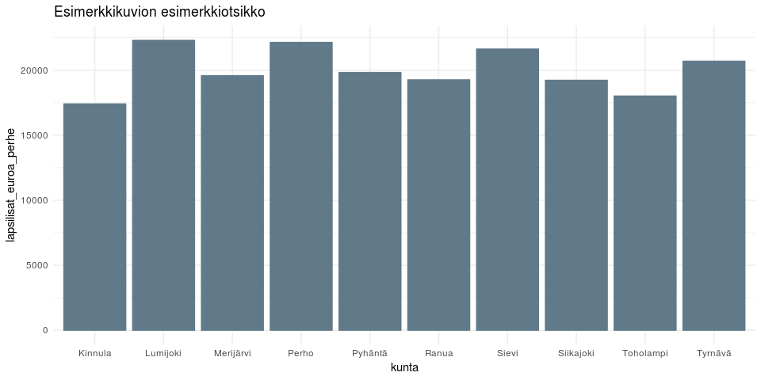

<table>
<thead>
<tr class="header">
<th>pvm</th>
<th>data</th>
<th>tekijä</th>
</tr>
</thead>
<tbody>
<tr class="odd">
<td>2019-02-27</td>
<td><a href="https://beta.avoindata.fi/data/fi/dataset/lastenhoidon-tukien-saajat-ja-maksetut-tuet">Lastenhoidon tukien saajat ja maksetut tuet</a></td>
<td>Markus Kainu</td>
</tr>
</tbody>
</table>

Käyttöesimerkkejä: Lapsilisän saajat ja maksetut lapsilisät
===========================================================

    # CRAN-paketit
    library(dplyr)
    library(ggplot2)
    library(jsonlite)
    library(ckanr)
    library(readr)
    library(knitr)
    library(glue)

Resurssien lataaminen
---------------------

    ckanr_setup(url = "https://beta.avoindata.fi/data/fi/")
    x <- package_search(q = "Kansaneläkelaitos", fq = "title:lapsilis")
    resources <- x$results[[1]]$resources

    dat <- readr::read_csv2(resources[[1]]$url) # data
    meta <- fromJSON(txt = resources[[2]]$url) # metadata

Resurssien kuvailu
==================

**Datan kuvaustieto**

    meta$description %>% cat()

Lapsilisän saajat ja maksetut lapsilisät. et dolore magna aliqua. Ut
enim ad minim veniam, quis nostrud exercitation ullamco laboris nisi ut
aliquid ex ea commodi consequat. Quis aute iure reprehenderit in
voluptate velit esse cillum dolore eu fugiat nulla pariatur. Excepteur
sint obcaecat cupiditat non proident, sunt in culpa qui officia deserunt
mollit anim id est laborum.

**Datan muuttujatieto**

    meta$resources$schema$fields[[1]] %>% kable(format = "markdown")

<table>
<thead>
<tr class="header">
<th style="text-align: left;">name</th>
<th style="text-align: left;">type</th>
<th style="text-align: left;">format</th>
<th style="text-align: left;">title</th>
</tr>
</thead>
<tbody>
<tr class="odd">
<td style="text-align: left;">kunta</td>
<td style="text-align: left;">string</td>
<td style="text-align: left;">default</td>
<td style="text-align: left;">Tarkempi kuvaus muuttujasta</td>
</tr>
<tr class="even">
<td style="text-align: left;">vuosi</td>
<td style="text-align: left;">integer</td>
<td style="text-align: left;">default</td>
<td style="text-align: left;">Tarkempi kuvaus muuttujasta</td>
</tr>
<tr class="odd">
<td style="text-align: left;">lasten_lkm_perheessa</td>
<td style="text-align: left;">string</td>
<td style="text-align: left;">default</td>
<td style="text-align: left;">Tarkempi kuvaus muuttujasta</td>
</tr>
<tr class="even">
<td style="text-align: left;">saajat</td>
<td style="text-align: left;">integer</td>
<td style="text-align: left;">default</td>
<td style="text-align: left;">Tarkempi kuvaus muuttujasta</td>
</tr>
<tr class="odd">
<td style="text-align: left;">lapset</td>
<td style="text-align: left;">integer</td>
<td style="text-align: left;">default</td>
<td style="text-align: left;">Tarkempi kuvaus muuttujasta</td>
</tr>
<tr class="even">
<td style="text-align: left;">maksetut_etuudet_euroa</td>
<td style="text-align: left;">number</td>
<td style="text-align: left;">default</td>
<td style="text-align: left;">Tarkempi kuvaus muuttujasta</td>
</tr>
<tr class="odd">
<td style="text-align: left;">lapsilisat_euroa_perhe</td>
<td style="text-align: left;">number</td>
<td style="text-align: left;">default</td>
<td style="text-align: left;">Tarkempi kuvaus muuttujasta</td>
</tr>
<tr class="even">
<td style="text-align: left;">lapsilisat_euroa_lapsi</td>
<td style="text-align: left;">number</td>
<td style="text-align: left;">default</td>
<td style="text-align: left;">Tarkempi kuvaus muuttujasta</td>
</tr>
</tbody>
</table>

**Datan ensimmäiset rivit**

    head(dat) %>% kable(format = "markdown")

<table>
<colgroup>
<col style="width: 7%" />
<col style="width: 5%" />
<col style="width: 17%" />
<col style="width: 5%" />
<col style="width: 5%" />
<col style="width: 19%" />
<col style="width: 19%" />
<col style="width: 19%" />
</colgroup>
<thead>
<tr class="header">
<th style="text-align: left;">kunta</th>
<th style="text-align: right;">vuosi</th>
<th style="text-align: left;">lasten_lkm_perheessa</th>
<th style="text-align: right;">saajat</th>
<th style="text-align: right;">lapset</th>
<th style="text-align: right;">maksetut_etuudet_euroa</th>
<th style="text-align: right;">lapsilisat_euroa_perhe</th>
<th style="text-align: right;">lapsilisat_euroa_lapsi</th>
</tr>
</thead>
<tbody>
<tr class="odd">
<td style="text-align: left;">Akaa</td>
<td style="text-align: right;">2018</td>
<td style="text-align: left;">Yhteensä</td>
<td style="text-align: right;">1908</td>
<td style="text-align: right;">3567</td>
<td style="text-align: right;">4603483</td>
<td style="text-align: right;">2406.754</td>
<td style="text-align: right;">1288.826</td>
</tr>
<tr class="even">
<td style="text-align: left;">Akaa</td>
<td style="text-align: right;">2017</td>
<td style="text-align: left;">Yhteensä</td>
<td style="text-align: right;">1952</td>
<td style="text-align: right;">3630</td>
<td style="text-align: right;">4628968</td>
<td style="text-align: right;">2364.504</td>
<td style="text-align: right;">1271.491</td>
</tr>
<tr class="odd">
<td style="text-align: left;">Akaa</td>
<td style="text-align: right;">2016</td>
<td style="text-align: left;">Yhteensä</td>
<td style="text-align: right;">1962</td>
<td style="text-align: right;">3686</td>
<td style="text-align: right;">4726989</td>
<td style="text-align: right;">2401.820</td>
<td style="text-align: right;">1278.798</td>
</tr>
<tr class="even">
<td style="text-align: left;">Akaa</td>
<td style="text-align: right;">2015</td>
<td style="text-align: left;">Yhteensä</td>
<td style="text-align: right;">1984</td>
<td style="text-align: right;">3754</td>
<td style="text-align: right;">4812574</td>
<td style="text-align: right;">2417.688</td>
<td style="text-align: right;">1278.133</td>
</tr>
<tr class="odd">
<td style="text-align: left;">Akaa</td>
<td style="text-align: right;">2014</td>
<td style="text-align: left;">Yhteensä</td>
<td style="text-align: right;">2023</td>
<td style="text-align: right;">3790</td>
<td style="text-align: right;">5220331</td>
<td style="text-align: right;">2569.900</td>
<td style="text-align: right;">1372.106</td>
</tr>
<tr class="even">
<td style="text-align: left;">Alajärvi</td>
<td style="text-align: right;">2018</td>
<td style="text-align: left;">Yhteensä</td>
<td style="text-align: right;">921</td>
<td style="text-align: right;">2088</td>
<td style="text-align: right;">2805559</td>
<td style="text-align: right;">3042.121</td>
<td style="text-align: right;">1342.498</td>
</tr>
</tbody>
</table>

Kuvio
-----

    # valitaan ensin top 10 kuntaa, joissa korkeimmat keskimääräiset asumistukimenot
    dat %>% 
      filter(vuosi == 2018) %>% 
      arrange(desc(lapsilisat_euroa_perhe)) %>% 
      slice(1:10) %>% pull(kunta) -> kunnat

    # Piirretään kuva
    dat %>% 
      filter(kunta %in% kunnat) %>% 
      ggplot(aes(x = kunta, y = lapsilisat_euroa_perhe, label = round(lapsilisat_euroa_perhe))) + 
      geom_col() + 
      theme_minimal() +
      theme(legend.position = "none") +
      labs(title = "Esimerkkikuvion esimerkkiotsikko")

Datastore-api
-------------

Jos et tarvitse koko aineistoa, voit suodattaa siitä osio SQL:llä
käyttäen CKAN:n DataStore-rajapintaa.

Alla olevassa esimerkissä tehdään rajaus `kunta`-muuttujasta ja siis
etsitään vaan kuntaa *Veteli* koskevat tiedot.

    kunta <- "Veteli"
    res <- ckanr::ds_search_sql(sql = glue("SELECT * from \"{resources[[1]]$id}\" WHERE kunta LIKE '{kunta}'"), as = "table")
    res$records %>% 
      # select(-`_full_text`, -`_id`) %>% 
      kable(format = "markdown")
