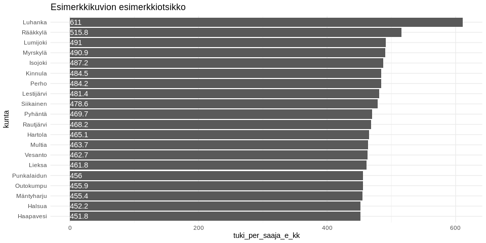
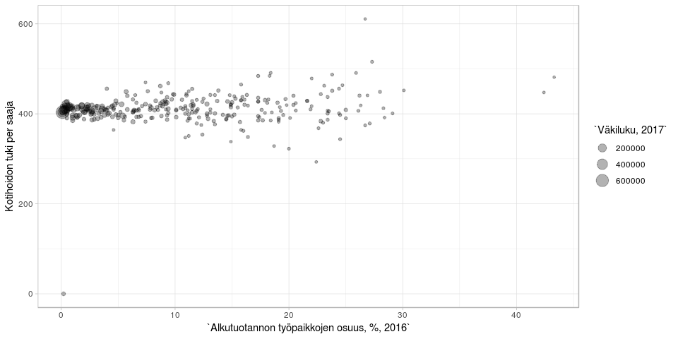

<table>
<thead>
<tr class="header">
<th style="text-align: left;">data</th>
<th style="text-align: left;">julkaistu</th>
<th style="text-align: left;">ylläpitäjä</th>
</tr>
</thead>
<tbody>
<tr class="odd">
<td style="text-align: left;"><a href='https://beta.avoindata.fi/data/fi/dataset/lastenhoidon-tukien-saajat-ja-maksetut-tuet'>Lastenhoidon tukien saajat ja maksetut tuet</a></td>
<td style="text-align: left;">2019-04-25</td>
<td style="text-align: left;"><a href='mailto:markus.kainu@kela.fi'>Markus Kainu</a></td>
</tr>
</tbody>
</table>

    library(dplyr)
    library(ggplot2)
    library(jsonlite)
    library(ckanr)
    library(readr)
    library(knitr)
    library(glue)
    library(tidyr)
    library(pxweb)

Resurssien lataaminen
---------------------

    ckanr_setup(url = "https://beta.avoindata.fi/data/fi/")
    x <- package_search(q = "Kansaneläkelaitos", fq = "title:lastenhoidon")
    resources <- x$results[[1]]$resources
    dat <- read.table(resources[[1]]$url, header = TRUE, sep = ";", dec = ",", stringsAsFactors = FALSE) # Lataa data
    meta <- fromJSON(txt = resources[[2]]$url) # Lataa metadata

Datan ja metadatan kuvailu
--------------------------

**Datan kuvaustieto**

    meta$description %>% cat()

Lastenhoidon tukia tilastointiajanjakson aikana saaneet perheet ja
lapset, joista tukia on maksettu, maksetut tuet, keskimääräinen tuki
sekä yksityisen päivähoidon tuottajan perimä hoitomaksu kuukaudessa.
Lakisääteisten tukien lisäksi raportilta saa tiedot kuntien Kelan kautta
maksamista kuntalisistä. Aluetiedot voi valita raportille joko tuen
saajan asuinkunnan tai tuen maksaneen kunnan mukaan.Lastenhoidon tuilla
tarkoitetaan taloudellista tukea lasten hoidon järjestämiseksi.
Tukimuotoja ovat kotihoidon tuki, yksityisen hoidon tuki, osittainen
hoitoraha ja joustava hoitoraha.

**Datan muuttujatieto**

    meta$resources$schema$fields[[1]] %>%
      select(-values) %>% 
      kable(format = "markdown")

<table>
<thead>
<tr class="header">
<th style="text-align: left;">name</th>
<th style="text-align: left;">type</th>
<th style="text-align: left;">format</th>
</tr>
</thead>
<tbody>
<tr class="odd">
<td style="text-align: left;">kuntanumero</td>
<td style="text-align: left;">integer</td>
<td style="text-align: left;">default</td>
</tr>
<tr class="even">
<td style="text-align: left;">kunta</td>
<td style="text-align: left;">string</td>
<td style="text-align: left;">default</td>
</tr>
<tr class="odd">
<td style="text-align: left;">aikajakso</td>
<td style="text-align: left;">string</td>
<td style="text-align: left;">default</td>
</tr>
<tr class="even">
<td style="text-align: left;">tukien_sisalto</td>
<td style="text-align: left;">string</td>
<td style="text-align: left;">default</td>
</tr>
<tr class="odd">
<td style="text-align: left;">tukimuoto</td>
<td style="text-align: left;">string</td>
<td style="text-align: left;">default</td>
</tr>
<tr class="even">
<td style="text-align: left;">sukupuoli</td>
<td style="text-align: left;">string</td>
<td style="text-align: left;">default</td>
</tr>
<tr class="odd">
<td style="text-align: left;">saajat</td>
<td style="text-align: left;">number</td>
<td style="text-align: left;">default</td>
</tr>
<tr class="even">
<td style="text-align: left;">lapset</td>
<td style="text-align: left;">number</td>
<td style="text-align: left;">default</td>
</tr>
<tr class="odd">
<td style="text-align: left;">maksetut_etuudet_euroa</td>
<td style="text-align: left;">number</td>
<td style="text-align: left;">default</td>
</tr>
<tr class="even">
<td style="text-align: left;">tuki_per_saaja_e_kk</td>
<td style="text-align: left;">number</td>
<td style="text-align: left;">default</td>
</tr>
<tr class="odd">
<td style="text-align: left;">tuki_per_lapsi_e_kk</td>
<td style="text-align: left;">number</td>
<td style="text-align: left;">default</td>
</tr>
<tr class="even">
<td style="text-align: left;">hoitomaksu_per_saaja_e_kk</td>
<td style="text-align: left;">number</td>
<td style="text-align: left;">default</td>
</tr>
<tr class="odd">
<td style="text-align: left;">hoitomaksu_per_lapsi_e_kk</td>
<td style="text-align: left;">number</td>
<td style="text-align: left;">default</td>
</tr>
<tr class="even">
<td style="text-align: left;">vuosi</td>
<td style="text-align: left;">integer</td>
<td style="text-align: left;">default</td>
</tr>
<tr class="odd">
<td style="text-align: left;">kuukausi</td>
<td style="text-align: left;">integer</td>
<td style="text-align: left;">default</td>
</tr>
</tbody>
</table>

**Datan ensimmäiset rivit**

    head(dat)  %>% kable(format = "markdown")

<table style="width:100%;">
<colgroup>
<col style="width: 5%" />
<col style="width: 4%" />
<col style="width: 4%" />
<col style="width: 8%" />
<col style="width: 4%" />
<col style="width: 4%" />
<col style="width: 3%" />
<col style="width: 3%" />
<col style="width: 10%" />
<col style="width: 9%" />
<col style="width: 9%" />
<col style="width: 12%" />
<col style="width: 12%" />
<col style="width: 2%" />
<col style="width: 4%" />
</colgroup>
<thead>
<tr class="header">
<th style="text-align: right;">kuntanumero</th>
<th style="text-align: left;">kunta</th>
<th style="text-align: left;">aikajakso</th>
<th style="text-align: left;">tukien_sisalto</th>
<th style="text-align: left;">tukimuoto</th>
<th style="text-align: left;">sukupuoli</th>
<th style="text-align: right;">saajat</th>
<th style="text-align: right;">lapset</th>
<th style="text-align: right;">maksetut_etuudet_euroa</th>
<th style="text-align: right;">tuki_per_saaja_e_kk</th>
<th style="text-align: right;">tuki_per_lapsi_e_kk</th>
<th style="text-align: right;">hoitomaksu_per_saaja_e_kk</th>
<th style="text-align: right;">hoitomaksu_per_lapsi_e_kk</th>
<th style="text-align: right;">vuosi</th>
<th style="text-align: right;">kuukausi</th>
</tr>
</thead>
<tbody>
<tr class="odd">
<td style="text-align: right;">5</td>
<td style="text-align: left;">Alajärvi</td>
<td style="text-align: left;">vuosi</td>
<td style="text-align: left;">Lakisääteiset tuet</td>
<td style="text-align: left;">Yhteensä</td>
<td style="text-align: left;">Yhteensä</td>
<td style="text-align: right;">263</td>
<td style="text-align: right;">472</td>
<td style="text-align: right;">697876</td>
<td style="text-align: right;">339.01</td>
<td style="text-align: right;">202.55</td>
<td style="text-align: right;">0.00</td>
<td style="text-align: right;">0.00</td>
<td style="text-align: right;">2007</td>
<td style="text-align: right;">NA</td>
</tr>
<tr class="even">
<td style="text-align: right;">5</td>
<td style="text-align: left;">Alajärvi</td>
<td style="text-align: left;">vuosi</td>
<td style="text-align: left;">Lakisääteiset tuet</td>
<td style="text-align: left;">Yhteensä</td>
<td style="text-align: left;">Miehet</td>
<td style="text-align: right;">13</td>
<td style="text-align: right;">19</td>
<td style="text-align: right;">26416</td>
<td style="text-align: right;">345.00</td>
<td style="text-align: right;">258.75</td>
<td style="text-align: right;">0.00</td>
<td style="text-align: right;">0.00</td>
<td style="text-align: right;">2007</td>
<td style="text-align: right;">NA</td>
</tr>
<tr class="odd">
<td style="text-align: right;">5</td>
<td style="text-align: left;">Alajärvi</td>
<td style="text-align: left;">vuosi</td>
<td style="text-align: left;">Lakisääteiset tuet</td>
<td style="text-align: left;">Yhteensä</td>
<td style="text-align: left;">Naiset</td>
<td style="text-align: right;">250</td>
<td style="text-align: right;">462</td>
<td style="text-align: right;">671459</td>
<td style="text-align: right;">338.88</td>
<td style="text-align: right;">201.58</td>
<td style="text-align: right;">0.00</td>
<td style="text-align: right;">0.00</td>
<td style="text-align: right;">2007</td>
<td style="text-align: right;">NA</td>
</tr>
<tr class="even">
<td style="text-align: right;">9</td>
<td style="text-align: left;">Alavieska</td>
<td style="text-align: left;">vuosi</td>
<td style="text-align: left;">Lakisääteiset tuet</td>
<td style="text-align: left;">Yhteensä</td>
<td style="text-align: left;">Yhteensä</td>
<td style="text-align: right;">73</td>
<td style="text-align: right;">144</td>
<td style="text-align: right;">185966</td>
<td style="text-align: right;">336.63</td>
<td style="text-align: right;">180.94</td>
<td style="text-align: right;">350.75</td>
<td style="text-align: right;">350.75</td>
<td style="text-align: right;">2007</td>
<td style="text-align: right;">NA</td>
</tr>
<tr class="odd">
<td style="text-align: right;">9</td>
<td style="text-align: left;">Alavieska</td>
<td style="text-align: left;">vuosi</td>
<td style="text-align: left;">Lakisääteiset tuet</td>
<td style="text-align: left;">Yhteensä</td>
<td style="text-align: left;">Miehet</td>
<td style="text-align: right;">5</td>
<td style="text-align: right;">8</td>
<td style="text-align: right;">5771</td>
<td style="text-align: right;">360.00</td>
<td style="text-align: right;">360.00</td>
<td style="text-align: right;">0.00</td>
<td style="text-align: right;">0.00</td>
<td style="text-align: right;">2007</td>
<td style="text-align: right;">NA</td>
</tr>
<tr class="even">
<td style="text-align: right;">9</td>
<td style="text-align: left;">Alavieska</td>
<td style="text-align: left;">vuosi</td>
<td style="text-align: left;">Lakisääteiset tuet</td>
<td style="text-align: left;">Yhteensä</td>
<td style="text-align: left;">Naiset</td>
<td style="text-align: right;">68</td>
<td style="text-align: right;">137</td>
<td style="text-align: right;">180195</td>
<td style="text-align: right;">336.07</td>
<td style="text-align: right;">178.67</td>
<td style="text-align: right;">350.75</td>
<td style="text-align: right;">350.75</td>
<td style="text-align: right;">2007</td>
<td style="text-align: right;">NA</td>
</tr>
</tbody>
</table>

Kuvio
-----

    dat %>% 
      filter(aikajakso == "vuosi",
             vuosi == "2018",
             tukimuoto == "Kotihoidon tuki",
             tukien_sisalto == "Lakisääteiset tuet",
             sukupuoli == "Yhteensä") %>% 
      arrange(desc(tuki_per_saaja_e_kk)) %>% 
      slice(1:20) %>% 
      mutate(kunta = forcats::fct_reorder(kunta, tuki_per_saaja_e_kk)) %>% 
      ggplot(aes(x = kunta, y = tuki_per_saaja_e_kk, label = round(tuki_per_saaja_e_kk,1))) + 
      geom_col() + 
      coord_flip() + 
      theme_minimal() +
      geom_text(aes(y = 0), hjust = 0, color = "white") +
      labs(title = "Esimerkkikuvion esimerkkiotsikko")

Datan yhdistäminen Tilastokeskuksen kuntien avainlukuihin
---------------------------------------------------------

    # PXWEB query 
    pxweb_query_list <- 
      list("Alue 2018"=c("SSS","020","005","009","010","016","018","019","035","043","046","047","049","050","051","052","060","061","062","065","069","071","072","074","075","076","077","078","079","081","082","086","111","090","091","097","098","099","102","103","105","106","108","109","139","140","142","143","145","146","153","148","149","151","152","165","167","169","170","171","172","176","177","178","179","181","182","186","202","204","205","208","211","213","214","216","217","218","224","226","230","231","232","233","235","236","239","240","320","241","322","244","245","249","250","256","257","260","261","263","265","271","272","273","275","276","280","284","285","286","287","288","290","291","295","297","300","301","304","305","312","316","317","318","398","399","400","407","402","403","405","408","410","416","417","418","420","421","422","423","425","426","444","430","433","434","435","436","438","440","441","475","478","480","481","483","484","489","491","494","495","498","499","500","503","504","505","508","507","529","531","535","536","538","541","543","545","560","561","562","563","564","309","576","577","578","445","580","581","599","583","854","584","588","592","593","595","598","601","604","607","608","609","611","638","614","615","616","619","620","623","624","625","626","630","631","635","636","678","710","680","681","683","684","686","687","689","691","694","697","698","700","702","704","707","729","732","734","736","790","738","739","740","742","743","746","747","748","791","749","751","753","755","758","759","761","762","765","766","768","771","777","778","781","783","831","832","833","834","837","844","845","846","848","849","850","851","853","857","858","859","886","887","889","890","892","893","895","785","905","908","911","092","915","918","921","922","924","925","927","931","934","935","936","941","946","976","977","980","981","989","992","MK01","MK02","MK04","MK05","MK06","MK07","MK08","MK09","MK10","MK11","MK12","MK13","MK14","MK15","MK16","MK17","MK18","MK19","MK21","SK011","SK014","SK015","SK016","SK021","SK022","SK023","SK024","SK025","SK041","SK043","SK044","SK051","SK052","SK053","SK061","SK063","SK064","SK068","SK069","SK071","SK081","SK082","SK091","SK093","SK101","SK103","SK105","SK111","SK112","SK113","SK114","SK115","SK122","SK124","SK125","SK131","SK132","SK133","SK134","SK135","SK138","SK141","SK142","SK144","SK146","SK151","SK152","SK153","SK154","SK161","SK162","SK171","SK173","SK174","SK175","SK176","SK177","SK178","SK181","SK182","SK191","SK192","SK193","SK194","SK196","SK197","SK211","SK212","SK213","2020MK01","2020MK02","2020MK04","2020MK05","2020MK06","2020MK07","2020MK08","2020MK09","2020MK10","2020MK11","2020MK12","2020MK13","2020MK14","2020MK15","2020MK16","2020MK17","2020MK18","2020MK19","2020MK21","2020SK011","2020SK014","2020SK015","2020SK016","2020SK021","2020SK022","2020SK023","2020SK024","2020SK025","2020SK041","2020SK043","2020SK044","2020SK051","2020SK052","2020SK053","2020SK061","2020SK063","2020SK064","2020SK068","2020SK069","2020SK071","2020SK081","2020SK082","2020SK091","2020SK093","2020SK101","2020SK103","2020SK105","2020SK111","2020SK112","2020SK113","2020SK114","2020SK115","2020SK122","2020SK124","2020SK125","2020SK131","2020SK132","2020SK133","2020SK134","2020SK135","2020SK138","2020SK141","2020SK142","2020SK144","2020SK146","2020SK151","2020SK152","2020SK153","2020SK154","2020SK161","2020SK162","2020SK171","2020SK173","2020SK174","2020SK175","2020SK176","2020SK177","2020SK178","2020SK181","2020SK182","2020SK191","2020SK192","2020SK193","2020SK194","2020SK196","2020SK197","2020SK211","2020SK212","2020SK213"),
           "Tiedot"=c("M408","M411","M476","M391","M421","M478","M404","M410","M303","M297","M302","M44","M62","M70","M488","M486","M137","M140","M130","M162","M78","M485","M152","M72","M84","M106","M499","M496","M495","M497","M498"))

    # Download data 
    tk_lst <- 
      pxweb_get(url = "http://pxnet2.stat.fi/PXWeb/api/v1/fi/Kuntien_avainluvut/2018/kuntien_avainluvut_2018_viimeisin.px",
                query = pxweb_query_list)
    tk_avainluvut <- as.data.frame(tk_lst, column.name.type = "text", variable.value.type = "text") %>% 
      # levitetään data
      spread(key = Tiedot, value = `Kuntien avainluvut`)

    df <- left_join(dat, tk_avainluvut, by = c("kunta" = "Alue 2018"))
    # Piirretään hajontakuvio
    df2 <- df %>% 
      filter(aikajakso == "vuosi",
             vuosi == "2018",
             tukimuoto == "Kotihoidon tuki",
             tukien_sisalto == "Lakisääteiset tuet",
             sukupuoli == "Yhteensä")

    ggplot(df2, aes(x = `Alkutuotannon työpaikkojen osuus, %, 2016`, 
                    y = tuki_per_saaja_e_kk, 
                    size = `Väkiluku, 2017`)) + 
      geom_point(alpha = .3) +
      labs(y = "Kotihoidon tuki per saaja") + 
      theme_light()

Datastore-api
-------------

Jos et tarvitse koko aineistoa, voit suodattaa siitä osio SQL:llä
käyttäen CKAN:n DataStore-rajapintaa.

Alla olevassa esimerkissä tehdään rajaus `kunta`-muuttujasta ja siis
etsitään vaan kuntaa *Veteli* koskevat tiedot.

    kunta <- "Veteli"
    res <- ckanr::ds_search_sql(sql = glue("SELECT * from \"{resources[[1]]$id}\" WHERE kunta LIKE '{kunta}'"), as = "table")
    res$records %>% 
      select(-`_full_text`, -`_id`) %>% 
      kable(format = "markdown")

<table>
<colgroup>
<col style="width: 2%" />
<col style="width: 5%" />
<col style="width: 9%" />
<col style="width: 4%" />
<col style="width: 2%" />
<col style="width: 3%" />
<col style="width: 10%" />
<col style="width: 13%" />
<col style="width: 10%" />
<col style="width: 8%" />
<col style="width: 4%" />
<col style="width: 8%" />
<col style="width: 2%" />
<col style="width: 9%" />
<col style="width: 2%" />
</colgroup>
<thead>
<tr class="header">
<th style="text-align: left;">kunta</th>
<th style="text-align: left;">kuntanumero</th>
<th style="text-align: left;">tukimuoto</th>
<th style="text-align: left;">sukupuoli</th>
<th style="text-align: left;">vuosi</th>
<th style="text-align: left;">kuukausi</th>
<th style="text-align: left;">hoitomaksu_per_lapsi_e_kk</th>
<th style="text-align: left;">tukien_sisalto</th>
<th style="text-align: left;">hoitomaksu_per_saaja_e_kk</th>
<th style="text-align: left;">tuki_per_lapsi_e_kk</th>
<th style="text-align: left;">aikajakso</th>
<th style="text-align: left;">tuki_per_saaja_e_kk</th>
<th style="text-align: left;">saajat</th>
<th style="text-align: left;">maksetut_etuudet_euroa</th>
<th style="text-align: left;">lapset</th>
</tr>
</thead>
<tbody>
<tr class="odd">
<td style="text-align: left;">Veteli</td>
<td style="text-align: left;">924</td>
<td style="text-align: left;">Yhteensä</td>
<td style="text-align: left;">Yhteensä</td>
<td style="text-align: left;">2007</td>
<td style="text-align: left;">NA</td>
<td style="text-align: left;">0,00</td>
<td style="text-align: left;">Lakisääteiset tuet</td>
<td style="text-align: left;">0,00</td>
<td style="text-align: left;">238,11</td>
<td style="text-align: left;">vuosi</td>
<td style="text-align: left;">379,96</td>
<td style="text-align: left;">77</td>
<td style="text-align: left;">208902</td>
<td style="text-align: left;">130</td>
</tr>
<tr class="even">
<td style="text-align: left;">Veteli</td>
<td style="text-align: left;">924</td>
<td style="text-align: left;">Yhteensä</td>
<td style="text-align: left;">Miehet</td>
<td style="text-align: left;">2007</td>
<td style="text-align: left;">NA</td>
<td style="text-align: left;">NA</td>
<td style="text-align: left;">Lakisääteiset tuet</td>
<td style="text-align: left;">NA</td>
<td style="text-align: left;">NA</td>
<td style="text-align: left;">vuosi</td>
<td style="text-align: left;">NA</td>
<td style="text-align: left;">NA</td>
<td style="text-align: left;">NA</td>
<td style="text-align: left;">NA</td>
</tr>
<tr class="odd">
<td style="text-align: left;">Veteli</td>
<td style="text-align: left;">924</td>
<td style="text-align: left;">Yhteensä</td>
<td style="text-align: left;">Naiset</td>
<td style="text-align: left;">2007</td>
<td style="text-align: left;">NA</td>
<td style="text-align: left;">0,00</td>
<td style="text-align: left;">Lakisääteiset tuet</td>
<td style="text-align: left;">0,00</td>
<td style="text-align: left;">238,11</td>
<td style="text-align: left;">vuosi</td>
<td style="text-align: left;">379,96</td>
<td style="text-align: left;">74</td>
<td style="text-align: left;">203317</td>
<td style="text-align: left;">128</td>
</tr>
<tr class="even">
<td style="text-align: left;">Veteli</td>
<td style="text-align: left;">924</td>
<td style="text-align: left;">Kotihoidon tuki</td>
<td style="text-align: left;">Yhteensä</td>
<td style="text-align: left;">2007</td>
<td style="text-align: left;">NA</td>
<td style="text-align: left;">0,00</td>
<td style="text-align: left;">Lakisääteiset tuet</td>
<td style="text-align: left;">0,00</td>
<td style="text-align: left;">240,38</td>
<td style="text-align: left;">vuosi</td>
<td style="text-align: left;">386,70</td>
<td style="text-align: left;">74</td>
<td style="text-align: left;">207007</td>
<td style="text-align: left;">127</td>
</tr>
<tr class="odd">
<td style="text-align: left;">Veteli</td>
<td style="text-align: left;">924</td>
<td style="text-align: left;">Kotihoidon tuki</td>
<td style="text-align: left;">Miehet</td>
<td style="text-align: left;">2007</td>
<td style="text-align: left;">NA</td>
<td style="text-align: left;">NA</td>
<td style="text-align: left;">Lakisääteiset tuet</td>
<td style="text-align: left;">NA</td>
<td style="text-align: left;">NA</td>
<td style="text-align: left;">vuosi</td>
<td style="text-align: left;">NA</td>
<td style="text-align: left;">NA</td>
<td style="text-align: left;">NA</td>
<td style="text-align: left;">NA</td>
</tr>
<tr class="even">
<td style="text-align: left;">Veteli</td>
<td style="text-align: left;">924</td>
<td style="text-align: left;">Kotihoidon tuki</td>
<td style="text-align: left;">Naiset</td>
<td style="text-align: left;">2007</td>
<td style="text-align: left;">NA</td>
<td style="text-align: left;">0,00</td>
<td style="text-align: left;">Lakisääteiset tuet</td>
<td style="text-align: left;">0,00</td>
<td style="text-align: left;">240,38</td>
<td style="text-align: left;">vuosi</td>
<td style="text-align: left;">386,70</td>
<td style="text-align: left;">71</td>
<td style="text-align: left;">201422</td>
<td style="text-align: left;">125</td>
</tr>
<tr class="odd">
<td style="text-align: left;">Veteli</td>
<td style="text-align: left;">924</td>
<td style="text-align: left;">Osittainen hoitoraha</td>
<td style="text-align: left;">Yhteensä</td>
<td style="text-align: left;">2007</td>
<td style="text-align: left;">NA</td>
<td style="text-align: left;">NA</td>
<td style="text-align: left;">Lakisääteiset tuet</td>
<td style="text-align: left;">NA</td>
<td style="text-align: left;">NA</td>
<td style="text-align: left;">vuosi</td>
<td style="text-align: left;">NA</td>
<td style="text-align: left;">NA</td>
<td style="text-align: left;">NA</td>
<td style="text-align: left;">NA</td>
</tr>
<tr class="even">
<td style="text-align: left;">Veteli</td>
<td style="text-align: left;">924</td>
<td style="text-align: left;">Osittainen hoitoraha</td>
<td style="text-align: left;">Naiset</td>
<td style="text-align: left;">2007</td>
<td style="text-align: left;">NA</td>
<td style="text-align: left;">NA</td>
<td style="text-align: left;">Lakisääteiset tuet</td>
<td style="text-align: left;">NA</td>
<td style="text-align: left;">NA</td>
<td style="text-align: left;">vuosi</td>
<td style="text-align: left;">NA</td>
<td style="text-align: left;">NA</td>
<td style="text-align: left;">NA</td>
<td style="text-align: left;">NA</td>
</tr>
<tr class="odd">
<td style="text-align: left;">Veteli</td>
<td style="text-align: left;">924</td>
<td style="text-align: left;">Yhteensä</td>
<td style="text-align: left;">Yhteensä</td>
<td style="text-align: left;">2007</td>
<td style="text-align: left;">NA</td>
<td style="text-align: left;">0,00</td>
<td style="text-align: left;">Lakisääteiset tuet ja kuntalisät</td>
<td style="text-align: left;">0,00</td>
<td style="text-align: left;">238,11</td>
<td style="text-align: left;">vuosi</td>
<td style="text-align: left;">379,96</td>
<td style="text-align: left;">77</td>
<td style="text-align: left;">208902</td>
<td style="text-align: left;">130</td>
</tr>
<tr class="even">
<td style="text-align: left;">Veteli</td>
<td style="text-align: left;">924</td>
<td style="text-align: left;">Yhteensä</td>
<td style="text-align: left;">Miehet</td>
<td style="text-align: left;">2007</td>
<td style="text-align: left;">NA</td>
<td style="text-align: left;">NA</td>
<td style="text-align: left;">Lakisääteiset tuet ja kuntalisät</td>
<td style="text-align: left;">NA</td>
<td style="text-align: left;">NA</td>
<td style="text-align: left;">vuosi</td>
<td style="text-align: left;">NA</td>
<td style="text-align: left;">NA</td>
<td style="text-align: left;">NA</td>
<td style="text-align: left;">NA</td>
</tr>
<tr class="odd">
<td style="text-align: left;">Veteli</td>
<td style="text-align: left;">924</td>
<td style="text-align: left;">Yhteensä</td>
<td style="text-align: left;">Naiset</td>
<td style="text-align: left;">2007</td>
<td style="text-align: left;">NA</td>
<td style="text-align: left;">0,00</td>
<td style="text-align: left;">Lakisääteiset tuet ja kuntalisät</td>
<td style="text-align: left;">0,00</td>
<td style="text-align: left;">238,11</td>
<td style="text-align: left;">vuosi</td>
<td style="text-align: left;">379,96</td>
<td style="text-align: left;">74</td>
<td style="text-align: left;">203317</td>
<td style="text-align: left;">128</td>
</tr>
<tr class="even">
<td style="text-align: left;">Veteli</td>
<td style="text-align: left;">924</td>
<td style="text-align: left;">Kotihoidon tuki</td>
<td style="text-align: left;">Yhteensä</td>
<td style="text-align: left;">2007</td>
<td style="text-align: left;">NA</td>
<td style="text-align: left;">0,00</td>
<td style="text-align: left;">Lakisääteiset tuet ja kuntalisät</td>
<td style="text-align: left;">0,00</td>
<td style="text-align: left;">240,38</td>
<td style="text-align: left;">vuosi</td>
<td style="text-align: left;">386,70</td>
<td style="text-align: left;">74</td>
<td style="text-align: left;">207007</td>
<td style="text-align: left;">127</td>
</tr>
<tr class="odd">
<td style="text-align: left;">Veteli</td>
<td style="text-align: left;">924</td>
<td style="text-align: left;">Kotihoidon tuki</td>
<td style="text-align: left;">Miehet</td>
<td style="text-align: left;">2007</td>
<td style="text-align: left;">NA</td>
<td style="text-align: left;">NA</td>
<td style="text-align: left;">Lakisääteiset tuet ja kuntalisät</td>
<td style="text-align: left;">NA</td>
<td style="text-align: left;">NA</td>
<td style="text-align: left;">vuosi</td>
<td style="text-align: left;">NA</td>
<td style="text-align: left;">NA</td>
<td style="text-align: left;">NA</td>
<td style="text-align: left;">NA</td>
</tr>
<tr class="even">
<td style="text-align: left;">Veteli</td>
<td style="text-align: left;">924</td>
<td style="text-align: left;">Kotihoidon tuki</td>
<td style="text-align: left;">Naiset</td>
<td style="text-align: left;">2007</td>
<td style="text-align: left;">NA</td>
<td style="text-align: left;">0,00</td>
<td style="text-align: left;">Lakisääteiset tuet ja kuntalisät</td>
<td style="text-align: left;">0,00</td>
<td style="text-align: left;">240,38</td>
<td style="text-align: left;">vuosi</td>
<td style="text-align: left;">386,70</td>
<td style="text-align: left;">71</td>
<td style="text-align: left;">201422</td>
<td style="text-align: left;">125</td>
</tr>
<tr class="odd">
<td style="text-align: left;">Veteli</td>
<td style="text-align: left;">924</td>
<td style="text-align: left;">Osittainen hoitoraha</td>
<td style="text-align: left;">Yhteensä</td>
<td style="text-align: left;">2007</td>
<td style="text-align: left;">NA</td>
<td style="text-align: left;">NA</td>
<td style="text-align: left;">Lakisääteiset tuet ja kuntalisät</td>
<td style="text-align: left;">NA</td>
<td style="text-align: left;">NA</td>
<td style="text-align: left;">vuosi</td>
<td style="text-align: left;">NA</td>
<td style="text-align: left;">NA</td>
<td style="text-align: left;">NA</td>
<td style="text-align: left;">NA</td>
</tr>
<tr class="even">
<td style="text-align: left;">Veteli</td>
<td style="text-align: left;">924</td>
<td style="text-align: left;">Osittainen hoitoraha</td>
<td style="text-align: left;">Naiset</td>
<td style="text-align: left;">2007</td>
<td style="text-align: left;">NA</td>
<td style="text-align: left;">NA</td>
<td style="text-align: left;">Lakisääteiset tuet ja kuntalisät</td>
<td style="text-align: left;">NA</td>
<td style="text-align: left;">NA</td>
<td style="text-align: left;">vuosi</td>
<td style="text-align: left;">NA</td>
<td style="text-align: left;">NA</td>
<td style="text-align: left;">NA</td>
<td style="text-align: left;">NA</td>
</tr>
<tr class="odd">
<td style="text-align: left;">Veteli</td>
<td style="text-align: left;">924</td>
<td style="text-align: left;">Yhteensä</td>
<td style="text-align: left;">Yhteensä</td>
<td style="text-align: left;">2008</td>
<td style="text-align: left;">NA</td>
<td style="text-align: left;">0,00</td>
<td style="text-align: left;">Lakisääteiset tuet</td>
<td style="text-align: left;">0,00</td>
<td style="text-align: left;">226,67</td>
<td style="text-align: left;">vuosi</td>
<td style="text-align: left;">340,00</td>
<td style="text-align: left;">74</td>
<td style="text-align: left;">192596</td>
<td style="text-align: left;">121</td>
</tr>
<tr class="even">
<td style="text-align: left;">Veteli</td>
<td style="text-align: left;">924</td>
<td style="text-align: left;">Yhteensä</td>
<td style="text-align: left;">Miehet</td>
<td style="text-align: left;">2008</td>
<td style="text-align: left;">NA</td>
<td style="text-align: left;">NA</td>
<td style="text-align: left;">Lakisääteiset tuet</td>
<td style="text-align: left;">NA</td>
<td style="text-align: left;">NA</td>
<td style="text-align: left;">vuosi</td>
<td style="text-align: left;">NA</td>
<td style="text-align: left;">NA</td>
<td style="text-align: left;">NA</td>
<td style="text-align: left;">NA</td>
</tr>
<tr class="odd">
<td style="text-align: left;">Veteli</td>
<td style="text-align: left;">924</td>
<td style="text-align: left;">Yhteensä</td>
<td style="text-align: left;">Naiset</td>
<td style="text-align: left;">2008</td>
<td style="text-align: left;">NA</td>
<td style="text-align: left;">0,00</td>
<td style="text-align: left;">Lakisääteiset tuet</td>
<td style="text-align: left;">0,00</td>
<td style="text-align: left;">226,67</td>
<td style="text-align: left;">vuosi</td>
<td style="text-align: left;">340,00</td>
<td style="text-align: left;">71</td>
<td style="text-align: left;">187686</td>
<td style="text-align: left;">118</td>
</tr>
<tr class="even">
<td style="text-align: left;">Veteli</td>
<td style="text-align: left;">924</td>
<td style="text-align: left;">Kotihoidon tuki</td>
<td style="text-align: left;">Yhteensä</td>
<td style="text-align: left;">2008</td>
<td style="text-align: left;">NA</td>
<td style="text-align: left;">0,00</td>
<td style="text-align: left;">Lakisääteiset tuet</td>
<td style="text-align: left;">0,00</td>
<td style="text-align: left;">229,32</td>
<td style="text-align: left;">vuosi</td>
<td style="text-align: left;">346,92</td>
<td style="text-align: left;">71</td>
<td style="text-align: left;">190093</td>
<td style="text-align: left;">118</td>
</tr>
<tr class="odd">
<td style="text-align: left;">Veteli</td>
<td style="text-align: left;">924</td>
<td style="text-align: left;">Kotihoidon tuki</td>
<td style="text-align: left;">Miehet</td>
<td style="text-align: left;">2008</td>
<td style="text-align: left;">NA</td>
<td style="text-align: left;">NA</td>
<td style="text-align: left;">Lakisääteiset tuet</td>
<td style="text-align: left;">NA</td>
<td style="text-align: left;">NA</td>
<td style="text-align: left;">vuosi</td>
<td style="text-align: left;">NA</td>
<td style="text-align: left;">NA</td>
<td style="text-align: left;">NA</td>
<td style="text-align: left;">NA</td>
</tr>
<tr class="even">
<td style="text-align: left;">Veteli</td>
<td style="text-align: left;">924</td>
<td style="text-align: left;">Kotihoidon tuki</td>
<td style="text-align: left;">Naiset</td>
<td style="text-align: left;">2008</td>
<td style="text-align: left;">NA</td>
<td style="text-align: left;">0,00</td>
<td style="text-align: left;">Lakisääteiset tuet</td>
<td style="text-align: left;">0,00</td>
<td style="text-align: left;">229,32</td>
<td style="text-align: left;">vuosi</td>
<td style="text-align: left;">346,92</td>
<td style="text-align: left;">68</td>
<td style="text-align: left;">185183</td>
<td style="text-align: left;">115</td>
</tr>
<tr class="odd">
<td style="text-align: left;">Veteli</td>
<td style="text-align: left;">924</td>
<td style="text-align: left;">Osittainen hoitoraha</td>
<td style="text-align: left;">Yhteensä</td>
<td style="text-align: left;">2008</td>
<td style="text-align: left;">NA</td>
<td style="text-align: left;">NA</td>
<td style="text-align: left;">Lakisääteiset tuet</td>
<td style="text-align: left;">NA</td>
<td style="text-align: left;">NA</td>
<td style="text-align: left;">vuosi</td>
<td style="text-align: left;">NA</td>
<td style="text-align: left;">NA</td>
<td style="text-align: left;">NA</td>
<td style="text-align: left;">NA</td>
</tr>
<tr class="even">
<td style="text-align: left;">Veteli</td>
<td style="text-align: left;">924</td>
<td style="text-align: left;">Osittainen hoitoraha</td>
<td style="text-align: left;">Naiset</td>
<td style="text-align: left;">2008</td>
<td style="text-align: left;">NA</td>
<td style="text-align: left;">NA</td>
<td style="text-align: left;">Lakisääteiset tuet</td>
<td style="text-align: left;">NA</td>
<td style="text-align: left;">NA</td>
<td style="text-align: left;">vuosi</td>
<td style="text-align: left;">NA</td>
<td style="text-align: left;">NA</td>
<td style="text-align: left;">NA</td>
<td style="text-align: left;">NA</td>
</tr>
<tr class="odd">
<td style="text-align: left;">Veteli</td>
<td style="text-align: left;">924</td>
<td style="text-align: left;">Yhteensä</td>
<td style="text-align: left;">Miehet</td>
<td style="text-align: left;">2008</td>
<td style="text-align: left;">NA</td>
<td style="text-align: left;">NA</td>
<td style="text-align: left;">Lakisääteiset tuet ja kuntalisät</td>
<td style="text-align: left;">NA</td>
<td style="text-align: left;">NA</td>
<td style="text-align: left;">vuosi</td>
<td style="text-align: left;">NA</td>
<td style="text-align: left;">NA</td>
<td style="text-align: left;">NA</td>
<td style="text-align: left;">NA</td>
</tr>
<tr class="even">
<td style="text-align: left;">Veteli</td>
<td style="text-align: left;">924</td>
<td style="text-align: left;">Yhteensä</td>
<td style="text-align: left;">Yhteensä</td>
<td style="text-align: left;">2008</td>
<td style="text-align: left;">NA</td>
<td style="text-align: left;">0,00</td>
<td style="text-align: left;">Lakisääteiset tuet ja kuntalisät</td>
<td style="text-align: left;">0,00</td>
<td style="text-align: left;">226,67</td>
<td style="text-align: left;">vuosi</td>
<td style="text-align: left;">340,00</td>
<td style="text-align: left;">74</td>
<td style="text-align: left;">195114</td>
<td style="text-align: left;">121</td>
</tr>
<tr class="odd">
<td style="text-align: left;">Veteli</td>
<td style="text-align: left;">924</td>
<td style="text-align: left;">Yhteensä</td>
<td style="text-align: left;">Naiset</td>
<td style="text-align: left;">2008</td>
<td style="text-align: left;">NA</td>
<td style="text-align: left;">0,00</td>
<td style="text-align: left;">Lakisääteiset tuet ja kuntalisät</td>
<td style="text-align: left;">0,00</td>
<td style="text-align: left;">226,67</td>
<td style="text-align: left;">vuosi</td>
<td style="text-align: left;">340,00</td>
<td style="text-align: left;">71</td>
<td style="text-align: left;">189985</td>
<td style="text-align: left;">118</td>
</tr>
<tr class="even">
<td style="text-align: left;">Veteli</td>
<td style="text-align: left;">924</td>
<td style="text-align: left;">Kotihoidon tuki</td>
<td style="text-align: left;">Yhteensä</td>
<td style="text-align: left;">2008</td>
<td style="text-align: left;">NA</td>
<td style="text-align: left;">0,00</td>
<td style="text-align: left;">Lakisääteiset tuet ja kuntalisät</td>
<td style="text-align: left;">0,00</td>
<td style="text-align: left;">229,32</td>
<td style="text-align: left;">vuosi</td>
<td style="text-align: left;">346,92</td>
<td style="text-align: left;">71</td>
<td style="text-align: left;">192611</td>
<td style="text-align: left;">118</td>
</tr>
<tr class="odd">
<td style="text-align: left;">Veteli</td>
<td style="text-align: left;">924</td>
<td style="text-align: left;">Kotihoidon tuki</td>
<td style="text-align: left;">Miehet</td>
<td style="text-align: left;">2008</td>
<td style="text-align: left;">NA</td>
<td style="text-align: left;">NA</td>
<td style="text-align: left;">Lakisääteiset tuet ja kuntalisät</td>
<td style="text-align: left;">NA</td>
<td style="text-align: left;">NA</td>
<td style="text-align: left;">vuosi</td>
<td style="text-align: left;">NA</td>
<td style="text-align: left;">NA</td>
<td style="text-align: left;">NA</td>
<td style="text-align: left;">NA</td>
</tr>
<tr class="even">
<td style="text-align: left;">Veteli</td>
<td style="text-align: left;">924</td>
<td style="text-align: left;">Kotihoidon tuki</td>
<td style="text-align: left;">Naiset</td>
<td style="text-align: left;">2008</td>
<td style="text-align: left;">NA</td>
<td style="text-align: left;">0,00</td>
<td style="text-align: left;">Lakisääteiset tuet ja kuntalisät</td>
<td style="text-align: left;">0,00</td>
<td style="text-align: left;">229,32</td>
<td style="text-align: left;">vuosi</td>
<td style="text-align: left;">346,92</td>
<td style="text-align: left;">68</td>
<td style="text-align: left;">187482</td>
<td style="text-align: left;">115</td>
</tr>
<tr class="odd">
<td style="text-align: left;">Veteli</td>
<td style="text-align: left;">924</td>
<td style="text-align: left;">Osittainen hoitoraha</td>
<td style="text-align: left;">Yhteensä</td>
<td style="text-align: left;">2008</td>
<td style="text-align: left;">NA</td>
<td style="text-align: left;">NA</td>
<td style="text-align: left;">Lakisääteiset tuet ja kuntalisät</td>
<td style="text-align: left;">NA</td>
<td style="text-align: left;">NA</td>
<td style="text-align: left;">vuosi</td>
<td style="text-align: left;">NA</td>
<td style="text-align: left;">NA</td>
<td style="text-align: left;">NA</td>
<td style="text-align: left;">NA</td>
</tr>
<tr class="even">
<td style="text-align: left;">Veteli</td>
<td style="text-align: left;">924</td>
<td style="text-align: left;">Osittainen hoitoraha</td>
<td style="text-align: left;">Naiset</td>
<td style="text-align: left;">2008</td>
<td style="text-align: left;">NA</td>
<td style="text-align: left;">NA</td>
<td style="text-align: left;">Lakisääteiset tuet ja kuntalisät</td>
<td style="text-align: left;">NA</td>
<td style="text-align: left;">NA</td>
<td style="text-align: left;">vuosi</td>
<td style="text-align: left;">NA</td>
<td style="text-align: left;">NA</td>
<td style="text-align: left;">NA</td>
<td style="text-align: left;">NA</td>
</tr>
<tr class="odd">
<td style="text-align: left;">Veteli</td>
<td style="text-align: left;">924</td>
<td style="text-align: left;">Yhteensä</td>
<td style="text-align: left;">Yhteensä</td>
<td style="text-align: left;">2009</td>
<td style="text-align: left;">NA</td>
<td style="text-align: left;">0,00</td>
<td style="text-align: left;">Lakisääteiset tuet</td>
<td style="text-align: left;">0,00</td>
<td style="text-align: left;">230,40</td>
<td style="text-align: left;">vuosi</td>
<td style="text-align: left;">392,73</td>
<td style="text-align: left;">91</td>
<td style="text-align: left;">210713</td>
<td style="text-align: left;">147</td>
</tr>
<tr class="even">
<td style="text-align: left;">Veteli</td>
<td style="text-align: left;">924</td>
<td style="text-align: left;">Yhteensä</td>
<td style="text-align: left;">Miehet</td>
<td style="text-align: left;">2009</td>
<td style="text-align: left;">NA</td>
<td style="text-align: left;">0,00</td>
<td style="text-align: left;">Lakisääteiset tuet</td>
<td style="text-align: left;">0,00</td>
<td style="text-align: left;">196,33</td>
<td style="text-align: left;">vuosi</td>
<td style="text-align: left;">589,00</td>
<td style="text-align: left;">6</td>
<td style="text-align: left;">6576</td>
<td style="text-align: left;">10</td>
</tr>
<tr class="odd">
<td style="text-align: left;">Veteli</td>
<td style="text-align: left;">924</td>
<td style="text-align: left;">Yhteensä</td>
<td style="text-align: left;">Naiset</td>
<td style="text-align: left;">2009</td>
<td style="text-align: left;">NA</td>
<td style="text-align: left;">0,00</td>
<td style="text-align: left;">Lakisääteiset tuet</td>
<td style="text-align: left;">0,00</td>
<td style="text-align: left;">231,82</td>
<td style="text-align: left;">vuosi</td>
<td style="text-align: left;">388,16</td>
<td style="text-align: left;">85</td>
<td style="text-align: left;">204137</td>
<td style="text-align: left;">144</td>
</tr>
<tr class="even">
<td style="text-align: left;">Veteli</td>
<td style="text-align: left;">924</td>
<td style="text-align: left;">Kotihoidon tuki</td>
<td style="text-align: left;">Yhteensä</td>
<td style="text-align: left;">2009</td>
<td style="text-align: left;">NA</td>
<td style="text-align: left;">0,00</td>
<td style="text-align: left;">Lakisääteiset tuet</td>
<td style="text-align: left;">0,00</td>
<td style="text-align: left;">237,08</td>
<td style="text-align: left;">vuosi</td>
<td style="text-align: left;">416,34</td>
<td style="text-align: left;">87</td>
<td style="text-align: left;">207482</td>
<td style="text-align: left;">143</td>
</tr>
<tr class="odd">
<td style="text-align: left;">Veteli</td>
<td style="text-align: left;">924</td>
<td style="text-align: left;">Kotihoidon tuki</td>
<td style="text-align: left;">Miehet</td>
<td style="text-align: left;">2009</td>
<td style="text-align: left;">NA</td>
<td style="text-align: left;">0,00</td>
<td style="text-align: left;">Lakisääteiset tuet</td>
<td style="text-align: left;">0,00</td>
<td style="text-align: left;">196,33</td>
<td style="text-align: left;">vuosi</td>
<td style="text-align: left;">589,00</td>
<td style="text-align: left;">6</td>
<td style="text-align: left;">6576</td>
<td style="text-align: left;">10</td>
</tr>
<tr class="even">
<td style="text-align: left;">Veteli</td>
<td style="text-align: left;">924</td>
<td style="text-align: left;">Kotihoidon tuki</td>
<td style="text-align: left;">Naiset</td>
<td style="text-align: left;">2009</td>
<td style="text-align: left;">NA</td>
<td style="text-align: left;">0,00</td>
<td style="text-align: left;">Lakisääteiset tuet</td>
<td style="text-align: left;">0,00</td>
<td style="text-align: left;">238,86</td>
<td style="text-align: left;">vuosi</td>
<td style="text-align: left;">412,02</td>
<td style="text-align: left;">81</td>
<td style="text-align: left;">200906</td>
<td style="text-align: left;">140</td>
</tr>
<tr class="odd">
<td style="text-align: left;">Veteli</td>
<td style="text-align: left;">924</td>
<td style="text-align: left;">Yksityisen hoidon tuki</td>
<td style="text-align: left;">Yhteensä</td>
<td style="text-align: left;">2009</td>
<td style="text-align: left;">NA</td>
<td style="text-align: left;">NA</td>
<td style="text-align: left;">Lakisääteiset tuet</td>
<td style="text-align: left;">NA</td>
<td style="text-align: left;">NA</td>
<td style="text-align: left;">vuosi</td>
<td style="text-align: left;">NA</td>
<td style="text-align: left;">NA</td>
<td style="text-align: left;">NA</td>
<td style="text-align: left;">NA</td>
</tr>
<tr class="even">
<td style="text-align: left;">Veteli</td>
<td style="text-align: left;">924</td>
<td style="text-align: left;">Yksityisen hoidon tuki</td>
<td style="text-align: left;">Naiset</td>
<td style="text-align: left;">2009</td>
<td style="text-align: left;">NA</td>
<td style="text-align: left;">NA</td>
<td style="text-align: left;">Lakisääteiset tuet</td>
<td style="text-align: left;">NA</td>
<td style="text-align: left;">NA</td>
<td style="text-align: left;">vuosi</td>
<td style="text-align: left;">NA</td>
<td style="text-align: left;">NA</td>
<td style="text-align: left;">NA</td>
<td style="text-align: left;">NA</td>
</tr>
<tr class="odd">
<td style="text-align: left;">Veteli</td>
<td style="text-align: left;">924</td>
<td style="text-align: left;">Osittainen hoitoraha</td>
<td style="text-align: left;">Yhteensä</td>
<td style="text-align: left;">2009</td>
<td style="text-align: left;">NA</td>
<td style="text-align: left;">0,00</td>
<td style="text-align: left;">Lakisääteiset tuet</td>
<td style="text-align: left;">0,00</td>
<td style="text-align: left;">70,00</td>
<td style="text-align: left;">vuosi</td>
<td style="text-align: left;">70,00</td>
<td style="text-align: left;">4</td>
<td style="text-align: left;">1977</td>
<td style="text-align: left;">4</td>
</tr>
<tr class="even">
<td style="text-align: left;">Veteli</td>
<td style="text-align: left;">924</td>
<td style="text-align: left;">Osittainen hoitoraha</td>
<td style="text-align: left;">Naiset</td>
<td style="text-align: left;">2009</td>
<td style="text-align: left;">NA</td>
<td style="text-align: left;">0,00</td>
<td style="text-align: left;">Lakisääteiset tuet</td>
<td style="text-align: left;">0,00</td>
<td style="text-align: left;">70,00</td>
<td style="text-align: left;">vuosi</td>
<td style="text-align: left;">70,00</td>
<td style="text-align: left;">4</td>
<td style="text-align: left;">1977</td>
<td style="text-align: left;">4</td>
</tr>
<tr class="odd">
<td style="text-align: left;">Veteli</td>
<td style="text-align: left;">924</td>
<td style="text-align: left;">Yhteensä</td>
<td style="text-align: left;">Naiset</td>
<td style="text-align: left;">2009</td>
<td style="text-align: left;">NA</td>
<td style="text-align: left;">0,00</td>
<td style="text-align: left;">Lakisääteiset tuet ja kuntalisät</td>
<td style="text-align: left;">0,00</td>
<td style="text-align: left;">231,82</td>
<td style="text-align: left;">vuosi</td>
<td style="text-align: left;">388,16</td>
<td style="text-align: left;">85</td>
<td style="text-align: left;">204137</td>
<td style="text-align: left;">144</td>
</tr>
<tr class="even">
<td style="text-align: left;">Veteli</td>
<td style="text-align: left;">924</td>
<td style="text-align: left;">Yhteensä</td>
<td style="text-align: left;">Yhteensä</td>
<td style="text-align: left;">2009</td>
<td style="text-align: left;">NA</td>
<td style="text-align: left;">0,00</td>
<td style="text-align: left;">Lakisääteiset tuet ja kuntalisät</td>
<td style="text-align: left;">0,00</td>
<td style="text-align: left;">230,40</td>
<td style="text-align: left;">vuosi</td>
<td style="text-align: left;">392,73</td>
<td style="text-align: left;">91</td>
<td style="text-align: left;">210713</td>
<td style="text-align: left;">147</td>
</tr>
<tr class="odd">
<td style="text-align: left;">Veteli</td>
<td style="text-align: left;">924</td>
<td style="text-align: left;">Yhteensä</td>
<td style="text-align: left;">Miehet</td>
<td style="text-align: left;">2009</td>
<td style="text-align: left;">NA</td>
<td style="text-align: left;">0,00</td>
<td style="text-align: left;">Lakisääteiset tuet ja kuntalisät</td>
<td style="text-align: left;">0,00</td>
<td style="text-align: left;">196,33</td>
<td style="text-align: left;">vuosi</td>
<td style="text-align: left;">589,00</td>
<td style="text-align: left;">6</td>
<td style="text-align: left;">6576</td>
<td style="text-align: left;">10</td>
</tr>
<tr class="even">
<td style="text-align: left;">Veteli</td>
<td style="text-align: left;">924</td>
<td style="text-align: left;">Yksityisen hoidon tuki</td>
<td style="text-align: left;">Yhteensä</td>
<td style="text-align: left;">2009</td>
<td style="text-align: left;">NA</td>
<td style="text-align: left;">NA</td>
<td style="text-align: left;">Lakisääteiset tuet ja kuntalisät</td>
<td style="text-align: left;">NA</td>
<td style="text-align: left;">NA</td>
<td style="text-align: left;">vuosi</td>
<td style="text-align: left;">NA</td>
<td style="text-align: left;">NA</td>
<td style="text-align: left;">NA</td>
<td style="text-align: left;">NA</td>
</tr>
<tr class="odd">
<td style="text-align: left;">Veteli</td>
<td style="text-align: left;">924</td>
<td style="text-align: left;">Kotihoidon tuki</td>
<td style="text-align: left;">Yhteensä</td>
<td style="text-align: left;">2009</td>
<td style="text-align: left;">NA</td>
<td style="text-align: left;">0,00</td>
<td style="text-align: left;">Lakisääteiset tuet ja kuntalisät</td>
<td style="text-align: left;">0,00</td>
<td style="text-align: left;">237,08</td>
<td style="text-align: left;">vuosi</td>
<td style="text-align: left;">416,34</td>
<td style="text-align: left;">87</td>
<td style="text-align: left;">207482</td>
<td style="text-align: left;">143</td>
</tr>
<tr class="even">
<td style="text-align: left;">Veteli</td>
<td style="text-align: left;">924</td>
<td style="text-align: left;">Kotihoidon tuki</td>
<td style="text-align: left;">Miehet</td>
<td style="text-align: left;">2009</td>
<td style="text-align: left;">NA</td>
<td style="text-align: left;">0,00</td>
<td style="text-align: left;">Lakisääteiset tuet ja kuntalisät</td>
<td style="text-align: left;">0,00</td>
<td style="text-align: left;">196,33</td>
<td style="text-align: left;">vuosi</td>
<td style="text-align: left;">589,00</td>
<td style="text-align: left;">6</td>
<td style="text-align: left;">6576</td>
<td style="text-align: left;">10</td>
</tr>
<tr class="odd">
<td style="text-align: left;">Veteli</td>
<td style="text-align: left;">924</td>
<td style="text-align: left;">Kotihoidon tuki</td>
<td style="text-align: left;">Naiset</td>
<td style="text-align: left;">2009</td>
<td style="text-align: left;">NA</td>
<td style="text-align: left;">0,00</td>
<td style="text-align: left;">Lakisääteiset tuet ja kuntalisät</td>
<td style="text-align: left;">0,00</td>
<td style="text-align: left;">238,86</td>
<td style="text-align: left;">vuosi</td>
<td style="text-align: left;">412,02</td>
<td style="text-align: left;">81</td>
<td style="text-align: left;">200906</td>
<td style="text-align: left;">140</td>
</tr>
<tr class="even">
<td style="text-align: left;">Veteli</td>
<td style="text-align: left;">924</td>
<td style="text-align: left;">Yksityisen hoidon tuki</td>
<td style="text-align: left;">Naiset</td>
<td style="text-align: left;">2009</td>
<td style="text-align: left;">NA</td>
<td style="text-align: left;">NA</td>
<td style="text-align: left;">Lakisääteiset tuet ja kuntalisät</td>
<td style="text-align: left;">NA</td>
<td style="text-align: left;">NA</td>
<td style="text-align: left;">vuosi</td>
<td style="text-align: left;">NA</td>
<td style="text-align: left;">NA</td>
<td style="text-align: left;">NA</td>
<td style="text-align: left;">NA</td>
</tr>
<tr class="odd">
<td style="text-align: left;">Veteli</td>
<td style="text-align: left;">924</td>
<td style="text-align: left;">Osittainen hoitoraha</td>
<td style="text-align: left;">Yhteensä</td>
<td style="text-align: left;">2009</td>
<td style="text-align: left;">NA</td>
<td style="text-align: left;">0,00</td>
<td style="text-align: left;">Lakisääteiset tuet ja kuntalisät</td>
<td style="text-align: left;">0,00</td>
<td style="text-align: left;">70,00</td>
<td style="text-align: left;">vuosi</td>
<td style="text-align: left;">70,00</td>
<td style="text-align: left;">4</td>
<td style="text-align: left;">1977</td>
<td style="text-align: left;">4</td>
</tr>
<tr class="even">
<td style="text-align: left;">Veteli</td>
<td style="text-align: left;">924</td>
<td style="text-align: left;">Osittainen hoitoraha</td>
<td style="text-align: left;">Naiset</td>
<td style="text-align: left;">2009</td>
<td style="text-align: left;">NA</td>
<td style="text-align: left;">0,00</td>
<td style="text-align: left;">Lakisääteiset tuet ja kuntalisät</td>
<td style="text-align: left;">0,00</td>
<td style="text-align: left;">70,00</td>
<td style="text-align: left;">vuosi</td>
<td style="text-align: left;">70,00</td>
<td style="text-align: left;">4</td>
<td style="text-align: left;">1977</td>
<td style="text-align: left;">4</td>
</tr>
<tr class="odd">
<td style="text-align: left;">Veteli</td>
<td style="text-align: left;">924</td>
<td style="text-align: left;">Yhteensä</td>
<td style="text-align: left;">Yhteensä</td>
<td style="text-align: left;">2010</td>
<td style="text-align: left;">NA</td>
<td style="text-align: left;">0,00</td>
<td style="text-align: left;">Lakisääteiset tuet</td>
<td style="text-align: left;">0,00</td>
<td style="text-align: left;">240,51</td>
<td style="text-align: left;">vuosi</td>
<td style="text-align: left;">353,96</td>
<td style="text-align: left;">100</td>
<td style="text-align: left;">256104</td>
<td style="text-align: left;">162</td>
</tr>
<tr class="even">
<td style="text-align: left;">Veteli</td>
<td style="text-align: left;">924</td>
<td style="text-align: left;">Yhteensä</td>
<td style="text-align: left;">Miehet</td>
<td style="text-align: left;">2010</td>
<td style="text-align: left;">NA</td>
<td style="text-align: left;">0,00</td>
<td style="text-align: left;">Lakisääteiset tuet</td>
<td style="text-align: left;">0,00</td>
<td style="text-align: left;">90,00</td>
<td style="text-align: left;">vuosi</td>
<td style="text-align: left;">90,00</td>
<td style="text-align: left;">5</td>
<td style="text-align: left;">5903</td>
<td style="text-align: left;">8</td>
</tr>
<tr class="odd">
<td style="text-align: left;">Veteli</td>
<td style="text-align: left;">924</td>
<td style="text-align: left;">Yhteensä</td>
<td style="text-align: left;">Naiset</td>
<td style="text-align: left;">2010</td>
<td style="text-align: left;">NA</td>
<td style="text-align: left;">0,00</td>
<td style="text-align: left;">Lakisääteiset tuet</td>
<td style="text-align: left;">0,00</td>
<td style="text-align: left;">242,47</td>
<td style="text-align: left;">vuosi</td>
<td style="text-align: left;">359,04</td>
<td style="text-align: left;">95</td>
<td style="text-align: left;">250202</td>
<td style="text-align: left;">161</td>
</tr>
<tr class="even">
<td style="text-align: left;">Veteli</td>
<td style="text-align: left;">924</td>
<td style="text-align: left;">Kotihoidon tuki</td>
<td style="text-align: left;">Yhteensä</td>
<td style="text-align: left;">2010</td>
<td style="text-align: left;">NA</td>
<td style="text-align: left;">0,00</td>
<td style="text-align: left;">Lakisääteiset tuet</td>
<td style="text-align: left;">0,00</td>
<td style="text-align: left;">248,65</td>
<td style="text-align: left;">vuosi</td>
<td style="text-align: left;">375,51</td>
<td style="text-align: left;">95</td>
<td style="text-align: left;">252375</td>
<td style="text-align: left;">157</td>
</tr>
<tr class="odd">
<td style="text-align: left;">Veteli</td>
<td style="text-align: left;">924</td>
<td style="text-align: left;">Kotihoidon tuki</td>
<td style="text-align: left;">Miehet</td>
<td style="text-align: left;">2010</td>
<td style="text-align: left;">NA</td>
<td style="text-align: left;">NA</td>
<td style="text-align: left;">Lakisääteiset tuet</td>
<td style="text-align: left;">NA</td>
<td style="text-align: left;">NA</td>
<td style="text-align: left;">vuosi</td>
<td style="text-align: left;">NA</td>
<td style="text-align: left;">NA</td>
<td style="text-align: left;">NA</td>
<td style="text-align: left;">NA</td>
</tr>
<tr class="even">
<td style="text-align: left;">Veteli</td>
<td style="text-align: left;">924</td>
<td style="text-align: left;">Kotihoidon tuki</td>
<td style="text-align: left;">Naiset</td>
<td style="text-align: left;">2010</td>
<td style="text-align: left;">NA</td>
<td style="text-align: left;">0,00</td>
<td style="text-align: left;">Lakisääteiset tuet</td>
<td style="text-align: left;">0,00</td>
<td style="text-align: left;">248,65</td>
<td style="text-align: left;">vuosi</td>
<td style="text-align: left;">375,51</td>
<td style="text-align: left;">92</td>
<td style="text-align: left;">246832</td>
<td style="text-align: left;">157</td>
</tr>
<tr class="odd">
<td style="text-align: left;">Veteli</td>
<td style="text-align: left;">924</td>
<td style="text-align: left;">Yhteensä</td>
<td style="text-align: left;">Yhteensä</td>
<td style="text-align: left;">2010</td>
<td style="text-align: left;">NA</td>
<td style="text-align: left;">0,00</td>
<td style="text-align: left;">Lakisääteiset tuet ja kuntalisät</td>
<td style="text-align: left;">0,00</td>
<td style="text-align: left;">240,51</td>
<td style="text-align: left;">vuosi</td>
<td style="text-align: left;">353,96</td>
<td style="text-align: left;">100</td>
<td style="text-align: left;">256384</td>
<td style="text-align: left;">162</td>
</tr>
<tr class="even">
<td style="text-align: left;">Veteli</td>
<td style="text-align: left;">924</td>
<td style="text-align: left;">Osittainen hoitoraha</td>
<td style="text-align: left;">Yhteensä</td>
<td style="text-align: left;">2010</td>
<td style="text-align: left;">NA</td>
<td style="text-align: left;">0,00</td>
<td style="text-align: left;">Lakisääteiset tuet</td>
<td style="text-align: left;">0,00</td>
<td style="text-align: left;">90,00</td>
<td style="text-align: left;">vuosi</td>
<td style="text-align: left;">90,00</td>
<td style="text-align: left;">8</td>
<td style="text-align: left;">3730</td>
<td style="text-align: left;">8</td>
</tr>
<tr class="odd">
<td style="text-align: left;">Veteli</td>
<td style="text-align: left;">924</td>
<td style="text-align: left;">Osittainen hoitoraha</td>
<td style="text-align: left;">Miehet</td>
<td style="text-align: left;">2010</td>
<td style="text-align: left;">NA</td>
<td style="text-align: left;">NA</td>
<td style="text-align: left;">Lakisääteiset tuet</td>
<td style="text-align: left;">NA</td>
<td style="text-align: left;">NA</td>
<td style="text-align: left;">vuosi</td>
<td style="text-align: left;">NA</td>
<td style="text-align: left;">NA</td>
<td style="text-align: left;">NA</td>
<td style="text-align: left;">NA</td>
</tr>
<tr class="even">
<td style="text-align: left;">Veteli</td>
<td style="text-align: left;">924</td>
<td style="text-align: left;">Osittainen hoitoraha</td>
<td style="text-align: left;">Naiset</td>
<td style="text-align: left;">2010</td>
<td style="text-align: left;">NA</td>
<td style="text-align: left;">0,00</td>
<td style="text-align: left;">Lakisääteiset tuet</td>
<td style="text-align: left;">0,00</td>
<td style="text-align: left;">90,00</td>
<td style="text-align: left;">vuosi</td>
<td style="text-align: left;">90,00</td>
<td style="text-align: left;">6</td>
<td style="text-align: left;">3370</td>
<td style="text-align: left;">6</td>
</tr>
<tr class="odd">
<td style="text-align: left;">Veteli</td>
<td style="text-align: left;">924</td>
<td style="text-align: left;">Yhteensä</td>
<td style="text-align: left;">Miehet</td>
<td style="text-align: left;">2010</td>
<td style="text-align: left;">NA</td>
<td style="text-align: left;">0,00</td>
<td style="text-align: left;">Lakisääteiset tuet ja kuntalisät</td>
<td style="text-align: left;">0,00</td>
<td style="text-align: left;">90,00</td>
<td style="text-align: left;">vuosi</td>
<td style="text-align: left;">90,00</td>
<td style="text-align: left;">5</td>
<td style="text-align: left;">5903</td>
<td style="text-align: left;">8</td>
</tr>
<tr class="even">
<td style="text-align: left;">Veteli</td>
<td style="text-align: left;">924</td>
<td style="text-align: left;">Yhteensä</td>
<td style="text-align: left;">Naiset</td>
<td style="text-align: left;">2010</td>
<td style="text-align: left;">NA</td>
<td style="text-align: left;">0,00</td>
<td style="text-align: left;">Lakisääteiset tuet ja kuntalisät</td>
<td style="text-align: left;">0,00</td>
<td style="text-align: left;">242,47</td>
<td style="text-align: left;">vuosi</td>
<td style="text-align: left;">359,04</td>
<td style="text-align: left;">95</td>
<td style="text-align: left;">250482</td>
<td style="text-align: left;">161</td>
</tr>
<tr class="odd">
<td style="text-align: left;">Veteli</td>
<td style="text-align: left;">924</td>
<td style="text-align: left;">Kotihoidon tuki</td>
<td style="text-align: left;">Yhteensä</td>
<td style="text-align: left;">2010</td>
<td style="text-align: left;">NA</td>
<td style="text-align: left;">0,00</td>
<td style="text-align: left;">Lakisääteiset tuet ja kuntalisät</td>
<td style="text-align: left;">0,00</td>
<td style="text-align: left;">248,65</td>
<td style="text-align: left;">vuosi</td>
<td style="text-align: left;">375,51</td>
<td style="text-align: left;">95</td>
<td style="text-align: left;">252655</td>
<td style="text-align: left;">157</td>
</tr>
<tr class="even">
<td style="text-align: left;">Veteli</td>
<td style="text-align: left;">924</td>
<td style="text-align: left;">Kotihoidon tuki</td>
<td style="text-align: left;">Miehet</td>
<td style="text-align: left;">2010</td>
<td style="text-align: left;">NA</td>
<td style="text-align: left;">NA</td>
<td style="text-align: left;">Lakisääteiset tuet ja kuntalisät</td>
<td style="text-align: left;">NA</td>
<td style="text-align: left;">NA</td>
<td style="text-align: left;">vuosi</td>
<td style="text-align: left;">NA</td>
<td style="text-align: left;">NA</td>
<td style="text-align: left;">NA</td>
<td style="text-align: left;">NA</td>
</tr>
<tr class="odd">
<td style="text-align: left;">Veteli</td>
<td style="text-align: left;">924</td>
<td style="text-align: left;">Kotihoidon tuki</td>
<td style="text-align: left;">Naiset</td>
<td style="text-align: left;">2010</td>
<td style="text-align: left;">NA</td>
<td style="text-align: left;">0,00</td>
<td style="text-align: left;">Lakisääteiset tuet ja kuntalisät</td>
<td style="text-align: left;">0,00</td>
<td style="text-align: left;">248,65</td>
<td style="text-align: left;">vuosi</td>
<td style="text-align: left;">375,51</td>
<td style="text-align: left;">92</td>
<td style="text-align: left;">247112</td>
<td style="text-align: left;">157</td>
</tr>
<tr class="even">
<td style="text-align: left;">Veteli</td>
<td style="text-align: left;">924</td>
<td style="text-align: left;">Osittainen hoitoraha</td>
<td style="text-align: left;">Yhteensä</td>
<td style="text-align: left;">2010</td>
<td style="text-align: left;">NA</td>
<td style="text-align: left;">0,00</td>
<td style="text-align: left;">Lakisääteiset tuet ja kuntalisät</td>
<td style="text-align: left;">0,00</td>
<td style="text-align: left;">90,00</td>
<td style="text-align: left;">vuosi</td>
<td style="text-align: left;">90,00</td>
<td style="text-align: left;">8</td>
<td style="text-align: left;">3730</td>
<td style="text-align: left;">8</td>
</tr>
<tr class="odd">
<td style="text-align: left;">Veteli</td>
<td style="text-align: left;">924</td>
<td style="text-align: left;">Osittainen hoitoraha</td>
<td style="text-align: left;">Miehet</td>
<td style="text-align: left;">2010</td>
<td style="text-align: left;">NA</td>
<td style="text-align: left;">NA</td>
<td style="text-align: left;">Lakisääteiset tuet ja kuntalisät</td>
<td style="text-align: left;">NA</td>
<td style="text-align: left;">NA</td>
<td style="text-align: left;">vuosi</td>
<td style="text-align: left;">NA</td>
<td style="text-align: left;">NA</td>
<td style="text-align: left;">NA</td>
<td style="text-align: left;">NA</td>
</tr>
<tr class="even">
<td style="text-align: left;">Veteli</td>
<td style="text-align: left;">924</td>
<td style="text-align: left;">Osittainen hoitoraha</td>
<td style="text-align: left;">Naiset</td>
<td style="text-align: left;">2010</td>
<td style="text-align: left;">NA</td>
<td style="text-align: left;">0,00</td>
<td style="text-align: left;">Lakisääteiset tuet ja kuntalisät</td>
<td style="text-align: left;">0,00</td>
<td style="text-align: left;">90,00</td>
<td style="text-align: left;">vuosi</td>
<td style="text-align: left;">90,00</td>
<td style="text-align: left;">6</td>
<td style="text-align: left;">3370</td>
<td style="text-align: left;">6</td>
</tr>
<tr class="odd">
<td style="text-align: left;">Veteli</td>
<td style="text-align: left;">924</td>
<td style="text-align: left;">Yhteensä</td>
<td style="text-align: left;">Yhteensä</td>
<td style="text-align: left;">2011</td>
<td style="text-align: left;">NA</td>
<td style="text-align: left;">0,00</td>
<td style="text-align: left;">Lakisääteiset tuet</td>
<td style="text-align: left;">0,00</td>
<td style="text-align: left;">207,50</td>
<td style="text-align: left;">vuosi</td>
<td style="text-align: left;">372,65</td>
<td style="text-align: left;">89</td>
<td style="text-align: left;">248164</td>
<td style="text-align: left;">153</td>
</tr>
<tr class="even">
<td style="text-align: left;">Veteli</td>
<td style="text-align: left;">924</td>
<td style="text-align: left;">Yhteensä</td>
<td style="text-align: left;">Miehet</td>
<td style="text-align: left;">2011</td>
<td style="text-align: left;">NA</td>
<td style="text-align: left;">NA</td>
<td style="text-align: left;">Lakisääteiset tuet</td>
<td style="text-align: left;">NA</td>
<td style="text-align: left;">NA</td>
<td style="text-align: left;">vuosi</td>
<td style="text-align: left;">NA</td>
<td style="text-align: left;">NA</td>
<td style="text-align: left;">NA</td>
<td style="text-align: left;">NA</td>
</tr>
<tr class="odd">
<td style="text-align: left;">Veteli</td>
<td style="text-align: left;">924</td>
<td style="text-align: left;">Yhteensä</td>
<td style="text-align: left;">Naiset</td>
<td style="text-align: left;">2011</td>
<td style="text-align: left;">NA</td>
<td style="text-align: left;">0,00</td>
<td style="text-align: left;">Lakisääteiset tuet</td>
<td style="text-align: left;">0,00</td>
<td style="text-align: left;">211,77</td>
<td style="text-align: left;">vuosi</td>
<td style="text-align: left;">378,49</td>
<td style="text-align: left;">86</td>
<td style="text-align: left;">242488</td>
<td style="text-align: left;">147</td>
</tr>
<tr class="even">
<td style="text-align: left;">Veteli</td>
<td style="text-align: left;">924</td>
<td style="text-align: left;">Yksityisen hoidon tuki</td>
<td style="text-align: left;">Yhteensä</td>
<td style="text-align: left;">2011</td>
<td style="text-align: left;">NA</td>
<td style="text-align: left;">NA</td>
<td style="text-align: left;">Lakisääteiset tuet</td>
<td style="text-align: left;">NA</td>
<td style="text-align: left;">NA</td>
<td style="text-align: left;">vuosi</td>
<td style="text-align: left;">NA</td>
<td style="text-align: left;">NA</td>
<td style="text-align: left;">NA</td>
<td style="text-align: left;">NA</td>
</tr>
<tr class="odd">
<td style="text-align: left;">Veteli</td>
<td style="text-align: left;">924</td>
<td style="text-align: left;">Kotihoidon tuki</td>
<td style="text-align: left;">Yhteensä</td>
<td style="text-align: left;">2011</td>
<td style="text-align: left;">NA</td>
<td style="text-align: left;">0,00</td>
<td style="text-align: left;">Lakisääteiset tuet</td>
<td style="text-align: left;">0,00</td>
<td style="text-align: left;">219,46</td>
<td style="text-align: left;">vuosi</td>
<td style="text-align: left;">412,79</td>
<td style="text-align: left;">84</td>
<td style="text-align: left;">243487</td>
<td style="text-align: left;">145</td>
</tr>
<tr class="even">
<td style="text-align: left;">Veteli</td>
<td style="text-align: left;">924</td>
<td style="text-align: left;">Kotihoidon tuki</td>
<td style="text-align: left;">Miehet</td>
<td style="text-align: left;">2011</td>
<td style="text-align: left;">NA</td>
<td style="text-align: left;">NA</td>
<td style="text-align: left;">Lakisääteiset tuet</td>
<td style="text-align: left;">NA</td>
<td style="text-align: left;">NA</td>
<td style="text-align: left;">vuosi</td>
<td style="text-align: left;">NA</td>
<td style="text-align: left;">NA</td>
<td style="text-align: left;">NA</td>
<td style="text-align: left;">NA</td>
</tr>
<tr class="odd">
<td style="text-align: left;">Veteli</td>
<td style="text-align: left;">924</td>
<td style="text-align: left;">Kotihoidon tuki</td>
<td style="text-align: left;">Naiset</td>
<td style="text-align: left;">2011</td>
<td style="text-align: left;">NA</td>
<td style="text-align: left;">0,00</td>
<td style="text-align: left;">Lakisääteiset tuet</td>
<td style="text-align: left;">0,00</td>
<td style="text-align: left;">219,46</td>
<td style="text-align: left;">vuosi</td>
<td style="text-align: left;">412,79</td>
<td style="text-align: left;">83</td>
<td style="text-align: left;">240173</td>
<td style="text-align: left;">143</td>
</tr>
<tr class="even">
<td style="text-align: left;">Veteli</td>
<td style="text-align: left;">924</td>
<td style="text-align: left;">Yksityisen hoidon tuki</td>
<td style="text-align: left;">Miehet</td>
<td style="text-align: left;">2011</td>
<td style="text-align: left;">NA</td>
<td style="text-align: left;">NA</td>
<td style="text-align: left;">Lakisääteiset tuet</td>
<td style="text-align: left;">NA</td>
<td style="text-align: left;">NA</td>
<td style="text-align: left;">vuosi</td>
<td style="text-align: left;">NA</td>
<td style="text-align: left;">NA</td>
<td style="text-align: left;">NA</td>
<td style="text-align: left;">NA</td>
</tr>
<tr class="odd">
<td style="text-align: left;">Veteli</td>
<td style="text-align: left;">924</td>
<td style="text-align: left;">Yhteensä</td>
<td style="text-align: left;">Yhteensä</td>
<td style="text-align: left;">2011</td>
<td style="text-align: left;">NA</td>
<td style="text-align: left;">0,00</td>
<td style="text-align: left;">Lakisääteiset tuet ja kuntalisät</td>
<td style="text-align: left;">0,00</td>
<td style="text-align: left;">207,50</td>
<td style="text-align: left;">vuosi</td>
<td style="text-align: left;">372,65</td>
<td style="text-align: left;">89</td>
<td style="text-align: left;">249024</td>
<td style="text-align: left;">153</td>
</tr>
<tr class="even">
<td style="text-align: left;">Veteli</td>
<td style="text-align: left;">924</td>
<td style="text-align: left;">Osittainen hoitoraha</td>
<td style="text-align: left;">Yhteensä</td>
<td style="text-align: left;">2011</td>
<td style="text-align: left;">NA</td>
<td style="text-align: left;">0,00</td>
<td style="text-align: left;">Lakisääteiset tuet</td>
<td style="text-align: left;">0,00</td>
<td style="text-align: left;">90,33</td>
<td style="text-align: left;">vuosi</td>
<td style="text-align: left;">90,33</td>
<td style="text-align: left;">8</td>
<td style="text-align: left;">3399</td>
<td style="text-align: left;">8</td>
</tr>
<tr class="odd">
<td style="text-align: left;">Veteli</td>
<td style="text-align: left;">924</td>
<td style="text-align: left;">Osittainen hoitoraha</td>
<td style="text-align: left;">Miehet</td>
<td style="text-align: left;">2011</td>
<td style="text-align: left;">NA</td>
<td style="text-align: left;">NA</td>
<td style="text-align: left;">Lakisääteiset tuet</td>
<td style="text-align: left;">NA</td>
<td style="text-align: left;">NA</td>
<td style="text-align: left;">vuosi</td>
<td style="text-align: left;">NA</td>
<td style="text-align: left;">NA</td>
<td style="text-align: left;">NA</td>
<td style="text-align: left;">NA</td>
</tr>
<tr class="even">
<td style="text-align: left;">Veteli</td>
<td style="text-align: left;">924</td>
<td style="text-align: left;">Osittainen hoitoraha</td>
<td style="text-align: left;">Naiset</td>
<td style="text-align: left;">2011</td>
<td style="text-align: left;">NA</td>
<td style="text-align: left;">0,00</td>
<td style="text-align: left;">Lakisääteiset tuet</td>
<td style="text-align: left;">0,00</td>
<td style="text-align: left;">90,40</td>
<td style="text-align: left;">vuosi</td>
<td style="text-align: left;">90,40</td>
<td style="text-align: left;">7</td>
<td style="text-align: left;">2315</td>
<td style="text-align: left;">7</td>
</tr>
<tr class="odd">
<td style="text-align: left;">Veteli</td>
<td style="text-align: left;">924</td>
<td style="text-align: left;">Yhteensä</td>
<td style="text-align: left;">Miehet</td>
<td style="text-align: left;">2011</td>
<td style="text-align: left;">NA</td>
<td style="text-align: left;">NA</td>
<td style="text-align: left;">Lakisääteiset tuet ja kuntalisät</td>
<td style="text-align: left;">NA</td>
<td style="text-align: left;">NA</td>
<td style="text-align: left;">vuosi</td>
<td style="text-align: left;">NA</td>
<td style="text-align: left;">NA</td>
<td style="text-align: left;">NA</td>
<td style="text-align: left;">NA</td>
</tr>
<tr class="even">
<td style="text-align: left;">Veteli</td>
<td style="text-align: left;">924</td>
<td style="text-align: left;">Yhteensä</td>
<td style="text-align: left;">Naiset</td>
<td style="text-align: left;">2011</td>
<td style="text-align: left;">NA</td>
<td style="text-align: left;">0,00</td>
<td style="text-align: left;">Lakisääteiset tuet ja kuntalisät</td>
<td style="text-align: left;">0,00</td>
<td style="text-align: left;">211,77</td>
<td style="text-align: left;">vuosi</td>
<td style="text-align: left;">378,49</td>
<td style="text-align: left;">86</td>
<td style="text-align: left;">243348</td>
<td style="text-align: left;">147</td>
</tr>
<tr class="odd">
<td style="text-align: left;">Veteli</td>
<td style="text-align: left;">924</td>
<td style="text-align: left;">Yksityisen hoidon tuki</td>
<td style="text-align: left;">Yhteensä</td>
<td style="text-align: left;">2011</td>
<td style="text-align: left;">NA</td>
<td style="text-align: left;">NA</td>
<td style="text-align: left;">Lakisääteiset tuet ja kuntalisät</td>
<td style="text-align: left;">NA</td>
<td style="text-align: left;">NA</td>
<td style="text-align: left;">vuosi</td>
<td style="text-align: left;">NA</td>
<td style="text-align: left;">NA</td>
<td style="text-align: left;">NA</td>
<td style="text-align: left;">NA</td>
</tr>
<tr class="even">
<td style="text-align: left;">Veteli</td>
<td style="text-align: left;">924</td>
<td style="text-align: left;">Kotihoidon tuki</td>
<td style="text-align: left;">Yhteensä</td>
<td style="text-align: left;">2011</td>
<td style="text-align: left;">NA</td>
<td style="text-align: left;">0,00</td>
<td style="text-align: left;">Lakisääteiset tuet ja kuntalisät</td>
<td style="text-align: left;">0,00</td>
<td style="text-align: left;">219,46</td>
<td style="text-align: left;">vuosi</td>
<td style="text-align: left;">412,79</td>
<td style="text-align: left;">84</td>
<td style="text-align: left;">244347</td>
<td style="text-align: left;">145</td>
</tr>
<tr class="odd">
<td style="text-align: left;">Veteli</td>
<td style="text-align: left;">924</td>
<td style="text-align: left;">Kotihoidon tuki</td>
<td style="text-align: left;">Miehet</td>
<td style="text-align: left;">2011</td>
<td style="text-align: left;">NA</td>
<td style="text-align: left;">NA</td>
<td style="text-align: left;">Lakisääteiset tuet ja kuntalisät</td>
<td style="text-align: left;">NA</td>
<td style="text-align: left;">NA</td>
<td style="text-align: left;">vuosi</td>
<td style="text-align: left;">NA</td>
<td style="text-align: left;">NA</td>
<td style="text-align: left;">NA</td>
<td style="text-align: left;">NA</td>
</tr>
<tr class="even">
<td style="text-align: left;">Veteli</td>
<td style="text-align: left;">924</td>
<td style="text-align: left;">Kotihoidon tuki</td>
<td style="text-align: left;">Naiset</td>
<td style="text-align: left;">2011</td>
<td style="text-align: left;">NA</td>
<td style="text-align: left;">0,00</td>
<td style="text-align: left;">Lakisääteiset tuet ja kuntalisät</td>
<td style="text-align: left;">0,00</td>
<td style="text-align: left;">219,46</td>
<td style="text-align: left;">vuosi</td>
<td style="text-align: left;">412,79</td>
<td style="text-align: left;">83</td>
<td style="text-align: left;">241033</td>
<td style="text-align: left;">143</td>
</tr>
<tr class="odd">
<td style="text-align: left;">Veteli</td>
<td style="text-align: left;">924</td>
<td style="text-align: left;">Yksityisen hoidon tuki</td>
<td style="text-align: left;">Miehet</td>
<td style="text-align: left;">2011</td>
<td style="text-align: left;">NA</td>
<td style="text-align: left;">NA</td>
<td style="text-align: left;">Lakisääteiset tuet ja kuntalisät</td>
<td style="text-align: left;">NA</td>
<td style="text-align: left;">NA</td>
<td style="text-align: left;">vuosi</td>
<td style="text-align: left;">NA</td>
<td style="text-align: left;">NA</td>
<td style="text-align: left;">NA</td>
<td style="text-align: left;">NA</td>
</tr>
<tr class="even">
<td style="text-align: left;">Veteli</td>
<td style="text-align: left;">924</td>
<td style="text-align: left;">Yhteensä</td>
<td style="text-align: left;">Yhteensä</td>
<td style="text-align: left;">2012</td>
<td style="text-align: left;">NA</td>
<td style="text-align: left;">0,00</td>
<td style="text-align: left;">Lakisääteiset tuet</td>
<td style="text-align: left;">0,00</td>
<td style="text-align: left;">223,89</td>
<td style="text-align: left;">vuosi</td>
<td style="text-align: left;">378,90</td>
<td style="text-align: left;">91</td>
<td style="text-align: left;">218582</td>
<td style="text-align: left;">152</td>
</tr>
<tr class="odd">
<td style="text-align: left;">Veteli</td>
<td style="text-align: left;">924</td>
<td style="text-align: left;">Osittainen hoitoraha</td>
<td style="text-align: left;">Yhteensä</td>
<td style="text-align: left;">2011</td>
<td style="text-align: left;">NA</td>
<td style="text-align: left;">0,00</td>
<td style="text-align: left;">Lakisääteiset tuet ja kuntalisät</td>
<td style="text-align: left;">0,00</td>
<td style="text-align: left;">90,33</td>
<td style="text-align: left;">vuosi</td>
<td style="text-align: left;">90,33</td>
<td style="text-align: left;">8</td>
<td style="text-align: left;">3399</td>
<td style="text-align: left;">8</td>
</tr>
<tr class="even">
<td style="text-align: left;">Veteli</td>
<td style="text-align: left;">924</td>
<td style="text-align: left;">Osittainen hoitoraha</td>
<td style="text-align: left;">Miehet</td>
<td style="text-align: left;">2011</td>
<td style="text-align: left;">NA</td>
<td style="text-align: left;">NA</td>
<td style="text-align: left;">Lakisääteiset tuet ja kuntalisät</td>
<td style="text-align: left;">NA</td>
<td style="text-align: left;">NA</td>
<td style="text-align: left;">vuosi</td>
<td style="text-align: left;">NA</td>
<td style="text-align: left;">NA</td>
<td style="text-align: left;">NA</td>
<td style="text-align: left;">NA</td>
</tr>
<tr class="odd">
<td style="text-align: left;">Veteli</td>
<td style="text-align: left;">924</td>
<td style="text-align: left;">Osittainen hoitoraha</td>
<td style="text-align: left;">Naiset</td>
<td style="text-align: left;">2011</td>
<td style="text-align: left;">NA</td>
<td style="text-align: left;">0,00</td>
<td style="text-align: left;">Lakisääteiset tuet ja kuntalisät</td>
<td style="text-align: left;">0,00</td>
<td style="text-align: left;">90,40</td>
<td style="text-align: left;">vuosi</td>
<td style="text-align: left;">90,40</td>
<td style="text-align: left;">7</td>
<td style="text-align: left;">2315</td>
<td style="text-align: left;">7</td>
</tr>
<tr class="even">
<td style="text-align: left;">Veteli</td>
<td style="text-align: left;">924</td>
<td style="text-align: left;">Yhteensä</td>
<td style="text-align: left;">Miehet</td>
<td style="text-align: left;">2012</td>
<td style="text-align: left;">NA</td>
<td style="text-align: left;">0,00</td>
<td style="text-align: left;">Lakisääteiset tuet</td>
<td style="text-align: left;">0,00</td>
<td style="text-align: left;">204,33</td>
<td style="text-align: left;">vuosi</td>
<td style="text-align: left;">306,50</td>
<td style="text-align: left;">6</td>
<td style="text-align: left;">9179</td>
<td style="text-align: left;">7</td>
</tr>
<tr class="odd">
<td style="text-align: left;">Veteli</td>
<td style="text-align: left;">924</td>
<td style="text-align: left;">Yhteensä</td>
<td style="text-align: left;">Naiset</td>
<td style="text-align: left;">2012</td>
<td style="text-align: left;">NA</td>
<td style="text-align: left;">0,00</td>
<td style="text-align: left;">Lakisääteiset tuet</td>
<td style="text-align: left;">0,00</td>
<td style="text-align: left;">224,83</td>
<td style="text-align: left;">vuosi</td>
<td style="text-align: left;">382,81</td>
<td style="text-align: left;">85</td>
<td style="text-align: left;">209402</td>
<td style="text-align: left;">149</td>
</tr>
<tr class="even">
<td style="text-align: left;">Veteli</td>
<td style="text-align: left;">924</td>
<td style="text-align: left;">Osittainen hoitoraha</td>
<td style="text-align: left;">Naiset</td>
<td style="text-align: left;">2012</td>
<td style="text-align: left;">NA</td>
<td style="text-align: left;">0,00</td>
<td style="text-align: left;">Lakisääteiset tuet</td>
<td style="text-align: left;">0,00</td>
<td style="text-align: left;">93,80</td>
<td style="text-align: left;">vuosi</td>
<td style="text-align: left;">93,80</td>
<td style="text-align: left;">14</td>
<td style="text-align: left;">6707</td>
<td style="text-align: left;">14</td>
</tr>
<tr class="odd">
<td style="text-align: left;">Veteli</td>
<td style="text-align: left;">924</td>
<td style="text-align: left;">Kotihoidon tuki</td>
<td style="text-align: left;">Yhteensä</td>
<td style="text-align: left;">2012</td>
<td style="text-align: left;">NA</td>
<td style="text-align: left;">0,00</td>
<td style="text-align: left;">Lakisääteiset tuet</td>
<td style="text-align: left;">0,00</td>
<td style="text-align: left;">233,03</td>
<td style="text-align: left;">vuosi</td>
<td style="text-align: left;">418,09</td>
<td style="text-align: left;">79</td>
<td style="text-align: left;">209785</td>
<td style="text-align: left;">140</td>
</tr>
<tr class="even">
<td style="text-align: left;">Veteli</td>
<td style="text-align: left;">924</td>
<td style="text-align: left;">Kotihoidon tuki</td>
<td style="text-align: left;">Miehet</td>
<td style="text-align: left;">2012</td>
<td style="text-align: left;">NA</td>
<td style="text-align: left;">NA</td>
<td style="text-align: left;">Lakisääteiset tuet</td>
<td style="text-align: left;">NA</td>
<td style="text-align: left;">NA</td>
<td style="text-align: left;">vuosi</td>
<td style="text-align: left;">NA</td>
<td style="text-align: left;">NA</td>
<td style="text-align: left;">NA</td>
<td style="text-align: left;">NA</td>
</tr>
<tr class="odd">
<td style="text-align: left;">Veteli</td>
<td style="text-align: left;">924</td>
<td style="text-align: left;">Kotihoidon tuki</td>
<td style="text-align: left;">Naiset</td>
<td style="text-align: left;">2012</td>
<td style="text-align: left;">NA</td>
<td style="text-align: left;">0,00</td>
<td style="text-align: left;">Lakisääteiset tuet</td>
<td style="text-align: left;">0,00</td>
<td style="text-align: left;">232,12</td>
<td style="text-align: left;">vuosi</td>
<td style="text-align: left;">415,00</td>
<td style="text-align: left;">76</td>
<td style="text-align: left;">202695</td>
<td style="text-align: left;">139</td>
</tr>
<tr class="even">
<td style="text-align: left;">Veteli</td>
<td style="text-align: left;">924</td>
<td style="text-align: left;">Osittainen hoitoraha</td>
<td style="text-align: left;">Yhteensä</td>
<td style="text-align: left;">2012</td>
<td style="text-align: left;">NA</td>
<td style="text-align: left;">0,00</td>
<td style="text-align: left;">Lakisääteiset tuet</td>
<td style="text-align: left;">0,00</td>
<td style="text-align: left;">93,83</td>
<td style="text-align: left;">vuosi</td>
<td style="text-align: left;">93,83</td>
<td style="text-align: left;">17</td>
<td style="text-align: left;">8797</td>
<td style="text-align: left;">16</td>
</tr>
<tr class="odd">
<td style="text-align: left;">Veteli</td>
<td style="text-align: left;">924</td>
<td style="text-align: left;">Osittainen hoitoraha</td>
<td style="text-align: left;">Miehet</td>
<td style="text-align: left;">2012</td>
<td style="text-align: left;">NA</td>
<td style="text-align: left;">NA</td>
<td style="text-align: left;">Lakisääteiset tuet</td>
<td style="text-align: left;">NA</td>
<td style="text-align: left;">NA</td>
<td style="text-align: left;">vuosi</td>
<td style="text-align: left;">NA</td>
<td style="text-align: left;">NA</td>
<td style="text-align: left;">NA</td>
<td style="text-align: left;">NA</td>
</tr>
<tr class="even">
<td style="text-align: left;">Veteli</td>
<td style="text-align: left;">924</td>
<td style="text-align: left;">Yhteensä</td>
<td style="text-align: left;">Naiset</td>
<td style="text-align: left;">2012</td>
<td style="text-align: left;">NA</td>
<td style="text-align: left;">0,00</td>
<td style="text-align: left;">Lakisääteiset tuet ja kuntalisät</td>
<td style="text-align: left;">0,00</td>
<td style="text-align: left;">224,83</td>
<td style="text-align: left;">vuosi</td>
<td style="text-align: left;">382,81</td>
<td style="text-align: left;">85</td>
<td style="text-align: left;">209820</td>
<td style="text-align: left;">149</td>
</tr>
<tr class="odd">
<td style="text-align: left;">Veteli</td>
<td style="text-align: left;">924</td>
<td style="text-align: left;">Yhteensä</td>
<td style="text-align: left;">Yhteensä</td>
<td style="text-align: left;">2012</td>
<td style="text-align: left;">NA</td>
<td style="text-align: left;">0,00</td>
<td style="text-align: left;">Lakisääteiset tuet ja kuntalisät</td>
<td style="text-align: left;">0,00</td>
<td style="text-align: left;">223,89</td>
<td style="text-align: left;">vuosi</td>
<td style="text-align: left;">378,90</td>
<td style="text-align: left;">91</td>
<td style="text-align: left;">218999</td>
<td style="text-align: left;">152</td>
</tr>
<tr class="even">
<td style="text-align: left;">Veteli</td>
<td style="text-align: left;">924</td>
<td style="text-align: left;">Yhteensä</td>
<td style="text-align: left;">Miehet</td>
<td style="text-align: left;">2012</td>
<td style="text-align: left;">NA</td>
<td style="text-align: left;">0,00</td>
<td style="text-align: left;">Lakisääteiset tuet ja kuntalisät</td>
<td style="text-align: left;">0,00</td>
<td style="text-align: left;">204,33</td>
<td style="text-align: left;">vuosi</td>
<td style="text-align: left;">306,50</td>
<td style="text-align: left;">6</td>
<td style="text-align: left;">9179</td>
<td style="text-align: left;">7</td>
</tr>
<tr class="odd">
<td style="text-align: left;">Veteli</td>
<td style="text-align: left;">924</td>
<td style="text-align: left;">Osittainen hoitoraha</td>
<td style="text-align: left;">Yhteensä</td>
<td style="text-align: left;">2012</td>
<td style="text-align: left;">NA</td>
<td style="text-align: left;">0,00</td>
<td style="text-align: left;">Lakisääteiset tuet ja kuntalisät</td>
<td style="text-align: left;">0,00</td>
<td style="text-align: left;">93,83</td>
<td style="text-align: left;">vuosi</td>
<td style="text-align: left;">93,83</td>
<td style="text-align: left;">17</td>
<td style="text-align: left;">8797</td>
<td style="text-align: left;">16</td>
</tr>
<tr class="even">
<td style="text-align: left;">Veteli</td>
<td style="text-align: left;">924</td>
<td style="text-align: left;">Kotihoidon tuki</td>
<td style="text-align: left;">Yhteensä</td>
<td style="text-align: left;">2012</td>
<td style="text-align: left;">NA</td>
<td style="text-align: left;">0,00</td>
<td style="text-align: left;">Lakisääteiset tuet ja kuntalisät</td>
<td style="text-align: left;">0,00</td>
<td style="text-align: left;">233,03</td>
<td style="text-align: left;">vuosi</td>
<td style="text-align: left;">418,09</td>
<td style="text-align: left;">79</td>
<td style="text-align: left;">210203</td>
<td style="text-align: left;">140</td>
</tr>
<tr class="odd">
<td style="text-align: left;">Veteli</td>
<td style="text-align: left;">924</td>
<td style="text-align: left;">Kotihoidon tuki</td>
<td style="text-align: left;">Miehet</td>
<td style="text-align: left;">2012</td>
<td style="text-align: left;">NA</td>
<td style="text-align: left;">NA</td>
<td style="text-align: left;">Lakisääteiset tuet ja kuntalisät</td>
<td style="text-align: left;">NA</td>
<td style="text-align: left;">NA</td>
<td style="text-align: left;">vuosi</td>
<td style="text-align: left;">NA</td>
<td style="text-align: left;">NA</td>
<td style="text-align: left;">NA</td>
<td style="text-align: left;">NA</td>
</tr>
<tr class="even">
<td style="text-align: left;">Veteli</td>
<td style="text-align: left;">924</td>
<td style="text-align: left;">Kotihoidon tuki</td>
<td style="text-align: left;">Naiset</td>
<td style="text-align: left;">2012</td>
<td style="text-align: left;">NA</td>
<td style="text-align: left;">0,00</td>
<td style="text-align: left;">Lakisääteiset tuet ja kuntalisät</td>
<td style="text-align: left;">0,00</td>
<td style="text-align: left;">232,12</td>
<td style="text-align: left;">vuosi</td>
<td style="text-align: left;">415,00</td>
<td style="text-align: left;">76</td>
<td style="text-align: left;">203113</td>
<td style="text-align: left;">139</td>
</tr>
<tr class="odd">
<td style="text-align: left;">Veteli</td>
<td style="text-align: left;">924</td>
<td style="text-align: left;">Osittainen hoitoraha</td>
<td style="text-align: left;">Miehet</td>
<td style="text-align: left;">2012</td>
<td style="text-align: left;">NA</td>
<td style="text-align: left;">NA</td>
<td style="text-align: left;">Lakisääteiset tuet ja kuntalisät</td>
<td style="text-align: left;">NA</td>
<td style="text-align: left;">NA</td>
<td style="text-align: left;">vuosi</td>
<td style="text-align: left;">NA</td>
<td style="text-align: left;">NA</td>
<td style="text-align: left;">NA</td>
<td style="text-align: left;">NA</td>
</tr>
<tr class="even">
<td style="text-align: left;">Veteli</td>
<td style="text-align: left;">924</td>
<td style="text-align: left;">Osittainen hoitoraha</td>
<td style="text-align: left;">Naiset</td>
<td style="text-align: left;">2012</td>
<td style="text-align: left;">NA</td>
<td style="text-align: left;">0,00</td>
<td style="text-align: left;">Lakisääteiset tuet ja kuntalisät</td>
<td style="text-align: left;">0,00</td>
<td style="text-align: left;">93,80</td>
<td style="text-align: left;">vuosi</td>
<td style="text-align: left;">93,80</td>
<td style="text-align: left;">14</td>
<td style="text-align: left;">6707</td>
<td style="text-align: left;">14</td>
</tr>
<tr class="odd">
<td style="text-align: left;">Veteli</td>
<td style="text-align: left;">924</td>
<td style="text-align: left;">Kotihoidon tuki</td>
<td style="text-align: left;">Yhteensä</td>
<td style="text-align: left;">2013</td>
<td style="text-align: left;">NA</td>
<td style="text-align: left;">0,00</td>
<td style="text-align: left;">Lakisääteiset tuet</td>
<td style="text-align: left;">0,00</td>
<td style="text-align: left;">254,44</td>
<td style="text-align: left;">vuosi</td>
<td style="text-align: left;">421,84</td>
<td style="text-align: left;">68</td>
<td style="text-align: left;">193294</td>
<td style="text-align: left;">130</td>
</tr>
<tr class="even">
<td style="text-align: left;">Veteli</td>
<td style="text-align: left;">924</td>
<td style="text-align: left;">Yhteensä</td>
<td style="text-align: left;">Yhteensä</td>
<td style="text-align: left;">2013</td>
<td style="text-align: left;">NA</td>
<td style="text-align: left;">0,00</td>
<td style="text-align: left;">Lakisääteiset tuet</td>
<td style="text-align: left;">0,00</td>
<td style="text-align: left;">242,82</td>
<td style="text-align: left;">vuosi</td>
<td style="text-align: left;">384,00</td>
<td style="text-align: left;">78</td>
<td style="text-align: left;">200941</td>
<td style="text-align: left;">140</td>
</tr>
<tr class="odd">
<td style="text-align: left;">Veteli</td>
<td style="text-align: left;">924</td>
<td style="text-align: left;">Yhteensä</td>
<td style="text-align: left;">Miehet</td>
<td style="text-align: left;">2013</td>
<td style="text-align: left;">NA</td>
<td style="text-align: left;">0,00</td>
<td style="text-align: left;">Lakisääteiset tuet</td>
<td style="text-align: left;">0,00</td>
<td style="text-align: left;">314,50</td>
<td style="text-align: left;">vuosi</td>
<td style="text-align: left;">314,50</td>
<td style="text-align: left;">4</td>
<td style="text-align: left;">7391</td>
<td style="text-align: left;">4</td>
</tr>
<tr class="even">
<td style="text-align: left;">Veteli</td>
<td style="text-align: left;">924</td>
<td style="text-align: left;">Yhteensä</td>
<td style="text-align: left;">Naiset</td>
<td style="text-align: left;">2013</td>
<td style="text-align: left;">NA</td>
<td style="text-align: left;">0,00</td>
<td style="text-align: left;">Lakisääteiset tuet</td>
<td style="text-align: left;">0,00</td>
<td style="text-align: left;">240,65</td>
<td style="text-align: left;">vuosi</td>
<td style="text-align: left;">387,39</td>
<td style="text-align: left;">74</td>
<td style="text-align: left;">193550</td>
<td style="text-align: left;">136</td>
</tr>
<tr class="odd">
<td style="text-align: left;">Veteli</td>
<td style="text-align: left;">924</td>
<td style="text-align: left;">Kotihoidon tuki</td>
<td style="text-align: left;">Miehet</td>
<td style="text-align: left;">2013</td>
<td style="text-align: left;">NA</td>
<td style="text-align: left;">NA</td>
<td style="text-align: left;">Lakisääteiset tuet</td>
<td style="text-align: left;">NA</td>
<td style="text-align: left;">NA</td>
<td style="text-align: left;">vuosi</td>
<td style="text-align: left;">NA</td>
<td style="text-align: left;">NA</td>
<td style="text-align: left;">NA</td>
<td style="text-align: left;">NA</td>
</tr>
<tr class="even">
<td style="text-align: left;">Veteli</td>
<td style="text-align: left;">924</td>
<td style="text-align: left;">Kotihoidon tuki</td>
<td style="text-align: left;">Naiset</td>
<td style="text-align: left;">2013</td>
<td style="text-align: left;">NA</td>
<td style="text-align: left;">0,00</td>
<td style="text-align: left;">Lakisääteiset tuet</td>
<td style="text-align: left;">0,00</td>
<td style="text-align: left;">252,48</td>
<td style="text-align: left;">vuosi</td>
<td style="text-align: left;">427,81</td>
<td style="text-align: left;">65</td>
<td style="text-align: left;">186578</td>
<td style="text-align: left;">127</td>
</tr>
<tr class="odd">
<td style="text-align: left;">Veteli</td>
<td style="text-align: left;">924</td>
<td style="text-align: left;">Yhteensä</td>
<td style="text-align: left;">Miehet</td>
<td style="text-align: left;">2014</td>
<td style="text-align: left;">NA</td>
<td style="text-align: left;">NA</td>
<td style="text-align: left;">Lakisääteiset tuet</td>
<td style="text-align: left;">NA</td>
<td style="text-align: left;">NA</td>
<td style="text-align: left;">vuosi</td>
<td style="text-align: left;">NA</td>
<td style="text-align: left;">NA</td>
<td style="text-align: left;">NA</td>
<td style="text-align: left;">NA</td>
</tr>
<tr class="even">
<td style="text-align: left;">Veteli</td>
<td style="text-align: left;">924</td>
<td style="text-align: left;">Osittainen hoitoraha</td>
<td style="text-align: left;">Yhteensä</td>
<td style="text-align: left;">2013</td>
<td style="text-align: left;">NA</td>
<td style="text-align: left;">0,00</td>
<td style="text-align: left;">Lakisääteiset tuet</td>
<td style="text-align: left;">0,00</td>
<td style="text-align: left;">96,40</td>
<td style="text-align: left;">vuosi</td>
<td style="text-align: left;">96,40</td>
<td style="text-align: left;">14</td>
<td style="text-align: left;">7647</td>
<td style="text-align: left;">14</td>
</tr>
<tr class="odd">
<td style="text-align: left;">Veteli</td>
<td style="text-align: left;">924</td>
<td style="text-align: left;">Osittainen hoitoraha</td>
<td style="text-align: left;">Naiset</td>
<td style="text-align: left;">2013</td>
<td style="text-align: left;">NA</td>
<td style="text-align: left;">0,00</td>
<td style="text-align: left;">Lakisääteiset tuet</td>
<td style="text-align: left;">0,00</td>
<td style="text-align: left;">96,40</td>
<td style="text-align: left;">vuosi</td>
<td style="text-align: left;">96,40</td>
<td style="text-align: left;">13</td>
<td style="text-align: left;">6972</td>
<td style="text-align: left;">13</td>
</tr>
<tr class="even">
<td style="text-align: left;">Veteli</td>
<td style="text-align: left;">924</td>
<td style="text-align: left;">Osittainen hoitoraha</td>
<td style="text-align: left;">Miehet</td>
<td style="text-align: left;">2013</td>
<td style="text-align: left;">NA</td>
<td style="text-align: left;">NA</td>
<td style="text-align: left;">Lakisääteiset tuet</td>
<td style="text-align: left;">NA</td>
<td style="text-align: left;">NA</td>
<td style="text-align: left;">vuosi</td>
<td style="text-align: left;">NA</td>
<td style="text-align: left;">NA</td>
<td style="text-align: left;">NA</td>
<td style="text-align: left;">NA</td>
</tr>
<tr class="odd">
<td style="text-align: left;">Veteli</td>
<td style="text-align: left;">924</td>
<td style="text-align: left;">Yhteensä</td>
<td style="text-align: left;">Naiset</td>
<td style="text-align: left;">2013</td>
<td style="text-align: left;">NA</td>
<td style="text-align: left;">0,00</td>
<td style="text-align: left;">Lakisääteiset tuet ja kuntalisät</td>
<td style="text-align: left;">0,00</td>
<td style="text-align: left;">240,65</td>
<td style="text-align: left;">vuosi</td>
<td style="text-align: left;">387,39</td>
<td style="text-align: left;">74</td>
<td style="text-align: left;">193550</td>
<td style="text-align: left;">136</td>
</tr>
<tr class="even">
<td style="text-align: left;">Veteli</td>
<td style="text-align: left;">924</td>
<td style="text-align: left;">Yhteensä</td>
<td style="text-align: left;">Yhteensä</td>
<td style="text-align: left;">2013</td>
<td style="text-align: left;">NA</td>
<td style="text-align: left;">0,00</td>
<td style="text-align: left;">Lakisääteiset tuet ja kuntalisät</td>
<td style="text-align: left;">0,00</td>
<td style="text-align: left;">242,82</td>
<td style="text-align: left;">vuosi</td>
<td style="text-align: left;">384,00</td>
<td style="text-align: left;">78</td>
<td style="text-align: left;">200941</td>
<td style="text-align: left;">140</td>
</tr>
<tr class="odd">
<td style="text-align: left;">Veteli</td>
<td style="text-align: left;">924</td>
<td style="text-align: left;">Yhteensä</td>
<td style="text-align: left;">Miehet</td>
<td style="text-align: left;">2013</td>
<td style="text-align: left;">NA</td>
<td style="text-align: left;">0,00</td>
<td style="text-align: left;">Lakisääteiset tuet ja kuntalisät</td>
<td style="text-align: left;">0,00</td>
<td style="text-align: left;">314,50</td>
<td style="text-align: left;">vuosi</td>
<td style="text-align: left;">314,50</td>
<td style="text-align: left;">4</td>
<td style="text-align: left;">7391</td>
<td style="text-align: left;">4</td>
</tr>
<tr class="even">
<td style="text-align: left;">Veteli</td>
<td style="text-align: left;">924</td>
<td style="text-align: left;">Kotihoidon tuki</td>
<td style="text-align: left;">Yhteensä</td>
<td style="text-align: left;">2013</td>
<td style="text-align: left;">NA</td>
<td style="text-align: left;">0,00</td>
<td style="text-align: left;">Lakisääteiset tuet ja kuntalisät</td>
<td style="text-align: left;">0,00</td>
<td style="text-align: left;">254,44</td>
<td style="text-align: left;">vuosi</td>
<td style="text-align: left;">421,84</td>
<td style="text-align: left;">68</td>
<td style="text-align: left;">193294</td>
<td style="text-align: left;">130</td>
</tr>
<tr class="odd">
<td style="text-align: left;">Veteli</td>
<td style="text-align: left;">924</td>
<td style="text-align: left;">Kotihoidon tuki</td>
<td style="text-align: left;">Miehet</td>
<td style="text-align: left;">2013</td>
<td style="text-align: left;">NA</td>
<td style="text-align: left;">NA</td>
<td style="text-align: left;">Lakisääteiset tuet ja kuntalisät</td>
<td style="text-align: left;">NA</td>
<td style="text-align: left;">NA</td>
<td style="text-align: left;">vuosi</td>
<td style="text-align: left;">NA</td>
<td style="text-align: left;">NA</td>
<td style="text-align: left;">NA</td>
<td style="text-align: left;">NA</td>
</tr>
<tr class="even">
<td style="text-align: left;">Veteli</td>
<td style="text-align: left;">924</td>
<td style="text-align: left;">Kotihoidon tuki</td>
<td style="text-align: left;">Naiset</td>
<td style="text-align: left;">2013</td>
<td style="text-align: left;">NA</td>
<td style="text-align: left;">0,00</td>
<td style="text-align: left;">Lakisääteiset tuet ja kuntalisät</td>
<td style="text-align: left;">0,00</td>
<td style="text-align: left;">252,48</td>
<td style="text-align: left;">vuosi</td>
<td style="text-align: left;">427,81</td>
<td style="text-align: left;">65</td>
<td style="text-align: left;">186578</td>
<td style="text-align: left;">127</td>
</tr>
<tr class="odd">
<td style="text-align: left;">Veteli</td>
<td style="text-align: left;">924</td>
<td style="text-align: left;">Yhteensä</td>
<td style="text-align: left;">Yhteensä</td>
<td style="text-align: left;">2014</td>
<td style="text-align: left;">NA</td>
<td style="text-align: left;">0,00</td>
<td style="text-align: left;">Lakisääteiset tuet</td>
<td style="text-align: left;">0,00</td>
<td style="text-align: left;">231,57</td>
<td style="text-align: left;">vuosi</td>
<td style="text-align: left;">385,95</td>
<td style="text-align: left;">80</td>
<td style="text-align: left;">215484</td>
<td style="text-align: left;">139</td>
</tr>
<tr class="even">
<td style="text-align: left;">Veteli</td>
<td style="text-align: left;">924</td>
<td style="text-align: left;">Osittainen hoitoraha</td>
<td style="text-align: left;">Yhteensä</td>
<td style="text-align: left;">2013</td>
<td style="text-align: left;">NA</td>
<td style="text-align: left;">0,00</td>
<td style="text-align: left;">Lakisääteiset tuet ja kuntalisät</td>
<td style="text-align: left;">0,00</td>
<td style="text-align: left;">96,40</td>
<td style="text-align: left;">vuosi</td>
<td style="text-align: left;">96,40</td>
<td style="text-align: left;">14</td>
<td style="text-align: left;">7647</td>
<td style="text-align: left;">14</td>
</tr>
<tr class="odd">
<td style="text-align: left;">Veteli</td>
<td style="text-align: left;">924</td>
<td style="text-align: left;">Osittainen hoitoraha</td>
<td style="text-align: left;">Miehet</td>
<td style="text-align: left;">2013</td>
<td style="text-align: left;">NA</td>
<td style="text-align: left;">NA</td>
<td style="text-align: left;">Lakisääteiset tuet ja kuntalisät</td>
<td style="text-align: left;">NA</td>
<td style="text-align: left;">NA</td>
<td style="text-align: left;">vuosi</td>
<td style="text-align: left;">NA</td>
<td style="text-align: left;">NA</td>
<td style="text-align: left;">NA</td>
<td style="text-align: left;">NA</td>
</tr>
<tr class="even">
<td style="text-align: left;">Veteli</td>
<td style="text-align: left;">924</td>
<td style="text-align: left;">Osittainen hoitoraha</td>
<td style="text-align: left;">Naiset</td>
<td style="text-align: left;">2013</td>
<td style="text-align: left;">NA</td>
<td style="text-align: left;">0,00</td>
<td style="text-align: left;">Lakisääteiset tuet ja kuntalisät</td>
<td style="text-align: left;">0,00</td>
<td style="text-align: left;">96,40</td>
<td style="text-align: left;">vuosi</td>
<td style="text-align: left;">96,40</td>
<td style="text-align: left;">13</td>
<td style="text-align: left;">6972</td>
<td style="text-align: left;">13</td>
</tr>
<tr class="odd">
<td style="text-align: left;">Veteli</td>
<td style="text-align: left;">924</td>
<td style="text-align: left;">Yhteensä</td>
<td style="text-align: left;">Naiset</td>
<td style="text-align: left;">2014</td>
<td style="text-align: left;">NA</td>
<td style="text-align: left;">0,00</td>
<td style="text-align: left;">Lakisääteiset tuet</td>
<td style="text-align: left;">0,00</td>
<td style="text-align: left;">231,57</td>
<td style="text-align: left;">vuosi</td>
<td style="text-align: left;">385,95</td>
<td style="text-align: left;">77</td>
<td style="text-align: left;">211549</td>
<td style="text-align: left;">137</td>
</tr>
<tr class="even">
<td style="text-align: left;">Veteli</td>
<td style="text-align: left;">924</td>
<td style="text-align: left;">Kotihoidon tuki</td>
<td style="text-align: left;">Yhteensä</td>
<td style="text-align: left;">2014</td>
<td style="text-align: left;">NA</td>
<td style="text-align: left;">0,00</td>
<td style="text-align: left;">Lakisääteiset tuet</td>
<td style="text-align: left;">0,00</td>
<td style="text-align: left;">233,66</td>
<td style="text-align: left;">vuosi</td>
<td style="text-align: left;">404,16</td>
<td style="text-align: left;">72</td>
<td style="text-align: left;">204291</td>
<td style="text-align: left;">131</td>
</tr>
<tr class="odd">
<td style="text-align: left;">Veteli</td>
<td style="text-align: left;">924</td>
<td style="text-align: left;">Kotihoidon tuki</td>
<td style="text-align: left;">Miehet</td>
<td style="text-align: left;">2014</td>
<td style="text-align: left;">NA</td>
<td style="text-align: left;">NA</td>
<td style="text-align: left;">Lakisääteiset tuet</td>
<td style="text-align: left;">NA</td>
<td style="text-align: left;">NA</td>
<td style="text-align: left;">vuosi</td>
<td style="text-align: left;">NA</td>
<td style="text-align: left;">NA</td>
<td style="text-align: left;">NA</td>
<td style="text-align: left;">NA</td>
</tr>
<tr class="even">
<td style="text-align: left;">Veteli</td>
<td style="text-align: left;">924</td>
<td style="text-align: left;">Kotihoidon tuki</td>
<td style="text-align: left;">Naiset</td>
<td style="text-align: left;">2014</td>
<td style="text-align: left;">NA</td>
<td style="text-align: left;">0,00</td>
<td style="text-align: left;">Lakisääteiset tuet</td>
<td style="text-align: left;">0,00</td>
<td style="text-align: left;">233,66</td>
<td style="text-align: left;">vuosi</td>
<td style="text-align: left;">404,16</td>
<td style="text-align: left;">69</td>
<td style="text-align: left;">200357</td>
<td style="text-align: left;">129</td>
</tr>
<tr class="odd">
<td style="text-align: left;">Veteli</td>
<td style="text-align: left;">924</td>
<td style="text-align: left;">Yksityisen hoidon tuki</td>
<td style="text-align: left;">Yhteensä</td>
<td style="text-align: left;">2014</td>
<td style="text-align: left;">NA</td>
<td style="text-align: left;">NA</td>
<td style="text-align: left;">Lakisääteiset tuet</td>
<td style="text-align: left;">NA</td>
<td style="text-align: left;">NA</td>
<td style="text-align: left;">vuosi</td>
<td style="text-align: left;">NA</td>
<td style="text-align: left;">NA</td>
<td style="text-align: left;">NA</td>
<td style="text-align: left;">NA</td>
</tr>
<tr class="even">
<td style="text-align: left;">Veteli</td>
<td style="text-align: left;">924</td>
<td style="text-align: left;">Yksityisen hoidon tuki</td>
<td style="text-align: left;">Naiset</td>
<td style="text-align: left;">2014</td>
<td style="text-align: left;">NA</td>
<td style="text-align: left;">NA</td>
<td style="text-align: left;">Lakisääteiset tuet</td>
<td style="text-align: left;">NA</td>
<td style="text-align: left;">NA</td>
<td style="text-align: left;">vuosi</td>
<td style="text-align: left;">NA</td>
<td style="text-align: left;">NA</td>
<td style="text-align: left;">NA</td>
<td style="text-align: left;">NA</td>
</tr>
<tr class="odd">
<td style="text-align: left;">Veteli</td>
<td style="text-align: left;">924</td>
<td style="text-align: left;">Joustava hoitoraha</td>
<td style="text-align: left;">Yhteensä</td>
<td style="text-align: left;">2014</td>
<td style="text-align: left;">NA</td>
<td style="text-align: left;">0,00</td>
<td style="text-align: left;">Lakisääteiset tuet</td>
<td style="text-align: left;">0,00</td>
<td style="text-align: left;">202,50</td>
<td style="text-align: left;">vuosi</td>
<td style="text-align: left;">202,50</td>
<td style="text-align: left;">8</td>
<td style="text-align: left;">6555</td>
<td style="text-align: left;">8</td>
</tr>
<tr class="even">
<td style="text-align: left;">Veteli</td>
<td style="text-align: left;">924</td>
<td style="text-align: left;">Osittainen hoitoraha</td>
<td style="text-align: left;">Yhteensä</td>
<td style="text-align: left;">2014</td>
<td style="text-align: left;">NA</td>
<td style="text-align: left;">0,00</td>
<td style="text-align: left;">Lakisääteiset tuet</td>
<td style="text-align: left;">0,00</td>
<td style="text-align: left;">98,00</td>
<td style="text-align: left;">vuosi</td>
<td style="text-align: left;">98,00</td>
<td style="text-align: left;">5</td>
<td style="text-align: left;">2512</td>
<td style="text-align: left;">5</td>
</tr>
<tr class="odd">
<td style="text-align: left;">Veteli</td>
<td style="text-align: left;">924</td>
<td style="text-align: left;">Osittainen hoitoraha</td>
<td style="text-align: left;">Naiset</td>
<td style="text-align: left;">2014</td>
<td style="text-align: left;">NA</td>
<td style="text-align: left;">0,00</td>
<td style="text-align: left;">Lakisääteiset tuet</td>
<td style="text-align: left;">0,00</td>
<td style="text-align: left;">98,00</td>
<td style="text-align: left;">vuosi</td>
<td style="text-align: left;">98,00</td>
<td style="text-align: left;">5</td>
<td style="text-align: left;">2512</td>
<td style="text-align: left;">5</td>
</tr>
<tr class="even">
<td style="text-align: left;">Veteli</td>
<td style="text-align: left;">924</td>
<td style="text-align: left;">Joustava hoitoraha</td>
<td style="text-align: left;">Naiset</td>
<td style="text-align: left;">2014</td>
<td style="text-align: left;">NA</td>
<td style="text-align: left;">0,00</td>
<td style="text-align: left;">Lakisääteiset tuet</td>
<td style="text-align: left;">0,00</td>
<td style="text-align: left;">202,50</td>
<td style="text-align: left;">vuosi</td>
<td style="text-align: left;">202,50</td>
<td style="text-align: left;">8</td>
<td style="text-align: left;">6555</td>
<td style="text-align: left;">8</td>
</tr>
<tr class="odd">
<td style="text-align: left;">Veteli</td>
<td style="text-align: left;">924</td>
<td style="text-align: left;">Yhteensä</td>
<td style="text-align: left;">Yhteensä</td>
<td style="text-align: left;">2014</td>
<td style="text-align: left;">NA</td>
<td style="text-align: left;">0,00</td>
<td style="text-align: left;">Lakisääteiset tuet ja kuntalisät</td>
<td style="text-align: left;">0,00</td>
<td style="text-align: left;">231,57</td>
<td style="text-align: left;">vuosi</td>
<td style="text-align: left;">385,95</td>
<td style="text-align: left;">80</td>
<td style="text-align: left;">218304</td>
<td style="text-align: left;">139</td>
</tr>
<tr class="even">
<td style="text-align: left;">Veteli</td>
<td style="text-align: left;">924</td>
<td style="text-align: left;">Yhteensä</td>
<td style="text-align: left;">Miehet</td>
<td style="text-align: left;">2014</td>
<td style="text-align: left;">NA</td>
<td style="text-align: left;">NA</td>
<td style="text-align: left;">Lakisääteiset tuet ja kuntalisät</td>
<td style="text-align: left;">NA</td>
<td style="text-align: left;">NA</td>
<td style="text-align: left;">vuosi</td>
<td style="text-align: left;">NA</td>
<td style="text-align: left;">NA</td>
<td style="text-align: left;">NA</td>
<td style="text-align: left;">NA</td>
</tr>
<tr class="odd">
<td style="text-align: left;">Veteli</td>
<td style="text-align: left;">924</td>
<td style="text-align: left;">Yhteensä</td>
<td style="text-align: left;">Naiset</td>
<td style="text-align: left;">2014</td>
<td style="text-align: left;">NA</td>
<td style="text-align: left;">0,00</td>
<td style="text-align: left;">Lakisääteiset tuet ja kuntalisät</td>
<td style="text-align: left;">0,00</td>
<td style="text-align: left;">231,57</td>
<td style="text-align: left;">vuosi</td>
<td style="text-align: left;">385,95</td>
<td style="text-align: left;">77</td>
<td style="text-align: left;">214370</td>
<td style="text-align: left;">137</td>
</tr>
<tr class="even">
<td style="text-align: left;">Veteli</td>
<td style="text-align: left;">924</td>
<td style="text-align: left;">Yhteensä</td>
<td style="text-align: left;">Yhteensä</td>
<td style="text-align: left;">2015</td>
<td style="text-align: left;">NA</td>
<td style="text-align: left;">0,00</td>
<td style="text-align: left;">Lakisääteiset tuet</td>
<td style="text-align: left;">0,00</td>
<td style="text-align: left;">225,84</td>
<td style="text-align: left;">vuosi</td>
<td style="text-align: left;">374,26</td>
<td style="text-align: left;">71</td>
<td style="text-align: left;">177698</td>
<td style="text-align: left;">131</td>
</tr>
<tr class="odd">
<td style="text-align: left;">Veteli</td>
<td style="text-align: left;">924</td>
<td style="text-align: left;">Kotihoidon tuki</td>
<td style="text-align: left;">Yhteensä</td>
<td style="text-align: left;">2014</td>
<td style="text-align: left;">NA</td>
<td style="text-align: left;">0,00</td>
<td style="text-align: left;">Lakisääteiset tuet ja kuntalisät</td>
<td style="text-align: left;">0,00</td>
<td style="text-align: left;">233,66</td>
<td style="text-align: left;">vuosi</td>
<td style="text-align: left;">404,16</td>
<td style="text-align: left;">72</td>
<td style="text-align: left;">207112</td>
<td style="text-align: left;">131</td>
</tr>
<tr class="even">
<td style="text-align: left;">Veteli</td>
<td style="text-align: left;">924</td>
<td style="text-align: left;">Kotihoidon tuki</td>
<td style="text-align: left;">Miehet</td>
<td style="text-align: left;">2014</td>
<td style="text-align: left;">NA</td>
<td style="text-align: left;">NA</td>
<td style="text-align: left;">Lakisääteiset tuet ja kuntalisät</td>
<td style="text-align: left;">NA</td>
<td style="text-align: left;">NA</td>
<td style="text-align: left;">vuosi</td>
<td style="text-align: left;">NA</td>
<td style="text-align: left;">NA</td>
<td style="text-align: left;">NA</td>
<td style="text-align: left;">NA</td>
</tr>
<tr class="odd">
<td style="text-align: left;">Veteli</td>
<td style="text-align: left;">924</td>
<td style="text-align: left;">Kotihoidon tuki</td>
<td style="text-align: left;">Naiset</td>
<td style="text-align: left;">2014</td>
<td style="text-align: left;">NA</td>
<td style="text-align: left;">0,00</td>
<td style="text-align: left;">Lakisääteiset tuet ja kuntalisät</td>
<td style="text-align: left;">0,00</td>
<td style="text-align: left;">233,66</td>
<td style="text-align: left;">vuosi</td>
<td style="text-align: left;">404,16</td>
<td style="text-align: left;">69</td>
<td style="text-align: left;">203178</td>
<td style="text-align: left;">129</td>
</tr>
<tr class="even">
<td style="text-align: left;">Veteli</td>
<td style="text-align: left;">924</td>
<td style="text-align: left;">Yksityisen hoidon tuki</td>
<td style="text-align: left;">Yhteensä</td>
<td style="text-align: left;">2014</td>
<td style="text-align: left;">NA</td>
<td style="text-align: left;">NA</td>
<td style="text-align: left;">Lakisääteiset tuet ja kuntalisät</td>
<td style="text-align: left;">NA</td>
<td style="text-align: left;">NA</td>
<td style="text-align: left;">vuosi</td>
<td style="text-align: left;">NA</td>
<td style="text-align: left;">NA</td>
<td style="text-align: left;">NA</td>
<td style="text-align: left;">NA</td>
</tr>
<tr class="odd">
<td style="text-align: left;">Veteli</td>
<td style="text-align: left;">924</td>
<td style="text-align: left;">Yksityisen hoidon tuki</td>
<td style="text-align: left;">Naiset</td>
<td style="text-align: left;">2014</td>
<td style="text-align: left;">NA</td>
<td style="text-align: left;">NA</td>
<td style="text-align: left;">Lakisääteiset tuet ja kuntalisät</td>
<td style="text-align: left;">NA</td>
<td style="text-align: left;">NA</td>
<td style="text-align: left;">vuosi</td>
<td style="text-align: left;">NA</td>
<td style="text-align: left;">NA</td>
<td style="text-align: left;">NA</td>
<td style="text-align: left;">NA</td>
</tr>
<tr class="even">
<td style="text-align: left;">Veteli</td>
<td style="text-align: left;">924</td>
<td style="text-align: left;">Osittainen hoitoraha</td>
<td style="text-align: left;">Yhteensä</td>
<td style="text-align: left;">2014</td>
<td style="text-align: left;">NA</td>
<td style="text-align: left;">0,00</td>
<td style="text-align: left;">Lakisääteiset tuet ja kuntalisät</td>
<td style="text-align: left;">0,00</td>
<td style="text-align: left;">98,00</td>
<td style="text-align: left;">vuosi</td>
<td style="text-align: left;">98,00</td>
<td style="text-align: left;">5</td>
<td style="text-align: left;">2512</td>
<td style="text-align: left;">5</td>
</tr>
<tr class="odd">
<td style="text-align: left;">Veteli</td>
<td style="text-align: left;">924</td>
<td style="text-align: left;">Osittainen hoitoraha</td>
<td style="text-align: left;">Naiset</td>
<td style="text-align: left;">2014</td>
<td style="text-align: left;">NA</td>
<td style="text-align: left;">0,00</td>
<td style="text-align: left;">Lakisääteiset tuet ja kuntalisät</td>
<td style="text-align: left;">0,00</td>
<td style="text-align: left;">98,00</td>
<td style="text-align: left;">vuosi</td>
<td style="text-align: left;">98,00</td>
<td style="text-align: left;">5</td>
<td style="text-align: left;">2512</td>
<td style="text-align: left;">5</td>
</tr>
<tr class="even">
<td style="text-align: left;">Veteli</td>
<td style="text-align: left;">924</td>
<td style="text-align: left;">Joustava hoitoraha</td>
<td style="text-align: left;">Yhteensä</td>
<td style="text-align: left;">2014</td>
<td style="text-align: left;">NA</td>
<td style="text-align: left;">0,00</td>
<td style="text-align: left;">Lakisääteiset tuet ja kuntalisät</td>
<td style="text-align: left;">0,00</td>
<td style="text-align: left;">202,50</td>
<td style="text-align: left;">vuosi</td>
<td style="text-align: left;">202,50</td>
<td style="text-align: left;">8</td>
<td style="text-align: left;">6555</td>
<td style="text-align: left;">8</td>
</tr>
<tr class="odd">
<td style="text-align: left;">Veteli</td>
<td style="text-align: left;">924</td>
<td style="text-align: left;">Joustava hoitoraha</td>
<td style="text-align: left;">Naiset</td>
<td style="text-align: left;">2014</td>
<td style="text-align: left;">NA</td>
<td style="text-align: left;">0,00</td>
<td style="text-align: left;">Lakisääteiset tuet ja kuntalisät</td>
<td style="text-align: left;">0,00</td>
<td style="text-align: left;">202,50</td>
<td style="text-align: left;">vuosi</td>
<td style="text-align: left;">202,50</td>
<td style="text-align: left;">8</td>
<td style="text-align: left;">6555</td>
<td style="text-align: left;">8</td>
</tr>
<tr class="even">
<td style="text-align: left;">Veteli</td>
<td style="text-align: left;">924</td>
<td style="text-align: left;">Yhteensä</td>
<td style="text-align: left;">Miehet</td>
<td style="text-align: left;">2015</td>
<td style="text-align: left;">NA</td>
<td style="text-align: left;">0,00</td>
<td style="text-align: left;">Lakisääteiset tuet</td>
<td style="text-align: left;">0,00</td>
<td style="text-align: left;">214,83</td>
<td style="text-align: left;">vuosi</td>
<td style="text-align: left;">429,67</td>
<td style="text-align: left;">6</td>
<td style="text-align: left;">10031</td>
<td style="text-align: left;">9</td>
</tr>
<tr class="odd">
<td style="text-align: left;">Veteli</td>
<td style="text-align: left;">924</td>
<td style="text-align: left;">Yhteensä</td>
<td style="text-align: left;">Naiset</td>
<td style="text-align: left;">2015</td>
<td style="text-align: left;">NA</td>
<td style="text-align: left;">0,00</td>
<td style="text-align: left;">Lakisääteiset tuet</td>
<td style="text-align: left;">0,00</td>
<td style="text-align: left;">227,12</td>
<td style="text-align: left;">vuosi</td>
<td style="text-align: left;">369,06</td>
<td style="text-align: left;">65</td>
<td style="text-align: left;">167667</td>
<td style="text-align: left;">124</td>
</tr>
<tr class="even">
<td style="text-align: left;">Veteli</td>
<td style="text-align: left;">924</td>
<td style="text-align: left;">Kotihoidon tuki</td>
<td style="text-align: left;">Yhteensä</td>
<td style="text-align: left;">2015</td>
<td style="text-align: left;">NA</td>
<td style="text-align: left;">0,00</td>
<td style="text-align: left;">Lakisääteiset tuet</td>
<td style="text-align: left;">0,00</td>
<td style="text-align: left;">230,26</td>
<td style="text-align: left;">vuosi</td>
<td style="text-align: left;">411,18</td>
<td style="text-align: left;">61</td>
<td style="text-align: left;">159095</td>
<td style="text-align: left;">121</td>
</tr>
<tr class="odd">
<td style="text-align: left;">Veteli</td>
<td style="text-align: left;">924</td>
<td style="text-align: left;">Kotihoidon tuki</td>
<td style="text-align: left;">Miehet</td>
<td style="text-align: left;">2015</td>
<td style="text-align: left;">NA</td>
<td style="text-align: left;">0,00</td>
<td style="text-align: left;">Lakisääteiset tuet</td>
<td style="text-align: left;">0,00</td>
<td style="text-align: left;">214,83</td>
<td style="text-align: left;">vuosi</td>
<td style="text-align: left;">429,67</td>
<td style="text-align: left;">4</td>
<td style="text-align: left;">8675</td>
<td style="text-align: left;">7</td>
</tr>
<tr class="even">
<td style="text-align: left;">Veteli</td>
<td style="text-align: left;">924</td>
<td style="text-align: left;">Kotihoidon tuki</td>
<td style="text-align: left;">Naiset</td>
<td style="text-align: left;">2015</td>
<td style="text-align: left;">NA</td>
<td style="text-align: left;">0,00</td>
<td style="text-align: left;">Lakisääteiset tuet</td>
<td style="text-align: left;">0,00</td>
<td style="text-align: left;">232,36</td>
<td style="text-align: left;">vuosi</td>
<td style="text-align: left;">408,96</td>
<td style="text-align: left;">57</td>
<td style="text-align: left;">150420</td>
<td style="text-align: left;">114</td>
</tr>
<tr class="odd">
<td style="text-align: left;">Veteli</td>
<td style="text-align: left;">924</td>
<td style="text-align: left;">Yksityisen hoidon tuki</td>
<td style="text-align: left;">Yhteensä</td>
<td style="text-align: left;">2015</td>
<td style="text-align: left;">NA</td>
<td style="text-align: left;">NA</td>
<td style="text-align: left;">Lakisääteiset tuet</td>
<td style="text-align: left;">NA</td>
<td style="text-align: left;">NA</td>
<td style="text-align: left;">vuosi</td>
<td style="text-align: left;">NA</td>
<td style="text-align: left;">NA</td>
<td style="text-align: left;">NA</td>
<td style="text-align: left;">NA</td>
</tr>
<tr class="even">
<td style="text-align: left;">Veteli</td>
<td style="text-align: left;">924</td>
<td style="text-align: left;">Yksityisen hoidon tuki</td>
<td style="text-align: left;">Naiset</td>
<td style="text-align: left;">2015</td>
<td style="text-align: left;">NA</td>
<td style="text-align: left;">NA</td>
<td style="text-align: left;">Lakisääteiset tuet</td>
<td style="text-align: left;">NA</td>
<td style="text-align: left;">NA</td>
<td style="text-align: left;">vuosi</td>
<td style="text-align: left;">NA</td>
<td style="text-align: left;">NA</td>
<td style="text-align: left;">NA</td>
<td style="text-align: left;">NA</td>
</tr>
<tr class="odd">
<td style="text-align: left;">Veteli</td>
<td style="text-align: left;">924</td>
<td style="text-align: left;">Osittainen hoitoraha</td>
<td style="text-align: left;">Yhteensä</td>
<td style="text-align: left;">2015</td>
<td style="text-align: left;">NA</td>
<td style="text-align: left;">0,00</td>
<td style="text-align: left;">Lakisääteiset tuet</td>
<td style="text-align: left;">0,00</td>
<td style="text-align: left;">98,00</td>
<td style="text-align: left;">vuosi</td>
<td style="text-align: left;">98,00</td>
<td style="text-align: left;">8</td>
<td style="text-align: left;">2945</td>
<td style="text-align: left;">7</td>
</tr>
<tr class="even">
<td style="text-align: left;">Veteli</td>
<td style="text-align: left;">924</td>
<td style="text-align: left;">Osittainen hoitoraha</td>
<td style="text-align: left;">Miehet</td>
<td style="text-align: left;">2015</td>
<td style="text-align: left;">NA</td>
<td style="text-align: left;">NA</td>
<td style="text-align: left;">Lakisääteiset tuet</td>
<td style="text-align: left;">NA</td>
<td style="text-align: left;">NA</td>
<td style="text-align: left;">vuosi</td>
<td style="text-align: left;">NA</td>
<td style="text-align: left;">NA</td>
<td style="text-align: left;">NA</td>
<td style="text-align: left;">NA</td>
</tr>
<tr class="odd">
<td style="text-align: left;">Veteli</td>
<td style="text-align: left;">924</td>
<td style="text-align: left;">Osittainen hoitoraha</td>
<td style="text-align: left;">Naiset</td>
<td style="text-align: left;">2015</td>
<td style="text-align: left;">NA</td>
<td style="text-align: left;">0,00</td>
<td style="text-align: left;">Lakisääteiset tuet</td>
<td style="text-align: left;">0,00</td>
<td style="text-align: left;">98,00</td>
<td style="text-align: left;">vuosi</td>
<td style="text-align: left;">98,00</td>
<td style="text-align: left;">7</td>
<td style="text-align: left;">2389</td>
<td style="text-align: left;">7</td>
</tr>
<tr class="even">
<td style="text-align: left;">Veteli</td>
<td style="text-align: left;">924</td>
<td style="text-align: left;">Yhteensä</td>
<td style="text-align: left;">Yhteensä</td>
<td style="text-align: left;">2015</td>
<td style="text-align: left;">NA</td>
<td style="text-align: left;">0,00</td>
<td style="text-align: left;">Lakisääteiset tuet ja kuntalisät</td>
<td style="text-align: left;">0,00</td>
<td style="text-align: left;">225,84</td>
<td style="text-align: left;">vuosi</td>
<td style="text-align: left;">374,26</td>
<td style="text-align: left;">71</td>
<td style="text-align: left;">177698</td>
<td style="text-align: left;">131</td>
</tr>
<tr class="odd">
<td style="text-align: left;">Veteli</td>
<td style="text-align: left;">924</td>
<td style="text-align: left;">Joustava hoitoraha</td>
<td style="text-align: left;">Yhteensä</td>
<td style="text-align: left;">2015</td>
<td style="text-align: left;">NA</td>
<td style="text-align: left;">0,00</td>
<td style="text-align: left;">Lakisääteiset tuet</td>
<td style="text-align: left;">0,00</td>
<td style="text-align: left;">189,83</td>
<td style="text-align: left;">vuosi</td>
<td style="text-align: left;">189,83</td>
<td style="text-align: left;">10</td>
<td style="text-align: left;">11473</td>
<td style="text-align: left;">9</td>
</tr>
<tr class="even">
<td style="text-align: left;">Veteli</td>
<td style="text-align: left;">924</td>
<td style="text-align: left;">Joustava hoitoraha</td>
<td style="text-align: left;">Miehet</td>
<td style="text-align: left;">2015</td>
<td style="text-align: left;">NA</td>
<td style="text-align: left;">NA</td>
<td style="text-align: left;">Lakisääteiset tuet</td>
<td style="text-align: left;">NA</td>
<td style="text-align: left;">NA</td>
<td style="text-align: left;">vuosi</td>
<td style="text-align: left;">NA</td>
<td style="text-align: left;">NA</td>
<td style="text-align: left;">NA</td>
<td style="text-align: left;">NA</td>
</tr>
<tr class="odd">
<td style="text-align: left;">Veteli</td>
<td style="text-align: left;">924</td>
<td style="text-align: left;">Joustava hoitoraha</td>
<td style="text-align: left;">Naiset</td>
<td style="text-align: left;">2015</td>
<td style="text-align: left;">NA</td>
<td style="text-align: left;">0,00</td>
<td style="text-align: left;">Lakisääteiset tuet</td>
<td style="text-align: left;">0,00</td>
<td style="text-align: left;">189,83</td>
<td style="text-align: left;">vuosi</td>
<td style="text-align: left;">189,83</td>
<td style="text-align: left;">9</td>
<td style="text-align: left;">10672</td>
<td style="text-align: left;">9</td>
</tr>
<tr class="even">
<td style="text-align: left;">Veteli</td>
<td style="text-align: left;">924</td>
<td style="text-align: left;">Yhteensä</td>
<td style="text-align: left;">Miehet</td>
<td style="text-align: left;">2015</td>
<td style="text-align: left;">NA</td>
<td style="text-align: left;">0,00</td>
<td style="text-align: left;">Lakisääteiset tuet ja kuntalisät</td>
<td style="text-align: left;">0,00</td>
<td style="text-align: left;">214,83</td>
<td style="text-align: left;">vuosi</td>
<td style="text-align: left;">429,67</td>
<td style="text-align: left;">6</td>
<td style="text-align: left;">10031</td>
<td style="text-align: left;">9</td>
</tr>
<tr class="odd">
<td style="text-align: left;">Veteli</td>
<td style="text-align: left;">924</td>
<td style="text-align: left;">Yhteensä</td>
<td style="text-align: left;">Naiset</td>
<td style="text-align: left;">2015</td>
<td style="text-align: left;">NA</td>
<td style="text-align: left;">0,00</td>
<td style="text-align: left;">Lakisääteiset tuet ja kuntalisät</td>
<td style="text-align: left;">0,00</td>
<td style="text-align: left;">227,12</td>
<td style="text-align: left;">vuosi</td>
<td style="text-align: left;">369,06</td>
<td style="text-align: left;">65</td>
<td style="text-align: left;">167667</td>
<td style="text-align: left;">124</td>
</tr>
<tr class="even">
<td style="text-align: left;">Veteli</td>
<td style="text-align: left;">924</td>
<td style="text-align: left;">Kotihoidon tuki</td>
<td style="text-align: left;">Yhteensä</td>
<td style="text-align: left;">2015</td>
<td style="text-align: left;">NA</td>
<td style="text-align: left;">0,00</td>
<td style="text-align: left;">Lakisääteiset tuet ja kuntalisät</td>
<td style="text-align: left;">0,00</td>
<td style="text-align: left;">230,26</td>
<td style="text-align: left;">vuosi</td>
<td style="text-align: left;">411,18</td>
<td style="text-align: left;">61</td>
<td style="text-align: left;">159095</td>
<td style="text-align: left;">121</td>
</tr>
<tr class="odd">
<td style="text-align: left;">Veteli</td>
<td style="text-align: left;">924</td>
<td style="text-align: left;">Kotihoidon tuki</td>
<td style="text-align: left;">Miehet</td>
<td style="text-align: left;">2015</td>
<td style="text-align: left;">NA</td>
<td style="text-align: left;">0,00</td>
<td style="text-align: left;">Lakisääteiset tuet ja kuntalisät</td>
<td style="text-align: left;">0,00</td>
<td style="text-align: left;">214,83</td>
<td style="text-align: left;">vuosi</td>
<td style="text-align: left;">429,67</td>
<td style="text-align: left;">4</td>
<td style="text-align: left;">8675</td>
<td style="text-align: left;">7</td>
</tr>
<tr class="even">
<td style="text-align: left;">Veteli</td>
<td style="text-align: left;">924</td>
<td style="text-align: left;">Kotihoidon tuki</td>
<td style="text-align: left;">Naiset</td>
<td style="text-align: left;">2015</td>
<td style="text-align: left;">NA</td>
<td style="text-align: left;">0,00</td>
<td style="text-align: left;">Lakisääteiset tuet ja kuntalisät</td>
<td style="text-align: left;">0,00</td>
<td style="text-align: left;">232,36</td>
<td style="text-align: left;">vuosi</td>
<td style="text-align: left;">408,96</td>
<td style="text-align: left;">57</td>
<td style="text-align: left;">150420</td>
<td style="text-align: left;">114</td>
</tr>
<tr class="odd">
<td style="text-align: left;">Veteli</td>
<td style="text-align: left;">924</td>
<td style="text-align: left;">Osittainen hoitoraha</td>
<td style="text-align: left;">Yhteensä</td>
<td style="text-align: left;">2015</td>
<td style="text-align: left;">NA</td>
<td style="text-align: left;">0,00</td>
<td style="text-align: left;">Lakisääteiset tuet ja kuntalisät</td>
<td style="text-align: left;">0,00</td>
<td style="text-align: left;">98,00</td>
<td style="text-align: left;">vuosi</td>
<td style="text-align: left;">98,00</td>
<td style="text-align: left;">8</td>
<td style="text-align: left;">2945</td>
<td style="text-align: left;">7</td>
</tr>
<tr class="even">
<td style="text-align: left;">Veteli</td>
<td style="text-align: left;">924</td>
<td style="text-align: left;">Yksityisen hoidon tuki</td>
<td style="text-align: left;">Yhteensä</td>
<td style="text-align: left;">2015</td>
<td style="text-align: left;">NA</td>
<td style="text-align: left;">NA</td>
<td style="text-align: left;">Lakisääteiset tuet ja kuntalisät</td>
<td style="text-align: left;">NA</td>
<td style="text-align: left;">NA</td>
<td style="text-align: left;">vuosi</td>
<td style="text-align: left;">NA</td>
<td style="text-align: left;">NA</td>
<td style="text-align: left;">NA</td>
<td style="text-align: left;">NA</td>
</tr>
<tr class="odd">
<td style="text-align: left;">Veteli</td>
<td style="text-align: left;">924</td>
<td style="text-align: left;">Yksityisen hoidon tuki</td>
<td style="text-align: left;">Naiset</td>
<td style="text-align: left;">2015</td>
<td style="text-align: left;">NA</td>
<td style="text-align: left;">NA</td>
<td style="text-align: left;">Lakisääteiset tuet ja kuntalisät</td>
<td style="text-align: left;">NA</td>
<td style="text-align: left;">NA</td>
<td style="text-align: left;">vuosi</td>
<td style="text-align: left;">NA</td>
<td style="text-align: left;">NA</td>
<td style="text-align: left;">NA</td>
<td style="text-align: left;">NA</td>
</tr>
<tr class="even">
<td style="text-align: left;">Veteli</td>
<td style="text-align: left;">924</td>
<td style="text-align: left;">Osittainen hoitoraha</td>
<td style="text-align: left;">Miehet</td>
<td style="text-align: left;">2015</td>
<td style="text-align: left;">NA</td>
<td style="text-align: left;">NA</td>
<td style="text-align: left;">Lakisääteiset tuet ja kuntalisät</td>
<td style="text-align: left;">NA</td>
<td style="text-align: left;">NA</td>
<td style="text-align: left;">vuosi</td>
<td style="text-align: left;">NA</td>
<td style="text-align: left;">NA</td>
<td style="text-align: left;">NA</td>
<td style="text-align: left;">NA</td>
</tr>
<tr class="odd">
<td style="text-align: left;">Veteli</td>
<td style="text-align: left;">924</td>
<td style="text-align: left;">Osittainen hoitoraha</td>
<td style="text-align: left;">Naiset</td>
<td style="text-align: left;">2015</td>
<td style="text-align: left;">NA</td>
<td style="text-align: left;">0,00</td>
<td style="text-align: left;">Lakisääteiset tuet ja kuntalisät</td>
<td style="text-align: left;">0,00</td>
<td style="text-align: left;">98,00</td>
<td style="text-align: left;">vuosi</td>
<td style="text-align: left;">98,00</td>
<td style="text-align: left;">7</td>
<td style="text-align: left;">2389</td>
<td style="text-align: left;">7</td>
</tr>
<tr class="even">
<td style="text-align: left;">Veteli</td>
<td style="text-align: left;">924</td>
<td style="text-align: left;">Joustava hoitoraha</td>
<td style="text-align: left;">Miehet</td>
<td style="text-align: left;">2015</td>
<td style="text-align: left;">NA</td>
<td style="text-align: left;">NA</td>
<td style="text-align: left;">Lakisääteiset tuet ja kuntalisät</td>
<td style="text-align: left;">NA</td>
<td style="text-align: left;">NA</td>
<td style="text-align: left;">vuosi</td>
<td style="text-align: left;">NA</td>
<td style="text-align: left;">NA</td>
<td style="text-align: left;">NA</td>
<td style="text-align: left;">NA</td>
</tr>
<tr class="odd">
<td style="text-align: left;">Veteli</td>
<td style="text-align: left;">924</td>
<td style="text-align: left;">Joustava hoitoraha</td>
<td style="text-align: left;">Naiset</td>
<td style="text-align: left;">2015</td>
<td style="text-align: left;">NA</td>
<td style="text-align: left;">0,00</td>
<td style="text-align: left;">Lakisääteiset tuet ja kuntalisät</td>
<td style="text-align: left;">0,00</td>
<td style="text-align: left;">189,83</td>
<td style="text-align: left;">vuosi</td>
<td style="text-align: left;">189,83</td>
<td style="text-align: left;">9</td>
<td style="text-align: left;">10672</td>
<td style="text-align: left;">9</td>
</tr>
<tr class="even">
<td style="text-align: left;">Veteli</td>
<td style="text-align: left;">924</td>
<td style="text-align: left;">Joustava hoitoraha</td>
<td style="text-align: left;">Yhteensä</td>
<td style="text-align: left;">2015</td>
<td style="text-align: left;">NA</td>
<td style="text-align: left;">0,00</td>
<td style="text-align: left;">Lakisääteiset tuet ja kuntalisät</td>
<td style="text-align: left;">0,00</td>
<td style="text-align: left;">189,83</td>
<td style="text-align: left;">vuosi</td>
<td style="text-align: left;">189,83</td>
<td style="text-align: left;">10</td>
<td style="text-align: left;">11473</td>
<td style="text-align: left;">9</td>
</tr>
<tr class="odd">
<td style="text-align: left;">Veteli</td>
<td style="text-align: left;">924</td>
<td style="text-align: left;">Kotihoidon tuki</td>
<td style="text-align: left;">Yhteensä</td>
<td style="text-align: left;">2016</td>
<td style="text-align: left;">NA</td>
<td style="text-align: left;">0,00</td>
<td style="text-align: left;">Lakisääteiset tuet</td>
<td style="text-align: left;">0,00</td>
<td style="text-align: left;">244,38</td>
<td style="text-align: left;">vuosi</td>
<td style="text-align: left;">409,94</td>
<td style="text-align: left;">58</td>
<td style="text-align: left;">181036</td>
<td style="text-align: left;">111</td>
</tr>
<tr class="even">
<td style="text-align: left;">Veteli</td>
<td style="text-align: left;">924</td>
<td style="text-align: left;">Yhteensä</td>
<td style="text-align: left;">Yhteensä</td>
<td style="text-align: left;">2016</td>
<td style="text-align: left;">NA</td>
<td style="text-align: left;">350,00</td>
<td style="text-align: left;">Lakisääteiset tuet</td>
<td style="text-align: left;">700,00</td>
<td style="text-align: left;">239,46</td>
<td style="text-align: left;">vuosi</td>
<td style="text-align: left;">381,84</td>
<td style="text-align: left;">64</td>
<td style="text-align: left;">200385</td>
<td style="text-align: left;">118</td>
</tr>
<tr class="odd">
<td style="text-align: left;">Veteli</td>
<td style="text-align: left;">924</td>
<td style="text-align: left;">Yhteensä</td>
<td style="text-align: left;">Miehet</td>
<td style="text-align: left;">2016</td>
<td style="text-align: left;">NA</td>
<td style="text-align: left;">0,00</td>
<td style="text-align: left;">Lakisääteiset tuet</td>
<td style="text-align: left;">0,00</td>
<td style="text-align: left;">249,44</td>
<td style="text-align: left;">vuosi</td>
<td style="text-align: left;">449,00</td>
<td style="text-align: left;">6</td>
<td style="text-align: left;">25233</td>
<td style="text-align: left;">12</td>
</tr>
<tr class="even">
<td style="text-align: left;">Veteli</td>
<td style="text-align: left;">924</td>
<td style="text-align: left;">Yhteensä</td>
<td style="text-align: left;">Naiset</td>
<td style="text-align: left;">2016</td>
<td style="text-align: left;">NA</td>
<td style="text-align: left;">350,00</td>
<td style="text-align: left;">Lakisääteiset tuet</td>
<td style="text-align: left;">700,00</td>
<td style="text-align: left;">237,64</td>
<td style="text-align: left;">vuosi</td>
<td style="text-align: left;">371,31</td>
<td style="text-align: left;">58</td>
<td style="text-align: left;">175153</td>
<td style="text-align: left;">110</td>
</tr>
<tr class="odd">
<td style="text-align: left;">Veteli</td>
<td style="text-align: left;">924</td>
<td style="text-align: left;">Yksityisen hoidon tuki</td>
<td style="text-align: left;">Yhteensä</td>
<td style="text-align: left;">2016</td>
<td style="text-align: left;">NA</td>
<td style="text-align: left;">NA</td>
<td style="text-align: left;">Lakisääteiset tuet</td>
<td style="text-align: left;">NA</td>
<td style="text-align: left;">NA</td>
<td style="text-align: left;">vuosi</td>
<td style="text-align: left;">NA</td>
<td style="text-align: left;">NA</td>
<td style="text-align: left;">NA</td>
<td style="text-align: left;">NA</td>
</tr>
<tr class="even">
<td style="text-align: left;">Veteli</td>
<td style="text-align: left;">924</td>
<td style="text-align: left;">Kotihoidon tuki</td>
<td style="text-align: left;">Miehet</td>
<td style="text-align: left;">2016</td>
<td style="text-align: left;">NA</td>
<td style="text-align: left;">0,00</td>
<td style="text-align: left;">Lakisääteiset tuet</td>
<td style="text-align: left;">0,00</td>
<td style="text-align: left;">249,44</td>
<td style="text-align: left;">vuosi</td>
<td style="text-align: left;">449,00</td>
<td style="text-align: left;">6</td>
<td style="text-align: left;">25233</td>
<td style="text-align: left;">12</td>
</tr>
<tr class="odd">
<td style="text-align: left;">Veteli</td>
<td style="text-align: left;">924</td>
<td style="text-align: left;">Kotihoidon tuki</td>
<td style="text-align: left;">Naiset</td>
<td style="text-align: left;">2016</td>
<td style="text-align: left;">NA</td>
<td style="text-align: left;">0,00</td>
<td style="text-align: left;">Lakisääteiset tuet</td>
<td style="text-align: left;">0,00</td>
<td style="text-align: left;">243,30</td>
<td style="text-align: left;">vuosi</td>
<td style="text-align: left;">402,38</td>
<td style="text-align: left;">52</td>
<td style="text-align: left;">155804</td>
<td style="text-align: left;">101</td>
</tr>
<tr class="even">
<td style="text-align: left;">Veteli</td>
<td style="text-align: left;">924</td>
<td style="text-align: left;">Yksityisen hoidon tuki</td>
<td style="text-align: left;">Naiset</td>
<td style="text-align: left;">2016</td>
<td style="text-align: left;">NA</td>
<td style="text-align: left;">NA</td>
<td style="text-align: left;">Lakisääteiset tuet</td>
<td style="text-align: left;">NA</td>
<td style="text-align: left;">NA</td>
<td style="text-align: left;">vuosi</td>
<td style="text-align: left;">NA</td>
<td style="text-align: left;">NA</td>
<td style="text-align: left;">NA</td>
<td style="text-align: left;">NA</td>
</tr>
<tr class="odd">
<td style="text-align: left;">Veteli</td>
<td style="text-align: left;">924</td>
<td style="text-align: left;">Osittainen hoitoraha</td>
<td style="text-align: left;">Yhteensä</td>
<td style="text-align: left;">2016</td>
<td style="text-align: left;">NA</td>
<td style="text-align: left;">NA</td>
<td style="text-align: left;">Lakisääteiset tuet</td>
<td style="text-align: left;">NA</td>
<td style="text-align: left;">NA</td>
<td style="text-align: left;">vuosi</td>
<td style="text-align: left;">NA</td>
<td style="text-align: left;">NA</td>
<td style="text-align: left;">NA</td>
<td style="text-align: left;">NA</td>
</tr>
<tr class="even">
<td style="text-align: left;">Veteli</td>
<td style="text-align: left;">924</td>
<td style="text-align: left;">Osittainen hoitoraha</td>
<td style="text-align: left;">Naiset</td>
<td style="text-align: left;">2016</td>
<td style="text-align: left;">NA</td>
<td style="text-align: left;">NA</td>
<td style="text-align: left;">Lakisääteiset tuet</td>
<td style="text-align: left;">NA</td>
<td style="text-align: left;">NA</td>
<td style="text-align: left;">vuosi</td>
<td style="text-align: left;">NA</td>
<td style="text-align: left;">NA</td>
<td style="text-align: left;">NA</td>
<td style="text-align: left;">NA</td>
</tr>
<tr class="odd">
<td style="text-align: left;">Veteli</td>
<td style="text-align: left;">924</td>
<td style="text-align: left;">Yhteensä</td>
<td style="text-align: left;">Yhteensä</td>
<td style="text-align: left;">2016</td>
<td style="text-align: left;">NA</td>
<td style="text-align: left;">350,00</td>
<td style="text-align: left;">Lakisääteiset tuet ja kuntalisät</td>
<td style="text-align: left;">700,00</td>
<td style="text-align: left;">241,15</td>
<td style="text-align: left;">vuosi</td>
<td style="text-align: left;">384,54</td>
<td style="text-align: left;">64</td>
<td style="text-align: left;">201190</td>
<td style="text-align: left;">118</td>
</tr>
<tr class="even">
<td style="text-align: left;">Veteli</td>
<td style="text-align: left;">924</td>
<td style="text-align: left;">Joustava hoitoraha</td>
<td style="text-align: left;">Yhteensä</td>
<td style="text-align: left;">2016</td>
<td style="text-align: left;">NA</td>
<td style="text-align: left;">0,00</td>
<td style="text-align: left;">Lakisääteiset tuet</td>
<td style="text-align: left;">0,00</td>
<td style="text-align: left;">182,50</td>
<td style="text-align: left;">vuosi</td>
<td style="text-align: left;">182,50</td>
<td style="text-align: left;">9</td>
<td style="text-align: left;">12402</td>
<td style="text-align: left;">10</td>
</tr>
<tr class="odd">
<td style="text-align: left;">Veteli</td>
<td style="text-align: left;">924</td>
<td style="text-align: left;">Joustava hoitoraha</td>
<td style="text-align: left;">Naiset</td>
<td style="text-align: left;">2016</td>
<td style="text-align: left;">NA</td>
<td style="text-align: left;">0,00</td>
<td style="text-align: left;">Lakisääteiset tuet</td>
<td style="text-align: left;">0,00</td>
<td style="text-align: left;">182,50</td>
<td style="text-align: left;">vuosi</td>
<td style="text-align: left;">182,50</td>
<td style="text-align: left;">9</td>
<td style="text-align: left;">12402</td>
<td style="text-align: left;">10</td>
</tr>
<tr class="even">
<td style="text-align: left;">Veteli</td>
<td style="text-align: left;">924</td>
<td style="text-align: left;">Yhteensä</td>
<td style="text-align: left;">Miehet</td>
<td style="text-align: left;">2016</td>
<td style="text-align: left;">NA</td>
<td style="text-align: left;">0,00</td>
<td style="text-align: left;">Lakisääteiset tuet ja kuntalisät</td>
<td style="text-align: left;">0,00</td>
<td style="text-align: left;">249,44</td>
<td style="text-align: left;">vuosi</td>
<td style="text-align: left;">449,00</td>
<td style="text-align: left;">6</td>
<td style="text-align: left;">25233</td>
<td style="text-align: left;">12</td>
</tr>
<tr class="odd">
<td style="text-align: left;">Veteli</td>
<td style="text-align: left;">924</td>
<td style="text-align: left;">Yhteensä</td>
<td style="text-align: left;">Naiset</td>
<td style="text-align: left;">2016</td>
<td style="text-align: left;">NA</td>
<td style="text-align: left;">350,00</td>
<td style="text-align: left;">Lakisääteiset tuet ja kuntalisät</td>
<td style="text-align: left;">700,00</td>
<td style="text-align: left;">239,64</td>
<td style="text-align: left;">vuosi</td>
<td style="text-align: left;">374,44</td>
<td style="text-align: left;">58</td>
<td style="text-align: left;">175957</td>
<td style="text-align: left;">110</td>
</tr>
<tr class="even">
<td style="text-align: left;">Veteli</td>
<td style="text-align: left;">924</td>
<td style="text-align: left;">Yksityisen hoidon tuki</td>
<td style="text-align: left;">Naiset</td>
<td style="text-align: left;">2017</td>
<td style="text-align: left;">NA</td>
<td style="text-align: left;">NA</td>
<td style="text-align: left;">Lakisääteiset tuet</td>
<td style="text-align: left;">NA</td>
<td style="text-align: left;">NA</td>
<td style="text-align: left;">vuosi</td>
<td style="text-align: left;">NA</td>
<td style="text-align: left;">NA</td>
<td style="text-align: left;">NA</td>
<td style="text-align: left;">NA</td>
</tr>
<tr class="odd">
<td style="text-align: left;">Veteli</td>
<td style="text-align: left;">924</td>
<td style="text-align: left;">Kotihoidon tuki</td>
<td style="text-align: left;">Yhteensä</td>
<td style="text-align: left;">2016</td>
<td style="text-align: left;">NA</td>
<td style="text-align: left;">0,00</td>
<td style="text-align: left;">Lakisääteiset tuet ja kuntalisät</td>
<td style="text-align: left;">0,00</td>
<td style="text-align: left;">246,31</td>
<td style="text-align: left;">vuosi</td>
<td style="text-align: left;">413,16</td>
<td style="text-align: left;">58</td>
<td style="text-align: left;">181841</td>
<td style="text-align: left;">111</td>
</tr>
<tr class="even">
<td style="text-align: left;">Veteli</td>
<td style="text-align: left;">924</td>
<td style="text-align: left;">Kotihoidon tuki</td>
<td style="text-align: left;">Miehet</td>
<td style="text-align: left;">2016</td>
<td style="text-align: left;">NA</td>
<td style="text-align: left;">0,00</td>
<td style="text-align: left;">Lakisääteiset tuet ja kuntalisät</td>
<td style="text-align: left;">0,00</td>
<td style="text-align: left;">249,44</td>
<td style="text-align: left;">vuosi</td>
<td style="text-align: left;">449,00</td>
<td style="text-align: left;">6</td>
<td style="text-align: left;">25233</td>
<td style="text-align: left;">12</td>
</tr>
<tr class="odd">
<td style="text-align: left;">Veteli</td>
<td style="text-align: left;">924</td>
<td style="text-align: left;">Kotihoidon tuki</td>
<td style="text-align: left;">Naiset</td>
<td style="text-align: left;">2016</td>
<td style="text-align: left;">NA</td>
<td style="text-align: left;">0,00</td>
<td style="text-align: left;">Lakisääteiset tuet ja kuntalisät</td>
<td style="text-align: left;">0,00</td>
<td style="text-align: left;">245,63</td>
<td style="text-align: left;">vuosi</td>
<td style="text-align: left;">406,23</td>
<td style="text-align: left;">52</td>
<td style="text-align: left;">156609</td>
<td style="text-align: left;">101</td>
</tr>
<tr class="even">
<td style="text-align: left;">Veteli</td>
<td style="text-align: left;">924</td>
<td style="text-align: left;">Yksityisen hoidon tuki</td>
<td style="text-align: left;">Yhteensä</td>
<td style="text-align: left;">2016</td>
<td style="text-align: left;">NA</td>
<td style="text-align: left;">NA</td>
<td style="text-align: left;">Lakisääteiset tuet ja kuntalisät</td>
<td style="text-align: left;">NA</td>
<td style="text-align: left;">NA</td>
<td style="text-align: left;">vuosi</td>
<td style="text-align: left;">NA</td>
<td style="text-align: left;">NA</td>
<td style="text-align: left;">NA</td>
<td style="text-align: left;">NA</td>
</tr>
<tr class="odd">
<td style="text-align: left;">Veteli</td>
<td style="text-align: left;">924</td>
<td style="text-align: left;">Yksityisen hoidon tuki</td>
<td style="text-align: left;">Naiset</td>
<td style="text-align: left;">2016</td>
<td style="text-align: left;">NA</td>
<td style="text-align: left;">NA</td>
<td style="text-align: left;">Lakisääteiset tuet ja kuntalisät</td>
<td style="text-align: left;">NA</td>
<td style="text-align: left;">NA</td>
<td style="text-align: left;">vuosi</td>
<td style="text-align: left;">NA</td>
<td style="text-align: left;">NA</td>
<td style="text-align: left;">NA</td>
<td style="text-align: left;">NA</td>
</tr>
<tr class="even">
<td style="text-align: left;">Veteli</td>
<td style="text-align: left;">924</td>
<td style="text-align: left;">Osittainen hoitoraha</td>
<td style="text-align: left;">Yhteensä</td>
<td style="text-align: left;">2016</td>
<td style="text-align: left;">NA</td>
<td style="text-align: left;">NA</td>
<td style="text-align: left;">Lakisääteiset tuet ja kuntalisät</td>
<td style="text-align: left;">NA</td>
<td style="text-align: left;">NA</td>
<td style="text-align: left;">vuosi</td>
<td style="text-align: left;">NA</td>
<td style="text-align: left;">NA</td>
<td style="text-align: left;">NA</td>
<td style="text-align: left;">NA</td>
</tr>
<tr class="odd">
<td style="text-align: left;">Veteli</td>
<td style="text-align: left;">924</td>
<td style="text-align: left;">Osittainen hoitoraha</td>
<td style="text-align: left;">Naiset</td>
<td style="text-align: left;">2016</td>
<td style="text-align: left;">NA</td>
<td style="text-align: left;">NA</td>
<td style="text-align: left;">Lakisääteiset tuet ja kuntalisät</td>
<td style="text-align: left;">NA</td>
<td style="text-align: left;">NA</td>
<td style="text-align: left;">vuosi</td>
<td style="text-align: left;">NA</td>
<td style="text-align: left;">NA</td>
<td style="text-align: left;">NA</td>
<td style="text-align: left;">NA</td>
</tr>
<tr class="even">
<td style="text-align: left;">Veteli</td>
<td style="text-align: left;">924</td>
<td style="text-align: left;">Osittainen hoitoraha</td>
<td style="text-align: left;">Miehet</td>
<td style="text-align: left;">2017</td>
<td style="text-align: left;">NA</td>
<td style="text-align: left;">NA</td>
<td style="text-align: left;">Lakisääteiset tuet</td>
<td style="text-align: left;">NA</td>
<td style="text-align: left;">NA</td>
<td style="text-align: left;">vuosi</td>
<td style="text-align: left;">NA</td>
<td style="text-align: left;">NA</td>
<td style="text-align: left;">NA</td>
<td style="text-align: left;">NA</td>
</tr>
<tr class="odd">
<td style="text-align: left;">Veteli</td>
<td style="text-align: left;">924</td>
<td style="text-align: left;">Joustava hoitoraha</td>
<td style="text-align: left;">Yhteensä</td>
<td style="text-align: left;">2016</td>
<td style="text-align: left;">NA</td>
<td style="text-align: left;">0,00</td>
<td style="text-align: left;">Lakisääteiset tuet ja kuntalisät</td>
<td style="text-align: left;">0,00</td>
<td style="text-align: left;">182,50</td>
<td style="text-align: left;">vuosi</td>
<td style="text-align: left;">182,50</td>
<td style="text-align: left;">9</td>
<td style="text-align: left;">12402</td>
<td style="text-align: left;">10</td>
</tr>
<tr class="even">
<td style="text-align: left;">Veteli</td>
<td style="text-align: left;">924</td>
<td style="text-align: left;">Joustava hoitoraha</td>
<td style="text-align: left;">Naiset</td>
<td style="text-align: left;">2016</td>
<td style="text-align: left;">NA</td>
<td style="text-align: left;">0,00</td>
<td style="text-align: left;">Lakisääteiset tuet ja kuntalisät</td>
<td style="text-align: left;">0,00</td>
<td style="text-align: left;">182,50</td>
<td style="text-align: left;">vuosi</td>
<td style="text-align: left;">182,50</td>
<td style="text-align: left;">9</td>
<td style="text-align: left;">12402</td>
<td style="text-align: left;">10</td>
</tr>
<tr class="odd">
<td style="text-align: left;">Veteli</td>
<td style="text-align: left;">924</td>
<td style="text-align: left;">Yhteensä</td>
<td style="text-align: left;">Yhteensä</td>
<td style="text-align: left;">2017</td>
<td style="text-align: left;">NA</td>
<td style="text-align: left;">0,00</td>
<td style="text-align: left;">Lakisääteiset tuet</td>
<td style="text-align: left;">0,00</td>
<td style="text-align: left;">248,92</td>
<td style="text-align: left;">vuosi</td>
<td style="text-align: left;">383,75</td>
<td style="text-align: left;">65</td>
<td style="text-align: left;">155272</td>
<td style="text-align: left;">103</td>
</tr>
<tr class="even">
<td style="text-align: left;">Veteli</td>
<td style="text-align: left;">924</td>
<td style="text-align: left;">Yhteensä</td>
<td style="text-align: left;">Miehet</td>
<td style="text-align: left;">2017</td>
<td style="text-align: left;">NA</td>
<td style="text-align: left;">0,00</td>
<td style="text-align: left;">Lakisääteiset tuet</td>
<td style="text-align: left;">0,00</td>
<td style="text-align: left;">338,00</td>
<td style="text-align: left;">vuosi</td>
<td style="text-align: left;">338,00</td>
<td style="text-align: left;">8</td>
<td style="text-align: left;">15877</td>
<td style="text-align: left;">14</td>
</tr>
<tr class="odd">
<td style="text-align: left;">Veteli</td>
<td style="text-align: left;">924</td>
<td style="text-align: left;">Yhteensä</td>
<td style="text-align: left;">Naiset</td>
<td style="text-align: left;">2017</td>
<td style="text-align: left;">NA</td>
<td style="text-align: left;">0,00</td>
<td style="text-align: left;">Lakisääteiset tuet</td>
<td style="text-align: left;">0,00</td>
<td style="text-align: left;">246,44</td>
<td style="text-align: left;">vuosi</td>
<td style="text-align: left;">385,74</td>
<td style="text-align: left;">57</td>
<td style="text-align: left;">139395</td>
<td style="text-align: left;">96</td>
</tr>
<tr class="even">
<td style="text-align: left;">Veteli</td>
<td style="text-align: left;">924</td>
<td style="text-align: left;">Osittainen hoitoraha</td>
<td style="text-align: left;">Yhteensä</td>
<td style="text-align: left;">2017</td>
<td style="text-align: left;">NA</td>
<td style="text-align: left;">0,00</td>
<td style="text-align: left;">Lakisääteiset tuet</td>
<td style="text-align: left;">0,00</td>
<td style="text-align: left;">97,00</td>
<td style="text-align: left;">vuosi</td>
<td style="text-align: left;">97,00</td>
<td style="text-align: left;">6</td>
<td style="text-align: left;">4976</td>
<td style="text-align: left;">5</td>
</tr>
<tr class="odd">
<td style="text-align: left;">Veteli</td>
<td style="text-align: left;">924</td>
<td style="text-align: left;">Kotihoidon tuki</td>
<td style="text-align: left;">Yhteensä</td>
<td style="text-align: left;">2017</td>
<td style="text-align: left;">NA</td>
<td style="text-align: left;">0,00</td>
<td style="text-align: left;">Lakisääteiset tuet</td>
<td style="text-align: left;">0,00</td>
<td style="text-align: left;">262,35</td>
<td style="text-align: left;">vuosi</td>
<td style="text-align: left;">424,76</td>
<td style="text-align: left;">54</td>
<td style="text-align: left;">142744</td>
<td style="text-align: left;">93</td>
</tr>
<tr class="even">
<td style="text-align: left;">Veteli</td>
<td style="text-align: left;">924</td>
<td style="text-align: left;">Kotihoidon tuki</td>
<td style="text-align: left;">Miehet</td>
<td style="text-align: left;">2017</td>
<td style="text-align: left;">NA</td>
<td style="text-align: left;">0,00</td>
<td style="text-align: left;">Lakisääteiset tuet</td>
<td style="text-align: left;">0,00</td>
<td style="text-align: left;">338,00</td>
<td style="text-align: left;">vuosi</td>
<td style="text-align: left;">338,00</td>
<td style="text-align: left;">6</td>
<td style="text-align: left;">14441</td>
<td style="text-align: left;">12</td>
</tr>
<tr class="odd">
<td style="text-align: left;">Veteli</td>
<td style="text-align: left;">924</td>
<td style="text-align: left;">Kotihoidon tuki</td>
<td style="text-align: left;">Naiset</td>
<td style="text-align: left;">2017</td>
<td style="text-align: left;">NA</td>
<td style="text-align: left;">0,00</td>
<td style="text-align: left;">Lakisääteiset tuet</td>
<td style="text-align: left;">0,00</td>
<td style="text-align: left;">260,03</td>
<td style="text-align: left;">vuosi</td>
<td style="text-align: left;">429,05</td>
<td style="text-align: left;">48</td>
<td style="text-align: left;">128302</td>
<td style="text-align: left;">86</td>
</tr>
<tr class="even">
<td style="text-align: left;">Veteli</td>
<td style="text-align: left;">924</td>
<td style="text-align: left;">Yksityisen hoidon tuki</td>
<td style="text-align: left;">Yhteensä</td>
<td style="text-align: left;">2017</td>
<td style="text-align: left;">NA</td>
<td style="text-align: left;">NA</td>
<td style="text-align: left;">Lakisääteiset tuet</td>
<td style="text-align: left;">NA</td>
<td style="text-align: left;">NA</td>
<td style="text-align: left;">vuosi</td>
<td style="text-align: left;">NA</td>
<td style="text-align: left;">NA</td>
<td style="text-align: left;">NA</td>
<td style="text-align: left;">NA</td>
</tr>
<tr class="odd">
<td style="text-align: left;">Veteli</td>
<td style="text-align: left;">924</td>
<td style="text-align: left;">Osittainen hoitoraha</td>
<td style="text-align: left;">Naiset</td>
<td style="text-align: left;">2017</td>
<td style="text-align: left;">NA</td>
<td style="text-align: left;">0,00</td>
<td style="text-align: left;">Lakisääteiset tuet</td>
<td style="text-align: left;">0,00</td>
<td style="text-align: left;">97,00</td>
<td style="text-align: left;">vuosi</td>
<td style="text-align: left;">97,00</td>
<td style="text-align: left;">5</td>
<td style="text-align: left;">4087</td>
<td style="text-align: left;">5</td>
</tr>
<tr class="even">
<td style="text-align: left;">Veteli</td>
<td style="text-align: left;">924</td>
<td style="text-align: left;">Joustava hoitoraha</td>
<td style="text-align: left;">Miehet</td>
<td style="text-align: left;">2017</td>
<td style="text-align: left;">NA</td>
<td style="text-align: left;">NA</td>
<td style="text-align: left;">Lakisääteiset tuet</td>
<td style="text-align: left;">NA</td>
<td style="text-align: left;">NA</td>
<td style="text-align: left;">vuosi</td>
<td style="text-align: left;">NA</td>
<td style="text-align: left;">NA</td>
<td style="text-align: left;">NA</td>
<td style="text-align: left;">NA</td>
</tr>
<tr class="odd">
<td style="text-align: left;">Veteli</td>
<td style="text-align: left;">924</td>
<td style="text-align: left;">Joustava hoitoraha</td>
<td style="text-align: left;">Naiset</td>
<td style="text-align: left;">2017</td>
<td style="text-align: left;">NA</td>
<td style="text-align: left;">0,00</td>
<td style="text-align: left;">Lakisääteiset tuet</td>
<td style="text-align: left;">0,00</td>
<td style="text-align: left;">0,00</td>
<td style="text-align: left;">vuosi</td>
<td style="text-align: left;">0,00</td>
<td style="text-align: left;">5</td>
<td style="text-align: left;">4363</td>
<td style="text-align: left;">5</td>
</tr>
<tr class="even">
<td style="text-align: left;">Veteli</td>
<td style="text-align: left;">924</td>
<td style="text-align: left;">Joustava hoitoraha</td>
<td style="text-align: left;">Yhteensä</td>
<td style="text-align: left;">2017</td>
<td style="text-align: left;">NA</td>
<td style="text-align: left;">0,00</td>
<td style="text-align: left;">Lakisääteiset tuet</td>
<td style="text-align: left;">0,00</td>
<td style="text-align: left;">0,00</td>
<td style="text-align: left;">vuosi</td>
<td style="text-align: left;">0,00</td>
<td style="text-align: left;">6</td>
<td style="text-align: left;">4910</td>
<td style="text-align: left;">5</td>
</tr>
<tr class="odd">
<td style="text-align: left;">Veteli</td>
<td style="text-align: left;">924</td>
<td style="text-align: left;">Yhteensä</td>
<td style="text-align: left;">Yhteensä</td>
<td style="text-align: left;">2017</td>
<td style="text-align: left;">NA</td>
<td style="text-align: left;">0,00</td>
<td style="text-align: left;">Lakisääteiset tuet ja kuntalisät</td>
<td style="text-align: left;">0,00</td>
<td style="text-align: left;">248,92</td>
<td style="text-align: left;">vuosi</td>
<td style="text-align: left;">383,75</td>
<td style="text-align: left;">65</td>
<td style="text-align: left;">155376</td>
<td style="text-align: left;">103</td>
</tr>
<tr class="even">
<td style="text-align: left;">Veteli</td>
<td style="text-align: left;">924</td>
<td style="text-align: left;">Yhteensä</td>
<td style="text-align: left;">Miehet</td>
<td style="text-align: left;">2017</td>
<td style="text-align: left;">NA</td>
<td style="text-align: left;">0,00</td>
<td style="text-align: left;">Lakisääteiset tuet ja kuntalisät</td>
<td style="text-align: left;">0,00</td>
<td style="text-align: left;">338,00</td>
<td style="text-align: left;">vuosi</td>
<td style="text-align: left;">338,00</td>
<td style="text-align: left;">8</td>
<td style="text-align: left;">15877</td>
<td style="text-align: left;">14</td>
</tr>
<tr class="odd">
<td style="text-align: left;">Veteli</td>
<td style="text-align: left;">924</td>
<td style="text-align: left;">Yhteensä</td>
<td style="text-align: left;">Naiset</td>
<td style="text-align: left;">2017</td>
<td style="text-align: left;">NA</td>
<td style="text-align: left;">0,00</td>
<td style="text-align: left;">Lakisääteiset tuet ja kuntalisät</td>
<td style="text-align: left;">0,00</td>
<td style="text-align: left;">246,44</td>
<td style="text-align: left;">vuosi</td>
<td style="text-align: left;">385,74</td>
<td style="text-align: left;">57</td>
<td style="text-align: left;">139498</td>
<td style="text-align: left;">96</td>
</tr>
<tr class="even">
<td style="text-align: left;">Veteli</td>
<td style="text-align: left;">924</td>
<td style="text-align: left;">Kotihoidon tuki</td>
<td style="text-align: left;">Yhteensä</td>
<td style="text-align: left;">2017</td>
<td style="text-align: left;">NA</td>
<td style="text-align: left;">0,00</td>
<td style="text-align: left;">Lakisääteiset tuet ja kuntalisät</td>
<td style="text-align: left;">0,00</td>
<td style="text-align: left;">262,35</td>
<td style="text-align: left;">vuosi</td>
<td style="text-align: left;">424,76</td>
<td style="text-align: left;">54</td>
<td style="text-align: left;">142847</td>
<td style="text-align: left;">93</td>
</tr>
<tr class="odd">
<td style="text-align: left;">Veteli</td>
<td style="text-align: left;">924</td>
<td style="text-align: left;">Kotihoidon tuki</td>
<td style="text-align: left;">Miehet</td>
<td style="text-align: left;">2017</td>
<td style="text-align: left;">NA</td>
<td style="text-align: left;">0,00</td>
<td style="text-align: left;">Lakisääteiset tuet ja kuntalisät</td>
<td style="text-align: left;">0,00</td>
<td style="text-align: left;">338,00</td>
<td style="text-align: left;">vuosi</td>
<td style="text-align: left;">338,00</td>
<td style="text-align: left;">6</td>
<td style="text-align: left;">14441</td>
<td style="text-align: left;">12</td>
</tr>
<tr class="even">
<td style="text-align: left;">Veteli</td>
<td style="text-align: left;">924</td>
<td style="text-align: left;">Kotihoidon tuki</td>
<td style="text-align: left;">Naiset</td>
<td style="text-align: left;">2017</td>
<td style="text-align: left;">NA</td>
<td style="text-align: left;">0,00</td>
<td style="text-align: left;">Lakisääteiset tuet ja kuntalisät</td>
<td style="text-align: left;">0,00</td>
<td style="text-align: left;">260,03</td>
<td style="text-align: left;">vuosi</td>
<td style="text-align: left;">429,05</td>
<td style="text-align: left;">48</td>
<td style="text-align: left;">128405</td>
<td style="text-align: left;">86</td>
</tr>
<tr class="odd">
<td style="text-align: left;">Veteli</td>
<td style="text-align: left;">924</td>
<td style="text-align: left;">Kotihoidon tuki</td>
<td style="text-align: left;">Yhteensä</td>
<td style="text-align: left;">2018</td>
<td style="text-align: left;">NA</td>
<td style="text-align: left;">0,00</td>
<td style="text-align: left;">Lakisääteiset tuet</td>
<td style="text-align: left;">0,00</td>
<td style="text-align: left;">227,07</td>
<td style="text-align: left;">vuosi</td>
<td style="text-align: left;">443,82</td>
<td style="text-align: left;">47</td>
<td style="text-align: left;">139620</td>
<td style="text-align: left;">87</td>
</tr>
<tr class="even">
<td style="text-align: left;">Veteli</td>
<td style="text-align: left;">924</td>
<td style="text-align: left;">Yksityisen hoidon tuki</td>
<td style="text-align: left;">Yhteensä</td>
<td style="text-align: left;">2017</td>
<td style="text-align: left;">NA</td>
<td style="text-align: left;">NA</td>
<td style="text-align: left;">Lakisääteiset tuet ja kuntalisät</td>
<td style="text-align: left;">NA</td>
<td style="text-align: left;">NA</td>
<td style="text-align: left;">vuosi</td>
<td style="text-align: left;">NA</td>
<td style="text-align: left;">NA</td>
<td style="text-align: left;">NA</td>
<td style="text-align: left;">NA</td>
</tr>
<tr class="odd">
<td style="text-align: left;">Veteli</td>
<td style="text-align: left;">924</td>
<td style="text-align: left;">Yksityisen hoidon tuki</td>
<td style="text-align: left;">Naiset</td>
<td style="text-align: left;">2017</td>
<td style="text-align: left;">NA</td>
<td style="text-align: left;">NA</td>
<td style="text-align: left;">Lakisääteiset tuet ja kuntalisät</td>
<td style="text-align: left;">NA</td>
<td style="text-align: left;">NA</td>
<td style="text-align: left;">vuosi</td>
<td style="text-align: left;">NA</td>
<td style="text-align: left;">NA</td>
<td style="text-align: left;">NA</td>
<td style="text-align: left;">NA</td>
</tr>
<tr class="even">
<td style="text-align: left;">Veteli</td>
<td style="text-align: left;">924</td>
<td style="text-align: left;">Osittainen hoitoraha</td>
<td style="text-align: left;">Yhteensä</td>
<td style="text-align: left;">2017</td>
<td style="text-align: left;">NA</td>
<td style="text-align: left;">0,00</td>
<td style="text-align: left;">Lakisääteiset tuet ja kuntalisät</td>
<td style="text-align: left;">0,00</td>
<td style="text-align: left;">97,00</td>
<td style="text-align: left;">vuosi</td>
<td style="text-align: left;">97,00</td>
<td style="text-align: left;">6</td>
<td style="text-align: left;">4976</td>
<td style="text-align: left;">5</td>
</tr>
<tr class="odd">
<td style="text-align: left;">Veteli</td>
<td style="text-align: left;">924</td>
<td style="text-align: left;">Osittainen hoitoraha</td>
<td style="text-align: left;">Miehet</td>
<td style="text-align: left;">2017</td>
<td style="text-align: left;">NA</td>
<td style="text-align: left;">NA</td>
<td style="text-align: left;">Lakisääteiset tuet ja kuntalisät</td>
<td style="text-align: left;">NA</td>
<td style="text-align: left;">NA</td>
<td style="text-align: left;">vuosi</td>
<td style="text-align: left;">NA</td>
<td style="text-align: left;">NA</td>
<td style="text-align: left;">NA</td>
<td style="text-align: left;">NA</td>
</tr>
<tr class="even">
<td style="text-align: left;">Veteli</td>
<td style="text-align: left;">924</td>
<td style="text-align: left;">Osittainen hoitoraha</td>
<td style="text-align: left;">Naiset</td>
<td style="text-align: left;">2017</td>
<td style="text-align: left;">NA</td>
<td style="text-align: left;">0,00</td>
<td style="text-align: left;">Lakisääteiset tuet ja kuntalisät</td>
<td style="text-align: left;">0,00</td>
<td style="text-align: left;">97,00</td>
<td style="text-align: left;">vuosi</td>
<td style="text-align: left;">97,00</td>
<td style="text-align: left;">5</td>
<td style="text-align: left;">4087</td>
<td style="text-align: left;">5</td>
</tr>
<tr class="odd">
<td style="text-align: left;">Veteli</td>
<td style="text-align: left;">924</td>
<td style="text-align: left;">Joustava hoitoraha</td>
<td style="text-align: left;">Yhteensä</td>
<td style="text-align: left;">2017</td>
<td style="text-align: left;">NA</td>
<td style="text-align: left;">0,00</td>
<td style="text-align: left;">Lakisääteiset tuet ja kuntalisät</td>
<td style="text-align: left;">0,00</td>
<td style="text-align: left;">0,00</td>
<td style="text-align: left;">vuosi</td>
<td style="text-align: left;">0,00</td>
<td style="text-align: left;">6</td>
<td style="text-align: left;">4910</td>
<td style="text-align: left;">5</td>
</tr>
<tr class="even">
<td style="text-align: left;">Veteli</td>
<td style="text-align: left;">924</td>
<td style="text-align: left;">Joustava hoitoraha</td>
<td style="text-align: left;">Miehet</td>
<td style="text-align: left;">2017</td>
<td style="text-align: left;">NA</td>
<td style="text-align: left;">NA</td>
<td style="text-align: left;">Lakisääteiset tuet ja kuntalisät</td>
<td style="text-align: left;">NA</td>
<td style="text-align: left;">NA</td>
<td style="text-align: left;">vuosi</td>
<td style="text-align: left;">NA</td>
<td style="text-align: left;">NA</td>
<td style="text-align: left;">NA</td>
<td style="text-align: left;">NA</td>
</tr>
<tr class="odd">
<td style="text-align: left;">Veteli</td>
<td style="text-align: left;">924</td>
<td style="text-align: left;">Joustava hoitoraha</td>
<td style="text-align: left;">Naiset</td>
<td style="text-align: left;">2017</td>
<td style="text-align: left;">NA</td>
<td style="text-align: left;">0,00</td>
<td style="text-align: left;">Lakisääteiset tuet ja kuntalisät</td>
<td style="text-align: left;">0,00</td>
<td style="text-align: left;">0,00</td>
<td style="text-align: left;">vuosi</td>
<td style="text-align: left;">0,00</td>
<td style="text-align: left;">5</td>
<td style="text-align: left;">4363</td>
<td style="text-align: left;">5</td>
</tr>
<tr class="even">
<td style="text-align: left;">Veteli</td>
<td style="text-align: left;">924</td>
<td style="text-align: left;">Yhteensä</td>
<td style="text-align: left;">Yhteensä</td>
<td style="text-align: left;">2018</td>
<td style="text-align: left;">NA</td>
<td style="text-align: left;">390,00</td>
<td style="text-align: left;">Lakisääteiset tuet</td>
<td style="text-align: left;">390,00</td>
<td style="text-align: left;">224,50</td>
<td style="text-align: left;">vuosi</td>
<td style="text-align: left;">374,17</td>
<td style="text-align: left;">56</td>
<td style="text-align: left;">150535</td>
<td style="text-align: left;">95</td>
</tr>
<tr class="odd">
<td style="text-align: left;">Veteli</td>
<td style="text-align: left;">924</td>
<td style="text-align: left;">Yhteensä</td>
<td style="text-align: left;">Miehet</td>
<td style="text-align: left;">2018</td>
<td style="text-align: left;">NA</td>
<td style="text-align: left;">NA</td>
<td style="text-align: left;">Lakisääteiset tuet</td>
<td style="text-align: left;">NA</td>
<td style="text-align: left;">NA</td>
<td style="text-align: left;">vuosi</td>
<td style="text-align: left;">NA</td>
<td style="text-align: left;">NA</td>
<td style="text-align: left;">NA</td>
<td style="text-align: left;">NA</td>
</tr>
<tr class="even">
<td style="text-align: left;">Veteli</td>
<td style="text-align: left;">924</td>
<td style="text-align: left;">Yhteensä</td>
<td style="text-align: left;">Naiset</td>
<td style="text-align: left;">2018</td>
<td style="text-align: left;">NA</td>
<td style="text-align: left;">390,00</td>
<td style="text-align: left;">Lakisääteiset tuet</td>
<td style="text-align: left;">390,00</td>
<td style="text-align: left;">221,31</td>
<td style="text-align: left;">vuosi</td>
<td style="text-align: left;">379,39</td>
<td style="text-align: left;">53</td>
<td style="text-align: left;">146976</td>
<td style="text-align: left;">92</td>
</tr>
<tr class="odd">
<td style="text-align: left;">Veteli</td>
<td style="text-align: left;">924</td>
<td style="text-align: left;">Kotihoidon tuki</td>
<td style="text-align: left;">Miehet</td>
<td style="text-align: left;">2018</td>
<td style="text-align: left;">NA</td>
<td style="text-align: left;">NA</td>
<td style="text-align: left;">Lakisääteiset tuet</td>
<td style="text-align: left;">NA</td>
<td style="text-align: left;">NA</td>
<td style="text-align: left;">vuosi</td>
<td style="text-align: left;">NA</td>
<td style="text-align: left;">NA</td>
<td style="text-align: left;">NA</td>
<td style="text-align: left;">NA</td>
</tr>
<tr class="even">
<td style="text-align: left;">Veteli</td>
<td style="text-align: left;">924</td>
<td style="text-align: left;">Kotihoidon tuki</td>
<td style="text-align: left;">Naiset</td>
<td style="text-align: left;">2018</td>
<td style="text-align: left;">NA</td>
<td style="text-align: left;">0,00</td>
<td style="text-align: left;">Lakisääteiset tuet</td>
<td style="text-align: left;">0,00</td>
<td style="text-align: left;">231,47</td>
<td style="text-align: left;">vuosi</td>
<td style="text-align: left;">440,90</td>
<td style="text-align: left;">45</td>
<td style="text-align: left;">136448</td>
<td style="text-align: left;">83</td>
</tr>
<tr class="odd">
<td style="text-align: left;">Veteli</td>
<td style="text-align: left;">924</td>
<td style="text-align: left;">Yksityisen hoidon tuki</td>
<td style="text-align: left;">Yhteensä</td>
<td style="text-align: left;">2018</td>
<td style="text-align: left;">NA</td>
<td style="text-align: left;">NA</td>
<td style="text-align: left;">Lakisääteiset tuet</td>
<td style="text-align: left;">NA</td>
<td style="text-align: left;">NA</td>
<td style="text-align: left;">vuosi</td>
<td style="text-align: left;">NA</td>
<td style="text-align: left;">NA</td>
<td style="text-align: left;">NA</td>
<td style="text-align: left;">NA</td>
</tr>
<tr class="even">
<td style="text-align: left;">Veteli</td>
<td style="text-align: left;">924</td>
<td style="text-align: left;">Yksityisen hoidon tuki</td>
<td style="text-align: left;">Naiset</td>
<td style="text-align: left;">2018</td>
<td style="text-align: left;">NA</td>
<td style="text-align: left;">NA</td>
<td style="text-align: left;">Lakisääteiset tuet</td>
<td style="text-align: left;">NA</td>
<td style="text-align: left;">NA</td>
<td style="text-align: left;">vuosi</td>
<td style="text-align: left;">NA</td>
<td style="text-align: left;">NA</td>
<td style="text-align: left;">NA</td>
<td style="text-align: left;">NA</td>
</tr>
<tr class="odd">
<td style="text-align: left;">Veteli</td>
<td style="text-align: left;">924</td>
<td style="text-align: left;">Osittainen hoitoraha</td>
<td style="text-align: left;">Yhteensä</td>
<td style="text-align: left;">2018</td>
<td style="text-align: left;">NA</td>
<td style="text-align: left;">0,00</td>
<td style="text-align: left;">Lakisääteiset tuet</td>
<td style="text-align: left;">0,00</td>
<td style="text-align: left;">121,00</td>
<td style="text-align: left;">vuosi</td>
<td style="text-align: left;">96,80</td>
<td style="text-align: left;">8</td>
<td style="text-align: left;">5275</td>
<td style="text-align: left;">7</td>
</tr>
<tr class="even">
<td style="text-align: left;">Veteli</td>
<td style="text-align: left;">924</td>
<td style="text-align: left;">Osittainen hoitoraha</td>
<td style="text-align: left;">Miehet</td>
<td style="text-align: left;">2018</td>
<td style="text-align: left;">NA</td>
<td style="text-align: left;">NA</td>
<td style="text-align: left;">Lakisääteiset tuet</td>
<td style="text-align: left;">NA</td>
<td style="text-align: left;">NA</td>
<td style="text-align: left;">vuosi</td>
<td style="text-align: left;">NA</td>
<td style="text-align: left;">NA</td>
<td style="text-align: left;">NA</td>
<td style="text-align: left;">NA</td>
</tr>
<tr class="odd">
<td style="text-align: left;">Veteli</td>
<td style="text-align: left;">924</td>
<td style="text-align: left;">Osittainen hoitoraha</td>
<td style="text-align: left;">Naiset</td>
<td style="text-align: left;">2018</td>
<td style="text-align: left;">NA</td>
<td style="text-align: left;">0,00</td>
<td style="text-align: left;">Lakisääteiset tuet</td>
<td style="text-align: left;">0,00</td>
<td style="text-align: left;">97,00</td>
<td style="text-align: left;">vuosi</td>
<td style="text-align: left;">97,00</td>
<td style="text-align: left;">7</td>
<td style="text-align: left;">4887</td>
<td style="text-align: left;">7</td>
</tr>
<tr class="even">
<td style="text-align: left;">Veteli</td>
<td style="text-align: left;">924</td>
<td style="text-align: left;">Yhteensä</td>
<td style="text-align: left;">Yhteensä</td>
<td style="text-align: left;">2018</td>
<td style="text-align: left;">NA</td>
<td style="text-align: left;">390,00</td>
<td style="text-align: left;">Lakisääteiset tuet ja kuntalisät</td>
<td style="text-align: left;">390,00</td>
<td style="text-align: left;">226,10</td>
<td style="text-align: left;">vuosi</td>
<td style="text-align: left;">376,83</td>
<td style="text-align: left;">56</td>
<td style="text-align: left;">151571</td>
<td style="text-align: left;">95</td>
</tr>
<tr class="odd">
<td style="text-align: left;">Veteli</td>
<td style="text-align: left;">924</td>
<td style="text-align: left;">Joustava hoitoraha</td>
<td style="text-align: left;">Yhteensä</td>
<td style="text-align: left;">2018</td>
<td style="text-align: left;">NA</td>
<td style="text-align: left;">0,00</td>
<td style="text-align: left;">Lakisääteiset tuet</td>
<td style="text-align: left;">0,00</td>
<td style="text-align: left;">201,00</td>
<td style="text-align: left;">vuosi</td>
<td style="text-align: left;">201,00</td>
<td style="text-align: left;">4</td>
<td style="text-align: left;">4435</td>
<td style="text-align: left;">4</td>
</tr>
<tr class="even">
<td style="text-align: left;">Veteli</td>
<td style="text-align: left;">924</td>
<td style="text-align: left;">Joustava hoitoraha</td>
<td style="text-align: left;">Naiset</td>
<td style="text-align: left;">2018</td>
<td style="text-align: left;">NA</td>
<td style="text-align: left;">0,00</td>
<td style="text-align: left;">Lakisääteiset tuet</td>
<td style="text-align: left;">0,00</td>
<td style="text-align: left;">201,00</td>
<td style="text-align: left;">vuosi</td>
<td style="text-align: left;">201,00</td>
<td style="text-align: left;">4</td>
<td style="text-align: left;">4435</td>
<td style="text-align: left;">4</td>
</tr>
<tr class="odd">
<td style="text-align: left;">Veteli</td>
<td style="text-align: left;">924</td>
<td style="text-align: left;">Yhteensä</td>
<td style="text-align: left;">Miehet</td>
<td style="text-align: left;">2018</td>
<td style="text-align: left;">NA</td>
<td style="text-align: left;">NA</td>
<td style="text-align: left;">Lakisääteiset tuet ja kuntalisät</td>
<td style="text-align: left;">NA</td>
<td style="text-align: left;">NA</td>
<td style="text-align: left;">vuosi</td>
<td style="text-align: left;">NA</td>
<td style="text-align: left;">NA</td>
<td style="text-align: left;">NA</td>
<td style="text-align: left;">NA</td>
</tr>
<tr class="even">
<td style="text-align: left;">Veteli</td>
<td style="text-align: left;">924</td>
<td style="text-align: left;">Yhteensä</td>
<td style="text-align: left;">Naiset</td>
<td style="text-align: left;">2018</td>
<td style="text-align: left;">NA</td>
<td style="text-align: left;">390,00</td>
<td style="text-align: left;">Lakisääteiset tuet ja kuntalisät</td>
<td style="text-align: left;">390,00</td>
<td style="text-align: left;">222,98</td>
<td style="text-align: left;">vuosi</td>
<td style="text-align: left;">382,25</td>
<td style="text-align: left;">53</td>
<td style="text-align: left;">148012</td>
<td style="text-align: left;">92</td>
</tr>
<tr class="odd">
<td style="text-align: left;">Veteli</td>
<td style="text-align: left;">924</td>
<td style="text-align: left;">Osittainen hoitoraha</td>
<td style="text-align: left;">Naiset</td>
<td style="text-align: left;">2018</td>
<td style="text-align: left;">NA</td>
<td style="text-align: left;">0,00</td>
<td style="text-align: left;">Lakisääteiset tuet ja kuntalisät</td>
<td style="text-align: left;">0,00</td>
<td style="text-align: left;">97,00</td>
<td style="text-align: left;">vuosi</td>
<td style="text-align: left;">97,00</td>
<td style="text-align: left;">7</td>
<td style="text-align: left;">4887</td>
<td style="text-align: left;">7</td>
</tr>
<tr class="even">
<td style="text-align: left;">Veteli</td>
<td style="text-align: left;">924</td>
<td style="text-align: left;">Kotihoidon tuki</td>
<td style="text-align: left;">Yhteensä</td>
<td style="text-align: left;">2018</td>
<td style="text-align: left;">NA</td>
<td style="text-align: left;">0,00</td>
<td style="text-align: left;">Lakisääteiset tuet ja kuntalisät</td>
<td style="text-align: left;">0,00</td>
<td style="text-align: left;">228,93</td>
<td style="text-align: left;">vuosi</td>
<td style="text-align: left;">447,45</td>
<td style="text-align: left;">47</td>
<td style="text-align: left;">140656</td>
<td style="text-align: left;">87</td>
</tr>
<tr class="odd">
<td style="text-align: left;">Veteli</td>
<td style="text-align: left;">924</td>
<td style="text-align: left;">Kotihoidon tuki</td>
<td style="text-align: left;">Miehet</td>
<td style="text-align: left;">2018</td>
<td style="text-align: left;">NA</td>
<td style="text-align: left;">NA</td>
<td style="text-align: left;">Lakisääteiset tuet ja kuntalisät</td>
<td style="text-align: left;">NA</td>
<td style="text-align: left;">NA</td>
<td style="text-align: left;">vuosi</td>
<td style="text-align: left;">NA</td>
<td style="text-align: left;">NA</td>
<td style="text-align: left;">NA</td>
<td style="text-align: left;">NA</td>
</tr>
<tr class="even">
<td style="text-align: left;">Veteli</td>
<td style="text-align: left;">924</td>
<td style="text-align: left;">Kotihoidon tuki</td>
<td style="text-align: left;">Naiset</td>
<td style="text-align: left;">2018</td>
<td style="text-align: left;">NA</td>
<td style="text-align: left;">0,00</td>
<td style="text-align: left;">Lakisääteiset tuet ja kuntalisät</td>
<td style="text-align: left;">0,00</td>
<td style="text-align: left;">233,47</td>
<td style="text-align: left;">vuosi</td>
<td style="text-align: left;">444,71</td>
<td style="text-align: left;">45</td>
<td style="text-align: left;">137485</td>
<td style="text-align: left;">83</td>
</tr>
<tr class="odd">
<td style="text-align: left;">Veteli</td>
<td style="text-align: left;">924</td>
<td style="text-align: left;">Yksityisen hoidon tuki</td>
<td style="text-align: left;">Yhteensä</td>
<td style="text-align: left;">2018</td>
<td style="text-align: left;">NA</td>
<td style="text-align: left;">NA</td>
<td style="text-align: left;">Lakisääteiset tuet ja kuntalisät</td>
<td style="text-align: left;">NA</td>
<td style="text-align: left;">NA</td>
<td style="text-align: left;">vuosi</td>
<td style="text-align: left;">NA</td>
<td style="text-align: left;">NA</td>
<td style="text-align: left;">NA</td>
<td style="text-align: left;">NA</td>
</tr>
<tr class="even">
<td style="text-align: left;">Veteli</td>
<td style="text-align: left;">924</td>
<td style="text-align: left;">Yksityisen hoidon tuki</td>
<td style="text-align: left;">Naiset</td>
<td style="text-align: left;">2018</td>
<td style="text-align: left;">NA</td>
<td style="text-align: left;">NA</td>
<td style="text-align: left;">Lakisääteiset tuet ja kuntalisät</td>
<td style="text-align: left;">NA</td>
<td style="text-align: left;">NA</td>
<td style="text-align: left;">vuosi</td>
<td style="text-align: left;">NA</td>
<td style="text-align: left;">NA</td>
<td style="text-align: left;">NA</td>
<td style="text-align: left;">NA</td>
</tr>
<tr class="odd">
<td style="text-align: left;">Veteli</td>
<td style="text-align: left;">924</td>
<td style="text-align: left;">Osittainen hoitoraha</td>
<td style="text-align: left;">Yhteensä</td>
<td style="text-align: left;">2018</td>
<td style="text-align: left;">NA</td>
<td style="text-align: left;">0,00</td>
<td style="text-align: left;">Lakisääteiset tuet ja kuntalisät</td>
<td style="text-align: left;">0,00</td>
<td style="text-align: left;">121,00</td>
<td style="text-align: left;">vuosi</td>
<td style="text-align: left;">96,80</td>
<td style="text-align: left;">8</td>
<td style="text-align: left;">5275</td>
<td style="text-align: left;">7</td>
</tr>
<tr class="even">
<td style="text-align: left;">Veteli</td>
<td style="text-align: left;">924</td>
<td style="text-align: left;">Osittainen hoitoraha</td>
<td style="text-align: left;">Miehet</td>
<td style="text-align: left;">2018</td>
<td style="text-align: left;">NA</td>
<td style="text-align: left;">NA</td>
<td style="text-align: left;">Lakisääteiset tuet ja kuntalisät</td>
<td style="text-align: left;">NA</td>
<td style="text-align: left;">NA</td>
<td style="text-align: left;">vuosi</td>
<td style="text-align: left;">NA</td>
<td style="text-align: left;">NA</td>
<td style="text-align: left;">NA</td>
<td style="text-align: left;">NA</td>
</tr>
<tr class="odd">
<td style="text-align: left;">Veteli</td>
<td style="text-align: left;">924</td>
<td style="text-align: left;">Kotihoidon tuki</td>
<td style="text-align: left;">Yhteensä</td>
<td style="text-align: left;">2017</td>
<td style="text-align: left;">1</td>
<td style="text-align: left;">0,00</td>
<td style="text-align: left;">Lakisääteiset tuet</td>
<td style="text-align: left;">0,00</td>
<td style="text-align: left;">244,65</td>
<td style="text-align: left;">kuukausi</td>
<td style="text-align: left;">404,93</td>
<td style="text-align: left;">35</td>
<td style="text-align: left;">14254</td>
<td style="text-align: left;">59</td>
</tr>
<tr class="even">
<td style="text-align: left;">Veteli</td>
<td style="text-align: left;">924</td>
<td style="text-align: left;">Joustava hoitoraha</td>
<td style="text-align: left;">Yhteensä</td>
<td style="text-align: left;">2018</td>
<td style="text-align: left;">NA</td>
<td style="text-align: left;">0,00</td>
<td style="text-align: left;">Lakisääteiset tuet ja kuntalisät</td>
<td style="text-align: left;">0,00</td>
<td style="text-align: left;">201,00</td>
<td style="text-align: left;">vuosi</td>
<td style="text-align: left;">201,00</td>
<td style="text-align: left;">4</td>
<td style="text-align: left;">4435</td>
<td style="text-align: left;">4</td>
</tr>
<tr class="odd">
<td style="text-align: left;">Veteli</td>
<td style="text-align: left;">924</td>
<td style="text-align: left;">Joustava hoitoraha</td>
<td style="text-align: left;">Naiset</td>
<td style="text-align: left;">2018</td>
<td style="text-align: left;">NA</td>
<td style="text-align: left;">0,00</td>
<td style="text-align: left;">Lakisääteiset tuet ja kuntalisät</td>
<td style="text-align: left;">0,00</td>
<td style="text-align: left;">201,00</td>
<td style="text-align: left;">vuosi</td>
<td style="text-align: left;">201,00</td>
<td style="text-align: left;">4</td>
<td style="text-align: left;">4435</td>
<td style="text-align: left;">4</td>
</tr>
<tr class="even">
<td style="text-align: left;">Veteli</td>
<td style="text-align: left;">924</td>
<td style="text-align: left;">Yhteensä</td>
<td style="text-align: left;">Yhteensä</td>
<td style="text-align: left;">2017</td>
<td style="text-align: left;">1</td>
<td style="text-align: left;">350,00</td>
<td style="text-align: left;">Lakisääteiset tuet</td>
<td style="text-align: left;">700,00</td>
<td style="text-align: left;">236,15</td>
<td style="text-align: left;">kuukausi</td>
<td style="text-align: left;">375,06</td>
<td style="text-align: left;">42</td>
<td style="text-align: left;">15982</td>
<td style="text-align: left;">68</td>
</tr>
<tr class="odd">
<td style="text-align: left;">Veteli</td>
<td style="text-align: left;">924</td>
<td style="text-align: left;">Yhteensä</td>
<td style="text-align: left;">Miehet</td>
<td style="text-align: left;">2017</td>
<td style="text-align: left;">1</td>
<td style="text-align: left;">0,00</td>
<td style="text-align: left;">Lakisääteiset tuet</td>
<td style="text-align: left;">0,00</td>
<td style="text-align: left;">260,00</td>
<td style="text-align: left;">kuukausi</td>
<td style="text-align: left;">455,00</td>
<td style="text-align: left;">5</td>
<td style="text-align: left;">2191</td>
<td style="text-align: left;">9</td>
</tr>
<tr class="even">
<td style="text-align: left;">Veteli</td>
<td style="text-align: left;">924</td>
<td style="text-align: left;">Yhteensä</td>
<td style="text-align: left;">Naiset</td>
<td style="text-align: left;">2017</td>
<td style="text-align: left;">1</td>
<td style="text-align: left;">350,00</td>
<td style="text-align: left;">Lakisääteiset tuet</td>
<td style="text-align: left;">700,00</td>
<td style="text-align: left;">232,57</td>
<td style="text-align: left;">kuukausi</td>
<td style="text-align: left;">364,37</td>
<td style="text-align: left;">37</td>
<td style="text-align: left;">13791</td>
<td style="text-align: left;">59</td>
</tr>
<tr class="odd">
<td style="text-align: left;">Veteli</td>
<td style="text-align: left;">924</td>
<td style="text-align: left;">Kotihoidon tuki</td>
<td style="text-align: left;">Miehet</td>
<td style="text-align: left;">2017</td>
<td style="text-align: left;">1</td>
<td style="text-align: left;">0,00</td>
<td style="text-align: left;">Lakisääteiset tuet</td>
<td style="text-align: left;">0,00</td>
<td style="text-align: left;">260,00</td>
<td style="text-align: left;">kuukausi</td>
<td style="text-align: left;">455,00</td>
<td style="text-align: left;">5</td>
<td style="text-align: left;">2191</td>
<td style="text-align: left;">9</td>
</tr>
<tr class="even">
<td style="text-align: left;">Veteli</td>
<td style="text-align: left;">924</td>
<td style="text-align: left;">Kotihoidon tuki</td>
<td style="text-align: left;">Naiset</td>
<td style="text-align: left;">2017</td>
<td style="text-align: left;">1</td>
<td style="text-align: left;">0,00</td>
<td style="text-align: left;">Lakisääteiset tuet</td>
<td style="text-align: left;">0,00</td>
<td style="text-align: left;">242,02</td>
<td style="text-align: left;">kuukausi</td>
<td style="text-align: left;">396,92</td>
<td style="text-align: left;">30</td>
<td style="text-align: left;">12062</td>
<td style="text-align: left;">50</td>
</tr>
<tr class="odd">
<td style="text-align: left;">Veteli</td>
<td style="text-align: left;">924</td>
<td style="text-align: left;">Osittainen hoitoraha</td>
<td style="text-align: left;">Yhteensä</td>
<td style="text-align: left;">2017</td>
<td style="text-align: left;">1</td>
<td style="text-align: left;">NA</td>
<td style="text-align: left;">Lakisääteiset tuet</td>
<td style="text-align: left;">NA</td>
<td style="text-align: left;">NA</td>
<td style="text-align: left;">kuukausi</td>
<td style="text-align: left;">NA</td>
<td style="text-align: left;">NA</td>
<td style="text-align: left;">NA</td>
<td style="text-align: left;">NA</td>
</tr>
<tr class="even">
<td style="text-align: left;">Veteli</td>
<td style="text-align: left;">924</td>
<td style="text-align: left;">Yksityisen hoidon tuki</td>
<td style="text-align: left;">Yhteensä</td>
<td style="text-align: left;">2017</td>
<td style="text-align: left;">1</td>
<td style="text-align: left;">NA</td>
<td style="text-align: left;">Lakisääteiset tuet</td>
<td style="text-align: left;">NA</td>
<td style="text-align: left;">NA</td>
<td style="text-align: left;">kuukausi</td>
<td style="text-align: left;">NA</td>
<td style="text-align: left;">NA</td>
<td style="text-align: left;">NA</td>
<td style="text-align: left;">NA</td>
</tr>
<tr class="odd">
<td style="text-align: left;">Veteli</td>
<td style="text-align: left;">924</td>
<td style="text-align: left;">Yksityisen hoidon tuki</td>
<td style="text-align: left;">Naiset</td>
<td style="text-align: left;">2017</td>
<td style="text-align: left;">1</td>
<td style="text-align: left;">NA</td>
<td style="text-align: left;">Lakisääteiset tuet</td>
<td style="text-align: left;">NA</td>
<td style="text-align: left;">NA</td>
<td style="text-align: left;">kuukausi</td>
<td style="text-align: left;">NA</td>
<td style="text-align: left;">NA</td>
<td style="text-align: left;">NA</td>
<td style="text-align: left;">NA</td>
</tr>
<tr class="even">
<td style="text-align: left;">Veteli</td>
<td style="text-align: left;">924</td>
<td style="text-align: left;">Osittainen hoitoraha</td>
<td style="text-align: left;">Naiset</td>
<td style="text-align: left;">2017</td>
<td style="text-align: left;">1</td>
<td style="text-align: left;">NA</td>
<td style="text-align: left;">Lakisääteiset tuet</td>
<td style="text-align: left;">NA</td>
<td style="text-align: left;">NA</td>
<td style="text-align: left;">kuukausi</td>
<td style="text-align: left;">NA</td>
<td style="text-align: left;">NA</td>
<td style="text-align: left;">NA</td>
<td style="text-align: left;">NA</td>
</tr>
<tr class="odd">
<td style="text-align: left;">Veteli</td>
<td style="text-align: left;">924</td>
<td style="text-align: left;">Osittainen hoitoraha</td>
<td style="text-align: left;">Yhteensä</td>
<td style="text-align: left;">2017</td>
<td style="text-align: left;">1</td>
<td style="text-align: left;">NA</td>
<td style="text-align: left;">Lakisääteiset tuet ja kuntalisät</td>
<td style="text-align: left;">NA</td>
<td style="text-align: left;">NA</td>
<td style="text-align: left;">kuukausi</td>
<td style="text-align: left;">NA</td>
<td style="text-align: left;">NA</td>
<td style="text-align: left;">NA</td>
<td style="text-align: left;">NA</td>
</tr>
<tr class="even">
<td style="text-align: left;">Veteli</td>
<td style="text-align: left;">924</td>
<td style="text-align: left;">Joustava hoitoraha</td>
<td style="text-align: left;">Yhteensä</td>
<td style="text-align: left;">2017</td>
<td style="text-align: left;">1</td>
<td style="text-align: left;">NA</td>
<td style="text-align: left;">Lakisääteiset tuet</td>
<td style="text-align: left;">NA</td>
<td style="text-align: left;">NA</td>
<td style="text-align: left;">kuukausi</td>
<td style="text-align: left;">NA</td>
<td style="text-align: left;">NA</td>
<td style="text-align: left;">NA</td>
<td style="text-align: left;">NA</td>
</tr>
<tr class="odd">
<td style="text-align: left;">Veteli</td>
<td style="text-align: left;">924</td>
<td style="text-align: left;">Joustava hoitoraha</td>
<td style="text-align: left;">Naiset</td>
<td style="text-align: left;">2017</td>
<td style="text-align: left;">1</td>
<td style="text-align: left;">NA</td>
<td style="text-align: left;">Lakisääteiset tuet</td>
<td style="text-align: left;">NA</td>
<td style="text-align: left;">NA</td>
<td style="text-align: left;">kuukausi</td>
<td style="text-align: left;">NA</td>
<td style="text-align: left;">NA</td>
<td style="text-align: left;">NA</td>
<td style="text-align: left;">NA</td>
</tr>
<tr class="even">
<td style="text-align: left;">Veteli</td>
<td style="text-align: left;">924</td>
<td style="text-align: left;">Yhteensä</td>
<td style="text-align: left;">Yhteensä</td>
<td style="text-align: left;">2017</td>
<td style="text-align: left;">1</td>
<td style="text-align: left;">350,00</td>
<td style="text-align: left;">Lakisääteiset tuet ja kuntalisät</td>
<td style="text-align: left;">700,00</td>
<td style="text-align: left;">236,15</td>
<td style="text-align: left;">kuukausi</td>
<td style="text-align: left;">375,06</td>
<td style="text-align: left;">42</td>
<td style="text-align: left;">16002</td>
<td style="text-align: left;">68</td>
</tr>
<tr class="odd">
<td style="text-align: left;">Veteli</td>
<td style="text-align: left;">924</td>
<td style="text-align: left;">Yhteensä</td>
<td style="text-align: left;">Miehet</td>
<td style="text-align: left;">2017</td>
<td style="text-align: left;">1</td>
<td style="text-align: left;">0,00</td>
<td style="text-align: left;">Lakisääteiset tuet ja kuntalisät</td>
<td style="text-align: left;">0,00</td>
<td style="text-align: left;">260,00</td>
<td style="text-align: left;">kuukausi</td>
<td style="text-align: left;">455,00</td>
<td style="text-align: left;">5</td>
<td style="text-align: left;">2191</td>
<td style="text-align: left;">9</td>
</tr>
<tr class="even">
<td style="text-align: left;">Veteli</td>
<td style="text-align: left;">924</td>
<td style="text-align: left;">Yhteensä</td>
<td style="text-align: left;">Naiset</td>
<td style="text-align: left;">2017</td>
<td style="text-align: left;">1</td>
<td style="text-align: left;">350,00</td>
<td style="text-align: left;">Lakisääteiset tuet ja kuntalisät</td>
<td style="text-align: left;">700,00</td>
<td style="text-align: left;">232,57</td>
<td style="text-align: left;">kuukausi</td>
<td style="text-align: left;">364,37</td>
<td style="text-align: left;">37</td>
<td style="text-align: left;">13811</td>
<td style="text-align: left;">59</td>
</tr>
<tr class="odd">
<td style="text-align: left;">Veteli</td>
<td style="text-align: left;">924</td>
<td style="text-align: left;">Kotihoidon tuki</td>
<td style="text-align: left;">Yhteensä</td>
<td style="text-align: left;">2017</td>
<td style="text-align: left;">1</td>
<td style="text-align: left;">0,00</td>
<td style="text-align: left;">Lakisääteiset tuet ja kuntalisät</td>
<td style="text-align: left;">0,00</td>
<td style="text-align: left;">244,65</td>
<td style="text-align: left;">kuukausi</td>
<td style="text-align: left;">404,93</td>
<td style="text-align: left;">35</td>
<td style="text-align: left;">14274</td>
<td style="text-align: left;">59</td>
</tr>
<tr class="even">
<td style="text-align: left;">Veteli</td>
<td style="text-align: left;">924</td>
<td style="text-align: left;">Kotihoidon tuki</td>
<td style="text-align: left;">Miehet</td>
<td style="text-align: left;">2017</td>
<td style="text-align: left;">1</td>
<td style="text-align: left;">0,00</td>
<td style="text-align: left;">Lakisääteiset tuet ja kuntalisät</td>
<td style="text-align: left;">0,00</td>
<td style="text-align: left;">260,00</td>
<td style="text-align: left;">kuukausi</td>
<td style="text-align: left;">455,00</td>
<td style="text-align: left;">5</td>
<td style="text-align: left;">2191</td>
<td style="text-align: left;">9</td>
</tr>
<tr class="odd">
<td style="text-align: left;">Veteli</td>
<td style="text-align: left;">924</td>
<td style="text-align: left;">Kotihoidon tuki</td>
<td style="text-align: left;">Naiset</td>
<td style="text-align: left;">2017</td>
<td style="text-align: left;">1</td>
<td style="text-align: left;">0,00</td>
<td style="text-align: left;">Lakisääteiset tuet ja kuntalisät</td>
<td style="text-align: left;">0,00</td>
<td style="text-align: left;">242,02</td>
<td style="text-align: left;">kuukausi</td>
<td style="text-align: left;">396,92</td>
<td style="text-align: left;">30</td>
<td style="text-align: left;">12082</td>
<td style="text-align: left;">50</td>
</tr>
<tr class="even">
<td style="text-align: left;">Veteli</td>
<td style="text-align: left;">924</td>
<td style="text-align: left;">Yksityisen hoidon tuki</td>
<td style="text-align: left;">Yhteensä</td>
<td style="text-align: left;">2017</td>
<td style="text-align: left;">1</td>
<td style="text-align: left;">NA</td>
<td style="text-align: left;">Lakisääteiset tuet ja kuntalisät</td>
<td style="text-align: left;">NA</td>
<td style="text-align: left;">NA</td>
<td style="text-align: left;">kuukausi</td>
<td style="text-align: left;">NA</td>
<td style="text-align: left;">NA</td>
<td style="text-align: left;">NA</td>
<td style="text-align: left;">NA</td>
</tr>
<tr class="odd">
<td style="text-align: left;">Veteli</td>
<td style="text-align: left;">924</td>
<td style="text-align: left;">Yksityisen hoidon tuki</td>
<td style="text-align: left;">Naiset</td>
<td style="text-align: left;">2017</td>
<td style="text-align: left;">1</td>
<td style="text-align: left;">NA</td>
<td style="text-align: left;">Lakisääteiset tuet ja kuntalisät</td>
<td style="text-align: left;">NA</td>
<td style="text-align: left;">NA</td>
<td style="text-align: left;">kuukausi</td>
<td style="text-align: left;">NA</td>
<td style="text-align: left;">NA</td>
<td style="text-align: left;">NA</td>
<td style="text-align: left;">NA</td>
</tr>
<tr class="even">
<td style="text-align: left;">Veteli</td>
<td style="text-align: left;">924</td>
<td style="text-align: left;">Osittainen hoitoraha</td>
<td style="text-align: left;">Naiset</td>
<td style="text-align: left;">2017</td>
<td style="text-align: left;">1</td>
<td style="text-align: left;">NA</td>
<td style="text-align: left;">Lakisääteiset tuet ja kuntalisät</td>
<td style="text-align: left;">NA</td>
<td style="text-align: left;">NA</td>
<td style="text-align: left;">kuukausi</td>
<td style="text-align: left;">NA</td>
<td style="text-align: left;">NA</td>
<td style="text-align: left;">NA</td>
<td style="text-align: left;">NA</td>
</tr>
<tr class="odd">
<td style="text-align: left;">Veteli</td>
<td style="text-align: left;">924</td>
<td style="text-align: left;">Joustava hoitoraha</td>
<td style="text-align: left;">Naiset</td>
<td style="text-align: left;">2017</td>
<td style="text-align: left;">1</td>
<td style="text-align: left;">NA</td>
<td style="text-align: left;">Lakisääteiset tuet ja kuntalisät</td>
<td style="text-align: left;">NA</td>
<td style="text-align: left;">NA</td>
<td style="text-align: left;">kuukausi</td>
<td style="text-align: left;">NA</td>
<td style="text-align: left;">NA</td>
<td style="text-align: left;">NA</td>
<td style="text-align: left;">NA</td>
</tr>
<tr class="even">
<td style="text-align: left;">Veteli</td>
<td style="text-align: left;">924</td>
<td style="text-align: left;">Joustava hoitoraha</td>
<td style="text-align: left;">Yhteensä</td>
<td style="text-align: left;">2017</td>
<td style="text-align: left;">1</td>
<td style="text-align: left;">NA</td>
<td style="text-align: left;">Lakisääteiset tuet ja kuntalisät</td>
<td style="text-align: left;">NA</td>
<td style="text-align: left;">NA</td>
<td style="text-align: left;">kuukausi</td>
<td style="text-align: left;">NA</td>
<td style="text-align: left;">NA</td>
<td style="text-align: left;">NA</td>
<td style="text-align: left;">NA</td>
</tr>
<tr class="odd">
<td style="text-align: left;">Veteli</td>
<td style="text-align: left;">924</td>
<td style="text-align: left;">Yhteensä</td>
<td style="text-align: left;">Yhteensä</td>
<td style="text-align: left;">2017</td>
<td style="text-align: left;">2</td>
<td style="text-align: left;">210,00</td>
<td style="text-align: left;">Lakisääteiset tuet</td>
<td style="text-align: left;">420,00</td>
<td style="text-align: left;">236,71</td>
<td style="text-align: left;">kuukausi</td>
<td style="text-align: left;">362,03</td>
<td style="text-align: left;">37</td>
<td style="text-align: left;">12819</td>
<td style="text-align: left;">59</td>
</tr>
<tr class="even">
<td style="text-align: left;">Veteli</td>
<td style="text-align: left;">924</td>
<td style="text-align: left;">Yhteensä</td>
<td style="text-align: left;">Miehet</td>
<td style="text-align: left;">2017</td>
<td style="text-align: left;">2</td>
<td style="text-align: left;">0,00</td>
<td style="text-align: left;">Lakisääteiset tuet</td>
<td style="text-align: left;">0,00</td>
<td style="text-align: left;">260,00</td>
<td style="text-align: left;">kuukausi</td>
<td style="text-align: left;">455,00</td>
<td style="text-align: left;">4</td>
<td style="text-align: left;">1820</td>
<td style="text-align: left;">7</td>
</tr>
<tr class="odd">
<td style="text-align: left;">Veteli</td>
<td style="text-align: left;">924</td>
<td style="text-align: left;">Yhteensä</td>
<td style="text-align: left;">Naiset</td>
<td style="text-align: left;">2017</td>
<td style="text-align: left;">2</td>
<td style="text-align: left;">210,00</td>
<td style="text-align: left;">Lakisääteiset tuet</td>
<td style="text-align: left;">420,00</td>
<td style="text-align: left;">233,07</td>
<td style="text-align: left;">kuukausi</td>
<td style="text-align: left;">349,60</td>
<td style="text-align: left;">33</td>
<td style="text-align: left;">10999</td>
<td style="text-align: left;">52</td>
</tr>
<tr class="even">
<td style="text-align: left;">Veteli</td>
<td style="text-align: left;">924</td>
<td style="text-align: left;">Osittainen hoitoraha</td>
<td style="text-align: left;">Yhteensä</td>
<td style="text-align: left;">2017</td>
<td style="text-align: left;">2</td>
<td style="text-align: left;">NA</td>
<td style="text-align: left;">Lakisääteiset tuet</td>
<td style="text-align: left;">NA</td>
<td style="text-align: left;">NA</td>
<td style="text-align: left;">kuukausi</td>
<td style="text-align: left;">NA</td>
<td style="text-align: left;">NA</td>
<td style="text-align: left;">NA</td>
<td style="text-align: left;">NA</td>
</tr>
<tr class="odd">
<td style="text-align: left;">Veteli</td>
<td style="text-align: left;">924</td>
<td style="text-align: left;">Kotihoidon tuki</td>
<td style="text-align: left;">Yhteensä</td>
<td style="text-align: left;">2017</td>
<td style="text-align: left;">2</td>
<td style="text-align: left;">0,00</td>
<td style="text-align: left;">Lakisääteiset tuet</td>
<td style="text-align: left;">0,00</td>
<td style="text-align: left;">253,93</td>
<td style="text-align: left;">kuukausi</td>
<td style="text-align: left;">399,04</td>
<td style="text-align: left;">31</td>
<td style="text-align: left;">11684</td>
<td style="text-align: left;">51</td>
</tr>
<tr class="even">
<td style="text-align: left;">Veteli</td>
<td style="text-align: left;">924</td>
<td style="text-align: left;">Kotihoidon tuki</td>
<td style="text-align: left;">Miehet</td>
<td style="text-align: left;">2017</td>
<td style="text-align: left;">2</td>
<td style="text-align: left;">0,00</td>
<td style="text-align: left;">Lakisääteiset tuet</td>
<td style="text-align: left;">0,00</td>
<td style="text-align: left;">260,00</td>
<td style="text-align: left;">kuukausi</td>
<td style="text-align: left;">455,00</td>
<td style="text-align: left;">4</td>
<td style="text-align: left;">1820</td>
<td style="text-align: left;">7</td>
</tr>
<tr class="odd">
<td style="text-align: left;">Veteli</td>
<td style="text-align: left;">924</td>
<td style="text-align: left;">Kotihoidon tuki</td>
<td style="text-align: left;">Naiset</td>
<td style="text-align: left;">2017</td>
<td style="text-align: left;">2</td>
<td style="text-align: left;">0,00</td>
<td style="text-align: left;">Lakisääteiset tuet</td>
<td style="text-align: left;">0,00</td>
<td style="text-align: left;">252,78</td>
<td style="text-align: left;">kuukausi</td>
<td style="text-align: left;">389,71</td>
<td style="text-align: left;">27</td>
<td style="text-align: left;">9864</td>
<td style="text-align: left;">44</td>
</tr>
<tr class="even">
<td style="text-align: left;">Veteli</td>
<td style="text-align: left;">924</td>
<td style="text-align: left;">Yksityisen hoidon tuki</td>
<td style="text-align: left;">Yhteensä</td>
<td style="text-align: left;">2017</td>
<td style="text-align: left;">2</td>
<td style="text-align: left;">NA</td>
<td style="text-align: left;">Lakisääteiset tuet</td>
<td style="text-align: left;">NA</td>
<td style="text-align: left;">NA</td>
<td style="text-align: left;">kuukausi</td>
<td style="text-align: left;">NA</td>
<td style="text-align: left;">NA</td>
<td style="text-align: left;">NA</td>
<td style="text-align: left;">NA</td>
</tr>
<tr class="odd">
<td style="text-align: left;">Veteli</td>
<td style="text-align: left;">924</td>
<td style="text-align: left;">Yksityisen hoidon tuki</td>
<td style="text-align: left;">Naiset</td>
<td style="text-align: left;">2017</td>
<td style="text-align: left;">2</td>
<td style="text-align: left;">NA</td>
<td style="text-align: left;">Lakisääteiset tuet</td>
<td style="text-align: left;">NA</td>
<td style="text-align: left;">NA</td>
<td style="text-align: left;">kuukausi</td>
<td style="text-align: left;">NA</td>
<td style="text-align: left;">NA</td>
<td style="text-align: left;">NA</td>
<td style="text-align: left;">NA</td>
</tr>
<tr class="even">
<td style="text-align: left;">Veteli</td>
<td style="text-align: left;">924</td>
<td style="text-align: left;">Osittainen hoitoraha</td>
<td style="text-align: left;">Naiset</td>
<td style="text-align: left;">2017</td>
<td style="text-align: left;">2</td>
<td style="text-align: left;">NA</td>
<td style="text-align: left;">Lakisääteiset tuet</td>
<td style="text-align: left;">NA</td>
<td style="text-align: left;">NA</td>
<td style="text-align: left;">kuukausi</td>
<td style="text-align: left;">NA</td>
<td style="text-align: left;">NA</td>
<td style="text-align: left;">NA</td>
<td style="text-align: left;">NA</td>
</tr>
<tr class="odd">
<td style="text-align: left;">Veteli</td>
<td style="text-align: left;">924</td>
<td style="text-align: left;">Yksityisen hoidon tuki</td>
<td style="text-align: left;">Yhteensä</td>
<td style="text-align: left;">2017</td>
<td style="text-align: left;">2</td>
<td style="text-align: left;">NA</td>
<td style="text-align: left;">Lakisääteiset tuet ja kuntalisät</td>
<td style="text-align: left;">NA</td>
<td style="text-align: left;">NA</td>
<td style="text-align: left;">kuukausi</td>
<td style="text-align: left;">NA</td>
<td style="text-align: left;">NA</td>
<td style="text-align: left;">NA</td>
<td style="text-align: left;">NA</td>
</tr>
<tr class="even">
<td style="text-align: left;">Veteli</td>
<td style="text-align: left;">924</td>
<td style="text-align: left;">Joustava hoitoraha</td>
<td style="text-align: left;">Yhteensä</td>
<td style="text-align: left;">2017</td>
<td style="text-align: left;">2</td>
<td style="text-align: left;">NA</td>
<td style="text-align: left;">Lakisääteiset tuet</td>
<td style="text-align: left;">NA</td>
<td style="text-align: left;">NA</td>
<td style="text-align: left;">kuukausi</td>
<td style="text-align: left;">NA</td>
<td style="text-align: left;">NA</td>
<td style="text-align: left;">NA</td>
<td style="text-align: left;">NA</td>
</tr>
<tr class="odd">
<td style="text-align: left;">Veteli</td>
<td style="text-align: left;">924</td>
<td style="text-align: left;">Joustava hoitoraha</td>
<td style="text-align: left;">Naiset</td>
<td style="text-align: left;">2017</td>
<td style="text-align: left;">2</td>
<td style="text-align: left;">NA</td>
<td style="text-align: left;">Lakisääteiset tuet</td>
<td style="text-align: left;">NA</td>
<td style="text-align: left;">NA</td>
<td style="text-align: left;">kuukausi</td>
<td style="text-align: left;">NA</td>
<td style="text-align: left;">NA</td>
<td style="text-align: left;">NA</td>
<td style="text-align: left;">NA</td>
</tr>
<tr class="even">
<td style="text-align: left;">Veteli</td>
<td style="text-align: left;">924</td>
<td style="text-align: left;">Yhteensä</td>
<td style="text-align: left;">Yhteensä</td>
<td style="text-align: left;">2017</td>
<td style="text-align: left;">2</td>
<td style="text-align: left;">210,00</td>
<td style="text-align: left;">Lakisääteiset tuet ja kuntalisät</td>
<td style="text-align: left;">420,00</td>
<td style="text-align: left;">236,71</td>
<td style="text-align: left;">kuukausi</td>
<td style="text-align: left;">362,03</td>
<td style="text-align: left;">37</td>
<td style="text-align: left;">12819</td>
<td style="text-align: left;">59</td>
</tr>
<tr class="odd">
<td style="text-align: left;">Veteli</td>
<td style="text-align: left;">924</td>
<td style="text-align: left;">Yhteensä</td>
<td style="text-align: left;">Miehet</td>
<td style="text-align: left;">2017</td>
<td style="text-align: left;">2</td>
<td style="text-align: left;">0,00</td>
<td style="text-align: left;">Lakisääteiset tuet ja kuntalisät</td>
<td style="text-align: left;">0,00</td>
<td style="text-align: left;">260,00</td>
<td style="text-align: left;">kuukausi</td>
<td style="text-align: left;">455,00</td>
<td style="text-align: left;">4</td>
<td style="text-align: left;">1820</td>
<td style="text-align: left;">7</td>
</tr>
<tr class="even">
<td style="text-align: left;">Veteli</td>
<td style="text-align: left;">924</td>
<td style="text-align: left;">Yhteensä</td>
<td style="text-align: left;">Naiset</td>
<td style="text-align: left;">2017</td>
<td style="text-align: left;">2</td>
<td style="text-align: left;">210,00</td>
<td style="text-align: left;">Lakisääteiset tuet ja kuntalisät</td>
<td style="text-align: left;">420,00</td>
<td style="text-align: left;">233,07</td>
<td style="text-align: left;">kuukausi</td>
<td style="text-align: left;">349,60</td>
<td style="text-align: left;">33</td>
<td style="text-align: left;">10999</td>
<td style="text-align: left;">52</td>
</tr>
<tr class="odd">
<td style="text-align: left;">Veteli</td>
<td style="text-align: left;">924</td>
<td style="text-align: left;">Kotihoidon tuki</td>
<td style="text-align: left;">Yhteensä</td>
<td style="text-align: left;">2017</td>
<td style="text-align: left;">2</td>
<td style="text-align: left;">0,00</td>
<td style="text-align: left;">Lakisääteiset tuet ja kuntalisät</td>
<td style="text-align: left;">0,00</td>
<td style="text-align: left;">253,93</td>
<td style="text-align: left;">kuukausi</td>
<td style="text-align: left;">399,04</td>
<td style="text-align: left;">31</td>
<td style="text-align: left;">11684</td>
<td style="text-align: left;">51</td>
</tr>
<tr class="even">
<td style="text-align: left;">Veteli</td>
<td style="text-align: left;">924</td>
<td style="text-align: left;">Kotihoidon tuki</td>
<td style="text-align: left;">Miehet</td>
<td style="text-align: left;">2017</td>
<td style="text-align: left;">2</td>
<td style="text-align: left;">0,00</td>
<td style="text-align: left;">Lakisääteiset tuet ja kuntalisät</td>
<td style="text-align: left;">0,00</td>
<td style="text-align: left;">260,00</td>
<td style="text-align: left;">kuukausi</td>
<td style="text-align: left;">455,00</td>
<td style="text-align: left;">4</td>
<td style="text-align: left;">1820</td>
<td style="text-align: left;">7</td>
</tr>
<tr class="odd">
<td style="text-align: left;">Veteli</td>
<td style="text-align: left;">924</td>
<td style="text-align: left;">Kotihoidon tuki</td>
<td style="text-align: left;">Naiset</td>
<td style="text-align: left;">2017</td>
<td style="text-align: left;">2</td>
<td style="text-align: left;">0,00</td>
<td style="text-align: left;">Lakisääteiset tuet ja kuntalisät</td>
<td style="text-align: left;">0,00</td>
<td style="text-align: left;">252,78</td>
<td style="text-align: left;">kuukausi</td>
<td style="text-align: left;">389,71</td>
<td style="text-align: left;">27</td>
<td style="text-align: left;">9864</td>
<td style="text-align: left;">44</td>
</tr>
<tr class="even">
<td style="text-align: left;">Veteli</td>
<td style="text-align: left;">924</td>
<td style="text-align: left;">Yksityisen hoidon tuki</td>
<td style="text-align: left;">Naiset</td>
<td style="text-align: left;">2017</td>
<td style="text-align: left;">2</td>
<td style="text-align: left;">NA</td>
<td style="text-align: left;">Lakisääteiset tuet ja kuntalisät</td>
<td style="text-align: left;">NA</td>
<td style="text-align: left;">NA</td>
<td style="text-align: left;">kuukausi</td>
<td style="text-align: left;">NA</td>
<td style="text-align: left;">NA</td>
<td style="text-align: left;">NA</td>
<td style="text-align: left;">NA</td>
</tr>
<tr class="odd">
<td style="text-align: left;">Veteli</td>
<td style="text-align: left;">924</td>
<td style="text-align: left;">Joustava hoitoraha</td>
<td style="text-align: left;">Yhteensä</td>
<td style="text-align: left;">2017</td>
<td style="text-align: left;">2</td>
<td style="text-align: left;">NA</td>
<td style="text-align: left;">Lakisääteiset tuet ja kuntalisät</td>
<td style="text-align: left;">NA</td>
<td style="text-align: left;">NA</td>
<td style="text-align: left;">kuukausi</td>
<td style="text-align: left;">NA</td>
<td style="text-align: left;">NA</td>
<td style="text-align: left;">NA</td>
<td style="text-align: left;">NA</td>
</tr>
<tr class="even">
<td style="text-align: left;">Veteli</td>
<td style="text-align: left;">924</td>
<td style="text-align: left;">Osittainen hoitoraha</td>
<td style="text-align: left;">Yhteensä</td>
<td style="text-align: left;">2017</td>
<td style="text-align: left;">2</td>
<td style="text-align: left;">NA</td>
<td style="text-align: left;">Lakisääteiset tuet ja kuntalisät</td>
<td style="text-align: left;">NA</td>
<td style="text-align: left;">NA</td>
<td style="text-align: left;">kuukausi</td>
<td style="text-align: left;">NA</td>
<td style="text-align: left;">NA</td>
<td style="text-align: left;">NA</td>
<td style="text-align: left;">NA</td>
</tr>
<tr class="odd">
<td style="text-align: left;">Veteli</td>
<td style="text-align: left;">924</td>
<td style="text-align: left;">Osittainen hoitoraha</td>
<td style="text-align: left;">Naiset</td>
<td style="text-align: left;">2017</td>
<td style="text-align: left;">2</td>
<td style="text-align: left;">NA</td>
<td style="text-align: left;">Lakisääteiset tuet ja kuntalisät</td>
<td style="text-align: left;">NA</td>
<td style="text-align: left;">NA</td>
<td style="text-align: left;">kuukausi</td>
<td style="text-align: left;">NA</td>
<td style="text-align: left;">NA</td>
<td style="text-align: left;">NA</td>
<td style="text-align: left;">NA</td>
</tr>
<tr class="even">
<td style="text-align: left;">Veteli</td>
<td style="text-align: left;">924</td>
<td style="text-align: left;">Joustava hoitoraha</td>
<td style="text-align: left;">Naiset</td>
<td style="text-align: left;">2017</td>
<td style="text-align: left;">2</td>
<td style="text-align: left;">NA</td>
<td style="text-align: left;">Lakisääteiset tuet ja kuntalisät</td>
<td style="text-align: left;">NA</td>
<td style="text-align: left;">NA</td>
<td style="text-align: left;">kuukausi</td>
<td style="text-align: left;">NA</td>
<td style="text-align: left;">NA</td>
<td style="text-align: left;">NA</td>
<td style="text-align: left;">NA</td>
</tr>
<tr class="odd">
<td style="text-align: left;">Veteli</td>
<td style="text-align: left;">924</td>
<td style="text-align: left;">Kotihoidon tuki</td>
<td style="text-align: left;">Yhteensä</td>
<td style="text-align: left;">2017</td>
<td style="text-align: left;">3</td>
<td style="text-align: left;">0,00</td>
<td style="text-align: left;">Lakisääteiset tuet</td>
<td style="text-align: left;">0,00</td>
<td style="text-align: left;">246,14</td>
<td style="text-align: left;">kuukausi</td>
<td style="text-align: left;">401,11</td>
<td style="text-align: left;">31</td>
<td style="text-align: left;">12763</td>
<td style="text-align: left;">52</td>
</tr>
<tr class="even">
<td style="text-align: left;">Veteli</td>
<td style="text-align: left;">924</td>
<td style="text-align: left;">Yhteensä</td>
<td style="text-align: left;">Yhteensä</td>
<td style="text-align: left;">2017</td>
<td style="text-align: left;">3</td>
<td style="text-align: left;">210,00</td>
<td style="text-align: left;">Lakisääteiset tuet</td>
<td style="text-align: left;">420,00</td>
<td style="text-align: left;">230,10</td>
<td style="text-align: left;">kuukausi</td>
<td style="text-align: left;">362,58</td>
<td style="text-align: left;">37</td>
<td style="text-align: left;">13899</td>
<td style="text-align: left;">60</td>
</tr>
<tr class="odd">
<td style="text-align: left;">Veteli</td>
<td style="text-align: left;">924</td>
<td style="text-align: left;">Yhteensä</td>
<td style="text-align: left;">Miehet</td>
<td style="text-align: left;">2017</td>
<td style="text-align: left;">3</td>
<td style="text-align: left;">0,00</td>
<td style="text-align: left;">Lakisääteiset tuet</td>
<td style="text-align: left;">0,00</td>
<td style="text-align: left;">235,70</td>
<td style="text-align: left;">kuukausi</td>
<td style="text-align: left;">471,40</td>
<td style="text-align: left;">5</td>
<td style="text-align: left;">2486</td>
<td style="text-align: left;">10</td>
</tr>
<tr class="even">
<td style="text-align: left;">Veteli</td>
<td style="text-align: left;">924</td>
<td style="text-align: left;">Yhteensä</td>
<td style="text-align: left;">Naiset</td>
<td style="text-align: left;">2017</td>
<td style="text-align: left;">3</td>
<td style="text-align: left;">210,00</td>
<td style="text-align: left;">Lakisääteiset tuet</td>
<td style="text-align: left;">420,00</td>
<td style="text-align: left;">228,79</td>
<td style="text-align: left;">kuukausi</td>
<td style="text-align: left;">343,18</td>
<td style="text-align: left;">32</td>
<td style="text-align: left;">11413</td>
<td style="text-align: left;">50</td>
</tr>
<tr class="odd">
<td style="text-align: left;">Veteli</td>
<td style="text-align: left;">924</td>
<td style="text-align: left;">Kotihoidon tuki</td>
<td style="text-align: left;">Miehet</td>
<td style="text-align: left;">2017</td>
<td style="text-align: left;">3</td>
<td style="text-align: left;">0,00</td>
<td style="text-align: left;">Lakisääteiset tuet</td>
<td style="text-align: left;">0,00</td>
<td style="text-align: left;">235,70</td>
<td style="text-align: left;">kuukausi</td>
<td style="text-align: left;">471,40</td>
<td style="text-align: left;">5</td>
<td style="text-align: left;">2486</td>
<td style="text-align: left;">10</td>
</tr>
<tr class="even">
<td style="text-align: left;">Veteli</td>
<td style="text-align: left;">924</td>
<td style="text-align: left;">Kotihoidon tuki</td>
<td style="text-align: left;">Naiset</td>
<td style="text-align: left;">2017</td>
<td style="text-align: left;">3</td>
<td style="text-align: left;">0,00</td>
<td style="text-align: left;">Lakisääteiset tuet</td>
<td style="text-align: left;">0,00</td>
<td style="text-align: left;">249,21</td>
<td style="text-align: left;">kuukausi</td>
<td style="text-align: left;">385,14</td>
<td style="text-align: left;">26</td>
<td style="text-align: left;">10278</td>
<td style="text-align: left;">42</td>
</tr>
<tr class="odd">
<td style="text-align: left;">Veteli</td>
<td style="text-align: left;">924</td>
<td style="text-align: left;">Yksityisen hoidon tuki</td>
<td style="text-align: left;">Yhteensä</td>
<td style="text-align: left;">2017</td>
<td style="text-align: left;">3</td>
<td style="text-align: left;">NA</td>
<td style="text-align: left;">Lakisääteiset tuet</td>
<td style="text-align: left;">NA</td>
<td style="text-align: left;">NA</td>
<td style="text-align: left;">kuukausi</td>
<td style="text-align: left;">NA</td>
<td style="text-align: left;">NA</td>
<td style="text-align: left;">NA</td>
<td style="text-align: left;">NA</td>
</tr>
<tr class="even">
<td style="text-align: left;">Veteli</td>
<td style="text-align: left;">924</td>
<td style="text-align: left;">Yksityisen hoidon tuki</td>
<td style="text-align: left;">Naiset</td>
<td style="text-align: left;">2017</td>
<td style="text-align: left;">3</td>
<td style="text-align: left;">NA</td>
<td style="text-align: left;">Lakisääteiset tuet</td>
<td style="text-align: left;">NA</td>
<td style="text-align: left;">NA</td>
<td style="text-align: left;">kuukausi</td>
<td style="text-align: left;">NA</td>
<td style="text-align: left;">NA</td>
<td style="text-align: left;">NA</td>
<td style="text-align: left;">NA</td>
</tr>
<tr class="odd">
<td style="text-align: left;">Veteli</td>
<td style="text-align: left;">924</td>
<td style="text-align: left;">Osittainen hoitoraha</td>
<td style="text-align: left;">Yhteensä</td>
<td style="text-align: left;">2017</td>
<td style="text-align: left;">3</td>
<td style="text-align: left;">NA</td>
<td style="text-align: left;">Lakisääteiset tuet</td>
<td style="text-align: left;">NA</td>
<td style="text-align: left;">NA</td>
<td style="text-align: left;">kuukausi</td>
<td style="text-align: left;">NA</td>
<td style="text-align: left;">NA</td>
<td style="text-align: left;">NA</td>
<td style="text-align: left;">NA</td>
</tr>
<tr class="even">
<td style="text-align: left;">Veteli</td>
<td style="text-align: left;">924</td>
<td style="text-align: left;">Osittainen hoitoraha</td>
<td style="text-align: left;">Naiset</td>
<td style="text-align: left;">2017</td>
<td style="text-align: left;">3</td>
<td style="text-align: left;">NA</td>
<td style="text-align: left;">Lakisääteiset tuet</td>
<td style="text-align: left;">NA</td>
<td style="text-align: left;">NA</td>
<td style="text-align: left;">kuukausi</td>
<td style="text-align: left;">NA</td>
<td style="text-align: left;">NA</td>
<td style="text-align: left;">NA</td>
<td style="text-align: left;">NA</td>
</tr>
<tr class="odd">
<td style="text-align: left;">Veteli</td>
<td style="text-align: left;">924</td>
<td style="text-align: left;">Joustava hoitoraha</td>
<td style="text-align: left;">Yhteensä</td>
<td style="text-align: left;">2017</td>
<td style="text-align: left;">3</td>
<td style="text-align: left;">NA</td>
<td style="text-align: left;">Lakisääteiset tuet</td>
<td style="text-align: left;">NA</td>
<td style="text-align: left;">NA</td>
<td style="text-align: left;">kuukausi</td>
<td style="text-align: left;">NA</td>
<td style="text-align: left;">NA</td>
<td style="text-align: left;">NA</td>
<td style="text-align: left;">NA</td>
</tr>
<tr class="even">
<td style="text-align: left;">Veteli</td>
<td style="text-align: left;">924</td>
<td style="text-align: left;">Joustava hoitoraha</td>
<td style="text-align: left;">Naiset</td>
<td style="text-align: left;">2017</td>
<td style="text-align: left;">3</td>
<td style="text-align: left;">NA</td>
<td style="text-align: left;">Lakisääteiset tuet</td>
<td style="text-align: left;">NA</td>
<td style="text-align: left;">NA</td>
<td style="text-align: left;">kuukausi</td>
<td style="text-align: left;">NA</td>
<td style="text-align: left;">NA</td>
<td style="text-align: left;">NA</td>
<td style="text-align: left;">NA</td>
</tr>
<tr class="odd">
<td style="text-align: left;">Veteli</td>
<td style="text-align: left;">924</td>
<td style="text-align: left;">Yhteensä</td>
<td style="text-align: left;">Miehet</td>
<td style="text-align: left;">2017</td>
<td style="text-align: left;">3</td>
<td style="text-align: left;">0,00</td>
<td style="text-align: left;">Lakisääteiset tuet ja kuntalisät</td>
<td style="text-align: left;">0,00</td>
<td style="text-align: left;">235,70</td>
<td style="text-align: left;">kuukausi</td>
<td style="text-align: left;">471,40</td>
<td style="text-align: left;">5</td>
<td style="text-align: left;">2486</td>
<td style="text-align: left;">10</td>
</tr>
<tr class="even">
<td style="text-align: left;">Veteli</td>
<td style="text-align: left;">924</td>
<td style="text-align: left;">Yhteensä</td>
<td style="text-align: left;">Yhteensä</td>
<td style="text-align: left;">2017</td>
<td style="text-align: left;">3</td>
<td style="text-align: left;">210,00</td>
<td style="text-align: left;">Lakisääteiset tuet ja kuntalisät</td>
<td style="text-align: left;">420,00</td>
<td style="text-align: left;">230,10</td>
<td style="text-align: left;">kuukausi</td>
<td style="text-align: left;">362,58</td>
<td style="text-align: left;">37</td>
<td style="text-align: left;">13899</td>
<td style="text-align: left;">60</td>
</tr>
<tr class="odd">
<td style="text-align: left;">Veteli</td>
<td style="text-align: left;">924</td>
<td style="text-align: left;">Yhteensä</td>
<td style="text-align: left;">Naiset</td>
<td style="text-align: left;">2017</td>
<td style="text-align: left;">3</td>
<td style="text-align: left;">210,00</td>
<td style="text-align: left;">Lakisääteiset tuet ja kuntalisät</td>
<td style="text-align: left;">420,00</td>
<td style="text-align: left;">228,79</td>
<td style="text-align: left;">kuukausi</td>
<td style="text-align: left;">343,18</td>
<td style="text-align: left;">32</td>
<td style="text-align: left;">11413</td>
<td style="text-align: left;">50</td>
</tr>
<tr class="even">
<td style="text-align: left;">Veteli</td>
<td style="text-align: left;">924</td>
<td style="text-align: left;">Kotihoidon tuki</td>
<td style="text-align: left;">Yhteensä</td>
<td style="text-align: left;">2017</td>
<td style="text-align: left;">3</td>
<td style="text-align: left;">0,00</td>
<td style="text-align: left;">Lakisääteiset tuet ja kuntalisät</td>
<td style="text-align: left;">0,00</td>
<td style="text-align: left;">246,14</td>
<td style="text-align: left;">kuukausi</td>
<td style="text-align: left;">401,11</td>
<td style="text-align: left;">31</td>
<td style="text-align: left;">12763</td>
<td style="text-align: left;">52</td>
</tr>
<tr class="odd">
<td style="text-align: left;">Veteli</td>
<td style="text-align: left;">924</td>
<td style="text-align: left;">Kotihoidon tuki</td>
<td style="text-align: left;">Miehet</td>
<td style="text-align: left;">2017</td>
<td style="text-align: left;">3</td>
<td style="text-align: left;">0,00</td>
<td style="text-align: left;">Lakisääteiset tuet ja kuntalisät</td>
<td style="text-align: left;">0,00</td>
<td style="text-align: left;">235,70</td>
<td style="text-align: left;">kuukausi</td>
<td style="text-align: left;">471,40</td>
<td style="text-align: left;">5</td>
<td style="text-align: left;">2486</td>
<td style="text-align: left;">10</td>
</tr>
<tr class="even">
<td style="text-align: left;">Veteli</td>
<td style="text-align: left;">924</td>
<td style="text-align: left;">Kotihoidon tuki</td>
<td style="text-align: left;">Naiset</td>
<td style="text-align: left;">2017</td>
<td style="text-align: left;">3</td>
<td style="text-align: left;">0,00</td>
<td style="text-align: left;">Lakisääteiset tuet ja kuntalisät</td>
<td style="text-align: left;">0,00</td>
<td style="text-align: left;">249,21</td>
<td style="text-align: left;">kuukausi</td>
<td style="text-align: left;">385,14</td>
<td style="text-align: left;">26</td>
<td style="text-align: left;">10278</td>
<td style="text-align: left;">42</td>
</tr>
<tr class="odd">
<td style="text-align: left;">Veteli</td>
<td style="text-align: left;">924</td>
<td style="text-align: left;">Yksityisen hoidon tuki</td>
<td style="text-align: left;">Yhteensä</td>
<td style="text-align: left;">2017</td>
<td style="text-align: left;">3</td>
<td style="text-align: left;">NA</td>
<td style="text-align: left;">Lakisääteiset tuet ja kuntalisät</td>
<td style="text-align: left;">NA</td>
<td style="text-align: left;">NA</td>
<td style="text-align: left;">kuukausi</td>
<td style="text-align: left;">NA</td>
<td style="text-align: left;">NA</td>
<td style="text-align: left;">NA</td>
<td style="text-align: left;">NA</td>
</tr>
<tr class="even">
<td style="text-align: left;">Veteli</td>
<td style="text-align: left;">924</td>
<td style="text-align: left;">Yksityisen hoidon tuki</td>
<td style="text-align: left;">Naiset</td>
<td style="text-align: left;">2017</td>
<td style="text-align: left;">3</td>
<td style="text-align: left;">NA</td>
<td style="text-align: left;">Lakisääteiset tuet ja kuntalisät</td>
<td style="text-align: left;">NA</td>
<td style="text-align: left;">NA</td>
<td style="text-align: left;">kuukausi</td>
<td style="text-align: left;">NA</td>
<td style="text-align: left;">NA</td>
<td style="text-align: left;">NA</td>
<td style="text-align: left;">NA</td>
</tr>
<tr class="odd">
<td style="text-align: left;">Veteli</td>
<td style="text-align: left;">924</td>
<td style="text-align: left;">Yhteensä</td>
<td style="text-align: left;">Yhteensä</td>
<td style="text-align: left;">2017</td>
<td style="text-align: left;">4</td>
<td style="text-align: left;">210,00</td>
<td style="text-align: left;">Lakisääteiset tuet</td>
<td style="text-align: left;">420,00</td>
<td style="text-align: left;">228,94</td>
<td style="text-align: left;">kuukausi</td>
<td style="text-align: left;">366,30</td>
<td style="text-align: left;">35</td>
<td style="text-align: left;">12512</td>
<td style="text-align: left;">55</td>
</tr>
<tr class="even">
<td style="text-align: left;">Veteli</td>
<td style="text-align: left;">924</td>
<td style="text-align: left;">Osittainen hoitoraha</td>
<td style="text-align: left;">Yhteensä</td>
<td style="text-align: left;">2017</td>
<td style="text-align: left;">3</td>
<td style="text-align: left;">NA</td>
<td style="text-align: left;">Lakisääteiset tuet ja kuntalisät</td>
<td style="text-align: left;">NA</td>
<td style="text-align: left;">NA</td>
<td style="text-align: left;">kuukausi</td>
<td style="text-align: left;">NA</td>
<td style="text-align: left;">NA</td>
<td style="text-align: left;">NA</td>
<td style="text-align: left;">NA</td>
</tr>
<tr class="odd">
<td style="text-align: left;">Veteli</td>
<td style="text-align: left;">924</td>
<td style="text-align: left;">Osittainen hoitoraha</td>
<td style="text-align: left;">Naiset</td>
<td style="text-align: left;">2017</td>
<td style="text-align: left;">3</td>
<td style="text-align: left;">NA</td>
<td style="text-align: left;">Lakisääteiset tuet ja kuntalisät</td>
<td style="text-align: left;">NA</td>
<td style="text-align: left;">NA</td>
<td style="text-align: left;">kuukausi</td>
<td style="text-align: left;">NA</td>
<td style="text-align: left;">NA</td>
<td style="text-align: left;">NA</td>
<td style="text-align: left;">NA</td>
</tr>
<tr class="even">
<td style="text-align: left;">Veteli</td>
<td style="text-align: left;">924</td>
<td style="text-align: left;">Joustava hoitoraha</td>
<td style="text-align: left;">Yhteensä</td>
<td style="text-align: left;">2017</td>
<td style="text-align: left;">3</td>
<td style="text-align: left;">NA</td>
<td style="text-align: left;">Lakisääteiset tuet ja kuntalisät</td>
<td style="text-align: left;">NA</td>
<td style="text-align: left;">NA</td>
<td style="text-align: left;">kuukausi</td>
<td style="text-align: left;">NA</td>
<td style="text-align: left;">NA</td>
<td style="text-align: left;">NA</td>
<td style="text-align: left;">NA</td>
</tr>
<tr class="odd">
<td style="text-align: left;">Veteli</td>
<td style="text-align: left;">924</td>
<td style="text-align: left;">Joustava hoitoraha</td>
<td style="text-align: left;">Naiset</td>
<td style="text-align: left;">2017</td>
<td style="text-align: left;">3</td>
<td style="text-align: left;">NA</td>
<td style="text-align: left;">Lakisääteiset tuet ja kuntalisät</td>
<td style="text-align: left;">NA</td>
<td style="text-align: left;">NA</td>
<td style="text-align: left;">kuukausi</td>
<td style="text-align: left;">NA</td>
<td style="text-align: left;">NA</td>
<td style="text-align: left;">NA</td>
<td style="text-align: left;">NA</td>
</tr>
<tr class="even">
<td style="text-align: left;">Veteli</td>
<td style="text-align: left;">924</td>
<td style="text-align: left;">Yhteensä</td>
<td style="text-align: left;">Miehet</td>
<td style="text-align: left;">2017</td>
<td style="text-align: left;">4</td>
<td style="text-align: left;">0,00</td>
<td style="text-align: left;">Lakisääteiset tuet</td>
<td style="text-align: left;">0,00</td>
<td style="text-align: left;">235,70</td>
<td style="text-align: left;">kuukausi</td>
<td style="text-align: left;">471,40</td>
<td style="text-align: left;">5</td>
<td style="text-align: left;">2357</td>
<td style="text-align: left;">10</td>
</tr>
<tr class="odd">
<td style="text-align: left;">Veteli</td>
<td style="text-align: left;">924</td>
<td style="text-align: left;">Yhteensä</td>
<td style="text-align: left;">Naiset</td>
<td style="text-align: left;">2017</td>
<td style="text-align: left;">4</td>
<td style="text-align: left;">210,00</td>
<td style="text-align: left;">Lakisääteiset tuet</td>
<td style="text-align: left;">420,00</td>
<td style="text-align: left;">227,18</td>
<td style="text-align: left;">kuukausi</td>
<td style="text-align: left;">345,32</td>
<td style="text-align: left;">30</td>
<td style="text-align: left;">10155</td>
<td style="text-align: left;">45</td>
</tr>
<tr class="even">
<td style="text-align: left;">Veteli</td>
<td style="text-align: left;">924</td>
<td style="text-align: left;">Yksityisen hoidon tuki</td>
<td style="text-align: left;">Yhteensä</td>
<td style="text-align: left;">2017</td>
<td style="text-align: left;">4</td>
<td style="text-align: left;">NA</td>
<td style="text-align: left;">Lakisääteiset tuet</td>
<td style="text-align: left;">NA</td>
<td style="text-align: left;">NA</td>
<td style="text-align: left;">kuukausi</td>
<td style="text-align: left;">NA</td>
<td style="text-align: left;">NA</td>
<td style="text-align: left;">NA</td>
<td style="text-align: left;">NA</td>
</tr>
<tr class="odd">
<td style="text-align: left;">Veteli</td>
<td style="text-align: left;">924</td>
<td style="text-align: left;">Kotihoidon tuki</td>
<td style="text-align: left;">Yhteensä</td>
<td style="text-align: left;">2017</td>
<td style="text-align: left;">4</td>
<td style="text-align: left;">0,00</td>
<td style="text-align: left;">Lakisääteiset tuet</td>
<td style="text-align: left;">0,00</td>
<td style="text-align: left;">246,22</td>
<td style="text-align: left;">kuukausi</td>
<td style="text-align: left;">403,80</td>
<td style="text-align: left;">30</td>
<td style="text-align: left;">11617</td>
<td style="text-align: left;">48</td>
</tr>
<tr class="even">
<td style="text-align: left;">Veteli</td>
<td style="text-align: left;">924</td>
<td style="text-align: left;">Kotihoidon tuki</td>
<td style="text-align: left;">Miehet</td>
<td style="text-align: left;">2017</td>
<td style="text-align: left;">4</td>
<td style="text-align: left;">0,00</td>
<td style="text-align: left;">Lakisääteiset tuet</td>
<td style="text-align: left;">0,00</td>
<td style="text-align: left;">235,70</td>
<td style="text-align: left;">kuukausi</td>
<td style="text-align: left;">471,40</td>
<td style="text-align: left;">5</td>
<td style="text-align: left;">2357</td>
<td style="text-align: left;">10</td>
</tr>
<tr class="odd">
<td style="text-align: left;">Veteli</td>
<td style="text-align: left;">924</td>
<td style="text-align: left;">Kotihoidon tuki</td>
<td style="text-align: left;">Naiset</td>
<td style="text-align: left;">2017</td>
<td style="text-align: left;">4</td>
<td style="text-align: left;">0,00</td>
<td style="text-align: left;">Lakisääteiset tuet</td>
<td style="text-align: left;">0,00</td>
<td style="text-align: left;">249,61</td>
<td style="text-align: left;">kuukausi</td>
<td style="text-align: left;">386,90</td>
<td style="text-align: left;">25</td>
<td style="text-align: left;">9261</td>
<td style="text-align: left;">38</td>
</tr>
<tr class="even">
<td style="text-align: left;">Veteli</td>
<td style="text-align: left;">924</td>
<td style="text-align: left;">Yksityisen hoidon tuki</td>
<td style="text-align: left;">Naiset</td>
<td style="text-align: left;">2017</td>
<td style="text-align: left;">4</td>
<td style="text-align: left;">NA</td>
<td style="text-align: left;">Lakisääteiset tuet</td>
<td style="text-align: left;">NA</td>
<td style="text-align: left;">NA</td>
<td style="text-align: left;">kuukausi</td>
<td style="text-align: left;">NA</td>
<td style="text-align: left;">NA</td>
<td style="text-align: left;">NA</td>
<td style="text-align: left;">NA</td>
</tr>
<tr class="odd">
<td style="text-align: left;">Veteli</td>
<td style="text-align: left;">924</td>
<td style="text-align: left;">Osittainen hoitoraha</td>
<td style="text-align: left;">Yhteensä</td>
<td style="text-align: left;">2017</td>
<td style="text-align: left;">4</td>
<td style="text-align: left;">NA</td>
<td style="text-align: left;">Lakisääteiset tuet</td>
<td style="text-align: left;">NA</td>
<td style="text-align: left;">NA</td>
<td style="text-align: left;">kuukausi</td>
<td style="text-align: left;">NA</td>
<td style="text-align: left;">NA</td>
<td style="text-align: left;">NA</td>
<td style="text-align: left;">NA</td>
</tr>
<tr class="even">
<td style="text-align: left;">Veteli</td>
<td style="text-align: left;">924</td>
<td style="text-align: left;">Osittainen hoitoraha</td>
<td style="text-align: left;">Naiset</td>
<td style="text-align: left;">2017</td>
<td style="text-align: left;">4</td>
<td style="text-align: left;">NA</td>
<td style="text-align: left;">Lakisääteiset tuet</td>
<td style="text-align: left;">NA</td>
<td style="text-align: left;">NA</td>
<td style="text-align: left;">kuukausi</td>
<td style="text-align: left;">NA</td>
<td style="text-align: left;">NA</td>
<td style="text-align: left;">NA</td>
<td style="text-align: left;">NA</td>
</tr>
<tr class="odd">
<td style="text-align: left;">Veteli</td>
<td style="text-align: left;">924</td>
<td style="text-align: left;">Joustava hoitoraha</td>
<td style="text-align: left;">Yhteensä</td>
<td style="text-align: left;">2017</td>
<td style="text-align: left;">4</td>
<td style="text-align: left;">NA</td>
<td style="text-align: left;">Lakisääteiset tuet</td>
<td style="text-align: left;">NA</td>
<td style="text-align: left;">NA</td>
<td style="text-align: left;">kuukausi</td>
<td style="text-align: left;">NA</td>
<td style="text-align: left;">NA</td>
<td style="text-align: left;">NA</td>
<td style="text-align: left;">NA</td>
</tr>
<tr class="even">
<td style="text-align: left;">Veteli</td>
<td style="text-align: left;">924</td>
<td style="text-align: left;">Joustava hoitoraha</td>
<td style="text-align: left;">Naiset</td>
<td style="text-align: left;">2017</td>
<td style="text-align: left;">4</td>
<td style="text-align: left;">NA</td>
<td style="text-align: left;">Lakisääteiset tuet</td>
<td style="text-align: left;">NA</td>
<td style="text-align: left;">NA</td>
<td style="text-align: left;">kuukausi</td>
<td style="text-align: left;">NA</td>
<td style="text-align: left;">NA</td>
<td style="text-align: left;">NA</td>
<td style="text-align: left;">NA</td>
</tr>
<tr class="odd">
<td style="text-align: left;">Veteli</td>
<td style="text-align: left;">924</td>
<td style="text-align: left;">Yhteensä</td>
<td style="text-align: left;">Yhteensä</td>
<td style="text-align: left;">2017</td>
<td style="text-align: left;">4</td>
<td style="text-align: left;">210,00</td>
<td style="text-align: left;">Lakisääteiset tuet ja kuntalisät</td>
<td style="text-align: left;">420,00</td>
<td style="text-align: left;">228,94</td>
<td style="text-align: left;">kuukausi</td>
<td style="text-align: left;">366,30</td>
<td style="text-align: left;">35</td>
<td style="text-align: left;">12512</td>
<td style="text-align: left;">55</td>
</tr>
<tr class="even">
<td style="text-align: left;">Veteli</td>
<td style="text-align: left;">924</td>
<td style="text-align: left;">Yhteensä</td>
<td style="text-align: left;">Miehet</td>
<td style="text-align: left;">2017</td>
<td style="text-align: left;">4</td>
<td style="text-align: left;">0,00</td>
<td style="text-align: left;">Lakisääteiset tuet ja kuntalisät</td>
<td style="text-align: left;">0,00</td>
<td style="text-align: left;">235,70</td>
<td style="text-align: left;">kuukausi</td>
<td style="text-align: left;">471,40</td>
<td style="text-align: left;">5</td>
<td style="text-align: left;">2357</td>
<td style="text-align: left;">10</td>
</tr>
<tr class="odd">
<td style="text-align: left;">Veteli</td>
<td style="text-align: left;">924</td>
<td style="text-align: left;">Yhteensä</td>
<td style="text-align: left;">Naiset</td>
<td style="text-align: left;">2017</td>
<td style="text-align: left;">4</td>
<td style="text-align: left;">210,00</td>
<td style="text-align: left;">Lakisääteiset tuet ja kuntalisät</td>
<td style="text-align: left;">420,00</td>
<td style="text-align: left;">227,18</td>
<td style="text-align: left;">kuukausi</td>
<td style="text-align: left;">345,32</td>
<td style="text-align: left;">30</td>
<td style="text-align: left;">10155</td>
<td style="text-align: left;">45</td>
</tr>
<tr class="even">
<td style="text-align: left;">Veteli</td>
<td style="text-align: left;">924</td>
<td style="text-align: left;">Kotihoidon tuki</td>
<td style="text-align: left;">Yhteensä</td>
<td style="text-align: left;">2017</td>
<td style="text-align: left;">4</td>
<td style="text-align: left;">0,00</td>
<td style="text-align: left;">Lakisääteiset tuet ja kuntalisät</td>
<td style="text-align: left;">0,00</td>
<td style="text-align: left;">246,22</td>
<td style="text-align: left;">kuukausi</td>
<td style="text-align: left;">403,80</td>
<td style="text-align: left;">30</td>
<td style="text-align: left;">11617</td>
<td style="text-align: left;">48</td>
</tr>
<tr class="odd">
<td style="text-align: left;">Veteli</td>
<td style="text-align: left;">924</td>
<td style="text-align: left;">Kotihoidon tuki</td>
<td style="text-align: left;">Miehet</td>
<td style="text-align: left;">2017</td>
<td style="text-align: left;">4</td>
<td style="text-align: left;">0,00</td>
<td style="text-align: left;">Lakisääteiset tuet ja kuntalisät</td>
<td style="text-align: left;">0,00</td>
<td style="text-align: left;">235,70</td>
<td style="text-align: left;">kuukausi</td>
<td style="text-align: left;">471,40</td>
<td style="text-align: left;">5</td>
<td style="text-align: left;">2357</td>
<td style="text-align: left;">10</td>
</tr>
<tr class="even">
<td style="text-align: left;">Veteli</td>
<td style="text-align: left;">924</td>
<td style="text-align: left;">Kotihoidon tuki</td>
<td style="text-align: left;">Naiset</td>
<td style="text-align: left;">2017</td>
<td style="text-align: left;">4</td>
<td style="text-align: left;">0,00</td>
<td style="text-align: left;">Lakisääteiset tuet ja kuntalisät</td>
<td style="text-align: left;">0,00</td>
<td style="text-align: left;">249,61</td>
<td style="text-align: left;">kuukausi</td>
<td style="text-align: left;">386,90</td>
<td style="text-align: left;">25</td>
<td style="text-align: left;">9261</td>
<td style="text-align: left;">38</td>
</tr>
<tr class="odd">
<td style="text-align: left;">Veteli</td>
<td style="text-align: left;">924</td>
<td style="text-align: left;">Yksityisen hoidon tuki</td>
<td style="text-align: left;">Yhteensä</td>
<td style="text-align: left;">2017</td>
<td style="text-align: left;">4</td>
<td style="text-align: left;">NA</td>
<td style="text-align: left;">Lakisääteiset tuet ja kuntalisät</td>
<td style="text-align: left;">NA</td>
<td style="text-align: left;">NA</td>
<td style="text-align: left;">kuukausi</td>
<td style="text-align: left;">NA</td>
<td style="text-align: left;">NA</td>
<td style="text-align: left;">NA</td>
<td style="text-align: left;">NA</td>
</tr>
<tr class="even">
<td style="text-align: left;">Veteli</td>
<td style="text-align: left;">924</td>
<td style="text-align: left;">Yksityisen hoidon tuki</td>
<td style="text-align: left;">Naiset</td>
<td style="text-align: left;">2017</td>
<td style="text-align: left;">4</td>
<td style="text-align: left;">NA</td>
<td style="text-align: left;">Lakisääteiset tuet ja kuntalisät</td>
<td style="text-align: left;">NA</td>
<td style="text-align: left;">NA</td>
<td style="text-align: left;">kuukausi</td>
<td style="text-align: left;">NA</td>
<td style="text-align: left;">NA</td>
<td style="text-align: left;">NA</td>
<td style="text-align: left;">NA</td>
</tr>
<tr class="odd">
<td style="text-align: left;">Veteli</td>
<td style="text-align: left;">924</td>
<td style="text-align: left;">Osittainen hoitoraha</td>
<td style="text-align: left;">Yhteensä</td>
<td style="text-align: left;">2017</td>
<td style="text-align: left;">4</td>
<td style="text-align: left;">NA</td>
<td style="text-align: left;">Lakisääteiset tuet ja kuntalisät</td>
<td style="text-align: left;">NA</td>
<td style="text-align: left;">NA</td>
<td style="text-align: left;">kuukausi</td>
<td style="text-align: left;">NA</td>
<td style="text-align: left;">NA</td>
<td style="text-align: left;">NA</td>
<td style="text-align: left;">NA</td>
</tr>
<tr class="even">
<td style="text-align: left;">Veteli</td>
<td style="text-align: left;">924</td>
<td style="text-align: left;">Osittainen hoitoraha</td>
<td style="text-align: left;">Naiset</td>
<td style="text-align: left;">2017</td>
<td style="text-align: left;">4</td>
<td style="text-align: left;">NA</td>
<td style="text-align: left;">Lakisääteiset tuet ja kuntalisät</td>
<td style="text-align: left;">NA</td>
<td style="text-align: left;">NA</td>
<td style="text-align: left;">kuukausi</td>
<td style="text-align: left;">NA</td>
<td style="text-align: left;">NA</td>
<td style="text-align: left;">NA</td>
<td style="text-align: left;">NA</td>
</tr>
<tr class="odd">
<td style="text-align: left;">Veteli</td>
<td style="text-align: left;">924</td>
<td style="text-align: left;">Yhteensä</td>
<td style="text-align: left;">Yhteensä</td>
<td style="text-align: left;">2017</td>
<td style="text-align: left;">5</td>
<td style="text-align: left;">210,00</td>
<td style="text-align: left;">Lakisääteiset tuet</td>
<td style="text-align: left;">420,00</td>
<td style="text-align: left;">229,31</td>
<td style="text-align: left;">kuukausi</td>
<td style="text-align: left;">350,71</td>
<td style="text-align: left;">39</td>
<td style="text-align: left;">16283</td>
<td style="text-align: left;">59</td>
</tr>
<tr class="even">
<td style="text-align: left;">Veteli</td>
<td style="text-align: left;">924</td>
<td style="text-align: left;">Joustava hoitoraha</td>
<td style="text-align: left;">Yhteensä</td>
<td style="text-align: left;">2017</td>
<td style="text-align: left;">4</td>
<td style="text-align: left;">NA</td>
<td style="text-align: left;">Lakisääteiset tuet ja kuntalisät</td>
<td style="text-align: left;">NA</td>
<td style="text-align: left;">NA</td>
<td style="text-align: left;">kuukausi</td>
<td style="text-align: left;">NA</td>
<td style="text-align: left;">NA</td>
<td style="text-align: left;">NA</td>
<td style="text-align: left;">NA</td>
</tr>
<tr class="odd">
<td style="text-align: left;">Veteli</td>
<td style="text-align: left;">924</td>
<td style="text-align: left;">Joustava hoitoraha</td>
<td style="text-align: left;">Naiset</td>
<td style="text-align: left;">2017</td>
<td style="text-align: left;">4</td>
<td style="text-align: left;">NA</td>
<td style="text-align: left;">Lakisääteiset tuet ja kuntalisät</td>
<td style="text-align: left;">NA</td>
<td style="text-align: left;">NA</td>
<td style="text-align: left;">kuukausi</td>
<td style="text-align: left;">NA</td>
<td style="text-align: left;">NA</td>
<td style="text-align: left;">NA</td>
<td style="text-align: left;">NA</td>
</tr>
<tr class="even">
<td style="text-align: left;">Veteli</td>
<td style="text-align: left;">924</td>
<td style="text-align: left;">Yhteensä</td>
<td style="text-align: left;">Miehet</td>
<td style="text-align: left;">2017</td>
<td style="text-align: left;">5</td>
<td style="text-align: left;">0,00</td>
<td style="text-align: left;">Lakisääteiset tuet</td>
<td style="text-align: left;">0,00</td>
<td style="text-align: left;">223,09</td>
<td style="text-align: left;">kuukausi</td>
<td style="text-align: left;">409,00</td>
<td style="text-align: left;">6</td>
<td style="text-align: left;">3052</td>
<td style="text-align: left;">11</td>
</tr>
<tr class="odd">
<td style="text-align: left;">Veteli</td>
<td style="text-align: left;">924</td>
<td style="text-align: left;">Yhteensä</td>
<td style="text-align: left;">Naiset</td>
<td style="text-align: left;">2017</td>
<td style="text-align: left;">5</td>
<td style="text-align: left;">210,00</td>
<td style="text-align: left;">Lakisääteiset tuet</td>
<td style="text-align: left;">420,00</td>
<td style="text-align: left;">225,50</td>
<td style="text-align: left;">kuukausi</td>
<td style="text-align: left;">338,25</td>
<td style="text-align: left;">33</td>
<td style="text-align: left;">13230</td>
<td style="text-align: left;">49</td>
</tr>
<tr class="even">
<td style="text-align: left;">Veteli</td>
<td style="text-align: left;">924</td>
<td style="text-align: left;">Kotihoidon tuki</td>
<td style="text-align: left;">Yhteensä</td>
<td style="text-align: left;">2017</td>
<td style="text-align: left;">5</td>
<td style="text-align: left;">0,00</td>
<td style="text-align: left;">Lakisääteiset tuet</td>
<td style="text-align: left;">0,00</td>
<td style="text-align: left;">249,95</td>
<td style="text-align: left;">kuukausi</td>
<td style="text-align: left;">419,92</td>
<td style="text-align: left;">30</td>
<td style="text-align: left;">13271</td>
<td style="text-align: left;">49</td>
</tr>
<tr class="odd">
<td style="text-align: left;">Veteli</td>
<td style="text-align: left;">924</td>
<td style="text-align: left;">Kotihoidon tuki</td>
<td style="text-align: left;">Miehet</td>
<td style="text-align: left;">2017</td>
<td style="text-align: left;">5</td>
<td style="text-align: left;">0,00</td>
<td style="text-align: left;">Lakisääteiset tuet</td>
<td style="text-align: left;">0,00</td>
<td style="text-align: left;">235,70</td>
<td style="text-align: left;">kuukausi</td>
<td style="text-align: left;">471,40</td>
<td style="text-align: left;">5</td>
<td style="text-align: left;">2357</td>
<td style="text-align: left;">10</td>
</tr>
<tr class="even">
<td style="text-align: left;">Veteli</td>
<td style="text-align: left;">924</td>
<td style="text-align: left;">Kotihoidon tuki</td>
<td style="text-align: left;">Naiset</td>
<td style="text-align: left;">2017</td>
<td style="text-align: left;">5</td>
<td style="text-align: left;">0,00</td>
<td style="text-align: left;">Lakisääteiset tuet</td>
<td style="text-align: left;">0,00</td>
<td style="text-align: left;">254,41</td>
<td style="text-align: left;">kuukausi</td>
<td style="text-align: left;">407,05</td>
<td style="text-align: left;">25</td>
<td style="text-align: left;">10915</td>
<td style="text-align: left;">39</td>
</tr>
<tr class="odd">
<td style="text-align: left;">Veteli</td>
<td style="text-align: left;">924</td>
<td style="text-align: left;">Yksityisen hoidon tuki</td>
<td style="text-align: left;">Yhteensä</td>
<td style="text-align: left;">2017</td>
<td style="text-align: left;">5</td>
<td style="text-align: left;">NA</td>
<td style="text-align: left;">Lakisääteiset tuet</td>
<td style="text-align: left;">NA</td>
<td style="text-align: left;">NA</td>
<td style="text-align: left;">kuukausi</td>
<td style="text-align: left;">NA</td>
<td style="text-align: left;">NA</td>
<td style="text-align: left;">NA</td>
<td style="text-align: left;">NA</td>
</tr>
<tr class="even">
<td style="text-align: left;">Veteli</td>
<td style="text-align: left;">924</td>
<td style="text-align: left;">Yksityisen hoidon tuki</td>
<td style="text-align: left;">Naiset</td>
<td style="text-align: left;">2017</td>
<td style="text-align: left;">5</td>
<td style="text-align: left;">NA</td>
<td style="text-align: left;">Lakisääteiset tuet</td>
<td style="text-align: left;">NA</td>
<td style="text-align: left;">NA</td>
<td style="text-align: left;">kuukausi</td>
<td style="text-align: left;">NA</td>
<td style="text-align: left;">NA</td>
<td style="text-align: left;">NA</td>
<td style="text-align: left;">NA</td>
</tr>
<tr class="odd">
<td style="text-align: left;">Veteli</td>
<td style="text-align: left;">924</td>
<td style="text-align: left;">Osittainen hoitoraha</td>
<td style="text-align: left;">Yhteensä</td>
<td style="text-align: left;">2017</td>
<td style="text-align: left;">5</td>
<td style="text-align: left;">0,00</td>
<td style="text-align: left;">Lakisääteiset tuet</td>
<td style="text-align: left;">0,00</td>
<td style="text-align: left;">121,00</td>
<td style="text-align: left;">kuukausi</td>
<td style="text-align: left;">96,80</td>
<td style="text-align: left;">5</td>
<td style="text-align: left;">2069</td>
<td style="text-align: left;">4</td>
</tr>
<tr class="even">
<td style="text-align: left;">Veteli</td>
<td style="text-align: left;">924</td>
<td style="text-align: left;">Osittainen hoitoraha</td>
<td style="text-align: left;">Miehet</td>
<td style="text-align: left;">2017</td>
<td style="text-align: left;">5</td>
<td style="text-align: left;">NA</td>
<td style="text-align: left;">Lakisääteiset tuet</td>
<td style="text-align: left;">NA</td>
<td style="text-align: left;">NA</td>
<td style="text-align: left;">kuukausi</td>
<td style="text-align: left;">NA</td>
<td style="text-align: left;">NA</td>
<td style="text-align: left;">NA</td>
<td style="text-align: left;">NA</td>
</tr>
<tr class="odd">
<td style="text-align: left;">Veteli</td>
<td style="text-align: left;">924</td>
<td style="text-align: left;">Osittainen hoitoraha</td>
<td style="text-align: left;">Naiset</td>
<td style="text-align: left;">2017</td>
<td style="text-align: left;">5</td>
<td style="text-align: left;">0,00</td>
<td style="text-align: left;">Lakisääteiset tuet</td>
<td style="text-align: left;">0,00</td>
<td style="text-align: left;">97,00</td>
<td style="text-align: left;">kuukausi</td>
<td style="text-align: left;">97,00</td>
<td style="text-align: left;">4</td>
<td style="text-align: left;">1374</td>
<td style="text-align: left;">4</td>
</tr>
<tr class="even">
<td style="text-align: left;">Veteli</td>
<td style="text-align: left;">924</td>
<td style="text-align: left;">Yhteensä</td>
<td style="text-align: left;">Yhteensä</td>
<td style="text-align: left;">2017</td>
<td style="text-align: left;">5</td>
<td style="text-align: left;">210,00</td>
<td style="text-align: left;">Lakisääteiset tuet ja kuntalisät</td>
<td style="text-align: left;">420,00</td>
<td style="text-align: left;">229,31</td>
<td style="text-align: left;">kuukausi</td>
<td style="text-align: left;">350,71</td>
<td style="text-align: left;">39</td>
<td style="text-align: left;">16283</td>
<td style="text-align: left;">59</td>
</tr>
<tr class="odd">
<td style="text-align: left;">Veteli</td>
<td style="text-align: left;">924</td>
<td style="text-align: left;">Joustava hoitoraha</td>
<td style="text-align: left;">Yhteensä</td>
<td style="text-align: left;">2017</td>
<td style="text-align: left;">5</td>
<td style="text-align: left;">NA</td>
<td style="text-align: left;">Lakisääteiset tuet</td>
<td style="text-align: left;">NA</td>
<td style="text-align: left;">NA</td>
<td style="text-align: left;">kuukausi</td>
<td style="text-align: left;">NA</td>
<td style="text-align: left;">NA</td>
<td style="text-align: left;">NA</td>
<td style="text-align: left;">NA</td>
</tr>
<tr class="even">
<td style="text-align: left;">Veteli</td>
<td style="text-align: left;">924</td>
<td style="text-align: left;">Joustava hoitoraha</td>
<td style="text-align: left;">Naiset</td>
<td style="text-align: left;">2017</td>
<td style="text-align: left;">5</td>
<td style="text-align: left;">NA</td>
<td style="text-align: left;">Lakisääteiset tuet</td>
<td style="text-align: left;">NA</td>
<td style="text-align: left;">NA</td>
<td style="text-align: left;">kuukausi</td>
<td style="text-align: left;">NA</td>
<td style="text-align: left;">NA</td>
<td style="text-align: left;">NA</td>
<td style="text-align: left;">NA</td>
</tr>
<tr class="odd">
<td style="text-align: left;">Veteli</td>
<td style="text-align: left;">924</td>
<td style="text-align: left;">Yhteensä</td>
<td style="text-align: left;">Miehet</td>
<td style="text-align: left;">2017</td>
<td style="text-align: left;">5</td>
<td style="text-align: left;">0,00</td>
<td style="text-align: left;">Lakisääteiset tuet ja kuntalisät</td>
<td style="text-align: left;">0,00</td>
<td style="text-align: left;">223,09</td>
<td style="text-align: left;">kuukausi</td>
<td style="text-align: left;">409,00</td>
<td style="text-align: left;">6</td>
<td style="text-align: left;">3052</td>
<td style="text-align: left;">11</td>
</tr>
<tr class="even">
<td style="text-align: left;">Veteli</td>
<td style="text-align: left;">924</td>
<td style="text-align: left;">Yhteensä</td>
<td style="text-align: left;">Naiset</td>
<td style="text-align: left;">2017</td>
<td style="text-align: left;">5</td>
<td style="text-align: left;">210,00</td>
<td style="text-align: left;">Lakisääteiset tuet ja kuntalisät</td>
<td style="text-align: left;">420,00</td>
<td style="text-align: left;">225,50</td>
<td style="text-align: left;">kuukausi</td>
<td style="text-align: left;">338,25</td>
<td style="text-align: left;">33</td>
<td style="text-align: left;">13230</td>
<td style="text-align: left;">49</td>
</tr>
<tr class="odd">
<td style="text-align: left;">Veteli</td>
<td style="text-align: left;">924</td>
<td style="text-align: left;">Yksityisen hoidon tuki</td>
<td style="text-align: left;">Yhteensä</td>
<td style="text-align: left;">2017</td>
<td style="text-align: left;">5</td>
<td style="text-align: left;">NA</td>
<td style="text-align: left;">Lakisääteiset tuet ja kuntalisät</td>
<td style="text-align: left;">NA</td>
<td style="text-align: left;">NA</td>
<td style="text-align: left;">kuukausi</td>
<td style="text-align: left;">NA</td>
<td style="text-align: left;">NA</td>
<td style="text-align: left;">NA</td>
<td style="text-align: left;">NA</td>
</tr>
<tr class="even">
<td style="text-align: left;">Veteli</td>
<td style="text-align: left;">924</td>
<td style="text-align: left;">Kotihoidon tuki</td>
<td style="text-align: left;">Yhteensä</td>
<td style="text-align: left;">2017</td>
<td style="text-align: left;">5</td>
<td style="text-align: left;">0,00</td>
<td style="text-align: left;">Lakisääteiset tuet ja kuntalisät</td>
<td style="text-align: left;">0,00</td>
<td style="text-align: left;">249,95</td>
<td style="text-align: left;">kuukausi</td>
<td style="text-align: left;">419,92</td>
<td style="text-align: left;">30</td>
<td style="text-align: left;">13271</td>
<td style="text-align: left;">49</td>
</tr>
<tr class="odd">
<td style="text-align: left;">Veteli</td>
<td style="text-align: left;">924</td>
<td style="text-align: left;">Kotihoidon tuki</td>
<td style="text-align: left;">Miehet</td>
<td style="text-align: left;">2017</td>
<td style="text-align: left;">5</td>
<td style="text-align: left;">0,00</td>
<td style="text-align: left;">Lakisääteiset tuet ja kuntalisät</td>
<td style="text-align: left;">0,00</td>
<td style="text-align: left;">235,70</td>
<td style="text-align: left;">kuukausi</td>
<td style="text-align: left;">471,40</td>
<td style="text-align: left;">5</td>
<td style="text-align: left;">2357</td>
<td style="text-align: left;">10</td>
</tr>
<tr class="even">
<td style="text-align: left;">Veteli</td>
<td style="text-align: left;">924</td>
<td style="text-align: left;">Kotihoidon tuki</td>
<td style="text-align: left;">Naiset</td>
<td style="text-align: left;">2017</td>
<td style="text-align: left;">5</td>
<td style="text-align: left;">0,00</td>
<td style="text-align: left;">Lakisääteiset tuet ja kuntalisät</td>
<td style="text-align: left;">0,00</td>
<td style="text-align: left;">254,41</td>
<td style="text-align: left;">kuukausi</td>
<td style="text-align: left;">407,05</td>
<td style="text-align: left;">25</td>
<td style="text-align: left;">10915</td>
<td style="text-align: left;">39</td>
</tr>
<tr class="odd">
<td style="text-align: left;">Veteli</td>
<td style="text-align: left;">924</td>
<td style="text-align: left;">Yksityisen hoidon tuki</td>
<td style="text-align: left;">Naiset</td>
<td style="text-align: left;">2017</td>
<td style="text-align: left;">5</td>
<td style="text-align: left;">NA</td>
<td style="text-align: left;">Lakisääteiset tuet ja kuntalisät</td>
<td style="text-align: left;">NA</td>
<td style="text-align: left;">NA</td>
<td style="text-align: left;">kuukausi</td>
<td style="text-align: left;">NA</td>
<td style="text-align: left;">NA</td>
<td style="text-align: left;">NA</td>
<td style="text-align: left;">NA</td>
</tr>
<tr class="even">
<td style="text-align: left;">Veteli</td>
<td style="text-align: left;">924</td>
<td style="text-align: left;">Osittainen hoitoraha</td>
<td style="text-align: left;">Yhteensä</td>
<td style="text-align: left;">2017</td>
<td style="text-align: left;">5</td>
<td style="text-align: left;">0,00</td>
<td style="text-align: left;">Lakisääteiset tuet ja kuntalisät</td>
<td style="text-align: left;">0,00</td>
<td style="text-align: left;">121,00</td>
<td style="text-align: left;">kuukausi</td>
<td style="text-align: left;">96,80</td>
<td style="text-align: left;">5</td>
<td style="text-align: left;">2069</td>
<td style="text-align: left;">4</td>
</tr>
<tr class="odd">
<td style="text-align: left;">Veteli</td>
<td style="text-align: left;">924</td>
<td style="text-align: left;">Osittainen hoitoraha</td>
<td style="text-align: left;">Miehet</td>
<td style="text-align: left;">2017</td>
<td style="text-align: left;">5</td>
<td style="text-align: left;">NA</td>
<td style="text-align: left;">Lakisääteiset tuet ja kuntalisät</td>
<td style="text-align: left;">NA</td>
<td style="text-align: left;">NA</td>
<td style="text-align: left;">kuukausi</td>
<td style="text-align: left;">NA</td>
<td style="text-align: left;">NA</td>
<td style="text-align: left;">NA</td>
<td style="text-align: left;">NA</td>
</tr>
<tr class="even">
<td style="text-align: left;">Veteli</td>
<td style="text-align: left;">924</td>
<td style="text-align: left;">Osittainen hoitoraha</td>
<td style="text-align: left;">Naiset</td>
<td style="text-align: left;">2017</td>
<td style="text-align: left;">5</td>
<td style="text-align: left;">0,00</td>
<td style="text-align: left;">Lakisääteiset tuet ja kuntalisät</td>
<td style="text-align: left;">0,00</td>
<td style="text-align: left;">97,00</td>
<td style="text-align: left;">kuukausi</td>
<td style="text-align: left;">97,00</td>
<td style="text-align: left;">4</td>
<td style="text-align: left;">1374</td>
<td style="text-align: left;">4</td>
</tr>
<tr class="odd">
<td style="text-align: left;">Veteli</td>
<td style="text-align: left;">924</td>
<td style="text-align: left;">Yhteensä</td>
<td style="text-align: left;">Yhteensä</td>
<td style="text-align: left;">2017</td>
<td style="text-align: left;">6</td>
<td style="text-align: left;">0,00</td>
<td style="text-align: left;">Lakisääteiset tuet</td>
<td style="text-align: left;">0,00</td>
<td style="text-align: left;">241,40</td>
<td style="text-align: left;">kuukausi</td>
<td style="text-align: left;">369,21</td>
<td style="text-align: left;">37</td>
<td style="text-align: left;">14464</td>
<td style="text-align: left;">56</td>
</tr>
<tr class="even">
<td style="text-align: left;">Veteli</td>
<td style="text-align: left;">924</td>
<td style="text-align: left;">Joustava hoitoraha</td>
<td style="text-align: left;">Yhteensä</td>
<td style="text-align: left;">2017</td>
<td style="text-align: left;">5</td>
<td style="text-align: left;">NA</td>
<td style="text-align: left;">Lakisääteiset tuet ja kuntalisät</td>
<td style="text-align: left;">NA</td>
<td style="text-align: left;">NA</td>
<td style="text-align: left;">kuukausi</td>
<td style="text-align: left;">NA</td>
<td style="text-align: left;">NA</td>
<td style="text-align: left;">NA</td>
<td style="text-align: left;">NA</td>
</tr>
<tr class="odd">
<td style="text-align: left;">Veteli</td>
<td style="text-align: left;">924</td>
<td style="text-align: left;">Joustava hoitoraha</td>
<td style="text-align: left;">Naiset</td>
<td style="text-align: left;">2017</td>
<td style="text-align: left;">5</td>
<td style="text-align: left;">NA</td>
<td style="text-align: left;">Lakisääteiset tuet ja kuntalisät</td>
<td style="text-align: left;">NA</td>
<td style="text-align: left;">NA</td>
<td style="text-align: left;">kuukausi</td>
<td style="text-align: left;">NA</td>
<td style="text-align: left;">NA</td>
<td style="text-align: left;">NA</td>
<td style="text-align: left;">NA</td>
</tr>
<tr class="even">
<td style="text-align: left;">Veteli</td>
<td style="text-align: left;">924</td>
<td style="text-align: left;">Yhteensä</td>
<td style="text-align: left;">Miehet</td>
<td style="text-align: left;">2017</td>
<td style="text-align: left;">6</td>
<td style="text-align: left;">0,00</td>
<td style="text-align: left;">Lakisääteiset tuet</td>
<td style="text-align: left;">0,00</td>
<td style="text-align: left;">235,63</td>
<td style="text-align: left;">kuukausi</td>
<td style="text-align: left;">377,00</td>
<td style="text-align: left;">6</td>
<td style="text-align: left;">2555</td>
<td style="text-align: left;">11</td>
</tr>
<tr class="odd">
<td style="text-align: left;">Veteli</td>
<td style="text-align: left;">924</td>
<td style="text-align: left;">Yhteensä</td>
<td style="text-align: left;">Naiset</td>
<td style="text-align: left;">2017</td>
<td style="text-align: left;">6</td>
<td style="text-align: left;">0,00</td>
<td style="text-align: left;">Lakisääteiset tuet</td>
<td style="text-align: left;">0,00</td>
<td style="text-align: left;">231,93</td>
<td style="text-align: left;">kuukausi</td>
<td style="text-align: left;">367,90</td>
<td style="text-align: left;">31</td>
<td style="text-align: left;">11908</td>
<td style="text-align: left;">50</td>
</tr>
<tr class="even">
<td style="text-align: left;">Veteli</td>
<td style="text-align: left;">924</td>
<td style="text-align: left;">Kotihoidon tuki</td>
<td style="text-align: left;">Yhteensä</td>
<td style="text-align: left;">2017</td>
<td style="text-align: left;">6</td>
<td style="text-align: left;">0,00</td>
<td style="text-align: left;">Lakisääteiset tuet</td>
<td style="text-align: left;">0,00</td>
<td style="text-align: left;">245,08</td>
<td style="text-align: left;">kuukausi</td>
<td style="text-align: left;">420,14</td>
<td style="text-align: left;">31</td>
<td style="text-align: left;">13674</td>
<td style="text-align: left;">52</td>
</tr>
<tr class="odd">
<td style="text-align: left;">Veteli</td>
<td style="text-align: left;">924</td>
<td style="text-align: left;">Kotihoidon tuki</td>
<td style="text-align: left;">Miehet</td>
<td style="text-align: left;">2017</td>
<td style="text-align: left;">6</td>
<td style="text-align: left;">0,00</td>
<td style="text-align: left;">Lakisääteiset tuet</td>
<td style="text-align: left;">0,00</td>
<td style="text-align: left;">255,43</td>
<td style="text-align: left;">kuukausi</td>
<td style="text-align: left;">447,00</td>
<td style="text-align: left;">5</td>
<td style="text-align: left;">2458</td>
<td style="text-align: left;">10</td>
</tr>
<tr class="even">
<td style="text-align: left;">Veteli</td>
<td style="text-align: left;">924</td>
<td style="text-align: left;">Kotihoidon tuki</td>
<td style="text-align: left;">Naiset</td>
<td style="text-align: left;">2017</td>
<td style="text-align: left;">6</td>
<td style="text-align: left;">0,00</td>
<td style="text-align: left;">Lakisääteiset tuet</td>
<td style="text-align: left;">0,00</td>
<td style="text-align: left;">243,32</td>
<td style="text-align: left;">kuukausi</td>
<td style="text-align: left;">415,67</td>
<td style="text-align: left;">26</td>
<td style="text-align: left;">11216</td>
<td style="text-align: left;">45</td>
</tr>
<tr class="odd">
<td style="text-align: left;">Veteli</td>
<td style="text-align: left;">924</td>
<td style="text-align: left;">Joustava hoitoraha</td>
<td style="text-align: left;">Yhteensä</td>
<td style="text-align: left;">2017</td>
<td style="text-align: left;">6</td>
<td style="text-align: left;">NA</td>
<td style="text-align: left;">Lakisääteiset tuet</td>
<td style="text-align: left;">NA</td>
<td style="text-align: left;">NA</td>
<td style="text-align: left;">kuukausi</td>
<td style="text-align: left;">NA</td>
<td style="text-align: left;">NA</td>
<td style="text-align: left;">NA</td>
<td style="text-align: left;">NA</td>
</tr>
<tr class="even">
<td style="text-align: left;">Veteli</td>
<td style="text-align: left;">924</td>
<td style="text-align: left;">Osittainen hoitoraha</td>
<td style="text-align: left;">Yhteensä</td>
<td style="text-align: left;">2017</td>
<td style="text-align: left;">6</td>
<td style="text-align: left;">0,00</td>
<td style="text-align: left;">Lakisääteiset tuet</td>
<td style="text-align: left;">0,00</td>
<td style="text-align: left;">129,33</td>
<td style="text-align: left;">kuukausi</td>
<td style="text-align: left;">97,00</td>
<td style="text-align: left;">4</td>
<td style="text-align: left;">388</td>
<td style="text-align: left;">3</td>
</tr>
<tr class="odd">
<td style="text-align: left;">Veteli</td>
<td style="text-align: left;">924</td>
<td style="text-align: left;">Osittainen hoitoraha</td>
<td style="text-align: left;">Miehet</td>
<td style="text-align: left;">2017</td>
<td style="text-align: left;">6</td>
<td style="text-align: left;">NA</td>
<td style="text-align: left;">Lakisääteiset tuet</td>
<td style="text-align: left;">NA</td>
<td style="text-align: left;">NA</td>
<td style="text-align: left;">kuukausi</td>
<td style="text-align: left;">NA</td>
<td style="text-align: left;">NA</td>
<td style="text-align: left;">NA</td>
<td style="text-align: left;">NA</td>
</tr>
<tr class="even">
<td style="text-align: left;">Veteli</td>
<td style="text-align: left;">924</td>
<td style="text-align: left;">Osittainen hoitoraha</td>
<td style="text-align: left;">Naiset</td>
<td style="text-align: left;">2017</td>
<td style="text-align: left;">6</td>
<td style="text-align: left;">NA</td>
<td style="text-align: left;">Lakisääteiset tuet</td>
<td style="text-align: left;">NA</td>
<td style="text-align: left;">NA</td>
<td style="text-align: left;">kuukausi</td>
<td style="text-align: left;">NA</td>
<td style="text-align: left;">NA</td>
<td style="text-align: left;">NA</td>
<td style="text-align: left;">NA</td>
</tr>
<tr class="odd">
<td style="text-align: left;">Veteli</td>
<td style="text-align: left;">924</td>
<td style="text-align: left;">Joustava hoitoraha</td>
<td style="text-align: left;">Naiset</td>
<td style="text-align: left;">2017</td>
<td style="text-align: left;">6</td>
<td style="text-align: left;">NA</td>
<td style="text-align: left;">Lakisääteiset tuet</td>
<td style="text-align: left;">NA</td>
<td style="text-align: left;">NA</td>
<td style="text-align: left;">kuukausi</td>
<td style="text-align: left;">NA</td>
<td style="text-align: left;">NA</td>
<td style="text-align: left;">NA</td>
<td style="text-align: left;">NA</td>
</tr>
<tr class="even">
<td style="text-align: left;">Veteli</td>
<td style="text-align: left;">924</td>
<td style="text-align: left;">Joustava hoitoraha</td>
<td style="text-align: left;">Yhteensä</td>
<td style="text-align: left;">2017</td>
<td style="text-align: left;">6</td>
<td style="text-align: left;">NA</td>
<td style="text-align: left;">Lakisääteiset tuet ja kuntalisät</td>
<td style="text-align: left;">NA</td>
<td style="text-align: left;">NA</td>
<td style="text-align: left;">kuukausi</td>
<td style="text-align: left;">NA</td>
<td style="text-align: left;">NA</td>
<td style="text-align: left;">NA</td>
<td style="text-align: left;">NA</td>
</tr>
<tr class="odd">
<td style="text-align: left;">Veteli</td>
<td style="text-align: left;">924</td>
<td style="text-align: left;">Yhteensä</td>
<td style="text-align: left;">Yhteensä</td>
<td style="text-align: left;">2017</td>
<td style="text-align: left;">6</td>
<td style="text-align: left;">0,00</td>
<td style="text-align: left;">Lakisääteiset tuet ja kuntalisät</td>
<td style="text-align: left;">0,00</td>
<td style="text-align: left;">241,40</td>
<td style="text-align: left;">kuukausi</td>
<td style="text-align: left;">369,21</td>
<td style="text-align: left;">37</td>
<td style="text-align: left;">14464</td>
<td style="text-align: left;">56</td>
</tr>
<tr class="even">
<td style="text-align: left;">Veteli</td>
<td style="text-align: left;">924</td>
<td style="text-align: left;">Yhteensä</td>
<td style="text-align: left;">Miehet</td>
<td style="text-align: left;">2017</td>
<td style="text-align: left;">6</td>
<td style="text-align: left;">0,00</td>
<td style="text-align: left;">Lakisääteiset tuet ja kuntalisät</td>
<td style="text-align: left;">0,00</td>
<td style="text-align: left;">235,63</td>
<td style="text-align: left;">kuukausi</td>
<td style="text-align: left;">377,00</td>
<td style="text-align: left;">6</td>
<td style="text-align: left;">2555</td>
<td style="text-align: left;">11</td>
</tr>
<tr class="odd">
<td style="text-align: left;">Veteli</td>
<td style="text-align: left;">924</td>
<td style="text-align: left;">Yhteensä</td>
<td style="text-align: left;">Naiset</td>
<td style="text-align: left;">2017</td>
<td style="text-align: left;">6</td>
<td style="text-align: left;">0,00</td>
<td style="text-align: left;">Lakisääteiset tuet ja kuntalisät</td>
<td style="text-align: left;">0,00</td>
<td style="text-align: left;">231,93</td>
<td style="text-align: left;">kuukausi</td>
<td style="text-align: left;">367,90</td>
<td style="text-align: left;">31</td>
<td style="text-align: left;">11908</td>
<td style="text-align: left;">50</td>
</tr>
<tr class="even">
<td style="text-align: left;">Veteli</td>
<td style="text-align: left;">924</td>
<td style="text-align: left;">Kotihoidon tuki</td>
<td style="text-align: left;">Yhteensä</td>
<td style="text-align: left;">2017</td>
<td style="text-align: left;">6</td>
<td style="text-align: left;">0,00</td>
<td style="text-align: left;">Lakisääteiset tuet ja kuntalisät</td>
<td style="text-align: left;">0,00</td>
<td style="text-align: left;">245,08</td>
<td style="text-align: left;">kuukausi</td>
<td style="text-align: left;">420,14</td>
<td style="text-align: left;">31</td>
<td style="text-align: left;">13674</td>
<td style="text-align: left;">52</td>
</tr>
<tr class="odd">
<td style="text-align: left;">Veteli</td>
<td style="text-align: left;">924</td>
<td style="text-align: left;">Kotihoidon tuki</td>
<td style="text-align: left;">Miehet</td>
<td style="text-align: left;">2017</td>
<td style="text-align: left;">6</td>
<td style="text-align: left;">0,00</td>
<td style="text-align: left;">Lakisääteiset tuet ja kuntalisät</td>
<td style="text-align: left;">0,00</td>
<td style="text-align: left;">255,43</td>
<td style="text-align: left;">kuukausi</td>
<td style="text-align: left;">447,00</td>
<td style="text-align: left;">5</td>
<td style="text-align: left;">2458</td>
<td style="text-align: left;">10</td>
</tr>
<tr class="even">
<td style="text-align: left;">Veteli</td>
<td style="text-align: left;">924</td>
<td style="text-align: left;">Kotihoidon tuki</td>
<td style="text-align: left;">Naiset</td>
<td style="text-align: left;">2017</td>
<td style="text-align: left;">6</td>
<td style="text-align: left;">0,00</td>
<td style="text-align: left;">Lakisääteiset tuet ja kuntalisät</td>
<td style="text-align: left;">0,00</td>
<td style="text-align: left;">243,32</td>
<td style="text-align: left;">kuukausi</td>
<td style="text-align: left;">415,67</td>
<td style="text-align: left;">26</td>
<td style="text-align: left;">11216</td>
<td style="text-align: left;">45</td>
</tr>
<tr class="odd">
<td style="text-align: left;">Veteli</td>
<td style="text-align: left;">924</td>
<td style="text-align: left;">Osittainen hoitoraha</td>
<td style="text-align: left;">Yhteensä</td>
<td style="text-align: left;">2017</td>
<td style="text-align: left;">6</td>
<td style="text-align: left;">0,00</td>
<td style="text-align: left;">Lakisääteiset tuet ja kuntalisät</td>
<td style="text-align: left;">0,00</td>
<td style="text-align: left;">129,33</td>
<td style="text-align: left;">kuukausi</td>
<td style="text-align: left;">97,00</td>
<td style="text-align: left;">4</td>
<td style="text-align: left;">388</td>
<td style="text-align: left;">3</td>
</tr>
<tr class="even">
<td style="text-align: left;">Veteli</td>
<td style="text-align: left;">924</td>
<td style="text-align: left;">Osittainen hoitoraha</td>
<td style="text-align: left;">Miehet</td>
<td style="text-align: left;">2017</td>
<td style="text-align: left;">6</td>
<td style="text-align: left;">NA</td>
<td style="text-align: left;">Lakisääteiset tuet ja kuntalisät</td>
<td style="text-align: left;">NA</td>
<td style="text-align: left;">NA</td>
<td style="text-align: left;">kuukausi</td>
<td style="text-align: left;">NA</td>
<td style="text-align: left;">NA</td>
<td style="text-align: left;">NA</td>
<td style="text-align: left;">NA</td>
</tr>
<tr class="odd">
<td style="text-align: left;">Veteli</td>
<td style="text-align: left;">924</td>
<td style="text-align: left;">Osittainen hoitoraha</td>
<td style="text-align: left;">Naiset</td>
<td style="text-align: left;">2017</td>
<td style="text-align: left;">6</td>
<td style="text-align: left;">NA</td>
<td style="text-align: left;">Lakisääteiset tuet ja kuntalisät</td>
<td style="text-align: left;">NA</td>
<td style="text-align: left;">NA</td>
<td style="text-align: left;">kuukausi</td>
<td style="text-align: left;">NA</td>
<td style="text-align: left;">NA</td>
<td style="text-align: left;">NA</td>
<td style="text-align: left;">NA</td>
</tr>
<tr class="even">
<td style="text-align: left;">Veteli</td>
<td style="text-align: left;">924</td>
<td style="text-align: left;">Joustava hoitoraha</td>
<td style="text-align: left;">Naiset</td>
<td style="text-align: left;">2017</td>
<td style="text-align: left;">6</td>
<td style="text-align: left;">NA</td>
<td style="text-align: left;">Lakisääteiset tuet ja kuntalisät</td>
<td style="text-align: left;">NA</td>
<td style="text-align: left;">NA</td>
<td style="text-align: left;">kuukausi</td>
<td style="text-align: left;">NA</td>
<td style="text-align: left;">NA</td>
<td style="text-align: left;">NA</td>
<td style="text-align: left;">NA</td>
</tr>
<tr class="odd">
<td style="text-align: left;">Veteli</td>
<td style="text-align: left;">924</td>
<td style="text-align: left;">Kotihoidon tuki</td>
<td style="text-align: left;">Yhteensä</td>
<td style="text-align: left;">2017</td>
<td style="text-align: left;">7</td>
<td style="text-align: left;">0,00</td>
<td style="text-align: left;">Lakisääteiset tuet</td>
<td style="text-align: left;">0,00</td>
<td style="text-align: left;">240,88</td>
<td style="text-align: left;">kuukausi</td>
<td style="text-align: left;">423,62</td>
<td style="text-align: left;">32</td>
<td style="text-align: left;">12851</td>
<td style="text-align: left;">55</td>
</tr>
<tr class="even">
<td style="text-align: left;">Veteli</td>
<td style="text-align: left;">924</td>
<td style="text-align: left;">Yhteensä</td>
<td style="text-align: left;">Yhteensä</td>
<td style="text-align: left;">2017</td>
<td style="text-align: left;">7</td>
<td style="text-align: left;">0,00</td>
<td style="text-align: left;">Lakisääteiset tuet</td>
<td style="text-align: left;">0,00</td>
<td style="text-align: left;">237,71</td>
<td style="text-align: left;">kuukausi</td>
<td style="text-align: left;">373,54</td>
<td style="text-align: left;">38</td>
<td style="text-align: left;">13640</td>
<td style="text-align: left;">59</td>
</tr>
<tr class="odd">
<td style="text-align: left;">Veteli</td>
<td style="text-align: left;">924</td>
<td style="text-align: left;">Yhteensä</td>
<td style="text-align: left;">Miehet</td>
<td style="text-align: left;">2017</td>
<td style="text-align: left;">7</td>
<td style="text-align: left;">0,00</td>
<td style="text-align: left;">Lakisääteiset tuet</td>
<td style="text-align: left;">0,00</td>
<td style="text-align: left;">235,63</td>
<td style="text-align: left;">kuukausi</td>
<td style="text-align: left;">377,00</td>
<td style="text-align: left;">5</td>
<td style="text-align: left;">1885</td>
<td style="text-align: left;">8</td>
</tr>
<tr class="even">
<td style="text-align: left;">Veteli</td>
<td style="text-align: left;">924</td>
<td style="text-align: left;">Yhteensä</td>
<td style="text-align: left;">Naiset</td>
<td style="text-align: left;">2017</td>
<td style="text-align: left;">7</td>
<td style="text-align: left;">0,00</td>
<td style="text-align: left;">Lakisääteiset tuet</td>
<td style="text-align: left;">0,00</td>
<td style="text-align: left;">228,37</td>
<td style="text-align: left;">kuukausi</td>
<td style="text-align: left;">373,00</td>
<td style="text-align: left;">33</td>
<td style="text-align: left;">11755</td>
<td style="text-align: left;">53</td>
</tr>
<tr class="odd">
<td style="text-align: left;">Veteli</td>
<td style="text-align: left;">924</td>
<td style="text-align: left;">Kotihoidon tuki</td>
<td style="text-align: left;">Miehet</td>
<td style="text-align: left;">2017</td>
<td style="text-align: left;">7</td>
<td style="text-align: left;">0,00</td>
<td style="text-align: left;">Lakisääteiset tuet</td>
<td style="text-align: left;">0,00</td>
<td style="text-align: left;">255,43</td>
<td style="text-align: left;">kuukausi</td>
<td style="text-align: left;">447,00</td>
<td style="text-align: left;">4</td>
<td style="text-align: left;">1788</td>
<td style="text-align: left;">7</td>
</tr>
<tr class="even">
<td style="text-align: left;">Veteli</td>
<td style="text-align: left;">924</td>
<td style="text-align: left;">Kotihoidon tuki</td>
<td style="text-align: left;">Naiset</td>
<td style="text-align: left;">2017</td>
<td style="text-align: left;">7</td>
<td style="text-align: left;">0,00</td>
<td style="text-align: left;">Lakisääteiset tuet</td>
<td style="text-align: left;">0,00</td>
<td style="text-align: left;">238,57</td>
<td style="text-align: left;">kuukausi</td>
<td style="text-align: left;">419,88</td>
<td style="text-align: left;">28</td>
<td style="text-align: left;">11063</td>
<td style="text-align: left;">48</td>
</tr>
<tr class="odd">
<td style="text-align: left;">Veteli</td>
<td style="text-align: left;">924</td>
<td style="text-align: left;">Yhteensä</td>
<td style="text-align: left;">Yhteensä</td>
<td style="text-align: left;">2017</td>
<td style="text-align: left;">7</td>
<td style="text-align: left;">0,00</td>
<td style="text-align: left;">Lakisääteiset tuet ja kuntalisät</td>
<td style="text-align: left;">0,00</td>
<td style="text-align: left;">237,71</td>
<td style="text-align: left;">kuukausi</td>
<td style="text-align: left;">373,54</td>
<td style="text-align: left;">38</td>
<td style="text-align: left;">13640</td>
<td style="text-align: left;">59</td>
</tr>
<tr class="even">
<td style="text-align: left;">Veteli</td>
<td style="text-align: left;">924</td>
<td style="text-align: left;">Osittainen hoitoraha</td>
<td style="text-align: left;">Yhteensä</td>
<td style="text-align: left;">2017</td>
<td style="text-align: left;">7</td>
<td style="text-align: left;">0,00</td>
<td style="text-align: left;">Lakisääteiset tuet</td>
<td style="text-align: left;">0,00</td>
<td style="text-align: left;">129,33</td>
<td style="text-align: left;">kuukausi</td>
<td style="text-align: left;">97,00</td>
<td style="text-align: left;">4</td>
<td style="text-align: left;">388</td>
<td style="text-align: left;">3</td>
</tr>
<tr class="odd">
<td style="text-align: left;">Veteli</td>
<td style="text-align: left;">924</td>
<td style="text-align: left;">Osittainen hoitoraha</td>
<td style="text-align: left;">Miehet</td>
<td style="text-align: left;">2017</td>
<td style="text-align: left;">7</td>
<td style="text-align: left;">NA</td>
<td style="text-align: left;">Lakisääteiset tuet</td>
<td style="text-align: left;">NA</td>
<td style="text-align: left;">NA</td>
<td style="text-align: left;">kuukausi</td>
<td style="text-align: left;">NA</td>
<td style="text-align: left;">NA</td>
<td style="text-align: left;">NA</td>
<td style="text-align: left;">NA</td>
</tr>
<tr class="even">
<td style="text-align: left;">Veteli</td>
<td style="text-align: left;">924</td>
<td style="text-align: left;">Osittainen hoitoraha</td>
<td style="text-align: left;">Naiset</td>
<td style="text-align: left;">2017</td>
<td style="text-align: left;">7</td>
<td style="text-align: left;">NA</td>
<td style="text-align: left;">Lakisääteiset tuet</td>
<td style="text-align: left;">NA</td>
<td style="text-align: left;">NA</td>
<td style="text-align: left;">kuukausi</td>
<td style="text-align: left;">NA</td>
<td style="text-align: left;">NA</td>
<td style="text-align: left;">NA</td>
<td style="text-align: left;">NA</td>
</tr>
<tr class="odd">
<td style="text-align: left;">Veteli</td>
<td style="text-align: left;">924</td>
<td style="text-align: left;">Joustava hoitoraha</td>
<td style="text-align: left;">Yhteensä</td>
<td style="text-align: left;">2017</td>
<td style="text-align: left;">7</td>
<td style="text-align: left;">NA</td>
<td style="text-align: left;">Lakisääteiset tuet</td>
<td style="text-align: left;">NA</td>
<td style="text-align: left;">NA</td>
<td style="text-align: left;">kuukausi</td>
<td style="text-align: left;">NA</td>
<td style="text-align: left;">NA</td>
<td style="text-align: left;">NA</td>
<td style="text-align: left;">NA</td>
</tr>
<tr class="even">
<td style="text-align: left;">Veteli</td>
<td style="text-align: left;">924</td>
<td style="text-align: left;">Joustava hoitoraha</td>
<td style="text-align: left;">Naiset</td>
<td style="text-align: left;">2017</td>
<td style="text-align: left;">7</td>
<td style="text-align: left;">NA</td>
<td style="text-align: left;">Lakisääteiset tuet</td>
<td style="text-align: left;">NA</td>
<td style="text-align: left;">NA</td>
<td style="text-align: left;">kuukausi</td>
<td style="text-align: left;">NA</td>
<td style="text-align: left;">NA</td>
<td style="text-align: left;">NA</td>
<td style="text-align: left;">NA</td>
</tr>
<tr class="odd">
<td style="text-align: left;">Veteli</td>
<td style="text-align: left;">924</td>
<td style="text-align: left;">Yhteensä</td>
<td style="text-align: left;">Miehet</td>
<td style="text-align: left;">2017</td>
<td style="text-align: left;">7</td>
<td style="text-align: left;">0,00</td>
<td style="text-align: left;">Lakisääteiset tuet ja kuntalisät</td>
<td style="text-align: left;">0,00</td>
<td style="text-align: left;">235,63</td>
<td style="text-align: left;">kuukausi</td>
<td style="text-align: left;">377,00</td>
<td style="text-align: left;">5</td>
<td style="text-align: left;">1885</td>
<td style="text-align: left;">8</td>
</tr>
<tr class="even">
<td style="text-align: left;">Veteli</td>
<td style="text-align: left;">924</td>
<td style="text-align: left;">Yhteensä</td>
<td style="text-align: left;">Naiset</td>
<td style="text-align: left;">2017</td>
<td style="text-align: left;">7</td>
<td style="text-align: left;">0,00</td>
<td style="text-align: left;">Lakisääteiset tuet ja kuntalisät</td>
<td style="text-align: left;">0,00</td>
<td style="text-align: left;">228,37</td>
<td style="text-align: left;">kuukausi</td>
<td style="text-align: left;">373,00</td>
<td style="text-align: left;">33</td>
<td style="text-align: left;">11755</td>
<td style="text-align: left;">53</td>
</tr>
<tr class="odd">
<td style="text-align: left;">Veteli</td>
<td style="text-align: left;">924</td>
<td style="text-align: left;">Kotihoidon tuki</td>
<td style="text-align: left;">Yhteensä</td>
<td style="text-align: left;">2017</td>
<td style="text-align: left;">7</td>
<td style="text-align: left;">0,00</td>
<td style="text-align: left;">Lakisääteiset tuet ja kuntalisät</td>
<td style="text-align: left;">0,00</td>
<td style="text-align: left;">240,88</td>
<td style="text-align: left;">kuukausi</td>
<td style="text-align: left;">423,62</td>
<td style="text-align: left;">32</td>
<td style="text-align: left;">12851</td>
<td style="text-align: left;">55</td>
</tr>
<tr class="even">
<td style="text-align: left;">Veteli</td>
<td style="text-align: left;">924</td>
<td style="text-align: left;">Kotihoidon tuki</td>
<td style="text-align: left;">Miehet</td>
<td style="text-align: left;">2017</td>
<td style="text-align: left;">7</td>
<td style="text-align: left;">0,00</td>
<td style="text-align: left;">Lakisääteiset tuet ja kuntalisät</td>
<td style="text-align: left;">0,00</td>
<td style="text-align: left;">255,43</td>
<td style="text-align: left;">kuukausi</td>
<td style="text-align: left;">447,00</td>
<td style="text-align: left;">4</td>
<td style="text-align: left;">1788</td>
<td style="text-align: left;">7</td>
</tr>
<tr class="odd">
<td style="text-align: left;">Veteli</td>
<td style="text-align: left;">924</td>
<td style="text-align: left;">Kotihoidon tuki</td>
<td style="text-align: left;">Naiset</td>
<td style="text-align: left;">2017</td>
<td style="text-align: left;">7</td>
<td style="text-align: left;">0,00</td>
<td style="text-align: left;">Lakisääteiset tuet ja kuntalisät</td>
<td style="text-align: left;">0,00</td>
<td style="text-align: left;">238,57</td>
<td style="text-align: left;">kuukausi</td>
<td style="text-align: left;">419,88</td>
<td style="text-align: left;">28</td>
<td style="text-align: left;">11063</td>
<td style="text-align: left;">48</td>
</tr>
<tr class="even">
<td style="text-align: left;">Veteli</td>
<td style="text-align: left;">924</td>
<td style="text-align: left;">Yhteensä</td>
<td style="text-align: left;">Yhteensä</td>
<td style="text-align: left;">2017</td>
<td style="text-align: left;">8</td>
<td style="text-align: left;">0,00</td>
<td style="text-align: left;">Lakisääteiset tuet</td>
<td style="text-align: left;">0,00</td>
<td style="text-align: left;">238,98</td>
<td style="text-align: left;">kuukausi</td>
<td style="text-align: left;">407,15</td>
<td style="text-align: left;">35</td>
<td style="text-align: left;">12902</td>
<td style="text-align: left;">57</td>
</tr>
<tr class="odd">
<td style="text-align: left;">Veteli</td>
<td style="text-align: left;">924</td>
<td style="text-align: left;">Osittainen hoitoraha</td>
<td style="text-align: left;">Yhteensä</td>
<td style="text-align: left;">2017</td>
<td style="text-align: left;">7</td>
<td style="text-align: left;">0,00</td>
<td style="text-align: left;">Lakisääteiset tuet ja kuntalisät</td>
<td style="text-align: left;">0,00</td>
<td style="text-align: left;">129,33</td>
<td style="text-align: left;">kuukausi</td>
<td style="text-align: left;">97,00</td>
<td style="text-align: left;">4</td>
<td style="text-align: left;">388</td>
<td style="text-align: left;">3</td>
</tr>
<tr class="even">
<td style="text-align: left;">Veteli</td>
<td style="text-align: left;">924</td>
<td style="text-align: left;">Osittainen hoitoraha</td>
<td style="text-align: left;">Miehet</td>
<td style="text-align: left;">2017</td>
<td style="text-align: left;">7</td>
<td style="text-align: left;">NA</td>
<td style="text-align: left;">Lakisääteiset tuet ja kuntalisät</td>
<td style="text-align: left;">NA</td>
<td style="text-align: left;">NA</td>
<td style="text-align: left;">kuukausi</td>
<td style="text-align: left;">NA</td>
<td style="text-align: left;">NA</td>
<td style="text-align: left;">NA</td>
<td style="text-align: left;">NA</td>
</tr>
<tr class="odd">
<td style="text-align: left;">Veteli</td>
<td style="text-align: left;">924</td>
<td style="text-align: left;">Osittainen hoitoraha</td>
<td style="text-align: left;">Naiset</td>
<td style="text-align: left;">2017</td>
<td style="text-align: left;">7</td>
<td style="text-align: left;">NA</td>
<td style="text-align: left;">Lakisääteiset tuet ja kuntalisät</td>
<td style="text-align: left;">NA</td>
<td style="text-align: left;">NA</td>
<td style="text-align: left;">kuukausi</td>
<td style="text-align: left;">NA</td>
<td style="text-align: left;">NA</td>
<td style="text-align: left;">NA</td>
<td style="text-align: left;">NA</td>
</tr>
<tr class="even">
<td style="text-align: left;">Veteli</td>
<td style="text-align: left;">924</td>
<td style="text-align: left;">Joustava hoitoraha</td>
<td style="text-align: left;">Yhteensä</td>
<td style="text-align: left;">2017</td>
<td style="text-align: left;">7</td>
<td style="text-align: left;">NA</td>
<td style="text-align: left;">Lakisääteiset tuet ja kuntalisät</td>
<td style="text-align: left;">NA</td>
<td style="text-align: left;">NA</td>
<td style="text-align: left;">kuukausi</td>
<td style="text-align: left;">NA</td>
<td style="text-align: left;">NA</td>
<td style="text-align: left;">NA</td>
<td style="text-align: left;">NA</td>
</tr>
<tr class="odd">
<td style="text-align: left;">Veteli</td>
<td style="text-align: left;">924</td>
<td style="text-align: left;">Joustava hoitoraha</td>
<td style="text-align: left;">Naiset</td>
<td style="text-align: left;">2017</td>
<td style="text-align: left;">7</td>
<td style="text-align: left;">NA</td>
<td style="text-align: left;">Lakisääteiset tuet ja kuntalisät</td>
<td style="text-align: left;">NA</td>
<td style="text-align: left;">NA</td>
<td style="text-align: left;">kuukausi</td>
<td style="text-align: left;">NA</td>
<td style="text-align: left;">NA</td>
<td style="text-align: left;">NA</td>
<td style="text-align: left;">NA</td>
</tr>
<tr class="even">
<td style="text-align: left;">Veteli</td>
<td style="text-align: left;">924</td>
<td style="text-align: left;">Yhteensä</td>
<td style="text-align: left;">Miehet</td>
<td style="text-align: left;">2017</td>
<td style="text-align: left;">8</td>
<td style="text-align: left;">0,00</td>
<td style="text-align: left;">Lakisääteiset tuet</td>
<td style="text-align: left;">0,00</td>
<td style="text-align: left;">276,80</td>
<td style="text-align: left;">kuukausi</td>
<td style="text-align: left;">461,33</td>
<td style="text-align: left;">5</td>
<td style="text-align: left;">1665</td>
<td style="text-align: left;">8</td>
</tr>
<tr class="odd">
<td style="text-align: left;">Veteli</td>
<td style="text-align: left;">924</td>
<td style="text-align: left;">Yhteensä</td>
<td style="text-align: left;">Naiset</td>
<td style="text-align: left;">2017</td>
<td style="text-align: left;">8</td>
<td style="text-align: left;">0,00</td>
<td style="text-align: left;">Lakisääteiset tuet</td>
<td style="text-align: left;">0,00</td>
<td style="text-align: left;">234,34</td>
<td style="text-align: left;">kuukausi</td>
<td style="text-align: left;">400,33</td>
<td style="text-align: left;">30</td>
<td style="text-align: left;">11237</td>
<td style="text-align: left;">50</td>
</tr>
<tr class="even">
<td style="text-align: left;">Veteli</td>
<td style="text-align: left;">924</td>
<td style="text-align: left;">Osittainen hoitoraha</td>
<td style="text-align: left;">Yhteensä</td>
<td style="text-align: left;">2017</td>
<td style="text-align: left;">8</td>
<td style="text-align: left;">NA</td>
<td style="text-align: left;">Lakisääteiset tuet</td>
<td style="text-align: left;">NA</td>
<td style="text-align: left;">NA</td>
<td style="text-align: left;">kuukausi</td>
<td style="text-align: left;">NA</td>
<td style="text-align: left;">NA</td>
<td style="text-align: left;">NA</td>
<td style="text-align: left;">NA</td>
</tr>
<tr class="odd">
<td style="text-align: left;">Veteli</td>
<td style="text-align: left;">924</td>
<td style="text-align: left;">Kotihoidon tuki</td>
<td style="text-align: left;">Yhteensä</td>
<td style="text-align: left;">2017</td>
<td style="text-align: left;">8</td>
<td style="text-align: left;">0,00</td>
<td style="text-align: left;">Lakisääteiset tuet</td>
<td style="text-align: left;">0,00</td>
<td style="text-align: left;">243,98</td>
<td style="text-align: left;">kuukausi</td>
<td style="text-align: left;">429,40</td>
<td style="text-align: left;">31</td>
<td style="text-align: left;">12320</td>
<td style="text-align: left;">54</td>
</tr>
<tr class="even">
<td style="text-align: left;">Veteli</td>
<td style="text-align: left;">924</td>
<td style="text-align: left;">Kotihoidon tuki</td>
<td style="text-align: left;">Miehet</td>
<td style="text-align: left;">2017</td>
<td style="text-align: left;">8</td>
<td style="text-align: left;">0,00</td>
<td style="text-align: left;">Lakisääteiset tuet</td>
<td style="text-align: left;">0,00</td>
<td style="text-align: left;">276,80</td>
<td style="text-align: left;">kuukausi</td>
<td style="text-align: left;">461,33</td>
<td style="text-align: left;">4</td>
<td style="text-align: left;">1562</td>
<td style="text-align: left;">7</td>
</tr>
<tr class="odd">
<td style="text-align: left;">Veteli</td>
<td style="text-align: left;">924</td>
<td style="text-align: left;">Kotihoidon tuki</td>
<td style="text-align: left;">Naiset</td>
<td style="text-align: left;">2017</td>
<td style="text-align: left;">8</td>
<td style="text-align: left;">0,00</td>
<td style="text-align: left;">Lakisääteiset tuet</td>
<td style="text-align: left;">0,00</td>
<td style="text-align: left;">239,77</td>
<td style="text-align: left;">kuukausi</td>
<td style="text-align: left;">425,05</td>
<td style="text-align: left;">27</td>
<td style="text-align: left;">10758</td>
<td style="text-align: left;">47</td>
</tr>
<tr class="even">
<td style="text-align: left;">Veteli</td>
<td style="text-align: left;">924</td>
<td style="text-align: left;">Osittainen hoitoraha</td>
<td style="text-align: left;">Naiset</td>
<td style="text-align: left;">2017</td>
<td style="text-align: left;">8</td>
<td style="text-align: left;">NA</td>
<td style="text-align: left;">Lakisääteiset tuet</td>
<td style="text-align: left;">NA</td>
<td style="text-align: left;">NA</td>
<td style="text-align: left;">kuukausi</td>
<td style="text-align: left;">NA</td>
<td style="text-align: left;">NA</td>
<td style="text-align: left;">NA</td>
<td style="text-align: left;">NA</td>
</tr>
<tr class="odd">
<td style="text-align: left;">Veteli</td>
<td style="text-align: left;">924</td>
<td style="text-align: left;">Joustava hoitoraha</td>
<td style="text-align: left;">Yhteensä</td>
<td style="text-align: left;">2017</td>
<td style="text-align: left;">8</td>
<td style="text-align: left;">NA</td>
<td style="text-align: left;">Lakisääteiset tuet</td>
<td style="text-align: left;">NA</td>
<td style="text-align: left;">NA</td>
<td style="text-align: left;">kuukausi</td>
<td style="text-align: left;">NA</td>
<td style="text-align: left;">NA</td>
<td style="text-align: left;">NA</td>
<td style="text-align: left;">NA</td>
</tr>
<tr class="even">
<td style="text-align: left;">Veteli</td>
<td style="text-align: left;">924</td>
<td style="text-align: left;">Joustava hoitoraha</td>
<td style="text-align: left;">Miehet</td>
<td style="text-align: left;">2017</td>
<td style="text-align: left;">8</td>
<td style="text-align: left;">NA</td>
<td style="text-align: left;">Lakisääteiset tuet</td>
<td style="text-align: left;">NA</td>
<td style="text-align: left;">NA</td>
<td style="text-align: left;">kuukausi</td>
<td style="text-align: left;">NA</td>
<td style="text-align: left;">NA</td>
<td style="text-align: left;">NA</td>
<td style="text-align: left;">NA</td>
</tr>
<tr class="odd">
<td style="text-align: left;">Veteli</td>
<td style="text-align: left;">924</td>
<td style="text-align: left;">Joustava hoitoraha</td>
<td style="text-align: left;">Naiset</td>
<td style="text-align: left;">2017</td>
<td style="text-align: left;">8</td>
<td style="text-align: left;">NA</td>
<td style="text-align: left;">Lakisääteiset tuet</td>
<td style="text-align: left;">NA</td>
<td style="text-align: left;">NA</td>
<td style="text-align: left;">kuukausi</td>
<td style="text-align: left;">NA</td>
<td style="text-align: left;">NA</td>
<td style="text-align: left;">NA</td>
<td style="text-align: left;">NA</td>
</tr>
<tr class="even">
<td style="text-align: left;">Veteli</td>
<td style="text-align: left;">924</td>
<td style="text-align: left;">Yhteensä</td>
<td style="text-align: left;">Yhteensä</td>
<td style="text-align: left;">2017</td>
<td style="text-align: left;">8</td>
<td style="text-align: left;">0,00</td>
<td style="text-align: left;">Lakisääteiset tuet ja kuntalisät</td>
<td style="text-align: left;">0,00</td>
<td style="text-align: left;">240,72</td>
<td style="text-align: left;">kuukausi</td>
<td style="text-align: left;">410,11</td>
<td style="text-align: left;">35</td>
<td style="text-align: left;">12982</td>
<td style="text-align: left;">57</td>
</tr>
<tr class="odd">
<td style="text-align: left;">Veteli</td>
<td style="text-align: left;">924</td>
<td style="text-align: left;">Yhteensä</td>
<td style="text-align: left;">Miehet</td>
<td style="text-align: left;">2017</td>
<td style="text-align: left;">8</td>
<td style="text-align: left;">0,00</td>
<td style="text-align: left;">Lakisääteiset tuet ja kuntalisät</td>
<td style="text-align: left;">0,00</td>
<td style="text-align: left;">276,80</td>
<td style="text-align: left;">kuukausi</td>
<td style="text-align: left;">461,33</td>
<td style="text-align: left;">5</td>
<td style="text-align: left;">1665</td>
<td style="text-align: left;">8</td>
</tr>
<tr class="even">
<td style="text-align: left;">Veteli</td>
<td style="text-align: left;">924</td>
<td style="text-align: left;">Yhteensä</td>
<td style="text-align: left;">Naiset</td>
<td style="text-align: left;">2017</td>
<td style="text-align: left;">8</td>
<td style="text-align: left;">0,00</td>
<td style="text-align: left;">Lakisääteiset tuet ja kuntalisät</td>
<td style="text-align: left;">0,00</td>
<td style="text-align: left;">236,29</td>
<td style="text-align: left;">kuukausi</td>
<td style="text-align: left;">403,67</td>
<td style="text-align: left;">30</td>
<td style="text-align: left;">11317</td>
<td style="text-align: left;">50</td>
</tr>
<tr class="odd">
<td style="text-align: left;">Veteli</td>
<td style="text-align: left;">924</td>
<td style="text-align: left;">Kotihoidon tuki</td>
<td style="text-align: left;">Yhteensä</td>
<td style="text-align: left;">2017</td>
<td style="text-align: left;">8</td>
<td style="text-align: left;">0,00</td>
<td style="text-align: left;">Lakisääteiset tuet ja kuntalisät</td>
<td style="text-align: left;">0,00</td>
<td style="text-align: left;">245,80</td>
<td style="text-align: left;">kuukausi</td>
<td style="text-align: left;">432,60</td>
<td style="text-align: left;">31</td>
<td style="text-align: left;">12400</td>
<td style="text-align: left;">54</td>
</tr>
<tr class="even">
<td style="text-align: left;">Veteli</td>
<td style="text-align: left;">924</td>
<td style="text-align: left;">Kotihoidon tuki</td>
<td style="text-align: left;">Miehet</td>
<td style="text-align: left;">2017</td>
<td style="text-align: left;">8</td>
<td style="text-align: left;">0,00</td>
<td style="text-align: left;">Lakisääteiset tuet ja kuntalisät</td>
<td style="text-align: left;">0,00</td>
<td style="text-align: left;">276,80</td>
<td style="text-align: left;">kuukausi</td>
<td style="text-align: left;">461,33</td>
<td style="text-align: left;">4</td>
<td style="text-align: left;">1562</td>
<td style="text-align: left;">7</td>
</tr>
<tr class="odd">
<td style="text-align: left;">Veteli</td>
<td style="text-align: left;">924</td>
<td style="text-align: left;">Kotihoidon tuki</td>
<td style="text-align: left;">Naiset</td>
<td style="text-align: left;">2017</td>
<td style="text-align: left;">8</td>
<td style="text-align: left;">0,00</td>
<td style="text-align: left;">Lakisääteiset tuet ja kuntalisät</td>
<td style="text-align: left;">0,00</td>
<td style="text-align: left;">241,82</td>
<td style="text-align: left;">kuukausi</td>
<td style="text-align: left;">428,68</td>
<td style="text-align: left;">27</td>
<td style="text-align: left;">10838</td>
<td style="text-align: left;">47</td>
</tr>
<tr class="even">
<td style="text-align: left;">Veteli</td>
<td style="text-align: left;">924</td>
<td style="text-align: left;">Osittainen hoitoraha</td>
<td style="text-align: left;">Yhteensä</td>
<td style="text-align: left;">2017</td>
<td style="text-align: left;">9</td>
<td style="text-align: left;">NA</td>
<td style="text-align: left;">Lakisääteiset tuet</td>
<td style="text-align: left;">NA</td>
<td style="text-align: left;">NA</td>
<td style="text-align: left;">kuukausi</td>
<td style="text-align: left;">NA</td>
<td style="text-align: left;">NA</td>
<td style="text-align: left;">NA</td>
<td style="text-align: left;">NA</td>
</tr>
<tr class="odd">
<td style="text-align: left;">Veteli</td>
<td style="text-align: left;">924</td>
<td style="text-align: left;">Osittainen hoitoraha</td>
<td style="text-align: left;">Yhteensä</td>
<td style="text-align: left;">2017</td>
<td style="text-align: left;">8</td>
<td style="text-align: left;">NA</td>
<td style="text-align: left;">Lakisääteiset tuet ja kuntalisät</td>
<td style="text-align: left;">NA</td>
<td style="text-align: left;">NA</td>
<td style="text-align: left;">kuukausi</td>
<td style="text-align: left;">NA</td>
<td style="text-align: left;">NA</td>
<td style="text-align: left;">NA</td>
<td style="text-align: left;">NA</td>
</tr>
<tr class="even">
<td style="text-align: left;">Veteli</td>
<td style="text-align: left;">924</td>
<td style="text-align: left;">Osittainen hoitoraha</td>
<td style="text-align: left;">Naiset</td>
<td style="text-align: left;">2017</td>
<td style="text-align: left;">8</td>
<td style="text-align: left;">NA</td>
<td style="text-align: left;">Lakisääteiset tuet ja kuntalisät</td>
<td style="text-align: left;">NA</td>
<td style="text-align: left;">NA</td>
<td style="text-align: left;">kuukausi</td>
<td style="text-align: left;">NA</td>
<td style="text-align: left;">NA</td>
<td style="text-align: left;">NA</td>
<td style="text-align: left;">NA</td>
</tr>
<tr class="odd">
<td style="text-align: left;">Veteli</td>
<td style="text-align: left;">924</td>
<td style="text-align: left;">Joustava hoitoraha</td>
<td style="text-align: left;">Yhteensä</td>
<td style="text-align: left;">2017</td>
<td style="text-align: left;">8</td>
<td style="text-align: left;">NA</td>
<td style="text-align: left;">Lakisääteiset tuet ja kuntalisät</td>
<td style="text-align: left;">NA</td>
<td style="text-align: left;">NA</td>
<td style="text-align: left;">kuukausi</td>
<td style="text-align: left;">NA</td>
<td style="text-align: left;">NA</td>
<td style="text-align: left;">NA</td>
<td style="text-align: left;">NA</td>
</tr>
<tr class="even">
<td style="text-align: left;">Veteli</td>
<td style="text-align: left;">924</td>
<td style="text-align: left;">Joustava hoitoraha</td>
<td style="text-align: left;">Miehet</td>
<td style="text-align: left;">2017</td>
<td style="text-align: left;">8</td>
<td style="text-align: left;">NA</td>
<td style="text-align: left;">Lakisääteiset tuet ja kuntalisät</td>
<td style="text-align: left;">NA</td>
<td style="text-align: left;">NA</td>
<td style="text-align: left;">kuukausi</td>
<td style="text-align: left;">NA</td>
<td style="text-align: left;">NA</td>
<td style="text-align: left;">NA</td>
<td style="text-align: left;">NA</td>
</tr>
<tr class="odd">
<td style="text-align: left;">Veteli</td>
<td style="text-align: left;">924</td>
<td style="text-align: left;">Joustava hoitoraha</td>
<td style="text-align: left;">Naiset</td>
<td style="text-align: left;">2017</td>
<td style="text-align: left;">8</td>
<td style="text-align: left;">NA</td>
<td style="text-align: left;">Lakisääteiset tuet ja kuntalisät</td>
<td style="text-align: left;">NA</td>
<td style="text-align: left;">NA</td>
<td style="text-align: left;">kuukausi</td>
<td style="text-align: left;">NA</td>
<td style="text-align: left;">NA</td>
<td style="text-align: left;">NA</td>
<td style="text-align: left;">NA</td>
</tr>
<tr class="even">
<td style="text-align: left;">Veteli</td>
<td style="text-align: left;">924</td>
<td style="text-align: left;">Yhteensä</td>
<td style="text-align: left;">Yhteensä</td>
<td style="text-align: left;">2017</td>
<td style="text-align: left;">9</td>
<td style="text-align: left;">0,00</td>
<td style="text-align: left;">Lakisääteiset tuet</td>
<td style="text-align: left;">0,00</td>
<td style="text-align: left;">220,30</td>
<td style="text-align: left;">kuukausi</td>
<td style="text-align: left;">372,81</td>
<td style="text-align: left;">32</td>
<td style="text-align: left;">12429</td>
<td style="text-align: left;">52</td>
</tr>
<tr class="odd">
<td style="text-align: left;">Veteli</td>
<td style="text-align: left;">924</td>
<td style="text-align: left;">Yhteensä</td>
<td style="text-align: left;">Miehet</td>
<td style="text-align: left;">2017</td>
<td style="text-align: left;">9</td>
<td style="text-align: left;">NA</td>
<td style="text-align: left;">Lakisääteiset tuet</td>
<td style="text-align: left;">NA</td>
<td style="text-align: left;">NA</td>
<td style="text-align: left;">kuukausi</td>
<td style="text-align: left;">NA</td>
<td style="text-align: left;">NA</td>
<td style="text-align: left;">NA</td>
<td style="text-align: left;">NA</td>
</tr>
<tr class="even">
<td style="text-align: left;">Veteli</td>
<td style="text-align: left;">924</td>
<td style="text-align: left;">Yhteensä</td>
<td style="text-align: left;">Naiset</td>
<td style="text-align: left;">2017</td>
<td style="text-align: left;">9</td>
<td style="text-align: left;">0,00</td>
<td style="text-align: left;">Lakisääteiset tuet</td>
<td style="text-align: left;">0,00</td>
<td style="text-align: left;">219,22</td>
<td style="text-align: left;">kuukausi</td>
<td style="text-align: left;">381,26</td>
<td style="text-align: left;">29</td>
<td style="text-align: left;">11504</td>
<td style="text-align: left;">49</td>
</tr>
<tr class="odd">
<td style="text-align: left;">Veteli</td>
<td style="text-align: left;">924</td>
<td style="text-align: left;">Kotihoidon tuki</td>
<td style="text-align: left;">Yhteensä</td>
<td style="text-align: left;">2017</td>
<td style="text-align: left;">9</td>
<td style="text-align: left;">0,00</td>
<td style="text-align: left;">Lakisääteiset tuet</td>
<td style="text-align: left;">0,00</td>
<td style="text-align: left;">229,45</td>
<td style="text-align: left;">kuukausi</td>
<td style="text-align: left;">417,18</td>
<td style="text-align: left;">27</td>
<td style="text-align: left;">11662</td>
<td style="text-align: left;">48</td>
</tr>
<tr class="even">
<td style="text-align: left;">Veteli</td>
<td style="text-align: left;">924</td>
<td style="text-align: left;">Kotihoidon tuki</td>
<td style="text-align: left;">Miehet</td>
<td style="text-align: left;">2017</td>
<td style="text-align: left;">9</td>
<td style="text-align: left;">NA</td>
<td style="text-align: left;">Lakisääteiset tuet</td>
<td style="text-align: left;">NA</td>
<td style="text-align: left;">NA</td>
<td style="text-align: left;">kuukausi</td>
<td style="text-align: left;">NA</td>
<td style="text-align: left;">NA</td>
<td style="text-align: left;">NA</td>
<td style="text-align: left;">NA</td>
</tr>
<tr class="odd">
<td style="text-align: left;">Veteli</td>
<td style="text-align: left;">924</td>
<td style="text-align: left;">Kotihoidon tuki</td>
<td style="text-align: left;">Naiset</td>
<td style="text-align: left;">2017</td>
<td style="text-align: left;">9</td>
<td style="text-align: left;">0,00</td>
<td style="text-align: left;">Lakisääteiset tuet</td>
<td style="text-align: left;">0,00</td>
<td style="text-align: left;">227,41</td>
<td style="text-align: left;">kuukausi</td>
<td style="text-align: left;">420,70</td>
<td style="text-align: left;">25</td>
<td style="text-align: left;">10898</td>
<td style="text-align: left;">45</td>
</tr>
<tr class="even">
<td style="text-align: left;">Veteli</td>
<td style="text-align: left;">924</td>
<td style="text-align: left;">Osittainen hoitoraha</td>
<td style="text-align: left;">Naiset</td>
<td style="text-align: left;">2017</td>
<td style="text-align: left;">9</td>
<td style="text-align: left;">NA</td>
<td style="text-align: left;">Lakisääteiset tuet</td>
<td style="text-align: left;">NA</td>
<td style="text-align: left;">NA</td>
<td style="text-align: left;">kuukausi</td>
<td style="text-align: left;">NA</td>
<td style="text-align: left;">NA</td>
<td style="text-align: left;">NA</td>
<td style="text-align: left;">NA</td>
</tr>
<tr class="odd">
<td style="text-align: left;">Veteli</td>
<td style="text-align: left;">924</td>
<td style="text-align: left;">Joustava hoitoraha</td>
<td style="text-align: left;">Yhteensä</td>
<td style="text-align: left;">2017</td>
<td style="text-align: left;">9</td>
<td style="text-align: left;">NA</td>
<td style="text-align: left;">Lakisääteiset tuet</td>
<td style="text-align: left;">NA</td>
<td style="text-align: left;">NA</td>
<td style="text-align: left;">kuukausi</td>
<td style="text-align: left;">NA</td>
<td style="text-align: left;">NA</td>
<td style="text-align: left;">NA</td>
<td style="text-align: left;">NA</td>
</tr>
<tr class="even">
<td style="text-align: left;">Veteli</td>
<td style="text-align: left;">924</td>
<td style="text-align: left;">Joustava hoitoraha</td>
<td style="text-align: left;">Naiset</td>
<td style="text-align: left;">2017</td>
<td style="text-align: left;">9</td>
<td style="text-align: left;">NA</td>
<td style="text-align: left;">Lakisääteiset tuet</td>
<td style="text-align: left;">NA</td>
<td style="text-align: left;">NA</td>
<td style="text-align: left;">kuukausi</td>
<td style="text-align: left;">NA</td>
<td style="text-align: left;">NA</td>
<td style="text-align: left;">NA</td>
<td style="text-align: left;">NA</td>
</tr>
<tr class="odd">
<td style="text-align: left;">Veteli</td>
<td style="text-align: left;">924</td>
<td style="text-align: left;">Joustava hoitoraha</td>
<td style="text-align: left;">Miehet</td>
<td style="text-align: left;">2017</td>
<td style="text-align: left;">9</td>
<td style="text-align: left;">NA</td>
<td style="text-align: left;">Lakisääteiset tuet</td>
<td style="text-align: left;">NA</td>
<td style="text-align: left;">NA</td>
<td style="text-align: left;">kuukausi</td>
<td style="text-align: left;">NA</td>
<td style="text-align: left;">NA</td>
<td style="text-align: left;">NA</td>
<td style="text-align: left;">NA</td>
</tr>
<tr class="even">
<td style="text-align: left;">Veteli</td>
<td style="text-align: left;">924</td>
<td style="text-align: left;">Joustava hoitoraha</td>
<td style="text-align: left;">Yhteensä</td>
<td style="text-align: left;">2017</td>
<td style="text-align: left;">9</td>
<td style="text-align: left;">NA</td>
<td style="text-align: left;">Lakisääteiset tuet ja kuntalisät</td>
<td style="text-align: left;">NA</td>
<td style="text-align: left;">NA</td>
<td style="text-align: left;">kuukausi</td>
<td style="text-align: left;">NA</td>
<td style="text-align: left;">NA</td>
<td style="text-align: left;">NA</td>
<td style="text-align: left;">NA</td>
</tr>
<tr class="odd">
<td style="text-align: left;">Veteli</td>
<td style="text-align: left;">924</td>
<td style="text-align: left;">Yhteensä</td>
<td style="text-align: left;">Yhteensä</td>
<td style="text-align: left;">2017</td>
<td style="text-align: left;">9</td>
<td style="text-align: left;">0,00</td>
<td style="text-align: left;">Lakisääteiset tuet ja kuntalisät</td>
<td style="text-align: left;">0,00</td>
<td style="text-align: left;">220,30</td>
<td style="text-align: left;">kuukausi</td>
<td style="text-align: left;">372,81</td>
<td style="text-align: left;">32</td>
<td style="text-align: left;">12429</td>
<td style="text-align: left;">52</td>
</tr>
<tr class="even">
<td style="text-align: left;">Veteli</td>
<td style="text-align: left;">924</td>
<td style="text-align: left;">Yhteensä</td>
<td style="text-align: left;">Miehet</td>
<td style="text-align: left;">2017</td>
<td style="text-align: left;">9</td>
<td style="text-align: left;">NA</td>
<td style="text-align: left;">Lakisääteiset tuet ja kuntalisät</td>
<td style="text-align: left;">NA</td>
<td style="text-align: left;">NA</td>
<td style="text-align: left;">kuukausi</td>
<td style="text-align: left;">NA</td>
<td style="text-align: left;">NA</td>
<td style="text-align: left;">NA</td>
<td style="text-align: left;">NA</td>
</tr>
<tr class="odd">
<td style="text-align: left;">Veteli</td>
<td style="text-align: left;">924</td>
<td style="text-align: left;">Yhteensä</td>
<td style="text-align: left;">Naiset</td>
<td style="text-align: left;">2017</td>
<td style="text-align: left;">9</td>
<td style="text-align: left;">0,00</td>
<td style="text-align: left;">Lakisääteiset tuet ja kuntalisät</td>
<td style="text-align: left;">0,00</td>
<td style="text-align: left;">219,22</td>
<td style="text-align: left;">kuukausi</td>
<td style="text-align: left;">381,26</td>
<td style="text-align: left;">29</td>
<td style="text-align: left;">11504</td>
<td style="text-align: left;">49</td>
</tr>
<tr class="even">
<td style="text-align: left;">Veteli</td>
<td style="text-align: left;">924</td>
<td style="text-align: left;">Kotihoidon tuki</td>
<td style="text-align: left;">Yhteensä</td>
<td style="text-align: left;">2017</td>
<td style="text-align: left;">9</td>
<td style="text-align: left;">0,00</td>
<td style="text-align: left;">Lakisääteiset tuet ja kuntalisät</td>
<td style="text-align: left;">0,00</td>
<td style="text-align: left;">229,45</td>
<td style="text-align: left;">kuukausi</td>
<td style="text-align: left;">417,18</td>
<td style="text-align: left;">27</td>
<td style="text-align: left;">11662</td>
<td style="text-align: left;">48</td>
</tr>
<tr class="odd">
<td style="text-align: left;">Veteli</td>
<td style="text-align: left;">924</td>
<td style="text-align: left;">Kotihoidon tuki</td>
<td style="text-align: left;">Miehet</td>
<td style="text-align: left;">2017</td>
<td style="text-align: left;">9</td>
<td style="text-align: left;">NA</td>
<td style="text-align: left;">Lakisääteiset tuet ja kuntalisät</td>
<td style="text-align: left;">NA</td>
<td style="text-align: left;">NA</td>
<td style="text-align: left;">kuukausi</td>
<td style="text-align: left;">NA</td>
<td style="text-align: left;">NA</td>
<td style="text-align: left;">NA</td>
<td style="text-align: left;">NA</td>
</tr>
<tr class="even">
<td style="text-align: left;">Veteli</td>
<td style="text-align: left;">924</td>
<td style="text-align: left;">Kotihoidon tuki</td>
<td style="text-align: left;">Naiset</td>
<td style="text-align: left;">2017</td>
<td style="text-align: left;">9</td>
<td style="text-align: left;">0,00</td>
<td style="text-align: left;">Lakisääteiset tuet ja kuntalisät</td>
<td style="text-align: left;">0,00</td>
<td style="text-align: left;">227,41</td>
<td style="text-align: left;">kuukausi</td>
<td style="text-align: left;">420,70</td>
<td style="text-align: left;">25</td>
<td style="text-align: left;">10898</td>
<td style="text-align: left;">45</td>
</tr>
<tr class="odd">
<td style="text-align: left;">Veteli</td>
<td style="text-align: left;">924</td>
<td style="text-align: left;">Joustava hoitoraha</td>
<td style="text-align: left;">Miehet</td>
<td style="text-align: left;">2017</td>
<td style="text-align: left;">9</td>
<td style="text-align: left;">NA</td>
<td style="text-align: left;">Lakisääteiset tuet ja kuntalisät</td>
<td style="text-align: left;">NA</td>
<td style="text-align: left;">NA</td>
<td style="text-align: left;">kuukausi</td>
<td style="text-align: left;">NA</td>
<td style="text-align: left;">NA</td>
<td style="text-align: left;">NA</td>
<td style="text-align: left;">NA</td>
</tr>
<tr class="even">
<td style="text-align: left;">Veteli</td>
<td style="text-align: left;">924</td>
<td style="text-align: left;">Joustava hoitoraha</td>
<td style="text-align: left;">Naiset</td>
<td style="text-align: left;">2017</td>
<td style="text-align: left;">9</td>
<td style="text-align: left;">NA</td>
<td style="text-align: left;">Lakisääteiset tuet ja kuntalisät</td>
<td style="text-align: left;">NA</td>
<td style="text-align: left;">NA</td>
<td style="text-align: left;">kuukausi</td>
<td style="text-align: left;">NA</td>
<td style="text-align: left;">NA</td>
<td style="text-align: left;">NA</td>
<td style="text-align: left;">NA</td>
</tr>
<tr class="odd">
<td style="text-align: left;">Veteli</td>
<td style="text-align: left;">924</td>
<td style="text-align: left;">Yhteensä</td>
<td style="text-align: left;">Yhteensä</td>
<td style="text-align: left;">2017</td>
<td style="text-align: left;">10</td>
<td style="text-align: left;">0,00</td>
<td style="text-align: left;">Lakisääteiset tuet</td>
<td style="text-align: left;">0,00</td>
<td style="text-align: left;">231,29</td>
<td style="text-align: left;">kuukausi</td>
<td style="text-align: left;">366,21</td>
<td style="text-align: left;">31</td>
<td style="text-align: left;">10783</td>
<td style="text-align: left;">51</td>
</tr>
<tr class="even">
<td style="text-align: left;">Veteli</td>
<td style="text-align: left;">924</td>
<td style="text-align: left;">Osittainen hoitoraha</td>
<td style="text-align: left;">Yhteensä</td>
<td style="text-align: left;">2017</td>
<td style="text-align: left;">9</td>
<td style="text-align: left;">NA</td>
<td style="text-align: left;">Lakisääteiset tuet ja kuntalisät</td>
<td style="text-align: left;">NA</td>
<td style="text-align: left;">NA</td>
<td style="text-align: left;">kuukausi</td>
<td style="text-align: left;">NA</td>
<td style="text-align: left;">NA</td>
<td style="text-align: left;">NA</td>
<td style="text-align: left;">NA</td>
</tr>
<tr class="odd">
<td style="text-align: left;">Veteli</td>
<td style="text-align: left;">924</td>
<td style="text-align: left;">Osittainen hoitoraha</td>
<td style="text-align: left;">Naiset</td>
<td style="text-align: left;">2017</td>
<td style="text-align: left;">9</td>
<td style="text-align: left;">NA</td>
<td style="text-align: left;">Lakisääteiset tuet ja kuntalisät</td>
<td style="text-align: left;">NA</td>
<td style="text-align: left;">NA</td>
<td style="text-align: left;">kuukausi</td>
<td style="text-align: left;">NA</td>
<td style="text-align: left;">NA</td>
<td style="text-align: left;">NA</td>
<td style="text-align: left;">NA</td>
</tr>
<tr class="even">
<td style="text-align: left;">Veteli</td>
<td style="text-align: left;">924</td>
<td style="text-align: left;">Yhteensä</td>
<td style="text-align: left;">Miehet</td>
<td style="text-align: left;">2017</td>
<td style="text-align: left;">10</td>
<td style="text-align: left;">NA</td>
<td style="text-align: left;">Lakisääteiset tuet</td>
<td style="text-align: left;">NA</td>
<td style="text-align: left;">NA</td>
<td style="text-align: left;">kuukausi</td>
<td style="text-align: left;">NA</td>
<td style="text-align: left;">NA</td>
<td style="text-align: left;">NA</td>
<td style="text-align: left;">NA</td>
</tr>
<tr class="odd">
<td style="text-align: left;">Veteli</td>
<td style="text-align: left;">924</td>
<td style="text-align: left;">Yhteensä</td>
<td style="text-align: left;">Naiset</td>
<td style="text-align: left;">2017</td>
<td style="text-align: left;">10</td>
<td style="text-align: left;">0,00</td>
<td style="text-align: left;">Lakisääteiset tuet</td>
<td style="text-align: left;">0,00</td>
<td style="text-align: left;">224,03</td>
<td style="text-align: left;">kuukausi</td>
<td style="text-align: left;">376,77</td>
<td style="text-align: left;">28</td>
<td style="text-align: left;">10139</td>
<td style="text-align: left;">48</td>
</tr>
<tr class="even">
<td style="text-align: left;">Veteli</td>
<td style="text-align: left;">924</td>
<td style="text-align: left;">Osittainen hoitoraha</td>
<td style="text-align: left;">Yhteensä</td>
<td style="text-align: left;">2017</td>
<td style="text-align: left;">10</td>
<td style="text-align: left;">NA</td>
<td style="text-align: left;">Lakisääteiset tuet</td>
<td style="text-align: left;">NA</td>
<td style="text-align: left;">NA</td>
<td style="text-align: left;">kuukausi</td>
<td style="text-align: left;">NA</td>
<td style="text-align: left;">NA</td>
<td style="text-align: left;">NA</td>
<td style="text-align: left;">NA</td>
</tr>
<tr class="odd">
<td style="text-align: left;">Veteli</td>
<td style="text-align: left;">924</td>
<td style="text-align: left;">Kotihoidon tuki</td>
<td style="text-align: left;">Yhteensä</td>
<td style="text-align: left;">2017</td>
<td style="text-align: left;">10</td>
<td style="text-align: left;">0,00</td>
<td style="text-align: left;">Lakisääteiset tuet</td>
<td style="text-align: left;">0,00</td>
<td style="text-align: left;">240,47</td>
<td style="text-align: left;">kuukausi</td>
<td style="text-align: left;">430,32</td>
<td style="text-align: left;">25</td>
<td style="text-align: left;">9913</td>
<td style="text-align: left;">46</td>
</tr>
<tr class="even">
<td style="text-align: left;">Veteli</td>
<td style="text-align: left;">924</td>
<td style="text-align: left;">Kotihoidon tuki</td>
<td style="text-align: left;">Miehet</td>
<td style="text-align: left;">2017</td>
<td style="text-align: left;">10</td>
<td style="text-align: left;">NA</td>
<td style="text-align: left;">Lakisääteiset tuet</td>
<td style="text-align: left;">NA</td>
<td style="text-align: left;">NA</td>
<td style="text-align: left;">kuukausi</td>
<td style="text-align: left;">NA</td>
<td style="text-align: left;">NA</td>
<td style="text-align: left;">NA</td>
<td style="text-align: left;">NA</td>
</tr>
<tr class="odd">
<td style="text-align: left;">Veteli</td>
<td style="text-align: left;">924</td>
<td style="text-align: left;">Kotihoidon tuki</td>
<td style="text-align: left;">Naiset</td>
<td style="text-align: left;">2017</td>
<td style="text-align: left;">10</td>
<td style="text-align: left;">0,00</td>
<td style="text-align: left;">Lakisääteiset tuet</td>
<td style="text-align: left;">0,00</td>
<td style="text-align: left;">237,52</td>
<td style="text-align: left;">kuukausi</td>
<td style="text-align: left;">435,44</td>
<td style="text-align: left;">23</td>
<td style="text-align: left;">9430</td>
<td style="text-align: left;">43</td>
</tr>
<tr class="even">
<td style="text-align: left;">Veteli</td>
<td style="text-align: left;">924</td>
<td style="text-align: left;">Osittainen hoitoraha</td>
<td style="text-align: left;">Naiset</td>
<td style="text-align: left;">2017</td>
<td style="text-align: left;">10</td>
<td style="text-align: left;">NA</td>
<td style="text-align: left;">Lakisääteiset tuet</td>
<td style="text-align: left;">NA</td>
<td style="text-align: left;">NA</td>
<td style="text-align: left;">kuukausi</td>
<td style="text-align: left;">NA</td>
<td style="text-align: left;">NA</td>
<td style="text-align: left;">NA</td>
<td style="text-align: left;">NA</td>
</tr>
<tr class="odd">
<td style="text-align: left;">Veteli</td>
<td style="text-align: left;">924</td>
<td style="text-align: left;">Joustava hoitoraha</td>
<td style="text-align: left;">Yhteensä</td>
<td style="text-align: left;">2017</td>
<td style="text-align: left;">10</td>
<td style="text-align: left;">NA</td>
<td style="text-align: left;">Lakisääteiset tuet</td>
<td style="text-align: left;">NA</td>
<td style="text-align: left;">NA</td>
<td style="text-align: left;">kuukausi</td>
<td style="text-align: left;">NA</td>
<td style="text-align: left;">NA</td>
<td style="text-align: left;">NA</td>
<td style="text-align: left;">NA</td>
</tr>
<tr class="even">
<td style="text-align: left;">Veteli</td>
<td style="text-align: left;">924</td>
<td style="text-align: left;">Joustava hoitoraha</td>
<td style="text-align: left;">Miehet</td>
<td style="text-align: left;">2017</td>
<td style="text-align: left;">10</td>
<td style="text-align: left;">NA</td>
<td style="text-align: left;">Lakisääteiset tuet</td>
<td style="text-align: left;">NA</td>
<td style="text-align: left;">NA</td>
<td style="text-align: left;">kuukausi</td>
<td style="text-align: left;">NA</td>
<td style="text-align: left;">NA</td>
<td style="text-align: left;">NA</td>
<td style="text-align: left;">NA</td>
</tr>
<tr class="odd">
<td style="text-align: left;">Veteli</td>
<td style="text-align: left;">924</td>
<td style="text-align: left;">Joustava hoitoraha</td>
<td style="text-align: left;">Naiset</td>
<td style="text-align: left;">2017</td>
<td style="text-align: left;">10</td>
<td style="text-align: left;">NA</td>
<td style="text-align: left;">Lakisääteiset tuet</td>
<td style="text-align: left;">NA</td>
<td style="text-align: left;">NA</td>
<td style="text-align: left;">kuukausi</td>
<td style="text-align: left;">NA</td>
<td style="text-align: left;">NA</td>
<td style="text-align: left;">NA</td>
<td style="text-align: left;">NA</td>
</tr>
<tr class="even">
<td style="text-align: left;">Veteli</td>
<td style="text-align: left;">924</td>
<td style="text-align: left;">Kotihoidon tuki</td>
<td style="text-align: left;">Naiset</td>
<td style="text-align: left;">2017</td>
<td style="text-align: left;">10</td>
<td style="text-align: left;">0,00</td>
<td style="text-align: left;">Lakisääteiset tuet ja kuntalisät</td>
<td style="text-align: left;">0,00</td>
<td style="text-align: left;">237,52</td>
<td style="text-align: left;">kuukausi</td>
<td style="text-align: left;">435,44</td>
<td style="text-align: left;">23</td>
<td style="text-align: left;">9430</td>
<td style="text-align: left;">43</td>
</tr>
<tr class="odd">
<td style="text-align: left;">Veteli</td>
<td style="text-align: left;">924</td>
<td style="text-align: left;">Yhteensä</td>
<td style="text-align: left;">Yhteensä</td>
<td style="text-align: left;">2017</td>
<td style="text-align: left;">10</td>
<td style="text-align: left;">0,00</td>
<td style="text-align: left;">Lakisääteiset tuet ja kuntalisät</td>
<td style="text-align: left;">0,00</td>
<td style="text-align: left;">231,29</td>
<td style="text-align: left;">kuukausi</td>
<td style="text-align: left;">366,21</td>
<td style="text-align: left;">31</td>
<td style="text-align: left;">10783</td>
<td style="text-align: left;">51</td>
</tr>
<tr class="even">
<td style="text-align: left;">Veteli</td>
<td style="text-align: left;">924</td>
<td style="text-align: left;">Yhteensä</td>
<td style="text-align: left;">Miehet</td>
<td style="text-align: left;">2017</td>
<td style="text-align: left;">10</td>
<td style="text-align: left;">NA</td>
<td style="text-align: left;">Lakisääteiset tuet ja kuntalisät</td>
<td style="text-align: left;">NA</td>
<td style="text-align: left;">NA</td>
<td style="text-align: left;">kuukausi</td>
<td style="text-align: left;">NA</td>
<td style="text-align: left;">NA</td>
<td style="text-align: left;">NA</td>
<td style="text-align: left;">NA</td>
</tr>
<tr class="odd">
<td style="text-align: left;">Veteli</td>
<td style="text-align: left;">924</td>
<td style="text-align: left;">Yhteensä</td>
<td style="text-align: left;">Naiset</td>
<td style="text-align: left;">2017</td>
<td style="text-align: left;">10</td>
<td style="text-align: left;">0,00</td>
<td style="text-align: left;">Lakisääteiset tuet ja kuntalisät</td>
<td style="text-align: left;">0,00</td>
<td style="text-align: left;">224,03</td>
<td style="text-align: left;">kuukausi</td>
<td style="text-align: left;">376,77</td>
<td style="text-align: left;">28</td>
<td style="text-align: left;">10139</td>
<td style="text-align: left;">48</td>
</tr>
<tr class="even">
<td style="text-align: left;">Veteli</td>
<td style="text-align: left;">924</td>
<td style="text-align: left;">Kotihoidon tuki</td>
<td style="text-align: left;">Yhteensä</td>
<td style="text-align: left;">2017</td>
<td style="text-align: left;">10</td>
<td style="text-align: left;">0,00</td>
<td style="text-align: left;">Lakisääteiset tuet ja kuntalisät</td>
<td style="text-align: left;">0,00</td>
<td style="text-align: left;">240,47</td>
<td style="text-align: left;">kuukausi</td>
<td style="text-align: left;">430,32</td>
<td style="text-align: left;">25</td>
<td style="text-align: left;">9913</td>
<td style="text-align: left;">46</td>
</tr>
<tr class="odd">
<td style="text-align: left;">Veteli</td>
<td style="text-align: left;">924</td>
<td style="text-align: left;">Kotihoidon tuki</td>
<td style="text-align: left;">Miehet</td>
<td style="text-align: left;">2017</td>
<td style="text-align: left;">10</td>
<td style="text-align: left;">NA</td>
<td style="text-align: left;">Lakisääteiset tuet ja kuntalisät</td>
<td style="text-align: left;">NA</td>
<td style="text-align: left;">NA</td>
<td style="text-align: left;">kuukausi</td>
<td style="text-align: left;">NA</td>
<td style="text-align: left;">NA</td>
<td style="text-align: left;">NA</td>
<td style="text-align: left;">NA</td>
</tr>
<tr class="even">
<td style="text-align: left;">Veteli</td>
<td style="text-align: left;">924</td>
<td style="text-align: left;">Osittainen hoitoraha</td>
<td style="text-align: left;">Yhteensä</td>
<td style="text-align: left;">2017</td>
<td style="text-align: left;">11</td>
<td style="text-align: left;">NA</td>
<td style="text-align: left;">Lakisääteiset tuet</td>
<td style="text-align: left;">NA</td>
<td style="text-align: left;">NA</td>
<td style="text-align: left;">kuukausi</td>
<td style="text-align: left;">NA</td>
<td style="text-align: left;">NA</td>
<td style="text-align: left;">NA</td>
<td style="text-align: left;">NA</td>
</tr>
<tr class="odd">
<td style="text-align: left;">Veteli</td>
<td style="text-align: left;">924</td>
<td style="text-align: left;">Osittainen hoitoraha</td>
<td style="text-align: left;">Yhteensä</td>
<td style="text-align: left;">2017</td>
<td style="text-align: left;">10</td>
<td style="text-align: left;">NA</td>
<td style="text-align: left;">Lakisääteiset tuet ja kuntalisät</td>
<td style="text-align: left;">NA</td>
<td style="text-align: left;">NA</td>
<td style="text-align: left;">kuukausi</td>
<td style="text-align: left;">NA</td>
<td style="text-align: left;">NA</td>
<td style="text-align: left;">NA</td>
<td style="text-align: left;">NA</td>
</tr>
<tr class="even">
<td style="text-align: left;">Veteli</td>
<td style="text-align: left;">924</td>
<td style="text-align: left;">Osittainen hoitoraha</td>
<td style="text-align: left;">Naiset</td>
<td style="text-align: left;">2017</td>
<td style="text-align: left;">10</td>
<td style="text-align: left;">NA</td>
<td style="text-align: left;">Lakisääteiset tuet ja kuntalisät</td>
<td style="text-align: left;">NA</td>
<td style="text-align: left;">NA</td>
<td style="text-align: left;">kuukausi</td>
<td style="text-align: left;">NA</td>
<td style="text-align: left;">NA</td>
<td style="text-align: left;">NA</td>
<td style="text-align: left;">NA</td>
</tr>
<tr class="odd">
<td style="text-align: left;">Veteli</td>
<td style="text-align: left;">924</td>
<td style="text-align: left;">Joustava hoitoraha</td>
<td style="text-align: left;">Yhteensä</td>
<td style="text-align: left;">2017</td>
<td style="text-align: left;">10</td>
<td style="text-align: left;">NA</td>
<td style="text-align: left;">Lakisääteiset tuet ja kuntalisät</td>
<td style="text-align: left;">NA</td>
<td style="text-align: left;">NA</td>
<td style="text-align: left;">kuukausi</td>
<td style="text-align: left;">NA</td>
<td style="text-align: left;">NA</td>
<td style="text-align: left;">NA</td>
<td style="text-align: left;">NA</td>
</tr>
<tr class="even">
<td style="text-align: left;">Veteli</td>
<td style="text-align: left;">924</td>
<td style="text-align: left;">Joustava hoitoraha</td>
<td style="text-align: left;">Miehet</td>
<td style="text-align: left;">2017</td>
<td style="text-align: left;">10</td>
<td style="text-align: left;">NA</td>
<td style="text-align: left;">Lakisääteiset tuet ja kuntalisät</td>
<td style="text-align: left;">NA</td>
<td style="text-align: left;">NA</td>
<td style="text-align: left;">kuukausi</td>
<td style="text-align: left;">NA</td>
<td style="text-align: left;">NA</td>
<td style="text-align: left;">NA</td>
<td style="text-align: left;">NA</td>
</tr>
<tr class="odd">
<td style="text-align: left;">Veteli</td>
<td style="text-align: left;">924</td>
<td style="text-align: left;">Joustava hoitoraha</td>
<td style="text-align: left;">Naiset</td>
<td style="text-align: left;">2017</td>
<td style="text-align: left;">10</td>
<td style="text-align: left;">NA</td>
<td style="text-align: left;">Lakisääteiset tuet ja kuntalisät</td>
<td style="text-align: left;">NA</td>
<td style="text-align: left;">NA</td>
<td style="text-align: left;">kuukausi</td>
<td style="text-align: left;">NA</td>
<td style="text-align: left;">NA</td>
<td style="text-align: left;">NA</td>
<td style="text-align: left;">NA</td>
</tr>
<tr class="even">
<td style="text-align: left;">Veteli</td>
<td style="text-align: left;">924</td>
<td style="text-align: left;">Yhteensä</td>
<td style="text-align: left;">Yhteensä</td>
<td style="text-align: left;">2017</td>
<td style="text-align: left;">11</td>
<td style="text-align: left;">0,00</td>
<td style="text-align: left;">Lakisääteiset tuet</td>
<td style="text-align: left;">0,00</td>
<td style="text-align: left;">246,10</td>
<td style="text-align: left;">kuukausi</td>
<td style="text-align: left;">388,08</td>
<td style="text-align: left;">29</td>
<td style="text-align: left;">11490</td>
<td style="text-align: left;">44</td>
</tr>
<tr class="odd">
<td style="text-align: left;">Veteli</td>
<td style="text-align: left;">924</td>
<td style="text-align: left;">Yhteensä</td>
<td style="text-align: left;">Miehet</td>
<td style="text-align: left;">2017</td>
<td style="text-align: left;">11</td>
<td style="text-align: left;">NA</td>
<td style="text-align: left;">Lakisääteiset tuet</td>
<td style="text-align: left;">NA</td>
<td style="text-align: left;">NA</td>
<td style="text-align: left;">kuukausi</td>
<td style="text-align: left;">NA</td>
<td style="text-align: left;">NA</td>
<td style="text-align: left;">NA</td>
<td style="text-align: left;">NA</td>
</tr>
<tr class="even">
<td style="text-align: left;">Veteli</td>
<td style="text-align: left;">924</td>
<td style="text-align: left;">Yhteensä</td>
<td style="text-align: left;">Naiset</td>
<td style="text-align: left;">2017</td>
<td style="text-align: left;">11</td>
<td style="text-align: left;">0,00</td>
<td style="text-align: left;">Lakisääteiset tuet</td>
<td style="text-align: left;">0,00</td>
<td style="text-align: left;">243,78</td>
<td style="text-align: left;">kuukausi</td>
<td style="text-align: left;">390,04</td>
<td style="text-align: left;">27</td>
<td style="text-align: left;">11029</td>
<td style="text-align: left;">43</td>
</tr>
<tr class="odd">
<td style="text-align: left;">Veteli</td>
<td style="text-align: left;">924</td>
<td style="text-align: left;">Kotihoidon tuki</td>
<td style="text-align: left;">Yhteensä</td>
<td style="text-align: left;">2017</td>
<td style="text-align: left;">11</td>
<td style="text-align: left;">0,00</td>
<td style="text-align: left;">Lakisääteiset tuet</td>
<td style="text-align: left;">0,00</td>
<td style="text-align: left;">257,87</td>
<td style="text-align: left;">kuukausi</td>
<td style="text-align: left;">426,04</td>
<td style="text-align: left;">24</td>
<td style="text-align: left;">10955</td>
<td style="text-align: left;">40</td>
</tr>
<tr class="even">
<td style="text-align: left;">Veteli</td>
<td style="text-align: left;">924</td>
<td style="text-align: left;">Kotihoidon tuki</td>
<td style="text-align: left;">Miehet</td>
<td style="text-align: left;">2017</td>
<td style="text-align: left;">11</td>
<td style="text-align: left;">NA</td>
<td style="text-align: left;">Lakisääteiset tuet</td>
<td style="text-align: left;">NA</td>
<td style="text-align: left;">NA</td>
<td style="text-align: left;">kuukausi</td>
<td style="text-align: left;">NA</td>
<td style="text-align: left;">NA</td>
<td style="text-align: left;">NA</td>
<td style="text-align: left;">NA</td>
</tr>
<tr class="odd">
<td style="text-align: left;">Veteli</td>
<td style="text-align: left;">924</td>
<td style="text-align: left;">Kotihoidon tuki</td>
<td style="text-align: left;">Naiset</td>
<td style="text-align: left;">2017</td>
<td style="text-align: left;">11</td>
<td style="text-align: left;">0,00</td>
<td style="text-align: left;">Lakisääteiset tuet</td>
<td style="text-align: left;">0,00</td>
<td style="text-align: left;">255,70</td>
<td style="text-align: left;">kuukausi</td>
<td style="text-align: left;">430,05</td>
<td style="text-align: left;">23</td>
<td style="text-align: left;">10616</td>
<td style="text-align: left;">39</td>
</tr>
<tr class="even">
<td style="text-align: left;">Veteli</td>
<td style="text-align: left;">924</td>
<td style="text-align: left;">Osittainen hoitoraha</td>
<td style="text-align: left;">Naiset</td>
<td style="text-align: left;">2017</td>
<td style="text-align: left;">11</td>
<td style="text-align: left;">NA</td>
<td style="text-align: left;">Lakisääteiset tuet</td>
<td style="text-align: left;">NA</td>
<td style="text-align: left;">NA</td>
<td style="text-align: left;">kuukausi</td>
<td style="text-align: left;">NA</td>
<td style="text-align: left;">NA</td>
<td style="text-align: left;">NA</td>
<td style="text-align: left;">NA</td>
</tr>
<tr class="odd">
<td style="text-align: left;">Veteli</td>
<td style="text-align: left;">924</td>
<td style="text-align: left;">Kotihoidon tuki</td>
<td style="text-align: left;">Yhteensä</td>
<td style="text-align: left;">2017</td>
<td style="text-align: left;">11</td>
<td style="text-align: left;">0,00</td>
<td style="text-align: left;">Lakisääteiset tuet ja kuntalisät</td>
<td style="text-align: left;">0,00</td>
<td style="text-align: left;">257,87</td>
<td style="text-align: left;">kuukausi</td>
<td style="text-align: left;">426,04</td>
<td style="text-align: left;">24</td>
<td style="text-align: left;">10955</td>
<td style="text-align: left;">40</td>
</tr>
<tr class="even">
<td style="text-align: left;">Veteli</td>
<td style="text-align: left;">924</td>
<td style="text-align: left;">Joustava hoitoraha</td>
<td style="text-align: left;">Yhteensä</td>
<td style="text-align: left;">2017</td>
<td style="text-align: left;">11</td>
<td style="text-align: left;">NA</td>
<td style="text-align: left;">Lakisääteiset tuet</td>
<td style="text-align: left;">NA</td>
<td style="text-align: left;">NA</td>
<td style="text-align: left;">kuukausi</td>
<td style="text-align: left;">NA</td>
<td style="text-align: left;">NA</td>
<td style="text-align: left;">NA</td>
<td style="text-align: left;">NA</td>
</tr>
<tr class="odd">
<td style="text-align: left;">Veteli</td>
<td style="text-align: left;">924</td>
<td style="text-align: left;">Joustava hoitoraha</td>
<td style="text-align: left;">Miehet</td>
<td style="text-align: left;">2017</td>
<td style="text-align: left;">11</td>
<td style="text-align: left;">NA</td>
<td style="text-align: left;">Lakisääteiset tuet</td>
<td style="text-align: left;">NA</td>
<td style="text-align: left;">NA</td>
<td style="text-align: left;">kuukausi</td>
<td style="text-align: left;">NA</td>
<td style="text-align: left;">NA</td>
<td style="text-align: left;">NA</td>
<td style="text-align: left;">NA</td>
</tr>
<tr class="even">
<td style="text-align: left;">Veteli</td>
<td style="text-align: left;">924</td>
<td style="text-align: left;">Joustava hoitoraha</td>
<td style="text-align: left;">Naiset</td>
<td style="text-align: left;">2017</td>
<td style="text-align: left;">11</td>
<td style="text-align: left;">NA</td>
<td style="text-align: left;">Lakisääteiset tuet</td>
<td style="text-align: left;">NA</td>
<td style="text-align: left;">NA</td>
<td style="text-align: left;">kuukausi</td>
<td style="text-align: left;">NA</td>
<td style="text-align: left;">NA</td>
<td style="text-align: left;">NA</td>
<td style="text-align: left;">NA</td>
</tr>
<tr class="odd">
<td style="text-align: left;">Veteli</td>
<td style="text-align: left;">924</td>
<td style="text-align: left;">Yhteensä</td>
<td style="text-align: left;">Yhteensä</td>
<td style="text-align: left;">2017</td>
<td style="text-align: left;">11</td>
<td style="text-align: left;">0,00</td>
<td style="text-align: left;">Lakisääteiset tuet ja kuntalisät</td>
<td style="text-align: left;">0,00</td>
<td style="text-align: left;">246,10</td>
<td style="text-align: left;">kuukausi</td>
<td style="text-align: left;">388,08</td>
<td style="text-align: left;">29</td>
<td style="text-align: left;">11490</td>
<td style="text-align: left;">44</td>
</tr>
<tr class="even">
<td style="text-align: left;">Veteli</td>
<td style="text-align: left;">924</td>
<td style="text-align: left;">Yhteensä</td>
<td style="text-align: left;">Miehet</td>
<td style="text-align: left;">2017</td>
<td style="text-align: left;">11</td>
<td style="text-align: left;">NA</td>
<td style="text-align: left;">Lakisääteiset tuet ja kuntalisät</td>
<td style="text-align: left;">NA</td>
<td style="text-align: left;">NA</td>
<td style="text-align: left;">kuukausi</td>
<td style="text-align: left;">NA</td>
<td style="text-align: left;">NA</td>
<td style="text-align: left;">NA</td>
<td style="text-align: left;">NA</td>
</tr>
<tr class="odd">
<td style="text-align: left;">Veteli</td>
<td style="text-align: left;">924</td>
<td style="text-align: left;">Yhteensä</td>
<td style="text-align: left;">Naiset</td>
<td style="text-align: left;">2017</td>
<td style="text-align: left;">11</td>
<td style="text-align: left;">0,00</td>
<td style="text-align: left;">Lakisääteiset tuet ja kuntalisät</td>
<td style="text-align: left;">0,00</td>
<td style="text-align: left;">243,78</td>
<td style="text-align: left;">kuukausi</td>
<td style="text-align: left;">390,04</td>
<td style="text-align: left;">27</td>
<td style="text-align: left;">11029</td>
<td style="text-align: left;">43</td>
</tr>
<tr class="even">
<td style="text-align: left;">Veteli</td>
<td style="text-align: left;">924</td>
<td style="text-align: left;">Kotihoidon tuki</td>
<td style="text-align: left;">Miehet</td>
<td style="text-align: left;">2017</td>
<td style="text-align: left;">11</td>
<td style="text-align: left;">NA</td>
<td style="text-align: left;">Lakisääteiset tuet ja kuntalisät</td>
<td style="text-align: left;">NA</td>
<td style="text-align: left;">NA</td>
<td style="text-align: left;">kuukausi</td>
<td style="text-align: left;">NA</td>
<td style="text-align: left;">NA</td>
<td style="text-align: left;">NA</td>
<td style="text-align: left;">NA</td>
</tr>
<tr class="odd">
<td style="text-align: left;">Veteli</td>
<td style="text-align: left;">924</td>
<td style="text-align: left;">Kotihoidon tuki</td>
<td style="text-align: left;">Naiset</td>
<td style="text-align: left;">2017</td>
<td style="text-align: left;">11</td>
<td style="text-align: left;">0,00</td>
<td style="text-align: left;">Lakisääteiset tuet ja kuntalisät</td>
<td style="text-align: left;">0,00</td>
<td style="text-align: left;">255,70</td>
<td style="text-align: left;">kuukausi</td>
<td style="text-align: left;">430,05</td>
<td style="text-align: left;">23</td>
<td style="text-align: left;">10616</td>
<td style="text-align: left;">39</td>
</tr>
<tr class="even">
<td style="text-align: left;">Veteli</td>
<td style="text-align: left;">924</td>
<td style="text-align: left;">Osittainen hoitoraha</td>
<td style="text-align: left;">Yhteensä</td>
<td style="text-align: left;">2017</td>
<td style="text-align: left;">11</td>
<td style="text-align: left;">NA</td>
<td style="text-align: left;">Lakisääteiset tuet ja kuntalisät</td>
<td style="text-align: left;">NA</td>
<td style="text-align: left;">NA</td>
<td style="text-align: left;">kuukausi</td>
<td style="text-align: left;">NA</td>
<td style="text-align: left;">NA</td>
<td style="text-align: left;">NA</td>
<td style="text-align: left;">NA</td>
</tr>
<tr class="odd">
<td style="text-align: left;">Veteli</td>
<td style="text-align: left;">924</td>
<td style="text-align: left;">Osittainen hoitoraha</td>
<td style="text-align: left;">Naiset</td>
<td style="text-align: left;">2017</td>
<td style="text-align: left;">11</td>
<td style="text-align: left;">NA</td>
<td style="text-align: left;">Lakisääteiset tuet ja kuntalisät</td>
<td style="text-align: left;">NA</td>
<td style="text-align: left;">NA</td>
<td style="text-align: left;">kuukausi</td>
<td style="text-align: left;">NA</td>
<td style="text-align: left;">NA</td>
<td style="text-align: left;">NA</td>
<td style="text-align: left;">NA</td>
</tr>
<tr class="even">
<td style="text-align: left;">Veteli</td>
<td style="text-align: left;">924</td>
<td style="text-align: left;">Yhteensä</td>
<td style="text-align: left;">Yhteensä</td>
<td style="text-align: left;">2017</td>
<td style="text-align: left;">12</td>
<td style="text-align: left;">0,00</td>
<td style="text-align: left;">Lakisääteiset tuet</td>
<td style="text-align: left;">0,00</td>
<td style="text-align: left;">248,92</td>
<td style="text-align: left;">kuukausi</td>
<td style="text-align: left;">383,75</td>
<td style="text-align: left;">28</td>
<td style="text-align: left;">10357</td>
<td style="text-align: left;">48</td>
</tr>
<tr class="odd">
<td style="text-align: left;">Veteli</td>
<td style="text-align: left;">924</td>
<td style="text-align: left;">Joustava hoitoraha</td>
<td style="text-align: left;">Yhteensä</td>
<td style="text-align: left;">2017</td>
<td style="text-align: left;">11</td>
<td style="text-align: left;">NA</td>
<td style="text-align: left;">Lakisääteiset tuet ja kuntalisät</td>
<td style="text-align: left;">NA</td>
<td style="text-align: left;">NA</td>
<td style="text-align: left;">kuukausi</td>
<td style="text-align: left;">NA</td>
<td style="text-align: left;">NA</td>
<td style="text-align: left;">NA</td>
<td style="text-align: left;">NA</td>
</tr>
<tr class="even">
<td style="text-align: left;">Veteli</td>
<td style="text-align: left;">924</td>
<td style="text-align: left;">Joustava hoitoraha</td>
<td style="text-align: left;">Miehet</td>
<td style="text-align: left;">2017</td>
<td style="text-align: left;">11</td>
<td style="text-align: left;">NA</td>
<td style="text-align: left;">Lakisääteiset tuet ja kuntalisät</td>
<td style="text-align: left;">NA</td>
<td style="text-align: left;">NA</td>
<td style="text-align: left;">kuukausi</td>
<td style="text-align: left;">NA</td>
<td style="text-align: left;">NA</td>
<td style="text-align: left;">NA</td>
<td style="text-align: left;">NA</td>
</tr>
<tr class="odd">
<td style="text-align: left;">Veteli</td>
<td style="text-align: left;">924</td>
<td style="text-align: left;">Joustava hoitoraha</td>
<td style="text-align: left;">Naiset</td>
<td style="text-align: left;">2017</td>
<td style="text-align: left;">11</td>
<td style="text-align: left;">NA</td>
<td style="text-align: left;">Lakisääteiset tuet ja kuntalisät</td>
<td style="text-align: left;">NA</td>
<td style="text-align: left;">NA</td>
<td style="text-align: left;">kuukausi</td>
<td style="text-align: left;">NA</td>
<td style="text-align: left;">NA</td>
<td style="text-align: left;">NA</td>
<td style="text-align: left;">NA</td>
</tr>
<tr class="even">
<td style="text-align: left;">Veteli</td>
<td style="text-align: left;">924</td>
<td style="text-align: left;">Yhteensä</td>
<td style="text-align: left;">Miehet</td>
<td style="text-align: left;">2017</td>
<td style="text-align: left;">12</td>
<td style="text-align: left;">NA</td>
<td style="text-align: left;">Lakisääteiset tuet</td>
<td style="text-align: left;">NA</td>
<td style="text-align: left;">NA</td>
<td style="text-align: left;">kuukausi</td>
<td style="text-align: left;">NA</td>
<td style="text-align: left;">NA</td>
<td style="text-align: left;">NA</td>
<td style="text-align: left;">NA</td>
</tr>
<tr class="odd">
<td style="text-align: left;">Veteli</td>
<td style="text-align: left;">924</td>
<td style="text-align: left;">Yhteensä</td>
<td style="text-align: left;">Naiset</td>
<td style="text-align: left;">2017</td>
<td style="text-align: left;">12</td>
<td style="text-align: left;">0,00</td>
<td style="text-align: left;">Lakisääteiset tuet</td>
<td style="text-align: left;">0,00</td>
<td style="text-align: left;">246,44</td>
<td style="text-align: left;">kuukausi</td>
<td style="text-align: left;">385,74</td>
<td style="text-align: left;">27</td>
<td style="text-align: left;">10018</td>
<td style="text-align: left;">47</td>
</tr>
<tr class="even">
<td style="text-align: left;">Veteli</td>
<td style="text-align: left;">924</td>
<td style="text-align: left;">Osittainen hoitoraha</td>
<td style="text-align: left;">Yhteensä</td>
<td style="text-align: left;">2017</td>
<td style="text-align: left;">12</td>
<td style="text-align: left;">NA</td>
<td style="text-align: left;">Lakisääteiset tuet</td>
<td style="text-align: left;">NA</td>
<td style="text-align: left;">NA</td>
<td style="text-align: left;">kuukausi</td>
<td style="text-align: left;">NA</td>
<td style="text-align: left;">NA</td>
<td style="text-align: left;">NA</td>
<td style="text-align: left;">NA</td>
</tr>
<tr class="odd">
<td style="text-align: left;">Veteli</td>
<td style="text-align: left;">924</td>
<td style="text-align: left;">Kotihoidon tuki</td>
<td style="text-align: left;">Yhteensä</td>
<td style="text-align: left;">2017</td>
<td style="text-align: left;">12</td>
<td style="text-align: left;">0,00</td>
<td style="text-align: left;">Lakisääteiset tuet</td>
<td style="text-align: left;">0,00</td>
<td style="text-align: left;">262,35</td>
<td style="text-align: left;">kuukausi</td>
<td style="text-align: left;">424,76</td>
<td style="text-align: left;">25</td>
<td style="text-align: left;">10066</td>
<td style="text-align: left;">45</td>
</tr>
<tr class="even">
<td style="text-align: left;">Veteli</td>
<td style="text-align: left;">924</td>
<td style="text-align: left;">Kotihoidon tuki</td>
<td style="text-align: left;">Miehet</td>
<td style="text-align: left;">2017</td>
<td style="text-align: left;">12</td>
<td style="text-align: left;">NA</td>
<td style="text-align: left;">Lakisääteiset tuet</td>
<td style="text-align: left;">NA</td>
<td style="text-align: left;">NA</td>
<td style="text-align: left;">kuukausi</td>
<td style="text-align: left;">NA</td>
<td style="text-align: left;">NA</td>
<td style="text-align: left;">NA</td>
<td style="text-align: left;">NA</td>
</tr>
<tr class="odd">
<td style="text-align: left;">Veteli</td>
<td style="text-align: left;">924</td>
<td style="text-align: left;">Kotihoidon tuki</td>
<td style="text-align: left;">Naiset</td>
<td style="text-align: left;">2017</td>
<td style="text-align: left;">12</td>
<td style="text-align: left;">0,00</td>
<td style="text-align: left;">Lakisääteiset tuet</td>
<td style="text-align: left;">0,00</td>
<td style="text-align: left;">260,03</td>
<td style="text-align: left;">kuukausi</td>
<td style="text-align: left;">429,05</td>
<td style="text-align: left;">24</td>
<td style="text-align: left;">9728</td>
<td style="text-align: left;">44</td>
</tr>
<tr class="even">
<td style="text-align: left;">Veteli</td>
<td style="text-align: left;">924</td>
<td style="text-align: left;">Osittainen hoitoraha</td>
<td style="text-align: left;">Naiset</td>
<td style="text-align: left;">2017</td>
<td style="text-align: left;">12</td>
<td style="text-align: left;">NA</td>
<td style="text-align: left;">Lakisääteiset tuet</td>
<td style="text-align: left;">NA</td>
<td style="text-align: left;">NA</td>
<td style="text-align: left;">kuukausi</td>
<td style="text-align: left;">NA</td>
<td style="text-align: left;">NA</td>
<td style="text-align: left;">NA</td>
<td style="text-align: left;">NA</td>
</tr>
<tr class="odd">
<td style="text-align: left;">Veteli</td>
<td style="text-align: left;">924</td>
<td style="text-align: left;">Yhteensä</td>
<td style="text-align: left;">Yhteensä</td>
<td style="text-align: left;">2017</td>
<td style="text-align: left;">12</td>
<td style="text-align: left;">0,00</td>
<td style="text-align: left;">Lakisääteiset tuet ja kuntalisät</td>
<td style="text-align: left;">0,00</td>
<td style="text-align: left;">248,92</td>
<td style="text-align: left;">kuukausi</td>
<td style="text-align: left;">383,75</td>
<td style="text-align: left;">28</td>
<td style="text-align: left;">10357</td>
<td style="text-align: left;">48</td>
</tr>
<tr class="even">
<td style="text-align: left;">Veteli</td>
<td style="text-align: left;">924</td>
<td style="text-align: left;">Yhteensä</td>
<td style="text-align: left;">Miehet</td>
<td style="text-align: left;">2017</td>
<td style="text-align: left;">12</td>
<td style="text-align: left;">NA</td>
<td style="text-align: left;">Lakisääteiset tuet ja kuntalisät</td>
<td style="text-align: left;">NA</td>
<td style="text-align: left;">NA</td>
<td style="text-align: left;">kuukausi</td>
<td style="text-align: left;">NA</td>
<td style="text-align: left;">NA</td>
<td style="text-align: left;">NA</td>
<td style="text-align: left;">NA</td>
</tr>
<tr class="odd">
<td style="text-align: left;">Veteli</td>
<td style="text-align: left;">924</td>
<td style="text-align: left;">Yhteensä</td>
<td style="text-align: left;">Naiset</td>
<td style="text-align: left;">2017</td>
<td style="text-align: left;">12</td>
<td style="text-align: left;">0,00</td>
<td style="text-align: left;">Lakisääteiset tuet ja kuntalisät</td>
<td style="text-align: left;">0,00</td>
<td style="text-align: left;">246,44</td>
<td style="text-align: left;">kuukausi</td>
<td style="text-align: left;">385,74</td>
<td style="text-align: left;">27</td>
<td style="text-align: left;">10018</td>
<td style="text-align: left;">47</td>
</tr>
<tr class="even">
<td style="text-align: left;">Veteli</td>
<td style="text-align: left;">924</td>
<td style="text-align: left;">Kotihoidon tuki</td>
<td style="text-align: left;">Yhteensä</td>
<td style="text-align: left;">2017</td>
<td style="text-align: left;">12</td>
<td style="text-align: left;">0,00</td>
<td style="text-align: left;">Lakisääteiset tuet ja kuntalisät</td>
<td style="text-align: left;">0,00</td>
<td style="text-align: left;">262,35</td>
<td style="text-align: left;">kuukausi</td>
<td style="text-align: left;">424,76</td>
<td style="text-align: left;">25</td>
<td style="text-align: left;">10066</td>
<td style="text-align: left;">45</td>
</tr>
<tr class="odd">
<td style="text-align: left;">Veteli</td>
<td style="text-align: left;">924</td>
<td style="text-align: left;">Kotihoidon tuki</td>
<td style="text-align: left;">Miehet</td>
<td style="text-align: left;">2017</td>
<td style="text-align: left;">12</td>
<td style="text-align: left;">NA</td>
<td style="text-align: left;">Lakisääteiset tuet ja kuntalisät</td>
<td style="text-align: left;">NA</td>
<td style="text-align: left;">NA</td>
<td style="text-align: left;">kuukausi</td>
<td style="text-align: left;">NA</td>
<td style="text-align: left;">NA</td>
<td style="text-align: left;">NA</td>
<td style="text-align: left;">NA</td>
</tr>
<tr class="even">
<td style="text-align: left;">Veteli</td>
<td style="text-align: left;">924</td>
<td style="text-align: left;">Kotihoidon tuki</td>
<td style="text-align: left;">Naiset</td>
<td style="text-align: left;">2017</td>
<td style="text-align: left;">12</td>
<td style="text-align: left;">0,00</td>
<td style="text-align: left;">Lakisääteiset tuet ja kuntalisät</td>
<td style="text-align: left;">0,00</td>
<td style="text-align: left;">260,03</td>
<td style="text-align: left;">kuukausi</td>
<td style="text-align: left;">429,05</td>
<td style="text-align: left;">24</td>
<td style="text-align: left;">9728</td>
<td style="text-align: left;">44</td>
</tr>
<tr class="odd">
<td style="text-align: left;">Veteli</td>
<td style="text-align: left;">924</td>
<td style="text-align: left;">Yhteensä</td>
<td style="text-align: left;">Yhteensä</td>
<td style="text-align: left;">2018</td>
<td style="text-align: left;">1</td>
<td style="text-align: left;">0,00</td>
<td style="text-align: left;">Lakisääteiset tuet</td>
<td style="text-align: left;">0,00</td>
<td style="text-align: left;">238,53</td>
<td style="text-align: left;">kuukausi</td>
<td style="text-align: left;">431,19</td>
<td style="text-align: left;">30</td>
<td style="text-align: left;">13008</td>
<td style="text-align: left;">53</td>
</tr>
<tr class="even">
<td style="text-align: left;">Veteli</td>
<td style="text-align: left;">924</td>
<td style="text-align: left;">Osittainen hoitoraha</td>
<td style="text-align: left;">Yhteensä</td>
<td style="text-align: left;">2017</td>
<td style="text-align: left;">12</td>
<td style="text-align: left;">NA</td>
<td style="text-align: left;">Lakisääteiset tuet ja kuntalisät</td>
<td style="text-align: left;">NA</td>
<td style="text-align: left;">NA</td>
<td style="text-align: left;">kuukausi</td>
<td style="text-align: left;">NA</td>
<td style="text-align: left;">NA</td>
<td style="text-align: left;">NA</td>
<td style="text-align: left;">NA</td>
</tr>
<tr class="odd">
<td style="text-align: left;">Veteli</td>
<td style="text-align: left;">924</td>
<td style="text-align: left;">Osittainen hoitoraha</td>
<td style="text-align: left;">Naiset</td>
<td style="text-align: left;">2017</td>
<td style="text-align: left;">12</td>
<td style="text-align: left;">NA</td>
<td style="text-align: left;">Lakisääteiset tuet ja kuntalisät</td>
<td style="text-align: left;">NA</td>
<td style="text-align: left;">NA</td>
<td style="text-align: left;">kuukausi</td>
<td style="text-align: left;">NA</td>
<td style="text-align: left;">NA</td>
<td style="text-align: left;">NA</td>
<td style="text-align: left;">NA</td>
</tr>
<tr class="even">
<td style="text-align: left;">Veteli</td>
<td style="text-align: left;">924</td>
<td style="text-align: left;">Yhteensä</td>
<td style="text-align: left;">Miehet</td>
<td style="text-align: left;">2018</td>
<td style="text-align: left;">1</td>
<td style="text-align: left;">NA</td>
<td style="text-align: left;">Lakisääteiset tuet</td>
<td style="text-align: left;">NA</td>
<td style="text-align: left;">NA</td>
<td style="text-align: left;">kuukausi</td>
<td style="text-align: left;">NA</td>
<td style="text-align: left;">NA</td>
<td style="text-align: left;">NA</td>
<td style="text-align: left;">NA</td>
</tr>
<tr class="odd">
<td style="text-align: left;">Veteli</td>
<td style="text-align: left;">924</td>
<td style="text-align: left;">Yhteensä</td>
<td style="text-align: left;">Naiset</td>
<td style="text-align: left;">2018</td>
<td style="text-align: left;">1</td>
<td style="text-align: left;">0,00</td>
<td style="text-align: left;">Lakisääteiset tuet</td>
<td style="text-align: left;">0,00</td>
<td style="text-align: left;">238,53</td>
<td style="text-align: left;">kuukausi</td>
<td style="text-align: left;">431,19</td>
<td style="text-align: left;">29</td>
<td style="text-align: left;">12684</td>
<td style="text-align: left;">52</td>
</tr>
<tr class="even">
<td style="text-align: left;">Veteli</td>
<td style="text-align: left;">924</td>
<td style="text-align: left;">Kotihoidon tuki</td>
<td style="text-align: left;">Yhteensä</td>
<td style="text-align: left;">2018</td>
<td style="text-align: left;">1</td>
<td style="text-align: left;">0,00</td>
<td style="text-align: left;">Lakisääteiset tuet</td>
<td style="text-align: left;">0,00</td>
<td style="text-align: left;">244,82</td>
<td style="text-align: left;">kuukausi</td>
<td style="text-align: left;">459,04</td>
<td style="text-align: left;">28</td>
<td style="text-align: left;">12815</td>
<td style="text-align: left;">51</td>
</tr>
<tr class="odd">
<td style="text-align: left;">Veteli</td>
<td style="text-align: left;">924</td>
<td style="text-align: left;">Kotihoidon tuki</td>
<td style="text-align: left;">Miehet</td>
<td style="text-align: left;">2018</td>
<td style="text-align: left;">1</td>
<td style="text-align: left;">NA</td>
<td style="text-align: left;">Lakisääteiset tuet</td>
<td style="text-align: left;">NA</td>
<td style="text-align: left;">NA</td>
<td style="text-align: left;">kuukausi</td>
<td style="text-align: left;">NA</td>
<td style="text-align: left;">NA</td>
<td style="text-align: left;">NA</td>
<td style="text-align: left;">NA</td>
</tr>
<tr class="even">
<td style="text-align: left;">Veteli</td>
<td style="text-align: left;">924</td>
<td style="text-align: left;">Kotihoidon tuki</td>
<td style="text-align: left;">Naiset</td>
<td style="text-align: left;">2018</td>
<td style="text-align: left;">1</td>
<td style="text-align: left;">0,00</td>
<td style="text-align: left;">Lakisääteiset tuet</td>
<td style="text-align: left;">0,00</td>
<td style="text-align: left;">244,82</td>
<td style="text-align: left;">kuukausi</td>
<td style="text-align: left;">459,04</td>
<td style="text-align: left;">27</td>
<td style="text-align: left;">12490</td>
<td style="text-align: left;">50</td>
</tr>
<tr class="odd">
<td style="text-align: left;">Veteli</td>
<td style="text-align: left;">924</td>
<td style="text-align: left;">Yhteensä</td>
<td style="text-align: left;">Yhteensä</td>
<td style="text-align: left;">2018</td>
<td style="text-align: left;">1</td>
<td style="text-align: left;">0,00</td>
<td style="text-align: left;">Lakisääteiset tuet ja kuntalisät</td>
<td style="text-align: left;">0,00</td>
<td style="text-align: left;">238,53</td>
<td style="text-align: left;">kuukausi</td>
<td style="text-align: left;">431,19</td>
<td style="text-align: left;">30</td>
<td style="text-align: left;">13008</td>
<td style="text-align: left;">53</td>
</tr>
<tr class="even">
<td style="text-align: left;">Veteli</td>
<td style="text-align: left;">924</td>
<td style="text-align: left;">Osittainen hoitoraha</td>
<td style="text-align: left;">Yhteensä</td>
<td style="text-align: left;">2018</td>
<td style="text-align: left;">1</td>
<td style="text-align: left;">NA</td>
<td style="text-align: left;">Lakisääteiset tuet</td>
<td style="text-align: left;">NA</td>
<td style="text-align: left;">NA</td>
<td style="text-align: left;">kuukausi</td>
<td style="text-align: left;">NA</td>
<td style="text-align: left;">NA</td>
<td style="text-align: left;">NA</td>
<td style="text-align: left;">NA</td>
</tr>
<tr class="odd">
<td style="text-align: left;">Veteli</td>
<td style="text-align: left;">924</td>
<td style="text-align: left;">Osittainen hoitoraha</td>
<td style="text-align: left;">Naiset</td>
<td style="text-align: left;">2018</td>
<td style="text-align: left;">1</td>
<td style="text-align: left;">NA</td>
<td style="text-align: left;">Lakisääteiset tuet</td>
<td style="text-align: left;">NA</td>
<td style="text-align: left;">NA</td>
<td style="text-align: left;">kuukausi</td>
<td style="text-align: left;">NA</td>
<td style="text-align: left;">NA</td>
<td style="text-align: left;">NA</td>
<td style="text-align: left;">NA</td>
</tr>
<tr class="even">
<td style="text-align: left;">Veteli</td>
<td style="text-align: left;">924</td>
<td style="text-align: left;">Yhteensä</td>
<td style="text-align: left;">Miehet</td>
<td style="text-align: left;">2018</td>
<td style="text-align: left;">1</td>
<td style="text-align: left;">NA</td>
<td style="text-align: left;">Lakisääteiset tuet ja kuntalisät</td>
<td style="text-align: left;">NA</td>
<td style="text-align: left;">NA</td>
<td style="text-align: left;">kuukausi</td>
<td style="text-align: left;">NA</td>
<td style="text-align: left;">NA</td>
<td style="text-align: left;">NA</td>
<td style="text-align: left;">NA</td>
</tr>
<tr class="odd">
<td style="text-align: left;">Veteli</td>
<td style="text-align: left;">924</td>
<td style="text-align: left;">Yhteensä</td>
<td style="text-align: left;">Naiset</td>
<td style="text-align: left;">2018</td>
<td style="text-align: left;">1</td>
<td style="text-align: left;">0,00</td>
<td style="text-align: left;">Lakisääteiset tuet ja kuntalisät</td>
<td style="text-align: left;">0,00</td>
<td style="text-align: left;">238,53</td>
<td style="text-align: left;">kuukausi</td>
<td style="text-align: left;">431,19</td>
<td style="text-align: left;">29</td>
<td style="text-align: left;">12684</td>
<td style="text-align: left;">52</td>
</tr>
<tr class="even">
<td style="text-align: left;">Veteli</td>
<td style="text-align: left;">924</td>
<td style="text-align: left;">Yhteensä</td>
<td style="text-align: left;">Yhteensä</td>
<td style="text-align: left;">2018</td>
<td style="text-align: left;">2</td>
<td style="text-align: left;">0,00</td>
<td style="text-align: left;">Lakisääteiset tuet</td>
<td style="text-align: left;">0,00</td>
<td style="text-align: left;">243,49</td>
<td style="text-align: left;">kuukausi</td>
<td style="text-align: left;">423,85</td>
<td style="text-align: left;">31</td>
<td style="text-align: left;">12907</td>
<td style="text-align: left;">53</td>
</tr>
<tr class="odd">
<td style="text-align: left;">Veteli</td>
<td style="text-align: left;">924</td>
<td style="text-align: left;">Kotihoidon tuki</td>
<td style="text-align: left;">Yhteensä</td>
<td style="text-align: left;">2018</td>
<td style="text-align: left;">1</td>
<td style="text-align: left;">0,00</td>
<td style="text-align: left;">Lakisääteiset tuet ja kuntalisät</td>
<td style="text-align: left;">0,00</td>
<td style="text-align: left;">244,82</td>
<td style="text-align: left;">kuukausi</td>
<td style="text-align: left;">459,04</td>
<td style="text-align: left;">28</td>
<td style="text-align: left;">12815</td>
<td style="text-align: left;">51</td>
</tr>
<tr class="even">
<td style="text-align: left;">Veteli</td>
<td style="text-align: left;">924</td>
<td style="text-align: left;">Kotihoidon tuki</td>
<td style="text-align: left;">Miehet</td>
<td style="text-align: left;">2018</td>
<td style="text-align: left;">1</td>
<td style="text-align: left;">NA</td>
<td style="text-align: left;">Lakisääteiset tuet ja kuntalisät</td>
<td style="text-align: left;">NA</td>
<td style="text-align: left;">NA</td>
<td style="text-align: left;">kuukausi</td>
<td style="text-align: left;">NA</td>
<td style="text-align: left;">NA</td>
<td style="text-align: left;">NA</td>
<td style="text-align: left;">NA</td>
</tr>
<tr class="odd">
<td style="text-align: left;">Veteli</td>
<td style="text-align: left;">924</td>
<td style="text-align: left;">Kotihoidon tuki</td>
<td style="text-align: left;">Naiset</td>
<td style="text-align: left;">2018</td>
<td style="text-align: left;">1</td>
<td style="text-align: left;">0,00</td>
<td style="text-align: left;">Lakisääteiset tuet ja kuntalisät</td>
<td style="text-align: left;">0,00</td>
<td style="text-align: left;">244,82</td>
<td style="text-align: left;">kuukausi</td>
<td style="text-align: left;">459,04</td>
<td style="text-align: left;">27</td>
<td style="text-align: left;">12490</td>
<td style="text-align: left;">50</td>
</tr>
<tr class="even">
<td style="text-align: left;">Veteli</td>
<td style="text-align: left;">924</td>
<td style="text-align: left;">Osittainen hoitoraha</td>
<td style="text-align: left;">Yhteensä</td>
<td style="text-align: left;">2018</td>
<td style="text-align: left;">1</td>
<td style="text-align: left;">NA</td>
<td style="text-align: left;">Lakisääteiset tuet ja kuntalisät</td>
<td style="text-align: left;">NA</td>
<td style="text-align: left;">NA</td>
<td style="text-align: left;">kuukausi</td>
<td style="text-align: left;">NA</td>
<td style="text-align: left;">NA</td>
<td style="text-align: left;">NA</td>
<td style="text-align: left;">NA</td>
</tr>
<tr class="odd">
<td style="text-align: left;">Veteli</td>
<td style="text-align: left;">924</td>
<td style="text-align: left;">Osittainen hoitoraha</td>
<td style="text-align: left;">Naiset</td>
<td style="text-align: left;">2018</td>
<td style="text-align: left;">1</td>
<td style="text-align: left;">NA</td>
<td style="text-align: left;">Lakisääteiset tuet ja kuntalisät</td>
<td style="text-align: left;">NA</td>
<td style="text-align: left;">NA</td>
<td style="text-align: left;">kuukausi</td>
<td style="text-align: left;">NA</td>
<td style="text-align: left;">NA</td>
<td style="text-align: left;">NA</td>
<td style="text-align: left;">NA</td>
</tr>
<tr class="even">
<td style="text-align: left;">Veteli</td>
<td style="text-align: left;">924</td>
<td style="text-align: left;">Yhteensä</td>
<td style="text-align: left;">Naiset</td>
<td style="text-align: left;">2018</td>
<td style="text-align: left;">2</td>
<td style="text-align: left;">0,00</td>
<td style="text-align: left;">Lakisääteiset tuet</td>
<td style="text-align: left;">0,00</td>
<td style="text-align: left;">243,49</td>
<td style="text-align: left;">kuukausi</td>
<td style="text-align: left;">423,85</td>
<td style="text-align: left;">31</td>
<td style="text-align: left;">12907</td>
<td style="text-align: left;">53</td>
</tr>
<tr class="odd">
<td style="text-align: left;">Veteli</td>
<td style="text-align: left;">924</td>
<td style="text-align: left;">Kotihoidon tuki</td>
<td style="text-align: left;">Yhteensä</td>
<td style="text-align: left;">2018</td>
<td style="text-align: left;">2</td>
<td style="text-align: left;">0,00</td>
<td style="text-align: left;">Lakisääteiset tuet</td>
<td style="text-align: left;">0,00</td>
<td style="text-align: left;">253,50</td>
<td style="text-align: left;">kuukausi</td>
<td style="text-align: left;">464,75</td>
<td style="text-align: left;">27</td>
<td style="text-align: left;">11950</td>
<td style="text-align: left;">49</td>
</tr>
<tr class="even">
<td style="text-align: left;">Veteli</td>
<td style="text-align: left;">924</td>
<td style="text-align: left;">Osittainen hoitoraha</td>
<td style="text-align: left;">Yhteensä</td>
<td style="text-align: left;">2018</td>
<td style="text-align: left;">2</td>
<td style="text-align: left;">NA</td>
<td style="text-align: left;">Lakisääteiset tuet</td>
<td style="text-align: left;">NA</td>
<td style="text-align: left;">NA</td>
<td style="text-align: left;">kuukausi</td>
<td style="text-align: left;">NA</td>
<td style="text-align: left;">NA</td>
<td style="text-align: left;">NA</td>
<td style="text-align: left;">NA</td>
</tr>
<tr class="odd">
<td style="text-align: left;">Veteli</td>
<td style="text-align: left;">924</td>
<td style="text-align: left;">Kotihoidon tuki</td>
<td style="text-align: left;">Naiset</td>
<td style="text-align: left;">2018</td>
<td style="text-align: left;">2</td>
<td style="text-align: left;">0,00</td>
<td style="text-align: left;">Lakisääteiset tuet</td>
<td style="text-align: left;">0,00</td>
<td style="text-align: left;">253,50</td>
<td style="text-align: left;">kuukausi</td>
<td style="text-align: left;">464,75</td>
<td style="text-align: left;">27</td>
<td style="text-align: left;">11950</td>
<td style="text-align: left;">49</td>
</tr>
<tr class="even">
<td style="text-align: left;">Veteli</td>
<td style="text-align: left;">924</td>
<td style="text-align: left;">Joustava hoitoraha</td>
<td style="text-align: left;">Yhteensä</td>
<td style="text-align: left;">2018</td>
<td style="text-align: left;">2</td>
<td style="text-align: left;">NA</td>
<td style="text-align: left;">Lakisääteiset tuet</td>
<td style="text-align: left;">NA</td>
<td style="text-align: left;">NA</td>
<td style="text-align: left;">kuukausi</td>
<td style="text-align: left;">NA</td>
<td style="text-align: left;">NA</td>
<td style="text-align: left;">NA</td>
<td style="text-align: left;">NA</td>
</tr>
<tr class="odd">
<td style="text-align: left;">Veteli</td>
<td style="text-align: left;">924</td>
<td style="text-align: left;">Osittainen hoitoraha</td>
<td style="text-align: left;">Naiset</td>
<td style="text-align: left;">2018</td>
<td style="text-align: left;">2</td>
<td style="text-align: left;">NA</td>
<td style="text-align: left;">Lakisääteiset tuet</td>
<td style="text-align: left;">NA</td>
<td style="text-align: left;">NA</td>
<td style="text-align: left;">kuukausi</td>
<td style="text-align: left;">NA</td>
<td style="text-align: left;">NA</td>
<td style="text-align: left;">NA</td>
<td style="text-align: left;">NA</td>
</tr>
<tr class="even">
<td style="text-align: left;">Veteli</td>
<td style="text-align: left;">924</td>
<td style="text-align: left;">Joustava hoitoraha</td>
<td style="text-align: left;">Naiset</td>
<td style="text-align: left;">2018</td>
<td style="text-align: left;">2</td>
<td style="text-align: left;">NA</td>
<td style="text-align: left;">Lakisääteiset tuet</td>
<td style="text-align: left;">NA</td>
<td style="text-align: left;">NA</td>
<td style="text-align: left;">kuukausi</td>
<td style="text-align: left;">NA</td>
<td style="text-align: left;">NA</td>
<td style="text-align: left;">NA</td>
<td style="text-align: left;">NA</td>
</tr>
<tr class="odd">
<td style="text-align: left;">Veteli</td>
<td style="text-align: left;">924</td>
<td style="text-align: left;">Kotihoidon tuki</td>
<td style="text-align: left;">Yhteensä</td>
<td style="text-align: left;">2018</td>
<td style="text-align: left;">3</td>
<td style="text-align: left;">0,00</td>
<td style="text-align: left;">Lakisääteiset tuet</td>
<td style="text-align: left;">0,00</td>
<td style="text-align: left;">271,20</td>
<td style="text-align: left;">kuukausi</td>
<td style="text-align: left;">471,65</td>
<td style="text-align: left;">26</td>
<td style="text-align: left;">12458</td>
<td style="text-align: left;">48</td>
</tr>
<tr class="even">
<td style="text-align: left;">Veteli</td>
<td style="text-align: left;">924</td>
<td style="text-align: left;">Yhteensä</td>
<td style="text-align: left;">Yhteensä</td>
<td style="text-align: left;">2018</td>
<td style="text-align: left;">2</td>
<td style="text-align: left;">0,00</td>
<td style="text-align: left;">Lakisääteiset tuet ja kuntalisät</td>
<td style="text-align: left;">0,00</td>
<td style="text-align: left;">243,49</td>
<td style="text-align: left;">kuukausi</td>
<td style="text-align: left;">423,85</td>
<td style="text-align: left;">31</td>
<td style="text-align: left;">12907</td>
<td style="text-align: left;">53</td>
</tr>
<tr class="odd">
<td style="text-align: left;">Veteli</td>
<td style="text-align: left;">924</td>
<td style="text-align: left;">Yhteensä</td>
<td style="text-align: left;">Naiset</td>
<td style="text-align: left;">2018</td>
<td style="text-align: left;">2</td>
<td style="text-align: left;">0,00</td>
<td style="text-align: left;">Lakisääteiset tuet ja kuntalisät</td>
<td style="text-align: left;">0,00</td>
<td style="text-align: left;">243,49</td>
<td style="text-align: left;">kuukausi</td>
<td style="text-align: left;">423,85</td>
<td style="text-align: left;">31</td>
<td style="text-align: left;">12907</td>
<td style="text-align: left;">53</td>
</tr>
<tr class="even">
<td style="text-align: left;">Veteli</td>
<td style="text-align: left;">924</td>
<td style="text-align: left;">Kotihoidon tuki</td>
<td style="text-align: left;">Yhteensä</td>
<td style="text-align: left;">2018</td>
<td style="text-align: left;">2</td>
<td style="text-align: left;">0,00</td>
<td style="text-align: left;">Lakisääteiset tuet ja kuntalisät</td>
<td style="text-align: left;">0,00</td>
<td style="text-align: left;">253,50</td>
<td style="text-align: left;">kuukausi</td>
<td style="text-align: left;">464,75</td>
<td style="text-align: left;">27</td>
<td style="text-align: left;">11950</td>
<td style="text-align: left;">49</td>
</tr>
<tr class="odd">
<td style="text-align: left;">Veteli</td>
<td style="text-align: left;">924</td>
<td style="text-align: left;">Kotihoidon tuki</td>
<td style="text-align: left;">Naiset</td>
<td style="text-align: left;">2018</td>
<td style="text-align: left;">2</td>
<td style="text-align: left;">0,00</td>
<td style="text-align: left;">Lakisääteiset tuet ja kuntalisät</td>
<td style="text-align: left;">0,00</td>
<td style="text-align: left;">253,50</td>
<td style="text-align: left;">kuukausi</td>
<td style="text-align: left;">464,75</td>
<td style="text-align: left;">27</td>
<td style="text-align: left;">11950</td>
<td style="text-align: left;">49</td>
</tr>
<tr class="even">
<td style="text-align: left;">Veteli</td>
<td style="text-align: left;">924</td>
<td style="text-align: left;">Osittainen hoitoraha</td>
<td style="text-align: left;">Yhteensä</td>
<td style="text-align: left;">2018</td>
<td style="text-align: left;">2</td>
<td style="text-align: left;">NA</td>
<td style="text-align: left;">Lakisääteiset tuet ja kuntalisät</td>
<td style="text-align: left;">NA</td>
<td style="text-align: left;">NA</td>
<td style="text-align: left;">kuukausi</td>
<td style="text-align: left;">NA</td>
<td style="text-align: left;">NA</td>
<td style="text-align: left;">NA</td>
<td style="text-align: left;">NA</td>
</tr>
<tr class="odd">
<td style="text-align: left;">Veteli</td>
<td style="text-align: left;">924</td>
<td style="text-align: left;">Osittainen hoitoraha</td>
<td style="text-align: left;">Naiset</td>
<td style="text-align: left;">2018</td>
<td style="text-align: left;">2</td>
<td style="text-align: left;">NA</td>
<td style="text-align: left;">Lakisääteiset tuet ja kuntalisät</td>
<td style="text-align: left;">NA</td>
<td style="text-align: left;">NA</td>
<td style="text-align: left;">kuukausi</td>
<td style="text-align: left;">NA</td>
<td style="text-align: left;">NA</td>
<td style="text-align: left;">NA</td>
<td style="text-align: left;">NA</td>
</tr>
<tr class="even">
<td style="text-align: left;">Veteli</td>
<td style="text-align: left;">924</td>
<td style="text-align: left;">Joustava hoitoraha</td>
<td style="text-align: left;">Yhteensä</td>
<td style="text-align: left;">2018</td>
<td style="text-align: left;">2</td>
<td style="text-align: left;">NA</td>
<td style="text-align: left;">Lakisääteiset tuet ja kuntalisät</td>
<td style="text-align: left;">NA</td>
<td style="text-align: left;">NA</td>
<td style="text-align: left;">kuukausi</td>
<td style="text-align: left;">NA</td>
<td style="text-align: left;">NA</td>
<td style="text-align: left;">NA</td>
<td style="text-align: left;">NA</td>
</tr>
<tr class="odd">
<td style="text-align: left;">Veteli</td>
<td style="text-align: left;">924</td>
<td style="text-align: left;">Joustava hoitoraha</td>
<td style="text-align: left;">Naiset</td>
<td style="text-align: left;">2018</td>
<td style="text-align: left;">2</td>
<td style="text-align: left;">NA</td>
<td style="text-align: left;">Lakisääteiset tuet ja kuntalisät</td>
<td style="text-align: left;">NA</td>
<td style="text-align: left;">NA</td>
<td style="text-align: left;">kuukausi</td>
<td style="text-align: left;">NA</td>
<td style="text-align: left;">NA</td>
<td style="text-align: left;">NA</td>
<td style="text-align: left;">NA</td>
</tr>
<tr class="even">
<td style="text-align: left;">Veteli</td>
<td style="text-align: left;">924</td>
<td style="text-align: left;">Yhteensä</td>
<td style="text-align: left;">Yhteensä</td>
<td style="text-align: left;">2018</td>
<td style="text-align: left;">3</td>
<td style="text-align: left;">0,00</td>
<td style="text-align: left;">Lakisääteiset tuet</td>
<td style="text-align: left;">0,00</td>
<td style="text-align: left;">253,27</td>
<td style="text-align: left;">kuukausi</td>
<td style="text-align: left;">407,04</td>
<td style="text-align: left;">31</td>
<td style="text-align: left;">13200</td>
<td style="text-align: left;">53</td>
</tr>
<tr class="odd">
<td style="text-align: left;">Veteli</td>
<td style="text-align: left;">924</td>
<td style="text-align: left;">Yhteensä</td>
<td style="text-align: left;">Naiset</td>
<td style="text-align: left;">2018</td>
<td style="text-align: left;">3</td>
<td style="text-align: left;">0,00</td>
<td style="text-align: left;">Lakisääteiset tuet</td>
<td style="text-align: left;">0,00</td>
<td style="text-align: left;">253,27</td>
<td style="text-align: left;">kuukausi</td>
<td style="text-align: left;">407,04</td>
<td style="text-align: left;">31</td>
<td style="text-align: left;">13200</td>
<td style="text-align: left;">53</td>
</tr>
<tr class="even">
<td style="text-align: left;">Veteli</td>
<td style="text-align: left;">924</td>
<td style="text-align: left;">Kotihoidon tuki</td>
<td style="text-align: left;">Naiset</td>
<td style="text-align: left;">2018</td>
<td style="text-align: left;">3</td>
<td style="text-align: left;">0,00</td>
<td style="text-align: left;">Lakisääteiset tuet</td>
<td style="text-align: left;">0,00</td>
<td style="text-align: left;">271,20</td>
<td style="text-align: left;">kuukausi</td>
<td style="text-align: left;">471,65</td>
<td style="text-align: left;">26</td>
<td style="text-align: left;">12458</td>
<td style="text-align: left;">48</td>
</tr>
<tr class="odd">
<td style="text-align: left;">Veteli</td>
<td style="text-align: left;">924</td>
<td style="text-align: left;">Kotihoidon tuki</td>
<td style="text-align: left;">Yhteensä</td>
<td style="text-align: left;">2018</td>
<td style="text-align: left;">3</td>
<td style="text-align: left;">0,00</td>
<td style="text-align: left;">Lakisääteiset tuet ja kuntalisät</td>
<td style="text-align: left;">0,00</td>
<td style="text-align: left;">271,20</td>
<td style="text-align: left;">kuukausi</td>
<td style="text-align: left;">471,65</td>
<td style="text-align: left;">26</td>
<td style="text-align: left;">12458</td>
<td style="text-align: left;">48</td>
</tr>
<tr class="even">
<td style="text-align: left;">Veteli</td>
<td style="text-align: left;">924</td>
<td style="text-align: left;">Osittainen hoitoraha</td>
<td style="text-align: left;">Yhteensä</td>
<td style="text-align: left;">2018</td>
<td style="text-align: left;">3</td>
<td style="text-align: left;">0,00</td>
<td style="text-align: left;">Lakisääteiset tuet</td>
<td style="text-align: left;">0,00</td>
<td style="text-align: left;">97,00</td>
<td style="text-align: left;">kuukausi</td>
<td style="text-align: left;">97,00</td>
<td style="text-align: left;">4</td>
<td style="text-align: left;">581</td>
<td style="text-align: left;">4</td>
</tr>
<tr class="odd">
<td style="text-align: left;">Veteli</td>
<td style="text-align: left;">924</td>
<td style="text-align: left;">Osittainen hoitoraha</td>
<td style="text-align: left;">Naiset</td>
<td style="text-align: left;">2018</td>
<td style="text-align: left;">3</td>
<td style="text-align: left;">0,00</td>
<td style="text-align: left;">Lakisääteiset tuet</td>
<td style="text-align: left;">0,00</td>
<td style="text-align: left;">97,00</td>
<td style="text-align: left;">kuukausi</td>
<td style="text-align: left;">97,00</td>
<td style="text-align: left;">4</td>
<td style="text-align: left;">581</td>
<td style="text-align: left;">4</td>
</tr>
<tr class="even">
<td style="text-align: left;">Veteli</td>
<td style="text-align: left;">924</td>
<td style="text-align: left;">Joustava hoitoraha</td>
<td style="text-align: left;">Yhteensä</td>
<td style="text-align: left;">2018</td>
<td style="text-align: left;">3</td>
<td style="text-align: left;">NA</td>
<td style="text-align: left;">Lakisääteiset tuet</td>
<td style="text-align: left;">NA</td>
<td style="text-align: left;">NA</td>
<td style="text-align: left;">kuukausi</td>
<td style="text-align: left;">NA</td>
<td style="text-align: left;">NA</td>
<td style="text-align: left;">NA</td>
<td style="text-align: left;">NA</td>
</tr>
<tr class="odd">
<td style="text-align: left;">Veteli</td>
<td style="text-align: left;">924</td>
<td style="text-align: left;">Joustava hoitoraha</td>
<td style="text-align: left;">Naiset</td>
<td style="text-align: left;">2018</td>
<td style="text-align: left;">3</td>
<td style="text-align: left;">NA</td>
<td style="text-align: left;">Lakisääteiset tuet</td>
<td style="text-align: left;">NA</td>
<td style="text-align: left;">NA</td>
<td style="text-align: left;">kuukausi</td>
<td style="text-align: left;">NA</td>
<td style="text-align: left;">NA</td>
<td style="text-align: left;">NA</td>
<td style="text-align: left;">NA</td>
</tr>
<tr class="even">
<td style="text-align: left;">Veteli</td>
<td style="text-align: left;">924</td>
<td style="text-align: left;">Yhteensä</td>
<td style="text-align: left;">Yhteensä</td>
<td style="text-align: left;">2018</td>
<td style="text-align: left;">3</td>
<td style="text-align: left;">0,00</td>
<td style="text-align: left;">Lakisääteiset tuet ja kuntalisät</td>
<td style="text-align: left;">0,00</td>
<td style="text-align: left;">253,27</td>
<td style="text-align: left;">kuukausi</td>
<td style="text-align: left;">407,04</td>
<td style="text-align: left;">31</td>
<td style="text-align: left;">13200</td>
<td style="text-align: left;">53</td>
</tr>
<tr class="odd">
<td style="text-align: left;">Veteli</td>
<td style="text-align: left;">924</td>
<td style="text-align: left;">Yhteensä</td>
<td style="text-align: left;">Naiset</td>
<td style="text-align: left;">2018</td>
<td style="text-align: left;">3</td>
<td style="text-align: left;">0,00</td>
<td style="text-align: left;">Lakisääteiset tuet ja kuntalisät</td>
<td style="text-align: left;">0,00</td>
<td style="text-align: left;">253,27</td>
<td style="text-align: left;">kuukausi</td>
<td style="text-align: left;">407,04</td>
<td style="text-align: left;">31</td>
<td style="text-align: left;">13200</td>
<td style="text-align: left;">53</td>
</tr>
<tr class="even">
<td style="text-align: left;">Veteli</td>
<td style="text-align: left;">924</td>
<td style="text-align: left;">Kotihoidon tuki</td>
<td style="text-align: left;">Naiset</td>
<td style="text-align: left;">2018</td>
<td style="text-align: left;">3</td>
<td style="text-align: left;">0,00</td>
<td style="text-align: left;">Lakisääteiset tuet ja kuntalisät</td>
<td style="text-align: left;">0,00</td>
<td style="text-align: left;">271,20</td>
<td style="text-align: left;">kuukausi</td>
<td style="text-align: left;">471,65</td>
<td style="text-align: left;">26</td>
<td style="text-align: left;">12458</td>
<td style="text-align: left;">48</td>
</tr>
<tr class="odd">
<td style="text-align: left;">Veteli</td>
<td style="text-align: left;">924</td>
<td style="text-align: left;">Osittainen hoitoraha</td>
<td style="text-align: left;">Yhteensä</td>
<td style="text-align: left;">2018</td>
<td style="text-align: left;">3</td>
<td style="text-align: left;">0,00</td>
<td style="text-align: left;">Lakisääteiset tuet ja kuntalisät</td>
<td style="text-align: left;">0,00</td>
<td style="text-align: left;">97,00</td>
<td style="text-align: left;">kuukausi</td>
<td style="text-align: left;">97,00</td>
<td style="text-align: left;">4</td>
<td style="text-align: left;">581</td>
<td style="text-align: left;">4</td>
</tr>
<tr class="even">
<td style="text-align: left;">Veteli</td>
<td style="text-align: left;">924</td>
<td style="text-align: left;">Osittainen hoitoraha</td>
<td style="text-align: left;">Naiset</td>
<td style="text-align: left;">2018</td>
<td style="text-align: left;">3</td>
<td style="text-align: left;">0,00</td>
<td style="text-align: left;">Lakisääteiset tuet ja kuntalisät</td>
<td style="text-align: left;">0,00</td>
<td style="text-align: left;">97,00</td>
<td style="text-align: left;">kuukausi</td>
<td style="text-align: left;">97,00</td>
<td style="text-align: left;">4</td>
<td style="text-align: left;">581</td>
<td style="text-align: left;">4</td>
</tr>
<tr class="odd">
<td style="text-align: left;">Veteli</td>
<td style="text-align: left;">924</td>
<td style="text-align: left;">Osittainen hoitoraha</td>
<td style="text-align: left;">Yhteensä</td>
<td style="text-align: left;">2018</td>
<td style="text-align: left;">4</td>
<td style="text-align: left;">0,00</td>
<td style="text-align: left;">Lakisääteiset tuet</td>
<td style="text-align: left;">0,00</td>
<td style="text-align: left;">97,00</td>
<td style="text-align: left;">kuukausi</td>
<td style="text-align: left;">97,00</td>
<td style="text-align: left;">4</td>
<td style="text-align: left;">388</td>
<td style="text-align: left;">4</td>
</tr>
<tr class="even">
<td style="text-align: left;">Veteli</td>
<td style="text-align: left;">924</td>
<td style="text-align: left;">Joustava hoitoraha</td>
<td style="text-align: left;">Yhteensä</td>
<td style="text-align: left;">2018</td>
<td style="text-align: left;">3</td>
<td style="text-align: left;">NA</td>
<td style="text-align: left;">Lakisääteiset tuet ja kuntalisät</td>
<td style="text-align: left;">NA</td>
<td style="text-align: left;">NA</td>
<td style="text-align: left;">kuukausi</td>
<td style="text-align: left;">NA</td>
<td style="text-align: left;">NA</td>
<td style="text-align: left;">NA</td>
<td style="text-align: left;">NA</td>
</tr>
<tr class="odd">
<td style="text-align: left;">Veteli</td>
<td style="text-align: left;">924</td>
<td style="text-align: left;">Joustava hoitoraha</td>
<td style="text-align: left;">Naiset</td>
<td style="text-align: left;">2018</td>
<td style="text-align: left;">3</td>
<td style="text-align: left;">NA</td>
<td style="text-align: left;">Lakisääteiset tuet ja kuntalisät</td>
<td style="text-align: left;">NA</td>
<td style="text-align: left;">NA</td>
<td style="text-align: left;">kuukausi</td>
<td style="text-align: left;">NA</td>
<td style="text-align: left;">NA</td>
<td style="text-align: left;">NA</td>
<td style="text-align: left;">NA</td>
</tr>
<tr class="even">
<td style="text-align: left;">Veteli</td>
<td style="text-align: left;">924</td>
<td style="text-align: left;">Yhteensä</td>
<td style="text-align: left;">Yhteensä</td>
<td style="text-align: left;">2018</td>
<td style="text-align: left;">4</td>
<td style="text-align: left;">0,00</td>
<td style="text-align: left;">Lakisääteiset tuet</td>
<td style="text-align: left;">0,00</td>
<td style="text-align: left;">233,40</td>
<td style="text-align: left;">kuukausi</td>
<td style="text-align: left;">386,31</td>
<td style="text-align: left;">36</td>
<td style="text-align: left;">13519</td>
<td style="text-align: left;">62</td>
</tr>
<tr class="odd">
<td style="text-align: left;">Veteli</td>
<td style="text-align: left;">924</td>
<td style="text-align: left;">Yhteensä</td>
<td style="text-align: left;">Naiset</td>
<td style="text-align: left;">2018</td>
<td style="text-align: left;">4</td>
<td style="text-align: left;">0,00</td>
<td style="text-align: left;">Lakisääteiset tuet</td>
<td style="text-align: left;">0,00</td>
<td style="text-align: left;">233,40</td>
<td style="text-align: left;">kuukausi</td>
<td style="text-align: left;">386,31</td>
<td style="text-align: left;">36</td>
<td style="text-align: left;">13519</td>
<td style="text-align: left;">62</td>
</tr>
<tr class="even">
<td style="text-align: left;">Veteli</td>
<td style="text-align: left;">924</td>
<td style="text-align: left;">Kotihoidon tuki</td>
<td style="text-align: left;">Yhteensä</td>
<td style="text-align: left;">2018</td>
<td style="text-align: left;">4</td>
<td style="text-align: left;">0,00</td>
<td style="text-align: left;">Lakisääteiset tuet</td>
<td style="text-align: left;">0,00</td>
<td style="text-align: left;">247,77</td>
<td style="text-align: left;">kuukausi</td>
<td style="text-align: left;">443,92</td>
<td style="text-align: left;">31</td>
<td style="text-align: left;">12971</td>
<td style="text-align: left;">57</td>
</tr>
<tr class="odd">
<td style="text-align: left;">Veteli</td>
<td style="text-align: left;">924</td>
<td style="text-align: left;">Kotihoidon tuki</td>
<td style="text-align: left;">Naiset</td>
<td style="text-align: left;">2018</td>
<td style="text-align: left;">4</td>
<td style="text-align: left;">0,00</td>
<td style="text-align: left;">Lakisääteiset tuet</td>
<td style="text-align: left;">0,00</td>
<td style="text-align: left;">247,77</td>
<td style="text-align: left;">kuukausi</td>
<td style="text-align: left;">443,92</td>
<td style="text-align: left;">31</td>
<td style="text-align: left;">12971</td>
<td style="text-align: left;">57</td>
</tr>
<tr class="even">
<td style="text-align: left;">Veteli</td>
<td style="text-align: left;">924</td>
<td style="text-align: left;">Osittainen hoitoraha</td>
<td style="text-align: left;">Naiset</td>
<td style="text-align: left;">2018</td>
<td style="text-align: left;">4</td>
<td style="text-align: left;">0,00</td>
<td style="text-align: left;">Lakisääteiset tuet</td>
<td style="text-align: left;">0,00</td>
<td style="text-align: left;">97,00</td>
<td style="text-align: left;">kuukausi</td>
<td style="text-align: left;">97,00</td>
<td style="text-align: left;">4</td>
<td style="text-align: left;">388</td>
<td style="text-align: left;">4</td>
</tr>
<tr class="odd">
<td style="text-align: left;">Veteli</td>
<td style="text-align: left;">924</td>
<td style="text-align: left;">Joustava hoitoraha</td>
<td style="text-align: left;">Yhteensä</td>
<td style="text-align: left;">2018</td>
<td style="text-align: left;">4</td>
<td style="text-align: left;">NA</td>
<td style="text-align: left;">Lakisääteiset tuet</td>
<td style="text-align: left;">NA</td>
<td style="text-align: left;">NA</td>
<td style="text-align: left;">kuukausi</td>
<td style="text-align: left;">NA</td>
<td style="text-align: left;">NA</td>
<td style="text-align: left;">NA</td>
<td style="text-align: left;">NA</td>
</tr>
<tr class="even">
<td style="text-align: left;">Veteli</td>
<td style="text-align: left;">924</td>
<td style="text-align: left;">Joustava hoitoraha</td>
<td style="text-align: left;">Naiset</td>
<td style="text-align: left;">2018</td>
<td style="text-align: left;">4</td>
<td style="text-align: left;">NA</td>
<td style="text-align: left;">Lakisääteiset tuet</td>
<td style="text-align: left;">NA</td>
<td style="text-align: left;">NA</td>
<td style="text-align: left;">kuukausi</td>
<td style="text-align: left;">NA</td>
<td style="text-align: left;">NA</td>
<td style="text-align: left;">NA</td>
<td style="text-align: left;">NA</td>
</tr>
<tr class="odd">
<td style="text-align: left;">Veteli</td>
<td style="text-align: left;">924</td>
<td style="text-align: left;">Kotihoidon tuki</td>
<td style="text-align: left;">Yhteensä</td>
<td style="text-align: left;">2018</td>
<td style="text-align: left;">4</td>
<td style="text-align: left;">0,00</td>
<td style="text-align: left;">Lakisääteiset tuet ja kuntalisät</td>
<td style="text-align: left;">0,00</td>
<td style="text-align: left;">247,77</td>
<td style="text-align: left;">kuukausi</td>
<td style="text-align: left;">443,92</td>
<td style="text-align: left;">31</td>
<td style="text-align: left;">13003</td>
<td style="text-align: left;">57</td>
</tr>
<tr class="even">
<td style="text-align: left;">Veteli</td>
<td style="text-align: left;">924</td>
<td style="text-align: left;">Yhteensä</td>
<td style="text-align: left;">Yhteensä</td>
<td style="text-align: left;">2018</td>
<td style="text-align: left;">4</td>
<td style="text-align: left;">0,00</td>
<td style="text-align: left;">Lakisääteiset tuet ja kuntalisät</td>
<td style="text-align: left;">0,00</td>
<td style="text-align: left;">233,40</td>
<td style="text-align: left;">kuukausi</td>
<td style="text-align: left;">386,31</td>
<td style="text-align: left;">36</td>
<td style="text-align: left;">13551</td>
<td style="text-align: left;">62</td>
</tr>
<tr class="odd">
<td style="text-align: left;">Veteli</td>
<td style="text-align: left;">924</td>
<td style="text-align: left;">Yhteensä</td>
<td style="text-align: left;">Naiset</td>
<td style="text-align: left;">2018</td>
<td style="text-align: left;">4</td>
<td style="text-align: left;">0,00</td>
<td style="text-align: left;">Lakisääteiset tuet ja kuntalisät</td>
<td style="text-align: left;">0,00</td>
<td style="text-align: left;">233,40</td>
<td style="text-align: left;">kuukausi</td>
<td style="text-align: left;">386,31</td>
<td style="text-align: left;">36</td>
<td style="text-align: left;">13551</td>
<td style="text-align: left;">62</td>
</tr>
<tr class="even">
<td style="text-align: left;">Veteli</td>
<td style="text-align: left;">924</td>
<td style="text-align: left;">Kotihoidon tuki</td>
<td style="text-align: left;">Naiset</td>
<td style="text-align: left;">2018</td>
<td style="text-align: left;">4</td>
<td style="text-align: left;">0,00</td>
<td style="text-align: left;">Lakisääteiset tuet ja kuntalisät</td>
<td style="text-align: left;">0,00</td>
<td style="text-align: left;">247,77</td>
<td style="text-align: left;">kuukausi</td>
<td style="text-align: left;">443,92</td>
<td style="text-align: left;">31</td>
<td style="text-align: left;">13003</td>
<td style="text-align: left;">57</td>
</tr>
<tr class="odd">
<td style="text-align: left;">Veteli</td>
<td style="text-align: left;">924</td>
<td style="text-align: left;">Yhteensä</td>
<td style="text-align: left;">Yhteensä</td>
<td style="text-align: left;">2018</td>
<td style="text-align: left;">5</td>
<td style="text-align: left;">0,00</td>
<td style="text-align: left;">Lakisääteiset tuet ja kuntalisät</td>
<td style="text-align: left;">0,00</td>
<td style="text-align: left;">239,48</td>
<td style="text-align: left;">kuukausi</td>
<td style="text-align: left;">420,91</td>
<td style="text-align: left;">36</td>
<td style="text-align: left;">14794</td>
<td style="text-align: left;">62</td>
</tr>
<tr class="even">
<td style="text-align: left;">Veteli</td>
<td style="text-align: left;">924</td>
<td style="text-align: left;">Osittainen hoitoraha</td>
<td style="text-align: left;">Yhteensä</td>
<td style="text-align: left;">2018</td>
<td style="text-align: left;">4</td>
<td style="text-align: left;">0,00</td>
<td style="text-align: left;">Lakisääteiset tuet ja kuntalisät</td>
<td style="text-align: left;">0,00</td>
<td style="text-align: left;">97,00</td>
<td style="text-align: left;">kuukausi</td>
<td style="text-align: left;">97,00</td>
<td style="text-align: left;">4</td>
<td style="text-align: left;">388</td>
<td style="text-align: left;">4</td>
</tr>
<tr class="odd">
<td style="text-align: left;">Veteli</td>
<td style="text-align: left;">924</td>
<td style="text-align: left;">Osittainen hoitoraha</td>
<td style="text-align: left;">Naiset</td>
<td style="text-align: left;">2018</td>
<td style="text-align: left;">4</td>
<td style="text-align: left;">0,00</td>
<td style="text-align: left;">Lakisääteiset tuet ja kuntalisät</td>
<td style="text-align: left;">0,00</td>
<td style="text-align: left;">97,00</td>
<td style="text-align: left;">kuukausi</td>
<td style="text-align: left;">97,00</td>
<td style="text-align: left;">4</td>
<td style="text-align: left;">388</td>
<td style="text-align: left;">4</td>
</tr>
<tr class="even">
<td style="text-align: left;">Veteli</td>
<td style="text-align: left;">924</td>
<td style="text-align: left;">Joustava hoitoraha</td>
<td style="text-align: left;">Yhteensä</td>
<td style="text-align: left;">2018</td>
<td style="text-align: left;">4</td>
<td style="text-align: left;">NA</td>
<td style="text-align: left;">Lakisääteiset tuet ja kuntalisät</td>
<td style="text-align: left;">NA</td>
<td style="text-align: left;">NA</td>
<td style="text-align: left;">kuukausi</td>
<td style="text-align: left;">NA</td>
<td style="text-align: left;">NA</td>
<td style="text-align: left;">NA</td>
<td style="text-align: left;">NA</td>
</tr>
<tr class="odd">
<td style="text-align: left;">Veteli</td>
<td style="text-align: left;">924</td>
<td style="text-align: left;">Joustava hoitoraha</td>
<td style="text-align: left;">Naiset</td>
<td style="text-align: left;">2018</td>
<td style="text-align: left;">4</td>
<td style="text-align: left;">NA</td>
<td style="text-align: left;">Lakisääteiset tuet ja kuntalisät</td>
<td style="text-align: left;">NA</td>
<td style="text-align: left;">NA</td>
<td style="text-align: left;">kuukausi</td>
<td style="text-align: left;">NA</td>
<td style="text-align: left;">NA</td>
<td style="text-align: left;">NA</td>
<td style="text-align: left;">NA</td>
</tr>
<tr class="even">
<td style="text-align: left;">Veteli</td>
<td style="text-align: left;">924</td>
<td style="text-align: left;">Yhteensä</td>
<td style="text-align: left;">Yhteensä</td>
<td style="text-align: left;">2018</td>
<td style="text-align: left;">5</td>
<td style="text-align: left;">0,00</td>
<td style="text-align: left;">Lakisääteiset tuet</td>
<td style="text-align: left;">0,00</td>
<td style="text-align: left;">236,72</td>
<td style="text-align: left;">kuukausi</td>
<td style="text-align: left;">416,06</td>
<td style="text-align: left;">36</td>
<td style="text-align: left;">14634</td>
<td style="text-align: left;">62</td>
</tr>
<tr class="odd">
<td style="text-align: left;">Veteli</td>
<td style="text-align: left;">924</td>
<td style="text-align: left;">Yhteensä</td>
<td style="text-align: left;">Naiset</td>
<td style="text-align: left;">2018</td>
<td style="text-align: left;">5</td>
<td style="text-align: left;">0,00</td>
<td style="text-align: left;">Lakisääteiset tuet</td>
<td style="text-align: left;">0,00</td>
<td style="text-align: left;">236,72</td>
<td style="text-align: left;">kuukausi</td>
<td style="text-align: left;">416,06</td>
<td style="text-align: left;">36</td>
<td style="text-align: left;">14634</td>
<td style="text-align: left;">62</td>
</tr>
<tr class="even">
<td style="text-align: left;">Veteli</td>
<td style="text-align: left;">924</td>
<td style="text-align: left;">Kotihoidon tuki</td>
<td style="text-align: left;">Yhteensä</td>
<td style="text-align: left;">2018</td>
<td style="text-align: left;">5</td>
<td style="text-align: left;">0,00</td>
<td style="text-align: left;">Lakisääteiset tuet</td>
<td style="text-align: left;">0,00</td>
<td style="text-align: left;">248,72</td>
<td style="text-align: left;">kuukausi</td>
<td style="text-align: left;">470,79</td>
<td style="text-align: left;">31</td>
<td style="text-align: left;">14085</td>
<td style="text-align: left;">57</td>
</tr>
<tr class="odd">
<td style="text-align: left;">Veteli</td>
<td style="text-align: left;">924</td>
<td style="text-align: left;">Kotihoidon tuki</td>
<td style="text-align: left;">Naiset</td>
<td style="text-align: left;">2018</td>
<td style="text-align: left;">5</td>
<td style="text-align: left;">0,00</td>
<td style="text-align: left;">Lakisääteiset tuet</td>
<td style="text-align: left;">0,00</td>
<td style="text-align: left;">248,72</td>
<td style="text-align: left;">kuukausi</td>
<td style="text-align: left;">470,79</td>
<td style="text-align: left;">31</td>
<td style="text-align: left;">14085</td>
<td style="text-align: left;">57</td>
</tr>
<tr class="even">
<td style="text-align: left;">Veteli</td>
<td style="text-align: left;">924</td>
<td style="text-align: left;">Joustava hoitoraha</td>
<td style="text-align: left;">Yhteensä</td>
<td style="text-align: left;">2018</td>
<td style="text-align: left;">5</td>
<td style="text-align: left;">NA</td>
<td style="text-align: left;">Lakisääteiset tuet</td>
<td style="text-align: left;">NA</td>
<td style="text-align: left;">NA</td>
<td style="text-align: left;">kuukausi</td>
<td style="text-align: left;">NA</td>
<td style="text-align: left;">NA</td>
<td style="text-align: left;">NA</td>
<td style="text-align: left;">NA</td>
</tr>
<tr class="odd">
<td style="text-align: left;">Veteli</td>
<td style="text-align: left;">924</td>
<td style="text-align: left;">Osittainen hoitoraha</td>
<td style="text-align: left;">Yhteensä</td>
<td style="text-align: left;">2018</td>
<td style="text-align: left;">5</td>
<td style="text-align: left;">0,00</td>
<td style="text-align: left;">Lakisääteiset tuet</td>
<td style="text-align: left;">0,00</td>
<td style="text-align: left;">97,00</td>
<td style="text-align: left;">kuukausi</td>
<td style="text-align: left;">97,00</td>
<td style="text-align: left;">4</td>
<td style="text-align: left;">388</td>
<td style="text-align: left;">4</td>
</tr>
<tr class="even">
<td style="text-align: left;">Veteli</td>
<td style="text-align: left;">924</td>
<td style="text-align: left;">Osittainen hoitoraha</td>
<td style="text-align: left;">Naiset</td>
<td style="text-align: left;">2018</td>
<td style="text-align: left;">5</td>
<td style="text-align: left;">0,00</td>
<td style="text-align: left;">Lakisääteiset tuet</td>
<td style="text-align: left;">0,00</td>
<td style="text-align: left;">97,00</td>
<td style="text-align: left;">kuukausi</td>
<td style="text-align: left;">97,00</td>
<td style="text-align: left;">4</td>
<td style="text-align: left;">388</td>
<td style="text-align: left;">4</td>
</tr>
<tr class="odd">
<td style="text-align: left;">Veteli</td>
<td style="text-align: left;">924</td>
<td style="text-align: left;">Joustava hoitoraha</td>
<td style="text-align: left;">Naiset</td>
<td style="text-align: left;">2018</td>
<td style="text-align: left;">5</td>
<td style="text-align: left;">NA</td>
<td style="text-align: left;">Lakisääteiset tuet</td>
<td style="text-align: left;">NA</td>
<td style="text-align: left;">NA</td>
<td style="text-align: left;">kuukausi</td>
<td style="text-align: left;">NA</td>
<td style="text-align: left;">NA</td>
<td style="text-align: left;">NA</td>
<td style="text-align: left;">NA</td>
</tr>
<tr class="even">
<td style="text-align: left;">Veteli</td>
<td style="text-align: left;">924</td>
<td style="text-align: left;">Yhteensä</td>
<td style="text-align: left;">Naiset</td>
<td style="text-align: left;">2018</td>
<td style="text-align: left;">5</td>
<td style="text-align: left;">0,00</td>
<td style="text-align: left;">Lakisääteiset tuet ja kuntalisät</td>
<td style="text-align: left;">0,00</td>
<td style="text-align: left;">239,48</td>
<td style="text-align: left;">kuukausi</td>
<td style="text-align: left;">420,91</td>
<td style="text-align: left;">36</td>
<td style="text-align: left;">14794</td>
<td style="text-align: left;">62</td>
</tr>
<tr class="odd">
<td style="text-align: left;">Veteli</td>
<td style="text-align: left;">924</td>
<td style="text-align: left;">Kotihoidon tuki</td>
<td style="text-align: left;">Yhteensä</td>
<td style="text-align: left;">2018</td>
<td style="text-align: left;">5</td>
<td style="text-align: left;">0,00</td>
<td style="text-align: left;">Lakisääteiset tuet ja kuntalisät</td>
<td style="text-align: left;">0,00</td>
<td style="text-align: left;">251,74</td>
<td style="text-align: left;">kuukausi</td>
<td style="text-align: left;">476,50</td>
<td style="text-align: left;">31</td>
<td style="text-align: left;">14245</td>
<td style="text-align: left;">57</td>
</tr>
<tr class="even">
<td style="text-align: left;">Veteli</td>
<td style="text-align: left;">924</td>
<td style="text-align: left;">Kotihoidon tuki</td>
<td style="text-align: left;">Naiset</td>
<td style="text-align: left;">2018</td>
<td style="text-align: left;">5</td>
<td style="text-align: left;">0,00</td>
<td style="text-align: left;">Lakisääteiset tuet ja kuntalisät</td>
<td style="text-align: left;">0,00</td>
<td style="text-align: left;">251,74</td>
<td style="text-align: left;">kuukausi</td>
<td style="text-align: left;">476,50</td>
<td style="text-align: left;">31</td>
<td style="text-align: left;">14245</td>
<td style="text-align: left;">57</td>
</tr>
<tr class="odd">
<td style="text-align: left;">Veteli</td>
<td style="text-align: left;">924</td>
<td style="text-align: left;">Osittainen hoitoraha</td>
<td style="text-align: left;">Yhteensä</td>
<td style="text-align: left;">2018</td>
<td style="text-align: left;">5</td>
<td style="text-align: left;">0,00</td>
<td style="text-align: left;">Lakisääteiset tuet ja kuntalisät</td>
<td style="text-align: left;">0,00</td>
<td style="text-align: left;">97,00</td>
<td style="text-align: left;">kuukausi</td>
<td style="text-align: left;">97,00</td>
<td style="text-align: left;">4</td>
<td style="text-align: left;">388</td>
<td style="text-align: left;">4</td>
</tr>
<tr class="even">
<td style="text-align: left;">Veteli</td>
<td style="text-align: left;">924</td>
<td style="text-align: left;">Osittainen hoitoraha</td>
<td style="text-align: left;">Naiset</td>
<td style="text-align: left;">2018</td>
<td style="text-align: left;">5</td>
<td style="text-align: left;">0,00</td>
<td style="text-align: left;">Lakisääteiset tuet ja kuntalisät</td>
<td style="text-align: left;">0,00</td>
<td style="text-align: left;">97,00</td>
<td style="text-align: left;">kuukausi</td>
<td style="text-align: left;">97,00</td>
<td style="text-align: left;">4</td>
<td style="text-align: left;">388</td>
<td style="text-align: left;">4</td>
</tr>
<tr class="odd">
<td style="text-align: left;">Veteli</td>
<td style="text-align: left;">924</td>
<td style="text-align: left;">Kotihoidon tuki</td>
<td style="text-align: left;">Yhteensä</td>
<td style="text-align: left;">2018</td>
<td style="text-align: left;">6</td>
<td style="text-align: left;">0,00</td>
<td style="text-align: left;">Lakisääteiset tuet</td>
<td style="text-align: left;">0,00</td>
<td style="text-align: left;">243,83</td>
<td style="text-align: left;">kuukausi</td>
<td style="text-align: left;">458,40</td>
<td style="text-align: left;">31</td>
<td style="text-align: left;">12901</td>
<td style="text-align: left;">58</td>
</tr>
<tr class="even">
<td style="text-align: left;">Veteli</td>
<td style="text-align: left;">924</td>
<td style="text-align: left;">Joustava hoitoraha</td>
<td style="text-align: left;">Yhteensä</td>
<td style="text-align: left;">2018</td>
<td style="text-align: left;">5</td>
<td style="text-align: left;">NA</td>
<td style="text-align: left;">Lakisääteiset tuet ja kuntalisät</td>
<td style="text-align: left;">NA</td>
<td style="text-align: left;">NA</td>
<td style="text-align: left;">kuukausi</td>
<td style="text-align: left;">NA</td>
<td style="text-align: left;">NA</td>
<td style="text-align: left;">NA</td>
<td style="text-align: left;">NA</td>
</tr>
<tr class="odd">
<td style="text-align: left;">Veteli</td>
<td style="text-align: left;">924</td>
<td style="text-align: left;">Joustava hoitoraha</td>
<td style="text-align: left;">Naiset</td>
<td style="text-align: left;">2018</td>
<td style="text-align: left;">5</td>
<td style="text-align: left;">NA</td>
<td style="text-align: left;">Lakisääteiset tuet ja kuntalisät</td>
<td style="text-align: left;">NA</td>
<td style="text-align: left;">NA</td>
<td style="text-align: left;">kuukausi</td>
<td style="text-align: left;">NA</td>
<td style="text-align: left;">NA</td>
<td style="text-align: left;">NA</td>
<td style="text-align: left;">NA</td>
</tr>
<tr class="even">
<td style="text-align: left;">Veteli</td>
<td style="text-align: left;">924</td>
<td style="text-align: left;">Yhteensä</td>
<td style="text-align: left;">Yhteensä</td>
<td style="text-align: left;">2018</td>
<td style="text-align: left;">6</td>
<td style="text-align: left;">0,00</td>
<td style="text-align: left;">Lakisääteiset tuet</td>
<td style="text-align: left;">0,00</td>
<td style="text-align: left;">233,57</td>
<td style="text-align: left;">kuukausi</td>
<td style="text-align: left;">410,76</td>
<td style="text-align: left;">35</td>
<td style="text-align: left;">13353</td>
<td style="text-align: left;">62</td>
</tr>
<tr class="odd">
<td style="text-align: left;">Veteli</td>
<td style="text-align: left;">924</td>
<td style="text-align: left;">Yhteensä</td>
<td style="text-align: left;">Naiset</td>
<td style="text-align: left;">2018</td>
<td style="text-align: left;">6</td>
<td style="text-align: left;">0,00</td>
<td style="text-align: left;">Lakisääteiset tuet</td>
<td style="text-align: left;">0,00</td>
<td style="text-align: left;">233,57</td>
<td style="text-align: left;">kuukausi</td>
<td style="text-align: left;">410,76</td>
<td style="text-align: left;">35</td>
<td style="text-align: left;">13353</td>
<td style="text-align: left;">62</td>
</tr>
<tr class="even">
<td style="text-align: left;">Veteli</td>
<td style="text-align: left;">924</td>
<td style="text-align: left;">Kotihoidon tuki</td>
<td style="text-align: left;">Naiset</td>
<td style="text-align: left;">2018</td>
<td style="text-align: left;">6</td>
<td style="text-align: left;">0,00</td>
<td style="text-align: left;">Lakisääteiset tuet</td>
<td style="text-align: left;">0,00</td>
<td style="text-align: left;">243,83</td>
<td style="text-align: left;">kuukausi</td>
<td style="text-align: left;">458,40</td>
<td style="text-align: left;">31</td>
<td style="text-align: left;">12901</td>
<td style="text-align: left;">58</td>
</tr>
<tr class="odd">
<td style="text-align: left;">Veteli</td>
<td style="text-align: left;">924</td>
<td style="text-align: left;">Osittainen hoitoraha</td>
<td style="text-align: left;">Yhteensä</td>
<td style="text-align: left;">2018</td>
<td style="text-align: left;">6</td>
<td style="text-align: left;">NA</td>
<td style="text-align: left;">Lakisääteiset tuet</td>
<td style="text-align: left;">NA</td>
<td style="text-align: left;">NA</td>
<td style="text-align: left;">kuukausi</td>
<td style="text-align: left;">NA</td>
<td style="text-align: left;">NA</td>
<td style="text-align: left;">NA</td>
<td style="text-align: left;">NA</td>
</tr>
<tr class="even">
<td style="text-align: left;">Veteli</td>
<td style="text-align: left;">924</td>
<td style="text-align: left;">Osittainen hoitoraha</td>
<td style="text-align: left;">Naiset</td>
<td style="text-align: left;">2018</td>
<td style="text-align: left;">6</td>
<td style="text-align: left;">NA</td>
<td style="text-align: left;">Lakisääteiset tuet</td>
<td style="text-align: left;">NA</td>
<td style="text-align: left;">NA</td>
<td style="text-align: left;">kuukausi</td>
<td style="text-align: left;">NA</td>
<td style="text-align: left;">NA</td>
<td style="text-align: left;">NA</td>
<td style="text-align: left;">NA</td>
</tr>
<tr class="odd">
<td style="text-align: left;">Veteli</td>
<td style="text-align: left;">924</td>
<td style="text-align: left;">Yhteensä</td>
<td style="text-align: left;">Yhteensä</td>
<td style="text-align: left;">2018</td>
<td style="text-align: left;">6</td>
<td style="text-align: left;">0,00</td>
<td style="text-align: left;">Lakisääteiset tuet ja kuntalisät</td>
<td style="text-align: left;">0,00</td>
<td style="text-align: left;">236,71</td>
<td style="text-align: left;">kuukausi</td>
<td style="text-align: left;">416,28</td>
<td style="text-align: left;">35</td>
<td style="text-align: left;">13513</td>
<td style="text-align: left;">62</td>
</tr>
<tr class="even">
<td style="text-align: left;">Veteli</td>
<td style="text-align: left;">924</td>
<td style="text-align: left;">Joustava hoitoraha</td>
<td style="text-align: left;">Yhteensä</td>
<td style="text-align: left;">2018</td>
<td style="text-align: left;">6</td>
<td style="text-align: left;">NA</td>
<td style="text-align: left;">Lakisääteiset tuet</td>
<td style="text-align: left;">NA</td>
<td style="text-align: left;">NA</td>
<td style="text-align: left;">kuukausi</td>
<td style="text-align: left;">NA</td>
<td style="text-align: left;">NA</td>
<td style="text-align: left;">NA</td>
<td style="text-align: left;">NA</td>
</tr>
<tr class="odd">
<td style="text-align: left;">Veteli</td>
<td style="text-align: left;">924</td>
<td style="text-align: left;">Joustava hoitoraha</td>
<td style="text-align: left;">Naiset</td>
<td style="text-align: left;">2018</td>
<td style="text-align: left;">6</td>
<td style="text-align: left;">NA</td>
<td style="text-align: left;">Lakisääteiset tuet</td>
<td style="text-align: left;">NA</td>
<td style="text-align: left;">NA</td>
<td style="text-align: left;">kuukausi</td>
<td style="text-align: left;">NA</td>
<td style="text-align: left;">NA</td>
<td style="text-align: left;">NA</td>
<td style="text-align: left;">NA</td>
</tr>
<tr class="even">
<td style="text-align: left;">Veteli</td>
<td style="text-align: left;">924</td>
<td style="text-align: left;">Yhteensä</td>
<td style="text-align: left;">Naiset</td>
<td style="text-align: left;">2018</td>
<td style="text-align: left;">6</td>
<td style="text-align: left;">0,00</td>
<td style="text-align: left;">Lakisääteiset tuet ja kuntalisät</td>
<td style="text-align: left;">0,00</td>
<td style="text-align: left;">236,71</td>
<td style="text-align: left;">kuukausi</td>
<td style="text-align: left;">416,28</td>
<td style="text-align: left;">35</td>
<td style="text-align: left;">13513</td>
<td style="text-align: left;">62</td>
</tr>
<tr class="odd">
<td style="text-align: left;">Veteli</td>
<td style="text-align: left;">924</td>
<td style="text-align: left;">Kotihoidon tuki</td>
<td style="text-align: left;">Yhteensä</td>
<td style="text-align: left;">2018</td>
<td style="text-align: left;">6</td>
<td style="text-align: left;">0,00</td>
<td style="text-align: left;">Lakisääteiset tuet ja kuntalisät</td>
<td style="text-align: left;">0,00</td>
<td style="text-align: left;">247,23</td>
<td style="text-align: left;">kuukausi</td>
<td style="text-align: left;">464,80</td>
<td style="text-align: left;">31</td>
<td style="text-align: left;">13061</td>
<td style="text-align: left;">58</td>
</tr>
<tr class="even">
<td style="text-align: left;">Veteli</td>
<td style="text-align: left;">924</td>
<td style="text-align: left;">Kotihoidon tuki</td>
<td style="text-align: left;">Naiset</td>
<td style="text-align: left;">2018</td>
<td style="text-align: left;">6</td>
<td style="text-align: left;">0,00</td>
<td style="text-align: left;">Lakisääteiset tuet ja kuntalisät</td>
<td style="text-align: left;">0,00</td>
<td style="text-align: left;">247,23</td>
<td style="text-align: left;">kuukausi</td>
<td style="text-align: left;">464,80</td>
<td style="text-align: left;">31</td>
<td style="text-align: left;">13061</td>
<td style="text-align: left;">58</td>
</tr>
<tr class="odd">
<td style="text-align: left;">Veteli</td>
<td style="text-align: left;">924</td>
<td style="text-align: left;">Osittainen hoitoraha</td>
<td style="text-align: left;">Yhteensä</td>
<td style="text-align: left;">2018</td>
<td style="text-align: left;">6</td>
<td style="text-align: left;">NA</td>
<td style="text-align: left;">Lakisääteiset tuet ja kuntalisät</td>
<td style="text-align: left;">NA</td>
<td style="text-align: left;">NA</td>
<td style="text-align: left;">kuukausi</td>
<td style="text-align: left;">NA</td>
<td style="text-align: left;">NA</td>
<td style="text-align: left;">NA</td>
<td style="text-align: left;">NA</td>
</tr>
<tr class="even">
<td style="text-align: left;">Veteli</td>
<td style="text-align: left;">924</td>
<td style="text-align: left;">Osittainen hoitoraha</td>
<td style="text-align: left;">Naiset</td>
<td style="text-align: left;">2018</td>
<td style="text-align: left;">6</td>
<td style="text-align: left;">NA</td>
<td style="text-align: left;">Lakisääteiset tuet ja kuntalisät</td>
<td style="text-align: left;">NA</td>
<td style="text-align: left;">NA</td>
<td style="text-align: left;">kuukausi</td>
<td style="text-align: left;">NA</td>
<td style="text-align: left;">NA</td>
<td style="text-align: left;">NA</td>
<td style="text-align: left;">NA</td>
</tr>
<tr class="odd">
<td style="text-align: left;">Veteli</td>
<td style="text-align: left;">924</td>
<td style="text-align: left;">Yhteensä</td>
<td style="text-align: left;">Yhteensä</td>
<td style="text-align: left;">2018</td>
<td style="text-align: left;">7</td>
<td style="text-align: left;">0,00</td>
<td style="text-align: left;">Lakisääteiset tuet</td>
<td style="text-align: left;">0,00</td>
<td style="text-align: left;">228,00</td>
<td style="text-align: left;">kuukausi</td>
<td style="text-align: left;">424,55</td>
<td style="text-align: left;">31</td>
<td style="text-align: left;">12794</td>
<td style="text-align: left;">56</td>
</tr>
<tr class="even">
<td style="text-align: left;">Veteli</td>
<td style="text-align: left;">924</td>
<td style="text-align: left;">Joustava hoitoraha</td>
<td style="text-align: left;">Yhteensä</td>
<td style="text-align: left;">2018</td>
<td style="text-align: left;">6</td>
<td style="text-align: left;">NA</td>
<td style="text-align: left;">Lakisääteiset tuet ja kuntalisät</td>
<td style="text-align: left;">NA</td>
<td style="text-align: left;">NA</td>
<td style="text-align: left;">kuukausi</td>
<td style="text-align: left;">NA</td>
<td style="text-align: left;">NA</td>
<td style="text-align: left;">NA</td>
<td style="text-align: left;">NA</td>
</tr>
<tr class="odd">
<td style="text-align: left;">Veteli</td>
<td style="text-align: left;">924</td>
<td style="text-align: left;">Joustava hoitoraha</td>
<td style="text-align: left;">Naiset</td>
<td style="text-align: left;">2018</td>
<td style="text-align: left;">6</td>
<td style="text-align: left;">NA</td>
<td style="text-align: left;">Lakisääteiset tuet ja kuntalisät</td>
<td style="text-align: left;">NA</td>
<td style="text-align: left;">NA</td>
<td style="text-align: left;">kuukausi</td>
<td style="text-align: left;">NA</td>
<td style="text-align: left;">NA</td>
<td style="text-align: left;">NA</td>
<td style="text-align: left;">NA</td>
</tr>
<tr class="even">
<td style="text-align: left;">Veteli</td>
<td style="text-align: left;">924</td>
<td style="text-align: left;">Yhteensä</td>
<td style="text-align: left;">Naiset</td>
<td style="text-align: left;">2018</td>
<td style="text-align: left;">7</td>
<td style="text-align: left;">0,00</td>
<td style="text-align: left;">Lakisääteiset tuet</td>
<td style="text-align: left;">0,00</td>
<td style="text-align: left;">228,00</td>
<td style="text-align: left;">kuukausi</td>
<td style="text-align: left;">424,55</td>
<td style="text-align: left;">31</td>
<td style="text-align: left;">12794</td>
<td style="text-align: left;">56</td>
</tr>
<tr class="odd">
<td style="text-align: left;">Veteli</td>
<td style="text-align: left;">924</td>
<td style="text-align: left;">Osittainen hoitoraha</td>
<td style="text-align: left;">Yhteensä</td>
<td style="text-align: left;">2018</td>
<td style="text-align: left;">7</td>
<td style="text-align: left;">NA</td>
<td style="text-align: left;">Lakisääteiset tuet</td>
<td style="text-align: left;">NA</td>
<td style="text-align: left;">NA</td>
<td style="text-align: left;">kuukausi</td>
<td style="text-align: left;">NA</td>
<td style="text-align: left;">NA</td>
<td style="text-align: left;">NA</td>
<td style="text-align: left;">NA</td>
</tr>
<tr class="even">
<td style="text-align: left;">Veteli</td>
<td style="text-align: left;">924</td>
<td style="text-align: left;">Kotihoidon tuki</td>
<td style="text-align: left;">Yhteensä</td>
<td style="text-align: left;">2018</td>
<td style="text-align: left;">7</td>
<td style="text-align: left;">0,00</td>
<td style="text-align: left;">Lakisääteiset tuet</td>
<td style="text-align: left;">0,00</td>
<td style="text-align: left;">234,47</td>
<td style="text-align: left;">kuukausi</td>
<td style="text-align: left;">459,92</td>
<td style="text-align: left;">27</td>
<td style="text-align: left;">12342</td>
<td style="text-align: left;">52</td>
</tr>
<tr class="odd">
<td style="text-align: left;">Veteli</td>
<td style="text-align: left;">924</td>
<td style="text-align: left;">Kotihoidon tuki</td>
<td style="text-align: left;">Naiset</td>
<td style="text-align: left;">2018</td>
<td style="text-align: left;">7</td>
<td style="text-align: left;">0,00</td>
<td style="text-align: left;">Lakisääteiset tuet</td>
<td style="text-align: left;">0,00</td>
<td style="text-align: left;">234,47</td>
<td style="text-align: left;">kuukausi</td>
<td style="text-align: left;">459,92</td>
<td style="text-align: left;">27</td>
<td style="text-align: left;">12342</td>
<td style="text-align: left;">52</td>
</tr>
<tr class="even">
<td style="text-align: left;">Veteli</td>
<td style="text-align: left;">924</td>
<td style="text-align: left;">Osittainen hoitoraha</td>
<td style="text-align: left;">Naiset</td>
<td style="text-align: left;">2018</td>
<td style="text-align: left;">7</td>
<td style="text-align: left;">NA</td>
<td style="text-align: left;">Lakisääteiset tuet</td>
<td style="text-align: left;">NA</td>
<td style="text-align: left;">NA</td>
<td style="text-align: left;">kuukausi</td>
<td style="text-align: left;">NA</td>
<td style="text-align: left;">NA</td>
<td style="text-align: left;">NA</td>
<td style="text-align: left;">NA</td>
</tr>
<tr class="odd">
<td style="text-align: left;">Veteli</td>
<td style="text-align: left;">924</td>
<td style="text-align: left;">Joustava hoitoraha</td>
<td style="text-align: left;">Yhteensä</td>
<td style="text-align: left;">2018</td>
<td style="text-align: left;">7</td>
<td style="text-align: left;">NA</td>
<td style="text-align: left;">Lakisääteiset tuet</td>
<td style="text-align: left;">NA</td>
<td style="text-align: left;">NA</td>
<td style="text-align: left;">kuukausi</td>
<td style="text-align: left;">NA</td>
<td style="text-align: left;">NA</td>
<td style="text-align: left;">NA</td>
<td style="text-align: left;">NA</td>
</tr>
<tr class="even">
<td style="text-align: left;">Veteli</td>
<td style="text-align: left;">924</td>
<td style="text-align: left;">Joustava hoitoraha</td>
<td style="text-align: left;">Naiset</td>
<td style="text-align: left;">2018</td>
<td style="text-align: left;">7</td>
<td style="text-align: left;">NA</td>
<td style="text-align: left;">Lakisääteiset tuet</td>
<td style="text-align: left;">NA</td>
<td style="text-align: left;">NA</td>
<td style="text-align: left;">kuukausi</td>
<td style="text-align: left;">NA</td>
<td style="text-align: left;">NA</td>
<td style="text-align: left;">NA</td>
<td style="text-align: left;">NA</td>
</tr>
<tr class="odd">
<td style="text-align: left;">Veteli</td>
<td style="text-align: left;">924</td>
<td style="text-align: left;">Yhteensä</td>
<td style="text-align: left;">Yhteensä</td>
<td style="text-align: left;">2018</td>
<td style="text-align: left;">7</td>
<td style="text-align: left;">0,00</td>
<td style="text-align: left;">Lakisääteiset tuet ja kuntalisät</td>
<td style="text-align: left;">0,00</td>
<td style="text-align: left;">228,00</td>
<td style="text-align: left;">kuukausi</td>
<td style="text-align: left;">424,55</td>
<td style="text-align: left;">31</td>
<td style="text-align: left;">12794</td>
<td style="text-align: left;">56</td>
</tr>
<tr class="even">
<td style="text-align: left;">Veteli</td>
<td style="text-align: left;">924</td>
<td style="text-align: left;">Yhteensä</td>
<td style="text-align: left;">Naiset</td>
<td style="text-align: left;">2018</td>
<td style="text-align: left;">7</td>
<td style="text-align: left;">0,00</td>
<td style="text-align: left;">Lakisääteiset tuet ja kuntalisät</td>
<td style="text-align: left;">0,00</td>
<td style="text-align: left;">228,00</td>
<td style="text-align: left;">kuukausi</td>
<td style="text-align: left;">424,55</td>
<td style="text-align: left;">31</td>
<td style="text-align: left;">12794</td>
<td style="text-align: left;">56</td>
</tr>
<tr class="odd">
<td style="text-align: left;">Veteli</td>
<td style="text-align: left;">924</td>
<td style="text-align: left;">Osittainen hoitoraha</td>
<td style="text-align: left;">Yhteensä</td>
<td style="text-align: left;">2018</td>
<td style="text-align: left;">7</td>
<td style="text-align: left;">NA</td>
<td style="text-align: left;">Lakisääteiset tuet ja kuntalisät</td>
<td style="text-align: left;">NA</td>
<td style="text-align: left;">NA</td>
<td style="text-align: left;">kuukausi</td>
<td style="text-align: left;">NA</td>
<td style="text-align: left;">NA</td>
<td style="text-align: left;">NA</td>
<td style="text-align: left;">NA</td>
</tr>
<tr class="even">
<td style="text-align: left;">Veteli</td>
<td style="text-align: left;">924</td>
<td style="text-align: left;">Kotihoidon tuki</td>
<td style="text-align: left;">Yhteensä</td>
<td style="text-align: left;">2018</td>
<td style="text-align: left;">7</td>
<td style="text-align: left;">0,00</td>
<td style="text-align: left;">Lakisääteiset tuet ja kuntalisät</td>
<td style="text-align: left;">0,00</td>
<td style="text-align: left;">234,47</td>
<td style="text-align: left;">kuukausi</td>
<td style="text-align: left;">459,92</td>
<td style="text-align: left;">27</td>
<td style="text-align: left;">12342</td>
<td style="text-align: left;">52</td>
</tr>
<tr class="odd">
<td style="text-align: left;">Veteli</td>
<td style="text-align: left;">924</td>
<td style="text-align: left;">Kotihoidon tuki</td>
<td style="text-align: left;">Naiset</td>
<td style="text-align: left;">2018</td>
<td style="text-align: left;">7</td>
<td style="text-align: left;">0,00</td>
<td style="text-align: left;">Lakisääteiset tuet ja kuntalisät</td>
<td style="text-align: left;">0,00</td>
<td style="text-align: left;">234,47</td>
<td style="text-align: left;">kuukausi</td>
<td style="text-align: left;">459,92</td>
<td style="text-align: left;">27</td>
<td style="text-align: left;">12342</td>
<td style="text-align: left;">52</td>
</tr>
<tr class="even">
<td style="text-align: left;">Veteli</td>
<td style="text-align: left;">924</td>
<td style="text-align: left;">Osittainen hoitoraha</td>
<td style="text-align: left;">Naiset</td>
<td style="text-align: left;">2018</td>
<td style="text-align: left;">7</td>
<td style="text-align: left;">NA</td>
<td style="text-align: left;">Lakisääteiset tuet ja kuntalisät</td>
<td style="text-align: left;">NA</td>
<td style="text-align: left;">NA</td>
<td style="text-align: left;">kuukausi</td>
<td style="text-align: left;">NA</td>
<td style="text-align: left;">NA</td>
<td style="text-align: left;">NA</td>
<td style="text-align: left;">NA</td>
</tr>
<tr class="odd">
<td style="text-align: left;">Veteli</td>
<td style="text-align: left;">924</td>
<td style="text-align: left;">Joustava hoitoraha</td>
<td style="text-align: left;">Yhteensä</td>
<td style="text-align: left;">2018</td>
<td style="text-align: left;">7</td>
<td style="text-align: left;">NA</td>
<td style="text-align: left;">Lakisääteiset tuet ja kuntalisät</td>
<td style="text-align: left;">NA</td>
<td style="text-align: left;">NA</td>
<td style="text-align: left;">kuukausi</td>
<td style="text-align: left;">NA</td>
<td style="text-align: left;">NA</td>
<td style="text-align: left;">NA</td>
<td style="text-align: left;">NA</td>
</tr>
<tr class="even">
<td style="text-align: left;">Veteli</td>
<td style="text-align: left;">924</td>
<td style="text-align: left;">Joustava hoitoraha</td>
<td style="text-align: left;">Naiset</td>
<td style="text-align: left;">2018</td>
<td style="text-align: left;">7</td>
<td style="text-align: left;">NA</td>
<td style="text-align: left;">Lakisääteiset tuet ja kuntalisät</td>
<td style="text-align: left;">NA</td>
<td style="text-align: left;">NA</td>
<td style="text-align: left;">kuukausi</td>
<td style="text-align: left;">NA</td>
<td style="text-align: left;">NA</td>
<td style="text-align: left;">NA</td>
<td style="text-align: left;">NA</td>
</tr>
<tr class="odd">
<td style="text-align: left;">Veteli</td>
<td style="text-align: left;">924</td>
<td style="text-align: left;">Yhteensä</td>
<td style="text-align: left;">Naiset</td>
<td style="text-align: left;">2018</td>
<td style="text-align: left;">8</td>
<td style="text-align: left;">390,00</td>
<td style="text-align: left;">Lakisääteiset tuet</td>
<td style="text-align: left;">390,00</td>
<td style="text-align: left;">240,86</td>
<td style="text-align: left;">kuukausi</td>
<td style="text-align: left;">439,83</td>
<td style="text-align: left;">31</td>
<td style="text-align: left;">12977</td>
<td style="text-align: left;">55</td>
</tr>
<tr class="even">
<td style="text-align: left;">Veteli</td>
<td style="text-align: left;">924</td>
<td style="text-align: left;">Yhteensä</td>
<td style="text-align: left;">Yhteensä</td>
<td style="text-align: left;">2018</td>
<td style="text-align: left;">8</td>
<td style="text-align: left;">390,00</td>
<td style="text-align: left;">Lakisääteiset tuet</td>
<td style="text-align: left;">390,00</td>
<td style="text-align: left;">236,02</td>
<td style="text-align: left;">kuukausi</td>
<td style="text-align: left;">442,54</td>
<td style="text-align: left;">32</td>
<td style="text-align: left;">13805</td>
<td style="text-align: left;">57</td>
</tr>
<tr class="odd">
<td style="text-align: left;">Veteli</td>
<td style="text-align: left;">924</td>
<td style="text-align: left;">Yhteensä</td>
<td style="text-align: left;">Miehet</td>
<td style="text-align: left;">2018</td>
<td style="text-align: left;">8</td>
<td style="text-align: left;">NA</td>
<td style="text-align: left;">Lakisääteiset tuet</td>
<td style="text-align: left;">NA</td>
<td style="text-align: left;">NA</td>
<td style="text-align: left;">kuukausi</td>
<td style="text-align: left;">NA</td>
<td style="text-align: left;">NA</td>
<td style="text-align: left;">NA</td>
<td style="text-align: left;">NA</td>
</tr>
<tr class="even">
<td style="text-align: left;">Veteli</td>
<td style="text-align: left;">924</td>
<td style="text-align: left;">Yksityisen hoidon tuki</td>
<td style="text-align: left;">Yhteensä</td>
<td style="text-align: left;">2018</td>
<td style="text-align: left;">8</td>
<td style="text-align: left;">NA</td>
<td style="text-align: left;">Lakisääteiset tuet</td>
<td style="text-align: left;">NA</td>
<td style="text-align: left;">NA</td>
<td style="text-align: left;">kuukausi</td>
<td style="text-align: left;">NA</td>
<td style="text-align: left;">NA</td>
<td style="text-align: left;">NA</td>
<td style="text-align: left;">NA</td>
</tr>
<tr class="odd">
<td style="text-align: left;">Veteli</td>
<td style="text-align: left;">924</td>
<td style="text-align: left;">Kotihoidon tuki</td>
<td style="text-align: left;">Yhteensä</td>
<td style="text-align: left;">2018</td>
<td style="text-align: left;">8</td>
<td style="text-align: left;">0,00</td>
<td style="text-align: left;">Lakisääteiset tuet</td>
<td style="text-align: left;">0,00</td>
<td style="text-align: left;">242,64</td>
<td style="text-align: left;">kuukausi</td>
<td style="text-align: left;">485,29</td>
<td style="text-align: left;">28</td>
<td style="text-align: left;">12796</td>
<td style="text-align: left;">53</td>
</tr>
<tr class="even">
<td style="text-align: left;">Veteli</td>
<td style="text-align: left;">924</td>
<td style="text-align: left;">Kotihoidon tuki</td>
<td style="text-align: left;">Miehet</td>
<td style="text-align: left;">2018</td>
<td style="text-align: left;">8</td>
<td style="text-align: left;">NA</td>
<td style="text-align: left;">Lakisääteiset tuet</td>
<td style="text-align: left;">NA</td>
<td style="text-align: left;">NA</td>
<td style="text-align: left;">kuukausi</td>
<td style="text-align: left;">NA</td>
<td style="text-align: left;">NA</td>
<td style="text-align: left;">NA</td>
<td style="text-align: left;">NA</td>
</tr>
<tr class="odd">
<td style="text-align: left;">Veteli</td>
<td style="text-align: left;">924</td>
<td style="text-align: left;">Kotihoidon tuki</td>
<td style="text-align: left;">Naiset</td>
<td style="text-align: left;">2018</td>
<td style="text-align: left;">8</td>
<td style="text-align: left;">0,00</td>
<td style="text-align: left;">Lakisääteiset tuet</td>
<td style="text-align: left;">0,00</td>
<td style="text-align: left;">248,36</td>
<td style="text-align: left;">kuukausi</td>
<td style="text-align: left;">484,30</td>
<td style="text-align: left;">27</td>
<td style="text-align: left;">11969</td>
<td style="text-align: left;">50</td>
</tr>
<tr class="even">
<td style="text-align: left;">Veteli</td>
<td style="text-align: left;">924</td>
<td style="text-align: left;">Yksityisen hoidon tuki</td>
<td style="text-align: left;">Naiset</td>
<td style="text-align: left;">2018</td>
<td style="text-align: left;">8</td>
<td style="text-align: left;">NA</td>
<td style="text-align: left;">Lakisääteiset tuet</td>
<td style="text-align: left;">NA</td>
<td style="text-align: left;">NA</td>
<td style="text-align: left;">kuukausi</td>
<td style="text-align: left;">NA</td>
<td style="text-align: left;">NA</td>
<td style="text-align: left;">NA</td>
<td style="text-align: left;">NA</td>
</tr>
<tr class="odd">
<td style="text-align: left;">Veteli</td>
<td style="text-align: left;">924</td>
<td style="text-align: left;">Joustava hoitoraha</td>
<td style="text-align: left;">Yhteensä</td>
<td style="text-align: left;">2018</td>
<td style="text-align: left;">8</td>
<td style="text-align: left;">NA</td>
<td style="text-align: left;">Lakisääteiset tuet</td>
<td style="text-align: left;">NA</td>
<td style="text-align: left;">NA</td>
<td style="text-align: left;">kuukausi</td>
<td style="text-align: left;">NA</td>
<td style="text-align: left;">NA</td>
<td style="text-align: left;">NA</td>
<td style="text-align: left;">NA</td>
</tr>
<tr class="even">
<td style="text-align: left;">Veteli</td>
<td style="text-align: left;">924</td>
<td style="text-align: left;">Osittainen hoitoraha</td>
<td style="text-align: left;">Yhteensä</td>
<td style="text-align: left;">2018</td>
<td style="text-align: left;">8</td>
<td style="text-align: left;">NA</td>
<td style="text-align: left;">Lakisääteiset tuet</td>
<td style="text-align: left;">NA</td>
<td style="text-align: left;">NA</td>
<td style="text-align: left;">kuukausi</td>
<td style="text-align: left;">NA</td>
<td style="text-align: left;">NA</td>
<td style="text-align: left;">NA</td>
<td style="text-align: left;">NA</td>
</tr>
<tr class="odd">
<td style="text-align: left;">Veteli</td>
<td style="text-align: left;">924</td>
<td style="text-align: left;">Osittainen hoitoraha</td>
<td style="text-align: left;">Naiset</td>
<td style="text-align: left;">2018</td>
<td style="text-align: left;">8</td>
<td style="text-align: left;">NA</td>
<td style="text-align: left;">Lakisääteiset tuet</td>
<td style="text-align: left;">NA</td>
<td style="text-align: left;">NA</td>
<td style="text-align: left;">kuukausi</td>
<td style="text-align: left;">NA</td>
<td style="text-align: left;">NA</td>
<td style="text-align: left;">NA</td>
<td style="text-align: left;">NA</td>
</tr>
<tr class="even">
<td style="text-align: left;">Veteli</td>
<td style="text-align: left;">924</td>
<td style="text-align: left;">Joustava hoitoraha</td>
<td style="text-align: left;">Naiset</td>
<td style="text-align: left;">2018</td>
<td style="text-align: left;">8</td>
<td style="text-align: left;">NA</td>
<td style="text-align: left;">Lakisääteiset tuet</td>
<td style="text-align: left;">NA</td>
<td style="text-align: left;">NA</td>
<td style="text-align: left;">kuukausi</td>
<td style="text-align: left;">NA</td>
<td style="text-align: left;">NA</td>
<td style="text-align: left;">NA</td>
<td style="text-align: left;">NA</td>
</tr>
<tr class="odd">
<td style="text-align: left;">Veteli</td>
<td style="text-align: left;">924</td>
<td style="text-align: left;">Yksityisen hoidon tuki</td>
<td style="text-align: left;">Yhteensä</td>
<td style="text-align: left;">2018</td>
<td style="text-align: left;">8</td>
<td style="text-align: left;">NA</td>
<td style="text-align: left;">Lakisääteiset tuet ja kuntalisät</td>
<td style="text-align: left;">NA</td>
<td style="text-align: left;">NA</td>
<td style="text-align: left;">kuukausi</td>
<td style="text-align: left;">NA</td>
<td style="text-align: left;">NA</td>
<td style="text-align: left;">NA</td>
<td style="text-align: left;">NA</td>
</tr>
<tr class="even">
<td style="text-align: left;">Veteli</td>
<td style="text-align: left;">924</td>
<td style="text-align: left;">Yhteensä</td>
<td style="text-align: left;">Yhteensä</td>
<td style="text-align: left;">2018</td>
<td style="text-align: left;">8</td>
<td style="text-align: left;">390,00</td>
<td style="text-align: left;">Lakisääteiset tuet ja kuntalisät</td>
<td style="text-align: left;">390,00</td>
<td style="text-align: left;">236,02</td>
<td style="text-align: left;">kuukausi</td>
<td style="text-align: left;">442,54</td>
<td style="text-align: left;">32</td>
<td style="text-align: left;">13971</td>
<td style="text-align: left;">57</td>
</tr>
<tr class="odd">
<td style="text-align: left;">Veteli</td>
<td style="text-align: left;">924</td>
<td style="text-align: left;">Yhteensä</td>
<td style="text-align: left;">Miehet</td>
<td style="text-align: left;">2018</td>
<td style="text-align: left;">8</td>
<td style="text-align: left;">NA</td>
<td style="text-align: left;">Lakisääteiset tuet ja kuntalisät</td>
<td style="text-align: left;">NA</td>
<td style="text-align: left;">NA</td>
<td style="text-align: left;">kuukausi</td>
<td style="text-align: left;">NA</td>
<td style="text-align: left;">NA</td>
<td style="text-align: left;">NA</td>
<td style="text-align: left;">NA</td>
</tr>
<tr class="even">
<td style="text-align: left;">Veteli</td>
<td style="text-align: left;">924</td>
<td style="text-align: left;">Yhteensä</td>
<td style="text-align: left;">Naiset</td>
<td style="text-align: left;">2018</td>
<td style="text-align: left;">8</td>
<td style="text-align: left;">390,00</td>
<td style="text-align: left;">Lakisääteiset tuet ja kuntalisät</td>
<td style="text-align: left;">390,00</td>
<td style="text-align: left;">240,86</td>
<td style="text-align: left;">kuukausi</td>
<td style="text-align: left;">439,83</td>
<td style="text-align: left;">31</td>
<td style="text-align: left;">13143</td>
<td style="text-align: left;">55</td>
</tr>
<tr class="odd">
<td style="text-align: left;">Veteli</td>
<td style="text-align: left;">924</td>
<td style="text-align: left;">Kotihoidon tuki</td>
<td style="text-align: left;">Yhteensä</td>
<td style="text-align: left;">2018</td>
<td style="text-align: left;">8</td>
<td style="text-align: left;">0,00</td>
<td style="text-align: left;">Lakisääteiset tuet ja kuntalisät</td>
<td style="text-align: left;">0,00</td>
<td style="text-align: left;">242,64</td>
<td style="text-align: left;">kuukausi</td>
<td style="text-align: left;">485,29</td>
<td style="text-align: left;">28</td>
<td style="text-align: left;">12963</td>
<td style="text-align: left;">53</td>
</tr>
<tr class="even">
<td style="text-align: left;">Veteli</td>
<td style="text-align: left;">924</td>
<td style="text-align: left;">Kotihoidon tuki</td>
<td style="text-align: left;">Miehet</td>
<td style="text-align: left;">2018</td>
<td style="text-align: left;">8</td>
<td style="text-align: left;">NA</td>
<td style="text-align: left;">Lakisääteiset tuet ja kuntalisät</td>
<td style="text-align: left;">NA</td>
<td style="text-align: left;">NA</td>
<td style="text-align: left;">kuukausi</td>
<td style="text-align: left;">NA</td>
<td style="text-align: left;">NA</td>
<td style="text-align: left;">NA</td>
<td style="text-align: left;">NA</td>
</tr>
<tr class="odd">
<td style="text-align: left;">Veteli</td>
<td style="text-align: left;">924</td>
<td style="text-align: left;">Kotihoidon tuki</td>
<td style="text-align: left;">Naiset</td>
<td style="text-align: left;">2018</td>
<td style="text-align: left;">8</td>
<td style="text-align: left;">0,00</td>
<td style="text-align: left;">Lakisääteiset tuet ja kuntalisät</td>
<td style="text-align: left;">0,00</td>
<td style="text-align: left;">248,36</td>
<td style="text-align: left;">kuukausi</td>
<td style="text-align: left;">484,30</td>
<td style="text-align: left;">27</td>
<td style="text-align: left;">12135</td>
<td style="text-align: left;">50</td>
</tr>
<tr class="even">
<td style="text-align: left;">Veteli</td>
<td style="text-align: left;">924</td>
<td style="text-align: left;">Yksityisen hoidon tuki</td>
<td style="text-align: left;">Naiset</td>
<td style="text-align: left;">2018</td>
<td style="text-align: left;">8</td>
<td style="text-align: left;">NA</td>
<td style="text-align: left;">Lakisääteiset tuet ja kuntalisät</td>
<td style="text-align: left;">NA</td>
<td style="text-align: left;">NA</td>
<td style="text-align: left;">kuukausi</td>
<td style="text-align: left;">NA</td>
<td style="text-align: left;">NA</td>
<td style="text-align: left;">NA</td>
<td style="text-align: left;">NA</td>
</tr>
<tr class="odd">
<td style="text-align: left;">Veteli</td>
<td style="text-align: left;">924</td>
<td style="text-align: left;">Joustava hoitoraha</td>
<td style="text-align: left;">Yhteensä</td>
<td style="text-align: left;">2018</td>
<td style="text-align: left;">8</td>
<td style="text-align: left;">NA</td>
<td style="text-align: left;">Lakisääteiset tuet ja kuntalisät</td>
<td style="text-align: left;">NA</td>
<td style="text-align: left;">NA</td>
<td style="text-align: left;">kuukausi</td>
<td style="text-align: left;">NA</td>
<td style="text-align: left;">NA</td>
<td style="text-align: left;">NA</td>
<td style="text-align: left;">NA</td>
</tr>
<tr class="even">
<td style="text-align: left;">Veteli</td>
<td style="text-align: left;">924</td>
<td style="text-align: left;">Osittainen hoitoraha</td>
<td style="text-align: left;">Yhteensä</td>
<td style="text-align: left;">2018</td>
<td style="text-align: left;">8</td>
<td style="text-align: left;">NA</td>
<td style="text-align: left;">Lakisääteiset tuet ja kuntalisät</td>
<td style="text-align: left;">NA</td>
<td style="text-align: left;">NA</td>
<td style="text-align: left;">kuukausi</td>
<td style="text-align: left;">NA</td>
<td style="text-align: left;">NA</td>
<td style="text-align: left;">NA</td>
<td style="text-align: left;">NA</td>
</tr>
<tr class="odd">
<td style="text-align: left;">Veteli</td>
<td style="text-align: left;">924</td>
<td style="text-align: left;">Osittainen hoitoraha</td>
<td style="text-align: left;">Naiset</td>
<td style="text-align: left;">2018</td>
<td style="text-align: left;">8</td>
<td style="text-align: left;">NA</td>
<td style="text-align: left;">Lakisääteiset tuet ja kuntalisät</td>
<td style="text-align: left;">NA</td>
<td style="text-align: left;">NA</td>
<td style="text-align: left;">kuukausi</td>
<td style="text-align: left;">NA</td>
<td style="text-align: left;">NA</td>
<td style="text-align: left;">NA</td>
<td style="text-align: left;">NA</td>
</tr>
<tr class="even">
<td style="text-align: left;">Veteli</td>
<td style="text-align: left;">924</td>
<td style="text-align: left;">Joustava hoitoraha</td>
<td style="text-align: left;">Naiset</td>
<td style="text-align: left;">2018</td>
<td style="text-align: left;">8</td>
<td style="text-align: left;">NA</td>
<td style="text-align: left;">Lakisääteiset tuet ja kuntalisät</td>
<td style="text-align: left;">NA</td>
<td style="text-align: left;">NA</td>
<td style="text-align: left;">kuukausi</td>
<td style="text-align: left;">NA</td>
<td style="text-align: left;">NA</td>
<td style="text-align: left;">NA</td>
<td style="text-align: left;">NA</td>
</tr>
<tr class="odd">
<td style="text-align: left;">Veteli</td>
<td style="text-align: left;">924</td>
<td style="text-align: left;">Yhteensä</td>
<td style="text-align: left;">Yhteensä</td>
<td style="text-align: left;">2018</td>
<td style="text-align: left;">9</td>
<td style="text-align: left;">390,00</td>
<td style="text-align: left;">Lakisääteiset tuet</td>
<td style="text-align: left;">390,00</td>
<td style="text-align: left;">213,91</td>
<td style="text-align: left;">kuukausi</td>
<td style="text-align: left;">409,22</td>
<td style="text-align: left;">30</td>
<td style="text-align: left;">10351</td>
<td style="text-align: left;">54</td>
</tr>
<tr class="even">
<td style="text-align: left;">Veteli</td>
<td style="text-align: left;">924</td>
<td style="text-align: left;">Yhteensä</td>
<td style="text-align: left;">Miehet</td>
<td style="text-align: left;">2018</td>
<td style="text-align: left;">9</td>
<td style="text-align: left;">NA</td>
<td style="text-align: left;">Lakisääteiset tuet</td>
<td style="text-align: left;">NA</td>
<td style="text-align: left;">NA</td>
<td style="text-align: left;">kuukausi</td>
<td style="text-align: left;">NA</td>
<td style="text-align: left;">NA</td>
<td style="text-align: left;">NA</td>
<td style="text-align: left;">NA</td>
</tr>
<tr class="odd">
<td style="text-align: left;">Veteli</td>
<td style="text-align: left;">924</td>
<td style="text-align: left;">Yhteensä</td>
<td style="text-align: left;">Naiset</td>
<td style="text-align: left;">2018</td>
<td style="text-align: left;">9</td>
<td style="text-align: left;">390,00</td>
<td style="text-align: left;">Lakisääteiset tuet</td>
<td style="text-align: left;">390,00</td>
<td style="text-align: left;">212,07</td>
<td style="text-align: left;">kuukausi</td>
<td style="text-align: left;">404,86</td>
<td style="text-align: left;">29</td>
<td style="text-align: left;">9846</td>
<td style="text-align: left;">52</td>
</tr>
<tr class="even">
<td style="text-align: left;">Veteli</td>
<td style="text-align: left;">924</td>
<td style="text-align: left;">Kotihoidon tuki</td>
<td style="text-align: left;">Yhteensä</td>
<td style="text-align: left;">2018</td>
<td style="text-align: left;">9</td>
<td style="text-align: left;">0,00</td>
<td style="text-align: left;">Lakisääteiset tuet</td>
<td style="text-align: left;">0,00</td>
<td style="text-align: left;">216,10</td>
<td style="text-align: left;">kuukausi</td>
<td style="text-align: left;">454,95</td>
<td style="text-align: left;">25</td>
<td style="text-align: left;">9572</td>
<td style="text-align: left;">49</td>
</tr>
<tr class="odd">
<td style="text-align: left;">Veteli</td>
<td style="text-align: left;">924</td>
<td style="text-align: left;">Kotihoidon tuki</td>
<td style="text-align: left;">Miehet</td>
<td style="text-align: left;">2018</td>
<td style="text-align: left;">9</td>
<td style="text-align: left;">NA</td>
<td style="text-align: left;">Lakisääteiset tuet</td>
<td style="text-align: left;">NA</td>
<td style="text-align: left;">NA</td>
<td style="text-align: left;">kuukausi</td>
<td style="text-align: left;">NA</td>
<td style="text-align: left;">NA</td>
<td style="text-align: left;">NA</td>
<td style="text-align: left;">NA</td>
</tr>
<tr class="even">
<td style="text-align: left;">Veteli</td>
<td style="text-align: left;">924</td>
<td style="text-align: left;">Kotihoidon tuki</td>
<td style="text-align: left;">Naiset</td>
<td style="text-align: left;">2018</td>
<td style="text-align: left;">9</td>
<td style="text-align: left;">0,00</td>
<td style="text-align: left;">Lakisääteiset tuet</td>
<td style="text-align: left;">0,00</td>
<td style="text-align: left;">219,97</td>
<td style="text-align: left;">kuukausi</td>
<td style="text-align: left;">452,17</td>
<td style="text-align: left;">24</td>
<td style="text-align: left;">9068</td>
<td style="text-align: left;">46</td>
</tr>
<tr class="odd">
<td style="text-align: left;">Veteli</td>
<td style="text-align: left;">924</td>
<td style="text-align: left;">Yksityisen hoidon tuki</td>
<td style="text-align: left;">Yhteensä</td>
<td style="text-align: left;">2018</td>
<td style="text-align: left;">9</td>
<td style="text-align: left;">NA</td>
<td style="text-align: left;">Lakisääteiset tuet</td>
<td style="text-align: left;">NA</td>
<td style="text-align: left;">NA</td>
<td style="text-align: left;">kuukausi</td>
<td style="text-align: left;">NA</td>
<td style="text-align: left;">NA</td>
<td style="text-align: left;">NA</td>
<td style="text-align: left;">NA</td>
</tr>
<tr class="even">
<td style="text-align: left;">Veteli</td>
<td style="text-align: left;">924</td>
<td style="text-align: left;">Yksityisen hoidon tuki</td>
<td style="text-align: left;">Naiset</td>
<td style="text-align: left;">2018</td>
<td style="text-align: left;">9</td>
<td style="text-align: left;">NA</td>
<td style="text-align: left;">Lakisääteiset tuet</td>
<td style="text-align: left;">NA</td>
<td style="text-align: left;">NA</td>
<td style="text-align: left;">kuukausi</td>
<td style="text-align: left;">NA</td>
<td style="text-align: left;">NA</td>
<td style="text-align: left;">NA</td>
<td style="text-align: left;">NA</td>
</tr>
<tr class="odd">
<td style="text-align: left;">Veteli</td>
<td style="text-align: left;">924</td>
<td style="text-align: left;">Osittainen hoitoraha</td>
<td style="text-align: left;">Yhteensä</td>
<td style="text-align: left;">2018</td>
<td style="text-align: left;">9</td>
<td style="text-align: left;">NA</td>
<td style="text-align: left;">Lakisääteiset tuet</td>
<td style="text-align: left;">NA</td>
<td style="text-align: left;">NA</td>
<td style="text-align: left;">kuukausi</td>
<td style="text-align: left;">NA</td>
<td style="text-align: left;">NA</td>
<td style="text-align: left;">NA</td>
<td style="text-align: left;">NA</td>
</tr>
<tr class="even">
<td style="text-align: left;">Veteli</td>
<td style="text-align: left;">924</td>
<td style="text-align: left;">Osittainen hoitoraha</td>
<td style="text-align: left;">Naiset</td>
<td style="text-align: left;">2018</td>
<td style="text-align: left;">9</td>
<td style="text-align: left;">NA</td>
<td style="text-align: left;">Lakisääteiset tuet</td>
<td style="text-align: left;">NA</td>
<td style="text-align: left;">NA</td>
<td style="text-align: left;">kuukausi</td>
<td style="text-align: left;">NA</td>
<td style="text-align: left;">NA</td>
<td style="text-align: left;">NA</td>
<td style="text-align: left;">NA</td>
</tr>
<tr class="odd">
<td style="text-align: left;">Veteli</td>
<td style="text-align: left;">924</td>
<td style="text-align: left;">Joustava hoitoraha</td>
<td style="text-align: left;">Yhteensä</td>
<td style="text-align: left;">2018</td>
<td style="text-align: left;">9</td>
<td style="text-align: left;">NA</td>
<td style="text-align: left;">Lakisääteiset tuet</td>
<td style="text-align: left;">NA</td>
<td style="text-align: left;">NA</td>
<td style="text-align: left;">kuukausi</td>
<td style="text-align: left;">NA</td>
<td style="text-align: left;">NA</td>
<td style="text-align: left;">NA</td>
<td style="text-align: left;">NA</td>
</tr>
<tr class="even">
<td style="text-align: left;">Veteli</td>
<td style="text-align: left;">924</td>
<td style="text-align: left;">Joustava hoitoraha</td>
<td style="text-align: left;">Naiset</td>
<td style="text-align: left;">2018</td>
<td style="text-align: left;">9</td>
<td style="text-align: left;">NA</td>
<td style="text-align: left;">Lakisääteiset tuet</td>
<td style="text-align: left;">NA</td>
<td style="text-align: left;">NA</td>
<td style="text-align: left;">kuukausi</td>
<td style="text-align: left;">NA</td>
<td style="text-align: left;">NA</td>
<td style="text-align: left;">NA</td>
<td style="text-align: left;">NA</td>
</tr>
<tr class="odd">
<td style="text-align: left;">Veteli</td>
<td style="text-align: left;">924</td>
<td style="text-align: left;">Yhteensä</td>
<td style="text-align: left;">Naiset</td>
<td style="text-align: left;">2018</td>
<td style="text-align: left;">9</td>
<td style="text-align: left;">390,00</td>
<td style="text-align: left;">Lakisääteiset tuet ja kuntalisät</td>
<td style="text-align: left;">390,00</td>
<td style="text-align: left;">213,98</td>
<td style="text-align: left;">kuukausi</td>
<td style="text-align: left;">408,50</td>
<td style="text-align: left;">29</td>
<td style="text-align: left;">9926</td>
<td style="text-align: left;">52</td>
</tr>
<tr class="even">
<td style="text-align: left;">Veteli</td>
<td style="text-align: left;">924</td>
<td style="text-align: left;">Kotihoidon tuki</td>
<td style="text-align: left;">Naiset</td>
<td style="text-align: left;">2018</td>
<td style="text-align: left;">9</td>
<td style="text-align: left;">0,00</td>
<td style="text-align: left;">Lakisääteiset tuet ja kuntalisät</td>
<td style="text-align: left;">0,00</td>
<td style="text-align: left;">222,14</td>
<td style="text-align: left;">kuukausi</td>
<td style="text-align: left;">456,61</td>
<td style="text-align: left;">24</td>
<td style="text-align: left;">9148</td>
<td style="text-align: left;">46</td>
</tr>
<tr class="odd">
<td style="text-align: left;">Veteli</td>
<td style="text-align: left;">924</td>
<td style="text-align: left;">Yhteensä</td>
<td style="text-align: left;">Yhteensä</td>
<td style="text-align: left;">2018</td>
<td style="text-align: left;">9</td>
<td style="text-align: left;">390,00</td>
<td style="text-align: left;">Lakisääteiset tuet ja kuntalisät</td>
<td style="text-align: left;">390,00</td>
<td style="text-align: left;">215,73</td>
<td style="text-align: left;">kuukausi</td>
<td style="text-align: left;">412,70</td>
<td style="text-align: left;">30</td>
<td style="text-align: left;">10431</td>
<td style="text-align: left;">54</td>
</tr>
<tr class="even">
<td style="text-align: left;">Veteli</td>
<td style="text-align: left;">924</td>
<td style="text-align: left;">Yhteensä</td>
<td style="text-align: left;">Miehet</td>
<td style="text-align: left;">2018</td>
<td style="text-align: left;">9</td>
<td style="text-align: left;">NA</td>
<td style="text-align: left;">Lakisääteiset tuet ja kuntalisät</td>
<td style="text-align: left;">NA</td>
<td style="text-align: left;">NA</td>
<td style="text-align: left;">kuukausi</td>
<td style="text-align: left;">NA</td>
<td style="text-align: left;">NA</td>
<td style="text-align: left;">NA</td>
<td style="text-align: left;">NA</td>
</tr>
<tr class="odd">
<td style="text-align: left;">Veteli</td>
<td style="text-align: left;">924</td>
<td style="text-align: left;">Kotihoidon tuki</td>
<td style="text-align: left;">Yhteensä</td>
<td style="text-align: left;">2018</td>
<td style="text-align: left;">9</td>
<td style="text-align: left;">0,00</td>
<td style="text-align: left;">Lakisääteiset tuet ja kuntalisät</td>
<td style="text-align: left;">0,00</td>
<td style="text-align: left;">218,10</td>
<td style="text-align: left;">kuukausi</td>
<td style="text-align: left;">459,16</td>
<td style="text-align: left;">25</td>
<td style="text-align: left;">9652</td>
<td style="text-align: left;">49</td>
</tr>
<tr class="even">
<td style="text-align: left;">Veteli</td>
<td style="text-align: left;">924</td>
<td style="text-align: left;">Kotihoidon tuki</td>
<td style="text-align: left;">Miehet</td>
<td style="text-align: left;">2018</td>
<td style="text-align: left;">9</td>
<td style="text-align: left;">NA</td>
<td style="text-align: left;">Lakisääteiset tuet ja kuntalisät</td>
<td style="text-align: left;">NA</td>
<td style="text-align: left;">NA</td>
<td style="text-align: left;">kuukausi</td>
<td style="text-align: left;">NA</td>
<td style="text-align: left;">NA</td>
<td style="text-align: left;">NA</td>
<td style="text-align: left;">NA</td>
</tr>
<tr class="odd">
<td style="text-align: left;">Veteli</td>
<td style="text-align: left;">924</td>
<td style="text-align: left;">Kotihoidon tuki</td>
<td style="text-align: left;">Miehet</td>
<td style="text-align: left;">2018</td>
<td style="text-align: left;">10</td>
<td style="text-align: left;">NA</td>
<td style="text-align: left;">Lakisääteiset tuet</td>
<td style="text-align: left;">NA</td>
<td style="text-align: left;">NA</td>
<td style="text-align: left;">kuukausi</td>
<td style="text-align: left;">NA</td>
<td style="text-align: left;">NA</td>
<td style="text-align: left;">NA</td>
<td style="text-align: left;">NA</td>
</tr>
<tr class="even">
<td style="text-align: left;">Veteli</td>
<td style="text-align: left;">924</td>
<td style="text-align: left;">Osittainen hoitoraha</td>
<td style="text-align: left;">Yhteensä</td>
<td style="text-align: left;">2018</td>
<td style="text-align: left;">9</td>
<td style="text-align: left;">NA</td>
<td style="text-align: left;">Lakisääteiset tuet ja kuntalisät</td>
<td style="text-align: left;">NA</td>
<td style="text-align: left;">NA</td>
<td style="text-align: left;">kuukausi</td>
<td style="text-align: left;">NA</td>
<td style="text-align: left;">NA</td>
<td style="text-align: left;">NA</td>
<td style="text-align: left;">NA</td>
</tr>
<tr class="odd">
<td style="text-align: left;">Veteli</td>
<td style="text-align: left;">924</td>
<td style="text-align: left;">Yksityisen hoidon tuki</td>
<td style="text-align: left;">Yhteensä</td>
<td style="text-align: left;">2018</td>
<td style="text-align: left;">9</td>
<td style="text-align: left;">NA</td>
<td style="text-align: left;">Lakisääteiset tuet ja kuntalisät</td>
<td style="text-align: left;">NA</td>
<td style="text-align: left;">NA</td>
<td style="text-align: left;">kuukausi</td>
<td style="text-align: left;">NA</td>
<td style="text-align: left;">NA</td>
<td style="text-align: left;">NA</td>
<td style="text-align: left;">NA</td>
</tr>
<tr class="even">
<td style="text-align: left;">Veteli</td>
<td style="text-align: left;">924</td>
<td style="text-align: left;">Yksityisen hoidon tuki</td>
<td style="text-align: left;">Naiset</td>
<td style="text-align: left;">2018</td>
<td style="text-align: left;">9</td>
<td style="text-align: left;">NA</td>
<td style="text-align: left;">Lakisääteiset tuet ja kuntalisät</td>
<td style="text-align: left;">NA</td>
<td style="text-align: left;">NA</td>
<td style="text-align: left;">kuukausi</td>
<td style="text-align: left;">NA</td>
<td style="text-align: left;">NA</td>
<td style="text-align: left;">NA</td>
<td style="text-align: left;">NA</td>
</tr>
<tr class="odd">
<td style="text-align: left;">Veteli</td>
<td style="text-align: left;">924</td>
<td style="text-align: left;">Osittainen hoitoraha</td>
<td style="text-align: left;">Naiset</td>
<td style="text-align: left;">2018</td>
<td style="text-align: left;">9</td>
<td style="text-align: left;">NA</td>
<td style="text-align: left;">Lakisääteiset tuet ja kuntalisät</td>
<td style="text-align: left;">NA</td>
<td style="text-align: left;">NA</td>
<td style="text-align: left;">kuukausi</td>
<td style="text-align: left;">NA</td>
<td style="text-align: left;">NA</td>
<td style="text-align: left;">NA</td>
<td style="text-align: left;">NA</td>
</tr>
<tr class="even">
<td style="text-align: left;">Veteli</td>
<td style="text-align: left;">924</td>
<td style="text-align: left;">Yhteensä</td>
<td style="text-align: left;">Yhteensä</td>
<td style="text-align: left;">2018</td>
<td style="text-align: left;">10</td>
<td style="text-align: left;">390,00</td>
<td style="text-align: left;">Lakisääteiset tuet</td>
<td style="text-align: left;">390,00</td>
<td style="text-align: left;">213,72</td>
<td style="text-align: left;">kuukausi</td>
<td style="text-align: left;">386,35</td>
<td style="text-align: left;">31</td>
<td style="text-align: left;">12030</td>
<td style="text-align: left;">54</td>
</tr>
<tr class="odd">
<td style="text-align: left;">Veteli</td>
<td style="text-align: left;">924</td>
<td style="text-align: left;">Joustava hoitoraha</td>
<td style="text-align: left;">Yhteensä</td>
<td style="text-align: left;">2018</td>
<td style="text-align: left;">9</td>
<td style="text-align: left;">NA</td>
<td style="text-align: left;">Lakisääteiset tuet ja kuntalisät</td>
<td style="text-align: left;">NA</td>
<td style="text-align: left;">NA</td>
<td style="text-align: left;">kuukausi</td>
<td style="text-align: left;">NA</td>
<td style="text-align: left;">NA</td>
<td style="text-align: left;">NA</td>
<td style="text-align: left;">NA</td>
</tr>
<tr class="even">
<td style="text-align: left;">Veteli</td>
<td style="text-align: left;">924</td>
<td style="text-align: left;">Joustava hoitoraha</td>
<td style="text-align: left;">Naiset</td>
<td style="text-align: left;">2018</td>
<td style="text-align: left;">9</td>
<td style="text-align: left;">NA</td>
<td style="text-align: left;">Lakisääteiset tuet ja kuntalisät</td>
<td style="text-align: left;">NA</td>
<td style="text-align: left;">NA</td>
<td style="text-align: left;">kuukausi</td>
<td style="text-align: left;">NA</td>
<td style="text-align: left;">NA</td>
<td style="text-align: left;">NA</td>
<td style="text-align: left;">NA</td>
</tr>
<tr class="odd">
<td style="text-align: left;">Veteli</td>
<td style="text-align: left;">924</td>
<td style="text-align: left;">Yhteensä</td>
<td style="text-align: left;">Miehet</td>
<td style="text-align: left;">2018</td>
<td style="text-align: left;">10</td>
<td style="text-align: left;">NA</td>
<td style="text-align: left;">Lakisääteiset tuet</td>
<td style="text-align: left;">NA</td>
<td style="text-align: left;">NA</td>
<td style="text-align: left;">kuukausi</td>
<td style="text-align: left;">NA</td>
<td style="text-align: left;">NA</td>
<td style="text-align: left;">NA</td>
<td style="text-align: left;">NA</td>
</tr>
<tr class="even">
<td style="text-align: left;">Veteli</td>
<td style="text-align: left;">924</td>
<td style="text-align: left;">Yhteensä</td>
<td style="text-align: left;">Naiset</td>
<td style="text-align: left;">2018</td>
<td style="text-align: left;">10</td>
<td style="text-align: left;">390,00</td>
<td style="text-align: left;">Lakisääteiset tuet</td>
<td style="text-align: left;">390,00</td>
<td style="text-align: left;">209,84</td>
<td style="text-align: left;">kuukausi</td>
<td style="text-align: left;">393,46</td>
<td style="text-align: left;">29</td>
<td style="text-align: left;">11332</td>
<td style="text-align: left;">52</td>
</tr>
<tr class="odd">
<td style="text-align: left;">Veteli</td>
<td style="text-align: left;">924</td>
<td style="text-align: left;">Kotihoidon tuki</td>
<td style="text-align: left;">Naiset</td>
<td style="text-align: left;">2018</td>
<td style="text-align: left;">10</td>
<td style="text-align: left;">0,00</td>
<td style="text-align: left;">Lakisääteiset tuet</td>
<td style="text-align: left;">0,00</td>
<td style="text-align: left;">215,18</td>
<td style="text-align: left;">kuukausi</td>
<td style="text-align: left;">454,28</td>
<td style="text-align: left;">23</td>
<td style="text-align: left;">9482</td>
<td style="text-align: left;">45</td>
</tr>
<tr class="even">
<td style="text-align: left;">Veteli</td>
<td style="text-align: left;">924</td>
<td style="text-align: left;">Kotihoidon tuki</td>
<td style="text-align: left;">Yhteensä</td>
<td style="text-align: left;">2018</td>
<td style="text-align: left;">10</td>
<td style="text-align: left;">0,00</td>
<td style="text-align: left;">Lakisääteiset tuet</td>
<td style="text-align: left;">0,00</td>
<td style="text-align: left;">211,73</td>
<td style="text-align: left;">kuukausi</td>
<td style="text-align: left;">456,89</td>
<td style="text-align: left;">24</td>
<td style="text-align: left;">9986</td>
<td style="text-align: left;">48</td>
</tr>
<tr class="odd">
<td style="text-align: left;">Veteli</td>
<td style="text-align: left;">924</td>
<td style="text-align: left;">Yhteensä</td>
<td style="text-align: left;">Yhteensä</td>
<td style="text-align: left;">2018</td>
<td style="text-align: left;">10</td>
<td style="text-align: left;">390,00</td>
<td style="text-align: left;">Lakisääteiset tuet ja kuntalisät</td>
<td style="text-align: left;">390,00</td>
<td style="text-align: left;">215,43</td>
<td style="text-align: left;">kuukausi</td>
<td style="text-align: left;">389,42</td>
<td style="text-align: left;">31</td>
<td style="text-align: left;">12110</td>
<td style="text-align: left;">54</td>
</tr>
<tr class="even">
<td style="text-align: left;">Veteli</td>
<td style="text-align: left;">924</td>
<td style="text-align: left;">Yksityisen hoidon tuki</td>
<td style="text-align: left;">Yhteensä</td>
<td style="text-align: left;">2018</td>
<td style="text-align: left;">10</td>
<td style="text-align: left;">NA</td>
<td style="text-align: left;">Lakisääteiset tuet</td>
<td style="text-align: left;">NA</td>
<td style="text-align: left;">NA</td>
<td style="text-align: left;">kuukausi</td>
<td style="text-align: left;">NA</td>
<td style="text-align: left;">NA</td>
<td style="text-align: left;">NA</td>
<td style="text-align: left;">NA</td>
</tr>
<tr class="odd">
<td style="text-align: left;">Veteli</td>
<td style="text-align: left;">924</td>
<td style="text-align: left;">Yksityisen hoidon tuki</td>
<td style="text-align: left;">Naiset</td>
<td style="text-align: left;">2018</td>
<td style="text-align: left;">10</td>
<td style="text-align: left;">NA</td>
<td style="text-align: left;">Lakisääteiset tuet</td>
<td style="text-align: left;">NA</td>
<td style="text-align: left;">NA</td>
<td style="text-align: left;">kuukausi</td>
<td style="text-align: left;">NA</td>
<td style="text-align: left;">NA</td>
<td style="text-align: left;">NA</td>
<td style="text-align: left;">NA</td>
</tr>
<tr class="even">
<td style="text-align: left;">Veteli</td>
<td style="text-align: left;">924</td>
<td style="text-align: left;">Osittainen hoitoraha</td>
<td style="text-align: left;">Yhteensä</td>
<td style="text-align: left;">2018</td>
<td style="text-align: left;">10</td>
<td style="text-align: left;">0,00</td>
<td style="text-align: left;">Lakisääteiset tuet</td>
<td style="text-align: left;">0,00</td>
<td style="text-align: left;">129,33</td>
<td style="text-align: left;">kuukausi</td>
<td style="text-align: left;">97,00</td>
<td style="text-align: left;">4</td>
<td style="text-align: left;">678</td>
<td style="text-align: left;">3</td>
</tr>
<tr class="odd">
<td style="text-align: left;">Veteli</td>
<td style="text-align: left;">924</td>
<td style="text-align: left;">Osittainen hoitoraha</td>
<td style="text-align: left;">Miehet</td>
<td style="text-align: left;">2018</td>
<td style="text-align: left;">10</td>
<td style="text-align: left;">NA</td>
<td style="text-align: left;">Lakisääteiset tuet</td>
<td style="text-align: left;">NA</td>
<td style="text-align: left;">NA</td>
<td style="text-align: left;">kuukausi</td>
<td style="text-align: left;">NA</td>
<td style="text-align: left;">NA</td>
<td style="text-align: left;">NA</td>
<td style="text-align: left;">NA</td>
</tr>
<tr class="even">
<td style="text-align: left;">Veteli</td>
<td style="text-align: left;">924</td>
<td style="text-align: left;">Osittainen hoitoraha</td>
<td style="text-align: left;">Naiset</td>
<td style="text-align: left;">2018</td>
<td style="text-align: left;">10</td>
<td style="text-align: left;">NA</td>
<td style="text-align: left;">Lakisääteiset tuet</td>
<td style="text-align: left;">NA</td>
<td style="text-align: left;">NA</td>
<td style="text-align: left;">kuukausi</td>
<td style="text-align: left;">NA</td>
<td style="text-align: left;">NA</td>
<td style="text-align: left;">NA</td>
<td style="text-align: left;">NA</td>
</tr>
<tr class="odd">
<td style="text-align: left;">Veteli</td>
<td style="text-align: left;">924</td>
<td style="text-align: left;">Joustava hoitoraha</td>
<td style="text-align: left;">Yhteensä</td>
<td style="text-align: left;">2018</td>
<td style="text-align: left;">10</td>
<td style="text-align: left;">0,00</td>
<td style="text-align: left;">Lakisääteiset tuet</td>
<td style="text-align: left;">0,00</td>
<td style="text-align: left;">201,00</td>
<td style="text-align: left;">kuukausi</td>
<td style="text-align: left;">201,00</td>
<td style="text-align: left;">4</td>
<td style="text-align: left;">1193</td>
<td style="text-align: left;">4</td>
</tr>
<tr class="even">
<td style="text-align: left;">Veteli</td>
<td style="text-align: left;">924</td>
<td style="text-align: left;">Joustava hoitoraha</td>
<td style="text-align: left;">Naiset</td>
<td style="text-align: left;">2018</td>
<td style="text-align: left;">10</td>
<td style="text-align: left;">0,00</td>
<td style="text-align: left;">Lakisääteiset tuet</td>
<td style="text-align: left;">0,00</td>
<td style="text-align: left;">201,00</td>
<td style="text-align: left;">kuukausi</td>
<td style="text-align: left;">201,00</td>
<td style="text-align: left;">4</td>
<td style="text-align: left;">1193</td>
<td style="text-align: left;">4</td>
</tr>
<tr class="odd">
<td style="text-align: left;">Veteli</td>
<td style="text-align: left;">924</td>
<td style="text-align: left;">Yhteensä</td>
<td style="text-align: left;">Miehet</td>
<td style="text-align: left;">2018</td>
<td style="text-align: left;">10</td>
<td style="text-align: left;">NA</td>
<td style="text-align: left;">Lakisääteiset tuet ja kuntalisät</td>
<td style="text-align: left;">NA</td>
<td style="text-align: left;">NA</td>
<td style="text-align: left;">kuukausi</td>
<td style="text-align: left;">NA</td>
<td style="text-align: left;">NA</td>
<td style="text-align: left;">NA</td>
<td style="text-align: left;">NA</td>
</tr>
<tr class="even">
<td style="text-align: left;">Veteli</td>
<td style="text-align: left;">924</td>
<td style="text-align: left;">Yhteensä</td>
<td style="text-align: left;">Naiset</td>
<td style="text-align: left;">2018</td>
<td style="text-align: left;">10</td>
<td style="text-align: left;">390,00</td>
<td style="text-align: left;">Lakisääteiset tuet ja kuntalisät</td>
<td style="text-align: left;">390,00</td>
<td style="text-align: left;">211,62</td>
<td style="text-align: left;">kuukausi</td>
<td style="text-align: left;">396,79</td>
<td style="text-align: left;">29</td>
<td style="text-align: left;">11412</td>
<td style="text-align: left;">52</td>
</tr>
<tr class="odd">
<td style="text-align: left;">Veteli</td>
<td style="text-align: left;">924</td>
<td style="text-align: left;">Kotihoidon tuki</td>
<td style="text-align: left;">Yhteensä</td>
<td style="text-align: left;">2018</td>
<td style="text-align: left;">10</td>
<td style="text-align: left;">0,00</td>
<td style="text-align: left;">Lakisääteiset tuet ja kuntalisät</td>
<td style="text-align: left;">0,00</td>
<td style="text-align: left;">213,68</td>
<td style="text-align: left;">kuukausi</td>
<td style="text-align: left;">461,11</td>
<td style="text-align: left;">24</td>
<td style="text-align: left;">10066</td>
<td style="text-align: left;">48</td>
</tr>
<tr class="even">
<td style="text-align: left;">Veteli</td>
<td style="text-align: left;">924</td>
<td style="text-align: left;">Kotihoidon tuki</td>
<td style="text-align: left;">Miehet</td>
<td style="text-align: left;">2018</td>
<td style="text-align: left;">10</td>
<td style="text-align: left;">NA</td>
<td style="text-align: left;">Lakisääteiset tuet ja kuntalisät</td>
<td style="text-align: left;">NA</td>
<td style="text-align: left;">NA</td>
<td style="text-align: left;">kuukausi</td>
<td style="text-align: left;">NA</td>
<td style="text-align: left;">NA</td>
<td style="text-align: left;">NA</td>
<td style="text-align: left;">NA</td>
</tr>
<tr class="odd">
<td style="text-align: left;">Veteli</td>
<td style="text-align: left;">924</td>
<td style="text-align: left;">Kotihoidon tuki</td>
<td style="text-align: left;">Naiset</td>
<td style="text-align: left;">2018</td>
<td style="text-align: left;">10</td>
<td style="text-align: left;">0,00</td>
<td style="text-align: left;">Lakisääteiset tuet ja kuntalisät</td>
<td style="text-align: left;">0,00</td>
<td style="text-align: left;">217,29</td>
<td style="text-align: left;">kuukausi</td>
<td style="text-align: left;">458,72</td>
<td style="text-align: left;">23</td>
<td style="text-align: left;">9562</td>
<td style="text-align: left;">45</td>
</tr>
<tr class="even">
<td style="text-align: left;">Veteli</td>
<td style="text-align: left;">924</td>
<td style="text-align: left;">Kotihoidon tuki</td>
<td style="text-align: left;">Yhteensä</td>
<td style="text-align: left;">2018</td>
<td style="text-align: left;">11</td>
<td style="text-align: left;">0,00</td>
<td style="text-align: left;">Lakisääteiset tuet</td>
<td style="text-align: left;">0,00</td>
<td style="text-align: left;">218,40</td>
<td style="text-align: left;">kuukausi</td>
<td style="text-align: left;">446,30</td>
<td style="text-align: left;">25</td>
<td style="text-align: left;">10594</td>
<td style="text-align: left;">49</td>
</tr>
<tr class="odd">
<td style="text-align: left;">Veteli</td>
<td style="text-align: left;">924</td>
<td style="text-align: left;">Yksityisen hoidon tuki</td>
<td style="text-align: left;">Yhteensä</td>
<td style="text-align: left;">2018</td>
<td style="text-align: left;">10</td>
<td style="text-align: left;">NA</td>
<td style="text-align: left;">Lakisääteiset tuet ja kuntalisät</td>
<td style="text-align: left;">NA</td>
<td style="text-align: left;">NA</td>
<td style="text-align: left;">kuukausi</td>
<td style="text-align: left;">NA</td>
<td style="text-align: left;">NA</td>
<td style="text-align: left;">NA</td>
<td style="text-align: left;">NA</td>
</tr>
<tr class="even">
<td style="text-align: left;">Veteli</td>
<td style="text-align: left;">924</td>
<td style="text-align: left;">Yksityisen hoidon tuki</td>
<td style="text-align: left;">Naiset</td>
<td style="text-align: left;">2018</td>
<td style="text-align: left;">10</td>
<td style="text-align: left;">NA</td>
<td style="text-align: left;">Lakisääteiset tuet ja kuntalisät</td>
<td style="text-align: left;">NA</td>
<td style="text-align: left;">NA</td>
<td style="text-align: left;">kuukausi</td>
<td style="text-align: left;">NA</td>
<td style="text-align: left;">NA</td>
<td style="text-align: left;">NA</td>
<td style="text-align: left;">NA</td>
</tr>
<tr class="odd">
<td style="text-align: left;">Veteli</td>
<td style="text-align: left;">924</td>
<td style="text-align: left;">Osittainen hoitoraha</td>
<td style="text-align: left;">Yhteensä</td>
<td style="text-align: left;">2018</td>
<td style="text-align: left;">10</td>
<td style="text-align: left;">0,00</td>
<td style="text-align: left;">Lakisääteiset tuet ja kuntalisät</td>
<td style="text-align: left;">0,00</td>
<td style="text-align: left;">129,33</td>
<td style="text-align: left;">kuukausi</td>
<td style="text-align: left;">97,00</td>
<td style="text-align: left;">4</td>
<td style="text-align: left;">678</td>
<td style="text-align: left;">3</td>
</tr>
<tr class="even">
<td style="text-align: left;">Veteli</td>
<td style="text-align: left;">924</td>
<td style="text-align: left;">Osittainen hoitoraha</td>
<td style="text-align: left;">Miehet</td>
<td style="text-align: left;">2018</td>
<td style="text-align: left;">10</td>
<td style="text-align: left;">NA</td>
<td style="text-align: left;">Lakisääteiset tuet ja kuntalisät</td>
<td style="text-align: left;">NA</td>
<td style="text-align: left;">NA</td>
<td style="text-align: left;">kuukausi</td>
<td style="text-align: left;">NA</td>
<td style="text-align: left;">NA</td>
<td style="text-align: left;">NA</td>
<td style="text-align: left;">NA</td>
</tr>
<tr class="odd">
<td style="text-align: left;">Veteli</td>
<td style="text-align: left;">924</td>
<td style="text-align: left;">Osittainen hoitoraha</td>
<td style="text-align: left;">Naiset</td>
<td style="text-align: left;">2018</td>
<td style="text-align: left;">10</td>
<td style="text-align: left;">NA</td>
<td style="text-align: left;">Lakisääteiset tuet ja kuntalisät</td>
<td style="text-align: left;">NA</td>
<td style="text-align: left;">NA</td>
<td style="text-align: left;">kuukausi</td>
<td style="text-align: left;">NA</td>
<td style="text-align: left;">NA</td>
<td style="text-align: left;">NA</td>
<td style="text-align: left;">NA</td>
</tr>
<tr class="even">
<td style="text-align: left;">Veteli</td>
<td style="text-align: left;">924</td>
<td style="text-align: left;">Joustava hoitoraha</td>
<td style="text-align: left;">Yhteensä</td>
<td style="text-align: left;">2018</td>
<td style="text-align: left;">10</td>
<td style="text-align: left;">0,00</td>
<td style="text-align: left;">Lakisääteiset tuet ja kuntalisät</td>
<td style="text-align: left;">0,00</td>
<td style="text-align: left;">201,00</td>
<td style="text-align: left;">kuukausi</td>
<td style="text-align: left;">201,00</td>
<td style="text-align: left;">4</td>
<td style="text-align: left;">1193</td>
<td style="text-align: left;">4</td>
</tr>
<tr class="odd">
<td style="text-align: left;">Veteli</td>
<td style="text-align: left;">924</td>
<td style="text-align: left;">Joustava hoitoraha</td>
<td style="text-align: left;">Naiset</td>
<td style="text-align: left;">2018</td>
<td style="text-align: left;">10</td>
<td style="text-align: left;">0,00</td>
<td style="text-align: left;">Lakisääteiset tuet ja kuntalisät</td>
<td style="text-align: left;">0,00</td>
<td style="text-align: left;">201,00</td>
<td style="text-align: left;">kuukausi</td>
<td style="text-align: left;">201,00</td>
<td style="text-align: left;">4</td>
<td style="text-align: left;">1193</td>
<td style="text-align: left;">4</td>
</tr>
<tr class="even">
<td style="text-align: left;">Veteli</td>
<td style="text-align: left;">924</td>
<td style="text-align: left;">Yhteensä</td>
<td style="text-align: left;">Yhteensä</td>
<td style="text-align: left;">2018</td>
<td style="text-align: left;">11</td>
<td style="text-align: left;">390,00</td>
<td style="text-align: left;">Lakisääteiset tuet</td>
<td style="text-align: left;">390,00</td>
<td style="text-align: left;">217,15</td>
<td style="text-align: left;">kuukausi</td>
<td style="text-align: left;">378,26</td>
<td style="text-align: left;">33</td>
<td style="text-align: left;">12326</td>
<td style="text-align: left;">56</td>
</tr>
<tr class="odd">
<td style="text-align: left;">Veteli</td>
<td style="text-align: left;">924</td>
<td style="text-align: left;">Yhteensä</td>
<td style="text-align: left;">Miehet</td>
<td style="text-align: left;">2018</td>
<td style="text-align: left;">11</td>
<td style="text-align: left;">NA</td>
<td style="text-align: left;">Lakisääteiset tuet</td>
<td style="text-align: left;">NA</td>
<td style="text-align: left;">NA</td>
<td style="text-align: left;">kuukausi</td>
<td style="text-align: left;">NA</td>
<td style="text-align: left;">NA</td>
<td style="text-align: left;">NA</td>
<td style="text-align: left;">NA</td>
</tr>
<tr class="even">
<td style="text-align: left;">Veteli</td>
<td style="text-align: left;">924</td>
<td style="text-align: left;">Yhteensä</td>
<td style="text-align: left;">Naiset</td>
<td style="text-align: left;">2018</td>
<td style="text-align: left;">11</td>
<td style="text-align: left;">390,00</td>
<td style="text-align: left;">Lakisääteiset tuet</td>
<td style="text-align: left;">390,00</td>
<td style="text-align: left;">213,92</td>
<td style="text-align: left;">kuukausi</td>
<td style="text-align: left;">383,59</td>
<td style="text-align: left;">31</td>
<td style="text-align: left;">11724</td>
<td style="text-align: left;">54</td>
</tr>
<tr class="odd">
<td style="text-align: left;">Veteli</td>
<td style="text-align: left;">924</td>
<td style="text-align: left;">Kotihoidon tuki</td>
<td style="text-align: left;">Miehet</td>
<td style="text-align: left;">2018</td>
<td style="text-align: left;">11</td>
<td style="text-align: left;">NA</td>
<td style="text-align: left;">Lakisääteiset tuet</td>
<td style="text-align: left;">NA</td>
<td style="text-align: left;">NA</td>
<td style="text-align: left;">kuukausi</td>
<td style="text-align: left;">NA</td>
<td style="text-align: left;">NA</td>
<td style="text-align: left;">NA</td>
<td style="text-align: left;">NA</td>
</tr>
<tr class="even">
<td style="text-align: left;">Veteli</td>
<td style="text-align: left;">924</td>
<td style="text-align: left;">Kotihoidon tuki</td>
<td style="text-align: left;">Naiset</td>
<td style="text-align: left;">2018</td>
<td style="text-align: left;">11</td>
<td style="text-align: left;">0,00</td>
<td style="text-align: left;">Lakisääteiset tuet</td>
<td style="text-align: left;">0,00</td>
<td style="text-align: left;">221,84</td>
<td style="text-align: left;">kuukausi</td>
<td style="text-align: left;">443,68</td>
<td style="text-align: left;">24</td>
<td style="text-align: left;">10089</td>
<td style="text-align: left;">46</td>
</tr>
<tr class="odd">
<td style="text-align: left;">Veteli</td>
<td style="text-align: left;">924</td>
<td style="text-align: left;">Joustava hoitoraha</td>
<td style="text-align: left;">Yhteensä</td>
<td style="text-align: left;">2018</td>
<td style="text-align: left;">11</td>
<td style="text-align: left;">0,00</td>
<td style="text-align: left;">Lakisääteiset tuet</td>
<td style="text-align: left;">0,00</td>
<td style="text-align: left;">201,00</td>
<td style="text-align: left;">kuukausi</td>
<td style="text-align: left;">201,00</td>
<td style="text-align: left;">4</td>
<td style="text-align: left;">804</td>
<td style="text-align: left;">4</td>
</tr>
<tr class="even">
<td style="text-align: left;">Veteli</td>
<td style="text-align: left;">924</td>
<td style="text-align: left;">Yksityisen hoidon tuki</td>
<td style="text-align: left;">Yhteensä</td>
<td style="text-align: left;">2018</td>
<td style="text-align: left;">11</td>
<td style="text-align: left;">NA</td>
<td style="text-align: left;">Lakisääteiset tuet</td>
<td style="text-align: left;">NA</td>
<td style="text-align: left;">NA</td>
<td style="text-align: left;">kuukausi</td>
<td style="text-align: left;">NA</td>
<td style="text-align: left;">NA</td>
<td style="text-align: left;">NA</td>
<td style="text-align: left;">NA</td>
</tr>
<tr class="odd">
<td style="text-align: left;">Veteli</td>
<td style="text-align: left;">924</td>
<td style="text-align: left;">Yksityisen hoidon tuki</td>
<td style="text-align: left;">Naiset</td>
<td style="text-align: left;">2018</td>
<td style="text-align: left;">11</td>
<td style="text-align: left;">NA</td>
<td style="text-align: left;">Lakisääteiset tuet</td>
<td style="text-align: left;">NA</td>
<td style="text-align: left;">NA</td>
<td style="text-align: left;">kuukausi</td>
<td style="text-align: left;">NA</td>
<td style="text-align: left;">NA</td>
<td style="text-align: left;">NA</td>
<td style="text-align: left;">NA</td>
</tr>
<tr class="even">
<td style="text-align: left;">Veteli</td>
<td style="text-align: left;">924</td>
<td style="text-align: left;">Osittainen hoitoraha</td>
<td style="text-align: left;">Yhteensä</td>
<td style="text-align: left;">2018</td>
<td style="text-align: left;">11</td>
<td style="text-align: left;">0,00</td>
<td style="text-align: left;">Lakisääteiset tuet</td>
<td style="text-align: left;">0,00</td>
<td style="text-align: left;">121,00</td>
<td style="text-align: left;">kuukausi</td>
<td style="text-align: left;">96,80</td>
<td style="text-align: left;">5</td>
<td style="text-align: left;">756</td>
<td style="text-align: left;">4</td>
</tr>
<tr class="odd">
<td style="text-align: left;">Veteli</td>
<td style="text-align: left;">924</td>
<td style="text-align: left;">Osittainen hoitoraha</td>
<td style="text-align: left;">Miehet</td>
<td style="text-align: left;">2018</td>
<td style="text-align: left;">11</td>
<td style="text-align: left;">NA</td>
<td style="text-align: left;">Lakisääteiset tuet</td>
<td style="text-align: left;">NA</td>
<td style="text-align: left;">NA</td>
<td style="text-align: left;">kuukausi</td>
<td style="text-align: left;">NA</td>
<td style="text-align: left;">NA</td>
<td style="text-align: left;">NA</td>
<td style="text-align: left;">NA</td>
</tr>
<tr class="even">
<td style="text-align: left;">Veteli</td>
<td style="text-align: left;">924</td>
<td style="text-align: left;">Osittainen hoitoraha</td>
<td style="text-align: left;">Naiset</td>
<td style="text-align: left;">2018</td>
<td style="text-align: left;">11</td>
<td style="text-align: left;">0,00</td>
<td style="text-align: left;">Lakisääteiset tuet</td>
<td style="text-align: left;">0,00</td>
<td style="text-align: left;">97,00</td>
<td style="text-align: left;">kuukausi</td>
<td style="text-align: left;">97,00</td>
<td style="text-align: left;">4</td>
<td style="text-align: left;">659</td>
<td style="text-align: left;">4</td>
</tr>
<tr class="odd">
<td style="text-align: left;">Veteli</td>
<td style="text-align: left;">924</td>
<td style="text-align: left;">Joustava hoitoraha</td>
<td style="text-align: left;">Naiset</td>
<td style="text-align: left;">2018</td>
<td style="text-align: left;">11</td>
<td style="text-align: left;">0,00</td>
<td style="text-align: left;">Lakisääteiset tuet</td>
<td style="text-align: left;">0,00</td>
<td style="text-align: left;">201,00</td>
<td style="text-align: left;">kuukausi</td>
<td style="text-align: left;">201,00</td>
<td style="text-align: left;">4</td>
<td style="text-align: left;">804</td>
<td style="text-align: left;">4</td>
</tr>
<tr class="even">
<td style="text-align: left;">Veteli</td>
<td style="text-align: left;">924</td>
<td style="text-align: left;">Yhteensä</td>
<td style="text-align: left;">Yhteensä</td>
<td style="text-align: left;">2018</td>
<td style="text-align: left;">11</td>
<td style="text-align: left;">390,00</td>
<td style="text-align: left;">Lakisääteiset tuet ja kuntalisät</td>
<td style="text-align: left;">390,00</td>
<td style="text-align: left;">218,63</td>
<td style="text-align: left;">kuukausi</td>
<td style="text-align: left;">380,84</td>
<td style="text-align: left;">33</td>
<td style="text-align: left;">12406</td>
<td style="text-align: left;">56</td>
</tr>
<tr class="odd">
<td style="text-align: left;">Veteli</td>
<td style="text-align: left;">924</td>
<td style="text-align: left;">Yhteensä</td>
<td style="text-align: left;">Miehet</td>
<td style="text-align: left;">2018</td>
<td style="text-align: left;">11</td>
<td style="text-align: left;">NA</td>
<td style="text-align: left;">Lakisääteiset tuet ja kuntalisät</td>
<td style="text-align: left;">NA</td>
<td style="text-align: left;">NA</td>
<td style="text-align: left;">kuukausi</td>
<td style="text-align: left;">NA</td>
<td style="text-align: left;">NA</td>
<td style="text-align: left;">NA</td>
<td style="text-align: left;">NA</td>
</tr>
<tr class="even">
<td style="text-align: left;">Veteli</td>
<td style="text-align: left;">924</td>
<td style="text-align: left;">Yhteensä</td>
<td style="text-align: left;">Naiset</td>
<td style="text-align: left;">2018</td>
<td style="text-align: left;">11</td>
<td style="text-align: left;">390,00</td>
<td style="text-align: left;">Lakisääteiset tuet ja kuntalisät</td>
<td style="text-align: left;">390,00</td>
<td style="text-align: left;">215,46</td>
<td style="text-align: left;">kuukausi</td>
<td style="text-align: left;">386,34</td>
<td style="text-align: left;">31</td>
<td style="text-align: left;">11804</td>
<td style="text-align: left;">54</td>
</tr>
<tr class="odd">
<td style="text-align: left;">Veteli</td>
<td style="text-align: left;">924</td>
<td style="text-align: left;">Kotihoidon tuki</td>
<td style="text-align: left;">Yhteensä</td>
<td style="text-align: left;">2018</td>
<td style="text-align: left;">11</td>
<td style="text-align: left;">0,00</td>
<td style="text-align: left;">Lakisääteiset tuet ja kuntalisät</td>
<td style="text-align: left;">0,00</td>
<td style="text-align: left;">220,11</td>
<td style="text-align: left;">kuukausi</td>
<td style="text-align: left;">449,78</td>
<td style="text-align: left;">25</td>
<td style="text-align: left;">10674</td>
<td style="text-align: left;">49</td>
</tr>
<tr class="even">
<td style="text-align: left;">Veteli</td>
<td style="text-align: left;">924</td>
<td style="text-align: left;">Kotihoidon tuki</td>
<td style="text-align: left;">Miehet</td>
<td style="text-align: left;">2018</td>
<td style="text-align: left;">11</td>
<td style="text-align: left;">NA</td>
<td style="text-align: left;">Lakisääteiset tuet ja kuntalisät</td>
<td style="text-align: left;">NA</td>
<td style="text-align: left;">NA</td>
<td style="text-align: left;">kuukausi</td>
<td style="text-align: left;">NA</td>
<td style="text-align: left;">NA</td>
<td style="text-align: left;">NA</td>
<td style="text-align: left;">NA</td>
</tr>
<tr class="odd">
<td style="text-align: left;">Veteli</td>
<td style="text-align: left;">924</td>
<td style="text-align: left;">Kotihoidon tuki</td>
<td style="text-align: left;">Naiset</td>
<td style="text-align: left;">2018</td>
<td style="text-align: left;">11</td>
<td style="text-align: left;">0,00</td>
<td style="text-align: left;">Lakisääteiset tuet ja kuntalisät</td>
<td style="text-align: left;">0,00</td>
<td style="text-align: left;">223,66</td>
<td style="text-align: left;">kuukausi</td>
<td style="text-align: left;">447,32</td>
<td style="text-align: left;">24</td>
<td style="text-align: left;">10169</td>
<td style="text-align: left;">46</td>
</tr>
<tr class="even">
<td style="text-align: left;">Veteli</td>
<td style="text-align: left;">924</td>
<td style="text-align: left;">Yksityisen hoidon tuki</td>
<td style="text-align: left;">Yhteensä</td>
<td style="text-align: left;">2018</td>
<td style="text-align: left;">11</td>
<td style="text-align: left;">NA</td>
<td style="text-align: left;">Lakisääteiset tuet ja kuntalisät</td>
<td style="text-align: left;">NA</td>
<td style="text-align: left;">NA</td>
<td style="text-align: left;">kuukausi</td>
<td style="text-align: left;">NA</td>
<td style="text-align: left;">NA</td>
<td style="text-align: left;">NA</td>
<td style="text-align: left;">NA</td>
</tr>
<tr class="odd">
<td style="text-align: left;">Veteli</td>
<td style="text-align: left;">924</td>
<td style="text-align: left;">Yksityisen hoidon tuki</td>
<td style="text-align: left;">Naiset</td>
<td style="text-align: left;">2018</td>
<td style="text-align: left;">11</td>
<td style="text-align: left;">NA</td>
<td style="text-align: left;">Lakisääteiset tuet ja kuntalisät</td>
<td style="text-align: left;">NA</td>
<td style="text-align: left;">NA</td>
<td style="text-align: left;">kuukausi</td>
<td style="text-align: left;">NA</td>
<td style="text-align: left;">NA</td>
<td style="text-align: left;">NA</td>
<td style="text-align: left;">NA</td>
</tr>
<tr class="even">
<td style="text-align: left;">Veteli</td>
<td style="text-align: left;">924</td>
<td style="text-align: left;">Osittainen hoitoraha</td>
<td style="text-align: left;">Yhteensä</td>
<td style="text-align: left;">2018</td>
<td style="text-align: left;">11</td>
<td style="text-align: left;">0,00</td>
<td style="text-align: left;">Lakisääteiset tuet ja kuntalisät</td>
<td style="text-align: left;">0,00</td>
<td style="text-align: left;">121,00</td>
<td style="text-align: left;">kuukausi</td>
<td style="text-align: left;">96,80</td>
<td style="text-align: left;">5</td>
<td style="text-align: left;">756</td>
<td style="text-align: left;">4</td>
</tr>
<tr class="odd">
<td style="text-align: left;">Veteli</td>
<td style="text-align: left;">924</td>
<td style="text-align: left;">Osittainen hoitoraha</td>
<td style="text-align: left;">Miehet</td>
<td style="text-align: left;">2018</td>
<td style="text-align: left;">11</td>
<td style="text-align: left;">NA</td>
<td style="text-align: left;">Lakisääteiset tuet ja kuntalisät</td>
<td style="text-align: left;">NA</td>
<td style="text-align: left;">NA</td>
<td style="text-align: left;">kuukausi</td>
<td style="text-align: left;">NA</td>
<td style="text-align: left;">NA</td>
<td style="text-align: left;">NA</td>
<td style="text-align: left;">NA</td>
</tr>
<tr class="even">
<td style="text-align: left;">Veteli</td>
<td style="text-align: left;">924</td>
<td style="text-align: left;">Osittainen hoitoraha</td>
<td style="text-align: left;">Naiset</td>
<td style="text-align: left;">2018</td>
<td style="text-align: left;">11</td>
<td style="text-align: left;">0,00</td>
<td style="text-align: left;">Lakisääteiset tuet ja kuntalisät</td>
<td style="text-align: left;">0,00</td>
<td style="text-align: left;">97,00</td>
<td style="text-align: left;">kuukausi</td>
<td style="text-align: left;">97,00</td>
<td style="text-align: left;">4</td>
<td style="text-align: left;">659</td>
<td style="text-align: left;">4</td>
</tr>
<tr class="odd">
<td style="text-align: left;">Veteli</td>
<td style="text-align: left;">924</td>
<td style="text-align: left;">Yksityisen hoidon tuki</td>
<td style="text-align: left;">Yhteensä</td>
<td style="text-align: left;">2018</td>
<td style="text-align: left;">12</td>
<td style="text-align: left;">NA</td>
<td style="text-align: left;">Lakisääteiset tuet</td>
<td style="text-align: left;">NA</td>
<td style="text-align: left;">NA</td>
<td style="text-align: left;">kuukausi</td>
<td style="text-align: left;">NA</td>
<td style="text-align: left;">NA</td>
<td style="text-align: left;">NA</td>
<td style="text-align: left;">NA</td>
</tr>
<tr class="even">
<td style="text-align: left;">Veteli</td>
<td style="text-align: left;">924</td>
<td style="text-align: left;">Yksityisen hoidon tuki</td>
<td style="text-align: left;">Naiset</td>
<td style="text-align: left;">2018</td>
<td style="text-align: left;">12</td>
<td style="text-align: left;">NA</td>
<td style="text-align: left;">Lakisääteiset tuet</td>
<td style="text-align: left;">NA</td>
<td style="text-align: left;">NA</td>
<td style="text-align: left;">kuukausi</td>
<td style="text-align: left;">NA</td>
<td style="text-align: left;">NA</td>
<td style="text-align: left;">NA</td>
<td style="text-align: left;">NA</td>
</tr>
<tr class="odd">
<td style="text-align: left;">Veteli</td>
<td style="text-align: left;">924</td>
<td style="text-align: left;">Yhteensä</td>
<td style="text-align: left;">Yhteensä</td>
<td style="text-align: left;">2018</td>
<td style="text-align: left;">12</td>
<td style="text-align: left;">390,00</td>
<td style="text-align: left;">Lakisääteiset tuet</td>
<td style="text-align: left;">390,00</td>
<td style="text-align: left;">224,50</td>
<td style="text-align: left;">kuukausi</td>
<td style="text-align: left;">374,17</td>
<td style="text-align: left;">33</td>
<td style="text-align: left;">11838</td>
<td style="text-align: left;">54</td>
</tr>
<tr class="even">
<td style="text-align: left;">Veteli</td>
<td style="text-align: left;">924</td>
<td style="text-align: left;">Joustava hoitoraha</td>
<td style="text-align: left;">Yhteensä</td>
<td style="text-align: left;">2018</td>
<td style="text-align: left;">11</td>
<td style="text-align: left;">0,00</td>
<td style="text-align: left;">Lakisääteiset tuet ja kuntalisät</td>
<td style="text-align: left;">0,00</td>
<td style="text-align: left;">201,00</td>
<td style="text-align: left;">kuukausi</td>
<td style="text-align: left;">201,00</td>
<td style="text-align: left;">4</td>
<td style="text-align: left;">804</td>
<td style="text-align: left;">4</td>
</tr>
<tr class="odd">
<td style="text-align: left;">Veteli</td>
<td style="text-align: left;">924</td>
<td style="text-align: left;">Joustava hoitoraha</td>
<td style="text-align: left;">Naiset</td>
<td style="text-align: left;">2018</td>
<td style="text-align: left;">11</td>
<td style="text-align: left;">0,00</td>
<td style="text-align: left;">Lakisääteiset tuet ja kuntalisät</td>
<td style="text-align: left;">0,00</td>
<td style="text-align: left;">201,00</td>
<td style="text-align: left;">kuukausi</td>
<td style="text-align: left;">201,00</td>
<td style="text-align: left;">4</td>
<td style="text-align: left;">804</td>
<td style="text-align: left;">4</td>
</tr>
<tr class="even">
<td style="text-align: left;">Veteli</td>
<td style="text-align: left;">924</td>
<td style="text-align: left;">Yhteensä</td>
<td style="text-align: left;">Yhteensä</td>
<td style="text-align: left;">2018</td>
<td style="text-align: left;">12</td>
<td style="text-align: left;">390,00</td>
<td style="text-align: left;">Lakisääteiset tuet ja kuntalisät</td>
<td style="text-align: left;">390,00</td>
<td style="text-align: left;">226,10</td>
<td style="text-align: left;">kuukausi</td>
<td style="text-align: left;">376,83</td>
<td style="text-align: left;">33</td>
<td style="text-align: left;">11918</td>
<td style="text-align: left;">54</td>
</tr>
<tr class="odd">
<td style="text-align: left;">Veteli</td>
<td style="text-align: left;">924</td>
<td style="text-align: left;">Yhteensä</td>
<td style="text-align: left;">Miehet</td>
<td style="text-align: left;">2018</td>
<td style="text-align: left;">12</td>
<td style="text-align: left;">NA</td>
<td style="text-align: left;">Lakisääteiset tuet ja kuntalisät</td>
<td style="text-align: left;">NA</td>
<td style="text-align: left;">NA</td>
<td style="text-align: left;">kuukausi</td>
<td style="text-align: left;">NA</td>
<td style="text-align: left;">NA</td>
<td style="text-align: left;">NA</td>
<td style="text-align: left;">NA</td>
</tr>
<tr class="even">
<td style="text-align: left;">Veteli</td>
<td style="text-align: left;">924</td>
<td style="text-align: left;">Yhteensä</td>
<td style="text-align: left;">Naiset</td>
<td style="text-align: left;">2018</td>
<td style="text-align: left;">12</td>
<td style="text-align: left;">390,00</td>
<td style="text-align: left;">Lakisääteiset tuet ja kuntalisät</td>
<td style="text-align: left;">390,00</td>
<td style="text-align: left;">222,98</td>
<td style="text-align: left;">kuukausi</td>
<td style="text-align: left;">382,25</td>
<td style="text-align: left;">31</td>
<td style="text-align: left;">11317</td>
<td style="text-align: left;">52</td>
</tr>
<tr class="odd">
<td style="text-align: left;">Veteli</td>
<td style="text-align: left;">924</td>
<td style="text-align: left;">Yhteensä</td>
<td style="text-align: left;">Miehet</td>
<td style="text-align: left;">2018</td>
<td style="text-align: left;">12</td>
<td style="text-align: left;">NA</td>
<td style="text-align: left;">Lakisääteiset tuet</td>
<td style="text-align: left;">NA</td>
<td style="text-align: left;">NA</td>
<td style="text-align: left;">kuukausi</td>
<td style="text-align: left;">NA</td>
<td style="text-align: left;">NA</td>
<td style="text-align: left;">NA</td>
<td style="text-align: left;">NA</td>
</tr>
<tr class="even">
<td style="text-align: left;">Veteli</td>
<td style="text-align: left;">924</td>
<td style="text-align: left;">Yhteensä</td>
<td style="text-align: left;">Naiset</td>
<td style="text-align: left;">2018</td>
<td style="text-align: left;">12</td>
<td style="text-align: left;">390,00</td>
<td style="text-align: left;">Lakisääteiset tuet</td>
<td style="text-align: left;">390,00</td>
<td style="text-align: left;">221,31</td>
<td style="text-align: left;">kuukausi</td>
<td style="text-align: left;">379,39</td>
<td style="text-align: left;">31</td>
<td style="text-align: left;">11237</td>
<td style="text-align: left;">52</td>
</tr>
<tr class="odd">
<td style="text-align: left;">Veteli</td>
<td style="text-align: left;">924</td>
<td style="text-align: left;">Kotihoidon tuki</td>
<td style="text-align: left;">Yhteensä</td>
<td style="text-align: left;">2018</td>
<td style="text-align: left;">12</td>
<td style="text-align: left;">0,00</td>
<td style="text-align: left;">Lakisääteiset tuet</td>
<td style="text-align: left;">0,00</td>
<td style="text-align: left;">227,07</td>
<td style="text-align: left;">kuukausi</td>
<td style="text-align: left;">443,82</td>
<td style="text-align: left;">25</td>
<td style="text-align: left;">10378</td>
<td style="text-align: left;">47</td>
</tr>
<tr class="even">
<td style="text-align: left;">Veteli</td>
<td style="text-align: left;">924</td>
<td style="text-align: left;">Kotihoidon tuki</td>
<td style="text-align: left;">Miehet</td>
<td style="text-align: left;">2018</td>
<td style="text-align: left;">12</td>
<td style="text-align: left;">NA</td>
<td style="text-align: left;">Lakisääteiset tuet</td>
<td style="text-align: left;">NA</td>
<td style="text-align: left;">NA</td>
<td style="text-align: left;">kuukausi</td>
<td style="text-align: left;">NA</td>
<td style="text-align: left;">NA</td>
<td style="text-align: left;">NA</td>
<td style="text-align: left;">NA</td>
</tr>
<tr class="odd">
<td style="text-align: left;">Veteli</td>
<td style="text-align: left;">924</td>
<td style="text-align: left;">Kotihoidon tuki</td>
<td style="text-align: left;">Naiset</td>
<td style="text-align: left;">2018</td>
<td style="text-align: left;">12</td>
<td style="text-align: left;">0,00</td>
<td style="text-align: left;">Lakisääteiset tuet</td>
<td style="text-align: left;">0,00</td>
<td style="text-align: left;">231,47</td>
<td style="text-align: left;">kuukausi</td>
<td style="text-align: left;">440,90</td>
<td style="text-align: left;">24</td>
<td style="text-align: left;">9873</td>
<td style="text-align: left;">44</td>
</tr>
<tr class="even">
<td style="text-align: left;">Veteli</td>
<td style="text-align: left;">924</td>
<td style="text-align: left;">Yksityisen hoidon tuki</td>
<td style="text-align: left;">Yhteensä</td>
<td style="text-align: left;">2018</td>
<td style="text-align: left;">12</td>
<td style="text-align: left;">NA</td>
<td style="text-align: left;">Lakisääteiset tuet ja kuntalisät</td>
<td style="text-align: left;">NA</td>
<td style="text-align: left;">NA</td>
<td style="text-align: left;">kuukausi</td>
<td style="text-align: left;">NA</td>
<td style="text-align: left;">NA</td>
<td style="text-align: left;">NA</td>
<td style="text-align: left;">NA</td>
</tr>
<tr class="odd">
<td style="text-align: left;">Veteli</td>
<td style="text-align: left;">924</td>
<td style="text-align: left;">Osittainen hoitoraha</td>
<td style="text-align: left;">Yhteensä</td>
<td style="text-align: left;">2018</td>
<td style="text-align: left;">12</td>
<td style="text-align: left;">0,00</td>
<td style="text-align: left;">Lakisääteiset tuet</td>
<td style="text-align: left;">0,00</td>
<td style="text-align: left;">121,00</td>
<td style="text-align: left;">kuukausi</td>
<td style="text-align: left;">96,80</td>
<td style="text-align: left;">5</td>
<td style="text-align: left;">484</td>
<td style="text-align: left;">4</td>
</tr>
<tr class="even">
<td style="text-align: left;">Veteli</td>
<td style="text-align: left;">924</td>
<td style="text-align: left;">Osittainen hoitoraha</td>
<td style="text-align: left;">Miehet</td>
<td style="text-align: left;">2018</td>
<td style="text-align: left;">12</td>
<td style="text-align: left;">NA</td>
<td style="text-align: left;">Lakisääteiset tuet</td>
<td style="text-align: left;">NA</td>
<td style="text-align: left;">NA</td>
<td style="text-align: left;">kuukausi</td>
<td style="text-align: left;">NA</td>
<td style="text-align: left;">NA</td>
<td style="text-align: left;">NA</td>
<td style="text-align: left;">NA</td>
</tr>
<tr class="odd">
<td style="text-align: left;">Veteli</td>
<td style="text-align: left;">924</td>
<td style="text-align: left;">Osittainen hoitoraha</td>
<td style="text-align: left;">Naiset</td>
<td style="text-align: left;">2018</td>
<td style="text-align: left;">12</td>
<td style="text-align: left;">0,00</td>
<td style="text-align: left;">Lakisääteiset tuet</td>
<td style="text-align: left;">0,00</td>
<td style="text-align: left;">97,00</td>
<td style="text-align: left;">kuukausi</td>
<td style="text-align: left;">97,00</td>
<td style="text-align: left;">4</td>
<td style="text-align: left;">388</td>
<td style="text-align: left;">4</td>
</tr>
<tr class="even">
<td style="text-align: left;">Veteli</td>
<td style="text-align: left;">924</td>
<td style="text-align: left;">Joustava hoitoraha</td>
<td style="text-align: left;">Yhteensä</td>
<td style="text-align: left;">2018</td>
<td style="text-align: left;">12</td>
<td style="text-align: left;">0,00</td>
<td style="text-align: left;">Lakisääteiset tuet</td>
<td style="text-align: left;">0,00</td>
<td style="text-align: left;">201,00</td>
<td style="text-align: left;">kuukausi</td>
<td style="text-align: left;">201,00</td>
<td style="text-align: left;">4</td>
<td style="text-align: left;">804</td>
<td style="text-align: left;">4</td>
</tr>
<tr class="odd">
<td style="text-align: left;">Veteli</td>
<td style="text-align: left;">924</td>
<td style="text-align: left;">Joustava hoitoraha</td>
<td style="text-align: left;">Naiset</td>
<td style="text-align: left;">2018</td>
<td style="text-align: left;">12</td>
<td style="text-align: left;">0,00</td>
<td style="text-align: left;">Lakisääteiset tuet</td>
<td style="text-align: left;">0,00</td>
<td style="text-align: left;">201,00</td>
<td style="text-align: left;">kuukausi</td>
<td style="text-align: left;">201,00</td>
<td style="text-align: left;">4</td>
<td style="text-align: left;">804</td>
<td style="text-align: left;">4</td>
</tr>
<tr class="even">
<td style="text-align: left;">Veteli</td>
<td style="text-align: left;">924</td>
<td style="text-align: left;">Kotihoidon tuki</td>
<td style="text-align: left;">Yhteensä</td>
<td style="text-align: left;">2018</td>
<td style="text-align: left;">12</td>
<td style="text-align: left;">0,00</td>
<td style="text-align: left;">Lakisääteiset tuet ja kuntalisät</td>
<td style="text-align: left;">0,00</td>
<td style="text-align: left;">228,93</td>
<td style="text-align: left;">kuukausi</td>
<td style="text-align: left;">447,45</td>
<td style="text-align: left;">25</td>
<td style="text-align: left;">10458</td>
<td style="text-align: left;">47</td>
</tr>
<tr class="odd">
<td style="text-align: left;">Veteli</td>
<td style="text-align: left;">924</td>
<td style="text-align: left;">Kotihoidon tuki</td>
<td style="text-align: left;">Miehet</td>
<td style="text-align: left;">2018</td>
<td style="text-align: left;">12</td>
<td style="text-align: left;">NA</td>
<td style="text-align: left;">Lakisääteiset tuet ja kuntalisät</td>
<td style="text-align: left;">NA</td>
<td style="text-align: left;">NA</td>
<td style="text-align: left;">kuukausi</td>
<td style="text-align: left;">NA</td>
<td style="text-align: left;">NA</td>
<td style="text-align: left;">NA</td>
<td style="text-align: left;">NA</td>
</tr>
<tr class="even">
<td style="text-align: left;">Veteli</td>
<td style="text-align: left;">924</td>
<td style="text-align: left;">Kotihoidon tuki</td>
<td style="text-align: left;">Naiset</td>
<td style="text-align: left;">2018</td>
<td style="text-align: left;">12</td>
<td style="text-align: left;">0,00</td>
<td style="text-align: left;">Lakisääteiset tuet ja kuntalisät</td>
<td style="text-align: left;">0,00</td>
<td style="text-align: left;">233,47</td>
<td style="text-align: left;">kuukausi</td>
<td style="text-align: left;">444,71</td>
<td style="text-align: left;">24</td>
<td style="text-align: left;">9953</td>
<td style="text-align: left;">44</td>
</tr>
<tr class="odd">
<td style="text-align: left;">Veteli</td>
<td style="text-align: left;">924</td>
<td style="text-align: left;">Yksityisen hoidon tuki</td>
<td style="text-align: left;">Naiset</td>
<td style="text-align: left;">2018</td>
<td style="text-align: left;">12</td>
<td style="text-align: left;">NA</td>
<td style="text-align: left;">Lakisääteiset tuet ja kuntalisät</td>
<td style="text-align: left;">NA</td>
<td style="text-align: left;">NA</td>
<td style="text-align: left;">kuukausi</td>
<td style="text-align: left;">NA</td>
<td style="text-align: left;">NA</td>
<td style="text-align: left;">NA</td>
<td style="text-align: left;">NA</td>
</tr>
<tr class="even">
<td style="text-align: left;">Veteli</td>
<td style="text-align: left;">924</td>
<td style="text-align: left;">Osittainen hoitoraha</td>
<td style="text-align: left;">Yhteensä</td>
<td style="text-align: left;">2018</td>
<td style="text-align: left;">12</td>
<td style="text-align: left;">0,00</td>
<td style="text-align: left;">Lakisääteiset tuet ja kuntalisät</td>
<td style="text-align: left;">0,00</td>
<td style="text-align: left;">121,00</td>
<td style="text-align: left;">kuukausi</td>
<td style="text-align: left;">96,80</td>
<td style="text-align: left;">5</td>
<td style="text-align: left;">484</td>
<td style="text-align: left;">4</td>
</tr>
<tr class="odd">
<td style="text-align: left;">Veteli</td>
<td style="text-align: left;">924</td>
<td style="text-align: left;">Osittainen hoitoraha</td>
<td style="text-align: left;">Miehet</td>
<td style="text-align: left;">2018</td>
<td style="text-align: left;">12</td>
<td style="text-align: left;">NA</td>
<td style="text-align: left;">Lakisääteiset tuet ja kuntalisät</td>
<td style="text-align: left;">NA</td>
<td style="text-align: left;">NA</td>
<td style="text-align: left;">kuukausi</td>
<td style="text-align: left;">NA</td>
<td style="text-align: left;">NA</td>
<td style="text-align: left;">NA</td>
<td style="text-align: left;">NA</td>
</tr>
<tr class="even">
<td style="text-align: left;">Veteli</td>
<td style="text-align: left;">924</td>
<td style="text-align: left;">Osittainen hoitoraha</td>
<td style="text-align: left;">Naiset</td>
<td style="text-align: left;">2018</td>
<td style="text-align: left;">12</td>
<td style="text-align: left;">0,00</td>
<td style="text-align: left;">Lakisääteiset tuet ja kuntalisät</td>
<td style="text-align: left;">0,00</td>
<td style="text-align: left;">97,00</td>
<td style="text-align: left;">kuukausi</td>
<td style="text-align: left;">97,00</td>
<td style="text-align: left;">4</td>
<td style="text-align: left;">388</td>
<td style="text-align: left;">4</td>
</tr>
<tr class="odd">
<td style="text-align: left;">Veteli</td>
<td style="text-align: left;">924</td>
<td style="text-align: left;">Joustava hoitoraha</td>
<td style="text-align: left;">Yhteensä</td>
<td style="text-align: left;">2018</td>
<td style="text-align: left;">12</td>
<td style="text-align: left;">0,00</td>
<td style="text-align: left;">Lakisääteiset tuet ja kuntalisät</td>
<td style="text-align: left;">0,00</td>
<td style="text-align: left;">201,00</td>
<td style="text-align: left;">kuukausi</td>
<td style="text-align: left;">201,00</td>
<td style="text-align: left;">4</td>
<td style="text-align: left;">804</td>
<td style="text-align: left;">4</td>
</tr>
<tr class="even">
<td style="text-align: left;">Veteli</td>
<td style="text-align: left;">924</td>
<td style="text-align: left;">Joustava hoitoraha</td>
<td style="text-align: left;">Naiset</td>
<td style="text-align: left;">2018</td>
<td style="text-align: left;">12</td>
<td style="text-align: left;">0,00</td>
<td style="text-align: left;">Lakisääteiset tuet ja kuntalisät</td>
<td style="text-align: left;">0,00</td>
<td style="text-align: left;">201,00</td>
<td style="text-align: left;">kuukausi</td>
<td style="text-align: left;">201,00</td>
<td style="text-align: left;">4</td>
<td style="text-align: left;">804</td>
<td style="text-align: left;">4</td>
</tr>
<tr class="odd">
<td style="text-align: left;">Veteli</td>
<td style="text-align: left;">924</td>
<td style="text-align: left;">Yksityisen hoidon tuki</td>
<td style="text-align: left;">Yhteensä</td>
<td style="text-align: left;">2019</td>
<td style="text-align: left;">1</td>
<td style="text-align: left;">NA</td>
<td style="text-align: left;">Lakisääteiset tuet</td>
<td style="text-align: left;">NA</td>
<td style="text-align: left;">NA</td>
<td style="text-align: left;">kuukausi</td>
<td style="text-align: left;">NA</td>
<td style="text-align: left;">NA</td>
<td style="text-align: left;">NA</td>
<td style="text-align: left;">NA</td>
</tr>
<tr class="even">
<td style="text-align: left;">Veteli</td>
<td style="text-align: left;">924</td>
<td style="text-align: left;">Yhteensä</td>
<td style="text-align: left;">Yhteensä</td>
<td style="text-align: left;">2019</td>
<td style="text-align: left;">1</td>
<td style="text-align: left;">390,00</td>
<td style="text-align: left;">Lakisääteiset tuet</td>
<td style="text-align: left;">390,00</td>
<td style="text-align: left;">229,11</td>
<td style="text-align: left;">kuukausi</td>
<td style="text-align: left;">373,37</td>
<td style="text-align: left;">28</td>
<td style="text-align: left;">10895</td>
<td style="text-align: left;">45</td>
</tr>
<tr class="odd">
<td style="text-align: left;">Veteli</td>
<td style="text-align: left;">924</td>
<td style="text-align: left;">Yhteensä</td>
<td style="text-align: left;">Miehet</td>
<td style="text-align: left;">2019</td>
<td style="text-align: left;">1</td>
<td style="text-align: left;">NA</td>
<td style="text-align: left;">Lakisääteiset tuet</td>
<td style="text-align: left;">NA</td>
<td style="text-align: left;">NA</td>
<td style="text-align: left;">kuukausi</td>
<td style="text-align: left;">NA</td>
<td style="text-align: left;">NA</td>
<td style="text-align: left;">NA</td>
<td style="text-align: left;">NA</td>
</tr>
<tr class="even">
<td style="text-align: left;">Veteli</td>
<td style="text-align: left;">924</td>
<td style="text-align: left;">Yhteensä</td>
<td style="text-align: left;">Naiset</td>
<td style="text-align: left;">2019</td>
<td style="text-align: left;">1</td>
<td style="text-align: left;">390,00</td>
<td style="text-align: left;">Lakisääteiset tuet</td>
<td style="text-align: left;">390,00</td>
<td style="text-align: left;">226,93</td>
<td style="text-align: left;">kuukausi</td>
<td style="text-align: left;">378,21</td>
<td style="text-align: left;">25</td>
<td style="text-align: left;">9794</td>
<td style="text-align: left;">41</td>
</tr>
<tr class="odd">
<td style="text-align: left;">Veteli</td>
<td style="text-align: left;">924</td>
<td style="text-align: left;">Kotihoidon tuki</td>
<td style="text-align: left;">Yhteensä</td>
<td style="text-align: left;">2019</td>
<td style="text-align: left;">1</td>
<td style="text-align: left;">0,00</td>
<td style="text-align: left;">Lakisääteiset tuet</td>
<td style="text-align: left;">0,00</td>
<td style="text-align: left;">239,97</td>
<td style="text-align: left;">kuukausi</td>
<td style="text-align: left;">434,24</td>
<td style="text-align: left;">22</td>
<td style="text-align: left;">9933</td>
<td style="text-align: left;">39</td>
</tr>
<tr class="even">
<td style="text-align: left;">Veteli</td>
<td style="text-align: left;">924</td>
<td style="text-align: left;">Kotihoidon tuki</td>
<td style="text-align: left;">Miehet</td>
<td style="text-align: left;">2019</td>
<td style="text-align: left;">1</td>
<td style="text-align: left;">NA</td>
<td style="text-align: left;">Lakisääteiset tuet</td>
<td style="text-align: left;">NA</td>
<td style="text-align: left;">NA</td>
<td style="text-align: left;">kuukausi</td>
<td style="text-align: left;">NA</td>
<td style="text-align: left;">NA</td>
<td style="text-align: left;">NA</td>
<td style="text-align: left;">NA</td>
</tr>
<tr class="odd">
<td style="text-align: left;">Veteli</td>
<td style="text-align: left;">924</td>
<td style="text-align: left;">Kotihoidon tuki</td>
<td style="text-align: left;">Naiset</td>
<td style="text-align: left;">2019</td>
<td style="text-align: left;">1</td>
<td style="text-align: left;">0,00</td>
<td style="text-align: left;">Lakisääteiset tuet</td>
<td style="text-align: left;">0,00</td>
<td style="text-align: left;">241,53</td>
<td style="text-align: left;">kuukausi</td>
<td style="text-align: left;">432,21</td>
<td style="text-align: left;">20</td>
<td style="text-align: left;">8929</td>
<td style="text-align: left;">35</td>
</tr>
<tr class="even">
<td style="text-align: left;">Veteli</td>
<td style="text-align: left;">924</td>
<td style="text-align: left;">Yksityisen hoidon tuki</td>
<td style="text-align: left;">Naiset</td>
<td style="text-align: left;">2019</td>
<td style="text-align: left;">1</td>
<td style="text-align: left;">NA</td>
<td style="text-align: left;">Lakisääteiset tuet</td>
<td style="text-align: left;">NA</td>
<td style="text-align: left;">NA</td>
<td style="text-align: left;">kuukausi</td>
<td style="text-align: left;">NA</td>
<td style="text-align: left;">NA</td>
<td style="text-align: left;">NA</td>
<td style="text-align: left;">NA</td>
</tr>
<tr class="odd">
<td style="text-align: left;">Veteli</td>
<td style="text-align: left;">924</td>
<td style="text-align: left;">Joustava hoitoraha</td>
<td style="text-align: left;">Yhteensä</td>
<td style="text-align: left;">2019</td>
<td style="text-align: left;">1</td>
<td style="text-align: left;">NA</td>
<td style="text-align: left;">Lakisääteiset tuet</td>
<td style="text-align: left;">NA</td>
<td style="text-align: left;">NA</td>
<td style="text-align: left;">kuukausi</td>
<td style="text-align: left;">NA</td>
<td style="text-align: left;">NA</td>
<td style="text-align: left;">NA</td>
<td style="text-align: left;">NA</td>
</tr>
<tr class="even">
<td style="text-align: left;">Veteli</td>
<td style="text-align: left;">924</td>
<td style="text-align: left;">Osittainen hoitoraha</td>
<td style="text-align: left;">Yhteensä</td>
<td style="text-align: left;">2019</td>
<td style="text-align: left;">1</td>
<td style="text-align: left;">0,00</td>
<td style="text-align: left;">Lakisääteiset tuet</td>
<td style="text-align: left;">0,00</td>
<td style="text-align: left;">97,00</td>
<td style="text-align: left;">kuukausi</td>
<td style="text-align: left;">97,00</td>
<td style="text-align: left;">4</td>
<td style="text-align: left;">388</td>
<td style="text-align: left;">4</td>
</tr>
<tr class="odd">
<td style="text-align: left;">Veteli</td>
<td style="text-align: left;">924</td>
<td style="text-align: left;">Osittainen hoitoraha</td>
<td style="text-align: left;">Miehet</td>
<td style="text-align: left;">2019</td>
<td style="text-align: left;">1</td>
<td style="text-align: left;">NA</td>
<td style="text-align: left;">Lakisääteiset tuet</td>
<td style="text-align: left;">NA</td>
<td style="text-align: left;">NA</td>
<td style="text-align: left;">kuukausi</td>
<td style="text-align: left;">NA</td>
<td style="text-align: left;">NA</td>
<td style="text-align: left;">NA</td>
<td style="text-align: left;">NA</td>
</tr>
<tr class="even">
<td style="text-align: left;">Veteli</td>
<td style="text-align: left;">924</td>
<td style="text-align: left;">Osittainen hoitoraha</td>
<td style="text-align: left;">Naiset</td>
<td style="text-align: left;">2019</td>
<td style="text-align: left;">1</td>
<td style="text-align: left;">NA</td>
<td style="text-align: left;">Lakisääteiset tuet</td>
<td style="text-align: left;">NA</td>
<td style="text-align: left;">NA</td>
<td style="text-align: left;">kuukausi</td>
<td style="text-align: left;">NA</td>
<td style="text-align: left;">NA</td>
<td style="text-align: left;">NA</td>
<td style="text-align: left;">NA</td>
</tr>
<tr class="odd">
<td style="text-align: left;">Veteli</td>
<td style="text-align: left;">924</td>
<td style="text-align: left;">Joustava hoitoraha</td>
<td style="text-align: left;">Naiset</td>
<td style="text-align: left;">2019</td>
<td style="text-align: left;">1</td>
<td style="text-align: left;">NA</td>
<td style="text-align: left;">Lakisääteiset tuet</td>
<td style="text-align: left;">NA</td>
<td style="text-align: left;">NA</td>
<td style="text-align: left;">kuukausi</td>
<td style="text-align: left;">NA</td>
<td style="text-align: left;">NA</td>
<td style="text-align: left;">NA</td>
<td style="text-align: left;">NA</td>
</tr>
<tr class="even">
<td style="text-align: left;">Veteli</td>
<td style="text-align: left;">924</td>
<td style="text-align: left;">Yhteensä</td>
<td style="text-align: left;">Yhteensä</td>
<td style="text-align: left;">2019</td>
<td style="text-align: left;">1</td>
<td style="text-align: left;">390,00</td>
<td style="text-align: left;">Lakisääteiset tuet ja kuntalisät</td>
<td style="text-align: left;">390,00</td>
<td style="text-align: left;">230,93</td>
<td style="text-align: left;">kuukausi</td>
<td style="text-align: left;">376,33</td>
<td style="text-align: left;">28</td>
<td style="text-align: left;">10975</td>
<td style="text-align: left;">45</td>
</tr>
<tr class="odd">
<td style="text-align: left;">Veteli</td>
<td style="text-align: left;">924</td>
<td style="text-align: left;">Yhteensä</td>
<td style="text-align: left;">Miehet</td>
<td style="text-align: left;">2019</td>
<td style="text-align: left;">1</td>
<td style="text-align: left;">NA</td>
<td style="text-align: left;">Lakisääteiset tuet ja kuntalisät</td>
<td style="text-align: left;">NA</td>
<td style="text-align: left;">NA</td>
<td style="text-align: left;">kuukausi</td>
<td style="text-align: left;">NA</td>
<td style="text-align: left;">NA</td>
<td style="text-align: left;">NA</td>
<td style="text-align: left;">NA</td>
</tr>
<tr class="even">
<td style="text-align: left;">Veteli</td>
<td style="text-align: left;">924</td>
<td style="text-align: left;">Yhteensä</td>
<td style="text-align: left;">Naiset</td>
<td style="text-align: left;">2019</td>
<td style="text-align: left;">1</td>
<td style="text-align: left;">390,00</td>
<td style="text-align: left;">Lakisääteiset tuet ja kuntalisät</td>
<td style="text-align: left;">390,00</td>
<td style="text-align: left;">228,93</td>
<td style="text-align: left;">kuukausi</td>
<td style="text-align: left;">381,54</td>
<td style="text-align: left;">25</td>
<td style="text-align: left;">9874</td>
<td style="text-align: left;">41</td>
</tr>
<tr class="odd">
<td style="text-align: left;">Veteli</td>
<td style="text-align: left;">924</td>
<td style="text-align: left;">Kotihoidon tuki</td>
<td style="text-align: left;">Yhteensä</td>
<td style="text-align: left;">2019</td>
<td style="text-align: left;">1</td>
<td style="text-align: left;">0,00</td>
<td style="text-align: left;">Lakisääteiset tuet ja kuntalisät</td>
<td style="text-align: left;">0,00</td>
<td style="text-align: left;">242,08</td>
<td style="text-align: left;">kuukausi</td>
<td style="text-align: left;">438,05</td>
<td style="text-align: left;">22</td>
<td style="text-align: left;">10013</td>
<td style="text-align: left;">39</td>
</tr>
<tr class="even">
<td style="text-align: left;">Veteli</td>
<td style="text-align: left;">924</td>
<td style="text-align: left;">Kotihoidon tuki</td>
<td style="text-align: left;">Miehet</td>
<td style="text-align: left;">2019</td>
<td style="text-align: left;">1</td>
<td style="text-align: left;">NA</td>
<td style="text-align: left;">Lakisääteiset tuet ja kuntalisät</td>
<td style="text-align: left;">NA</td>
<td style="text-align: left;">NA</td>
<td style="text-align: left;">kuukausi</td>
<td style="text-align: left;">NA</td>
<td style="text-align: left;">NA</td>
<td style="text-align: left;">NA</td>
<td style="text-align: left;">NA</td>
</tr>
<tr class="odd">
<td style="text-align: left;">Veteli</td>
<td style="text-align: left;">924</td>
<td style="text-align: left;">Kotihoidon tuki</td>
<td style="text-align: left;">Naiset</td>
<td style="text-align: left;">2019</td>
<td style="text-align: left;">1</td>
<td style="text-align: left;">0,00</td>
<td style="text-align: left;">Lakisääteiset tuet ja kuntalisät</td>
<td style="text-align: left;">0,00</td>
<td style="text-align: left;">243,88</td>
<td style="text-align: left;">kuukausi</td>
<td style="text-align: left;">436,42</td>
<td style="text-align: left;">20</td>
<td style="text-align: left;">9009</td>
<td style="text-align: left;">35</td>
</tr>
<tr class="even">
<td style="text-align: left;">Veteli</td>
<td style="text-align: left;">924</td>
<td style="text-align: left;">Yksityisen hoidon tuki</td>
<td style="text-align: left;">Yhteensä</td>
<td style="text-align: left;">2019</td>
<td style="text-align: left;">1</td>
<td style="text-align: left;">NA</td>
<td style="text-align: left;">Lakisääteiset tuet ja kuntalisät</td>
<td style="text-align: left;">NA</td>
<td style="text-align: left;">NA</td>
<td style="text-align: left;">kuukausi</td>
<td style="text-align: left;">NA</td>
<td style="text-align: left;">NA</td>
<td style="text-align: left;">NA</td>
<td style="text-align: left;">NA</td>
</tr>
<tr class="odd">
<td style="text-align: left;">Veteli</td>
<td style="text-align: left;">924</td>
<td style="text-align: left;">Yksityisen hoidon tuki</td>
<td style="text-align: left;">Naiset</td>
<td style="text-align: left;">2019</td>
<td style="text-align: left;">1</td>
<td style="text-align: left;">NA</td>
<td style="text-align: left;">Lakisääteiset tuet ja kuntalisät</td>
<td style="text-align: left;">NA</td>
<td style="text-align: left;">NA</td>
<td style="text-align: left;">kuukausi</td>
<td style="text-align: left;">NA</td>
<td style="text-align: left;">NA</td>
<td style="text-align: left;">NA</td>
<td style="text-align: left;">NA</td>
</tr>
<tr class="even">
<td style="text-align: left;">Veteli</td>
<td style="text-align: left;">924</td>
<td style="text-align: left;">Joustava hoitoraha</td>
<td style="text-align: left;">Yhteensä</td>
<td style="text-align: left;">2019</td>
<td style="text-align: left;">1</td>
<td style="text-align: left;">NA</td>
<td style="text-align: left;">Lakisääteiset tuet ja kuntalisät</td>
<td style="text-align: left;">NA</td>
<td style="text-align: left;">NA</td>
<td style="text-align: left;">kuukausi</td>
<td style="text-align: left;">NA</td>
<td style="text-align: left;">NA</td>
<td style="text-align: left;">NA</td>
<td style="text-align: left;">NA</td>
</tr>
<tr class="odd">
<td style="text-align: left;">Veteli</td>
<td style="text-align: left;">924</td>
<td style="text-align: left;">Osittainen hoitoraha</td>
<td style="text-align: left;">Yhteensä</td>
<td style="text-align: left;">2019</td>
<td style="text-align: left;">1</td>
<td style="text-align: left;">0,00</td>
<td style="text-align: left;">Lakisääteiset tuet ja kuntalisät</td>
<td style="text-align: left;">0,00</td>
<td style="text-align: left;">97,00</td>
<td style="text-align: left;">kuukausi</td>
<td style="text-align: left;">97,00</td>
<td style="text-align: left;">4</td>
<td style="text-align: left;">388</td>
<td style="text-align: left;">4</td>
</tr>
<tr class="even">
<td style="text-align: left;">Veteli</td>
<td style="text-align: left;">924</td>
<td style="text-align: left;">Osittainen hoitoraha</td>
<td style="text-align: left;">Miehet</td>
<td style="text-align: left;">2019</td>
<td style="text-align: left;">1</td>
<td style="text-align: left;">NA</td>
<td style="text-align: left;">Lakisääteiset tuet ja kuntalisät</td>
<td style="text-align: left;">NA</td>
<td style="text-align: left;">NA</td>
<td style="text-align: left;">kuukausi</td>
<td style="text-align: left;">NA</td>
<td style="text-align: left;">NA</td>
<td style="text-align: left;">NA</td>
<td style="text-align: left;">NA</td>
</tr>
<tr class="odd">
<td style="text-align: left;">Veteli</td>
<td style="text-align: left;">924</td>
<td style="text-align: left;">Osittainen hoitoraha</td>
<td style="text-align: left;">Naiset</td>
<td style="text-align: left;">2019</td>
<td style="text-align: left;">1</td>
<td style="text-align: left;">NA</td>
<td style="text-align: left;">Lakisääteiset tuet ja kuntalisät</td>
<td style="text-align: left;">NA</td>
<td style="text-align: left;">NA</td>
<td style="text-align: left;">kuukausi</td>
<td style="text-align: left;">NA</td>
<td style="text-align: left;">NA</td>
<td style="text-align: left;">NA</td>
<td style="text-align: left;">NA</td>
</tr>
<tr class="even">
<td style="text-align: left;">Veteli</td>
<td style="text-align: left;">924</td>
<td style="text-align: left;">Joustava hoitoraha</td>
<td style="text-align: left;">Naiset</td>
<td style="text-align: left;">2019</td>
<td style="text-align: left;">1</td>
<td style="text-align: left;">NA</td>
<td style="text-align: left;">Lakisääteiset tuet ja kuntalisät</td>
<td style="text-align: left;">NA</td>
<td style="text-align: left;">NA</td>
<td style="text-align: left;">kuukausi</td>
<td style="text-align: left;">NA</td>
<td style="text-align: left;">NA</td>
<td style="text-align: left;">NA</td>
<td style="text-align: left;">NA</td>
</tr>
<tr class="odd">
<td style="text-align: left;">Veteli</td>
<td style="text-align: left;">924</td>
<td style="text-align: left;">Kotihoidon tuki</td>
<td style="text-align: left;">Yhteensä</td>
<td style="text-align: left;">2019</td>
<td style="text-align: left;">2</td>
<td style="text-align: left;">0,00</td>
<td style="text-align: left;">Lakisääteiset tuet</td>
<td style="text-align: left;">0,00</td>
<td style="text-align: left;">236,67</td>
<td style="text-align: left;">kuukausi</td>
<td style="text-align: left;">426,00</td>
<td style="text-align: left;">24</td>
<td style="text-align: left;">9201</td>
<td style="text-align: left;">42</td>
</tr>
<tr class="even">
<td style="text-align: left;">Veteli</td>
<td style="text-align: left;">924</td>
<td style="text-align: left;">Yhteensä</td>
<td style="text-align: left;">Yhteensä</td>
<td style="text-align: left;">2019</td>
<td style="text-align: left;">2</td>
<td style="text-align: left;">263,33</td>
<td style="text-align: left;">Lakisääteiset tuet</td>
<td style="text-align: left;">395,00</td>
<td style="text-align: left;">224,73</td>
<td style="text-align: left;">kuukausi</td>
<td style="text-align: left;">361,18</td>
<td style="text-align: left;">32</td>
<td style="text-align: left;">11426</td>
<td style="text-align: left;">51</td>
</tr>
<tr class="odd">
<td style="text-align: left;">Veteli</td>
<td style="text-align: left;">924</td>
<td style="text-align: left;">Yhteensä</td>
<td style="text-align: left;">Miehet</td>
<td style="text-align: left;">2019</td>
<td style="text-align: left;">2</td>
<td style="text-align: left;">NA</td>
<td style="text-align: left;">Lakisääteiset tuet</td>
<td style="text-align: left;">NA</td>
<td style="text-align: left;">NA</td>
<td style="text-align: left;">kuukausi</td>
<td style="text-align: left;">NA</td>
<td style="text-align: left;">NA</td>
<td style="text-align: left;">NA</td>
<td style="text-align: left;">NA</td>
</tr>
<tr class="even">
<td style="text-align: left;">Veteli</td>
<td style="text-align: left;">924</td>
<td style="text-align: left;">Yhteensä</td>
<td style="text-align: left;">Naiset</td>
<td style="text-align: left;">2019</td>
<td style="text-align: left;">2</td>
<td style="text-align: left;">263,33</td>
<td style="text-align: left;">Lakisääteiset tuet</td>
<td style="text-align: left;">395,00</td>
<td style="text-align: left;">221,21</td>
<td style="text-align: left;">kuukausi</td>
<td style="text-align: left;">365,85</td>
<td style="text-align: left;">29</td>
<td style="text-align: left;">10712</td>
<td style="text-align: left;">48</td>
</tr>
<tr class="odd">
<td style="text-align: left;">Veteli</td>
<td style="text-align: left;">924</td>
<td style="text-align: left;">Kotihoidon tuki</td>
<td style="text-align: left;">Miehet</td>
<td style="text-align: left;">2019</td>
<td style="text-align: left;">2</td>
<td style="text-align: left;">NA</td>
<td style="text-align: left;">Lakisääteiset tuet</td>
<td style="text-align: left;">NA</td>
<td style="text-align: left;">NA</td>
<td style="text-align: left;">kuukausi</td>
<td style="text-align: left;">NA</td>
<td style="text-align: left;">NA</td>
<td style="text-align: left;">NA</td>
<td style="text-align: left;">NA</td>
</tr>
<tr class="even">
<td style="text-align: left;">Veteli</td>
<td style="text-align: left;">924</td>
<td style="text-align: left;">Kotihoidon tuki</td>
<td style="text-align: left;">Naiset</td>
<td style="text-align: left;">2019</td>
<td style="text-align: left;">2</td>
<td style="text-align: left;">0,00</td>
<td style="text-align: left;">Lakisääteiset tuet</td>
<td style="text-align: left;">0,00</td>
<td style="text-align: left;">242,88</td>
<td style="text-align: left;">kuukausi</td>
<td style="text-align: left;">421,84</td>
<td style="text-align: left;">22</td>
<td style="text-align: left;">8584</td>
<td style="text-align: left;">38</td>
</tr>
<tr class="odd">
<td style="text-align: left;">Veteli</td>
<td style="text-align: left;">924</td>
<td style="text-align: left;">Yksityisen hoidon tuki</td>
<td style="text-align: left;">Yhteensä</td>
<td style="text-align: left;">2019</td>
<td style="text-align: left;">2</td>
<td style="text-align: left;">NA</td>
<td style="text-align: left;">Lakisääteiset tuet</td>
<td style="text-align: left;">NA</td>
<td style="text-align: left;">NA</td>
<td style="text-align: left;">kuukausi</td>
<td style="text-align: left;">NA</td>
<td style="text-align: left;">NA</td>
<td style="text-align: left;">NA</td>
<td style="text-align: left;">NA</td>
</tr>
<tr class="even">
<td style="text-align: left;">Veteli</td>
<td style="text-align: left;">924</td>
<td style="text-align: left;">Yksityisen hoidon tuki</td>
<td style="text-align: left;">Naiset</td>
<td style="text-align: left;">2019</td>
<td style="text-align: left;">2</td>
<td style="text-align: left;">NA</td>
<td style="text-align: left;">Lakisääteiset tuet</td>
<td style="text-align: left;">NA</td>
<td style="text-align: left;">NA</td>
<td style="text-align: left;">kuukausi</td>
<td style="text-align: left;">NA</td>
<td style="text-align: left;">NA</td>
<td style="text-align: left;">NA</td>
<td style="text-align: left;">NA</td>
</tr>
<tr class="odd">
<td style="text-align: left;">Veteli</td>
<td style="text-align: left;">924</td>
<td style="text-align: left;">Joustava hoitoraha</td>
<td style="text-align: left;">Yhteensä</td>
<td style="text-align: left;">2019</td>
<td style="text-align: left;">2</td>
<td style="text-align: left;">NA</td>
<td style="text-align: left;">Lakisääteiset tuet</td>
<td style="text-align: left;">NA</td>
<td style="text-align: left;">NA</td>
<td style="text-align: left;">kuukausi</td>
<td style="text-align: left;">NA</td>
<td style="text-align: left;">NA</td>
<td style="text-align: left;">NA</td>
<td style="text-align: left;">NA</td>
</tr>
<tr class="even">
<td style="text-align: left;">Veteli</td>
<td style="text-align: left;">924</td>
<td style="text-align: left;">Osittainen hoitoraha</td>
<td style="text-align: left;">Yhteensä</td>
<td style="text-align: left;">2019</td>
<td style="text-align: left;">2</td>
<td style="text-align: left;">0,00</td>
<td style="text-align: left;">Lakisääteiset tuet</td>
<td style="text-align: left;">0,00</td>
<td style="text-align: left;">121,00</td>
<td style="text-align: left;">kuukausi</td>
<td style="text-align: left;">96,80</td>
<td style="text-align: left;">5</td>
<td style="text-align: left;">581</td>
<td style="text-align: left;">4</td>
</tr>
<tr class="odd">
<td style="text-align: left;">Veteli</td>
<td style="text-align: left;">924</td>
<td style="text-align: left;">Osittainen hoitoraha</td>
<td style="text-align: left;">Miehet</td>
<td style="text-align: left;">2019</td>
<td style="text-align: left;">2</td>
<td style="text-align: left;">NA</td>
<td style="text-align: left;">Lakisääteiset tuet</td>
<td style="text-align: left;">NA</td>
<td style="text-align: left;">NA</td>
<td style="text-align: left;">kuukausi</td>
<td style="text-align: left;">NA</td>
<td style="text-align: left;">NA</td>
<td style="text-align: left;">NA</td>
<td style="text-align: left;">NA</td>
</tr>
<tr class="even">
<td style="text-align: left;">Veteli</td>
<td style="text-align: left;">924</td>
<td style="text-align: left;">Osittainen hoitoraha</td>
<td style="text-align: left;">Naiset</td>
<td style="text-align: left;">2019</td>
<td style="text-align: left;">2</td>
<td style="text-align: left;">0,00</td>
<td style="text-align: left;">Lakisääteiset tuet</td>
<td style="text-align: left;">0,00</td>
<td style="text-align: left;">97,00</td>
<td style="text-align: left;">kuukausi</td>
<td style="text-align: left;">97,00</td>
<td style="text-align: left;">4</td>
<td style="text-align: left;">484</td>
<td style="text-align: left;">4</td>
</tr>
<tr class="odd">
<td style="text-align: left;">Veteli</td>
<td style="text-align: left;">924</td>
<td style="text-align: left;">Joustava hoitoraha</td>
<td style="text-align: left;">Naiset</td>
<td style="text-align: left;">2019</td>
<td style="text-align: left;">2</td>
<td style="text-align: left;">NA</td>
<td style="text-align: left;">Lakisääteiset tuet</td>
<td style="text-align: left;">NA</td>
<td style="text-align: left;">NA</td>
<td style="text-align: left;">kuukausi</td>
<td style="text-align: left;">NA</td>
<td style="text-align: left;">NA</td>
<td style="text-align: left;">NA</td>
<td style="text-align: left;">NA</td>
</tr>
<tr class="even">
<td style="text-align: left;">Veteli</td>
<td style="text-align: left;">924</td>
<td style="text-align: left;">Yhteensä</td>
<td style="text-align: left;">Yhteensä</td>
<td style="text-align: left;">2019</td>
<td style="text-align: left;">2</td>
<td style="text-align: left;">263,33</td>
<td style="text-align: left;">Lakisääteiset tuet ja kuntalisät</td>
<td style="text-align: left;">395,00</td>
<td style="text-align: left;">226,51</td>
<td style="text-align: left;">kuukausi</td>
<td style="text-align: left;">364,04</td>
<td style="text-align: left;">32</td>
<td style="text-align: left;">11506</td>
<td style="text-align: left;">51</td>
</tr>
<tr class="odd">
<td style="text-align: left;">Veteli</td>
<td style="text-align: left;">924</td>
<td style="text-align: left;">Yhteensä</td>
<td style="text-align: left;">Miehet</td>
<td style="text-align: left;">2019</td>
<td style="text-align: left;">2</td>
<td style="text-align: left;">NA</td>
<td style="text-align: left;">Lakisääteiset tuet ja kuntalisät</td>
<td style="text-align: left;">NA</td>
<td style="text-align: left;">NA</td>
<td style="text-align: left;">kuukausi</td>
<td style="text-align: left;">NA</td>
<td style="text-align: left;">NA</td>
<td style="text-align: left;">NA</td>
<td style="text-align: left;">NA</td>
</tr>
<tr class="even">
<td style="text-align: left;">Veteli</td>
<td style="text-align: left;">924</td>
<td style="text-align: left;">Yhteensä</td>
<td style="text-align: left;">Naiset</td>
<td style="text-align: left;">2019</td>
<td style="text-align: left;">2</td>
<td style="text-align: left;">263,33</td>
<td style="text-align: left;">Lakisääteiset tuet ja kuntalisät</td>
<td style="text-align: left;">395,00</td>
<td style="text-align: left;">223,07</td>
<td style="text-align: left;">kuukausi</td>
<td style="text-align: left;">368,92</td>
<td style="text-align: left;">29</td>
<td style="text-align: left;">10792</td>
<td style="text-align: left;">48</td>
</tr>
<tr class="odd">
<td style="text-align: left;">Veteli</td>
<td style="text-align: left;">924</td>
<td style="text-align: left;">Yksityisen hoidon tuki</td>
<td style="text-align: left;">Yhteensä</td>
<td style="text-align: left;">2019</td>
<td style="text-align: left;">2</td>
<td style="text-align: left;">NA</td>
<td style="text-align: left;">Lakisääteiset tuet ja kuntalisät</td>
<td style="text-align: left;">NA</td>
<td style="text-align: left;">NA</td>
<td style="text-align: left;">kuukausi</td>
<td style="text-align: left;">NA</td>
<td style="text-align: left;">NA</td>
<td style="text-align: left;">NA</td>
<td style="text-align: left;">NA</td>
</tr>
<tr class="even">
<td style="text-align: left;">Veteli</td>
<td style="text-align: left;">924</td>
<td style="text-align: left;">Kotihoidon tuki</td>
<td style="text-align: left;">Yhteensä</td>
<td style="text-align: left;">2019</td>
<td style="text-align: left;">2</td>
<td style="text-align: left;">0,00</td>
<td style="text-align: left;">Lakisääteiset tuet ja kuntalisät</td>
<td style="text-align: left;">0,00</td>
<td style="text-align: left;">238,89</td>
<td style="text-align: left;">kuukausi</td>
<td style="text-align: left;">430,00</td>
<td style="text-align: left;">24</td>
<td style="text-align: left;">9281</td>
<td style="text-align: left;">42</td>
</tr>
<tr class="odd">
<td style="text-align: left;">Veteli</td>
<td style="text-align: left;">924</td>
<td style="text-align: left;">Kotihoidon tuki</td>
<td style="text-align: left;">Miehet</td>
<td style="text-align: left;">2019</td>
<td style="text-align: left;">2</td>
<td style="text-align: left;">NA</td>
<td style="text-align: left;">Lakisääteiset tuet ja kuntalisät</td>
<td style="text-align: left;">NA</td>
<td style="text-align: left;">NA</td>
<td style="text-align: left;">kuukausi</td>
<td style="text-align: left;">NA</td>
<td style="text-align: left;">NA</td>
<td style="text-align: left;">NA</td>
<td style="text-align: left;">NA</td>
</tr>
<tr class="even">
<td style="text-align: left;">Veteli</td>
<td style="text-align: left;">924</td>
<td style="text-align: left;">Kotihoidon tuki</td>
<td style="text-align: left;">Naiset</td>
<td style="text-align: left;">2019</td>
<td style="text-align: left;">2</td>
<td style="text-align: left;">0,00</td>
<td style="text-align: left;">Lakisääteiset tuet ja kuntalisät</td>
<td style="text-align: left;">0,00</td>
<td style="text-align: left;">245,30</td>
<td style="text-align: left;">kuukausi</td>
<td style="text-align: left;">426,05</td>
<td style="text-align: left;">22</td>
<td style="text-align: left;">8664</td>
<td style="text-align: left;">38</td>
</tr>
<tr class="odd">
<td style="text-align: left;">Veteli</td>
<td style="text-align: left;">924</td>
<td style="text-align: left;">Yksityisen hoidon tuki</td>
<td style="text-align: left;">Naiset</td>
<td style="text-align: left;">2019</td>
<td style="text-align: left;">2</td>
<td style="text-align: left;">NA</td>
<td style="text-align: left;">Lakisääteiset tuet ja kuntalisät</td>
<td style="text-align: left;">NA</td>
<td style="text-align: left;">NA</td>
<td style="text-align: left;">kuukausi</td>
<td style="text-align: left;">NA</td>
<td style="text-align: left;">NA</td>
<td style="text-align: left;">NA</td>
<td style="text-align: left;">NA</td>
</tr>
<tr class="even">
<td style="text-align: left;">Veteli</td>
<td style="text-align: left;">924</td>
<td style="text-align: left;">Osittainen hoitoraha</td>
<td style="text-align: left;">Yhteensä</td>
<td style="text-align: left;">2019</td>
<td style="text-align: left;">2</td>
<td style="text-align: left;">0,00</td>
<td style="text-align: left;">Lakisääteiset tuet ja kuntalisät</td>
<td style="text-align: left;">0,00</td>
<td style="text-align: left;">121,00</td>
<td style="text-align: left;">kuukausi</td>
<td style="text-align: left;">96,80</td>
<td style="text-align: left;">5</td>
<td style="text-align: left;">581</td>
<td style="text-align: left;">4</td>
</tr>
<tr class="odd">
<td style="text-align: left;">Veteli</td>
<td style="text-align: left;">924</td>
<td style="text-align: left;">Osittainen hoitoraha</td>
<td style="text-align: left;">Miehet</td>
<td style="text-align: left;">2019</td>
<td style="text-align: left;">2</td>
<td style="text-align: left;">NA</td>
<td style="text-align: left;">Lakisääteiset tuet ja kuntalisät</td>
<td style="text-align: left;">NA</td>
<td style="text-align: left;">NA</td>
<td style="text-align: left;">kuukausi</td>
<td style="text-align: left;">NA</td>
<td style="text-align: left;">NA</td>
<td style="text-align: left;">NA</td>
<td style="text-align: left;">NA</td>
</tr>
<tr class="even">
<td style="text-align: left;">Veteli</td>
<td style="text-align: left;">924</td>
<td style="text-align: left;">Osittainen hoitoraha</td>
<td style="text-align: left;">Naiset</td>
<td style="text-align: left;">2019</td>
<td style="text-align: left;">2</td>
<td style="text-align: left;">0,00</td>
<td style="text-align: left;">Lakisääteiset tuet ja kuntalisät</td>
<td style="text-align: left;">0,00</td>
<td style="text-align: left;">97,00</td>
<td style="text-align: left;">kuukausi</td>
<td style="text-align: left;">97,00</td>
<td style="text-align: left;">4</td>
<td style="text-align: left;">484</td>
<td style="text-align: left;">4</td>
</tr>
<tr class="odd">
<td style="text-align: left;">Veteli</td>
<td style="text-align: left;">924</td>
<td style="text-align: left;">Joustava hoitoraha</td>
<td style="text-align: left;">Yhteensä</td>
<td style="text-align: left;">2019</td>
<td style="text-align: left;">2</td>
<td style="text-align: left;">NA</td>
<td style="text-align: left;">Lakisääteiset tuet ja kuntalisät</td>
<td style="text-align: left;">NA</td>
<td style="text-align: left;">NA</td>
<td style="text-align: left;">kuukausi</td>
<td style="text-align: left;">NA</td>
<td style="text-align: left;">NA</td>
<td style="text-align: left;">NA</td>
<td style="text-align: left;">NA</td>
</tr>
<tr class="even">
<td style="text-align: left;">Veteli</td>
<td style="text-align: left;">924</td>
<td style="text-align: left;">Joustava hoitoraha</td>
<td style="text-align: left;">Naiset</td>
<td style="text-align: left;">2019</td>
<td style="text-align: left;">2</td>
<td style="text-align: left;">NA</td>
<td style="text-align: left;">Lakisääteiset tuet ja kuntalisät</td>
<td style="text-align: left;">NA</td>
<td style="text-align: left;">NA</td>
<td style="text-align: left;">kuukausi</td>
<td style="text-align: left;">NA</td>
<td style="text-align: left;">NA</td>
<td style="text-align: left;">NA</td>
<td style="text-align: left;">NA</td>
</tr>
</tbody>
</table>
