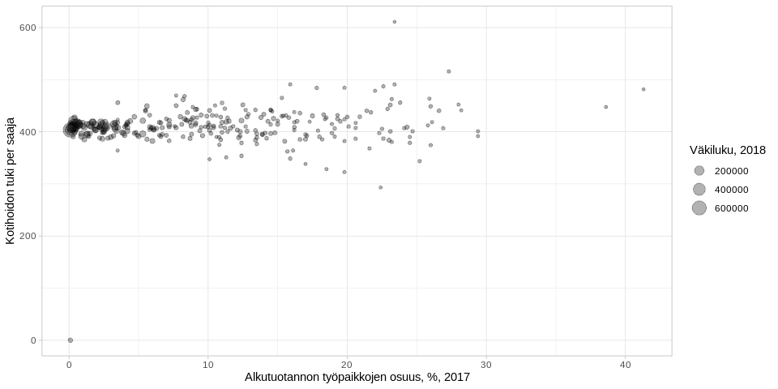

<table>
<thead>
<tr class="header">
<th style="text-align: left;">data</th>
<th style="text-align: left;">julkaistu</th>
<th style="text-align: left;">ylläpitäjä</th>
</tr>
</thead>
<tbody>
<tr class="odd">
<td style="text-align: left;"><a href='https://beta.avoindata.fi/data/fi/dataset/lastenhoidon-tukien-saajat-ja-maksetut-tuet'>Lastenhoidon tukien saajat ja maksetut tuet</a></td>
<td style="text-align: left;">2019-02-27</td>
<td style="text-align: left;"><a href='mailto:markus.kainu@kela.fi'>Markus Kainu</a></td>
</tr>
</tbody>
</table>

    library(dplyr)
    library(ggplot2)
    library(jsonlite)
    library(ckanr)
    library(readr)
    library(knitr)
    library(glue)
    library(tidyr)
    library(pxweb)

Resurssien lataaminen
---------------------

    ckanr_setup(url = "https://beta.avoindata.fi/data/fi/")
    x <- package_search(q = "Kansaneläkelaitos", fq = "title:lastenhoidon")
    resources <- x$results[[1]]$resources
    dat <- read_csv2(resources[[1]]$url) # Lataa data
    meta <- fromJSON(txt = resources[[2]]$url) # Lataa metadata

Datan ja metadatan kuvailu
--------------------------

**Datan kuvaustieto**

    meta$description %>% cat()

Lastenhoidon tukia tilastointiajanjakson aikana saaneet perheet ja
lapset, joista tukia on maksettu, maksetut tuet, keskimääräinen tuki
sekä yksityisen päivähoidon tuottajan perimä hoitomaksu kuukaudessa.
Lakisääteisten tukien lisäksi raportilta saa tiedot kuntien Kelan kautta
maksamista kuntalisistä. Aluetiedot voi valita raportille joko tuen
saajan asuinkunnan tai tuen maksaneen kunnan mukaan.Lastenhoidon tuilla
tarkoitetaan taloudellista tukea lasten hoidon järjestämiseksi.
Tukimuotoja ovat kotihoidon tuki, yksityisen hoidon tuki, osittainen
hoitoraha ja joustava hoitoraha.

**Datan muuttujatieto**

    meta$resources$schema$fields[[1]] %>% kable(format = "markdown")

<table>
<thead>
<tr class="header">
<th style="text-align: left;">name</th>
<th style="text-align: left;">type</th>
<th style="text-align: left;">format</th>
</tr>
</thead>
<tbody>
<tr class="odd">
<td style="text-align: left;">kuntanumero</td>
<td style="text-align: left;">integer</td>
<td style="text-align: left;">default</td>
</tr>
<tr class="even">
<td style="text-align: left;">kunta</td>
<td style="text-align: left;">string</td>
<td style="text-align: left;">default</td>
</tr>
<tr class="odd">
<td style="text-align: left;">aikajakso</td>
<td style="text-align: left;">string</td>
<td style="text-align: left;">default</td>
</tr>
<tr class="even">
<td style="text-align: left;">aika</td>
<td style="text-align: left;">integer</td>
<td style="text-align: left;">default</td>
</tr>
<tr class="odd">
<td style="text-align: left;">tukien_sisalto</td>
<td style="text-align: left;">string</td>
<td style="text-align: left;">default</td>
</tr>
<tr class="even">
<td style="text-align: left;">tukimuoto</td>
<td style="text-align: left;">string</td>
<td style="text-align: left;">default</td>
</tr>
<tr class="odd">
<td style="text-align: left;">sukupuoli</td>
<td style="text-align: left;">string</td>
<td style="text-align: left;">default</td>
</tr>
<tr class="even">
<td style="text-align: left;">saajat</td>
<td style="text-align: left;">integer</td>
<td style="text-align: left;">default</td>
</tr>
<tr class="odd">
<td style="text-align: left;">lapset</td>
<td style="text-align: left;">integer</td>
<td style="text-align: left;">default</td>
</tr>
<tr class="even">
<td style="text-align: left;">maksetut_etuudet_euroa</td>
<td style="text-align: left;">integer</td>
<td style="text-align: left;">default</td>
</tr>
<tr class="odd">
<td style="text-align: left;">tuki_per_saaja_e_kk</td>
<td style="text-align: left;">number</td>
<td style="text-align: left;">default</td>
</tr>
<tr class="even">
<td style="text-align: left;">tuki_per_lapsi_e_kk</td>
<td style="text-align: left;">number</td>
<td style="text-align: left;">default</td>
</tr>
<tr class="odd">
<td style="text-align: left;">hoitomaksu_per_saaja_e_kk</td>
<td style="text-align: left;">integer</td>
<td style="text-align: left;">default</td>
</tr>
<tr class="even">
<td style="text-align: left;">hoitomaksu_per_lapsi_e_kk</td>
<td style="text-align: left;">integer</td>
<td style="text-align: left;">default</td>
</tr>
</tbody>
</table>

**Datan ensimmäiset rivit**

    head(dat)  %>% kable(format = "markdown")

<table>
<colgroup>
<col style="width: 5%" />
<col style="width: 4%" />
<col style="width: 4%" />
<col style="width: 2%" />
<col style="width: 9%" />
<col style="width: 4%" />
<col style="width: 4%" />
<col style="width: 3%" />
<col style="width: 3%" />
<col style="width: 11%" />
<col style="width: 9%" />
<col style="width: 9%" />
<col style="width: 12%" />
<col style="width: 12%" />
</colgroup>
<thead>
<tr class="header">
<th style="text-align: right;">kuntanumero</th>
<th style="text-align: left;">kunta</th>
<th style="text-align: left;">aikajakso</th>
<th style="text-align: right;">aika</th>
<th style="text-align: left;">tukien_sisalto</th>
<th style="text-align: left;">tukimuoto</th>
<th style="text-align: left;">sukupuoli</th>
<th style="text-align: right;">saajat</th>
<th style="text-align: right;">lapset</th>
<th style="text-align: right;">maksetut_etuudet_euroa</th>
<th style="text-align: right;">tuki_per_saaja_e_kk</th>
<th style="text-align: right;">tuki_per_lapsi_e_kk</th>
<th style="text-align: right;">hoitomaksu_per_saaja_e_kk</th>
<th style="text-align: right;">hoitomaksu_per_lapsi_e_kk</th>
</tr>
</thead>
<tbody>
<tr class="odd">
<td style="text-align: right;">5</td>
<td style="text-align: left;">Alajärvi</td>
<td style="text-align: left;">vuosi</td>
<td style="text-align: right;">2007</td>
<td style="text-align: left;">Lakisääteiset tuet</td>
<td style="text-align: left;">Yhteensä</td>
<td style="text-align: left;">Yhteensä</td>
<td style="text-align: right;">263</td>
<td style="text-align: right;">472</td>
<td style="text-align: right;">697876</td>
<td style="text-align: right;">339.01</td>
<td style="text-align: right;">202.55</td>
<td style="text-align: right;">0.00</td>
<td style="text-align: right;">0.00</td>
</tr>
<tr class="even">
<td style="text-align: right;">5</td>
<td style="text-align: left;">Alajärvi</td>
<td style="text-align: left;">vuosi</td>
<td style="text-align: right;">2007</td>
<td style="text-align: left;">Lakisääteiset tuet</td>
<td style="text-align: left;">Yhteensä</td>
<td style="text-align: left;">Miehet</td>
<td style="text-align: right;">13</td>
<td style="text-align: right;">19</td>
<td style="text-align: right;">26416</td>
<td style="text-align: right;">345.00</td>
<td style="text-align: right;">258.75</td>
<td style="text-align: right;">0.00</td>
<td style="text-align: right;">0.00</td>
</tr>
<tr class="odd">
<td style="text-align: right;">5</td>
<td style="text-align: left;">Alajärvi</td>
<td style="text-align: left;">vuosi</td>
<td style="text-align: right;">2007</td>
<td style="text-align: left;">Lakisääteiset tuet</td>
<td style="text-align: left;">Yhteensä</td>
<td style="text-align: left;">Naiset</td>
<td style="text-align: right;">250</td>
<td style="text-align: right;">462</td>
<td style="text-align: right;">671459</td>
<td style="text-align: right;">338.88</td>
<td style="text-align: right;">201.58</td>
<td style="text-align: right;">0.00</td>
<td style="text-align: right;">0.00</td>
</tr>
<tr class="even">
<td style="text-align: right;">9</td>
<td style="text-align: left;">Alavieska</td>
<td style="text-align: left;">vuosi</td>
<td style="text-align: right;">2007</td>
<td style="text-align: left;">Lakisääteiset tuet</td>
<td style="text-align: left;">Yhteensä</td>
<td style="text-align: left;">Yhteensä</td>
<td style="text-align: right;">73</td>
<td style="text-align: right;">144</td>
<td style="text-align: right;">185966</td>
<td style="text-align: right;">336.63</td>
<td style="text-align: right;">180.94</td>
<td style="text-align: right;">350.75</td>
<td style="text-align: right;">350.75</td>
</tr>
<tr class="odd">
<td style="text-align: right;">9</td>
<td style="text-align: left;">Alavieska</td>
<td style="text-align: left;">vuosi</td>
<td style="text-align: right;">2007</td>
<td style="text-align: left;">Lakisääteiset tuet</td>
<td style="text-align: left;">Yhteensä</td>
<td style="text-align: left;">Miehet</td>
<td style="text-align: right;">5</td>
<td style="text-align: right;">8</td>
<td style="text-align: right;">5771</td>
<td style="text-align: right;">360.00</td>
<td style="text-align: right;">360.00</td>
<td style="text-align: right;">0.00</td>
<td style="text-align: right;">0.00</td>
</tr>
<tr class="even">
<td style="text-align: right;">9</td>
<td style="text-align: left;">Alavieska</td>
<td style="text-align: left;">vuosi</td>
<td style="text-align: right;">2007</td>
<td style="text-align: left;">Lakisääteiset tuet</td>
<td style="text-align: left;">Yhteensä</td>
<td style="text-align: left;">Naiset</td>
<td style="text-align: right;">68</td>
<td style="text-align: right;">137</td>
<td style="text-align: right;">180195</td>
<td style="text-align: right;">336.07</td>
<td style="text-align: right;">178.67</td>
<td style="text-align: right;">350.75</td>
<td style="text-align: right;">350.75</td>
</tr>
</tbody>
</table>

Kuvio
-----

    dat %>% 
      filter(aikajakso == "vuosi",
             aika == "2018",
             tukimuoto == "Kotihoidon tuki",
             tukien_sisalto == "Lakisääteiset tuet",
             sukupuoli == "Yhteensä") %>% 
      arrange(desc(tuki_per_saaja_e_kk)) %>% 
      slice(1:20) %>% 
      mutate(kunta = forcats::fct_reorder(kunta, tuki_per_saaja_e_kk)) %>% 
      ggplot(aes(x = kunta, y = tuki_per_saaja_e_kk, label = round(tuki_per_saaja_e_kk,1))) + 
      geom_col() + 
      coord_flip() + 
      theme_minimal() +
      geom_text(aes(y = 0), hjust = 0, color = "white") +
      labs(title = "Esimerkkikuvion esimerkkiotsikko")

Datan yhdistäminen Tilastokeskuksen kuntien avainlukuihin
---------------------------------------------------------

    # PXWEB query 
    pxweb_query_list <- 
      list("Alue 2018"=c("SSS","020","005","009","010","016","018","019","035","043","046","047","049","050","051","052","060","061","062","065","069","071","072","074","075","076","077","078","079","081","082","086","111","090","091","097","098","099","102","103","105","106","108","109","139","140","142","143","145","146","153","148","149","151","152","165","167","169","170","171","172","176","177","178","179","181","182","186","202","204","205","208","211","213","214","216","217","218","224","226","230","231","232","233","235","236","239","240","320","241","322","244","245","249","250","256","257","260","261","263","265","271","272","273","275","276","280","284","285","286","287","288","290","291","295","297","300","301","304","305","312","316","317","318","398","399","400","407","402","403","405","408","410","416","417","418","420","421","422","423","425","426","444","430","433","434","435","436","438","440","441","475","478","480","481","483","484","489","491","494","495","498","499","500","503","504","505","508","507","529","531","535","536","538","541","543","545","560","561","562","563","564","309","576","577","578","445","580","581","599","583","854","584","588","592","593","595","598","601","604","607","608","609","611","638","614","615","616","619","620","623","624","625","626","630","631","635","636","678","710","680","681","683","684","686","687","689","691","694","697","698","700","702","704","707","729","732","734","736","790","738","739","740","742","743","746","747","748","791","749","751","753","755","758","759","761","762","765","766","768","771","777","778","781","783","831","832","833","834","837","844","845","846","848","849","850","851","853","857","858","859","886","887","889","890","892","893","895","785","905","908","911","092","915","918","921","922","924","925","927","931","934","935","936","941","946","976","977","980","981","989","992","MK01","MK02","MK04","MK05","MK06","MK07","MK08","MK09","MK10","MK11","MK12","MK13","MK14","MK15","MK16","MK17","MK18","MK19","MK21","SK011","SK014","SK015","SK016","SK021","SK022","SK023","SK024","SK025","SK041","SK043","SK044","SK051","SK052","SK053","SK061","SK063","SK064","SK068","SK069","SK071","SK081","SK082","SK091","SK093","SK101","SK103","SK105","SK111","SK112","SK113","SK114","SK115","SK122","SK124","SK125","SK131","SK132","SK133","SK134","SK135","SK138","SK141","SK142","SK144","SK146","SK151","SK152","SK153","SK154","SK161","SK162","SK171","SK173","SK174","SK175","SK176","SK177","SK178","SK181","SK182","SK191","SK192","SK193","SK194","SK196","SK197","SK211","SK212","SK213","2020MK01","2020MK02","2020MK04","2020MK05","2020MK06","2020MK07","2020MK08","2020MK09","2020MK10","2020MK11","2020MK12","2020MK13","2020MK14","2020MK15","2020MK16","2020MK17","2020MK18","2020MK19","2020MK21","2020SK011","2020SK014","2020SK015","2020SK016","2020SK021","2020SK022","2020SK023","2020SK024","2020SK025","2020SK041","2020SK043","2020SK044","2020SK051","2020SK052","2020SK053","2020SK061","2020SK063","2020SK064","2020SK068","2020SK069","2020SK071","2020SK081","2020SK082","2020SK091","2020SK093","2020SK101","2020SK103","2020SK105","2020SK111","2020SK112","2020SK113","2020SK114","2020SK115","2020SK122","2020SK124","2020SK125","2020SK131","2020SK132","2020SK133","2020SK134","2020SK135","2020SK138","2020SK141","2020SK142","2020SK144","2020SK146","2020SK151","2020SK152","2020SK153","2020SK154","2020SK161","2020SK162","2020SK171","2020SK173","2020SK174","2020SK175","2020SK176","2020SK177","2020SK178","2020SK181","2020SK182","2020SK191","2020SK192","2020SK193","2020SK194","2020SK196","2020SK197","2020SK211","2020SK212","2020SK213"),
           "Tiedot"=c("M408","M411","M476","M391","M421","M478","M404","M410","M303","M297","M302","M44","M62","M70","M488","M486","M137","M140","M130","M162","M78","M485","M152","M72","M84","M106","M499","M496","M495","M497","M498"))

    # Download data 
    tk_lst <- 
      pxweb_get(url = "http://pxnet2.stat.fi/PXWeb/api/v1/fi/Kuntien_avainluvut/2018/kuntien_avainluvut_2018_viimeisin.px",
                query = pxweb_query_list)
    tk_avainluvut <- as.data.frame(tk_lst, column.name.type = "text", variable.value.type = "text") %>% 
      # levitetään data
      spread(key = Tiedot, value = `Kuntien avainluvut`)

    df <- left_join(dat, tk_avainluvut, by = c("kunta" = "Alue 2018"))
    # Piirretään hajontakuvio
    df2 <- df %>% 
      filter(aikajakso == "vuosi",
             aika == "2018",
             tukimuoto == "Kotihoidon tuki",
             tukien_sisalto == "Lakisääteiset tuet",
             sukupuoli == "Yhteensä")

    ggplot(df2, aes(x = `Alkutuotannon työpaikkojen osuus, %, 2016`, 
                    y = tuki_per_saaja_e_kk, 
                    size = `Väkiluku, 2017`)) + 
      geom_point(alpha = .3) +
      labs(y = "Kotihoidon tuki per saaja") + 
      theme_light()

Datastore-api
-------------

Jos et tarvitse koko aineistoa, voit suodattaa siitä osio SQL:llä
käyttäen CKAN:n DataStore-rajapintaa.

Alla olevassa esimerkissä tehdään rajaus `kunta`-muuttujasta ja siis
etsitään vaan kuntaa *Veteli* koskevat tiedot.

    kunta <- "Veteli"
    res <- ckanr::ds_search_sql(sql = glue("SELECT * from \"{resources[[1]]$id}\" WHERE kunta LIKE '{kunta}'"), as = "table")
    res$records %>% 
      select(-`_full_text`, -`_id`) %>% 
      kable(format = "markdown")

<table style="width:100%;">
<colgroup>
<col style="width: 4%" />
<col style="width: 7%" />
<col style="width: 6%" />
<col style="width: 15%" />
<col style="width: 6%" />
<col style="width: 16%" />
<col style="width: 4%" />
<col style="width: 3%" />
<col style="width: 15%" />
<col style="width: 15%" />
<col style="width: 4%" />
</colgroup>
<thead>
<tr class="header">
<th style="text-align: left;">kunta</th>
<th style="text-align: left;">kuntanumero</th>
<th style="text-align: left;">sukupuoli</th>
<th style="text-align: left;">lapsilisat_euroa_lapsi</th>
<th style="text-align: left;">aikajakso</th>
<th style="text-align: left;">perhetyyppi</th>
<th style="text-align: left;">saajat</th>
<th style="text-align: left;">aika</th>
<th style="text-align: left;">lapsilisat_euroa_perhe</th>
<th style="text-align: left;">maksetut_etuudet_euroa</th>
<th style="text-align: left;">lapset</th>
</tr>
</thead>
<tbody>
<tr class="odd">
<td style="text-align: left;">Veteli</td>
<td style="text-align: left;">924</td>
<td style="text-align: left;">Yhteensä</td>
<td style="text-align: left;">1258,81</td>
<td style="text-align: left;">vuosi</td>
<td style="text-align: left;">Yhteensä</td>
<td style="text-align: left;">362</td>
<td style="text-align: left;">2008</td>
<td style="text-align: left;">2385,12</td>
<td style="text-align: left;">362</td>
<td style="text-align: left;">685</td>
</tr>
<tr class="even">
<td style="text-align: left;">Veteli</td>
<td style="text-align: left;">924</td>
<td style="text-align: left;">Yhteensä</td>
<td style="text-align: left;">1427,01</td>
<td style="text-align: left;">vuosi</td>
<td style="text-align: left;">Yhden vanhemman perheet</td>
<td style="text-align: left;">39</td>
<td style="text-align: left;">2008</td>
<td style="text-align: left;">2634,48</td>
<td style="text-align: left;">39</td>
<td style="text-align: left;">72</td>
</tr>
<tr class="odd">
<td style="text-align: left;">Veteli</td>
<td style="text-align: left;">924</td>
<td style="text-align: left;">Yhteensä</td>
<td style="text-align: left;">1205,54</td>
<td style="text-align: left;">vuosi</td>
<td style="text-align: left;">Kahden vanhemman perheet</td>
<td style="text-align: left;">333</td>
<td style="text-align: left;">2008</td>
<td style="text-align: left;">2283,98</td>
<td style="text-align: left;">333</td>
<td style="text-align: left;">630</td>
</tr>
<tr class="even">
<td style="text-align: left;">Veteli</td>
<td style="text-align: left;">924</td>
<td style="text-align: left;">Miehet</td>
<td style="text-align: left;">1388,14</td>
<td style="text-align: left;">vuosi</td>
<td style="text-align: left;">Yhteensä</td>
<td style="text-align: left;">8</td>
<td style="text-align: left;">2008</td>
<td style="text-align: left;">2429,25</td>
<td style="text-align: left;">8</td>
<td style="text-align: left;">14</td>
</tr>
<tr class="odd">
<td style="text-align: left;">Veteli</td>
<td style="text-align: left;">924</td>
<td style="text-align: left;">Miehet</td>
<td style="text-align: left;">1477,83</td>
<td style="text-align: left;">vuosi</td>
<td style="text-align: left;">Yhden vanhemman perheet</td>
<td style="text-align: left;">6</td>
<td style="text-align: left;">2008</td>
<td style="text-align: left;">2955,67</td>
<td style="text-align: left;">6</td>
<td style="text-align: left;">12</td>
</tr>
<tr class="even">
<td style="text-align: left;">Veteli</td>
<td style="text-align: left;">924</td>
<td style="text-align: left;">Miehet</td>
<td style="text-align: left;">NA</td>
<td style="text-align: left;">vuosi</td>
<td style="text-align: left;">Kahden vanhemman perheet</td>
<td style="text-align: left;">NA</td>
<td style="text-align: left;">2008</td>
<td style="text-align: left;">NA</td>
<td style="text-align: left;">NA</td>
<td style="text-align: left;">NA</td>
</tr>
<tr class="odd">
<td style="text-align: left;">Veteli</td>
<td style="text-align: left;">924</td>
<td style="text-align: left;">Naiset</td>
<td style="text-align: left;">1256,11</td>
<td style="text-align: left;">vuosi</td>
<td style="text-align: left;">Yhteensä</td>
<td style="text-align: left;">354</td>
<td style="text-align: left;">2008</td>
<td style="text-align: left;">2384,12</td>
<td style="text-align: left;">354</td>
<td style="text-align: left;">671</td>
</tr>
<tr class="even">
<td style="text-align: left;">Veteli</td>
<td style="text-align: left;">924</td>
<td style="text-align: left;">Naiset</td>
<td style="text-align: left;">1416,84</td>
<td style="text-align: left;">vuosi</td>
<td style="text-align: left;">Yhden vanhemman perheet</td>
<td style="text-align: left;">33</td>
<td style="text-align: left;">2008</td>
<td style="text-align: left;">2576,08</td>
<td style="text-align: left;">33</td>
<td style="text-align: left;">60</td>
</tr>
<tr class="odd">
<td style="text-align: left;">Veteli</td>
<td style="text-align: left;">924</td>
<td style="text-align: left;">Naiset</td>
<td style="text-align: left;">1206,67</td>
<td style="text-align: left;">vuosi</td>
<td style="text-align: left;">Kahden vanhemman perheet</td>
<td style="text-align: left;">331</td>
<td style="text-align: left;">2008</td>
<td style="text-align: left;">2292,67</td>
<td style="text-align: left;">331</td>
<td style="text-align: left;">628</td>
</tr>
<tr class="even">
<td style="text-align: left;">Veteli</td>
<td style="text-align: left;">924</td>
<td style="text-align: left;">Yhteensä</td>
<td style="text-align: left;">1274,02</td>
<td style="text-align: left;">vuosi</td>
<td style="text-align: left;">Yhteensä</td>
<td style="text-align: left;">361</td>
<td style="text-align: left;">2009</td>
<td style="text-align: left;">2410,40</td>
<td style="text-align: left;">361</td>
<td style="text-align: left;">683</td>
</tr>
<tr class="odd">
<td style="text-align: left;">Veteli</td>
<td style="text-align: left;">924</td>
<td style="text-align: left;">Yhteensä</td>
<td style="text-align: left;">1516,58</td>
<td style="text-align: left;">vuosi</td>
<td style="text-align: left;">Yhden vanhemman perheet</td>
<td style="text-align: left;">38</td>
<td style="text-align: left;">2009</td>
<td style="text-align: left;">2713,87</td>
<td style="text-align: left;">38</td>
<td style="text-align: left;">68</td>
</tr>
<tr class="even">
<td style="text-align: left;">Veteli</td>
<td style="text-align: left;">924</td>
<td style="text-align: left;">Yhteensä</td>
<td style="text-align: left;">1215,57</td>
<td style="text-align: left;">vuosi</td>
<td style="text-align: left;">Kahden vanhemman perheet</td>
<td style="text-align: left;">333</td>
<td style="text-align: left;">2009</td>
<td style="text-align: left;">2303,38</td>
<td style="text-align: left;">333</td>
<td style="text-align: left;">631</td>
</tr>
<tr class="odd">
<td style="text-align: left;">Veteli</td>
<td style="text-align: left;">924</td>
<td style="text-align: left;">Miehet</td>
<td style="text-align: left;">1216,03</td>
<td style="text-align: left;">vuosi</td>
<td style="text-align: left;">Yhteensä</td>
<td style="text-align: left;">11</td>
<td style="text-align: left;">2009</td>
<td style="text-align: left;">1989,87</td>
<td style="text-align: left;">11</td>
<td style="text-align: left;">18</td>
</tr>
<tr class="even">
<td style="text-align: left;">Veteli</td>
<td style="text-align: left;">924</td>
<td style="text-align: left;">Miehet</td>
<td style="text-align: left;">1393,26</td>
<td style="text-align: left;">vuosi</td>
<td style="text-align: left;">Yhden vanhemman perheet</td>
<td style="text-align: left;">8</td>
<td style="text-align: left;">2009</td>
<td style="text-align: left;">2438,20</td>
<td style="text-align: left;">8</td>
<td style="text-align: left;">14</td>
</tr>
<tr class="odd">
<td style="text-align: left;">Veteli</td>
<td style="text-align: left;">924</td>
<td style="text-align: left;">Miehet</td>
<td style="text-align: left;">340,43</td>
<td style="text-align: left;">vuosi</td>
<td style="text-align: left;">Kahden vanhemman perheet</td>
<td style="text-align: left;">4</td>
<td style="text-align: left;">2009</td>
<td style="text-align: left;">595,75</td>
<td style="text-align: left;">4</td>
<td style="text-align: left;">7</td>
</tr>
<tr class="even">
<td style="text-align: left;">Veteli</td>
<td style="text-align: left;">924</td>
<td style="text-align: left;">Naiset</td>
<td style="text-align: left;">1267,96</td>
<td style="text-align: left;">vuosi</td>
<td style="text-align: left;">Yhteensä</td>
<td style="text-align: left;">350</td>
<td style="text-align: left;">2009</td>
<td style="text-align: left;">2423,62</td>
<td style="text-align: left;">350</td>
<td style="text-align: left;">669</td>
</tr>
<tr class="odd">
<td style="text-align: left;">Veteli</td>
<td style="text-align: left;">924</td>
<td style="text-align: left;">Naiset</td>
<td style="text-align: left;">1548,55</td>
<td style="text-align: left;">vuosi</td>
<td style="text-align: left;">Yhden vanhemman perheet</td>
<td style="text-align: left;">30</td>
<td style="text-align: left;">2009</td>
<td style="text-align: left;">2787,39</td>
<td style="text-align: left;">30</td>
<td style="text-align: left;">54</td>
</tr>
<tr class="even">
<td style="text-align: left;">Veteli</td>
<td style="text-align: left;">924</td>
<td style="text-align: left;">Naiset</td>
<td style="text-align: left;">1217,59</td>
<td style="text-align: left;">vuosi</td>
<td style="text-align: left;">Kahden vanhemman perheet</td>
<td style="text-align: left;">329</td>
<td style="text-align: left;">2009</td>
<td style="text-align: left;">2324,15</td>
<td style="text-align: left;">329</td>
<td style="text-align: left;">628</td>
</tr>
<tr class="odd">
<td style="text-align: left;">Veteli</td>
<td style="text-align: left;">924</td>
<td style="text-align: left;">Yhteensä</td>
<td style="text-align: left;">1308,52</td>
<td style="text-align: left;">vuosi</td>
<td style="text-align: left;">Yhteensä</td>
<td style="text-align: left;">354</td>
<td style="text-align: left;">2010</td>
<td style="text-align: left;">2517,24</td>
<td style="text-align: left;">354</td>
<td style="text-align: left;">681</td>
</tr>
<tr class="even">
<td style="text-align: left;">Veteli</td>
<td style="text-align: left;">924</td>
<td style="text-align: left;">Yhteensä</td>
<td style="text-align: left;">1460,62</td>
<td style="text-align: left;">vuosi</td>
<td style="text-align: left;">Yhden vanhemman perheet</td>
<td style="text-align: left;">40</td>
<td style="text-align: left;">2010</td>
<td style="text-align: left;">2665,64</td>
<td style="text-align: left;">40</td>
<td style="text-align: left;">73</td>
</tr>
<tr class="odd">
<td style="text-align: left;">Veteli</td>
<td style="text-align: left;">924</td>
<td style="text-align: left;">Yhteensä</td>
<td style="text-align: left;">1241,26</td>
<td style="text-align: left;">vuosi</td>
<td style="text-align: left;">Kahden vanhemman perheet</td>
<td style="text-align: left;">327</td>
<td style="text-align: left;">2010</td>
<td style="text-align: left;">2399,02</td>
<td style="text-align: left;">327</td>
<td style="text-align: left;">632</td>
</tr>
<tr class="even">
<td style="text-align: left;">Veteli</td>
<td style="text-align: left;">924</td>
<td style="text-align: left;">Miehet</td>
<td style="text-align: left;">1432,11</td>
<td style="text-align: left;">vuosi</td>
<td style="text-align: left;">Yhteensä</td>
<td style="text-align: left;">12</td>
<td style="text-align: left;">2010</td>
<td style="text-align: left;">2148,16</td>
<td style="text-align: left;">12</td>
<td style="text-align: left;">18</td>
</tr>
<tr class="odd">
<td style="text-align: left;">Veteli</td>
<td style="text-align: left;">924</td>
<td style="text-align: left;">Miehet</td>
<td style="text-align: left;">1520,16</td>
<td style="text-align: left;">vuosi</td>
<td style="text-align: left;">Yhden vanhemman perheet</td>
<td style="text-align: left;">8</td>
<td style="text-align: left;">2010</td>
<td style="text-align: left;">2280,24</td>
<td style="text-align: left;">8</td>
<td style="text-align: left;">12</td>
</tr>
<tr class="even">
<td style="text-align: left;">Veteli</td>
<td style="text-align: left;">924</td>
<td style="text-align: left;">Miehet</td>
<td style="text-align: left;">1076,57</td>
<td style="text-align: left;">vuosi</td>
<td style="text-align: left;">Kahden vanhemman perheet</td>
<td style="text-align: left;">5</td>
<td style="text-align: left;">2010</td>
<td style="text-align: left;">1507,20</td>
<td style="text-align: left;">5</td>
<td style="text-align: left;">7</td>
</tr>
<tr class="odd">
<td style="text-align: left;">Veteli</td>
<td style="text-align: left;">924</td>
<td style="text-align: left;">Naiset</td>
<td style="text-align: left;">1303,20</td>
<td style="text-align: left;">vuosi</td>
<td style="text-align: left;">Yhteensä</td>
<td style="text-align: left;">342</td>
<td style="text-align: left;">2010</td>
<td style="text-align: left;">2530,19</td>
<td style="text-align: left;">342</td>
<td style="text-align: left;">664</td>
</tr>
<tr class="even">
<td style="text-align: left;">Veteli</td>
<td style="text-align: left;">924</td>
<td style="text-align: left;">Naiset</td>
<td style="text-align: left;">1448,91</td>
<td style="text-align: left;">vuosi</td>
<td style="text-align: left;">Yhden vanhemman perheet</td>
<td style="text-align: left;">32</td>
<td style="text-align: left;">2010</td>
<td style="text-align: left;">2761,98</td>
<td style="text-align: left;">32</td>
<td style="text-align: left;">61</td>
</tr>
<tr class="odd">
<td style="text-align: left;">Veteli</td>
<td style="text-align: left;">924</td>
<td style="text-align: left;">Naiset</td>
<td style="text-align: left;">1243,11</td>
<td style="text-align: left;">vuosi</td>
<td style="text-align: left;">Kahden vanhemman perheet</td>
<td style="text-align: left;">322</td>
<td style="text-align: left;">2010</td>
<td style="text-align: left;">2412,86</td>
<td style="text-align: left;">322</td>
<td style="text-align: left;">625</td>
</tr>
<tr class="even">
<td style="text-align: left;">Veteli</td>
<td style="text-align: left;">924</td>
<td style="text-align: left;">Yhteensä</td>
<td style="text-align: left;">1310,90</td>
<td style="text-align: left;">vuosi</td>
<td style="text-align: left;">Yhteensä</td>
<td style="text-align: left;">344</td>
<td style="text-align: left;">2011</td>
<td style="text-align: left;">2557,02</td>
<td style="text-align: left;">344</td>
<td style="text-align: left;">671</td>
</tr>
<tr class="odd">
<td style="text-align: left;">Veteli</td>
<td style="text-align: left;">924</td>
<td style="text-align: left;">Yhteensä</td>
<td style="text-align: left;">1616,10</td>
<td style="text-align: left;">vuosi</td>
<td style="text-align: left;">Yhden vanhemman perheet</td>
<td style="text-align: left;">36</td>
<td style="text-align: left;">2011</td>
<td style="text-align: left;">2828,17</td>
<td style="text-align: left;">36</td>
<td style="text-align: left;">63</td>
</tr>
<tr class="even">
<td style="text-align: left;">Veteli</td>
<td style="text-align: left;">924</td>
<td style="text-align: left;">Yhteensä</td>
<td style="text-align: left;">1256,55</td>
<td style="text-align: left;">vuosi</td>
<td style="text-align: left;">Kahden vanhemman perheet</td>
<td style="text-align: left;">315</td>
<td style="text-align: left;">2011</td>
<td style="text-align: left;">2469,21</td>
<td style="text-align: left;">315</td>
<td style="text-align: left;">619</td>
</tr>
<tr class="odd">
<td style="text-align: left;">Veteli</td>
<td style="text-align: left;">924</td>
<td style="text-align: left;">Miehet</td>
<td style="text-align: left;">1371,61</td>
<td style="text-align: left;">vuosi</td>
<td style="text-align: left;">Yhteensä</td>
<td style="text-align: left;">12</td>
<td style="text-align: left;">2011</td>
<td style="text-align: left;">2057,41</td>
<td style="text-align: left;">12</td>
<td style="text-align: left;">18</td>
</tr>
<tr class="even">
<td style="text-align: left;">Veteli</td>
<td style="text-align: left;">924</td>
<td style="text-align: left;">Miehet</td>
<td style="text-align: left;">1437,21</td>
<td style="text-align: left;">vuosi</td>
<td style="text-align: left;">Yhden vanhemman perheet</td>
<td style="text-align: left;">8</td>
<td style="text-align: left;">2011</td>
<td style="text-align: left;">2155,81</td>
<td style="text-align: left;">8</td>
<td style="text-align: left;">12</td>
</tr>
<tr class="odd">
<td style="text-align: left;">Veteli</td>
<td style="text-align: left;">924</td>
<td style="text-align: left;">Miehet</td>
<td style="text-align: left;">1240,40</td>
<td style="text-align: left;">vuosi</td>
<td style="text-align: left;">Kahden vanhemman perheet</td>
<td style="text-align: left;">4</td>
<td style="text-align: left;">2011</td>
<td style="text-align: left;">1860,60</td>
<td style="text-align: left;">4</td>
<td style="text-align: left;">6</td>
</tr>
<tr class="even">
<td style="text-align: left;">Veteli</td>
<td style="text-align: left;">924</td>
<td style="text-align: left;">Naiset</td>
<td style="text-align: left;">1307,23</td>
<td style="text-align: left;">vuosi</td>
<td style="text-align: left;">Yhteensä</td>
<td style="text-align: left;">332</td>
<td style="text-align: left;">2011</td>
<td style="text-align: left;">2575,08</td>
<td style="text-align: left;">332</td>
<td style="text-align: left;">654</td>
</tr>
<tr class="odd">
<td style="text-align: left;">Veteli</td>
<td style="text-align: left;">924</td>
<td style="text-align: left;">Naiset</td>
<td style="text-align: left;">1626,30</td>
<td style="text-align: left;">vuosi</td>
<td style="text-align: left;">Yhden vanhemman perheet</td>
<td style="text-align: left;">28</td>
<td style="text-align: left;">2011</td>
<td style="text-align: left;">3020,27</td>
<td style="text-align: left;">28</td>
<td style="text-align: left;">52</td>
</tr>
<tr class="even">
<td style="text-align: left;">Veteli</td>
<td style="text-align: left;">924</td>
<td style="text-align: left;">Naiset</td>
<td style="text-align: left;">1256,70</td>
<td style="text-align: left;">vuosi</td>
<td style="text-align: left;">Kahden vanhemman perheet</td>
<td style="text-align: left;">311</td>
<td style="text-align: left;">2011</td>
<td style="text-align: left;">2477,04</td>
<td style="text-align: left;">311</td>
<td style="text-align: left;">613</td>
</tr>
<tr class="odd">
<td style="text-align: left;">Veteli</td>
<td style="text-align: left;">924</td>
<td style="text-align: left;">Yhteensä</td>
<td style="text-align: left;">1350,69</td>
<td style="text-align: left;">vuosi</td>
<td style="text-align: left;">Yhteensä</td>
<td style="text-align: left;">327</td>
<td style="text-align: left;">2012</td>
<td style="text-align: left;">2709,65</td>
<td style="text-align: left;">327</td>
<td style="text-align: left;">656</td>
</tr>
<tr class="even">
<td style="text-align: left;">Veteli</td>
<td style="text-align: left;">924</td>
<td style="text-align: left;">Yhteensä</td>
<td style="text-align: left;">1719,80</td>
<td style="text-align: left;">vuosi</td>
<td style="text-align: left;">Yhden vanhemman perheet</td>
<td style="text-align: left;">35</td>
<td style="text-align: left;">2012</td>
<td style="text-align: left;">2933,78</td>
<td style="text-align: left;">35</td>
<td style="text-align: left;">59</td>
</tr>
<tr class="odd">
<td style="text-align: left;">Veteli</td>
<td style="text-align: left;">924</td>
<td style="text-align: left;">Yhteensä</td>
<td style="text-align: left;">1295,40</td>
<td style="text-align: left;">vuosi</td>
<td style="text-align: left;">Kahden vanhemman perheet</td>
<td style="text-align: left;">299</td>
<td style="text-align: left;">2012</td>
<td style="text-align: left;">2629,78</td>
<td style="text-align: left;">299</td>
<td style="text-align: left;">607</td>
</tr>
<tr class="even">
<td style="text-align: left;">Veteli</td>
<td style="text-align: left;">924</td>
<td style="text-align: left;">Miehet</td>
<td style="text-align: left;">1675,27</td>
<td style="text-align: left;">vuosi</td>
<td style="text-align: left;">Yhteensä</td>
<td style="text-align: left;">8</td>
<td style="text-align: left;">2012</td>
<td style="text-align: left;">2931,72</td>
<td style="text-align: left;">8</td>
<td style="text-align: left;">14</td>
</tr>
<tr class="odd">
<td style="text-align: left;">Veteli</td>
<td style="text-align: left;">924</td>
<td style="text-align: left;">Miehet</td>
<td style="text-align: left;">1791,78</td>
<td style="text-align: left;">vuosi</td>
<td style="text-align: left;">Yhden vanhemman perheet</td>
<td style="text-align: left;">6</td>
<td style="text-align: left;">2012</td>
<td style="text-align: left;">2687,68</td>
<td style="text-align: left;">6</td>
<td style="text-align: left;">9</td>
</tr>
<tr class="even">
<td style="text-align: left;">Veteli</td>
<td style="text-align: left;">924</td>
<td style="text-align: left;">Miehet</td>
<td style="text-align: left;">NA</td>
<td style="text-align: left;">vuosi</td>
<td style="text-align: left;">Kahden vanhemman perheet</td>
<td style="text-align: left;">NA</td>
<td style="text-align: left;">2012</td>
<td style="text-align: left;">NA</td>
<td style="text-align: left;">NA</td>
<td style="text-align: left;">NA</td>
</tr>
<tr class="odd">
<td style="text-align: left;">Veteli</td>
<td style="text-align: left;">924</td>
<td style="text-align: left;">Naiset</td>
<td style="text-align: left;">1343,61</td>
<td style="text-align: left;">vuosi</td>
<td style="text-align: left;">Yhteensä</td>
<td style="text-align: left;">319</td>
<td style="text-align: left;">2012</td>
<td style="text-align: left;">2704,08</td>
<td style="text-align: left;">319</td>
<td style="text-align: left;">642</td>
</tr>
<tr class="even">
<td style="text-align: left;">Veteli</td>
<td style="text-align: left;">924</td>
<td style="text-align: left;">Naiset</td>
<td style="text-align: left;">1706,58</td>
<td style="text-align: left;">vuosi</td>
<td style="text-align: left;">Yhden vanhemman perheet</td>
<td style="text-align: left;">29</td>
<td style="text-align: left;">2012</td>
<td style="text-align: left;">2986,52</td>
<td style="text-align: left;">29</td>
<td style="text-align: left;">50</td>
</tr>
<tr class="odd">
<td style="text-align: left;">Veteli</td>
<td style="text-align: left;">924</td>
<td style="text-align: left;">Naiset</td>
<td style="text-align: left;">1293,98</td>
<td style="text-align: left;">vuosi</td>
<td style="text-align: left;">Kahden vanhemman perheet</td>
<td style="text-align: left;">297</td>
<td style="text-align: left;">2012</td>
<td style="text-align: left;">2622,82</td>
<td style="text-align: left;">297</td>
<td style="text-align: left;">602</td>
</tr>
<tr class="even">
<td style="text-align: left;">Veteli</td>
<td style="text-align: left;">924</td>
<td style="text-align: left;">Yhteensä</td>
<td style="text-align: left;">1354,85</td>
<td style="text-align: left;">vuosi</td>
<td style="text-align: left;">Yhteensä</td>
<td style="text-align: left;">316</td>
<td style="text-align: left;">2013</td>
<td style="text-align: left;">2739,71</td>
<td style="text-align: left;">316</td>
<td style="text-align: left;">639</td>
</tr>
<tr class="odd">
<td style="text-align: left;">Veteli</td>
<td style="text-align: left;">924</td>
<td style="text-align: left;">Yhteensä</td>
<td style="text-align: left;">1782,60</td>
<td style="text-align: left;">vuosi</td>
<td style="text-align: left;">Yhden vanhemman perheet</td>
<td style="text-align: left;">33</td>
<td style="text-align: left;">2013</td>
<td style="text-align: left;">3175,25</td>
<td style="text-align: left;">33</td>
<td style="text-align: left;">58</td>
</tr>
<tr class="even">
<td style="text-align: left;">Veteli</td>
<td style="text-align: left;">924</td>
<td style="text-align: left;">Yhteensä</td>
<td style="text-align: left;">1288,60</td>
<td style="text-align: left;">vuosi</td>
<td style="text-align: left;">Kahden vanhemman perheet</td>
<td style="text-align: left;">291</td>
<td style="text-align: left;">2013</td>
<td style="text-align: left;">2625,91</td>
<td style="text-align: left;">291</td>
<td style="text-align: left;">593</td>
</tr>
<tr class="odd">
<td style="text-align: left;">Veteli</td>
<td style="text-align: left;">924</td>
<td style="text-align: left;">Miehet</td>
<td style="text-align: left;">1493,65</td>
<td style="text-align: left;">vuosi</td>
<td style="text-align: left;">Yhteensä</td>
<td style="text-align: left;">9</td>
<td style="text-align: left;">2013</td>
<td style="text-align: left;">2821,34</td>
<td style="text-align: left;">9</td>
<td style="text-align: left;">17</td>
</tr>
<tr class="even">
<td style="text-align: left;">Veteli</td>
<td style="text-align: left;">924</td>
<td style="text-align: left;">Miehet</td>
<td style="text-align: left;">1554,75</td>
<td style="text-align: left;">vuosi</td>
<td style="text-align: left;">Yhden vanhemman perheet</td>
<td style="text-align: left;">5</td>
<td style="text-align: left;">2013</td>
<td style="text-align: left;">2487,60</td>
<td style="text-align: left;">5</td>
<td style="text-align: left;">8</td>
</tr>
<tr class="odd">
<td style="text-align: left;">Veteli</td>
<td style="text-align: left;">924</td>
<td style="text-align: left;">Miehet</td>
<td style="text-align: left;">1439,34</td>
<td style="text-align: left;">vuosi</td>
<td style="text-align: left;">Kahden vanhemman perheet</td>
<td style="text-align: left;">4</td>
<td style="text-align: left;">2013</td>
<td style="text-align: left;">3238,52</td>
<td style="text-align: left;">4</td>
<td style="text-align: left;">9</td>
</tr>
<tr class="even">
<td style="text-align: left;">Veteli</td>
<td style="text-align: left;">924</td>
<td style="text-align: left;">Naiset</td>
<td style="text-align: left;">1351,05</td>
<td style="text-align: left;">vuosi</td>
<td style="text-align: left;">Yhteensä</td>
<td style="text-align: left;">307</td>
<td style="text-align: left;">2013</td>
<td style="text-align: left;">2737,32</td>
<td style="text-align: left;">307</td>
<td style="text-align: left;">622</td>
</tr>
<tr class="odd">
<td style="text-align: left;">Veteli</td>
<td style="text-align: left;">924</td>
<td style="text-align: left;">Naiset</td>
<td style="text-align: left;">1819,80</td>
<td style="text-align: left;">vuosi</td>
<td style="text-align: left;">Yhden vanhemman perheet</td>
<td style="text-align: left;">28</td>
<td style="text-align: left;">2013</td>
<td style="text-align: left;">3302,60</td>
<td style="text-align: left;">28</td>
<td style="text-align: left;">50</td>
</tr>
<tr class="even">
<td style="text-align: left;">Veteli</td>
<td style="text-align: left;">924</td>
<td style="text-align: left;">Naiset</td>
<td style="text-align: left;">1286,28</td>
<td style="text-align: left;">vuosi</td>
<td style="text-align: left;">Kahden vanhemman perheet</td>
<td style="text-align: left;">287</td>
<td style="text-align: left;">2013</td>
<td style="text-align: left;">2617,37</td>
<td style="text-align: left;">287</td>
<td style="text-align: left;">584</td>
</tr>
<tr class="odd">
<td style="text-align: left;">Veteli</td>
<td style="text-align: left;">924</td>
<td style="text-align: left;">Yhteensä</td>
<td style="text-align: left;">1379,37</td>
<td style="text-align: left;">vuosi</td>
<td style="text-align: left;">Yhteensä</td>
<td style="text-align: left;">313</td>
<td style="text-align: left;">2014</td>
<td style="text-align: left;">2824,84</td>
<td style="text-align: left;">313</td>
<td style="text-align: left;">641</td>
</tr>
<tr class="even">
<td style="text-align: left;">Veteli</td>
<td style="text-align: left;">924</td>
<td style="text-align: left;">Yhteensä</td>
<td style="text-align: left;">1789,18</td>
<td style="text-align: left;">vuosi</td>
<td style="text-align: left;">Yhden vanhemman perheet</td>
<td style="text-align: left;">35</td>
<td style="text-align: left;">2014</td>
<td style="text-align: left;">2964,93</td>
<td style="text-align: left;">35</td>
<td style="text-align: left;">58</td>
</tr>
<tr class="odd">
<td style="text-align: left;">Veteli</td>
<td style="text-align: left;">924</td>
<td style="text-align: left;">Yhteensä</td>
<td style="text-align: left;">1318,25</td>
<td style="text-align: left;">vuosi</td>
<td style="text-align: left;">Kahden vanhemman perheet</td>
<td style="text-align: left;">283</td>
<td style="text-align: left;">2014</td>
<td style="text-align: left;">2757,60</td>
<td style="text-align: left;">283</td>
<td style="text-align: left;">592</td>
</tr>
<tr class="even">
<td style="text-align: left;">Veteli</td>
<td style="text-align: left;">924</td>
<td style="text-align: left;">Miehet</td>
<td style="text-align: left;">1446,36</td>
<td style="text-align: left;">vuosi</td>
<td style="text-align: left;">Yhteensä</td>
<td style="text-align: left;">12</td>
<td style="text-align: left;">2014</td>
<td style="text-align: left;">2290,07</td>
<td style="text-align: left;">12</td>
<td style="text-align: left;">19</td>
</tr>
<tr class="odd">
<td style="text-align: left;">Veteli</td>
<td style="text-align: left;">924</td>
<td style="text-align: left;">Miehet</td>
<td style="text-align: left;">1688,93</td>
<td style="text-align: left;">vuosi</td>
<td style="text-align: left;">Yhden vanhemman perheet</td>
<td style="text-align: left;">8</td>
<td style="text-align: left;">2014</td>
<td style="text-align: left;">2111,17</td>
<td style="text-align: left;">8</td>
<td style="text-align: left;">10</td>
</tr>
<tr class="even">
<td style="text-align: left;">Veteli</td>
<td style="text-align: left;">924</td>
<td style="text-align: left;">Miehet</td>
<td style="text-align: left;">1176,84</td>
<td style="text-align: left;">vuosi</td>
<td style="text-align: left;">Kahden vanhemman perheet</td>
<td style="text-align: left;">4</td>
<td style="text-align: left;">2014</td>
<td style="text-align: left;">2647,88</td>
<td style="text-align: left;">4</td>
<td style="text-align: left;">9</td>
</tr>
<tr class="odd">
<td style="text-align: left;">Veteli</td>
<td style="text-align: left;">924</td>
<td style="text-align: left;">Naiset</td>
<td style="text-align: left;">1372,91</td>
<td style="text-align: left;">vuosi</td>
<td style="text-align: left;">Yhteensä</td>
<td style="text-align: left;">301</td>
<td style="text-align: left;">2014</td>
<td style="text-align: left;">2846,16</td>
<td style="text-align: left;">301</td>
<td style="text-align: left;">624</td>
</tr>
<tr class="even">
<td style="text-align: left;">Veteli</td>
<td style="text-align: left;">924</td>
<td style="text-align: left;">Naiset</td>
<td style="text-align: left;">1737,67</td>
<td style="text-align: left;">vuosi</td>
<td style="text-align: left;">Yhden vanhemman perheet</td>
<td style="text-align: left;">27</td>
<td style="text-align: left;">2014</td>
<td style="text-align: left;">3217,90</td>
<td style="text-align: left;">27</td>
<td style="text-align: left;">50</td>
</tr>
<tr class="odd">
<td style="text-align: left;">Veteli</td>
<td style="text-align: left;">924</td>
<td style="text-align: left;">Naiset</td>
<td style="text-align: left;">1320,43</td>
<td style="text-align: left;">vuosi</td>
<td style="text-align: left;">Kahden vanhemman perheet</td>
<td style="text-align: left;">279</td>
<td style="text-align: left;">2014</td>
<td style="text-align: left;">2759,18</td>
<td style="text-align: left;">279</td>
<td style="text-align: left;">583</td>
</tr>
<tr class="even">
<td style="text-align: left;">Veteli</td>
<td style="text-align: left;">924</td>
<td style="text-align: left;">Yhteensä</td>
<td style="text-align: left;">1285,80</td>
<td style="text-align: left;">vuosi</td>
<td style="text-align: left;">Yhteensä</td>
<td style="text-align: left;">310</td>
<td style="text-align: left;">2015</td>
<td style="text-align: left;">2629,67</td>
<td style="text-align: left;">310</td>
<td style="text-align: left;">634</td>
</tr>
<tr class="odd">
<td style="text-align: left;">Veteli</td>
<td style="text-align: left;">924</td>
<td style="text-align: left;">Yhteensä</td>
<td style="text-align: left;">1546,74</td>
<td style="text-align: left;">vuosi</td>
<td style="text-align: left;">Yhden vanhemman perheet</td>
<td style="text-align: left;">36</td>
<td style="text-align: left;">2015</td>
<td style="text-align: left;">2577,90</td>
<td style="text-align: left;">36</td>
<td style="text-align: left;">60</td>
</tr>
<tr class="even">
<td style="text-align: left;">Veteli</td>
<td style="text-align: left;">924</td>
<td style="text-align: left;">Yhteensä</td>
<td style="text-align: left;">1224,40</td>
<td style="text-align: left;">vuosi</td>
<td style="text-align: left;">Kahden vanhemman perheet</td>
<td style="text-align: left;">282</td>
<td style="text-align: left;">2015</td>
<td style="text-align: left;">2561,68</td>
<td style="text-align: left;">282</td>
<td style="text-align: left;">590</td>
</tr>
<tr class="odd">
<td style="text-align: left;">Veteli</td>
<td style="text-align: left;">924</td>
<td style="text-align: left;">Miehet</td>
<td style="text-align: left;">1402,27</td>
<td style="text-align: left;">vuosi</td>
<td style="text-align: left;">Yhteensä</td>
<td style="text-align: left;">13</td>
<td style="text-align: left;">2015</td>
<td style="text-align: left;">2373,07</td>
<td style="text-align: left;">13</td>
<td style="text-align: left;">22</td>
</tr>
<tr class="even">
<td style="text-align: left;">Veteli</td>
<td style="text-align: left;">924</td>
<td style="text-align: left;">Miehet</td>
<td style="text-align: left;">1389,75</td>
<td style="text-align: left;">vuosi</td>
<td style="text-align: left;">Yhden vanhemman perheet</td>
<td style="text-align: left;">10</td>
<td style="text-align: left;">2015</td>
<td style="text-align: left;">1806,67</td>
<td style="text-align: left;">10</td>
<td style="text-align: left;">13</td>
</tr>
<tr class="odd">
<td style="text-align: left;">Veteli</td>
<td style="text-align: left;">924</td>
<td style="text-align: left;">Miehet</td>
<td style="text-align: left;">NA</td>
<td style="text-align: left;">vuosi</td>
<td style="text-align: left;">Kahden vanhemman perheet</td>
<td style="text-align: left;">NA</td>
<td style="text-align: left;">2015</td>
<td style="text-align: left;">NA</td>
<td style="text-align: left;">NA</td>
<td style="text-align: left;">NA</td>
</tr>
<tr class="even">
<td style="text-align: left;">Veteli</td>
<td style="text-align: left;">924</td>
<td style="text-align: left;">Naiset</td>
<td style="text-align: left;">1273,29</td>
<td style="text-align: left;">vuosi</td>
<td style="text-align: left;">Yhteensä</td>
<td style="text-align: left;">297</td>
<td style="text-align: left;">2015</td>
<td style="text-align: left;">2640,90</td>
<td style="text-align: left;">297</td>
<td style="text-align: left;">616</td>
</tr>
<tr class="odd">
<td style="text-align: left;">Veteli</td>
<td style="text-align: left;">924</td>
<td style="text-align: left;">Naiset</td>
<td style="text-align: left;">1590,17</td>
<td style="text-align: left;">vuosi</td>
<td style="text-align: left;">Yhden vanhemman perheet</td>
<td style="text-align: left;">26</td>
<td style="text-align: left;">2015</td>
<td style="text-align: left;">2874,53</td>
<td style="text-align: left;">26</td>
<td style="text-align: left;">47</td>
</tr>
<tr class="even">
<td style="text-align: left;">Veteli</td>
<td style="text-align: left;">924</td>
<td style="text-align: left;">Naiset</td>
<td style="text-align: left;">1221,36</td>
<td style="text-align: left;">vuosi</td>
<td style="text-align: left;">Kahden vanhemman perheet</td>
<td style="text-align: left;">279</td>
<td style="text-align: left;">2015</td>
<td style="text-align: left;">2543,41</td>
<td style="text-align: left;">279</td>
<td style="text-align: left;">581</td>
</tr>
<tr class="odd">
<td style="text-align: left;">Veteli</td>
<td style="text-align: left;">924</td>
<td style="text-align: left;">Yhteensä</td>
<td style="text-align: left;">1273,46</td>
<td style="text-align: left;">vuosi</td>
<td style="text-align: left;">Yhteensä</td>
<td style="text-align: left;">304</td>
<td style="text-align: left;">2016</td>
<td style="text-align: left;">2618,13</td>
<td style="text-align: left;">304</td>
<td style="text-align: left;">625</td>
</tr>
<tr class="even">
<td style="text-align: left;">Veteli</td>
<td style="text-align: left;">924</td>
<td style="text-align: left;">Yhteensä</td>
<td style="text-align: left;">1470,36</td>
<td style="text-align: left;">vuosi</td>
<td style="text-align: left;">Yhden vanhemman perheet</td>
<td style="text-align: left;">40</td>
<td style="text-align: left;">2016</td>
<td style="text-align: left;">2536,36</td>
<td style="text-align: left;">40</td>
<td style="text-align: left;">69</td>
</tr>
<tr class="odd">
<td style="text-align: left;">Veteli</td>
<td style="text-align: left;">924</td>
<td style="text-align: left;">Yhteensä</td>
<td style="text-align: left;">1220,49</td>
<td style="text-align: left;">vuosi</td>
<td style="text-align: left;">Kahden vanhemman perheet</td>
<td style="text-align: left;">270</td>
<td style="text-align: left;">2016</td>
<td style="text-align: left;">2581,62</td>
<td style="text-align: left;">270</td>
<td style="text-align: left;">569</td>
</tr>
<tr class="even">
<td style="text-align: left;">Veteli</td>
<td style="text-align: left;">924</td>
<td style="text-align: left;">Miehet</td>
<td style="text-align: left;">1308,93</td>
<td style="text-align: left;">vuosi</td>
<td style="text-align: left;">Yhteensä</td>
<td style="text-align: left;">16</td>
<td style="text-align: left;">2016</td>
<td style="text-align: left;">2372,43</td>
<td style="text-align: left;">16</td>
<td style="text-align: left;">29</td>
</tr>
<tr class="odd">
<td style="text-align: left;">Veteli</td>
<td style="text-align: left;">924</td>
<td style="text-align: left;">Miehet</td>
<td style="text-align: left;">1520,86</td>
<td style="text-align: left;">vuosi</td>
<td style="text-align: left;">Yhden vanhemman perheet</td>
<td style="text-align: left;">11</td>
<td style="text-align: left;">2016</td>
<td style="text-align: left;">2212,16</td>
<td style="text-align: left;">11</td>
<td style="text-align: left;">16</td>
</tr>
<tr class="even">
<td style="text-align: left;">Veteli</td>
<td style="text-align: left;">924</td>
<td style="text-align: left;">Miehet</td>
<td style="text-align: left;">1048,09</td>
<td style="text-align: left;">vuosi</td>
<td style="text-align: left;">Kahden vanhemman perheet</td>
<td style="text-align: left;">6</td>
<td style="text-align: left;">2016</td>
<td style="text-align: left;">2725,04</td>
<td style="text-align: left;">6</td>
<td style="text-align: left;">15</td>
</tr>
<tr class="odd">
<td style="text-align: left;">Veteli</td>
<td style="text-align: left;">924</td>
<td style="text-align: left;">Naiset</td>
<td style="text-align: left;">1263,25</td>
<td style="text-align: left;">vuosi</td>
<td style="text-align: left;">Yhteensä</td>
<td style="text-align: left;">288</td>
<td style="text-align: left;">2016</td>
<td style="text-align: left;">2631,78</td>
<td style="text-align: left;">288</td>
<td style="text-align: left;">600</td>
</tr>
<tr class="even">
<td style="text-align: left;">Veteli</td>
<td style="text-align: left;">924</td>
<td style="text-align: left;">Naiset</td>
<td style="text-align: left;">1455,11</td>
<td style="text-align: left;">vuosi</td>
<td style="text-align: left;">Yhden vanhemman perheet</td>
<td style="text-align: left;">29</td>
<td style="text-align: left;">2016</td>
<td style="text-align: left;">2659,34</td>
<td style="text-align: left;">29</td>
<td style="text-align: left;">53</td>
</tr>
<tr class="odd">
<td style="text-align: left;">Veteli</td>
<td style="text-align: left;">924</td>
<td style="text-align: left;">Naiset</td>
<td style="text-align: left;">1224,52</td>
<td style="text-align: left;">vuosi</td>
<td style="text-align: left;">Kahden vanhemman perheet</td>
<td style="text-align: left;">264</td>
<td style="text-align: left;">2016</td>
<td style="text-align: left;">2578,91</td>
<td style="text-align: left;">264</td>
<td style="text-align: left;">556</td>
</tr>
<tr class="even">
<td style="text-align: left;">Veteli</td>
<td style="text-align: left;">924</td>
<td style="text-align: left;">Yhteensä</td>
<td style="text-align: left;">1278,70</td>
<td style="text-align: left;">vuosi</td>
<td style="text-align: left;">Yhteensä</td>
<td style="text-align: left;">293</td>
<td style="text-align: left;">2017</td>
<td style="text-align: left;">2745,05</td>
<td style="text-align: left;">293</td>
<td style="text-align: left;">629</td>
</tr>
<tr class="odd">
<td style="text-align: left;">Veteli</td>
<td style="text-align: left;">924</td>
<td style="text-align: left;">Yhteensä</td>
<td style="text-align: left;">1493,12</td>
<td style="text-align: left;">vuosi</td>
<td style="text-align: left;">Yhden vanhemman perheet</td>
<td style="text-align: left;">44</td>
<td style="text-align: left;">2017</td>
<td style="text-align: left;">2748,70</td>
<td style="text-align: left;">44</td>
<td style="text-align: left;">81</td>
</tr>
<tr class="even">
<td style="text-align: left;">Veteli</td>
<td style="text-align: left;">924</td>
<td style="text-align: left;">Yhteensä</td>
<td style="text-align: left;">1209,48</td>
<td style="text-align: left;">vuosi</td>
<td style="text-align: left;">Kahden vanhemman perheet</td>
<td style="text-align: left;">254</td>
<td style="text-align: left;">2017</td>
<td style="text-align: left;">2690,38</td>
<td style="text-align: left;">254</td>
<td style="text-align: left;">565</td>
</tr>
<tr class="odd">
<td style="text-align: left;">Veteli</td>
<td style="text-align: left;">924</td>
<td style="text-align: left;">Miehet</td>
<td style="text-align: left;">1384,44</td>
<td style="text-align: left;">vuosi</td>
<td style="text-align: left;">Yhteensä</td>
<td style="text-align: left;">16</td>
<td style="text-align: left;">2017</td>
<td style="text-align: left;">2249,71</td>
<td style="text-align: left;">16</td>
<td style="text-align: left;">26</td>
</tr>
<tr class="even">
<td style="text-align: left;">Veteli</td>
<td style="text-align: left;">924</td>
<td style="text-align: left;">Miehet</td>
<td style="text-align: left;">1571,27</td>
<td style="text-align: left;">vuosi</td>
<td style="text-align: left;">Yhden vanhemman perheet</td>
<td style="text-align: left;">13</td>
<td style="text-align: left;">2017</td>
<td style="text-align: left;">2296,47</td>
<td style="text-align: left;">13</td>
<td style="text-align: left;">19</td>
</tr>
<tr class="odd">
<td style="text-align: left;">Veteli</td>
<td style="text-align: left;">924</td>
<td style="text-align: left;">Miehet</td>
<td style="text-align: left;">NA</td>
<td style="text-align: left;">vuosi</td>
<td style="text-align: left;">Kahden vanhemman perheet</td>
<td style="text-align: left;">NA</td>
<td style="text-align: left;">2017</td>
<td style="text-align: left;">NA</td>
<td style="text-align: left;">NA</td>
<td style="text-align: left;">NA</td>
</tr>
<tr class="even">
<td style="text-align: left;">Veteli</td>
<td style="text-align: left;">924</td>
<td style="text-align: left;">Naiset</td>
<td style="text-align: left;">1263,66</td>
<td style="text-align: left;">vuosi</td>
<td style="text-align: left;">Yhteensä</td>
<td style="text-align: left;">277</td>
<td style="text-align: left;">2017</td>
<td style="text-align: left;">2773,67</td>
<td style="text-align: left;">277</td>
<td style="text-align: left;">608</td>
</tr>
<tr class="odd">
<td style="text-align: left;">Veteli</td>
<td style="text-align: left;">924</td>
<td style="text-align: left;">Naiset</td>
<td style="text-align: left;">1469,17</td>
<td style="text-align: left;">vuosi</td>
<td style="text-align: left;">Yhden vanhemman perheet</td>
<td style="text-align: left;">31</td>
<td style="text-align: left;">2017</td>
<td style="text-align: left;">2938,35</td>
<td style="text-align: left;">31</td>
<td style="text-align: left;">62</td>
</tr>
<tr class="even">
<td style="text-align: left;">Veteli</td>
<td style="text-align: left;">924</td>
<td style="text-align: left;">Naiset</td>
<td style="text-align: left;">1207,16</td>
<td style="text-align: left;">vuosi</td>
<td style="text-align: left;">Kahden vanhemman perheet</td>
<td style="text-align: left;">251</td>
<td style="text-align: left;">2017</td>
<td style="text-align: left;">2698,07</td>
<td style="text-align: left;">251</td>
<td style="text-align: left;">561</td>
</tr>
</tbody>
</table>
