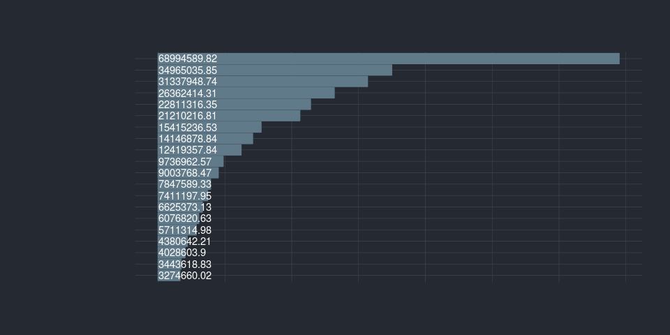

Käyttöesimerkkejä: Opintotuen saajat ja maksetut tuet
=====================================================

<table>
<thead>
<tr class="header">
<th style="text-align: left;">data</th>
<th style="text-align: left;">julkaistu</th>
<th style="text-align: left;">ylläpitäjä</th>
</tr>
</thead>
<tbody>
<tr class="odd">
<td style="text-align: left;"><a href='https://beta.avoindata.fi/data/fi/dataset/opintotuen-saajat-ja-maksetut-tuet'>Opintotuen saajat ja maksetut tuet</a></td>
<td style="text-align: left;">2019-03-15</td>
<td style="text-align: left;"><a href='mailto:markus.kainu@kela.fi'>Markus Kainu</a></td>
</tr>
</tbody>
</table>

    library(dplyr)
    library(ggplot2)
    library(jsonlite)
    library(ckanr)
    library(readr)
    library(knitr)
    library(glue)
    library(hrbrthemes)

Resurssien lataaminen
---------------------

    ckanr_setup(url = "https://beta.avoindata.fi/data/fi/")
    x <- package_search(q = "Kansaneläkelaitos", fq = "title:opintotuen")
    resources <- x$results[[1]]$resources
    dat <- read_csv2(resources[[1]]$url) # Lataa data
    meta <- fromJSON(txt = resources[[2]]$url) # Lataa metadata

Datan ja metadatan kuvailu
--------------------------

**Datan kuvaustieto**

    meta$description %>% cat()

Raportilla on tiedot opintotuen saajista, maksetuista tuista ja
keskimääräisistä tuista tilastointijakson aikana. Opintotuen saajia ovat
opintorahaa, asumislisää tai opintolainan valtiontakauksen saaneet
henkilöt. Maksettuihin tukiin on tilastoitu säännöllisten tai
takautuvien maksujen lisäksi myös opintoetuuksien palautukset.
Keskimääräiseen opintotukeen (euroa/saaja) on tilastoitu ainoastaan
säännöllisesti maksetut tuet ja opintolainan valtiontakauksen euromäärä.
Opintotuen saajat ja maksetut etuudet tilastoidaan kalenterivuosittain,
lukuvuosittain ja kuukausittain. Lukuvuosi alkaa elokuun alussa ja
päättyy seuraavan vuoden heinäkuun lopussa. Oppilaitosaste määräytyy
etuuden maksutapahtumaan liittyvän oppilaitosnumeron perusteella.
Oletusarvoisesti opintotuen saaja tilastoituu tilastointijakson
viimeisimmän maksutapahtuman mukaiseen oppilaitosasteeseen. Valinnalla
‘Astetiedon peruste: Kaikki oppilaitokset’ tuen saaja tilastoituu
kaikkiin tilastointijakson maksutapahtumien mukaisiin
oppilaitosasteisiin. Yhteissummassa tuen saaja esiintyy kuitenkin vain
kerran. Oppilaitosasteeseen ‘Ulkomaiset oppilaitokset’ tilastoituvat ne
opintotuen saajat, jotka suorittavat tutkintoa ulkomaisessa
oppilaitoksessa. Opintotuen saajan ikä on ikä tilastointijakson lopussa.
Lukuvuoden tiedoissa ikä on kuitenkin ikä lukuvuoteen sisältyvän
syyslukukauden lopussa. Opintotuen saajat on tilastoitu saajan
asuinkunnan perustella. Kunta tilastoituu valitun ajanjakson lopun
tietojen mukaan. Lukuvuoden tiedoissa aluetieto on kuitenkin lukuvuoteen
sisältyvän syyslukukauden lopun tieto.

**Datan muuttujatieto**

    meta$resources$schema$fields[[1]] %>% kable(format = "markdown")

<table>
<thead>
<tr class="header">
<th style="text-align: left;">name</th>
<th style="text-align: left;">type</th>
<th style="text-align: left;">format</th>
</tr>
</thead>
<tbody>
<tr class="odd">
<td style="text-align: left;">vuosi</td>
<td style="text-align: left;">integer</td>
<td style="text-align: left;">default</td>
</tr>
<tr class="even">
<td style="text-align: left;">etuus</td>
<td style="text-align: left;">string</td>
<td style="text-align: left;">default</td>
</tr>
<tr class="odd">
<td style="text-align: left;">kunta</td>
<td style="text-align: left;">string</td>
<td style="text-align: left;">default</td>
</tr>
<tr class="even">
<td style="text-align: left;">saajat</td>
<td style="text-align: left;">integer</td>
<td style="text-align: left;">default</td>
</tr>
<tr class="odd">
<td style="text-align: left;">maksetut_etuudet_euroa</td>
<td style="text-align: left;">number</td>
<td style="text-align: left;">default</td>
</tr>
<tr class="even">
<td style="text-align: left;">euroa_per_saaja</td>
<td style="text-align: left;">number</td>
<td style="text-align: left;">default</td>
</tr>
</tbody>
</table>

**Datan ensimmäiset rivit**

    head(dat)  %>% kable(format = "markdown")

<table>
<thead>
<tr class="header">
<th style="text-align: right;">vuosi</th>
<th style="text-align: left;">etuus</th>
<th style="text-align: left;">kunta</th>
<th style="text-align: right;">saajat</th>
<th style="text-align: right;">maksetut_etuudet_euroa</th>
<th style="text-align: right;">euroa_per_saaja</th>
</tr>
</thead>
<tbody>
<tr class="odd">
<td style="text-align: right;">2018</td>
<td style="text-align: left;">Yhteensä</td>
<td style="text-align: left;">Akaa</td>
<td style="text-align: right;">414</td>
<td style="text-align: right;">432023.7</td>
<td style="text-align: right;">3674.462</td>
</tr>
<tr class="even">
<td style="text-align: right;">2018</td>
<td style="text-align: left;">Yhteensä</td>
<td style="text-align: left;">Alajärvi</td>
<td style="text-align: right;">305</td>
<td style="text-align: right;">327333.5</td>
<td style="text-align: right;">3024.162</td>
</tr>
<tr class="odd">
<td style="text-align: right;">2018</td>
<td style="text-align: left;">Yhteensä</td>
<td style="text-align: left;">Alavieska</td>
<td style="text-align: right;">87</td>
<td style="text-align: right;">118497.8</td>
<td style="text-align: right;">3919.461</td>
</tr>
<tr class="even">
<td style="text-align: right;">2018</td>
<td style="text-align: left;">Yhteensä</td>
<td style="text-align: left;">Alavus</td>
<td style="text-align: right;">446</td>
<td style="text-align: right;">525543.5</td>
<td style="text-align: right;">3532.726</td>
</tr>
<tr class="odd">
<td style="text-align: right;">2018</td>
<td style="text-align: left;">Yhteensä</td>
<td style="text-align: left;">Asikkala</td>
<td style="text-align: right;">246</td>
<td style="text-align: right;">254567.0</td>
<td style="text-align: right;">3318.835</td>
</tr>
<tr class="even">
<td style="text-align: right;">2018</td>
<td style="text-align: left;">Yhteensä</td>
<td style="text-align: left;">Askola</td>
<td style="text-align: right;">123</td>
<td style="text-align: right;">88357.4</td>
<td style="text-align: right;">2812.823</td>
</tr>
</tbody>
</table>

Kuvio
-----

    dat %>% 
      filter(vuosi == 2018,
             etuus == "Opintoraha") %>% 
      arrange(desc(maksetut_etuudet_euroa)) %>% 
      slice(1:20) %>% 
      mutate(kunta = forcats::fct_reorder(kunta, maksetut_etuudet_euroa)) %>% 
      ggplot(aes(x = kunta, y = maksetut_etuudet_euroa, label = maksetut_etuudet_euroa)) + 
      geom_col() + 
      coord_flip() + 
      theme_minimal() +
      geom_text(aes(y = 0), hjust = 0, color = "white") +
      labs(title = "Esimerkkikuvion esimerkkiotsikko") +
      theme_ft_rc()

Datastore-api
-------------

Jos et tarvitse koko aineistoa, voit suodattaa siitä osio SQL:llä
käyttäen CKAN:n DataStore-rajapintaa.

Alla olevassa esimerkissä tehdään rajaus `kunta`-muuttujasta ja siis
etsitään vaan kuntaa *Veteli* koskevat tiedot.

    kunta <- "Veteli"
    res <- ckanr::ds_search_sql(sql = glue("SELECT * from \"{resources[[1]]$id}\" WHERE kunta LIKE '{kunta}'"), as = "table")
    res$records %>% 
      select(-`_full_text`, -`_id`) %>% 
      kable(format = "markdown")

<table>
<thead>
<tr class="header">
<th style="text-align: left;">kunta</th>
<th style="text-align: left;">saajat</th>
<th style="text-align: left;">vuosi</th>
<th style="text-align: left;">euroa_per_saaja</th>
<th style="text-align: left;">maksetut_etuudet_euroa</th>
<th style="text-align: left;">etuus</th>
</tr>
</thead>
<tbody>
<tr class="odd">
<td style="text-align: left;">Veteli</td>
<td style="text-align: left;">105</td>
<td style="text-align: left;">2018</td>
<td style="text-align: left;">3668,8578</td>
<td style="text-align: left;">124905,60</td>
<td style="text-align: left;">Yhteensä</td>
</tr>
<tr class="even">
<td style="text-align: left;">Veteli</td>
<td style="text-align: left;">103</td>
<td style="text-align: left;">2018</td>
<td style="text-align: left;">1249,4235</td>
<td style="text-align: left;">124905,60</td>
<td style="text-align: left;">Opintoraha ja asumislisä yhteensä</td>
</tr>
<tr class="odd">
<td style="text-align: left;">Veteli</td>
<td style="text-align: left;">103</td>
<td style="text-align: left;">2018</td>
<td style="text-align: left;">1226,0800</td>
<td style="text-align: left;">123842,42</td>
<td style="text-align: left;">Opintoraha</td>
</tr>
<tr class="even">
<td style="text-align: left;">Veteli</td>
<td style="text-align: left;">4</td>
<td style="text-align: left;">2018</td>
<td style="text-align: left;">583,5875</td>
<td style="text-align: left;">1063,18</td>
<td style="text-align: left;">Asumislisä</td>
</tr>
<tr class="odd">
<td style="text-align: left;">Veteli</td>
<td style="text-align: left;">65</td>
<td style="text-align: left;">2018</td>
<td style="text-align: left;">3891,5385</td>
<td style="text-align: left;">0,00</td>
<td style="text-align: left;">Opintolainan valtiontakaus</td>
</tr>
<tr class="even">
<td style="text-align: left;">Veteli</td>
<td style="text-align: left;">112</td>
<td style="text-align: left;">2017</td>
<td style="text-align: left;">3318,0358</td>
<td style="text-align: left;">169205,44</td>
<td style="text-align: left;">Yhteensä</td>
</tr>
<tr class="odd">
<td style="text-align: left;">Veteli</td>
<td style="text-align: left;">108</td>
<td style="text-align: left;">2017</td>
<td style="text-align: left;">1571,8876</td>
<td style="text-align: left;">169205,44</td>
<td style="text-align: left;">Opintoraha ja asumislisä yhteensä</td>
</tr>
<tr class="even">
<td style="text-align: left;">Veteli</td>
<td style="text-align: left;">106</td>
<td style="text-align: left;">2017</td>
<td style="text-align: left;">1258,3386</td>
<td style="text-align: left;">133289,75</td>
<td style="text-align: left;">Opintoraha</td>
</tr>
<tr class="odd">
<td style="text-align: left;">Veteli</td>
<td style="text-align: left;">44</td>
<td style="text-align: left;">2017</td>
<td style="text-align: left;">819,6914</td>
<td style="text-align: left;">35915,69</td>
<td style="text-align: left;">Asumislisä</td>
</tr>
<tr class="even">
<td style="text-align: left;">Veteli</td>
<td style="text-align: left;">62</td>
<td style="text-align: left;">2017</td>
<td style="text-align: left;">3227,5806</td>
<td style="text-align: left;">0,00</td>
<td style="text-align: left;">Opintolainan valtiontakaus</td>
</tr>
<tr class="odd">
<td style="text-align: left;">Veteli</td>
<td style="text-align: left;">110</td>
<td style="text-align: left;">2016</td>
<td style="text-align: left;">3439,2971</td>
<td style="text-align: left;">211221,23</td>
<td style="text-align: left;">Yhteensä</td>
</tr>
<tr class="even">
<td style="text-align: left;">Veteli</td>
<td style="text-align: left;">109</td>
<td style="text-align: left;">2016</td>
<td style="text-align: left;">1982,7769</td>
<td style="text-align: left;">211221,23</td>
<td style="text-align: left;">Opintoraha ja asumislisä yhteensä</td>
</tr>
<tr class="odd">
<td style="text-align: left;">Veteli</td>
<td style="text-align: left;">106</td>
<td style="text-align: left;">2016</td>
<td style="text-align: left;">1326,6456</td>
<td style="text-align: left;">138596,93</td>
<td style="text-align: left;">Opintoraha</td>
</tr>
<tr class="even">
<td style="text-align: left;">Veteli</td>
<td style="text-align: left;">67</td>
<td style="text-align: left;">2016</td>
<td style="text-align: left;">1126,8396</td>
<td style="text-align: left;">72624,30</td>
<td style="text-align: left;">Asumislisä</td>
</tr>
<tr class="odd">
<td style="text-align: left;">Veteli</td>
<td style="text-align: left;">60</td>
<td style="text-align: left;">2016</td>
<td style="text-align: left;">2703,3333</td>
<td style="text-align: left;">0,00</td>
<td style="text-align: left;">Opintolainan valtiontakaus</td>
</tr>
<tr class="even">
<td style="text-align: left;">Veteli</td>
<td style="text-align: left;">108</td>
<td style="text-align: left;">2015</td>
<td style="text-align: left;">3471,5003</td>
<td style="text-align: left;">219354,18</td>
<td style="text-align: left;">Yhteensä</td>
</tr>
<tr class="odd">
<td style="text-align: left;">Veteli</td>
<td style="text-align: left;">108</td>
<td style="text-align: left;">2015</td>
<td style="text-align: left;">2016,3151</td>
<td style="text-align: left;">219354,18</td>
<td style="text-align: left;">Opintoraha ja asumislisä yhteensä</td>
</tr>
<tr class="even">
<td style="text-align: left;">Veteli</td>
<td style="text-align: left;">102</td>
<td style="text-align: left;">2015</td>
<td style="text-align: left;">1387,2050</td>
<td style="text-align: left;">142593,08</td>
<td style="text-align: left;">Opintoraha</td>
</tr>
<tr class="odd">
<td style="text-align: left;">Veteli</td>
<td style="text-align: left;">70</td>
<td style="text-align: left;">2015</td>
<td style="text-align: left;">1105,3206</td>
<td style="text-align: left;">76761,10</td>
<td style="text-align: left;">Asumislisä</td>
</tr>
</tbody>
</table>
