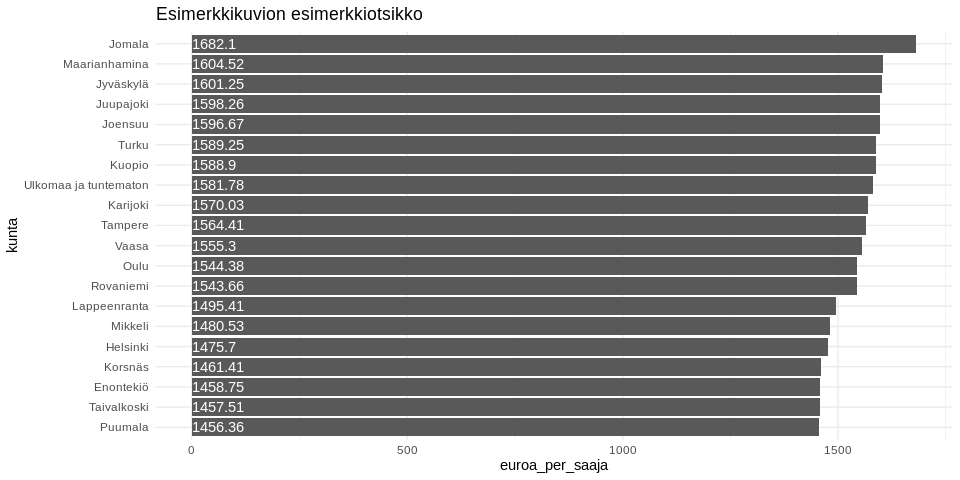

<table>
<thead>
<tr class="header">
<th style="text-align: left;">data</th>
<th style="text-align: left;">julkaistu</th>
<th style="text-align: left;">ylläpitäjä</th>
</tr>
</thead>
<tbody>
<tr class="odd">
<td style="text-align: left;"><a href='https://www.betaavoindata.fi/data/fi/dataset/opintotuen-saajat-ja-maksetut-tuet'>Opintotuen saajat ja maksetut tuet</a></td>
<td style="text-align: left;">2019-03-15</td>
<td style="text-align: left;"><a href='mailto:markus.kainu@kela.fi'>Markus Kainu</a></td>
</tr>
</tbody>
</table>

    library(dplyr)
    library(ggplot2)
    library(jsonlite)
    library(ckanr)
    library(readr)
    library(knitr)
    library(glue)
    library(tidyr)
    library(pxweb)

Resurssien lataaminen
---------------------

    ckanr_setup(url = "https://www.betaavoindata.fi/data/fi/")
    x <- package_search(q = "Kansaneläkelaitos", fq = "title:opintotuen")
    resources <- x$results[[1]]$resources
    dat <- read.table(resources[[1]]$url, header = TRUE, sep = ";", dec = ",", stringsAsFactors = FALSE) # Lataa data
    meta <- fromJSON(txt = resources[[2]]$url) # Lataa metadata

Datan ja metadatan kuvailu
--------------------------

**Datan kuvaustieto**

    meta$description %>% cat()

Raportilla on tiedot opintotuen saajista, maksetuista tuista ja
keskimääräisistä tuista tilastointijakson aikana. Opintotuen saajia ovat
opintorahaa, asumislisää tai opintolainan valtiontakauksen saaneet
henkilöt. Maksettuihin tukiin on tilastoitu säännöllisten tai
takautuvien maksujen lisäksi myös opintoetuuksien palautukset.
Keskimääräiseen opintotukeen (euroa/saaja) on tilastoitu ainoastaan
säännöllisesti maksetut tuet ja opintolainan valtiontakauksen euromäärä.
Opintotuen saajat ja maksetut etuudet tilastoidaan kalenterivuosittain,
lukuvuosittain ja kuukausittain. Lukuvuosi alkaa elokuun alussa ja
päättyy seuraavan vuoden heinäkuun lopussa. Oppilaitosaste määräytyy
etuuden maksutapahtumaan liittyvän oppilaitosnumeron perusteella.
Oletusarvoisesti opintotuen saaja tilastoituu tilastointijakson
viimeisimmän maksutapahtuman mukaiseen oppilaitosasteeseen. Valinnalla
‘Astetiedon peruste: Kaikki oppilaitokset’ tuen saaja tilastoituu
kaikkiin tilastointijakson maksutapahtumien mukaisiin
oppilaitosasteisiin. Yhteissummassa tuen saaja esiintyy kuitenkin vain
kerran. Oppilaitosasteeseen ‘Ulkomaiset oppilaitokset’ tilastoituvat ne
opintotuen saajat, jotka suorittavat tutkintoa ulkomaisessa
oppilaitoksessa. Opintotuen saajan ikä on ikä tilastointijakson lopussa.
Lukuvuoden tiedoissa ikä on kuitenkin ikä lukuvuoteen sisältyvän
syyslukukauden lopussa. Opintotuen saajat on tilastoitu saajan
asuinkunnan perustella. Kunta tilastoituu valitun ajanjakson lopun
tietojen mukaan. Lukuvuoden tiedoissa aluetieto on kuitenkin lukuvuoteen
sisältyvän syyslukukauden lopun tieto.

**Datan muuttujatieto**

    meta$resources$schema$fields[[1]] %>%
      select(-values) %>% 
      kable(format = "markdown")

<table>
<thead>
<tr class="header">
<th style="text-align: left;">name</th>
<th style="text-align: left;">type</th>
<th style="text-align: left;">format</th>
</tr>
</thead>
<tbody>
<tr class="odd">
<td style="text-align: left;">kuntanumero</td>
<td style="text-align: left;">integer</td>
<td style="text-align: left;">default</td>
</tr>
<tr class="even">
<td style="text-align: left;">kunta</td>
<td style="text-align: left;">string</td>
<td style="text-align: left;">default</td>
</tr>
<tr class="odd">
<td style="text-align: left;">aikajakso</td>
<td style="text-align: left;">string</td>
<td style="text-align: left;">default</td>
</tr>
<tr class="even">
<td style="text-align: left;">etuus</td>
<td style="text-align: left;">string</td>
<td style="text-align: left;">default</td>
</tr>
<tr class="odd">
<td style="text-align: left;">oppilaitosaste</td>
<td style="text-align: left;">string</td>
<td style="text-align: left;">default</td>
</tr>
<tr class="even">
<td style="text-align: left;">saajat</td>
<td style="text-align: left;">number</td>
<td style="text-align: left;">default</td>
</tr>
<tr class="odd">
<td style="text-align: left;">maksetut_etuudet_euroa</td>
<td style="text-align: left;">number</td>
<td style="text-align: left;">default</td>
</tr>
<tr class="even">
<td style="text-align: left;">euroa_per_saaja</td>
<td style="text-align: left;">number</td>
<td style="text-align: left;">default</td>
</tr>
<tr class="odd">
<td style="text-align: left;">vuosi</td>
<td style="text-align: left;">integer</td>
<td style="text-align: left;">default</td>
</tr>
<tr class="even">
<td style="text-align: left;">kuukausi</td>
<td style="text-align: left;">integer</td>
<td style="text-align: left;">default</td>
</tr>
</tbody>
</table>

**Datan ensimmäiset rivit**

    head(dat)  %>% kable(format = "markdown")

<table>
<colgroup>
<col style="width: 9%" />
<col style="width: 7%" />
<col style="width: 7%" />
<col style="width: 6%" />
<col style="width: 20%" />
<col style="width: 5%" />
<col style="width: 17%" />
<col style="width: 12%" />
<col style="width: 4%" />
<col style="width: 6%" />
</colgroup>
<thead>
<tr class="header">
<th style="text-align: right;">kuntanumero</th>
<th style="text-align: left;">kunta</th>
<th style="text-align: left;">aikajakso</th>
<th style="text-align: left;">etuus</th>
<th style="text-align: left;">oppilaitosaste</th>
<th style="text-align: right;">saajat</th>
<th style="text-align: right;">maksetut_etuudet_euroa</th>
<th style="text-align: right;">euroa_per_saaja</th>
<th style="text-align: right;">vuosi</th>
<th style="text-align: right;">kuukausi</th>
</tr>
</thead>
<tbody>
<tr class="odd">
<td style="text-align: right;">5</td>
<td style="text-align: left;">Alajärvi</td>
<td style="text-align: left;">vuosi</td>
<td style="text-align: left;">Yhteensä</td>
<td style="text-align: left;">Yhteensä</td>
<td style="text-align: right;">675</td>
<td style="text-align: right;">NA</td>
<td style="text-align: right;">2067.52</td>
<td style="text-align: right;">2005</td>
<td style="text-align: right;">NA</td>
</tr>
<tr class="even">
<td style="text-align: right;">5</td>
<td style="text-align: left;">Alajärvi</td>
<td style="text-align: left;">vuosi</td>
<td style="text-align: left;">Yhteensä</td>
<td style="text-align: left;">Yliopistot</td>
<td style="text-align: right;">91</td>
<td style="text-align: right;">280752</td>
<td style="text-align: right;">3538.06</td>
<td style="text-align: right;">2005</td>
<td style="text-align: right;">NA</td>
</tr>
<tr class="odd">
<td style="text-align: right;">5</td>
<td style="text-align: left;">Alajärvi</td>
<td style="text-align: left;">vuosi</td>
<td style="text-align: left;">Yhteensä</td>
<td style="text-align: left;">Ammattikorkeakoulut</td>
<td style="text-align: right;">182</td>
<td style="text-align: right;">503177</td>
<td style="text-align: right;">3021.08</td>
<td style="text-align: right;">2005</td>
<td style="text-align: right;">NA</td>
</tr>
<tr class="even">
<td style="text-align: right;">5</td>
<td style="text-align: left;">Alajärvi</td>
<td style="text-align: left;">vuosi</td>
<td style="text-align: left;">Yhteensä</td>
<td style="text-align: left;">Ammatilliset oppilaitokset</td>
<td style="text-align: right;">278</td>
<td style="text-align: right;">351132</td>
<td style="text-align: right;">1460.48</td>
<td style="text-align: right;">2005</td>
<td style="text-align: right;">NA</td>
</tr>
<tr class="odd">
<td style="text-align: right;">5</td>
<td style="text-align: left;">Alajärvi</td>
<td style="text-align: left;">vuosi</td>
<td style="text-align: left;">Yhteensä</td>
<td style="text-align: left;">Lukiot</td>
<td style="text-align: right;">90</td>
<td style="text-align: right;">53057</td>
<td style="text-align: right;">592.22</td>
<td style="text-align: right;">2005</td>
<td style="text-align: right;">NA</td>
</tr>
<tr class="even">
<td style="text-align: right;">9</td>
<td style="text-align: left;">Alavieska</td>
<td style="text-align: left;">vuosi</td>
<td style="text-align: left;">Yhteensä</td>
<td style="text-align: left;">Yhteensä</td>
<td style="text-align: right;">137</td>
<td style="text-align: right;">217091</td>
<td style="text-align: right;">1940.69</td>
<td style="text-align: right;">2005</td>
<td style="text-align: right;">NA</td>
</tr>
</tbody>
</table>

Kuvio
-----

    dat %>% 
      filter(aikajakso == "vuosi",
             vuosi == "2018",
             etuus == "Opintoraha",
             oppilaitosaste == "Yhteensä") %>% 
      arrange(desc(euroa_per_saaja)) %>% 
      slice(1:20) %>% 
      mutate(kunta = forcats::fct_reorder(kunta, euroa_per_saaja)) %>% 
      ggplot(aes(x = kunta, y = euroa_per_saaja, label = euroa_per_saaja)) + 
      geom_col() + 
      coord_flip() + 
      theme_minimal() +
      geom_text(aes(y = 0), hjust = 0, color = "white") +
      labs(title = "Esimerkkikuvion esimerkkiotsikko")

Datan yhdistäminen Tilastokeskuksen kuntien avainlukuihin
---------------------------------------------------------

    # PXWEB query 
    pxweb_query_list <- 
      list("Alue 2019"=c("020","005","009","010","016","018","019","035","043","046","047","049","050","051","052","060","061",
                         "062","065","069","071","072","074","075","076","077","078","079","081","082","086","111","090","091","097","098","099",
                         "102","103","105","106","108","109","139","140","142","143","145","146","153","148","149","151","152","165","167","169",
                         "170","171","172","176","177","178","179","181","182","186","202","204","205","208","211","213","214","216","217","218",
                         "224","226","230","231","232","233","235","236","239","240","320","241","322","244","245","249","250","256","257","260",
                         "261","263","265","271","272","273","275","276","280","284","285","286","287","288","290","291","295","297","300","301",
                         "304","305","312","316","317","318","398","399","400","407","402","403","405","408","410","416","417","418","420","421",
                         "422","423","425","426","444","430","433","434","435","436","438","440","441","475","478","480","481","483","484","489",
                         "491","494","495","498","499","500","503","504","505","508","507","529","531","535","536","538","541","543","545","560",
                         "561","562","563","564","309","576","577","578","445","580","581","599","583","854","584","588","592","593","595","598",
                         "601","604","607","608","609","611","638","614","615","616","619","620","623","624","625","626","630","631","635","636",
                         "678","710","680","681","683","684","686","687","689","691","694","697","698","700","702","704","707","729","732","734",
                         "736","790","738","739","740","742","743","746","747","748","791","749","751","753","755","758","759","761","762","765",
                         "766","768","771","777","778","781","783","831","832","833","834","837","844","845","846","848","849","850","851","853",
                         "857","858","859","886","887","889","890","892","893","895","785","905","908","911","092","915","918","921","922","924",
                         "925","927","931","934","935","936","941","946","976","977","980","981","989","992"),
           "Tiedot"=c("M408","M411","M476","M391","M421","M478","M404","M410","M303","M297","M302","M44","M62","M70","M488","M486","M137","M140","M130","M162","M78","M485","M152","M72","M84","M106","M499","M496","M495","M497","M498"))

    # Download data 
    tk_lst <- 
      pxweb_get(url = "http://pxnet2.stat.fi/PXWeb/api/v1/fi/Kuntien_avainluvut/2019/kuntien_avainluvut_2019_viimeisin.px",
                query = pxweb_query_list)
    tk_avainluvut <- as.data.frame(tk_lst, column.name.type = "text", variable.value.type = "text") %>% 
      # levitetään data
      spread(key = Tiedot, value = `Kuntien avainluvut`)

    df <- left_join(dat, tk_avainluvut, by = c("kunta" = "Alue 2019"))
    # Piirretään hajontakuvio
    df2 <- df %>% 
      filter(aikajakso == "vuosi",
             vuosi == "2018",
             etuus == "Opintoraha",
             oppilaitosaste == "Yhteensä")

    ggplot(df2, aes(x = `Korkea-asteen tutkinnon suorittaneiden osuus 15 vuotta täyttäneistä, %, 2017`, 
                    y = euroa_per_saaja, 
                    size = `Väkiluku, 2018`)) + 
      geom_point(alpha = .3) +
      labs(y = "Opintoraha, euroa per saaja") + 
      theme_light()

Datastore-api
-------------

Jos et tarvitse koko aineistoa, voit suodattaa siitä osio SQL:llä
käyttäen CKAN:n DataStore-rajapintaa.

Alla olevassa esimerkissä tehdään rajaus `kunta`-muuttujasta ja siis
etsitään vaan kuntaa *Veteli* koskevat tiedot.

    kunta <- "Veteli"
    res <- ckanr::ds_search_sql(sql = glue("SELECT * from \"{resources[[1]]$id}\" WHERE kunta LIKE '{kunta}'"), as = "table")
    res$records %>% 
      select(-`_full_text`, -`_id`) %>% 
      kable(format = "markdown")

<table>
<colgroup>
<col style="width: 4%" />
<col style="width: 7%" />
<col style="width: 3%" />
<col style="width: 5%" />
<col style="width: 10%" />
<col style="width: 6%" />
<col style="width: 4%" />
<col style="width: 15%" />
<col style="width: 22%" />
<col style="width: 17%" />
</colgroup>
<thead>
<tr class="header">
<th style="text-align: left;">kunta</th>
<th style="text-align: left;">kuntanumero</th>
<th style="text-align: left;">vuosi</th>
<th style="text-align: left;">kuukausi</th>
<th style="text-align: left;">euroa_per_saaja</th>
<th style="text-align: left;">aikajakso</th>
<th style="text-align: left;">saajat</th>
<th style="text-align: left;">maksetut_etuudet_euroa</th>
<th style="text-align: left;">etuus</th>
<th style="text-align: left;">oppilaitosaste</th>
</tr>
</thead>
<tbody>
<tr class="odd">
<td style="text-align: left;">Veteli</td>
<td style="text-align: left;">924</td>
<td style="text-align: left;">2005</td>
<td style="text-align: left;">NA</td>
<td style="text-align: left;">2316,13</td>
<td style="text-align: left;">vuosi</td>
<td style="text-align: left;">204</td>
<td style="text-align: left;">376340</td>
<td style="text-align: left;">Yhteensä</td>
<td style="text-align: left;">Yhteensä</td>
</tr>
<tr class="even">
<td style="text-align: left;">Veteli</td>
<td style="text-align: left;">924</td>
<td style="text-align: left;">2005</td>
<td style="text-align: left;">NA</td>
<td style="text-align: left;">3733,89</td>
<td style="text-align: left;">vuosi</td>
<td style="text-align: left;">36</td>
<td style="text-align: left;">113041</td>
<td style="text-align: left;">Yhteensä</td>
<td style="text-align: left;">Yliopistot</td>
</tr>
<tr class="odd">
<td style="text-align: left;">Veteli</td>
<td style="text-align: left;">924</td>
<td style="text-align: left;">2005</td>
<td style="text-align: left;">NA</td>
<td style="text-align: left;">3302,35</td>
<td style="text-align: left;">vuosi</td>
<td style="text-align: left;">59</td>
<td style="text-align: left;">151838</td>
<td style="text-align: left;">Yhteensä</td>
<td style="text-align: left;">Ammattikorkeakoulut</td>
</tr>
<tr class="even">
<td style="text-align: left;">Veteli</td>
<td style="text-align: left;">924</td>
<td style="text-align: left;">2005</td>
<td style="text-align: left;">NA</td>
<td style="text-align: left;">1588,06</td>
<td style="text-align: left;">vuosi</td>
<td style="text-align: left;">60</td>
<td style="text-align: left;">79264</td>
<td style="text-align: left;">Yhteensä</td>
<td style="text-align: left;">Ammatilliset oppilaitokset</td>
</tr>
<tr class="odd">
<td style="text-align: left;">Veteli</td>
<td style="text-align: left;">924</td>
<td style="text-align: left;">2005</td>
<td style="text-align: left;">NA</td>
<td style="text-align: left;">414,12</td>
<td style="text-align: left;">vuosi</td>
<td style="text-align: left;">22</td>
<td style="text-align: left;">9440</td>
<td style="text-align: left;">Yhteensä</td>
<td style="text-align: left;">Lukiot</td>
</tr>
<tr class="even">
<td style="text-align: left;">Veteli</td>
<td style="text-align: left;">924</td>
<td style="text-align: left;">2005</td>
<td style="text-align: left;">NA</td>
<td style="text-align: left;">1811,19</td>
<td style="text-align: left;">vuosi</td>
<td style="text-align: left;">203</td>
<td style="text-align: left;">376340</td>
<td style="text-align: left;">Opintoraha ja asumislisä yhteensä</td>
<td style="text-align: left;">Yhteensä</td>
</tr>
<tr class="odd">
<td style="text-align: left;">Veteli</td>
<td style="text-align: left;">924</td>
<td style="text-align: left;">2005</td>
<td style="text-align: left;">NA</td>
<td style="text-align: left;">2950,00</td>
<td style="text-align: left;">vuosi</td>
<td style="text-align: left;">36</td>
<td style="text-align: left;">113041</td>
<td style="text-align: left;">Opintoraha ja asumislisä yhteensä</td>
<td style="text-align: left;">Yliopistot</td>
</tr>
<tr class="even">
<td style="text-align: left;">Veteli</td>
<td style="text-align: left;">924</td>
<td style="text-align: left;">2005</td>
<td style="text-align: left;">NA</td>
<td style="text-align: left;">2554,21</td>
<td style="text-align: left;">vuosi</td>
<td style="text-align: left;">59</td>
<td style="text-align: left;">151838</td>
<td style="text-align: left;">Opintoraha ja asumislisä yhteensä</td>
<td style="text-align: left;">Ammattikorkeakoulut</td>
</tr>
<tr class="odd">
<td style="text-align: left;">Veteli</td>
<td style="text-align: left;">924</td>
<td style="text-align: left;">2005</td>
<td style="text-align: left;">NA</td>
<td style="text-align: left;">1208,37</td>
<td style="text-align: left;">vuosi</td>
<td style="text-align: left;">59</td>
<td style="text-align: left;">79264</td>
<td style="text-align: left;">Opintoraha ja asumislisä yhteensä</td>
<td style="text-align: left;">Ammatilliset oppilaitokset</td>
</tr>
<tr class="even">
<td style="text-align: left;">Veteli</td>
<td style="text-align: left;">924</td>
<td style="text-align: left;">2005</td>
<td style="text-align: left;">NA</td>
<td style="text-align: left;">414,12</td>
<td style="text-align: left;">vuosi</td>
<td style="text-align: left;">22</td>
<td style="text-align: left;">9440</td>
<td style="text-align: left;">Opintoraha ja asumislisä yhteensä</td>
<td style="text-align: left;">Lukiot</td>
</tr>
<tr class="odd">
<td style="text-align: left;">Veteli</td>
<td style="text-align: left;">924</td>
<td style="text-align: left;">2005</td>
<td style="text-align: left;">NA</td>
<td style="text-align: left;">1281,44</td>
<td style="text-align: left;">vuosi</td>
<td style="text-align: left;">188</td>
<td style="text-align: left;">242631</td>
<td style="text-align: left;">Opintoraha</td>
<td style="text-align: left;">Yhteensä</td>
</tr>
<tr class="even">
<td style="text-align: left;">Veteli</td>
<td style="text-align: left;">924</td>
<td style="text-align: left;">2005</td>
<td style="text-align: left;">NA</td>
<td style="text-align: left;">1839,06</td>
<td style="text-align: left;">vuosi</td>
<td style="text-align: left;">36</td>
<td style="text-align: left;">69832</td>
<td style="text-align: left;">Opintoraha</td>
<td style="text-align: left;">Yliopistot</td>
</tr>
<tr class="odd">
<td style="text-align: left;">Veteli</td>
<td style="text-align: left;">924</td>
<td style="text-align: left;">2005</td>
<td style="text-align: left;">NA</td>
<td style="text-align: left;">1694,27</td>
<td style="text-align: left;">vuosi</td>
<td style="text-align: left;">59</td>
<td style="text-align: left;">99966</td>
<td style="text-align: left;">Opintoraha</td>
<td style="text-align: left;">Ammattikorkeakoulut</td>
</tr>
<tr class="even">
<td style="text-align: left;">Veteli</td>
<td style="text-align: left;">924</td>
<td style="text-align: left;">2005</td>
<td style="text-align: left;">NA</td>
<td style="text-align: left;">894,50</td>
<td style="text-align: left;">vuosi</td>
<td style="text-align: left;">50</td>
<td style="text-align: left;">48786</td>
<td style="text-align: left;">Opintoraha</td>
<td style="text-align: left;">Ammatilliset oppilaitokset</td>
</tr>
<tr class="odd">
<td style="text-align: left;">Veteli</td>
<td style="text-align: left;">924</td>
<td style="text-align: left;">2005</td>
<td style="text-align: left;">NA</td>
<td style="text-align: left;">237,03</td>
<td style="text-align: left;">vuosi</td>
<td style="text-align: left;">18</td>
<td style="text-align: left;">4279</td>
<td style="text-align: left;">Opintoraha</td>
<td style="text-align: left;">Lukiot</td>
</tr>
<tr class="even">
<td style="text-align: left;">Veteli</td>
<td style="text-align: left;">924</td>
<td style="text-align: left;">2005</td>
<td style="text-align: left;">NA</td>
<td style="text-align: left;">892,68</td>
<td style="text-align: left;">vuosi</td>
<td style="text-align: left;">142</td>
<td style="text-align: left;">133709</td>
<td style="text-align: left;">Asumislisä</td>
<td style="text-align: left;">Yhteensä</td>
</tr>
<tr class="odd">
<td style="text-align: left;">Veteli</td>
<td style="text-align: left;">924</td>
<td style="text-align: left;">2005</td>
<td style="text-align: left;">NA</td>
<td style="text-align: left;">1142,69</td>
<td style="text-align: left;">vuosi</td>
<td style="text-align: left;">35</td>
<td style="text-align: left;">43208</td>
<td style="text-align: left;">Asumislisä</td>
<td style="text-align: left;">Yliopistot</td>
</tr>
<tr class="even">
<td style="text-align: left;">Veteli</td>
<td style="text-align: left;">924</td>
<td style="text-align: left;">2005</td>
<td style="text-align: left;">NA</td>
<td style="text-align: left;">975,70</td>
<td style="text-align: left;">vuosi</td>
<td style="text-align: left;">52</td>
<td style="text-align: left;">51872</td>
<td style="text-align: left;">Asumislisä</td>
<td style="text-align: left;">Ammattikorkeakoulut</td>
</tr>
<tr class="odd">
<td style="text-align: left;">Veteli</td>
<td style="text-align: left;">924</td>
<td style="text-align: left;">2005</td>
<td style="text-align: left;">NA</td>
<td style="text-align: left;">738,01</td>
<td style="text-align: left;">vuosi</td>
<td style="text-align: left;">36</td>
<td style="text-align: left;">30479</td>
<td style="text-align: left;">Asumislisä</td>
<td style="text-align: left;">Ammatilliset oppilaitokset</td>
</tr>
<tr class="even">
<td style="text-align: left;">Veteli</td>
<td style="text-align: left;">924</td>
<td style="text-align: left;">2005</td>
<td style="text-align: left;">NA</td>
<td style="text-align: left;">807,33</td>
<td style="text-align: left;">vuosi</td>
<td style="text-align: left;">6</td>
<td style="text-align: left;">5161</td>
<td style="text-align: left;">Asumislisä</td>
<td style="text-align: left;">Lukiot</td>
</tr>
<tr class="odd">
<td style="text-align: left;">Veteli</td>
<td style="text-align: left;">924</td>
<td style="text-align: left;">2005</td>
<td style="text-align: left;">NA</td>
<td style="text-align: left;">1637,81</td>
<td style="text-align: left;">vuosi</td>
<td style="text-align: left;">64</td>
<td style="text-align: left;">0</td>
<td style="text-align: left;">Opintolainan valtiontakaus</td>
<td style="text-align: left;">Yhteensä</td>
</tr>
<tr class="even">
<td style="text-align: left;">Veteli</td>
<td style="text-align: left;">924</td>
<td style="text-align: left;">2005</td>
<td style="text-align: left;">NA</td>
<td style="text-align: left;">1881,33</td>
<td style="text-align: left;">vuosi</td>
<td style="text-align: left;">15</td>
<td style="text-align: left;">0</td>
<td style="text-align: left;">Opintolainan valtiontakaus</td>
<td style="text-align: left;">Yliopistot</td>
</tr>
<tr class="odd">
<td style="text-align: left;">Veteli</td>
<td style="text-align: left;">924</td>
<td style="text-align: left;">2005</td>
<td style="text-align: left;">NA</td>
<td style="text-align: left;">1765,60</td>
<td style="text-align: left;">vuosi</td>
<td style="text-align: left;">25</td>
<td style="text-align: left;">0</td>
<td style="text-align: left;">Opintolainan valtiontakaus</td>
<td style="text-align: left;">Ammattikorkeakoulut</td>
</tr>
<tr class="even">
<td style="text-align: left;">Veteli</td>
<td style="text-align: left;">924</td>
<td style="text-align: left;">2005</td>
<td style="text-align: left;">NA</td>
<td style="text-align: left;">1411,18</td>
<td style="text-align: left;">vuosi</td>
<td style="text-align: left;">17</td>
<td style="text-align: left;">0</td>
<td style="text-align: left;">Opintolainan valtiontakaus</td>
<td style="text-align: left;">Ammatilliset oppilaitokset</td>
</tr>
<tr class="odd">
<td style="text-align: left;">Veteli</td>
<td style="text-align: left;">924</td>
<td style="text-align: left;">2006</td>
<td style="text-align: left;">NA</td>
<td style="text-align: left;">2484,49</td>
<td style="text-align: left;">vuosi</td>
<td style="text-align: left;">184</td>
<td style="text-align: left;">362269</td>
<td style="text-align: left;">Yhteensä</td>
<td style="text-align: left;">Yhteensä</td>
</tr>
<tr class="even">
<td style="text-align: left;">Veteli</td>
<td style="text-align: left;">924</td>
<td style="text-align: left;">2006</td>
<td style="text-align: left;">NA</td>
<td style="text-align: left;">4025,95</td>
<td style="text-align: left;">vuosi</td>
<td style="text-align: left;">40</td>
<td style="text-align: left;">129729</td>
<td style="text-align: left;">Yhteensä</td>
<td style="text-align: left;">Yliopistot</td>
</tr>
<tr class="odd">
<td style="text-align: left;">Veteli</td>
<td style="text-align: left;">924</td>
<td style="text-align: left;">2006</td>
<td style="text-align: left;">NA</td>
<td style="text-align: left;">3228,80</td>
<td style="text-align: left;">vuosi</td>
<td style="text-align: left;">56</td>
<td style="text-align: left;">150219</td>
<td style="text-align: left;">Yhteensä</td>
<td style="text-align: left;">Ammattikorkeakoulut</td>
</tr>
<tr class="even">
<td style="text-align: left;">Veteli</td>
<td style="text-align: left;">924</td>
<td style="text-align: left;">2006</td>
<td style="text-align: left;">NA</td>
<td style="text-align: left;">1470,10</td>
<td style="text-align: left;">vuosi</td>
<td style="text-align: left;">57</td>
<td style="text-align: left;">63974</td>
<td style="text-align: left;">Yhteensä</td>
<td style="text-align: left;">Ammatilliset oppilaitokset</td>
</tr>
<tr class="odd">
<td style="text-align: left;">Veteli</td>
<td style="text-align: left;">924</td>
<td style="text-align: left;">2006</td>
<td style="text-align: left;">NA</td>
<td style="text-align: left;">263,05</td>
<td style="text-align: left;">vuosi</td>
<td style="text-align: left;">14</td>
<td style="text-align: left;">3109</td>
<td style="text-align: left;">Yhteensä</td>
<td style="text-align: left;">Lukiot</td>
</tr>
<tr class="even">
<td style="text-align: left;">Veteli</td>
<td style="text-align: left;">924</td>
<td style="text-align: left;">2006</td>
<td style="text-align: left;">NA</td>
<td style="text-align: left;">1922,52</td>
<td style="text-align: left;">vuosi</td>
<td style="text-align: left;">181</td>
<td style="text-align: left;">362269</td>
<td style="text-align: left;">Opintoraha ja asumislisä yhteensä</td>
<td style="text-align: left;">Yhteensä</td>
</tr>
<tr class="odd">
<td style="text-align: left;">Veteli</td>
<td style="text-align: left;">924</td>
<td style="text-align: left;">2006</td>
<td style="text-align: left;">NA</td>
<td style="text-align: left;">3054,95</td>
<td style="text-align: left;">vuosi</td>
<td style="text-align: left;">40</td>
<td style="text-align: left;">129729</td>
<td style="text-align: left;">Opintoraha ja asumislisä yhteensä</td>
<td style="text-align: left;">Yliopistot</td>
</tr>
<tr class="even">
<td style="text-align: left;">Veteli</td>
<td style="text-align: left;">924</td>
<td style="text-align: left;">2006</td>
<td style="text-align: left;">NA</td>
<td style="text-align: left;">2567,73</td>
<td style="text-align: left;">vuosi</td>
<td style="text-align: left;">56</td>
<td style="text-align: left;">150219</td>
<td style="text-align: left;">Opintoraha ja asumislisä yhteensä</td>
<td style="text-align: left;">Ammattikorkeakoulut</td>
</tr>
<tr class="odd">
<td style="text-align: left;">Veteli</td>
<td style="text-align: left;">924</td>
<td style="text-align: left;">2006</td>
<td style="text-align: left;">NA</td>
<td style="text-align: left;">1088,35</td>
<td style="text-align: left;">vuosi</td>
<td style="text-align: left;">54</td>
<td style="text-align: left;">63974</td>
<td style="text-align: left;">Opintoraha ja asumislisä yhteensä</td>
<td style="text-align: left;">Ammatilliset oppilaitokset</td>
</tr>
<tr class="even">
<td style="text-align: left;">Veteli</td>
<td style="text-align: left;">924</td>
<td style="text-align: left;">2006</td>
<td style="text-align: left;">NA</td>
<td style="text-align: left;">217,33</td>
<td style="text-align: left;">vuosi</td>
<td style="text-align: left;">14</td>
<td style="text-align: left;">3109</td>
<td style="text-align: left;">Opintoraha ja asumislisä yhteensä</td>
<td style="text-align: left;">Lukiot</td>
</tr>
<tr class="odd">
<td style="text-align: left;">Veteli</td>
<td style="text-align: left;">924</td>
<td style="text-align: left;">2006</td>
<td style="text-align: left;">NA</td>
<td style="text-align: left;">1269,13</td>
<td style="text-align: left;">vuosi</td>
<td style="text-align: left;">171</td>
<td style="text-align: left;">222878</td>
<td style="text-align: left;">Opintoraha</td>
<td style="text-align: left;">Yhteensä</td>
</tr>
<tr class="even">
<td style="text-align: left;">Veteli</td>
<td style="text-align: left;">924</td>
<td style="text-align: left;">2006</td>
<td style="text-align: left;">NA</td>
<td style="text-align: left;">1836,78</td>
<td style="text-align: left;">vuosi</td>
<td style="text-align: left;">40</td>
<td style="text-align: left;">77616</td>
<td style="text-align: left;">Opintoraha</td>
<td style="text-align: left;">Yliopistot</td>
</tr>
<tr class="odd">
<td style="text-align: left;">Veteli</td>
<td style="text-align: left;">924</td>
<td style="text-align: left;">2006</td>
<td style="text-align: left;">NA</td>
<td style="text-align: left;">1638,10</td>
<td style="text-align: left;">vuosi</td>
<td style="text-align: left;">56</td>
<td style="text-align: left;">95602</td>
<td style="text-align: left;">Opintoraha</td>
<td style="text-align: left;">Ammattikorkeakoulut</td>
</tr>
<tr class="even">
<td style="text-align: left;">Veteli</td>
<td style="text-align: left;">924</td>
<td style="text-align: left;">2006</td>
<td style="text-align: left;">NA</td>
<td style="text-align: left;">788,10</td>
<td style="text-align: left;">vuosi</td>
<td style="text-align: left;">44</td>
<td style="text-align: left;">36038</td>
<td style="text-align: left;">Opintoraha</td>
<td style="text-align: left;">Ammatilliset oppilaitokset</td>
</tr>
<tr class="odd">
<td style="text-align: left;">Veteli</td>
<td style="text-align: left;">924</td>
<td style="text-align: left;">2006</td>
<td style="text-align: left;">NA</td>
<td style="text-align: left;">217,33</td>
<td style="text-align: left;">vuosi</td>
<td style="text-align: left;">14</td>
<td style="text-align: left;">3109</td>
<td style="text-align: left;">Opintoraha</td>
<td style="text-align: left;">Lukiot</td>
</tr>
<tr class="even">
<td style="text-align: left;">Veteli</td>
<td style="text-align: left;">924</td>
<td style="text-align: left;">2006</td>
<td style="text-align: left;">NA</td>
<td style="text-align: left;">1066,07</td>
<td style="text-align: left;">vuosi</td>
<td style="text-align: left;">124</td>
<td style="text-align: left;">139390</td>
<td style="text-align: left;">Asumislisä</td>
<td style="text-align: left;">Yhteensä</td>
</tr>
<tr class="odd">
<td style="text-align: left;">Veteli</td>
<td style="text-align: left;">924</td>
<td style="text-align: left;">2006</td>
<td style="text-align: left;">NA</td>
<td style="text-align: left;">1249,40</td>
<td style="text-align: left;">vuosi</td>
<td style="text-align: left;">39</td>
<td style="text-align: left;">52113</td>
<td style="text-align: left;">Asumislisä</td>
<td style="text-align: left;">Yliopistot</td>
</tr>
<tr class="even">
<td style="text-align: left;">Veteli</td>
<td style="text-align: left;">924</td>
<td style="text-align: left;">2006</td>
<td style="text-align: left;">NA</td>
<td style="text-align: left;">1084,56</td>
<td style="text-align: left;">vuosi</td>
<td style="text-align: left;">48</td>
<td style="text-align: left;">54617</td>
<td style="text-align: left;">Asumislisä</td>
<td style="text-align: left;">Ammattikorkeakoulut</td>
</tr>
<tr class="odd">
<td style="text-align: left;">Veteli</td>
<td style="text-align: left;">924</td>
<td style="text-align: left;">2006</td>
<td style="text-align: left;">NA</td>
<td style="text-align: left;">859,03</td>
<td style="text-align: left;">vuosi</td>
<td style="text-align: left;">30</td>
<td style="text-align: left;">27936</td>
<td style="text-align: left;">Asumislisä</td>
<td style="text-align: left;">Ammatilliset oppilaitokset</td>
</tr>
<tr class="even">
<td style="text-align: left;">Veteli</td>
<td style="text-align: left;">924</td>
<td style="text-align: left;">2006</td>
<td style="text-align: left;">NA</td>
<td style="text-align: left;">1863,90</td>
<td style="text-align: left;">vuosi</td>
<td style="text-align: left;">59</td>
<td style="text-align: left;">0</td>
<td style="text-align: left;">Opintolainan valtiontakaus</td>
<td style="text-align: left;">Yhteensä</td>
</tr>
<tr class="odd">
<td style="text-align: left;">Veteli</td>
<td style="text-align: left;">924</td>
<td style="text-align: left;">2006</td>
<td style="text-align: left;">NA</td>
<td style="text-align: left;">2284,71</td>
<td style="text-align: left;">vuosi</td>
<td style="text-align: left;">17</td>
<td style="text-align: left;">0</td>
<td style="text-align: left;">Opintolainan valtiontakaus</td>
<td style="text-align: left;">Yliopistot</td>
</tr>
<tr class="even">
<td style="text-align: left;">Veteli</td>
<td style="text-align: left;">924</td>
<td style="text-align: left;">2006</td>
<td style="text-align: left;">NA</td>
<td style="text-align: left;">1584,38</td>
<td style="text-align: left;">vuosi</td>
<td style="text-align: left;">16</td>
<td style="text-align: left;">0</td>
<td style="text-align: left;">Opintolainan valtiontakaus</td>
<td style="text-align: left;">Ammatilliset oppilaitokset</td>
</tr>
<tr class="odd">
<td style="text-align: left;">Veteli</td>
<td style="text-align: left;">924</td>
<td style="text-align: left;">2006</td>
<td style="text-align: left;">NA</td>
<td style="text-align: left;">NA</td>
<td style="text-align: left;">vuosi</td>
<td style="text-align: left;">NA</td>
<td style="text-align: left;">NA</td>
<td style="text-align: left;">Opintolainan valtiontakaus</td>
<td style="text-align: left;">Lukiot</td>
</tr>
<tr class="even">
<td style="text-align: left;">Veteli</td>
<td style="text-align: left;">924</td>
<td style="text-align: left;">2006</td>
<td style="text-align: left;">NA</td>
<td style="text-align: left;">2056,67</td>
<td style="text-align: left;">vuosi</td>
<td style="text-align: left;">18</td>
<td style="text-align: left;">0</td>
<td style="text-align: left;">Opintolainan valtiontakaus</td>
<td style="text-align: left;">Ammattikorkeakoulut</td>
</tr>
<tr class="odd">
<td style="text-align: left;">Veteli</td>
<td style="text-align: left;">924</td>
<td style="text-align: left;">2007</td>
<td style="text-align: left;">NA</td>
<td style="text-align: left;">2313,02</td>
<td style="text-align: left;">vuosi</td>
<td style="text-align: left;">186</td>
<td style="text-align: left;">345788</td>
<td style="text-align: left;">Yhteensä</td>
<td style="text-align: left;">Yhteensä</td>
</tr>
<tr class="even">
<td style="text-align: left;">Veteli</td>
<td style="text-align: left;">924</td>
<td style="text-align: left;">2007</td>
<td style="text-align: left;">NA</td>
<td style="text-align: left;">4101,93</td>
<td style="text-align: left;">vuosi</td>
<td style="text-align: left;">28</td>
<td style="text-align: left;">97225</td>
<td style="text-align: left;">Yhteensä</td>
<td style="text-align: left;">Yliopistot</td>
</tr>
<tr class="odd">
<td style="text-align: left;">Veteli</td>
<td style="text-align: left;">924</td>
<td style="text-align: left;">2007</td>
<td style="text-align: left;">NA</td>
<td style="text-align: left;">3046,34</td>
<td style="text-align: left;">vuosi</td>
<td style="text-align: left;">63</td>
<td style="text-align: left;">160801</td>
<td style="text-align: left;">Yhteensä</td>
<td style="text-align: left;">Ammattikorkeakoulut</td>
</tr>
<tr class="even">
<td style="text-align: left;">Veteli</td>
<td style="text-align: left;">924</td>
<td style="text-align: left;">2007</td>
<td style="text-align: left;">NA</td>
<td style="text-align: left;">1412,93</td>
<td style="text-align: left;">vuosi</td>
<td style="text-align: left;">66</td>
<td style="text-align: left;">72752</td>
<td style="text-align: left;">Yhteensä</td>
<td style="text-align: left;">Ammatilliset oppilaitokset</td>
</tr>
<tr class="odd">
<td style="text-align: left;">Veteli</td>
<td style="text-align: left;">924</td>
<td style="text-align: left;">2007</td>
<td style="text-align: left;">NA</td>
<td style="text-align: left;">475,95</td>
<td style="text-align: left;">vuosi</td>
<td style="text-align: left;">21</td>
<td style="text-align: left;">9142</td>
<td style="text-align: left;">Yhteensä</td>
<td style="text-align: left;">Lukiot</td>
</tr>
<tr class="even">
<td style="text-align: left;">Veteli</td>
<td style="text-align: left;">924</td>
<td style="text-align: left;">2007</td>
<td style="text-align: left;">NA</td>
<td style="text-align: left;">1840,09</td>
<td style="text-align: left;">vuosi</td>
<td style="text-align: left;">184</td>
<td style="text-align: left;">345788</td>
<td style="text-align: left;">Opintoraha ja asumislisä yhteensä</td>
<td style="text-align: left;">Yhteensä</td>
</tr>
<tr class="odd">
<td style="text-align: left;">Veteli</td>
<td style="text-align: left;">924</td>
<td style="text-align: left;">2007</td>
<td style="text-align: left;">NA</td>
<td style="text-align: left;">3319,78</td>
<td style="text-align: left;">vuosi</td>
<td style="text-align: left;">28</td>
<td style="text-align: left;">97225</td>
<td style="text-align: left;">Opintoraha ja asumislisä yhteensä</td>
<td style="text-align: left;">Yliopistot</td>
</tr>
<tr class="even">
<td style="text-align: left;">Veteli</td>
<td style="text-align: left;">924</td>
<td style="text-align: left;">2007</td>
<td style="text-align: left;">NA</td>
<td style="text-align: left;">2433,22</td>
<td style="text-align: left;">vuosi</td>
<td style="text-align: left;">62</td>
<td style="text-align: left;">160801</td>
<td style="text-align: left;">Opintoraha ja asumislisä yhteensä</td>
<td style="text-align: left;">Ammattikorkeakoulut</td>
</tr>
<tr class="odd">
<td style="text-align: left;">Veteli</td>
<td style="text-align: left;">924</td>
<td style="text-align: left;">2007</td>
<td style="text-align: left;">NA</td>
<td style="text-align: left;">1094,09</td>
<td style="text-align: left;">vuosi</td>
<td style="text-align: left;">65</td>
<td style="text-align: left;">72752</td>
<td style="text-align: left;">Opintoraha ja asumislisä yhteensä</td>
<td style="text-align: left;">Ammatilliset oppilaitokset</td>
</tr>
<tr class="even">
<td style="text-align: left;">Veteli</td>
<td style="text-align: left;">924</td>
<td style="text-align: left;">2007</td>
<td style="text-align: left;">NA</td>
<td style="text-align: left;">395,95</td>
<td style="text-align: left;">vuosi</td>
<td style="text-align: left;">21</td>
<td style="text-align: left;">9142</td>
<td style="text-align: left;">Opintoraha ja asumislisä yhteensä</td>
<td style="text-align: left;">Lukiot</td>
</tr>
<tr class="odd">
<td style="text-align: left;">Veteli</td>
<td style="text-align: left;">924</td>
<td style="text-align: left;">2007</td>
<td style="text-align: left;">NA</td>
<td style="text-align: left;">749,34</td>
<td style="text-align: left;">vuosi</td>
<td style="text-align: left;">59</td>
<td style="text-align: left;">45211</td>
<td style="text-align: left;">Opintoraha</td>
<td style="text-align: left;">Ammatilliset oppilaitokset</td>
</tr>
<tr class="even">
<td style="text-align: left;">Veteli</td>
<td style="text-align: left;">924</td>
<td style="text-align: left;">2007</td>
<td style="text-align: left;">NA</td>
<td style="text-align: left;">311,10</td>
<td style="text-align: left;">vuosi</td>
<td style="text-align: left;">19</td>
<td style="text-align: left;">6136</td>
<td style="text-align: left;">Opintoraha</td>
<td style="text-align: left;">Lukiot</td>
</tr>
<tr class="odd">
<td style="text-align: left;">Veteli</td>
<td style="text-align: left;">924</td>
<td style="text-align: left;">2007</td>
<td style="text-align: left;">NA</td>
<td style="text-align: left;">1183,86</td>
<td style="text-align: left;">vuosi</td>
<td style="text-align: left;">176</td>
<td style="text-align: left;">210309</td>
<td style="text-align: left;">Opintoraha</td>
<td style="text-align: left;">Yhteensä</td>
</tr>
<tr class="even">
<td style="text-align: left;">Veteli</td>
<td style="text-align: left;">924</td>
<td style="text-align: left;">2007</td>
<td style="text-align: left;">NA</td>
<td style="text-align: left;">1905,57</td>
<td style="text-align: left;">vuosi</td>
<td style="text-align: left;">28</td>
<td style="text-align: left;">55428</td>
<td style="text-align: left;">Opintoraha</td>
<td style="text-align: left;">Yliopistot</td>
</tr>
<tr class="odd">
<td style="text-align: left;">Veteli</td>
<td style="text-align: left;">924</td>
<td style="text-align: left;">2007</td>
<td style="text-align: left;">NA</td>
<td style="text-align: left;">1520,72</td>
<td style="text-align: left;">vuosi</td>
<td style="text-align: left;">62</td>
<td style="text-align: left;">100097</td>
<td style="text-align: left;">Opintoraha</td>
<td style="text-align: left;">Ammattikorkeakoulut</td>
</tr>
<tr class="even">
<td style="text-align: left;">Veteli</td>
<td style="text-align: left;">924</td>
<td style="text-align: left;">2007</td>
<td style="text-align: left;">NA</td>
<td style="text-align: left;">1057,62</td>
<td style="text-align: left;">vuosi</td>
<td style="text-align: left;">124</td>
<td style="text-align: left;">135479</td>
<td style="text-align: left;">Asumislisä</td>
<td style="text-align: left;">Yhteensä</td>
</tr>
<tr class="odd">
<td style="text-align: left;">Veteli</td>
<td style="text-align: left;">924</td>
<td style="text-align: left;">2007</td>
<td style="text-align: left;">NA</td>
<td style="text-align: left;">1414,21</td>
<td style="text-align: left;">vuosi</td>
<td style="text-align: left;">28</td>
<td style="text-align: left;">41797</td>
<td style="text-align: left;">Asumislisä</td>
<td style="text-align: left;">Yliopistot</td>
</tr>
<tr class="even">
<td style="text-align: left;">Veteli</td>
<td style="text-align: left;">924</td>
<td style="text-align: left;">2007</td>
<td style="text-align: left;">NA</td>
<td style="text-align: left;">1087,98</td>
<td style="text-align: left;">vuosi</td>
<td style="text-align: left;">53</td>
<td style="text-align: left;">60703</td>
<td style="text-align: left;">Asumislisä</td>
<td style="text-align: left;">Ammattikorkeakoulut</td>
</tr>
<tr class="odd">
<td style="text-align: left;">Veteli</td>
<td style="text-align: left;">924</td>
<td style="text-align: left;">2007</td>
<td style="text-align: left;">NA</td>
<td style="text-align: left;">794,40</td>
<td style="text-align: left;">vuosi</td>
<td style="text-align: left;">33</td>
<td style="text-align: left;">27542</td>
<td style="text-align: left;">Asumislisä</td>
<td style="text-align: left;">Ammatilliset oppilaitokset</td>
</tr>
<tr class="even">
<td style="text-align: left;">Veteli</td>
<td style="text-align: left;">924</td>
<td style="text-align: left;">2007</td>
<td style="text-align: left;">NA</td>
<td style="text-align: left;">543,02</td>
<td style="text-align: left;">vuosi</td>
<td style="text-align: left;">5</td>
<td style="text-align: left;">3006</td>
<td style="text-align: left;">Asumislisä</td>
<td style="text-align: left;">Lukiot</td>
</tr>
<tr class="odd">
<td style="text-align: left;">Veteli</td>
<td style="text-align: left;">924</td>
<td style="text-align: left;">2008</td>
<td style="text-align: left;">NA</td>
<td style="text-align: left;">1256,14</td>
<td style="text-align: left;">vuosi</td>
<td style="text-align: left;">189</td>
<td style="text-align: left;">242673</td>
<td style="text-align: left;">Opintoraha</td>
<td style="text-align: left;">Yhteensä</td>
</tr>
<tr class="even">
<td style="text-align: left;">Veteli</td>
<td style="text-align: left;">924</td>
<td style="text-align: left;">2007</td>
<td style="text-align: left;">NA</td>
<td style="text-align: left;">1619,64</td>
<td style="text-align: left;">vuosi</td>
<td style="text-align: left;">56</td>
<td style="text-align: left;">0</td>
<td style="text-align: left;">Opintolainan valtiontakaus</td>
<td style="text-align: left;">Yhteensä</td>
</tr>
<tr class="odd">
<td style="text-align: left;">Veteli</td>
<td style="text-align: left;">924</td>
<td style="text-align: left;">2007</td>
<td style="text-align: left;">NA</td>
<td style="text-align: left;">2190,00</td>
<td style="text-align: left;">vuosi</td>
<td style="text-align: left;">10</td>
<td style="text-align: left;">0</td>
<td style="text-align: left;">Opintolainan valtiontakaus</td>
<td style="text-align: left;">Yliopistot</td>
</tr>
<tr class="even">
<td style="text-align: left;">Veteli</td>
<td style="text-align: left;">924</td>
<td style="text-align: left;">2007</td>
<td style="text-align: left;">NA</td>
<td style="text-align: left;">1785,22</td>
<td style="text-align: left;">vuosi</td>
<td style="text-align: left;">23</td>
<td style="text-align: left;">0</td>
<td style="text-align: left;">Opintolainan valtiontakaus</td>
<td style="text-align: left;">Ammattikorkeakoulut</td>
</tr>
<tr class="odd">
<td style="text-align: left;">Veteli</td>
<td style="text-align: left;">924</td>
<td style="text-align: left;">2007</td>
<td style="text-align: left;">NA</td>
<td style="text-align: left;">1131,58</td>
<td style="text-align: left;">vuosi</td>
<td style="text-align: left;">19</td>
<td style="text-align: left;">0</td>
<td style="text-align: left;">Opintolainan valtiontakaus</td>
<td style="text-align: left;">Ammatilliset oppilaitokset</td>
</tr>
<tr class="even">
<td style="text-align: left;">Veteli</td>
<td style="text-align: left;">924</td>
<td style="text-align: left;">2007</td>
<td style="text-align: left;">NA</td>
<td style="text-align: left;">NA</td>
<td style="text-align: left;">vuosi</td>
<td style="text-align: left;">NA</td>
<td style="text-align: left;">NA</td>
<td style="text-align: left;">Opintolainan valtiontakaus</td>
<td style="text-align: left;">Lukiot</td>
</tr>
<tr class="odd">
<td style="text-align: left;">Veteli</td>
<td style="text-align: left;">924</td>
<td style="text-align: left;">2008</td>
<td style="text-align: left;">NA</td>
<td style="text-align: left;">2341,87</td>
<td style="text-align: left;">vuosi</td>
<td style="text-align: left;">195</td>
<td style="text-align: left;">386453</td>
<td style="text-align: left;">Yhteensä</td>
<td style="text-align: left;">Yhteensä</td>
</tr>
<tr class="even">
<td style="text-align: left;">Veteli</td>
<td style="text-align: left;">924</td>
<td style="text-align: left;">2008</td>
<td style="text-align: left;">NA</td>
<td style="text-align: left;">3406,10</td>
<td style="text-align: left;">vuosi</td>
<td style="text-align: left;">31</td>
<td style="text-align: left;">95356</td>
<td style="text-align: left;">Yhteensä</td>
<td style="text-align: left;">Yliopistot</td>
</tr>
<tr class="odd">
<td style="text-align: left;">Veteli</td>
<td style="text-align: left;">924</td>
<td style="text-align: left;">2008</td>
<td style="text-align: left;">NA</td>
<td style="text-align: left;">3516,58</td>
<td style="text-align: left;">vuosi</td>
<td style="text-align: left;">58</td>
<td style="text-align: left;">178715</td>
<td style="text-align: left;">Yhteensä</td>
<td style="text-align: left;">Ammattikorkeakoulut</td>
</tr>
<tr class="even">
<td style="text-align: left;">Veteli</td>
<td style="text-align: left;">924</td>
<td style="text-align: left;">2008</td>
<td style="text-align: left;">NA</td>
<td style="text-align: left;">1611,39</td>
<td style="text-align: left;">vuosi</td>
<td style="text-align: left;">74</td>
<td style="text-align: left;">102201</td>
<td style="text-align: left;">Yhteensä</td>
<td style="text-align: left;">Ammatilliset oppilaitokset</td>
</tr>
<tr class="odd">
<td style="text-align: left;">Veteli</td>
<td style="text-align: left;">924</td>
<td style="text-align: left;">2008</td>
<td style="text-align: left;">NA</td>
<td style="text-align: left;">622,27</td>
<td style="text-align: left;">vuosi</td>
<td style="text-align: left;">27</td>
<td style="text-align: left;">17099</td>
<td style="text-align: left;">Yhteensä</td>
<td style="text-align: left;">Lukiot</td>
</tr>
<tr class="even">
<td style="text-align: left;">Veteli</td>
<td style="text-align: left;">924</td>
<td style="text-align: left;">2008</td>
<td style="text-align: left;">NA</td>
<td style="text-align: left;">1943,13</td>
<td style="text-align: left;">vuosi</td>
<td style="text-align: left;">194</td>
<td style="text-align: left;">386453</td>
<td style="text-align: left;">Opintoraha ja asumislisä yhteensä</td>
<td style="text-align: left;">Yhteensä</td>
</tr>
<tr class="odd">
<td style="text-align: left;">Veteli</td>
<td style="text-align: left;">924</td>
<td style="text-align: left;">2008</td>
<td style="text-align: left;">NA</td>
<td style="text-align: left;">2941,58</td>
<td style="text-align: left;">vuosi</td>
<td style="text-align: left;">31</td>
<td style="text-align: left;">95356</td>
<td style="text-align: left;">Opintoraha ja asumislisä yhteensä</td>
<td style="text-align: left;">Yliopistot</td>
</tr>
<tr class="even">
<td style="text-align: left;">Veteli</td>
<td style="text-align: left;">924</td>
<td style="text-align: left;">2008</td>
<td style="text-align: left;">NA</td>
<td style="text-align: left;">2942,19</td>
<td style="text-align: left;">vuosi</td>
<td style="text-align: left;">58</td>
<td style="text-align: left;">178715</td>
<td style="text-align: left;">Opintoraha ja asumislisä yhteensä</td>
<td style="text-align: left;">Ammattikorkeakoulut</td>
</tr>
<tr class="odd">
<td style="text-align: left;">Veteli</td>
<td style="text-align: left;">924</td>
<td style="text-align: left;">2008</td>
<td style="text-align: left;">NA</td>
<td style="text-align: left;">1255,16</td>
<td style="text-align: left;">vuosi</td>
<td style="text-align: left;">73</td>
<td style="text-align: left;">102201</td>
<td style="text-align: left;">Opintoraha ja asumislisä yhteensä</td>
<td style="text-align: left;">Ammatilliset oppilaitokset</td>
</tr>
<tr class="even">
<td style="text-align: left;">Veteli</td>
<td style="text-align: left;">924</td>
<td style="text-align: left;">2008</td>
<td style="text-align: left;">NA</td>
<td style="text-align: left;">581,53</td>
<td style="text-align: left;">vuosi</td>
<td style="text-align: left;">27</td>
<td style="text-align: left;">17099</td>
<td style="text-align: left;">Opintoraha ja asumislisä yhteensä</td>
<td style="text-align: left;">Lukiot</td>
</tr>
<tr class="odd">
<td style="text-align: left;">Veteli</td>
<td style="text-align: left;">924</td>
<td style="text-align: left;">2008</td>
<td style="text-align: left;">NA</td>
<td style="text-align: left;">1851,03</td>
<td style="text-align: left;">vuosi</td>
<td style="text-align: left;">58</td>
<td style="text-align: left;">111338</td>
<td style="text-align: left;">Opintoraha</td>
<td style="text-align: left;">Ammattikorkeakoulut</td>
</tr>
<tr class="even">
<td style="text-align: left;">Veteli</td>
<td style="text-align: left;">924</td>
<td style="text-align: left;">2008</td>
<td style="text-align: left;">NA</td>
<td style="text-align: left;">829,39</td>
<td style="text-align: left;">vuosi</td>
<td style="text-align: left;">72</td>
<td style="text-align: left;">66484</td>
<td style="text-align: left;">Opintoraha</td>
<td style="text-align: left;">Ammatilliset oppilaitokset</td>
</tr>
<tr class="odd">
<td style="text-align: left;">Veteli</td>
<td style="text-align: left;">924</td>
<td style="text-align: left;">2008</td>
<td style="text-align: left;">NA</td>
<td style="text-align: left;">414,33</td>
<td style="text-align: left;">vuosi</td>
<td style="text-align: left;">25</td>
<td style="text-align: left;">10822</td>
<td style="text-align: left;">Opintoraha</td>
<td style="text-align: left;">Lukiot</td>
</tr>
<tr class="even">
<td style="text-align: left;">Veteli</td>
<td style="text-align: left;">924</td>
<td style="text-align: left;">2008</td>
<td style="text-align: left;">NA</td>
<td style="text-align: left;">1860,51</td>
<td style="text-align: left;">vuosi</td>
<td style="text-align: left;">29</td>
<td style="text-align: left;">55924</td>
<td style="text-align: left;">Opintoraha</td>
<td style="text-align: left;">Yliopistot</td>
</tr>
<tr class="odd">
<td style="text-align: left;">Veteli</td>
<td style="text-align: left;">924</td>
<td style="text-align: left;">2008</td>
<td style="text-align: left;">NA</td>
<td style="text-align: left;">1105,47</td>
<td style="text-align: left;">vuosi</td>
<td style="text-align: left;">125</td>
<td style="text-align: left;">143779</td>
<td style="text-align: left;">Asumislisä</td>
<td style="text-align: left;">Yhteensä</td>
</tr>
<tr class="even">
<td style="text-align: left;">Veteli</td>
<td style="text-align: left;">924</td>
<td style="text-align: left;">2008</td>
<td style="text-align: left;">NA</td>
<td style="text-align: left;">1241,14</td>
<td style="text-align: left;">vuosi</td>
<td style="text-align: left;">30</td>
<td style="text-align: left;">39432</td>
<td style="text-align: left;">Asumislisä</td>
<td style="text-align: left;">Yliopistot</td>
</tr>
<tr class="odd">
<td style="text-align: left;">Veteli</td>
<td style="text-align: left;">924</td>
<td style="text-align: left;">2008</td>
<td style="text-align: left;">NA</td>
<td style="text-align: left;">1173,51</td>
<td style="text-align: left;">vuosi</td>
<td style="text-align: left;">53</td>
<td style="text-align: left;">67377</td>
<td style="text-align: left;">Asumislisä</td>
<td style="text-align: left;">Ammattikorkeakoulut</td>
</tr>
<tr class="even">
<td style="text-align: left;">Veteli</td>
<td style="text-align: left;">924</td>
<td style="text-align: left;">2008</td>
<td style="text-align: left;">NA</td>
<td style="text-align: left;">926,03</td>
<td style="text-align: left;">vuosi</td>
<td style="text-align: left;">34</td>
<td style="text-align: left;">35717</td>
<td style="text-align: left;">Asumislisä</td>
<td style="text-align: left;">Ammatilliset oppilaitokset</td>
</tr>
<tr class="odd">
<td style="text-align: left;">Veteli</td>
<td style="text-align: left;">924</td>
<td style="text-align: left;">2008</td>
<td style="text-align: left;">NA</td>
<td style="text-align: left;">890,52</td>
<td style="text-align: left;">vuosi</td>
<td style="text-align: left;">6</td>
<td style="text-align: left;">6277</td>
<td style="text-align: left;">Asumislisä</td>
<td style="text-align: left;">Lukiot</td>
</tr>
<tr class="even">
<td style="text-align: left;">Veteli</td>
<td style="text-align: left;">924</td>
<td style="text-align: left;">2008</td>
<td style="text-align: left;">NA</td>
<td style="text-align: left;">1834,88</td>
<td style="text-align: left;">vuosi</td>
<td style="text-align: left;">43</td>
<td style="text-align: left;">0</td>
<td style="text-align: left;">Opintolainan valtiontakaus</td>
<td style="text-align: left;">Yhteensä</td>
</tr>
<tr class="odd">
<td style="text-align: left;">Veteli</td>
<td style="text-align: left;">924</td>
<td style="text-align: left;">2008</td>
<td style="text-align: left;">NA</td>
<td style="text-align: left;">2057,14</td>
<td style="text-align: left;">vuosi</td>
<td style="text-align: left;">7</td>
<td style="text-align: left;">0</td>
<td style="text-align: left;">Opintolainan valtiontakaus</td>
<td style="text-align: left;">Yliopistot</td>
</tr>
<tr class="even">
<td style="text-align: left;">Veteli</td>
<td style="text-align: left;">924</td>
<td style="text-align: left;">2008</td>
<td style="text-align: left;">NA</td>
<td style="text-align: left;">2046,25</td>
<td style="text-align: left;">vuosi</td>
<td style="text-align: left;">16</td>
<td style="text-align: left;">0</td>
<td style="text-align: left;">Opintolainan valtiontakaus</td>
<td style="text-align: left;">Ammattikorkeakoulut</td>
</tr>
<tr class="odd">
<td style="text-align: left;">Veteli</td>
<td style="text-align: left;">924</td>
<td style="text-align: left;">2008</td>
<td style="text-align: left;">NA</td>
<td style="text-align: left;">1603,53</td>
<td style="text-align: left;">vuosi</td>
<td style="text-align: left;">17</td>
<td style="text-align: left;">0</td>
<td style="text-align: left;">Opintolainan valtiontakaus</td>
<td style="text-align: left;">Ammatilliset oppilaitokset</td>
</tr>
<tr class="even">
<td style="text-align: left;">Veteli</td>
<td style="text-align: left;">924</td>
<td style="text-align: left;">2008</td>
<td style="text-align: left;">NA</td>
<td style="text-align: left;">NA</td>
<td style="text-align: left;">vuosi</td>
<td style="text-align: left;">NA</td>
<td style="text-align: left;">NA</td>
<td style="text-align: left;">Opintolainan valtiontakaus</td>
<td style="text-align: left;">Lukiot</td>
</tr>
<tr class="odd">
<td style="text-align: left;">Veteli</td>
<td style="text-align: left;">924</td>
<td style="text-align: left;">2009</td>
<td style="text-align: left;">NA</td>
<td style="text-align: left;">2817,81</td>
<td style="text-align: left;">vuosi</td>
<td style="text-align: left;">194</td>
<td style="text-align: left;">445657</td>
<td style="text-align: left;">Yhteensä</td>
<td style="text-align: left;">Yhteensä</td>
</tr>
<tr class="even">
<td style="text-align: left;">Veteli</td>
<td style="text-align: left;">924</td>
<td style="text-align: left;">2009</td>
<td style="text-align: left;">NA</td>
<td style="text-align: left;">4221,37</td>
<td style="text-align: left;">vuosi</td>
<td style="text-align: left;">26</td>
<td style="text-align: left;">93708</td>
<td style="text-align: left;">Yhteensä</td>
<td style="text-align: left;">Yliopistot</td>
</tr>
<tr class="odd">
<td style="text-align: left;">Veteli</td>
<td style="text-align: left;">924</td>
<td style="text-align: left;">2009</td>
<td style="text-align: left;">NA</td>
<td style="text-align: left;">4372,61</td>
<td style="text-align: left;">vuosi</td>
<td style="text-align: left;">59</td>
<td style="text-align: left;">220260</td>
<td style="text-align: left;">Yhteensä</td>
<td style="text-align: left;">Ammattikorkeakoulut</td>
</tr>
<tr class="even">
<td style="text-align: left;">Veteli</td>
<td style="text-align: left;">924</td>
<td style="text-align: left;">2009</td>
<td style="text-align: left;">NA</td>
<td style="text-align: left;">1946,39</td>
<td style="text-align: left;">vuosi</td>
<td style="text-align: left;">71</td>
<td style="text-align: left;">112000</td>
<td style="text-align: left;">Yhteensä</td>
<td style="text-align: left;">Ammatilliset oppilaitokset</td>
</tr>
<tr class="odd">
<td style="text-align: left;">Veteli</td>
<td style="text-align: left;">924</td>
<td style="text-align: left;">2009</td>
<td style="text-align: left;">NA</td>
<td style="text-align: left;">584,35</td>
<td style="text-align: left;">vuosi</td>
<td style="text-align: left;">27</td>
<td style="text-align: left;">15969</td>
<td style="text-align: left;">Yhteensä</td>
<td style="text-align: left;">Lukiot</td>
</tr>
<tr class="even">
<td style="text-align: left;">Veteli</td>
<td style="text-align: left;">924</td>
<td style="text-align: left;">2009</td>
<td style="text-align: left;">NA</td>
<td style="text-align: left;">2275,68</td>
<td style="text-align: left;">vuosi</td>
<td style="text-align: left;">194</td>
<td style="text-align: left;">445657</td>
<td style="text-align: left;">Opintoraha ja asumislisä yhteensä</td>
<td style="text-align: left;">Yhteensä</td>
</tr>
<tr class="odd">
<td style="text-align: left;">Veteli</td>
<td style="text-align: left;">924</td>
<td style="text-align: left;">2009</td>
<td style="text-align: left;">NA</td>
<td style="text-align: left;">3563,67</td>
<td style="text-align: left;">vuosi</td>
<td style="text-align: left;">26</td>
<td style="text-align: left;">93708</td>
<td style="text-align: left;">Opintoraha ja asumislisä yhteensä</td>
<td style="text-align: left;">Yliopistot</td>
</tr>
<tr class="even">
<td style="text-align: left;">Veteli</td>
<td style="text-align: left;">924</td>
<td style="text-align: left;">2009</td>
<td style="text-align: left;">NA</td>
<td style="text-align: left;">3589,90</td>
<td style="text-align: left;">vuosi</td>
<td style="text-align: left;">59</td>
<td style="text-align: left;">220260</td>
<td style="text-align: left;">Opintoraha ja asumislisä yhteensä</td>
<td style="text-align: left;">Ammattikorkeakoulut</td>
</tr>
<tr class="odd">
<td style="text-align: left;">Veteli</td>
<td style="text-align: left;">924</td>
<td style="text-align: left;">2009</td>
<td style="text-align: left;">NA</td>
<td style="text-align: left;">1480,82</td>
<td style="text-align: left;">vuosi</td>
<td style="text-align: left;">71</td>
<td style="text-align: left;">112000</td>
<td style="text-align: left;">Opintoraha ja asumislisä yhteensä</td>
<td style="text-align: left;">Ammatilliset oppilaitokset</td>
</tr>
<tr class="even">
<td style="text-align: left;">Veteli</td>
<td style="text-align: left;">924</td>
<td style="text-align: left;">2009</td>
<td style="text-align: left;">NA</td>
<td style="text-align: left;">537,69</td>
<td style="text-align: left;">vuosi</td>
<td style="text-align: left;">27</td>
<td style="text-align: left;">15969</td>
<td style="text-align: left;">Opintoraha ja asumislisä yhteensä</td>
<td style="text-align: left;">Lukiot</td>
</tr>
<tr class="odd">
<td style="text-align: left;">Veteli</td>
<td style="text-align: left;">924</td>
<td style="text-align: left;">2009</td>
<td style="text-align: left;">NA</td>
<td style="text-align: left;">1510,21</td>
<td style="text-align: left;">vuosi</td>
<td style="text-align: left;">187</td>
<td style="text-align: left;">280957</td>
<td style="text-align: left;">Opintoraha</td>
<td style="text-align: left;">Yhteensä</td>
</tr>
<tr class="even">
<td style="text-align: left;">Veteli</td>
<td style="text-align: left;">924</td>
<td style="text-align: left;">2009</td>
<td style="text-align: left;">NA</td>
<td style="text-align: left;">2210,00</td>
<td style="text-align: left;">vuosi</td>
<td style="text-align: left;">26</td>
<td style="text-align: left;">57201</td>
<td style="text-align: left;">Opintoraha</td>
<td style="text-align: left;">Yliopistot</td>
</tr>
<tr class="odd">
<td style="text-align: left;">Veteli</td>
<td style="text-align: left;">924</td>
<td style="text-align: left;">2009</td>
<td style="text-align: left;">NA</td>
<td style="text-align: left;">2274,15</td>
<td style="text-align: left;">vuosi</td>
<td style="text-align: left;">59</td>
<td style="text-align: left;">138755</td>
<td style="text-align: left;">Opintoraha</td>
<td style="text-align: left;">Ammattikorkeakoulut</td>
</tr>
<tr class="even">
<td style="text-align: left;">Veteli</td>
<td style="text-align: left;">924</td>
<td style="text-align: left;">2009</td>
<td style="text-align: left;">NA</td>
<td style="text-align: left;">1027,69</td>
<td style="text-align: left;">vuosi</td>
<td style="text-align: left;">66</td>
<td style="text-align: left;">71475</td>
<td style="text-align: left;">Opintoraha</td>
<td style="text-align: left;">Ammatilliset oppilaitokset</td>
</tr>
<tr class="odd">
<td style="text-align: left;">Veteli</td>
<td style="text-align: left;">924</td>
<td style="text-align: left;">2009</td>
<td style="text-align: left;">NA</td>
<td style="text-align: left;">427,13</td>
<td style="text-align: left;">vuosi</td>
<td style="text-align: left;">25</td>
<td style="text-align: left;">11454</td>
<td style="text-align: left;">Opintoraha</td>
<td style="text-align: left;">Lukiot</td>
</tr>
<tr class="even">
<td style="text-align: left;">Veteli</td>
<td style="text-align: left;">924</td>
<td style="text-align: left;">2009</td>
<td style="text-align: left;">NA</td>
<td style="text-align: left;">1227,19</td>
<td style="text-align: left;">vuosi</td>
<td style="text-align: left;">132</td>
<td style="text-align: left;">164700</td>
<td style="text-align: left;">Asumislisä</td>
<td style="text-align: left;">Yhteensä</td>
</tr>
<tr class="odd">
<td style="text-align: left;">Veteli</td>
<td style="text-align: left;">924</td>
<td style="text-align: left;">2009</td>
<td style="text-align: left;">NA</td>
<td style="text-align: left;">1407,82</td>
<td style="text-align: left;">vuosi</td>
<td style="text-align: left;">25</td>
<td style="text-align: left;">36507</td>
<td style="text-align: left;">Asumislisä</td>
<td style="text-align: left;">Yliopistot</td>
</tr>
<tr class="even">
<td style="text-align: left;">Veteli</td>
<td style="text-align: left;">924</td>
<td style="text-align: left;">2009</td>
<td style="text-align: left;">NA</td>
<td style="text-align: left;">1437,58</td>
<td style="text-align: left;">vuosi</td>
<td style="text-align: left;">54</td>
<td style="text-align: left;">81505</td>
<td style="text-align: left;">Asumislisä</td>
<td style="text-align: left;">Ammattikorkeakoulut</td>
</tr>
<tr class="odd">
<td style="text-align: left;">Veteli</td>
<td style="text-align: left;">924</td>
<td style="text-align: left;">2009</td>
<td style="text-align: left;">NA</td>
<td style="text-align: left;">969,94</td>
<td style="text-align: left;">vuosi</td>
<td style="text-align: left;">40</td>
<td style="text-align: left;">40525</td>
<td style="text-align: left;">Asumislisä</td>
<td style="text-align: left;">Ammatilliset oppilaitokset</td>
</tr>
<tr class="even">
<td style="text-align: left;">Veteli</td>
<td style="text-align: left;">924</td>
<td style="text-align: left;">2009</td>
<td style="text-align: left;">NA</td>
<td style="text-align: left;">959,80</td>
<td style="text-align: left;">vuosi</td>
<td style="text-align: left;">5</td>
<td style="text-align: left;">4516</td>
<td style="text-align: left;">Asumislisä</td>
<td style="text-align: left;">Lukiot</td>
</tr>
<tr class="odd">
<td style="text-align: left;">Veteli</td>
<td style="text-align: left;">924</td>
<td style="text-align: left;">2010</td>
<td style="text-align: left;">NA</td>
<td style="text-align: left;">2196,46</td>
<td style="text-align: left;">vuosi</td>
<td style="text-align: left;">26</td>
<td style="text-align: left;">58706</td>
<td style="text-align: left;">Opintoraha</td>
<td style="text-align: left;">Yliopistot</td>
</tr>
<tr class="even">
<td style="text-align: left;">Veteli</td>
<td style="text-align: left;">924</td>
<td style="text-align: left;">2009</td>
<td style="text-align: left;">NA</td>
<td style="text-align: left;">2012,12</td>
<td style="text-align: left;">vuosi</td>
<td style="text-align: left;">52</td>
<td style="text-align: left;">0</td>
<td style="text-align: left;">Opintolainan valtiontakaus</td>
<td style="text-align: left;">Yhteensä</td>
</tr>
<tr class="odd">
<td style="text-align: left;">Veteli</td>
<td style="text-align: left;">924</td>
<td style="text-align: left;">2009</td>
<td style="text-align: left;">NA</td>
<td style="text-align: left;">2442,86</td>
<td style="text-align: left;">vuosi</td>
<td style="text-align: left;">7</td>
<td style="text-align: left;">0</td>
<td style="text-align: left;">Opintolainan valtiontakaus</td>
<td style="text-align: left;">Yliopistot</td>
</tr>
<tr class="even">
<td style="text-align: left;">Veteli</td>
<td style="text-align: left;">924</td>
<td style="text-align: left;">2009</td>
<td style="text-align: left;">NA</td>
<td style="text-align: left;">2199,05</td>
<td style="text-align: left;">vuosi</td>
<td style="text-align: left;">21</td>
<td style="text-align: left;">0</td>
<td style="text-align: left;">Opintolainan valtiontakaus</td>
<td style="text-align: left;">Ammattikorkeakoulut</td>
</tr>
<tr class="odd">
<td style="text-align: left;">Veteli</td>
<td style="text-align: left;">924</td>
<td style="text-align: left;">2009</td>
<td style="text-align: left;">NA</td>
<td style="text-align: left;">1810,56</td>
<td style="text-align: left;">vuosi</td>
<td style="text-align: left;">18</td>
<td style="text-align: left;">0</td>
<td style="text-align: left;">Opintolainan valtiontakaus</td>
<td style="text-align: left;">Ammatilliset oppilaitokset</td>
</tr>
<tr class="even">
<td style="text-align: left;">Veteli</td>
<td style="text-align: left;">924</td>
<td style="text-align: left;">2009</td>
<td style="text-align: left;">NA</td>
<td style="text-align: left;">NA</td>
<td style="text-align: left;">vuosi</td>
<td style="text-align: left;">NA</td>
<td style="text-align: left;">NA</td>
<td style="text-align: left;">Opintolainan valtiontakaus</td>
<td style="text-align: left;">Lukiot</td>
</tr>
<tr class="odd">
<td style="text-align: left;">Veteli</td>
<td style="text-align: left;">924</td>
<td style="text-align: left;">2010</td>
<td style="text-align: left;">NA</td>
<td style="text-align: left;">2967,62</td>
<td style="text-align: left;">vuosi</td>
<td style="text-align: left;">184</td>
<td style="text-align: left;">437076</td>
<td style="text-align: left;">Yhteensä</td>
<td style="text-align: left;">Yhteensä</td>
</tr>
<tr class="even">
<td style="text-align: left;">Veteli</td>
<td style="text-align: left;">924</td>
<td style="text-align: left;">2010</td>
<td style="text-align: left;">NA</td>
<td style="text-align: left;">4383,27</td>
<td style="text-align: left;">vuosi</td>
<td style="text-align: left;">26</td>
<td style="text-align: left;">93732</td>
<td style="text-align: left;">Yhteensä</td>
<td style="text-align: left;">Yliopistot</td>
</tr>
<tr class="odd">
<td style="text-align: left;">Veteli</td>
<td style="text-align: left;">924</td>
<td style="text-align: left;">2010</td>
<td style="text-align: left;">NA</td>
<td style="text-align: left;">4202,56</td>
<td style="text-align: left;">vuosi</td>
<td style="text-align: left;">68</td>
<td style="text-align: left;">224169</td>
<td style="text-align: left;">Yhteensä</td>
<td style="text-align: left;">Ammattikorkeakoulut</td>
</tr>
<tr class="even">
<td style="text-align: left;">Veteli</td>
<td style="text-align: left;">924</td>
<td style="text-align: left;">2010</td>
<td style="text-align: left;">NA</td>
<td style="text-align: left;">1846,65</td>
<td style="text-align: left;">vuosi</td>
<td style="text-align: left;">57</td>
<td style="text-align: left;">86196</td>
<td style="text-align: left;">Yhteensä</td>
<td style="text-align: left;">Ammatilliset oppilaitokset</td>
</tr>
<tr class="odd">
<td style="text-align: left;">Veteli</td>
<td style="text-align: left;">924</td>
<td style="text-align: left;">2010</td>
<td style="text-align: left;">NA</td>
<td style="text-align: left;">902,99</td>
<td style="text-align: left;">vuosi</td>
<td style="text-align: left;">22</td>
<td style="text-align: left;">18129</td>
<td style="text-align: left;">Yhteensä</td>
<td style="text-align: left;">Lukiot</td>
</tr>
<tr class="even">
<td style="text-align: left;">Veteli</td>
<td style="text-align: left;">924</td>
<td style="text-align: left;">2010</td>
<td style="text-align: left;">NA</td>
<td style="text-align: left;">2303,30</td>
<td style="text-align: left;">vuosi</td>
<td style="text-align: left;">184</td>
<td style="text-align: left;">437076</td>
<td style="text-align: left;">Opintoraha ja asumislisä yhteensä</td>
<td style="text-align: left;">Yhteensä</td>
</tr>
<tr class="odd">
<td style="text-align: left;">Veteli</td>
<td style="text-align: left;">924</td>
<td style="text-align: left;">2010</td>
<td style="text-align: left;">NA</td>
<td style="text-align: left;">3467,12</td>
<td style="text-align: left;">vuosi</td>
<td style="text-align: left;">26</td>
<td style="text-align: left;">93732</td>
<td style="text-align: left;">Opintoraha ja asumislisä yhteensä</td>
<td style="text-align: left;">Yliopistot</td>
</tr>
<tr class="even">
<td style="text-align: left;">Veteli</td>
<td style="text-align: left;">924</td>
<td style="text-align: left;">2010</td>
<td style="text-align: left;">NA</td>
<td style="text-align: left;">3199,84</td>
<td style="text-align: left;">vuosi</td>
<td style="text-align: left;">68</td>
<td style="text-align: left;">224169</td>
<td style="text-align: left;">Opintoraha ja asumislisä yhteensä</td>
<td style="text-align: left;">Ammattikorkeakoulut</td>
</tr>
<tr class="odd">
<td style="text-align: left;">Veteli</td>
<td style="text-align: left;">924</td>
<td style="text-align: left;">2010</td>
<td style="text-align: left;">NA</td>
<td style="text-align: left;">1437,31</td>
<td style="text-align: left;">vuosi</td>
<td style="text-align: left;">57</td>
<td style="text-align: left;">86196</td>
<td style="text-align: left;">Opintoraha ja asumislisä yhteensä</td>
<td style="text-align: left;">Ammatilliset oppilaitokset</td>
</tr>
<tr class="even">
<td style="text-align: left;">Veteli</td>
<td style="text-align: left;">924</td>
<td style="text-align: left;">2010</td>
<td style="text-align: left;">NA</td>
<td style="text-align: left;">764,81</td>
<td style="text-align: left;">vuosi</td>
<td style="text-align: left;">22</td>
<td style="text-align: left;">18129</td>
<td style="text-align: left;">Opintoraha ja asumislisä yhteensä</td>
<td style="text-align: left;">Lukiot</td>
</tr>
<tr class="odd">
<td style="text-align: left;">Veteli</td>
<td style="text-align: left;">924</td>
<td style="text-align: left;">2010</td>
<td style="text-align: left;">NA</td>
<td style="text-align: left;">1503,14</td>
<td style="text-align: left;">vuosi</td>
<td style="text-align: left;">180</td>
<td style="text-align: left;">278097</td>
<td style="text-align: left;">Opintoraha</td>
<td style="text-align: left;">Yhteensä</td>
</tr>
<tr class="even">
<td style="text-align: left;">Veteli</td>
<td style="text-align: left;">924</td>
<td style="text-align: left;">2010</td>
<td style="text-align: left;">NA</td>
<td style="text-align: left;">2005,40</td>
<td style="text-align: left;">vuosi</td>
<td style="text-align: left;">68</td>
<td style="text-align: left;">141484</td>
<td style="text-align: left;">Opintoraha</td>
<td style="text-align: left;">Ammattikorkeakoulut</td>
</tr>
<tr class="odd">
<td style="text-align: left;">Veteli</td>
<td style="text-align: left;">924</td>
<td style="text-align: left;">2010</td>
<td style="text-align: left;">NA</td>
<td style="text-align: left;">957,53</td>
<td style="text-align: left;">vuosi</td>
<td style="text-align: left;">55</td>
<td style="text-align: left;">54841</td>
<td style="text-align: left;">Opintoraha</td>
<td style="text-align: left;">Ammatilliset oppilaitokset</td>
</tr>
<tr class="even">
<td style="text-align: left;">Veteli</td>
<td style="text-align: left;">924</td>
<td style="text-align: left;">2010</td>
<td style="text-align: left;">NA</td>
<td style="text-align: left;">575,30</td>
<td style="text-align: left;">vuosi</td>
<td style="text-align: left;">20</td>
<td style="text-align: left;">12244</td>
<td style="text-align: left;">Opintoraha</td>
<td style="text-align: left;">Lukiot</td>
</tr>
<tr class="odd">
<td style="text-align: left;">Veteli</td>
<td style="text-align: left;">924</td>
<td style="text-align: left;">2010</td>
<td style="text-align: left;">NA</td>
<td style="text-align: left;">1216,47</td>
<td style="text-align: left;">vuosi</td>
<td style="text-align: left;">126</td>
<td style="text-align: left;">158978</td>
<td style="text-align: left;">Asumislisä</td>
<td style="text-align: left;">Yhteensä</td>
</tr>
<tr class="even">
<td style="text-align: left;">Veteli</td>
<td style="text-align: left;">924</td>
<td style="text-align: left;">2010</td>
<td style="text-align: left;">NA</td>
<td style="text-align: left;">1501,69</td>
<td style="text-align: left;">vuosi</td>
<td style="text-align: left;">22</td>
<td style="text-align: left;">35026</td>
<td style="text-align: left;">Asumislisä</td>
<td style="text-align: left;">Yliopistot</td>
</tr>
<tr class="odd">
<td style="text-align: left;">Veteli</td>
<td style="text-align: left;">924</td>
<td style="text-align: left;">2010</td>
<td style="text-align: left;">NA</td>
<td style="text-align: left;">1359,19</td>
<td style="text-align: left;">vuosi</td>
<td style="text-align: left;">59</td>
<td style="text-align: left;">82685</td>
<td style="text-align: left;">Asumislisä</td>
<td style="text-align: left;">Ammattikorkeakoulut</td>
</tr>
<tr class="even">
<td style="text-align: left;">Veteli</td>
<td style="text-align: left;">924</td>
<td style="text-align: left;">2010</td>
<td style="text-align: left;">NA</td>
<td style="text-align: left;">992,51</td>
<td style="text-align: left;">vuosi</td>
<td style="text-align: left;">29</td>
<td style="text-align: left;">31356</td>
<td style="text-align: left;">Asumislisä</td>
<td style="text-align: left;">Ammatilliset oppilaitokset</td>
</tr>
<tr class="odd">
<td style="text-align: left;">Veteli</td>
<td style="text-align: left;">924</td>
<td style="text-align: left;">2010</td>
<td style="text-align: left;">NA</td>
<td style="text-align: left;">759,95</td>
<td style="text-align: left;">vuosi</td>
<td style="text-align: left;">7</td>
<td style="text-align: left;">5884</td>
<td style="text-align: left;">Asumislisä</td>
<td style="text-align: left;">Lukiot</td>
</tr>
<tr class="even">
<td style="text-align: left;">Veteli</td>
<td style="text-align: left;">924</td>
<td style="text-align: left;">2010</td>
<td style="text-align: left;">NA</td>
<td style="text-align: left;">2161,58</td>
<td style="text-align: left;">vuosi</td>
<td style="text-align: left;">57</td>
<td style="text-align: left;">0</td>
<td style="text-align: left;">Opintolainan valtiontakaus</td>
<td style="text-align: left;">Yhteensä</td>
</tr>
<tr class="odd">
<td style="text-align: left;">Veteli</td>
<td style="text-align: left;">924</td>
<td style="text-align: left;">2010</td>
<td style="text-align: left;">NA</td>
<td style="text-align: left;">2165,45</td>
<td style="text-align: left;">vuosi</td>
<td style="text-align: left;">11</td>
<td style="text-align: left;">0</td>
<td style="text-align: left;">Opintolainan valtiontakaus</td>
<td style="text-align: left;">Yliopistot</td>
</tr>
<tr class="even">
<td style="text-align: left;">Veteli</td>
<td style="text-align: left;">924</td>
<td style="text-align: left;">2010</td>
<td style="text-align: left;">NA</td>
<td style="text-align: left;">2451,11</td>
<td style="text-align: left;">vuosi</td>
<td style="text-align: left;">27</td>
<td style="text-align: left;">0</td>
<td style="text-align: left;">Opintolainan valtiontakaus</td>
<td style="text-align: left;">Ammattikorkeakoulut</td>
</tr>
<tr class="odd">
<td style="text-align: left;">Veteli</td>
<td style="text-align: left;">924</td>
<td style="text-align: left;">2010</td>
<td style="text-align: left;">NA</td>
<td style="text-align: left;">1651,33</td>
<td style="text-align: left;">vuosi</td>
<td style="text-align: left;">15</td>
<td style="text-align: left;">0</td>
<td style="text-align: left;">Opintolainan valtiontakaus</td>
<td style="text-align: left;">Ammatilliset oppilaitokset</td>
</tr>
<tr class="even">
<td style="text-align: left;">Veteli</td>
<td style="text-align: left;">924</td>
<td style="text-align: left;">2010</td>
<td style="text-align: left;">NA</td>
<td style="text-align: left;">NA</td>
<td style="text-align: left;">vuosi</td>
<td style="text-align: left;">NA</td>
<td style="text-align: left;">NA</td>
<td style="text-align: left;">Opintolainan valtiontakaus</td>
<td style="text-align: left;">Lukiot</td>
</tr>
<tr class="odd">
<td style="text-align: left;">Veteli</td>
<td style="text-align: left;">924</td>
<td style="text-align: left;">2011</td>
<td style="text-align: left;">NA</td>
<td style="text-align: left;">3199,53</td>
<td style="text-align: left;">vuosi</td>
<td style="text-align: left;">166</td>
<td style="text-align: left;">376079</td>
<td style="text-align: left;">Yhteensä</td>
<td style="text-align: left;">Yhteensä</td>
</tr>
<tr class="even">
<td style="text-align: left;">Veteli</td>
<td style="text-align: left;">924</td>
<td style="text-align: left;">2011</td>
<td style="text-align: left;">NA</td>
<td style="text-align: left;">5679,37</td>
<td style="text-align: left;">vuosi</td>
<td style="text-align: left;">27</td>
<td style="text-align: left;">106719</td>
<td style="text-align: left;">Yhteensä</td>
<td style="text-align: left;">Yliopistot</td>
</tr>
<tr class="odd">
<td style="text-align: left;">Veteli</td>
<td style="text-align: left;">924</td>
<td style="text-align: left;">2011</td>
<td style="text-align: left;">NA</td>
<td style="text-align: left;">4836,30</td>
<td style="text-align: left;">vuosi</td>
<td style="text-align: left;">53</td>
<td style="text-align: left;">177793</td>
<td style="text-align: left;">Yhteensä</td>
<td style="text-align: left;">Ammattikorkeakoulut</td>
</tr>
<tr class="even">
<td style="text-align: left;">Veteli</td>
<td style="text-align: left;">924</td>
<td style="text-align: left;">2011</td>
<td style="text-align: left;">NA</td>
<td style="text-align: left;">1436,65</td>
<td style="text-align: left;">vuosi</td>
<td style="text-align: left;">57</td>
<td style="text-align: left;">71416</td>
<td style="text-align: left;">Yhteensä</td>
<td style="text-align: left;">Ammatilliset oppilaitokset</td>
</tr>
<tr class="odd">
<td style="text-align: left;">Veteli</td>
<td style="text-align: left;">924</td>
<td style="text-align: left;">2011</td>
<td style="text-align: left;">NA</td>
<td style="text-align: left;">593,68</td>
<td style="text-align: left;">vuosi</td>
<td style="text-align: left;">21</td>
<td style="text-align: left;">13231</td>
<td style="text-align: left;">Yhteensä</td>
<td style="text-align: left;">Lukiot</td>
</tr>
<tr class="even">
<td style="text-align: left;">Veteli</td>
<td style="text-align: left;">924</td>
<td style="text-align: left;">2011</td>
<td style="text-align: left;">NA</td>
<td style="text-align: left;">3946,04</td>
<td style="text-align: left;">vuosi</td>
<td style="text-align: left;">27</td>
<td style="text-align: left;">106719</td>
<td style="text-align: left;">Opintoraha ja asumislisä yhteensä</td>
<td style="text-align: left;">Yliopistot</td>
</tr>
<tr class="odd">
<td style="text-align: left;">Veteli</td>
<td style="text-align: left;">924</td>
<td style="text-align: left;">2011</td>
<td style="text-align: left;">NA</td>
<td style="text-align: left;">2279,53</td>
<td style="text-align: left;">vuosi</td>
<td style="text-align: left;">166</td>
<td style="text-align: left;">376079</td>
<td style="text-align: left;">Opintoraha ja asumislisä yhteensä</td>
<td style="text-align: left;">Yhteensä</td>
</tr>
<tr class="even">
<td style="text-align: left;">Veteli</td>
<td style="text-align: left;">924</td>
<td style="text-align: left;">2011</td>
<td style="text-align: left;">NA</td>
<td style="text-align: left;">3224,23</td>
<td style="text-align: left;">vuosi</td>
<td style="text-align: left;">53</td>
<td style="text-align: left;">177793</td>
<td style="text-align: left;">Opintoraha ja asumislisä yhteensä</td>
<td style="text-align: left;">Ammattikorkeakoulut</td>
</tr>
<tr class="odd">
<td style="text-align: left;">Veteli</td>
<td style="text-align: left;">924</td>
<td style="text-align: left;">2011</td>
<td style="text-align: left;">NA</td>
<td style="text-align: left;">1185,37</td>
<td style="text-align: left;">vuosi</td>
<td style="text-align: left;">57</td>
<td style="text-align: left;">71416</td>
<td style="text-align: left;">Opintoraha ja asumislisä yhteensä</td>
<td style="text-align: left;">Ammatilliset oppilaitokset</td>
</tr>
<tr class="even">
<td style="text-align: left;">Veteli</td>
<td style="text-align: left;">924</td>
<td style="text-align: left;">2011</td>
<td style="text-align: left;">NA</td>
<td style="text-align: left;">593,68</td>
<td style="text-align: left;">vuosi</td>
<td style="text-align: left;">21</td>
<td style="text-align: left;">13231</td>
<td style="text-align: left;">Opintoraha ja asumislisä yhteensä</td>
<td style="text-align: left;">Lukiot</td>
</tr>
<tr class="odd">
<td style="text-align: left;">Veteli</td>
<td style="text-align: left;">924</td>
<td style="text-align: left;">2011</td>
<td style="text-align: left;">NA</td>
<td style="text-align: left;">1231,32</td>
<td style="text-align: left;">vuosi</td>
<td style="text-align: left;">109</td>
<td style="text-align: left;">136457</td>
<td style="text-align: left;">Asumislisä</td>
<td style="text-align: left;">Yhteensä</td>
</tr>
<tr class="even">
<td style="text-align: left;">Veteli</td>
<td style="text-align: left;">924</td>
<td style="text-align: left;">2011</td>
<td style="text-align: left;">NA</td>
<td style="text-align: left;">1529,36</td>
<td style="text-align: left;">vuosi</td>
<td style="text-align: left;">159</td>
<td style="text-align: left;">239622</td>
<td style="text-align: left;">Opintoraha</td>
<td style="text-align: left;">Yhteensä</td>
</tr>
<tr class="odd">
<td style="text-align: left;">Veteli</td>
<td style="text-align: left;">924</td>
<td style="text-align: left;">2011</td>
<td style="text-align: left;">NA</td>
<td style="text-align: left;">2443,70</td>
<td style="text-align: left;">vuosi</td>
<td style="text-align: left;">27</td>
<td style="text-align: left;">65560</td>
<td style="text-align: left;">Opintoraha</td>
<td style="text-align: left;">Yliopistot</td>
</tr>
<tr class="even">
<td style="text-align: left;">Veteli</td>
<td style="text-align: left;">924</td>
<td style="text-align: left;">2011</td>
<td style="text-align: left;">NA</td>
<td style="text-align: left;">2086,88</td>
<td style="text-align: left;">vuosi</td>
<td style="text-align: left;">52</td>
<td style="text-align: left;">112343</td>
<td style="text-align: left;">Opintoraha</td>
<td style="text-align: left;">Ammattikorkeakoulut</td>
</tr>
<tr class="odd">
<td style="text-align: left;">Veteli</td>
<td style="text-align: left;">924</td>
<td style="text-align: left;">2011</td>
<td style="text-align: left;">NA</td>
<td style="text-align: left;">878,97</td>
<td style="text-align: left;">vuosi</td>
<td style="text-align: left;">53</td>
<td style="text-align: left;">48079</td>
<td style="text-align: left;">Opintoraha</td>
<td style="text-align: left;">Ammatilliset oppilaitokset</td>
</tr>
<tr class="even">
<td style="text-align: left;">Veteli</td>
<td style="text-align: left;">924</td>
<td style="text-align: left;">2011</td>
<td style="text-align: left;">NA</td>
<td style="text-align: left;">420,36</td>
<td style="text-align: left;">vuosi</td>
<td style="text-align: left;">20</td>
<td style="text-align: left;">8661</td>
<td style="text-align: left;">Opintoraha</td>
<td style="text-align: left;">Lukiot</td>
</tr>
<tr class="odd">
<td style="text-align: left;">Veteli</td>
<td style="text-align: left;">924</td>
<td style="text-align: left;">2011</td>
<td style="text-align: left;">NA</td>
<td style="text-align: left;">1560,12</td>
<td style="text-align: left;">vuosi</td>
<td style="text-align: left;">26</td>
<td style="text-align: left;">41159</td>
<td style="text-align: left;">Asumislisä</td>
<td style="text-align: left;">Yliopistot</td>
</tr>
<tr class="even">
<td style="text-align: left;">Veteli</td>
<td style="text-align: left;">924</td>
<td style="text-align: left;">2011</td>
<td style="text-align: left;">NA</td>
<td style="text-align: left;">1326,95</td>
<td style="text-align: left;">vuosi</td>
<td style="text-align: left;">48</td>
<td style="text-align: left;">65450</td>
<td style="text-align: left;">Asumislisä</td>
<td style="text-align: left;">Ammattikorkeakoulut</td>
</tr>
<tr class="odd">
<td style="text-align: left;">Veteli</td>
<td style="text-align: left;">924</td>
<td style="text-align: left;">2011</td>
<td style="text-align: left;">NA</td>
<td style="text-align: left;">848,66</td>
<td style="text-align: left;">vuosi</td>
<td style="text-align: left;">24</td>
<td style="text-align: left;">23338</td>
<td style="text-align: left;">Asumislisä</td>
<td style="text-align: left;">Ammatilliset oppilaitokset</td>
</tr>
<tr class="even">
<td style="text-align: left;">Veteli</td>
<td style="text-align: left;">924</td>
<td style="text-align: left;">2011</td>
<td style="text-align: left;">NA</td>
<td style="text-align: left;">647,80</td>
<td style="text-align: left;">vuosi</td>
<td style="text-align: left;">6</td>
<td style="text-align: left;">4570</td>
<td style="text-align: left;">Asumislisä</td>
<td style="text-align: left;">Lukiot</td>
</tr>
<tr class="odd">
<td style="text-align: left;">Veteli</td>
<td style="text-align: left;">924</td>
<td style="text-align: left;">2011</td>
<td style="text-align: left;">NA</td>
<td style="text-align: left;">1743,72</td>
<td style="text-align: left;">vuosi</td>
<td style="text-align: left;">86</td>
<td style="text-align: left;">0</td>
<td style="text-align: left;">Opintolainan valtiontakaus</td>
<td style="text-align: left;">Yhteensä</td>
</tr>
<tr class="even">
<td style="text-align: left;">Veteli</td>
<td style="text-align: left;">924</td>
<td style="text-align: left;">2011</td>
<td style="text-align: left;">NA</td>
<td style="text-align: left;">1800,00</td>
<td style="text-align: left;">vuosi</td>
<td style="text-align: left;">26</td>
<td style="text-align: left;">0</td>
<td style="text-align: left;">Opintolainan valtiontakaus</td>
<td style="text-align: left;">Yliopistot</td>
</tr>
<tr class="odd">
<td style="text-align: left;">Veteli</td>
<td style="text-align: left;">924</td>
<td style="text-align: left;">2011</td>
<td style="text-align: left;">NA</td>
<td style="text-align: left;">1817,87</td>
<td style="text-align: left;">vuosi</td>
<td style="text-align: left;">47</td>
<td style="text-align: left;">0</td>
<td style="text-align: left;">Opintolainan valtiontakaus</td>
<td style="text-align: left;">Ammattikorkeakoulut</td>
</tr>
<tr class="even">
<td style="text-align: left;">Veteli</td>
<td style="text-align: left;">924</td>
<td style="text-align: left;">2011</td>
<td style="text-align: left;">NA</td>
<td style="text-align: left;">1256,36</td>
<td style="text-align: left;">vuosi</td>
<td style="text-align: left;">11</td>
<td style="text-align: left;">0</td>
<td style="text-align: left;">Opintolainan valtiontakaus</td>
<td style="text-align: left;">Ammatilliset oppilaitokset</td>
</tr>
<tr class="odd">
<td style="text-align: left;">Veteli</td>
<td style="text-align: left;">924</td>
<td style="text-align: left;">2012</td>
<td style="text-align: left;">NA</td>
<td style="text-align: left;">1922,94</td>
<td style="text-align: left;">vuosi</td>
<td style="text-align: left;">152</td>
<td style="text-align: left;">289028</td>
<td style="text-align: left;">Opintoraha ja asumislisä yhteensä</td>
<td style="text-align: left;">Yhteensä</td>
</tr>
<tr class="even">
<td style="text-align: left;">Veteli</td>
<td style="text-align: left;">924</td>
<td style="text-align: left;">2012</td>
<td style="text-align: left;">NA</td>
<td style="text-align: left;">3044,68</td>
<td style="text-align: left;">vuosi</td>
<td style="text-align: left;">152</td>
<td style="text-align: left;">289028</td>
<td style="text-align: left;">Yhteensä</td>
<td style="text-align: left;">Yhteensä</td>
</tr>
<tr class="odd">
<td style="text-align: left;">Veteli</td>
<td style="text-align: left;">924</td>
<td style="text-align: left;">2012</td>
<td style="text-align: left;">NA</td>
<td style="text-align: left;">5416,66</td>
<td style="text-align: left;">vuosi</td>
<td style="text-align: left;">25</td>
<td style="text-align: left;">79588</td>
<td style="text-align: left;">Yhteensä</td>
<td style="text-align: left;">Yliopistot</td>
</tr>
<tr class="even">
<td style="text-align: left;">Veteli</td>
<td style="text-align: left;">924</td>
<td style="text-align: left;">2012</td>
<td style="text-align: left;">NA</td>
<td style="text-align: left;">5107,11</td>
<td style="text-align: left;">vuosi</td>
<td style="text-align: left;">42</td>
<td style="text-align: left;">128537</td>
<td style="text-align: left;">Yhteensä</td>
<td style="text-align: left;">Ammattikorkeakoulut</td>
</tr>
<tr class="odd">
<td style="text-align: left;">Veteli</td>
<td style="text-align: left;">924</td>
<td style="text-align: left;">2012</td>
<td style="text-align: left;">NA</td>
<td style="text-align: left;">1366,51</td>
<td style="text-align: left;">vuosi</td>
<td style="text-align: left;">60</td>
<td style="text-align: left;">65824</td>
<td style="text-align: left;">Yhteensä</td>
<td style="text-align: left;">Ammatilliset oppilaitokset</td>
</tr>
<tr class="even">
<td style="text-align: left;">Veteli</td>
<td style="text-align: left;">924</td>
<td style="text-align: left;">2012</td>
<td style="text-align: left;">NA</td>
<td style="text-align: left;">862,37</td>
<td style="text-align: left;">vuosi</td>
<td style="text-align: left;">20</td>
<td style="text-align: left;">15105</td>
<td style="text-align: left;">Yhteensä</td>
<td style="text-align: left;">Lukiot</td>
</tr>
<tr class="odd">
<td style="text-align: left;">Veteli</td>
<td style="text-align: left;">924</td>
<td style="text-align: left;">2012</td>
<td style="text-align: left;">NA</td>
<td style="text-align: left;">3256,66</td>
<td style="text-align: left;">vuosi</td>
<td style="text-align: left;">25</td>
<td style="text-align: left;">79588</td>
<td style="text-align: left;">Opintoraha ja asumislisä yhteensä</td>
<td style="text-align: left;">Yliopistot</td>
</tr>
<tr class="even">
<td style="text-align: left;">Veteli</td>
<td style="text-align: left;">924</td>
<td style="text-align: left;">2012</td>
<td style="text-align: left;">NA</td>
<td style="text-align: left;">2999,96</td>
<td style="text-align: left;">vuosi</td>
<td style="text-align: left;">42</td>
<td style="text-align: left;">128537</td>
<td style="text-align: left;">Opintoraha ja asumislisä yhteensä</td>
<td style="text-align: left;">Ammattikorkeakoulut</td>
</tr>
<tr class="odd">
<td style="text-align: left;">Veteli</td>
<td style="text-align: left;">924</td>
<td style="text-align: left;">2012</td>
<td style="text-align: left;">NA</td>
<td style="text-align: left;">1035,32</td>
<td style="text-align: left;">vuosi</td>
<td style="text-align: left;">60</td>
<td style="text-align: left;">65824</td>
<td style="text-align: left;">Opintoraha ja asumislisä yhteensä</td>
<td style="text-align: left;">Ammatilliset oppilaitokset</td>
</tr>
<tr class="even">
<td style="text-align: left;">Veteli</td>
<td style="text-align: left;">924</td>
<td style="text-align: left;">2012</td>
<td style="text-align: left;">NA</td>
<td style="text-align: left;">745,70</td>
<td style="text-align: left;">vuosi</td>
<td style="text-align: left;">20</td>
<td style="text-align: left;">15105</td>
<td style="text-align: left;">Opintoraha ja asumislisä yhteensä</td>
<td style="text-align: left;">Lukiot</td>
</tr>
<tr class="odd">
<td style="text-align: left;">Veteli</td>
<td style="text-align: left;">924</td>
<td style="text-align: left;">2012</td>
<td style="text-align: left;">NA</td>
<td style="text-align: left;">1311,60</td>
<td style="text-align: left;">vuosi</td>
<td style="text-align: left;">146</td>
<td style="text-align: left;">188487</td>
<td style="text-align: left;">Opintoraha</td>
<td style="text-align: left;">Yhteensä</td>
</tr>
<tr class="even">
<td style="text-align: left;">Veteli</td>
<td style="text-align: left;">924</td>
<td style="text-align: left;">2012</td>
<td style="text-align: left;">NA</td>
<td style="text-align: left;">2074,08</td>
<td style="text-align: left;">vuosi</td>
<td style="text-align: left;">25</td>
<td style="text-align: left;">50782</td>
<td style="text-align: left;">Opintoraha</td>
<td style="text-align: left;">Yliopistot</td>
</tr>
<tr class="odd">
<td style="text-align: left;">Veteli</td>
<td style="text-align: left;">924</td>
<td style="text-align: left;">2012</td>
<td style="text-align: left;">NA</td>
<td style="text-align: left;">1961,93</td>
<td style="text-align: left;">vuosi</td>
<td style="text-align: left;">42</td>
<td style="text-align: left;">83427</td>
<td style="text-align: left;">Opintoraha</td>
<td style="text-align: left;">Ammattikorkeakoulut</td>
</tr>
<tr class="even">
<td style="text-align: left;">Veteli</td>
<td style="text-align: left;">924</td>
<td style="text-align: left;">2012</td>
<td style="text-align: left;">NA</td>
<td style="text-align: left;">771,82</td>
<td style="text-align: left;">vuosi</td>
<td style="text-align: left;">56</td>
<td style="text-align: left;">45387</td>
<td style="text-align: left;">Opintoraha</td>
<td style="text-align: left;">Ammatilliset oppilaitokset</td>
</tr>
<tr class="odd">
<td style="text-align: left;">Veteli</td>
<td style="text-align: left;">924</td>
<td style="text-align: left;">2012</td>
<td style="text-align: left;">NA</td>
<td style="text-align: left;">526,81</td>
<td style="text-align: left;">vuosi</td>
<td style="text-align: left;">18</td>
<td style="text-align: left;">9143</td>
<td style="text-align: left;">Opintoraha</td>
<td style="text-align: left;">Lukiot</td>
</tr>
<tr class="even">
<td style="text-align: left;">Veteli</td>
<td style="text-align: left;">924</td>
<td style="text-align: left;">2014</td>
<td style="text-align: left;">NA</td>
<td style="text-align: left;">2209,23</td>
<td style="text-align: left;">vuosi</td>
<td style="text-align: left;">65</td>
<td style="text-align: left;">0</td>
<td style="text-align: left;">Opintolainan valtiontakaus</td>
<td style="text-align: left;">Yhteensä</td>
</tr>
<tr class="odd">
<td style="text-align: left;">Veteli</td>
<td style="text-align: left;">924</td>
<td style="text-align: left;">2012</td>
<td style="text-align: left;">NA</td>
<td style="text-align: left;">1109,63</td>
<td style="text-align: left;">vuosi</td>
<td style="text-align: left;">90</td>
<td style="text-align: left;">100541</td>
<td style="text-align: left;">Asumislisä</td>
<td style="text-align: left;">Yhteensä</td>
</tr>
<tr class="even">
<td style="text-align: left;">Veteli</td>
<td style="text-align: left;">924</td>
<td style="text-align: left;">2012</td>
<td style="text-align: left;">NA</td>
<td style="text-align: left;">1285,42</td>
<td style="text-align: left;">vuosi</td>
<td style="text-align: left;">23</td>
<td style="text-align: left;">28806</td>
<td style="text-align: left;">Asumislisä</td>
<td style="text-align: left;">Yliopistot</td>
</tr>
<tr class="odd">
<td style="text-align: left;">Veteli</td>
<td style="text-align: left;">924</td>
<td style="text-align: left;">2012</td>
<td style="text-align: left;">NA</td>
<td style="text-align: left;">1245,64</td>
<td style="text-align: left;">vuosi</td>
<td style="text-align: left;">35</td>
<td style="text-align: left;">45111</td>
<td style="text-align: left;">Asumislisä</td>
<td style="text-align: left;">Ammattikorkeakoulut</td>
</tr>
<tr class="even">
<td style="text-align: left;">Veteli</td>
<td style="text-align: left;">924</td>
<td style="text-align: left;">2012</td>
<td style="text-align: left;">NA</td>
<td style="text-align: left;">811,91</td>
<td style="text-align: left;">vuosi</td>
<td style="text-align: left;">24</td>
<td style="text-align: left;">20437</td>
<td style="text-align: left;">Asumislisä</td>
<td style="text-align: left;">Ammatilliset oppilaitokset</td>
</tr>
<tr class="odd">
<td style="text-align: left;">Veteli</td>
<td style="text-align: left;">924</td>
<td style="text-align: left;">2012</td>
<td style="text-align: left;">NA</td>
<td style="text-align: left;">998,72</td>
<td style="text-align: left;">vuosi</td>
<td style="text-align: left;">5</td>
<td style="text-align: left;">5962</td>
<td style="text-align: left;">Asumislisä</td>
<td style="text-align: left;">Lukiot</td>
</tr>
<tr class="even">
<td style="text-align: left;">Veteli</td>
<td style="text-align: left;">924</td>
<td style="text-align: left;">2012</td>
<td style="text-align: left;">NA</td>
<td style="text-align: left;">2038,29</td>
<td style="text-align: left;">vuosi</td>
<td style="text-align: left;">82</td>
<td style="text-align: left;">0</td>
<td style="text-align: left;">Opintolainan valtiontakaus</td>
<td style="text-align: left;">Yhteensä</td>
</tr>
<tr class="odd">
<td style="text-align: left;">Veteli</td>
<td style="text-align: left;">924</td>
<td style="text-align: left;">2012</td>
<td style="text-align: left;">NA</td>
<td style="text-align: left;">2250,00</td>
<td style="text-align: left;">vuosi</td>
<td style="text-align: left;">24</td>
<td style="text-align: left;">0</td>
<td style="text-align: left;">Opintolainan valtiontakaus</td>
<td style="text-align: left;">Yliopistot</td>
</tr>
<tr class="even">
<td style="text-align: left;">Veteli</td>
<td style="text-align: left;">924</td>
<td style="text-align: left;">2012</td>
<td style="text-align: left;">NA</td>
<td style="text-align: left;">2158,54</td>
<td style="text-align: left;">vuosi</td>
<td style="text-align: left;">41</td>
<td style="text-align: left;">0</td>
<td style="text-align: left;">Opintolainan valtiontakaus</td>
<td style="text-align: left;">Ammattikorkeakoulut</td>
</tr>
<tr class="odd">
<td style="text-align: left;">Veteli</td>
<td style="text-align: left;">924</td>
<td style="text-align: left;">2012</td>
<td style="text-align: left;">NA</td>
<td style="text-align: left;">1395,71</td>
<td style="text-align: left;">vuosi</td>
<td style="text-align: left;">14</td>
<td style="text-align: left;">0</td>
<td style="text-align: left;">Opintolainan valtiontakaus</td>
<td style="text-align: left;">Ammatilliset oppilaitokset</td>
</tr>
<tr class="even">
<td style="text-align: left;">Veteli</td>
<td style="text-align: left;">924</td>
<td style="text-align: left;">2012</td>
<td style="text-align: left;">NA</td>
<td style="text-align: left;">NA</td>
<td style="text-align: left;">vuosi</td>
<td style="text-align: left;">NA</td>
<td style="text-align: left;">NA</td>
<td style="text-align: left;">Opintolainan valtiontakaus</td>
<td style="text-align: left;">Lukiot</td>
</tr>
<tr class="odd">
<td style="text-align: left;">Veteli</td>
<td style="text-align: left;">924</td>
<td style="text-align: left;">2013</td>
<td style="text-align: left;">NA</td>
<td style="text-align: left;">3437,23</td>
<td style="text-align: left;">vuosi</td>
<td style="text-align: left;">126</td>
<td style="text-align: left;">268640</td>
<td style="text-align: left;">Yhteensä</td>
<td style="text-align: left;">Yhteensä</td>
</tr>
<tr class="even">
<td style="text-align: left;">Veteli</td>
<td style="text-align: left;">924</td>
<td style="text-align: left;">2013</td>
<td style="text-align: left;">NA</td>
<td style="text-align: left;">6061,69</td>
<td style="text-align: left;">vuosi</td>
<td style="text-align: left;">21</td>
<td style="text-align: left;">72760</td>
<td style="text-align: left;">Yhteensä</td>
<td style="text-align: left;">Yliopistot</td>
</tr>
<tr class="odd">
<td style="text-align: left;">Veteli</td>
<td style="text-align: left;">924</td>
<td style="text-align: left;">2013</td>
<td style="text-align: left;">NA</td>
<td style="text-align: left;">5459,99</td>
<td style="text-align: left;">vuosi</td>
<td style="text-align: left;">39</td>
<td style="text-align: left;">125469</td>
<td style="text-align: left;">Yhteensä</td>
<td style="text-align: left;">Ammattikorkeakoulut</td>
</tr>
<tr class="even">
<td style="text-align: left;">Veteli</td>
<td style="text-align: left;">924</td>
<td style="text-align: left;">2013</td>
<td style="text-align: left;">NA</td>
<td style="text-align: left;">1544,33</td>
<td style="text-align: left;">vuosi</td>
<td style="text-align: left;">49</td>
<td style="text-align: left;">62443</td>
<td style="text-align: left;">Yhteensä</td>
<td style="text-align: left;">Ammatilliset oppilaitokset</td>
</tr>
<tr class="odd">
<td style="text-align: left;">Veteli</td>
<td style="text-align: left;">924</td>
<td style="text-align: left;">2013</td>
<td style="text-align: left;">NA</td>
<td style="text-align: left;">924,52</td>
<td style="text-align: left;">vuosi</td>
<td style="text-align: left;">16</td>
<td style="text-align: left;">12925</td>
<td style="text-align: left;">Yhteensä</td>
<td style="text-align: left;">Lukiot</td>
</tr>
<tr class="even">
<td style="text-align: left;">Veteli</td>
<td style="text-align: left;">924</td>
<td style="text-align: left;">2013</td>
<td style="text-align: left;">NA</td>
<td style="text-align: left;">2151,07</td>
<td style="text-align: left;">vuosi</td>
<td style="text-align: left;">126</td>
<td style="text-align: left;">268640</td>
<td style="text-align: left;">Opintoraha ja asumislisä yhteensä</td>
<td style="text-align: left;">Yhteensä</td>
</tr>
<tr class="odd">
<td style="text-align: left;">Veteli</td>
<td style="text-align: left;">924</td>
<td style="text-align: left;">2013</td>
<td style="text-align: left;">NA</td>
<td style="text-align: left;">3618,83</td>
<td style="text-align: left;">vuosi</td>
<td style="text-align: left;">21</td>
<td style="text-align: left;">72760</td>
<td style="text-align: left;">Opintoraha ja asumislisä yhteensä</td>
<td style="text-align: left;">Yliopistot</td>
</tr>
<tr class="even">
<td style="text-align: left;">Veteli</td>
<td style="text-align: left;">924</td>
<td style="text-align: left;">2013</td>
<td style="text-align: left;">NA</td>
<td style="text-align: left;">3152,29</td>
<td style="text-align: left;">vuosi</td>
<td style="text-align: left;">39</td>
<td style="text-align: left;">125469</td>
<td style="text-align: left;">Opintoraha ja asumislisä yhteensä</td>
<td style="text-align: left;">Ammattikorkeakoulut</td>
</tr>
<tr class="odd">
<td style="text-align: left;">Veteli</td>
<td style="text-align: left;">924</td>
<td style="text-align: left;">2013</td>
<td style="text-align: left;">NA</td>
<td style="text-align: left;">1201,20</td>
<td style="text-align: left;">vuosi</td>
<td style="text-align: left;">49</td>
<td style="text-align: left;">62443</td>
<td style="text-align: left;">Opintoraha ja asumislisä yhteensä</td>
<td style="text-align: left;">Ammatilliset oppilaitokset</td>
</tr>
<tr class="even">
<td style="text-align: left;">Veteli</td>
<td style="text-align: left;">924</td>
<td style="text-align: left;">2013</td>
<td style="text-align: left;">NA</td>
<td style="text-align: left;">737,02</td>
<td style="text-align: left;">vuosi</td>
<td style="text-align: left;">16</td>
<td style="text-align: left;">12925</td>
<td style="text-align: left;">Opintoraha ja asumislisä yhteensä</td>
<td style="text-align: left;">Lukiot</td>
</tr>
<tr class="odd">
<td style="text-align: left;">Veteli</td>
<td style="text-align: left;">924</td>
<td style="text-align: left;">2013</td>
<td style="text-align: left;">NA</td>
<td style="text-align: left;">1390,65</td>
<td style="text-align: left;">vuosi</td>
<td style="text-align: left;">122</td>
<td style="text-align: left;">168627</td>
<td style="text-align: left;">Opintoraha</td>
<td style="text-align: left;">Yhteensä</td>
</tr>
<tr class="even">
<td style="text-align: left;">Veteli</td>
<td style="text-align: left;">924</td>
<td style="text-align: left;">2013</td>
<td style="text-align: left;">NA</td>
<td style="text-align: left;">2217,77</td>
<td style="text-align: left;">vuosi</td>
<td style="text-align: left;">21</td>
<td style="text-align: left;">44189</td>
<td style="text-align: left;">Opintoraha</td>
<td style="text-align: left;">Yliopistot</td>
</tr>
<tr class="odd">
<td style="text-align: left;">Veteli</td>
<td style="text-align: left;">924</td>
<td style="text-align: left;">2013</td>
<td style="text-align: left;">NA</td>
<td style="text-align: left;">2031,76</td>
<td style="text-align: left;">vuosi</td>
<td style="text-align: left;">39</td>
<td style="text-align: left;">80653</td>
<td style="text-align: left;">Opintoraha</td>
<td style="text-align: left;">Ammattikorkeakoulut</td>
</tr>
<tr class="even">
<td style="text-align: left;">Veteli</td>
<td style="text-align: left;">924</td>
<td style="text-align: left;">2013</td>
<td style="text-align: left;">NA</td>
<td style="text-align: left;">792,63</td>
<td style="text-align: left;">vuosi</td>
<td style="text-align: left;">46</td>
<td style="text-align: left;">39544</td>
<td style="text-align: left;">Opintoraha</td>
<td style="text-align: left;">Ammatilliset oppilaitokset</td>
</tr>
<tr class="odd">
<td style="text-align: left;">Veteli</td>
<td style="text-align: left;">924</td>
<td style="text-align: left;">2013</td>
<td style="text-align: left;">NA</td>
<td style="text-align: left;">476,98</td>
<td style="text-align: left;">vuosi</td>
<td style="text-align: left;">15</td>
<td style="text-align: left;">7683</td>
<td style="text-align: left;">Opintoraha</td>
<td style="text-align: left;">Lukiot</td>
</tr>
<tr class="even">
<td style="text-align: left;">Veteli</td>
<td style="text-align: left;">924</td>
<td style="text-align: left;">2013</td>
<td style="text-align: left;">NA</td>
<td style="text-align: left;">1195,47</td>
<td style="text-align: left;">vuosi</td>
<td style="text-align: left;">84</td>
<td style="text-align: left;">100013</td>
<td style="text-align: left;">Asumislisä</td>
<td style="text-align: left;">Yhteensä</td>
</tr>
<tr class="odd">
<td style="text-align: left;">Veteli</td>
<td style="text-align: left;">924</td>
<td style="text-align: left;">2013</td>
<td style="text-align: left;">NA</td>
<td style="text-align: left;">1471,12</td>
<td style="text-align: left;">vuosi</td>
<td style="text-align: left;">20</td>
<td style="text-align: left;">28571</td>
<td style="text-align: left;">Asumislisä</td>
<td style="text-align: left;">Yliopistot</td>
</tr>
<tr class="even">
<td style="text-align: left;">Veteli</td>
<td style="text-align: left;">924</td>
<td style="text-align: left;">2013</td>
<td style="text-align: left;">NA</td>
<td style="text-align: left;">1248,60</td>
<td style="text-align: left;">vuosi</td>
<td style="text-align: left;">35</td>
<td style="text-align: left;">44817</td>
<td style="text-align: left;">Asumislisä</td>
<td style="text-align: left;">Ammattikorkeakoulut</td>
</tr>
<tr class="odd">
<td style="text-align: left;">Veteli</td>
<td style="text-align: left;">924</td>
<td style="text-align: left;">2013</td>
<td style="text-align: left;">NA</td>
<td style="text-align: left;">963,48</td>
<td style="text-align: left;">vuosi</td>
<td style="text-align: left;">23</td>
<td style="text-align: left;">22899</td>
<td style="text-align: left;">Asumislisä</td>
<td style="text-align: left;">Ammatilliset oppilaitokset</td>
</tr>
<tr class="even">
<td style="text-align: left;">Veteli</td>
<td style="text-align: left;">924</td>
<td style="text-align: left;">2013</td>
<td style="text-align: left;">NA</td>
<td style="text-align: left;">927,52</td>
<td style="text-align: left;">vuosi</td>
<td style="text-align: left;">5</td>
<td style="text-align: left;">5242</td>
<td style="text-align: left;">Asumislisä</td>
<td style="text-align: left;">Lukiot</td>
</tr>
<tr class="odd">
<td style="text-align: left;">Veteli</td>
<td style="text-align: left;">924</td>
<td style="text-align: left;">2013</td>
<td style="text-align: left;">NA</td>
<td style="text-align: left;">2296,71</td>
<td style="text-align: left;">vuosi</td>
<td style="text-align: left;">70</td>
<td style="text-align: left;">0</td>
<td style="text-align: left;">Opintolainan valtiontakaus</td>
<td style="text-align: left;">Yhteensä</td>
</tr>
<tr class="even">
<td style="text-align: left;">Veteli</td>
<td style="text-align: left;">924</td>
<td style="text-align: left;">2013</td>
<td style="text-align: left;">NA</td>
<td style="text-align: left;">2442,86</td>
<td style="text-align: left;">vuosi</td>
<td style="text-align: left;">21</td>
<td style="text-align: left;">0</td>
<td style="text-align: left;">Opintolainan valtiontakaus</td>
<td style="text-align: left;">Yliopistot</td>
</tr>
<tr class="odd">
<td style="text-align: left;">Veteli</td>
<td style="text-align: left;">924</td>
<td style="text-align: left;">2013</td>
<td style="text-align: left;">NA</td>
<td style="text-align: left;">2307,69</td>
<td style="text-align: left;">vuosi</td>
<td style="text-align: left;">39</td>
<td style="text-align: left;">0</td>
<td style="text-align: left;">Opintolainan valtiontakaus</td>
<td style="text-align: left;">Ammattikorkeakoulut</td>
</tr>
<tr class="even">
<td style="text-align: left;">Veteli</td>
<td style="text-align: left;">924</td>
<td style="text-align: left;">2013</td>
<td style="text-align: left;">NA</td>
<td style="text-align: left;">2058,75</td>
<td style="text-align: left;">vuosi</td>
<td style="text-align: left;">8</td>
<td style="text-align: left;">0</td>
<td style="text-align: left;">Opintolainan valtiontakaus</td>
<td style="text-align: left;">Ammatilliset oppilaitokset</td>
</tr>
<tr class="odd">
<td style="text-align: left;">Veteli</td>
<td style="text-align: left;">924</td>
<td style="text-align: left;">2013</td>
<td style="text-align: left;">NA</td>
<td style="text-align: left;">NA</td>
<td style="text-align: left;">vuosi</td>
<td style="text-align: left;">NA</td>
<td style="text-align: left;">NA</td>
<td style="text-align: left;">Opintolainan valtiontakaus</td>
<td style="text-align: left;">Lukiot</td>
</tr>
<tr class="even">
<td style="text-align: left;">Veteli</td>
<td style="text-align: left;">924</td>
<td style="text-align: left;">2014</td>
<td style="text-align: left;">NA</td>
<td style="text-align: left;">1851,10</td>
<td style="text-align: left;">vuosi</td>
<td style="text-align: left;">118</td>
<td style="text-align: left;">221143</td>
<td style="text-align: left;">Opintoraha ja asumislisä yhteensä</td>
<td style="text-align: left;">Yhteensä</td>
</tr>
<tr class="odd">
<td style="text-align: left;">Veteli</td>
<td style="text-align: left;">924</td>
<td style="text-align: left;">2014</td>
<td style="text-align: left;">NA</td>
<td style="text-align: left;">2996,81</td>
<td style="text-align: left;">vuosi</td>
<td style="text-align: left;">18</td>
<td style="text-align: left;">55269</td>
<td style="text-align: left;">Opintoraha ja asumislisä yhteensä</td>
<td style="text-align: left;">Yliopistot</td>
</tr>
<tr class="even">
<td style="text-align: left;">Veteli</td>
<td style="text-align: left;">924</td>
<td style="text-align: left;">2014</td>
<td style="text-align: left;">NA</td>
<td style="text-align: left;">2781,43</td>
<td style="text-align: left;">vuosi</td>
<td style="text-align: left;">37</td>
<td style="text-align: left;">107922</td>
<td style="text-align: left;">Opintoraha ja asumislisä yhteensä</td>
<td style="text-align: left;">Ammattikorkeakoulut</td>
</tr>
<tr class="odd">
<td style="text-align: left;">Veteli</td>
<td style="text-align: left;">924</td>
<td style="text-align: left;">2014</td>
<td style="text-align: left;">NA</td>
<td style="text-align: left;">1150,37</td>
<td style="text-align: left;">vuosi</td>
<td style="text-align: left;">46</td>
<td style="text-align: left;">53715</td>
<td style="text-align: left;">Opintoraha ja asumislisä yhteensä</td>
<td style="text-align: left;">Ammatilliset oppilaitokset</td>
</tr>
<tr class="even">
<td style="text-align: left;">Veteli</td>
<td style="text-align: left;">924</td>
<td style="text-align: left;">2014</td>
<td style="text-align: left;">NA</td>
<td style="text-align: left;">335,61</td>
<td style="text-align: left;">vuosi</td>
<td style="text-align: left;">14</td>
<td style="text-align: left;">4952</td>
<td style="text-align: left;">Opintoraha ja asumislisä yhteensä</td>
<td style="text-align: left;">Lukiot</td>
</tr>
<tr class="odd">
<td style="text-align: left;">Veteli</td>
<td style="text-align: left;">924</td>
<td style="text-align: left;">2014</td>
<td style="text-align: left;">NA</td>
<td style="text-align: left;">1272,32</td>
<td style="text-align: left;">vuosi</td>
<td style="text-align: left;">109</td>
<td style="text-align: left;">139347</td>
<td style="text-align: left;">Opintoraha</td>
<td style="text-align: left;">Yhteensä</td>
</tr>
<tr class="even">
<td style="text-align: left;">Veteli</td>
<td style="text-align: left;">924</td>
<td style="text-align: left;">2014</td>
<td style="text-align: left;">NA</td>
<td style="text-align: left;">1841,70</td>
<td style="text-align: left;">vuosi</td>
<td style="text-align: left;">18</td>
<td style="text-align: left;">33925</td>
<td style="text-align: left;">Opintoraha</td>
<td style="text-align: left;">Yliopistot</td>
</tr>
<tr class="odd">
<td style="text-align: left;">Veteli</td>
<td style="text-align: left;">924</td>
<td style="text-align: left;">2014</td>
<td style="text-align: left;">NA</td>
<td style="text-align: left;">1792,66</td>
<td style="text-align: left;">vuosi</td>
<td style="text-align: left;">37</td>
<td style="text-align: left;">69483</td>
<td style="text-align: left;">Opintoraha</td>
<td style="text-align: left;">Ammattikorkeakoulut</td>
</tr>
<tr class="even">
<td style="text-align: left;">Veteli</td>
<td style="text-align: left;">924</td>
<td style="text-align: left;">2014</td>
<td style="text-align: left;">NA</td>
<td style="text-align: left;">856,13</td>
<td style="text-align: left;">vuosi</td>
<td style="text-align: left;">39</td>
<td style="text-align: left;">33100</td>
<td style="text-align: left;">Opintoraha</td>
<td style="text-align: left;">Ammatilliset oppilaitokset</td>
</tr>
<tr class="odd">
<td style="text-align: left;">Veteli</td>
<td style="text-align: left;">924</td>
<td style="text-align: left;">2014</td>
<td style="text-align: left;">NA</td>
<td style="text-align: left;">276,72</td>
<td style="text-align: left;">vuosi</td>
<td style="text-align: left;">12</td>
<td style="text-align: left;">3510</td>
<td style="text-align: left;">Opintoraha</td>
<td style="text-align: left;">Lukiot</td>
</tr>
<tr class="even">
<td style="text-align: left;">Veteli</td>
<td style="text-align: left;">924</td>
<td style="text-align: left;">2014</td>
<td style="text-align: left;">NA</td>
<td style="text-align: left;">1055,58</td>
<td style="text-align: left;">vuosi</td>
<td style="text-align: left;">76</td>
<td style="text-align: left;">81795</td>
<td style="text-align: left;">Asumislisä</td>
<td style="text-align: left;">Yhteensä</td>
</tr>
<tr class="odd">
<td style="text-align: left;">Veteli</td>
<td style="text-align: left;">924</td>
<td style="text-align: left;">2014</td>
<td style="text-align: left;">NA</td>
<td style="text-align: left;">1223,06</td>
<td style="text-align: left;">vuosi</td>
<td style="text-align: left;">17</td>
<td style="text-align: left;">21344</td>
<td style="text-align: left;">Asumislisä</td>
<td style="text-align: left;">Yliopistot</td>
</tr>
<tr class="even">
<td style="text-align: left;">Veteli</td>
<td style="text-align: left;">924</td>
<td style="text-align: left;">2014</td>
<td style="text-align: left;">NA</td>
<td style="text-align: left;">1180,15</td>
<td style="text-align: left;">vuosi</td>
<td style="text-align: left;">31</td>
<td style="text-align: left;">38439</td>
<td style="text-align: left;">Asumislisä</td>
<td style="text-align: left;">Ammattikorkeakoulut</td>
</tr>
<tr class="odd">
<td style="text-align: left;">Veteli</td>
<td style="text-align: left;">924</td>
<td style="text-align: left;">2014</td>
<td style="text-align: left;">NA</td>
<td style="text-align: left;">874,25</td>
<td style="text-align: left;">vuosi</td>
<td style="text-align: left;">23</td>
<td style="text-align: left;">20614</td>
<td style="text-align: left;">Asumislisä</td>
<td style="text-align: left;">Ammatilliset oppilaitokset</td>
</tr>
<tr class="even">
<td style="text-align: left;">Veteli</td>
<td style="text-align: left;">924</td>
<td style="text-align: left;">2014</td>
<td style="text-align: left;">NA</td>
<td style="text-align: left;">NA</td>
<td style="text-align: left;">vuosi</td>
<td style="text-align: left;">NA</td>
<td style="text-align: left;">NA</td>
<td style="text-align: left;">Asumislisä</td>
<td style="text-align: left;">Lukiot</td>
</tr>
<tr class="odd">
<td style="text-align: left;">Veteli</td>
<td style="text-align: left;">924</td>
<td style="text-align: left;">2014</td>
<td style="text-align: left;">NA</td>
<td style="text-align: left;">3078,45</td>
<td style="text-align: left;">vuosi</td>
<td style="text-align: left;">118</td>
<td style="text-align: left;">221143</td>
<td style="text-align: left;">Yhteensä</td>
<td style="text-align: left;">Yhteensä</td>
</tr>
<tr class="even">
<td style="text-align: left;">Veteli</td>
<td style="text-align: left;">924</td>
<td style="text-align: left;">2014</td>
<td style="text-align: left;">NA</td>
<td style="text-align: left;">5174,59</td>
<td style="text-align: left;">vuosi</td>
<td style="text-align: left;">18</td>
<td style="text-align: left;">55269</td>
<td style="text-align: left;">Yhteensä</td>
<td style="text-align: left;">Yliopistot</td>
</tr>
<tr class="odd">
<td style="text-align: left;">Veteli</td>
<td style="text-align: left;">924</td>
<td style="text-align: left;">2014</td>
<td style="text-align: left;">NA</td>
<td style="text-align: left;">5086,84</td>
<td style="text-align: left;">vuosi</td>
<td style="text-align: left;">37</td>
<td style="text-align: left;">107922</td>
<td style="text-align: left;">Yhteensä</td>
<td style="text-align: left;">Ammattikorkeakoulut</td>
</tr>
<tr class="even">
<td style="text-align: left;">Veteli</td>
<td style="text-align: left;">924</td>
<td style="text-align: left;">2014</td>
<td style="text-align: left;">NA</td>
<td style="text-align: left;">1485,92</td>
<td style="text-align: left;">vuosi</td>
<td style="text-align: left;">46</td>
<td style="text-align: left;">53715</td>
<td style="text-align: left;">Yhteensä</td>
<td style="text-align: left;">Ammatilliset oppilaitokset</td>
</tr>
<tr class="odd">
<td style="text-align: left;">Veteli</td>
<td style="text-align: left;">924</td>
<td style="text-align: left;">2014</td>
<td style="text-align: left;">NA</td>
<td style="text-align: left;">335,61</td>
<td style="text-align: left;">vuosi</td>
<td style="text-align: left;">14</td>
<td style="text-align: left;">4952</td>
<td style="text-align: left;">Yhteensä</td>
<td style="text-align: left;">Lukiot</td>
</tr>
<tr class="even">
<td style="text-align: left;">Veteli</td>
<td style="text-align: left;">924</td>
<td style="text-align: left;">2014</td>
<td style="text-align: left;">NA</td>
<td style="text-align: left;">2177,78</td>
<td style="text-align: left;">vuosi</td>
<td style="text-align: left;">18</td>
<td style="text-align: left;">0</td>
<td style="text-align: left;">Opintolainan valtiontakaus</td>
<td style="text-align: left;">Yliopistot</td>
</tr>
<tr class="odd">
<td style="text-align: left;">Veteli</td>
<td style="text-align: left;">924</td>
<td style="text-align: left;">2014</td>
<td style="text-align: left;">NA</td>
<td style="text-align: left;">2305,41</td>
<td style="text-align: left;">vuosi</td>
<td style="text-align: left;">37</td>
<td style="text-align: left;">0</td>
<td style="text-align: left;">Opintolainan valtiontakaus</td>
<td style="text-align: left;">Ammattikorkeakoulut</td>
</tr>
<tr class="even">
<td style="text-align: left;">Veteli</td>
<td style="text-align: left;">924</td>
<td style="text-align: left;">2014</td>
<td style="text-align: left;">NA</td>
<td style="text-align: left;">1887,50</td>
<td style="text-align: left;">vuosi</td>
<td style="text-align: left;">8</td>
<td style="text-align: left;">0</td>
<td style="text-align: left;">Opintolainan valtiontakaus</td>
<td style="text-align: left;">Ammatilliset oppilaitokset</td>
</tr>
<tr class="odd">
<td style="text-align: left;">Veteli</td>
<td style="text-align: left;">924</td>
<td style="text-align: left;">2015</td>
<td style="text-align: left;">NA</td>
<td style="text-align: left;">3471,50</td>
<td style="text-align: left;">vuosi</td>
<td style="text-align: left;">108</td>
<td style="text-align: left;">219354</td>
<td style="text-align: left;">Yhteensä</td>
<td style="text-align: left;">Yhteensä</td>
</tr>
<tr class="even">
<td style="text-align: left;">Veteli</td>
<td style="text-align: left;">924</td>
<td style="text-align: left;">2015</td>
<td style="text-align: left;">NA</td>
<td style="text-align: left;">6750,24</td>
<td style="text-align: left;">vuosi</td>
<td style="text-align: left;">13</td>
<td style="text-align: left;">46843</td>
<td style="text-align: left;">Yhteensä</td>
<td style="text-align: left;">Yliopistot</td>
</tr>
<tr class="odd">
<td style="text-align: left;">Veteli</td>
<td style="text-align: left;">924</td>
<td style="text-align: left;">2015</td>
<td style="text-align: left;">NA</td>
<td style="text-align: left;">6290,01</td>
<td style="text-align: left;">vuosi</td>
<td style="text-align: left;">32</td>
<td style="text-align: left;">108553</td>
<td style="text-align: left;">Yhteensä</td>
<td style="text-align: left;">Ammattikorkeakoulut</td>
</tr>
<tr class="even">
<td style="text-align: left;">Veteli</td>
<td style="text-align: left;">924</td>
<td style="text-align: left;">2015</td>
<td style="text-align: left;">NA</td>
<td style="text-align: left;">1517,63</td>
<td style="text-align: left;">vuosi</td>
<td style="text-align: left;">43</td>
<td style="text-align: left;">50576</td>
<td style="text-align: left;">Yhteensä</td>
<td style="text-align: left;">Ammatilliset oppilaitokset</td>
</tr>
<tr class="odd">
<td style="text-align: left;">Veteli</td>
<td style="text-align: left;">924</td>
<td style="text-align: left;">2015</td>
<td style="text-align: left;">NA</td>
<td style="text-align: left;">758,85</td>
<td style="text-align: left;">vuosi</td>
<td style="text-align: left;">14</td>
<td style="text-align: left;">10817</td>
<td style="text-align: left;">Yhteensä</td>
<td style="text-align: left;">Lukiot</td>
</tr>
<tr class="even">
<td style="text-align: left;">Veteli</td>
<td style="text-align: left;">924</td>
<td style="text-align: left;">2015</td>
<td style="text-align: left;">NA</td>
<td style="text-align: left;">1387,20</td>
<td style="text-align: left;">vuosi</td>
<td style="text-align: left;">102</td>
<td style="text-align: left;">142593</td>
<td style="text-align: left;">Opintoraha</td>
<td style="text-align: left;">Yhteensä</td>
</tr>
<tr class="odd">
<td style="text-align: left;">Veteli</td>
<td style="text-align: left;">924</td>
<td style="text-align: left;">2015</td>
<td style="text-align: left;">NA</td>
<td style="text-align: left;">2289,26</td>
<td style="text-align: left;">vuosi</td>
<td style="text-align: left;">13</td>
<td style="text-align: left;">29170</td>
<td style="text-align: left;">Opintoraha</td>
<td style="text-align: left;">Yliopistot</td>
</tr>
<tr class="even">
<td style="text-align: left;">Veteli</td>
<td style="text-align: left;">924</td>
<td style="text-align: left;">2015</td>
<td style="text-align: left;">NA</td>
<td style="text-align: left;">2016,32</td>
<td style="text-align: left;">vuosi</td>
<td style="text-align: left;">108</td>
<td style="text-align: left;">219354</td>
<td style="text-align: left;">Opintoraha ja asumislisä yhteensä</td>
<td style="text-align: left;">Yhteensä</td>
</tr>
<tr class="odd">
<td style="text-align: left;">Veteli</td>
<td style="text-align: left;">924</td>
<td style="text-align: left;">2015</td>
<td style="text-align: left;">NA</td>
<td style="text-align: left;">3673,32</td>
<td style="text-align: left;">vuosi</td>
<td style="text-align: left;">13</td>
<td style="text-align: left;">46843</td>
<td style="text-align: left;">Opintoraha ja asumislisä yhteensä</td>
<td style="text-align: left;">Yliopistot</td>
</tr>
<tr class="even">
<td style="text-align: left;">Veteli</td>
<td style="text-align: left;">924</td>
<td style="text-align: left;">2015</td>
<td style="text-align: left;">NA</td>
<td style="text-align: left;">3290,01</td>
<td style="text-align: left;">vuosi</td>
<td style="text-align: left;">32</td>
<td style="text-align: left;">108553</td>
<td style="text-align: left;">Opintoraha ja asumislisä yhteensä</td>
<td style="text-align: left;">Ammattikorkeakoulut</td>
</tr>
<tr class="odd">
<td style="text-align: left;">Veteli</td>
<td style="text-align: left;">924</td>
<td style="text-align: left;">2015</td>
<td style="text-align: left;">NA</td>
<td style="text-align: left;">1072,05</td>
<td style="text-align: left;">vuosi</td>
<td style="text-align: left;">43</td>
<td style="text-align: left;">50576</td>
<td style="text-align: left;">Opintoraha ja asumislisä yhteensä</td>
<td style="text-align: left;">Ammatilliset oppilaitokset</td>
</tr>
<tr class="even">
<td style="text-align: left;">Veteli</td>
<td style="text-align: left;">924</td>
<td style="text-align: left;">2015</td>
<td style="text-align: left;">NA</td>
<td style="text-align: left;">758,85</td>
<td style="text-align: left;">vuosi</td>
<td style="text-align: left;">14</td>
<td style="text-align: left;">10817</td>
<td style="text-align: left;">Opintoraha ja asumislisä yhteensä</td>
<td style="text-align: left;">Lukiot</td>
</tr>
<tr class="odd">
<td style="text-align: left;">Veteli</td>
<td style="text-align: left;">924</td>
<td style="text-align: left;">2015</td>
<td style="text-align: left;">NA</td>
<td style="text-align: left;">2162,08</td>
<td style="text-align: left;">vuosi</td>
<td style="text-align: left;">32</td>
<td style="text-align: left;">71506</td>
<td style="text-align: left;">Opintoraha</td>
<td style="text-align: left;">Ammattikorkeakoulut</td>
</tr>
<tr class="even">
<td style="text-align: left;">Veteli</td>
<td style="text-align: left;">924</td>
<td style="text-align: left;">2015</td>
<td style="text-align: left;">NA</td>
<td style="text-align: left;">792,02</td>
<td style="text-align: left;">vuosi</td>
<td style="text-align: left;">38</td>
<td style="text-align: left;">32147</td>
<td style="text-align: left;">Opintoraha</td>
<td style="text-align: left;">Ammatilliset oppilaitokset</td>
</tr>
<tr class="odd">
<td style="text-align: left;">Veteli</td>
<td style="text-align: left;">924</td>
<td style="text-align: left;">2015</td>
<td style="text-align: left;">NA</td>
<td style="text-align: left;">543,57</td>
<td style="text-align: left;">vuosi</td>
<td style="text-align: left;">13</td>
<td style="text-align: left;">7259</td>
<td style="text-align: left;">Opintoraha</td>
<td style="text-align: left;">Lukiot</td>
</tr>
<tr class="even">
<td style="text-align: left;">Veteli</td>
<td style="text-align: left;">924</td>
<td style="text-align: left;">2016</td>
<td style="text-align: left;">NA</td>
<td style="text-align: left;">6470,56</td>
<td style="text-align: left;">vuosi</td>
<td style="text-align: left;">16</td>
<td style="text-align: left;">47728</td>
<td style="text-align: left;">Yhteensä</td>
<td style="text-align: left;">Yliopistot</td>
</tr>
<tr class="odd">
<td style="text-align: left;">Veteli</td>
<td style="text-align: left;">924</td>
<td style="text-align: left;">2015</td>
<td style="text-align: left;">NA</td>
<td style="text-align: left;">1105,32</td>
<td style="text-align: left;">vuosi</td>
<td style="text-align: left;">70</td>
<td style="text-align: left;">76761</td>
<td style="text-align: left;">Asumislisä</td>
<td style="text-align: left;">Yhteensä</td>
</tr>
<tr class="even">
<td style="text-align: left;">Veteli</td>
<td style="text-align: left;">924</td>
<td style="text-align: left;">2015</td>
<td style="text-align: left;">NA</td>
<td style="text-align: left;">1499,40</td>
<td style="text-align: left;">vuosi</td>
<td style="text-align: left;">12</td>
<td style="text-align: left;">17674</td>
<td style="text-align: left;">Asumislisä</td>
<td style="text-align: left;">Yliopistot</td>
</tr>
<tr class="odd">
<td style="text-align: left;">Veteli</td>
<td style="text-align: left;">924</td>
<td style="text-align: left;">2015</td>
<td style="text-align: left;">NA</td>
<td style="text-align: left;">1336,81</td>
<td style="text-align: left;">vuosi</td>
<td style="text-align: left;">27</td>
<td style="text-align: left;">37047</td>
<td style="text-align: left;">Asumislisä</td>
<td style="text-align: left;">Ammattikorkeakoulut</td>
</tr>
<tr class="even">
<td style="text-align: left;">Veteli</td>
<td style="text-align: left;">924</td>
<td style="text-align: left;">2015</td>
<td style="text-align: left;">NA</td>
<td style="text-align: left;">761,98</td>
<td style="text-align: left;">vuosi</td>
<td style="text-align: left;">22</td>
<td style="text-align: left;">18429</td>
<td style="text-align: left;">Asumislisä</td>
<td style="text-align: left;">Ammatilliset oppilaitokset</td>
</tr>
<tr class="odd">
<td style="text-align: left;">Veteli</td>
<td style="text-align: left;">924</td>
<td style="text-align: left;">2015</td>
<td style="text-align: left;">NA</td>
<td style="text-align: left;">NA</td>
<td style="text-align: left;">vuosi</td>
<td style="text-align: left;">NA</td>
<td style="text-align: left;">NA</td>
<td style="text-align: left;">Asumislisä</td>
<td style="text-align: left;">Lukiot</td>
</tr>
<tr class="even">
<td style="text-align: left;">Veteli</td>
<td style="text-align: left;">924</td>
<td style="text-align: left;">2015</td>
<td style="text-align: left;">NA</td>
<td style="text-align: left;">2757,19</td>
<td style="text-align: left;">vuosi</td>
<td style="text-align: left;">57</td>
<td style="text-align: left;">0</td>
<td style="text-align: left;">Opintolainan valtiontakaus</td>
<td style="text-align: left;">Yhteensä</td>
</tr>
<tr class="odd">
<td style="text-align: left;">Veteli</td>
<td style="text-align: left;">924</td>
<td style="text-align: left;">2015</td>
<td style="text-align: left;">NA</td>
<td style="text-align: left;">3076,92</td>
<td style="text-align: left;">vuosi</td>
<td style="text-align: left;">13</td>
<td style="text-align: left;">0</td>
<td style="text-align: left;">Opintolainan valtiontakaus</td>
<td style="text-align: left;">Yliopistot</td>
</tr>
<tr class="even">
<td style="text-align: left;">Veteli</td>
<td style="text-align: left;">924</td>
<td style="text-align: left;">2015</td>
<td style="text-align: left;">NA</td>
<td style="text-align: left;">3000,00</td>
<td style="text-align: left;">vuosi</td>
<td style="text-align: left;">32</td>
<td style="text-align: left;">0</td>
<td style="text-align: left;">Opintolainan valtiontakaus</td>
<td style="text-align: left;">Ammattikorkeakoulut</td>
</tr>
<tr class="odd">
<td style="text-align: left;">Veteli</td>
<td style="text-align: left;">924</td>
<td style="text-align: left;">2015</td>
<td style="text-align: left;">NA</td>
<td style="text-align: left;">1741,82</td>
<td style="text-align: left;">vuosi</td>
<td style="text-align: left;">11</td>
<td style="text-align: left;">0</td>
<td style="text-align: left;">Opintolainan valtiontakaus</td>
<td style="text-align: left;">Ammatilliset oppilaitokset</td>
</tr>
<tr class="even">
<td style="text-align: left;">Veteli</td>
<td style="text-align: left;">924</td>
<td style="text-align: left;">2016</td>
<td style="text-align: left;">NA</td>
<td style="text-align: left;">3439,30</td>
<td style="text-align: left;">vuosi</td>
<td style="text-align: left;">110</td>
<td style="text-align: left;">211221</td>
<td style="text-align: left;">Yhteensä</td>
<td style="text-align: left;">Yhteensä</td>
</tr>
<tr class="odd">
<td style="text-align: left;">Veteli</td>
<td style="text-align: left;">924</td>
<td style="text-align: left;">2016</td>
<td style="text-align: left;">NA</td>
<td style="text-align: left;">5737,46</td>
<td style="text-align: left;">vuosi</td>
<td style="text-align: left;">31</td>
<td style="text-align: left;">94095</td>
<td style="text-align: left;">Yhteensä</td>
<td style="text-align: left;">Ammattikorkeakoulut</td>
</tr>
<tr class="even">
<td style="text-align: left;">Veteli</td>
<td style="text-align: left;">924</td>
<td style="text-align: left;">2016</td>
<td style="text-align: left;">NA</td>
<td style="text-align: left;">1856,23</td>
<td style="text-align: left;">vuosi</td>
<td style="text-align: left;">44</td>
<td style="text-align: left;">60441</td>
<td style="text-align: left;">Yhteensä</td>
<td style="text-align: left;">Ammatilliset oppilaitokset</td>
</tr>
<tr class="odd">
<td style="text-align: left;">Veteli</td>
<td style="text-align: left;">924</td>
<td style="text-align: left;">2016</td>
<td style="text-align: left;">NA</td>
<td style="text-align: left;">445,71</td>
<td style="text-align: left;">vuosi</td>
<td style="text-align: left;">13</td>
<td style="text-align: left;">6625</td>
<td style="text-align: left;">Yhteensä</td>
<td style="text-align: left;">Lukiot</td>
</tr>
<tr class="even">
<td style="text-align: left;">Veteli</td>
<td style="text-align: left;">924</td>
<td style="text-align: left;">2016</td>
<td style="text-align: left;">NA</td>
<td style="text-align: left;">445,71</td>
<td style="text-align: left;">vuosi</td>
<td style="text-align: left;">13</td>
<td style="text-align: left;">6625</td>
<td style="text-align: left;">Opintoraha ja asumislisä yhteensä</td>
<td style="text-align: left;">Lukiot</td>
</tr>
<tr class="odd">
<td style="text-align: left;">Veteli</td>
<td style="text-align: left;">924</td>
<td style="text-align: left;">2016</td>
<td style="text-align: left;">NA</td>
<td style="text-align: left;">1982,78</td>
<td style="text-align: left;">vuosi</td>
<td style="text-align: left;">109</td>
<td style="text-align: left;">211221</td>
<td style="text-align: left;">Opintoraha ja asumislisä yhteensä</td>
<td style="text-align: left;">Yhteensä</td>
</tr>
<tr class="even">
<td style="text-align: left;">Veteli</td>
<td style="text-align: left;">924</td>
<td style="text-align: left;">2016</td>
<td style="text-align: left;">NA</td>
<td style="text-align: left;">3621,93</td>
<td style="text-align: left;">vuosi</td>
<td style="text-align: left;">15</td>
<td style="text-align: left;">47728</td>
<td style="text-align: left;">Opintoraha ja asumislisä yhteensä</td>
<td style="text-align: left;">Yliopistot</td>
</tr>
<tr class="odd">
<td style="text-align: left;">Veteli</td>
<td style="text-align: left;">924</td>
<td style="text-align: left;">2016</td>
<td style="text-align: left;">NA</td>
<td style="text-align: left;">2931,01</td>
<td style="text-align: left;">vuosi</td>
<td style="text-align: left;">31</td>
<td style="text-align: left;">94095</td>
<td style="text-align: left;">Opintoraha ja asumislisä yhteensä</td>
<td style="text-align: left;">Ammattikorkeakoulut</td>
</tr>
<tr class="even">
<td style="text-align: left;">Veteli</td>
<td style="text-align: left;">924</td>
<td style="text-align: left;">2016</td>
<td style="text-align: left;">NA</td>
<td style="text-align: left;">1301,69</td>
<td style="text-align: left;">vuosi</td>
<td style="text-align: left;">44</td>
<td style="text-align: left;">60441</td>
<td style="text-align: left;">Opintoraha ja asumislisä yhteensä</td>
<td style="text-align: left;">Ammatilliset oppilaitokset</td>
</tr>
<tr class="odd">
<td style="text-align: left;">Veteli</td>
<td style="text-align: left;">924</td>
<td style="text-align: left;">2016</td>
<td style="text-align: left;">NA</td>
<td style="text-align: left;">2703,33</td>
<td style="text-align: left;">vuosi</td>
<td style="text-align: left;">60</td>
<td style="text-align: left;">0</td>
<td style="text-align: left;">Opintolainan valtiontakaus</td>
<td style="text-align: left;">Yhteensä</td>
</tr>
<tr class="even">
<td style="text-align: left;">Veteli</td>
<td style="text-align: left;">924</td>
<td style="text-align: left;">2016</td>
<td style="text-align: left;">NA</td>
<td style="text-align: left;">1326,65</td>
<td style="text-align: left;">vuosi</td>
<td style="text-align: left;">106</td>
<td style="text-align: left;">138597</td>
<td style="text-align: left;">Opintoraha</td>
<td style="text-align: left;">Yhteensä</td>
</tr>
<tr class="odd">
<td style="text-align: left;">Veteli</td>
<td style="text-align: left;">924</td>
<td style="text-align: left;">2016</td>
<td style="text-align: left;">NA</td>
<td style="text-align: left;">2252,55</td>
<td style="text-align: left;">vuosi</td>
<td style="text-align: left;">15</td>
<td style="text-align: left;">29585</td>
<td style="text-align: left;">Opintoraha</td>
<td style="text-align: left;">Yliopistot</td>
</tr>
<tr class="even">
<td style="text-align: left;">Veteli</td>
<td style="text-align: left;">924</td>
<td style="text-align: left;">2016</td>
<td style="text-align: left;">NA</td>
<td style="text-align: left;">1986,18</td>
<td style="text-align: left;">vuosi</td>
<td style="text-align: left;">31</td>
<td style="text-align: left;">63451</td>
<td style="text-align: left;">Opintoraha</td>
<td style="text-align: left;">Ammattikorkeakoulut</td>
</tr>
<tr class="odd">
<td style="text-align: left;">Veteli</td>
<td style="text-align: left;">924</td>
<td style="text-align: left;">2016</td>
<td style="text-align: left;">NA</td>
<td style="text-align: left;">864,02</td>
<td style="text-align: left;">vuosi</td>
<td style="text-align: left;">41</td>
<td style="text-align: left;">38079</td>
<td style="text-align: left;">Opintoraha</td>
<td style="text-align: left;">Ammatilliset oppilaitokset</td>
</tr>
<tr class="even">
<td style="text-align: left;">Veteli</td>
<td style="text-align: left;">924</td>
<td style="text-align: left;">2016</td>
<td style="text-align: left;">NA</td>
<td style="text-align: left;">353,10</td>
<td style="text-align: left;">vuosi</td>
<td style="text-align: left;">13</td>
<td style="text-align: left;">5219</td>
<td style="text-align: left;">Opintoraha</td>
<td style="text-align: left;">Lukiot</td>
</tr>
<tr class="odd">
<td style="text-align: left;">Veteli</td>
<td style="text-align: left;">924</td>
<td style="text-align: left;">2016</td>
<td style="text-align: left;">NA</td>
<td style="text-align: left;">1126,84</td>
<td style="text-align: left;">vuosi</td>
<td style="text-align: left;">67</td>
<td style="text-align: left;">72624</td>
<td style="text-align: left;">Asumislisä</td>
<td style="text-align: left;">Yhteensä</td>
</tr>
<tr class="even">
<td style="text-align: left;">Veteli</td>
<td style="text-align: left;">924</td>
<td style="text-align: left;">2016</td>
<td style="text-align: left;">NA</td>
<td style="text-align: left;">1369,38</td>
<td style="text-align: left;">vuosi</td>
<td style="text-align: left;">15</td>
<td style="text-align: left;">18143</td>
<td style="text-align: left;">Asumislisä</td>
<td style="text-align: left;">Yliopistot</td>
</tr>
<tr class="odd">
<td style="text-align: left;">Veteli</td>
<td style="text-align: left;">924</td>
<td style="text-align: left;">2016</td>
<td style="text-align: left;">NA</td>
<td style="text-align: left;">1220,41</td>
<td style="text-align: left;">vuosi</td>
<td style="text-align: left;">24</td>
<td style="text-align: left;">30644</td>
<td style="text-align: left;">Asumislisä</td>
<td style="text-align: left;">Ammattikorkeakoulut</td>
</tr>
<tr class="even">
<td style="text-align: left;">Veteli</td>
<td style="text-align: left;">924</td>
<td style="text-align: left;">2016</td>
<td style="text-align: left;">NA</td>
<td style="text-align: left;">949,98</td>
<td style="text-align: left;">vuosi</td>
<td style="text-align: left;">23</td>
<td style="text-align: left;">22362</td>
<td style="text-align: left;">Asumislisä</td>
<td style="text-align: left;">Ammatilliset oppilaitokset</td>
</tr>
<tr class="odd">
<td style="text-align: left;">Veteli</td>
<td style="text-align: left;">924</td>
<td style="text-align: left;">2016</td>
<td style="text-align: left;">NA</td>
<td style="text-align: left;">NA</td>
<td style="text-align: left;">vuosi</td>
<td style="text-align: left;">NA</td>
<td style="text-align: left;">NA</td>
<td style="text-align: left;">Asumislisä</td>
<td style="text-align: left;">Lukiot</td>
</tr>
<tr class="even">
<td style="text-align: left;">Veteli</td>
<td style="text-align: left;">924</td>
<td style="text-align: left;">2017</td>
<td style="text-align: left;">NA</td>
<td style="text-align: left;">819,69</td>
<td style="text-align: left;">vuosi</td>
<td style="text-align: left;">44</td>
<td style="text-align: left;">35916</td>
<td style="text-align: left;">Asumislisä</td>
<td style="text-align: left;">Yhteensä</td>
</tr>
<tr class="odd">
<td style="text-align: left;">Veteli</td>
<td style="text-align: left;">924</td>
<td style="text-align: left;">2017</td>
<td style="text-align: left;">NA</td>
<td style="text-align: left;">1007,28</td>
<td style="text-align: left;">vuosi</td>
<td style="text-align: left;">8</td>
<td style="text-align: left;">7823</td>
<td style="text-align: left;">Asumislisä</td>
<td style="text-align: left;">Yliopistot</td>
</tr>
<tr class="even">
<td style="text-align: left;">Veteli</td>
<td style="text-align: left;">924</td>
<td style="text-align: left;">2017</td>
<td style="text-align: left;">NA</td>
<td style="text-align: left;">907,74</td>
<td style="text-align: left;">vuosi</td>
<td style="text-align: left;">16</td>
<td style="text-align: left;">14319</td>
<td style="text-align: left;">Asumislisä</td>
<td style="text-align: left;">Ammattikorkeakoulut</td>
</tr>
<tr class="odd">
<td style="text-align: left;">Veteli</td>
<td style="text-align: left;">924</td>
<td style="text-align: left;">2017</td>
<td style="text-align: left;">NA</td>
<td style="text-align: left;">743,68</td>
<td style="text-align: left;">vuosi</td>
<td style="text-align: left;">14</td>
<td style="text-align: left;">11269</td>
<td style="text-align: left;">Asumislisä</td>
<td style="text-align: left;">Ammatilliset oppilaitokset</td>
</tr>
<tr class="even">
<td style="text-align: left;">Veteli</td>
<td style="text-align: left;">924</td>
<td style="text-align: left;">2017</td>
<td style="text-align: left;">NA</td>
<td style="text-align: left;">NA</td>
<td style="text-align: left;">vuosi</td>
<td style="text-align: left;">NA</td>
<td style="text-align: left;">NA</td>
<td style="text-align: left;">Asumislisä</td>
<td style="text-align: left;">Lukiot</td>
</tr>
<tr class="odd">
<td style="text-align: left;">Veteli</td>
<td style="text-align: left;">924</td>
<td style="text-align: left;">2018</td>
<td style="text-align: left;">NA</td>
<td style="text-align: left;">1249,42</td>
<td style="text-align: left;">vuosi</td>
<td style="text-align: left;">103</td>
<td style="text-align: left;">124906</td>
<td style="text-align: left;">Opintoraha ja asumislisä yhteensä</td>
<td style="text-align: left;">Yhteensä</td>
</tr>
<tr class="even">
<td style="text-align: left;">Veteli</td>
<td style="text-align: left;">924</td>
<td style="text-align: left;">2018</td>
<td style="text-align: left;">NA</td>
<td style="text-align: left;">2104,42</td>
<td style="text-align: left;">vuosi</td>
<td style="text-align: left;">7</td>
<td style="text-align: left;">14562</td>
<td style="text-align: left;">Opintoraha ja asumislisä yhteensä</td>
<td style="text-align: left;">Yliopistot</td>
</tr>
<tr class="odd">
<td style="text-align: left;">Veteli</td>
<td style="text-align: left;">924</td>
<td style="text-align: left;">2018</td>
<td style="text-align: left;">NA</td>
<td style="text-align: left;">1585,48</td>
<td style="text-align: left;">vuosi</td>
<td style="text-align: left;">34</td>
<td style="text-align: left;">52718</td>
<td style="text-align: left;">Opintoraha ja asumislisä yhteensä</td>
<td style="text-align: left;">Ammattikorkeakoulut</td>
</tr>
<tr class="even">
<td style="text-align: left;">Veteli</td>
<td style="text-align: left;">924</td>
<td style="text-align: left;">2018</td>
<td style="text-align: left;">NA</td>
<td style="text-align: left;">986,15</td>
<td style="text-align: left;">vuosi</td>
<td style="text-align: left;">41</td>
<td style="text-align: left;">42752</td>
<td style="text-align: left;">Opintoraha ja asumislisä yhteensä</td>
<td style="text-align: left;">Ammatilliset oppilaitokset</td>
</tr>
<tr class="odd">
<td style="text-align: left;">Veteli</td>
<td style="text-align: left;">924</td>
<td style="text-align: left;">2018</td>
<td style="text-align: left;">NA</td>
<td style="text-align: left;">811,98</td>
<td style="text-align: left;">vuosi</td>
<td style="text-align: left;">16</td>
<td style="text-align: left;">14073</td>
<td style="text-align: left;">Opintoraha ja asumislisä yhteensä</td>
<td style="text-align: left;">Lukiot</td>
</tr>
<tr class="even">
<td style="text-align: left;">Veteli</td>
<td style="text-align: left;">924</td>
<td style="text-align: left;">2018</td>
<td style="text-align: left;">NA</td>
<td style="text-align: left;">1226,08</td>
<td style="text-align: left;">vuosi</td>
<td style="text-align: left;">103</td>
<td style="text-align: left;">123842</td>
<td style="text-align: left;">Opintoraha</td>
<td style="text-align: left;">Yhteensä</td>
</tr>
<tr class="odd">
<td style="text-align: left;">Veteli</td>
<td style="text-align: left;">924</td>
<td style="text-align: left;">2018</td>
<td style="text-align: left;">NA</td>
<td style="text-align: left;">1924,42</td>
<td style="text-align: left;">vuosi</td>
<td style="text-align: left;">7</td>
<td style="text-align: left;">13302</td>
<td style="text-align: left;">Opintoraha</td>
<td style="text-align: left;">Yliopistot</td>
</tr>
<tr class="even">
<td style="text-align: left;">Veteli</td>
<td style="text-align: left;">924</td>
<td style="text-align: left;">2018</td>
<td style="text-align: left;">NA</td>
<td style="text-align: left;">1573,13</td>
<td style="text-align: left;">vuosi</td>
<td style="text-align: left;">34</td>
<td style="text-align: left;">52298</td>
<td style="text-align: left;">Opintoraha</td>
<td style="text-align: left;">Ammattikorkeakoulut</td>
</tr>
<tr class="odd">
<td style="text-align: left;">Veteli</td>
<td style="text-align: left;">924</td>
<td style="text-align: left;">2018</td>
<td style="text-align: left;">NA</td>
<td style="text-align: left;">583,59</td>
<td style="text-align: left;">vuosi</td>
<td style="text-align: left;">4</td>
<td style="text-align: left;">1063</td>
<td style="text-align: left;">Asumislisä</td>
<td style="text-align: left;">Yhteensä</td>
</tr>
<tr class="even">
<td style="text-align: left;">Veteli</td>
<td style="text-align: left;">924</td>
<td style="text-align: left;">2018</td>
<td style="text-align: left;">NA</td>
<td style="text-align: left;">NA</td>
<td style="text-align: left;">vuosi</td>
<td style="text-align: left;">NA</td>
<td style="text-align: left;">NA</td>
<td style="text-align: left;">Asumislisä</td>
<td style="text-align: left;">Yliopistot</td>
</tr>
<tr class="odd">
<td style="text-align: left;">Veteli</td>
<td style="text-align: left;">924</td>
<td style="text-align: left;">2018</td>
<td style="text-align: left;">NA</td>
<td style="text-align: left;">NA</td>
<td style="text-align: left;">vuosi</td>
<td style="text-align: left;">NA</td>
<td style="text-align: left;">NA</td>
<td style="text-align: left;">Asumislisä</td>
<td style="text-align: left;">Ammattikorkeakoulut</td>
</tr>
<tr class="even">
<td style="text-align: left;">Veteli</td>
<td style="text-align: left;">924</td>
<td style="text-align: left;">2018</td>
<td style="text-align: left;">NA</td>
<td style="text-align: left;">NA</td>
<td style="text-align: left;">vuosi</td>
<td style="text-align: left;">NA</td>
<td style="text-align: left;">NA</td>
<td style="text-align: left;">Asumislisä</td>
<td style="text-align: left;">Ammatilliset oppilaitokset</td>
</tr>
<tr class="odd">
<td style="text-align: left;">Veteli</td>
<td style="text-align: left;">924</td>
<td style="text-align: left;">2018</td>
<td style="text-align: left;">NA</td>
<td style="text-align: left;">3891,54</td>
<td style="text-align: left;">vuosi</td>
<td style="text-align: left;">65</td>
<td style="text-align: left;">0</td>
<td style="text-align: left;">Opintolainan valtiontakaus</td>
<td style="text-align: left;">Yhteensä</td>
</tr>
<tr class="even">
<td style="text-align: left;">Veteli</td>
<td style="text-align: left;">924</td>
<td style="text-align: left;">2018</td>
<td style="text-align: left;">NA</td>
<td style="text-align: left;">4585,71</td>
<td style="text-align: left;">vuosi</td>
<td style="text-align: left;">7</td>
<td style="text-align: left;">0</td>
<td style="text-align: left;">Opintolainan valtiontakaus</td>
<td style="text-align: left;">Yliopistot</td>
</tr>
<tr class="odd">
<td style="text-align: left;">Veteli</td>
<td style="text-align: left;">924</td>
<td style="text-align: left;">2018</td>
<td style="text-align: left;">NA</td>
<td style="text-align: left;">4214,71</td>
<td style="text-align: left;">vuosi</td>
<td style="text-align: left;">34</td>
<td style="text-align: left;">0</td>
<td style="text-align: left;">Opintolainan valtiontakaus</td>
<td style="text-align: left;">Ammattikorkeakoulut</td>
</tr>
<tr class="even">
<td style="text-align: left;">Veteli</td>
<td style="text-align: left;">924</td>
<td style="text-align: left;">2018</td>
<td style="text-align: left;">NA</td>
<td style="text-align: left;">3322,22</td>
<td style="text-align: left;">vuosi</td>
<td style="text-align: left;">18</td>
<td style="text-align: left;">0</td>
<td style="text-align: left;">Opintolainan valtiontakaus</td>
<td style="text-align: left;">Ammatilliset oppilaitokset</td>
</tr>
<tr class="odd">
<td style="text-align: left;">Veteli</td>
<td style="text-align: left;">924</td>
<td style="text-align: left;">2018</td>
<td style="text-align: left;">NA</td>
<td style="text-align: left;">3420,00</td>
<td style="text-align: left;">vuosi</td>
<td style="text-align: left;">5</td>
<td style="text-align: left;">0</td>
<td style="text-align: left;">Opintolainan valtiontakaus</td>
<td style="text-align: left;">Lukiot</td>
</tr>
<tr class="even">
<td style="text-align: left;">Veteli</td>
<td style="text-align: left;">924</td>
<td style="text-align: left;">2017</td>
<td style="text-align: left;">1</td>
<td style="text-align: left;">209,32</td>
<td style="text-align: left;">kuukausi</td>
<td style="text-align: left;">81</td>
<td style="text-align: left;">16820</td>
<td style="text-align: left;">Opintoraha</td>
<td style="text-align: left;">Yhteensä</td>
</tr>
<tr class="odd">
<td style="text-align: left;">Veteli</td>
<td style="text-align: left;">924</td>
<td style="text-align: left;">2017</td>
<td style="text-align: left;">1</td>
<td style="text-align: left;">296,07</td>
<td style="text-align: left;">kuukausi</td>
<td style="text-align: left;">11</td>
<td style="text-align: left;">2954</td>
<td style="text-align: left;">Opintoraha</td>
<td style="text-align: left;">Yliopistot</td>
</tr>
<tr class="even">
<td style="text-align: left;">Veteli</td>
<td style="text-align: left;">924</td>
<td style="text-align: left;">2017</td>
<td style="text-align: left;">1</td>
<td style="text-align: left;">313,12</td>
<td style="text-align: left;">kuukausi</td>
<td style="text-align: left;">23</td>
<td style="text-align: left;">7586</td>
<td style="text-align: left;">Opintoraha</td>
<td style="text-align: left;">Ammattikorkeakoulut</td>
</tr>
<tr class="odd">
<td style="text-align: left;">Veteli</td>
<td style="text-align: left;">924</td>
<td style="text-align: left;">2017</td>
<td style="text-align: left;">1</td>
<td style="text-align: left;">158,39</td>
<td style="text-align: left;">kuukausi</td>
<td style="text-align: left;">33</td>
<td style="text-align: left;">5158</td>
<td style="text-align: left;">Opintoraha</td>
<td style="text-align: left;">Ammatilliset oppilaitokset</td>
</tr>
<tr class="even">
<td style="text-align: left;">Veteli</td>
<td style="text-align: left;">924</td>
<td style="text-align: left;">2017</td>
<td style="text-align: left;">1</td>
<td style="text-align: left;">59,41</td>
<td style="text-align: left;">kuukausi</td>
<td style="text-align: left;">10</td>
<td style="text-align: left;">594</td>
<td style="text-align: left;">Opintoraha</td>
<td style="text-align: left;">Lukiot</td>
</tr>
<tr class="odd">
<td style="text-align: left;">Veteli</td>
<td style="text-align: left;">924</td>
<td style="text-align: left;">2017</td>
<td style="text-align: left;">1</td>
<td style="text-align: left;">187,32</td>
<td style="text-align: left;">kuukausi</td>
<td style="text-align: left;">43</td>
<td style="text-align: left;">7581</td>
<td style="text-align: left;">Asumislisä</td>
<td style="text-align: left;">Yhteensä</td>
</tr>
<tr class="even">
<td style="text-align: left;">Veteli</td>
<td style="text-align: left;">924</td>
<td style="text-align: left;">2017</td>
<td style="text-align: left;">1</td>
<td style="text-align: left;">191,17</td>
<td style="text-align: left;">kuukausi</td>
<td style="text-align: left;">10</td>
<td style="text-align: left;">1710</td>
<td style="text-align: left;">Asumislisä</td>
<td style="text-align: left;">Yliopistot</td>
</tr>
<tr class="odd">
<td style="text-align: left;">Veteli</td>
<td style="text-align: left;">924</td>
<td style="text-align: left;">2017</td>
<td style="text-align: left;">1</td>
<td style="text-align: left;">199,52</td>
<td style="text-align: left;">kuukausi</td>
<td style="text-align: left;">15</td>
<td style="text-align: left;">2993</td>
<td style="text-align: left;">Asumislisä</td>
<td style="text-align: left;">Ammattikorkeakoulut</td>
</tr>
<tr class="even">
<td style="text-align: left;">Veteli</td>
<td style="text-align: left;">924</td>
<td style="text-align: left;">2017</td>
<td style="text-align: left;">1</td>
<td style="text-align: left;">180,67</td>
<td style="text-align: left;">kuukausi</td>
<td style="text-align: left;">15</td>
<td style="text-align: left;">2719</td>
<td style="text-align: left;">Asumislisä</td>
<td style="text-align: left;">Ammatilliset oppilaitokset</td>
</tr>
<tr class="odd">
<td style="text-align: left;">Veteli</td>
<td style="text-align: left;">924</td>
<td style="text-align: left;">2017</td>
<td style="text-align: left;">1</td>
<td style="text-align: left;">NA</td>
<td style="text-align: left;">kuukausi</td>
<td style="text-align: left;">NA</td>
<td style="text-align: left;">NA</td>
<td style="text-align: left;">Asumislisä</td>
<td style="text-align: left;">Lukiot</td>
</tr>
<tr class="even">
<td style="text-align: left;">Veteli</td>
<td style="text-align: left;">924</td>
<td style="text-align: left;">2017</td>
<td style="text-align: left;">1</td>
<td style="text-align: left;">406,52</td>
<td style="text-align: left;">kuukausi</td>
<td style="text-align: left;">46</td>
<td style="text-align: left;">0</td>
<td style="text-align: left;">Opintolainan valtiontakaus</td>
<td style="text-align: left;">Yhteensä</td>
</tr>
<tr class="odd">
<td style="text-align: left;">Veteli</td>
<td style="text-align: left;">924</td>
<td style="text-align: left;">2017</td>
<td style="text-align: left;">1</td>
<td style="text-align: left;">400,00</td>
<td style="text-align: left;">kuukausi</td>
<td style="text-align: left;">12</td>
<td style="text-align: left;">0</td>
<td style="text-align: left;">Opintolainan valtiontakaus</td>
<td style="text-align: left;">Yliopistot</td>
</tr>
<tr class="even">
<td style="text-align: left;">Veteli</td>
<td style="text-align: left;">924</td>
<td style="text-align: left;">2017</td>
<td style="text-align: left;">1</td>
<td style="text-align: left;">413,04</td>
<td style="text-align: left;">kuukausi</td>
<td style="text-align: left;">23</td>
<td style="text-align: left;">0</td>
<td style="text-align: left;">Opintolainan valtiontakaus</td>
<td style="text-align: left;">Ammattikorkeakoulut</td>
</tr>
<tr class="odd">
<td style="text-align: left;">Veteli</td>
<td style="text-align: left;">924</td>
<td style="text-align: left;">2017</td>
<td style="text-align: left;">2</td>
<td style="text-align: left;">294,23</td>
<td style="text-align: left;">kuukausi</td>
<td style="text-align: left;">81</td>
<td style="text-align: left;">24650</td>
<td style="text-align: left;">Opintoraha ja asumislisä yhteensä</td>
<td style="text-align: left;">Yhteensä</td>
</tr>
<tr class="even">
<td style="text-align: left;">Veteli</td>
<td style="text-align: left;">924</td>
<td style="text-align: left;">2017</td>
<td style="text-align: left;">2</td>
<td style="text-align: left;">468,16</td>
<td style="text-align: left;">kuukausi</td>
<td style="text-align: left;">10</td>
<td style="text-align: left;">4718</td>
<td style="text-align: left;">Opintoraha ja asumislisä yhteensä</td>
<td style="text-align: left;">Yliopistot</td>
</tr>
<tr class="odd">
<td style="text-align: left;">Veteli</td>
<td style="text-align: left;">924</td>
<td style="text-align: left;">2017</td>
<td style="text-align: left;">2</td>
<td style="text-align: left;">433,37</td>
<td style="text-align: left;">kuukausi</td>
<td style="text-align: left;">22</td>
<td style="text-align: left;">9534</td>
<td style="text-align: left;">Opintoraha ja asumislisä yhteensä</td>
<td style="text-align: left;">Ammattikorkeakoulut</td>
</tr>
<tr class="even">
<td style="text-align: left;">Veteli</td>
<td style="text-align: left;">924</td>
<td style="text-align: left;">2017</td>
<td style="text-align: left;">2</td>
<td style="text-align: left;">222,28</td>
<td style="text-align: left;">kuukausi</td>
<td style="text-align: left;">34</td>
<td style="text-align: left;">8309</td>
<td style="text-align: left;">Opintoraha ja asumislisä yhteensä</td>
<td style="text-align: left;">Ammatilliset oppilaitokset</td>
</tr>
<tr class="odd">
<td style="text-align: left;">Veteli</td>
<td style="text-align: left;">924</td>
<td style="text-align: left;">2017</td>
<td style="text-align: left;">2</td>
<td style="text-align: left;">74,40</td>
<td style="text-align: left;">kuukausi</td>
<td style="text-align: left;">11</td>
<td style="text-align: left;">1349</td>
<td style="text-align: left;">Opintoraha ja asumislisä yhteensä</td>
<td style="text-align: left;">Lukiot</td>
</tr>
<tr class="even">
<td style="text-align: left;">Veteli</td>
<td style="text-align: left;">924</td>
<td style="text-align: left;">2017</td>
<td style="text-align: left;">2</td>
<td style="text-align: left;">183,14</td>
<td style="text-align: left;">kuukausi</td>
<td style="text-align: left;">44</td>
<td style="text-align: left;">8767</td>
<td style="text-align: left;">Asumislisä</td>
<td style="text-align: left;">Yhteensä</td>
</tr>
<tr class="odd">
<td style="text-align: left;">Veteli</td>
<td style="text-align: left;">924</td>
<td style="text-align: left;">2017</td>
<td style="text-align: left;">2</td>
<td style="text-align: left;">195,39</td>
<td style="text-align: left;">kuukausi</td>
<td style="text-align: left;">9</td>
<td style="text-align: left;">1765</td>
<td style="text-align: left;">Asumislisä</td>
<td style="text-align: left;">Yliopistot</td>
</tr>
<tr class="even">
<td style="text-align: left;">Veteli</td>
<td style="text-align: left;">924</td>
<td style="text-align: left;">2017</td>
<td style="text-align: left;">2</td>
<td style="text-align: left;">187,28</td>
<td style="text-align: left;">kuukausi</td>
<td style="text-align: left;">14</td>
<td style="text-align: left;">2622</td>
<td style="text-align: left;">Asumislisä</td>
<td style="text-align: left;">Ammattikorkeakoulut</td>
</tr>
<tr class="odd">
<td style="text-align: left;">Veteli</td>
<td style="text-align: left;">924</td>
<td style="text-align: left;">2017</td>
<td style="text-align: left;">2</td>
<td style="text-align: left;">179,80</td>
<td style="text-align: left;">kuukausi</td>
<td style="text-align: left;">17</td>
<td style="text-align: left;">3420</td>
<td style="text-align: left;">Asumislisä</td>
<td style="text-align: left;">Ammatilliset oppilaitokset</td>
</tr>
<tr class="even">
<td style="text-align: left;">Veteli</td>
<td style="text-align: left;">924</td>
<td style="text-align: left;">2017</td>
<td style="text-align: left;">2</td>
<td style="text-align: left;">400,00</td>
<td style="text-align: left;">kuukausi</td>
<td style="text-align: left;">43</td>
<td style="text-align: left;">0</td>
<td style="text-align: left;">Opintolainan valtiontakaus</td>
<td style="text-align: left;">Yhteensä</td>
</tr>
<tr class="odd">
<td style="text-align: left;">Veteli</td>
<td style="text-align: left;">924</td>
<td style="text-align: left;">2017</td>
<td style="text-align: left;">2</td>
<td style="text-align: left;">400,00</td>
<td style="text-align: left;">kuukausi</td>
<td style="text-align: left;">11</td>
<td style="text-align: left;">0</td>
<td style="text-align: left;">Opintolainan valtiontakaus</td>
<td style="text-align: left;">Yliopistot</td>
</tr>
<tr class="even">
<td style="text-align: left;">Veteli</td>
<td style="text-align: left;">924</td>
<td style="text-align: left;">2017</td>
<td style="text-align: left;">2</td>
<td style="text-align: left;">400,00</td>
<td style="text-align: left;">kuukausi</td>
<td style="text-align: left;">22</td>
<td style="text-align: left;">0</td>
<td style="text-align: left;">Opintolainan valtiontakaus</td>
<td style="text-align: left;">Ammattikorkeakoulut</td>
</tr>
<tr class="odd">
<td style="text-align: left;">Veteli</td>
<td style="text-align: left;">924</td>
<td style="text-align: left;">2017</td>
<td style="text-align: left;">2</td>
<td style="text-align: left;">400,00</td>
<td style="text-align: left;">kuukausi</td>
<td style="text-align: left;">9</td>
<td style="text-align: left;">0</td>
<td style="text-align: left;">Opintolainan valtiontakaus</td>
<td style="text-align: left;">Ammatilliset oppilaitokset</td>
</tr>
<tr class="even">
<td style="text-align: left;">Veteli</td>
<td style="text-align: left;">924</td>
<td style="text-align: left;">2017</td>
<td style="text-align: left;">3</td>
<td style="text-align: left;">304,16</td>
<td style="text-align: left;">kuukausi</td>
<td style="text-align: left;">81</td>
<td style="text-align: left;">23014</td>
<td style="text-align: left;">Opintoraha ja asumislisä yhteensä</td>
<td style="text-align: left;">Yhteensä</td>
</tr>
<tr class="odd">
<td style="text-align: left;">Veteli</td>
<td style="text-align: left;">924</td>
<td style="text-align: left;">2017</td>
<td style="text-align: left;">3</td>
<td style="text-align: left;">471,82</td>
<td style="text-align: left;">kuukausi</td>
<td style="text-align: left;">10</td>
<td style="text-align: left;">4258</td>
<td style="text-align: left;">Opintoraha ja asumislisä yhteensä</td>
<td style="text-align: left;">Yliopistot</td>
</tr>
<tr class="even">
<td style="text-align: left;">Veteli</td>
<td style="text-align: left;">924</td>
<td style="text-align: left;">2017</td>
<td style="text-align: left;">3</td>
<td style="text-align: left;">433,37</td>
<td style="text-align: left;">kuukausi</td>
<td style="text-align: left;">22</td>
<td style="text-align: left;">9534</td>
<td style="text-align: left;">Opintoraha ja asumislisä yhteensä</td>
<td style="text-align: left;">Ammattikorkeakoulut</td>
</tr>
<tr class="odd">
<td style="text-align: left;">Veteli</td>
<td style="text-align: left;">924</td>
<td style="text-align: left;">2017</td>
<td style="text-align: left;">3</td>
<td style="text-align: left;">240,88</td>
<td style="text-align: left;">kuukausi</td>
<td style="text-align: left;">34</td>
<td style="text-align: left;">7979</td>
<td style="text-align: left;">Opintoraha ja asumislisä yhteensä</td>
<td style="text-align: left;">Ammatilliset oppilaitokset</td>
</tr>
<tr class="even">
<td style="text-align: left;">Veteli</td>
<td style="text-align: left;">924</td>
<td style="text-align: left;">2017</td>
<td style="text-align: left;">3</td>
<td style="text-align: left;">85,96</td>
<td style="text-align: left;">kuukausi</td>
<td style="text-align: left;">11</td>
<td style="text-align: left;">946</td>
<td style="text-align: left;">Opintoraha ja asumislisä yhteensä</td>
<td style="text-align: left;">Lukiot</td>
</tr>
<tr class="odd">
<td style="text-align: left;">Veteli</td>
<td style="text-align: left;">924</td>
<td style="text-align: left;">2017</td>
<td style="text-align: left;">3</td>
<td style="text-align: left;">184,04</td>
<td style="text-align: left;">kuukausi</td>
<td style="text-align: left;">44</td>
<td style="text-align: left;">7879</td>
<td style="text-align: left;">Asumislisä</td>
<td style="text-align: left;">Yhteensä</td>
</tr>
<tr class="even">
<td style="text-align: left;">Veteli</td>
<td style="text-align: left;">924</td>
<td style="text-align: left;">2017</td>
<td style="text-align: left;">3</td>
<td style="text-align: left;">196,08</td>
<td style="text-align: left;">kuukausi</td>
<td style="text-align: left;">9</td>
<td style="text-align: left;">1765</td>
<td style="text-align: left;">Asumislisä</td>
<td style="text-align: left;">Yliopistot</td>
</tr>
<tr class="odd">
<td style="text-align: left;">Veteli</td>
<td style="text-align: left;">924</td>
<td style="text-align: left;">2017</td>
<td style="text-align: left;">3</td>
<td style="text-align: left;">187,28</td>
<td style="text-align: left;">kuukausi</td>
<td style="text-align: left;">14</td>
<td style="text-align: left;">2622</td>
<td style="text-align: left;">Asumislisä</td>
<td style="text-align: left;">Ammattikorkeakoulut</td>
</tr>
<tr class="even">
<td style="text-align: left;">Veteli</td>
<td style="text-align: left;">924</td>
<td style="text-align: left;">2017</td>
<td style="text-align: left;">3</td>
<td style="text-align: left;">180,54</td>
<td style="text-align: left;">kuukausi</td>
<td style="text-align: left;">17</td>
<td style="text-align: left;">3069</td>
<td style="text-align: left;">Asumislisä</td>
<td style="text-align: left;">Ammatilliset oppilaitokset</td>
</tr>
<tr class="odd">
<td style="text-align: left;">Veteli</td>
<td style="text-align: left;">924</td>
<td style="text-align: left;">2017</td>
<td style="text-align: left;">3</td>
<td style="text-align: left;">NA</td>
<td style="text-align: left;">kuukausi</td>
<td style="text-align: left;">NA</td>
<td style="text-align: left;">NA</td>
<td style="text-align: left;">Asumislisä</td>
<td style="text-align: left;">Lukiot</td>
</tr>
<tr class="even">
<td style="text-align: left;">Veteli</td>
<td style="text-align: left;">924</td>
<td style="text-align: left;">2017</td>
<td style="text-align: left;">NA</td>
<td style="text-align: left;">3318,04</td>
<td style="text-align: left;">vuosi</td>
<td style="text-align: left;">112</td>
<td style="text-align: left;">169205</td>
<td style="text-align: left;">Yhteensä</td>
<td style="text-align: left;">Yhteensä</td>
</tr>
<tr class="odd">
<td style="text-align: left;">Veteli</td>
<td style="text-align: left;">924</td>
<td style="text-align: left;">2017</td>
<td style="text-align: left;">NA</td>
<td style="text-align: left;">6133,83</td>
<td style="text-align: left;">vuosi</td>
<td style="text-align: left;">11</td>
<td style="text-align: left;">28263</td>
<td style="text-align: left;">Yhteensä</td>
<td style="text-align: left;">Yliopistot</td>
</tr>
<tr class="even">
<td style="text-align: left;">Veteli</td>
<td style="text-align: left;">924</td>
<td style="text-align: left;">2017</td>
<td style="text-align: left;">NA</td>
<td style="text-align: left;">5862,16</td>
<td style="text-align: left;">vuosi</td>
<td style="text-align: left;">32</td>
<td style="text-align: left;">74450</td>
<td style="text-align: left;">Yhteensä</td>
<td style="text-align: left;">Ammattikorkeakoulut</td>
</tr>
<tr class="odd">
<td style="text-align: left;">Veteli</td>
<td style="text-align: left;">924</td>
<td style="text-align: left;">2017</td>
<td style="text-align: left;">NA</td>
<td style="text-align: left;">1881,28</td>
<td style="text-align: left;">vuosi</td>
<td style="text-align: left;">46</td>
<td style="text-align: left;">51892</td>
<td style="text-align: left;">Yhteensä</td>
<td style="text-align: left;">Ammatilliset oppilaitokset</td>
</tr>
<tr class="even">
<td style="text-align: left;">Veteli</td>
<td style="text-align: left;">924</td>
<td style="text-align: left;">2017</td>
<td style="text-align: left;">NA</td>
<td style="text-align: left;">922,12</td>
<td style="text-align: left;">vuosi</td>
<td style="text-align: left;">18</td>
<td style="text-align: left;">9718</td>
<td style="text-align: left;">Yhteensä</td>
<td style="text-align: left;">Lukiot</td>
</tr>
<tr class="odd">
<td style="text-align: left;">Veteli</td>
<td style="text-align: left;">924</td>
<td style="text-align: left;">2017</td>
<td style="text-align: left;">NA</td>
<td style="text-align: left;">1571,89</td>
<td style="text-align: left;">vuosi</td>
<td style="text-align: left;">108</td>
<td style="text-align: left;">169205</td>
<td style="text-align: left;">Opintoraha ja asumislisä yhteensä</td>
<td style="text-align: left;">Yhteensä</td>
</tr>
<tr class="even">
<td style="text-align: left;">Veteli</td>
<td style="text-align: left;">924</td>
<td style="text-align: left;">2017</td>
<td style="text-align: left;">NA</td>
<td style="text-align: left;">2724,74</td>
<td style="text-align: left;">vuosi</td>
<td style="text-align: left;">11</td>
<td style="text-align: left;">28263</td>
<td style="text-align: left;">Opintoraha ja asumislisä yhteensä</td>
<td style="text-align: left;">Yliopistot</td>
</tr>
<tr class="odd">
<td style="text-align: left;">Veteli</td>
<td style="text-align: left;">924</td>
<td style="text-align: left;">2017</td>
<td style="text-align: left;">NA</td>
<td style="text-align: left;">2287,16</td>
<td style="text-align: left;">vuosi</td>
<td style="text-align: left;">32</td>
<td style="text-align: left;">74450</td>
<td style="text-align: left;">Opintoraha ja asumislisä yhteensä</td>
<td style="text-align: left;">Ammattikorkeakoulut</td>
</tr>
<tr class="even">
<td style="text-align: left;">Veteli</td>
<td style="text-align: left;">924</td>
<td style="text-align: left;">2017</td>
<td style="text-align: left;">NA</td>
<td style="text-align: left;">1106,92</td>
<td style="text-align: left;">vuosi</td>
<td style="text-align: left;">44</td>
<td style="text-align: left;">51892</td>
<td style="text-align: left;">Opintoraha ja asumislisä yhteensä</td>
<td style="text-align: left;">Ammatilliset oppilaitokset</td>
</tr>
<tr class="odd">
<td style="text-align: left;">Veteli</td>
<td style="text-align: left;">924</td>
<td style="text-align: left;">2017</td>
<td style="text-align: left;">NA</td>
<td style="text-align: left;">543,63</td>
<td style="text-align: left;">vuosi</td>
<td style="text-align: left;">16</td>
<td style="text-align: left;">9718</td>
<td style="text-align: left;">Opintoraha ja asumislisä yhteensä</td>
<td style="text-align: left;">Lukiot</td>
</tr>
<tr class="even">
<td style="text-align: left;">Veteli</td>
<td style="text-align: left;">924</td>
<td style="text-align: left;">2017</td>
<td style="text-align: left;">NA</td>
<td style="text-align: left;">1258,34</td>
<td style="text-align: left;">vuosi</td>
<td style="text-align: left;">106</td>
<td style="text-align: left;">133290</td>
<td style="text-align: left;">Opintoraha</td>
<td style="text-align: left;">Yhteensä</td>
</tr>
<tr class="odd">
<td style="text-align: left;">Veteli</td>
<td style="text-align: left;">924</td>
<td style="text-align: left;">2017</td>
<td style="text-align: left;">NA</td>
<td style="text-align: left;">1992,17</td>
<td style="text-align: left;">vuosi</td>
<td style="text-align: left;">11</td>
<td style="text-align: left;">20440</td>
<td style="text-align: left;">Opintoraha</td>
<td style="text-align: left;">Yliopistot</td>
</tr>
<tr class="even">
<td style="text-align: left;">Veteli</td>
<td style="text-align: left;">924</td>
<td style="text-align: left;">2017</td>
<td style="text-align: left;">NA</td>
<td style="text-align: left;">1833,29</td>
<td style="text-align: left;">vuosi</td>
<td style="text-align: left;">32</td>
<td style="text-align: left;">60130</td>
<td style="text-align: left;">Opintoraha</td>
<td style="text-align: left;">Ammattikorkeakoulut</td>
</tr>
<tr class="odd">
<td style="text-align: left;">Veteli</td>
<td style="text-align: left;">924</td>
<td style="text-align: left;">2017</td>
<td style="text-align: left;">NA</td>
<td style="text-align: left;">885,38</td>
<td style="text-align: left;">vuosi</td>
<td style="text-align: left;">43</td>
<td style="text-align: left;">40623</td>
<td style="text-align: left;">Opintoraha</td>
<td style="text-align: left;">Ammatilliset oppilaitokset</td>
</tr>
<tr class="even">
<td style="text-align: left;">Veteli</td>
<td style="text-align: left;">924</td>
<td style="text-align: left;">2017</td>
<td style="text-align: left;">NA</td>
<td style="text-align: left;">489,62</td>
<td style="text-align: left;">vuosi</td>
<td style="text-align: left;">15</td>
<td style="text-align: left;">7961</td>
<td style="text-align: left;">Opintoraha</td>
<td style="text-align: left;">Lukiot</td>
</tr>
<tr class="odd">
<td style="text-align: left;">Veteli</td>
<td style="text-align: left;">924</td>
<td style="text-align: left;">2017</td>
<td style="text-align: left;">NA</td>
<td style="text-align: left;">3227,58</td>
<td style="text-align: left;">vuosi</td>
<td style="text-align: left;">62</td>
<td style="text-align: left;">0</td>
<td style="text-align: left;">Opintolainan valtiontakaus</td>
<td style="text-align: left;">Yhteensä</td>
</tr>
<tr class="even">
<td style="text-align: left;">Veteli</td>
<td style="text-align: left;">924</td>
<td style="text-align: left;">2017</td>
<td style="text-align: left;">NA</td>
<td style="text-align: left;">3750,00</td>
<td style="text-align: left;">vuosi</td>
<td style="text-align: left;">10</td>
<td style="text-align: left;">0</td>
<td style="text-align: left;">Opintolainan valtiontakaus</td>
<td style="text-align: left;">Yliopistot</td>
</tr>
<tr class="odd">
<td style="text-align: left;">Veteli</td>
<td style="text-align: left;">924</td>
<td style="text-align: left;">2017</td>
<td style="text-align: left;">NA</td>
<td style="text-align: left;">3575,00</td>
<td style="text-align: left;">vuosi</td>
<td style="text-align: left;">32</td>
<td style="text-align: left;">0</td>
<td style="text-align: left;">Opintolainan valtiontakaus</td>
<td style="text-align: left;">Ammattikorkeakoulut</td>
</tr>
<tr class="even">
<td style="text-align: left;">Veteli</td>
<td style="text-align: left;">924</td>
<td style="text-align: left;">2017</td>
<td style="text-align: left;">NA</td>
<td style="text-align: left;">2470,67</td>
<td style="text-align: left;">vuosi</td>
<td style="text-align: left;">15</td>
<td style="text-align: left;">0</td>
<td style="text-align: left;">Opintolainan valtiontakaus</td>
<td style="text-align: left;">Ammatilliset oppilaitokset</td>
</tr>
<tr class="odd">
<td style="text-align: left;">Veteli</td>
<td style="text-align: left;">924</td>
<td style="text-align: left;">2017</td>
<td style="text-align: left;">NA</td>
<td style="text-align: left;">1975,00</td>
<td style="text-align: left;">vuosi</td>
<td style="text-align: left;">4</td>
<td style="text-align: left;">0</td>
<td style="text-align: left;">Opintolainan valtiontakaus</td>
<td style="text-align: left;">Lukiot</td>
</tr>
<tr class="even">
<td style="text-align: left;">Veteli</td>
<td style="text-align: left;">924</td>
<td style="text-align: left;">2018</td>
<td style="text-align: left;">NA</td>
<td style="text-align: left;">3668,86</td>
<td style="text-align: left;">vuosi</td>
<td style="text-align: left;">105</td>
<td style="text-align: left;">124906</td>
<td style="text-align: left;">Yhteensä</td>
<td style="text-align: left;">Yhteensä</td>
</tr>
<tr class="odd">
<td style="text-align: left;">Veteli</td>
<td style="text-align: left;">924</td>
<td style="text-align: left;">2018</td>
<td style="text-align: left;">NA</td>
<td style="text-align: left;">6690,14</td>
<td style="text-align: left;">vuosi</td>
<td style="text-align: left;">7</td>
<td style="text-align: left;">14562</td>
<td style="text-align: left;">Yhteensä</td>
<td style="text-align: left;">Yliopistot</td>
</tr>
<tr class="even">
<td style="text-align: left;">Veteli</td>
<td style="text-align: left;">924</td>
<td style="text-align: left;">2018</td>
<td style="text-align: left;">NA</td>
<td style="text-align: left;">5800,19</td>
<td style="text-align: left;">vuosi</td>
<td style="text-align: left;">34</td>
<td style="text-align: left;">52718</td>
<td style="text-align: left;">Yhteensä</td>
<td style="text-align: left;">Ammattikorkeakoulut</td>
</tr>
<tr class="odd">
<td style="text-align: left;">Veteli</td>
<td style="text-align: left;">924</td>
<td style="text-align: left;">2018</td>
<td style="text-align: left;">NA</td>
<td style="text-align: left;">2396,58</td>
<td style="text-align: left;">vuosi</td>
<td style="text-align: left;">43</td>
<td style="text-align: left;">42752</td>
<td style="text-align: left;">Yhteensä</td>
<td style="text-align: left;">Ammatilliset oppilaitokset</td>
</tr>
<tr class="even">
<td style="text-align: left;">Veteli</td>
<td style="text-align: left;">924</td>
<td style="text-align: left;">2018</td>
<td style="text-align: left;">NA</td>
<td style="text-align: left;">1880,73</td>
<td style="text-align: left;">vuosi</td>
<td style="text-align: left;">16</td>
<td style="text-align: left;">14073</td>
<td style="text-align: left;">Yhteensä</td>
<td style="text-align: left;">Lukiot</td>
</tr>
<tr class="odd">
<td style="text-align: left;">Veteli</td>
<td style="text-align: left;">924</td>
<td style="text-align: left;">2018</td>
<td style="text-align: left;">NA</td>
<td style="text-align: left;">969,37</td>
<td style="text-align: left;">vuosi</td>
<td style="text-align: left;">41</td>
<td style="text-align: left;">41961</td>
<td style="text-align: left;">Opintoraha</td>
<td style="text-align: left;">Ammatilliset oppilaitokset</td>
</tr>
<tr class="even">
<td style="text-align: left;">Veteli</td>
<td style="text-align: left;">924</td>
<td style="text-align: left;">2018</td>
<td style="text-align: left;">NA</td>
<td style="text-align: left;">811,98</td>
<td style="text-align: left;">vuosi</td>
<td style="text-align: left;">16</td>
<td style="text-align: left;">14073</td>
<td style="text-align: left;">Opintoraha</td>
<td style="text-align: left;">Lukiot</td>
</tr>
<tr class="odd">
<td style="text-align: left;">Veteli</td>
<td style="text-align: left;">924</td>
<td style="text-align: left;">2017</td>
<td style="text-align: left;">1</td>
<td style="text-align: left;">519,06</td>
<td style="text-align: left;">kuukausi</td>
<td style="text-align: left;">84</td>
<td style="text-align: left;">24401</td>
<td style="text-align: left;">Yhteensä</td>
<td style="text-align: left;">Yhteensä</td>
</tr>
<tr class="even">
<td style="text-align: left;">Veteli</td>
<td style="text-align: left;">924</td>
<td style="text-align: left;">2017</td>
<td style="text-align: left;">1</td>
<td style="text-align: left;">830,71</td>
<td style="text-align: left;">kuukausi</td>
<td style="text-align: left;">12</td>
<td style="text-align: left;">4664</td>
<td style="text-align: left;">Yhteensä</td>
<td style="text-align: left;">Yliopistot</td>
</tr>
<tr class="odd">
<td style="text-align: left;">Veteli</td>
<td style="text-align: left;">924</td>
<td style="text-align: left;">2017</td>
<td style="text-align: left;">1</td>
<td style="text-align: left;">829,06</td>
<td style="text-align: left;">kuukausi</td>
<td style="text-align: left;">23</td>
<td style="text-align: left;">10579</td>
<td style="text-align: left;">Yhteensä</td>
<td style="text-align: left;">Ammattikorkeakoulut</td>
</tr>
<tr class="even">
<td style="text-align: left;">Veteli</td>
<td style="text-align: left;">924</td>
<td style="text-align: left;">2017</td>
<td style="text-align: left;">1</td>
<td style="text-align: left;">346,43</td>
<td style="text-align: left;">kuukausi</td>
<td style="text-align: left;">35</td>
<td style="text-align: left;">7876</td>
<td style="text-align: left;">Yhteensä</td>
<td style="text-align: left;">Ammatilliset oppilaitokset</td>
</tr>
<tr class="odd">
<td style="text-align: left;">Veteli</td>
<td style="text-align: left;">924</td>
<td style="text-align: left;">2017</td>
<td style="text-align: left;">1</td>
<td style="text-align: left;">74,40</td>
<td style="text-align: left;">kuukausi</td>
<td style="text-align: left;">10</td>
<td style="text-align: left;">744</td>
<td style="text-align: left;">Yhteensä</td>
<td style="text-align: left;">Lukiot</td>
</tr>
<tr class="even">
<td style="text-align: left;">Veteli</td>
<td style="text-align: left;">924</td>
<td style="text-align: left;">2017</td>
<td style="text-align: left;">1</td>
<td style="text-align: left;">304,78</td>
<td style="text-align: left;">kuukausi</td>
<td style="text-align: left;">83</td>
<td style="text-align: left;">24401</td>
<td style="text-align: left;">Opintoraha ja asumislisä yhteensä</td>
<td style="text-align: left;">Yhteensä</td>
</tr>
<tr class="odd">
<td style="text-align: left;">Veteli</td>
<td style="text-align: left;">924</td>
<td style="text-align: left;">2017</td>
<td style="text-align: left;">1</td>
<td style="text-align: left;">469,86</td>
<td style="text-align: left;">kuukausi</td>
<td style="text-align: left;">11</td>
<td style="text-align: left;">4664</td>
<td style="text-align: left;">Opintoraha ja asumislisä yhteensä</td>
<td style="text-align: left;">Yliopistot</td>
</tr>
<tr class="even">
<td style="text-align: left;">Veteli</td>
<td style="text-align: left;">924</td>
<td style="text-align: left;">2017</td>
<td style="text-align: left;">1</td>
<td style="text-align: left;">455,64</td>
<td style="text-align: left;">kuukausi</td>
<td style="text-align: left;">23</td>
<td style="text-align: left;">10579</td>
<td style="text-align: left;">Opintoraha ja asumislisä yhteensä</td>
<td style="text-align: left;">Ammattikorkeakoulut</td>
</tr>
<tr class="odd">
<td style="text-align: left;">Veteli</td>
<td style="text-align: left;">924</td>
<td style="text-align: left;">2017</td>
<td style="text-align: left;">1</td>
<td style="text-align: left;">228,78</td>
<td style="text-align: left;">kuukausi</td>
<td style="text-align: left;">35</td>
<td style="text-align: left;">7876</td>
<td style="text-align: left;">Opintoraha ja asumislisä yhteensä</td>
<td style="text-align: left;">Ammatilliset oppilaitokset</td>
</tr>
<tr class="even">
<td style="text-align: left;">Veteli</td>
<td style="text-align: left;">924</td>
<td style="text-align: left;">2017</td>
<td style="text-align: left;">1</td>
<td style="text-align: left;">74,40</td>
<td style="text-align: left;">kuukausi</td>
<td style="text-align: left;">10</td>
<td style="text-align: left;">744</td>
<td style="text-align: left;">Opintoraha ja asumislisä yhteensä</td>
<td style="text-align: left;">Lukiot</td>
</tr>
<tr class="odd">
<td style="text-align: left;">Veteli</td>
<td style="text-align: left;">924</td>
<td style="text-align: left;">2017</td>
<td style="text-align: left;">1</td>
<td style="text-align: left;">400,00</td>
<td style="text-align: left;">kuukausi</td>
<td style="text-align: left;">10</td>
<td style="text-align: left;">0</td>
<td style="text-align: left;">Opintolainan valtiontakaus</td>
<td style="text-align: left;">Ammatilliset oppilaitokset</td>
</tr>
<tr class="even">
<td style="text-align: left;">Veteli</td>
<td style="text-align: left;">924</td>
<td style="text-align: left;">2017</td>
<td style="text-align: left;">2</td>
<td style="text-align: left;">501,87</td>
<td style="text-align: left;">kuukausi</td>
<td style="text-align: left;">82</td>
<td style="text-align: left;">24650</td>
<td style="text-align: left;">Yhteensä</td>
<td style="text-align: left;">Yhteensä</td>
</tr>
<tr class="odd">
<td style="text-align: left;">Veteli</td>
<td style="text-align: left;">924</td>
<td style="text-align: left;">2017</td>
<td style="text-align: left;">2</td>
<td style="text-align: left;">783,04</td>
<td style="text-align: left;">kuukausi</td>
<td style="text-align: left;">11</td>
<td style="text-align: left;">4718</td>
<td style="text-align: left;">Yhteensä</td>
<td style="text-align: left;">Yliopistot</td>
</tr>
<tr class="even">
<td style="text-align: left;">Veteli</td>
<td style="text-align: left;">924</td>
<td style="text-align: left;">2017</td>
<td style="text-align: left;">2</td>
<td style="text-align: left;">833,37</td>
<td style="text-align: left;">kuukausi</td>
<td style="text-align: left;">22</td>
<td style="text-align: left;">9534</td>
<td style="text-align: left;">Yhteensä</td>
<td style="text-align: left;">Ammattikorkeakoulut</td>
</tr>
<tr class="odd">
<td style="text-align: left;">Veteli</td>
<td style="text-align: left;">924</td>
<td style="text-align: left;">2017</td>
<td style="text-align: left;">2</td>
<td style="text-align: left;">331,38</td>
<td style="text-align: left;">kuukausi</td>
<td style="text-align: left;">34</td>
<td style="text-align: left;">8309</td>
<td style="text-align: left;">Yhteensä</td>
<td style="text-align: left;">Ammatilliset oppilaitokset</td>
</tr>
<tr class="even">
<td style="text-align: left;">Veteli</td>
<td style="text-align: left;">924</td>
<td style="text-align: left;">2017</td>
<td style="text-align: left;">2</td>
<td style="text-align: left;">74,40</td>
<td style="text-align: left;">kuukausi</td>
<td style="text-align: left;">11</td>
<td style="text-align: left;">1349</td>
<td style="text-align: left;">Yhteensä</td>
<td style="text-align: left;">Lukiot</td>
</tr>
<tr class="odd">
<td style="text-align: left;">Veteli</td>
<td style="text-align: left;">924</td>
<td style="text-align: left;">2017</td>
<td style="text-align: left;">2</td>
<td style="text-align: left;">207,99</td>
<td style="text-align: left;">kuukausi</td>
<td style="text-align: left;">78</td>
<td style="text-align: left;">15884</td>
<td style="text-align: left;">Opintoraha</td>
<td style="text-align: left;">Yhteensä</td>
</tr>
<tr class="even">
<td style="text-align: left;">Veteli</td>
<td style="text-align: left;">924</td>
<td style="text-align: left;">2017</td>
<td style="text-align: left;">2</td>
<td style="text-align: left;">294,48</td>
<td style="text-align: left;">kuukausi</td>
<td style="text-align: left;">10</td>
<td style="text-align: left;">2954</td>
<td style="text-align: left;">Opintoraha</td>
<td style="text-align: left;">Yliopistot</td>
</tr>
<tr class="odd">
<td style="text-align: left;">Veteli</td>
<td style="text-align: left;">924</td>
<td style="text-align: left;">2017</td>
<td style="text-align: left;">2</td>
<td style="text-align: left;">314,19</td>
<td style="text-align: left;">kuukausi</td>
<td style="text-align: left;">22</td>
<td style="text-align: left;">6912</td>
<td style="text-align: left;">Opintoraha</td>
<td style="text-align: left;">Ammattikorkeakoulut</td>
</tr>
<tr class="even">
<td style="text-align: left;">Veteli</td>
<td style="text-align: left;">924</td>
<td style="text-align: left;">2017</td>
<td style="text-align: left;">2</td>
<td style="text-align: left;">155,43</td>
<td style="text-align: left;">kuukausi</td>
<td style="text-align: left;">32</td>
<td style="text-align: left;">4889</td>
<td style="text-align: left;">Opintoraha</td>
<td style="text-align: left;">Ammatilliset oppilaitokset</td>
</tr>
<tr class="odd">
<td style="text-align: left;">Veteli</td>
<td style="text-align: left;">924</td>
<td style="text-align: left;">2017</td>
<td style="text-align: left;">2</td>
<td style="text-align: left;">59,41</td>
<td style="text-align: left;">kuukausi</td>
<td style="text-align: left;">10</td>
<td style="text-align: left;">594</td>
<td style="text-align: left;">Opintoraha</td>
<td style="text-align: left;">Lukiot</td>
</tr>
<tr class="even">
<td style="text-align: left;">Veteli</td>
<td style="text-align: left;">924</td>
<td style="text-align: left;">2017</td>
<td style="text-align: left;">2</td>
<td style="text-align: left;">NA</td>
<td style="text-align: left;">kuukausi</td>
<td style="text-align: left;">NA</td>
<td style="text-align: left;">NA</td>
<td style="text-align: left;">Asumislisä</td>
<td style="text-align: left;">Lukiot</td>
</tr>
<tr class="odd">
<td style="text-align: left;">Veteli</td>
<td style="text-align: left;">924</td>
<td style="text-align: left;">2017</td>
<td style="text-align: left;">3</td>
<td style="text-align: left;">520,36</td>
<td style="text-align: left;">kuukausi</td>
<td style="text-align: left;">82</td>
<td style="text-align: left;">23014</td>
<td style="text-align: left;">Yhteensä</td>
<td style="text-align: left;">Yhteensä</td>
</tr>
<tr class="even">
<td style="text-align: left;">Veteli</td>
<td style="text-align: left;">924</td>
<td style="text-align: left;">2017</td>
<td style="text-align: left;">3</td>
<td style="text-align: left;">828,93</td>
<td style="text-align: left;">kuukausi</td>
<td style="text-align: left;">11</td>
<td style="text-align: left;">4258</td>
<td style="text-align: left;">Yhteensä</td>
<td style="text-align: left;">Yliopistot</td>
</tr>
<tr class="odd">
<td style="text-align: left;">Veteli</td>
<td style="text-align: left;">924</td>
<td style="text-align: left;">2017</td>
<td style="text-align: left;">3</td>
<td style="text-align: left;">833,37</td>
<td style="text-align: left;">kuukausi</td>
<td style="text-align: left;">22</td>
<td style="text-align: left;">9534</td>
<td style="text-align: left;">Yhteensä</td>
<td style="text-align: left;">Ammattikorkeakoulut</td>
</tr>
<tr class="even">
<td style="text-align: left;">Veteli</td>
<td style="text-align: left;">924</td>
<td style="text-align: left;">2017</td>
<td style="text-align: left;">3</td>
<td style="text-align: left;">365,88</td>
<td style="text-align: left;">kuukausi</td>
<td style="text-align: left;">34</td>
<td style="text-align: left;">7979</td>
<td style="text-align: left;">Yhteensä</td>
<td style="text-align: left;">Ammatilliset oppilaitokset</td>
</tr>
<tr class="odd">
<td style="text-align: left;">Veteli</td>
<td style="text-align: left;">924</td>
<td style="text-align: left;">2017</td>
<td style="text-align: left;">3</td>
<td style="text-align: left;">85,96</td>
<td style="text-align: left;">kuukausi</td>
<td style="text-align: left;">11</td>
<td style="text-align: left;">946</td>
<td style="text-align: left;">Yhteensä</td>
<td style="text-align: left;">Lukiot</td>
</tr>
<tr class="even">
<td style="text-align: left;">Veteli</td>
<td style="text-align: left;">924</td>
<td style="text-align: left;">2017</td>
<td style="text-align: left;">3</td>
<td style="text-align: left;">209,62</td>
<td style="text-align: left;">kuukausi</td>
<td style="text-align: left;">78</td>
<td style="text-align: left;">15136</td>
<td style="text-align: left;">Opintoraha</td>
<td style="text-align: left;">Yhteensä</td>
</tr>
<tr class="odd">
<td style="text-align: left;">Veteli</td>
<td style="text-align: left;">924</td>
<td style="text-align: left;">2017</td>
<td style="text-align: left;">3</td>
<td style="text-align: left;">295,35</td>
<td style="text-align: left;">kuukausi</td>
<td style="text-align: left;">10</td>
<td style="text-align: left;">2494</td>
<td style="text-align: left;">Opintoraha</td>
<td style="text-align: left;">Yliopistot</td>
</tr>
<tr class="even">
<td style="text-align: left;">Veteli</td>
<td style="text-align: left;">924</td>
<td style="text-align: left;">2017</td>
<td style="text-align: left;">3</td>
<td style="text-align: left;">314,19</td>
<td style="text-align: left;">kuukausi</td>
<td style="text-align: left;">22</td>
<td style="text-align: left;">6912</td>
<td style="text-align: left;">Opintoraha</td>
<td style="text-align: left;">Ammattikorkeakoulut</td>
</tr>
<tr class="odd">
<td style="text-align: left;">Veteli</td>
<td style="text-align: left;">924</td>
<td style="text-align: left;">2017</td>
<td style="text-align: left;">3</td>
<td style="text-align: left;">154,64</td>
<td style="text-align: left;">kuukausi</td>
<td style="text-align: left;">32</td>
<td style="text-align: left;">4910</td>
<td style="text-align: left;">Opintoraha</td>
<td style="text-align: left;">Ammatilliset oppilaitokset</td>
</tr>
<tr class="even">
<td style="text-align: left;">Veteli</td>
<td style="text-align: left;">924</td>
<td style="text-align: left;">2017</td>
<td style="text-align: left;">3</td>
<td style="text-align: left;">59,41</td>
<td style="text-align: left;">kuukausi</td>
<td style="text-align: left;">10</td>
<td style="text-align: left;">594</td>
<td style="text-align: left;">Opintoraha</td>
<td style="text-align: left;">Lukiot</td>
</tr>
<tr class="odd">
<td style="text-align: left;">Veteli</td>
<td style="text-align: left;">924</td>
<td style="text-align: left;">2016</td>
<td style="text-align: left;">NA</td>
<td style="text-align: left;">3075,00</td>
<td style="text-align: left;">vuosi</td>
<td style="text-align: left;">16</td>
<td style="text-align: left;">0</td>
<td style="text-align: left;">Opintolainan valtiontakaus</td>
<td style="text-align: left;">Yliopistot</td>
</tr>
<tr class="even">
<td style="text-align: left;">Veteli</td>
<td style="text-align: left;">924</td>
<td style="text-align: left;">2016</td>
<td style="text-align: left;">NA</td>
<td style="text-align: left;">2806,45</td>
<td style="text-align: left;">vuosi</td>
<td style="text-align: left;">31</td>
<td style="text-align: left;">0</td>
<td style="text-align: left;">Opintolainan valtiontakaus</td>
<td style="text-align: left;">Ammattikorkeakoulut</td>
</tr>
<tr class="odd">
<td style="text-align: left;">Veteli</td>
<td style="text-align: left;">924</td>
<td style="text-align: left;">2016</td>
<td style="text-align: left;">NA</td>
<td style="text-align: left;">2033,33</td>
<td style="text-align: left;">vuosi</td>
<td style="text-align: left;">12</td>
<td style="text-align: left;">0</td>
<td style="text-align: left;">Opintolainan valtiontakaus</td>
<td style="text-align: left;">Ammatilliset oppilaitokset</td>
</tr>
<tr class="even">
<td style="text-align: left;">Veteli</td>
<td style="text-align: left;">924</td>
<td style="text-align: left;">2017</td>
<td style="text-align: left;">4</td>
<td style="text-align: left;">498,74</td>
<td style="text-align: left;">kuukausi</td>
<td style="text-align: left;">81</td>
<td style="text-align: left;">22321</td>
<td style="text-align: left;">Yhteensä</td>
<td style="text-align: left;">Yhteensä</td>
</tr>
<tr class="odd">
<td style="text-align: left;">Veteli</td>
<td style="text-align: left;">924</td>
<td style="text-align: left;">2017</td>
<td style="text-align: left;">3</td>
<td style="text-align: left;">400,00</td>
<td style="text-align: left;">kuukausi</td>
<td style="text-align: left;">44</td>
<td style="text-align: left;">0</td>
<td style="text-align: left;">Opintolainan valtiontakaus</td>
<td style="text-align: left;">Yhteensä</td>
</tr>
<tr class="even">
<td style="text-align: left;">Veteli</td>
<td style="text-align: left;">924</td>
<td style="text-align: left;">2017</td>
<td style="text-align: left;">3</td>
<td style="text-align: left;">400,00</td>
<td style="text-align: left;">kuukausi</td>
<td style="text-align: left;">11</td>
<td style="text-align: left;">0</td>
<td style="text-align: left;">Opintolainan valtiontakaus</td>
<td style="text-align: left;">Yliopistot</td>
</tr>
<tr class="odd">
<td style="text-align: left;">Veteli</td>
<td style="text-align: left;">924</td>
<td style="text-align: left;">2017</td>
<td style="text-align: left;">3</td>
<td style="text-align: left;">400,00</td>
<td style="text-align: left;">kuukausi</td>
<td style="text-align: left;">22</td>
<td style="text-align: left;">0</td>
<td style="text-align: left;">Opintolainan valtiontakaus</td>
<td style="text-align: left;">Ammattikorkeakoulut</td>
</tr>
<tr class="even">
<td style="text-align: left;">Veteli</td>
<td style="text-align: left;">924</td>
<td style="text-align: left;">2017</td>
<td style="text-align: left;">3</td>
<td style="text-align: left;">400,00</td>
<td style="text-align: left;">kuukausi</td>
<td style="text-align: left;">10</td>
<td style="text-align: left;">0</td>
<td style="text-align: left;">Opintolainan valtiontakaus</td>
<td style="text-align: left;">Ammatilliset oppilaitokset</td>
</tr>
<tr class="odd">
<td style="text-align: left;">Veteli</td>
<td style="text-align: left;">924</td>
<td style="text-align: left;">2017</td>
<td style="text-align: left;">4</td>
<td style="text-align: left;">746,68</td>
<td style="text-align: left;">kuukausi</td>
<td style="text-align: left;">11</td>
<td style="text-align: left;">3609</td>
<td style="text-align: left;">Yhteensä</td>
<td style="text-align: left;">Yliopistot</td>
</tr>
<tr class="even">
<td style="text-align: left;">Veteli</td>
<td style="text-align: left;">924</td>
<td style="text-align: left;">2017</td>
<td style="text-align: left;">4</td>
<td style="text-align: left;">819,59</td>
<td style="text-align: left;">kuukausi</td>
<td style="text-align: left;">22</td>
<td style="text-align: left;">9534</td>
<td style="text-align: left;">Yhteensä</td>
<td style="text-align: left;">Ammattikorkeakoulut</td>
</tr>
<tr class="odd">
<td style="text-align: left;">Veteli</td>
<td style="text-align: left;">924</td>
<td style="text-align: left;">2017</td>
<td style="text-align: left;">4</td>
<td style="text-align: left;">362,80</td>
<td style="text-align: left;">kuukausi</td>
<td style="text-align: left;">34</td>
<td style="text-align: left;">7411</td>
<td style="text-align: left;">Yhteensä</td>
<td style="text-align: left;">Ammatilliset oppilaitokset</td>
</tr>
<tr class="even">
<td style="text-align: left;">Veteli</td>
<td style="text-align: left;">924</td>
<td style="text-align: left;">2017</td>
<td style="text-align: left;">4</td>
<td style="text-align: left;">85,96</td>
<td style="text-align: left;">kuukausi</td>
<td style="text-align: left;">11</td>
<td style="text-align: left;">946</td>
<td style="text-align: left;">Yhteensä</td>
<td style="text-align: left;">Lukiot</td>
</tr>
<tr class="odd">
<td style="text-align: left;">Veteli</td>
<td style="text-align: left;">924</td>
<td style="text-align: left;">2017</td>
<td style="text-align: left;">4</td>
<td style="text-align: left;">204,10</td>
<td style="text-align: left;">kuukausi</td>
<td style="text-align: left;">75</td>
<td style="text-align: left;">14953</td>
<td style="text-align: left;">Opintoraha</td>
<td style="text-align: left;">Yhteensä</td>
</tr>
<tr class="even">
<td style="text-align: left;">Veteli</td>
<td style="text-align: left;">924</td>
<td style="text-align: left;">2017</td>
<td style="text-align: left;">4</td>
<td style="text-align: left;">296,07</td>
<td style="text-align: left;">kuukausi</td>
<td style="text-align: left;">78</td>
<td style="text-align: left;">22321</td>
<td style="text-align: left;">Opintoraha ja asumislisä yhteensä</td>
<td style="text-align: left;">Yhteensä</td>
</tr>
<tr class="odd">
<td style="text-align: left;">Veteli</td>
<td style="text-align: left;">924</td>
<td style="text-align: left;">2017</td>
<td style="text-align: left;">4</td>
<td style="text-align: left;">468,16</td>
<td style="text-align: left;">kuukausi</td>
<td style="text-align: left;">9</td>
<td style="text-align: left;">3609</td>
<td style="text-align: left;">Opintoraha ja asumislisä yhteensä</td>
<td style="text-align: left;">Yliopistot</td>
</tr>
<tr class="even">
<td style="text-align: left;">Veteli</td>
<td style="text-align: left;">924</td>
<td style="text-align: left;">2017</td>
<td style="text-align: left;">4</td>
<td style="text-align: left;">439,57</td>
<td style="text-align: left;">kuukausi</td>
<td style="text-align: left;">22</td>
<td style="text-align: left;">9534</td>
<td style="text-align: left;">Opintoraha ja asumislisä yhteensä</td>
<td style="text-align: left;">Ammattikorkeakoulut</td>
</tr>
<tr class="odd">
<td style="text-align: left;">Veteli</td>
<td style="text-align: left;">924</td>
<td style="text-align: left;">2017</td>
<td style="text-align: left;">4</td>
<td style="text-align: left;">228,34</td>
<td style="text-align: left;">kuukausi</td>
<td style="text-align: left;">33</td>
<td style="text-align: left;">7411</td>
<td style="text-align: left;">Opintoraha ja asumislisä yhteensä</td>
<td style="text-align: left;">Ammatilliset oppilaitokset</td>
</tr>
<tr class="even">
<td style="text-align: left;">Veteli</td>
<td style="text-align: left;">924</td>
<td style="text-align: left;">2017</td>
<td style="text-align: left;">4</td>
<td style="text-align: left;">85,96</td>
<td style="text-align: left;">kuukausi</td>
<td style="text-align: left;">11</td>
<td style="text-align: left;">946</td>
<td style="text-align: left;">Opintoraha ja asumislisä yhteensä</td>
<td style="text-align: left;">Lukiot</td>
</tr>
<tr class="odd">
<td style="text-align: left;">Veteli</td>
<td style="text-align: left;">924</td>
<td style="text-align: left;">2017</td>
<td style="text-align: left;">4</td>
<td style="text-align: left;">294,48</td>
<td style="text-align: left;">kuukausi</td>
<td style="text-align: left;">9</td>
<td style="text-align: left;">2247</td>
<td style="text-align: left;">Opintoraha</td>
<td style="text-align: left;">Yliopistot</td>
</tr>
<tr class="even">
<td style="text-align: left;">Veteli</td>
<td style="text-align: left;">924</td>
<td style="text-align: left;">2017</td>
<td style="text-align: left;">4</td>
<td style="text-align: left;">314,72</td>
<td style="text-align: left;">kuukausi</td>
<td style="text-align: left;">22</td>
<td style="text-align: left;">6912</td>
<td style="text-align: left;">Opintoraha</td>
<td style="text-align: left;">Ammattikorkeakoulut</td>
</tr>
<tr class="odd">
<td style="text-align: left;">Veteli</td>
<td style="text-align: left;">924</td>
<td style="text-align: left;">2017</td>
<td style="text-align: left;">4</td>
<td style="text-align: left;">150,57</td>
<td style="text-align: left;">kuukausi</td>
<td style="text-align: left;">31</td>
<td style="text-align: left;">4668</td>
<td style="text-align: left;">Opintoraha</td>
<td style="text-align: left;">Ammatilliset oppilaitokset</td>
</tr>
<tr class="even">
<td style="text-align: left;">Veteli</td>
<td style="text-align: left;">924</td>
<td style="text-align: left;">2017</td>
<td style="text-align: left;">4</td>
<td style="text-align: left;">59,41</td>
<td style="text-align: left;">kuukausi</td>
<td style="text-align: left;">10</td>
<td style="text-align: left;">594</td>
<td style="text-align: left;">Opintoraha</td>
<td style="text-align: left;">Lukiot</td>
</tr>
<tr class="odd">
<td style="text-align: left;">Veteli</td>
<td style="text-align: left;">924</td>
<td style="text-align: left;">2017</td>
<td style="text-align: left;">4</td>
<td style="text-align: left;">187,28</td>
<td style="text-align: left;">kuukausi</td>
<td style="text-align: left;">14</td>
<td style="text-align: left;">2622</td>
<td style="text-align: left;">Asumislisä</td>
<td style="text-align: left;">Ammattikorkeakoulut</td>
</tr>
<tr class="even">
<td style="text-align: left;">Veteli</td>
<td style="text-align: left;">924</td>
<td style="text-align: left;">2017</td>
<td style="text-align: left;">4</td>
<td style="text-align: left;">183,20</td>
<td style="text-align: left;">kuukausi</td>
<td style="text-align: left;">42</td>
<td style="text-align: left;">7368</td>
<td style="text-align: left;">Asumislisä</td>
<td style="text-align: left;">Yhteensä</td>
</tr>
<tr class="odd">
<td style="text-align: left;">Veteli</td>
<td style="text-align: left;">924</td>
<td style="text-align: left;">2017</td>
<td style="text-align: left;">4</td>
<td style="text-align: left;">195,39</td>
<td style="text-align: left;">kuukausi</td>
<td style="text-align: left;">8</td>
<td style="text-align: left;">1362</td>
<td style="text-align: left;">Asumislisä</td>
<td style="text-align: left;">Yliopistot</td>
</tr>
<tr class="even">
<td style="text-align: left;">Veteli</td>
<td style="text-align: left;">924</td>
<td style="text-align: left;">2017</td>
<td style="text-align: left;">4</td>
<td style="text-align: left;">179,22</td>
<td style="text-align: left;">kuukausi</td>
<td style="text-align: left;">16</td>
<td style="text-align: left;">2743</td>
<td style="text-align: left;">Asumislisä</td>
<td style="text-align: left;">Ammatilliset oppilaitokset</td>
</tr>
<tr class="odd">
<td style="text-align: left;">Veteli</td>
<td style="text-align: left;">924</td>
<td style="text-align: left;">2017</td>
<td style="text-align: left;">4</td>
<td style="text-align: left;">NA</td>
<td style="text-align: left;">kuukausi</td>
<td style="text-align: left;">NA</td>
<td style="text-align: left;">NA</td>
<td style="text-align: left;">Asumislisä</td>
<td style="text-align: left;">Lukiot</td>
</tr>
<tr class="even">
<td style="text-align: left;">Veteli</td>
<td style="text-align: left;">924</td>
<td style="text-align: left;">2017</td>
<td style="text-align: left;">4</td>
<td style="text-align: left;">400,00</td>
<td style="text-align: left;">kuukausi</td>
<td style="text-align: left;">44</td>
<td style="text-align: left;">0</td>
<td style="text-align: left;">Opintolainan valtiontakaus</td>
<td style="text-align: left;">Yhteensä</td>
</tr>
<tr class="odd">
<td style="text-align: left;">Veteli</td>
<td style="text-align: left;">924</td>
<td style="text-align: left;">2017</td>
<td style="text-align: left;">4</td>
<td style="text-align: left;">400,00</td>
<td style="text-align: left;">kuukausi</td>
<td style="text-align: left;">10</td>
<td style="text-align: left;">0</td>
<td style="text-align: left;">Opintolainan valtiontakaus</td>
<td style="text-align: left;">Yliopistot</td>
</tr>
<tr class="even">
<td style="text-align: left;">Veteli</td>
<td style="text-align: left;">924</td>
<td style="text-align: left;">2017</td>
<td style="text-align: left;">4</td>
<td style="text-align: left;">400,00</td>
<td style="text-align: left;">kuukausi</td>
<td style="text-align: left;">22</td>
<td style="text-align: left;">0</td>
<td style="text-align: left;">Opintolainan valtiontakaus</td>
<td style="text-align: left;">Ammattikorkeakoulut</td>
</tr>
<tr class="odd">
<td style="text-align: left;">Veteli</td>
<td style="text-align: left;">924</td>
<td style="text-align: left;">2017</td>
<td style="text-align: left;">4</td>
<td style="text-align: left;">400,00</td>
<td style="text-align: left;">kuukausi</td>
<td style="text-align: left;">12</td>
<td style="text-align: left;">0</td>
<td style="text-align: left;">Opintolainan valtiontakaus</td>
<td style="text-align: left;">Ammatilliset oppilaitokset</td>
</tr>
<tr class="even">
<td style="text-align: left;">Veteli</td>
<td style="text-align: left;">924</td>
<td style="text-align: left;">2017</td>
<td style="text-align: left;">5</td>
<td style="text-align: left;">290,35</td>
<td style="text-align: left;">kuukausi</td>
<td style="text-align: left;">74</td>
<td style="text-align: left;">19968</td>
<td style="text-align: left;">Opintoraha ja asumislisä yhteensä</td>
<td style="text-align: left;">Yhteensä</td>
</tr>
<tr class="odd">
<td style="text-align: left;">Veteli</td>
<td style="text-align: left;">924</td>
<td style="text-align: left;">2017</td>
<td style="text-align: left;">5</td>
<td style="text-align: left;">500,99</td>
<td style="text-align: left;">kuukausi</td>
<td style="text-align: left;">78</td>
<td style="text-align: left;">19968</td>
<td style="text-align: left;">Yhteensä</td>
<td style="text-align: left;">Yhteensä</td>
</tr>
<tr class="even">
<td style="text-align: left;">Veteli</td>
<td style="text-align: left;">924</td>
<td style="text-align: left;">2017</td>
<td style="text-align: left;">5</td>
<td style="text-align: left;">798,28</td>
<td style="text-align: left;">kuukausi</td>
<td style="text-align: left;">9</td>
<td style="text-align: left;">3485</td>
<td style="text-align: left;">Yhteensä</td>
<td style="text-align: left;">Yliopistot</td>
</tr>
<tr class="odd">
<td style="text-align: left;">Veteli</td>
<td style="text-align: left;">924</td>
<td style="text-align: left;">2017</td>
<td style="text-align: left;">5</td>
<td style="text-align: left;">824,66</td>
<td style="text-align: left;">kuukausi</td>
<td style="text-align: left;">20</td>
<td style="text-align: left;">8463</td>
<td style="text-align: left;">Yhteensä</td>
<td style="text-align: left;">Ammattikorkeakoulut</td>
</tr>
<tr class="even">
<td style="text-align: left;">Veteli</td>
<td style="text-align: left;">924</td>
<td style="text-align: left;">2017</td>
<td style="text-align: left;">5</td>
<td style="text-align: left;">370,94</td>
<td style="text-align: left;">kuukausi</td>
<td style="text-align: left;">35</td>
<td style="text-align: left;">6962</td>
<td style="text-align: left;">Yhteensä</td>
<td style="text-align: left;">Ammatilliset oppilaitokset</td>
</tr>
<tr class="odd">
<td style="text-align: left;">Veteli</td>
<td style="text-align: left;">924</td>
<td style="text-align: left;">2017</td>
<td style="text-align: left;">5</td>
<td style="text-align: left;">74,40</td>
<td style="text-align: left;">kuukausi</td>
<td style="text-align: left;">11</td>
<td style="text-align: left;">771</td>
<td style="text-align: left;">Yhteensä</td>
<td style="text-align: left;">Lukiot</td>
</tr>
<tr class="even">
<td style="text-align: left;">Veteli</td>
<td style="text-align: left;">924</td>
<td style="text-align: left;">2017</td>
<td style="text-align: left;">5</td>
<td style="text-align: left;">512,08</td>
<td style="text-align: left;">kuukausi</td>
<td style="text-align: left;">7</td>
<td style="text-align: left;">3485</td>
<td style="text-align: left;">Opintoraha ja asumislisä yhteensä</td>
<td style="text-align: left;">Yliopistot</td>
</tr>
<tr class="odd">
<td style="text-align: left;">Veteli</td>
<td style="text-align: left;">924</td>
<td style="text-align: left;">2017</td>
<td style="text-align: left;">5</td>
<td style="text-align: left;">424,66</td>
<td style="text-align: left;">kuukausi</td>
<td style="text-align: left;">20</td>
<td style="text-align: left;">8463</td>
<td style="text-align: left;">Opintoraha ja asumislisä yhteensä</td>
<td style="text-align: left;">Ammattikorkeakoulut</td>
</tr>
<tr class="even">
<td style="text-align: left;">Veteli</td>
<td style="text-align: left;">924</td>
<td style="text-align: left;">2017</td>
<td style="text-align: left;">5</td>
<td style="text-align: left;">217,80</td>
<td style="text-align: left;">kuukausi</td>
<td style="text-align: left;">33</td>
<td style="text-align: left;">6962</td>
<td style="text-align: left;">Opintoraha ja asumislisä yhteensä</td>
<td style="text-align: left;">Ammatilliset oppilaitokset</td>
</tr>
<tr class="odd">
<td style="text-align: left;">Veteli</td>
<td style="text-align: left;">924</td>
<td style="text-align: left;">2017</td>
<td style="text-align: left;">5</td>
<td style="text-align: left;">74,40</td>
<td style="text-align: left;">kuukausi</td>
<td style="text-align: left;">11</td>
<td style="text-align: left;">771</td>
<td style="text-align: left;">Opintoraha ja asumislisä yhteensä</td>
<td style="text-align: left;">Lukiot</td>
</tr>
<tr class="even">
<td style="text-align: left;">Veteli</td>
<td style="text-align: left;">924</td>
<td style="text-align: left;">2017</td>
<td style="text-align: left;">5</td>
<td style="text-align: left;">303,64</td>
<td style="text-align: left;">kuukausi</td>
<td style="text-align: left;">20</td>
<td style="text-align: left;">6272</td>
<td style="text-align: left;">Opintoraha</td>
<td style="text-align: left;">Ammattikorkeakoulut</td>
</tr>
<tr class="odd">
<td style="text-align: left;">Veteli</td>
<td style="text-align: left;">924</td>
<td style="text-align: left;">2017</td>
<td style="text-align: left;">5</td>
<td style="text-align: left;">201,86</td>
<td style="text-align: left;">kuukausi</td>
<td style="text-align: left;">73</td>
<td style="text-align: left;">13889</td>
<td style="text-align: left;">Opintoraha</td>
<td style="text-align: left;">Yhteensä</td>
</tr>
<tr class="even">
<td style="text-align: left;">Veteli</td>
<td style="text-align: left;">924</td>
<td style="text-align: left;">2017</td>
<td style="text-align: left;">5</td>
<td style="text-align: left;">317,58</td>
<td style="text-align: left;">kuukausi</td>
<td style="text-align: left;">7</td>
<td style="text-align: left;">2178</td>
<td style="text-align: left;">Opintoraha</td>
<td style="text-align: left;">Yliopistot</td>
</tr>
<tr class="odd">
<td style="text-align: left;">Veteli</td>
<td style="text-align: left;">924</td>
<td style="text-align: left;">2017</td>
<td style="text-align: left;">5</td>
<td style="text-align: left;">149,64</td>
<td style="text-align: left;">kuukausi</td>
<td style="text-align: left;">32</td>
<td style="text-align: left;">4620</td>
<td style="text-align: left;">Opintoraha</td>
<td style="text-align: left;">Ammatilliset oppilaitokset</td>
</tr>
<tr class="even">
<td style="text-align: left;">Veteli</td>
<td style="text-align: left;">924</td>
<td style="text-align: left;">2017</td>
<td style="text-align: left;">5</td>
<td style="text-align: left;">59,41</td>
<td style="text-align: left;">kuukausi</td>
<td style="text-align: left;">11</td>
<td style="text-align: left;">621</td>
<td style="text-align: left;">Opintoraha</td>
<td style="text-align: left;">Lukiot</td>
</tr>
<tr class="odd">
<td style="text-align: left;">Veteli</td>
<td style="text-align: left;">924</td>
<td style="text-align: left;">2017</td>
<td style="text-align: left;">5</td>
<td style="text-align: left;">180,14</td>
<td style="text-align: left;">kuukausi</td>
<td style="text-align: left;">37</td>
<td style="text-align: left;">6079</td>
<td style="text-align: left;">Asumislisä</td>
<td style="text-align: left;">Yhteensä</td>
</tr>
<tr class="even">
<td style="text-align: left;">Veteli</td>
<td style="text-align: left;">924</td>
<td style="text-align: left;">2017</td>
<td style="text-align: left;">5</td>
<td style="text-align: left;">194,50</td>
<td style="text-align: left;">kuukausi</td>
<td style="text-align: left;">7</td>
<td style="text-align: left;">1307</td>
<td style="text-align: left;">Asumislisä</td>
<td style="text-align: left;">Yliopistot</td>
</tr>
<tr class="odd">
<td style="text-align: left;">Veteli</td>
<td style="text-align: left;">924</td>
<td style="text-align: left;">2017</td>
<td style="text-align: left;">5</td>
<td style="text-align: left;">186,18</td>
<td style="text-align: left;">kuukausi</td>
<td style="text-align: left;">14</td>
<td style="text-align: left;">2191</td>
<td style="text-align: left;">Asumislisä</td>
<td style="text-align: left;">Ammattikorkeakoulut</td>
</tr>
<tr class="even">
<td style="text-align: left;">Veteli</td>
<td style="text-align: left;">924</td>
<td style="text-align: left;">2017</td>
<td style="text-align: left;">5</td>
<td style="text-align: left;">174,06</td>
<td style="text-align: left;">kuukausi</td>
<td style="text-align: left;">13</td>
<td style="text-align: left;">2343</td>
<td style="text-align: left;">Asumislisä</td>
<td style="text-align: left;">Ammatilliset oppilaitokset</td>
</tr>
<tr class="odd">
<td style="text-align: left;">Veteli</td>
<td style="text-align: left;">924</td>
<td style="text-align: left;">2017</td>
<td style="text-align: left;">5</td>
<td style="text-align: left;">NA</td>
<td style="text-align: left;">kuukausi</td>
<td style="text-align: left;">NA</td>
<td style="text-align: left;">NA</td>
<td style="text-align: left;">Asumislisä</td>
<td style="text-align: left;">Lukiot</td>
</tr>
<tr class="even">
<td style="text-align: left;">Veteli</td>
<td style="text-align: left;">924</td>
<td style="text-align: left;">2017</td>
<td style="text-align: left;">6</td>
<td style="text-align: left;">551,61</td>
<td style="text-align: left;">kuukausi</td>
<td style="text-align: left;">10</td>
<td style="text-align: left;">2401</td>
<td style="text-align: left;">Yhteensä</td>
<td style="text-align: left;">Yhteensä</td>
</tr>
<tr class="odd">
<td style="text-align: left;">Veteli</td>
<td style="text-align: left;">924</td>
<td style="text-align: left;">2017</td>
<td style="text-align: left;">5</td>
<td style="text-align: left;">396,82</td>
<td style="text-align: left;">kuukausi</td>
<td style="text-align: left;">44</td>
<td style="text-align: left;">0</td>
<td style="text-align: left;">Opintolainan valtiontakaus</td>
<td style="text-align: left;">Yhteensä</td>
</tr>
<tr class="even">
<td style="text-align: left;">Veteli</td>
<td style="text-align: left;">924</td>
<td style="text-align: left;">2017</td>
<td style="text-align: left;">5</td>
<td style="text-align: left;">400,00</td>
<td style="text-align: left;">kuukausi</td>
<td style="text-align: left;">9</td>
<td style="text-align: left;">0</td>
<td style="text-align: left;">Opintolainan valtiontakaus</td>
<td style="text-align: left;">Yliopistot</td>
</tr>
<tr class="odd">
<td style="text-align: left;">Veteli</td>
<td style="text-align: left;">924</td>
<td style="text-align: left;">2017</td>
<td style="text-align: left;">5</td>
<td style="text-align: left;">400,00</td>
<td style="text-align: left;">kuukausi</td>
<td style="text-align: left;">20</td>
<td style="text-align: left;">0</td>
<td style="text-align: left;">Opintolainan valtiontakaus</td>
<td style="text-align: left;">Ammattikorkeakoulut</td>
</tr>
<tr class="even">
<td style="text-align: left;">Veteli</td>
<td style="text-align: left;">924</td>
<td style="text-align: left;">2017</td>
<td style="text-align: left;">5</td>
<td style="text-align: left;">390,67</td>
<td style="text-align: left;">kuukausi</td>
<td style="text-align: left;">15</td>
<td style="text-align: left;">0</td>
<td style="text-align: left;">Opintolainan valtiontakaus</td>
<td style="text-align: left;">Ammatilliset oppilaitokset</td>
</tr>
<tr class="odd">
<td style="text-align: left;">Veteli</td>
<td style="text-align: left;">924</td>
<td style="text-align: left;">2017</td>
<td style="text-align: left;">6</td>
<td style="text-align: left;">716,30</td>
<td style="text-align: left;">kuukausi</td>
<td style="text-align: left;">5</td>
<td style="text-align: left;">1482</td>
<td style="text-align: left;">Yhteensä</td>
<td style="text-align: left;">Yliopistot</td>
</tr>
<tr class="even">
<td style="text-align: left;">Veteli</td>
<td style="text-align: left;">924</td>
<td style="text-align: left;">2017</td>
<td style="text-align: left;">6</td>
<td style="text-align: left;">NA</td>
<td style="text-align: left;">kuukausi</td>
<td style="text-align: left;">NA</td>
<td style="text-align: left;">NA</td>
<td style="text-align: left;">Yhteensä</td>
<td style="text-align: left;">Ammattikorkeakoulut</td>
</tr>
<tr class="odd">
<td style="text-align: left;">Veteli</td>
<td style="text-align: left;">924</td>
<td style="text-align: left;">2017</td>
<td style="text-align: left;">6</td>
<td style="text-align: left;">NA</td>
<td style="text-align: left;">kuukausi</td>
<td style="text-align: left;">NA</td>
<td style="text-align: left;">NA</td>
<td style="text-align: left;">Yhteensä</td>
<td style="text-align: left;">Ammatilliset oppilaitokset</td>
</tr>
<tr class="even">
<td style="text-align: left;">Veteli</td>
<td style="text-align: left;">924</td>
<td style="text-align: left;">2017</td>
<td style="text-align: left;">6</td>
<td style="text-align: left;">272,81</td>
<td style="text-align: left;">kuukausi</td>
<td style="text-align: left;">8</td>
<td style="text-align: left;">1695</td>
<td style="text-align: left;">Opintoraha</td>
<td style="text-align: left;">Yhteensä</td>
</tr>
<tr class="odd">
<td style="text-align: left;">Veteli</td>
<td style="text-align: left;">924</td>
<td style="text-align: left;">2017</td>
<td style="text-align: left;">6</td>
<td style="text-align: left;">388,01</td>
<td style="text-align: left;">kuukausi</td>
<td style="text-align: left;">8</td>
<td style="text-align: left;">2401</td>
<td style="text-align: left;">Opintoraha ja asumislisä yhteensä</td>
<td style="text-align: left;">Yhteensä</td>
</tr>
<tr class="even">
<td style="text-align: left;">Veteli</td>
<td style="text-align: left;">924</td>
<td style="text-align: left;">2017</td>
<td style="text-align: left;">6</td>
<td style="text-align: left;">NA</td>
<td style="text-align: left;">kuukausi</td>
<td style="text-align: left;">NA</td>
<td style="text-align: left;">NA</td>
<td style="text-align: left;">Opintoraha ja asumislisä yhteensä</td>
<td style="text-align: left;">Yliopistot</td>
</tr>
<tr class="odd">
<td style="text-align: left;">Veteli</td>
<td style="text-align: left;">924</td>
<td style="text-align: left;">2017</td>
<td style="text-align: left;">6</td>
<td style="text-align: left;">NA</td>
<td style="text-align: left;">kuukausi</td>
<td style="text-align: left;">NA</td>
<td style="text-align: left;">NA</td>
<td style="text-align: left;">Opintoraha ja asumislisä yhteensä</td>
<td style="text-align: left;">Ammattikorkeakoulut</td>
</tr>
<tr class="even">
<td style="text-align: left;">Veteli</td>
<td style="text-align: left;">924</td>
<td style="text-align: left;">2017</td>
<td style="text-align: left;">6</td>
<td style="text-align: left;">NA</td>
<td style="text-align: left;">kuukausi</td>
<td style="text-align: left;">NA</td>
<td style="text-align: left;">NA</td>
<td style="text-align: left;">Opintoraha ja asumislisä yhteensä</td>
<td style="text-align: left;">Ammatilliset oppilaitokset</td>
</tr>
<tr class="odd">
<td style="text-align: left;">Veteli</td>
<td style="text-align: left;">924</td>
<td style="text-align: left;">2017</td>
<td style="text-align: left;">6</td>
<td style="text-align: left;">NA</td>
<td style="text-align: left;">kuukausi</td>
<td style="text-align: left;">NA</td>
<td style="text-align: left;">NA</td>
<td style="text-align: left;">Opintoraha</td>
<td style="text-align: left;">Yliopistot</td>
</tr>
<tr class="even">
<td style="text-align: left;">Veteli</td>
<td style="text-align: left;">924</td>
<td style="text-align: left;">2017</td>
<td style="text-align: left;">6</td>
<td style="text-align: left;">NA</td>
<td style="text-align: left;">kuukausi</td>
<td style="text-align: left;">NA</td>
<td style="text-align: left;">NA</td>
<td style="text-align: left;">Opintoraha</td>
<td style="text-align: left;">Ammattikorkeakoulut</td>
</tr>
<tr class="odd">
<td style="text-align: left;">Veteli</td>
<td style="text-align: left;">924</td>
<td style="text-align: left;">2017</td>
<td style="text-align: left;">6</td>
<td style="text-align: left;">NA</td>
<td style="text-align: left;">kuukausi</td>
<td style="text-align: left;">NA</td>
<td style="text-align: left;">NA</td>
<td style="text-align: left;">Opintoraha</td>
<td style="text-align: left;">Ammatilliset oppilaitokset</td>
</tr>
<tr class="even">
<td style="text-align: left;">Veteli</td>
<td style="text-align: left;">924</td>
<td style="text-align: left;">2017</td>
<td style="text-align: left;">7</td>
<td style="text-align: left;">931,65</td>
<td style="text-align: left;">kuukausi</td>
<td style="text-align: left;">5</td>
<td style="text-align: left;">2007</td>
<td style="text-align: left;">Yhteensä</td>
<td style="text-align: left;">Yhteensä</td>
</tr>
<tr class="odd">
<td style="text-align: left;">Veteli</td>
<td style="text-align: left;">924</td>
<td style="text-align: left;">2017</td>
<td style="text-align: left;">6</td>
<td style="text-align: left;">201,60</td>
<td style="text-align: left;">kuukausi</td>
<td style="text-align: left;">5</td>
<td style="text-align: left;">706</td>
<td style="text-align: left;">Asumislisä</td>
<td style="text-align: left;">Yhteensä</td>
</tr>
<tr class="even">
<td style="text-align: left;">Veteli</td>
<td style="text-align: left;">924</td>
<td style="text-align: left;">2017</td>
<td style="text-align: left;">6</td>
<td style="text-align: left;">NA</td>
<td style="text-align: left;">kuukausi</td>
<td style="text-align: left;">NA</td>
<td style="text-align: left;">NA</td>
<td style="text-align: left;">Asumislisä</td>
<td style="text-align: left;">Yliopistot</td>
</tr>
<tr class="odd">
<td style="text-align: left;">Veteli</td>
<td style="text-align: left;">924</td>
<td style="text-align: left;">2017</td>
<td style="text-align: left;">6</td>
<td style="text-align: left;">NA</td>
<td style="text-align: left;">kuukausi</td>
<td style="text-align: left;">NA</td>
<td style="text-align: left;">NA</td>
<td style="text-align: left;">Asumislisä</td>
<td style="text-align: left;">Ammattikorkeakoulut</td>
</tr>
<tr class="even">
<td style="text-align: left;">Veteli</td>
<td style="text-align: left;">924</td>
<td style="text-align: left;">2017</td>
<td style="text-align: left;">6</td>
<td style="text-align: left;">400,00</td>
<td style="text-align: left;">kuukausi</td>
<td style="text-align: left;">7</td>
<td style="text-align: left;">0</td>
<td style="text-align: left;">Opintolainan valtiontakaus</td>
<td style="text-align: left;">Yhteensä</td>
</tr>
<tr class="odd">
<td style="text-align: left;">Veteli</td>
<td style="text-align: left;">924</td>
<td style="text-align: left;">2017</td>
<td style="text-align: left;">6</td>
<td style="text-align: left;">400,00</td>
<td style="text-align: left;">kuukausi</td>
<td style="text-align: left;">5</td>
<td style="text-align: left;">0</td>
<td style="text-align: left;">Opintolainan valtiontakaus</td>
<td style="text-align: left;">Yliopistot</td>
</tr>
<tr class="even">
<td style="text-align: left;">Veteli</td>
<td style="text-align: left;">924</td>
<td style="text-align: left;">2017</td>
<td style="text-align: left;">6</td>
<td style="text-align: left;">NA</td>
<td style="text-align: left;">kuukausi</td>
<td style="text-align: left;">NA</td>
<td style="text-align: left;">NA</td>
<td style="text-align: left;">Opintolainan valtiontakaus</td>
<td style="text-align: left;">Ammattikorkeakoulut</td>
</tr>
<tr class="odd">
<td style="text-align: left;">Veteli</td>
<td style="text-align: left;">924</td>
<td style="text-align: left;">2017</td>
<td style="text-align: left;">7</td>
<td style="text-align: left;">NA</td>
<td style="text-align: left;">kuukausi</td>
<td style="text-align: left;">NA</td>
<td style="text-align: left;">NA</td>
<td style="text-align: left;">Yhteensä</td>
<td style="text-align: left;">Yliopistot</td>
</tr>
<tr class="even">
<td style="text-align: left;">Veteli</td>
<td style="text-align: left;">924</td>
<td style="text-align: left;">2017</td>
<td style="text-align: left;">7</td>
<td style="text-align: left;">NA</td>
<td style="text-align: left;">kuukausi</td>
<td style="text-align: left;">NA</td>
<td style="text-align: left;">NA</td>
<td style="text-align: left;">Yhteensä</td>
<td style="text-align: left;">Ammattikorkeakoulut</td>
</tr>
<tr class="odd">
<td style="text-align: left;">Veteli</td>
<td style="text-align: left;">924</td>
<td style="text-align: left;">2017</td>
<td style="text-align: left;">7</td>
<td style="text-align: left;">531,65</td>
<td style="text-align: left;">kuukausi</td>
<td style="text-align: left;">5</td>
<td style="text-align: left;">2007</td>
<td style="text-align: left;">Opintoraha ja asumislisä yhteensä</td>
<td style="text-align: left;">Yhteensä</td>
</tr>
<tr class="even">
<td style="text-align: left;">Veteli</td>
<td style="text-align: left;">924</td>
<td style="text-align: left;">2017</td>
<td style="text-align: left;">7</td>
<td style="text-align: left;">NA</td>
<td style="text-align: left;">kuukausi</td>
<td style="text-align: left;">NA</td>
<td style="text-align: left;">NA</td>
<td style="text-align: left;">Opintoraha ja asumislisä yhteensä</td>
<td style="text-align: left;">Yliopistot</td>
</tr>
<tr class="odd">
<td style="text-align: left;">Veteli</td>
<td style="text-align: left;">924</td>
<td style="text-align: left;">2017</td>
<td style="text-align: left;">7</td>
<td style="text-align: left;">NA</td>
<td style="text-align: left;">kuukausi</td>
<td style="text-align: left;">NA</td>
<td style="text-align: left;">NA</td>
<td style="text-align: left;">Opintoraha ja asumislisä yhteensä</td>
<td style="text-align: left;">Ammattikorkeakoulut</td>
</tr>
<tr class="even">
<td style="text-align: left;">Veteli</td>
<td style="text-align: left;">924</td>
<td style="text-align: left;">2017</td>
<td style="text-align: left;">12</td>
<td style="text-align: left;">226,15</td>
<td style="text-align: left;">kuukausi</td>
<td style="text-align: left;">7</td>
<td style="text-align: left;">1583</td>
<td style="text-align: left;">Opintoraha ja asumislisä yhteensä</td>
<td style="text-align: left;">Yliopistot</td>
</tr>
<tr class="odd">
<td style="text-align: left;">Veteli</td>
<td style="text-align: left;">924</td>
<td style="text-align: left;">2017</td>
<td style="text-align: left;">7</td>
<td style="text-align: left;">330,05</td>
<td style="text-align: left;">kuukausi</td>
<td style="text-align: left;">5</td>
<td style="text-align: left;">1400</td>
<td style="text-align: left;">Opintoraha</td>
<td style="text-align: left;">Yhteensä</td>
</tr>
<tr class="even">
<td style="text-align: left;">Veteli</td>
<td style="text-align: left;">924</td>
<td style="text-align: left;">2017</td>
<td style="text-align: left;">7</td>
<td style="text-align: left;">NA</td>
<td style="text-align: left;">kuukausi</td>
<td style="text-align: left;">NA</td>
<td style="text-align: left;">NA</td>
<td style="text-align: left;">Opintoraha</td>
<td style="text-align: left;">Yliopistot</td>
</tr>
<tr class="odd">
<td style="text-align: left;">Veteli</td>
<td style="text-align: left;">924</td>
<td style="text-align: left;">2017</td>
<td style="text-align: left;">7</td>
<td style="text-align: left;">NA</td>
<td style="text-align: left;">kuukausi</td>
<td style="text-align: left;">NA</td>
<td style="text-align: left;">NA</td>
<td style="text-align: left;">Opintoraha</td>
<td style="text-align: left;">Ammattikorkeakoulut</td>
</tr>
<tr class="even">
<td style="text-align: left;">Veteli</td>
<td style="text-align: left;">924</td>
<td style="text-align: left;">2017</td>
<td style="text-align: left;">7</td>
<td style="text-align: left;">201,60</td>
<td style="text-align: left;">kuukausi</td>
<td style="text-align: left;">5</td>
<td style="text-align: left;">606</td>
<td style="text-align: left;">Asumislisä</td>
<td style="text-align: left;">Yhteensä</td>
</tr>
<tr class="odd">
<td style="text-align: left;">Veteli</td>
<td style="text-align: left;">924</td>
<td style="text-align: left;">2017</td>
<td style="text-align: left;">7</td>
<td style="text-align: left;">NA</td>
<td style="text-align: left;">kuukausi</td>
<td style="text-align: left;">NA</td>
<td style="text-align: left;">NA</td>
<td style="text-align: left;">Asumislisä</td>
<td style="text-align: left;">Yliopistot</td>
</tr>
<tr class="even">
<td style="text-align: left;">Veteli</td>
<td style="text-align: left;">924</td>
<td style="text-align: left;">2017</td>
<td style="text-align: left;">7</td>
<td style="text-align: left;">NA</td>
<td style="text-align: left;">kuukausi</td>
<td style="text-align: left;">NA</td>
<td style="text-align: left;">NA</td>
<td style="text-align: left;">Asumislisä</td>
<td style="text-align: left;">Ammattikorkeakoulut</td>
</tr>
<tr class="odd">
<td style="text-align: left;">Veteli</td>
<td style="text-align: left;">924</td>
<td style="text-align: left;">2017</td>
<td style="text-align: left;">7</td>
<td style="text-align: left;">400,00</td>
<td style="text-align: left;">kuukausi</td>
<td style="text-align: left;">5</td>
<td style="text-align: left;">0</td>
<td style="text-align: left;">Opintolainan valtiontakaus</td>
<td style="text-align: left;">Yhteensä</td>
</tr>
<tr class="even">
<td style="text-align: left;">Veteli</td>
<td style="text-align: left;">924</td>
<td style="text-align: left;">2017</td>
<td style="text-align: left;">7</td>
<td style="text-align: left;">NA</td>
<td style="text-align: left;">kuukausi</td>
<td style="text-align: left;">NA</td>
<td style="text-align: left;">NA</td>
<td style="text-align: left;">Opintolainan valtiontakaus</td>
<td style="text-align: left;">Yliopistot</td>
</tr>
<tr class="odd">
<td style="text-align: left;">Veteli</td>
<td style="text-align: left;">924</td>
<td style="text-align: left;">2017</td>
<td style="text-align: left;">7</td>
<td style="text-align: left;">NA</td>
<td style="text-align: left;">kuukausi</td>
<td style="text-align: left;">NA</td>
<td style="text-align: left;">NA</td>
<td style="text-align: left;">Opintolainan valtiontakaus</td>
<td style="text-align: left;">Ammattikorkeakoulut</td>
</tr>
<tr class="even">
<td style="text-align: left;">Veteli</td>
<td style="text-align: left;">924</td>
<td style="text-align: left;">2017</td>
<td style="text-align: left;">8</td>
<td style="text-align: left;">424,17</td>
<td style="text-align: left;">kuukausi</td>
<td style="text-align: left;">26</td>
<td style="text-align: left;">2856</td>
<td style="text-align: left;">Yhteensä</td>
<td style="text-align: left;">Yhteensä</td>
</tr>
<tr class="odd">
<td style="text-align: left;">Veteli</td>
<td style="text-align: left;">924</td>
<td style="text-align: left;">2017</td>
<td style="text-align: left;">8</td>
<td style="text-align: left;">NA</td>
<td style="text-align: left;">kuukausi</td>
<td style="text-align: left;">NA</td>
<td style="text-align: left;">NA</td>
<td style="text-align: left;">Yhteensä</td>
<td style="text-align: left;">Yliopistot</td>
</tr>
<tr class="even">
<td style="text-align: left;">Veteli</td>
<td style="text-align: left;">924</td>
<td style="text-align: left;">2017</td>
<td style="text-align: left;">8</td>
<td style="text-align: left;">NA</td>
<td style="text-align: left;">kuukausi</td>
<td style="text-align: left;">NA</td>
<td style="text-align: left;">NA</td>
<td style="text-align: left;">Yhteensä</td>
<td style="text-align: left;">Ammattikorkeakoulut</td>
</tr>
<tr class="odd">
<td style="text-align: left;">Veteli</td>
<td style="text-align: left;">924</td>
<td style="text-align: left;">2017</td>
<td style="text-align: left;">8</td>
<td style="text-align: left;">309,09</td>
<td style="text-align: left;">kuukausi</td>
<td style="text-align: left;">20</td>
<td style="text-align: left;">2692</td>
<td style="text-align: left;">Yhteensä</td>
<td style="text-align: left;">Ammatilliset oppilaitokset</td>
</tr>
<tr class="even">
<td style="text-align: left;">Veteli</td>
<td style="text-align: left;">924</td>
<td style="text-align: left;">2017</td>
<td style="text-align: left;">8</td>
<td style="text-align: left;">165,30</td>
<td style="text-align: left;">kuukausi</td>
<td style="text-align: left;">24</td>
<td style="text-align: left;">3057</td>
<td style="text-align: left;">Opintoraha</td>
<td style="text-align: left;">Yhteensä</td>
</tr>
<tr class="odd">
<td style="text-align: left;">Veteli</td>
<td style="text-align: left;">924</td>
<td style="text-align: left;">2017</td>
<td style="text-align: left;">8</td>
<td style="text-align: left;">NA</td>
<td style="text-align: left;">kuukausi</td>
<td style="text-align: left;">NA</td>
<td style="text-align: left;">NA</td>
<td style="text-align: left;">Opintoraha</td>
<td style="text-align: left;">Yliopistot</td>
</tr>
<tr class="even">
<td style="text-align: left;">Veteli</td>
<td style="text-align: left;">924</td>
<td style="text-align: left;">2017</td>
<td style="text-align: left;">8</td>
<td style="text-align: left;">NA</td>
<td style="text-align: left;">kuukausi</td>
<td style="text-align: left;">NA</td>
<td style="text-align: left;">NA</td>
<td style="text-align: left;">Opintoraha</td>
<td style="text-align: left;">Ammattikorkeakoulut</td>
</tr>
<tr class="odd">
<td style="text-align: left;">Veteli</td>
<td style="text-align: left;">924</td>
<td style="text-align: left;">2017</td>
<td style="text-align: left;">8</td>
<td style="text-align: left;">136,97</td>
<td style="text-align: left;">kuukausi</td>
<td style="text-align: left;">19</td>
<td style="text-align: left;">2692</td>
<td style="text-align: left;">Opintoraha</td>
<td style="text-align: left;">Ammatilliset oppilaitokset</td>
</tr>
<tr class="even">
<td style="text-align: left;">Veteli</td>
<td style="text-align: left;">924</td>
<td style="text-align: left;">2017</td>
<td style="text-align: left;">9</td>
<td style="text-align: left;">550,84</td>
<td style="text-align: left;">kuukausi</td>
<td style="text-align: left;">77</td>
<td style="text-align: left;">13945</td>
<td style="text-align: left;">Yhteensä</td>
<td style="text-align: left;">Yhteensä</td>
</tr>
<tr class="odd">
<td style="text-align: left;">Veteli</td>
<td style="text-align: left;">924</td>
<td style="text-align: left;">2017</td>
<td style="text-align: left;">9</td>
<td style="text-align: left;">876,15</td>
<td style="text-align: left;">kuukausi</td>
<td style="text-align: left;">7</td>
<td style="text-align: left;">1583</td>
<td style="text-align: left;">Yhteensä</td>
<td style="text-align: left;">Yliopistot</td>
</tr>
<tr class="even">
<td style="text-align: left;">Veteli</td>
<td style="text-align: left;">924</td>
<td style="text-align: left;">2017</td>
<td style="text-align: left;">9</td>
<td style="text-align: left;">886,52</td>
<td style="text-align: left;">kuukausi</td>
<td style="text-align: left;">25</td>
<td style="text-align: left;">5913</td>
<td style="text-align: left;">Yhteensä</td>
<td style="text-align: left;">Ammattikorkeakoulut</td>
</tr>
<tr class="odd">
<td style="text-align: left;">Veteli</td>
<td style="text-align: left;">924</td>
<td style="text-align: left;">2017</td>
<td style="text-align: left;">9</td>
<td style="text-align: left;">322,40</td>
<td style="text-align: left;">kuukausi</td>
<td style="text-align: left;">27</td>
<td style="text-align: left;">4418</td>
<td style="text-align: left;">Yhteensä</td>
<td style="text-align: left;">Ammatilliset oppilaitokset</td>
</tr>
<tr class="even">
<td style="text-align: left;">Veteli</td>
<td style="text-align: left;">924</td>
<td style="text-align: left;">2017</td>
<td style="text-align: left;">9</td>
<td style="text-align: left;">155,34</td>
<td style="text-align: left;">kuukausi</td>
<td style="text-align: left;">14</td>
<td style="text-align: left;">963</td>
<td style="text-align: left;">Yhteensä</td>
<td style="text-align: left;">Lukiot</td>
</tr>
<tr class="odd">
<td style="text-align: left;">Veteli</td>
<td style="text-align: left;">924</td>
<td style="text-align: left;">2017</td>
<td style="text-align: left;">9</td>
<td style="text-align: left;">180,14</td>
<td style="text-align: left;">kuukausi</td>
<td style="text-align: left;">74</td>
<td style="text-align: left;">13862</td>
<td style="text-align: left;">Opintoraha</td>
<td style="text-align: left;">Yhteensä</td>
</tr>
<tr class="even">
<td style="text-align: left;">Veteli</td>
<td style="text-align: left;">924</td>
<td style="text-align: left;">2017</td>
<td style="text-align: left;">9</td>
<td style="text-align: left;">226,15</td>
<td style="text-align: left;">kuukausi</td>
<td style="text-align: left;">7</td>
<td style="text-align: left;">1583</td>
<td style="text-align: left;">Opintoraha</td>
<td style="text-align: left;">Yliopistot</td>
</tr>
<tr class="odd">
<td style="text-align: left;">Veteli</td>
<td style="text-align: left;">924</td>
<td style="text-align: left;">2017</td>
<td style="text-align: left;">9</td>
<td style="text-align: left;">236,52</td>
<td style="text-align: left;">kuukausi</td>
<td style="text-align: left;">25</td>
<td style="text-align: left;">5913</td>
<td style="text-align: left;">Opintoraha</td>
<td style="text-align: left;">Ammattikorkeakoulut</td>
</tr>
<tr class="even">
<td style="text-align: left;">Veteli</td>
<td style="text-align: left;">924</td>
<td style="text-align: left;">2017</td>
<td style="text-align: left;">9</td>
<td style="text-align: left;">147,14</td>
<td style="text-align: left;">kuukausi</td>
<td style="text-align: left;">26</td>
<td style="text-align: left;">4418</td>
<td style="text-align: left;">Opintoraha</td>
<td style="text-align: left;">Ammatilliset oppilaitokset</td>
</tr>
<tr class="odd">
<td style="text-align: left;">Veteli</td>
<td style="text-align: left;">924</td>
<td style="text-align: left;">2017</td>
<td style="text-align: left;">10</td>
<td style="text-align: left;">179,41</td>
<td style="text-align: left;">kuukausi</td>
<td style="text-align: left;">78</td>
<td style="text-align: left;">13979</td>
<td style="text-align: left;">Opintoraha ja asumislisä yhteensä</td>
<td style="text-align: left;">Yhteensä</td>
</tr>
<tr class="even">
<td style="text-align: left;">Veteli</td>
<td style="text-align: left;">924</td>
<td style="text-align: left;">2017</td>
<td style="text-align: left;">10</td>
<td style="text-align: left;">226,15</td>
<td style="text-align: left;">kuukausi</td>
<td style="text-align: left;">7</td>
<td style="text-align: left;">1583</td>
<td style="text-align: left;">Opintoraha ja asumislisä yhteensä</td>
<td style="text-align: left;">Yliopistot</td>
</tr>
<tr class="odd">
<td style="text-align: left;">Veteli</td>
<td style="text-align: left;">924</td>
<td style="text-align: left;">2017</td>
<td style="text-align: left;">10</td>
<td style="text-align: left;">236,52</td>
<td style="text-align: left;">kuukausi</td>
<td style="text-align: left;">26</td>
<td style="text-align: left;">6163</td>
<td style="text-align: left;">Opintoraha ja asumislisä yhteensä</td>
<td style="text-align: left;">Ammattikorkeakoulut</td>
</tr>
<tr class="even">
<td style="text-align: left;">Veteli</td>
<td style="text-align: left;">924</td>
<td style="text-align: left;">2017</td>
<td style="text-align: left;">10</td>
<td style="text-align: left;">144,21</td>
<td style="text-align: left;">kuukausi</td>
<td style="text-align: left;">29</td>
<td style="text-align: left;">4385</td>
<td style="text-align: left;">Opintoraha ja asumislisä yhteensä</td>
<td style="text-align: left;">Ammatilliset oppilaitokset</td>
</tr>
<tr class="odd">
<td style="text-align: left;">Veteli</td>
<td style="text-align: left;">924</td>
<td style="text-align: left;">2017</td>
<td style="text-align: left;">10</td>
<td style="text-align: left;">72,49</td>
<td style="text-align: left;">kuukausi</td>
<td style="text-align: left;">12</td>
<td style="text-align: left;">1121</td>
<td style="text-align: left;">Opintoraha ja asumislisä yhteensä</td>
<td style="text-align: left;">Lukiot</td>
</tr>
<tr class="even">
<td style="text-align: left;">Veteli</td>
<td style="text-align: left;">924</td>
<td style="text-align: left;">2017</td>
<td style="text-align: left;">10</td>
<td style="text-align: left;">NA</td>
<td style="text-align: left;">kuukausi</td>
<td style="text-align: left;">NA</td>
<td style="text-align: left;">NA</td>
<td style="text-align: left;">Asumislisä</td>
<td style="text-align: left;">Yhteensä</td>
</tr>
<tr class="odd">
<td style="text-align: left;">Veteli</td>
<td style="text-align: left;">924</td>
<td style="text-align: left;">2017</td>
<td style="text-align: left;">11</td>
<td style="text-align: left;">528,76</td>
<td style="text-align: left;">kuukausi</td>
<td style="text-align: left;">83</td>
<td style="text-align: left;">13523</td>
<td style="text-align: left;">Yhteensä</td>
<td style="text-align: left;">Yhteensä</td>
</tr>
<tr class="even">
<td style="text-align: left;">Veteli</td>
<td style="text-align: left;">924</td>
<td style="text-align: left;">2017</td>
<td style="text-align: left;">11</td>
<td style="text-align: left;">876,15</td>
<td style="text-align: left;">kuukausi</td>
<td style="text-align: left;">7</td>
<td style="text-align: left;">1583</td>
<td style="text-align: left;">Yhteensä</td>
<td style="text-align: left;">Yliopistot</td>
</tr>
<tr class="odd">
<td style="text-align: left;">Veteli</td>
<td style="text-align: left;">924</td>
<td style="text-align: left;">2017</td>
<td style="text-align: left;">11</td>
<td style="text-align: left;">884,53</td>
<td style="text-align: left;">kuukausi</td>
<td style="text-align: left;">27</td>
<td style="text-align: left;">6001</td>
<td style="text-align: left;">Yhteensä</td>
<td style="text-align: left;">Ammattikorkeakoulut</td>
</tr>
<tr class="even">
<td style="text-align: left;">Veteli</td>
<td style="text-align: left;">924</td>
<td style="text-align: left;">2017</td>
<td style="text-align: left;">11</td>
<td style="text-align: left;">300,32</td>
<td style="text-align: left;">kuukausi</td>
<td style="text-align: left;">31</td>
<td style="text-align: left;">4210</td>
<td style="text-align: left;">Yhteensä</td>
<td style="text-align: left;">Ammatilliset oppilaitokset</td>
</tr>
<tr class="odd">
<td style="text-align: left;">Veteli</td>
<td style="text-align: left;">924</td>
<td style="text-align: left;">2017</td>
<td style="text-align: left;">11</td>
<td style="text-align: left;">209,24</td>
<td style="text-align: left;">kuukausi</td>
<td style="text-align: left;">14</td>
<td style="text-align: left;">1029</td>
<td style="text-align: left;">Yhteensä</td>
<td style="text-align: left;">Lukiot</td>
</tr>
<tr class="even">
<td style="text-align: left;">Veteli</td>
<td style="text-align: left;">924</td>
<td style="text-align: left;">2017</td>
<td style="text-align: left;">11</td>
<td style="text-align: left;">181,24</td>
<td style="text-align: left;">kuukausi</td>
<td style="text-align: left;">78</td>
<td style="text-align: left;">13523</td>
<td style="text-align: left;">Opintoraha ja asumislisä yhteensä</td>
<td style="text-align: left;">Yhteensä</td>
</tr>
<tr class="odd">
<td style="text-align: left;">Veteli</td>
<td style="text-align: left;">924</td>
<td style="text-align: left;">2017</td>
<td style="text-align: left;">11</td>
<td style="text-align: left;">226,15</td>
<td style="text-align: left;">kuukausi</td>
<td style="text-align: left;">7</td>
<td style="text-align: left;">1583</td>
<td style="text-align: left;">Opintoraha ja asumislisä yhteensä</td>
<td style="text-align: left;">Yliopistot</td>
</tr>
<tr class="even">
<td style="text-align: left;">Veteli</td>
<td style="text-align: left;">924</td>
<td style="text-align: left;">2017</td>
<td style="text-align: left;">11</td>
<td style="text-align: left;">243,55</td>
<td style="text-align: left;">kuukausi</td>
<td style="text-align: left;">26</td>
<td style="text-align: left;">6001</td>
<td style="text-align: left;">Opintoraha ja asumislisä yhteensä</td>
<td style="text-align: left;">Ammattikorkeakoulut</td>
</tr>
<tr class="odd">
<td style="text-align: left;">Veteli</td>
<td style="text-align: left;">924</td>
<td style="text-align: left;">2017</td>
<td style="text-align: left;">11</td>
<td style="text-align: left;">145,17</td>
<td style="text-align: left;">kuukausi</td>
<td style="text-align: left;">29</td>
<td style="text-align: left;">4210</td>
<td style="text-align: left;">Opintoraha ja asumislisä yhteensä</td>
<td style="text-align: left;">Ammatilliset oppilaitokset</td>
</tr>
<tr class="even">
<td style="text-align: left;">Veteli</td>
<td style="text-align: left;">924</td>
<td style="text-align: left;">2017</td>
<td style="text-align: left;">11</td>
<td style="text-align: left;">85,78</td>
<td style="text-align: left;">kuukausi</td>
<td style="text-align: left;">12</td>
<td style="text-align: left;">1029</td>
<td style="text-align: left;">Opintoraha ja asumislisä yhteensä</td>
<td style="text-align: left;">Lukiot</td>
</tr>
<tr class="odd">
<td style="text-align: left;">Veteli</td>
<td style="text-align: left;">924</td>
<td style="text-align: left;">2017</td>
<td style="text-align: left;">11</td>
<td style="text-align: left;">NA</td>
<td style="text-align: left;">kuukausi</td>
<td style="text-align: left;">NA</td>
<td style="text-align: left;">NA</td>
<td style="text-align: left;">Asumislisä</td>
<td style="text-align: left;">Yhteensä</td>
</tr>
<tr class="even">
<td style="text-align: left;">Veteli</td>
<td style="text-align: left;">924</td>
<td style="text-align: left;">2017</td>
<td style="text-align: left;">11</td>
<td style="text-align: left;">607,14</td>
<td style="text-align: left;">kuukausi</td>
<td style="text-align: left;">49</td>
<td style="text-align: left;">0</td>
<td style="text-align: left;">Opintolainan valtiontakaus</td>
<td style="text-align: left;">Yhteensä</td>
</tr>
<tr class="odd">
<td style="text-align: left;">Veteli</td>
<td style="text-align: left;">924</td>
<td style="text-align: left;">2017</td>
<td style="text-align: left;">12</td>
<td style="text-align: left;">526,32</td>
<td style="text-align: left;">kuukausi</td>
<td style="text-align: left;">84</td>
<td style="text-align: left;">13221</td>
<td style="text-align: left;">Yhteensä</td>
<td style="text-align: left;">Yhteensä</td>
</tr>
<tr class="even">
<td style="text-align: left;">Veteli</td>
<td style="text-align: left;">924</td>
<td style="text-align: left;">2017</td>
<td style="text-align: left;">12</td>
<td style="text-align: left;">876,15</td>
<td style="text-align: left;">kuukausi</td>
<td style="text-align: left;">7</td>
<td style="text-align: left;">1583</td>
<td style="text-align: left;">Yhteensä</td>
<td style="text-align: left;">Yliopistot</td>
</tr>
<tr class="odd">
<td style="text-align: left;">Veteli</td>
<td style="text-align: left;">924</td>
<td style="text-align: left;">2017</td>
<td style="text-align: left;">12</td>
<td style="text-align: left;">883,92</td>
<td style="text-align: left;">kuukausi</td>
<td style="text-align: left;">26</td>
<td style="text-align: left;">6082</td>
<td style="text-align: left;">Yhteensä</td>
<td style="text-align: left;">Ammattikorkeakoulut</td>
</tr>
<tr class="even">
<td style="text-align: left;">Veteli</td>
<td style="text-align: left;">924</td>
<td style="text-align: left;">2017</td>
<td style="text-align: left;">12</td>
<td style="text-align: left;">305,86</td>
<td style="text-align: left;">kuukausi</td>
<td style="text-align: left;">33</td>
<td style="text-align: left;">4882</td>
<td style="text-align: left;">Yhteensä</td>
<td style="text-align: left;">Ammatilliset oppilaitokset</td>
</tr>
<tr class="odd">
<td style="text-align: left;">Veteli</td>
<td style="text-align: left;">924</td>
<td style="text-align: left;">2017</td>
<td style="text-align: left;">12</td>
<td style="text-align: left;">209,24</td>
<td style="text-align: left;">kuukausi</td>
<td style="text-align: left;">14</td>
<td style="text-align: left;">1029</td>
<td style="text-align: left;">Yhteensä</td>
<td style="text-align: left;">Lukiot</td>
</tr>
<tr class="even">
<td style="text-align: left;">Veteli</td>
<td style="text-align: left;">924</td>
<td style="text-align: left;">2017</td>
<td style="text-align: left;">12</td>
<td style="text-align: left;">182,57</td>
<td style="text-align: left;">kuukausi</td>
<td style="text-align: left;">79</td>
<td style="text-align: left;">13221</td>
<td style="text-align: left;">Opintoraha ja asumislisä yhteensä</td>
<td style="text-align: left;">Yhteensä</td>
</tr>
<tr class="odd">
<td style="text-align: left;">Veteli</td>
<td style="text-align: left;">924</td>
<td style="text-align: left;">2017</td>
<td style="text-align: left;">8</td>
<td style="text-align: left;">165,30</td>
<td style="text-align: left;">kuukausi</td>
<td style="text-align: left;">24</td>
<td style="text-align: left;">2856</td>
<td style="text-align: left;">Opintoraha ja asumislisä yhteensä</td>
<td style="text-align: left;">Yhteensä</td>
</tr>
<tr class="even">
<td style="text-align: left;">Veteli</td>
<td style="text-align: left;">924</td>
<td style="text-align: left;">2017</td>
<td style="text-align: left;">8</td>
<td style="text-align: left;">NA</td>
<td style="text-align: left;">kuukausi</td>
<td style="text-align: left;">NA</td>
<td style="text-align: left;">NA</td>
<td style="text-align: left;">Opintoraha ja asumislisä yhteensä</td>
<td style="text-align: left;">Yliopistot</td>
</tr>
<tr class="odd">
<td style="text-align: left;">Veteli</td>
<td style="text-align: left;">924</td>
<td style="text-align: left;">2017</td>
<td style="text-align: left;">8</td>
<td style="text-align: left;">NA</td>
<td style="text-align: left;">kuukausi</td>
<td style="text-align: left;">NA</td>
<td style="text-align: left;">NA</td>
<td style="text-align: left;">Opintoraha ja asumislisä yhteensä</td>
<td style="text-align: left;">Ammattikorkeakoulut</td>
</tr>
<tr class="even">
<td style="text-align: left;">Veteli</td>
<td style="text-align: left;">924</td>
<td style="text-align: left;">2017</td>
<td style="text-align: left;">8</td>
<td style="text-align: left;">136,97</td>
<td style="text-align: left;">kuukausi</td>
<td style="text-align: left;">19</td>
<td style="text-align: left;">2692</td>
<td style="text-align: left;">Opintoraha ja asumislisä yhteensä</td>
<td style="text-align: left;">Ammatilliset oppilaitokset</td>
</tr>
<tr class="odd">
<td style="text-align: left;">Veteli</td>
<td style="text-align: left;">924</td>
<td style="text-align: left;">2017</td>
<td style="text-align: left;">8</td>
<td style="text-align: left;">NA</td>
<td style="text-align: left;">kuukausi</td>
<td style="text-align: left;">NA</td>
<td style="text-align: left;">NA</td>
<td style="text-align: left;">Asumislisä</td>
<td style="text-align: left;">Yhteensä</td>
</tr>
<tr class="even">
<td style="text-align: left;">Veteli</td>
<td style="text-align: left;">924</td>
<td style="text-align: left;">2017</td>
<td style="text-align: left;">8</td>
<td style="text-align: left;">586,36</td>
<td style="text-align: left;">kuukausi</td>
<td style="text-align: left;">11</td>
<td style="text-align: left;">0</td>
<td style="text-align: left;">Opintolainan valtiontakaus</td>
<td style="text-align: left;">Yhteensä</td>
</tr>
<tr class="odd">
<td style="text-align: left;">Veteli</td>
<td style="text-align: left;">924</td>
<td style="text-align: left;">2017</td>
<td style="text-align: left;">8</td>
<td style="text-align: left;">NA</td>
<td style="text-align: left;">kuukausi</td>
<td style="text-align: left;">NA</td>
<td style="text-align: left;">NA</td>
<td style="text-align: left;">Opintolainan valtiontakaus</td>
<td style="text-align: left;">Yliopistot</td>
</tr>
<tr class="even">
<td style="text-align: left;">Veteli</td>
<td style="text-align: left;">924</td>
<td style="text-align: left;">2017</td>
<td style="text-align: left;">8</td>
<td style="text-align: left;">NA</td>
<td style="text-align: left;">kuukausi</td>
<td style="text-align: left;">NA</td>
<td style="text-align: left;">NA</td>
<td style="text-align: left;">Opintolainan valtiontakaus</td>
<td style="text-align: left;">Ammattikorkeakoulut</td>
</tr>
<tr class="odd">
<td style="text-align: left;">Veteli</td>
<td style="text-align: left;">924</td>
<td style="text-align: left;">2017</td>
<td style="text-align: left;">8</td>
<td style="text-align: left;">533,33</td>
<td style="text-align: left;">kuukausi</td>
<td style="text-align: left;">6</td>
<td style="text-align: left;">0</td>
<td style="text-align: left;">Opintolainan valtiontakaus</td>
<td style="text-align: left;">Ammatilliset oppilaitokset</td>
</tr>
<tr class="even">
<td style="text-align: left;">Veteli</td>
<td style="text-align: left;">924</td>
<td style="text-align: left;">2017</td>
<td style="text-align: left;">9</td>
<td style="text-align: left;">180,14</td>
<td style="text-align: left;">kuukausi</td>
<td style="text-align: left;">74</td>
<td style="text-align: left;">13945</td>
<td style="text-align: left;">Opintoraha ja asumislisä yhteensä</td>
<td style="text-align: left;">Yhteensä</td>
</tr>
<tr class="odd">
<td style="text-align: left;">Veteli</td>
<td style="text-align: left;">924</td>
<td style="text-align: left;">2017</td>
<td style="text-align: left;">9</td>
<td style="text-align: left;">226,15</td>
<td style="text-align: left;">kuukausi</td>
<td style="text-align: left;">7</td>
<td style="text-align: left;">1583</td>
<td style="text-align: left;">Opintoraha ja asumislisä yhteensä</td>
<td style="text-align: left;">Yliopistot</td>
</tr>
<tr class="even">
<td style="text-align: left;">Veteli</td>
<td style="text-align: left;">924</td>
<td style="text-align: left;">2017</td>
<td style="text-align: left;">9</td>
<td style="text-align: left;">236,52</td>
<td style="text-align: left;">kuukausi</td>
<td style="text-align: left;">25</td>
<td style="text-align: left;">5913</td>
<td style="text-align: left;">Opintoraha ja asumislisä yhteensä</td>
<td style="text-align: left;">Ammattikorkeakoulut</td>
</tr>
<tr class="odd">
<td style="text-align: left;">Veteli</td>
<td style="text-align: left;">924</td>
<td style="text-align: left;">2017</td>
<td style="text-align: left;">9</td>
<td style="text-align: left;">147,14</td>
<td style="text-align: left;">kuukausi</td>
<td style="text-align: left;">26</td>
<td style="text-align: left;">4418</td>
<td style="text-align: left;">Opintoraha ja asumislisä yhteensä</td>
<td style="text-align: left;">Ammatilliset oppilaitokset</td>
</tr>
<tr class="even">
<td style="text-align: left;">Veteli</td>
<td style="text-align: left;">924</td>
<td style="text-align: left;">2017</td>
<td style="text-align: left;">9</td>
<td style="text-align: left;">69,95</td>
<td style="text-align: left;">kuukausi</td>
<td style="text-align: left;">12</td>
<td style="text-align: left;">963</td>
<td style="text-align: left;">Opintoraha ja asumislisä yhteensä</td>
<td style="text-align: left;">Lukiot</td>
</tr>
<tr class="odd">
<td style="text-align: left;">Veteli</td>
<td style="text-align: left;">924</td>
<td style="text-align: left;">2017</td>
<td style="text-align: left;">9</td>
<td style="text-align: left;">69,95</td>
<td style="text-align: left;">kuukausi</td>
<td style="text-align: left;">12</td>
<td style="text-align: left;">963</td>
<td style="text-align: left;">Opintoraha</td>
<td style="text-align: left;">Lukiot</td>
</tr>
<tr class="even">
<td style="text-align: left;">Veteli</td>
<td style="text-align: left;">924</td>
<td style="text-align: left;">2017</td>
<td style="text-align: left;">9</td>
<td style="text-align: left;">NA</td>
<td style="text-align: left;">kuukausi</td>
<td style="text-align: left;">NA</td>
<td style="text-align: left;">NA</td>
<td style="text-align: left;">Asumislisä</td>
<td style="text-align: left;">Yhteensä</td>
</tr>
<tr class="odd">
<td style="text-align: left;">Veteli</td>
<td style="text-align: left;">924</td>
<td style="text-align: left;">2017</td>
<td style="text-align: left;">9</td>
<td style="text-align: left;">610,23</td>
<td style="text-align: left;">kuukausi</td>
<td style="text-align: left;">44</td>
<td style="text-align: left;">0</td>
<td style="text-align: left;">Opintolainan valtiontakaus</td>
<td style="text-align: left;">Yhteensä</td>
</tr>
<tr class="even">
<td style="text-align: left;">Veteli</td>
<td style="text-align: left;">924</td>
<td style="text-align: left;">2017</td>
<td style="text-align: left;">9</td>
<td style="text-align: left;">650,00</td>
<td style="text-align: left;">kuukausi</td>
<td style="text-align: left;">7</td>
<td style="text-align: left;">0</td>
<td style="text-align: left;">Opintolainan valtiontakaus</td>
<td style="text-align: left;">Yliopistot</td>
</tr>
<tr class="odd">
<td style="text-align: left;">Veteli</td>
<td style="text-align: left;">924</td>
<td style="text-align: left;">2017</td>
<td style="text-align: left;">9</td>
<td style="text-align: left;">650,00</td>
<td style="text-align: left;">kuukausi</td>
<td style="text-align: left;">25</td>
<td style="text-align: left;">0</td>
<td style="text-align: left;">Opintolainan valtiontakaus</td>
<td style="text-align: left;">Ammattikorkeakoulut</td>
</tr>
<tr class="even">
<td style="text-align: left;">Veteli</td>
<td style="text-align: left;">924</td>
<td style="text-align: left;">2017</td>
<td style="text-align: left;">9</td>
<td style="text-align: left;">518,75</td>
<td style="text-align: left;">kuukausi</td>
<td style="text-align: left;">8</td>
<td style="text-align: left;">0</td>
<td style="text-align: left;">Opintolainan valtiontakaus</td>
<td style="text-align: left;">Ammatilliset oppilaitokset</td>
</tr>
<tr class="odd">
<td style="text-align: left;">Veteli</td>
<td style="text-align: left;">924</td>
<td style="text-align: left;">2017</td>
<td style="text-align: left;">9</td>
<td style="text-align: left;">NA</td>
<td style="text-align: left;">kuukausi</td>
<td style="text-align: left;">NA</td>
<td style="text-align: left;">NA</td>
<td style="text-align: left;">Opintolainan valtiontakaus</td>
<td style="text-align: left;">Lukiot</td>
</tr>
<tr class="even">
<td style="text-align: left;">Veteli</td>
<td style="text-align: left;">924</td>
<td style="text-align: left;">2017</td>
<td style="text-align: left;">10</td>
<td style="text-align: left;">524,32</td>
<td style="text-align: left;">kuukausi</td>
<td style="text-align: left;">81</td>
<td style="text-align: left;">13979</td>
<td style="text-align: left;">Yhteensä</td>
<td style="text-align: left;">Yhteensä</td>
</tr>
<tr class="odd">
<td style="text-align: left;">Veteli</td>
<td style="text-align: left;">924</td>
<td style="text-align: left;">2017</td>
<td style="text-align: left;">10</td>
<td style="text-align: left;">876,15</td>
<td style="text-align: left;">kuukausi</td>
<td style="text-align: left;">7</td>
<td style="text-align: left;">1583</td>
<td style="text-align: left;">Yhteensä</td>
<td style="text-align: left;">Yliopistot</td>
</tr>
<tr class="even">
<td style="text-align: left;">Veteli</td>
<td style="text-align: left;">924</td>
<td style="text-align: left;">2017</td>
<td style="text-align: left;">10</td>
<td style="text-align: left;">877,43</td>
<td style="text-align: left;">kuukausi</td>
<td style="text-align: left;">26</td>
<td style="text-align: left;">6163</td>
<td style="text-align: left;">Yhteensä</td>
<td style="text-align: left;">Ammattikorkeakoulut</td>
</tr>
<tr class="odd">
<td style="text-align: left;">Veteli</td>
<td style="text-align: left;">924</td>
<td style="text-align: left;">2017</td>
<td style="text-align: left;">10</td>
<td style="text-align: left;">297,99</td>
<td style="text-align: left;">kuukausi</td>
<td style="text-align: left;">30</td>
<td style="text-align: left;">4385</td>
<td style="text-align: left;">Yhteensä</td>
<td style="text-align: left;">Ammatilliset oppilaitokset</td>
</tr>
<tr class="even">
<td style="text-align: left;">Veteli</td>
<td style="text-align: left;">924</td>
<td style="text-align: left;">2017</td>
<td style="text-align: left;">10</td>
<td style="text-align: left;">151,91</td>
<td style="text-align: left;">kuukausi</td>
<td style="text-align: left;">14</td>
<td style="text-align: left;">1121</td>
<td style="text-align: left;">Yhteensä</td>
<td style="text-align: left;">Lukiot</td>
</tr>
<tr class="odd">
<td style="text-align: left;">Veteli</td>
<td style="text-align: left;">924</td>
<td style="text-align: left;">2017</td>
<td style="text-align: left;">10</td>
<td style="text-align: left;">178,19</td>
<td style="text-align: left;">kuukausi</td>
<td style="text-align: left;">78</td>
<td style="text-align: left;">14091</td>
<td style="text-align: left;">Opintoraha</td>
<td style="text-align: left;">Yhteensä</td>
</tr>
<tr class="even">
<td style="text-align: left;">Veteli</td>
<td style="text-align: left;">924</td>
<td style="text-align: left;">2017</td>
<td style="text-align: left;">10</td>
<td style="text-align: left;">226,15</td>
<td style="text-align: left;">kuukausi</td>
<td style="text-align: left;">7</td>
<td style="text-align: left;">1583</td>
<td style="text-align: left;">Opintoraha</td>
<td style="text-align: left;">Yliopistot</td>
</tr>
<tr class="odd">
<td style="text-align: left;">Veteli</td>
<td style="text-align: left;">924</td>
<td style="text-align: left;">2017</td>
<td style="text-align: left;">10</td>
<td style="text-align: left;">236,52</td>
<td style="text-align: left;">kuukausi</td>
<td style="text-align: left;">26</td>
<td style="text-align: left;">6163</td>
<td style="text-align: left;">Opintoraha</td>
<td style="text-align: left;">Ammattikorkeakoulut</td>
</tr>
<tr class="even">
<td style="text-align: left;">Veteli</td>
<td style="text-align: left;">924</td>
<td style="text-align: left;">2017</td>
<td style="text-align: left;">10</td>
<td style="text-align: left;">144,21</td>
<td style="text-align: left;">kuukausi</td>
<td style="text-align: left;">29</td>
<td style="text-align: left;">4385</td>
<td style="text-align: left;">Opintoraha</td>
<td style="text-align: left;">Ammatilliset oppilaitokset</td>
</tr>
<tr class="odd">
<td style="text-align: left;">Veteli</td>
<td style="text-align: left;">924</td>
<td style="text-align: left;">2017</td>
<td style="text-align: left;">10</td>
<td style="text-align: left;">72,49</td>
<td style="text-align: left;">kuukausi</td>
<td style="text-align: left;">12</td>
<td style="text-align: left;">1121</td>
<td style="text-align: left;">Opintoraha</td>
<td style="text-align: left;">Lukiot</td>
</tr>
<tr class="even">
<td style="text-align: left;">Veteli</td>
<td style="text-align: left;">924</td>
<td style="text-align: left;">2017</td>
<td style="text-align: left;">10</td>
<td style="text-align: left;">604,35</td>
<td style="text-align: left;">kuukausi</td>
<td style="text-align: left;">46</td>
<td style="text-align: left;">0</td>
<td style="text-align: left;">Opintolainan valtiontakaus</td>
<td style="text-align: left;">Yhteensä</td>
</tr>
<tr class="odd">
<td style="text-align: left;">Veteli</td>
<td style="text-align: left;">924</td>
<td style="text-align: left;">2017</td>
<td style="text-align: left;">10</td>
<td style="text-align: left;">650,00</td>
<td style="text-align: left;">kuukausi</td>
<td style="text-align: left;">7</td>
<td style="text-align: left;">0</td>
<td style="text-align: left;">Opintolainan valtiontakaus</td>
<td style="text-align: left;">Yliopistot</td>
</tr>
<tr class="even">
<td style="text-align: left;">Veteli</td>
<td style="text-align: left;">924</td>
<td style="text-align: left;">2017</td>
<td style="text-align: left;">10</td>
<td style="text-align: left;">650,00</td>
<td style="text-align: left;">kuukausi</td>
<td style="text-align: left;">26</td>
<td style="text-align: left;">0</td>
<td style="text-align: left;">Opintolainan valtiontakaus</td>
<td style="text-align: left;">Ammattikorkeakoulut</td>
</tr>
<tr class="odd">
<td style="text-align: left;">Veteli</td>
<td style="text-align: left;">924</td>
<td style="text-align: left;">2017</td>
<td style="text-align: left;">10</td>
<td style="text-align: left;">494,44</td>
<td style="text-align: left;">kuukausi</td>
<td style="text-align: left;">9</td>
<td style="text-align: left;">0</td>
<td style="text-align: left;">Opintolainan valtiontakaus</td>
<td style="text-align: left;">Ammatilliset oppilaitokset</td>
</tr>
<tr class="even">
<td style="text-align: left;">Veteli</td>
<td style="text-align: left;">924</td>
<td style="text-align: left;">2017</td>
<td style="text-align: left;">10</td>
<td style="text-align: left;">NA</td>
<td style="text-align: left;">kuukausi</td>
<td style="text-align: left;">NA</td>
<td style="text-align: left;">NA</td>
<td style="text-align: left;">Opintolainan valtiontakaus</td>
<td style="text-align: left;">Lukiot</td>
</tr>
<tr class="odd">
<td style="text-align: left;">Veteli</td>
<td style="text-align: left;">924</td>
<td style="text-align: left;">2017</td>
<td style="text-align: left;">11</td>
<td style="text-align: left;">180,10</td>
<td style="text-align: left;">kuukausi</td>
<td style="text-align: left;">78</td>
<td style="text-align: left;">13620</td>
<td style="text-align: left;">Opintoraha</td>
<td style="text-align: left;">Yhteensä</td>
</tr>
<tr class="even">
<td style="text-align: left;">Veteli</td>
<td style="text-align: left;">924</td>
<td style="text-align: left;">2017</td>
<td style="text-align: left;">11</td>
<td style="text-align: left;">226,15</td>
<td style="text-align: left;">kuukausi</td>
<td style="text-align: left;">7</td>
<td style="text-align: left;">1583</td>
<td style="text-align: left;">Opintoraha</td>
<td style="text-align: left;">Yliopistot</td>
</tr>
<tr class="odd">
<td style="text-align: left;">Veteli</td>
<td style="text-align: left;">924</td>
<td style="text-align: left;">2017</td>
<td style="text-align: left;">11</td>
<td style="text-align: left;">243,55</td>
<td style="text-align: left;">kuukausi</td>
<td style="text-align: left;">26</td>
<td style="text-align: left;">6001</td>
<td style="text-align: left;">Opintoraha</td>
<td style="text-align: left;">Ammattikorkeakoulut</td>
</tr>
<tr class="even">
<td style="text-align: left;">Veteli</td>
<td style="text-align: left;">924</td>
<td style="text-align: left;">2017</td>
<td style="text-align: left;">11</td>
<td style="text-align: left;">145,17</td>
<td style="text-align: left;">kuukausi</td>
<td style="text-align: left;">29</td>
<td style="text-align: left;">4210</td>
<td style="text-align: left;">Opintoraha</td>
<td style="text-align: left;">Ammatilliset oppilaitokset</td>
</tr>
<tr class="odd">
<td style="text-align: left;">Veteli</td>
<td style="text-align: left;">924</td>
<td style="text-align: left;">2017</td>
<td style="text-align: left;">11</td>
<td style="text-align: left;">85,78</td>
<td style="text-align: left;">kuukausi</td>
<td style="text-align: left;">12</td>
<td style="text-align: left;">1029</td>
<td style="text-align: left;">Opintoraha</td>
<td style="text-align: left;">Lukiot</td>
</tr>
<tr class="even">
<td style="text-align: left;">Veteli</td>
<td style="text-align: left;">924</td>
<td style="text-align: left;">2017</td>
<td style="text-align: left;">11</td>
<td style="text-align: left;">650,00</td>
<td style="text-align: left;">kuukausi</td>
<td style="text-align: left;">7</td>
<td style="text-align: left;">0</td>
<td style="text-align: left;">Opintolainan valtiontakaus</td>
<td style="text-align: left;">Yliopistot</td>
</tr>
<tr class="odd">
<td style="text-align: left;">Veteli</td>
<td style="text-align: left;">924</td>
<td style="text-align: left;">2017</td>
<td style="text-align: left;">11</td>
<td style="text-align: left;">650,00</td>
<td style="text-align: left;">kuukausi</td>
<td style="text-align: left;">27</td>
<td style="text-align: left;">0</td>
<td style="text-align: left;">Opintolainan valtiontakaus</td>
<td style="text-align: left;">Ammattikorkeakoulut</td>
</tr>
<tr class="even">
<td style="text-align: left;">Veteli</td>
<td style="text-align: left;">924</td>
<td style="text-align: left;">2017</td>
<td style="text-align: left;">11</td>
<td style="text-align: left;">510,00</td>
<td style="text-align: left;">kuukausi</td>
<td style="text-align: left;">10</td>
<td style="text-align: left;">0</td>
<td style="text-align: left;">Opintolainan valtiontakaus</td>
<td style="text-align: left;">Ammatilliset oppilaitokset</td>
</tr>
<tr class="odd">
<td style="text-align: left;">Veteli</td>
<td style="text-align: left;">924</td>
<td style="text-align: left;">2017</td>
<td style="text-align: left;">11</td>
<td style="text-align: left;">475,00</td>
<td style="text-align: left;">kuukausi</td>
<td style="text-align: left;">4</td>
<td style="text-align: left;">0</td>
<td style="text-align: left;">Opintolainan valtiontakaus</td>
<td style="text-align: left;">Lukiot</td>
</tr>
<tr class="even">
<td style="text-align: left;">Veteli</td>
<td style="text-align: left;">924</td>
<td style="text-align: left;">2017</td>
<td style="text-align: left;">12</td>
<td style="text-align: left;">181,42</td>
<td style="text-align: left;">kuukausi</td>
<td style="text-align: left;">79</td>
<td style="text-align: left;">13191</td>
<td style="text-align: left;">Opintoraha</td>
<td style="text-align: left;">Yhteensä</td>
</tr>
<tr class="odd">
<td style="text-align: left;">Veteli</td>
<td style="text-align: left;">924</td>
<td style="text-align: left;">2017</td>
<td style="text-align: left;">12</td>
<td style="text-align: left;">226,15</td>
<td style="text-align: left;">kuukausi</td>
<td style="text-align: left;">7</td>
<td style="text-align: left;">1583</td>
<td style="text-align: left;">Opintoraha</td>
<td style="text-align: left;">Yliopistot</td>
</tr>
<tr class="even">
<td style="text-align: left;">Veteli</td>
<td style="text-align: left;">924</td>
<td style="text-align: left;">2017</td>
<td style="text-align: left;">12</td>
<td style="text-align: left;">243,28</td>
<td style="text-align: left;">kuukausi</td>
<td style="text-align: left;">25</td>
<td style="text-align: left;">6082</td>
<td style="text-align: left;">Opintoraha</td>
<td style="text-align: left;">Ammattikorkeakoulut</td>
</tr>
<tr class="odd">
<td style="text-align: left;">Veteli</td>
<td style="text-align: left;">924</td>
<td style="text-align: left;">2017</td>
<td style="text-align: left;">12</td>
<td style="text-align: left;">151,09</td>
<td style="text-align: left;">kuukausi</td>
<td style="text-align: left;">31</td>
<td style="text-align: left;">4882</td>
<td style="text-align: left;">Opintoraha</td>
<td style="text-align: left;">Ammatilliset oppilaitokset</td>
</tr>
<tr class="even">
<td style="text-align: left;">Veteli</td>
<td style="text-align: left;">924</td>
<td style="text-align: left;">2017</td>
<td style="text-align: left;">12</td>
<td style="text-align: left;">85,78</td>
<td style="text-align: left;">kuukausi</td>
<td style="text-align: left;">12</td>
<td style="text-align: left;">1029</td>
<td style="text-align: left;">Opintoraha</td>
<td style="text-align: left;">Lukiot</td>
</tr>
<tr class="odd">
<td style="text-align: left;">Veteli</td>
<td style="text-align: left;">924</td>
<td style="text-align: left;">2017</td>
<td style="text-align: left;">12</td>
<td style="text-align: left;">243,28</td>
<td style="text-align: left;">kuukausi</td>
<td style="text-align: left;">25</td>
<td style="text-align: left;">6082</td>
<td style="text-align: left;">Opintoraha ja asumislisä yhteensä</td>
<td style="text-align: left;">Ammattikorkeakoulut</td>
</tr>
<tr class="even">
<td style="text-align: left;">Veteli</td>
<td style="text-align: left;">924</td>
<td style="text-align: left;">2017</td>
<td style="text-align: left;">12</td>
<td style="text-align: left;">151,09</td>
<td style="text-align: left;">kuukausi</td>
<td style="text-align: left;">31</td>
<td style="text-align: left;">4882</td>
<td style="text-align: left;">Opintoraha ja asumislisä yhteensä</td>
<td style="text-align: left;">Ammatilliset oppilaitokset</td>
</tr>
<tr class="odd">
<td style="text-align: left;">Veteli</td>
<td style="text-align: left;">924</td>
<td style="text-align: left;">2017</td>
<td style="text-align: left;">12</td>
<td style="text-align: left;">85,78</td>
<td style="text-align: left;">kuukausi</td>
<td style="text-align: left;">12</td>
<td style="text-align: left;">1029</td>
<td style="text-align: left;">Opintoraha ja asumislisä yhteensä</td>
<td style="text-align: left;">Lukiot</td>
</tr>
<tr class="even">
<td style="text-align: left;">Veteli</td>
<td style="text-align: left;">924</td>
<td style="text-align: left;">2017</td>
<td style="text-align: left;">12</td>
<td style="text-align: left;">NA</td>
<td style="text-align: left;">kuukausi</td>
<td style="text-align: left;">NA</td>
<td style="text-align: left;">NA</td>
<td style="text-align: left;">Asumislisä</td>
<td style="text-align: left;">Yhteensä</td>
</tr>
<tr class="odd">
<td style="text-align: left;">Veteli</td>
<td style="text-align: left;">924</td>
<td style="text-align: left;">2017</td>
<td style="text-align: left;">12</td>
<td style="text-align: left;">606,25</td>
<td style="text-align: left;">kuukausi</td>
<td style="text-align: left;">48</td>
<td style="text-align: left;">0</td>
<td style="text-align: left;">Opintolainan valtiontakaus</td>
<td style="text-align: left;">Yhteensä</td>
</tr>
<tr class="even">
<td style="text-align: left;">Veteli</td>
<td style="text-align: left;">924</td>
<td style="text-align: left;">2017</td>
<td style="text-align: left;">12</td>
<td style="text-align: left;">650,00</td>
<td style="text-align: left;">kuukausi</td>
<td style="text-align: left;">7</td>
<td style="text-align: left;">0</td>
<td style="text-align: left;">Opintolainan valtiontakaus</td>
<td style="text-align: left;">Yliopistot</td>
</tr>
<tr class="odd">
<td style="text-align: left;">Veteli</td>
<td style="text-align: left;">924</td>
<td style="text-align: left;">2017</td>
<td style="text-align: left;">12</td>
<td style="text-align: left;">650,00</td>
<td style="text-align: left;">kuukausi</td>
<td style="text-align: left;">26</td>
<td style="text-align: left;">0</td>
<td style="text-align: left;">Opintolainan valtiontakaus</td>
<td style="text-align: left;">Ammattikorkeakoulut</td>
</tr>
<tr class="even">
<td style="text-align: left;">Veteli</td>
<td style="text-align: left;">924</td>
<td style="text-align: left;">2017</td>
<td style="text-align: left;">12</td>
<td style="text-align: left;">510,00</td>
<td style="text-align: left;">kuukausi</td>
<td style="text-align: left;">10</td>
<td style="text-align: left;">0</td>
<td style="text-align: left;">Opintolainan valtiontakaus</td>
<td style="text-align: left;">Ammatilliset oppilaitokset</td>
</tr>
<tr class="odd">
<td style="text-align: left;">Veteli</td>
<td style="text-align: left;">924</td>
<td style="text-align: left;">2017</td>
<td style="text-align: left;">12</td>
<td style="text-align: left;">475,00</td>
<td style="text-align: left;">kuukausi</td>
<td style="text-align: left;">4</td>
<td style="text-align: left;">0</td>
<td style="text-align: left;">Opintolainan valtiontakaus</td>
<td style="text-align: left;">Lukiot</td>
</tr>
<tr class="even">
<td style="text-align: left;">Veteli</td>
<td style="text-align: left;">924</td>
<td style="text-align: left;">2018</td>
<td style="text-align: left;">1</td>
<td style="text-align: left;">183,43</td>
<td style="text-align: left;">kuukausi</td>
<td style="text-align: left;">76</td>
<td style="text-align: left;">13365</td>
<td style="text-align: left;">Opintoraha ja asumislisä yhteensä</td>
<td style="text-align: left;">Yhteensä</td>
</tr>
<tr class="odd">
<td style="text-align: left;">Veteli</td>
<td style="text-align: left;">924</td>
<td style="text-align: left;">2018</td>
<td style="text-align: left;">1</td>
<td style="text-align: left;">513,30</td>
<td style="text-align: left;">kuukausi</td>
<td style="text-align: left;">79</td>
<td style="text-align: left;">13365</td>
<td style="text-align: left;">Yhteensä</td>
<td style="text-align: left;">Yhteensä</td>
</tr>
<tr class="even">
<td style="text-align: left;">Veteli</td>
<td style="text-align: left;">924</td>
<td style="text-align: left;">2018</td>
<td style="text-align: left;">1</td>
<td style="text-align: left;">900,28</td>
<td style="text-align: left;">kuukausi</td>
<td style="text-align: left;">5</td>
<td style="text-align: left;">1251</td>
<td style="text-align: left;">Yhteensä</td>
<td style="text-align: left;">Yliopistot</td>
</tr>
<tr class="odd">
<td style="text-align: left;">Veteli</td>
<td style="text-align: left;">924</td>
<td style="text-align: left;">2018</td>
<td style="text-align: left;">1</td>
<td style="text-align: left;">885,28</td>
<td style="text-align: left;">kuukausi</td>
<td style="text-align: left;">22</td>
<td style="text-align: left;">5001</td>
<td style="text-align: left;">Yhteensä</td>
<td style="text-align: left;">Ammattikorkeakoulut</td>
</tr>
<tr class="even">
<td style="text-align: left;">Veteli</td>
<td style="text-align: left;">924</td>
<td style="text-align: left;">2018</td>
<td style="text-align: left;">1</td>
<td style="text-align: left;">335,33</td>
<td style="text-align: left;">kuukausi</td>
<td style="text-align: left;">34</td>
<td style="text-align: left;">5730</td>
<td style="text-align: left;">Yhteensä</td>
<td style="text-align: left;">Ammatilliset oppilaitokset</td>
</tr>
<tr class="odd">
<td style="text-align: left;">Veteli</td>
<td style="text-align: left;">924</td>
<td style="text-align: left;">2018</td>
<td style="text-align: left;">1</td>
<td style="text-align: left;">223,77</td>
<td style="text-align: left;">kuukausi</td>
<td style="text-align: left;">14</td>
<td style="text-align: left;">1345</td>
<td style="text-align: left;">Yhteensä</td>
<td style="text-align: left;">Lukiot</td>
</tr>
<tr class="even">
<td style="text-align: left;">Veteli</td>
<td style="text-align: left;">924</td>
<td style="text-align: left;">2018</td>
<td style="text-align: left;">1</td>
<td style="text-align: left;">250,28</td>
<td style="text-align: left;">kuukausi</td>
<td style="text-align: left;">5</td>
<td style="text-align: left;">1251</td>
<td style="text-align: left;">Opintoraha ja asumislisä yhteensä</td>
<td style="text-align: left;">Yliopistot</td>
</tr>
<tr class="odd">
<td style="text-align: left;">Veteli</td>
<td style="text-align: left;">924</td>
<td style="text-align: left;">2018</td>
<td style="text-align: left;">1</td>
<td style="text-align: left;">246,49</td>
<td style="text-align: left;">kuukausi</td>
<td style="text-align: left;">22</td>
<td style="text-align: left;">5001</td>
<td style="text-align: left;">Opintoraha ja asumislisä yhteensä</td>
<td style="text-align: left;">Ammattikorkeakoulut</td>
</tr>
<tr class="even">
<td style="text-align: left;">Veteli</td>
<td style="text-align: left;">924</td>
<td style="text-align: left;">2018</td>
<td style="text-align: left;">1</td>
<td style="text-align: left;">155,53</td>
<td style="text-align: left;">kuukausi</td>
<td style="text-align: left;">33</td>
<td style="text-align: left;">5730</td>
<td style="text-align: left;">Opintoraha ja asumislisä yhteensä</td>
<td style="text-align: left;">Ammatilliset oppilaitokset</td>
</tr>
<tr class="odd">
<td style="text-align: left;">Veteli</td>
<td style="text-align: left;">924</td>
<td style="text-align: left;">2018</td>
<td style="text-align: left;">1</td>
<td style="text-align: left;">91,73</td>
<td style="text-align: left;">kuukausi</td>
<td style="text-align: left;">12</td>
<td style="text-align: left;">1345</td>
<td style="text-align: left;">Opintoraha ja asumislisä yhteensä</td>
<td style="text-align: left;">Lukiot</td>
</tr>
<tr class="even">
<td style="text-align: left;">Veteli</td>
<td style="text-align: left;">924</td>
<td style="text-align: left;">2018</td>
<td style="text-align: left;">1</td>
<td style="text-align: left;">182,18</td>
<td style="text-align: left;">kuukausi</td>
<td style="text-align: left;">76</td>
<td style="text-align: left;">13276</td>
<td style="text-align: left;">Opintoraha</td>
<td style="text-align: left;">Yhteensä</td>
</tr>
<tr class="odd">
<td style="text-align: left;">Veteli</td>
<td style="text-align: left;">924</td>
<td style="text-align: left;">2018</td>
<td style="text-align: left;">1</td>
<td style="text-align: left;">250,28</td>
<td style="text-align: left;">kuukausi</td>
<td style="text-align: left;">5</td>
<td style="text-align: left;">1251</td>
<td style="text-align: left;">Opintoraha</td>
<td style="text-align: left;">Yliopistot</td>
</tr>
<tr class="even">
<td style="text-align: left;">Veteli</td>
<td style="text-align: left;">924</td>
<td style="text-align: left;">2018</td>
<td style="text-align: left;">1</td>
<td style="text-align: left;">246,49</td>
<td style="text-align: left;">kuukausi</td>
<td style="text-align: left;">22</td>
<td style="text-align: left;">5001</td>
<td style="text-align: left;">Opintoraha</td>
<td style="text-align: left;">Ammattikorkeakoulut</td>
</tr>
<tr class="odd">
<td style="text-align: left;">Veteli</td>
<td style="text-align: left;">924</td>
<td style="text-align: left;">2018</td>
<td style="text-align: left;">1</td>
<td style="text-align: left;">155,53</td>
<td style="text-align: left;">kuukausi</td>
<td style="text-align: left;">33</td>
<td style="text-align: left;">5730</td>
<td style="text-align: left;">Opintoraha</td>
<td style="text-align: left;">Ammatilliset oppilaitokset</td>
</tr>
<tr class="even">
<td style="text-align: left;">Veteli</td>
<td style="text-align: left;">924</td>
<td style="text-align: left;">2018</td>
<td style="text-align: left;">1</td>
<td style="text-align: left;">91,73</td>
<td style="text-align: left;">kuukausi</td>
<td style="text-align: left;">12</td>
<td style="text-align: left;">1345</td>
<td style="text-align: left;">Opintoraha</td>
<td style="text-align: left;">Lukiot</td>
</tr>
<tr class="odd">
<td style="text-align: left;">Veteli</td>
<td style="text-align: left;">924</td>
<td style="text-align: left;">2018</td>
<td style="text-align: left;">1</td>
<td style="text-align: left;">NA</td>
<td style="text-align: left;">kuukausi</td>
<td style="text-align: left;">NA</td>
<td style="text-align: left;">NA</td>
<td style="text-align: left;">Asumislisä</td>
<td style="text-align: left;">Yhteensä</td>
</tr>
<tr class="even">
<td style="text-align: left;">Veteli</td>
<td style="text-align: left;">924</td>
<td style="text-align: left;">2018</td>
<td style="text-align: left;">2</td>
<td style="text-align: left;">NA</td>
<td style="text-align: left;">kuukausi</td>
<td style="text-align: left;">NA</td>
<td style="text-align: left;">NA</td>
<td style="text-align: left;">Asumislisä</td>
<td style="text-align: left;">Yhteensä</td>
</tr>
<tr class="odd">
<td style="text-align: left;">Veteli</td>
<td style="text-align: left;">924</td>
<td style="text-align: left;">2018</td>
<td style="text-align: left;">1</td>
<td style="text-align: left;">602,27</td>
<td style="text-align: left;">kuukausi</td>
<td style="text-align: left;">44</td>
<td style="text-align: left;">0</td>
<td style="text-align: left;">Opintolainan valtiontakaus</td>
<td style="text-align: left;">Yhteensä</td>
</tr>
<tr class="even">
<td style="text-align: left;">Veteli</td>
<td style="text-align: left;">924</td>
<td style="text-align: left;">2018</td>
<td style="text-align: left;">1</td>
<td style="text-align: left;">650,00</td>
<td style="text-align: left;">kuukausi</td>
<td style="text-align: left;">5</td>
<td style="text-align: left;">0</td>
<td style="text-align: left;">Opintolainan valtiontakaus</td>
<td style="text-align: left;">Yliopistot</td>
</tr>
<tr class="odd">
<td style="text-align: left;">Veteli</td>
<td style="text-align: left;">924</td>
<td style="text-align: left;">2018</td>
<td style="text-align: left;">1</td>
<td style="text-align: left;">650,00</td>
<td style="text-align: left;">kuukausi</td>
<td style="text-align: left;">22</td>
<td style="text-align: left;">0</td>
<td style="text-align: left;">Opintolainan valtiontakaus</td>
<td style="text-align: left;">Ammattikorkeakoulut</td>
</tr>
<tr class="even">
<td style="text-align: left;">Veteli</td>
<td style="text-align: left;">924</td>
<td style="text-align: left;">2018</td>
<td style="text-align: left;">1</td>
<td style="text-align: left;">533,33</td>
<td style="text-align: left;">kuukausi</td>
<td style="text-align: left;">12</td>
<td style="text-align: left;">0</td>
<td style="text-align: left;">Opintolainan valtiontakaus</td>
<td style="text-align: left;">Ammatilliset oppilaitokset</td>
</tr>
<tr class="odd">
<td style="text-align: left;">Veteli</td>
<td style="text-align: left;">924</td>
<td style="text-align: left;">2018</td>
<td style="text-align: left;">1</td>
<td style="text-align: left;">475,00</td>
<td style="text-align: left;">kuukausi</td>
<td style="text-align: left;">4</td>
<td style="text-align: left;">0</td>
<td style="text-align: left;">Opintolainan valtiontakaus</td>
<td style="text-align: left;">Lukiot</td>
</tr>
<tr class="even">
<td style="text-align: left;">Veteli</td>
<td style="text-align: left;">924</td>
<td style="text-align: left;">2018</td>
<td style="text-align: left;">2</td>
<td style="text-align: left;">533,24</td>
<td style="text-align: left;">kuukausi</td>
<td style="text-align: left;">79</td>
<td style="text-align: left;">12791</td>
<td style="text-align: left;">Yhteensä</td>
<td style="text-align: left;">Yhteensä</td>
</tr>
<tr class="odd">
<td style="text-align: left;">Veteli</td>
<td style="text-align: left;">924</td>
<td style="text-align: left;">2018</td>
<td style="text-align: left;">2</td>
<td style="text-align: left;">900,28</td>
<td style="text-align: left;">kuukausi</td>
<td style="text-align: left;">5</td>
<td style="text-align: left;">1251</td>
<td style="text-align: left;">Yhteensä</td>
<td style="text-align: left;">Yliopistot</td>
</tr>
<tr class="even">
<td style="text-align: left;">Veteli</td>
<td style="text-align: left;">924</td>
<td style="text-align: left;">2018</td>
<td style="text-align: left;">2</td>
<td style="text-align: left;">889,20</td>
<td style="text-align: left;">kuukausi</td>
<td style="text-align: left;">23</td>
<td style="text-align: left;">5664</td>
<td style="text-align: left;">Yhteensä</td>
<td style="text-align: left;">Ammattikorkeakoulut</td>
</tr>
<tr class="odd">
<td style="text-align: left;">Veteli</td>
<td style="text-align: left;">924</td>
<td style="text-align: left;">2018</td>
<td style="text-align: left;">2</td>
<td style="text-align: left;">375,08</td>
<td style="text-align: left;">kuukausi</td>
<td style="text-align: left;">33</td>
<td style="text-align: left;">5328</td>
<td style="text-align: left;">Yhteensä</td>
<td style="text-align: left;">Ammatilliset oppilaitokset</td>
</tr>
<tr class="even">
<td style="text-align: left;">Veteli</td>
<td style="text-align: left;">924</td>
<td style="text-align: left;">2018</td>
<td style="text-align: left;">2</td>
<td style="text-align: left;">230,32</td>
<td style="text-align: left;">kuukausi</td>
<td style="text-align: left;">14</td>
<td style="text-align: left;">1324</td>
<td style="text-align: left;">Yhteensä</td>
<td style="text-align: left;">Lukiot</td>
</tr>
<tr class="odd">
<td style="text-align: left;">Veteli</td>
<td style="text-align: left;">924</td>
<td style="text-align: left;">2018</td>
<td style="text-align: left;">2</td>
<td style="text-align: left;">188,50</td>
<td style="text-align: left;">kuukausi</td>
<td style="text-align: left;">77</td>
<td style="text-align: left;">12791</td>
<td style="text-align: left;">Opintoraha ja asumislisä yhteensä</td>
<td style="text-align: left;">Yhteensä</td>
</tr>
<tr class="even">
<td style="text-align: left;">Veteli</td>
<td style="text-align: left;">924</td>
<td style="text-align: left;">2018</td>
<td style="text-align: left;">2</td>
<td style="text-align: left;">250,28</td>
<td style="text-align: left;">kuukausi</td>
<td style="text-align: left;">5</td>
<td style="text-align: left;">1251</td>
<td style="text-align: left;">Opintoraha ja asumislisä yhteensä</td>
<td style="text-align: left;">Yliopistot</td>
</tr>
<tr class="odd">
<td style="text-align: left;">Veteli</td>
<td style="text-align: left;">924</td>
<td style="text-align: left;">2018</td>
<td style="text-align: left;">2</td>
<td style="text-align: left;">250,07</td>
<td style="text-align: left;">kuukausi</td>
<td style="text-align: left;">23</td>
<td style="text-align: left;">5664</td>
<td style="text-align: left;">Opintoraha ja asumislisä yhteensä</td>
<td style="text-align: left;">Ammattikorkeakoulut</td>
</tr>
<tr class="even">
<td style="text-align: left;">Veteli</td>
<td style="text-align: left;">924</td>
<td style="text-align: left;">2018</td>
<td style="text-align: left;">2</td>
<td style="text-align: left;">166,49</td>
<td style="text-align: left;">kuukausi</td>
<td style="text-align: left;">32</td>
<td style="text-align: left;">5328</td>
<td style="text-align: left;">Opintoraha ja asumislisä yhteensä</td>
<td style="text-align: left;">Ammatilliset oppilaitokset</td>
</tr>
<tr class="odd">
<td style="text-align: left;">Veteli</td>
<td style="text-align: left;">924</td>
<td style="text-align: left;">2018</td>
<td style="text-align: left;">2</td>
<td style="text-align: left;">101,88</td>
<td style="text-align: left;">kuukausi</td>
<td style="text-align: left;">13</td>
<td style="text-align: left;">1324</td>
<td style="text-align: left;">Opintoraha ja asumislisä yhteensä</td>
<td style="text-align: left;">Lukiot</td>
</tr>
<tr class="even">
<td style="text-align: left;">Veteli</td>
<td style="text-align: left;">924</td>
<td style="text-align: left;">2018</td>
<td style="text-align: left;">2</td>
<td style="text-align: left;">187,33</td>
<td style="text-align: left;">kuukausi</td>
<td style="text-align: left;">77</td>
<td style="text-align: left;">13227</td>
<td style="text-align: left;">Opintoraha</td>
<td style="text-align: left;">Yhteensä</td>
</tr>
<tr class="odd">
<td style="text-align: left;">Veteli</td>
<td style="text-align: left;">924</td>
<td style="text-align: left;">2018</td>
<td style="text-align: left;">2</td>
<td style="text-align: left;">250,28</td>
<td style="text-align: left;">kuukausi</td>
<td style="text-align: left;">5</td>
<td style="text-align: left;">1251</td>
<td style="text-align: left;">Opintoraha</td>
<td style="text-align: left;">Yliopistot</td>
</tr>
<tr class="even">
<td style="text-align: left;">Veteli</td>
<td style="text-align: left;">924</td>
<td style="text-align: left;">2018</td>
<td style="text-align: left;">2</td>
<td style="text-align: left;">250,07</td>
<td style="text-align: left;">kuukausi</td>
<td style="text-align: left;">23</td>
<td style="text-align: left;">5664</td>
<td style="text-align: left;">Opintoraha</td>
<td style="text-align: left;">Ammattikorkeakoulut</td>
</tr>
<tr class="odd">
<td style="text-align: left;">Veteli</td>
<td style="text-align: left;">924</td>
<td style="text-align: left;">2018</td>
<td style="text-align: left;">2</td>
<td style="text-align: left;">166,49</td>
<td style="text-align: left;">kuukausi</td>
<td style="text-align: left;">32</td>
<td style="text-align: left;">5328</td>
<td style="text-align: left;">Opintoraha</td>
<td style="text-align: left;">Ammatilliset oppilaitokset</td>
</tr>
<tr class="even">
<td style="text-align: left;">Veteli</td>
<td style="text-align: left;">924</td>
<td style="text-align: left;">2018</td>
<td style="text-align: left;">2</td>
<td style="text-align: left;">101,88</td>
<td style="text-align: left;">kuukausi</td>
<td style="text-align: left;">13</td>
<td style="text-align: left;">1324</td>
<td style="text-align: left;">Opintoraha</td>
<td style="text-align: left;">Lukiot</td>
</tr>
<tr class="odd">
<td style="text-align: left;">Veteli</td>
<td style="text-align: left;">924</td>
<td style="text-align: left;">2018</td>
<td style="text-align: left;">3</td>
<td style="text-align: left;">531,49</td>
<td style="text-align: left;">kuukausi</td>
<td style="text-align: left;">83</td>
<td style="text-align: left;">14981</td>
<td style="text-align: left;">Yhteensä</td>
<td style="text-align: left;">Yhteensä</td>
</tr>
<tr class="even">
<td style="text-align: left;">Veteli</td>
<td style="text-align: left;">924</td>
<td style="text-align: left;">2018</td>
<td style="text-align: left;">2</td>
<td style="text-align: left;">604,35</td>
<td style="text-align: left;">kuukausi</td>
<td style="text-align: left;">46</td>
<td style="text-align: left;">0</td>
<td style="text-align: left;">Opintolainan valtiontakaus</td>
<td style="text-align: left;">Yhteensä</td>
</tr>
<tr class="odd">
<td style="text-align: left;">Veteli</td>
<td style="text-align: left;">924</td>
<td style="text-align: left;">2018</td>
<td style="text-align: left;">2</td>
<td style="text-align: left;">650,00</td>
<td style="text-align: left;">kuukausi</td>
<td style="text-align: left;">5</td>
<td style="text-align: left;">0</td>
<td style="text-align: left;">Opintolainan valtiontakaus</td>
<td style="text-align: left;">Yliopistot</td>
</tr>
<tr class="even">
<td style="text-align: left;">Veteli</td>
<td style="text-align: left;">924</td>
<td style="text-align: left;">2018</td>
<td style="text-align: left;">2</td>
<td style="text-align: left;">650,00</td>
<td style="text-align: left;">kuukausi</td>
<td style="text-align: left;">23</td>
<td style="text-align: left;">0</td>
<td style="text-align: left;">Opintolainan valtiontakaus</td>
<td style="text-align: left;">Ammattikorkeakoulut</td>
</tr>
<tr class="odd">
<td style="text-align: left;">Veteli</td>
<td style="text-align: left;">924</td>
<td style="text-align: left;">2018</td>
<td style="text-align: left;">2</td>
<td style="text-align: left;">542,31</td>
<td style="text-align: left;">kuukausi</td>
<td style="text-align: left;">13</td>
<td style="text-align: left;">0</td>
<td style="text-align: left;">Opintolainan valtiontakaus</td>
<td style="text-align: left;">Ammatilliset oppilaitokset</td>
</tr>
<tr class="even">
<td style="text-align: left;">Veteli</td>
<td style="text-align: left;">924</td>
<td style="text-align: left;">2018</td>
<td style="text-align: left;">2</td>
<td style="text-align: left;">475,00</td>
<td style="text-align: left;">kuukausi</td>
<td style="text-align: left;">4</td>
<td style="text-align: left;">0</td>
<td style="text-align: left;">Opintolainan valtiontakaus</td>
<td style="text-align: left;">Lukiot</td>
</tr>
<tr class="odd">
<td style="text-align: left;">Veteli</td>
<td style="text-align: left;">924</td>
<td style="text-align: left;">2018</td>
<td style="text-align: left;">3</td>
<td style="text-align: left;">900,28</td>
<td style="text-align: left;">kuukausi</td>
<td style="text-align: left;">5</td>
<td style="text-align: left;">1251</td>
<td style="text-align: left;">Yhteensä</td>
<td style="text-align: left;">Yliopistot</td>
</tr>
<tr class="even">
<td style="text-align: left;">Veteli</td>
<td style="text-align: left;">924</td>
<td style="text-align: left;">2018</td>
<td style="text-align: left;">3</td>
<td style="text-align: left;">892,73</td>
<td style="text-align: left;">kuukausi</td>
<td style="text-align: left;">23</td>
<td style="text-align: left;">5583</td>
<td style="text-align: left;">Yhteensä</td>
<td style="text-align: left;">Ammattikorkeakoulut</td>
</tr>
<tr class="odd">
<td style="text-align: left;">Veteli</td>
<td style="text-align: left;">924</td>
<td style="text-align: left;">2018</td>
<td style="text-align: left;">3</td>
<td style="text-align: left;">372,12</td>
<td style="text-align: left;">kuukausi</td>
<td style="text-align: left;">34</td>
<td style="text-align: left;">5990</td>
<td style="text-align: left;">Yhteensä</td>
<td style="text-align: left;">Ammatilliset oppilaitokset</td>
</tr>
<tr class="even">
<td style="text-align: left;">Veteli</td>
<td style="text-align: left;">924</td>
<td style="text-align: left;">2018</td>
<td style="text-align: left;">3</td>
<td style="text-align: left;">231,65</td>
<td style="text-align: left;">kuukausi</td>
<td style="text-align: left;">16</td>
<td style="text-align: left;">1735</td>
<td style="text-align: left;">Yhteensä</td>
<td style="text-align: left;">Lukiot</td>
</tr>
<tr class="odd">
<td style="text-align: left;">Veteli</td>
<td style="text-align: left;">924</td>
<td style="text-align: left;">2018</td>
<td style="text-align: left;">3</td>
<td style="text-align: left;">191,29</td>
<td style="text-align: left;">kuukausi</td>
<td style="text-align: left;">81</td>
<td style="text-align: left;">14981</td>
<td style="text-align: left;">Opintoraha ja asumislisä yhteensä</td>
<td style="text-align: left;">Yhteensä</td>
</tr>
<tr class="even">
<td style="text-align: left;">Veteli</td>
<td style="text-align: left;">924</td>
<td style="text-align: left;">2018</td>
<td style="text-align: left;">3</td>
<td style="text-align: left;">250,28</td>
<td style="text-align: left;">kuukausi</td>
<td style="text-align: left;">5</td>
<td style="text-align: left;">1251</td>
<td style="text-align: left;">Opintoraha ja asumislisä yhteensä</td>
<td style="text-align: left;">Yliopistot</td>
</tr>
<tr class="odd">
<td style="text-align: left;">Veteli</td>
<td style="text-align: left;">924</td>
<td style="text-align: left;">2018</td>
<td style="text-align: left;">3</td>
<td style="text-align: left;">242,73</td>
<td style="text-align: left;">kuukausi</td>
<td style="text-align: left;">23</td>
<td style="text-align: left;">5583</td>
<td style="text-align: left;">Opintoraha ja asumislisä yhteensä</td>
<td style="text-align: left;">Ammattikorkeakoulut</td>
</tr>
<tr class="even">
<td style="text-align: left;">Veteli</td>
<td style="text-align: left;">924</td>
<td style="text-align: left;">2018</td>
<td style="text-align: left;">3</td>
<td style="text-align: left;">173,59</td>
<td style="text-align: left;">kuukausi</td>
<td style="text-align: left;">33</td>
<td style="text-align: left;">5990</td>
<td style="text-align: left;">Opintoraha ja asumislisä yhteensä</td>
<td style="text-align: left;">Ammatilliset oppilaitokset</td>
</tr>
<tr class="odd">
<td style="text-align: left;">Veteli</td>
<td style="text-align: left;">924</td>
<td style="text-align: left;">2018</td>
<td style="text-align: left;">3</td>
<td style="text-align: left;">112,48</td>
<td style="text-align: left;">kuukausi</td>
<td style="text-align: left;">15</td>
<td style="text-align: left;">1735</td>
<td style="text-align: left;">Opintoraha ja asumislisä yhteensä</td>
<td style="text-align: left;">Lukiot</td>
</tr>
<tr class="even">
<td style="text-align: left;">Veteli</td>
<td style="text-align: left;">924</td>
<td style="text-align: left;">2018</td>
<td style="text-align: left;">3</td>
<td style="text-align: left;">190,12</td>
<td style="text-align: left;">kuukausi</td>
<td style="text-align: left;">81</td>
<td style="text-align: left;">14892</td>
<td style="text-align: left;">Opintoraha</td>
<td style="text-align: left;">Yhteensä</td>
</tr>
<tr class="odd">
<td style="text-align: left;">Veteli</td>
<td style="text-align: left;">924</td>
<td style="text-align: left;">2018</td>
<td style="text-align: left;">3</td>
<td style="text-align: left;">250,28</td>
<td style="text-align: left;">kuukausi</td>
<td style="text-align: left;">5</td>
<td style="text-align: left;">1251</td>
<td style="text-align: left;">Opintoraha</td>
<td style="text-align: left;">Yliopistot</td>
</tr>
<tr class="even">
<td style="text-align: left;">Veteli</td>
<td style="text-align: left;">924</td>
<td style="text-align: left;">2018</td>
<td style="text-align: left;">3</td>
<td style="text-align: left;">242,73</td>
<td style="text-align: left;">kuukausi</td>
<td style="text-align: left;">23</td>
<td style="text-align: left;">5583</td>
<td style="text-align: left;">Opintoraha</td>
<td style="text-align: left;">Ammattikorkeakoulut</td>
</tr>
<tr class="odd">
<td style="text-align: left;">Veteli</td>
<td style="text-align: left;">924</td>
<td style="text-align: left;">2018</td>
<td style="text-align: left;">3</td>
<td style="text-align: left;">173,59</td>
<td style="text-align: left;">kuukausi</td>
<td style="text-align: left;">33</td>
<td style="text-align: left;">5990</td>
<td style="text-align: left;">Opintoraha</td>
<td style="text-align: left;">Ammatilliset oppilaitokset</td>
</tr>
<tr class="even">
<td style="text-align: left;">Veteli</td>
<td style="text-align: left;">924</td>
<td style="text-align: left;">2018</td>
<td style="text-align: left;">3</td>
<td style="text-align: left;">112,48</td>
<td style="text-align: left;">kuukausi</td>
<td style="text-align: left;">15</td>
<td style="text-align: left;">1735</td>
<td style="text-align: left;">Opintoraha</td>
<td style="text-align: left;">Lukiot</td>
</tr>
<tr class="odd">
<td style="text-align: left;">Veteli</td>
<td style="text-align: left;">924</td>
<td style="text-align: left;">2018</td>
<td style="text-align: left;">3</td>
<td style="text-align: left;">NA</td>
<td style="text-align: left;">kuukausi</td>
<td style="text-align: left;">NA</td>
<td style="text-align: left;">NA</td>
<td style="text-align: left;">Asumislisä</td>
<td style="text-align: left;">Yhteensä</td>
</tr>
<tr class="even">
<td style="text-align: left;">Veteli</td>
<td style="text-align: left;">924</td>
<td style="text-align: left;">2018</td>
<td style="text-align: left;">4</td>
<td style="text-align: left;">517,75</td>
<td style="text-align: left;">kuukausi</td>
<td style="text-align: left;">81</td>
<td style="text-align: left;">13448</td>
<td style="text-align: left;">Yhteensä</td>
<td style="text-align: left;">Yhteensä</td>
</tr>
<tr class="odd">
<td style="text-align: left;">Veteli</td>
<td style="text-align: left;">924</td>
<td style="text-align: left;">2018</td>
<td style="text-align: left;">3</td>
<td style="text-align: left;">596,74</td>
<td style="text-align: left;">kuukausi</td>
<td style="text-align: left;">46</td>
<td style="text-align: left;">0</td>
<td style="text-align: left;">Opintolainan valtiontakaus</td>
<td style="text-align: left;">Yhteensä</td>
</tr>
<tr class="even">
<td style="text-align: left;">Veteli</td>
<td style="text-align: left;">924</td>
<td style="text-align: left;">2018</td>
<td style="text-align: left;">3</td>
<td style="text-align: left;">650,00</td>
<td style="text-align: left;">kuukausi</td>
<td style="text-align: left;">5</td>
<td style="text-align: left;">0</td>
<td style="text-align: left;">Opintolainan valtiontakaus</td>
<td style="text-align: left;">Yliopistot</td>
</tr>
<tr class="odd">
<td style="text-align: left;">Veteli</td>
<td style="text-align: left;">924</td>
<td style="text-align: left;">2018</td>
<td style="text-align: left;">3</td>
<td style="text-align: left;">650,00</td>
<td style="text-align: left;">kuukausi</td>
<td style="text-align: left;">23</td>
<td style="text-align: left;">0</td>
<td style="text-align: left;">Opintolainan valtiontakaus</td>
<td style="text-align: left;">Ammattikorkeakoulut</td>
</tr>
<tr class="even">
<td style="text-align: left;">Veteli</td>
<td style="text-align: left;">924</td>
<td style="text-align: left;">2018</td>
<td style="text-align: left;">3</td>
<td style="text-align: left;">515,38</td>
<td style="text-align: left;">kuukausi</td>
<td style="text-align: left;">13</td>
<td style="text-align: left;">0</td>
<td style="text-align: left;">Opintolainan valtiontakaus</td>
<td style="text-align: left;">Ammatilliset oppilaitokset</td>
</tr>
<tr class="odd">
<td style="text-align: left;">Veteli</td>
<td style="text-align: left;">924</td>
<td style="text-align: left;">2018</td>
<td style="text-align: left;">3</td>
<td style="text-align: left;">475,00</td>
<td style="text-align: left;">kuukausi</td>
<td style="text-align: left;">4</td>
<td style="text-align: left;">0</td>
<td style="text-align: left;">Opintolainan valtiontakaus</td>
<td style="text-align: left;">Lukiot</td>
</tr>
<tr class="even">
<td style="text-align: left;">Veteli</td>
<td style="text-align: left;">924</td>
<td style="text-align: left;">2018</td>
<td style="text-align: left;">4</td>
<td style="text-align: left;">900,28</td>
<td style="text-align: left;">kuukausi</td>
<td style="text-align: left;">5</td>
<td style="text-align: left;">1251</td>
<td style="text-align: left;">Yhteensä</td>
<td style="text-align: left;">Yliopistot</td>
</tr>
<tr class="odd">
<td style="text-align: left;">Veteli</td>
<td style="text-align: left;">924</td>
<td style="text-align: left;">2018</td>
<td style="text-align: left;">4</td>
<td style="text-align: left;">888,98</td>
<td style="text-align: left;">kuukausi</td>
<td style="text-align: left;">22</td>
<td style="text-align: left;">5258</td>
<td style="text-align: left;">Yhteensä</td>
<td style="text-align: left;">Ammattikorkeakoulut</td>
</tr>
<tr class="even">
<td style="text-align: left;">Veteli</td>
<td style="text-align: left;">924</td>
<td style="text-align: left;">2018</td>
<td style="text-align: left;">4</td>
<td style="text-align: left;">375,64</td>
<td style="text-align: left;">kuukausi</td>
<td style="text-align: left;">34</td>
<td style="text-align: left;">5722</td>
<td style="text-align: left;">Yhteensä</td>
<td style="text-align: left;">Ammatilliset oppilaitokset</td>
</tr>
<tr class="odd">
<td style="text-align: left;">Veteli</td>
<td style="text-align: left;">924</td>
<td style="text-align: left;">2018</td>
<td style="text-align: left;">4</td>
<td style="text-align: left;">222,17</td>
<td style="text-align: left;">kuukausi</td>
<td style="text-align: left;">16</td>
<td style="text-align: left;">1655</td>
<td style="text-align: left;">Yhteensä</td>
<td style="text-align: left;">Lukiot</td>
</tr>
<tr class="even">
<td style="text-align: left;">Veteli</td>
<td style="text-align: left;">924</td>
<td style="text-align: left;">2018</td>
<td style="text-align: left;">4</td>
<td style="text-align: left;">187,18</td>
<td style="text-align: left;">kuukausi</td>
<td style="text-align: left;">79</td>
<td style="text-align: left;">13448</td>
<td style="text-align: left;">Opintoraha ja asumislisä yhteensä</td>
<td style="text-align: left;">Yhteensä</td>
</tr>
<tr class="odd">
<td style="text-align: left;">Veteli</td>
<td style="text-align: left;">924</td>
<td style="text-align: left;">2018</td>
<td style="text-align: left;">4</td>
<td style="text-align: left;">250,28</td>
<td style="text-align: left;">kuukausi</td>
<td style="text-align: left;">5</td>
<td style="text-align: left;">1251</td>
<td style="text-align: left;">Opintoraha ja asumislisä yhteensä</td>
<td style="text-align: left;">Yliopistot</td>
</tr>
<tr class="even">
<td style="text-align: left;">Veteli</td>
<td style="text-align: left;">924</td>
<td style="text-align: left;">2018</td>
<td style="text-align: left;">4</td>
<td style="text-align: left;">238,98</td>
<td style="text-align: left;">kuukausi</td>
<td style="text-align: left;">22</td>
<td style="text-align: left;">5258</td>
<td style="text-align: left;">Opintoraha ja asumislisä yhteensä</td>
<td style="text-align: left;">Ammattikorkeakoulut</td>
</tr>
<tr class="odd">
<td style="text-align: left;">Veteli</td>
<td style="text-align: left;">924</td>
<td style="text-align: left;">2018</td>
<td style="text-align: left;">4</td>
<td style="text-align: left;">173,39</td>
<td style="text-align: left;">kuukausi</td>
<td style="text-align: left;">33</td>
<td style="text-align: left;">5722</td>
<td style="text-align: left;">Opintoraha ja asumislisä yhteensä</td>
<td style="text-align: left;">Ammatilliset oppilaitokset</td>
</tr>
<tr class="even">
<td style="text-align: left;">Veteli</td>
<td style="text-align: left;">924</td>
<td style="text-align: left;">2018</td>
<td style="text-align: left;">4</td>
<td style="text-align: left;">110,31</td>
<td style="text-align: left;">kuukausi</td>
<td style="text-align: left;">15</td>
<td style="text-align: left;">1655</td>
<td style="text-align: left;">Opintoraha ja asumislisä yhteensä</td>
<td style="text-align: left;">Lukiot</td>
</tr>
<tr class="odd">
<td style="text-align: left;">Veteli</td>
<td style="text-align: left;">924</td>
<td style="text-align: left;">2018</td>
<td style="text-align: left;">4</td>
<td style="text-align: left;">NA</td>
<td style="text-align: left;">kuukausi</td>
<td style="text-align: left;">NA</td>
<td style="text-align: left;">NA</td>
<td style="text-align: left;">Asumislisä</td>
<td style="text-align: left;">Yhteensä</td>
</tr>
<tr class="even">
<td style="text-align: left;">Veteli</td>
<td style="text-align: left;">924</td>
<td style="text-align: left;">2018</td>
<td style="text-align: left;">4</td>
<td style="text-align: left;">186,06</td>
<td style="text-align: left;">kuukausi</td>
<td style="text-align: left;">79</td>
<td style="text-align: left;">13998</td>
<td style="text-align: left;">Opintoraha</td>
<td style="text-align: left;">Yhteensä</td>
</tr>
<tr class="odd">
<td style="text-align: left;">Veteli</td>
<td style="text-align: left;">924</td>
<td style="text-align: left;">2018</td>
<td style="text-align: left;">4</td>
<td style="text-align: left;">250,28</td>
<td style="text-align: left;">kuukausi</td>
<td style="text-align: left;">5</td>
<td style="text-align: left;">1251</td>
<td style="text-align: left;">Opintoraha</td>
<td style="text-align: left;">Yliopistot</td>
</tr>
<tr class="even">
<td style="text-align: left;">Veteli</td>
<td style="text-align: left;">924</td>
<td style="text-align: left;">2018</td>
<td style="text-align: left;">4</td>
<td style="text-align: left;">238,98</td>
<td style="text-align: left;">kuukausi</td>
<td style="text-align: left;">22</td>
<td style="text-align: left;">5258</td>
<td style="text-align: left;">Opintoraha</td>
<td style="text-align: left;">Ammattikorkeakoulut</td>
</tr>
<tr class="odd">
<td style="text-align: left;">Veteli</td>
<td style="text-align: left;">924</td>
<td style="text-align: left;">2018</td>
<td style="text-align: left;">4</td>
<td style="text-align: left;">173,39</td>
<td style="text-align: left;">kuukausi</td>
<td style="text-align: left;">33</td>
<td style="text-align: left;">5722</td>
<td style="text-align: left;">Opintoraha</td>
<td style="text-align: left;">Ammatilliset oppilaitokset</td>
</tr>
<tr class="even">
<td style="text-align: left;">Veteli</td>
<td style="text-align: left;">924</td>
<td style="text-align: left;">2018</td>
<td style="text-align: left;">4</td>
<td style="text-align: left;">110,31</td>
<td style="text-align: left;">kuukausi</td>
<td style="text-align: left;">15</td>
<td style="text-align: left;">1655</td>
<td style="text-align: left;">Opintoraha</td>
<td style="text-align: left;">Lukiot</td>
</tr>
<tr class="odd">
<td style="text-align: left;">Veteli</td>
<td style="text-align: left;">924</td>
<td style="text-align: left;">2018</td>
<td style="text-align: left;">11</td>
<td style="text-align: left;">207,82</td>
<td style="text-align: left;">kuukausi</td>
<td style="text-align: left;">62</td>
<td style="text-align: left;">12463</td>
<td style="text-align: left;">Opintoraha ja asumislisä yhteensä</td>
<td style="text-align: left;">Yhteensä</td>
</tr>
<tr class="even">
<td style="text-align: left;">Veteli</td>
<td style="text-align: left;">924</td>
<td style="text-align: left;">2018</td>
<td style="text-align: left;">4</td>
<td style="text-align: left;">603,33</td>
<td style="text-align: left;">kuukausi</td>
<td style="text-align: left;">45</td>
<td style="text-align: left;">0</td>
<td style="text-align: left;">Opintolainan valtiontakaus</td>
<td style="text-align: left;">Yhteensä</td>
</tr>
<tr class="odd">
<td style="text-align: left;">Veteli</td>
<td style="text-align: left;">924</td>
<td style="text-align: left;">2018</td>
<td style="text-align: left;">4</td>
<td style="text-align: left;">650,00</td>
<td style="text-align: left;">kuukausi</td>
<td style="text-align: left;">5</td>
<td style="text-align: left;">0</td>
<td style="text-align: left;">Opintolainan valtiontakaus</td>
<td style="text-align: left;">Yliopistot</td>
</tr>
<tr class="even">
<td style="text-align: left;">Veteli</td>
<td style="text-align: left;">924</td>
<td style="text-align: left;">2018</td>
<td style="text-align: left;">4</td>
<td style="text-align: left;">650,00</td>
<td style="text-align: left;">kuukausi</td>
<td style="text-align: left;">22</td>
<td style="text-align: left;">0</td>
<td style="text-align: left;">Opintolainan valtiontakaus</td>
<td style="text-align: left;">Ammattikorkeakoulut</td>
</tr>
<tr class="odd">
<td style="text-align: left;">Veteli</td>
<td style="text-align: left;">924</td>
<td style="text-align: left;">2018</td>
<td style="text-align: left;">4</td>
<td style="text-align: left;">542,31</td>
<td style="text-align: left;">kuukausi</td>
<td style="text-align: left;">13</td>
<td style="text-align: left;">0</td>
<td style="text-align: left;">Opintolainan valtiontakaus</td>
<td style="text-align: left;">Ammatilliset oppilaitokset</td>
</tr>
<tr class="even">
<td style="text-align: left;">Veteli</td>
<td style="text-align: left;">924</td>
<td style="text-align: left;">2018</td>
<td style="text-align: left;">4</td>
<td style="text-align: left;">475,00</td>
<td style="text-align: left;">kuukausi</td>
<td style="text-align: left;">4</td>
<td style="text-align: left;">0</td>
<td style="text-align: left;">Opintolainan valtiontakaus</td>
<td style="text-align: left;">Lukiot</td>
</tr>
<tr class="odd">
<td style="text-align: left;">Veteli</td>
<td style="text-align: left;">924</td>
<td style="text-align: left;">2018</td>
<td style="text-align: left;">5</td>
<td style="text-align: left;">510,12</td>
<td style="text-align: left;">kuukausi</td>
<td style="text-align: left;">79</td>
<td style="text-align: left;">13385</td>
<td style="text-align: left;">Yhteensä</td>
<td style="text-align: left;">Yhteensä</td>
</tr>
<tr class="even">
<td style="text-align: left;">Veteli</td>
<td style="text-align: left;">924</td>
<td style="text-align: left;">2018</td>
<td style="text-align: left;">5</td>
<td style="text-align: left;">770,28</td>
<td style="text-align: left;">kuukausi</td>
<td style="text-align: left;">5</td>
<td style="text-align: left;">1001</td>
<td style="text-align: left;">Yhteensä</td>
<td style="text-align: left;">Yliopistot</td>
</tr>
<tr class="odd">
<td style="text-align: left;">Veteli</td>
<td style="text-align: left;">924</td>
<td style="text-align: left;">2018</td>
<td style="text-align: left;">5</td>
<td style="text-align: left;">888,44</td>
<td style="text-align: left;">kuukausi</td>
<td style="text-align: left;">21</td>
<td style="text-align: left;">5007</td>
<td style="text-align: left;">Yhteensä</td>
<td style="text-align: left;">Ammattikorkeakoulut</td>
</tr>
<tr class="even">
<td style="text-align: left;">Veteli</td>
<td style="text-align: left;">924</td>
<td style="text-align: left;">2018</td>
<td style="text-align: left;">5</td>
<td style="text-align: left;">374,39</td>
<td style="text-align: left;">kuukausi</td>
<td style="text-align: left;">34</td>
<td style="text-align: left;">5329</td>
<td style="text-align: left;">Yhteensä</td>
<td style="text-align: left;">Ammatilliset oppilaitokset</td>
</tr>
<tr class="odd">
<td style="text-align: left;">Veteli</td>
<td style="text-align: left;">924</td>
<td style="text-align: left;">2018</td>
<td style="text-align: left;">5</td>
<td style="text-align: left;">233,98</td>
<td style="text-align: left;">kuukausi</td>
<td style="text-align: left;">15</td>
<td style="text-align: left;">1610</td>
<td style="text-align: left;">Yhteensä</td>
<td style="text-align: left;">Lukiot</td>
</tr>
<tr class="even">
<td style="text-align: left;">Veteli</td>
<td style="text-align: left;">924</td>
<td style="text-align: left;">2018</td>
<td style="text-align: left;">5</td>
<td style="text-align: left;">187,99</td>
<td style="text-align: left;">kuukausi</td>
<td style="text-align: left;">75</td>
<td style="text-align: left;">13385</td>
<td style="text-align: left;">Opintoraha ja asumislisä yhteensä</td>
<td style="text-align: left;">Yhteensä</td>
</tr>
<tr class="odd">
<td style="text-align: left;">Veteli</td>
<td style="text-align: left;">924</td>
<td style="text-align: left;">2018</td>
<td style="text-align: left;">5</td>
<td style="text-align: left;">250,28</td>
<td style="text-align: left;">kuukausi</td>
<td style="text-align: left;">5</td>
<td style="text-align: left;">1001</td>
<td style="text-align: left;">Opintoraha ja asumislisä yhteensä</td>
<td style="text-align: left;">Yliopistot</td>
</tr>
<tr class="even">
<td style="text-align: left;">Veteli</td>
<td style="text-align: left;">924</td>
<td style="text-align: left;">2018</td>
<td style="text-align: left;">5</td>
<td style="text-align: left;">238,44</td>
<td style="text-align: left;">kuukausi</td>
<td style="text-align: left;">21</td>
<td style="text-align: left;">5007</td>
<td style="text-align: left;">Opintoraha ja asumislisä yhteensä</td>
<td style="text-align: left;">Ammattikorkeakoulut</td>
</tr>
<tr class="odd">
<td style="text-align: left;">Veteli</td>
<td style="text-align: left;">924</td>
<td style="text-align: left;">2018</td>
<td style="text-align: left;">5</td>
<td style="text-align: left;">171,91</td>
<td style="text-align: left;">kuukausi</td>
<td style="text-align: left;">31</td>
<td style="text-align: left;">5329</td>
<td style="text-align: left;">Opintoraha ja asumislisä yhteensä</td>
<td style="text-align: left;">Ammatilliset oppilaitokset</td>
</tr>
<tr class="even">
<td style="text-align: left;">Veteli</td>
<td style="text-align: left;">924</td>
<td style="text-align: left;">2018</td>
<td style="text-align: left;">5</td>
<td style="text-align: left;">186,81</td>
<td style="text-align: left;">kuukausi</td>
<td style="text-align: left;">75</td>
<td style="text-align: left;">13314</td>
<td style="text-align: left;">Opintoraha</td>
<td style="text-align: left;">Yhteensä</td>
</tr>
<tr class="odd">
<td style="text-align: left;">Veteli</td>
<td style="text-align: left;">924</td>
<td style="text-align: left;">2018</td>
<td style="text-align: left;">5</td>
<td style="text-align: left;">250,28</td>
<td style="text-align: left;">kuukausi</td>
<td style="text-align: left;">5</td>
<td style="text-align: left;">1001</td>
<td style="text-align: left;">Opintoraha</td>
<td style="text-align: left;">Yliopistot</td>
</tr>
<tr class="even">
<td style="text-align: left;">Veteli</td>
<td style="text-align: left;">924</td>
<td style="text-align: left;">2018</td>
<td style="text-align: left;">5</td>
<td style="text-align: left;">238,44</td>
<td style="text-align: left;">kuukausi</td>
<td style="text-align: left;">21</td>
<td style="text-align: left;">5007</td>
<td style="text-align: left;">Opintoraha</td>
<td style="text-align: left;">Ammattikorkeakoulut</td>
</tr>
<tr class="odd">
<td style="text-align: left;">Veteli</td>
<td style="text-align: left;">924</td>
<td style="text-align: left;">2018</td>
<td style="text-align: left;">5</td>
<td style="text-align: left;">171,91</td>
<td style="text-align: left;">kuukausi</td>
<td style="text-align: left;">31</td>
<td style="text-align: left;">5329</td>
<td style="text-align: left;">Opintoraha</td>
<td style="text-align: left;">Ammatilliset oppilaitokset</td>
</tr>
<tr class="even">
<td style="text-align: left;">Veteli</td>
<td style="text-align: left;">924</td>
<td style="text-align: left;">2018</td>
<td style="text-align: left;">5</td>
<td style="text-align: left;">114,98</td>
<td style="text-align: left;">kuukausi</td>
<td style="text-align: left;">14</td>
<td style="text-align: left;">1610</td>
<td style="text-align: left;">Opintoraha</td>
<td style="text-align: left;">Lukiot</td>
</tr>
<tr class="odd">
<td style="text-align: left;">Veteli</td>
<td style="text-align: left;">924</td>
<td style="text-align: left;">2018</td>
<td style="text-align: left;">6</td>
<td style="text-align: left;">202,39</td>
<td style="text-align: left;">kuukausi</td>
<td style="text-align: left;">5</td>
<td style="text-align: left;">541</td>
<td style="text-align: left;">Opintoraha ja asumislisä yhteensä</td>
<td style="text-align: left;">Yhteensä</td>
</tr>
<tr class="even">
<td style="text-align: left;">Veteli</td>
<td style="text-align: left;">924</td>
<td style="text-align: left;">2018</td>
<td style="text-align: left;">6</td>
<td style="text-align: left;">NA</td>
<td style="text-align: left;">kuukausi</td>
<td style="text-align: left;">NA</td>
<td style="text-align: left;">NA</td>
<td style="text-align: left;">Opintoraha ja asumislisä yhteensä</td>
<td style="text-align: left;">Yliopistot</td>
</tr>
<tr class="odd">
<td style="text-align: left;">Veteli</td>
<td style="text-align: left;">924</td>
<td style="text-align: left;">2018</td>
<td style="text-align: left;">6</td>
<td style="text-align: left;">NA</td>
<td style="text-align: left;">kuukausi</td>
<td style="text-align: left;">NA</td>
<td style="text-align: left;">NA</td>
<td style="text-align: left;">Opintoraha ja asumislisä yhteensä</td>
<td style="text-align: left;">Ammattikorkeakoulut</td>
</tr>
<tr class="even">
<td style="text-align: left;">Veteli</td>
<td style="text-align: left;">924</td>
<td style="text-align: left;">2018</td>
<td style="text-align: left;">6</td>
<td style="text-align: left;">NA</td>
<td style="text-align: left;">kuukausi</td>
<td style="text-align: left;">NA</td>
<td style="text-align: left;">NA</td>
<td style="text-align: left;">Opintoraha ja asumislisä yhteensä</td>
<td style="text-align: left;">Ammatilliset oppilaitokset</td>
</tr>
<tr class="odd">
<td style="text-align: left;">Veteli</td>
<td style="text-align: left;">924</td>
<td style="text-align: left;">2018</td>
<td style="text-align: left;">7</td>
<td style="text-align: left;">NA</td>
<td style="text-align: left;">kuukausi</td>
<td style="text-align: left;">NA</td>
<td style="text-align: left;">NA</td>
<td style="text-align: left;">Opintoraha</td>
<td style="text-align: left;">Yhteensä</td>
</tr>
<tr class="even">
<td style="text-align: left;">Veteli</td>
<td style="text-align: left;">924</td>
<td style="text-align: left;">2018</td>
<td style="text-align: left;">7</td>
<td style="text-align: left;">NA</td>
<td style="text-align: left;">kuukausi</td>
<td style="text-align: left;">NA</td>
<td style="text-align: left;">NA</td>
<td style="text-align: left;">Opintoraha</td>
<td style="text-align: left;">Yliopistot</td>
</tr>
<tr class="odd">
<td style="text-align: left;">Veteli</td>
<td style="text-align: left;">924</td>
<td style="text-align: left;">2018</td>
<td style="text-align: left;">7</td>
<td style="text-align: left;">NA</td>
<td style="text-align: left;">kuukausi</td>
<td style="text-align: left;">NA</td>
<td style="text-align: left;">NA</td>
<td style="text-align: left;">Opintoraha</td>
<td style="text-align: left;">Ammatilliset oppilaitokset</td>
</tr>
<tr class="even">
<td style="text-align: left;">Veteli</td>
<td style="text-align: left;">924</td>
<td style="text-align: left;">2018</td>
<td style="text-align: left;">7</td>
<td style="text-align: left;">NA</td>
<td style="text-align: left;">kuukausi</td>
<td style="text-align: left;">NA</td>
<td style="text-align: left;">NA</td>
<td style="text-align: left;">Asumislisä</td>
<td style="text-align: left;">Yhteensä</td>
</tr>
<tr class="odd">
<td style="text-align: left;">Veteli</td>
<td style="text-align: left;">924</td>
<td style="text-align: left;">2018</td>
<td style="text-align: left;">7</td>
<td style="text-align: left;">NA</td>
<td style="text-align: left;">kuukausi</td>
<td style="text-align: left;">NA</td>
<td style="text-align: left;">NA</td>
<td style="text-align: left;">Asumislisä</td>
<td style="text-align: left;">Yliopistot</td>
</tr>
<tr class="even">
<td style="text-align: left;">Veteli</td>
<td style="text-align: left;">924</td>
<td style="text-align: left;">2018</td>
<td style="text-align: left;">8</td>
<td style="text-align: left;">411,57</td>
<td style="text-align: left;">kuukausi</td>
<td style="text-align: left;">21</td>
<td style="text-align: left;">2527</td>
<td style="text-align: left;">Yhteensä</td>
<td style="text-align: left;">Yhteensä</td>
</tr>
<tr class="odd">
<td style="text-align: left;">Veteli</td>
<td style="text-align: left;">924</td>
<td style="text-align: left;">2018</td>
<td style="text-align: left;">8</td>
<td style="text-align: left;">NA</td>
<td style="text-align: left;">kuukausi</td>
<td style="text-align: left;">NA</td>
<td style="text-align: left;">NA</td>
<td style="text-align: left;">Yhteensä</td>
<td style="text-align: left;">Yliopistot</td>
</tr>
<tr class="even">
<td style="text-align: left;">Veteli</td>
<td style="text-align: left;">924</td>
<td style="text-align: left;">2018</td>
<td style="text-align: left;">8</td>
<td style="text-align: left;">365,45</td>
<td style="text-align: left;">kuukausi</td>
<td style="text-align: left;">18</td>
<td style="text-align: left;">2801</td>
<td style="text-align: left;">Yhteensä</td>
<td style="text-align: left;">Ammatilliset oppilaitokset</td>
</tr>
<tr class="odd">
<td style="text-align: left;">Veteli</td>
<td style="text-align: left;">924</td>
<td style="text-align: left;">2018</td>
<td style="text-align: left;">8</td>
<td style="text-align: left;">550,00</td>
<td style="text-align: left;">kuukausi</td>
<td style="text-align: left;">9</td>
<td style="text-align: left;">0</td>
<td style="text-align: left;">Opintolainan valtiontakaus</td>
<td style="text-align: left;">Yhteensä</td>
</tr>
<tr class="even">
<td style="text-align: left;">Veteli</td>
<td style="text-align: left;">924</td>
<td style="text-align: left;">2018</td>
<td style="text-align: left;">8</td>
<td style="text-align: left;">NA</td>
<td style="text-align: left;">kuukausi</td>
<td style="text-align: left;">NA</td>
<td style="text-align: left;">NA</td>
<td style="text-align: left;">Opintolainan valtiontakaus</td>
<td style="text-align: left;">Yliopistot</td>
</tr>
<tr class="odd">
<td style="text-align: left;">Veteli</td>
<td style="text-align: left;">924</td>
<td style="text-align: left;">2018</td>
<td style="text-align: left;">8</td>
<td style="text-align: left;">500,00</td>
<td style="text-align: left;">kuukausi</td>
<td style="text-align: left;">7</td>
<td style="text-align: left;">0</td>
<td style="text-align: left;">Opintolainan valtiontakaus</td>
<td style="text-align: left;">Ammatilliset oppilaitokset</td>
</tr>
<tr class="even">
<td style="text-align: left;">Veteli</td>
<td style="text-align: left;">924</td>
<td style="text-align: left;">2018</td>
<td style="text-align: left;">9</td>
<td style="text-align: left;">NA</td>
<td style="text-align: left;">kuukausi</td>
<td style="text-align: left;">NA</td>
<td style="text-align: left;">NA</td>
<td style="text-align: left;">Asumislisä</td>
<td style="text-align: left;">Yhteensä</td>
</tr>
<tr class="odd">
<td style="text-align: left;">Veteli</td>
<td style="text-align: left;">924</td>
<td style="text-align: left;">2018</td>
<td style="text-align: left;">9</td>
<td style="text-align: left;">NA</td>
<td style="text-align: left;">kuukausi</td>
<td style="text-align: left;">NA</td>
<td style="text-align: left;">NA</td>
<td style="text-align: left;">Asumislisä</td>
<td style="text-align: left;">Yliopistot</td>
</tr>
<tr class="even">
<td style="text-align: left;">Veteli</td>
<td style="text-align: left;">924</td>
<td style="text-align: left;">2018</td>
<td style="text-align: left;">10</td>
<td style="text-align: left;">216,14</td>
<td style="text-align: left;">kuukausi</td>
<td style="text-align: left;">58</td>
<td style="text-align: left;">11739</td>
<td style="text-align: left;">Opintoraha ja asumislisä yhteensä</td>
<td style="text-align: left;">Yhteensä</td>
</tr>
<tr class="odd">
<td style="text-align: left;">Veteli</td>
<td style="text-align: left;">924</td>
<td style="text-align: left;">2018</td>
<td style="text-align: left;">10</td>
<td style="text-align: left;">302,78</td>
<td style="text-align: left;">kuukausi</td>
<td style="text-align: left;">4</td>
<td style="text-align: left;">1211</td>
<td style="text-align: left;">Opintoraha ja asumislisä yhteensä</td>
<td style="text-align: left;">Yliopistot</td>
</tr>
<tr class="even">
<td style="text-align: left;">Veteli</td>
<td style="text-align: left;">924</td>
<td style="text-align: left;">2018</td>
<td style="text-align: left;">10</td>
<td style="text-align: left;">258,93</td>
<td style="text-align: left;">kuukausi</td>
<td style="text-align: left;">23</td>
<td style="text-align: left;">5455</td>
<td style="text-align: left;">Opintoraha ja asumislisä yhteensä</td>
<td style="text-align: left;">Ammattikorkeakoulut</td>
</tr>
<tr class="odd">
<td style="text-align: left;">Veteli</td>
<td style="text-align: left;">924</td>
<td style="text-align: left;">2018</td>
<td style="text-align: left;">10</td>
<td style="text-align: left;">157,85</td>
<td style="text-align: left;">kuukausi</td>
<td style="text-align: left;">18</td>
<td style="text-align: left;">3071</td>
<td style="text-align: left;">Opintoraha ja asumislisä yhteensä</td>
<td style="text-align: left;">Ammatilliset oppilaitokset</td>
</tr>
<tr class="even">
<td style="text-align: left;">Veteli</td>
<td style="text-align: left;">924</td>
<td style="text-align: left;">2018</td>
<td style="text-align: left;">10</td>
<td style="text-align: left;">177,10</td>
<td style="text-align: left;">kuukausi</td>
<td style="text-align: left;">9</td>
<td style="text-align: left;">1491</td>
<td style="text-align: left;">Opintoraha ja asumislisä yhteensä</td>
<td style="text-align: left;">Lukiot</td>
</tr>
<tr class="odd">
<td style="text-align: left;">Veteli</td>
<td style="text-align: left;">924</td>
<td style="text-align: left;">2018</td>
<td style="text-align: left;">10</td>
<td style="text-align: left;">208,37</td>
<td style="text-align: left;">kuukausi</td>
<td style="text-align: left;">58</td>
<td style="text-align: left;">11109</td>
<td style="text-align: left;">Opintoraha</td>
<td style="text-align: left;">Yhteensä</td>
</tr>
<tr class="even">
<td style="text-align: left;">Veteli</td>
<td style="text-align: left;">924</td>
<td style="text-align: left;">2018</td>
<td style="text-align: left;">10</td>
<td style="text-align: left;">250,28</td>
<td style="text-align: left;">kuukausi</td>
<td style="text-align: left;">4</td>
<td style="text-align: left;">1001</td>
<td style="text-align: left;">Opintoraha</td>
<td style="text-align: left;">Yliopistot</td>
</tr>
<tr class="odd">
<td style="text-align: left;">Veteli</td>
<td style="text-align: left;">924</td>
<td style="text-align: left;">2018</td>
<td style="text-align: left;">10</td>
<td style="text-align: left;">249,80</td>
<td style="text-align: left;">kuukausi</td>
<td style="text-align: left;">23</td>
<td style="text-align: left;">5245</td>
<td style="text-align: left;">Opintoraha</td>
<td style="text-align: left;">Ammattikorkeakoulut</td>
</tr>
<tr class="even">
<td style="text-align: left;">Veteli</td>
<td style="text-align: left;">924</td>
<td style="text-align: left;">2018</td>
<td style="text-align: left;">10</td>
<td style="text-align: left;">157,85</td>
<td style="text-align: left;">kuukausi</td>
<td style="text-align: left;">18</td>
<td style="text-align: left;">2861</td>
<td style="text-align: left;">Opintoraha</td>
<td style="text-align: left;">Ammatilliset oppilaitokset</td>
</tr>
<tr class="odd">
<td style="text-align: left;">Veteli</td>
<td style="text-align: left;">924</td>
<td style="text-align: left;">2018</td>
<td style="text-align: left;">10</td>
<td style="text-align: left;">177,10</td>
<td style="text-align: left;">kuukausi</td>
<td style="text-align: left;">9</td>
<td style="text-align: left;">1491</td>
<td style="text-align: left;">Opintoraha</td>
<td style="text-align: left;">Lukiot</td>
</tr>
<tr class="even">
<td style="text-align: left;">Veteli</td>
<td style="text-align: left;">924</td>
<td style="text-align: left;">2018</td>
<td style="text-align: left;">10</td>
<td style="text-align: left;">NA</td>
<td style="text-align: left;">kuukausi</td>
<td style="text-align: left;">NA</td>
<td style="text-align: left;">NA</td>
<td style="text-align: left;">Asumislisä</td>
<td style="text-align: left;">Yhteensä</td>
</tr>
<tr class="odd">
<td style="text-align: left;">Veteli</td>
<td style="text-align: left;">924</td>
<td style="text-align: left;">2018</td>
<td style="text-align: left;">10</td>
<td style="text-align: left;">NA</td>
<td style="text-align: left;">kuukausi</td>
<td style="text-align: left;">NA</td>
<td style="text-align: left;">NA</td>
<td style="text-align: left;">Asumislisä</td>
<td style="text-align: left;">Yliopistot</td>
</tr>
<tr class="even">
<td style="text-align: left;">Veteli</td>
<td style="text-align: left;">924</td>
<td style="text-align: left;">2018</td>
<td style="text-align: left;">10</td>
<td style="text-align: left;">NA</td>
<td style="text-align: left;">kuukausi</td>
<td style="text-align: left;">NA</td>
<td style="text-align: left;">NA</td>
<td style="text-align: left;">Asumislisä</td>
<td style="text-align: left;">Ammattikorkeakoulut</td>
</tr>
<tr class="odd">
<td style="text-align: left;">Veteli</td>
<td style="text-align: left;">924</td>
<td style="text-align: left;">2018</td>
<td style="text-align: left;">10</td>
<td style="text-align: left;">NA</td>
<td style="text-align: left;">kuukausi</td>
<td style="text-align: left;">NA</td>
<td style="text-align: left;">NA</td>
<td style="text-align: left;">Asumislisä</td>
<td style="text-align: left;">Ammatilliset oppilaitokset</td>
</tr>
<tr class="even">
<td style="text-align: left;">Veteli</td>
<td style="text-align: left;">924</td>
<td style="text-align: left;">2018</td>
<td style="text-align: left;">10</td>
<td style="text-align: left;">621,79</td>
<td style="text-align: left;">kuukausi</td>
<td style="text-align: left;">39</td>
<td style="text-align: left;">0</td>
<td style="text-align: left;">Opintolainan valtiontakaus</td>
<td style="text-align: left;">Yhteensä</td>
</tr>
<tr class="odd">
<td style="text-align: left;">Veteli</td>
<td style="text-align: left;">924</td>
<td style="text-align: left;">2018</td>
<td style="text-align: left;">10</td>
<td style="text-align: left;">687,50</td>
<td style="text-align: left;">kuukausi</td>
<td style="text-align: left;">4</td>
<td style="text-align: left;">0</td>
<td style="text-align: left;">Opintolainan valtiontakaus</td>
<td style="text-align: left;">Yliopistot</td>
</tr>
<tr class="even">
<td style="text-align: left;">Veteli</td>
<td style="text-align: left;">924</td>
<td style="text-align: left;">2018</td>
<td style="text-align: left;">10</td>
<td style="text-align: left;">656,52</td>
<td style="text-align: left;">kuukausi</td>
<td style="text-align: left;">23</td>
<td style="text-align: left;">0</td>
<td style="text-align: left;">Opintolainan valtiontakaus</td>
<td style="text-align: left;">Ammattikorkeakoulut</td>
</tr>
<tr class="odd">
<td style="text-align: left;">Veteli</td>
<td style="text-align: left;">924</td>
<td style="text-align: left;">2018</td>
<td style="text-align: left;">10</td>
<td style="text-align: left;">562,50</td>
<td style="text-align: left;">kuukausi</td>
<td style="text-align: left;">8</td>
<td style="text-align: left;">0</td>
<td style="text-align: left;">Opintolainan valtiontakaus</td>
<td style="text-align: left;">Ammatilliset oppilaitokset</td>
</tr>
<tr class="even">
<td style="text-align: left;">Veteli</td>
<td style="text-align: left;">924</td>
<td style="text-align: left;">2018</td>
<td style="text-align: left;">10</td>
<td style="text-align: left;">475,00</td>
<td style="text-align: left;">kuukausi</td>
<td style="text-align: left;">4</td>
<td style="text-align: left;">0</td>
<td style="text-align: left;">Opintolainan valtiontakaus</td>
<td style="text-align: left;">Lukiot</td>
</tr>
<tr class="odd">
<td style="text-align: left;">Veteli</td>
<td style="text-align: left;">924</td>
<td style="text-align: left;">2018</td>
<td style="text-align: left;">11</td>
<td style="text-align: left;">599,23</td>
<td style="text-align: left;">kuukausi</td>
<td style="text-align: left;">63</td>
<td style="text-align: left;">12463</td>
<td style="text-align: left;">Yhteensä</td>
<td style="text-align: left;">Yhteensä</td>
</tr>
<tr class="even">
<td style="text-align: left;">Veteli</td>
<td style="text-align: left;">924</td>
<td style="text-align: left;">2018</td>
<td style="text-align: left;">11</td>
<td style="text-align: left;">990,28</td>
<td style="text-align: left;">kuukausi</td>
<td style="text-align: left;">4</td>
<td style="text-align: left;">1211</td>
<td style="text-align: left;">Yhteensä</td>
<td style="text-align: left;">Yliopistot</td>
</tr>
<tr class="odd">
<td style="text-align: left;">Veteli</td>
<td style="text-align: left;">924</td>
<td style="text-align: left;">2018</td>
<td style="text-align: left;">11</td>
<td style="text-align: left;">901,31</td>
<td style="text-align: left;">kuukausi</td>
<td style="text-align: left;">23</td>
<td style="text-align: left;">5955</td>
<td style="text-align: left;">Yhteensä</td>
<td style="text-align: left;">Ammattikorkeakoulut</td>
</tr>
<tr class="even">
<td style="text-align: left;">Veteli</td>
<td style="text-align: left;">924</td>
<td style="text-align: left;">2018</td>
<td style="text-align: left;">11</td>
<td style="text-align: left;">370,43</td>
<td style="text-align: left;">kuukausi</td>
<td style="text-align: left;">21</td>
<td style="text-align: left;">3103</td>
<td style="text-align: left;">Yhteensä</td>
<td style="text-align: left;">Ammatilliset oppilaitokset</td>
</tr>
<tr class="odd">
<td style="text-align: left;">Veteli</td>
<td style="text-align: left;">924</td>
<td style="text-align: left;">2018</td>
<td style="text-align: left;">11</td>
<td style="text-align: left;">358,01</td>
<td style="text-align: left;">kuukausi</td>
<td style="text-align: left;">11</td>
<td style="text-align: left;">1703</td>
<td style="text-align: left;">Yhteensä</td>
<td style="text-align: left;">Lukiot</td>
</tr>
<tr class="even">
<td style="text-align: left;">Veteli</td>
<td style="text-align: left;">924</td>
<td style="text-align: left;">2018</td>
<td style="text-align: left;">5</td>
<td style="text-align: left;">114,98</td>
<td style="text-align: left;">kuukausi</td>
<td style="text-align: left;">14</td>
<td style="text-align: left;">1610</td>
<td style="text-align: left;">Opintoraha ja asumislisä yhteensä</td>
<td style="text-align: left;">Lukiot</td>
</tr>
<tr class="odd">
<td style="text-align: left;">Veteli</td>
<td style="text-align: left;">924</td>
<td style="text-align: left;">2018</td>
<td style="text-align: left;">5</td>
<td style="text-align: left;">NA</td>
<td style="text-align: left;">kuukausi</td>
<td style="text-align: left;">NA</td>
<td style="text-align: left;">NA</td>
<td style="text-align: left;">Asumislisä</td>
<td style="text-align: left;">Yhteensä</td>
</tr>
<tr class="even">
<td style="text-align: left;">Veteli</td>
<td style="text-align: left;">924</td>
<td style="text-align: left;">2018</td>
<td style="text-align: left;">5</td>
<td style="text-align: left;">609,30</td>
<td style="text-align: left;">kuukausi</td>
<td style="text-align: left;">43</td>
<td style="text-align: left;">0</td>
<td style="text-align: left;">Opintolainan valtiontakaus</td>
<td style="text-align: left;">Yhteensä</td>
</tr>
<tr class="odd">
<td style="text-align: left;">Veteli</td>
<td style="text-align: left;">924</td>
<td style="text-align: left;">2018</td>
<td style="text-align: left;">5</td>
<td style="text-align: left;">650,00</td>
<td style="text-align: left;">kuukausi</td>
<td style="text-align: left;">4</td>
<td style="text-align: left;">0</td>
<td style="text-align: left;">Opintolainan valtiontakaus</td>
<td style="text-align: left;">Yliopistot</td>
</tr>
<tr class="even">
<td style="text-align: left;">Veteli</td>
<td style="text-align: left;">924</td>
<td style="text-align: left;">2018</td>
<td style="text-align: left;">5</td>
<td style="text-align: left;">650,00</td>
<td style="text-align: left;">kuukausi</td>
<td style="text-align: left;">21</td>
<td style="text-align: left;">0</td>
<td style="text-align: left;">Opintolainan valtiontakaus</td>
<td style="text-align: left;">Ammattikorkeakoulut</td>
</tr>
<tr class="odd">
<td style="text-align: left;">Veteli</td>
<td style="text-align: left;">924</td>
<td style="text-align: left;">2018</td>
<td style="text-align: left;">5</td>
<td style="text-align: left;">569,23</td>
<td style="text-align: left;">kuukausi</td>
<td style="text-align: left;">13</td>
<td style="text-align: left;">0</td>
<td style="text-align: left;">Opintolainan valtiontakaus</td>
<td style="text-align: left;">Ammatilliset oppilaitokset</td>
</tr>
<tr class="even">
<td style="text-align: left;">Veteli</td>
<td style="text-align: left;">924</td>
<td style="text-align: left;">2018</td>
<td style="text-align: left;">5</td>
<td style="text-align: left;">475,00</td>
<td style="text-align: left;">kuukausi</td>
<td style="text-align: left;">4</td>
<td style="text-align: left;">0</td>
<td style="text-align: left;">Opintolainan valtiontakaus</td>
<td style="text-align: left;">Lukiot</td>
</tr>
<tr class="odd">
<td style="text-align: left;">Veteli</td>
<td style="text-align: left;">924</td>
<td style="text-align: left;">2018</td>
<td style="text-align: left;">6</td>
<td style="text-align: left;">551,91</td>
<td style="text-align: left;">kuukausi</td>
<td style="text-align: left;">5</td>
<td style="text-align: left;">541</td>
<td style="text-align: left;">Yhteensä</td>
<td style="text-align: left;">Yhteensä</td>
</tr>
<tr class="even">
<td style="text-align: left;">Veteli</td>
<td style="text-align: left;">924</td>
<td style="text-align: left;">2018</td>
<td style="text-align: left;">6</td>
<td style="text-align: left;">NA</td>
<td style="text-align: left;">kuukausi</td>
<td style="text-align: left;">NA</td>
<td style="text-align: left;">NA</td>
<td style="text-align: left;">Yhteensä</td>
<td style="text-align: left;">Yliopistot</td>
</tr>
<tr class="odd">
<td style="text-align: left;">Veteli</td>
<td style="text-align: left;">924</td>
<td style="text-align: left;">2018</td>
<td style="text-align: left;">6</td>
<td style="text-align: left;">NA</td>
<td style="text-align: left;">kuukausi</td>
<td style="text-align: left;">NA</td>
<td style="text-align: left;">NA</td>
<td style="text-align: left;">Yhteensä</td>
<td style="text-align: left;">Ammattikorkeakoulut</td>
</tr>
<tr class="even">
<td style="text-align: left;">Veteli</td>
<td style="text-align: left;">924</td>
<td style="text-align: left;">2018</td>
<td style="text-align: left;">6</td>
<td style="text-align: left;">NA</td>
<td style="text-align: left;">kuukausi</td>
<td style="text-align: left;">NA</td>
<td style="text-align: left;">NA</td>
<td style="text-align: left;">Yhteensä</td>
<td style="text-align: left;">Ammatilliset oppilaitokset</td>
</tr>
<tr class="odd">
<td style="text-align: left;">Veteli</td>
<td style="text-align: left;">924</td>
<td style="text-align: left;">2018</td>
<td style="text-align: left;">6</td>
<td style="text-align: left;">202,39</td>
<td style="text-align: left;">kuukausi</td>
<td style="text-align: left;">5</td>
<td style="text-align: left;">541</td>
<td style="text-align: left;">Opintoraha</td>
<td style="text-align: left;">Yhteensä</td>
</tr>
<tr class="even">
<td style="text-align: left;">Veteli</td>
<td style="text-align: left;">924</td>
<td style="text-align: left;">2018</td>
<td style="text-align: left;">6</td>
<td style="text-align: left;">NA</td>
<td style="text-align: left;">kuukausi</td>
<td style="text-align: left;">NA</td>
<td style="text-align: left;">NA</td>
<td style="text-align: left;">Opintoraha</td>
<td style="text-align: left;">Yliopistot</td>
</tr>
<tr class="odd">
<td style="text-align: left;">Veteli</td>
<td style="text-align: left;">924</td>
<td style="text-align: left;">2018</td>
<td style="text-align: left;">6</td>
<td style="text-align: left;">NA</td>
<td style="text-align: left;">kuukausi</td>
<td style="text-align: left;">NA</td>
<td style="text-align: left;">NA</td>
<td style="text-align: left;">Opintoraha</td>
<td style="text-align: left;">Ammattikorkeakoulut</td>
</tr>
<tr class="even">
<td style="text-align: left;">Veteli</td>
<td style="text-align: left;">924</td>
<td style="text-align: left;">2018</td>
<td style="text-align: left;">6</td>
<td style="text-align: left;">NA</td>
<td style="text-align: left;">kuukausi</td>
<td style="text-align: left;">NA</td>
<td style="text-align: left;">NA</td>
<td style="text-align: left;">Opintoraha</td>
<td style="text-align: left;">Ammatilliset oppilaitokset</td>
</tr>
<tr class="odd">
<td style="text-align: left;">Veteli</td>
<td style="text-align: left;">924</td>
<td style="text-align: left;">2018</td>
<td style="text-align: left;">6</td>
<td style="text-align: left;">NA</td>
<td style="text-align: left;">kuukausi</td>
<td style="text-align: left;">NA</td>
<td style="text-align: left;">NA</td>
<td style="text-align: left;">Opintolainan valtiontakaus</td>
<td style="text-align: left;">Yhteensä</td>
</tr>
<tr class="even">
<td style="text-align: left;">Veteli</td>
<td style="text-align: left;">924</td>
<td style="text-align: left;">2018</td>
<td style="text-align: left;">6</td>
<td style="text-align: left;">NA</td>
<td style="text-align: left;">kuukausi</td>
<td style="text-align: left;">NA</td>
<td style="text-align: left;">NA</td>
<td style="text-align: left;">Opintolainan valtiontakaus</td>
<td style="text-align: left;">Yliopistot</td>
</tr>
<tr class="odd">
<td style="text-align: left;">Veteli</td>
<td style="text-align: left;">924</td>
<td style="text-align: left;">2018</td>
<td style="text-align: left;">6</td>
<td style="text-align: left;">NA</td>
<td style="text-align: left;">kuukausi</td>
<td style="text-align: left;">NA</td>
<td style="text-align: left;">NA</td>
<td style="text-align: left;">Opintolainan valtiontakaus</td>
<td style="text-align: left;">Ammattikorkeakoulut</td>
</tr>
<tr class="even">
<td style="text-align: left;">Veteli</td>
<td style="text-align: left;">924</td>
<td style="text-align: left;">2018</td>
<td style="text-align: left;">6</td>
<td style="text-align: left;">NA</td>
<td style="text-align: left;">kuukausi</td>
<td style="text-align: left;">NA</td>
<td style="text-align: left;">NA</td>
<td style="text-align: left;">Opintolainan valtiontakaus</td>
<td style="text-align: left;">Ammatilliset oppilaitokset</td>
</tr>
<tr class="odd">
<td style="text-align: left;">Veteli</td>
<td style="text-align: left;">924</td>
<td style="text-align: left;">2018</td>
<td style="text-align: left;">7</td>
<td style="text-align: left;">NA</td>
<td style="text-align: left;">kuukausi</td>
<td style="text-align: left;">NA</td>
<td style="text-align: left;">NA</td>
<td style="text-align: left;">Yhteensä</td>
<td style="text-align: left;">Yhteensä</td>
</tr>
<tr class="even">
<td style="text-align: left;">Veteli</td>
<td style="text-align: left;">924</td>
<td style="text-align: left;">2018</td>
<td style="text-align: left;">7</td>
<td style="text-align: left;">NA</td>
<td style="text-align: left;">kuukausi</td>
<td style="text-align: left;">NA</td>
<td style="text-align: left;">NA</td>
<td style="text-align: left;">Yhteensä</td>
<td style="text-align: left;">Yliopistot</td>
</tr>
<tr class="odd">
<td style="text-align: left;">Veteli</td>
<td style="text-align: left;">924</td>
<td style="text-align: left;">2018</td>
<td style="text-align: left;">7</td>
<td style="text-align: left;">NA</td>
<td style="text-align: left;">kuukausi</td>
<td style="text-align: left;">NA</td>
<td style="text-align: left;">NA</td>
<td style="text-align: left;">Yhteensä</td>
<td style="text-align: left;">Ammatilliset oppilaitokset</td>
</tr>
<tr class="even">
<td style="text-align: left;">Veteli</td>
<td style="text-align: left;">924</td>
<td style="text-align: left;">2018</td>
<td style="text-align: left;">7</td>
<td style="text-align: left;">NA</td>
<td style="text-align: left;">kuukausi</td>
<td style="text-align: left;">NA</td>
<td style="text-align: left;">NA</td>
<td style="text-align: left;">Opintoraha ja asumislisä yhteensä</td>
<td style="text-align: left;">Yhteensä</td>
</tr>
<tr class="odd">
<td style="text-align: left;">Veteli</td>
<td style="text-align: left;">924</td>
<td style="text-align: left;">2018</td>
<td style="text-align: left;">7</td>
<td style="text-align: left;">NA</td>
<td style="text-align: left;">kuukausi</td>
<td style="text-align: left;">NA</td>
<td style="text-align: left;">NA</td>
<td style="text-align: left;">Opintoraha ja asumislisä yhteensä</td>
<td style="text-align: left;">Yliopistot</td>
</tr>
<tr class="even">
<td style="text-align: left;">Veteli</td>
<td style="text-align: left;">924</td>
<td style="text-align: left;">2018</td>
<td style="text-align: left;">7</td>
<td style="text-align: left;">NA</td>
<td style="text-align: left;">kuukausi</td>
<td style="text-align: left;">NA</td>
<td style="text-align: left;">NA</td>
<td style="text-align: left;">Opintoraha ja asumislisä yhteensä</td>
<td style="text-align: left;">Ammatilliset oppilaitokset</td>
</tr>
<tr class="odd">
<td style="text-align: left;">Veteli</td>
<td style="text-align: left;">924</td>
<td style="text-align: left;">2018</td>
<td style="text-align: left;">7</td>
<td style="text-align: left;">NA</td>
<td style="text-align: left;">kuukausi</td>
<td style="text-align: left;">NA</td>
<td style="text-align: left;">NA</td>
<td style="text-align: left;">Opintolainan valtiontakaus</td>
<td style="text-align: left;">Yhteensä</td>
</tr>
<tr class="even">
<td style="text-align: left;">Veteli</td>
<td style="text-align: left;">924</td>
<td style="text-align: left;">2018</td>
<td style="text-align: left;">7</td>
<td style="text-align: left;">NA</td>
<td style="text-align: left;">kuukausi</td>
<td style="text-align: left;">NA</td>
<td style="text-align: left;">NA</td>
<td style="text-align: left;">Opintolainan valtiontakaus</td>
<td style="text-align: left;">Yliopistot</td>
</tr>
<tr class="odd">
<td style="text-align: left;">Veteli</td>
<td style="text-align: left;">924</td>
<td style="text-align: left;">2018</td>
<td style="text-align: left;">8</td>
<td style="text-align: left;">168,81</td>
<td style="text-align: left;">kuukausi</td>
<td style="text-align: left;">20</td>
<td style="text-align: left;">2527</td>
<td style="text-align: left;">Opintoraha ja asumislisä yhteensä</td>
<td style="text-align: left;">Yhteensä</td>
</tr>
<tr class="even">
<td style="text-align: left;">Veteli</td>
<td style="text-align: left;">924</td>
<td style="text-align: left;">2018</td>
<td style="text-align: left;">8</td>
<td style="text-align: left;">NA</td>
<td style="text-align: left;">kuukausi</td>
<td style="text-align: left;">NA</td>
<td style="text-align: left;">NA</td>
<td style="text-align: left;">Opintoraha ja asumislisä yhteensä</td>
<td style="text-align: left;">Yliopistot</td>
</tr>
<tr class="odd">
<td style="text-align: left;">Veteli</td>
<td style="text-align: left;">924</td>
<td style="text-align: left;">2018</td>
<td style="text-align: left;">8</td>
<td style="text-align: left;">156,48</td>
<td style="text-align: left;">kuukausi</td>
<td style="text-align: left;">17</td>
<td style="text-align: left;">2801</td>
<td style="text-align: left;">Opintoraha ja asumislisä yhteensä</td>
<td style="text-align: left;">Ammatilliset oppilaitokset</td>
</tr>
<tr class="even">
<td style="text-align: left;">Veteli</td>
<td style="text-align: left;">924</td>
<td style="text-align: left;">2018</td>
<td style="text-align: left;">8</td>
<td style="text-align: left;">156,46</td>
<td style="text-align: left;">kuukausi</td>
<td style="text-align: left;">20</td>
<td style="text-align: left;">2534</td>
<td style="text-align: left;">Opintoraha</td>
<td style="text-align: left;">Yhteensä</td>
</tr>
<tr class="odd">
<td style="text-align: left;">Veteli</td>
<td style="text-align: left;">924</td>
<td style="text-align: left;">2018</td>
<td style="text-align: left;">8</td>
<td style="text-align: left;">NA</td>
<td style="text-align: left;">kuukausi</td>
<td style="text-align: left;">NA</td>
<td style="text-align: left;">NA</td>
<td style="text-align: left;">Opintoraha</td>
<td style="text-align: left;">Yliopistot</td>
</tr>
<tr class="even">
<td style="text-align: left;">Veteli</td>
<td style="text-align: left;">924</td>
<td style="text-align: left;">2018</td>
<td style="text-align: left;">8</td>
<td style="text-align: left;">156,48</td>
<td style="text-align: left;">kuukausi</td>
<td style="text-align: left;">17</td>
<td style="text-align: left;">2801</td>
<td style="text-align: left;">Opintoraha</td>
<td style="text-align: left;">Ammatilliset oppilaitokset</td>
</tr>
<tr class="odd">
<td style="text-align: left;">Veteli</td>
<td style="text-align: left;">924</td>
<td style="text-align: left;">2018</td>
<td style="text-align: left;">8</td>
<td style="text-align: left;">NA</td>
<td style="text-align: left;">kuukausi</td>
<td style="text-align: left;">NA</td>
<td style="text-align: left;">NA</td>
<td style="text-align: left;">Asumislisä</td>
<td style="text-align: left;">Yhteensä</td>
</tr>
<tr class="even">
<td style="text-align: left;">Veteli</td>
<td style="text-align: left;">924</td>
<td style="text-align: left;">2018</td>
<td style="text-align: left;">8</td>
<td style="text-align: left;">NA</td>
<td style="text-align: left;">kuukausi</td>
<td style="text-align: left;">NA</td>
<td style="text-align: left;">NA</td>
<td style="text-align: left;">Asumislisä</td>
<td style="text-align: left;">Yliopistot</td>
</tr>
<tr class="odd">
<td style="text-align: left;">Veteli</td>
<td style="text-align: left;">924</td>
<td style="text-align: left;">2018</td>
<td style="text-align: left;">9</td>
<td style="text-align: left;">658,18</td>
<td style="text-align: left;">kuukausi</td>
<td style="text-align: left;">58</td>
<td style="text-align: left;">12402</td>
<td style="text-align: left;">Yhteensä</td>
<td style="text-align: left;">Yhteensä</td>
</tr>
<tr class="even">
<td style="text-align: left;">Veteli</td>
<td style="text-align: left;">924</td>
<td style="text-align: left;">2018</td>
<td style="text-align: left;">9</td>
<td style="text-align: left;">990,28</td>
<td style="text-align: left;">kuukausi</td>
<td style="text-align: left;">4</td>
<td style="text-align: left;">1211</td>
<td style="text-align: left;">Yhteensä</td>
<td style="text-align: left;">Yliopistot</td>
</tr>
<tr class="odd">
<td style="text-align: left;">Veteli</td>
<td style="text-align: left;">924</td>
<td style="text-align: left;">2018</td>
<td style="text-align: left;">9</td>
<td style="text-align: left;">896,54</td>
<td style="text-align: left;">kuukausi</td>
<td style="text-align: left;">23</td>
<td style="text-align: left;">5670</td>
<td style="text-align: left;">Yhteensä</td>
<td style="text-align: left;">Ammattikorkeakoulut</td>
</tr>
<tr class="even">
<td style="text-align: left;">Veteli</td>
<td style="text-align: left;">924</td>
<td style="text-align: left;">2018</td>
<td style="text-align: left;">9</td>
<td style="text-align: left;">433,96</td>
<td style="text-align: left;">kuukausi</td>
<td style="text-align: left;">19</td>
<td style="text-align: left;">3444</td>
<td style="text-align: left;">Yhteensä</td>
<td style="text-align: left;">Ammatilliset oppilaitokset</td>
</tr>
<tr class="odd">
<td style="text-align: left;">Veteli</td>
<td style="text-align: left;">924</td>
<td style="text-align: left;">2018</td>
<td style="text-align: left;">9</td>
<td style="text-align: left;">380,77</td>
<td style="text-align: left;">kuukausi</td>
<td style="text-align: left;">9</td>
<td style="text-align: left;">1417</td>
<td style="text-align: left;">Yhteensä</td>
<td style="text-align: left;">Lukiot</td>
</tr>
<tr class="even">
<td style="text-align: left;">Veteli</td>
<td style="text-align: left;">924</td>
<td style="text-align: left;">2018</td>
<td style="text-align: left;">9</td>
<td style="text-align: left;">215,67</td>
<td style="text-align: left;">kuukausi</td>
<td style="text-align: left;">56</td>
<td style="text-align: left;">12402</td>
<td style="text-align: left;">Opintoraha ja asumislisä yhteensä</td>
<td style="text-align: left;">Yhteensä</td>
</tr>
<tr class="odd">
<td style="text-align: left;">Veteli</td>
<td style="text-align: left;">924</td>
<td style="text-align: left;">2018</td>
<td style="text-align: left;">9</td>
<td style="text-align: left;">302,78</td>
<td style="text-align: left;">kuukausi</td>
<td style="text-align: left;">4</td>
<td style="text-align: left;">1211</td>
<td style="text-align: left;">Opintoraha ja asumislisä yhteensä</td>
<td style="text-align: left;">Yliopistot</td>
</tr>
<tr class="even">
<td style="text-align: left;">Veteli</td>
<td style="text-align: left;">924</td>
<td style="text-align: left;">2018</td>
<td style="text-align: left;">9</td>
<td style="text-align: left;">246,54</td>
<td style="text-align: left;">kuukausi</td>
<td style="text-align: left;">23</td>
<td style="text-align: left;">5670</td>
<td style="text-align: left;">Opintoraha ja asumislisä yhteensä</td>
<td style="text-align: left;">Ammattikorkeakoulut</td>
</tr>
<tr class="odd">
<td style="text-align: left;">Veteli</td>
<td style="text-align: left;">924</td>
<td style="text-align: left;">2018</td>
<td style="text-align: left;">9</td>
<td style="text-align: left;">162,89</td>
<td style="text-align: left;">kuukausi</td>
<td style="text-align: left;">18</td>
<td style="text-align: left;">3444</td>
<td style="text-align: left;">Opintoraha ja asumislisä yhteensä</td>
<td style="text-align: left;">Ammatilliset oppilaitokset</td>
</tr>
<tr class="even">
<td style="text-align: left;">Veteli</td>
<td style="text-align: left;">924</td>
<td style="text-align: left;">2018</td>
<td style="text-align: left;">9</td>
<td style="text-align: left;">191,03</td>
<td style="text-align: left;">kuukausi</td>
<td style="text-align: left;">8</td>
<td style="text-align: left;">1417</td>
<td style="text-align: left;">Opintoraha ja asumislisä yhteensä</td>
<td style="text-align: left;">Lukiot</td>
</tr>
<tr class="odd">
<td style="text-align: left;">Veteli</td>
<td style="text-align: left;">924</td>
<td style="text-align: left;">2018</td>
<td style="text-align: left;">9</td>
<td style="text-align: left;">211,47</td>
<td style="text-align: left;">kuukausi</td>
<td style="text-align: left;">56</td>
<td style="text-align: left;">12192</td>
<td style="text-align: left;">Opintoraha</td>
<td style="text-align: left;">Yhteensä</td>
</tr>
<tr class="even">
<td style="text-align: left;">Veteli</td>
<td style="text-align: left;">924</td>
<td style="text-align: left;">2018</td>
<td style="text-align: left;">9</td>
<td style="text-align: left;">250,28</td>
<td style="text-align: left;">kuukausi</td>
<td style="text-align: left;">4</td>
<td style="text-align: left;">1001</td>
<td style="text-align: left;">Opintoraha</td>
<td style="text-align: left;">Yliopistot</td>
</tr>
<tr class="odd">
<td style="text-align: left;">Veteli</td>
<td style="text-align: left;">924</td>
<td style="text-align: left;">2018</td>
<td style="text-align: left;">9</td>
<td style="text-align: left;">246,54</td>
<td style="text-align: left;">kuukausi</td>
<td style="text-align: left;">23</td>
<td style="text-align: left;">5670</td>
<td style="text-align: left;">Opintoraha</td>
<td style="text-align: left;">Ammattikorkeakoulut</td>
</tr>
<tr class="even">
<td style="text-align: left;">Veteli</td>
<td style="text-align: left;">924</td>
<td style="text-align: left;">2018</td>
<td style="text-align: left;">9</td>
<td style="text-align: left;">162,89</td>
<td style="text-align: left;">kuukausi</td>
<td style="text-align: left;">18</td>
<td style="text-align: left;">3444</td>
<td style="text-align: left;">Opintoraha</td>
<td style="text-align: left;">Ammatilliset oppilaitokset</td>
</tr>
<tr class="odd">
<td style="text-align: left;">Veteli</td>
<td style="text-align: left;">924</td>
<td style="text-align: left;">2018</td>
<td style="text-align: left;">9</td>
<td style="text-align: left;">191,03</td>
<td style="text-align: left;">kuukausi</td>
<td style="text-align: left;">8</td>
<td style="text-align: left;">1417</td>
<td style="text-align: left;">Opintoraha</td>
<td style="text-align: left;">Lukiot</td>
</tr>
<tr class="even">
<td style="text-align: left;">Veteli</td>
<td style="text-align: left;">924</td>
<td style="text-align: left;">2018</td>
<td style="text-align: left;">9</td>
<td style="text-align: left;">617,95</td>
<td style="text-align: left;">kuukausi</td>
<td style="text-align: left;">39</td>
<td style="text-align: left;">0</td>
<td style="text-align: left;">Opintolainan valtiontakaus</td>
<td style="text-align: left;">Yhteensä</td>
</tr>
<tr class="odd">
<td style="text-align: left;">Veteli</td>
<td style="text-align: left;">924</td>
<td style="text-align: left;">2018</td>
<td style="text-align: left;">9</td>
<td style="text-align: left;">687,50</td>
<td style="text-align: left;">kuukausi</td>
<td style="text-align: left;">4</td>
<td style="text-align: left;">0</td>
<td style="text-align: left;">Opintolainan valtiontakaus</td>
<td style="text-align: left;">Yliopistot</td>
</tr>
<tr class="even">
<td style="text-align: left;">Veteli</td>
<td style="text-align: left;">924</td>
<td style="text-align: left;">2018</td>
<td style="text-align: left;">9</td>
<td style="text-align: left;">650,00</td>
<td style="text-align: left;">kuukausi</td>
<td style="text-align: left;">23</td>
<td style="text-align: left;">0</td>
<td style="text-align: left;">Opintolainan valtiontakaus</td>
<td style="text-align: left;">Ammattikorkeakoulut</td>
</tr>
<tr class="odd">
<td style="text-align: left;">Veteli</td>
<td style="text-align: left;">924</td>
<td style="text-align: left;">2018</td>
<td style="text-align: left;">9</td>
<td style="text-align: left;">562,50</td>
<td style="text-align: left;">kuukausi</td>
<td style="text-align: left;">8</td>
<td style="text-align: left;">0</td>
<td style="text-align: left;">Opintolainan valtiontakaus</td>
<td style="text-align: left;">Ammatilliset oppilaitokset</td>
</tr>
<tr class="even">
<td style="text-align: left;">Veteli</td>
<td style="text-align: left;">924</td>
<td style="text-align: left;">2018</td>
<td style="text-align: left;">9</td>
<td style="text-align: left;">475,00</td>
<td style="text-align: left;">kuukausi</td>
<td style="text-align: left;">4</td>
<td style="text-align: left;">0</td>
<td style="text-align: left;">Opintolainan valtiontakaus</td>
<td style="text-align: left;">Lukiot</td>
</tr>
<tr class="odd">
<td style="text-align: left;">Veteli</td>
<td style="text-align: left;">924</td>
<td style="text-align: left;">2018</td>
<td style="text-align: left;">10</td>
<td style="text-align: left;">630,21</td>
<td style="text-align: left;">kuukausi</td>
<td style="text-align: left;">60</td>
<td style="text-align: left;">11739</td>
<td style="text-align: left;">Yhteensä</td>
<td style="text-align: left;">Yhteensä</td>
</tr>
<tr class="even">
<td style="text-align: left;">Veteli</td>
<td style="text-align: left;">924</td>
<td style="text-align: left;">2018</td>
<td style="text-align: left;">10</td>
<td style="text-align: left;">990,28</td>
<td style="text-align: left;">kuukausi</td>
<td style="text-align: left;">4</td>
<td style="text-align: left;">1211</td>
<td style="text-align: left;">Yhteensä</td>
<td style="text-align: left;">Yliopistot</td>
</tr>
<tr class="odd">
<td style="text-align: left;">Veteli</td>
<td style="text-align: left;">924</td>
<td style="text-align: left;">2018</td>
<td style="text-align: left;">10</td>
<td style="text-align: left;">915,45</td>
<td style="text-align: left;">kuukausi</td>
<td style="text-align: left;">23</td>
<td style="text-align: left;">5455</td>
<td style="text-align: left;">Yhteensä</td>
<td style="text-align: left;">Ammattikorkeakoulut</td>
</tr>
<tr class="even">
<td style="text-align: left;">Veteli</td>
<td style="text-align: left;">924</td>
<td style="text-align: left;">2018</td>
<td style="text-align: left;">10</td>
<td style="text-align: left;">390,31</td>
<td style="text-align: left;">kuukausi</td>
<td style="text-align: left;">19</td>
<td style="text-align: left;">3071</td>
<td style="text-align: left;">Yhteensä</td>
<td style="text-align: left;">Ammatilliset oppilaitokset</td>
</tr>
<tr class="odd">
<td style="text-align: left;">Veteli</td>
<td style="text-align: left;">924</td>
<td style="text-align: left;">2018</td>
<td style="text-align: left;">10</td>
<td style="text-align: left;">368,54</td>
<td style="text-align: left;">kuukausi</td>
<td style="text-align: left;">10</td>
<td style="text-align: left;">1491</td>
<td style="text-align: left;">Yhteensä</td>
<td style="text-align: left;">Lukiot</td>
</tr>
<tr class="even">
<td style="text-align: left;">Veteli</td>
<td style="text-align: left;">924</td>
<td style="text-align: left;">2018</td>
<td style="text-align: left;">11</td>
<td style="text-align: left;">196,96</td>
<td style="text-align: left;">kuukausi</td>
<td style="text-align: left;">62</td>
<td style="text-align: left;">11833</td>
<td style="text-align: left;">Opintoraha</td>
<td style="text-align: left;">Yhteensä</td>
</tr>
<tr class="odd">
<td style="text-align: left;">Veteli</td>
<td style="text-align: left;">924</td>
<td style="text-align: left;">2018</td>
<td style="text-align: left;">11</td>
<td style="text-align: left;">250,28</td>
<td style="text-align: left;">kuukausi</td>
<td style="text-align: left;">4</td>
<td style="text-align: left;">1001</td>
<td style="text-align: left;">Opintoraha</td>
<td style="text-align: left;">Yliopistot</td>
</tr>
<tr class="even">
<td style="text-align: left;">Veteli</td>
<td style="text-align: left;">924</td>
<td style="text-align: left;">2018</td>
<td style="text-align: left;">11</td>
<td style="text-align: left;">246,37</td>
<td style="text-align: left;">kuukausi</td>
<td style="text-align: left;">23</td>
<td style="text-align: left;">5745</td>
<td style="text-align: left;">Opintoraha</td>
<td style="text-align: left;">Ammattikorkeakoulut</td>
</tr>
<tr class="odd">
<td style="text-align: left;">Veteli</td>
<td style="text-align: left;">924</td>
<td style="text-align: left;">2018</td>
<td style="text-align: left;">11</td>
<td style="text-align: left;">148,79</td>
<td style="text-align: left;">kuukausi</td>
<td style="text-align: left;">20</td>
<td style="text-align: left;">2893</td>
<td style="text-align: left;">Opintoraha</td>
<td style="text-align: left;">Ammatilliset oppilaitokset</td>
</tr>
<tr class="even">
<td style="text-align: left;">Veteli</td>
<td style="text-align: left;">924</td>
<td style="text-align: left;">2018</td>
<td style="text-align: left;">11</td>
<td style="text-align: left;">168,01</td>
<td style="text-align: left;">kuukausi</td>
<td style="text-align: left;">11</td>
<td style="text-align: left;">1703</td>
<td style="text-align: left;">Opintoraha</td>
<td style="text-align: left;">Lukiot</td>
</tr>
<tr class="odd">
<td style="text-align: left;">Veteli</td>
<td style="text-align: left;">924</td>
<td style="text-align: left;">2018</td>
<td style="text-align: left;">11</td>
<td style="text-align: left;">NA</td>
<td style="text-align: left;">kuukausi</td>
<td style="text-align: left;">NA</td>
<td style="text-align: left;">NA</td>
<td style="text-align: left;">Asumislisä</td>
<td style="text-align: left;">Yhteensä</td>
</tr>
<tr class="even">
<td style="text-align: left;">Veteli</td>
<td style="text-align: left;">924</td>
<td style="text-align: left;">2018</td>
<td style="text-align: left;">11</td>
<td style="text-align: left;">NA</td>
<td style="text-align: left;">kuukausi</td>
<td style="text-align: left;">NA</td>
<td style="text-align: left;">NA</td>
<td style="text-align: left;">Asumislisä</td>
<td style="text-align: left;">Yliopistot</td>
</tr>
<tr class="odd">
<td style="text-align: left;">Veteli</td>
<td style="text-align: left;">924</td>
<td style="text-align: left;">2018</td>
<td style="text-align: left;">11</td>
<td style="text-align: left;">NA</td>
<td style="text-align: left;">kuukausi</td>
<td style="text-align: left;">NA</td>
<td style="text-align: left;">NA</td>
<td style="text-align: left;">Asumislisä</td>
<td style="text-align: left;">Ammattikorkeakoulut</td>
</tr>
<tr class="even">
<td style="text-align: left;">Veteli</td>
<td style="text-align: left;">924</td>
<td style="text-align: left;">2018</td>
<td style="text-align: left;">11</td>
<td style="text-align: left;">NA</td>
<td style="text-align: left;">kuukausi</td>
<td style="text-align: left;">NA</td>
<td style="text-align: left;">NA</td>
<td style="text-align: left;">Asumislisä</td>
<td style="text-align: left;">Ammatilliset oppilaitokset</td>
</tr>
<tr class="odd">
<td style="text-align: left;">Veteli</td>
<td style="text-align: left;">924</td>
<td style="text-align: left;">2018</td>
<td style="text-align: left;">11</td>
<td style="text-align: left;">302,78</td>
<td style="text-align: left;">kuukausi</td>
<td style="text-align: left;">4</td>
<td style="text-align: left;">1211</td>
<td style="text-align: left;">Opintoraha ja asumislisä yhteensä</td>
<td style="text-align: left;">Yliopistot</td>
</tr>
<tr class="even">
<td style="text-align: left;">Veteli</td>
<td style="text-align: left;">924</td>
<td style="text-align: left;">2018</td>
<td style="text-align: left;">11</td>
<td style="text-align: left;">255,91</td>
<td style="text-align: left;">kuukausi</td>
<td style="text-align: left;">23</td>
<td style="text-align: left;">5955</td>
<td style="text-align: left;">Opintoraha ja asumislisä yhteensä</td>
<td style="text-align: left;">Ammattikorkeakoulut</td>
</tr>
<tr class="odd">
<td style="text-align: left;">Veteli</td>
<td style="text-align: left;">924</td>
<td style="text-align: left;">2018</td>
<td style="text-align: left;">11</td>
<td style="text-align: left;">160,45</td>
<td style="text-align: left;">kuukausi</td>
<td style="text-align: left;">20</td>
<td style="text-align: left;">3103</td>
<td style="text-align: left;">Opintoraha ja asumislisä yhteensä</td>
<td style="text-align: left;">Ammatilliset oppilaitokset</td>
</tr>
<tr class="even">
<td style="text-align: left;">Veteli</td>
<td style="text-align: left;">924</td>
<td style="text-align: left;">2018</td>
<td style="text-align: left;">11</td>
<td style="text-align: left;">168,01</td>
<td style="text-align: left;">kuukausi</td>
<td style="text-align: left;">11</td>
<td style="text-align: left;">1703</td>
<td style="text-align: left;">Opintoraha ja asumislisä yhteensä</td>
<td style="text-align: left;">Lukiot</td>
</tr>
<tr class="odd">
<td style="text-align: left;">Veteli</td>
<td style="text-align: left;">924</td>
<td style="text-align: left;">2018</td>
<td style="text-align: left;">11</td>
<td style="text-align: left;">612,82</td>
<td style="text-align: left;">kuukausi</td>
<td style="text-align: left;">39</td>
<td style="text-align: left;">0</td>
<td style="text-align: left;">Opintolainan valtiontakaus</td>
<td style="text-align: left;">Yhteensä</td>
</tr>
<tr class="even">
<td style="text-align: left;">Veteli</td>
<td style="text-align: left;">924</td>
<td style="text-align: left;">2018</td>
<td style="text-align: left;">11</td>
<td style="text-align: left;">687,50</td>
<td style="text-align: left;">kuukausi</td>
<td style="text-align: left;">4</td>
<td style="text-align: left;">0</td>
<td style="text-align: left;">Opintolainan valtiontakaus</td>
<td style="text-align: left;">Yliopistot</td>
</tr>
<tr class="odd">
<td style="text-align: left;">Veteli</td>
<td style="text-align: left;">924</td>
<td style="text-align: left;">2018</td>
<td style="text-align: left;">11</td>
<td style="text-align: left;">656,52</td>
<td style="text-align: left;">kuukausi</td>
<td style="text-align: left;">23</td>
<td style="text-align: left;">0</td>
<td style="text-align: left;">Opintolainan valtiontakaus</td>
<td style="text-align: left;">Ammattikorkeakoulut</td>
</tr>
<tr class="even">
<td style="text-align: left;">Veteli</td>
<td style="text-align: left;">924</td>
<td style="text-align: left;">2018</td>
<td style="text-align: left;">11</td>
<td style="text-align: left;">518,75</td>
<td style="text-align: left;">kuukausi</td>
<td style="text-align: left;">8</td>
<td style="text-align: left;">0</td>
<td style="text-align: left;">Opintolainan valtiontakaus</td>
<td style="text-align: left;">Ammatilliset oppilaitokset</td>
</tr>
<tr class="odd">
<td style="text-align: left;">Veteli</td>
<td style="text-align: left;">924</td>
<td style="text-align: left;">2018</td>
<td style="text-align: left;">11</td>
<td style="text-align: left;">475,00</td>
<td style="text-align: left;">kuukausi</td>
<td style="text-align: left;">4</td>
<td style="text-align: left;">0</td>
<td style="text-align: left;">Opintolainan valtiontakaus</td>
<td style="text-align: left;">Lukiot</td>
</tr>
<tr class="even">
<td style="text-align: left;">Veteli</td>
<td style="text-align: left;">924</td>
<td style="text-align: left;">2018</td>
<td style="text-align: left;">12</td>
<td style="text-align: left;">191,95</td>
<td style="text-align: left;">kuukausi</td>
<td style="text-align: left;">63</td>
<td style="text-align: left;">10767</td>
<td style="text-align: left;">Opintoraha ja asumislisä yhteensä</td>
<td style="text-align: left;">Yhteensä</td>
</tr>
<tr class="odd">
<td style="text-align: left;">Veteli</td>
<td style="text-align: left;">924</td>
<td style="text-align: left;">2018</td>
<td style="text-align: left;">12</td>
<td style="text-align: left;">571,45</td>
<td style="text-align: left;">kuukausi</td>
<td style="text-align: left;">64</td>
<td style="text-align: left;">10767</td>
<td style="text-align: left;">Yhteensä</td>
<td style="text-align: left;">Yhteensä</td>
</tr>
<tr class="even">
<td style="text-align: left;">Veteli</td>
<td style="text-align: left;">924</td>
<td style="text-align: left;">2018</td>
<td style="text-align: left;">12</td>
<td style="text-align: left;">990,28</td>
<td style="text-align: left;">kuukausi</td>
<td style="text-align: left;">4</td>
<td style="text-align: left;">1211</td>
<td style="text-align: left;">Yhteensä</td>
<td style="text-align: left;">Yliopistot</td>
</tr>
<tr class="odd">
<td style="text-align: left;">Veteli</td>
<td style="text-align: left;">924</td>
<td style="text-align: left;">2018</td>
<td style="text-align: left;">12</td>
<td style="text-align: left;">899,82</td>
<td style="text-align: left;">kuukausi</td>
<td style="text-align: left;">24</td>
<td style="text-align: left;">5996</td>
<td style="text-align: left;">Yhteensä</td>
<td style="text-align: left;">Ammattikorkeakoulut</td>
</tr>
<tr class="even">
<td style="text-align: left;">Veteli</td>
<td style="text-align: left;">924</td>
<td style="text-align: left;">2018</td>
<td style="text-align: left;">12</td>
<td style="text-align: left;">310,42</td>
<td style="text-align: left;">kuukausi</td>
<td style="text-align: left;">21</td>
<td style="text-align: left;">2786</td>
<td style="text-align: left;">Yhteensä</td>
<td style="text-align: left;">Ammatilliset oppilaitokset</td>
</tr>
<tr class="odd">
<td style="text-align: left;">Veteli</td>
<td style="text-align: left;">924</td>
<td style="text-align: left;">2018</td>
<td style="text-align: left;">12</td>
<td style="text-align: left;">326,52</td>
<td style="text-align: left;">kuukausi</td>
<td style="text-align: left;">11</td>
<td style="text-align: left;">1692</td>
<td style="text-align: left;">Yhteensä</td>
<td style="text-align: left;">Lukiot</td>
</tr>
<tr class="even">
<td style="text-align: left;">Veteli</td>
<td style="text-align: left;">924</td>
<td style="text-align: left;">2018</td>
<td style="text-align: left;">12</td>
<td style="text-align: left;">302,78</td>
<td style="text-align: left;">kuukausi</td>
<td style="text-align: left;">4</td>
<td style="text-align: left;">1211</td>
<td style="text-align: left;">Opintoraha ja asumislisä yhteensä</td>
<td style="text-align: left;">Yliopistot</td>
</tr>
<tr class="odd">
<td style="text-align: left;">Veteli</td>
<td style="text-align: left;">924</td>
<td style="text-align: left;">2018</td>
<td style="text-align: left;">12</td>
<td style="text-align: left;">249,82</td>
<td style="text-align: left;">kuukausi</td>
<td style="text-align: left;">24</td>
<td style="text-align: left;">5996</td>
<td style="text-align: left;">Opintoraha ja asumislisä yhteensä</td>
<td style="text-align: left;">Ammattikorkeakoulut</td>
</tr>
<tr class="even">
<td style="text-align: left;">Veteli</td>
<td style="text-align: left;">924</td>
<td style="text-align: left;">2018</td>
<td style="text-align: left;">12</td>
<td style="text-align: left;">124,12</td>
<td style="text-align: left;">kuukausi</td>
<td style="text-align: left;">20</td>
<td style="text-align: left;">2786</td>
<td style="text-align: left;">Opintoraha ja asumislisä yhteensä</td>
<td style="text-align: left;">Ammatilliset oppilaitokset</td>
</tr>
<tr class="odd">
<td style="text-align: left;">Veteli</td>
<td style="text-align: left;">924</td>
<td style="text-align: left;">2018</td>
<td style="text-align: left;">12</td>
<td style="text-align: left;">153,79</td>
<td style="text-align: left;">kuukausi</td>
<td style="text-align: left;">11</td>
<td style="text-align: left;">1692</td>
<td style="text-align: left;">Opintoraha ja asumislisä yhteensä</td>
<td style="text-align: left;">Lukiot</td>
</tr>
<tr class="even">
<td style="text-align: left;">Veteli</td>
<td style="text-align: left;">924</td>
<td style="text-align: left;">2018</td>
<td style="text-align: left;">12</td>
<td style="text-align: left;">153,79</td>
<td style="text-align: left;">kuukausi</td>
<td style="text-align: left;">11</td>
<td style="text-align: left;">1692</td>
<td style="text-align: left;">Opintoraha</td>
<td style="text-align: left;">Lukiot</td>
</tr>
<tr class="odd">
<td style="text-align: left;">Veteli</td>
<td style="text-align: left;">924</td>
<td style="text-align: left;">2018</td>
<td style="text-align: left;">12</td>
<td style="text-align: left;">188,57</td>
<td style="text-align: left;">kuukausi</td>
<td style="text-align: left;">63</td>
<td style="text-align: left;">11223</td>
<td style="text-align: left;">Opintoraha</td>
<td style="text-align: left;">Yhteensä</td>
</tr>
<tr class="even">
<td style="text-align: left;">Veteli</td>
<td style="text-align: left;">924</td>
<td style="text-align: left;">2018</td>
<td style="text-align: left;">12</td>
<td style="text-align: left;">250,28</td>
<td style="text-align: left;">kuukausi</td>
<td style="text-align: left;">4</td>
<td style="text-align: left;">1001</td>
<td style="text-align: left;">Opintoraha</td>
<td style="text-align: left;">Yliopistot</td>
</tr>
<tr class="odd">
<td style="text-align: left;">Veteli</td>
<td style="text-align: left;">924</td>
<td style="text-align: left;">2018</td>
<td style="text-align: left;">12</td>
<td style="text-align: left;">249,82</td>
<td style="text-align: left;">kuukausi</td>
<td style="text-align: left;">24</td>
<td style="text-align: left;">5996</td>
<td style="text-align: left;">Opintoraha</td>
<td style="text-align: left;">Ammattikorkeakoulut</td>
</tr>
<tr class="even">
<td style="text-align: left;">Veteli</td>
<td style="text-align: left;">924</td>
<td style="text-align: left;">2018</td>
<td style="text-align: left;">12</td>
<td style="text-align: left;">124,12</td>
<td style="text-align: left;">kuukausi</td>
<td style="text-align: left;">20</td>
<td style="text-align: left;">2859</td>
<td style="text-align: left;">Opintoraha</td>
<td style="text-align: left;">Ammatilliset oppilaitokset</td>
</tr>
<tr class="odd">
<td style="text-align: left;">Veteli</td>
<td style="text-align: left;">924</td>
<td style="text-align: left;">2018</td>
<td style="text-align: left;">12</td>
<td style="text-align: left;">NA</td>
<td style="text-align: left;">kuukausi</td>
<td style="text-align: left;">NA</td>
<td style="text-align: left;">NA</td>
<td style="text-align: left;">Asumislisä</td>
<td style="text-align: left;">Yhteensä</td>
</tr>
<tr class="even">
<td style="text-align: left;">Veteli</td>
<td style="text-align: left;">924</td>
<td style="text-align: left;">2018</td>
<td style="text-align: left;">12</td>
<td style="text-align: left;">NA</td>
<td style="text-align: left;">kuukausi</td>
<td style="text-align: left;">NA</td>
<td style="text-align: left;">NA</td>
<td style="text-align: left;">Asumislisä</td>
<td style="text-align: left;">Yliopistot</td>
</tr>
<tr class="odd">
<td style="text-align: left;">Veteli</td>
<td style="text-align: left;">924</td>
<td style="text-align: left;">2018</td>
<td style="text-align: left;">12</td>
<td style="text-align: left;">NA</td>
<td style="text-align: left;">kuukausi</td>
<td style="text-align: left;">NA</td>
<td style="text-align: left;">NA</td>
<td style="text-align: left;">Asumislisä</td>
<td style="text-align: left;">Ammatilliset oppilaitokset</td>
</tr>
<tr class="even">
<td style="text-align: left;">Veteli</td>
<td style="text-align: left;">924</td>
<td style="text-align: left;">2018</td>
<td style="text-align: left;">12</td>
<td style="text-align: left;">617,95</td>
<td style="text-align: left;">kuukausi</td>
<td style="text-align: left;">39</td>
<td style="text-align: left;">0</td>
<td style="text-align: left;">Opintolainan valtiontakaus</td>
<td style="text-align: left;">Yhteensä</td>
</tr>
<tr class="odd">
<td style="text-align: left;">Veteli</td>
<td style="text-align: left;">924</td>
<td style="text-align: left;">2018</td>
<td style="text-align: left;">12</td>
<td style="text-align: left;">687,50</td>
<td style="text-align: left;">kuukausi</td>
<td style="text-align: left;">4</td>
<td style="text-align: left;">0</td>
<td style="text-align: left;">Opintolainan valtiontakaus</td>
<td style="text-align: left;">Yliopistot</td>
</tr>
<tr class="even">
<td style="text-align: left;">Veteli</td>
<td style="text-align: left;">924</td>
<td style="text-align: left;">2018</td>
<td style="text-align: left;">12</td>
<td style="text-align: left;">650,00</td>
<td style="text-align: left;">kuukausi</td>
<td style="text-align: left;">24</td>
<td style="text-align: left;">0</td>
<td style="text-align: left;">Opintolainan valtiontakaus</td>
<td style="text-align: left;">Ammattikorkeakoulut</td>
</tr>
<tr class="odd">
<td style="text-align: left;">Veteli</td>
<td style="text-align: left;">924</td>
<td style="text-align: left;">2018</td>
<td style="text-align: left;">12</td>
<td style="text-align: left;">550,00</td>
<td style="text-align: left;">kuukausi</td>
<td style="text-align: left;">7</td>
<td style="text-align: left;">0</td>
<td style="text-align: left;">Opintolainan valtiontakaus</td>
<td style="text-align: left;">Ammatilliset oppilaitokset</td>
</tr>
<tr class="even">
<td style="text-align: left;">Veteli</td>
<td style="text-align: left;">924</td>
<td style="text-align: left;">2018</td>
<td style="text-align: left;">12</td>
<td style="text-align: left;">475,00</td>
<td style="text-align: left;">kuukausi</td>
<td style="text-align: left;">4</td>
<td style="text-align: left;">0</td>
<td style="text-align: left;">Opintolainan valtiontakaus</td>
<td style="text-align: left;">Lukiot</td>
</tr>
<tr class="odd">
<td style="text-align: left;">Veteli</td>
<td style="text-align: left;">924</td>
<td style="text-align: left;">2019</td>
<td style="text-align: left;">1</td>
<td style="text-align: left;">569,85</td>
<td style="text-align: left;">kuukausi</td>
<td style="text-align: left;">61</td>
<td style="text-align: left;">11018</td>
<td style="text-align: left;">Yhteensä</td>
<td style="text-align: left;">Yhteensä</td>
</tr>
<tr class="even">
<td style="text-align: left;">Veteli</td>
<td style="text-align: left;">924</td>
<td style="text-align: left;">2019</td>
<td style="text-align: left;">1</td>
<td style="text-align: left;">NA</td>
<td style="text-align: left;">kuukausi</td>
<td style="text-align: left;">NA</td>
<td style="text-align: left;">NA</td>
<td style="text-align: left;">Yhteensä</td>
<td style="text-align: left;">Yliopistot</td>
</tr>
<tr class="odd">
<td style="text-align: left;">Veteli</td>
<td style="text-align: left;">924</td>
<td style="text-align: left;">2019</td>
<td style="text-align: left;">1</td>
<td style="text-align: left;">901,31</td>
<td style="text-align: left;">kuukausi</td>
<td style="text-align: left;">23</td>
<td style="text-align: left;">5630</td>
<td style="text-align: left;">Yhteensä</td>
<td style="text-align: left;">Ammattikorkeakoulut</td>
</tr>
<tr class="even">
<td style="text-align: left;">Veteli</td>
<td style="text-align: left;">924</td>
<td style="text-align: left;">2019</td>
<td style="text-align: left;">1</td>
<td style="text-align: left;">318,56</td>
<td style="text-align: left;">kuukausi</td>
<td style="text-align: left;">21</td>
<td style="text-align: left;">2552</td>
<td style="text-align: left;">Yhteensä</td>
<td style="text-align: left;">Ammatilliset oppilaitokset</td>
</tr>
<tr class="odd">
<td style="text-align: left;">Veteli</td>
<td style="text-align: left;">924</td>
<td style="text-align: left;">2019</td>
<td style="text-align: left;">1</td>
<td style="text-align: left;">375,08</td>
<td style="text-align: left;">kuukausi</td>
<td style="text-align: left;">10</td>
<td style="text-align: left;">1501</td>
<td style="text-align: left;">Yhteensä</td>
<td style="text-align: left;">Lukiot</td>
</tr>
<tr class="even">
<td style="text-align: left;">Veteli</td>
<td style="text-align: left;">924</td>
<td style="text-align: left;">2019</td>
<td style="text-align: left;">1</td>
<td style="text-align: left;">NA</td>
<td style="text-align: left;">kuukausi</td>
<td style="text-align: left;">NA</td>
<td style="text-align: left;">NA</td>
<td style="text-align: left;">Asumislisä</td>
<td style="text-align: left;">Yhteensä</td>
</tr>
<tr class="odd">
<td style="text-align: left;">Veteli</td>
<td style="text-align: left;">924</td>
<td style="text-align: left;">2019</td>
<td style="text-align: left;">1</td>
<td style="text-align: left;">193,71</td>
<td style="text-align: left;">kuukausi</td>
<td style="text-align: left;">58</td>
<td style="text-align: left;">11018</td>
<td style="text-align: left;">Opintoraha ja asumislisä yhteensä</td>
<td style="text-align: left;">Yhteensä</td>
</tr>
<tr class="even">
<td style="text-align: left;">Veteli</td>
<td style="text-align: left;">924</td>
<td style="text-align: left;">2019</td>
<td style="text-align: left;">1</td>
<td style="text-align: left;">NA</td>
<td style="text-align: left;">kuukausi</td>
<td style="text-align: left;">NA</td>
<td style="text-align: left;">NA</td>
<td style="text-align: left;">Opintoraha ja asumislisä yhteensä</td>
<td style="text-align: left;">Yliopistot</td>
</tr>
<tr class="odd">
<td style="text-align: left;">Veteli</td>
<td style="text-align: left;">924</td>
<td style="text-align: left;">2019</td>
<td style="text-align: left;">1</td>
<td style="text-align: left;">255,91</td>
<td style="text-align: left;">kuukausi</td>
<td style="text-align: left;">22</td>
<td style="text-align: left;">5630</td>
<td style="text-align: left;">Opintoraha ja asumislisä yhteensä</td>
<td style="text-align: left;">Ammattikorkeakoulut</td>
</tr>
<tr class="even">
<td style="text-align: left;">Veteli</td>
<td style="text-align: left;">924</td>
<td style="text-align: left;">2019</td>
<td style="text-align: left;">1</td>
<td style="text-align: left;">140,07</td>
<td style="text-align: left;">kuukausi</td>
<td style="text-align: left;">19</td>
<td style="text-align: left;">2552</td>
<td style="text-align: left;">Opintoraha ja asumislisä yhteensä</td>
<td style="text-align: left;">Ammatilliset oppilaitokset</td>
</tr>
<tr class="odd">
<td style="text-align: left;">Veteli</td>
<td style="text-align: left;">924</td>
<td style="text-align: left;">2019</td>
<td style="text-align: left;">1</td>
<td style="text-align: left;">150,08</td>
<td style="text-align: left;">kuukausi</td>
<td style="text-align: left;">10</td>
<td style="text-align: left;">1501</td>
<td style="text-align: left;">Opintoraha ja asumislisä yhteensä</td>
<td style="text-align: left;">Lukiot</td>
</tr>
<tr class="even">
<td style="text-align: left;">Veteli</td>
<td style="text-align: left;">924</td>
<td style="text-align: left;">2019</td>
<td style="text-align: left;">1</td>
<td style="text-align: left;">190,02</td>
<td style="text-align: left;">kuukausi</td>
<td style="text-align: left;">58</td>
<td style="text-align: left;">10808</td>
<td style="text-align: left;">Opintoraha</td>
<td style="text-align: left;">Yhteensä</td>
</tr>
<tr class="odd">
<td style="text-align: left;">Veteli</td>
<td style="text-align: left;">924</td>
<td style="text-align: left;">2019</td>
<td style="text-align: left;">1</td>
<td style="text-align: left;">NA</td>
<td style="text-align: left;">kuukausi</td>
<td style="text-align: left;">NA</td>
<td style="text-align: left;">NA</td>
<td style="text-align: left;">Opintoraha</td>
<td style="text-align: left;">Yliopistot</td>
</tr>
<tr class="even">
<td style="text-align: left;">Veteli</td>
<td style="text-align: left;">924</td>
<td style="text-align: left;">2019</td>
<td style="text-align: left;">1</td>
<td style="text-align: left;">246,37</td>
<td style="text-align: left;">kuukausi</td>
<td style="text-align: left;">22</td>
<td style="text-align: left;">5420</td>
<td style="text-align: left;">Opintoraha</td>
<td style="text-align: left;">Ammattikorkeakoulut</td>
</tr>
<tr class="odd">
<td style="text-align: left;">Veteli</td>
<td style="text-align: left;">924</td>
<td style="text-align: left;">2019</td>
<td style="text-align: left;">1</td>
<td style="text-align: left;">140,07</td>
<td style="text-align: left;">kuukausi</td>
<td style="text-align: left;">19</td>
<td style="text-align: left;">2552</td>
<td style="text-align: left;">Opintoraha</td>
<td style="text-align: left;">Ammatilliset oppilaitokset</td>
</tr>
<tr class="even">
<td style="text-align: left;">Veteli</td>
<td style="text-align: left;">924</td>
<td style="text-align: left;">2019</td>
<td style="text-align: left;">1</td>
<td style="text-align: left;">150,08</td>
<td style="text-align: left;">kuukausi</td>
<td style="text-align: left;">10</td>
<td style="text-align: left;">1501</td>
<td style="text-align: left;">Opintoraha</td>
<td style="text-align: left;">Lukiot</td>
</tr>
<tr class="odd">
<td style="text-align: left;">Veteli</td>
<td style="text-align: left;">924</td>
<td style="text-align: left;">2019</td>
<td style="text-align: left;">1</td>
<td style="text-align: left;">NA</td>
<td style="text-align: left;">kuukausi</td>
<td style="text-align: left;">NA</td>
<td style="text-align: left;">NA</td>
<td style="text-align: left;">Asumislisä</td>
<td style="text-align: left;">Ammattikorkeakoulut</td>
</tr>
<tr class="even">
<td style="text-align: left;">Veteli</td>
<td style="text-align: left;">924</td>
<td style="text-align: left;">2019</td>
<td style="text-align: left;">1</td>
<td style="text-align: left;">656,52</td>
<td style="text-align: left;">kuukausi</td>
<td style="text-align: left;">23</td>
<td style="text-align: left;">0</td>
<td style="text-align: left;">Opintolainan valtiontakaus</td>
<td style="text-align: left;">Ammattikorkeakoulut</td>
</tr>
<tr class="odd">
<td style="text-align: left;">Veteli</td>
<td style="text-align: left;">924</td>
<td style="text-align: left;">2019</td>
<td style="text-align: left;">1</td>
<td style="text-align: left;">NA</td>
<td style="text-align: left;">kuukausi</td>
<td style="text-align: left;">NA</td>
<td style="text-align: left;">NA</td>
<td style="text-align: left;">Opintolainan valtiontakaus</td>
<td style="text-align: left;">Yliopistot</td>
</tr>
<tr class="even">
<td style="text-align: left;">Veteli</td>
<td style="text-align: left;">924</td>
<td style="text-align: left;">2019</td>
<td style="text-align: left;">1</td>
<td style="text-align: left;">625,68</td>
<td style="text-align: left;">kuukausi</td>
<td style="text-align: left;">37</td>
<td style="text-align: left;">0</td>
<td style="text-align: left;">Opintolainan valtiontakaus</td>
<td style="text-align: left;">Yhteensä</td>
</tr>
<tr class="odd">
<td style="text-align: left;">Veteli</td>
<td style="text-align: left;">924</td>
<td style="text-align: left;">2019</td>
<td style="text-align: left;">1</td>
<td style="text-align: left;">550,00</td>
<td style="text-align: left;">kuukausi</td>
<td style="text-align: left;">7</td>
<td style="text-align: left;">0</td>
<td style="text-align: left;">Opintolainan valtiontakaus</td>
<td style="text-align: left;">Ammatilliset oppilaitokset</td>
</tr>
<tr class="even">
<td style="text-align: left;">Veteli</td>
<td style="text-align: left;">924</td>
<td style="text-align: left;">2019</td>
<td style="text-align: left;">1</td>
<td style="text-align: left;">562,50</td>
<td style="text-align: left;">kuukausi</td>
<td style="text-align: left;">4</td>
<td style="text-align: left;">0</td>
<td style="text-align: left;">Opintolainan valtiontakaus</td>
<td style="text-align: left;">Lukiot</td>
</tr>
<tr class="odd">
<td style="text-align: left;">Veteli</td>
<td style="text-align: left;">924</td>
<td style="text-align: left;">2019</td>
<td style="text-align: left;">2</td>
<td style="text-align: left;">564,68</td>
<td style="text-align: left;">kuukausi</td>
<td style="text-align: left;">66</td>
<td style="text-align: left;">13046</td>
<td style="text-align: left;">Yhteensä</td>
<td style="text-align: left;">Yhteensä</td>
</tr>
<tr class="even">
<td style="text-align: left;">Veteli</td>
<td style="text-align: left;">924</td>
<td style="text-align: left;">2019</td>
<td style="text-align: left;">2</td>
<td style="text-align: left;">NA</td>
<td style="text-align: left;">kuukausi</td>
<td style="text-align: left;">NA</td>
<td style="text-align: left;">NA</td>
<td style="text-align: left;">Yhteensä</td>
<td style="text-align: left;">Yliopistot</td>
</tr>
<tr class="odd">
<td style="text-align: left;">Veteli</td>
<td style="text-align: left;">924</td>
<td style="text-align: left;">2019</td>
<td style="text-align: left;">2</td>
<td style="text-align: left;">901,31</td>
<td style="text-align: left;">kuukausi</td>
<td style="text-align: left;">23</td>
<td style="text-align: left;">5380</td>
<td style="text-align: left;">Yhteensä</td>
<td style="text-align: left;">Ammattikorkeakoulut</td>
</tr>
<tr class="even">
<td style="text-align: left;">Veteli</td>
<td style="text-align: left;">924</td>
<td style="text-align: left;">2019</td>
<td style="text-align: left;">2</td>
<td style="text-align: left;">337,17</td>
<td style="text-align: left;">kuukausi</td>
<td style="text-align: left;">25</td>
<td style="text-align: left;">4204</td>
<td style="text-align: left;">Yhteensä</td>
<td style="text-align: left;">Ammatilliset oppilaitokset</td>
</tr>
<tr class="odd">
<td style="text-align: left;">Veteli</td>
<td style="text-align: left;">924</td>
<td style="text-align: left;">2019</td>
<td style="text-align: left;">2</td>
<td style="text-align: left;">375,08</td>
<td style="text-align: left;">kuukausi</td>
<td style="text-align: left;">10</td>
<td style="text-align: left;">1501</td>
<td style="text-align: left;">Yhteensä</td>
<td style="text-align: left;">Lukiot</td>
</tr>
<tr class="even">
<td style="text-align: left;">Veteli</td>
<td style="text-align: left;">924</td>
<td style="text-align: left;">2019</td>
<td style="text-align: left;">2</td>
<td style="text-align: left;">626,92</td>
<td style="text-align: left;">kuukausi</td>
<td style="text-align: left;">39</td>
<td style="text-align: left;">0</td>
<td style="text-align: left;">Opintolainan valtiontakaus</td>
<td style="text-align: left;">Yhteensä</td>
</tr>
<tr class="odd">
<td style="text-align: left;">Veteli</td>
<td style="text-align: left;">924</td>
<td style="text-align: left;">2019</td>
<td style="text-align: left;">2</td>
<td style="text-align: left;">NA</td>
<td style="text-align: left;">kuukausi</td>
<td style="text-align: left;">NA</td>
<td style="text-align: left;">NA</td>
<td style="text-align: left;">Opintolainan valtiontakaus</td>
<td style="text-align: left;">Yliopistot</td>
</tr>
<tr class="even">
<td style="text-align: left;">Veteli</td>
<td style="text-align: left;">924</td>
<td style="text-align: left;">2019</td>
<td style="text-align: left;">2</td>
<td style="text-align: left;">656,52</td>
<td style="text-align: left;">kuukausi</td>
<td style="text-align: left;">23</td>
<td style="text-align: left;">0</td>
<td style="text-align: left;">Opintolainan valtiontakaus</td>
<td style="text-align: left;">Ammattikorkeakoulut</td>
</tr>
<tr class="odd">
<td style="text-align: left;">Veteli</td>
<td style="text-align: left;">924</td>
<td style="text-align: left;">2019</td>
<td style="text-align: left;">2</td>
<td style="text-align: left;">572,22</td>
<td style="text-align: left;">kuukausi</td>
<td style="text-align: left;">9</td>
<td style="text-align: left;">0</td>
<td style="text-align: left;">Opintolainan valtiontakaus</td>
<td style="text-align: left;">Ammatilliset oppilaitokset</td>
</tr>
<tr class="even">
<td style="text-align: left;">Veteli</td>
<td style="text-align: left;">924</td>
<td style="text-align: left;">2019</td>
<td style="text-align: left;">2</td>
<td style="text-align: left;">562,50</td>
<td style="text-align: left;">kuukausi</td>
<td style="text-align: left;">4</td>
<td style="text-align: left;">0</td>
<td style="text-align: left;">Opintolainan valtiontakaus</td>
<td style="text-align: left;">Lukiot</td>
</tr>
<tr class="odd">
<td style="text-align: left;">Veteli</td>
<td style="text-align: left;">924</td>
<td style="text-align: left;">2019</td>
<td style="text-align: left;">2</td>
<td style="text-align: left;">188,56</td>
<td style="text-align: left;">kuukausi</td>
<td style="text-align: left;">65</td>
<td style="text-align: left;">13046</td>
<td style="text-align: left;">Opintoraha ja asumislisä yhteensä</td>
<td style="text-align: left;">Yhteensä</td>
</tr>
<tr class="even">
<td style="text-align: left;">Veteli</td>
<td style="text-align: left;">924</td>
<td style="text-align: left;">2019</td>
<td style="text-align: left;">2</td>
<td style="text-align: left;">NA</td>
<td style="text-align: left;">kuukausi</td>
<td style="text-align: left;">NA</td>
<td style="text-align: left;">NA</td>
<td style="text-align: left;">Opintoraha ja asumislisä yhteensä</td>
<td style="text-align: left;">Yliopistot</td>
</tr>
<tr class="odd">
<td style="text-align: left;">Veteli</td>
<td style="text-align: left;">924</td>
<td style="text-align: left;">2019</td>
<td style="text-align: left;">2</td>
<td style="text-align: left;">255,91</td>
<td style="text-align: left;">kuukausi</td>
<td style="text-align: left;">23</td>
<td style="text-align: left;">5380</td>
<td style="text-align: left;">Opintoraha ja asumislisä yhteensä</td>
<td style="text-align: left;">Ammattikorkeakoulut</td>
</tr>
<tr class="even">
<td style="text-align: left;">Veteli</td>
<td style="text-align: left;">924</td>
<td style="text-align: left;">2019</td>
<td style="text-align: left;">2</td>
<td style="text-align: left;">130,24</td>
<td style="text-align: left;">kuukausi</td>
<td style="text-align: left;">24</td>
<td style="text-align: left;">4204</td>
<td style="text-align: left;">Opintoraha ja asumislisä yhteensä</td>
<td style="text-align: left;">Ammatilliset oppilaitokset</td>
</tr>
<tr class="odd">
<td style="text-align: left;">Veteli</td>
<td style="text-align: left;">924</td>
<td style="text-align: left;">2019</td>
<td style="text-align: left;">2</td>
<td style="text-align: left;">150,08</td>
<td style="text-align: left;">kuukausi</td>
<td style="text-align: left;">10</td>
<td style="text-align: left;">1501</td>
<td style="text-align: left;">Opintoraha ja asumislisä yhteensä</td>
<td style="text-align: left;">Lukiot</td>
</tr>
<tr class="even">
<td style="text-align: left;">Veteli</td>
<td style="text-align: left;">924</td>
<td style="text-align: left;">2019</td>
<td style="text-align: left;">2</td>
<td style="text-align: left;">185,00</td>
<td style="text-align: left;">kuukausi</td>
<td style="text-align: left;">65</td>
<td style="text-align: left;">12658</td>
<td style="text-align: left;">Opintoraha</td>
<td style="text-align: left;">Yhteensä</td>
</tr>
<tr class="odd">
<td style="text-align: left;">Veteli</td>
<td style="text-align: left;">924</td>
<td style="text-align: left;">2019</td>
<td style="text-align: left;">2</td>
<td style="text-align: left;">NA</td>
<td style="text-align: left;">kuukausi</td>
<td style="text-align: left;">NA</td>
<td style="text-align: left;">NA</td>
<td style="text-align: left;">Opintoraha</td>
<td style="text-align: left;">Yliopistot</td>
</tr>
<tr class="even">
<td style="text-align: left;">Veteli</td>
<td style="text-align: left;">924</td>
<td style="text-align: left;">2019</td>
<td style="text-align: left;">2</td>
<td style="text-align: left;">246,37</td>
<td style="text-align: left;">kuukausi</td>
<td style="text-align: left;">23</td>
<td style="text-align: left;">5170</td>
<td style="text-align: left;">Opintoraha</td>
<td style="text-align: left;">Ammattikorkeakoulut</td>
</tr>
<tr class="odd">
<td style="text-align: left;">Veteli</td>
<td style="text-align: left;">924</td>
<td style="text-align: left;">2019</td>
<td style="text-align: left;">2</td>
<td style="text-align: left;">130,24</td>
<td style="text-align: left;">kuukausi</td>
<td style="text-align: left;">24</td>
<td style="text-align: left;">4204</td>
<td style="text-align: left;">Opintoraha</td>
<td style="text-align: left;">Ammatilliset oppilaitokset</td>
</tr>
<tr class="even">
<td style="text-align: left;">Veteli</td>
<td style="text-align: left;">924</td>
<td style="text-align: left;">2019</td>
<td style="text-align: left;">2</td>
<td style="text-align: left;">150,08</td>
<td style="text-align: left;">kuukausi</td>
<td style="text-align: left;">10</td>
<td style="text-align: left;">1501</td>
<td style="text-align: left;">Opintoraha</td>
<td style="text-align: left;">Lukiot</td>
</tr>
<tr class="odd">
<td style="text-align: left;">Veteli</td>
<td style="text-align: left;">924</td>
<td style="text-align: left;">2019</td>
<td style="text-align: left;">2</td>
<td style="text-align: left;">NA</td>
<td style="text-align: left;">kuukausi</td>
<td style="text-align: left;">NA</td>
<td style="text-align: left;">NA</td>
<td style="text-align: left;">Asumislisä</td>
<td style="text-align: left;">Yhteensä</td>
</tr>
<tr class="even">
<td style="text-align: left;">Veteli</td>
<td style="text-align: left;">924</td>
<td style="text-align: left;">2019</td>
<td style="text-align: left;">2</td>
<td style="text-align: left;">NA</td>
<td style="text-align: left;">kuukausi</td>
<td style="text-align: left;">NA</td>
<td style="text-align: left;">NA</td>
<td style="text-align: left;">Asumislisä</td>
<td style="text-align: left;">Ammattikorkeakoulut</td>
</tr>
</tbody>
</table>
