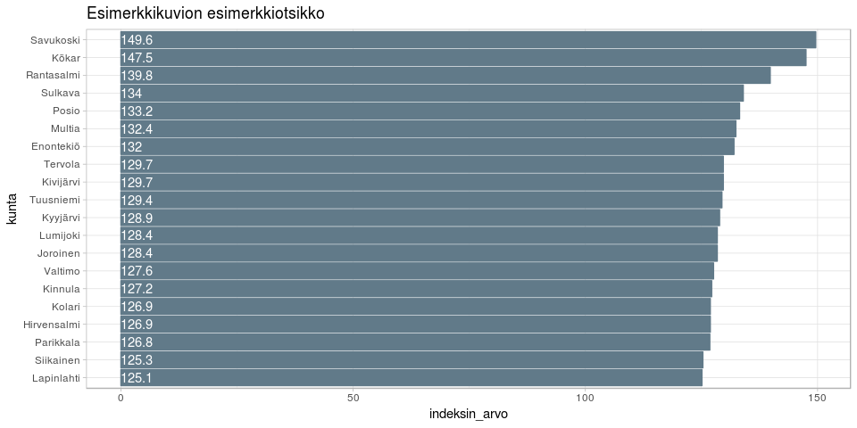

<table>
<thead>
<tr class="header">
<th style="text-align: left;">data</th>
<th style="text-align: left;">julkaistu</th>
<th style="text-align: left;">ylläpitäjä</th>
</tr>
</thead>
<tbody>
<tr class="odd">
<td style="text-align: left;"><a href='https://beta.avoindata.fi/data/fi/dataset/terveyspuntarin-sairastavuusindeksi'>Terveyspuntarin sairastavuusindeksi</a></td>
<td style="text-align: left;">2019-03-15</td>
<td style="text-align: left;"><a href='mailto:markus.kainu@kela.fi'>Markus Kainu</a></td>
</tr>
</tbody>
</table>

    library(dplyr)
    library(ggplot2)
    library(jsonlite)
    library(ckanr)
    library(readr)
    library(knitr)
    library(glue)
    library(hrbrthemes)

Resurssien lataaminen
---------------------

    ckanr_setup(url = "https://beta.avoindata.fi/data/fi/")
    x <- package_search(q = "Kansaneläkelaitos", fq = "title:terveyspuntari")
    resources <- x$results[[1]]$resources
    dat <- read_csv2(resources[[1]]$url) # Lataa data
    meta <- fromJSON(txt = resources[[2]]$url) # Lataa metadata

Datan ja metadatan kuvailu
--------------------------

**Datan kuvaustieto**

    meta$description %>% cat()

Jokaiselle Suomen kunnalle lasketun indeksin avulla pyritään
havainnollistamaan sitä, miten tervettä tai sairasta alueen väestö on
suhteessa koko maan väestön keskiarvoon (= 100). Indeksi ilmoitetaan
sekä sellaisenaan että ikä- ja sukupuolivakioituna. Vakioinnilla ikä- ja
sukupuolirakenteen vaikutus indeksilukuun voidaan poistaa, mikä
mahdollista alueittaisen vertailun alueiden välisistä ikä- ja
sukupuolirakenteen eroista huolimatta. Sairastavuusindeksi perustuu
kolmeen tilastomuuttujaan: kuolleisuuteen, työkyvyttömyyseläkkeellä
olevien osuuteen työikäisistä (16–64-vuotiaat) sekä lääkkeiden ja
ravintovalmisteiden korvausoikeuksien haltijoiden osuuteen väestöstä.
Niistä kukin on suhteutettu maan väestön keskiarvoon.
Sairastavuusindeksi on näiden kolmen osaindeksin keskiarvo. Yhden
osaindeksin laskentatapaa muutettiin vuonna 2012:
erityiskorvausoikeusindeksi laajennettiin kattamaan myös rajoitetusti
peruskorvattavien lääkkeiden korvausoikeudet sekä kliinisten
ravintovalmisteiden korvausoikeudet. Muutoksen yhteydessä osaindeksin
nimi muutettiin lääkekorvausoikeusindeksiksi. Vuonna 2013 ikä- ja
sukupuoliryhmittäistä laskentaa tarkennettiin. Kaikki Terveyspuntarin
sarastavuusindeksit on päivitetty takautuvasti nykyisen laskentatavan
mukaisiksi. Vuonna 2013 ikä- ja sukupuoliryhmittäistä laskentaa
tarkennettiin ja kaikki Terveyspuntarin sairastavuusindeksit
päivitettiin takautuvasti nykyisen laskentatavan mukaisiksi.

**Datan muuttujatieto**

    meta$resources$schema$fields[[1]] %>% kable(format = "markdown")

<table>
<thead>
<tr class="header">
<th style="text-align: left;">name</th>
<th style="text-align: left;">type</th>
<th style="text-align: left;">format</th>
</tr>
</thead>
<tbody>
<tr class="odd">
<td style="text-align: left;">kuntanumero</td>
<td style="text-align: left;">integer</td>
<td style="text-align: left;">default</td>
</tr>
<tr class="even">
<td style="text-align: left;">kunta</td>
<td style="text-align: left;">string</td>
<td style="text-align: left;">default</td>
</tr>
<tr class="odd">
<td style="text-align: left;">indeksi</td>
<td style="text-align: left;">string</td>
<td style="text-align: left;">default</td>
</tr>
<tr class="even">
<td style="text-align: left;">vuosi</td>
<td style="text-align: left;">integer</td>
<td style="text-align: left;">default</td>
</tr>
<tr class="odd">
<td style="text-align: left;">vakioitu</td>
<td style="text-align: left;">string</td>
<td style="text-align: left;">default</td>
</tr>
<tr class="even">
<td style="text-align: left;">indeksin_arvo</td>
<td style="text-align: left;">number</td>
<td style="text-align: left;">default</td>
</tr>
</tbody>
</table>

**Datan ensimmäiset rivit**

    head(dat)  %>% kable(format = "markdown")

<table>
<thead>
<tr class="header">
<th style="text-align: right;">kuntanumero</th>
<th style="text-align: left;">kunta</th>
<th style="text-align: left;">indeksi</th>
<th style="text-align: right;">vuosi</th>
<th style="text-align: left;">vakioitu</th>
<th style="text-align: right;">indeksin_arvo</th>
</tr>
</thead>
<tbody>
<tr class="odd">
<td style="text-align: right;">5</td>
<td style="text-align: left;">Alajärvi</td>
<td style="text-align: left;">-kuolleisuusindeksi</td>
<td style="text-align: right;">2017</td>
<td style="text-align: left;">Vakioitu</td>
<td style="text-align: right;">93.8</td>
</tr>
<tr class="even">
<td style="text-align: right;">5</td>
<td style="text-align: left;">Alajärvi</td>
<td style="text-align: left;">-kuolleisuusindeksi</td>
<td style="text-align: right;">2016</td>
<td style="text-align: left;">Vakioitu</td>
<td style="text-align: right;">91.9</td>
</tr>
<tr class="odd">
<td style="text-align: right;">5</td>
<td style="text-align: left;">Alajärvi</td>
<td style="text-align: left;">-kuolleisuusindeksi</td>
<td style="text-align: right;">2015</td>
<td style="text-align: left;">Vakioitu</td>
<td style="text-align: right;">92.9</td>
</tr>
<tr class="even">
<td style="text-align: right;">5</td>
<td style="text-align: left;">Alajärvi</td>
<td style="text-align: left;">-kuolleisuusindeksi</td>
<td style="text-align: right;">2014</td>
<td style="text-align: left;">Vakioitu</td>
<td style="text-align: right;">89.5</td>
</tr>
<tr class="odd">
<td style="text-align: right;">5</td>
<td style="text-align: left;">Alajärvi</td>
<td style="text-align: left;">-kuolleisuusindeksi</td>
<td style="text-align: right;">2013</td>
<td style="text-align: left;">Vakioitu</td>
<td style="text-align: right;">102.7</td>
</tr>
<tr class="even">
<td style="text-align: right;">5</td>
<td style="text-align: left;">Alajärvi</td>
<td style="text-align: left;">-kuolleisuusindeksi</td>
<td style="text-align: right;">2012</td>
<td style="text-align: left;">Vakioitu</td>
<td style="text-align: right;">104.7</td>
</tr>
</tbody>
</table>

Kuvio
-----

    dat %>% 
      filter(vuosi == 2017,
             indeksi == "-kuolleisuusindeksi") %>% 
      arrange(desc(indeksin_arvo)) %>% 
      slice(1:20) %>% 
      mutate(kunta = forcats::fct_reorder(kunta, indeksin_arvo)) %>% 
      ggplot(aes(x = kunta, y = indeksin_arvo, label = indeksin_arvo)) + 
      geom_col() + 
      coord_flip() + 
      theme_minimal() +
      geom_text(aes(y = 0), hjust = 0, color = "white") +
      labs(title = "Esimerkkikuvion esimerkkiotsikko") +
      theme_ft_rc()

Datastore-api
-------------

Jos et tarvitse koko aineistoa, voit suodattaa siitä osio SQL:llä
käyttäen CKAN:n DataStore-rajapintaa.

Alla olevassa esimerkissä tehdään rajaus `kunta`-muuttujasta ja siis
etsitään vaan kuntaa *Veteli* koskevat tiedot.

    kunta <- "Veteli"
    res <- ckanr::ds_search_sql(sql = glue("SELECT * from \"{resources[[1]]$id}\" WHERE kunta LIKE '{kunta}'"), as = "table")
    res$records %>% 
      select(-`_full_text`, -`_id`) %>% 
      kable(format = "markdown")

<table>
<thead>
<tr class="header">
<th style="text-align: left;">kunta</th>
<th style="text-align: left;">indeksin_arvo</th>
<th style="text-align: left;">kuntanumero</th>
<th style="text-align: left;">indeksi</th>
<th style="text-align: left;">vuosi</th>
<th style="text-align: left;">vakioitu</th>
</tr>
</thead>
<tbody>
<tr class="odd">
<td style="text-align: left;">Veteli</td>
<td style="text-align: left;">105,5</td>
<td style="text-align: left;">924</td>
<td style="text-align: left;">Sairastavuusindeksi</td>
<td style="text-align: left;">2013</td>
<td style="text-align: left;">Vakioitu</td>
</tr>
<tr class="even">
<td style="text-align: left;">Veteli</td>
<td style="text-align: left;">104,0</td>
<td style="text-align: left;">924</td>
<td style="text-align: left;">Sairastavuusindeksi</td>
<td style="text-align: left;">2012</td>
<td style="text-align: left;">Vakioitu</td>
</tr>
<tr class="odd">
<td style="text-align: left;">Veteli</td>
<td style="text-align: left;">102,2</td>
<td style="text-align: left;">924</td>
<td style="text-align: left;">Sairastavuusindeksi</td>
<td style="text-align: left;">2011</td>
<td style="text-align: left;">Vakioitu</td>
</tr>
<tr class="even">
<td style="text-align: left;">Veteli</td>
<td style="text-align: left;">102,0</td>
<td style="text-align: left;">924</td>
<td style="text-align: left;">Sairastavuusindeksi</td>
<td style="text-align: left;">2010</td>
<td style="text-align: left;">Vakioitu</td>
</tr>
<tr class="odd">
<td style="text-align: left;">Veteli</td>
<td style="text-align: left;">87,8</td>
<td style="text-align: left;">924</td>
<td style="text-align: left;">-kuolleisuusindeksi</td>
<td style="text-align: left;">2017</td>
<td style="text-align: left;">Vakioitu</td>
</tr>
<tr class="even">
<td style="text-align: left;">Veteli</td>
<td style="text-align: left;">85,2</td>
<td style="text-align: left;">924</td>
<td style="text-align: left;">-kuolleisuusindeksi</td>
<td style="text-align: left;">2016</td>
<td style="text-align: left;">Vakioitu</td>
</tr>
<tr class="odd">
<td style="text-align: left;">Veteli</td>
<td style="text-align: left;">81,2</td>
<td style="text-align: left;">924</td>
<td style="text-align: left;">-kuolleisuusindeksi</td>
<td style="text-align: left;">2015</td>
<td style="text-align: left;">Vakioitu</td>
</tr>
<tr class="even">
<td style="text-align: left;">Veteli</td>
<td style="text-align: left;">88,4</td>
<td style="text-align: left;">924</td>
<td style="text-align: left;">-kuolleisuusindeksi</td>
<td style="text-align: left;">2014</td>
<td style="text-align: left;">Vakioitu</td>
</tr>
<tr class="odd">
<td style="text-align: left;">Veteli</td>
<td style="text-align: left;">98,8</td>
<td style="text-align: left;">924</td>
<td style="text-align: left;">-kuolleisuusindeksi</td>
<td style="text-align: left;">2013</td>
<td style="text-align: left;">Vakioitu</td>
</tr>
<tr class="even">
<td style="text-align: left;">Veteli</td>
<td style="text-align: left;">92,1</td>
<td style="text-align: left;">924</td>
<td style="text-align: left;">-kuolleisuusindeksi</td>
<td style="text-align: left;">2012</td>
<td style="text-align: left;">Vakioitu</td>
</tr>
<tr class="odd">
<td style="text-align: left;">Veteli</td>
<td style="text-align: left;">85,2</td>
<td style="text-align: left;">924</td>
<td style="text-align: left;">-kuolleisuusindeksi</td>
<td style="text-align: left;">2011</td>
<td style="text-align: left;">Vakioitu</td>
</tr>
<tr class="even">
<td style="text-align: left;">Veteli</td>
<td style="text-align: left;">84,2</td>
<td style="text-align: left;">924</td>
<td style="text-align: left;">-kuolleisuusindeksi</td>
<td style="text-align: left;">2010</td>
<td style="text-align: left;">Vakioitu</td>
</tr>
<tr class="odd">
<td style="text-align: left;">Veteli</td>
<td style="text-align: left;">105,4</td>
<td style="text-align: left;">924</td>
<td style="text-align: left;">-lääkekorvausoikeusindeksi</td>
<td style="text-align: left;">2017</td>
<td style="text-align: left;">Vakioitu</td>
</tr>
<tr class="even">
<td style="text-align: left;">Veteli</td>
<td style="text-align: left;">105,4</td>
<td style="text-align: left;">924</td>
<td style="text-align: left;">-lääkekorvausoikeusindeksi</td>
<td style="text-align: left;">2016</td>
<td style="text-align: left;">Vakioitu</td>
</tr>
<tr class="odd">
<td style="text-align: left;">Veteli</td>
<td style="text-align: left;">106,9</td>
<td style="text-align: left;">924</td>
<td style="text-align: left;">-lääkekorvausoikeusindeksi</td>
<td style="text-align: left;">2015</td>
<td style="text-align: left;">Vakioitu</td>
</tr>
<tr class="even">
<td style="text-align: left;">Veteli</td>
<td style="text-align: left;">106,1</td>
<td style="text-align: left;">924</td>
<td style="text-align: left;">-lääkekorvausoikeusindeksi</td>
<td style="text-align: left;">2014</td>
<td style="text-align: left;">Vakioitu</td>
</tr>
<tr class="odd">
<td style="text-align: left;">Veteli</td>
<td style="text-align: left;">107,7</td>
<td style="text-align: left;">924</td>
<td style="text-align: left;">-lääkekorvausoikeusindeksi</td>
<td style="text-align: left;">2013</td>
<td style="text-align: left;">Vakioitu</td>
</tr>
<tr class="even">
<td style="text-align: left;">Veteli</td>
<td style="text-align: left;">109,0</td>
<td style="text-align: left;">924</td>
<td style="text-align: left;">-lääkekorvausoikeusindeksi</td>
<td style="text-align: left;">2012</td>
<td style="text-align: left;">Vakioitu</td>
</tr>
<tr class="odd">
<td style="text-align: left;">Veteli</td>
<td style="text-align: left;">110,6</td>
<td style="text-align: left;">924</td>
<td style="text-align: left;">-lääkekorvausoikeusindeksi</td>
<td style="text-align: left;">2011</td>
<td style="text-align: left;">Vakioitu</td>
</tr>
<tr class="even">
<td style="text-align: left;">Veteli</td>
<td style="text-align: left;">112,1</td>
<td style="text-align: left;">924</td>
<td style="text-align: left;">-lääkekorvausoikeusindeksi</td>
<td style="text-align: left;">2010</td>
<td style="text-align: left;">Vakioitu</td>
</tr>
<tr class="odd">
<td style="text-align: left;">Veteli</td>
<td style="text-align: left;">116,5</td>
<td style="text-align: left;">924</td>
<td style="text-align: left;">-työkyvyttömyysindeksi</td>
<td style="text-align: left;">2017</td>
<td style="text-align: left;">Vakioitu</td>
</tr>
<tr class="even">
<td style="text-align: left;">Veteli</td>
<td style="text-align: left;">112,8</td>
<td style="text-align: left;">924</td>
<td style="text-align: left;">-työkyvyttömyysindeksi</td>
<td style="text-align: left;">2016</td>
<td style="text-align: left;">Vakioitu</td>
</tr>
<tr class="odd">
<td style="text-align: left;">Veteli</td>
<td style="text-align: left;">105,8</td>
<td style="text-align: left;">924</td>
<td style="text-align: left;">-työkyvyttömyysindeksi</td>
<td style="text-align: left;">2015</td>
<td style="text-align: left;">Vakioitu</td>
</tr>
<tr class="even">
<td style="text-align: left;">Veteli</td>
<td style="text-align: left;">108,1</td>
<td style="text-align: left;">924</td>
<td style="text-align: left;">-työkyvyttömyysindeksi</td>
<td style="text-align: left;">2014</td>
<td style="text-align: left;">Vakioitu</td>
</tr>
<tr class="odd">
<td style="text-align: left;">Veteli</td>
<td style="text-align: left;">109,9</td>
<td style="text-align: left;">924</td>
<td style="text-align: left;">-työkyvyttömyysindeksi</td>
<td style="text-align: left;">2013</td>
<td style="text-align: left;">Vakioitu</td>
</tr>
<tr class="even">
<td style="text-align: left;">Veteli</td>
<td style="text-align: left;">110,9</td>
<td style="text-align: left;">924</td>
<td style="text-align: left;">-työkyvyttömyysindeksi</td>
<td style="text-align: left;">2012</td>
<td style="text-align: left;">Vakioitu</td>
</tr>
<tr class="odd">
<td style="text-align: left;">Veteli</td>
<td style="text-align: left;">110,9</td>
<td style="text-align: left;">924</td>
<td style="text-align: left;">-työkyvyttömyysindeksi</td>
<td style="text-align: left;">2011</td>
<td style="text-align: left;">Vakioitu</td>
</tr>
<tr class="even">
<td style="text-align: left;">Veteli</td>
<td style="text-align: left;">109,8</td>
<td style="text-align: left;">924</td>
<td style="text-align: left;">-työkyvyttömyysindeksi</td>
<td style="text-align: left;">2010</td>
<td style="text-align: left;">Vakioitu</td>
</tr>
<tr class="odd">
<td style="text-align: left;">Veteli</td>
<td style="text-align: left;">103,2</td>
<td style="text-align: left;">924</td>
<td style="text-align: left;">Sairastavuusindeksi</td>
<td style="text-align: left;">2017</td>
<td style="text-align: left;">Vakioitu</td>
</tr>
<tr class="even">
<td style="text-align: left;">Veteli</td>
<td style="text-align: left;">101,1</td>
<td style="text-align: left;">924</td>
<td style="text-align: left;">Sairastavuusindeksi</td>
<td style="text-align: left;">2016</td>
<td style="text-align: left;">Vakioitu</td>
</tr>
<tr class="odd">
<td style="text-align: left;">Veteli</td>
<td style="text-align: left;">98,0</td>
<td style="text-align: left;">924</td>
<td style="text-align: left;">Sairastavuusindeksi</td>
<td style="text-align: left;">2015</td>
<td style="text-align: left;">Vakioitu</td>
</tr>
<tr class="even">
<td style="text-align: left;">Veteli</td>
<td style="text-align: left;">100,9</td>
<td style="text-align: left;">924</td>
<td style="text-align: left;">Sairastavuusindeksi</td>
<td style="text-align: left;">2014</td>
<td style="text-align: left;">Vakioitu</td>
</tr>
</tbody>
</table>
