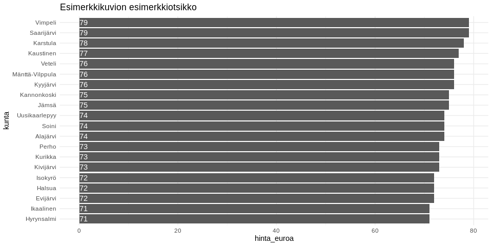

Käyttöesimerkkejä: Opintotuen saajat ja maksetut tuet
=====================================================

<table>
<colgroup>
<col style="width: 74%" />
<col style="width: 4%" />
<col style="width: 21%" />
</colgroup>
<thead>
<tr class="header">
<th style="text-align: left;">data</th>
<th style="text-align: left;">julkaistu</th>
<th style="text-align: left;">ylläpitäjä</th>
</tr>
</thead>
<tbody>
<tr class="odd">
<td style="text-align: left;"><a href='https://beta.avoindata.fi/data/fi/dataset/yksityisista-sairaanhoitopalveluista-perityt-keskimaaraiset-maksut'>Yksityisistä sairaanhoitopalveluista perityt keskimääräiset maksut</a></td>
<td style="text-align: left;">2019-03-15</td>
<td style="text-align: left;"><a href='mailto:markus.kainu@kela.fi'>Markus Kainu</a></td>
</tr>
</tbody>
</table>

    library(dplyr)
    library(ggplot2)
    library(jsonlite)
    library(ckanr)
    library(readr)
    library(knitr)
    library(glue)
    library(hrbrthemes)

Resurssien lataaminen
---------------------

    ckanr_setup(url = "https://beta.avoindata.fi/data/fi/")
    x <- package_search(q = "Kansaneläkelaitos", fq = "title:yksityisistä sairaanhoito")
    resources <- x$results[[1]]$resources
    dat <- read_csv2(resources[[1]]$url) # Lataa data
    meta <- fromJSON(txt = resources[[2]]$url) # Lataa metadata

Datan ja metadatan kuvailu
--------------------------

**Datan kuvaustieto**

    meta$description %>% cat()

Raportti sisältää tietoja sairausvakuutuksesta lääkärinpalkkioina,
hammaslääkärinpalkkioina tai tutkimuksena ja hoitona korvatuista
yksityisistä sairaanhoitopalveluista perittyjen maksujen keskiarvoista
toimenpiteittäin. - Tiedot on raportoitu kunnittain ja useiden
laajempien aluejaottelujen mukaan vuositasolla. - Kunta on palvelusta
tilastovuonna korvauksen saaneen henkilön asuinkunta vuoden lopussa. -
Toimenpide on tilastoitu sille vuodelle, jona siitä on maksettu korvaus.
- Kustannukset on jaoteltu seuraaviin ryhmiin: erikoislääkäri-
(yleisimmät erikoisalat), yleislääkäri-, hammaslääkärikäynnit, tutkimus
ja hoito sekä yleisimmät laboratorio- ja röntgentutkimukset. -
Tarkastelussa ei ole mukana seuraavia alaryhmiä: lääketieteen
opiskelijat, ulkomaalaiset lääkärit, normaalin vastaanottoajan
ulkopuolella tehdyt käynnit, kotikäynnit sekä jos yksittäisten
käyntien/hoitojen lukumäärä on kunnassa vähemmän kuin neljä. -
Aineistosta on poistettu virheelliset tiedot ennen keskiarvojen
laskemista.

**Datan muuttujatieto**

    meta$resources$schema$fields[[1]] %>% kable(format = "markdown")

<table>
<thead>
<tr class="header">
<th style="text-align: left;">name</th>
<th style="text-align: left;">type</th>
<th style="text-align: left;">format</th>
</tr>
</thead>
<tbody>
<tr class="odd">
<td style="text-align: left;">kuntanumero</td>
<td style="text-align: left;">integer</td>
<td style="text-align: left;">default</td>
</tr>
<tr class="even">
<td style="text-align: left;">kunta</td>
<td style="text-align: left;">string</td>
<td style="text-align: left;">default</td>
</tr>
<tr class="odd">
<td style="text-align: left;">toimenpide</td>
<td style="text-align: left;">string</td>
<td style="text-align: left;">default</td>
</tr>
<tr class="even">
<td style="text-align: left;">vuosi</td>
<td style="text-align: left;">integer</td>
<td style="text-align: left;">default</td>
</tr>
<tr class="odd">
<td style="text-align: left;">hinta_euroa</td>
<td style="text-align: left;">number</td>
<td style="text-align: left;">default</td>
</tr>
</tbody>
</table>

**Datan ensimmäiset rivit**

    head(dat)  %>% kable(format = "markdown")

<table>
<thead>
<tr class="header">
<th style="text-align: right;">kuntanumero</th>
<th style="text-align: left;">kunta</th>
<th style="text-align: left;">toimenpide</th>
<th style="text-align: right;">vuosi</th>
<th style="text-align: right;">hinta_euroa</th>
</tr>
</thead>
<tbody>
<tr class="odd">
<td style="text-align: right;">5</td>
<td style="text-align: left;">Alajärvi</td>
<td style="text-align: left;">Yleislääkärit, vastaanottokäynti enintään 20 min.</td>
<td style="text-align: right;">2018</td>
<td style="text-align: right;">59.24</td>
</tr>
<tr class="even">
<td style="text-align: right;">5</td>
<td style="text-align: left;">Alajärvi</td>
<td style="text-align: left;">Yleislääkärit, vastaanottokäynti enintään 20 min.</td>
<td style="text-align: right;">2017</td>
<td style="text-align: right;">58.66</td>
</tr>
<tr class="odd">
<td style="text-align: right;">5</td>
<td style="text-align: left;">Alajärvi</td>
<td style="text-align: left;">Yleislääkärit, vastaanottokäynti enintään 20 min.</td>
<td style="text-align: right;">2016</td>
<td style="text-align: right;">56.30</td>
</tr>
<tr class="even">
<td style="text-align: right;">5</td>
<td style="text-align: left;">Alajärvi</td>
<td style="text-align: left;">Yleislääkärit, vastaanottokäynti enintään 20 min.</td>
<td style="text-align: right;">2015</td>
<td style="text-align: right;">54.84</td>
</tr>
<tr class="odd">
<td style="text-align: right;">5</td>
<td style="text-align: left;">Alajärvi</td>
<td style="text-align: left;">Yleislääkärit, vastaanottokäynti enintään 20 min.</td>
<td style="text-align: right;">2014</td>
<td style="text-align: right;">52.07</td>
</tr>
<tr class="even">
<td style="text-align: right;">5</td>
<td style="text-align: left;">Alajärvi</td>
<td style="text-align: left;">Yleislääkärit, vastaanottokäynti enintään 20 min.</td>
<td style="text-align: right;">2013</td>
<td style="text-align: right;">52.62</td>
</tr>
</tbody>
</table>

Kuvio
-----

    dat %>% 
      filter(vuosi == 2018) %>% 
      arrange(desc(hinta_euroa)) %>% 
      slice(1:20) %>% 
      mutate(kunta = forcats::fct_reorder(kunta, hinta_euroa)) %>% 
      ggplot(aes(x = kunta, y = hinta_euroa, label = hinta_euroa)) + 
      geom_col() + 
      coord_flip() + 
      theme_minimal() +
      geom_text(aes(y = 0), hjust = 0, color = "white") +
      labs(title = "Esimerkkikuvion esimerkkiotsikko") +
      theme_ft_rc()

Datastore-api
-------------

Jos et tarvitse koko aineistoa, voit suodattaa siitä osio SQL:llä
käyttäen CKAN:n DataStore-rajapintaa.

Alla olevassa esimerkissä tehdään rajaus `kunta`-muuttujasta ja siis
etsitään vaan kuntaa *Veteli* koskevat tiedot.

    kunta <- "Veteli"
    res <- ckanr::ds_search_sql(sql = glue("SELECT * from \"{resources[[1]]$id}\" WHERE kunta LIKE '{kunta}'"), as = "table")
    res$records %>% 
      select(-`_full_text`, -`_id`) %>% 
      kable(format = "markdown")

<table>
<thead>
<tr class="header">
<th style="text-align: left;">kunta</th>
<th style="text-align: left;">kuntanumero</th>
<th style="text-align: left;">vuosi</th>
<th style="text-align: left;">hinta_euroa</th>
<th style="text-align: left;">toimenpide</th>
</tr>
</thead>
<tbody>
<tr class="odd">
<td style="text-align: left;">Veteli</td>
<td style="text-align: left;">924</td>
<td style="text-align: left;">2018</td>
<td style="text-align: left;">69,10</td>
<td style="text-align: left;">Yleislääkärit, vastaanottokäynti enintään 20 min.</td>
</tr>
<tr class="even">
<td style="text-align: left;">Veteli</td>
<td style="text-align: left;">924</td>
<td style="text-align: left;">2017</td>
<td style="text-align: left;">61,67</td>
<td style="text-align: left;">Yleislääkärit, vastaanottokäynti enintään 20 min.</td>
</tr>
<tr class="odd">
<td style="text-align: left;">Veteli</td>
<td style="text-align: left;">924</td>
<td style="text-align: left;">2016</td>
<td style="text-align: left;">54,93</td>
<td style="text-align: left;">Yleislääkärit, vastaanottokäynti enintään 20 min.</td>
</tr>
<tr class="even">
<td style="text-align: left;">Veteli</td>
<td style="text-align: left;">924</td>
<td style="text-align: left;">2015</td>
<td style="text-align: left;">53,63</td>
<td style="text-align: left;">Yleislääkärit, vastaanottokäynti enintään 20 min.</td>
</tr>
<tr class="odd">
<td style="text-align: left;">Veteli</td>
<td style="text-align: left;">924</td>
<td style="text-align: left;">2014</td>
<td style="text-align: left;">48,69</td>
<td style="text-align: left;">Yleislääkärit, vastaanottokäynti enintään 20 min.</td>
</tr>
<tr class="even">
<td style="text-align: left;">Veteli</td>
<td style="text-align: left;">924</td>
<td style="text-align: left;">2013</td>
<td style="text-align: left;">49,33</td>
<td style="text-align: left;">Yleislääkärit, vastaanottokäynti enintään 20 min.</td>
</tr>
<tr class="odd">
<td style="text-align: left;">Veteli</td>
<td style="text-align: left;">924</td>
<td style="text-align: left;">2012</td>
<td style="text-align: left;">46,16</td>
<td style="text-align: left;">Yleislääkärit, vastaanottokäynti enintään 20 min.</td>
</tr>
<tr class="even">
<td style="text-align: left;">Veteli</td>
<td style="text-align: left;">924</td>
<td style="text-align: left;">2011</td>
<td style="text-align: left;">43,60</td>
<td style="text-align: left;">Yleislääkärit, vastaanottokäynti enintään 20 min.</td>
</tr>
<tr class="odd">
<td style="text-align: left;">Veteli</td>
<td style="text-align: left;">924</td>
<td style="text-align: left;">2010</td>
<td style="text-align: left;">44,22</td>
<td style="text-align: left;">Yleislääkärit, vastaanottokäynti enintään 20 min.</td>
</tr>
</tbody>
</table>
