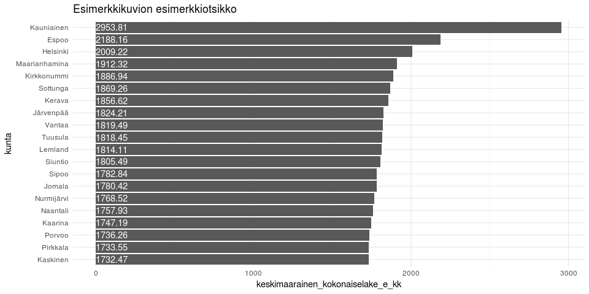
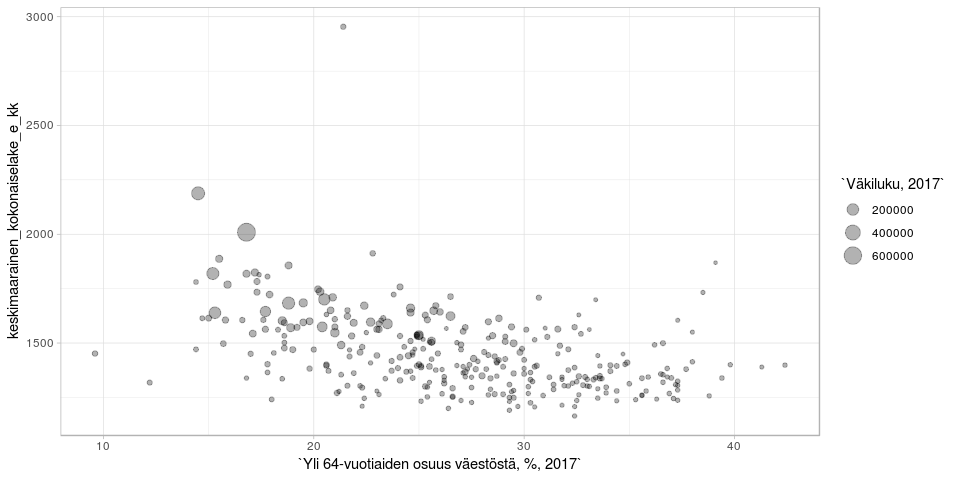

<table>
<thead>
<tr class="header">
<th style="text-align: left;">data</th>
<th style="text-align: left;">julkaistu</th>
<th style="text-align: left;">ylläpitäjä</th>
</tr>
</thead>
<tbody>
<tr class="odd">
<td style="text-align: left;"><a href='https://beta.avoindata.fi/data/fi/dataset/suomen-elakkeensaajat-ja-keskimaaraiset-elakkeet'>Suomen eläkkeensaajat ja keskimääräiset eläkkeet</a></td>
<td style="text-align: left;">2019-03-19</td>
<td style="text-align: left;"><a href='mailto:markus.kainu@kela.fi'>Markus Kainu</a></td>
</tr>
</tbody>
</table>

    library(dplyr)
    library(ggplot2)
    library(jsonlite)
    library(ckanr)
    library(readr)
    library(knitr)
    library(glue)
    library(pxweb)
    library(tidyr)

Resurssien lataaminen
---------------------

    ckanr_setup(url = "https://beta.avoindata.fi/data/fi/")
    x <- package_search(q = "Kansaneläkelaitos", fq = "title:eläkkeensaajat")
    resources <- x$results[[1]]$resources
    dat <- read_csv2(resources[[1]]$url) # Lataa data
    meta <- fromJSON(txt = resources[[2]]$url) # Lataa metadata

Datan ja metadatan kuvailu
--------------------------

**Datan kuvaustieto**

    meta$description %>% cat()

Suomen eläketurva koostuu pääpiirteissään kahdesta lakisääteisestä
eläkejärjestelmästä, kansaneläkejärjestelmästä ja
työeläkejärjestelmästä. Lakisääteistä eläketurvaa ovat myös liikenne- ja
tapaturmavakuutuslakien sekä sotilasvamma- ja sotilastapaturmalakien
mukaiset eläkkeet, ns. SOLITA-eläkkeet. Tämä raportti sisältää tietoja
kansan- ja/tai työeläkejärjestelmän eläkkeensaajien lukumäärästä ja
keskimääräisistä kokonaiseläkkeistä. Mukana ovat myös ulkomaille
maksetut eläkkeet. Lakisääteisen eläketurvan osalta raportti on lähes
tyhjentävä, vain pelkkää SOLITA-eläkettä saavat henkilöt ja heidän
eläkkeensä eivät ole mukana. Vapaaehtoisesta eläketurvasta on mukana
vain työnantajan kustantama rekisteröity lisäeläketurva. Eri eläkelajeja
ei voi summata yhteen, sillä henkilö voi saada samanaikaisesti eläkettä
sekä kansan- että työeläkejärjestelmästä. Kelasta hänellä ei voi olla
yhtä aikaa eri eläkelajien mukaista eläkettä, mutta työeläkkeenä hän voi
saada samanaikaisesti sekä usean eläkelain että usean eläkelajin
mukaista eläkettä. Kokonaiseläke voi koostua Kelan eläkkeestä ja
työeläkkeestä sekä niihin liittyvistä SOLITA-eläkkeistä,
lapsikorotuksista, rintamalisästä ja ylimääräisestä rintamalisästä sekä
vuoteen 2007 saakka eläkkeensaajien asumistuesta ja hoitotuesta.

**Datan muuttujatieto**

    meta$resources$schema$fields[[1]] %>% kable(format = "markdown")

<table>
<thead>
<tr class="header">
<th style="text-align: left;">name</th>
<th style="text-align: left;">type</th>
<th style="text-align: left;">format</th>
</tr>
</thead>
<tbody>
<tr class="odd">
<td style="text-align: left;">kuntanumero</td>
<td style="text-align: left;">integer</td>
<td style="text-align: left;">default</td>
</tr>
<tr class="even">
<td style="text-align: left;">kunta</td>
<td style="text-align: left;">string</td>
<td style="text-align: left;">default</td>
</tr>
<tr class="odd">
<td style="text-align: left;">vuosi</td>
<td style="text-align: left;">integer</td>
<td style="text-align: left;">default</td>
</tr>
<tr class="even">
<td style="text-align: left;">elakelaji</td>
<td style="text-align: left;">string</td>
<td style="text-align: left;">default</td>
</tr>
<tr class="odd">
<td style="text-align: left;">sukupuoli</td>
<td style="text-align: left;">string</td>
<td style="text-align: left;">default</td>
</tr>
<tr class="even">
<td style="text-align: left;">ikaryhma</td>
<td style="text-align: left;">string</td>
<td style="text-align: left;">default</td>
</tr>
<tr class="odd">
<td style="text-align: left;">elakejarjestelma</td>
<td style="text-align: left;">string</td>
<td style="text-align: left;">default</td>
</tr>
<tr class="even">
<td style="text-align: left;">asuinmaa</td>
<td style="text-align: left;">string</td>
<td style="text-align: left;">default</td>
</tr>
<tr class="odd">
<td style="text-align: left;">saajat</td>
<td style="text-align: left;">integer</td>
<td style="text-align: left;">default</td>
</tr>
<tr class="even">
<td style="text-align: left;">keskimaarainen_kokonaiselake_e_kk</td>
<td style="text-align: left;">number</td>
<td style="text-align: left;">default</td>
</tr>
</tbody>
</table>

**Datan ensimmäiset rivit**

    head(dat)  %>% kable(format = "markdown")

<table>
<colgroup>
<col style="width: 9%" />
<col style="width: 7%" />
<col style="width: 4%" />
<col style="width: 7%" />
<col style="width: 7%" />
<col style="width: 6%" />
<col style="width: 17%" />
<col style="width: 6%" />
<col style="width: 5%" />
<col style="width: 26%" />
</colgroup>
<thead>
<tr class="header">
<th style="text-align: right;">kuntanumero</th>
<th style="text-align: left;">kunta</th>
<th style="text-align: right;">vuosi</th>
<th style="text-align: left;">elakelaji</th>
<th style="text-align: left;">sukupuoli</th>
<th style="text-align: left;">ikaryhma</th>
<th style="text-align: left;">elakejarjestelma</th>
<th style="text-align: left;">asuinmaa</th>
<th style="text-align: right;">saajat</th>
<th style="text-align: right;">keskimaarainen_kokonaiselake_e_kk</th>
</tr>
</thead>
<tbody>
<tr class="odd">
<td style="text-align: right;">5</td>
<td style="text-align: left;">Alajärvi</td>
<td style="text-align: right;">2017</td>
<td style="text-align: left;">Yhteensä</td>
<td style="text-align: left;">Yhteensä</td>
<td style="text-align: left;">Yhteensä</td>
<td style="text-align: left;">Kaikki eläkkeen saajat</td>
<td style="text-align: left;">Suomi</td>
<td style="text-align: right;">3463</td>
<td style="text-align: right;">1253.347</td>
</tr>
<tr class="even">
<td style="text-align: right;">9</td>
<td style="text-align: left;">Alavieska</td>
<td style="text-align: right;">2017</td>
<td style="text-align: left;">Yhteensä</td>
<td style="text-align: left;">Yhteensä</td>
<td style="text-align: left;">Yhteensä</td>
<td style="text-align: left;">Kaikki eläkkeen saajat</td>
<td style="text-align: left;">Suomi</td>
<td style="text-align: right;">812</td>
<td style="text-align: right;">1263.518</td>
</tr>
<tr class="odd">
<td style="text-align: right;">10</td>
<td style="text-align: left;">Alavus</td>
<td style="text-align: right;">2017</td>
<td style="text-align: left;">Yhteensä</td>
<td style="text-align: left;">Yhteensä</td>
<td style="text-align: left;">Yhteensä</td>
<td style="text-align: left;">Kaikki eläkkeen saajat</td>
<td style="text-align: left;">Suomi</td>
<td style="text-align: right;">4116</td>
<td style="text-align: right;">1292.210</td>
</tr>
<tr class="even">
<td style="text-align: right;">16</td>
<td style="text-align: left;">Asikkala</td>
<td style="text-align: right;">2017</td>
<td style="text-align: left;">Yhteensä</td>
<td style="text-align: left;">Yhteensä</td>
<td style="text-align: left;">Yhteensä</td>
<td style="text-align: left;">Kaikki eläkkeen saajat</td>
<td style="text-align: left;">Suomi</td>
<td style="text-align: right;">3223</td>
<td style="text-align: right;">1528.110</td>
</tr>
<tr class="odd">
<td style="text-align: right;">18</td>
<td style="text-align: left;">Askola</td>
<td style="text-align: right;">2017</td>
<td style="text-align: left;">Yhteensä</td>
<td style="text-align: left;">Yhteensä</td>
<td style="text-align: left;">Yhteensä</td>
<td style="text-align: left;">Kaikki eläkkeen saajat</td>
<td style="text-align: left;">Suomi</td>
<td style="text-align: right;">1209</td>
<td style="text-align: right;">1533.034</td>
</tr>
<tr class="even">
<td style="text-align: right;">19</td>
<td style="text-align: left;">Aura</td>
<td style="text-align: right;">2017</td>
<td style="text-align: left;">Yhteensä</td>
<td style="text-align: left;">Yhteensä</td>
<td style="text-align: left;">Yhteensä</td>
<td style="text-align: left;">Kaikki eläkkeen saajat</td>
<td style="text-align: left;">Suomi</td>
<td style="text-align: right;">966</td>
<td style="text-align: right;">1454.336</td>
</tr>
</tbody>
</table>

Kuvio
-----

    dat %>% 
      filter(vuosi == 2017,
             elakelaji == "Yhteensä",
             sukupuoli == "Yhteensä",
             ikaryhma == "Yhteensä",
             elakejarjestelma == "Kaikki eläkkeen saajat",
             asuinmaa == "Suomi") %>% 
      arrange(desc(keskimaarainen_kokonaiselake_e_kk)) %>% 
      slice(1:20) %>% 
      mutate(kunta = forcats::fct_reorder(kunta, keskimaarainen_kokonaiselake_e_kk)) %>% 
      ggplot(aes(x = kunta, y = keskimaarainen_kokonaiselake_e_kk, label = keskimaarainen_kokonaiselake_e_kk)) + 
      geom_col() + 
      coord_flip() + 
      theme_minimal() +
      geom_text(aes(y = 0), hjust = 0, color = "white") +
      labs(title = "Esimerkkikuvion esimerkkiotsikko")

Datan yhdistäminen Tilastokeskuksen kuntien avainlukuihin
---------------------------------------------------------

    # PXWEB query 
    pxweb_query_list <- 
      list("Alue 2018"=c("SSS","020","005","009","010","016","018","019","035","043","046","047","049","050","051","052","060","061","062","065","069","071","072","074","075","076","077","078","079","081","082","086","111","090","091","097","098","099","102","103","105","106","108","109","139","140","142","143","145","146","153","148","149","151","152","165","167","169","170","171","172","176","177","178","179","181","182","186","202","204","205","208","211","213","214","216","217","218","224","226","230","231","232","233","235","236","239","240","320","241","322","244","245","249","250","256","257","260","261","263","265","271","272","273","275","276","280","284","285","286","287","288","290","291","295","297","300","301","304","305","312","316","317","318","398","399","400","407","402","403","405","408","410","416","417","418","420","421","422","423","425","426","444","430","433","434","435","436","438","440","441","475","478","480","481","483","484","489","491","494","495","498","499","500","503","504","505","508","507","529","531","535","536","538","541","543","545","560","561","562","563","564","309","576","577","578","445","580","581","599","583","854","584","588","592","593","595","598","601","604","607","608","609","611","638","614","615","616","619","620","623","624","625","626","630","631","635","636","678","710","680","681","683","684","686","687","689","691","694","697","698","700","702","704","707","729","732","734","736","790","738","739","740","742","743","746","747","748","791","749","751","753","755","758","759","761","762","765","766","768","771","777","778","781","783","831","832","833","834","837","844","845","846","848","849","850","851","853","857","858","859","886","887","889","890","892","893","895","785","905","908","911","092","915","918","921","922","924","925","927","931","934","935","936","941","946","976","977","980","981","989","992","MK01","MK02","MK04","MK05","MK06","MK07","MK08","MK09","MK10","MK11","MK12","MK13","MK14","MK15","MK16","MK17","MK18","MK19","MK21","SK011","SK014","SK015","SK016","SK021","SK022","SK023","SK024","SK025","SK041","SK043","SK044","SK051","SK052","SK053","SK061","SK063","SK064","SK068","SK069","SK071","SK081","SK082","SK091","SK093","SK101","SK103","SK105","SK111","SK112","SK113","SK114","SK115","SK122","SK124","SK125","SK131","SK132","SK133","SK134","SK135","SK138","SK141","SK142","SK144","SK146","SK151","SK152","SK153","SK154","SK161","SK162","SK171","SK173","SK174","SK175","SK176","SK177","SK178","SK181","SK182","SK191","SK192","SK193","SK194","SK196","SK197","SK211","SK212","SK213","2020MK01","2020MK02","2020MK04","2020MK05","2020MK06","2020MK07","2020MK08","2020MK09","2020MK10","2020MK11","2020MK12","2020MK13","2020MK14","2020MK15","2020MK16","2020MK17","2020MK18","2020MK19","2020MK21","2020SK011","2020SK014","2020SK015","2020SK016","2020SK021","2020SK022","2020SK023","2020SK024","2020SK025","2020SK041","2020SK043","2020SK044","2020SK051","2020SK052","2020SK053","2020SK061","2020SK063","2020SK064","2020SK068","2020SK069","2020SK071","2020SK081","2020SK082","2020SK091","2020SK093","2020SK101","2020SK103","2020SK105","2020SK111","2020SK112","2020SK113","2020SK114","2020SK115","2020SK122","2020SK124","2020SK125","2020SK131","2020SK132","2020SK133","2020SK134","2020SK135","2020SK138","2020SK141","2020SK142","2020SK144","2020SK146","2020SK151","2020SK152","2020SK153","2020SK154","2020SK161","2020SK162","2020SK171","2020SK173","2020SK174","2020SK175","2020SK176","2020SK177","2020SK178","2020SK181","2020SK182","2020SK191","2020SK192","2020SK193","2020SK194","2020SK196","2020SK197","2020SK211","2020SK212","2020SK213"),
           "Tiedot"=c("M408","M411","M476","M391","M421","M478","M404","M410","M303","M297","M302","M44","M62","M70","M488","M486","M137","M140","M130","M162","M78","M485","M152","M72","M84","M106","M499","M496","M495","M497","M498"))

    # Download data 
    tk_lst <- 
      pxweb_get(url = "http://pxnet2.stat.fi/PXWeb/api/v1/fi/Kuntien_avainluvut/2018/kuntien_avainluvut_2018_viimeisin.px",
                query = pxweb_query_list)
    tk_avainluvut <- as.data.frame(tk_lst, column.name.type = "text", variable.value.type = "text") %>% 
      # levitetään data
      spread(key = Tiedot, value = `Kuntien avainluvut`)

    df <- left_join(dat, tk_avainluvut, by = c("kunta" = "Alue 2018"))
    # Piirretään hajontakuvio
    df2 <- df %>% 
      filter(vuosi == 2017,
             elakelaji == "Yhteensä",
             sukupuoli == "Yhteensä",
             ikaryhma == "Yhteensä",
             elakejarjestelma == "Kaikki eläkkeen saajat",
             asuinmaa == "Suomi")

    ggplot(df2, aes(x = `Yli 64-vuotiaiden osuus väestöstä, %, 2017`, 
                    y = keskimaarainen_kokonaiselake_e_kk, 
                    size = `Väkiluku, 2017`)) + 
      geom_point(alpha = .3) +
      labs(y = "keskimaarainen_kokonaiselake_e_kk") + 
      theme_light()

Datastore-api
-------------

Jos et tarvitse koko aineistoa, voit suodattaa siitä osio SQL:llä
käyttäen CKAN:n DataStore-rajapintaa.

Alla olevassa esimerkissä tehdään rajaus `kunta`-muuttujasta ja siis
etsitään vaan kuntaa *Veteli* koskevat tiedot.

    kunta <- "Veteli"
    res <- ckanr::ds_search_sql(sql = glue("SELECT * from \"{resources[[1]]$id}\" WHERE kunta LIKE '{kunta}'"), as = "table")
    res$records %>% 
      select(-`_full_text`, -`_id`) %>% 
      kable(format = "markdown")

<table>
<colgroup>
<col style="width: 4%" />
<col style="width: 7%" />
<col style="width: 4%" />
<col style="width: 6%" />
<col style="width: 3%" />
<col style="width: 29%" />
<col style="width: 5%" />
<col style="width: 20%" />
<col style="width: 5%" />
<col style="width: 13%" />
</colgroup>
<thead>
<tr class="header">
<th style="text-align: left;">kunta</th>
<th style="text-align: left;">kuntanumero</th>
<th style="text-align: left;">saajat</th>
<th style="text-align: left;">sukupuoli</th>
<th style="text-align: left;">vuosi</th>
<th style="text-align: left;">elakelaji</th>
<th style="text-align: left;">ikaryhma</th>
<th style="text-align: left;">keskimaarainen_kokonaiselake_e_kk</th>
<th style="text-align: left;">asuinmaa</th>
<th style="text-align: left;">elakejarjestelma</th>
</tr>
</thead>
<tbody>
<tr class="odd">
<td style="text-align: left;">Veteli</td>
<td style="text-align: left;">924</td>
<td style="text-align: left;">1155</td>
<td style="text-align: left;">Yhteensä</td>
<td style="text-align: left;">2017</td>
<td style="text-align: left;">Yhteensä</td>
<td style="text-align: left;">Yhteensä</td>
<td style="text-align: left;">1261,4278</td>
<td style="text-align: left;">Suomi</td>
<td style="text-align: left;">Kaikki eläkkeen saajat</td>
</tr>
<tr class="even">
<td style="text-align: left;">Veteli</td>
<td style="text-align: left;">924</td>
<td style="text-align: left;">1127</td>
<td style="text-align: left;">Yhteensä</td>
<td style="text-align: left;">2017</td>
<td style="text-align: left;">Omaeläkkeet (kaikki)</td>
<td style="text-align: left;">Yhteensä</td>
<td style="text-align: left;">1282,2545</td>
<td style="text-align: left;">Suomi</td>
<td style="text-align: left;">Kaikki eläkkeen saajat</td>
</tr>
<tr class="odd">
<td style="text-align: left;">Veteli</td>
<td style="text-align: left;">924</td>
<td style="text-align: left;">1118</td>
<td style="text-align: left;">Yhteensä</td>
<td style="text-align: left;">2017</td>
<td style="text-align: left;">-Omaeläkkeet (pl. osa-aikaeläkkeet)</td>
<td style="text-align: left;">Yhteensä</td>
<td style="text-align: left;">1287,4961</td>
<td style="text-align: left;">Suomi</td>
<td style="text-align: left;">Kaikki eläkkeen saajat</td>
</tr>
<tr class="even">
<td style="text-align: left;">Veteli</td>
<td style="text-align: left;">924</td>
<td style="text-align: left;">4</td>
<td style="text-align: left;">Yhteensä</td>
<td style="text-align: left;">2017</td>
<td style="text-align: left;">-Osa-aikaeläkkeet</td>
<td style="text-align: left;">Yhteensä</td>
<td style="text-align: left;">662,6075</td>
<td style="text-align: left;">Suomi</td>
<td style="text-align: left;">Kaikki eläkkeen saajat</td>
</tr>
<tr class="odd">
<td style="text-align: left;">Veteli</td>
<td style="text-align: left;">924</td>
<td style="text-align: left;">1120</td>
<td style="text-align: left;">Yhteensä</td>
<td style="text-align: left;">2017</td>
<td style="text-align: left;">-Vanhuus-, työkyvyttömyys- ja työttömyyseläkkeet</td>
<td style="text-align: left;">Yhteensä</td>
<td style="text-align: left;">1284,6775</td>
<td style="text-align: left;">Suomi</td>
<td style="text-align: left;">Kaikki eläkkeen saajat</td>
</tr>
<tr class="even">
<td style="text-align: left;">Veteli</td>
<td style="text-align: left;">924</td>
<td style="text-align: left;">989</td>
<td style="text-align: left;">Yhteensä</td>
<td style="text-align: left;">2017</td>
<td style="text-align: left;">–Vanhuuseläkkeet</td>
<td style="text-align: left;">Yhteensä</td>
<td style="text-align: left;">1314,4711</td>
<td style="text-align: left;">Suomi</td>
<td style="text-align: left;">Kaikki eläkkeen saajat</td>
</tr>
<tr class="odd">
<td style="text-align: left;">Veteli</td>
<td style="text-align: left;">924</td>
<td style="text-align: left;">141</td>
<td style="text-align: left;">Yhteensä</td>
<td style="text-align: left;">2017</td>
<td style="text-align: left;">–Työkyvyttömyyseläkkeet</td>
<td style="text-align: left;">Yhteensä</td>
<td style="text-align: left;">1063,5766</td>
<td style="text-align: left;">Suomi</td>
<td style="text-align: left;">Kaikki eläkkeen saajat</td>
</tr>
<tr class="even">
<td style="text-align: left;">Veteli</td>
<td style="text-align: left;">924</td>
<td style="text-align: left;">20</td>
<td style="text-align: left;">Yhteensä</td>
<td style="text-align: left;">2017</td>
<td style="text-align: left;">-Maatalouden erityiseläke</td>
<td style="text-align: left;">Yhteensä</td>
<td style="text-align: left;">1160,0215</td>
<td style="text-align: left;">Suomi</td>
<td style="text-align: left;">Kaikki eläkkeen saajat</td>
</tr>
<tr class="odd">
<td style="text-align: left;">Veteli</td>
<td style="text-align: left;">924</td>
<td style="text-align: left;">225</td>
<td style="text-align: left;">Yhteensä</td>
<td style="text-align: left;">2017</td>
<td style="text-align: left;">Perhe-eläkkeet</td>
<td style="text-align: left;">Yhteensä</td>
<td style="text-align: left;">1192,3572</td>
<td style="text-align: left;">Suomi</td>
<td style="text-align: left;">Kaikki eläkkeen saajat</td>
</tr>
<tr class="even">
<td style="text-align: left;">Veteli</td>
<td style="text-align: left;">924</td>
<td style="text-align: left;">215</td>
<td style="text-align: left;">Yhteensä</td>
<td style="text-align: left;">2017</td>
<td style="text-align: left;">-Leskeneläke</td>
<td style="text-align: left;">Yhteensä</td>
<td style="text-align: left;">1231,4514</td>
<td style="text-align: left;">Suomi</td>
<td style="text-align: left;">Kaikki eläkkeen saajat</td>
</tr>
<tr class="odd">
<td style="text-align: left;">Veteli</td>
<td style="text-align: left;">924</td>
<td style="text-align: left;">10</td>
<td style="text-align: left;">Yhteensä</td>
<td style="text-align: left;">2017</td>
<td style="text-align: left;">-Lapseneläke</td>
<td style="text-align: left;">Yhteensä</td>
<td style="text-align: left;">351,8320</td>
<td style="text-align: left;">Suomi</td>
<td style="text-align: left;">Kaikki eläkkeen saajat</td>
</tr>
<tr class="even">
<td style="text-align: left;">Veteli</td>
<td style="text-align: left;">924</td>
<td style="text-align: left;">1135</td>
<td style="text-align: left;">Yhteensä</td>
<td style="text-align: left;">2016</td>
<td style="text-align: left;">Yhteensä</td>
<td style="text-align: left;">Yhteensä</td>
<td style="text-align: left;">1240,7380</td>
<td style="text-align: left;">Suomi</td>
<td style="text-align: left;">Kaikki eläkkeen saajat</td>
</tr>
<tr class="odd">
<td style="text-align: left;">Veteli</td>
<td style="text-align: left;">924</td>
<td style="text-align: left;">1103</td>
<td style="text-align: left;">Yhteensä</td>
<td style="text-align: left;">2016</td>
<td style="text-align: left;">Omaeläkkeet (kaikki)</td>
<td style="text-align: left;">Yhteensä</td>
<td style="text-align: left;">1265,6481</td>
<td style="text-align: left;">Suomi</td>
<td style="text-align: left;">Kaikki eläkkeen saajat</td>
</tr>
<tr class="even">
<td style="text-align: left;">Veteli</td>
<td style="text-align: left;">924</td>
<td style="text-align: left;">1098</td>
<td style="text-align: left;">Yhteensä</td>
<td style="text-align: left;">2016</td>
<td style="text-align: left;">-Omaeläkkeet (pl. osa-aikaeläkkeet)</td>
<td style="text-align: left;">Yhteensä</td>
<td style="text-align: left;">1268,4329</td>
<td style="text-align: left;">Suomi</td>
<td style="text-align: left;">Kaikki eläkkeen saajat</td>
</tr>
<tr class="odd">
<td style="text-align: left;">Veteli</td>
<td style="text-align: left;">924</td>
<td style="text-align: left;">5</td>
<td style="text-align: left;">Yhteensä</td>
<td style="text-align: left;">2016</td>
<td style="text-align: left;">-Osa-aikaeläkkeet</td>
<td style="text-align: left;">Yhteensä</td>
<td style="text-align: left;">654,1220</td>
<td style="text-align: left;">Suomi</td>
<td style="text-align: left;">Kaikki eläkkeen saajat</td>
</tr>
<tr class="even">
<td style="text-align: left;">Veteli</td>
<td style="text-align: left;">924</td>
<td style="text-align: left;">1094</td>
<td style="text-align: left;">Yhteensä</td>
<td style="text-align: left;">2016</td>
<td style="text-align: left;">-Vanhuus-, työkyvyttömyys- ja työttömyyseläkkeet</td>
<td style="text-align: left;">Yhteensä</td>
<td style="text-align: left;">1268,8667</td>
<td style="text-align: left;">Suomi</td>
<td style="text-align: left;">Kaikki eläkkeen saajat</td>
</tr>
<tr class="odd">
<td style="text-align: left;">Veteli</td>
<td style="text-align: left;">924</td>
<td style="text-align: left;">956</td>
<td style="text-align: left;">Yhteensä</td>
<td style="text-align: left;">2016</td>
<td style="text-align: left;">–Vanhuuseläkkeet</td>
<td style="text-align: left;">Yhteensä</td>
<td style="text-align: left;">1298,7915</td>
<td style="text-align: left;">Suomi</td>
<td style="text-align: left;">Kaikki eläkkeen saajat</td>
</tr>
<tr class="even">
<td style="text-align: left;">Veteli</td>
<td style="text-align: left;">924</td>
<td style="text-align: left;">150</td>
<td style="text-align: left;">Yhteensä</td>
<td style="text-align: left;">2016</td>
<td style="text-align: left;">–Työkyvyttömyyseläkkeet</td>
<td style="text-align: left;">Yhteensä</td>
<td style="text-align: left;">1074,2189</td>
<td style="text-align: left;">Suomi</td>
<td style="text-align: left;">Kaikki eläkkeen saajat</td>
</tr>
<tr class="odd">
<td style="text-align: left;">Veteli</td>
<td style="text-align: left;">924</td>
<td style="text-align: left;">22</td>
<td style="text-align: left;">Yhteensä</td>
<td style="text-align: left;">2016</td>
<td style="text-align: left;">-Maatalouden erityiseläke</td>
<td style="text-align: left;">Yhteensä</td>
<td style="text-align: left;">1146,4827</td>
<td style="text-align: left;">Suomi</td>
<td style="text-align: left;">Kaikki eläkkeen saajat</td>
</tr>
<tr class="even">
<td style="text-align: left;">Veteli</td>
<td style="text-align: left;">924</td>
<td style="text-align: left;">230</td>
<td style="text-align: left;">Yhteensä</td>
<td style="text-align: left;">2016</td>
<td style="text-align: left;">Perhe-eläkkeet</td>
<td style="text-align: left;">Yhteensä</td>
<td style="text-align: left;">1172,2555</td>
<td style="text-align: left;">Suomi</td>
<td style="text-align: left;">Kaikki eläkkeen saajat</td>
</tr>
<tr class="odd">
<td style="text-align: left;">Veteli</td>
<td style="text-align: left;">924</td>
<td style="text-align: left;">216</td>
<td style="text-align: left;">Yhteensä</td>
<td style="text-align: left;">2016</td>
<td style="text-align: left;">-Leskeneläke</td>
<td style="text-align: left;">Yhteensä</td>
<td style="text-align: left;">1228,0493</td>
<td style="text-align: left;">Suomi</td>
<td style="text-align: left;">Kaikki eläkkeen saajat</td>
</tr>
</tbody>
</table>
