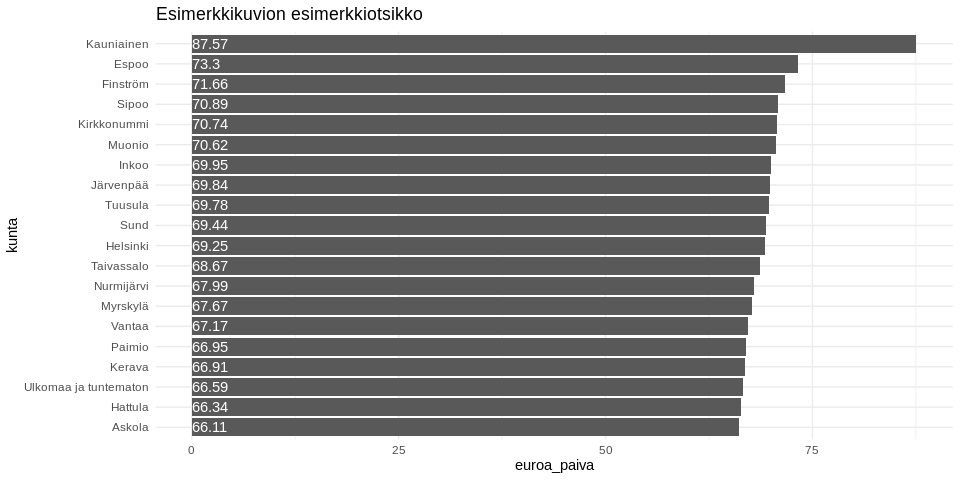

<table style="width:100%;">
<colgroup>
<col style="width: 72%" />
<col style="width: 4%" />
<col style="width: 22%" />
</colgroup>
<thead>
<tr class="header">
<th style="text-align: left;">data</th>
<th style="text-align: left;">julkaistu</th>
<th style="text-align: left;">ylläpitäjä</th>
</tr>
</thead>
<tbody>
<tr class="odd">
<td style="text-align: left;"><a href='https://beta.avoindata.fi/data/fi/dataset/suomen-tyottomyysturvaetuuksien-saajat-ja-maksetut-etuudet'>Suomen työttömyysturvaetuuksien saajat ja maksetut etuudet</a></td>
<td style="text-align: left;">2019-04-23</td>
<td style="text-align: left;"><a href='mailto:markus.kainu@kela.fi'>Markus Kainu</a></td>
</tr>
</tbody>
</table>

    library(dplyr)
    library(ggplot2)
    library(jsonlite)
    library(ckanr)
    library(readr)
    library(knitr)
    library(glue)
    library(tidyr)
    library(pxweb)

Resurssien lataaminen
---------------------

    ckanr_setup(url = "https://beta.avoindata.fi/data/fi/")
    x <- package_search(q = "Kansaneläkelaitos", fq = "title:työttömyysturvaetuuksien")
    resources <- x$results[[1]]$resources
    dat <- read.table(resources[[1]]$url, header = TRUE, sep = ";", dec = ",", stringsAsFactors = FALSE) # Lataa data
    meta <- fromJSON(txt = resources[[2]]$url) # Lataa metadata

Datan ja metadatan kuvailu
--------------------------

**Datan kuvaustieto**

    meta$description %>% cat()

Raportilla on Suomen työttömyysturvaetuuksien saajat, maksetut etuudet
sekä korvatut päivät tilastointiajanjakson aikana. Euroa/päivä-tieto on
laskettu jakamalla maksetut etuudet korvatuilla päivillä. Raportilla on
sekä työttömyyskassojen maksamat ansioturvan etuudet että Kelan maksamat
perusturvan etuudet. Korvausperusteluokitus jakaa etuudet
työttömyysajalta ja aktiivitoimenpiteen ajalta maksettuihin etuuksiin.
Vuorottelukorvaukset ovat luokassa ‘Muu peruste’. Tieto puuttuu
-luokkaan on tilastoitu Kelan etuuksien palautukset, joille ei tiedetä
korvausperustetta. Huomattavaa: Työttömyyspäivärahoja alettiin maksaa
aktiivitoimenpiteiden ajalta vuodesta 2010 alkaen.

**Datan muuttujatieto**

    meta$resources$schema$fields[[1]] %>%
      select(-values) %>% 
      kable(format = "markdown")

<table>
<thead>
<tr class="header">
<th style="text-align: left;">name</th>
<th style="text-align: left;">type</th>
<th style="text-align: left;">format</th>
</tr>
</thead>
<tbody>
<tr class="odd">
<td style="text-align: left;">kuntanumero</td>
<td style="text-align: left;">integer</td>
<td style="text-align: left;">default</td>
</tr>
<tr class="even">
<td style="text-align: left;">kunta</td>
<td style="text-align: left;">string</td>
<td style="text-align: left;">default</td>
</tr>
<tr class="odd">
<td style="text-align: left;">aikajakso</td>
<td style="text-align: left;">string</td>
<td style="text-align: left;">default</td>
</tr>
<tr class="even">
<td style="text-align: left;">etuuslaji</td>
<td style="text-align: left;">string</td>
<td style="text-align: left;">default</td>
</tr>
<tr class="odd">
<td style="text-align: left;">korvausperuste</td>
<td style="text-align: left;">string</td>
<td style="text-align: left;">default</td>
</tr>
<tr class="even">
<td style="text-align: left;">sukupuoli</td>
<td style="text-align: left;">string</td>
<td style="text-align: left;">default</td>
</tr>
<tr class="odd">
<td style="text-align: left;">ikaryhma</td>
<td style="text-align: left;">string</td>
<td style="text-align: left;">default</td>
</tr>
<tr class="even">
<td style="text-align: left;">saajat</td>
<td style="text-align: left;">number</td>
<td style="text-align: left;">default</td>
</tr>
<tr class="odd">
<td style="text-align: left;">maksetut_etuudet_euroa</td>
<td style="text-align: left;">number</td>
<td style="text-align: left;">default</td>
</tr>
<tr class="even">
<td style="text-align: left;">korvatut_paivat</td>
<td style="text-align: left;">number</td>
<td style="text-align: left;">default</td>
</tr>
<tr class="odd">
<td style="text-align: left;">euroa_paiva</td>
<td style="text-align: left;">number</td>
<td style="text-align: left;">default</td>
</tr>
<tr class="even">
<td style="text-align: left;">vuosi</td>
<td style="text-align: left;">integer</td>
<td style="text-align: left;">default</td>
</tr>
<tr class="odd">
<td style="text-align: left;">kuukausi</td>
<td style="text-align: left;">string</td>
<td style="text-align: left;">default</td>
</tr>
</tbody>
</table>

**Datan ensimmäiset rivit**

    head(dat)  %>% kable(format = "markdown")

<table style="width:100%;">
<colgroup>
<col style="width: 7%" />
<col style="width: 6%" />
<col style="width: 6%" />
<col style="width: 6%" />
<col style="width: 15%" />
<col style="width: 6%" />
<col style="width: 5%" />
<col style="width: 4%" />
<col style="width: 14%" />
<col style="width: 10%" />
<col style="width: 7%" />
<col style="width: 3%" />
<col style="width: 5%" />
</colgroup>
<thead>
<tr class="header">
<th style="text-align: right;">kuntanumero</th>
<th style="text-align: left;">kunta</th>
<th style="text-align: left;">aikajakso</th>
<th style="text-align: left;">etuuslaji</th>
<th style="text-align: left;">korvausperuste</th>
<th style="text-align: left;">sukupuoli</th>
<th style="text-align: left;">ikaryhma</th>
<th style="text-align: right;">saajat</th>
<th style="text-align: right;">maksetut_etuudet_euroa</th>
<th style="text-align: right;">korvatut_paivat</th>
<th style="text-align: right;">euroa_paiva</th>
<th style="text-align: right;">vuosi</th>
<th style="text-align: left;">kuukausi</th>
</tr>
</thead>
<tbody>
<tr class="odd">
<td style="text-align: right;">5</td>
<td style="text-align: left;">Alajärvi</td>
<td style="text-align: left;">vuosi</td>
<td style="text-align: left;">Yhteensä</td>
<td style="text-align: left;">Yhteensä</td>
<td style="text-align: left;">Yhteensä</td>
<td style="text-align: left;">Yhteensä</td>
<td style="text-align: right;">NA</td>
<td style="text-align: right;">NA</td>
<td style="text-align: right;">186371</td>
<td style="text-align: right;">27.04</td>
<td style="text-align: right;">2000</td>
<td style="text-align: left;">NA</td>
</tr>
<tr class="even">
<td style="text-align: right;">5</td>
<td style="text-align: left;">Alajärvi</td>
<td style="text-align: left;">vuosi</td>
<td style="text-align: left;">Yhteensä</td>
<td style="text-align: left;">Työttömyyden perusteella</td>
<td style="text-align: left;">Yhteensä</td>
<td style="text-align: left;">Yhteensä</td>
<td style="text-align: right;">NA</td>
<td style="text-align: right;">NA</td>
<td style="text-align: right;">152208</td>
<td style="text-align: right;">26.91</td>
<td style="text-align: right;">2000</td>
<td style="text-align: left;">NA</td>
</tr>
<tr class="odd">
<td style="text-align: right;">9</td>
<td style="text-align: left;">Alavieska</td>
<td style="text-align: left;">vuosi</td>
<td style="text-align: left;">Yhteensä</td>
<td style="text-align: left;">Yhteensä</td>
<td style="text-align: left;">Yhteensä</td>
<td style="text-align: left;">Yhteensä</td>
<td style="text-align: right;">NA</td>
<td style="text-align: right;">NA</td>
<td style="text-align: right;">38092</td>
<td style="text-align: right;">27.34</td>
<td style="text-align: right;">2000</td>
<td style="text-align: left;">NA</td>
</tr>
<tr class="even">
<td style="text-align: right;">9</td>
<td style="text-align: left;">Alavieska</td>
<td style="text-align: left;">vuosi</td>
<td style="text-align: left;">Yhteensä</td>
<td style="text-align: left;">Työttömyyden perusteella</td>
<td style="text-align: left;">Yhteensä</td>
<td style="text-align: left;">Yhteensä</td>
<td style="text-align: right;">NA</td>
<td style="text-align: right;">907594</td>
<td style="text-align: right;">33308</td>
<td style="text-align: right;">27.25</td>
<td style="text-align: right;">2000</td>
<td style="text-align: left;">NA</td>
</tr>
<tr class="odd">
<td style="text-align: right;">10</td>
<td style="text-align: left;">Alavus</td>
<td style="text-align: left;">vuosi</td>
<td style="text-align: left;">Yhteensä</td>
<td style="text-align: left;">Yhteensä</td>
<td style="text-align: left;">Yhteensä</td>
<td style="text-align: left;">Yhteensä</td>
<td style="text-align: right;">NA</td>
<td style="text-align: right;">NA</td>
<td style="text-align: right;">191112</td>
<td style="text-align: right;">26.26</td>
<td style="text-align: right;">2000</td>
<td style="text-align: left;">NA</td>
</tr>
<tr class="even">
<td style="text-align: right;">10</td>
<td style="text-align: left;">Alavus</td>
<td style="text-align: left;">vuosi</td>
<td style="text-align: left;">Yhteensä</td>
<td style="text-align: left;">Työttömyyden perusteella</td>
<td style="text-align: left;">Yhteensä</td>
<td style="text-align: left;">Yhteensä</td>
<td style="text-align: right;">NA</td>
<td style="text-align: right;">NA</td>
<td style="text-align: right;">164714</td>
<td style="text-align: right;">25.88</td>
<td style="text-align: right;">2000</td>
<td style="text-align: left;">NA</td>
</tr>
</tbody>
</table>

Kuvio
-----

    dat %>% 
      filter(aikajakso == "vuosi",
             vuosi == "2018",
             etuuslaji == "Ansiopäiväraha",
             korvausperuste == "Yhteensä",
             sukupuoli == "Yhteensä")  %>% 
      arrange(desc(euroa_paiva)) %>% 
      slice(1:20) %>% 
      mutate(kunta = forcats::fct_reorder(kunta, euroa_paiva)) %>% 
      ggplot(aes(x = kunta, y = euroa_paiva, label = euroa_paiva)) + 
      geom_col() + 
      coord_flip() + 
      theme_minimal() +
      geom_text(aes(y = 0), hjust = 0, color = "white") +
      labs(title = "Esimerkkikuvion esimerkkiotsikko")

Datan yhdistäminen Tilastokeskuksen kuntien avainlukuihin
---------------------------------------------------------

    # PXWEB query 
    pxweb_query_list <- 
      list("Alue 2018"=c("SSS","020","005","009","010","016","018","019","035","043","046","047","049","050","051","052","060","061","062","065","069","071","072","074","075","076","077","078","079","081","082","086","111","090","091","097","098","099","102","103","105","106","108","109","139","140","142","143","145","146","153","148","149","151","152","165","167","169","170","171","172","176","177","178","179","181","182","186","202","204","205","208","211","213","214","216","217","218","224","226","230","231","232","233","235","236","239","240","320","241","322","244","245","249","250","256","257","260","261","263","265","271","272","273","275","276","280","284","285","286","287","288","290","291","295","297","300","301","304","305","312","316","317","318","398","399","400","407","402","403","405","408","410","416","417","418","420","421","422","423","425","426","444","430","433","434","435","436","438","440","441","475","478","480","481","483","484","489","491","494","495","498","499","500","503","504","505","508","507","529","531","535","536","538","541","543","545","560","561","562","563","564","309","576","577","578","445","580","581","599","583","854","584","588","592","593","595","598","601","604","607","608","609","611","638","614","615","616","619","620","623","624","625","626","630","631","635","636","678","710","680","681","683","684","686","687","689","691","694","697","698","700","702","704","707","729","732","734","736","790","738","739","740","742","743","746","747","748","791","749","751","753","755","758","759","761","762","765","766","768","771","777","778","781","783","831","832","833","834","837","844","845","846","848","849","850","851","853","857","858","859","886","887","889","890","892","893","895","785","905","908","911","092","915","918","921","922","924","925","927","931","934","935","936","941","946","976","977","980","981","989","992","MK01","MK02","MK04","MK05","MK06","MK07","MK08","MK09","MK10","MK11","MK12","MK13","MK14","MK15","MK16","MK17","MK18","MK19","MK21","SK011","SK014","SK015","SK016","SK021","SK022","SK023","SK024","SK025","SK041","SK043","SK044","SK051","SK052","SK053","SK061","SK063","SK064","SK068","SK069","SK071","SK081","SK082","SK091","SK093","SK101","SK103","SK105","SK111","SK112","SK113","SK114","SK115","SK122","SK124","SK125","SK131","SK132","SK133","SK134","SK135","SK138","SK141","SK142","SK144","SK146","SK151","SK152","SK153","SK154","SK161","SK162","SK171","SK173","SK174","SK175","SK176","SK177","SK178","SK181","SK182","SK191","SK192","SK193","SK194","SK196","SK197","SK211","SK212","SK213","2020MK01","2020MK02","2020MK04","2020MK05","2020MK06","2020MK07","2020MK08","2020MK09","2020MK10","2020MK11","2020MK12","2020MK13","2020MK14","2020MK15","2020MK16","2020MK17","2020MK18","2020MK19","2020MK21","2020SK011","2020SK014","2020SK015","2020SK016","2020SK021","2020SK022","2020SK023","2020SK024","2020SK025","2020SK041","2020SK043","2020SK044","2020SK051","2020SK052","2020SK053","2020SK061","2020SK063","2020SK064","2020SK068","2020SK069","2020SK071","2020SK081","2020SK082","2020SK091","2020SK093","2020SK101","2020SK103","2020SK105","2020SK111","2020SK112","2020SK113","2020SK114","2020SK115","2020SK122","2020SK124","2020SK125","2020SK131","2020SK132","2020SK133","2020SK134","2020SK135","2020SK138","2020SK141","2020SK142","2020SK144","2020SK146","2020SK151","2020SK152","2020SK153","2020SK154","2020SK161","2020SK162","2020SK171","2020SK173","2020SK174","2020SK175","2020SK176","2020SK177","2020SK178","2020SK181","2020SK182","2020SK191","2020SK192","2020SK193","2020SK194","2020SK196","2020SK197","2020SK211","2020SK212","2020SK213"),
           "Tiedot"=c("M408","M411","M476","M391","M421","M478","M404","M410","M303","M297","M302","M44","M62","M70","M488","M486","M137","M140","M130","M162","M78","M485","M152","M72","M84","M106","M499","M496","M495","M497","M498"))

    # Download data 
    tk_lst <- 
      pxweb_get(url = "http://pxnet2.stat.fi/PXWeb/api/v1/fi/Kuntien_avainluvut/2018/kuntien_avainluvut_2018_viimeisin.px",
                query = pxweb_query_list)
    tk_avainluvut <- as.data.frame(tk_lst, column.name.type = "text", variable.value.type = "text") %>% 
      # levitetään data
      spread(key = Tiedot, value = `Kuntien avainluvut`)

    df <- left_join(dat, tk_avainluvut, by = c("kunta" = "Alue 2018"))
    # Piirretään hajontakuvio
    df2 <- df %>% 
      filter(aikajakso == "vuosi",
             vuosi == "2018",
             etuuslaji == "Ansiopäiväraha",
             korvausperuste == "Yhteensä",
             sukupuoli == "Yhteensä")

    ggplot(df2, aes(x = `Korkea-asteen tutkinnon suorittaneiden osuus 15 vuotta täyttäneistä, %, 2017`, 
                    y = euroa_paiva, 
                    size = `Väkiluku, 2017`)) + 
      geom_point(alpha = .3) +
      labs(y = "Ansiopäiväraha, euroa per päivä") + 
      theme_light()

Datastore-api
-------------

Jos et tarvitse koko aineistoa, voit suodattaa siitä osio SQL:llä
käyttäen CKAN:n DataStore-rajapintaa.

Alla olevassa esimerkissä tehdään rajaus `kunta`-muuttujasta ja siis
etsitään vaan kuntaa *Veteli* koskevat tiedot.

    kunta <- "Veteli"
    res <- ckanr::ds_search_sql(sql = glue("SELECT * from \"{resources[[1]]$id}\" WHERE kunta LIKE '{kunta}'"), as = "table")
    res$records %>% 
      select(-`_full_text`, -`_id`) %>% 
      kable(format = "markdown")

<table>
<colgroup>
<col style="width: 6%" />
<col style="width: 3%" />
<col style="width: 6%" />
<col style="width: 17%" />
<col style="width: 5%" />
<col style="width: 3%" />
<col style="width: 5%" />
<col style="width: 14%" />
<col style="width: 9%" />
<col style="width: 5%" />
<col style="width: 5%" />
<col style="width: 3%" />
<col style="width: 13%" />
</colgroup>
<thead>
<tr class="header">
<th style="text-align: left;">euroa_paiva</th>
<th style="text-align: left;">kunta</th>
<th style="text-align: left;">kuntanumero</th>
<th style="text-align: left;">etuuslaji</th>
<th style="text-align: left;">sukupuoli</th>
<th style="text-align: left;">vuosi</th>
<th style="text-align: left;">kuukausi</th>
<th style="text-align: left;">korvausperuste</th>
<th style="text-align: left;">korvatut_paivat</th>
<th style="text-align: left;">ikaryhma</th>
<th style="text-align: left;">aikajakso</th>
<th style="text-align: left;">saajat</th>
<th style="text-align: left;">maksetut_etuudet_euroa</th>
</tr>
</thead>
<tbody>
<tr class="odd">
<td style="text-align: left;">25,57</td>
<td style="text-align: left;">Veteli</td>
<td style="text-align: left;">924</td>
<td style="text-align: left;">Yhteensä</td>
<td style="text-align: left;">Yhteensä</td>
<td style="text-align: left;">2000</td>
<td style="text-align: left;">NA</td>
<td style="text-align: left;">Yhteensä</td>
<td style="text-align: left;">69356</td>
<td style="text-align: left;">Yhteensä</td>
<td style="text-align: left;">vuosi</td>
<td style="text-align: left;">NA</td>
<td style="text-align: left;">NA</td>
</tr>
<tr class="even">
<td style="text-align: left;">25,17</td>
<td style="text-align: left;">Veteli</td>
<td style="text-align: left;">924</td>
<td style="text-align: left;">Yhteensä</td>
<td style="text-align: left;">Yhteensä</td>
<td style="text-align: left;">2000</td>
<td style="text-align: left;">NA</td>
<td style="text-align: left;">Työttömyyden perusteella</td>
<td style="text-align: left;">52715</td>
<td style="text-align: left;">Yhteensä</td>
<td style="text-align: left;">vuosi</td>
<td style="text-align: left;">NA</td>
<td style="text-align: left;">NA</td>
</tr>
<tr class="odd">
<td style="text-align: left;">34,98</td>
<td style="text-align: left;">Veteli</td>
<td style="text-align: left;">924</td>
<td style="text-align: left;">Ansioturva yhteensä</td>
<td style="text-align: left;">Yhteensä</td>
<td style="text-align: left;">2000</td>
<td style="text-align: left;">NA</td>
<td style="text-align: left;">Yhteensä</td>
<td style="text-align: left;">28372</td>
<td style="text-align: left;">Yhteensä</td>
<td style="text-align: left;">vuosi</td>
<td style="text-align: left;">243</td>
<td style="text-align: left;">992469</td>
</tr>
<tr class="even">
<td style="text-align: left;">33,88</td>
<td style="text-align: left;">Veteli</td>
<td style="text-align: left;">924</td>
<td style="text-align: left;">Ansioturva yhteensä</td>
<td style="text-align: left;">Yhteensä</td>
<td style="text-align: left;">2000</td>
<td style="text-align: left;">NA</td>
<td style="text-align: left;">Työttömyyden perusteella</td>
<td style="text-align: left;">24158</td>
<td style="text-align: left;">Yhteensä</td>
<td style="text-align: left;">vuosi</td>
<td style="text-align: left;">228</td>
<td style="text-align: left;">818389</td>
</tr>
<tr class="odd">
<td style="text-align: left;">33,88</td>
<td style="text-align: left;">Veteli</td>
<td style="text-align: left;">924</td>
<td style="text-align: left;">Ansiopäiväraha</td>
<td style="text-align: left;">Yhteensä</td>
<td style="text-align: left;">2000</td>
<td style="text-align: left;">NA</td>
<td style="text-align: left;">Yhteensä</td>
<td style="text-align: left;">24158</td>
<td style="text-align: left;">Yhteensä</td>
<td style="text-align: left;">vuosi</td>
<td style="text-align: left;">228</td>
<td style="text-align: left;">818389</td>
</tr>
<tr class="even">
<td style="text-align: left;">33,88</td>
<td style="text-align: left;">Veteli</td>
<td style="text-align: left;">924</td>
<td style="text-align: left;">Ansiopäiväraha</td>
<td style="text-align: left;">Yhteensä</td>
<td style="text-align: left;">2000</td>
<td style="text-align: left;">NA</td>
<td style="text-align: left;">Työttömyyden perusteella</td>
<td style="text-align: left;">24158</td>
<td style="text-align: left;">Yhteensä</td>
<td style="text-align: left;">vuosi</td>
<td style="text-align: left;">228</td>
<td style="text-align: left;">818389</td>
</tr>
<tr class="odd">
<td style="text-align: left;">31,47</td>
<td style="text-align: left;">Veteli</td>
<td style="text-align: left;">924</td>
<td style="text-align: left;">Vuorottelukorvaus, ansioturva</td>
<td style="text-align: left;">Yhteensä</td>
<td style="text-align: left;">2000</td>
<td style="text-align: left;">NA</td>
<td style="text-align: left;">Yhteensä</td>
<td style="text-align: left;">946</td>
<td style="text-align: left;">Yhteensä</td>
<td style="text-align: left;">vuosi</td>
<td style="text-align: left;">6</td>
<td style="text-align: left;">29771</td>
</tr>
<tr class="even">
<td style="text-align: left;">44,22</td>
<td style="text-align: left;">Veteli</td>
<td style="text-align: left;">924</td>
<td style="text-align: left;">Koulutustuki, ansioturva</td>
<td style="text-align: left;">Yhteensä</td>
<td style="text-align: left;">2000</td>
<td style="text-align: left;">NA</td>
<td style="text-align: left;">Yhteensä</td>
<td style="text-align: left;">3087</td>
<td style="text-align: left;">Yhteensä</td>
<td style="text-align: left;">vuosi</td>
<td style="text-align: left;">40</td>
<td style="text-align: left;">136522</td>
</tr>
<tr class="odd">
<td style="text-align: left;">NA</td>
<td style="text-align: left;">Veteli</td>
<td style="text-align: left;">924</td>
<td style="text-align: left;">Koulutuspäiväraha, ansioturva</td>
<td style="text-align: left;">Yhteensä</td>
<td style="text-align: left;">2000</td>
<td style="text-align: left;">NA</td>
<td style="text-align: left;">Yhteensä</td>
<td style="text-align: left;">NA</td>
<td style="text-align: left;">Yhteensä</td>
<td style="text-align: left;">vuosi</td>
<td style="text-align: left;">NA</td>
<td style="text-align: left;">NA</td>
</tr>
<tr class="even">
<td style="text-align: left;">19,06</td>
<td style="text-align: left;">Veteli</td>
<td style="text-align: left;">924</td>
<td style="text-align: left;">Perusturva yhteensä</td>
<td style="text-align: left;">Yhteensä</td>
<td style="text-align: left;">2000</td>
<td style="text-align: left;">NA</td>
<td style="text-align: left;">Yhteensä</td>
<td style="text-align: left;">40984</td>
<td style="text-align: left;">Yhteensä</td>
<td style="text-align: left;">vuosi</td>
<td style="text-align: left;">281</td>
<td style="text-align: left;">781012</td>
</tr>
<tr class="odd">
<td style="text-align: left;">17,81</td>
<td style="text-align: left;">Veteli</td>
<td style="text-align: left;">924</td>
<td style="text-align: left;">Perusturva yhteensä</td>
<td style="text-align: left;">Yhteensä</td>
<td style="text-align: left;">2000</td>
<td style="text-align: left;">NA</td>
<td style="text-align: left;">Työttömyyden perusteella</td>
<td style="text-align: left;">28557</td>
<td style="text-align: left;">Yhteensä</td>
<td style="text-align: left;">vuosi</td>
<td style="text-align: left;">235</td>
<td style="text-align: left;">508652</td>
</tr>
<tr class="even">
<td style="text-align: left;">16,88</td>
<td style="text-align: left;">Veteli</td>
<td style="text-align: left;">924</td>
<td style="text-align: left;">Peruspäiväraha</td>
<td style="text-align: left;">Yhteensä</td>
<td style="text-align: left;">2000</td>
<td style="text-align: left;">NA</td>
<td style="text-align: left;">Yhteensä</td>
<td style="text-align: left;">3035</td>
<td style="text-align: left;">Yhteensä</td>
<td style="text-align: left;">vuosi</td>
<td style="text-align: left;">35</td>
<td style="text-align: left;">51241</td>
</tr>
<tr class="odd">
<td style="text-align: left;">16,88</td>
<td style="text-align: left;">Veteli</td>
<td style="text-align: left;">924</td>
<td style="text-align: left;">Peruspäiväraha</td>
<td style="text-align: left;">Yhteensä</td>
<td style="text-align: left;">2000</td>
<td style="text-align: left;">NA</td>
<td style="text-align: left;">Työttömyyden perusteella</td>
<td style="text-align: left;">3035</td>
<td style="text-align: left;">Yhteensä</td>
<td style="text-align: left;">vuosi</td>
<td style="text-align: left;">35</td>
<td style="text-align: left;">51241</td>
</tr>
<tr class="even">
<td style="text-align: left;">18,81</td>
<td style="text-align: left;">Veteli</td>
<td style="text-align: left;">924</td>
<td style="text-align: left;">Työmarkkinatuki</td>
<td style="text-align: left;">Yhteensä</td>
<td style="text-align: left;">2000</td>
<td style="text-align: left;">NA</td>
<td style="text-align: left;">Yhteensä</td>
<td style="text-align: left;">32958</td>
<td style="text-align: left;">Yhteensä</td>
<td style="text-align: left;">vuosi</td>
<td style="text-align: left;">244</td>
<td style="text-align: left;">619834</td>
</tr>
<tr class="odd">
<td style="text-align: left;">17,92</td>
<td style="text-align: left;">Veteli</td>
<td style="text-align: left;">924</td>
<td style="text-align: left;">Työmarkkinatuki</td>
<td style="text-align: left;">Yhteensä</td>
<td style="text-align: left;">2000</td>
<td style="text-align: left;">NA</td>
<td style="text-align: left;">Työttömyyden perusteella</td>
<td style="text-align: left;">25512</td>
<td style="text-align: left;">Yhteensä</td>
<td style="text-align: left;">vuosi</td>
<td style="text-align: left;">201</td>
<td style="text-align: left;">457183</td>
</tr>
<tr class="even">
<td style="text-align: left;">NA</td>
<td style="text-align: left;">Veteli</td>
<td style="text-align: left;">924</td>
<td style="text-align: left;">Kotoutumistuki</td>
<td style="text-align: left;">Yhteensä</td>
<td style="text-align: left;">2000</td>
<td style="text-align: left;">NA</td>
<td style="text-align: left;">Yhteensä</td>
<td style="text-align: left;">NA</td>
<td style="text-align: left;">Yhteensä</td>
<td style="text-align: left;">vuosi</td>
<td style="text-align: left;">NA</td>
<td style="text-align: left;">NA</td>
</tr>
<tr class="odd">
<td style="text-align: left;">NA</td>
<td style="text-align: left;">Veteli</td>
<td style="text-align: left;">924</td>
<td style="text-align: left;">Kotoutumistuki</td>
<td style="text-align: left;">Yhteensä</td>
<td style="text-align: left;">2000</td>
<td style="text-align: left;">NA</td>
<td style="text-align: left;">Työttömyyden perusteella</td>
<td style="text-align: left;">NA</td>
<td style="text-align: left;">Yhteensä</td>
<td style="text-align: left;">vuosi</td>
<td style="text-align: left;">NA</td>
<td style="text-align: left;">NA</td>
</tr>
<tr class="even">
<td style="text-align: left;">28,91</td>
<td style="text-align: left;">Veteli</td>
<td style="text-align: left;">924</td>
<td style="text-align: left;">Koulutustuki, perusturva</td>
<td style="text-align: left;">Yhteensä</td>
<td style="text-align: left;">2000</td>
<td style="text-align: left;">NA</td>
<td style="text-align: left;">Yhteensä</td>
<td style="text-align: left;">708</td>
<td style="text-align: left;">Yhteensä</td>
<td style="text-align: left;">vuosi</td>
<td style="text-align: left;">7</td>
<td style="text-align: left;">20466</td>
</tr>
<tr class="odd">
<td style="text-align: left;">NA</td>
<td style="text-align: left;">Veteli</td>
<td style="text-align: left;">924</td>
<td style="text-align: left;">Koulutuspäiväraha, perusturva</td>
<td style="text-align: left;">Yhteensä</td>
<td style="text-align: left;">2000</td>
<td style="text-align: left;">NA</td>
<td style="text-align: left;">Yhteensä</td>
<td style="text-align: left;">NA</td>
<td style="text-align: left;">Yhteensä</td>
<td style="text-align: left;">vuosi</td>
<td style="text-align: left;">NA</td>
<td style="text-align: left;">NA</td>
</tr>
<tr class="even">
<td style="text-align: left;">20,50</td>
<td style="text-align: left;">Veteli</td>
<td style="text-align: left;">924</td>
<td style="text-align: left;">Yhdistelmätuki</td>
<td style="text-align: left;">Yhteensä</td>
<td style="text-align: left;">2000</td>
<td style="text-align: left;">NA</td>
<td style="text-align: left;">Yhteensä</td>
<td style="text-align: left;">3953</td>
<td style="text-align: left;">Yhteensä</td>
<td style="text-align: left;">vuosi</td>
<td style="text-align: left;">35</td>
<td style="text-align: left;">81035</td>
</tr>
<tr class="odd">
<td style="text-align: left;">26,47</td>
<td style="text-align: left;">Veteli</td>
<td style="text-align: left;">924</td>
<td style="text-align: left;">Yhteensä</td>
<td style="text-align: left;">Yhteensä</td>
<td style="text-align: left;">2001</td>
<td style="text-align: left;">NA</td>
<td style="text-align: left;">Yhteensä</td>
<td style="text-align: left;">64642</td>
<td style="text-align: left;">Yhteensä</td>
<td style="text-align: left;">vuosi</td>
<td style="text-align: left;">NA</td>
<td style="text-align: left;">NA</td>
</tr>
<tr class="even">
<td style="text-align: left;">25,93</td>
<td style="text-align: left;">Veteli</td>
<td style="text-align: left;">924</td>
<td style="text-align: left;">Yhteensä</td>
<td style="text-align: left;">Yhteensä</td>
<td style="text-align: left;">2001</td>
<td style="text-align: left;">NA</td>
<td style="text-align: left;">Työttömyyden perusteella</td>
<td style="text-align: left;">51407</td>
<td style="text-align: left;">Yhteensä</td>
<td style="text-align: left;">vuosi</td>
<td style="text-align: left;">NA</td>
<td style="text-align: left;">NA</td>
</tr>
<tr class="odd">
<td style="text-align: left;">35,21</td>
<td style="text-align: left;">Veteli</td>
<td style="text-align: left;">924</td>
<td style="text-align: left;">Ansioturva yhteensä</td>
<td style="text-align: left;">Yhteensä</td>
<td style="text-align: left;">2001</td>
<td style="text-align: left;">NA</td>
<td style="text-align: left;">Yhteensä</td>
<td style="text-align: left;">27625</td>
<td style="text-align: left;">Yhteensä</td>
<td style="text-align: left;">vuosi</td>
<td style="text-align: left;">267</td>
<td style="text-align: left;">972576</td>
</tr>
<tr class="even">
<td style="text-align: left;">34,25</td>
<td style="text-align: left;">Veteli</td>
<td style="text-align: left;">924</td>
<td style="text-align: left;">Ansioturva yhteensä</td>
<td style="text-align: left;">Yhteensä</td>
<td style="text-align: left;">2001</td>
<td style="text-align: left;">NA</td>
<td style="text-align: left;">Työttömyyden perusteella</td>
<td style="text-align: left;">23833</td>
<td style="text-align: left;">Yhteensä</td>
<td style="text-align: left;">vuosi</td>
<td style="text-align: left;">254</td>
<td style="text-align: left;">816327</td>
</tr>
<tr class="odd">
<td style="text-align: left;">34,25</td>
<td style="text-align: left;">Veteli</td>
<td style="text-align: left;">924</td>
<td style="text-align: left;">Ansiopäiväraha</td>
<td style="text-align: left;">Yhteensä</td>
<td style="text-align: left;">2001</td>
<td style="text-align: left;">NA</td>
<td style="text-align: left;">Yhteensä</td>
<td style="text-align: left;">23833</td>
<td style="text-align: left;">Yhteensä</td>
<td style="text-align: left;">vuosi</td>
<td style="text-align: left;">254</td>
<td style="text-align: left;">816327</td>
</tr>
<tr class="even">
<td style="text-align: left;">34,25</td>
<td style="text-align: left;">Veteli</td>
<td style="text-align: left;">924</td>
<td style="text-align: left;">Ansiopäiväraha</td>
<td style="text-align: left;">Yhteensä</td>
<td style="text-align: left;">2001</td>
<td style="text-align: left;">NA</td>
<td style="text-align: left;">Työttömyyden perusteella</td>
<td style="text-align: left;">23833</td>
<td style="text-align: left;">Yhteensä</td>
<td style="text-align: left;">vuosi</td>
<td style="text-align: left;">254</td>
<td style="text-align: left;">816327</td>
</tr>
<tr class="odd">
<td style="text-align: left;">28,65</td>
<td style="text-align: left;">Veteli</td>
<td style="text-align: left;">924</td>
<td style="text-align: left;">Vuorottelukorvaus, ansioturva</td>
<td style="text-align: left;">Yhteensä</td>
<td style="text-align: left;">2001</td>
<td style="text-align: left;">NA</td>
<td style="text-align: left;">Yhteensä</td>
<td style="text-align: left;">940</td>
<td style="text-align: left;">Yhteensä</td>
<td style="text-align: left;">vuosi</td>
<td style="text-align: left;">8</td>
<td style="text-align: left;">26930</td>
</tr>
<tr class="even">
<td style="text-align: left;">45,34</td>
<td style="text-align: left;">Veteli</td>
<td style="text-align: left;">924</td>
<td style="text-align: left;">Koulutustuki, ansioturva</td>
<td style="text-align: left;">Yhteensä</td>
<td style="text-align: left;">2001</td>
<td style="text-align: left;">NA</td>
<td style="text-align: left;">Yhteensä</td>
<td style="text-align: left;">2852</td>
<td style="text-align: left;">Yhteensä</td>
<td style="text-align: left;">vuosi</td>
<td style="text-align: left;">29</td>
<td style="text-align: left;">129319</td>
</tr>
<tr class="odd">
<td style="text-align: left;">19,95</td>
<td style="text-align: left;">Veteli</td>
<td style="text-align: left;">924</td>
<td style="text-align: left;">Perusturva yhteensä</td>
<td style="text-align: left;">Yhteensä</td>
<td style="text-align: left;">2001</td>
<td style="text-align: left;">NA</td>
<td style="text-align: left;">Yhteensä</td>
<td style="text-align: left;">37017</td>
<td style="text-align: left;">Yhteensä</td>
<td style="text-align: left;">vuosi</td>
<td style="text-align: left;">242</td>
<td style="text-align: left;">738625</td>
</tr>
<tr class="even">
<td style="text-align: left;">18,75</td>
<td style="text-align: left;">Veteli</td>
<td style="text-align: left;">924</td>
<td style="text-align: left;">Perusturva yhteensä</td>
<td style="text-align: left;">Yhteensä</td>
<td style="text-align: left;">2001</td>
<td style="text-align: left;">NA</td>
<td style="text-align: left;">Työttömyyden perusteella</td>
<td style="text-align: left;">27574</td>
<td style="text-align: left;">Yhteensä</td>
<td style="text-align: left;">vuosi</td>
<td style="text-align: left;">215</td>
<td style="text-align: left;">516899</td>
</tr>
<tr class="odd">
<td style="text-align: left;">19,35</td>
<td style="text-align: left;">Veteli</td>
<td style="text-align: left;">924</td>
<td style="text-align: left;">Peruspäiväraha</td>
<td style="text-align: left;">Yhteensä</td>
<td style="text-align: left;">2001</td>
<td style="text-align: left;">NA</td>
<td style="text-align: left;">Yhteensä</td>
<td style="text-align: left;">3591</td>
<td style="text-align: left;">Yhteensä</td>
<td style="text-align: left;">vuosi</td>
<td style="text-align: left;">30</td>
<td style="text-align: left;">69474</td>
</tr>
<tr class="even">
<td style="text-align: left;">19,35</td>
<td style="text-align: left;">Veteli</td>
<td style="text-align: left;">924</td>
<td style="text-align: left;">Peruspäiväraha</td>
<td style="text-align: left;">Yhteensä</td>
<td style="text-align: left;">2001</td>
<td style="text-align: left;">NA</td>
<td style="text-align: left;">Työttömyyden perusteella</td>
<td style="text-align: left;">3591</td>
<td style="text-align: left;">Yhteensä</td>
<td style="text-align: left;">vuosi</td>
<td style="text-align: left;">30</td>
<td style="text-align: left;">69474</td>
</tr>
<tr class="odd">
<td style="text-align: left;">19,69</td>
<td style="text-align: left;">Veteli</td>
<td style="text-align: left;">924</td>
<td style="text-align: left;">Työmarkkinatuki</td>
<td style="text-align: left;">Yhteensä</td>
<td style="text-align: left;">2001</td>
<td style="text-align: left;">NA</td>
<td style="text-align: left;">Yhteensä</td>
<td style="text-align: left;">28973</td>
<td style="text-align: left;">Yhteensä</td>
<td style="text-align: left;">vuosi</td>
<td style="text-align: left;">209</td>
<td style="text-align: left;">570458</td>
</tr>
<tr class="even">
<td style="text-align: left;">18,70</td>
<td style="text-align: left;">Veteli</td>
<td style="text-align: left;">924</td>
<td style="text-align: left;">Työmarkkinatuki</td>
<td style="text-align: left;">Yhteensä</td>
<td style="text-align: left;">2001</td>
<td style="text-align: left;">NA</td>
<td style="text-align: left;">Työttömyyden perusteella</td>
<td style="text-align: left;">23692</td>
<td style="text-align: left;">Yhteensä</td>
<td style="text-align: left;">vuosi</td>
<td style="text-align: left;">184</td>
<td style="text-align: left;">443011</td>
</tr>
<tr class="odd">
<td style="text-align: left;">NA</td>
<td style="text-align: left;">Veteli</td>
<td style="text-align: left;">924</td>
<td style="text-align: left;">Kotoutumistuki</td>
<td style="text-align: left;">Yhteensä</td>
<td style="text-align: left;">2001</td>
<td style="text-align: left;">NA</td>
<td style="text-align: left;">Yhteensä</td>
<td style="text-align: left;">NA</td>
<td style="text-align: left;">Yhteensä</td>
<td style="text-align: left;">vuosi</td>
<td style="text-align: left;">NA</td>
<td style="text-align: left;">NA</td>
</tr>
<tr class="even">
<td style="text-align: left;">NA</td>
<td style="text-align: left;">Veteli</td>
<td style="text-align: left;">924</td>
<td style="text-align: left;">Kotoutumistuki</td>
<td style="text-align: left;">Yhteensä</td>
<td style="text-align: left;">2001</td>
<td style="text-align: left;">NA</td>
<td style="text-align: left;">Työttömyyden perusteella</td>
<td style="text-align: left;">NA</td>
<td style="text-align: left;">Yhteensä</td>
<td style="text-align: left;">vuosi</td>
<td style="text-align: left;">NA</td>
<td style="text-align: left;">NA</td>
</tr>
<tr class="odd">
<td style="text-align: left;">28,52</td>
<td style="text-align: left;">Veteli</td>
<td style="text-align: left;">924</td>
<td style="text-align: left;">Koulutustuki, perusturva</td>
<td style="text-align: left;">Yhteensä</td>
<td style="text-align: left;">2001</td>
<td style="text-align: left;">NA</td>
<td style="text-align: left;">Yhteensä</td>
<td style="text-align: left;">698</td>
<td style="text-align: left;">Yhteensä</td>
<td style="text-align: left;">vuosi</td>
<td style="text-align: left;">5</td>
<td style="text-align: left;">19909</td>
</tr>
<tr class="even">
<td style="text-align: left;">21,32</td>
<td style="text-align: left;">Veteli</td>
<td style="text-align: left;">924</td>
<td style="text-align: left;">Yhdistelmätuki</td>
<td style="text-align: left;">Yhteensä</td>
<td style="text-align: left;">2001</td>
<td style="text-align: left;">NA</td>
<td style="text-align: left;">Yhteensä</td>
<td style="text-align: left;">3392</td>
<td style="text-align: left;">Yhteensä</td>
<td style="text-align: left;">vuosi</td>
<td style="text-align: left;">32</td>
<td style="text-align: left;">72311</td>
</tr>
<tr class="odd">
<td style="text-align: left;">28,94</td>
<td style="text-align: left;">Veteli</td>
<td style="text-align: left;">924</td>
<td style="text-align: left;">Yhteensä</td>
<td style="text-align: left;">Yhteensä</td>
<td style="text-align: left;">2002</td>
<td style="text-align: left;">NA</td>
<td style="text-align: left;">Yhteensä</td>
<td style="text-align: left;">55743</td>
<td style="text-align: left;">Yhteensä</td>
<td style="text-align: left;">vuosi</td>
<td style="text-align: left;">NA</td>
<td style="text-align: left;">NA</td>
</tr>
<tr class="even">
<td style="text-align: left;">28,18</td>
<td style="text-align: left;">Veteli</td>
<td style="text-align: left;">924</td>
<td style="text-align: left;">Yhteensä</td>
<td style="text-align: left;">Yhteensä</td>
<td style="text-align: left;">2002</td>
<td style="text-align: left;">NA</td>
<td style="text-align: left;">Työttömyyden perusteella</td>
<td style="text-align: left;">39216</td>
<td style="text-align: left;">Yhteensä</td>
<td style="text-align: left;">vuosi</td>
<td style="text-align: left;">NA</td>
<td style="text-align: left;">NA</td>
</tr>
<tr class="odd">
<td style="text-align: left;">37,51</td>
<td style="text-align: left;">Veteli</td>
<td style="text-align: left;">924</td>
<td style="text-align: left;">Ansioturva yhteensä</td>
<td style="text-align: left;">Yhteensä</td>
<td style="text-align: left;">2002</td>
<td style="text-align: left;">NA</td>
<td style="text-align: left;">Yhteensä</td>
<td style="text-align: left;">23435</td>
<td style="text-align: left;">Yhteensä</td>
<td style="text-align: left;">vuosi</td>
<td style="text-align: left;">276</td>
<td style="text-align: left;">879137</td>
</tr>
<tr class="even">
<td style="text-align: left;">36,37</td>
<td style="text-align: left;">Veteli</td>
<td style="text-align: left;">924</td>
<td style="text-align: left;">Ansioturva yhteensä</td>
<td style="text-align: left;">Yhteensä</td>
<td style="text-align: left;">2002</td>
<td style="text-align: left;">NA</td>
<td style="text-align: left;">Työttömyyden perusteella</td>
<td style="text-align: left;">19805</td>
<td style="text-align: left;">Yhteensä</td>
<td style="text-align: left;">vuosi</td>
<td style="text-align: left;">267</td>
<td style="text-align: left;">720349</td>
</tr>
<tr class="odd">
<td style="text-align: left;">36,37</td>
<td style="text-align: left;">Veteli</td>
<td style="text-align: left;">924</td>
<td style="text-align: left;">Ansiopäiväraha</td>
<td style="text-align: left;">Yhteensä</td>
<td style="text-align: left;">2002</td>
<td style="text-align: left;">NA</td>
<td style="text-align: left;">Yhteensä</td>
<td style="text-align: left;">19805</td>
<td style="text-align: left;">Yhteensä</td>
<td style="text-align: left;">vuosi</td>
<td style="text-align: left;">267</td>
<td style="text-align: left;">720349</td>
</tr>
<tr class="even">
<td style="text-align: left;">36,37</td>
<td style="text-align: left;">Veteli</td>
<td style="text-align: left;">924</td>
<td style="text-align: left;">Ansiopäiväraha</td>
<td style="text-align: left;">Yhteensä</td>
<td style="text-align: left;">2002</td>
<td style="text-align: left;">NA</td>
<td style="text-align: left;">Työttömyyden perusteella</td>
<td style="text-align: left;">19805</td>
<td style="text-align: left;">Yhteensä</td>
<td style="text-align: left;">vuosi</td>
<td style="text-align: left;">267</td>
<td style="text-align: left;">720349</td>
</tr>
<tr class="odd">
<td style="text-align: left;">33,25</td>
<td style="text-align: left;">Veteli</td>
<td style="text-align: left;">924</td>
<td style="text-align: left;">Vuorottelukorvaus, ansioturva</td>
<td style="text-align: left;">Yhteensä</td>
<td style="text-align: left;">2002</td>
<td style="text-align: left;">NA</td>
<td style="text-align: left;">Yhteensä</td>
<td style="text-align: left;">977</td>
<td style="text-align: left;">Yhteensä</td>
<td style="text-align: left;">vuosi</td>
<td style="text-align: left;">9</td>
<td style="text-align: left;">32489</td>
</tr>
<tr class="even">
<td style="text-align: left;">48,71</td>
<td style="text-align: left;">Veteli</td>
<td style="text-align: left;">924</td>
<td style="text-align: left;">Koulutustuki, ansioturva</td>
<td style="text-align: left;">Yhteensä</td>
<td style="text-align: left;">2002</td>
<td style="text-align: left;">NA</td>
<td style="text-align: left;">Yhteensä</td>
<td style="text-align: left;">2348</td>
<td style="text-align: left;">Yhteensä</td>
<td style="text-align: left;">vuosi</td>
<td style="text-align: left;">34</td>
<td style="text-align: left;">114366</td>
</tr>
<tr class="odd">
<td style="text-align: left;">NA</td>
<td style="text-align: left;">Veteli</td>
<td style="text-align: left;">924</td>
<td style="text-align: left;">Koulutuspäiväraha, ansioturva</td>
<td style="text-align: left;">Yhteensä</td>
<td style="text-align: left;">2002</td>
<td style="text-align: left;">NA</td>
<td style="text-align: left;">Yhteensä</td>
<td style="text-align: left;">NA</td>
<td style="text-align: left;">Yhteensä</td>
<td style="text-align: left;">vuosi</td>
<td style="text-align: left;">NA</td>
<td style="text-align: left;">NA</td>
</tr>
<tr class="even">
<td style="text-align: left;">22,73</td>
<td style="text-align: left;">Veteli</td>
<td style="text-align: left;">924</td>
<td style="text-align: left;">Perusturva yhteensä</td>
<td style="text-align: left;">Yhteensä</td>
<td style="text-align: left;">2002</td>
<td style="text-align: left;">NA</td>
<td style="text-align: left;">Yhteensä</td>
<td style="text-align: left;">32308</td>
<td style="text-align: left;">Yhteensä</td>
<td style="text-align: left;">vuosi</td>
<td style="text-align: left;">227</td>
<td style="text-align: left;">734214</td>
</tr>
<tr class="odd">
<td style="text-align: left;">19,83</td>
<td style="text-align: left;">Veteli</td>
<td style="text-align: left;">924</td>
<td style="text-align: left;">Perusturva yhteensä</td>
<td style="text-align: left;">Yhteensä</td>
<td style="text-align: left;">2002</td>
<td style="text-align: left;">NA</td>
<td style="text-align: left;">Työttömyyden perusteella</td>
<td style="text-align: left;">19411</td>
<td style="text-align: left;">Yhteensä</td>
<td style="text-align: left;">vuosi</td>
<td style="text-align: left;">199</td>
<td style="text-align: left;">384875</td>
</tr>
<tr class="even">
<td style="text-align: left;">17,53</td>
<td style="text-align: left;">Veteli</td>
<td style="text-align: left;">924</td>
<td style="text-align: left;">Peruspäiväraha</td>
<td style="text-align: left;">Yhteensä</td>
<td style="text-align: left;">2002</td>
<td style="text-align: left;">NA</td>
<td style="text-align: left;">Yhteensä</td>
<td style="text-align: left;">2496</td>
<td style="text-align: left;">Yhteensä</td>
<td style="text-align: left;">vuosi</td>
<td style="text-align: left;">25</td>
<td style="text-align: left;">43762</td>
</tr>
<tr class="odd">
<td style="text-align: left;">17,53</td>
<td style="text-align: left;">Veteli</td>
<td style="text-align: left;">924</td>
<td style="text-align: left;">Peruspäiväraha</td>
<td style="text-align: left;">Yhteensä</td>
<td style="text-align: left;">2002</td>
<td style="text-align: left;">NA</td>
<td style="text-align: left;">Työttömyyden perusteella</td>
<td style="text-align: left;">2496</td>
<td style="text-align: left;">Yhteensä</td>
<td style="text-align: left;">vuosi</td>
<td style="text-align: left;">25</td>
<td style="text-align: left;">43762</td>
</tr>
<tr class="even">
<td style="text-align: left;">NA</td>
<td style="text-align: left;">Veteli</td>
<td style="text-align: left;">924</td>
<td style="text-align: left;">Kotoutumistuki</td>
<td style="text-align: left;">Yhteensä</td>
<td style="text-align: left;">2002</td>
<td style="text-align: left;">NA</td>
<td style="text-align: left;">Yhteensä</td>
<td style="text-align: left;">NA</td>
<td style="text-align: left;">Yhteensä</td>
<td style="text-align: left;">vuosi</td>
<td style="text-align: left;">NA</td>
<td style="text-align: left;">NA</td>
</tr>
<tr class="odd">
<td style="text-align: left;">NA</td>
<td style="text-align: left;">Veteli</td>
<td style="text-align: left;">924</td>
<td style="text-align: left;">Kotoutumistuki</td>
<td style="text-align: left;">Yhteensä</td>
<td style="text-align: left;">2002</td>
<td style="text-align: left;">NA</td>
<td style="text-align: left;">Työttömyyden perusteella</td>
<td style="text-align: left;">NA</td>
<td style="text-align: left;">Yhteensä</td>
<td style="text-align: left;">vuosi</td>
<td style="text-align: left;">NA</td>
<td style="text-align: left;">NA</td>
</tr>
<tr class="even">
<td style="text-align: left;">23,21</td>
<td style="text-align: left;">Veteli</td>
<td style="text-align: left;">924</td>
<td style="text-align: left;">Työmarkkinatuki</td>
<td style="text-align: left;">Yhteensä</td>
<td style="text-align: left;">2002</td>
<td style="text-align: left;">NA</td>
<td style="text-align: left;">Yhteensä</td>
<td style="text-align: left;">24747</td>
<td style="text-align: left;">Yhteensä</td>
<td style="text-align: left;">vuosi</td>
<td style="text-align: left;">200</td>
<td style="text-align: left;">574298</td>
</tr>
<tr class="odd">
<td style="text-align: left;">20,15</td>
<td style="text-align: left;">Veteli</td>
<td style="text-align: left;">924</td>
<td style="text-align: left;">Työmarkkinatuki</td>
<td style="text-align: left;">Yhteensä</td>
<td style="text-align: left;">2002</td>
<td style="text-align: left;">NA</td>
<td style="text-align: left;">Työttömyyden perusteella</td>
<td style="text-align: left;">16813</td>
<td style="text-align: left;">Yhteensä</td>
<td style="text-align: left;">vuosi</td>
<td style="text-align: left;">177</td>
<td style="text-align: left;">338767</td>
</tr>
<tr class="even">
<td style="text-align: left;">NA</td>
<td style="text-align: left;">Veteli</td>
<td style="text-align: left;">924</td>
<td style="text-align: left;">Koulutustuki, perusturva</td>
<td style="text-align: left;">Yhteensä</td>
<td style="text-align: left;">2002</td>
<td style="text-align: left;">NA</td>
<td style="text-align: left;">Yhteensä</td>
<td style="text-align: left;">NA</td>
<td style="text-align: left;">Yhteensä</td>
<td style="text-align: left;">vuosi</td>
<td style="text-align: left;">NA</td>
<td style="text-align: left;">NA</td>
</tr>
<tr class="odd">
<td style="text-align: left;">22,39</td>
<td style="text-align: left;">Veteli</td>
<td style="text-align: left;">924</td>
<td style="text-align: left;">Yhdistelmätuki</td>
<td style="text-align: left;">Yhteensä</td>
<td style="text-align: left;">2002</td>
<td style="text-align: left;">NA</td>
<td style="text-align: left;">Yhteensä</td>
<td style="text-align: left;">4716</td>
<td style="text-align: left;">Yhteensä</td>
<td style="text-align: left;">vuosi</td>
<td style="text-align: left;">35</td>
<td style="text-align: left;">105593</td>
</tr>
<tr class="even">
<td style="text-align: left;">31,11</td>
<td style="text-align: left;">Veteli</td>
<td style="text-align: left;">924</td>
<td style="text-align: left;">Yhteensä</td>
<td style="text-align: left;">Yhteensä</td>
<td style="text-align: left;">2003</td>
<td style="text-align: left;">NA</td>
<td style="text-align: left;">Yhteensä</td>
<td style="text-align: left;">58819</td>
<td style="text-align: left;">Yhteensä</td>
<td style="text-align: left;">vuosi</td>
<td style="text-align: left;">NA</td>
<td style="text-align: left;">NA</td>
</tr>
<tr class="odd">
<td style="text-align: left;">30,97</td>
<td style="text-align: left;">Veteli</td>
<td style="text-align: left;">924</td>
<td style="text-align: left;">Yhteensä</td>
<td style="text-align: left;">Yhteensä</td>
<td style="text-align: left;">2003</td>
<td style="text-align: left;">NA</td>
<td style="text-align: left;">Työttömyyden perusteella</td>
<td style="text-align: left;">44000</td>
<td style="text-align: left;">Yhteensä</td>
<td style="text-align: left;">vuosi</td>
<td style="text-align: left;">NA</td>
<td style="text-align: left;">NA</td>
</tr>
<tr class="even">
<td style="text-align: left;">39,14</td>
<td style="text-align: left;">Veteli</td>
<td style="text-align: left;">924</td>
<td style="text-align: left;">Ansioturva yhteensä</td>
<td style="text-align: left;">Yhteensä</td>
<td style="text-align: left;">2003</td>
<td style="text-align: left;">NA</td>
<td style="text-align: left;">Yhteensä</td>
<td style="text-align: left;">28286</td>
<td style="text-align: left;">Yhteensä</td>
<td style="text-align: left;">vuosi</td>
<td style="text-align: left;">263</td>
<td style="text-align: left;">NA</td>
</tr>
<tr class="odd">
<td style="text-align: left;">38,43</td>
<td style="text-align: left;">Veteli</td>
<td style="text-align: left;">924</td>
<td style="text-align: left;">Ansioturva yhteensä</td>
<td style="text-align: left;">Yhteensä</td>
<td style="text-align: left;">2003</td>
<td style="text-align: left;">NA</td>
<td style="text-align: left;">Työttömyyden perusteella</td>
<td style="text-align: left;">25298</td>
<td style="text-align: left;">Yhteensä</td>
<td style="text-align: left;">vuosi</td>
<td style="text-align: left;">254</td>
<td style="text-align: left;">972079</td>
</tr>
<tr class="even">
<td style="text-align: left;">38,43</td>
<td style="text-align: left;">Veteli</td>
<td style="text-align: left;">924</td>
<td style="text-align: left;">Ansiopäiväraha</td>
<td style="text-align: left;">Yhteensä</td>
<td style="text-align: left;">2003</td>
<td style="text-align: left;">NA</td>
<td style="text-align: left;">Yhteensä</td>
<td style="text-align: left;">25298</td>
<td style="text-align: left;">Yhteensä</td>
<td style="text-align: left;">vuosi</td>
<td style="text-align: left;">254</td>
<td style="text-align: left;">972079</td>
</tr>
<tr class="odd">
<td style="text-align: left;">38,43</td>
<td style="text-align: left;">Veteli</td>
<td style="text-align: left;">924</td>
<td style="text-align: left;">Ansiopäiväraha</td>
<td style="text-align: left;">Yhteensä</td>
<td style="text-align: left;">2003</td>
<td style="text-align: left;">NA</td>
<td style="text-align: left;">Työttömyyden perusteella</td>
<td style="text-align: left;">25298</td>
<td style="text-align: left;">Yhteensä</td>
<td style="text-align: left;">vuosi</td>
<td style="text-align: left;">254</td>
<td style="text-align: left;">972079</td>
</tr>
<tr class="even">
<td style="text-align: left;">32,89</td>
<td style="text-align: left;">Veteli</td>
<td style="text-align: left;">924</td>
<td style="text-align: left;">Vuorottelukorvaus, ansioturva</td>
<td style="text-align: left;">Yhteensä</td>
<td style="text-align: left;">2003</td>
<td style="text-align: left;">NA</td>
<td style="text-align: left;">Yhteensä</td>
<td style="text-align: left;">529</td>
<td style="text-align: left;">Yhteensä</td>
<td style="text-align: left;">vuosi</td>
<td style="text-align: left;">5</td>
<td style="text-align: left;">17398</td>
</tr>
<tr class="odd">
<td style="text-align: left;">50,43</td>
<td style="text-align: left;">Veteli</td>
<td style="text-align: left;">924</td>
<td style="text-align: left;">Koulutustuki, ansioturva</td>
<td style="text-align: left;">Yhteensä</td>
<td style="text-align: left;">2003</td>
<td style="text-align: left;">NA</td>
<td style="text-align: left;">Yhteensä</td>
<td style="text-align: left;">2162</td>
<td style="text-align: left;">Yhteensä</td>
<td style="text-align: left;">vuosi</td>
<td style="text-align: left;">24</td>
<td style="text-align: left;">109026</td>
</tr>
<tr class="even">
<td style="text-align: left;">NA</td>
<td style="text-align: left;">Veteli</td>
<td style="text-align: left;">924</td>
<td style="text-align: left;">Koulutuspäiväraha, ansioturva</td>
<td style="text-align: left;">Yhteensä</td>
<td style="text-align: left;">2003</td>
<td style="text-align: left;">NA</td>
<td style="text-align: left;">Yhteensä</td>
<td style="text-align: left;">NA</td>
<td style="text-align: left;">Yhteensä</td>
<td style="text-align: left;">vuosi</td>
<td style="text-align: left;">NA</td>
<td style="text-align: left;">NA</td>
</tr>
<tr class="odd">
<td style="text-align: left;">23,68</td>
<td style="text-align: left;">Veteli</td>
<td style="text-align: left;">924</td>
<td style="text-align: left;">Perusturva yhteensä</td>
<td style="text-align: left;">Yhteensä</td>
<td style="text-align: left;">2003</td>
<td style="text-align: left;">NA</td>
<td style="text-align: left;">Yhteensä</td>
<td style="text-align: left;">30533</td>
<td style="text-align: left;">Yhteensä</td>
<td style="text-align: left;">vuosi</td>
<td style="text-align: left;">213</td>
<td style="text-align: left;">723007</td>
</tr>
<tr class="even">
<td style="text-align: left;">20,88</td>
<td style="text-align: left;">Veteli</td>
<td style="text-align: left;">924</td>
<td style="text-align: left;">Perusturva yhteensä</td>
<td style="text-align: left;">Yhteensä</td>
<td style="text-align: left;">2003</td>
<td style="text-align: left;">NA</td>
<td style="text-align: left;">Työttömyyden perusteella</td>
<td style="text-align: left;">18702</td>
<td style="text-align: left;">Yhteensä</td>
<td style="text-align: left;">vuosi</td>
<td style="text-align: left;">183</td>
<td style="text-align: left;">390470</td>
</tr>
<tr class="odd">
<td style="text-align: left;">21,76</td>
<td style="text-align: left;">Veteli</td>
<td style="text-align: left;">924</td>
<td style="text-align: left;">Peruspäiväraha</td>
<td style="text-align: left;">Yhteensä</td>
<td style="text-align: left;">2003</td>
<td style="text-align: left;">NA</td>
<td style="text-align: left;">Työttömyyden perusteella</td>
<td style="text-align: left;">2747</td>
<td style="text-align: left;">Yhteensä</td>
<td style="text-align: left;">vuosi</td>
<td style="text-align: left;">29</td>
<td style="text-align: left;">59777</td>
</tr>
<tr class="even">
<td style="text-align: left;">21,76</td>
<td style="text-align: left;">Veteli</td>
<td style="text-align: left;">924</td>
<td style="text-align: left;">Peruspäiväraha</td>
<td style="text-align: left;">Yhteensä</td>
<td style="text-align: left;">2003</td>
<td style="text-align: left;">NA</td>
<td style="text-align: left;">Yhteensä</td>
<td style="text-align: left;">2747</td>
<td style="text-align: left;">Yhteensä</td>
<td style="text-align: left;">vuosi</td>
<td style="text-align: left;">29</td>
<td style="text-align: left;">59777</td>
</tr>
<tr class="odd">
<td style="text-align: left;">23,95</td>
<td style="text-align: left;">Veteli</td>
<td style="text-align: left;">924</td>
<td style="text-align: left;">Työmarkkinatuki</td>
<td style="text-align: left;">Yhteensä</td>
<td style="text-align: left;">2003</td>
<td style="text-align: left;">NA</td>
<td style="text-align: left;">Yhteensä</td>
<td style="text-align: left;">24004</td>
<td style="text-align: left;">Yhteensä</td>
<td style="text-align: left;">vuosi</td>
<td style="text-align: left;">178</td>
<td style="text-align: left;">574835</td>
</tr>
<tr class="even">
<td style="text-align: left;">20,74</td>
<td style="text-align: left;">Veteli</td>
<td style="text-align: left;">924</td>
<td style="text-align: left;">Työmarkkinatuki</td>
<td style="text-align: left;">Yhteensä</td>
<td style="text-align: left;">2003</td>
<td style="text-align: left;">NA</td>
<td style="text-align: left;">Työttömyyden perusteella</td>
<td style="text-align: left;">15934</td>
<td style="text-align: left;">Yhteensä</td>
<td style="text-align: left;">vuosi</td>
<td style="text-align: left;">155</td>
<td style="text-align: left;">330464</td>
</tr>
<tr class="odd">
<td style="text-align: left;">NA</td>
<td style="text-align: left;">Veteli</td>
<td style="text-align: left;">924</td>
<td style="text-align: left;">Kotoutumistuki</td>
<td style="text-align: left;">Yhteensä</td>
<td style="text-align: left;">2003</td>
<td style="text-align: left;">NA</td>
<td style="text-align: left;">Yhteensä</td>
<td style="text-align: left;">NA</td>
<td style="text-align: left;">Yhteensä</td>
<td style="text-align: left;">vuosi</td>
<td style="text-align: left;">NA</td>
<td style="text-align: left;">NA</td>
</tr>
<tr class="even">
<td style="text-align: left;">NA</td>
<td style="text-align: left;">Veteli</td>
<td style="text-align: left;">924</td>
<td style="text-align: left;">Kotoutumistuki</td>
<td style="text-align: left;">Yhteensä</td>
<td style="text-align: left;">2003</td>
<td style="text-align: left;">NA</td>
<td style="text-align: left;">Työttömyyden perusteella</td>
<td style="text-align: left;">NA</td>
<td style="text-align: left;">Yhteensä</td>
<td style="text-align: left;">vuosi</td>
<td style="text-align: left;">NA</td>
<td style="text-align: left;">NA</td>
</tr>
<tr class="odd">
<td style="text-align: left;">NA</td>
<td style="text-align: left;">Veteli</td>
<td style="text-align: left;">924</td>
<td style="text-align: left;">Koulutustuki, perusturva</td>
<td style="text-align: left;">Yhteensä</td>
<td style="text-align: left;">2003</td>
<td style="text-align: left;">NA</td>
<td style="text-align: left;">Yhteensä</td>
<td style="text-align: left;">NA</td>
<td style="text-align: left;">Yhteensä</td>
<td style="text-align: left;">vuosi</td>
<td style="text-align: left;">NA</td>
<td style="text-align: left;">NA</td>
</tr>
<tr class="even">
<td style="text-align: left;">NA</td>
<td style="text-align: left;">Veteli</td>
<td style="text-align: left;">924</td>
<td style="text-align: left;">Koulutuspäiväraha, perusturva</td>
<td style="text-align: left;">Yhteensä</td>
<td style="text-align: left;">2003</td>
<td style="text-align: left;">NA</td>
<td style="text-align: left;">Yhteensä</td>
<td style="text-align: left;">NA</td>
<td style="text-align: left;">Yhteensä</td>
<td style="text-align: left;">vuosi</td>
<td style="text-align: left;">NA</td>
<td style="text-align: left;">NA</td>
</tr>
<tr class="odd">
<td style="text-align: left;">22,93</td>
<td style="text-align: left;">Veteli</td>
<td style="text-align: left;">924</td>
<td style="text-align: left;">Yhdistelmätuki</td>
<td style="text-align: left;">Yhteensä</td>
<td style="text-align: left;">2003</td>
<td style="text-align: left;">NA</td>
<td style="text-align: left;">Yhteensä</td>
<td style="text-align: left;">3380</td>
<td style="text-align: left;">Yhteensä</td>
<td style="text-align: left;">vuosi</td>
<td style="text-align: left;">31</td>
<td style="text-align: left;">77512</td>
</tr>
<tr class="even">
<td style="text-align: left;">32,71</td>
<td style="text-align: left;">Veteli</td>
<td style="text-align: left;">924</td>
<td style="text-align: left;">Yhteensä</td>
<td style="text-align: left;">Yhteensä</td>
<td style="text-align: left;">2004</td>
<td style="text-align: left;">NA</td>
<td style="text-align: left;">Yhteensä</td>
<td style="text-align: left;">55320</td>
<td style="text-align: left;">Yhteensä</td>
<td style="text-align: left;">vuosi</td>
<td style="text-align: left;">NA</td>
<td style="text-align: left;">NA</td>
</tr>
<tr class="odd">
<td style="text-align: left;">32,78</td>
<td style="text-align: left;">Veteli</td>
<td style="text-align: left;">924</td>
<td style="text-align: left;">Yhteensä</td>
<td style="text-align: left;">Yhteensä</td>
<td style="text-align: left;">2004</td>
<td style="text-align: left;">NA</td>
<td style="text-align: left;">Työttömyyden perusteella</td>
<td style="text-align: left;">41066</td>
<td style="text-align: left;">Yhteensä</td>
<td style="text-align: left;">vuosi</td>
<td style="text-align: left;">NA</td>
<td style="text-align: left;">NA</td>
</tr>
<tr class="even">
<td style="text-align: left;">41,27</td>
<td style="text-align: left;">Veteli</td>
<td style="text-align: left;">924</td>
<td style="text-align: left;">Ansioturva yhteensä</td>
<td style="text-align: left;">Yhteensä</td>
<td style="text-align: left;">2004</td>
<td style="text-align: left;">NA</td>
<td style="text-align: left;">Yhteensä</td>
<td style="text-align: left;">28112</td>
<td style="text-align: left;">Yhteensä</td>
<td style="text-align: left;">vuosi</td>
<td style="text-align: left;">240</td>
<td style="text-align: left;">NA</td>
</tr>
<tr class="odd">
<td style="text-align: left;">40,44</td>
<td style="text-align: left;">Veteli</td>
<td style="text-align: left;">924</td>
<td style="text-align: left;">Ansioturva yhteensä</td>
<td style="text-align: left;">Yhteensä</td>
<td style="text-align: left;">2004</td>
<td style="text-align: left;">NA</td>
<td style="text-align: left;">Työttömyyden perusteella</td>
<td style="text-align: left;">24906</td>
<td style="text-align: left;">Yhteensä</td>
<td style="text-align: left;">vuosi</td>
<td style="text-align: left;">230</td>
<td style="text-align: left;">NA</td>
</tr>
<tr class="even">
<td style="text-align: left;">40,44</td>
<td style="text-align: left;">Veteli</td>
<td style="text-align: left;">924</td>
<td style="text-align: left;">Ansiopäiväraha</td>
<td style="text-align: left;">Yhteensä</td>
<td style="text-align: left;">2004</td>
<td style="text-align: left;">NA</td>
<td style="text-align: left;">Yhteensä</td>
<td style="text-align: left;">24906</td>
<td style="text-align: left;">Yhteensä</td>
<td style="text-align: left;">vuosi</td>
<td style="text-align: left;">230</td>
<td style="text-align: left;">NA</td>
</tr>
<tr class="odd">
<td style="text-align: left;">40,44</td>
<td style="text-align: left;">Veteli</td>
<td style="text-align: left;">924</td>
<td style="text-align: left;">Ansiopäiväraha</td>
<td style="text-align: left;">Yhteensä</td>
<td style="text-align: left;">2004</td>
<td style="text-align: left;">NA</td>
<td style="text-align: left;">Työttömyyden perusteella</td>
<td style="text-align: left;">24906</td>
<td style="text-align: left;">Yhteensä</td>
<td style="text-align: left;">vuosi</td>
<td style="text-align: left;">230</td>
<td style="text-align: left;">NA</td>
</tr>
<tr class="even">
<td style="text-align: left;">NA</td>
<td style="text-align: left;">Veteli</td>
<td style="text-align: left;">924</td>
<td style="text-align: left;">Vuorottelukorvaus, ansioturva</td>
<td style="text-align: left;">Yhteensä</td>
<td style="text-align: left;">2004</td>
<td style="text-align: left;">NA</td>
<td style="text-align: left;">Yhteensä</td>
<td style="text-align: left;">NA</td>
<td style="text-align: left;">Yhteensä</td>
<td style="text-align: left;">vuosi</td>
<td style="text-align: left;">NA</td>
<td style="text-align: left;">NA</td>
</tr>
<tr class="odd">
<td style="text-align: left;">49,20</td>
<td style="text-align: left;">Veteli</td>
<td style="text-align: left;">924</td>
<td style="text-align: left;">Koulutustuki, ansioturva</td>
<td style="text-align: left;">Yhteensä</td>
<td style="text-align: left;">2004</td>
<td style="text-align: left;">NA</td>
<td style="text-align: left;">Yhteensä</td>
<td style="text-align: left;">2719</td>
<td style="text-align: left;">Yhteensä</td>
<td style="text-align: left;">vuosi</td>
<td style="text-align: left;">36</td>
<td style="text-align: left;">133769</td>
</tr>
<tr class="even">
<td style="text-align: left;">NA</td>
<td style="text-align: left;">Veteli</td>
<td style="text-align: left;">924</td>
<td style="text-align: left;">Koulutuspäiväraha, ansioturva</td>
<td style="text-align: left;">Yhteensä</td>
<td style="text-align: left;">2004</td>
<td style="text-align: left;">NA</td>
<td style="text-align: left;">Yhteensä</td>
<td style="text-align: left;">NA</td>
<td style="text-align: left;">Yhteensä</td>
<td style="text-align: left;">vuosi</td>
<td style="text-align: left;">NA</td>
<td style="text-align: left;">NA</td>
</tr>
<tr class="odd">
<td style="text-align: left;">23,86</td>
<td style="text-align: left;">Veteli</td>
<td style="text-align: left;">924</td>
<td style="text-align: left;">Perusturva yhteensä</td>
<td style="text-align: left;">Yhteensä</td>
<td style="text-align: left;">2004</td>
<td style="text-align: left;">NA</td>
<td style="text-align: left;">Yhteensä</td>
<td style="text-align: left;">27208</td>
<td style="text-align: left;">Yhteensä</td>
<td style="text-align: left;">vuosi</td>
<td style="text-align: left;">186</td>
<td style="text-align: left;">649127</td>
</tr>
<tr class="even">
<td style="text-align: left;">20,97</td>
<td style="text-align: left;">Veteli</td>
<td style="text-align: left;">924</td>
<td style="text-align: left;">Perusturva yhteensä</td>
<td style="text-align: left;">Yhteensä</td>
<td style="text-align: left;">2004</td>
<td style="text-align: left;">NA</td>
<td style="text-align: left;">Työttömyyden perusteella</td>
<td style="text-align: left;">16160</td>
<td style="text-align: left;">Yhteensä</td>
<td style="text-align: left;">vuosi</td>
<td style="text-align: left;">154</td>
<td style="text-align: left;">338860</td>
</tr>
<tr class="odd">
<td style="text-align: left;">21,19</td>
<td style="text-align: left;">Veteli</td>
<td style="text-align: left;">924</td>
<td style="text-align: left;">Peruspäiväraha</td>
<td style="text-align: left;">Yhteensä</td>
<td style="text-align: left;">2004</td>
<td style="text-align: left;">NA</td>
<td style="text-align: left;">Yhteensä</td>
<td style="text-align: left;">1919</td>
<td style="text-align: left;">Yhteensä</td>
<td style="text-align: left;">vuosi</td>
<td style="text-align: left;">23</td>
<td style="text-align: left;">40661</td>
</tr>
<tr class="even">
<td style="text-align: left;">21,19</td>
<td style="text-align: left;">Veteli</td>
<td style="text-align: left;">924</td>
<td style="text-align: left;">Peruspäiväraha</td>
<td style="text-align: left;">Yhteensä</td>
<td style="text-align: left;">2004</td>
<td style="text-align: left;">NA</td>
<td style="text-align: left;">Työttömyyden perusteella</td>
<td style="text-align: left;">1919</td>
<td style="text-align: left;">Yhteensä</td>
<td style="text-align: left;">vuosi</td>
<td style="text-align: left;">23</td>
<td style="text-align: left;">40661</td>
</tr>
<tr class="odd">
<td style="text-align: left;">24,08</td>
<td style="text-align: left;">Veteli</td>
<td style="text-align: left;">924</td>
<td style="text-align: left;">Työmarkkinatuki</td>
<td style="text-align: left;">Yhteensä</td>
<td style="text-align: left;">2004</td>
<td style="text-align: left;">NA</td>
<td style="text-align: left;">Yhteensä</td>
<td style="text-align: left;">20941</td>
<td style="text-align: left;">Yhteensä</td>
<td style="text-align: left;">vuosi</td>
<td style="text-align: left;">161</td>
<td style="text-align: left;">504235</td>
</tr>
<tr class="even">
<td style="text-align: left;">20,94</td>
<td style="text-align: left;">Veteli</td>
<td style="text-align: left;">924</td>
<td style="text-align: left;">Työmarkkinatuki</td>
<td style="text-align: left;">Yhteensä</td>
<td style="text-align: left;">2004</td>
<td style="text-align: left;">NA</td>
<td style="text-align: left;">Työttömyyden perusteella</td>
<td style="text-align: left;">14241</td>
<td style="text-align: left;">Yhteensä</td>
<td style="text-align: left;">vuosi</td>
<td style="text-align: left;">138</td>
<td style="text-align: left;">298199</td>
</tr>
<tr class="odd">
<td style="text-align: left;">NA</td>
<td style="text-align: left;">Veteli</td>
<td style="text-align: left;">924</td>
<td style="text-align: left;">Koulutuspäiväraha, perusturva</td>
<td style="text-align: left;">Yhteensä</td>
<td style="text-align: left;">2004</td>
<td style="text-align: left;">NA</td>
<td style="text-align: left;">Yhteensä</td>
<td style="text-align: left;">NA</td>
<td style="text-align: left;">Yhteensä</td>
<td style="text-align: left;">vuosi</td>
<td style="text-align: left;">NA</td>
<td style="text-align: left;">NA</td>
</tr>
<tr class="even">
<td style="text-align: left;">NA</td>
<td style="text-align: left;">Veteli</td>
<td style="text-align: left;">924</td>
<td style="text-align: left;">Koulutustuki, perusturva</td>
<td style="text-align: left;">Yhteensä</td>
<td style="text-align: left;">2004</td>
<td style="text-align: left;">NA</td>
<td style="text-align: left;">Yhteensä</td>
<td style="text-align: left;">NA</td>
<td style="text-align: left;">Yhteensä</td>
<td style="text-align: left;">vuosi</td>
<td style="text-align: left;">NA</td>
<td style="text-align: left;">NA</td>
</tr>
<tr class="odd">
<td style="text-align: left;">23,14</td>
<td style="text-align: left;">Veteli</td>
<td style="text-align: left;">924</td>
<td style="text-align: left;">Yhdistelmätuki</td>
<td style="text-align: left;">Yhteensä</td>
<td style="text-align: left;">2004</td>
<td style="text-align: left;">NA</td>
<td style="text-align: left;">Yhteensä</td>
<td style="text-align: left;">3722</td>
<td style="text-align: left;">Yhteensä</td>
<td style="text-align: left;">vuosi</td>
<td style="text-align: left;">25</td>
<td style="text-align: left;">86145</td>
</tr>
<tr class="even">
<td style="text-align: left;">32,66</td>
<td style="text-align: left;">Veteli</td>
<td style="text-align: left;">924</td>
<td style="text-align: left;">Yhteensä</td>
<td style="text-align: left;">Yhteensä</td>
<td style="text-align: left;">2005</td>
<td style="text-align: left;">NA</td>
<td style="text-align: left;">Yhteensä</td>
<td style="text-align: left;">51053</td>
<td style="text-align: left;">Yhteensä</td>
<td style="text-align: left;">vuosi</td>
<td style="text-align: left;">NA</td>
<td style="text-align: left;">NA</td>
</tr>
<tr class="odd">
<td style="text-align: left;">32,25</td>
<td style="text-align: left;">Veteli</td>
<td style="text-align: left;">924</td>
<td style="text-align: left;">Yhteensä</td>
<td style="text-align: left;">Yhteensä</td>
<td style="text-align: left;">2005</td>
<td style="text-align: left;">NA</td>
<td style="text-align: left;">Työttömyyden perusteella</td>
<td style="text-align: left;">39252</td>
<td style="text-align: left;">Yhteensä</td>
<td style="text-align: left;">vuosi</td>
<td style="text-align: left;">NA</td>
<td style="text-align: left;">NA</td>
</tr>
<tr class="even">
<td style="text-align: left;">42,41</td>
<td style="text-align: left;">Veteli</td>
<td style="text-align: left;">924</td>
<td style="text-align: left;">Ansioturva yhteensä</td>
<td style="text-align: left;">Yhteensä</td>
<td style="text-align: left;">2005</td>
<td style="text-align: left;">NA</td>
<td style="text-align: left;">Yhteensä</td>
<td style="text-align: left;">24713</td>
<td style="text-align: left;">Yhteensä</td>
<td style="text-align: left;">vuosi</td>
<td style="text-align: left;">246</td>
<td style="text-align: left;">NA</td>
</tr>
<tr class="odd">
<td style="text-align: left;">41,26</td>
<td style="text-align: left;">Veteli</td>
<td style="text-align: left;">924</td>
<td style="text-align: left;">Ansioturva yhteensä</td>
<td style="text-align: left;">Yhteensä</td>
<td style="text-align: left;">2005</td>
<td style="text-align: left;">NA</td>
<td style="text-align: left;">Työttömyyden perusteella</td>
<td style="text-align: left;">21498</td>
<td style="text-align: left;">Yhteensä</td>
<td style="text-align: left;">vuosi</td>
<td style="text-align: left;">238</td>
<td style="text-align: left;">887032</td>
</tr>
<tr class="even">
<td style="text-align: left;">41,26</td>
<td style="text-align: left;">Veteli</td>
<td style="text-align: left;">924</td>
<td style="text-align: left;">Ansiopäiväraha</td>
<td style="text-align: left;">Yhteensä</td>
<td style="text-align: left;">2005</td>
<td style="text-align: left;">NA</td>
<td style="text-align: left;">Yhteensä</td>
<td style="text-align: left;">21498</td>
<td style="text-align: left;">Yhteensä</td>
<td style="text-align: left;">vuosi</td>
<td style="text-align: left;">238</td>
<td style="text-align: left;">887032</td>
</tr>
<tr class="odd">
<td style="text-align: left;">41,26</td>
<td style="text-align: left;">Veteli</td>
<td style="text-align: left;">924</td>
<td style="text-align: left;">Ansiopäiväraha</td>
<td style="text-align: left;">Yhteensä</td>
<td style="text-align: left;">2005</td>
<td style="text-align: left;">NA</td>
<td style="text-align: left;">Työttömyyden perusteella</td>
<td style="text-align: left;">21498</td>
<td style="text-align: left;">Yhteensä</td>
<td style="text-align: left;">vuosi</td>
<td style="text-align: left;">238</td>
<td style="text-align: left;">887032</td>
</tr>
<tr class="even">
<td style="text-align: left;">38,07</td>
<td style="text-align: left;">Veteli</td>
<td style="text-align: left;">924</td>
<td style="text-align: left;">Vuorottelukorvaus, ansioturva</td>
<td style="text-align: left;">Yhteensä</td>
<td style="text-align: left;">2005</td>
<td style="text-align: left;">NA</td>
<td style="text-align: left;">Yhteensä</td>
<td style="text-align: left;">538</td>
<td style="text-align: left;">Yhteensä</td>
<td style="text-align: left;">vuosi</td>
<td style="text-align: left;">5</td>
<td style="text-align: left;">20479</td>
</tr>
<tr class="odd">
<td style="text-align: left;">NA</td>
<td style="text-align: left;">Veteli</td>
<td style="text-align: left;">924</td>
<td style="text-align: left;">Koulutuspäiväraha, ansioturva</td>
<td style="text-align: left;">Yhteensä</td>
<td style="text-align: left;">2005</td>
<td style="text-align: left;">NA</td>
<td style="text-align: left;">Yhteensä</td>
<td style="text-align: left;">NA</td>
<td style="text-align: left;">Yhteensä</td>
<td style="text-align: left;">vuosi</td>
<td style="text-align: left;">NA</td>
<td style="text-align: left;">NA</td>
</tr>
<tr class="even">
<td style="text-align: left;">54,07</td>
<td style="text-align: left;">Veteli</td>
<td style="text-align: left;">924</td>
<td style="text-align: left;">Koulutustuki, ansioturva</td>
<td style="text-align: left;">Yhteensä</td>
<td style="text-align: left;">2005</td>
<td style="text-align: left;">NA</td>
<td style="text-align: left;">Yhteensä</td>
<td style="text-align: left;">2215</td>
<td style="text-align: left;">Yhteensä</td>
<td style="text-align: left;">vuosi</td>
<td style="text-align: left;">25</td>
<td style="text-align: left;">119767</td>
</tr>
<tr class="odd">
<td style="text-align: left;">23,51</td>
<td style="text-align: left;">Veteli</td>
<td style="text-align: left;">924</td>
<td style="text-align: left;">Perusturva yhteensä</td>
<td style="text-align: left;">Yhteensä</td>
<td style="text-align: left;">2005</td>
<td style="text-align: left;">NA</td>
<td style="text-align: left;">Yhteensä</td>
<td style="text-align: left;">26340</td>
<td style="text-align: left;">Yhteensä</td>
<td style="text-align: left;">vuosi</td>
<td style="text-align: left;">194</td>
<td style="text-align: left;">619188</td>
</tr>
<tr class="even">
<td style="text-align: left;">21,34</td>
<td style="text-align: left;">Veteli</td>
<td style="text-align: left;">924</td>
<td style="text-align: left;">Perusturva yhteensä</td>
<td style="text-align: left;">Yhteensä</td>
<td style="text-align: left;">2005</td>
<td style="text-align: left;">NA</td>
<td style="text-align: left;">Työttömyyden perusteella</td>
<td style="text-align: left;">17754</td>
<td style="text-align: left;">Yhteensä</td>
<td style="text-align: left;">vuosi</td>
<td style="text-align: left;">158</td>
<td style="text-align: left;">378806</td>
</tr>
<tr class="odd">
<td style="text-align: left;">22,30</td>
<td style="text-align: left;">Veteli</td>
<td style="text-align: left;">924</td>
<td style="text-align: left;">Peruspäiväraha</td>
<td style="text-align: left;">Yhteensä</td>
<td style="text-align: left;">2005</td>
<td style="text-align: left;">NA</td>
<td style="text-align: left;">Yhteensä</td>
<td style="text-align: left;">3137</td>
<td style="text-align: left;">Yhteensä</td>
<td style="text-align: left;">vuosi</td>
<td style="text-align: left;">32</td>
<td style="text-align: left;">69953</td>
</tr>
<tr class="even">
<td style="text-align: left;">22,30</td>
<td style="text-align: left;">Veteli</td>
<td style="text-align: left;">924</td>
<td style="text-align: left;">Peruspäiväraha</td>
<td style="text-align: left;">Yhteensä</td>
<td style="text-align: left;">2005</td>
<td style="text-align: left;">NA</td>
<td style="text-align: left;">Työttömyyden perusteella</td>
<td style="text-align: left;">3137</td>
<td style="text-align: left;">Yhteensä</td>
<td style="text-align: left;">vuosi</td>
<td style="text-align: left;">32</td>
<td style="text-align: left;">69953</td>
</tr>
<tr class="odd">
<td style="text-align: left;">23,65</td>
<td style="text-align: left;">Veteli</td>
<td style="text-align: left;">924</td>
<td style="text-align: left;">Työmarkkinatuki</td>
<td style="text-align: left;">Yhteensä</td>
<td style="text-align: left;">2005</td>
<td style="text-align: left;">NA</td>
<td style="text-align: left;">Yhteensä</td>
<td style="text-align: left;">19626</td>
<td style="text-align: left;">Yhteensä</td>
<td style="text-align: left;">vuosi</td>
<td style="text-align: left;">155</td>
<td style="text-align: left;">464210</td>
</tr>
<tr class="even">
<td style="text-align: left;">21,13</td>
<td style="text-align: left;">Veteli</td>
<td style="text-align: left;">924</td>
<td style="text-align: left;">Työmarkkinatuki</td>
<td style="text-align: left;">Yhteensä</td>
<td style="text-align: left;">2005</td>
<td style="text-align: left;">NA</td>
<td style="text-align: left;">Työttömyyden perusteella</td>
<td style="text-align: left;">14617</td>
<td style="text-align: left;">Yhteensä</td>
<td style="text-align: left;">vuosi</td>
<td style="text-align: left;">130</td>
<td style="text-align: left;">308853</td>
</tr>
<tr class="odd">
<td style="text-align: left;">41,98</td>
<td style="text-align: left;">Veteli</td>
<td style="text-align: left;">924</td>
<td style="text-align: left;">Ansiopäiväraha</td>
<td style="text-align: left;">Yhteensä</td>
<td style="text-align: left;">2006</td>
<td style="text-align: left;">NA</td>
<td style="text-align: left;">Yhteensä</td>
<td style="text-align: left;">18397</td>
<td style="text-align: left;">Yhteensä</td>
<td style="text-align: left;">vuosi</td>
<td style="text-align: left;">194</td>
<td style="text-align: left;">772345</td>
</tr>
<tr class="even">
<td style="text-align: left;">NA</td>
<td style="text-align: left;">Veteli</td>
<td style="text-align: left;">924</td>
<td style="text-align: left;">Koulutustuki, perusturva</td>
<td style="text-align: left;">Yhteensä</td>
<td style="text-align: left;">2005</td>
<td style="text-align: left;">NA</td>
<td style="text-align: left;">Yhteensä</td>
<td style="text-align: left;">NA</td>
<td style="text-align: left;">Yhteensä</td>
<td style="text-align: left;">vuosi</td>
<td style="text-align: left;">NA</td>
<td style="text-align: left;">NA</td>
</tr>
<tr class="odd">
<td style="text-align: left;">NA</td>
<td style="text-align: left;">Veteli</td>
<td style="text-align: left;">924</td>
<td style="text-align: left;">Koulutuspäiväraha, perusturva</td>
<td style="text-align: left;">Yhteensä</td>
<td style="text-align: left;">2005</td>
<td style="text-align: left;">NA</td>
<td style="text-align: left;">Yhteensä</td>
<td style="text-align: left;">NA</td>
<td style="text-align: left;">Yhteensä</td>
<td style="text-align: left;">vuosi</td>
<td style="text-align: left;">NA</td>
<td style="text-align: left;">NA</td>
</tr>
<tr class="even">
<td style="text-align: left;">23,23</td>
<td style="text-align: left;">Veteli</td>
<td style="text-align: left;">924</td>
<td style="text-align: left;">Yhdistelmätuki</td>
<td style="text-align: left;">Yhteensä</td>
<td style="text-align: left;">2005</td>
<td style="text-align: left;">NA</td>
<td style="text-align: left;">Yhteensä</td>
<td style="text-align: left;">3383</td>
<td style="text-align: left;">Yhteensä</td>
<td style="text-align: left;">vuosi</td>
<td style="text-align: left;">22</td>
<td style="text-align: left;">78597</td>
</tr>
<tr class="odd">
<td style="text-align: left;">33,91</td>
<td style="text-align: left;">Veteli</td>
<td style="text-align: left;">924</td>
<td style="text-align: left;">Yhteensä</td>
<td style="text-align: left;">Yhteensä</td>
<td style="text-align: left;">2006</td>
<td style="text-align: left;">NA</td>
<td style="text-align: left;">Yhteensä</td>
<td style="text-align: left;">42167</td>
<td style="text-align: left;">Yhteensä</td>
<td style="text-align: left;">vuosi</td>
<td style="text-align: left;">NA</td>
<td style="text-align: left;">NA</td>
</tr>
<tr class="even">
<td style="text-align: left;">33,76</td>
<td style="text-align: left;">Veteli</td>
<td style="text-align: left;">924</td>
<td style="text-align: left;">Yhteensä</td>
<td style="text-align: left;">Yhteensä</td>
<td style="text-align: left;">2006</td>
<td style="text-align: left;">NA</td>
<td style="text-align: left;">Työttömyyden perusteella</td>
<td style="text-align: left;">31008</td>
<td style="text-align: left;">Yhteensä</td>
<td style="text-align: left;">vuosi</td>
<td style="text-align: left;">NA</td>
<td style="text-align: left;">NA</td>
</tr>
<tr class="odd">
<td style="text-align: left;">43,22</td>
<td style="text-align: left;">Veteli</td>
<td style="text-align: left;">924</td>
<td style="text-align: left;">Ansioturva yhteensä</td>
<td style="text-align: left;">Yhteensä</td>
<td style="text-align: left;">2006</td>
<td style="text-align: left;">NA</td>
<td style="text-align: left;">Yhteensä</td>
<td style="text-align: left;">21114</td>
<td style="text-align: left;">Yhteensä</td>
<td style="text-align: left;">vuosi</td>
<td style="text-align: left;">209</td>
<td style="text-align: left;">912558</td>
</tr>
<tr class="even">
<td style="text-align: left;">41,98</td>
<td style="text-align: left;">Veteli</td>
<td style="text-align: left;">924</td>
<td style="text-align: left;">Ansioturva yhteensä</td>
<td style="text-align: left;">Yhteensä</td>
<td style="text-align: left;">2006</td>
<td style="text-align: left;">NA</td>
<td style="text-align: left;">Työttömyyden perusteella</td>
<td style="text-align: left;">18397</td>
<td style="text-align: left;">Yhteensä</td>
<td style="text-align: left;">vuosi</td>
<td style="text-align: left;">194</td>
<td style="text-align: left;">772345</td>
</tr>
<tr class="odd">
<td style="text-align: left;">41,98</td>
<td style="text-align: left;">Veteli</td>
<td style="text-align: left;">924</td>
<td style="text-align: left;">Ansiopäiväraha</td>
<td style="text-align: left;">Yhteensä</td>
<td style="text-align: left;">2006</td>
<td style="text-align: left;">NA</td>
<td style="text-align: left;">Työttömyyden perusteella</td>
<td style="text-align: left;">18397</td>
<td style="text-align: left;">Yhteensä</td>
<td style="text-align: left;">vuosi</td>
<td style="text-align: left;">194</td>
<td style="text-align: left;">772345</td>
</tr>
<tr class="even">
<td style="text-align: left;">41,47</td>
<td style="text-align: left;">Veteli</td>
<td style="text-align: left;">924</td>
<td style="text-align: left;">Vuorottelukorvaus, ansioturva</td>
<td style="text-align: left;">Yhteensä</td>
<td style="text-align: left;">2006</td>
<td style="text-align: left;">NA</td>
<td style="text-align: left;">Yhteensä</td>
<td style="text-align: left;">701</td>
<td style="text-align: left;">Yhteensä</td>
<td style="text-align: left;">vuosi</td>
<td style="text-align: left;">7</td>
<td style="text-align: left;">29068</td>
</tr>
<tr class="odd">
<td style="text-align: left;">57,66</td>
<td style="text-align: left;">Veteli</td>
<td style="text-align: left;">924</td>
<td style="text-align: left;">Koulutustuki, ansioturva</td>
<td style="text-align: left;">Yhteensä</td>
<td style="text-align: left;">2006</td>
<td style="text-align: left;">NA</td>
<td style="text-align: left;">Yhteensä</td>
<td style="text-align: left;">1842</td>
<td style="text-align: left;">Yhteensä</td>
<td style="text-align: left;">vuosi</td>
<td style="text-align: left;">18</td>
<td style="text-align: left;">106206</td>
</tr>
<tr class="even">
<td style="text-align: left;">NA</td>
<td style="text-align: left;">Veteli</td>
<td style="text-align: left;">924</td>
<td style="text-align: left;">Koulutuspäiväraha, ansioturva</td>
<td style="text-align: left;">Yhteensä</td>
<td style="text-align: left;">2006</td>
<td style="text-align: left;">NA</td>
<td style="text-align: left;">Yhteensä</td>
<td style="text-align: left;">NA</td>
<td style="text-align: left;">Yhteensä</td>
<td style="text-align: left;">vuosi</td>
<td style="text-align: left;">NA</td>
<td style="text-align: left;">NA</td>
</tr>
<tr class="odd">
<td style="text-align: left;">24,58</td>
<td style="text-align: left;">Veteli</td>
<td style="text-align: left;">924</td>
<td style="text-align: left;">Perusturva yhteensä</td>
<td style="text-align: left;">Yhteensä</td>
<td style="text-align: left;">2006</td>
<td style="text-align: left;">NA</td>
<td style="text-align: left;">Yhteensä</td>
<td style="text-align: left;">21053</td>
<td style="text-align: left;">Yhteensä</td>
<td style="text-align: left;">vuosi</td>
<td style="text-align: left;">164</td>
<td style="text-align: left;">517435</td>
</tr>
<tr class="even">
<td style="text-align: left;">21,77</td>
<td style="text-align: left;">Veteli</td>
<td style="text-align: left;">924</td>
<td style="text-align: left;">Perusturva yhteensä</td>
<td style="text-align: left;">Yhteensä</td>
<td style="text-align: left;">2006</td>
<td style="text-align: left;">NA</td>
<td style="text-align: left;">Työttömyyden perusteella</td>
<td style="text-align: left;">12611</td>
<td style="text-align: left;">Yhteensä</td>
<td style="text-align: left;">vuosi</td>
<td style="text-align: left;">137</td>
<td style="text-align: left;">274552</td>
</tr>
<tr class="odd">
<td style="text-align: left;">21,03</td>
<td style="text-align: left;">Veteli</td>
<td style="text-align: left;">924</td>
<td style="text-align: left;">Peruspäiväraha</td>
<td style="text-align: left;">Yhteensä</td>
<td style="text-align: left;">2006</td>
<td style="text-align: left;">NA</td>
<td style="text-align: left;">Yhteensä</td>
<td style="text-align: left;">2976</td>
<td style="text-align: left;">Yhteensä</td>
<td style="text-align: left;">vuosi</td>
<td style="text-align: left;">34</td>
<td style="text-align: left;">62584</td>
</tr>
<tr class="even">
<td style="text-align: left;">21,12</td>
<td style="text-align: left;">Veteli</td>
<td style="text-align: left;">924</td>
<td style="text-align: left;">Peruspäiväraha</td>
<td style="text-align: left;">Yhteensä</td>
<td style="text-align: left;">2006</td>
<td style="text-align: left;">NA</td>
<td style="text-align: left;">Työttömyyden perusteella</td>
<td style="text-align: left;">2976</td>
<td style="text-align: left;">Yhteensä</td>
<td style="text-align: left;">vuosi</td>
<td style="text-align: left;">34</td>
<td style="text-align: left;">62854</td>
</tr>
<tr class="odd">
<td style="text-align: left;">25,16</td>
<td style="text-align: left;">Veteli</td>
<td style="text-align: left;">924</td>
<td style="text-align: left;">Työmarkkinatuki</td>
<td style="text-align: left;">Yhteensä</td>
<td style="text-align: left;">2006</td>
<td style="text-align: left;">NA</td>
<td style="text-align: left;">Yhteensä</td>
<td style="text-align: left;">16282</td>
<td style="text-align: left;">Yhteensä</td>
<td style="text-align: left;">vuosi</td>
<td style="text-align: left;">122</td>
<td style="text-align: left;">409580</td>
</tr>
<tr class="even">
<td style="text-align: left;">21,95</td>
<td style="text-align: left;">Veteli</td>
<td style="text-align: left;">924</td>
<td style="text-align: left;">Työmarkkinatuki</td>
<td style="text-align: left;">Yhteensä</td>
<td style="text-align: left;">2006</td>
<td style="text-align: left;">NA</td>
<td style="text-align: left;">Työttömyyden perusteella</td>
<td style="text-align: left;">9475</td>
<td style="text-align: left;">Yhteensä</td>
<td style="text-align: left;">vuosi</td>
<td style="text-align: left;">104</td>
<td style="text-align: left;">207940</td>
</tr>
<tr class="odd">
<td style="text-align: left;">NA</td>
<td style="text-align: left;">Veteli</td>
<td style="text-align: left;">924</td>
<td style="text-align: left;">Kotoutumistuki</td>
<td style="text-align: left;">Yhteensä</td>
<td style="text-align: left;">2006</td>
<td style="text-align: left;">NA</td>
<td style="text-align: left;">Yhteensä</td>
<td style="text-align: left;">NA</td>
<td style="text-align: left;">Yhteensä</td>
<td style="text-align: left;">vuosi</td>
<td style="text-align: left;">NA</td>
<td style="text-align: left;">NA</td>
</tr>
<tr class="even">
<td style="text-align: left;">NA</td>
<td style="text-align: left;">Veteli</td>
<td style="text-align: left;">924</td>
<td style="text-align: left;">Kotoutumistuki</td>
<td style="text-align: left;">Yhteensä</td>
<td style="text-align: left;">2006</td>
<td style="text-align: left;">NA</td>
<td style="text-align: left;">Työttömyyden perusteella</td>
<td style="text-align: left;">NA</td>
<td style="text-align: left;">Yhteensä</td>
<td style="text-align: left;">vuosi</td>
<td style="text-align: left;">NA</td>
<td style="text-align: left;">NA</td>
</tr>
<tr class="odd">
<td style="text-align: left;">NA</td>
<td style="text-align: left;">Veteli</td>
<td style="text-align: left;">924</td>
<td style="text-align: left;">Koulutustuki, perusturva</td>
<td style="text-align: left;">Yhteensä</td>
<td style="text-align: left;">2006</td>
<td style="text-align: left;">NA</td>
<td style="text-align: left;">Yhteensä</td>
<td style="text-align: left;">NA</td>
<td style="text-align: left;">Yhteensä</td>
<td style="text-align: left;">vuosi</td>
<td style="text-align: left;">NA</td>
<td style="text-align: left;">NA</td>
</tr>
<tr class="even">
<td style="text-align: left;">NA</td>
<td style="text-align: left;">Veteli</td>
<td style="text-align: left;">924</td>
<td style="text-align: left;">Koulutuspäiväraha, perusturva</td>
<td style="text-align: left;">Yhteensä</td>
<td style="text-align: left;">2006</td>
<td style="text-align: left;">NA</td>
<td style="text-align: left;">Yhteensä</td>
<td style="text-align: left;">NA</td>
<td style="text-align: left;">Yhteensä</td>
<td style="text-align: left;">vuosi</td>
<td style="text-align: left;">NA</td>
<td style="text-align: left;">NA</td>
</tr>
<tr class="odd">
<td style="text-align: left;">23,45</td>
<td style="text-align: left;">Veteli</td>
<td style="text-align: left;">924</td>
<td style="text-align: left;">Yhdistelmätuki</td>
<td style="text-align: left;">Yhteensä</td>
<td style="text-align: left;">2006</td>
<td style="text-align: left;">NA</td>
<td style="text-align: left;">Yhteensä</td>
<td style="text-align: left;">1398</td>
<td style="text-align: left;">Yhteensä</td>
<td style="text-align: left;">vuosi</td>
<td style="text-align: left;">14</td>
<td style="text-align: left;">32783</td>
</tr>
<tr class="even">
<td style="text-align: left;">36,05</td>
<td style="text-align: left;">Veteli</td>
<td style="text-align: left;">924</td>
<td style="text-align: left;">Yhteensä</td>
<td style="text-align: left;">Yhteensä</td>
<td style="text-align: left;">2007</td>
<td style="text-align: left;">NA</td>
<td style="text-align: left;">Yhteensä</td>
<td style="text-align: left;">32442</td>
<td style="text-align: left;">Yhteensä</td>
<td style="text-align: left;">vuosi</td>
<td style="text-align: left;">NA</td>
<td style="text-align: left;">NA</td>
</tr>
<tr class="odd">
<td style="text-align: left;">35,53</td>
<td style="text-align: left;">Veteli</td>
<td style="text-align: left;">924</td>
<td style="text-align: left;">Yhteensä</td>
<td style="text-align: left;">Yhteensä</td>
<td style="text-align: left;">2007</td>
<td style="text-align: left;">NA</td>
<td style="text-align: left;">Työttömyyden perusteella</td>
<td style="text-align: left;">23604</td>
<td style="text-align: left;">Yhteensä</td>
<td style="text-align: left;">vuosi</td>
<td style="text-align: left;">NA</td>
<td style="text-align: left;">838565</td>
</tr>
<tr class="even">
<td style="text-align: left;">43,44</td>
<td style="text-align: left;">Veteli</td>
<td style="text-align: left;">924</td>
<td style="text-align: left;">Ansioturva yhteensä</td>
<td style="text-align: left;">Yhteensä</td>
<td style="text-align: left;">2007</td>
<td style="text-align: left;">NA</td>
<td style="text-align: left;">Yhteensä</td>
<td style="text-align: left;">18719</td>
<td style="text-align: left;">Yhteensä</td>
<td style="text-align: left;">vuosi</td>
<td style="text-align: left;">177</td>
<td style="text-align: left;">813229</td>
</tr>
<tr class="odd">
<td style="text-align: left;">42,15</td>
<td style="text-align: left;">Veteli</td>
<td style="text-align: left;">924</td>
<td style="text-align: left;">Ansioturva yhteensä</td>
<td style="text-align: left;">Yhteensä</td>
<td style="text-align: left;">2007</td>
<td style="text-align: left;">NA</td>
<td style="text-align: left;">Työttömyyden perusteella</td>
<td style="text-align: left;">15916</td>
<td style="text-align: left;">Yhteensä</td>
<td style="text-align: left;">vuosi</td>
<td style="text-align: left;">161</td>
<td style="text-align: left;">670824</td>
</tr>
<tr class="even">
<td style="text-align: left;">42,15</td>
<td style="text-align: left;">Veteli</td>
<td style="text-align: left;">924</td>
<td style="text-align: left;">Ansiopäiväraha</td>
<td style="text-align: left;">Yhteensä</td>
<td style="text-align: left;">2007</td>
<td style="text-align: left;">NA</td>
<td style="text-align: left;">Yhteensä</td>
<td style="text-align: left;">15916</td>
<td style="text-align: left;">Yhteensä</td>
<td style="text-align: left;">vuosi</td>
<td style="text-align: left;">161</td>
<td style="text-align: left;">670824</td>
</tr>
<tr class="odd">
<td style="text-align: left;">42,15</td>
<td style="text-align: left;">Veteli</td>
<td style="text-align: left;">924</td>
<td style="text-align: left;">Ansiopäiväraha</td>
<td style="text-align: left;">Yhteensä</td>
<td style="text-align: left;">2007</td>
<td style="text-align: left;">NA</td>
<td style="text-align: left;">Työttömyyden perusteella</td>
<td style="text-align: left;">15916</td>
<td style="text-align: left;">Yhteensä</td>
<td style="text-align: left;">vuosi</td>
<td style="text-align: left;">161</td>
<td style="text-align: left;">670824</td>
</tr>
<tr class="even">
<td style="text-align: left;">36,86</td>
<td style="text-align: left;">Veteli</td>
<td style="text-align: left;">924</td>
<td style="text-align: left;">Vuorottelukorvaus, ansioturva</td>
<td style="text-align: left;">Yhteensä</td>
<td style="text-align: left;">2007</td>
<td style="text-align: left;">NA</td>
<td style="text-align: left;">Yhteensä</td>
<td style="text-align: left;">828</td>
<td style="text-align: left;">Yhteensä</td>
<td style="text-align: left;">vuosi</td>
<td style="text-align: left;">9</td>
<td style="text-align: left;">30516</td>
</tr>
<tr class="odd">
<td style="text-align: left;">56,65</td>
<td style="text-align: left;">Veteli</td>
<td style="text-align: left;">924</td>
<td style="text-align: left;">Koulutustuki, ansioturva</td>
<td style="text-align: left;">Yhteensä</td>
<td style="text-align: left;">2007</td>
<td style="text-align: left;">NA</td>
<td style="text-align: left;">Yhteensä</td>
<td style="text-align: left;">1975</td>
<td style="text-align: left;">Yhteensä</td>
<td style="text-align: left;">vuosi</td>
<td style="text-align: left;">21</td>
<td style="text-align: left;">111889</td>
</tr>
<tr class="even">
<td style="text-align: left;">25,96</td>
<td style="text-align: left;">Veteli</td>
<td style="text-align: left;">924</td>
<td style="text-align: left;">Perusturva yhteensä</td>
<td style="text-align: left;">Yhteensä</td>
<td style="text-align: left;">2007</td>
<td style="text-align: left;">NA</td>
<td style="text-align: left;">Yhteensä</td>
<td style="text-align: left;">13723</td>
<td style="text-align: left;">Yhteensä</td>
<td style="text-align: left;">vuosi</td>
<td style="text-align: left;">119</td>
<td style="text-align: left;">356268</td>
</tr>
<tr class="odd">
<td style="text-align: left;">21,82</td>
<td style="text-align: left;">Veteli</td>
<td style="text-align: left;">924</td>
<td style="text-align: left;">Perusturva yhteensä</td>
<td style="text-align: left;">Yhteensä</td>
<td style="text-align: left;">2007</td>
<td style="text-align: left;">NA</td>
<td style="text-align: left;">Työttömyyden perusteella</td>
<td style="text-align: left;">7688</td>
<td style="text-align: left;">Yhteensä</td>
<td style="text-align: left;">vuosi</td>
<td style="text-align: left;">97</td>
<td style="text-align: left;">167741</td>
</tr>
<tr class="even">
<td style="text-align: left;">21,92</td>
<td style="text-align: left;">Veteli</td>
<td style="text-align: left;">924</td>
<td style="text-align: left;">Peruspäiväraha</td>
<td style="text-align: left;">Yhteensä</td>
<td style="text-align: left;">2007</td>
<td style="text-align: left;">NA</td>
<td style="text-align: left;">Yhteensä</td>
<td style="text-align: left;">2379</td>
<td style="text-align: left;">Yhteensä</td>
<td style="text-align: left;">vuosi</td>
<td style="text-align: left;">20</td>
<td style="text-align: left;">52151</td>
</tr>
<tr class="odd">
<td style="text-align: left;">22,06</td>
<td style="text-align: left;">Veteli</td>
<td style="text-align: left;">924</td>
<td style="text-align: left;">Peruspäiväraha</td>
<td style="text-align: left;">Yhteensä</td>
<td style="text-align: left;">2007</td>
<td style="text-align: left;">NA</td>
<td style="text-align: left;">Työttömyyden perusteella</td>
<td style="text-align: left;">2379</td>
<td style="text-align: left;">Yhteensä</td>
<td style="text-align: left;">vuosi</td>
<td style="text-align: left;">20</td>
<td style="text-align: left;">52476</td>
</tr>
<tr class="even">
<td style="text-align: left;">26,31</td>
<td style="text-align: left;">Veteli</td>
<td style="text-align: left;">924</td>
<td style="text-align: left;">Työmarkkinatuki</td>
<td style="text-align: left;">Yhteensä</td>
<td style="text-align: left;">2007</td>
<td style="text-align: left;">NA</td>
<td style="text-align: left;">Yhteensä</td>
<td style="text-align: left;">10575</td>
<td style="text-align: left;">Yhteensä</td>
<td style="text-align: left;">vuosi</td>
<td style="text-align: left;">100</td>
<td style="text-align: left;">278189</td>
</tr>
<tr class="odd">
<td style="text-align: left;">21,69</td>
<td style="text-align: left;">Veteli</td>
<td style="text-align: left;">924</td>
<td style="text-align: left;">Työmarkkinatuki</td>
<td style="text-align: left;">Yhteensä</td>
<td style="text-align: left;">2007</td>
<td style="text-align: left;">NA</td>
<td style="text-align: left;">Työttömyyden perusteella</td>
<td style="text-align: left;">5263</td>
<td style="text-align: left;">Yhteensä</td>
<td style="text-align: left;">vuosi</td>
<td style="text-align: left;">80</td>
<td style="text-align: left;">114166</td>
</tr>
<tr class="even">
<td style="text-align: left;">NA</td>
<td style="text-align: left;">Veteli</td>
<td style="text-align: left;">924</td>
<td style="text-align: left;">Kotoutumistuki</td>
<td style="text-align: left;">Yhteensä</td>
<td style="text-align: left;">2007</td>
<td style="text-align: left;">NA</td>
<td style="text-align: left;">Yhteensä</td>
<td style="text-align: left;">NA</td>
<td style="text-align: left;">Yhteensä</td>
<td style="text-align: left;">vuosi</td>
<td style="text-align: left;">NA</td>
<td style="text-align: left;">NA</td>
</tr>
<tr class="odd">
<td style="text-align: left;">NA</td>
<td style="text-align: left;">Veteli</td>
<td style="text-align: left;">924</td>
<td style="text-align: left;">Kotoutumistuki</td>
<td style="text-align: left;">Yhteensä</td>
<td style="text-align: left;">2007</td>
<td style="text-align: left;">NA</td>
<td style="text-align: left;">Työttömyyden perusteella</td>
<td style="text-align: left;">NA</td>
<td style="text-align: left;">Yhteensä</td>
<td style="text-align: left;">vuosi</td>
<td style="text-align: left;">NA</td>
<td style="text-align: left;">NA</td>
</tr>
<tr class="even">
<td style="text-align: left;">34,23</td>
<td style="text-align: left;">Veteli</td>
<td style="text-align: left;">924</td>
<td style="text-align: left;">Koulutustuki, perusturva</td>
<td style="text-align: left;">Yhteensä</td>
<td style="text-align: left;">2007</td>
<td style="text-align: left;">NA</td>
<td style="text-align: left;">Yhteensä</td>
<td style="text-align: left;">680</td>
<td style="text-align: left;">Yhteensä</td>
<td style="text-align: left;">vuosi</td>
<td style="text-align: left;">6</td>
<td style="text-align: left;">23275</td>
</tr>
<tr class="odd">
<td style="text-align: left;">NA</td>
<td style="text-align: left;">Veteli</td>
<td style="text-align: left;">924</td>
<td style="text-align: left;">Yhdistelmätuki</td>
<td style="text-align: left;">Yhteensä</td>
<td style="text-align: left;">2007</td>
<td style="text-align: left;">NA</td>
<td style="text-align: left;">Yhteensä</td>
<td style="text-align: left;">NA</td>
<td style="text-align: left;">Yhteensä</td>
<td style="text-align: left;">vuosi</td>
<td style="text-align: left;">NA</td>
<td style="text-align: left;">NA</td>
</tr>
<tr class="even">
<td style="text-align: left;">35,65</td>
<td style="text-align: left;">Veteli</td>
<td style="text-align: left;">924</td>
<td style="text-align: left;">Yhteensä</td>
<td style="text-align: left;">Yhteensä</td>
<td style="text-align: left;">2008</td>
<td style="text-align: left;">NA</td>
<td style="text-align: left;">Yhteensä</td>
<td style="text-align: left;">32714</td>
<td style="text-align: left;">Yhteensä</td>
<td style="text-align: left;">vuosi</td>
<td style="text-align: left;">NA</td>
<td style="text-align: left;">NA</td>
</tr>
<tr class="odd">
<td style="text-align: left;">35,72</td>
<td style="text-align: left;">Veteli</td>
<td style="text-align: left;">924</td>
<td style="text-align: left;">Yhteensä</td>
<td style="text-align: left;">Yhteensä</td>
<td style="text-align: left;">2008</td>
<td style="text-align: left;">NA</td>
<td style="text-align: left;">Työttömyyden perusteella</td>
<td style="text-align: left;">23794</td>
<td style="text-align: left;">Yhteensä</td>
<td style="text-align: left;">vuosi</td>
<td style="text-align: left;">NA</td>
<td style="text-align: left;">849870</td>
</tr>
<tr class="even">
<td style="text-align: left;">43,90</td>
<td style="text-align: left;">Veteli</td>
<td style="text-align: left;">924</td>
<td style="text-align: left;">Ansioturva yhteensä</td>
<td style="text-align: left;">Yhteensä</td>
<td style="text-align: left;">2008</td>
<td style="text-align: left;">NA</td>
<td style="text-align: left;">Yhteensä</td>
<td style="text-align: left;">19052</td>
<td style="text-align: left;">Yhteensä</td>
<td style="text-align: left;">vuosi</td>
<td style="text-align: left;">207</td>
<td style="text-align: left;">836435</td>
</tr>
<tr class="odd">
<td style="text-align: left;">43,25</td>
<td style="text-align: left;">Veteli</td>
<td style="text-align: left;">924</td>
<td style="text-align: left;">Ansioturva yhteensä</td>
<td style="text-align: left;">Yhteensä</td>
<td style="text-align: left;">2008</td>
<td style="text-align: left;">NA</td>
<td style="text-align: left;">Työttömyyden perusteella</td>
<td style="text-align: left;">15690</td>
<td style="text-align: left;">Yhteensä</td>
<td style="text-align: left;">vuosi</td>
<td style="text-align: left;">182</td>
<td style="text-align: left;">678608</td>
</tr>
<tr class="even">
<td style="text-align: left;">43,25</td>
<td style="text-align: left;">Veteli</td>
<td style="text-align: left;">924</td>
<td style="text-align: left;">Ansiopäiväraha</td>
<td style="text-align: left;">Yhteensä</td>
<td style="text-align: left;">2008</td>
<td style="text-align: left;">NA</td>
<td style="text-align: left;">Yhteensä</td>
<td style="text-align: left;">15690</td>
<td style="text-align: left;">Yhteensä</td>
<td style="text-align: left;">vuosi</td>
<td style="text-align: left;">182</td>
<td style="text-align: left;">678608</td>
</tr>
<tr class="odd">
<td style="text-align: left;">43,25</td>
<td style="text-align: left;">Veteli</td>
<td style="text-align: left;">924</td>
<td style="text-align: left;">Ansiopäiväraha</td>
<td style="text-align: left;">Yhteensä</td>
<td style="text-align: left;">2008</td>
<td style="text-align: left;">NA</td>
<td style="text-align: left;">Työttömyyden perusteella</td>
<td style="text-align: left;">15690</td>
<td style="text-align: left;">Yhteensä</td>
<td style="text-align: left;">vuosi</td>
<td style="text-align: left;">182</td>
<td style="text-align: left;">678608</td>
</tr>
<tr class="even">
<td style="text-align: left;">44,41</td>
<td style="text-align: left;">Veteli</td>
<td style="text-align: left;">924</td>
<td style="text-align: left;">Vuorottelukorvaus, ansioturva</td>
<td style="text-align: left;">Yhteensä</td>
<td style="text-align: left;">2008</td>
<td style="text-align: left;">NA</td>
<td style="text-align: left;">Yhteensä</td>
<td style="text-align: left;">1991</td>
<td style="text-align: left;">Yhteensä</td>
<td style="text-align: left;">vuosi</td>
<td style="text-align: left;">18</td>
<td style="text-align: left;">88428</td>
</tr>
<tr class="odd">
<td style="text-align: left;">50,62</td>
<td style="text-align: left;">Veteli</td>
<td style="text-align: left;">924</td>
<td style="text-align: left;">Koulutustuki, ansioturva</td>
<td style="text-align: left;">Yhteensä</td>
<td style="text-align: left;">2008</td>
<td style="text-align: left;">NA</td>
<td style="text-align: left;">Yhteensä</td>
<td style="text-align: left;">1371</td>
<td style="text-align: left;">Yhteensä</td>
<td style="text-align: left;">vuosi</td>
<td style="text-align: left;">14</td>
<td style="text-align: left;">69400</td>
</tr>
<tr class="even">
<td style="text-align: left;">24,13</td>
<td style="text-align: left;">Veteli</td>
<td style="text-align: left;">924</td>
<td style="text-align: left;">Perusturva yhteensä</td>
<td style="text-align: left;">Yhteensä</td>
<td style="text-align: left;">2008</td>
<td style="text-align: left;">NA</td>
<td style="text-align: left;">Yhteensä</td>
<td style="text-align: left;">13662</td>
<td style="text-align: left;">Yhteensä</td>
<td style="text-align: left;">vuosi</td>
<td style="text-align: left;">118</td>
<td style="text-align: left;">329710</td>
</tr>
<tr class="odd">
<td style="text-align: left;">21,13</td>
<td style="text-align: left;">Veteli</td>
<td style="text-align: left;">924</td>
<td style="text-align: left;">Perusturva yhteensä</td>
<td style="text-align: left;">Yhteensä</td>
<td style="text-align: left;">2008</td>
<td style="text-align: left;">NA</td>
<td style="text-align: left;">Työttömyyden perusteella</td>
<td style="text-align: left;">8104</td>
<td style="text-align: left;">Yhteensä</td>
<td style="text-align: left;">vuosi</td>
<td style="text-align: left;">93</td>
<td style="text-align: left;">171262</td>
</tr>
<tr class="even">
<td style="text-align: left;">21,48</td>
<td style="text-align: left;">Veteli</td>
<td style="text-align: left;">924</td>
<td style="text-align: left;">Peruspäiväraha</td>
<td style="text-align: left;">Yhteensä</td>
<td style="text-align: left;">2008</td>
<td style="text-align: left;">NA</td>
<td style="text-align: left;">Yhteensä</td>
<td style="text-align: left;">2002</td>
<td style="text-align: left;">Yhteensä</td>
<td style="text-align: left;">vuosi</td>
<td style="text-align: left;">28</td>
<td style="text-align: left;">43002</td>
</tr>
<tr class="odd">
<td style="text-align: left;">21,48</td>
<td style="text-align: left;">Veteli</td>
<td style="text-align: left;">924</td>
<td style="text-align: left;">Peruspäiväraha</td>
<td style="text-align: left;">Yhteensä</td>
<td style="text-align: left;">2008</td>
<td style="text-align: left;">NA</td>
<td style="text-align: left;">Työttömyyden perusteella</td>
<td style="text-align: left;">2002</td>
<td style="text-align: left;">Yhteensä</td>
<td style="text-align: left;">vuosi</td>
<td style="text-align: left;">28</td>
<td style="text-align: left;">43002</td>
</tr>
<tr class="even">
<td style="text-align: left;">24,23</td>
<td style="text-align: left;">Veteli</td>
<td style="text-align: left;">924</td>
<td style="text-align: left;">Työmarkkinatuki</td>
<td style="text-align: left;">Yhteensä</td>
<td style="text-align: left;">2008</td>
<td style="text-align: left;">NA</td>
<td style="text-align: left;">Yhteensä</td>
<td style="text-align: left;">10758</td>
<td style="text-align: left;">Yhteensä</td>
<td style="text-align: left;">vuosi</td>
<td style="text-align: left;">92</td>
<td style="text-align: left;">260664</td>
</tr>
<tr class="odd">
<td style="text-align: left;">21,02</td>
<td style="text-align: left;">Veteli</td>
<td style="text-align: left;">924</td>
<td style="text-align: left;">Työmarkkinatuki</td>
<td style="text-align: left;">Yhteensä</td>
<td style="text-align: left;">2008</td>
<td style="text-align: left;">NA</td>
<td style="text-align: left;">Työttömyyden perusteella</td>
<td style="text-align: left;">6102</td>
<td style="text-align: left;">Yhteensä</td>
<td style="text-align: left;">vuosi</td>
<td style="text-align: left;">70</td>
<td style="text-align: left;">128260</td>
</tr>
<tr class="even">
<td style="text-align: left;">32,01</td>
<td style="text-align: left;">Veteli</td>
<td style="text-align: left;">924</td>
<td style="text-align: left;">Koulutustuki, perusturva</td>
<td style="text-align: left;">Yhteensä</td>
<td style="text-align: left;">2008</td>
<td style="text-align: left;">NA</td>
<td style="text-align: left;">Yhteensä</td>
<td style="text-align: left;">587</td>
<td style="text-align: left;">Yhteensä</td>
<td style="text-align: left;">vuosi</td>
<td style="text-align: left;">4</td>
<td style="text-align: left;">18790</td>
</tr>
<tr class="odd">
<td style="text-align: left;">NA</td>
<td style="text-align: left;">Veteli</td>
<td style="text-align: left;">924</td>
<td style="text-align: left;">Koulutuspäiväraha, perusturva</td>
<td style="text-align: left;">Yhteensä</td>
<td style="text-align: left;">2008</td>
<td style="text-align: left;">NA</td>
<td style="text-align: left;">Yhteensä</td>
<td style="text-align: left;">NA</td>
<td style="text-align: left;">Yhteensä</td>
<td style="text-align: left;">vuosi</td>
<td style="text-align: left;">NA</td>
<td style="text-align: left;">NA</td>
</tr>
<tr class="even">
<td style="text-align: left;">42,03</td>
<td style="text-align: left;">Veteli</td>
<td style="text-align: left;">924</td>
<td style="text-align: left;">Yhteensä</td>
<td style="text-align: left;">Yhteensä</td>
<td style="text-align: left;">2009</td>
<td style="text-align: left;">NA</td>
<td style="text-align: left;">Yhteensä</td>
<td style="text-align: left;">43209</td>
<td style="text-align: left;">Yhteensä</td>
<td style="text-align: left;">vuosi</td>
<td style="text-align: left;">NA</td>
<td style="text-align: left;">NA</td>
</tr>
<tr class="odd">
<td style="text-align: left;">41,60</td>
<td style="text-align: left;">Veteli</td>
<td style="text-align: left;">924</td>
<td style="text-align: left;">Yhteensä</td>
<td style="text-align: left;">Yhteensä</td>
<td style="text-align: left;">2009</td>
<td style="text-align: left;">NA</td>
<td style="text-align: left;">Työttömyyden perusteella</td>
<td style="text-align: left;">33973</td>
<td style="text-align: left;">Yhteensä</td>
<td style="text-align: left;">vuosi</td>
<td style="text-align: left;">NA</td>
<td style="text-align: left;">NA</td>
</tr>
<tr class="even">
<td style="text-align: left;">52,43</td>
<td style="text-align: left;">Veteli</td>
<td style="text-align: left;">924</td>
<td style="text-align: left;">Ansioturva yhteensä</td>
<td style="text-align: left;">Yhteensä</td>
<td style="text-align: left;">2009</td>
<td style="text-align: left;">NA</td>
<td style="text-align: left;">Yhteensä</td>
<td style="text-align: left;">26050</td>
<td style="text-align: left;">Yhteensä</td>
<td style="text-align: left;">vuosi</td>
<td style="text-align: left;">252</td>
<td style="text-align: left;">NA</td>
</tr>
<tr class="odd">
<td style="text-align: left;">50,37</td>
<td style="text-align: left;">Veteli</td>
<td style="text-align: left;">924</td>
<td style="text-align: left;">Ansioturva yhteensä</td>
<td style="text-align: left;">Yhteensä</td>
<td style="text-align: left;">2009</td>
<td style="text-align: left;">NA</td>
<td style="text-align: left;">Työttömyyden perusteella</td>
<td style="text-align: left;">23051</td>
<td style="text-align: left;">Yhteensä</td>
<td style="text-align: left;">vuosi</td>
<td style="text-align: left;">240</td>
<td style="text-align: left;">NA</td>
</tr>
<tr class="even">
<td style="text-align: left;">50,37</td>
<td style="text-align: left;">Veteli</td>
<td style="text-align: left;">924</td>
<td style="text-align: left;">Ansiopäiväraha</td>
<td style="text-align: left;">Yhteensä</td>
<td style="text-align: left;">2009</td>
<td style="text-align: left;">NA</td>
<td style="text-align: left;">Yhteensä</td>
<td style="text-align: left;">23051</td>
<td style="text-align: left;">Yhteensä</td>
<td style="text-align: left;">vuosi</td>
<td style="text-align: left;">240</td>
<td style="text-align: left;">NA</td>
</tr>
<tr class="odd">
<td style="text-align: left;">50,37</td>
<td style="text-align: left;">Veteli</td>
<td style="text-align: left;">924</td>
<td style="text-align: left;">Ansiopäiväraha</td>
<td style="text-align: left;">Yhteensä</td>
<td style="text-align: left;">2009</td>
<td style="text-align: left;">NA</td>
<td style="text-align: left;">Työttömyyden perusteella</td>
<td style="text-align: left;">23051</td>
<td style="text-align: left;">Yhteensä</td>
<td style="text-align: left;">vuosi</td>
<td style="text-align: left;">240</td>
<td style="text-align: left;">NA</td>
</tr>
<tr class="even">
<td style="text-align: left;">45,36</td>
<td style="text-align: left;">Veteli</td>
<td style="text-align: left;">924</td>
<td style="text-align: left;">Vuorottelukorvaus, ansioturva</td>
<td style="text-align: left;">Yhteensä</td>
<td style="text-align: left;">2009</td>
<td style="text-align: left;">NA</td>
<td style="text-align: left;">Yhteensä</td>
<td style="text-align: left;">917</td>
<td style="text-align: left;">Yhteensä</td>
<td style="text-align: left;">vuosi</td>
<td style="text-align: left;">12</td>
<td style="text-align: left;">41593</td>
</tr>
<tr class="odd">
<td style="text-align: left;">80,24</td>
<td style="text-align: left;">Veteli</td>
<td style="text-align: left;">924</td>
<td style="text-align: left;">Koulutustuki, ansioturva</td>
<td style="text-align: left;">Yhteensä</td>
<td style="text-align: left;">2009</td>
<td style="text-align: left;">NA</td>
<td style="text-align: left;">Yhteensä</td>
<td style="text-align: left;">1882</td>
<td style="text-align: left;">Yhteensä</td>
<td style="text-align: left;">vuosi</td>
<td style="text-align: left;">15</td>
<td style="text-align: left;">151016</td>
</tr>
<tr class="even">
<td style="text-align: left;">NA</td>
<td style="text-align: left;">Veteli</td>
<td style="text-align: left;">924</td>
<td style="text-align: left;">Koulutuspäiväraha, ansioturva</td>
<td style="text-align: left;">Yhteensä</td>
<td style="text-align: left;">2009</td>
<td style="text-align: left;">NA</td>
<td style="text-align: left;">Yhteensä</td>
<td style="text-align: left;">NA</td>
<td style="text-align: left;">Yhteensä</td>
<td style="text-align: left;">vuosi</td>
<td style="text-align: left;">NA</td>
<td style="text-align: left;">NA</td>
</tr>
<tr class="odd">
<td style="text-align: left;">26,24</td>
<td style="text-align: left;">Veteli</td>
<td style="text-align: left;">924</td>
<td style="text-align: left;">Perusturva yhteensä</td>
<td style="text-align: left;">Yhteensä</td>
<td style="text-align: left;">2009</td>
<td style="text-align: left;">NA</td>
<td style="text-align: left;">Yhteensä</td>
<td style="text-align: left;">17159</td>
<td style="text-align: left;">Yhteensä</td>
<td style="text-align: left;">vuosi</td>
<td style="text-align: left;">145</td>
<td style="text-align: left;">450213</td>
</tr>
<tr class="even">
<td style="text-align: left;">23,09</td>
<td style="text-align: left;">Veteli</td>
<td style="text-align: left;">924</td>
<td style="text-align: left;">Perusturva yhteensä</td>
<td style="text-align: left;">Yhteensä</td>
<td style="text-align: left;">2009</td>
<td style="text-align: left;">NA</td>
<td style="text-align: left;">Työttömyyden perusteella</td>
<td style="text-align: left;">10922</td>
<td style="text-align: left;">Yhteensä</td>
<td style="text-align: left;">vuosi</td>
<td style="text-align: left;">127</td>
<td style="text-align: left;">252164</td>
</tr>
<tr class="odd">
<td style="text-align: left;">26,24</td>
<td style="text-align: left;">Veteli</td>
<td style="text-align: left;">924</td>
<td style="text-align: left;">Peruspäiväraha</td>
<td style="text-align: left;">Yhteensä</td>
<td style="text-align: left;">2009</td>
<td style="text-align: left;">NA</td>
<td style="text-align: left;">Yhteensä</td>
<td style="text-align: left;">4170</td>
<td style="text-align: left;">Yhteensä</td>
<td style="text-align: left;">vuosi</td>
<td style="text-align: left;">47</td>
<td style="text-align: left;">109441</td>
</tr>
<tr class="even">
<td style="text-align: left;">26,31</td>
<td style="text-align: left;">Veteli</td>
<td style="text-align: left;">924</td>
<td style="text-align: left;">Peruspäiväraha</td>
<td style="text-align: left;">Yhteensä</td>
<td style="text-align: left;">2009</td>
<td style="text-align: left;">NA</td>
<td style="text-align: left;">Työttömyyden perusteella</td>
<td style="text-align: left;">4170</td>
<td style="text-align: left;">Yhteensä</td>
<td style="text-align: left;">vuosi</td>
<td style="text-align: left;">47</td>
<td style="text-align: left;">109697</td>
</tr>
<tr class="odd">
<td style="text-align: left;">25,47</td>
<td style="text-align: left;">Veteli</td>
<td style="text-align: left;">924</td>
<td style="text-align: left;">Työmarkkinatuki</td>
<td style="text-align: left;">Yhteensä</td>
<td style="text-align: left;">2009</td>
<td style="text-align: left;">NA</td>
<td style="text-align: left;">Yhteensä</td>
<td style="text-align: left;">11768</td>
<td style="text-align: left;">Yhteensä</td>
<td style="text-align: left;">vuosi</td>
<td style="text-align: left;">100</td>
<td style="text-align: left;">299696</td>
</tr>
<tr class="even">
<td style="text-align: left;">21,10</td>
<td style="text-align: left;">Veteli</td>
<td style="text-align: left;">924</td>
<td style="text-align: left;">Työmarkkinatuki</td>
<td style="text-align: left;">Yhteensä</td>
<td style="text-align: left;">2009</td>
<td style="text-align: left;">NA</td>
<td style="text-align: left;">Työttömyyden perusteella</td>
<td style="text-align: left;">6642</td>
<td style="text-align: left;">Yhteensä</td>
<td style="text-align: left;">vuosi</td>
<td style="text-align: left;">85</td>
<td style="text-align: left;">140130</td>
</tr>
<tr class="odd">
<td style="text-align: left;">NA</td>
<td style="text-align: left;">Veteli</td>
<td style="text-align: left;">924</td>
<td style="text-align: left;">Kotoutumistuki</td>
<td style="text-align: left;">Yhteensä</td>
<td style="text-align: left;">2009</td>
<td style="text-align: left;">NA</td>
<td style="text-align: left;">Yhteensä</td>
<td style="text-align: left;">NA</td>
<td style="text-align: left;">Yhteensä</td>
<td style="text-align: left;">vuosi</td>
<td style="text-align: left;">NA</td>
<td style="text-align: left;">NA</td>
</tr>
<tr class="even">
<td style="text-align: left;">NA</td>
<td style="text-align: left;">Veteli</td>
<td style="text-align: left;">924</td>
<td style="text-align: left;">Kotoutumistuki</td>
<td style="text-align: left;">Yhteensä</td>
<td style="text-align: left;">2009</td>
<td style="text-align: left;">NA</td>
<td style="text-align: left;">Työttömyyden perusteella</td>
<td style="text-align: left;">NA</td>
<td style="text-align: left;">Yhteensä</td>
<td style="text-align: left;">vuosi</td>
<td style="text-align: left;">NA</td>
<td style="text-align: left;">NA</td>
</tr>
<tr class="odd">
<td style="text-align: left;">38,60</td>
<td style="text-align: left;">Veteli</td>
<td style="text-align: left;">924</td>
<td style="text-align: left;">Koulutustuki, perusturva</td>
<td style="text-align: left;">Yhteensä</td>
<td style="text-align: left;">2009</td>
<td style="text-align: left;">NA</td>
<td style="text-align: left;">Yhteensä</td>
<td style="text-align: left;">490</td>
<td style="text-align: left;">Yhteensä</td>
<td style="text-align: left;">vuosi</td>
<td style="text-align: left;">5</td>
<td style="text-align: left;">18916</td>
</tr>
<tr class="even">
<td style="text-align: left;">NA</td>
<td style="text-align: left;">Veteli</td>
<td style="text-align: left;">924</td>
<td style="text-align: left;">Koulutuspäiväraha, perusturva</td>
<td style="text-align: left;">Yhteensä</td>
<td style="text-align: left;">2009</td>
<td style="text-align: left;">NA</td>
<td style="text-align: left;">Yhteensä</td>
<td style="text-align: left;">NA</td>
<td style="text-align: left;">Yhteensä</td>
<td style="text-align: left;">vuosi</td>
<td style="text-align: left;">NA</td>
<td style="text-align: left;">NA</td>
</tr>
<tr class="odd">
<td style="text-align: left;">42,02</td>
<td style="text-align: left;">Veteli</td>
<td style="text-align: left;">924</td>
<td style="text-align: left;">Yhteensä</td>
<td style="text-align: left;">Yhteensä</td>
<td style="text-align: left;">2010</td>
<td style="text-align: left;">NA</td>
<td style="text-align: left;">Yhteensä</td>
<td style="text-align: left;">37741</td>
<td style="text-align: left;">Yhteensä</td>
<td style="text-align: left;">vuosi</td>
<td style="text-align: left;">NA</td>
<td style="text-align: left;">NA</td>
</tr>
<tr class="even">
<td style="text-align: left;">41,49</td>
<td style="text-align: left;">Veteli</td>
<td style="text-align: left;">924</td>
<td style="text-align: left;">Yhteensä</td>
<td style="text-align: left;">Yhteensä</td>
<td style="text-align: left;">2010</td>
<td style="text-align: left;">NA</td>
<td style="text-align: left;">Työttömyyden perusteella</td>
<td style="text-align: left;">28007</td>
<td style="text-align: left;">Yhteensä</td>
<td style="text-align: left;">vuosi</td>
<td style="text-align: left;">NA</td>
<td style="text-align: left;">NA</td>
</tr>
<tr class="odd">
<td style="text-align: left;">53,13</td>
<td style="text-align: left;">Veteli</td>
<td style="text-align: left;">924</td>
<td style="text-align: left;">Ansioturva yhteensä</td>
<td style="text-align: left;">Yhteensä</td>
<td style="text-align: left;">2010</td>
<td style="text-align: left;">NA</td>
<td style="text-align: left;">Yhteensä</td>
<td style="text-align: left;">20836</td>
<td style="text-align: left;">Yhteensä</td>
<td style="text-align: left;">vuosi</td>
<td style="text-align: left;">230</td>
<td style="text-align: left;">NA</td>
</tr>
<tr class="even">
<td style="text-align: left;">50,91</td>
<td style="text-align: left;">Veteli</td>
<td style="text-align: left;">924</td>
<td style="text-align: left;">Ansioturva yhteensä</td>
<td style="text-align: left;">Yhteensä</td>
<td style="text-align: left;">2010</td>
<td style="text-align: left;">NA</td>
<td style="text-align: left;">Työttömyyden perusteella</td>
<td style="text-align: left;">18072</td>
<td style="text-align: left;">Yhteensä</td>
<td style="text-align: left;">vuosi</td>
<td style="text-align: left;">224</td>
<td style="text-align: left;">920048</td>
</tr>
<tr class="odd">
<td style="text-align: left;">52,91</td>
<td style="text-align: left;">Veteli</td>
<td style="text-align: left;">924</td>
<td style="text-align: left;">Ansiopäiväraha</td>
<td style="text-align: left;">Yhteensä</td>
<td style="text-align: left;">2010</td>
<td style="text-align: left;">NA</td>
<td style="text-align: left;">Yhteensä</td>
<td style="text-align: left;">19584</td>
<td style="text-align: left;">Yhteensä</td>
<td style="text-align: left;">vuosi</td>
<td style="text-align: left;">224</td>
<td style="text-align: left;">NA</td>
</tr>
<tr class="even">
<td style="text-align: left;">50,91</td>
<td style="text-align: left;">Veteli</td>
<td style="text-align: left;">924</td>
<td style="text-align: left;">Ansiopäiväraha</td>
<td style="text-align: left;">Yhteensä</td>
<td style="text-align: left;">2010</td>
<td style="text-align: left;">NA</td>
<td style="text-align: left;">Työttömyyden perusteella</td>
<td style="text-align: left;">18072</td>
<td style="text-align: left;">Yhteensä</td>
<td style="text-align: left;">vuosi</td>
<td style="text-align: left;">224</td>
<td style="text-align: left;">920048</td>
</tr>
<tr class="odd">
<td style="text-align: left;">44,90</td>
<td style="text-align: left;">Veteli</td>
<td style="text-align: left;">924</td>
<td style="text-align: left;">Vuorottelukorvaus, ansioturva</td>
<td style="text-align: left;">Yhteensä</td>
<td style="text-align: left;">2010</td>
<td style="text-align: left;">NA</td>
<td style="text-align: left;">Yhteensä</td>
<td style="text-align: left;">718</td>
<td style="text-align: left;">Yhteensä</td>
<td style="text-align: left;">vuosi</td>
<td style="text-align: left;">6</td>
<td style="text-align: left;">32240</td>
</tr>
<tr class="even">
<td style="text-align: left;">72,47</td>
<td style="text-align: left;">Veteli</td>
<td style="text-align: left;">924</td>
<td style="text-align: left;">Koulutustuki, ansioturva</td>
<td style="text-align: left;">Yhteensä</td>
<td style="text-align: left;">2010</td>
<td style="text-align: left;">NA</td>
<td style="text-align: left;">Yhteensä</td>
<td style="text-align: left;">534</td>
<td style="text-align: left;">Yhteensä</td>
<td style="text-align: left;">vuosi</td>
<td style="text-align: left;">8</td>
<td style="text-align: left;">38700</td>
</tr>
<tr class="odd">
<td style="text-align: left;">28,55</td>
<td style="text-align: left;">Veteli</td>
<td style="text-align: left;">924</td>
<td style="text-align: left;">Työmarkkinatuki</td>
<td style="text-align: left;">Yhteensä</td>
<td style="text-align: left;">2010</td>
<td style="text-align: left;">NA</td>
<td style="text-align: left;">Yhteensä</td>
<td style="text-align: left;">12710</td>
<td style="text-align: left;">Yhteensä</td>
<td style="text-align: left;">vuosi</td>
<td style="text-align: left;">103</td>
<td style="text-align: left;">362908</td>
</tr>
<tr class="even">
<td style="text-align: left;">23,85</td>
<td style="text-align: left;">Veteli</td>
<td style="text-align: left;">924</td>
<td style="text-align: left;">Työmarkkinatuki</td>
<td style="text-align: left;">Yhteensä</td>
<td style="text-align: left;">2010</td>
<td style="text-align: left;">NA</td>
<td style="text-align: left;">Työttömyyden perusteella</td>
<td style="text-align: left;">6550</td>
<td style="text-align: left;">Yhteensä</td>
<td style="text-align: left;">vuosi</td>
<td style="text-align: left;">89</td>
<td style="text-align: left;">156242</td>
</tr>
<tr class="odd">
<td style="text-align: left;">28,31</td>
<td style="text-align: left;">Veteli</td>
<td style="text-align: left;">924</td>
<td style="text-align: left;">Perusturva yhteensä</td>
<td style="text-align: left;">Yhteensä</td>
<td style="text-align: left;">2010</td>
<td style="text-align: left;">NA</td>
<td style="text-align: left;">Yhteensä</td>
<td style="text-align: left;">16905</td>
<td style="text-align: left;">Yhteensä</td>
<td style="text-align: left;">vuosi</td>
<td style="text-align: left;">135</td>
<td style="text-align: left;">478648</td>
</tr>
<tr class="even">
<td style="text-align: left;">24,36</td>
<td style="text-align: left;">Veteli</td>
<td style="text-align: left;">924</td>
<td style="text-align: left;">Perusturva yhteensä</td>
<td style="text-align: left;">Yhteensä</td>
<td style="text-align: left;">2010</td>
<td style="text-align: left;">NA</td>
<td style="text-align: left;">Työttömyyden perusteella</td>
<td style="text-align: left;">9935</td>
<td style="text-align: left;">Yhteensä</td>
<td style="text-align: left;">vuosi</td>
<td style="text-align: left;">119</td>
<td style="text-align: left;">241989</td>
</tr>
<tr class="odd">
<td style="text-align: left;">26,35</td>
<td style="text-align: left;">Veteli</td>
<td style="text-align: left;">924</td>
<td style="text-align: left;">Peruspäiväraha</td>
<td style="text-align: left;">Yhteensä</td>
<td style="text-align: left;">2010</td>
<td style="text-align: left;">NA</td>
<td style="text-align: left;">Yhteensä</td>
<td style="text-align: left;">3749</td>
<td style="text-align: left;">Yhteensä</td>
<td style="text-align: left;">vuosi</td>
<td style="text-align: left;">35</td>
<td style="text-align: left;">98795</td>
</tr>
<tr class="even">
<td style="text-align: left;">25,34</td>
<td style="text-align: left;">Veteli</td>
<td style="text-align: left;">924</td>
<td style="text-align: left;">Peruspäiväraha</td>
<td style="text-align: left;">Yhteensä</td>
<td style="text-align: left;">2010</td>
<td style="text-align: left;">NA</td>
<td style="text-align: left;">Työttömyyden perusteella</td>
<td style="text-align: left;">3379</td>
<td style="text-align: left;">Yhteensä</td>
<td style="text-align: left;">vuosi</td>
<td style="text-align: left;">34</td>
<td style="text-align: left;">85640</td>
</tr>
<tr class="odd">
<td style="text-align: left;">NA</td>
<td style="text-align: left;">Veteli</td>
<td style="text-align: left;">924</td>
<td style="text-align: left;">Koulutuspäiväraha, perusturva</td>
<td style="text-align: left;">Yhteensä</td>
<td style="text-align: left;">2010</td>
<td style="text-align: left;">NA</td>
<td style="text-align: left;">Yhteensä</td>
<td style="text-align: left;">NA</td>
<td style="text-align: left;">Yhteensä</td>
<td style="text-align: left;">vuosi</td>
<td style="text-align: left;">NA</td>
<td style="text-align: left;">NA</td>
</tr>
<tr class="even">
<td style="text-align: left;">NA</td>
<td style="text-align: left;">Veteli</td>
<td style="text-align: left;">924</td>
<td style="text-align: left;">Kotoutumistuki</td>
<td style="text-align: left;">Yhteensä</td>
<td style="text-align: left;">2010</td>
<td style="text-align: left;">NA</td>
<td style="text-align: left;">Yhteensä</td>
<td style="text-align: left;">NA</td>
<td style="text-align: left;">Yhteensä</td>
<td style="text-align: left;">vuosi</td>
<td style="text-align: left;">NA</td>
<td style="text-align: left;">NA</td>
</tr>
<tr class="odd">
<td style="text-align: left;">NA</td>
<td style="text-align: left;">Veteli</td>
<td style="text-align: left;">924</td>
<td style="text-align: left;">Kotoutumistuki</td>
<td style="text-align: left;">Yhteensä</td>
<td style="text-align: left;">2010</td>
<td style="text-align: left;">NA</td>
<td style="text-align: left;">Työttömyyden perusteella</td>
<td style="text-align: left;">NA</td>
<td style="text-align: left;">Yhteensä</td>
<td style="text-align: left;">vuosi</td>
<td style="text-align: left;">NA</td>
<td style="text-align: left;">NA</td>
</tr>
<tr class="even">
<td style="text-align: left;">NA</td>
<td style="text-align: left;">Veteli</td>
<td style="text-align: left;">924</td>
<td style="text-align: left;">Koulutustuki, perusturva</td>
<td style="text-align: left;">Yhteensä</td>
<td style="text-align: left;">2010</td>
<td style="text-align: left;">NA</td>
<td style="text-align: left;">Yhteensä</td>
<td style="text-align: left;">NA</td>
<td style="text-align: left;">Yhteensä</td>
<td style="text-align: left;">vuosi</td>
<td style="text-align: left;">NA</td>
<td style="text-align: left;">NA</td>
</tr>
<tr class="odd">
<td style="text-align: left;">46,15</td>
<td style="text-align: left;">Veteli</td>
<td style="text-align: left;">924</td>
<td style="text-align: left;">Yhteensä</td>
<td style="text-align: left;">Yhteensä</td>
<td style="text-align: left;">2011</td>
<td style="text-align: left;">NA</td>
<td style="text-align: left;">Yhteensä</td>
<td style="text-align: left;">37434</td>
<td style="text-align: left;">Yhteensä</td>
<td style="text-align: left;">vuosi</td>
<td style="text-align: left;">NA</td>
<td style="text-align: left;">NA</td>
</tr>
<tr class="even">
<td style="text-align: left;">46,94</td>
<td style="text-align: left;">Veteli</td>
<td style="text-align: left;">924</td>
<td style="text-align: left;">Yhteensä</td>
<td style="text-align: left;">Yhteensä</td>
<td style="text-align: left;">2011</td>
<td style="text-align: left;">NA</td>
<td style="text-align: left;">Työttömyyden perusteella</td>
<td style="text-align: left;">26455</td>
<td style="text-align: left;">Yhteensä</td>
<td style="text-align: left;">vuosi</td>
<td style="text-align: left;">NA</td>
<td style="text-align: left;">NA</td>
</tr>
<tr class="odd">
<td style="text-align: left;">58,02</td>
<td style="text-align: left;">Veteli</td>
<td style="text-align: left;">924</td>
<td style="text-align: left;">Ansioturva yhteensä</td>
<td style="text-align: left;">Yhteensä</td>
<td style="text-align: left;">2011</td>
<td style="text-align: left;">NA</td>
<td style="text-align: left;">Yhteensä</td>
<td style="text-align: left;">22017</td>
<td style="text-align: left;">Yhteensä</td>
<td style="text-align: left;">vuosi</td>
<td style="text-align: left;">207</td>
<td style="text-align: left;">NA</td>
</tr>
<tr class="even">
<td style="text-align: left;">56,34</td>
<td style="text-align: left;">Veteli</td>
<td style="text-align: left;">924</td>
<td style="text-align: left;">Ansioturva yhteensä</td>
<td style="text-align: left;">Yhteensä</td>
<td style="text-align: left;">2011</td>
<td style="text-align: left;">NA</td>
<td style="text-align: left;">Työttömyyden perusteella</td>
<td style="text-align: left;">18939</td>
<td style="text-align: left;">Yhteensä</td>
<td style="text-align: left;">vuosi</td>
<td style="text-align: left;">192</td>
<td style="text-align: left;">NA</td>
</tr>
<tr class="odd">
<td style="text-align: left;">58,28</td>
<td style="text-align: left;">Veteli</td>
<td style="text-align: left;">924</td>
<td style="text-align: left;">Ansiopäiväraha</td>
<td style="text-align: left;">Yhteensä</td>
<td style="text-align: left;">2011</td>
<td style="text-align: left;">NA</td>
<td style="text-align: left;">Yhteensä</td>
<td style="text-align: left;">21217</td>
<td style="text-align: left;">Yhteensä</td>
<td style="text-align: left;">vuosi</td>
<td style="text-align: left;">198</td>
<td style="text-align: left;">NA</td>
</tr>
<tr class="even">
<td style="text-align: left;">56,34</td>
<td style="text-align: left;">Veteli</td>
<td style="text-align: left;">924</td>
<td style="text-align: left;">Ansiopäiväraha</td>
<td style="text-align: left;">Yhteensä</td>
<td style="text-align: left;">2011</td>
<td style="text-align: left;">NA</td>
<td style="text-align: left;">Työttömyyden perusteella</td>
<td style="text-align: left;">18939</td>
<td style="text-align: left;">Yhteensä</td>
<td style="text-align: left;">vuosi</td>
<td style="text-align: left;">192</td>
<td style="text-align: left;">NA</td>
</tr>
<tr class="odd">
<td style="text-align: left;">50,94</td>
<td style="text-align: left;">Veteli</td>
<td style="text-align: left;">924</td>
<td style="text-align: left;">Vuorottelukorvaus, ansioturva</td>
<td style="text-align: left;">Yhteensä</td>
<td style="text-align: left;">2011</td>
<td style="text-align: left;">NA</td>
<td style="text-align: left;">Yhteensä</td>
<td style="text-align: left;">802</td>
<td style="text-align: left;">Yhteensä</td>
<td style="text-align: left;">vuosi</td>
<td style="text-align: left;">9</td>
<td style="text-align: left;">40857</td>
</tr>
<tr class="even">
<td style="text-align: left;">NA</td>
<td style="text-align: left;">Veteli</td>
<td style="text-align: left;">924</td>
<td style="text-align: left;">Koulutuspäiväraha, ansioturva</td>
<td style="text-align: left;">Yhteensä</td>
<td style="text-align: left;">2011</td>
<td style="text-align: left;">NA</td>
<td style="text-align: left;">Yhteensä</td>
<td style="text-align: left;">NA</td>
<td style="text-align: left;">Yhteensä</td>
<td style="text-align: left;">vuosi</td>
<td style="text-align: left;">NA</td>
<td style="text-align: left;">NA</td>
</tr>
<tr class="odd">
<td style="text-align: left;">29,21</td>
<td style="text-align: left;">Veteli</td>
<td style="text-align: left;">924</td>
<td style="text-align: left;">Perusturva yhteensä</td>
<td style="text-align: left;">Yhteensä</td>
<td style="text-align: left;">2011</td>
<td style="text-align: left;">NA</td>
<td style="text-align: left;">Yhteensä</td>
<td style="text-align: left;">15417</td>
<td style="text-align: left;">Yhteensä</td>
<td style="text-align: left;">vuosi</td>
<td style="text-align: left;">115</td>
<td style="text-align: left;">450268</td>
</tr>
<tr class="even">
<td style="text-align: left;">23,25</td>
<td style="text-align: left;">Veteli</td>
<td style="text-align: left;">924</td>
<td style="text-align: left;">Perusturva yhteensä</td>
<td style="text-align: left;">Yhteensä</td>
<td style="text-align: left;">2011</td>
<td style="text-align: left;">NA</td>
<td style="text-align: left;">Työttömyyden perusteella</td>
<td style="text-align: left;">7516</td>
<td style="text-align: left;">Yhteensä</td>
<td style="text-align: left;">vuosi</td>
<td style="text-align: left;">86</td>
<td style="text-align: left;">174733</td>
</tr>
<tr class="odd">
<td style="text-align: left;">28,88</td>
<td style="text-align: left;">Veteli</td>
<td style="text-align: left;">924</td>
<td style="text-align: left;">Peruspäiväraha</td>
<td style="text-align: left;">Yhteensä</td>
<td style="text-align: left;">2011</td>
<td style="text-align: left;">NA</td>
<td style="text-align: left;">Yhteensä</td>
<td style="text-align: left;">2845</td>
<td style="text-align: left;">Yhteensä</td>
<td style="text-align: left;">vuosi</td>
<td style="text-align: left;">32</td>
<td style="text-align: left;">82171</td>
</tr>
<tr class="even">
<td style="text-align: left;">24,93</td>
<td style="text-align: left;">Veteli</td>
<td style="text-align: left;">924</td>
<td style="text-align: left;">Peruspäiväraha</td>
<td style="text-align: left;">Yhteensä</td>
<td style="text-align: left;">2011</td>
<td style="text-align: left;">NA</td>
<td style="text-align: left;">Työttömyyden perusteella</td>
<td style="text-align: left;">2084</td>
<td style="text-align: left;">Yhteensä</td>
<td style="text-align: left;">vuosi</td>
<td style="text-align: left;">26</td>
<td style="text-align: left;">51944</td>
</tr>
<tr class="odd">
<td style="text-align: left;">29,28</td>
<td style="text-align: left;">Veteli</td>
<td style="text-align: left;">924</td>
<td style="text-align: left;">Työmarkkinatuki</td>
<td style="text-align: left;">Yhteensä</td>
<td style="text-align: left;">2011</td>
<td style="text-align: left;">NA</td>
<td style="text-align: left;">Yhteensä</td>
<td style="text-align: left;">12572</td>
<td style="text-align: left;">Yhteensä</td>
<td style="text-align: left;">vuosi</td>
<td style="text-align: left;">87</td>
<td style="text-align: left;">368098</td>
</tr>
<tr class="even">
<td style="text-align: left;">22,60</td>
<td style="text-align: left;">Veteli</td>
<td style="text-align: left;">924</td>
<td style="text-align: left;">Työmarkkinatuki</td>
<td style="text-align: left;">Yhteensä</td>
<td style="text-align: left;">2011</td>
<td style="text-align: left;">NA</td>
<td style="text-align: left;">Työttömyyden perusteella</td>
<td style="text-align: left;">5432</td>
<td style="text-align: left;">Yhteensä</td>
<td style="text-align: left;">vuosi</td>
<td style="text-align: left;">63</td>
<td style="text-align: left;">122789</td>
</tr>
<tr class="odd">
<td style="text-align: left;">61,88</td>
<td style="text-align: left;">Veteli</td>
<td style="text-align: left;">924</td>
<td style="text-align: left;">Ansioturva yhteensä</td>
<td style="text-align: left;">Yhteensä</td>
<td style="text-align: left;">2012</td>
<td style="text-align: left;">NA</td>
<td style="text-align: left;">Yhteensä</td>
<td style="text-align: left;">19424</td>
<td style="text-align: left;">Yhteensä</td>
<td style="text-align: left;">vuosi</td>
<td style="text-align: left;">197</td>
<td style="text-align: left;">NA</td>
</tr>
<tr class="even">
<td style="text-align: left;">60,69</td>
<td style="text-align: left;">Veteli</td>
<td style="text-align: left;">924</td>
<td style="text-align: left;">Ansioturva yhteensä</td>
<td style="text-align: left;">Yhteensä</td>
<td style="text-align: left;">2012</td>
<td style="text-align: left;">NA</td>
<td style="text-align: left;">Työttömyyden perusteella</td>
<td style="text-align: left;">16378</td>
<td style="text-align: left;">Yhteensä</td>
<td style="text-align: left;">vuosi</td>
<td style="text-align: left;">179</td>
<td style="text-align: left;">993910</td>
</tr>
<tr class="odd">
<td style="text-align: left;">48,81</td>
<td style="text-align: left;">Veteli</td>
<td style="text-align: left;">924</td>
<td style="text-align: left;">Yhteensä</td>
<td style="text-align: left;">Yhteensä</td>
<td style="text-align: left;">2012</td>
<td style="text-align: left;">NA</td>
<td style="text-align: left;">Yhteensä</td>
<td style="text-align: left;">36113</td>
<td style="text-align: left;">Yhteensä</td>
<td style="text-align: left;">vuosi</td>
<td style="text-align: left;">NA</td>
<td style="text-align: left;">NA</td>
</tr>
<tr class="even">
<td style="text-align: left;">49,28</td>
<td style="text-align: left;">Veteli</td>
<td style="text-align: left;">924</td>
<td style="text-align: left;">Yhteensä</td>
<td style="text-align: left;">Yhteensä</td>
<td style="text-align: left;">2012</td>
<td style="text-align: left;">NA</td>
<td style="text-align: left;">Työttömyyden perusteella</td>
<td style="text-align: left;">25683</td>
<td style="text-align: left;">Yhteensä</td>
<td style="text-align: left;">vuosi</td>
<td style="text-align: left;">NA</td>
<td style="text-align: left;">NA</td>
</tr>
<tr class="odd">
<td style="text-align: left;">61,88</td>
<td style="text-align: left;">Veteli</td>
<td style="text-align: left;">924</td>
<td style="text-align: left;">Ansiopäiväraha</td>
<td style="text-align: left;">Yhteensä</td>
<td style="text-align: left;">2012</td>
<td style="text-align: left;">NA</td>
<td style="text-align: left;">Yhteensä</td>
<td style="text-align: left;">18221</td>
<td style="text-align: left;">Yhteensä</td>
<td style="text-align: left;">vuosi</td>
<td style="text-align: left;">187</td>
<td style="text-align: left;">NA</td>
</tr>
<tr class="even">
<td style="text-align: left;">60,69</td>
<td style="text-align: left;">Veteli</td>
<td style="text-align: left;">924</td>
<td style="text-align: left;">Ansiopäiväraha</td>
<td style="text-align: left;">Yhteensä</td>
<td style="text-align: left;">2012</td>
<td style="text-align: left;">NA</td>
<td style="text-align: left;">Työttömyyden perusteella</td>
<td style="text-align: left;">16378</td>
<td style="text-align: left;">Yhteensä</td>
<td style="text-align: left;">vuosi</td>
<td style="text-align: left;">179</td>
<td style="text-align: left;">993910</td>
</tr>
<tr class="odd">
<td style="text-align: left;">61,79</td>
<td style="text-align: left;">Veteli</td>
<td style="text-align: left;">924</td>
<td style="text-align: left;">Vuorottelukorvaus, ansioturva</td>
<td style="text-align: left;">Yhteensä</td>
<td style="text-align: left;">2012</td>
<td style="text-align: left;">NA</td>
<td style="text-align: left;">Yhteensä</td>
<td style="text-align: left;">1203</td>
<td style="text-align: left;">Yhteensä</td>
<td style="text-align: left;">vuosi</td>
<td style="text-align: left;">10</td>
<td style="text-align: left;">74338</td>
</tr>
<tr class="even">
<td style="text-align: left;">33,61</td>
<td style="text-align: left;">Veteli</td>
<td style="text-align: left;">924</td>
<td style="text-align: left;">Perusturva yhteensä</td>
<td style="text-align: left;">Yhteensä</td>
<td style="text-align: left;">2012</td>
<td style="text-align: left;">NA</td>
<td style="text-align: left;">Yhteensä</td>
<td style="text-align: left;">16689</td>
<td style="text-align: left;">Yhteensä</td>
<td style="text-align: left;">vuosi</td>
<td style="text-align: left;">113</td>
<td style="text-align: left;">560900</td>
</tr>
<tr class="odd">
<td style="text-align: left;">29,22</td>
<td style="text-align: left;">Veteli</td>
<td style="text-align: left;">924</td>
<td style="text-align: left;">Perusturva yhteensä</td>
<td style="text-align: left;">Yhteensä</td>
<td style="text-align: left;">2012</td>
<td style="text-align: left;">NA</td>
<td style="text-align: left;">Työttömyyden perusteella</td>
<td style="text-align: left;">9305</td>
<td style="text-align: left;">Yhteensä</td>
<td style="text-align: left;">vuosi</td>
<td style="text-align: left;">91</td>
<td style="text-align: left;">271846</td>
</tr>
<tr class="even">
<td style="text-align: left;">33,40</td>
<td style="text-align: left;">Veteli</td>
<td style="text-align: left;">924</td>
<td style="text-align: left;">Peruspäiväraha</td>
<td style="text-align: left;">Yhteensä</td>
<td style="text-align: left;">2012</td>
<td style="text-align: left;">NA</td>
<td style="text-align: left;">Yhteensä</td>
<td style="text-align: left;">2485</td>
<td style="text-align: left;">Yhteensä</td>
<td style="text-align: left;">vuosi</td>
<td style="text-align: left;">28</td>
<td style="text-align: left;">83001</td>
</tr>
<tr class="odd">
<td style="text-align: left;">30,81</td>
<td style="text-align: left;">Veteli</td>
<td style="text-align: left;">924</td>
<td style="text-align: left;">Peruspäiväraha</td>
<td style="text-align: left;">Yhteensä</td>
<td style="text-align: left;">2012</td>
<td style="text-align: left;">NA</td>
<td style="text-align: left;">Työttömyyden perusteella</td>
<td style="text-align: left;">2060</td>
<td style="text-align: left;">Yhteensä</td>
<td style="text-align: left;">vuosi</td>
<td style="text-align: left;">24</td>
<td style="text-align: left;">63467</td>
</tr>
<tr class="even">
<td style="text-align: left;">33,64</td>
<td style="text-align: left;">Veteli</td>
<td style="text-align: left;">924</td>
<td style="text-align: left;">Työmarkkinatuki</td>
<td style="text-align: left;">Yhteensä</td>
<td style="text-align: left;">2012</td>
<td style="text-align: left;">NA</td>
<td style="text-align: left;">Yhteensä</td>
<td style="text-align: left;">13861</td>
<td style="text-align: left;">Yhteensä</td>
<td style="text-align: left;">vuosi</td>
<td style="text-align: left;">86</td>
<td style="text-align: left;">466259</td>
</tr>
<tr class="odd">
<td style="text-align: left;">28,86</td>
<td style="text-align: left;">Veteli</td>
<td style="text-align: left;">924</td>
<td style="text-align: left;">Työmarkkinatuki</td>
<td style="text-align: left;">Yhteensä</td>
<td style="text-align: left;">2012</td>
<td style="text-align: left;">NA</td>
<td style="text-align: left;">Työttömyyden perusteella</td>
<td style="text-align: left;">7217</td>
<td style="text-align: left;">Yhteensä</td>
<td style="text-align: left;">vuosi</td>
<td style="text-align: left;">67</td>
<td style="text-align: left;">208316</td>
</tr>
<tr class="even">
<td style="text-align: left;">NA</td>
<td style="text-align: left;">Veteli</td>
<td style="text-align: left;">924</td>
<td style="text-align: left;">Kotoutumistuki</td>
<td style="text-align: left;">Yhteensä</td>
<td style="text-align: left;">2012</td>
<td style="text-align: left;">NA</td>
<td style="text-align: left;">Yhteensä</td>
<td style="text-align: left;">NA</td>
<td style="text-align: left;">Yhteensä</td>
<td style="text-align: left;">vuosi</td>
<td style="text-align: left;">NA</td>
<td style="text-align: left;">NA</td>
</tr>
<tr class="odd">
<td style="text-align: left;">NA</td>
<td style="text-align: left;">Veteli</td>
<td style="text-align: left;">924</td>
<td style="text-align: left;">Kotoutumistuki</td>
<td style="text-align: left;">Yhteensä</td>
<td style="text-align: left;">2012</td>
<td style="text-align: left;">NA</td>
<td style="text-align: left;">Työttömyyden perusteella</td>
<td style="text-align: left;">NA</td>
<td style="text-align: left;">Yhteensä</td>
<td style="text-align: left;">vuosi</td>
<td style="text-align: left;">NA</td>
<td style="text-align: left;">NA</td>
</tr>
<tr class="even">
<td style="text-align: left;">NA</td>
<td style="text-align: left;">Veteli</td>
<td style="text-align: left;">924</td>
<td style="text-align: left;">Vuorottelukorvaus, perusturva</td>
<td style="text-align: left;">Yhteensä</td>
<td style="text-align: left;">2012</td>
<td style="text-align: left;">NA</td>
<td style="text-align: left;">Yhteensä</td>
<td style="text-align: left;">NA</td>
<td style="text-align: left;">Yhteensä</td>
<td style="text-align: left;">vuosi</td>
<td style="text-align: left;">NA</td>
<td style="text-align: left;">NA</td>
</tr>
<tr class="odd">
<td style="text-align: left;">50,08</td>
<td style="text-align: left;">Veteli</td>
<td style="text-align: left;">924</td>
<td style="text-align: left;">Yhteensä</td>
<td style="text-align: left;">Yhteensä</td>
<td style="text-align: left;">2013</td>
<td style="text-align: left;">NA</td>
<td style="text-align: left;">Yhteensä</td>
<td style="text-align: left;">34601</td>
<td style="text-align: left;">Yhteensä</td>
<td style="text-align: left;">vuosi</td>
<td style="text-align: left;">NA</td>
<td style="text-align: left;">NA</td>
</tr>
<tr class="even">
<td style="text-align: left;">50,49</td>
<td style="text-align: left;">Veteli</td>
<td style="text-align: left;">924</td>
<td style="text-align: left;">Yhteensä</td>
<td style="text-align: left;">Yhteensä</td>
<td style="text-align: left;">2013</td>
<td style="text-align: left;">NA</td>
<td style="text-align: left;">Työttömyyden perusteella</td>
<td style="text-align: left;">24518</td>
<td style="text-align: left;">Yhteensä</td>
<td style="text-align: left;">vuosi</td>
<td style="text-align: left;">NA</td>
<td style="text-align: left;">NA</td>
</tr>
<tr class="odd">
<td style="text-align: left;">63,04</td>
<td style="text-align: left;">Veteli</td>
<td style="text-align: left;">924</td>
<td style="text-align: left;">Ansioturva yhteensä</td>
<td style="text-align: left;">Yhteensä</td>
<td style="text-align: left;">2013</td>
<td style="text-align: left;">NA</td>
<td style="text-align: left;">Yhteensä</td>
<td style="text-align: left;">18777</td>
<td style="text-align: left;">Yhteensä</td>
<td style="text-align: left;">vuosi</td>
<td style="text-align: left;">179</td>
<td style="text-align: left;">NA</td>
</tr>
<tr class="even">
<td style="text-align: left;">61,16</td>
<td style="text-align: left;">Veteli</td>
<td style="text-align: left;">924</td>
<td style="text-align: left;">Ansioturva yhteensä</td>
<td style="text-align: left;">Yhteensä</td>
<td style="text-align: left;">2013</td>
<td style="text-align: left;">NA</td>
<td style="text-align: left;">Työttömyyden perusteella</td>
<td style="text-align: left;">15936</td>
<td style="text-align: left;">Yhteensä</td>
<td style="text-align: left;">vuosi</td>
<td style="text-align: left;">163</td>
<td style="text-align: left;">974583</td>
</tr>
<tr class="odd">
<td style="text-align: left;">63,25</td>
<td style="text-align: left;">Veteli</td>
<td style="text-align: left;">924</td>
<td style="text-align: left;">Ansiopäiväraha</td>
<td style="text-align: left;">Yhteensä</td>
<td style="text-align: left;">2013</td>
<td style="text-align: left;">NA</td>
<td style="text-align: left;">Yhteensä</td>
<td style="text-align: left;">17812</td>
<td style="text-align: left;">Yhteensä</td>
<td style="text-align: left;">vuosi</td>
<td style="text-align: left;">169</td>
<td style="text-align: left;">NA</td>
</tr>
<tr class="even">
<td style="text-align: left;">61,16</td>
<td style="text-align: left;">Veteli</td>
<td style="text-align: left;">924</td>
<td style="text-align: left;">Ansiopäiväraha</td>
<td style="text-align: left;">Yhteensä</td>
<td style="text-align: left;">2013</td>
<td style="text-align: left;">NA</td>
<td style="text-align: left;">Työttömyyden perusteella</td>
<td style="text-align: left;">15936</td>
<td style="text-align: left;">Yhteensä</td>
<td style="text-align: left;">vuosi</td>
<td style="text-align: left;">163</td>
<td style="text-align: left;">974583</td>
</tr>
<tr class="odd">
<td style="text-align: left;">59,19</td>
<td style="text-align: left;">Veteli</td>
<td style="text-align: left;">924</td>
<td style="text-align: left;">Vuorottelukorvaus, ansioturva</td>
<td style="text-align: left;">Yhteensä</td>
<td style="text-align: left;">2013</td>
<td style="text-align: left;">NA</td>
<td style="text-align: left;">Yhteensä</td>
<td style="text-align: left;">965</td>
<td style="text-align: left;">Yhteensä</td>
<td style="text-align: left;">vuosi</td>
<td style="text-align: left;">11</td>
<td style="text-align: left;">57116</td>
</tr>
<tr class="even">
<td style="text-align: left;">34,71</td>
<td style="text-align: left;">Veteli</td>
<td style="text-align: left;">924</td>
<td style="text-align: left;">Perusturva yhteensä</td>
<td style="text-align: left;">Yhteensä</td>
<td style="text-align: left;">2013</td>
<td style="text-align: left;">NA</td>
<td style="text-align: left;">Yhteensä</td>
<td style="text-align: left;">15824</td>
<td style="text-align: left;">Yhteensä</td>
<td style="text-align: left;">vuosi</td>
<td style="text-align: left;">106</td>
<td style="text-align: left;">549179</td>
</tr>
<tr class="odd">
<td style="text-align: left;">30,68</td>
<td style="text-align: left;">Veteli</td>
<td style="text-align: left;">924</td>
<td style="text-align: left;">Perusturva yhteensä</td>
<td style="text-align: left;">Yhteensä</td>
<td style="text-align: left;">2013</td>
<td style="text-align: left;">NA</td>
<td style="text-align: left;">Työttömyyden perusteella</td>
<td style="text-align: left;">8582</td>
<td style="text-align: left;">Yhteensä</td>
<td style="text-align: left;">vuosi</td>
<td style="text-align: left;">91</td>
<td style="text-align: left;">263274</td>
</tr>
<tr class="even">
<td style="text-align: left;">32,85</td>
<td style="text-align: left;">Veteli</td>
<td style="text-align: left;">924</td>
<td style="text-align: left;">Peruspäiväraha</td>
<td style="text-align: left;">Yhteensä</td>
<td style="text-align: left;">2013</td>
<td style="text-align: left;">NA</td>
<td style="text-align: left;">Yhteensä</td>
<td style="text-align: left;">2984</td>
<td style="text-align: left;">Yhteensä</td>
<td style="text-align: left;">vuosi</td>
<td style="text-align: left;">28</td>
<td style="text-align: left;">98013</td>
</tr>
<tr class="odd">
<td style="text-align: left;">32,53</td>
<td style="text-align: left;">Veteli</td>
<td style="text-align: left;">924</td>
<td style="text-align: left;">Peruspäiväraha</td>
<td style="text-align: left;">Yhteensä</td>
<td style="text-align: left;">2013</td>
<td style="text-align: left;">NA</td>
<td style="text-align: left;">Työttömyyden perusteella</td>
<td style="text-align: left;">2834</td>
<td style="text-align: left;">Yhteensä</td>
<td style="text-align: left;">vuosi</td>
<td style="text-align: left;">26</td>
<td style="text-align: left;">92179</td>
</tr>
<tr class="even">
<td style="text-align: left;">35,14</td>
<td style="text-align: left;">Veteli</td>
<td style="text-align: left;">924</td>
<td style="text-align: left;">Työmarkkinatuki</td>
<td style="text-align: left;">Yhteensä</td>
<td style="text-align: left;">2013</td>
<td style="text-align: left;">NA</td>
<td style="text-align: left;">Yhteensä</td>
<td style="text-align: left;">12840</td>
<td style="text-align: left;">Yhteensä</td>
<td style="text-align: left;">vuosi</td>
<td style="text-align: left;">80</td>
<td style="text-align: left;">451165</td>
</tr>
<tr class="odd">
<td style="text-align: left;">29,77</td>
<td style="text-align: left;">Veteli</td>
<td style="text-align: left;">924</td>
<td style="text-align: left;">Työmarkkinatuki</td>
<td style="text-align: left;">Yhteensä</td>
<td style="text-align: left;">2013</td>
<td style="text-align: left;">NA</td>
<td style="text-align: left;">Työttömyyden perusteella</td>
<td style="text-align: left;">5748</td>
<td style="text-align: left;">Yhteensä</td>
<td style="text-align: left;">vuosi</td>
<td style="text-align: left;">67</td>
<td style="text-align: left;">171094</td>
</tr>
<tr class="even">
<td style="text-align: left;">50,45</td>
<td style="text-align: left;">Veteli</td>
<td style="text-align: left;">924</td>
<td style="text-align: left;">Yhteensä</td>
<td style="text-align: left;">Yhteensä</td>
<td style="text-align: left;">2014</td>
<td style="text-align: left;">NA</td>
<td style="text-align: left;">Yhteensä</td>
<td style="text-align: left;">40399</td>
<td style="text-align: left;">Yhteensä</td>
<td style="text-align: left;">vuosi</td>
<td style="text-align: left;">NA</td>
<td style="text-align: left;">NA</td>
</tr>
<tr class="odd">
<td style="text-align: left;">49,40</td>
<td style="text-align: left;">Veteli</td>
<td style="text-align: left;">924</td>
<td style="text-align: left;">Yhteensä</td>
<td style="text-align: left;">Yhteensä</td>
<td style="text-align: left;">2014</td>
<td style="text-align: left;">NA</td>
<td style="text-align: left;">Työttömyyden perusteella</td>
<td style="text-align: left;">29802</td>
<td style="text-align: left;">Yhteensä</td>
<td style="text-align: left;">vuosi</td>
<td style="text-align: left;">NA</td>
<td style="text-align: left;">NA</td>
</tr>
<tr class="even">
<td style="text-align: left;">61,99</td>
<td style="text-align: left;">Veteli</td>
<td style="text-align: left;">924</td>
<td style="text-align: left;">Ansiopäiväraha</td>
<td style="text-align: left;">Yhteensä</td>
<td style="text-align: left;">2014</td>
<td style="text-align: left;">NA</td>
<td style="text-align: left;">Yhteensä</td>
<td style="text-align: left;">21568</td>
<td style="text-align: left;">Yhteensä</td>
<td style="text-align: left;">vuosi</td>
<td style="text-align: left;">187</td>
<td style="text-align: left;">NA</td>
</tr>
<tr class="odd">
<td style="text-align: left;">61,34</td>
<td style="text-align: left;">Veteli</td>
<td style="text-align: left;">924</td>
<td style="text-align: left;">Ansioturva yhteensä</td>
<td style="text-align: left;">Yhteensä</td>
<td style="text-align: left;">2014</td>
<td style="text-align: left;">NA</td>
<td style="text-align: left;">Yhteensä</td>
<td style="text-align: left;">23060</td>
<td style="text-align: left;">Yhteensä</td>
<td style="text-align: left;">vuosi</td>
<td style="text-align: left;">201</td>
<td style="text-align: left;">NA</td>
</tr>
<tr class="even">
<td style="text-align: left;">59,54</td>
<td style="text-align: left;">Veteli</td>
<td style="text-align: left;">924</td>
<td style="text-align: left;">Ansioturva yhteensä</td>
<td style="text-align: left;">Yhteensä</td>
<td style="text-align: left;">2014</td>
<td style="text-align: left;">NA</td>
<td style="text-align: left;">Työttömyyden perusteella</td>
<td style="text-align: left;">19648</td>
<td style="text-align: left;">Yhteensä</td>
<td style="text-align: left;">vuosi</td>
<td style="text-align: left;">180</td>
<td style="text-align: left;">NA</td>
</tr>
<tr class="odd">
<td style="text-align: left;">59,54</td>
<td style="text-align: left;">Veteli</td>
<td style="text-align: left;">924</td>
<td style="text-align: left;">Ansiopäiväraha</td>
<td style="text-align: left;">Yhteensä</td>
<td style="text-align: left;">2014</td>
<td style="text-align: left;">NA</td>
<td style="text-align: left;">Työttömyyden perusteella</td>
<td style="text-align: left;">19648</td>
<td style="text-align: left;">Yhteensä</td>
<td style="text-align: left;">vuosi</td>
<td style="text-align: left;">180</td>
<td style="text-align: left;">NA</td>
</tr>
<tr class="even">
<td style="text-align: left;">52,05</td>
<td style="text-align: left;">Veteli</td>
<td style="text-align: left;">924</td>
<td style="text-align: left;">Vuorottelukorvaus, ansioturva</td>
<td style="text-align: left;">Yhteensä</td>
<td style="text-align: left;">2014</td>
<td style="text-align: left;">NA</td>
<td style="text-align: left;">Yhteensä</td>
<td style="text-align: left;">1492</td>
<td style="text-align: left;">Yhteensä</td>
<td style="text-align: left;">vuosi</td>
<td style="text-align: left;">14</td>
<td style="text-align: left;">77654</td>
</tr>
<tr class="odd">
<td style="text-align: left;">35,95</td>
<td style="text-align: left;">Veteli</td>
<td style="text-align: left;">924</td>
<td style="text-align: left;">Perusturva yhteensä</td>
<td style="text-align: left;">Yhteensä</td>
<td style="text-align: left;">2014</td>
<td style="text-align: left;">NA</td>
<td style="text-align: left;">Yhteensä</td>
<td style="text-align: left;">17339</td>
<td style="text-align: left;">Yhteensä</td>
<td style="text-align: left;">vuosi</td>
<td style="text-align: left;">112</td>
<td style="text-align: left;">623382</td>
</tr>
<tr class="even">
<td style="text-align: left;">29,77</td>
<td style="text-align: left;">Veteli</td>
<td style="text-align: left;">924</td>
<td style="text-align: left;">Perusturva yhteensä</td>
<td style="text-align: left;">Yhteensä</td>
<td style="text-align: left;">2014</td>
<td style="text-align: left;">NA</td>
<td style="text-align: left;">Työttömyyden perusteella</td>
<td style="text-align: left;">10154</td>
<td style="text-align: left;">Yhteensä</td>
<td style="text-align: left;">vuosi</td>
<td style="text-align: left;">101</td>
<td style="text-align: left;">302302</td>
</tr>
<tr class="odd">
<td style="text-align: left;">33,38</td>
<td style="text-align: left;">Veteli</td>
<td style="text-align: left;">924</td>
<td style="text-align: left;">Peruspäiväraha</td>
<td style="text-align: left;">Yhteensä</td>
<td style="text-align: left;">2014</td>
<td style="text-align: left;">NA</td>
<td style="text-align: left;">Yhteensä</td>
<td style="text-align: left;">3939</td>
<td style="text-align: left;">Yhteensä</td>
<td style="text-align: left;">vuosi</td>
<td style="text-align: left;">38</td>
<td style="text-align: left;">131478</td>
</tr>
<tr class="even">
<td style="text-align: left;">31,29</td>
<td style="text-align: left;">Veteli</td>
<td style="text-align: left;">924</td>
<td style="text-align: left;">Peruspäiväraha</td>
<td style="text-align: left;">Yhteensä</td>
<td style="text-align: left;">2014</td>
<td style="text-align: left;">NA</td>
<td style="text-align: left;">Työttömyyden perusteella</td>
<td style="text-align: left;">3291</td>
<td style="text-align: left;">Yhteensä</td>
<td style="text-align: left;">vuosi</td>
<td style="text-align: left;">37</td>
<td style="text-align: left;">102967</td>
</tr>
<tr class="odd">
<td style="text-align: left;">36,75</td>
<td style="text-align: left;">Veteli</td>
<td style="text-align: left;">924</td>
<td style="text-align: left;">Työmarkkinatuki</td>
<td style="text-align: left;">Yhteensä</td>
<td style="text-align: left;">2014</td>
<td style="text-align: left;">NA</td>
<td style="text-align: left;">Yhteensä</td>
<td style="text-align: left;">13333</td>
<td style="text-align: left;">Yhteensä</td>
<td style="text-align: left;">vuosi</td>
<td style="text-align: left;">79</td>
<td style="text-align: left;">490032</td>
</tr>
<tr class="even">
<td style="text-align: left;">29,11</td>
<td style="text-align: left;">Veteli</td>
<td style="text-align: left;">924</td>
<td style="text-align: left;">Työmarkkinatuki</td>
<td style="text-align: left;">Yhteensä</td>
<td style="text-align: left;">2014</td>
<td style="text-align: left;">NA</td>
<td style="text-align: left;">Työttömyyden perusteella</td>
<td style="text-align: left;">6811</td>
<td style="text-align: left;">Yhteensä</td>
<td style="text-align: left;">vuosi</td>
<td style="text-align: left;">69</td>
<td style="text-align: left;">198239</td>
</tr>
<tr class="odd">
<td style="text-align: left;">NA</td>
<td style="text-align: left;">Veteli</td>
<td style="text-align: left;">924</td>
<td style="text-align: left;">Kotoutumistuki</td>
<td style="text-align: left;">Yhteensä</td>
<td style="text-align: left;">2014</td>
<td style="text-align: left;">NA</td>
<td style="text-align: left;">Yhteensä</td>
<td style="text-align: left;">NA</td>
<td style="text-align: left;">Yhteensä</td>
<td style="text-align: left;">vuosi</td>
<td style="text-align: left;">NA</td>
<td style="text-align: left;">NA</td>
</tr>
<tr class="even">
<td style="text-align: left;">NA</td>
<td style="text-align: left;">Veteli</td>
<td style="text-align: left;">924</td>
<td style="text-align: left;">Kotoutumistuki</td>
<td style="text-align: left;">Yhteensä</td>
<td style="text-align: left;">2014</td>
<td style="text-align: left;">NA</td>
<td style="text-align: left;">Työttömyyden perusteella</td>
<td style="text-align: left;">NA</td>
<td style="text-align: left;">Yhteensä</td>
<td style="text-align: left;">vuosi</td>
<td style="text-align: left;">NA</td>
<td style="text-align: left;">NA</td>
</tr>
<tr class="odd">
<td style="text-align: left;">49,84</td>
<td style="text-align: left;">Veteli</td>
<td style="text-align: left;">924</td>
<td style="text-align: left;">Yhteensä</td>
<td style="text-align: left;">Yhteensä</td>
<td style="text-align: left;">2015</td>
<td style="text-align: left;">NA</td>
<td style="text-align: left;">Yhteensä</td>
<td style="text-align: left;">45400</td>
<td style="text-align: left;">Yhteensä</td>
<td style="text-align: left;">vuosi</td>
<td style="text-align: left;">NA</td>
<td style="text-align: left;">NA</td>
</tr>
<tr class="even">
<td style="text-align: left;">50,00</td>
<td style="text-align: left;">Veteli</td>
<td style="text-align: left;">924</td>
<td style="text-align: left;">Yhteensä</td>
<td style="text-align: left;">Yhteensä</td>
<td style="text-align: left;">2015</td>
<td style="text-align: left;">NA</td>
<td style="text-align: left;">Työttömyyden perusteella</td>
<td style="text-align: left;">32340</td>
<td style="text-align: left;">Yhteensä</td>
<td style="text-align: left;">vuosi</td>
<td style="text-align: left;">NA</td>
<td style="text-align: left;">NA</td>
</tr>
<tr class="odd">
<td style="text-align: left;">61,09</td>
<td style="text-align: left;">Veteli</td>
<td style="text-align: left;">924</td>
<td style="text-align: left;">Ansioturva yhteensä</td>
<td style="text-align: left;">Yhteensä</td>
<td style="text-align: left;">2015</td>
<td style="text-align: left;">NA</td>
<td style="text-align: left;">Yhteensä</td>
<td style="text-align: left;">25412</td>
<td style="text-align: left;">Yhteensä</td>
<td style="text-align: left;">vuosi</td>
<td style="text-align: left;">211</td>
<td style="text-align: left;">NA</td>
</tr>
<tr class="even">
<td style="text-align: left;">59,76</td>
<td style="text-align: left;">Veteli</td>
<td style="text-align: left;">924</td>
<td style="text-align: left;">Ansioturva yhteensä</td>
<td style="text-align: left;">Yhteensä</td>
<td style="text-align: left;">2015</td>
<td style="text-align: left;">NA</td>
<td style="text-align: left;">Työttömyyden perusteella</td>
<td style="text-align: left;">21586</td>
<td style="text-align: left;">Yhteensä</td>
<td style="text-align: left;">vuosi</td>
<td style="text-align: left;">185</td>
<td style="text-align: left;">NA</td>
</tr>
<tr class="odd">
<td style="text-align: left;">61,33</td>
<td style="text-align: left;">Veteli</td>
<td style="text-align: left;">924</td>
<td style="text-align: left;">Ansiopäiväraha</td>
<td style="text-align: left;">Yhteensä</td>
<td style="text-align: left;">2015</td>
<td style="text-align: left;">NA</td>
<td style="text-align: left;">Yhteensä</td>
<td style="text-align: left;">22986</td>
<td style="text-align: left;">Yhteensä</td>
<td style="text-align: left;">vuosi</td>
<td style="text-align: left;">192</td>
<td style="text-align: left;">NA</td>
</tr>
<tr class="even">
<td style="text-align: left;">59,76</td>
<td style="text-align: left;">Veteli</td>
<td style="text-align: left;">924</td>
<td style="text-align: left;">Ansiopäiväraha</td>
<td style="text-align: left;">Yhteensä</td>
<td style="text-align: left;">2015</td>
<td style="text-align: left;">NA</td>
<td style="text-align: left;">Työttömyyden perusteella</td>
<td style="text-align: left;">21586</td>
<td style="text-align: left;">Yhteensä</td>
<td style="text-align: left;">vuosi</td>
<td style="text-align: left;">185</td>
<td style="text-align: left;">NA</td>
</tr>
<tr class="odd">
<td style="text-align: left;">58,78</td>
<td style="text-align: left;">Veteli</td>
<td style="text-align: left;">924</td>
<td style="text-align: left;">Vuorottelukorvaus, ansioturva</td>
<td style="text-align: left;">Yhteensä</td>
<td style="text-align: left;">2015</td>
<td style="text-align: left;">NA</td>
<td style="text-align: left;">Yhteensä</td>
<td style="text-align: left;">2426</td>
<td style="text-align: left;">Yhteensä</td>
<td style="text-align: left;">vuosi</td>
<td style="text-align: left;">20</td>
<td style="text-align: left;">142597</td>
</tr>
<tr class="even">
<td style="text-align: left;">35,55</td>
<td style="text-align: left;">Veteli</td>
<td style="text-align: left;">924</td>
<td style="text-align: left;">Perusturva yhteensä</td>
<td style="text-align: left;">Yhteensä</td>
<td style="text-align: left;">2015</td>
<td style="text-align: left;">NA</td>
<td style="text-align: left;">Yhteensä</td>
<td style="text-align: left;">19988</td>
<td style="text-align: left;">Yhteensä</td>
<td style="text-align: left;">vuosi</td>
<td style="text-align: left;">118</td>
<td style="text-align: left;">710594</td>
</tr>
<tr class="odd">
<td style="text-align: left;">30,42</td>
<td style="text-align: left;">Veteli</td>
<td style="text-align: left;">924</td>
<td style="text-align: left;">Perusturva yhteensä</td>
<td style="text-align: left;">Yhteensä</td>
<td style="text-align: left;">2015</td>
<td style="text-align: left;">NA</td>
<td style="text-align: left;">Työttömyyden perusteella</td>
<td style="text-align: left;">10754</td>
<td style="text-align: left;">Yhteensä</td>
<td style="text-align: left;">vuosi</td>
<td style="text-align: left;">93</td>
<td style="text-align: left;">327097</td>
</tr>
<tr class="even">
<td style="text-align: left;">32,11</td>
<td style="text-align: left;">Veteli</td>
<td style="text-align: left;">924</td>
<td style="text-align: left;">Peruspäiväraha</td>
<td style="text-align: left;">Yhteensä</td>
<td style="text-align: left;">2015</td>
<td style="text-align: left;">NA</td>
<td style="text-align: left;">Yhteensä</td>
<td style="text-align: left;">4008</td>
<td style="text-align: left;">Yhteensä</td>
<td style="text-align: left;">vuosi</td>
<td style="text-align: left;">35</td>
<td style="text-align: left;">128702</td>
</tr>
<tr class="odd">
<td style="text-align: left;">30,82</td>
<td style="text-align: left;">Veteli</td>
<td style="text-align: left;">924</td>
<td style="text-align: left;">Peruspäiväraha</td>
<td style="text-align: left;">Yhteensä</td>
<td style="text-align: left;">2015</td>
<td style="text-align: left;">NA</td>
<td style="text-align: left;">Työttömyyden perusteella</td>
<td style="text-align: left;">3599</td>
<td style="text-align: left;">Yhteensä</td>
<td style="text-align: left;">vuosi</td>
<td style="text-align: left;">35</td>
<td style="text-align: left;">110921</td>
</tr>
<tr class="even">
<td style="text-align: left;">36,41</td>
<td style="text-align: left;">Veteli</td>
<td style="text-align: left;">924</td>
<td style="text-align: left;">Työmarkkinatuki</td>
<td style="text-align: left;">Yhteensä</td>
<td style="text-align: left;">2015</td>
<td style="text-align: left;">NA</td>
<td style="text-align: left;">Yhteensä</td>
<td style="text-align: left;">15972</td>
<td style="text-align: left;">Yhteensä</td>
<td style="text-align: left;">vuosi</td>
<td style="text-align: left;">92</td>
<td style="text-align: left;">581550</td>
</tr>
<tr class="odd">
<td style="text-align: left;">30,21</td>
<td style="text-align: left;">Veteli</td>
<td style="text-align: left;">924</td>
<td style="text-align: left;">Työmarkkinatuki</td>
<td style="text-align: left;">Yhteensä</td>
<td style="text-align: left;">2015</td>
<td style="text-align: left;">NA</td>
<td style="text-align: left;">Työttömyyden perusteella</td>
<td style="text-align: left;">7155</td>
<td style="text-align: left;">Yhteensä</td>
<td style="text-align: left;">vuosi</td>
<td style="text-align: left;">67</td>
<td style="text-align: left;">216176</td>
</tr>
<tr class="even">
<td style="text-align: left;">NA</td>
<td style="text-align: left;">Veteli</td>
<td style="text-align: left;">924</td>
<td style="text-align: left;">Kotoutumistuki</td>
<td style="text-align: left;">Yhteensä</td>
<td style="text-align: left;">2015</td>
<td style="text-align: left;">NA</td>
<td style="text-align: left;">Yhteensä</td>
<td style="text-align: left;">NA</td>
<td style="text-align: left;">Yhteensä</td>
<td style="text-align: left;">vuosi</td>
<td style="text-align: left;">NA</td>
<td style="text-align: left;">NA</td>
</tr>
<tr class="odd">
<td style="text-align: left;">48,60</td>
<td style="text-align: left;">Veteli</td>
<td style="text-align: left;">924</td>
<td style="text-align: left;">Yhteensä</td>
<td style="text-align: left;">Yhteensä</td>
<td style="text-align: left;">2016</td>
<td style="text-align: left;">NA</td>
<td style="text-align: left;">Yhteensä</td>
<td style="text-align: left;">47110</td>
<td style="text-align: left;">Yhteensä</td>
<td style="text-align: left;">vuosi</td>
<td style="text-align: left;">NA</td>
<td style="text-align: left;">NA</td>
</tr>
<tr class="even">
<td style="text-align: left;">48,84</td>
<td style="text-align: left;">Veteli</td>
<td style="text-align: left;">924</td>
<td style="text-align: left;">Yhteensä</td>
<td style="text-align: left;">Yhteensä</td>
<td style="text-align: left;">2016</td>
<td style="text-align: left;">NA</td>
<td style="text-align: left;">Työttömyyden perusteella</td>
<td style="text-align: left;">33800</td>
<td style="text-align: left;">Yhteensä</td>
<td style="text-align: left;">vuosi</td>
<td style="text-align: left;">NA</td>
<td style="text-align: left;">NA</td>
</tr>
<tr class="odd">
<td style="text-align: left;">58,98</td>
<td style="text-align: left;">Veteli</td>
<td style="text-align: left;">924</td>
<td style="text-align: left;">Ansioturva yhteensä</td>
<td style="text-align: left;">Yhteensä</td>
<td style="text-align: left;">2016</td>
<td style="text-align: left;">NA</td>
<td style="text-align: left;">Yhteensä</td>
<td style="text-align: left;">25873</td>
<td style="text-align: left;">Yhteensä</td>
<td style="text-align: left;">vuosi</td>
<td style="text-align: left;">227</td>
<td style="text-align: left;">NA</td>
</tr>
<tr class="even">
<td style="text-align: left;">57,45</td>
<td style="text-align: left;">Veteli</td>
<td style="text-align: left;">924</td>
<td style="text-align: left;">Ansioturva yhteensä</td>
<td style="text-align: left;">Yhteensä</td>
<td style="text-align: left;">2016</td>
<td style="text-align: left;">NA</td>
<td style="text-align: left;">Työttömyyden perusteella</td>
<td style="text-align: left;">22424</td>
<td style="text-align: left;">Yhteensä</td>
<td style="text-align: left;">vuosi</td>
<td style="text-align: left;">211</td>
<td style="text-align: left;">NA</td>
</tr>
<tr class="odd">
<td style="text-align: left;">59,08</td>
<td style="text-align: left;">Veteli</td>
<td style="text-align: left;">924</td>
<td style="text-align: left;">Ansiopäiväraha</td>
<td style="text-align: left;">Yhteensä</td>
<td style="text-align: left;">2016</td>
<td style="text-align: left;">NA</td>
<td style="text-align: left;">Yhteensä</td>
<td style="text-align: left;">23693</td>
<td style="text-align: left;">Yhteensä</td>
<td style="text-align: left;">vuosi</td>
<td style="text-align: left;">213</td>
<td style="text-align: left;">NA</td>
</tr>
<tr class="even">
<td style="text-align: left;">57,45</td>
<td style="text-align: left;">Veteli</td>
<td style="text-align: left;">924</td>
<td style="text-align: left;">Ansiopäiväraha</td>
<td style="text-align: left;">Yhteensä</td>
<td style="text-align: left;">2016</td>
<td style="text-align: left;">NA</td>
<td style="text-align: left;">Työttömyyden perusteella</td>
<td style="text-align: left;">22424</td>
<td style="text-align: left;">Yhteensä</td>
<td style="text-align: left;">vuosi</td>
<td style="text-align: left;">211</td>
<td style="text-align: left;">NA</td>
</tr>
<tr class="odd">
<td style="text-align: left;">57,82</td>
<td style="text-align: left;">Veteli</td>
<td style="text-align: left;">924</td>
<td style="text-align: left;">Vuorottelukorvaus, ansioturva</td>
<td style="text-align: left;">Yhteensä</td>
<td style="text-align: left;">2016</td>
<td style="text-align: left;">NA</td>
<td style="text-align: left;">Yhteensä</td>
<td style="text-align: left;">2180</td>
<td style="text-align: left;">Yhteensä</td>
<td style="text-align: left;">vuosi</td>
<td style="text-align: left;">16</td>
<td style="text-align: left;">126042</td>
</tr>
<tr class="even">
<td style="text-align: left;">35,97</td>
<td style="text-align: left;">Veteli</td>
<td style="text-align: left;">924</td>
<td style="text-align: left;">Perusturva yhteensä</td>
<td style="text-align: left;">Yhteensä</td>
<td style="text-align: left;">2016</td>
<td style="text-align: left;">NA</td>
<td style="text-align: left;">Yhteensä</td>
<td style="text-align: left;">21237</td>
<td style="text-align: left;">Yhteensä</td>
<td style="text-align: left;">vuosi</td>
<td style="text-align: left;">133</td>
<td style="text-align: left;">763862</td>
</tr>
<tr class="odd">
<td style="text-align: left;">31,86</td>
<td style="text-align: left;">Veteli</td>
<td style="text-align: left;">924</td>
<td style="text-align: left;">Perusturva yhteensä</td>
<td style="text-align: left;">Yhteensä</td>
<td style="text-align: left;">2016</td>
<td style="text-align: left;">NA</td>
<td style="text-align: left;">Työttömyyden perusteella</td>
<td style="text-align: left;">11376</td>
<td style="text-align: left;">Yhteensä</td>
<td style="text-align: left;">vuosi</td>
<td style="text-align: left;">103</td>
<td style="text-align: left;">362494</td>
</tr>
<tr class="even">
<td style="text-align: left;">32,71</td>
<td style="text-align: left;">Veteli</td>
<td style="text-align: left;">924</td>
<td style="text-align: left;">Peruspäiväraha</td>
<td style="text-align: left;">Yhteensä</td>
<td style="text-align: left;">2016</td>
<td style="text-align: left;">NA</td>
<td style="text-align: left;">Yhteensä</td>
<td style="text-align: left;">4890</td>
<td style="text-align: left;">Yhteensä</td>
<td style="text-align: left;">vuosi</td>
<td style="text-align: left;">38</td>
<td style="text-align: left;">159951</td>
</tr>
<tr class="odd">
<td style="text-align: left;">31,98</td>
<td style="text-align: left;">Veteli</td>
<td style="text-align: left;">924</td>
<td style="text-align: left;">Peruspäiväraha</td>
<td style="text-align: left;">Yhteensä</td>
<td style="text-align: left;">2016</td>
<td style="text-align: left;">NA</td>
<td style="text-align: left;">Työttömyyden perusteella</td>
<td style="text-align: left;">4438</td>
<td style="text-align: left;">Yhteensä</td>
<td style="text-align: left;">vuosi</td>
<td style="text-align: left;">38</td>
<td style="text-align: left;">141918</td>
</tr>
<tr class="even">
<td style="text-align: left;">36,94</td>
<td style="text-align: left;">Veteli</td>
<td style="text-align: left;">924</td>
<td style="text-align: left;">Työmarkkinatuki</td>
<td style="text-align: left;">Yhteensä</td>
<td style="text-align: left;">2016</td>
<td style="text-align: left;">NA</td>
<td style="text-align: left;">Yhteensä</td>
<td style="text-align: left;">16347</td>
<td style="text-align: left;">Yhteensä</td>
<td style="text-align: left;">vuosi</td>
<td style="text-align: left;">98</td>
<td style="text-align: left;">603911</td>
</tr>
<tr class="odd">
<td style="text-align: left;">31,79</td>
<td style="text-align: left;">Veteli</td>
<td style="text-align: left;">924</td>
<td style="text-align: left;">Työmarkkinatuki</td>
<td style="text-align: left;">Yhteensä</td>
<td style="text-align: left;">2016</td>
<td style="text-align: left;">NA</td>
<td style="text-align: left;">Työttömyyden perusteella</td>
<td style="text-align: left;">6938</td>
<td style="text-align: left;">Yhteensä</td>
<td style="text-align: left;">vuosi</td>
<td style="text-align: left;">67</td>
<td style="text-align: left;">220576</td>
</tr>
<tr class="even">
<td style="text-align: left;">47,91</td>
<td style="text-align: left;">Veteli</td>
<td style="text-align: left;">924</td>
<td style="text-align: left;">Yhteensä</td>
<td style="text-align: left;">Yhteensä</td>
<td style="text-align: left;">2017</td>
<td style="text-align: left;">NA</td>
<td style="text-align: left;">Yhteensä</td>
<td style="text-align: left;">41498</td>
<td style="text-align: left;">Yhteensä</td>
<td style="text-align: left;">vuosi</td>
<td style="text-align: left;">NA</td>
<td style="text-align: left;">NA</td>
</tr>
<tr class="odd">
<td style="text-align: left;">49,30</td>
<td style="text-align: left;">Veteli</td>
<td style="text-align: left;">924</td>
<td style="text-align: left;">Yhteensä</td>
<td style="text-align: left;">Yhteensä</td>
<td style="text-align: left;">2017</td>
<td style="text-align: left;">NA</td>
<td style="text-align: left;">Työttömyyden perusteella</td>
<td style="text-align: left;">30647</td>
<td style="text-align: left;">Yhteensä</td>
<td style="text-align: left;">vuosi</td>
<td style="text-align: left;">NA</td>
<td style="text-align: left;">NA</td>
</tr>
<tr class="even">
<td style="text-align: left;">58,43</td>
<td style="text-align: left;">Veteli</td>
<td style="text-align: left;">924</td>
<td style="text-align: left;">Ansioturva yhteensä</td>
<td style="text-align: left;">Yhteensä</td>
<td style="text-align: left;">2017</td>
<td style="text-align: left;">NA</td>
<td style="text-align: left;">Yhteensä</td>
<td style="text-align: left;">22062</td>
<td style="text-align: left;">Yhteensä</td>
<td style="text-align: left;">vuosi</td>
<td style="text-align: left;">191</td>
<td style="text-align: left;">NA</td>
</tr>
<tr class="odd">
<td style="text-align: left;">58,01</td>
<td style="text-align: left;">Veteli</td>
<td style="text-align: left;">924</td>
<td style="text-align: left;">Ansioturva yhteensä</td>
<td style="text-align: left;">Yhteensä</td>
<td style="text-align: left;">2017</td>
<td style="text-align: left;">NA</td>
<td style="text-align: left;">Työttömyyden perusteella</td>
<td style="text-align: left;">20323</td>
<td style="text-align: left;">Yhteensä</td>
<td style="text-align: left;">vuosi</td>
<td style="text-align: left;">183</td>
<td style="text-align: left;">NA</td>
</tr>
<tr class="even">
<td style="text-align: left;">58,72</td>
<td style="text-align: left;">Veteli</td>
<td style="text-align: left;">924</td>
<td style="text-align: left;">Ansiopäiväraha</td>
<td style="text-align: left;">Yhteensä</td>
<td style="text-align: left;">2017</td>
<td style="text-align: left;">NA</td>
<td style="text-align: left;">Yhteensä</td>
<td style="text-align: left;">21439</td>
<td style="text-align: left;">Yhteensä</td>
<td style="text-align: left;">vuosi</td>
<td style="text-align: left;">184</td>
<td style="text-align: left;">NA</td>
</tr>
<tr class="odd">
<td style="text-align: left;">58,01</td>
<td style="text-align: left;">Veteli</td>
<td style="text-align: left;">924</td>
<td style="text-align: left;">Ansiopäiväraha</td>
<td style="text-align: left;">Yhteensä</td>
<td style="text-align: left;">2017</td>
<td style="text-align: left;">NA</td>
<td style="text-align: left;">Työttömyyden perusteella</td>
<td style="text-align: left;">20323</td>
<td style="text-align: left;">Yhteensä</td>
<td style="text-align: left;">vuosi</td>
<td style="text-align: left;">183</td>
<td style="text-align: left;">NA</td>
</tr>
<tr class="even">
<td style="text-align: left;">49,74</td>
<td style="text-align: left;">Veteli</td>
<td style="text-align: left;">924</td>
<td style="text-align: left;">Vuorottelukorvaus, ansioturva</td>
<td style="text-align: left;">Yhteensä</td>
<td style="text-align: left;">2017</td>
<td style="text-align: left;">NA</td>
<td style="text-align: left;">Yhteensä</td>
<td style="text-align: left;">579</td>
<td style="text-align: left;">Yhteensä</td>
<td style="text-align: left;">vuosi</td>
<td style="text-align: left;">7</td>
<td style="text-align: left;">28797</td>
</tr>
<tr class="odd">
<td style="text-align: left;">NA</td>
<td style="text-align: left;">Veteli</td>
<td style="text-align: left;">924</td>
<td style="text-align: left;">Liikkuvuusavustus, ansioturva</td>
<td style="text-align: left;">Yhteensä</td>
<td style="text-align: left;">2017</td>
<td style="text-align: left;">NA</td>
<td style="text-align: left;">Yhteensä</td>
<td style="text-align: left;">NA</td>
<td style="text-align: left;">Yhteensä</td>
<td style="text-align: left;">vuosi</td>
<td style="text-align: left;">NA</td>
<td style="text-align: left;">NA</td>
</tr>
<tr class="even">
<td style="text-align: left;">35,98</td>
<td style="text-align: left;">Veteli</td>
<td style="text-align: left;">924</td>
<td style="text-align: left;">Perusturva yhteensä</td>
<td style="text-align: left;">Yhteensä</td>
<td style="text-align: left;">2017</td>
<td style="text-align: left;">NA</td>
<td style="text-align: left;">Yhteensä</td>
<td style="text-align: left;">19436</td>
<td style="text-align: left;">Yhteensä</td>
<td style="text-align: left;">vuosi</td>
<td style="text-align: left;">122</td>
<td style="text-align: left;">699300</td>
</tr>
<tr class="odd">
<td style="text-align: left;">32,16</td>
<td style="text-align: left;">Veteli</td>
<td style="text-align: left;">924</td>
<td style="text-align: left;">Perusturva yhteensä</td>
<td style="text-align: left;">Yhteensä</td>
<td style="text-align: left;">2017</td>
<td style="text-align: left;">NA</td>
<td style="text-align: left;">Työttömyyden perusteella</td>
<td style="text-align: left;">10324</td>
<td style="text-align: left;">Yhteensä</td>
<td style="text-align: left;">vuosi</td>
<td style="text-align: left;">92</td>
<td style="text-align: left;">331998</td>
</tr>
<tr class="even">
<td style="text-align: left;">30,70</td>
<td style="text-align: left;">Veteli</td>
<td style="text-align: left;">924</td>
<td style="text-align: left;">Peruspäiväraha</td>
<td style="text-align: left;">Yhteensä</td>
<td style="text-align: left;">2017</td>
<td style="text-align: left;">NA</td>
<td style="text-align: left;">Yhteensä</td>
<td style="text-align: left;">4144</td>
<td style="text-align: left;">Yhteensä</td>
<td style="text-align: left;">vuosi</td>
<td style="text-align: left;">32</td>
<td style="text-align: left;">127211</td>
</tr>
<tr class="odd">
<td style="text-align: left;">31,01</td>
<td style="text-align: left;">Veteli</td>
<td style="text-align: left;">924</td>
<td style="text-align: left;">Peruspäiväraha</td>
<td style="text-align: left;">Yhteensä</td>
<td style="text-align: left;">2017</td>
<td style="text-align: left;">NA</td>
<td style="text-align: left;">Työttömyyden perusteella</td>
<td style="text-align: left;">3632</td>
<td style="text-align: left;">Yhteensä</td>
<td style="text-align: left;">vuosi</td>
<td style="text-align: left;">28</td>
<td style="text-align: left;">112615</td>
</tr>
<tr class="even">
<td style="text-align: left;">37,41</td>
<td style="text-align: left;">Veteli</td>
<td style="text-align: left;">924</td>
<td style="text-align: left;">Työmarkkinatuki</td>
<td style="text-align: left;">Yhteensä</td>
<td style="text-align: left;">2017</td>
<td style="text-align: left;">NA</td>
<td style="text-align: left;">Yhteensä</td>
<td style="text-align: left;">15292</td>
<td style="text-align: left;">Yhteensä</td>
<td style="text-align: left;">vuosi</td>
<td style="text-align: left;">94</td>
<td style="text-align: left;">572090</td>
</tr>
<tr class="odd">
<td style="text-align: left;">32,78</td>
<td style="text-align: left;">Veteli</td>
<td style="text-align: left;">924</td>
<td style="text-align: left;">Työmarkkinatuki</td>
<td style="text-align: left;">Yhteensä</td>
<td style="text-align: left;">2017</td>
<td style="text-align: left;">NA</td>
<td style="text-align: left;">Työttömyyden perusteella</td>
<td style="text-align: left;">6692</td>
<td style="text-align: left;">Yhteensä</td>
<td style="text-align: left;">vuosi</td>
<td style="text-align: left;">66</td>
<td style="text-align: left;">219383</td>
</tr>
<tr class="even">
<td style="text-align: left;">46,68</td>
<td style="text-align: left;">Veteli</td>
<td style="text-align: left;">924</td>
<td style="text-align: left;">Yhteensä</td>
<td style="text-align: left;">Yhteensä</td>
<td style="text-align: left;">2018</td>
<td style="text-align: left;">NA</td>
<td style="text-align: left;">Yhteensä</td>
<td style="text-align: left;">34194</td>
<td style="text-align: left;">Yhteensä</td>
<td style="text-align: left;">vuosi</td>
<td style="text-align: left;">NA</td>
<td style="text-align: left;">NA</td>
</tr>
<tr class="odd">
<td style="text-align: left;">47,87</td>
<td style="text-align: left;">Veteli</td>
<td style="text-align: left;">924</td>
<td style="text-align: left;">Yhteensä</td>
<td style="text-align: left;">Yhteensä</td>
<td style="text-align: left;">2018</td>
<td style="text-align: left;">NA</td>
<td style="text-align: left;">Työttömyyden perusteella</td>
<td style="text-align: left;">24381</td>
<td style="text-align: left;">Yhteensä</td>
<td style="text-align: left;">vuosi</td>
<td style="text-align: left;">NA</td>
<td style="text-align: left;">NA</td>
</tr>
<tr class="even">
<td style="text-align: left;">57,37</td>
<td style="text-align: left;">Veteli</td>
<td style="text-align: left;">924</td>
<td style="text-align: left;">Ansioturva yhteensä</td>
<td style="text-align: left;">Yhteensä</td>
<td style="text-align: left;">2018</td>
<td style="text-align: left;">NA</td>
<td style="text-align: left;">Yhteensä</td>
<td style="text-align: left;">18305</td>
<td style="text-align: left;">Yhteensä</td>
<td style="text-align: left;">vuosi</td>
<td style="text-align: left;">156</td>
<td style="text-align: left;">NA</td>
</tr>
<tr class="odd">
<td style="text-align: left;">56,23</td>
<td style="text-align: left;">Veteli</td>
<td style="text-align: left;">924</td>
<td style="text-align: left;">Ansioturva yhteensä</td>
<td style="text-align: left;">Yhteensä</td>
<td style="text-align: left;">2018</td>
<td style="text-align: left;">NA</td>
<td style="text-align: left;">Työttömyyden perusteella</td>
<td style="text-align: left;">16356</td>
<td style="text-align: left;">Yhteensä</td>
<td style="text-align: left;">vuosi</td>
<td style="text-align: left;">147</td>
<td style="text-align: left;">919685</td>
</tr>
<tr class="even">
<td style="text-align: left;">57,56</td>
<td style="text-align: left;">Veteli</td>
<td style="text-align: left;">924</td>
<td style="text-align: left;">Ansiopäiväraha</td>
<td style="text-align: left;">Yhteensä</td>
<td style="text-align: left;">2018</td>
<td style="text-align: left;">NA</td>
<td style="text-align: left;">Yhteensä</td>
<td style="text-align: left;">18032</td>
<td style="text-align: left;">Yhteensä</td>
<td style="text-align: left;">vuosi</td>
<td style="text-align: left;">152</td>
<td style="text-align: left;">NA</td>
</tr>
<tr class="odd">
<td style="text-align: left;">56,23</td>
<td style="text-align: left;">Veteli</td>
<td style="text-align: left;">924</td>
<td style="text-align: left;">Ansiopäiväraha</td>
<td style="text-align: left;">Yhteensä</td>
<td style="text-align: left;">2018</td>
<td style="text-align: left;">NA</td>
<td style="text-align: left;">Työttömyyden perusteella</td>
<td style="text-align: left;">16356</td>
<td style="text-align: left;">Yhteensä</td>
<td style="text-align: left;">vuosi</td>
<td style="text-align: left;">147</td>
<td style="text-align: left;">919685</td>
</tr>
<tr class="even">
<td style="text-align: left;">45,02</td>
<td style="text-align: left;">Veteli</td>
<td style="text-align: left;">924</td>
<td style="text-align: left;">Vuorottelukorvaus, ansioturva</td>
<td style="text-align: left;">Yhteensä</td>
<td style="text-align: left;">2018</td>
<td style="text-align: left;">NA</td>
<td style="text-align: left;">Yhteensä</td>
<td style="text-align: left;">273</td>
<td style="text-align: left;">Yhteensä</td>
<td style="text-align: left;">vuosi</td>
<td style="text-align: left;">4</td>
<td style="text-align: left;">12291</td>
</tr>
<tr class="odd">
<td style="text-align: left;">34,36</td>
<td style="text-align: left;">Veteli</td>
<td style="text-align: left;">924</td>
<td style="text-align: left;">Perusturva yhteensä</td>
<td style="text-align: left;">Yhteensä</td>
<td style="text-align: left;">2018</td>
<td style="text-align: left;">NA</td>
<td style="text-align: left;">Yhteensä</td>
<td style="text-align: left;">15889</td>
<td style="text-align: left;">Yhteensä</td>
<td style="text-align: left;">vuosi</td>
<td style="text-align: left;">109</td>
<td style="text-align: left;">545913</td>
</tr>
<tr class="even">
<td style="text-align: left;">30,85</td>
<td style="text-align: left;">Veteli</td>
<td style="text-align: left;">924</td>
<td style="text-align: left;">Perusturva yhteensä</td>
<td style="text-align: left;">Yhteensä</td>
<td style="text-align: left;">2018</td>
<td style="text-align: left;">NA</td>
<td style="text-align: left;">Työttömyyden perusteella</td>
<td style="text-align: left;">8025</td>
<td style="text-align: left;">Yhteensä</td>
<td style="text-align: left;">vuosi</td>
<td style="text-align: left;">84</td>
<td style="text-align: left;">247543</td>
</tr>
<tr class="odd">
<td style="text-align: left;">31,04</td>
<td style="text-align: left;">Veteli</td>
<td style="text-align: left;">924</td>
<td style="text-align: left;">Peruspäiväraha</td>
<td style="text-align: left;">Yhteensä</td>
<td style="text-align: left;">2018</td>
<td style="text-align: left;">NA</td>
<td style="text-align: left;">Yhteensä</td>
<td style="text-align: left;">2060</td>
<td style="text-align: left;">Yhteensä</td>
<td style="text-align: left;">vuosi</td>
<td style="text-align: left;">25</td>
<td style="text-align: left;">63935</td>
</tr>
<tr class="even">
<td style="text-align: left;">29,83</td>
<td style="text-align: left;">Veteli</td>
<td style="text-align: left;">924</td>
<td style="text-align: left;">Peruspäiväraha</td>
<td style="text-align: left;">Yhteensä</td>
<td style="text-align: left;">2018</td>
<td style="text-align: left;">NA</td>
<td style="text-align: left;">Työttömyyden perusteella</td>
<td style="text-align: left;">1510</td>
<td style="text-align: left;">Yhteensä</td>
<td style="text-align: left;">vuosi</td>
<td style="text-align: left;">24</td>
<td style="text-align: left;">45037</td>
</tr>
<tr class="odd">
<td style="text-align: left;">34,85</td>
<td style="text-align: left;">Veteli</td>
<td style="text-align: left;">924</td>
<td style="text-align: left;">Työmarkkinatuki</td>
<td style="text-align: left;">Yhteensä</td>
<td style="text-align: left;">2018</td>
<td style="text-align: left;">NA</td>
<td style="text-align: left;">Yhteensä</td>
<td style="text-align: left;">13829</td>
<td style="text-align: left;">Yhteensä</td>
<td style="text-align: left;">vuosi</td>
<td style="text-align: left;">92</td>
<td style="text-align: left;">481978</td>
</tr>
<tr class="even">
<td style="text-align: left;">31,08</td>
<td style="text-align: left;">Veteli</td>
<td style="text-align: left;">924</td>
<td style="text-align: left;">Työmarkkinatuki</td>
<td style="text-align: left;">Yhteensä</td>
<td style="text-align: left;">2018</td>
<td style="text-align: left;">NA</td>
<td style="text-align: left;">Työttömyyden perusteella</td>
<td style="text-align: left;">6515</td>
<td style="text-align: left;">Yhteensä</td>
<td style="text-align: left;">vuosi</td>
<td style="text-align: left;">66</td>
<td style="text-align: left;">202506</td>
</tr>
</tbody>
</table>
