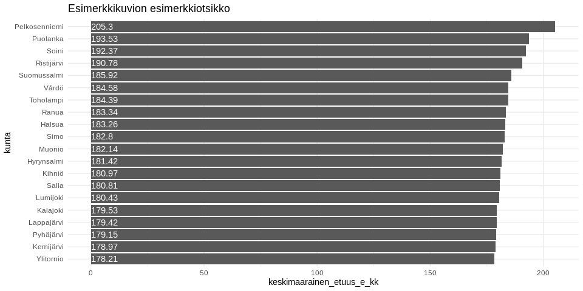
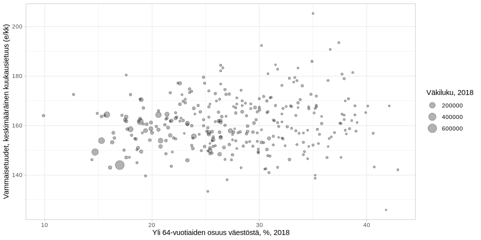

<table>
<thead>
<tr class="header">
<th style="text-align: left;">data</th>
<th style="text-align: left;">julkaistu</th>
<th style="text-align: left;">ylläpitäjä</th>
</tr>
</thead>
<tbody>
<tr class="odd">
<td style="text-align: left;"><a href='https://beta.avoindata.fi/data/fi/dataset/vammaisetuuden-saajat-ja-keskimaaraiset-etuudet'>Vammaisetuuden saajat ja keskimääräiset etuudet</a></td>
<td style="text-align: left;">2019-11-01</td>
<td style="text-align: left;"><a href='mailto:markus.kainu@kela.fi'>Markus Kainu</a></td>
</tr>
</tbody>
</table>

    library(dplyr)
    library(ggplot2)
    library(jsonlite)
    library(ckanr)
    library(readr)
    library(knitr)
    library(glue)
    library(tidyr)
    library(pxweb)

Resurssien lataaminen
---------------------

    ckanr_setup(url = "https://www.betaavoindata.fi/data/fi/")
    x <- package_search(q = "Kansaneläkelaitos", fq = "title:vammais")
    resources <- x$results[[1]]$resources
    dat <- read.table(resources[[1]]$url, header = TRUE, sep = ";", dec = ",", stringsAsFactors = FALSE) # Lataa data
    meta <- fromJSON(txt = resources[[2]]$url) # Lataa metadata

Datan ja metadatan kuvailu
--------------------------

**Datan kuvaustieto**

    meta$description %>% cat()

Vammaisetuuden saajat ja keskimääräiset tuet, euroa/kuukausi/saaja.
Tuensaajia ovat henkilöt, joille on maksettu tilastointikuukauden aikana
tilastointikuukauteen kohdistuvaa etuutta. Keskimääräinen tuki on
tilastointikuukautena maksettujen tilastointikuukautta koskevien
etuuksien aritmeettinen keskiarvo. Takautuvasti ajalta ennen
tilastointikuukautta maksetut tuet eivät ole mukana keskimäärässä.

**Datan muuttujatieto**

    meta$resources$schema$fields[[1]] %>%
      select(-values) %>% 
      kable(format = "markdown")

<table>
<thead>
<tr class="header">
<th style="text-align: left;">name</th>
<th style="text-align: left;">type</th>
<th style="text-align: left;">format</th>
</tr>
</thead>
<tbody>
<tr class="odd">
<td style="text-align: left;">kuntanumero</td>
<td style="text-align: left;">integer</td>
<td style="text-align: left;">default</td>
</tr>
<tr class="even">
<td style="text-align: left;">kunta</td>
<td style="text-align: left;">string</td>
<td style="text-align: left;">default</td>
</tr>
<tr class="odd">
<td style="text-align: left;">aikajakso</td>
<td style="text-align: left;">string</td>
<td style="text-align: left;">default</td>
</tr>
<tr class="even">
<td style="text-align: left;">aika</td>
<td style="text-align: left;">string</td>
<td style="text-align: left;">default</td>
</tr>
<tr class="odd">
<td style="text-align: left;">tuen_laji</td>
<td style="text-align: left;">string</td>
<td style="text-align: left;">default</td>
</tr>
<tr class="even">
<td style="text-align: left;">sukupuoli</td>
<td style="text-align: left;">string</td>
<td style="text-align: left;">default</td>
</tr>
<tr class="odd">
<td style="text-align: left;">ikaryhma</td>
<td style="text-align: left;">string</td>
<td style="text-align: left;">default</td>
</tr>
<tr class="even">
<td style="text-align: left;">etuuslaji</td>
<td style="text-align: left;">string</td>
<td style="text-align: left;">default</td>
</tr>
<tr class="odd">
<td style="text-align: left;">saajat</td>
<td style="text-align: left;">number</td>
<td style="text-align: left;">default</td>
</tr>
<tr class="even">
<td style="text-align: left;">keskimaarainen_etuus_e_kk</td>
<td style="text-align: left;">number</td>
<td style="text-align: left;">default</td>
</tr>
</tbody>
</table>

**Datan ensimmäiset rivit**

    head(dat)  %>% kable(format = "markdown")

<table>
<colgroup>
<col style="width: 9%" />
<col style="width: 7%" />
<col style="width: 7%" />
<col style="width: 3%" />
<col style="width: 7%" />
<col style="width: 7%" />
<col style="width: 6%" />
<col style="width: 25%" />
<col style="width: 5%" />
<col style="width: 19%" />
</colgroup>
<thead>
<tr class="header">
<th style="text-align: right;">kuntanumero</th>
<th style="text-align: left;">kunta</th>
<th style="text-align: left;">aikajakso</th>
<th style="text-align: left;">aika</th>
<th style="text-align: left;">tuen_laji</th>
<th style="text-align: left;">sukupuoli</th>
<th style="text-align: left;">ikaryhma</th>
<th style="text-align: left;">etuuslaji</th>
<th style="text-align: right;">saajat</th>
<th style="text-align: right;">keskimaarainen_etuus_e_kk</th>
</tr>
</thead>
<tbody>
<tr class="odd">
<td style="text-align: right;">5</td>
<td style="text-align: left;">Alajärvi</td>
<td style="text-align: left;">vuosi</td>
<td style="text-align: left;">2008</td>
<td style="text-align: left;">Yhteensä</td>
<td style="text-align: left;">Yhteensä</td>
<td style="text-align: left;">Yhteensä</td>
<td style="text-align: left;">Yhteensä</td>
<td style="text-align: right;">819</td>
<td style="text-align: right;">115.97</td>
</tr>
<tr class="even">
<td style="text-align: right;">5</td>
<td style="text-align: left;">Alajärvi</td>
<td style="text-align: left;">vuosi</td>
<td style="text-align: left;">2008</td>
<td style="text-align: left;">Yhteensä</td>
<td style="text-align: left;">Yhteensä</td>
<td style="text-align: left;">Yhteensä</td>
<td style="text-align: left;">Alle 16-vuotiaan vammaistuki</td>
<td style="text-align: right;">98</td>
<td style="text-align: right;">148.08</td>
</tr>
<tr class="odd">
<td style="text-align: right;">5</td>
<td style="text-align: left;">Alajärvi</td>
<td style="text-align: left;">vuosi</td>
<td style="text-align: left;">2008</td>
<td style="text-align: left;">Yhteensä</td>
<td style="text-align: left;">Yhteensä</td>
<td style="text-align: left;">Yhteensä</td>
<td style="text-align: left;">16 vuotta täyttäneen vammaistuki</td>
<td style="text-align: right;">31</td>
<td style="text-align: right;">214.15</td>
</tr>
<tr class="even">
<td style="text-align: right;">5</td>
<td style="text-align: left;">Alajärvi</td>
<td style="text-align: left;">vuosi</td>
<td style="text-align: left;">2008</td>
<td style="text-align: left;">Yhteensä</td>
<td style="text-align: left;">Yhteensä</td>
<td style="text-align: left;">Yhteensä</td>
<td style="text-align: left;">Eläkettä saavan hoitotuki</td>
<td style="text-align: right;">622</td>
<td style="text-align: right;">116.13</td>
</tr>
<tr class="odd">
<td style="text-align: right;">5</td>
<td style="text-align: left;">Alajärvi</td>
<td style="text-align: left;">vuosi</td>
<td style="text-align: left;">2008</td>
<td style="text-align: left;">Yhteensä</td>
<td style="text-align: left;">Yhteensä</td>
<td style="text-align: left;">Yhteensä</td>
<td style="text-align: left;">Ruokavaliokorvaus</td>
<td style="text-align: right;">76</td>
<td style="text-align: right;">21.00</td>
</tr>
<tr class="even">
<td style="text-align: right;">9</td>
<td style="text-align: left;">Alavieska</td>
<td style="text-align: left;">vuosi</td>
<td style="text-align: left;">2008</td>
<td style="text-align: left;">Yhteensä</td>
<td style="text-align: left;">Yhteensä</td>
<td style="text-align: left;">Yhteensä</td>
<td style="text-align: left;">Yhteensä</td>
<td style="text-align: right;">214</td>
<td style="text-align: right;">115.05</td>
</tr>
</tbody>
</table>

Kuvio
-----

    dat %>% 
      filter(aikajakso == "vuosi",
             aika == "2018",
             tuen_laji == "Yhteensä",
             sukupuoli == "Yhteensä",
             ikaryhma == "Yhteensä",
             etuuslaji == "Yhteensä") %>% 
      arrange(desc(keskimaarainen_etuus_e_kk)) %>% 
      slice(1:20) %>% 
      mutate(kunta = forcats::fct_reorder(kunta, keskimaarainen_etuus_e_kk)) %>% 
      ggplot(aes(x = kunta, y = keskimaarainen_etuus_e_kk, label = keskimaarainen_etuus_e_kk)) + 
      geom_col() + 
      coord_flip() + 
      theme_minimal() +
      geom_text(aes(y = 0), hjust = 0, color = "white") +
      labs(title = "Esimerkkikuvion esimerkkiotsikko")

Datan yhdistäminen Tilastokeskuksen kuntien avainlukuihin
---------------------------------------------------------

    # PXWEB query 
    pxweb_query_list <- 
      list("Alue 2019"=c("020","005","009","010","016","018","019","035","043","046","047","049","050","051","052","060","061",
      "062","065","069","071","072","074","075","076","077","078","079","081","082","086","111","090","091","097","098","099",
      "102","103","105","106","108","109","139","140","142","143","145","146","153","148","149","151","152","165","167","169",
      "170","171","172","176","177","178","179","181","182","186","202","204","205","208","211","213","214","216","217","218",
      "224","226","230","231","232","233","235","236","239","240","320","241","322","244","245","249","250","256","257","260",
      "261","263","265","271","272","273","275","276","280","284","285","286","287","288","290","291","295","297","300","301",
      "304","305","312","316","317","318","398","399","400","407","402","403","405","408","410","416","417","418","420","421",
      "422","423","425","426","444","430","433","434","435","436","438","440","441","475","478","480","481","483","484","489",
      "491","494","495","498","499","500","503","504","505","508","507","529","531","535","536","538","541","543","545","560",
      "561","562","563","564","309","576","577","578","445","580","581","599","583","854","584","588","592","593","595","598",
      "601","604","607","608","609","611","638","614","615","616","619","620","623","624","625","626","630","631","635","636",
      "678","710","680","681","683","684","686","687","689","691","694","697","698","700","702","704","707","729","732","734",
      "736","790","738","739","740","742","743","746","747","748","791","749","751","753","755","758","759","761","762","765",
      "766","768","771","777","778","781","783","831","832","833","834","837","844","845","846","848","849","850","851","853",
      "857","858","859","886","887","889","890","892","893","895","785","905","908","911","092","915","918","921","922","924",
      "925","927","931","934","935","936","941","946","976","977","980","981","989","992"),
           "Tiedot"=c("M408","M411","M476","M391","M421","M478","M404","M410","M303","M297","M302","M44","M62","M70","M488","M486","M137","M140","M130","M162","M78","M485","M152","M72","M84","M106","M499","M496","M495","M497","M498"))

    # Download data 
    tk_lst <- 
      pxweb_get(url = "http://pxnet2.stat.fi/PXWeb/api/v1/fi/Kuntien_avainluvut/2019/kuntien_avainluvut_2019_viimeisin.px",
                query = pxweb_query_list)
    tk_avainluvut <- as.data.frame(tk_lst, column.name.type = "text", variable.value.type = "text") %>% 
      # levitetään data
      spread(key = Tiedot, value = `Kuntien avainluvut`)

    df <- left_join(dat, tk_avainluvut, by = c("kunta" = "Alue 2019"))
    # Piirretään hajontakuvio
    df2 <- df %>% 
      filter(aikajakso == "vuosi",
             aika == "2018",
             tuen_laji == "Yhteensä",
             sukupuoli == "Yhteensä",
             ikaryhma == "Yhteensä",
             etuuslaji == "Yhteensä")
      

    ggplot(df2, aes(x = `Yli 64-vuotiaiden osuus väestöstä, %, 2018`, 
                    y = keskimaarainen_etuus_e_kk, 
                    size = `Väkiluku, 2018`)) + 
      geom_point(alpha = .3) +
      labs(y = "Vammaisetuudet, keskimääräinen kuukausietuus (e/kk)") + 
      theme_light()

Datastore-api
-------------

Jos et tarvitse koko aineistoa, voit suodattaa siitä osio SQL:llä
käyttäen CKAN:n DataStore-rajapintaa.

Alla olevassa esimerkissä tehdään rajaus `kunta`-muuttujasta ja siis
etsitään vaan kuntaa *Veteli* koskevat tiedot.

    kunta <- "Veteli"
    res <- ckanr::ds_search_sql(sql = glue("SELECT * from \"{resources[[1]]$id}\" WHERE kunta LIKE '{kunta}'"), as = "table")
    res$records %>% 
      select(-`_full_text`, -`_id`) %>% 
      kable(format = "markdown")

<table>
<colgroup>
<col style="width: 11%" />
<col style="width: 5%" />
<col style="width: 8%" />
<col style="width: 24%" />
<col style="width: 7%" />
<col style="width: 19%" />
<col style="width: 6%" />
<col style="width: 7%" />
<col style="width: 5%" />
<col style="width: 3%" />
</colgroup>
<thead>
<tr class="header">
<th style="text-align: left;">tuen_laji</th>
<th style="text-align: left;">kunta</th>
<th style="text-align: left;">kuntanumero</th>
<th style="text-align: left;">etuuslaji</th>
<th style="text-align: left;">sukupuoli</th>
<th style="text-align: left;">keskimaarainen_etuus_e_kk</th>
<th style="text-align: left;">ikaryhma</th>
<th style="text-align: left;">aikajakso</th>
<th style="text-align: left;">saajat</th>
<th style="text-align: left;">aika</th>
</tr>
</thead>
<tbody>
<tr class="odd">
<td style="text-align: left;">Yhteensä</td>
<td style="text-align: left;">Veteli</td>
<td style="text-align: left;">924</td>
<td style="text-align: left;">Yhteensä</td>
<td style="text-align: left;">Yhteensä</td>
<td style="text-align: left;">124,96</td>
<td style="text-align: left;">Yhteensä</td>
<td style="text-align: left;">vuosi</td>
<td style="text-align: left;">271</td>
<td style="text-align: left;">2008</td>
</tr>
<tr class="even">
<td style="text-align: left;">Yhteensä</td>
<td style="text-align: left;">Veteli</td>
<td style="text-align: left;">924</td>
<td style="text-align: left;">Alle 16-vuotiaan vammaistuki</td>
<td style="text-align: left;">Yhteensä</td>
<td style="text-align: left;">139,59</td>
<td style="text-align: left;">Yhteensä</td>
<td style="text-align: left;">vuosi</td>
<td style="text-align: left;">34</td>
<td style="text-align: left;">2008</td>
</tr>
<tr class="odd">
<td style="text-align: left;">Yhteensä</td>
<td style="text-align: left;">Veteli</td>
<td style="text-align: left;">924</td>
<td style="text-align: left;">16 vuotta täyttäneen vammaistuki</td>
<td style="text-align: left;">Yhteensä</td>
<td style="text-align: left;">166,27</td>
<td style="text-align: left;">Yhteensä</td>
<td style="text-align: left;">vuosi</td>
<td style="text-align: left;">6</td>
<td style="text-align: left;">2008</td>
</tr>
<tr class="even">
<td style="text-align: left;">Yhteensä</td>
<td style="text-align: left;">Veteli</td>
<td style="text-align: left;">924</td>
<td style="text-align: left;">Eläkettä saavan hoitotuki</td>
<td style="text-align: left;">Yhteensä</td>
<td style="text-align: left;">132,37</td>
<td style="text-align: left;">Yhteensä</td>
<td style="text-align: left;">vuosi</td>
<td style="text-align: left;">208</td>
<td style="text-align: left;">2008</td>
</tr>
<tr class="odd">
<td style="text-align: left;">Yhteensä</td>
<td style="text-align: left;">Veteli</td>
<td style="text-align: left;">924</td>
<td style="text-align: left;">Ruokavaliokorvaus</td>
<td style="text-align: left;">Yhteensä</td>
<td style="text-align: left;">21,00</td>
<td style="text-align: left;">Yhteensä</td>
<td style="text-align: left;">vuosi</td>
<td style="text-align: left;">28</td>
<td style="text-align: left;">2008</td>
</tr>
<tr class="even">
<td style="text-align: left;">Perustuki</td>
<td style="text-align: left;">Veteli</td>
<td style="text-align: left;">924</td>
<td style="text-align: left;">Yhteensä</td>
<td style="text-align: left;">Yhteensä</td>
<td style="text-align: left;">59,84</td>
<td style="text-align: left;">Yhteensä</td>
<td style="text-align: left;">vuosi</td>
<td style="text-align: left;">102</td>
<td style="text-align: left;">2008</td>
</tr>
<tr class="odd">
<td style="text-align: left;">Perustuki</td>
<td style="text-align: left;">Veteli</td>
<td style="text-align: left;">924</td>
<td style="text-align: left;">Alle 16-vuotiaan vammaistuki</td>
<td style="text-align: left;">Yhteensä</td>
<td style="text-align: left;">81,83</td>
<td style="text-align: left;">Yhteensä</td>
<td style="text-align: left;">vuosi</td>
<td style="text-align: left;">16</td>
<td style="text-align: left;">2008</td>
</tr>
<tr class="even">
<td style="text-align: left;">Perustuki</td>
<td style="text-align: left;">Veteli</td>
<td style="text-align: left;">924</td>
<td style="text-align: left;">16 vuotta täyttäneen vammaistuki</td>
<td style="text-align: left;">Yhteensä</td>
<td style="text-align: left;">NA</td>
<td style="text-align: left;">Yhteensä</td>
<td style="text-align: left;">vuosi</td>
<td style="text-align: left;">NA</td>
<td style="text-align: left;">2008</td>
</tr>
<tr class="odd">
<td style="text-align: left;">Perustuki</td>
<td style="text-align: left;">Veteli</td>
<td style="text-align: left;">924</td>
<td style="text-align: left;">Eläkettä saavan hoitotuki</td>
<td style="text-align: left;">Yhteensä</td>
<td style="text-align: left;">54,80</td>
<td style="text-align: left;">Yhteensä</td>
<td style="text-align: left;">vuosi</td>
<td style="text-align: left;">83</td>
<td style="text-align: left;">2008</td>
</tr>
<tr class="even">
<td style="text-align: left;">Korotettu tuki</td>
<td style="text-align: left;">Veteli</td>
<td style="text-align: left;">924</td>
<td style="text-align: left;">Yhteensä</td>
<td style="text-align: left;">Yhteensä</td>
<td style="text-align: left;">146,71</td>
<td style="text-align: left;">Yhteensä</td>
<td style="text-align: left;">vuosi</td>
<td style="text-align: left;">106</td>
<td style="text-align: left;">2008</td>
</tr>
<tr class="odd">
<td style="text-align: left;">Korotettu tuki</td>
<td style="text-align: left;">Veteli</td>
<td style="text-align: left;">924</td>
<td style="text-align: left;">Alle 16-vuotiaan vammaistuki</td>
<td style="text-align: left;">Yhteensä</td>
<td style="text-align: left;">190,94</td>
<td style="text-align: left;">Yhteensä</td>
<td style="text-align: left;">vuosi</td>
<td style="text-align: left;">18</td>
<td style="text-align: left;">2008</td>
</tr>
<tr class="even">
<td style="text-align: left;">Korotettu tuki</td>
<td style="text-align: left;">Veteli</td>
<td style="text-align: left;">924</td>
<td style="text-align: left;">16 vuotta täyttäneen vammaistuki</td>
<td style="text-align: left;">Yhteensä</td>
<td style="text-align: left;">NA</td>
<td style="text-align: left;">Yhteensä</td>
<td style="text-align: left;">vuosi</td>
<td style="text-align: left;">NA</td>
<td style="text-align: left;">2008</td>
</tr>
<tr class="odd">
<td style="text-align: left;">Korotettu tuki</td>
<td style="text-align: left;">Veteli</td>
<td style="text-align: left;">924</td>
<td style="text-align: left;">Eläkettä saavan hoitotuki</td>
<td style="text-align: left;">Yhteensä</td>
<td style="text-align: left;">136,43</td>
<td style="text-align: left;">Yhteensä</td>
<td style="text-align: left;">vuosi</td>
<td style="text-align: left;">86</td>
<td style="text-align: left;">2008</td>
</tr>
<tr class="even">
<td style="text-align: left;">Ylin tuki</td>
<td style="text-align: left;">Veteli</td>
<td style="text-align: left;">924</td>
<td style="text-align: left;">Yhteensä</td>
<td style="text-align: left;">Yhteensä</td>
<td style="text-align: left;">290,53</td>
<td style="text-align: left;">Yhteensä</td>
<td style="text-align: left;">vuosi</td>
<td style="text-align: left;">40</td>
<td style="text-align: left;">2008</td>
</tr>
<tr class="odd">
<td style="text-align: left;">Ylin tuki</td>
<td style="text-align: left;">Veteli</td>
<td style="text-align: left;">924</td>
<td style="text-align: left;">16 vuotta täyttäneen vammaistuki</td>
<td style="text-align: left;">Yhteensä</td>
<td style="text-align: left;">NA</td>
<td style="text-align: left;">Yhteensä</td>
<td style="text-align: left;">vuosi</td>
<td style="text-align: left;">NA</td>
<td style="text-align: left;">2008</td>
</tr>
<tr class="even">
<td style="text-align: left;">Ylin tuki</td>
<td style="text-align: left;">Veteli</td>
<td style="text-align: left;">924</td>
<td style="text-align: left;">Eläkettä saavan hoitotuki</td>
<td style="text-align: left;">Yhteensä</td>
<td style="text-align: left;">288,49</td>
<td style="text-align: left;">Yhteensä</td>
<td style="text-align: left;">vuosi</td>
<td style="text-align: left;">39</td>
<td style="text-align: left;">2008</td>
</tr>
<tr class="odd">
<td style="text-align: left;">Tieto puuttuu</td>
<td style="text-align: left;">Veteli</td>
<td style="text-align: left;">924</td>
<td style="text-align: left;">Yhteensä</td>
<td style="text-align: left;">Yhteensä</td>
<td style="text-align: left;">21,00</td>
<td style="text-align: left;">Yhteensä</td>
<td style="text-align: left;">vuosi</td>
<td style="text-align: left;">28</td>
<td style="text-align: left;">2008</td>
</tr>
<tr class="even">
<td style="text-align: left;">Tieto puuttuu</td>
<td style="text-align: left;">Veteli</td>
<td style="text-align: left;">924</td>
<td style="text-align: left;">Ruokavaliokorvaus</td>
<td style="text-align: left;">Yhteensä</td>
<td style="text-align: left;">21,00</td>
<td style="text-align: left;">Yhteensä</td>
<td style="text-align: left;">vuosi</td>
<td style="text-align: left;">28</td>
<td style="text-align: left;">2008</td>
</tr>
<tr class="odd">
<td style="text-align: left;">Yhteensä</td>
<td style="text-align: left;">Veteli</td>
<td style="text-align: left;">924</td>
<td style="text-align: left;">Yhteensä</td>
<td style="text-align: left;">Yhteensä</td>
<td style="text-align: left;">134,16</td>
<td style="text-align: left;">Yhteensä</td>
<td style="text-align: left;">vuosi</td>
<td style="text-align: left;">271</td>
<td style="text-align: left;">2009</td>
</tr>
<tr class="even">
<td style="text-align: left;">Yhteensä</td>
<td style="text-align: left;">Veteli</td>
<td style="text-align: left;">924</td>
<td style="text-align: left;">Alle 16-vuotiaan vammaistuki</td>
<td style="text-align: left;">Yhteensä</td>
<td style="text-align: left;">158,66</td>
<td style="text-align: left;">Yhteensä</td>
<td style="text-align: left;">vuosi</td>
<td style="text-align: left;">27</td>
<td style="text-align: left;">2009</td>
</tr>
<tr class="odd">
<td style="text-align: left;">Yhteensä</td>
<td style="text-align: left;">Veteli</td>
<td style="text-align: left;">924</td>
<td style="text-align: left;">16 vuotta täyttäneen vammaistuki</td>
<td style="text-align: left;">Yhteensä</td>
<td style="text-align: left;">192,93</td>
<td style="text-align: left;">Yhteensä</td>
<td style="text-align: left;">vuosi</td>
<td style="text-align: left;">6</td>
<td style="text-align: left;">2009</td>
</tr>
<tr class="even">
<td style="text-align: left;">Yhteensä</td>
<td style="text-align: left;">Veteli</td>
<td style="text-align: left;">924</td>
<td style="text-align: left;">Eläkettä saavan hoitotuki</td>
<td style="text-align: left;">Yhteensä</td>
<td style="text-align: left;">141,15</td>
<td style="text-align: left;">Yhteensä</td>
<td style="text-align: left;">vuosi</td>
<td style="text-align: left;">215</td>
<td style="text-align: left;">2009</td>
</tr>
<tr class="odd">
<td style="text-align: left;">Yhteensä</td>
<td style="text-align: left;">Veteli</td>
<td style="text-align: left;">924</td>
<td style="text-align: left;">Ruokavaliokorvaus</td>
<td style="text-align: left;">Yhteensä</td>
<td style="text-align: left;">21,00</td>
<td style="text-align: left;">Yhteensä</td>
<td style="text-align: left;">vuosi</td>
<td style="text-align: left;">27</td>
<td style="text-align: left;">2009</td>
</tr>
<tr class="even">
<td style="text-align: left;">Perustuki</td>
<td style="text-align: left;">Veteli</td>
<td style="text-align: left;">924</td>
<td style="text-align: left;">Yhteensä</td>
<td style="text-align: left;">Yhteensä</td>
<td style="text-align: left;">61,60</td>
<td style="text-align: left;">Yhteensä</td>
<td style="text-align: left;">vuosi</td>
<td style="text-align: left;">99</td>
<td style="text-align: left;">2009</td>
</tr>
<tr class="odd">
<td style="text-align: left;">Perustuki</td>
<td style="text-align: left;">Veteli</td>
<td style="text-align: left;">924</td>
<td style="text-align: left;">Alle 16-vuotiaan vammaistuki</td>
<td style="text-align: left;">Yhteensä</td>
<td style="text-align: left;">85,59</td>
<td style="text-align: left;">Yhteensä</td>
<td style="text-align: left;">vuosi</td>
<td style="text-align: left;">13</td>
<td style="text-align: left;">2009</td>
</tr>
<tr class="even">
<td style="text-align: left;">Perustuki</td>
<td style="text-align: left;">Veteli</td>
<td style="text-align: left;">924</td>
<td style="text-align: left;">16 vuotta täyttäneen vammaistuki</td>
<td style="text-align: left;">Yhteensä</td>
<td style="text-align: left;">NA</td>
<td style="text-align: left;">Yhteensä</td>
<td style="text-align: left;">vuosi</td>
<td style="text-align: left;">NA</td>
<td style="text-align: left;">2009</td>
</tr>
<tr class="odd">
<td style="text-align: left;">Perustuki</td>
<td style="text-align: left;">Veteli</td>
<td style="text-align: left;">924</td>
<td style="text-align: left;">Eläkettä saavan hoitotuki</td>
<td style="text-align: left;">Yhteensä</td>
<td style="text-align: left;">57,32</td>
<td style="text-align: left;">Yhteensä</td>
<td style="text-align: left;">vuosi</td>
<td style="text-align: left;">84</td>
<td style="text-align: left;">2009</td>
</tr>
<tr class="even">
<td style="text-align: left;">Korotettu tuki</td>
<td style="text-align: left;">Veteli</td>
<td style="text-align: left;">924</td>
<td style="text-align: left;">Yhteensä</td>
<td style="text-align: left;">Yhteensä</td>
<td style="text-align: left;">151,00</td>
<td style="text-align: left;">Yhteensä</td>
<td style="text-align: left;">vuosi</td>
<td style="text-align: left;">103</td>
<td style="text-align: left;">2009</td>
</tr>
<tr class="odd">
<td style="text-align: left;">Korotettu tuki</td>
<td style="text-align: left;">Veteli</td>
<td style="text-align: left;">924</td>
<td style="text-align: left;">Alle 16-vuotiaan vammaistuki</td>
<td style="text-align: left;">Yhteensä</td>
<td style="text-align: left;">199,71</td>
<td style="text-align: left;">Yhteensä</td>
<td style="text-align: left;">vuosi</td>
<td style="text-align: left;">12</td>
<td style="text-align: left;">2009</td>
</tr>
<tr class="even">
<td style="text-align: left;">Korotettu tuki</td>
<td style="text-align: left;">Veteli</td>
<td style="text-align: left;">924</td>
<td style="text-align: left;">16 vuotta täyttäneen vammaistuki</td>
<td style="text-align: left;">Yhteensä</td>
<td style="text-align: left;">NA</td>
<td style="text-align: left;">Yhteensä</td>
<td style="text-align: left;">vuosi</td>
<td style="text-align: left;">NA</td>
<td style="text-align: left;">2009</td>
</tr>
<tr class="odd">
<td style="text-align: left;">Korotettu tuki</td>
<td style="text-align: left;">Veteli</td>
<td style="text-align: left;">924</td>
<td style="text-align: left;">Eläkettä saavan hoitotuki</td>
<td style="text-align: left;">Yhteensä</td>
<td style="text-align: left;">142,70</td>
<td style="text-align: left;">Yhteensä</td>
<td style="text-align: left;">vuosi</td>
<td style="text-align: left;">88</td>
<td style="text-align: left;">2009</td>
</tr>
<tr class="even">
<td style="text-align: left;">Ylin tuki</td>
<td style="text-align: left;">Veteli</td>
<td style="text-align: left;">924</td>
<td style="text-align: left;">Yhteensä</td>
<td style="text-align: left;">Yhteensä</td>
<td style="text-align: left;">307,33</td>
<td style="text-align: left;">Yhteensä</td>
<td style="text-align: left;">vuosi</td>
<td style="text-align: left;">46</td>
<td style="text-align: left;">2009</td>
</tr>
<tr class="odd">
<td style="text-align: left;">Ylin tuki</td>
<td style="text-align: left;">Veteli</td>
<td style="text-align: left;">924</td>
<td style="text-align: left;">Alle 16-vuotiaan vammaistuki</td>
<td style="text-align: left;">Yhteensä</td>
<td style="text-align: left;">NA</td>
<td style="text-align: left;">Yhteensä</td>
<td style="text-align: left;">vuosi</td>
<td style="text-align: left;">NA</td>
<td style="text-align: left;">2009</td>
</tr>
<tr class="even">
<td style="text-align: left;">Ylin tuki</td>
<td style="text-align: left;">Veteli</td>
<td style="text-align: left;">924</td>
<td style="text-align: left;">16 vuotta täyttäneen vammaistuki</td>
<td style="text-align: left;">Yhteensä</td>
<td style="text-align: left;">NA</td>
<td style="text-align: left;">Yhteensä</td>
<td style="text-align: left;">vuosi</td>
<td style="text-align: left;">NA</td>
<td style="text-align: left;">2009</td>
</tr>
<tr class="odd">
<td style="text-align: left;">Ylin tuki</td>
<td style="text-align: left;">Veteli</td>
<td style="text-align: left;">924</td>
<td style="text-align: left;">Eläkettä saavan hoitotuki</td>
<td style="text-align: left;">Yhteensä</td>
<td style="text-align: left;">301,75</td>
<td style="text-align: left;">Yhteensä</td>
<td style="text-align: left;">vuosi</td>
<td style="text-align: left;">43</td>
<td style="text-align: left;">2009</td>
</tr>
<tr class="even">
<td style="text-align: left;">Tieto puuttuu</td>
<td style="text-align: left;">Veteli</td>
<td style="text-align: left;">924</td>
<td style="text-align: left;">Yhteensä</td>
<td style="text-align: left;">Yhteensä</td>
<td style="text-align: left;">21,00</td>
<td style="text-align: left;">Yhteensä</td>
<td style="text-align: left;">vuosi</td>
<td style="text-align: left;">27</td>
<td style="text-align: left;">2009</td>
</tr>
<tr class="odd">
<td style="text-align: left;">Tieto puuttuu</td>
<td style="text-align: left;">Veteli</td>
<td style="text-align: left;">924</td>
<td style="text-align: left;">Ruokavaliokorvaus</td>
<td style="text-align: left;">Yhteensä</td>
<td style="text-align: left;">21,00</td>
<td style="text-align: left;">Yhteensä</td>
<td style="text-align: left;">vuosi</td>
<td style="text-align: left;">27</td>
<td style="text-align: left;">2009</td>
</tr>
<tr class="even">
<td style="text-align: left;">Yhteensä</td>
<td style="text-align: left;">Veteli</td>
<td style="text-align: left;">924</td>
<td style="text-align: left;">Yhteensä</td>
<td style="text-align: left;">Yhteensä</td>
<td style="text-align: left;">144,63</td>
<td style="text-align: left;">Yhteensä</td>
<td style="text-align: left;">vuosi</td>
<td style="text-align: left;">281</td>
<td style="text-align: left;">2010</td>
</tr>
<tr class="odd">
<td style="text-align: left;">Yhteensä</td>
<td style="text-align: left;">Veteli</td>
<td style="text-align: left;">924</td>
<td style="text-align: left;">Alle 16-vuotiaan vammaistuki</td>
<td style="text-align: left;">Yhteensä</td>
<td style="text-align: left;">140,54</td>
<td style="text-align: left;">Yhteensä</td>
<td style="text-align: left;">vuosi</td>
<td style="text-align: left;">27</td>
<td style="text-align: left;">2010</td>
</tr>
<tr class="even">
<td style="text-align: left;">Yhteensä</td>
<td style="text-align: left;">Veteli</td>
<td style="text-align: left;">924</td>
<td style="text-align: left;">16 vuotta täyttäneen vammaistuki</td>
<td style="text-align: left;">Yhteensä</td>
<td style="text-align: left;">251,91</td>
<td style="text-align: left;">Yhteensä</td>
<td style="text-align: left;">vuosi</td>
<td style="text-align: left;">5</td>
<td style="text-align: left;">2010</td>
</tr>
<tr class="odd">
<td style="text-align: left;">Yhteensä</td>
<td style="text-align: left;">Veteli</td>
<td style="text-align: left;">924</td>
<td style="text-align: left;">Eläkettä saavan hoitotuki</td>
<td style="text-align: left;">Yhteensä</td>
<td style="text-align: left;">154,96</td>
<td style="text-align: left;">Yhteensä</td>
<td style="text-align: left;">vuosi</td>
<td style="text-align: left;">226</td>
<td style="text-align: left;">2010</td>
</tr>
<tr class="even">
<td style="text-align: left;">Yhteensä</td>
<td style="text-align: left;">Veteli</td>
<td style="text-align: left;">924</td>
<td style="text-align: left;">Ruokavaliokorvaus</td>
<td style="text-align: left;">Yhteensä</td>
<td style="text-align: left;">21,00</td>
<td style="text-align: left;">Yhteensä</td>
<td style="text-align: left;">vuosi</td>
<td style="text-align: left;">27</td>
<td style="text-align: left;">2010</td>
</tr>
<tr class="odd">
<td style="text-align: left;">Perustuki</td>
<td style="text-align: left;">Veteli</td>
<td style="text-align: left;">924</td>
<td style="text-align: left;">Yhteensä</td>
<td style="text-align: left;">Yhteensä</td>
<td style="text-align: left;">61,83</td>
<td style="text-align: left;">Yhteensä</td>
<td style="text-align: left;">vuosi</td>
<td style="text-align: left;">94</td>
<td style="text-align: left;">2010</td>
</tr>
<tr class="even">
<td style="text-align: left;">Perustuki</td>
<td style="text-align: left;">Veteli</td>
<td style="text-align: left;">924</td>
<td style="text-align: left;">Alle 16-vuotiaan vammaistuki</td>
<td style="text-align: left;">Yhteensä</td>
<td style="text-align: left;">85,59</td>
<td style="text-align: left;">Yhteensä</td>
<td style="text-align: left;">vuosi</td>
<td style="text-align: left;">14</td>
<td style="text-align: left;">2010</td>
</tr>
<tr class="odd">
<td style="text-align: left;">Perustuki</td>
<td style="text-align: left;">Veteli</td>
<td style="text-align: left;">924</td>
<td style="text-align: left;">16 vuotta täyttäneen vammaistuki</td>
<td style="text-align: left;">Yhteensä</td>
<td style="text-align: left;">NA</td>
<td style="text-align: left;">Yhteensä</td>
<td style="text-align: left;">vuosi</td>
<td style="text-align: left;">NA</td>
<td style="text-align: left;">2010</td>
</tr>
<tr class="even">
<td style="text-align: left;">Perustuki</td>
<td style="text-align: left;">Veteli</td>
<td style="text-align: left;">924</td>
<td style="text-align: left;">Eläkettä saavan hoitotuki</td>
<td style="text-align: left;">Yhteensä</td>
<td style="text-align: left;">57,32</td>
<td style="text-align: left;">Yhteensä</td>
<td style="text-align: left;">vuosi</td>
<td style="text-align: left;">79</td>
<td style="text-align: left;">2010</td>
</tr>
<tr class="odd">
<td style="text-align: left;">Korotettu tuki</td>
<td style="text-align: left;">Veteli</td>
<td style="text-align: left;">924</td>
<td style="text-align: left;">Yhteensä</td>
<td style="text-align: left;">Yhteensä</td>
<td style="text-align: left;">152,75</td>
<td style="text-align: left;">Yhteensä</td>
<td style="text-align: left;">vuosi</td>
<td style="text-align: left;">105</td>
<td style="text-align: left;">2010</td>
</tr>
<tr class="even">
<td style="text-align: left;">Korotettu tuki</td>
<td style="text-align: left;">Veteli</td>
<td style="text-align: left;">924</td>
<td style="text-align: left;">Alle 16-vuotiaan vammaistuki</td>
<td style="text-align: left;">Yhteensä</td>
<td style="text-align: left;">199,71</td>
<td style="text-align: left;">Yhteensä</td>
<td style="text-align: left;">vuosi</td>
<td style="text-align: left;">13</td>
<td style="text-align: left;">2010</td>
</tr>
<tr class="odd">
<td style="text-align: left;">Korotettu tuki</td>
<td style="text-align: left;">Veteli</td>
<td style="text-align: left;">924</td>
<td style="text-align: left;">16 vuotta täyttäneen vammaistuki</td>
<td style="text-align: left;">Yhteensä</td>
<td style="text-align: left;">NA</td>
<td style="text-align: left;">Yhteensä</td>
<td style="text-align: left;">vuosi</td>
<td style="text-align: left;">NA</td>
<td style="text-align: left;">2010</td>
</tr>
<tr class="even">
<td style="text-align: left;">Korotettu tuki</td>
<td style="text-align: left;">Veteli</td>
<td style="text-align: left;">924</td>
<td style="text-align: left;">Eläkettä saavan hoitotuki</td>
<td style="text-align: left;">Yhteensä</td>
<td style="text-align: left;">144,92</td>
<td style="text-align: left;">Yhteensä</td>
<td style="text-align: left;">vuosi</td>
<td style="text-align: left;">90</td>
<td style="text-align: left;">2010</td>
</tr>
<tr class="odd">
<td style="text-align: left;">Ylin tuki</td>
<td style="text-align: left;">Veteli</td>
<td style="text-align: left;">924</td>
<td style="text-align: left;">Yhteensä</td>
<td style="text-align: left;">Yhteensä</td>
<td style="text-align: left;">308,89</td>
<td style="text-align: left;">Yhteensä</td>
<td style="text-align: left;">vuosi</td>
<td style="text-align: left;">59</td>
<td style="text-align: left;">2010</td>
</tr>
<tr class="even">
<td style="text-align: left;">Ylin tuki</td>
<td style="text-align: left;">Veteli</td>
<td style="text-align: left;">924</td>
<td style="text-align: left;">16 vuotta täyttäneen vammaistuki</td>
<td style="text-align: left;">Yhteensä</td>
<td style="text-align: left;">NA</td>
<td style="text-align: left;">Yhteensä</td>
<td style="text-align: left;">vuosi</td>
<td style="text-align: left;">NA</td>
<td style="text-align: left;">2010</td>
</tr>
<tr class="odd">
<td style="text-align: left;">Ylin tuki</td>
<td style="text-align: left;">Veteli</td>
<td style="text-align: left;">924</td>
<td style="text-align: left;">Eläkettä saavan hoitotuki</td>
<td style="text-align: left;">Yhteensä</td>
<td style="text-align: left;">306,14</td>
<td style="text-align: left;">Yhteensä</td>
<td style="text-align: left;">vuosi</td>
<td style="text-align: left;">57</td>
<td style="text-align: left;">2010</td>
</tr>
<tr class="even">
<td style="text-align: left;">Tieto puuttuu</td>
<td style="text-align: left;">Veteli</td>
<td style="text-align: left;">924</td>
<td style="text-align: left;">Yhteensä</td>
<td style="text-align: left;">Yhteensä</td>
<td style="text-align: left;">21,00</td>
<td style="text-align: left;">Yhteensä</td>
<td style="text-align: left;">vuosi</td>
<td style="text-align: left;">27</td>
<td style="text-align: left;">2010</td>
</tr>
<tr class="odd">
<td style="text-align: left;">Tieto puuttuu</td>
<td style="text-align: left;">Veteli</td>
<td style="text-align: left;">924</td>
<td style="text-align: left;">Ruokavaliokorvaus</td>
<td style="text-align: left;">Yhteensä</td>
<td style="text-align: left;">21,00</td>
<td style="text-align: left;">Yhteensä</td>
<td style="text-align: left;">vuosi</td>
<td style="text-align: left;">27</td>
<td style="text-align: left;">2010</td>
</tr>
<tr class="even">
<td style="text-align: left;">Yhteensä</td>
<td style="text-align: left;">Veteli</td>
<td style="text-align: left;">924</td>
<td style="text-align: left;">Yhteensä</td>
<td style="text-align: left;">Yhteensä</td>
<td style="text-align: left;">144,28</td>
<td style="text-align: left;">Yhteensä</td>
<td style="text-align: left;">vuosi</td>
<td style="text-align: left;">292</td>
<td style="text-align: left;">2011</td>
</tr>
<tr class="odd">
<td style="text-align: left;">Yhteensä</td>
<td style="text-align: left;">Veteli</td>
<td style="text-align: left;">924</td>
<td style="text-align: left;">Alle 16-vuotiaan vammaistuki</td>
<td style="text-align: left;">Yhteensä</td>
<td style="text-align: left;">131,93</td>
<td style="text-align: left;">Yhteensä</td>
<td style="text-align: left;">vuosi</td>
<td style="text-align: left;">29</td>
<td style="text-align: left;">2011</td>
</tr>
<tr class="even">
<td style="text-align: left;">Yhteensä</td>
<td style="text-align: left;">Veteli</td>
<td style="text-align: left;">924</td>
<td style="text-align: left;">16 vuotta täyttäneen vammaistuki</td>
<td style="text-align: left;">Yhteensä</td>
<td style="text-align: left;">178,30</td>
<td style="text-align: left;">Yhteensä</td>
<td style="text-align: left;">vuosi</td>
<td style="text-align: left;">7</td>
<td style="text-align: left;">2011</td>
</tr>
<tr class="odd">
<td style="text-align: left;">Yhteensä</td>
<td style="text-align: left;">Veteli</td>
<td style="text-align: left;">924</td>
<td style="text-align: left;">Eläkettä saavan hoitotuki</td>
<td style="text-align: left;">Yhteensä</td>
<td style="text-align: left;">156,52</td>
<td style="text-align: left;">Yhteensä</td>
<td style="text-align: left;">vuosi</td>
<td style="text-align: left;">233</td>
<td style="text-align: left;">2011</td>
</tr>
<tr class="even">
<td style="text-align: left;">Yhteensä</td>
<td style="text-align: left;">Veteli</td>
<td style="text-align: left;">924</td>
<td style="text-align: left;">Ruokavaliokorvaus</td>
<td style="text-align: left;">Yhteensä</td>
<td style="text-align: left;">21,00</td>
<td style="text-align: left;">Yhteensä</td>
<td style="text-align: left;">vuosi</td>
<td style="text-align: left;">28</td>
<td style="text-align: left;">2011</td>
</tr>
<tr class="odd">
<td style="text-align: left;">Perustuki</td>
<td style="text-align: left;">Veteli</td>
<td style="text-align: left;">924</td>
<td style="text-align: left;">Yhteensä</td>
<td style="text-align: left;">Yhteensä</td>
<td style="text-align: left;">63,79</td>
<td style="text-align: left;">Yhteensä</td>
<td style="text-align: left;">vuosi</td>
<td style="text-align: left;">100</td>
<td style="text-align: left;">2011</td>
</tr>
<tr class="even">
<td style="text-align: left;">Perustuki</td>
<td style="text-align: left;">Veteli</td>
<td style="text-align: left;">924</td>
<td style="text-align: left;">Alle 16-vuotiaan vammaistuki</td>
<td style="text-align: left;">Yhteensä</td>
<td style="text-align: left;">85,93</td>
<td style="text-align: left;">Yhteensä</td>
<td style="text-align: left;">vuosi</td>
<td style="text-align: left;">19</td>
<td style="text-align: left;">2011</td>
</tr>
<tr class="odd">
<td style="text-align: left;">Perustuki</td>
<td style="text-align: left;">Veteli</td>
<td style="text-align: left;">924</td>
<td style="text-align: left;">16 vuotta täyttäneen vammaistuki</td>
<td style="text-align: left;">Yhteensä</td>
<td style="text-align: left;">NA</td>
<td style="text-align: left;">Yhteensä</td>
<td style="text-align: left;">vuosi</td>
<td style="text-align: left;">NA</td>
<td style="text-align: left;">2011</td>
</tr>
<tr class="even">
<td style="text-align: left;">Perustuki</td>
<td style="text-align: left;">Veteli</td>
<td style="text-align: left;">924</td>
<td style="text-align: left;">Eläkettä saavan hoitotuki</td>
<td style="text-align: left;">Yhteensä</td>
<td style="text-align: left;">57,55</td>
<td style="text-align: left;">Yhteensä</td>
<td style="text-align: left;">vuosi</td>
<td style="text-align: left;">78</td>
<td style="text-align: left;">2011</td>
</tr>
<tr class="odd">
<td style="text-align: left;">Korotettu tuki</td>
<td style="text-align: left;">Veteli</td>
<td style="text-align: left;">924</td>
<td style="text-align: left;">Yhteensä</td>
<td style="text-align: left;">Yhteensä</td>
<td style="text-align: left;">150,56</td>
<td style="text-align: left;">Yhteensä</td>
<td style="text-align: left;">vuosi</td>
<td style="text-align: left;">108</td>
<td style="text-align: left;">2011</td>
</tr>
<tr class="even">
<td style="text-align: left;">Korotettu tuki</td>
<td style="text-align: left;">Veteli</td>
<td style="text-align: left;">924</td>
<td style="text-align: left;">Alle 16-vuotiaan vammaistuki</td>
<td style="text-align: left;">Yhteensä</td>
<td style="text-align: left;">200,51</td>
<td style="text-align: left;">Yhteensä</td>
<td style="text-align: left;">vuosi</td>
<td style="text-align: left;">9</td>
<td style="text-align: left;">2011</td>
</tr>
<tr class="odd">
<td style="text-align: left;">Korotettu tuki</td>
<td style="text-align: left;">Veteli</td>
<td style="text-align: left;">924</td>
<td style="text-align: left;">16 vuotta täyttäneen vammaistuki</td>
<td style="text-align: left;">Yhteensä</td>
<td style="text-align: left;">NA</td>
<td style="text-align: left;">Yhteensä</td>
<td style="text-align: left;">vuosi</td>
<td style="text-align: left;">NA</td>
<td style="text-align: left;">2011</td>
</tr>
<tr class="even">
<td style="text-align: left;">Korotettu tuki</td>
<td style="text-align: left;">Veteli</td>
<td style="text-align: left;">924</td>
<td style="text-align: left;">Eläkettä saavan hoitotuki</td>
<td style="text-align: left;">Yhteensä</td>
<td style="text-align: left;">144,32</td>
<td style="text-align: left;">Yhteensä</td>
<td style="text-align: left;">vuosi</td>
<td style="text-align: left;">96</td>
<td style="text-align: left;">2011</td>
</tr>
<tr class="odd">
<td style="text-align: left;">Ylin tuki</td>
<td style="text-align: left;">Veteli</td>
<td style="text-align: left;">924</td>
<td style="text-align: left;">Yhteensä</td>
<td style="text-align: left;">Yhteensä</td>
<td style="text-align: left;">309,89</td>
<td style="text-align: left;">Yhteensä</td>
<td style="text-align: left;">vuosi</td>
<td style="text-align: left;">61</td>
<td style="text-align: left;">2011</td>
</tr>
<tr class="even">
<td style="text-align: left;">Ylin tuki</td>
<td style="text-align: left;">Veteli</td>
<td style="text-align: left;">924</td>
<td style="text-align: left;">Alle 16-vuotiaan vammaistuki</td>
<td style="text-align: left;">Yhteensä</td>
<td style="text-align: left;">NA</td>
<td style="text-align: left;">Yhteensä</td>
<td style="text-align: left;">vuosi</td>
<td style="text-align: left;">NA</td>
<td style="text-align: left;">2011</td>
</tr>
<tr class="odd">
<td style="text-align: left;">Ylin tuki</td>
<td style="text-align: left;">Veteli</td>
<td style="text-align: left;">924</td>
<td style="text-align: left;">16 vuotta täyttäneen vammaistuki</td>
<td style="text-align: left;">Yhteensä</td>
<td style="text-align: left;">NA</td>
<td style="text-align: left;">Yhteensä</td>
<td style="text-align: left;">vuosi</td>
<td style="text-align: left;">NA</td>
<td style="text-align: left;">2011</td>
</tr>
<tr class="even">
<td style="text-align: left;">Ylin tuki</td>
<td style="text-align: left;">Veteli</td>
<td style="text-align: left;">924</td>
<td style="text-align: left;">Eläkettä saavan hoitotuki</td>
<td style="text-align: left;">Yhteensä</td>
<td style="text-align: left;">307,21</td>
<td style="text-align: left;">Yhteensä</td>
<td style="text-align: left;">vuosi</td>
<td style="text-align: left;">59</td>
<td style="text-align: left;">2011</td>
</tr>
<tr class="odd">
<td style="text-align: left;">Tieto puuttuu</td>
<td style="text-align: left;">Veteli</td>
<td style="text-align: left;">924</td>
<td style="text-align: left;">Yhteensä</td>
<td style="text-align: left;">Yhteensä</td>
<td style="text-align: left;">21,00</td>
<td style="text-align: left;">Yhteensä</td>
<td style="text-align: left;">vuosi</td>
<td style="text-align: left;">28</td>
<td style="text-align: left;">2011</td>
</tr>
<tr class="even">
<td style="text-align: left;">Tieto puuttuu</td>
<td style="text-align: left;">Veteli</td>
<td style="text-align: left;">924</td>
<td style="text-align: left;">Ruokavaliokorvaus</td>
<td style="text-align: left;">Yhteensä</td>
<td style="text-align: left;">21,00</td>
<td style="text-align: left;">Yhteensä</td>
<td style="text-align: left;">vuosi</td>
<td style="text-align: left;">28</td>
<td style="text-align: left;">2011</td>
</tr>
<tr class="odd">
<td style="text-align: left;">Yhteensä</td>
<td style="text-align: left;">Veteli</td>
<td style="text-align: left;">924</td>
<td style="text-align: left;">Yhteensä</td>
<td style="text-align: left;">Yhteensä</td>
<td style="text-align: left;">143,77</td>
<td style="text-align: left;">Yhteensä</td>
<td style="text-align: left;">vuosi</td>
<td style="text-align: left;">289</td>
<td style="text-align: left;">2012</td>
</tr>
<tr class="even">
<td style="text-align: left;">Yhteensä</td>
<td style="text-align: left;">Veteli</td>
<td style="text-align: left;">924</td>
<td style="text-align: left;">Alle 16-vuotiaan vammaistuki</td>
<td style="text-align: left;">Yhteensä</td>
<td style="text-align: left;">143,59</td>
<td style="text-align: left;">Yhteensä</td>
<td style="text-align: left;">vuosi</td>
<td style="text-align: left;">32</td>
<td style="text-align: left;">2012</td>
</tr>
<tr class="odd">
<td style="text-align: left;">Yhteensä</td>
<td style="text-align: left;">Veteli</td>
<td style="text-align: left;">924</td>
<td style="text-align: left;">16 vuotta täyttäneen vammaistuki</td>
<td style="text-align: left;">Yhteensä</td>
<td style="text-align: left;">202,03</td>
<td style="text-align: left;">Yhteensä</td>
<td style="text-align: left;">vuosi</td>
<td style="text-align: left;">7</td>
<td style="text-align: left;">2012</td>
</tr>
<tr class="even">
<td style="text-align: left;">Yhteensä</td>
<td style="text-align: left;">Veteli</td>
<td style="text-align: left;">924</td>
<td style="text-align: left;">Eläkettä saavan hoitotuki</td>
<td style="text-align: left;">Yhteensä</td>
<td style="text-align: left;">155,76</td>
<td style="text-align: left;">Yhteensä</td>
<td style="text-align: left;">vuosi</td>
<td style="text-align: left;">224</td>
<td style="text-align: left;">2012</td>
</tr>
<tr class="odd">
<td style="text-align: left;">Yhteensä</td>
<td style="text-align: left;">Veteli</td>
<td style="text-align: left;">924</td>
<td style="text-align: left;">Ruokavaliokorvaus</td>
<td style="text-align: left;">Yhteensä</td>
<td style="text-align: left;">21,00</td>
<td style="text-align: left;">Yhteensä</td>
<td style="text-align: left;">vuosi</td>
<td style="text-align: left;">31</td>
<td style="text-align: left;">2012</td>
</tr>
<tr class="even">
<td style="text-align: left;">Perustuki</td>
<td style="text-align: left;">Veteli</td>
<td style="text-align: left;">924</td>
<td style="text-align: left;">Yhteensä</td>
<td style="text-align: left;">Yhteensä</td>
<td style="text-align: left;">65,73</td>
<td style="text-align: left;">Yhteensä</td>
<td style="text-align: left;">vuosi</td>
<td style="text-align: left;">103</td>
<td style="text-align: left;">2012</td>
</tr>
<tr class="odd">
<td style="text-align: left;">Perustuki</td>
<td style="text-align: left;">Veteli</td>
<td style="text-align: left;">924</td>
<td style="text-align: left;">Alle 16-vuotiaan vammaistuki</td>
<td style="text-align: left;">Yhteensä</td>
<td style="text-align: left;">89,18</td>
<td style="text-align: left;">Yhteensä</td>
<td style="text-align: left;">vuosi</td>
<td style="text-align: left;">19</td>
<td style="text-align: left;">2012</td>
</tr>
<tr class="even">
<td style="text-align: left;">Perustuki</td>
<td style="text-align: left;">Veteli</td>
<td style="text-align: left;">924</td>
<td style="text-align: left;">16 vuotta täyttäneen vammaistuki</td>
<td style="text-align: left;">Yhteensä</td>
<td style="text-align: left;">NA</td>
<td style="text-align: left;">Yhteensä</td>
<td style="text-align: left;">vuosi</td>
<td style="text-align: left;">NA</td>
<td style="text-align: left;">2012</td>
</tr>
<tr class="odd">
<td style="text-align: left;">Perustuki</td>
<td style="text-align: left;">Veteli</td>
<td style="text-align: left;">924</td>
<td style="text-align: left;">Eläkettä saavan hoitotuki</td>
<td style="text-align: left;">Yhteensä</td>
<td style="text-align: left;">59,73</td>
<td style="text-align: left;">Yhteensä</td>
<td style="text-align: left;">vuosi</td>
<td style="text-align: left;">82</td>
<td style="text-align: left;">2012</td>
</tr>
<tr class="even">
<td style="text-align: left;">Korotettu tuki</td>
<td style="text-align: left;">Veteli</td>
<td style="text-align: left;">924</td>
<td style="text-align: left;">Yhteensä</td>
<td style="text-align: left;">Yhteensä</td>
<td style="text-align: left;">159,13</td>
<td style="text-align: left;">Yhteensä</td>
<td style="text-align: left;">vuosi</td>
<td style="text-align: left;">106</td>
<td style="text-align: left;">2012</td>
</tr>
<tr class="odd">
<td style="text-align: left;">Korotettu tuki</td>
<td style="text-align: left;">Veteli</td>
<td style="text-align: left;">924</td>
<td style="text-align: left;">Alle 16-vuotiaan vammaistuki</td>
<td style="text-align: left;">Yhteensä</td>
<td style="text-align: left;">208,09</td>
<td style="text-align: left;">Yhteensä</td>
<td style="text-align: left;">vuosi</td>
<td style="text-align: left;">12</td>
<td style="text-align: left;">2012</td>
</tr>
<tr class="even">
<td style="text-align: left;">Korotettu tuki</td>
<td style="text-align: left;">Veteli</td>
<td style="text-align: left;">924</td>
<td style="text-align: left;">16 vuotta täyttäneen vammaistuki</td>
<td style="text-align: left;">Yhteensä</td>
<td style="text-align: left;">208,09</td>
<td style="text-align: left;">Yhteensä</td>
<td style="text-align: left;">vuosi</td>
<td style="text-align: left;">4</td>
<td style="text-align: left;">2012</td>
</tr>
<tr class="odd">
<td style="text-align: left;">Korotettu tuki</td>
<td style="text-align: left;">Veteli</td>
<td style="text-align: left;">924</td>
<td style="text-align: left;">Eläkettä saavan hoitotuki</td>
<td style="text-align: left;">Yhteensä</td>
<td style="text-align: left;">150,43</td>
<td style="text-align: left;">Yhteensä</td>
<td style="text-align: left;">vuosi</td>
<td style="text-align: left;">90</td>
<td style="text-align: left;">2012</td>
</tr>
<tr class="even">
<td style="text-align: left;">Ylin tuki</td>
<td style="text-align: left;">Veteli</td>
<td style="text-align: left;">924</td>
<td style="text-align: left;">Yhteensä</td>
<td style="text-align: left;">Yhteensä</td>
<td style="text-align: left;">319,64</td>
<td style="text-align: left;">Yhteensä</td>
<td style="text-align: left;">vuosi</td>
<td style="text-align: left;">54</td>
<td style="text-align: left;">2012</td>
</tr>
<tr class="odd">
<td style="text-align: left;">Ylin tuki</td>
<td style="text-align: left;">Veteli</td>
<td style="text-align: left;">924</td>
<td style="text-align: left;">Alle 16-vuotiaan vammaistuki</td>
<td style="text-align: left;">Yhteensä</td>
<td style="text-align: left;">NA</td>
<td style="text-align: left;">Yhteensä</td>
<td style="text-align: left;">vuosi</td>
<td style="text-align: left;">NA</td>
<td style="text-align: left;">2012</td>
</tr>
<tr class="even">
<td style="text-align: left;">Ylin tuki</td>
<td style="text-align: left;">Veteli</td>
<td style="text-align: left;">924</td>
<td style="text-align: left;">16 vuotta täyttäneen vammaistuki</td>
<td style="text-align: left;">Yhteensä</td>
<td style="text-align: left;">NA</td>
<td style="text-align: left;">Yhteensä</td>
<td style="text-align: left;">vuosi</td>
<td style="text-align: left;">NA</td>
<td style="text-align: left;">2012</td>
</tr>
<tr class="odd">
<td style="text-align: left;">Ylin tuki</td>
<td style="text-align: left;">Veteli</td>
<td style="text-align: left;">924</td>
<td style="text-align: left;">Eläkettä saavan hoitotuki</td>
<td style="text-align: left;">Yhteensä</td>
<td style="text-align: left;">316,41</td>
<td style="text-align: left;">Yhteensä</td>
<td style="text-align: left;">vuosi</td>
<td style="text-align: left;">52</td>
<td style="text-align: left;">2012</td>
</tr>
<tr class="even">
<td style="text-align: left;">Tieto puuttuu</td>
<td style="text-align: left;">Veteli</td>
<td style="text-align: left;">924</td>
<td style="text-align: left;">Yhteensä</td>
<td style="text-align: left;">Yhteensä</td>
<td style="text-align: left;">21,00</td>
<td style="text-align: left;">Yhteensä</td>
<td style="text-align: left;">vuosi</td>
<td style="text-align: left;">31</td>
<td style="text-align: left;">2012</td>
</tr>
<tr class="odd">
<td style="text-align: left;">Tieto puuttuu</td>
<td style="text-align: left;">Veteli</td>
<td style="text-align: left;">924</td>
<td style="text-align: left;">Ruokavaliokorvaus</td>
<td style="text-align: left;">Yhteensä</td>
<td style="text-align: left;">21,00</td>
<td style="text-align: left;">Yhteensä</td>
<td style="text-align: left;">vuosi</td>
<td style="text-align: left;">31</td>
<td style="text-align: left;">2012</td>
</tr>
<tr class="even">
<td style="text-align: left;">Yhteensä</td>
<td style="text-align: left;">Veteli</td>
<td style="text-align: left;">924</td>
<td style="text-align: left;">Yhteensä</td>
<td style="text-align: left;">Yhteensä</td>
<td style="text-align: left;">163,99</td>
<td style="text-align: left;">Yhteensä</td>
<td style="text-align: left;">vuosi</td>
<td style="text-align: left;">276</td>
<td style="text-align: left;">2013</td>
</tr>
<tr class="odd">
<td style="text-align: left;">Yhteensä</td>
<td style="text-align: left;">Veteli</td>
<td style="text-align: left;">924</td>
<td style="text-align: left;">Alle 16-vuotiaan vammaistuki</td>
<td style="text-align: left;">Yhteensä</td>
<td style="text-align: left;">159,48</td>
<td style="text-align: left;">Yhteensä</td>
<td style="text-align: left;">vuosi</td>
<td style="text-align: left;">25</td>
<td style="text-align: left;">2013</td>
</tr>
<tr class="even">
<td style="text-align: left;">Yhteensä</td>
<td style="text-align: left;">Veteli</td>
<td style="text-align: left;">924</td>
<td style="text-align: left;">16 vuotta täyttäneen vammaistuki</td>
<td style="text-align: left;">Yhteensä</td>
<td style="text-align: left;">209,13</td>
<td style="text-align: left;">Yhteensä</td>
<td style="text-align: left;">vuosi</td>
<td style="text-align: left;">7</td>
<td style="text-align: left;">2013</td>
</tr>
<tr class="odd">
<td style="text-align: left;">Yhteensä</td>
<td style="text-align: left;">Veteli</td>
<td style="text-align: left;">924</td>
<td style="text-align: left;">Eläkettä saavan hoitotuki</td>
<td style="text-align: left;">Yhteensä</td>
<td style="text-align: left;">180,08</td>
<td style="text-align: left;">Yhteensä</td>
<td style="text-align: left;">vuosi</td>
<td style="text-align: left;">217</td>
<td style="text-align: left;">2013</td>
</tr>
<tr class="even">
<td style="text-align: left;">Yhteensä</td>
<td style="text-align: left;">Veteli</td>
<td style="text-align: left;">924</td>
<td style="text-align: left;">Ruokavaliokorvaus</td>
<td style="text-align: left;">Yhteensä</td>
<td style="text-align: left;">23,60</td>
<td style="text-align: left;">Yhteensä</td>
<td style="text-align: left;">vuosi</td>
<td style="text-align: left;">31</td>
<td style="text-align: left;">2013</td>
</tr>
<tr class="odd">
<td style="text-align: left;">Perustuki</td>
<td style="text-align: left;">Veteli</td>
<td style="text-align: left;">924</td>
<td style="text-align: left;">Yhteensä</td>
<td style="text-align: left;">Yhteensä</td>
<td style="text-align: left;">66,97</td>
<td style="text-align: left;">Yhteensä</td>
<td style="text-align: left;">vuosi</td>
<td style="text-align: left;">89</td>
<td style="text-align: left;">2013</td>
</tr>
<tr class="even">
<td style="text-align: left;">Perustuki</td>
<td style="text-align: left;">Veteli</td>
<td style="text-align: left;">924</td>
<td style="text-align: left;">Alle 16-vuotiaan vammaistuki</td>
<td style="text-align: left;">Yhteensä</td>
<td style="text-align: left;">92,31</td>
<td style="text-align: left;">Yhteensä</td>
<td style="text-align: left;">vuosi</td>
<td style="text-align: left;">13</td>
<td style="text-align: left;">2013</td>
</tr>
<tr class="odd">
<td style="text-align: left;">Perustuki</td>
<td style="text-align: left;">Veteli</td>
<td style="text-align: left;">924</td>
<td style="text-align: left;">16 vuotta täyttäneen vammaistuki</td>
<td style="text-align: left;">Yhteensä</td>
<td style="text-align: left;">NA</td>
<td style="text-align: left;">Yhteensä</td>
<td style="text-align: left;">vuosi</td>
<td style="text-align: left;">NA</td>
<td style="text-align: left;">2013</td>
</tr>
<tr class="even">
<td style="text-align: left;">Perustuki</td>
<td style="text-align: left;">Veteli</td>
<td style="text-align: left;">924</td>
<td style="text-align: left;">Eläkettä saavan hoitotuki</td>
<td style="text-align: left;">Yhteensä</td>
<td style="text-align: left;">61,83</td>
<td style="text-align: left;">Yhteensä</td>
<td style="text-align: left;">vuosi</td>
<td style="text-align: left;">74</td>
<td style="text-align: left;">2013</td>
</tr>
<tr class="odd">
<td style="text-align: left;">Korotettu tuki</td>
<td style="text-align: left;">Veteli</td>
<td style="text-align: left;">924</td>
<td style="text-align: left;">Yhteensä</td>
<td style="text-align: left;">Yhteensä</td>
<td style="text-align: left;">165,71</td>
<td style="text-align: left;">Yhteensä</td>
<td style="text-align: left;">vuosi</td>
<td style="text-align: left;">87</td>
<td style="text-align: left;">2013</td>
</tr>
<tr class="even">
<td style="text-align: left;">Korotettu tuki</td>
<td style="text-align: left;">Veteli</td>
<td style="text-align: left;">924</td>
<td style="text-align: left;">Alle 16-vuotiaan vammaistuki</td>
<td style="text-align: left;">Yhteensä</td>
<td style="text-align: left;">215,40</td>
<td style="text-align: left;">Yhteensä</td>
<td style="text-align: left;">vuosi</td>
<td style="text-align: left;">11</td>
<td style="text-align: left;">2013</td>
</tr>
<tr class="odd">
<td style="text-align: left;">Korotettu tuki</td>
<td style="text-align: left;">Veteli</td>
<td style="text-align: left;">924</td>
<td style="text-align: left;">16 vuotta täyttäneen vammaistuki</td>
<td style="text-align: left;">Yhteensä</td>
<td style="text-align: left;">215,40</td>
<td style="text-align: left;">Yhteensä</td>
<td style="text-align: left;">vuosi</td>
<td style="text-align: left;">4</td>
<td style="text-align: left;">2013</td>
</tr>
<tr class="even">
<td style="text-align: left;">Korotettu tuki</td>
<td style="text-align: left;">Veteli</td>
<td style="text-align: left;">924</td>
<td style="text-align: left;">Eläkettä saavan hoitotuki</td>
<td style="text-align: left;">Yhteensä</td>
<td style="text-align: left;">155,36</td>
<td style="text-align: left;">Yhteensä</td>
<td style="text-align: left;">vuosi</td>
<td style="text-align: left;">72</td>
<td style="text-align: left;">2013</td>
</tr>
<tr class="odd">
<td style="text-align: left;">Ylin tuki</td>
<td style="text-align: left;">Veteli</td>
<td style="text-align: left;">924</td>
<td style="text-align: left;">Yhteensä</td>
<td style="text-align: left;">Yhteensä</td>
<td style="text-align: left;">330,85</td>
<td style="text-align: left;">Yhteensä</td>
<td style="text-align: left;">vuosi</td>
<td style="text-align: left;">73</td>
<td style="text-align: left;">2013</td>
</tr>
<tr class="even">
<td style="text-align: left;">Ylin tuki</td>
<td style="text-align: left;">Veteli</td>
<td style="text-align: left;">924</td>
<td style="text-align: left;">Alle 16-vuotiaan vammaistuki</td>
<td style="text-align: left;">Yhteensä</td>
<td style="text-align: left;">NA</td>
<td style="text-align: left;">Yhteensä</td>
<td style="text-align: left;">vuosi</td>
<td style="text-align: left;">NA</td>
<td style="text-align: left;">2013</td>
</tr>
<tr class="odd">
<td style="text-align: left;">Ylin tuki</td>
<td style="text-align: left;">Veteli</td>
<td style="text-align: left;">924</td>
<td style="text-align: left;">16 vuotta täyttäneen vammaistuki</td>
<td style="text-align: left;">Yhteensä</td>
<td style="text-align: left;">NA</td>
<td style="text-align: left;">Yhteensä</td>
<td style="text-align: left;">vuosi</td>
<td style="text-align: left;">NA</td>
<td style="text-align: left;">2013</td>
</tr>
<tr class="even">
<td style="text-align: left;">Ylin tuki</td>
<td style="text-align: left;">Veteli</td>
<td style="text-align: left;">924</td>
<td style="text-align: left;">Eläkettä saavan hoitotuki</td>
<td style="text-align: left;">Yhteensä</td>
<td style="text-align: left;">328,40</td>
<td style="text-align: left;">Yhteensä</td>
<td style="text-align: left;">vuosi</td>
<td style="text-align: left;">71</td>
<td style="text-align: left;">2013</td>
</tr>
<tr class="odd">
<td style="text-align: left;">Tieto puuttuu</td>
<td style="text-align: left;">Veteli</td>
<td style="text-align: left;">924</td>
<td style="text-align: left;">Yhteensä</td>
<td style="text-align: left;">Yhteensä</td>
<td style="text-align: left;">23,60</td>
<td style="text-align: left;">Yhteensä</td>
<td style="text-align: left;">vuosi</td>
<td style="text-align: left;">31</td>
<td style="text-align: left;">2013</td>
</tr>
<tr class="even">
<td style="text-align: left;">Tieto puuttuu</td>
<td style="text-align: left;">Veteli</td>
<td style="text-align: left;">924</td>
<td style="text-align: left;">Ruokavaliokorvaus</td>
<td style="text-align: left;">Yhteensä</td>
<td style="text-align: left;">23,60</td>
<td style="text-align: left;">Yhteensä</td>
<td style="text-align: left;">vuosi</td>
<td style="text-align: left;">31</td>
<td style="text-align: left;">2013</td>
</tr>
<tr class="odd">
<td style="text-align: left;">Yhteensä</td>
<td style="text-align: left;">Veteli</td>
<td style="text-align: left;">924</td>
<td style="text-align: left;">Yhteensä</td>
<td style="text-align: left;">Yhteensä</td>
<td style="text-align: left;">172,71</td>
<td style="text-align: left;">Yhteensä</td>
<td style="text-align: left;">vuosi</td>
<td style="text-align: left;">286</td>
<td style="text-align: left;">2014</td>
</tr>
<tr class="even">
<td style="text-align: left;">Yhteensä</td>
<td style="text-align: left;">Veteli</td>
<td style="text-align: left;">924</td>
<td style="text-align: left;">Alle 16-vuotiaan vammaistuki</td>
<td style="text-align: left;">Yhteensä</td>
<td style="text-align: left;">148,34</td>
<td style="text-align: left;">Yhteensä</td>
<td style="text-align: left;">vuosi</td>
<td style="text-align: left;">26</td>
<td style="text-align: left;">2014</td>
</tr>
<tr class="odd">
<td style="text-align: left;">Yhteensä</td>
<td style="text-align: left;">Veteli</td>
<td style="text-align: left;">924</td>
<td style="text-align: left;">16 vuotta täyttäneen vammaistuki</td>
<td style="text-align: left;">Yhteensä</td>
<td style="text-align: left;">201,46</td>
<td style="text-align: left;">Yhteensä</td>
<td style="text-align: left;">vuosi</td>
<td style="text-align: left;">11</td>
<td style="text-align: left;">2014</td>
</tr>
<tr class="even">
<td style="text-align: left;">Yhteensä</td>
<td style="text-align: left;">Veteli</td>
<td style="text-align: left;">924</td>
<td style="text-align: left;">Eläkettä saavan hoitotuki</td>
<td style="text-align: left;">Yhteensä</td>
<td style="text-align: left;">189,40</td>
<td style="text-align: left;">Yhteensä</td>
<td style="text-align: left;">vuosi</td>
<td style="text-align: left;">225</td>
<td style="text-align: left;">2014</td>
</tr>
<tr class="odd">
<td style="text-align: left;">Yhteensä</td>
<td style="text-align: left;">Veteli</td>
<td style="text-align: left;">924</td>
<td style="text-align: left;">Ruokavaliokorvaus</td>
<td style="text-align: left;">Yhteensä</td>
<td style="text-align: left;">23,60</td>
<td style="text-align: left;">Yhteensä</td>
<td style="text-align: left;">vuosi</td>
<td style="text-align: left;">30</td>
<td style="text-align: left;">2014</td>
</tr>
<tr class="even">
<td style="text-align: left;">Perustuki</td>
<td style="text-align: left;">Veteli</td>
<td style="text-align: left;">924</td>
<td style="text-align: left;">Yhteensä</td>
<td style="text-align: left;">Yhteensä</td>
<td style="text-align: left;">68,16</td>
<td style="text-align: left;">Yhteensä</td>
<td style="text-align: left;">vuosi</td>
<td style="text-align: left;">98</td>
<td style="text-align: left;">2014</td>
</tr>
<tr class="odd">
<td style="text-align: left;">Perustuki</td>
<td style="text-align: left;">Veteli</td>
<td style="text-align: left;">924</td>
<td style="text-align: left;">Alle 16-vuotiaan vammaistuki</td>
<td style="text-align: left;">Yhteensä</td>
<td style="text-align: left;">92,88</td>
<td style="text-align: left;">Yhteensä</td>
<td style="text-align: left;">vuosi</td>
<td style="text-align: left;">16</td>
<td style="text-align: left;">2014</td>
</tr>
<tr class="even">
<td style="text-align: left;">Perustuki</td>
<td style="text-align: left;">Veteli</td>
<td style="text-align: left;">924</td>
<td style="text-align: left;">16 vuotta täyttäneen vammaistuki</td>
<td style="text-align: left;">Yhteensä</td>
<td style="text-align: left;">NA</td>
<td style="text-align: left;">Yhteensä</td>
<td style="text-align: left;">vuosi</td>
<td style="text-align: left;">NA</td>
<td style="text-align: left;">2014</td>
</tr>
<tr class="odd">
<td style="text-align: left;">Perustuki</td>
<td style="text-align: left;">Veteli</td>
<td style="text-align: left;">924</td>
<td style="text-align: left;">Eläkettä saavan hoitotuki</td>
<td style="text-align: left;">Yhteensä</td>
<td style="text-align: left;">62,21</td>
<td style="text-align: left;">Yhteensä</td>
<td style="text-align: left;">vuosi</td>
<td style="text-align: left;">79</td>
<td style="text-align: left;">2014</td>
</tr>
<tr class="even">
<td style="text-align: left;">Korotettu tuki</td>
<td style="text-align: left;">Veteli</td>
<td style="text-align: left;">924</td>
<td style="text-align: left;">Yhteensä</td>
<td style="text-align: left;">Yhteensä</td>
<td style="text-align: left;">169,08</td>
<td style="text-align: left;">Yhteensä</td>
<td style="text-align: left;">vuosi</td>
<td style="text-align: left;">77</td>
<td style="text-align: left;">2014</td>
</tr>
<tr class="odd">
<td style="text-align: left;">Korotettu tuki</td>
<td style="text-align: left;">Veteli</td>
<td style="text-align: left;">924</td>
<td style="text-align: left;">Alle 16-vuotiaan vammaistuki</td>
<td style="text-align: left;">Yhteensä</td>
<td style="text-align: left;">216,73</td>
<td style="text-align: left;">Yhteensä</td>
<td style="text-align: left;">vuosi</td>
<td style="text-align: left;">9</td>
<td style="text-align: left;">2014</td>
</tr>
<tr class="even">
<td style="text-align: left;">Korotettu tuki</td>
<td style="text-align: left;">Veteli</td>
<td style="text-align: left;">924</td>
<td style="text-align: left;">16 vuotta täyttäneen vammaistuki</td>
<td style="text-align: left;">Yhteensä</td>
<td style="text-align: left;">216,73</td>
<td style="text-align: left;">Yhteensä</td>
<td style="text-align: left;">vuosi</td>
<td style="text-align: left;">7</td>
<td style="text-align: left;">2014</td>
</tr>
<tr class="odd">
<td style="text-align: left;">Korotettu tuki</td>
<td style="text-align: left;">Veteli</td>
<td style="text-align: left;">924</td>
<td style="text-align: left;">Eläkettä saavan hoitotuki</td>
<td style="text-align: left;">Yhteensä</td>
<td style="text-align: left;">156,58</td>
<td style="text-align: left;">Yhteensä</td>
<td style="text-align: left;">vuosi</td>
<td style="text-align: left;">61</td>
<td style="text-align: left;">2014</td>
</tr>
<tr class="even">
<td style="text-align: left;">Ylin tuki</td>
<td style="text-align: left;">Veteli</td>
<td style="text-align: left;">924</td>
<td style="text-align: left;">Yhteensä</td>
<td style="text-align: left;">Yhteensä</td>
<td style="text-align: left;">333,22</td>
<td style="text-align: left;">Yhteensä</td>
<td style="text-align: left;">vuosi</td>
<td style="text-align: left;">87</td>
<td style="text-align: left;">2014</td>
</tr>
<tr class="odd">
<td style="text-align: left;">Ylin tuki</td>
<td style="text-align: left;">Veteli</td>
<td style="text-align: left;">924</td>
<td style="text-align: left;">Alle 16-vuotiaan vammaistuki</td>
<td style="text-align: left;">Yhteensä</td>
<td style="text-align: left;">NA</td>
<td style="text-align: left;">Yhteensä</td>
<td style="text-align: left;">vuosi</td>
<td style="text-align: left;">NA</td>
<td style="text-align: left;">2014</td>
</tr>
<tr class="even">
<td style="text-align: left;">Ylin tuki</td>
<td style="text-align: left;">Veteli</td>
<td style="text-align: left;">924</td>
<td style="text-align: left;">16 vuotta täyttäneen vammaistuki</td>
<td style="text-align: left;">Yhteensä</td>
<td style="text-align: left;">NA</td>
<td style="text-align: left;">Yhteensä</td>
<td style="text-align: left;">vuosi</td>
<td style="text-align: left;">NA</td>
<td style="text-align: left;">2014</td>
</tr>
<tr class="odd">
<td style="text-align: left;">Ylin tuki</td>
<td style="text-align: left;">Veteli</td>
<td style="text-align: left;">924</td>
<td style="text-align: left;">Eläkettä saavan hoitotuki</td>
<td style="text-align: left;">Yhteensä</td>
<td style="text-align: left;">331,17</td>
<td style="text-align: left;">Yhteensä</td>
<td style="text-align: left;">vuosi</td>
<td style="text-align: left;">85</td>
<td style="text-align: left;">2014</td>
</tr>
<tr class="even">
<td style="text-align: left;">Tieto puuttuu</td>
<td style="text-align: left;">Veteli</td>
<td style="text-align: left;">924</td>
<td style="text-align: left;">Yhteensä</td>
<td style="text-align: left;">Yhteensä</td>
<td style="text-align: left;">23,60</td>
<td style="text-align: left;">Yhteensä</td>
<td style="text-align: left;">vuosi</td>
<td style="text-align: left;">30</td>
<td style="text-align: left;">2014</td>
</tr>
<tr class="odd">
<td style="text-align: left;">Tieto puuttuu</td>
<td style="text-align: left;">Veteli</td>
<td style="text-align: left;">924</td>
<td style="text-align: left;">Ruokavaliokorvaus</td>
<td style="text-align: left;">Yhteensä</td>
<td style="text-align: left;">23,60</td>
<td style="text-align: left;">Yhteensä</td>
<td style="text-align: left;">vuosi</td>
<td style="text-align: left;">30</td>
<td style="text-align: left;">2014</td>
</tr>
<tr class="even">
<td style="text-align: left;">Yhteensä</td>
<td style="text-align: left;">Veteli</td>
<td style="text-align: left;">924</td>
<td style="text-align: left;">Yhteensä</td>
<td style="text-align: left;">Yhteensä</td>
<td style="text-align: left;">170,21</td>
<td style="text-align: left;">Yhteensä</td>
<td style="text-align: left;">vuosi</td>
<td style="text-align: left;">304</td>
<td style="text-align: left;">2015</td>
</tr>
<tr class="odd">
<td style="text-align: left;">Yhteensä</td>
<td style="text-align: left;">Veteli</td>
<td style="text-align: left;">924</td>
<td style="text-align: left;">Alle 16-vuotiaan vammaistuki</td>
<td style="text-align: left;">Yhteensä</td>
<td style="text-align: left;">166,19</td>
<td style="text-align: left;">Yhteensä</td>
<td style="text-align: left;">vuosi</td>
<td style="text-align: left;">34</td>
<td style="text-align: left;">2015</td>
</tr>
<tr class="even">
<td style="text-align: left;">Yhteensä</td>
<td style="text-align: left;">Veteli</td>
<td style="text-align: left;">924</td>
<td style="text-align: left;">16 vuotta täyttäneen vammaistuki</td>
<td style="text-align: left;">Yhteensä</td>
<td style="text-align: left;">209,59</td>
<td style="text-align: left;">Yhteensä</td>
<td style="text-align: left;">vuosi</td>
<td style="text-align: left;">11</td>
<td style="text-align: left;">2015</td>
</tr>
<tr class="odd">
<td style="text-align: left;">Yhteensä</td>
<td style="text-align: left;">Veteli</td>
<td style="text-align: left;">924</td>
<td style="text-align: left;">Eläkettä saavan hoitotuki</td>
<td style="text-align: left;">Yhteensä</td>
<td style="text-align: left;">185,49</td>
<td style="text-align: left;">Yhteensä</td>
<td style="text-align: left;">vuosi</td>
<td style="text-align: left;">232</td>
<td style="text-align: left;">2015</td>
</tr>
<tr class="even">
<td style="text-align: left;">Yhteensä</td>
<td style="text-align: left;">Veteli</td>
<td style="text-align: left;">924</td>
<td style="text-align: left;">Ruokavaliokorvaus</td>
<td style="text-align: left;">Yhteensä</td>
<td style="text-align: left;">23,60</td>
<td style="text-align: left;">Yhteensä</td>
<td style="text-align: left;">vuosi</td>
<td style="text-align: left;">32</td>
<td style="text-align: left;">2015</td>
</tr>
<tr class="odd">
<td style="text-align: left;">Korotettu tuki</td>
<td style="text-align: left;">Veteli</td>
<td style="text-align: left;">924</td>
<td style="text-align: left;">Yhteensä</td>
<td style="text-align: left;">Yhteensä</td>
<td style="text-align: left;">170,95</td>
<td style="text-align: left;">Yhteensä</td>
<td style="text-align: left;">vuosi</td>
<td style="text-align: left;">89</td>
<td style="text-align: left;">2015</td>
</tr>
<tr class="even">
<td style="text-align: left;">Perustuki</td>
<td style="text-align: left;">Veteli</td>
<td style="text-align: left;">924</td>
<td style="text-align: left;">Yhteensä</td>
<td style="text-align: left;">Yhteensä</td>
<td style="text-align: left;">69,36</td>
<td style="text-align: left;">Yhteensä</td>
<td style="text-align: left;">vuosi</td>
<td style="text-align: left;">103</td>
<td style="text-align: left;">2015</td>
</tr>
<tr class="odd">
<td style="text-align: left;">Perustuki</td>
<td style="text-align: left;">Veteli</td>
<td style="text-align: left;">924</td>
<td style="text-align: left;">Alle 16-vuotiaan vammaistuki</td>
<td style="text-align: left;">Yhteensä</td>
<td style="text-align: left;">93,28</td>
<td style="text-align: left;">Yhteensä</td>
<td style="text-align: left;">vuosi</td>
<td style="text-align: left;">19</td>
<td style="text-align: left;">2015</td>
</tr>
<tr class="even">
<td style="text-align: left;">Perustuki</td>
<td style="text-align: left;">Veteli</td>
<td style="text-align: left;">924</td>
<td style="text-align: left;">16 vuotta täyttäneen vammaistuki</td>
<td style="text-align: left;">Yhteensä</td>
<td style="text-align: left;">93,28</td>
<td style="text-align: left;">Yhteensä</td>
<td style="text-align: left;">vuosi</td>
<td style="text-align: left;">4</td>
<td style="text-align: left;">2015</td>
</tr>
<tr class="odd">
<td style="text-align: left;">Perustuki</td>
<td style="text-align: left;">Veteli</td>
<td style="text-align: left;">924</td>
<td style="text-align: left;">Eläkettä saavan hoitotuki</td>
<td style="text-align: left;">Yhteensä</td>
<td style="text-align: left;">62,48</td>
<td style="text-align: left;">Yhteensä</td>
<td style="text-align: left;">vuosi</td>
<td style="text-align: left;">80</td>
<td style="text-align: left;">2015</td>
</tr>
<tr class="even">
<td style="text-align: left;">Korotettu tuki</td>
<td style="text-align: left;">Veteli</td>
<td style="text-align: left;">924</td>
<td style="text-align: left;">Alle 16-vuotiaan vammaistuki</td>
<td style="text-align: left;">Yhteensä</td>
<td style="text-align: left;">217,66</td>
<td style="text-align: left;">Yhteensä</td>
<td style="text-align: left;">vuosi</td>
<td style="text-align: left;">12</td>
<td style="text-align: left;">2015</td>
</tr>
<tr class="odd">
<td style="text-align: left;">Korotettu tuki</td>
<td style="text-align: left;">Veteli</td>
<td style="text-align: left;">924</td>
<td style="text-align: left;">16 vuotta täyttäneen vammaistuki</td>
<td style="text-align: left;">Yhteensä</td>
<td style="text-align: left;">217,66</td>
<td style="text-align: left;">Yhteensä</td>
<td style="text-align: left;">vuosi</td>
<td style="text-align: left;">5</td>
<td style="text-align: left;">2015</td>
</tr>
<tr class="even">
<td style="text-align: left;">Korotettu tuki</td>
<td style="text-align: left;">Veteli</td>
<td style="text-align: left;">924</td>
<td style="text-align: left;">Eläkettä saavan hoitotuki</td>
<td style="text-align: left;">Yhteensä</td>
<td style="text-align: left;">159,93</td>
<td style="text-align: left;">Yhteensä</td>
<td style="text-align: left;">vuosi</td>
<td style="text-align: left;">72</td>
<td style="text-align: left;">2015</td>
</tr>
<tr class="odd">
<td style="text-align: left;">Ylin tuki</td>
<td style="text-align: left;">Veteli</td>
<td style="text-align: left;">924</td>
<td style="text-align: left;">Yhteensä</td>
<td style="text-align: left;">Yhteensä</td>
<td style="text-align: left;">336,83</td>
<td style="text-align: left;">Yhteensä</td>
<td style="text-align: left;">vuosi</td>
<td style="text-align: left;">85</td>
<td style="text-align: left;">2015</td>
</tr>
<tr class="even">
<td style="text-align: left;">Ylin tuki</td>
<td style="text-align: left;">Veteli</td>
<td style="text-align: left;">924</td>
<td style="text-align: left;">Alle 16-vuotiaan vammaistuki</td>
<td style="text-align: left;">Yhteensä</td>
<td style="text-align: left;">NA</td>
<td style="text-align: left;">Yhteensä</td>
<td style="text-align: left;">vuosi</td>
<td style="text-align: left;">NA</td>
<td style="text-align: left;">2015</td>
</tr>
<tr class="odd">
<td style="text-align: left;">Ylin tuki</td>
<td style="text-align: left;">Veteli</td>
<td style="text-align: left;">924</td>
<td style="text-align: left;">16 vuotta täyttäneen vammaistuki</td>
<td style="text-align: left;">Yhteensä</td>
<td style="text-align: left;">NA</td>
<td style="text-align: left;">Yhteensä</td>
<td style="text-align: left;">vuosi</td>
<td style="text-align: left;">NA</td>
<td style="text-align: left;">2015</td>
</tr>
<tr class="even">
<td style="text-align: left;">Ylin tuki</td>
<td style="text-align: left;">Veteli</td>
<td style="text-align: left;">924</td>
<td style="text-align: left;">Eläkettä saavan hoitotuki</td>
<td style="text-align: left;">Yhteensä</td>
<td style="text-align: left;">331,51</td>
<td style="text-align: left;">Yhteensä</td>
<td style="text-align: left;">vuosi</td>
<td style="text-align: left;">80</td>
<td style="text-align: left;">2015</td>
</tr>
<tr class="odd">
<td style="text-align: left;">Tieto puuttuu</td>
<td style="text-align: left;">Veteli</td>
<td style="text-align: left;">924</td>
<td style="text-align: left;">Yhteensä</td>
<td style="text-align: left;">Yhteensä</td>
<td style="text-align: left;">23,60</td>
<td style="text-align: left;">Yhteensä</td>
<td style="text-align: left;">vuosi</td>
<td style="text-align: left;">32</td>
<td style="text-align: left;">2015</td>
</tr>
<tr class="even">
<td style="text-align: left;">Tieto puuttuu</td>
<td style="text-align: left;">Veteli</td>
<td style="text-align: left;">924</td>
<td style="text-align: left;">Ruokavaliokorvaus</td>
<td style="text-align: left;">Yhteensä</td>
<td style="text-align: left;">23,60</td>
<td style="text-align: left;">Yhteensä</td>
<td style="text-align: left;">vuosi</td>
<td style="text-align: left;">32</td>
<td style="text-align: left;">2015</td>
</tr>
<tr class="odd">
<td style="text-align: left;">Yhteensä</td>
<td style="text-align: left;">Veteli</td>
<td style="text-align: left;">924</td>
<td style="text-align: left;">Yhteensä</td>
<td style="text-align: left;">Yhteensä</td>
<td style="text-align: left;">174,14</td>
<td style="text-align: left;">Yhteensä</td>
<td style="text-align: left;">vuosi</td>
<td style="text-align: left;">271</td>
<td style="text-align: left;">2016</td>
</tr>
<tr class="even">
<td style="text-align: left;">Yhteensä</td>
<td style="text-align: left;">Veteli</td>
<td style="text-align: left;">924</td>
<td style="text-align: left;">Alle 16-vuotiaan vammaistuki</td>
<td style="text-align: left;">Yhteensä</td>
<td style="text-align: left;">157,86</td>
<td style="text-align: left;">Yhteensä</td>
<td style="text-align: left;">vuosi</td>
<td style="text-align: left;">33</td>
<td style="text-align: left;">2016</td>
</tr>
<tr class="odd">
<td style="text-align: left;">Yhteensä</td>
<td style="text-align: left;">Veteli</td>
<td style="text-align: left;">924</td>
<td style="text-align: left;">16 vuotta täyttäneen vammaistuki</td>
<td style="text-align: left;">Yhteensä</td>
<td style="text-align: left;">179,50</td>
<td style="text-align: left;">Yhteensä</td>
<td style="text-align: left;">vuosi</td>
<td style="text-align: left;">9</td>
<td style="text-align: left;">2016</td>
</tr>
<tr class="even">
<td style="text-align: left;">Yhteensä</td>
<td style="text-align: left;">Veteli</td>
<td style="text-align: left;">924</td>
<td style="text-align: left;">Eläkettä saavan hoitotuki</td>
<td style="text-align: left;">Yhteensä</td>
<td style="text-align: left;">176,28</td>
<td style="text-align: left;">Yhteensä</td>
<td style="text-align: left;">vuosi</td>
<td style="text-align: left;">229</td>
<td style="text-align: left;">2016</td>
</tr>
<tr class="odd">
<td style="text-align: left;">Perustuki</td>
<td style="text-align: left;">Veteli</td>
<td style="text-align: left;">924</td>
<td style="text-align: left;">Yhteensä</td>
<td style="text-align: left;">Yhteensä</td>
<td style="text-align: left;">68,98</td>
<td style="text-align: left;">Yhteensä</td>
<td style="text-align: left;">vuosi</td>
<td style="text-align: left;">114</td>
<td style="text-align: left;">2016</td>
</tr>
<tr class="even">
<td style="text-align: left;">Perustuki</td>
<td style="text-align: left;">Veteli</td>
<td style="text-align: left;">924</td>
<td style="text-align: left;">Alle 16-vuotiaan vammaistuki</td>
<td style="text-align: left;">Yhteensä</td>
<td style="text-align: left;">92,94</td>
<td style="text-align: left;">Yhteensä</td>
<td style="text-align: left;">vuosi</td>
<td style="text-align: left;">19</td>
<td style="text-align: left;">2016</td>
</tr>
<tr class="odd">
<td style="text-align: left;">Perustuki</td>
<td style="text-align: left;">Veteli</td>
<td style="text-align: left;">924</td>
<td style="text-align: left;">16 vuotta täyttäneen vammaistuki</td>
<td style="text-align: left;">Yhteensä</td>
<td style="text-align: left;">92,94</td>
<td style="text-align: left;">Yhteensä</td>
<td style="text-align: left;">vuosi</td>
<td style="text-align: left;">6</td>
<td style="text-align: left;">2016</td>
</tr>
<tr class="even">
<td style="text-align: left;">Perustuki</td>
<td style="text-align: left;">Veteli</td>
<td style="text-align: left;">924</td>
<td style="text-align: left;">Eläkettä saavan hoitotuki</td>
<td style="text-align: left;">Yhteensä</td>
<td style="text-align: left;">62,25</td>
<td style="text-align: left;">Yhteensä</td>
<td style="text-align: left;">vuosi</td>
<td style="text-align: left;">89</td>
<td style="text-align: left;">2016</td>
</tr>
<tr class="odd">
<td style="text-align: left;">Korotettu tuki</td>
<td style="text-align: left;">Veteli</td>
<td style="text-align: left;">924</td>
<td style="text-align: left;">Yhteensä</td>
<td style="text-align: left;">Yhteensä</td>
<td style="text-align: left;">168,96</td>
<td style="text-align: left;">Yhteensä</td>
<td style="text-align: left;">vuosi</td>
<td style="text-align: left;">80</td>
<td style="text-align: left;">2016</td>
</tr>
<tr class="even">
<td style="text-align: left;">Korotettu tuki</td>
<td style="text-align: left;">Veteli</td>
<td style="text-align: left;">924</td>
<td style="text-align: left;">Alle 16-vuotiaan vammaistuki</td>
<td style="text-align: left;">Yhteensä</td>
<td style="text-align: left;">216,87</td>
<td style="text-align: left;">Yhteensä</td>
<td style="text-align: left;">vuosi</td>
<td style="text-align: left;">12</td>
<td style="text-align: left;">2016</td>
</tr>
<tr class="odd">
<td style="text-align: left;">Korotettu tuki</td>
<td style="text-align: left;">Veteli</td>
<td style="text-align: left;">924</td>
<td style="text-align: left;">16 vuotta täyttäneen vammaistuki</td>
<td style="text-align: left;">Yhteensä</td>
<td style="text-align: left;">NA</td>
<td style="text-align: left;">Yhteensä</td>
<td style="text-align: left;">vuosi</td>
<td style="text-align: left;">NA</td>
<td style="text-align: left;">2016</td>
</tr>
<tr class="even">
<td style="text-align: left;">Korotettu tuki</td>
<td style="text-align: left;">Veteli</td>
<td style="text-align: left;">924</td>
<td style="text-align: left;">Eläkettä saavan hoitotuki</td>
<td style="text-align: left;">Yhteensä</td>
<td style="text-align: left;">159,67</td>
<td style="text-align: left;">Yhteensä</td>
<td style="text-align: left;">vuosi</td>
<td style="text-align: left;">67</td>
<td style="text-align: left;">2016</td>
</tr>
<tr class="odd">
<td style="text-align: left;">Ylin tuki</td>
<td style="text-align: left;">Veteli</td>
<td style="text-align: left;">924</td>
<td style="text-align: left;">Yhteensä</td>
<td style="text-align: left;">Yhteensä</td>
<td style="text-align: left;">335,22</td>
<td style="text-align: left;">Yhteensä</td>
<td style="text-align: left;">vuosi</td>
<td style="text-align: left;">77</td>
<td style="text-align: left;">2016</td>
</tr>
<tr class="even">
<td style="text-align: left;">Ylin tuki</td>
<td style="text-align: left;">Veteli</td>
<td style="text-align: left;">924</td>
<td style="text-align: left;">Alle 16-vuotiaan vammaistuki</td>
<td style="text-align: left;">Yhteensä</td>
<td style="text-align: left;">NA</td>
<td style="text-align: left;">Yhteensä</td>
<td style="text-align: left;">vuosi</td>
<td style="text-align: left;">NA</td>
<td style="text-align: left;">2016</td>
</tr>
<tr class="odd">
<td style="text-align: left;">Ylin tuki</td>
<td style="text-align: left;">Veteli</td>
<td style="text-align: left;">924</td>
<td style="text-align: left;">16 vuotta täyttäneen vammaistuki</td>
<td style="text-align: left;">Yhteensä</td>
<td style="text-align: left;">NA</td>
<td style="text-align: left;">Yhteensä</td>
<td style="text-align: left;">vuosi</td>
<td style="text-align: left;">NA</td>
<td style="text-align: left;">2016</td>
</tr>
<tr class="even">
<td style="text-align: left;">Ylin tuki</td>
<td style="text-align: left;">Veteli</td>
<td style="text-align: left;">924</td>
<td style="text-align: left;">Eläkettä saavan hoitotuki</td>
<td style="text-align: left;">Yhteensä</td>
<td style="text-align: left;">330,55</td>
<td style="text-align: left;">Yhteensä</td>
<td style="text-align: left;">vuosi</td>
<td style="text-align: left;">73</td>
<td style="text-align: left;">2016</td>
</tr>
<tr class="odd">
<td style="text-align: left;">Yhteensä</td>
<td style="text-align: left;">Veteli</td>
<td style="text-align: left;">924</td>
<td style="text-align: left;">Yhteensä</td>
<td style="text-align: left;">Yhteensä</td>
<td style="text-align: left;">163,05</td>
<td style="text-align: left;">Yhteensä</td>
<td style="text-align: left;">vuosi</td>
<td style="text-align: left;">267</td>
<td style="text-align: left;">2017</td>
</tr>
<tr class="even">
<td style="text-align: left;">Yhteensä</td>
<td style="text-align: left;">Veteli</td>
<td style="text-align: left;">924</td>
<td style="text-align: left;">Alle 16-vuotiaan vammaistuki</td>
<td style="text-align: left;">Yhteensä</td>
<td style="text-align: left;">140,90</td>
<td style="text-align: left;">Yhteensä</td>
<td style="text-align: left;">vuosi</td>
<td style="text-align: left;">36</td>
<td style="text-align: left;">2017</td>
</tr>
<tr class="odd">
<td style="text-align: left;">Yhteensä</td>
<td style="text-align: left;">Veteli</td>
<td style="text-align: left;">924</td>
<td style="text-align: left;">16 vuotta täyttäneen vammaistuki</td>
<td style="text-align: left;">Yhteensä</td>
<td style="text-align: left;">124,62</td>
<td style="text-align: left;">Yhteensä</td>
<td style="text-align: left;">vuosi</td>
<td style="text-align: left;">10</td>
<td style="text-align: left;">2017</td>
</tr>
<tr class="even">
<td style="text-align: left;">Yhteensä</td>
<td style="text-align: left;">Veteli</td>
<td style="text-align: left;">924</td>
<td style="text-align: left;">Eläkettä saavan hoitotuki</td>
<td style="text-align: left;">Yhteensä</td>
<td style="text-align: left;">168,40</td>
<td style="text-align: left;">Yhteensä</td>
<td style="text-align: left;">vuosi</td>
<td style="text-align: left;">221</td>
<td style="text-align: left;">2017</td>
</tr>
<tr class="odd">
<td style="text-align: left;">Perustuki</td>
<td style="text-align: left;">Veteli</td>
<td style="text-align: left;">924</td>
<td style="text-align: left;">Yhteensä</td>
<td style="text-align: left;">Yhteensä</td>
<td style="text-align: left;">70,12</td>
<td style="text-align: left;">Yhteensä</td>
<td style="text-align: left;">vuosi</td>
<td style="text-align: left;">123</td>
<td style="text-align: left;">2017</td>
</tr>
<tr class="even">
<td style="text-align: left;">Perustuki</td>
<td style="text-align: left;">Veteli</td>
<td style="text-align: left;">924</td>
<td style="text-align: left;">Alle 16-vuotiaan vammaistuki</td>
<td style="text-align: left;">Yhteensä</td>
<td style="text-align: left;">92,14</td>
<td style="text-align: left;">Yhteensä</td>
<td style="text-align: left;">vuosi</td>
<td style="text-align: left;">25</td>
<td style="text-align: left;">2017</td>
</tr>
<tr class="odd">
<td style="text-align: left;">Perustuki</td>
<td style="text-align: left;">Veteli</td>
<td style="text-align: left;">924</td>
<td style="text-align: left;">16 vuotta täyttäneen vammaistuki</td>
<td style="text-align: left;">Yhteensä</td>
<td style="text-align: left;">92,14</td>
<td style="text-align: left;">Yhteensä</td>
<td style="text-align: left;">vuosi</td>
<td style="text-align: left;">9</td>
<td style="text-align: left;">2017</td>
</tr>
<tr class="even">
<td style="text-align: left;">Perustuki</td>
<td style="text-align: left;">Veteli</td>
<td style="text-align: left;">924</td>
<td style="text-align: left;">Eläkettä saavan hoitotuki</td>
<td style="text-align: left;">Yhteensä</td>
<td style="text-align: left;">61,71</td>
<td style="text-align: left;">Yhteensä</td>
<td style="text-align: left;">vuosi</td>
<td style="text-align: left;">89</td>
<td style="text-align: left;">2017</td>
</tr>
<tr class="odd">
<td style="text-align: left;">Korotettu tuki</td>
<td style="text-align: left;">Veteli</td>
<td style="text-align: left;">924</td>
<td style="text-align: left;">Yhteensä</td>
<td style="text-align: left;">Yhteensä</td>
<td style="text-align: left;">163,66</td>
<td style="text-align: left;">Yhteensä</td>
<td style="text-align: left;">vuosi</td>
<td style="text-align: left;">76</td>
<td style="text-align: left;">2017</td>
</tr>
<tr class="even">
<td style="text-align: left;">Korotettu tuki</td>
<td style="text-align: left;">Veteli</td>
<td style="text-align: left;">924</td>
<td style="text-align: left;">Alle 16-vuotiaan vammaistuki</td>
<td style="text-align: left;">Yhteensä</td>
<td style="text-align: left;">215,00</td>
<td style="text-align: left;">Yhteensä</td>
<td style="text-align: left;">vuosi</td>
<td style="text-align: left;">9</td>
<td style="text-align: left;">2017</td>
</tr>
<tr class="odd">
<td style="text-align: left;">Korotettu tuki</td>
<td style="text-align: left;">Veteli</td>
<td style="text-align: left;">924</td>
<td style="text-align: left;">Eläkettä saavan hoitotuki</td>
<td style="text-align: left;">Yhteensä</td>
<td style="text-align: left;">156,77</td>
<td style="text-align: left;">Yhteensä</td>
<td style="text-align: left;">vuosi</td>
<td style="text-align: left;">67</td>
<td style="text-align: left;">2017</td>
</tr>
<tr class="even">
<td style="text-align: left;">Ylin tuki</td>
<td style="text-align: left;">Veteli</td>
<td style="text-align: left;">924</td>
<td style="text-align: left;">Yhteensä</td>
<td style="text-align: left;">Yhteensä</td>
<td style="text-align: left;">330,46</td>
<td style="text-align: left;">Yhteensä</td>
<td style="text-align: left;">vuosi</td>
<td style="text-align: left;">68</td>
<td style="text-align: left;">2017</td>
</tr>
<tr class="odd">
<td style="text-align: left;">Ylin tuki</td>
<td style="text-align: left;">Veteli</td>
<td style="text-align: left;">924</td>
<td style="text-align: left;">Alle 16-vuotiaan vammaistuki</td>
<td style="text-align: left;">Yhteensä</td>
<td style="text-align: left;">NA</td>
<td style="text-align: left;">Yhteensä</td>
<td style="text-align: left;">vuosi</td>
<td style="text-align: left;">NA</td>
<td style="text-align: left;">2017</td>
</tr>
<tr class="even">
<td style="text-align: left;">Ylin tuki</td>
<td style="text-align: left;">Veteli</td>
<td style="text-align: left;">924</td>
<td style="text-align: left;">16 vuotta täyttäneen vammaistuki</td>
<td style="text-align: left;">Yhteensä</td>
<td style="text-align: left;">NA</td>
<td style="text-align: left;">Yhteensä</td>
<td style="text-align: left;">vuosi</td>
<td style="text-align: left;">NA</td>
<td style="text-align: left;">2017</td>
</tr>
<tr class="odd">
<td style="text-align: left;">Ylin tuki</td>
<td style="text-align: left;">Veteli</td>
<td style="text-align: left;">924</td>
<td style="text-align: left;">Eläkettä saavan hoitotuki</td>
<td style="text-align: left;">Yhteensä</td>
<td style="text-align: left;">326,47</td>
<td style="text-align: left;">Yhteensä</td>
<td style="text-align: left;">vuosi</td>
<td style="text-align: left;">65</td>
<td style="text-align: left;">2017</td>
</tr>
<tr class="even">
<td style="text-align: left;">Yhteensä</td>
<td style="text-align: left;">Veteli</td>
<td style="text-align: left;">924</td>
<td style="text-align: left;">Yhteensä</td>
<td style="text-align: left;">Yhteensä</td>
<td style="text-align: left;">168,79</td>
<td style="text-align: left;">Yhteensä</td>
<td style="text-align: left;">vuosi</td>
<td style="text-align: left;">259</td>
<td style="text-align: left;">2018</td>
</tr>
<tr class="odd">
<td style="text-align: left;">Yhteensä</td>
<td style="text-align: left;">Veteli</td>
<td style="text-align: left;">924</td>
<td style="text-align: left;">Alle 16-vuotiaan vammaistuki</td>
<td style="text-align: left;">Yhteensä</td>
<td style="text-align: left;">155,42</td>
<td style="text-align: left;">Yhteensä</td>
<td style="text-align: left;">vuosi</td>
<td style="text-align: left;">38</td>
<td style="text-align: left;">2018</td>
</tr>
<tr class="even">
<td style="text-align: left;">Yhteensä</td>
<td style="text-align: left;">Veteli</td>
<td style="text-align: left;">924</td>
<td style="text-align: left;">16 vuotta täyttäneen vammaistuki</td>
<td style="text-align: left;">Yhteensä</td>
<td style="text-align: left;">92,14</td>
<td style="text-align: left;">Yhteensä</td>
<td style="text-align: left;">vuosi</td>
<td style="text-align: left;">6</td>
<td style="text-align: left;">2018</td>
</tr>
<tr class="odd">
<td style="text-align: left;">Yhteensä</td>
<td style="text-align: left;">Veteli</td>
<td style="text-align: left;">924</td>
<td style="text-align: left;">Eläkettä saavan hoitotuki</td>
<td style="text-align: left;">Yhteensä</td>
<td style="text-align: left;">173,29</td>
<td style="text-align: left;">Yhteensä</td>
<td style="text-align: left;">vuosi</td>
<td style="text-align: left;">215</td>
<td style="text-align: left;">2018</td>
</tr>
<tr class="even">
<td style="text-align: left;">Perustuki</td>
<td style="text-align: left;">Veteli</td>
<td style="text-align: left;">924</td>
<td style="text-align: left;">Yhteensä</td>
<td style="text-align: left;">Yhteensä</td>
<td style="text-align: left;">76,50</td>
<td style="text-align: left;">Yhteensä</td>
<td style="text-align: left;">vuosi</td>
<td style="text-align: left;">112</td>
<td style="text-align: left;">2018</td>
</tr>
<tr class="odd">
<td style="text-align: left;">Perustuki</td>
<td style="text-align: left;">Veteli</td>
<td style="text-align: left;">924</td>
<td style="text-align: left;">Alle 16-vuotiaan vammaistuki</td>
<td style="text-align: left;">Yhteensä</td>
<td style="text-align: left;">92,14</td>
<td style="text-align: left;">Yhteensä</td>
<td style="text-align: left;">vuosi</td>
<td style="text-align: left;">25</td>
<td style="text-align: left;">2018</td>
</tr>
<tr class="even">
<td style="text-align: left;">Perustuki</td>
<td style="text-align: left;">Veteli</td>
<td style="text-align: left;">924</td>
<td style="text-align: left;">16 vuotta täyttäneen vammaistuki</td>
<td style="text-align: left;">Yhteensä</td>
<td style="text-align: left;">92,14</td>
<td style="text-align: left;">Yhteensä</td>
<td style="text-align: left;">vuosi</td>
<td style="text-align: left;">6</td>
<td style="text-align: left;">2018</td>
</tr>
<tr class="odd">
<td style="text-align: left;">Perustuki</td>
<td style="text-align: left;">Veteli</td>
<td style="text-align: left;">924</td>
<td style="text-align: left;">Eläkettä saavan hoitotuki</td>
<td style="text-align: left;">Yhteensä</td>
<td style="text-align: left;">70,52</td>
<td style="text-align: left;">Yhteensä</td>
<td style="text-align: left;">vuosi</td>
<td style="text-align: left;">81</td>
<td style="text-align: left;">2018</td>
</tr>
<tr class="even">
<td style="text-align: left;">Korotettu tuki</td>
<td style="text-align: left;">Veteli</td>
<td style="text-align: left;">924</td>
<td style="text-align: left;">Yhteensä</td>
<td style="text-align: left;">Yhteensä</td>
<td style="text-align: left;">160,62</td>
<td style="text-align: left;">Yhteensä</td>
<td style="text-align: left;">vuosi</td>
<td style="text-align: left;">79</td>
<td style="text-align: left;">2018</td>
</tr>
<tr class="odd">
<td style="text-align: left;">Korotettu tuki</td>
<td style="text-align: left;">Veteli</td>
<td style="text-align: left;">924</td>
<td style="text-align: left;">Alle 16-vuotiaan vammaistuki</td>
<td style="text-align: left;">Yhteensä</td>
<td style="text-align: left;">215,00</td>
<td style="text-align: left;">Yhteensä</td>
<td style="text-align: left;">vuosi</td>
<td style="text-align: left;">9</td>
<td style="text-align: left;">2018</td>
</tr>
<tr class="even">
<td style="text-align: left;">Korotettu tuki</td>
<td style="text-align: left;">Veteli</td>
<td style="text-align: left;">924</td>
<td style="text-align: left;">Eläkettä saavan hoitotuki</td>
<td style="text-align: left;">Yhteensä</td>
<td style="text-align: left;">153,63</td>
<td style="text-align: left;">Yhteensä</td>
<td style="text-align: left;">vuosi</td>
<td style="text-align: left;">70</td>
<td style="text-align: left;">2018</td>
</tr>
<tr class="odd">
<td style="text-align: left;">Ylin tuki</td>
<td style="text-align: left;">Veteli</td>
<td style="text-align: left;">924</td>
<td style="text-align: left;">Yhteensä</td>
<td style="text-align: left;">Yhteensä</td>
<td style="text-align: left;">330,27</td>
<td style="text-align: left;">Yhteensä</td>
<td style="text-align: left;">vuosi</td>
<td style="text-align: left;">68</td>
<td style="text-align: left;">2018</td>
</tr>
<tr class="even">
<td style="text-align: left;">Ylin tuki</td>
<td style="text-align: left;">Veteli</td>
<td style="text-align: left;">924</td>
<td style="text-align: left;">Alle 16-vuotiaan vammaistuki</td>
<td style="text-align: left;">Yhteensä</td>
<td style="text-align: left;">416,91</td>
<td style="text-align: left;">Yhteensä</td>
<td style="text-align: left;">vuosi</td>
<td style="text-align: left;">4</td>
<td style="text-align: left;">2018</td>
</tr>
<tr class="odd">
<td style="text-align: left;">Ylin tuki</td>
<td style="text-align: left;">Veteli</td>
<td style="text-align: left;">924</td>
<td style="text-align: left;">Eläkettä saavan hoitotuki</td>
<td style="text-align: left;">Yhteensä</td>
<td style="text-align: left;">324,85</td>
<td style="text-align: left;">Yhteensä</td>
<td style="text-align: left;">vuosi</td>
<td style="text-align: left;">64</td>
<td style="text-align: left;">2018</td>
</tr>
</tbody>
</table>
