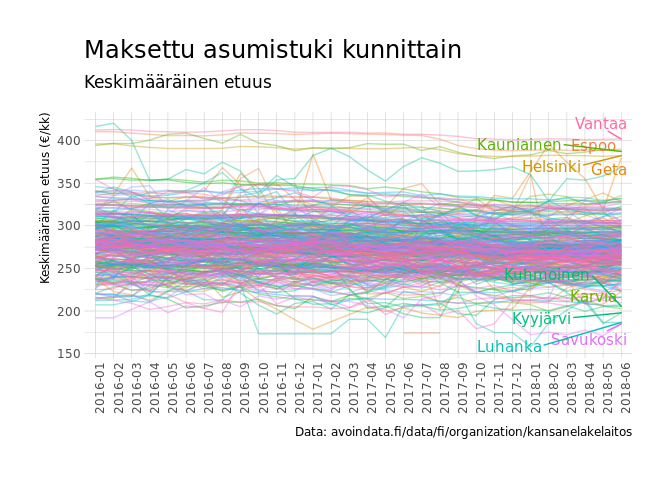
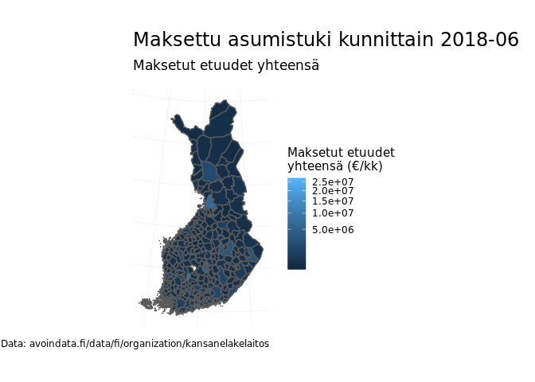
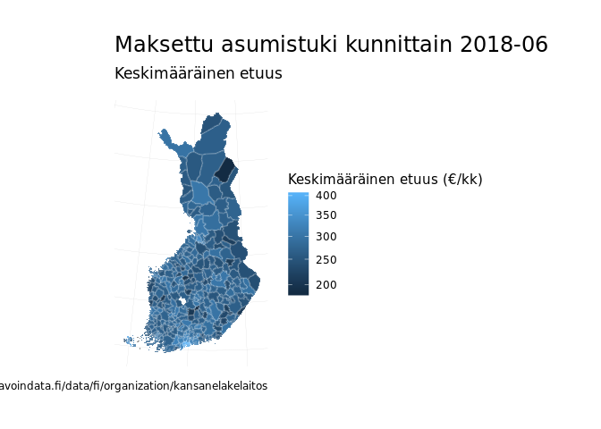

Esimerkissä lataamme datan avoindata.fi-palvelusta ja piirrämme datasta neljä kuvaa Datan lataaminen

``` r
library(dplyr)
```

    ## 
    ## Attaching package: 'dplyr'

    ## The following objects are masked from 'package:stats':
    ## 
    ##     filter, lag

    ## The following object is masked from '.env':
    ## 
    ##     n

    ## The following objects are masked from 'package:base':
    ## 
    ##     intersect, setdiff, setequal, union

``` r
library(ggplot2)
library(hrbrthemes)
```

    ## NOTE: Either Arial Narrow or Roboto Condensed fonts are required to use these themes.

    ##       Please use hrbrthemes::import_roboto_condensed() to install Roboto Condensed and

    ##       if Arial Narrow is not on your system, please see http://bit.ly/arialnarrow

``` r
library(kelagis)
path <- tempfile()
download.file("https://beta.avoindata.fi/data/dataset/03eef338-78df-4ad5-aa18-94c1cb93915b/resource/316d76fc-76c8-42e7-b1f6-a9f51acab23e/download/asumistuki_kunnittain_avoindatafi.xlsx",
              mode = "wb",
              path)
d <- readxl::read_excel(path = path) %>% 
  mutate(saajat = as.numeric(saajat),
         summa = as.numeric(summa),
         persaaja = as.numeric(persaaja))
```

Aineiston kuusi ensimmäistä riviä näyttävät tältä:

``` r
head(d)
```

    ## # A tibble: 6 x 7
    ##   kuukausi etuus              saajat  summa persaaja kuntanumero kuntanimi
    ##   <chr>    <chr>               <dbl>  <dbl>    <dbl>       <dbl> <chr>    
    ## 1 2018-06  Yleinen asumistuki    217 67266.     293.           5 Alajärvi 
    ## 2 2018-05  Yleinen asumistuki    226 70797.     298.           5 Alajärvi 
    ## 3 2018-04  Yleinen asumistuki    219 71972.     306.           5 Alajärvi 
    ## 4 2018-03  Yleinen asumistuki    222 70490.     304.           5 Alajärvi 
    ## 5 2018-02  Yleinen asumistuki    225 72230.     303.           5 Alajärvi 
    ## 6 2018-01  Yleinen asumistuki    214 70940      306.           5 Alajärvi

**Aikasarjakuviot asumistuen käytöstä**

``` r
p <- ggplot(d, aes(x = kuukausi, y = summa, group = kuntanimi, color = kuntanimi)) + 
  geom_line(alpha = .4) + hrbrthemes::theme_ipsum_ps() + 
  ggrepel::geom_text_repel(data = d %>% 
                             filter(kuukausi == "2018-06") %>% 
                             arrange(desc(summa)) %>% 
                             slice(1:10),
                           aes(label = kuntanimi), family = "IBMPlexSans") +
  theme(legend.position = "none",
        axis.text.x = element_text(angle = 90)) +
  labs(title = "Maksettu asumistuki kunnittain",
       subtitle = "Maksetut etuudet yhteensä",
       x = NULL, y = "Maksetut etuudet yhteensä €/kk",
       caption = "Data: avoindata.fi/data/fi/organization/kansanelakelaitos")
p
```

    ## Warning: Removed 123 rows containing missing values (geom_path).


``` r
p <- ggplot(d, aes(x = kuukausi, y = persaaja, group = kuntanimi, color = kuntanimi)) + 
  geom_line(alpha = .4) + hrbrthemes::theme_ipsum_ps() + 
  ggrepel::geom_text_repel(data = bind_rows(d %>% 
                                              filter(kuukausi == "2018-06") %>% 
                                              arrange(desc(persaaja)) %>% slice(1:5),
                                            d %>% 
                                              filter(kuukausi == "2018-06") %>% 
                                              arrange(persaaja) %>% slice(1:5)),
                           aes(label = kuntanimi), family = "IBMPlexSans") +
  theme(legend.position = "none",
        axis.text.x = element_text(angle = 90)) +
  labs(title = "Maksettu asumistuki kunnittain", 
       subtitle = "Keskimääräinen etuus",
       x = NULL, y = "Keskimääräinen etuus (€/kk)",
       caption = "Data: avoindata.fi/data/fi/organization/kansanelakelaitos")
p
```

    ## Warning: Removed 123 rows containing missing values (geom_path).



**Kartat**

``` r
kartta <- kelagis::get_geo(year = 2017, level = "kunta") %>% 
  # Yhdistetään asumistukidata
  right_join(., d, by = c("NATCODE" = "kuntanumero")) 
```

    ## Loading required package: stringr

    ## Linking to GEOS 3.5.1, GDAL 2.2.2, PROJ 4.9.2

``` r
p <- ggplot(data = kartta %>% filter(kuukausi == "2018-06")) + 
  geom_sf(aes(fill = summa)) +
  scale_fill_gradient(trans = "sqrt") +
  hrbrthemes::theme_ipsum_ps() + 
  theme(axis.text = element_blank()) +
  labs(title = "Maksettu asumistuki kunnittain 2018-06",
       subtitle = "Maksetut etuudet yhteensä",
       fill = "Maksetut etuudet \nyhteensä (€/kk)",
       caption = "Data: avoindata.fi/data/fi/organization/kansanelakelaitos")
p
```



``` r
p <- ggplot(data = kartta %>% filter(kuukausi == "2018-06")) + 
  geom_sf(aes(fill = persaaja), color = alpha("white", .2)) +
  scale_fill_gradient(trans = "sqrt") + 
  hrbrthemes::theme_ipsum_ps() + 
  theme(axis.text = element_blank()) +
  labs(title = "Maksettu asumistuki kunnittain 2018-06",
       subtitle = "Keskimääräinen etuus",
       fill = "Keskimääräinen etuus (€/kk)",
       caption = "Data: avoindata.fi/data/fi/organization/kansanelakelaitos")
p
```


